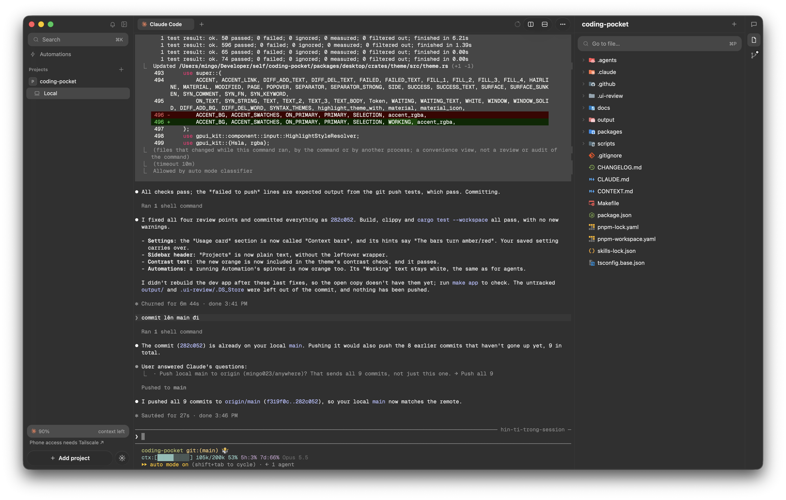

# Anywhere

Watch and drive coding agents running on your Mac, from the desktop app and your phone.



- Run `claude` and `codex` in real terminals, grouped by project and git worktree
- See which sessions are working, need you or are done, from the sidebar, inbox, Dock badge and notifications
- Review changes, browse files and preview diffs beside the terminal
- Create worktrees from a branch or PR, and schedule agent runs with automations

## Install

Download [Anywhere.dmg](https://github.com/mingo023/anywhere/releases/latest/download/Anywhere.dmg) and drag Anywhere to Applications. Needs macOS 13 or later; updates install through Sparkle.

## Build

```sh
make app        # Anywhere Dev.app, side by side with the release app
make run        # release build of the desktop app, run in place
```

`packages/desktop` is the Rust/GPUI app, `packages/pocketd` the Go daemon that owns the terminals. `scripts/release-mac.sh <version>` builds the signed, notarized DMG; pushing a `v*` tag publishes it ([ADR 0004](docs/adr/0004-release-and-updates.md)).
