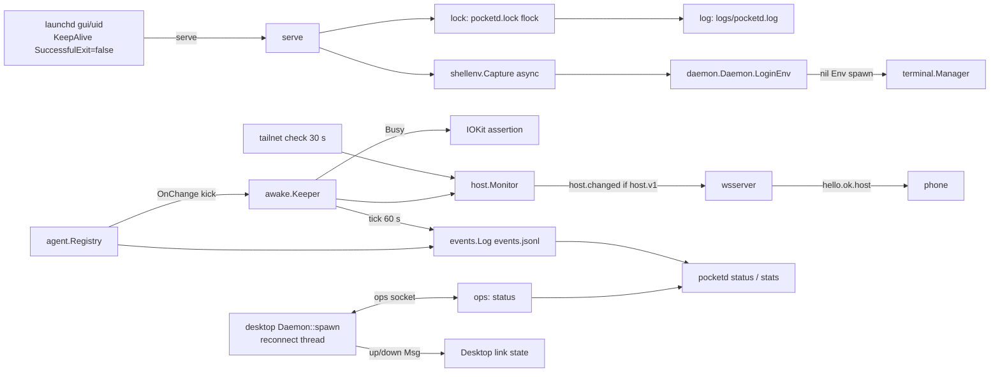

# Design: E04 always-on (M1, M)

Date: 2026-09-30. Base: main `f8f7293`. Cites `P path:L` at that commit; `pd` = `packages/pocketd`, `pk` = `packages/desktop/crates/pocket/src`, `d` = `packages/desktop/crates`.
Sources: PRD FR 04-1..04-5, §9, NFR S-4/S-5/P-3/P-7; 05-roadmap §3 E04, §4, §7; UXD §3.2, §3.14, copy table; research R02 (02-7, 02-8), R10 (10-6), R15 (15-7), R19 (19-3, 19-4, F4, F5).

> **Review needed.** No owner interview took place. Every entry in the Decisions log is **PO-decided — review**.

> **Rebase note (dark theme).** The owner's plan `docs/plans/2026-09-30-dark-theme.md` touches these PR4 files: `pk/main.rs` (WindowOptions, `Root::new`), `pk/desktop.rs` (`Desktop::new` `_subs` gains `observe_window_appearance`; new `set_appearance`), `pk/desktop/chrome.rs`, `pk/terminal_view/pane.rs` (:107, :149), `pk/terminal_view.rs`. If dark lands first, make these mechanical changes to PR4 code: `rgba(theme::X)` → `theme::X` (plan's perl `s/\brgba\(([A-Z][A-Z0-9_]*)\)/$1/g`), and any new `u32` colour parameter → `Token`. `d/daemon` and all of pocketd are untouched by the theme work. PR1–PR3 need no rebase.

## 1. Problem

- pocketd runs only when someone types `pocketd serve` (the owner runs `pd/bin/pocketd serve`; verified in `ps`). If the Mac reboots, the process crashes, or the terminal closes, the host is gone and the phone has nothing to reach.
- Without a lock, two instances can run. `ops.Listen` removes the socket unconditionally (P pd/internal/ops/ops.go:71), so a second `serve` takes over the first one's socket.
- Under launchd the env is minimal. A spawn with nil Env inherits `os.Environ()` (P pd/internal/daemon/daemon.go:36-37), so `claude`/`codex` in `~/.local/bin` are not found (LookPath P pd/internal/terminal/terminal.go:87-101). Verified: under the owner's fish login shell they resolve to `~/.local/bin`; under a bare env they do not.
- An idle Mac sleeps while a codex turn runs or an Agent waits on Needs you. Claude already runs `caffeinate -i -t 300` during turns (verified: `ps` parent `~/.local/bin/claude`). Codex does not, and nothing covers Needs you.
- Nothing is recorded, so none of the PRD §9 metrics can be computed.
- The desktop exits if pocketd is down at launch (P pk/main.rs:28-31). If pocketd dies later, the reader thread emits one `"pocketd disconnected"` error and the desktop never recovers (P d/daemon/src/daemon.rs:172-186).

## 2. Scope and non-goals

In scope: FR 04-1 (`daemon install|uninstall`, `--version`, `status`, flock, rotating log); 04-2 (login-shell env); 04-3 (idle-sleep assertion, host state, cap `host.v1`); 04-4 (`events.jsonl`, `stats`); 04-5 (desktop reconnect).

Non-goals:
- SMAppService, signed bundle, updater (19-1, 19-2, 19-8); poll → events (S8); clamshell guidance (a closed lid sleeps the Mac; known limit).
- Rendering the host line: built in E16 PR5 from `hello.ok.host`.
- A keep-awake toggle.
- An on-disk conversation journal (D27, settled): restore rebuilds from provider files.
- Emitters for event kinds whose features are not built yet. Each owning epic adds them (§6).
- Binding and PTY trust. E02 PR2 and E03 PR3 ship them; PR1 depends on both.

## 3. UX

§7.1 override, copied verbatim:

| UX section | Spec says | Winning decision | Text to build |
|---|---|---|---|
| UXD §7 constraint 1 | tokens (Phase 1, incl. dark) before everything | D26 | E16 PR1 (light `Palette`) lands before E08 PR1 and every later desktop component. E01 and E04 PR4 predate it and use the existing constants. Dark waits for S1 |

The owner's dark-theme plan supersedes "Dark waits for S1". PR4 still uses existing constants; see the Rebase note.

Desktop main area while pocketd is unreachable (UXD §3.14; copy table "Reconnect"). The page is centred and uses the `blank_page` style (P pk/desktop.rs, `rgba(TEXT_3)`):

```
┌ sidebar (unchanged) ┐┌──────────────────────────────────────────┐
│                     ││                                          │
│                     ││   Starting Pocket's terminal service…    │
│                     ││   Not running? In Terminal:              │  ← after 10 s
│                     ││   pocketd daemon install                 │
└─────────────────────┘└──────────────────────────────────────────┘
```

- Line 1 is UXD copy. Lines 2–3 are new copy (PO-decided). They appear after 10 s down; mono for the command.
- After reconnect, panes whose Terminal survived re-attach and show "Connecting…" until the first screen. Vanished Terminals show "This session is not running." (existing copy, P pk/terminal_view/pane.rs:81-95).
- Host line, UXD §3.2 (for E16 PR5, fed by this epic): "Keeping Mac awake" while `keepingAwake`; "Phone access needs Tailscale" + docs link while `!tailnet`; Tailscale line first; hidden when neither.

CLI copy (new, PO-decided, adapted from R19 M3 and MonoCode):
- Second instance: `pocketd is already running (pid {pid}) on {home}. Stop it first, or use it.` exit 75.
- install ok: `Installed. pocketd starts at login and restarts if it crashes. Logs: {home}/logs/pocketd.log`.
- install while a foreground pocketd runs: `Installed. The service takes over when the running pocketd (pid {pid}) exits.`
- install when already loaded: `Updated {plist}. Applies at the next restart.`
- uninstall ok: `The host is stopped and will not start automatically.` / `Sessions, logs and device credentials are kept in {home}. Delete that directory only if you want to erase them.`
- uninstall with Terminals: `{n} Terminals are running and will close. Run again with --force.` exit 1.

## 4. Architecture



Packages (all new except where noted):
- `pd/internal/lock`: `Acquire(home) (*Lock, error)`: flock `LOCK_EX|LOCK_NB` on `pocketd.lock`, then truncate and write the pid. On contention it reads the pid and returns `ErrRunning{PID}`.
- `pd/internal/logfile`: an `io.Writer` that renames to `.old` at 5 MiB. `serve` points `log.SetOutput` at it.
- `pd/internal/launchagent`: `Plist(Spec) []byte` (pure), `Install`, `Uninstall`, `Loaded`. Wraps `launchctl print/bootstrap/bootout gui/<uid>`. Verified: `print` of an unloaded label exits 113, a safe probe.
- `pd/internal/shellenv`: `Capture(ctx, shell) (Result, error)`, plus the pure `Parse(out, nonce) ([]string, error)`.
- `pd/internal/awake`: `Sleeper` interface. The IOKit implementation is behind `//go:build darwin && cgo`. `Keeper` drives it.
- `pd/internal/host`: `Monitor` holding `proto.HostState`, with `Subscribe`. Pure `Tailnet(addrs []net.Addr) bool`.
- `pd/internal/events`: `Log` (append, rotate), `Event` schema, and pure `Stats(r io.Reader, since time.Time) Report`.
- Changed: `pd/cmd/pocketd` (main switch, `serve.go`; new `daemon.go`, `status.go`, `stats.go`), `pd/internal/{agent,daemon,ops,wsserver,proto}`, `packages/protocol`, `d/daemon`, `pk/{main,desktop,terminals}.rs`.

Serve order: lock → log → config → listeners (TCP after E02 PR2's bind rules) → `ops.Listen` (its socket `Remove` is now safe under the lock) → `shellenv` async → keeper → host monitor → events `start`.

Keep-awake:
- `Registry.OnChange` fires inside `update()` while holding `a.mu` (P pd/internal/agent/agent.go:188-205). Calling `List()` there would deadlock, so the callback only does a non-blocking send on a buffered-1 `kick` channel.
- The keeper goroutine calls `Busy(reg.List())`: any Agent in `working` or `needs_you`.
- Busy → acquire now. Not busy → release after a 2 min linger; a new busy cancels it. No new poll (P-7).

Login env:
- Run `<pw_shell> -l -i -c '/usr/bin/printf "%s" B<nonce>; /usr/bin/env -0; /usr/bin/printf "%s" E<nonce>'`, stdin `/dev/null`, own pgid, 5 s limit (kill the group). Split the bytes between sentinels on NUL; drop `PWD OLDPWD SHLVL _`.
- If `-l -i` fails (timeout, no sentinel, non-zero exit with no sentinel), retry once with `-l -c`. If both fail, keep `os.Environ()`, log the error, and report it in `status`.
- The result lives in memory only (S-5); it is never logged.
- Verified locally, launchd-like env (`env -i HOME USER PATH=/usr/bin:/bin:/usr/sbin:/sbin SHELL`): `env -0` must run standalone ("cannot specify command with -0"); zsh `-l -i -c` 16 vars 0.49 s, `-l -c` 10 vars and misses `.zshrc` PATH; fish `-l -i -c` 25 vars 1.34 s, `-l -c` 22 vars; no noise before the sentinel.
- Shell comes from `getpwuid` through cgo, mirroring P d/daemon/src/daemon.rs:66-73. Fall back to `/bin/zsh`.

Desktop reconnect:
- `Daemon::spawn(path)` returns at once. A thread loops: connect → `Msg{ev:"up"}` → read lines → on EOF or error `Msg{ev:"down"}` → sleep with backoff (200 ms × 2, cap 2 s; reset on up) → connect again.
- Retries run off the UI thread (P-3). Writer is `Arc<Mutex<Option<UnixStream>>>`; `send` returns `false` when `None` or the write fails.
- On `up`, `pk/main.rs` sends `list` at once. `Terminals::reconnected()` clears `Session.term` for every session, so `sync` re-issues `attach` for each listed id (P pk/terminals.rs:88-95).
- `send_spawn` records an intent only if `send` returned true.
- The agents WS already retries every 2 s (P d/agents/src/agents.rs:226-238), and alerts re-send view on `Connected` (P pk/desktop/alerts.rs:64).

## 5. Contract

### CLI (pocketd)

```
pocketd serve                     # unchanged verb; now takes the lock, logs to file
pocketd --version                 # "pocketd {version}" ; exit 0
pocketd status [--json]           # via ops `status`; exit 0 up, 3 not running
pocketd daemon install            # write plist, bootstrap if not loaded
pocketd daemon uninstall [--force]
pocketd stats [--since 7d] [--json]
```

Usage string (P pd/cmd/pocketd/main.go:10) becomes `usage: pocketd serve | run <cmd> [args...] | attach <id> | hook | status | stats | daemon install|uninstall | --version`.

Exit codes: `0` ok; `1` error (`pocketd: <err>`, unchanged); `2` usage; `3` status: not running; `75` lock held (EX_TEMPFAIL; launchd retries after `ThrottleInterval`, so the service takes over when a foreground instance quits).

Install refusals (exit 1): exe under the go-build cache or `$TMPDIR`; `POCKET_HOME` or `POCKETD_SOCK` set to a non-default value; run inside a Pocket Terminal (E03 PR3 ancestry check).

Version: `-ldflags "-X main.version=…"`, else `debug.ReadBuildInfo` `vcs.revision[:12]` plus `-dirty` when `vcs.modified`, else `dev`.

### Files created

| Path | Mode | Writer | Content |
|---|---|---|---|
| `$POCKET_HOME/pocketd.lock` | 0600 | serve | pid, decimal + `\n`; flock held for life |
| `$POCKET_HOME/logs/pocketd.log` (+ `.old`) | 0600 | serve | `log` output; 5 MiB rotate |
| `$POCKET_HOME/logs/launchd.log` | 0600 | launchd | stdout/stderr (panics); append |
| `$POCKET_HOME/events.jsonl` (+ `.1`, `.2`) | 0600 | serve | §6 schema; 10 MiB × 3 |
| `~/Library/LaunchAgents/dev.mingo.anywhere.pocketd.plist` | 0644 | install | atomic temp + rename |

`logs/` is 0700.

Plist keys (golden `pd/internal/launchagent/testdata/pocketd.plist`): `Label` `dev.mingo.anywhere.pocketd`; `ProgramArguments` [`filepath.EvalSymlinks(os.Executable())`, `serve`]; `RunAtLoad` true; `KeepAlive` `{SuccessfulExit: false}`; `ThrottleInterval` 30; `ProcessType` `Interactive`; `StandardOutPath`/`StandardErrorPath` `~/.coding-pocket/logs/launchd.log`; no `EnvironmentVariables`.

### Go

```go
// pd/internal/lock
type Lock struct{ f *os.File }
type ErrRunning struct{ PID int; Home string }
func Acquire(home string) (*Lock, error)
func (l *Lock) Close() error
func Holder(home string) (pid int, ok bool)

// pd/internal/logfile
func Open(path string, max int64) (*File, error) // File implements io.Writer, io.Closer

// pd/internal/launchagent
const Label = "dev.mingo.anywhere.pocketd"
type Spec struct{ Exe, LogPath string }
func Plist(s Spec) []byte
func Path(home string) string
func Loaded(uid int) (bool, error)
func Install(s Spec) (loaded bool, err error)
func Uninstall(uid int) error

// pd/internal/shellenv
type Result struct{ Env []string; Mode string /* "interactive"|"login"|"inherited" */; Took time.Duration; Err string }
func Capture(ctx context.Context, shell string) Result
func Parse(out []byte, nonce string) ([]string, error)
func LoginShell() string

// pd/internal/daemon (changed)
func (d *Daemon) LoginEnv() []string        // captured env, or os.Environ() until/if capture fails
// Spawn: spec.Env == nil → d.LoginEnv() (was os.Environ()), then d.Env(...) as today

// pd/internal/agent (changed)
type Registry struct{ /* … */ OnChange func() }  // called under a.mu; must not block or call back
func Busy(list []proto.Agent) bool

// pd/internal/awake
type Sleeper interface{ Hold(reason string) error; Release() error }
func NewIOKit() Sleeper                     // darwin && cgo; IOPMAssertionCreateWithName(kIOPMAssertPreventUserIdleSystemSleep)
type Keeper struct{ S Sleeper; Linger time.Duration; Now func() time.Time; OnHeld func(bool) }
func (k *Keeper) Run(ctx context.Context, kick <-chan struct{}, list func() []proto.Agent)

// pd/internal/host
type Monitor struct{ /* mu, state proto.HostState, hub */ }
func NewMonitor() *Monitor
func (m *Monitor) State() proto.HostState
func (m *Monitor) Set(f func(*proto.HostState))  // publishes host.changed only on change
func (m *Monitor) Subscribe() (<-chan []byte, func())
func Tailnet(addrs []net.Addr) bool                // 100.64.0.0/10 or fd7a:115c:a1e0::/48

// pd/internal/proto (changed)
const CapHost = "host.v1"
type HostState struct{ Tailnet bool `json:"tailnet"`; KeepingAwake bool `json:"keepingAwake"` }
// HelloOK gains: Host *HostState `json:"host,omitempty"` — set only when host.v1 negotiated
type HostChanged struct{ Type string `json:"type"` /* "host.changed" */; Host HostState `json:"host"` }
func NewHostChanged(h HostState) HostChanged

// pd/internal/events
type Event struct{ TS time.Time `json:"ts"`; Kind string `json:"kind"`; /* §6 fields, omitempty */ }
type Log struct{ /* mu, f, size */ }
func Open(home string) (*Log, error)
func (l *Log) Emit(e Event)                        // never blocks the caller on disk errors; logs once
func Stats(r io.Reader, since time.Time) Report
func (r Report) Text() string

// pd/internal/ops (changed)
// op "status" → {"ev":"status","status":{…}}; Msg gains `Status *Status json:"status,omitempty"`
type Status struct{ PID int; Version, Home, Sock, Log string; Uptime int64 /* s */; Listen []string;
  Terminals int; Agents map[string]int; KeepingAwake, Tailnet bool; ShellEnv string; Service string /* "loaded"|"installed"|"none" */ }
```

`wsserver.Server` gains `Host *host.Monitor` and `Caps`. When `host.v1` is in the negotiated caps (E02 PR1 `hello.caps` ∩ server caps → `hello.ok.caps`), it sets `HelloOK.Host` and subscribes to `Host.Subscribe` before sending `hello.ok`, in the same order as the hub (P pd/internal/wsserver/wsserver.go:128-143). Clients without the cap never see `host` or `host.changed`.

### TypeScript (`packages/protocol/src/messages.ts`)

```ts
export const CAP_HOST = "host.v1";
export const HostState = Schema.Struct({ tailnet: Schema.Boolean, keepingAwake: Schema.Boolean });
// HelloOk gains: host: Schema.optional(HostState)
export const HostChanged = Schema.Struct({ type: Schema.Literal("host.changed"), host: HostState });
// ServerMessage union += HostChanged
```

`PROTOCOL_VERSION` stays 3 (additive, cap-gated). Goldens `server/hello_ok_host.json`, `server/host_changed.json` live in `pd/internal/proto/testdata/golden` and are read by `packages/protocol/test/golden.test.mjs`.

### Rust (`d/daemon`)

```rust
pub fn spawn(path: &Path) -> (Daemon, UnboundedReceiver<Msg>)   // replaces connect; never fails
impl Daemon { pub fn send(&self, v: &Value) -> bool; pub fn input(&self, id: &str, data: &[u8]) -> bool }
// synthetic Msg { ev: "up" } after each connect; Msg { ev: "down" } on loss; "pocketd disconnected" error removed
```

`pk/terminals.rs`: `pub fn reconnected(&mut self)`. `pk` state (per ADR 0003, in a state struct and not a bare `Desktop` field): `Link { up: bool, down_since: Option<Instant> }`.

### Scope matrix (NFR S-9)

| Surface | Verb | Scope | PTY peer |
|---|---|---|---|
| ops | `status` | observe | allowed |
| ws | `hello.ok.host`, `host.changed` | any authenticated client with `host.v1` | n/a |

`stats` reads the file directly, with no ops verb. `daemon install|uninstall` are local CLI only; `install` refuses inside a Pocket Terminal.

### Config keys

None. Label, linger (2 min), rotate sizes, tick (60 s), tailnet re-check (30 s) and backoff are constants. `POCKET_HOME` and `POCKETD_SOCK` keep their meaning (P pd/internal/config/config.go:14-27).

## 6. Data and state

`events.jsonl`: one object per line, `ts` RFC 3339 ms UTC. No titles, prompts, argv, env, paths or conversation text (S-5). Ids are opaque.

| kind | fields | emitter (epic) |
|---|---|---|
| `start` | `version`, `pid`, `service` (bool) | serve (E04 PR3) |
| `stop` | `reason` (`signal`, `error`) | serve (E04 PR3) |
| `tick` | — (every 60 s while `keepingAwake`) | keeper (E04 PR3) |
| `status` | `agent`, `provider`, `from`, `to` | registry `update` (E04 PR3) |
| `seen` | `agent`, `principal` | agent.seen/view (E04 PR3) |
| `answer` | `agent`, `principal`, `decision` | permission resolve (E04 PR3; principal detail E03) |
| `prompt` | `agent`, `provider`, `origin`, `ack` (`ok`, error code) | E06 |
| `create` | `origin`, `provider`, `ok`, `code` | E06 |
| `restore` | `agent`, `ok`, `ms` | E11 |
| `push` | `agent`, `kind`, `acted` | E09 |
| `refusal` | `surface`, `code` | E03 |

`Stats` (§9): Needs you → answer p50/p90 by principal (`status to=needs_you` to the next `answer`/`status` leaving it); Done → Seen p50; restore ≤30 s rate; create failures by origin × code; `ack` errors per 100 prompts by provider; push precision (`acted`/sent); refusals by surface × code; timeline use ("n/a" until its epic emits); reachability = minutes unreachable while an Agent was Working (a `tick` gap over 90 s, or `stop`→`start` while the last status was `working`). Kinds with no rows print `—`.

In-memory only: `shellenv.Result` (Daemon), `HostState` (Monitor), keeper `held` + linger timer, desktop `Link`. The lock pid and events are the only new persisted state.

## 7. Failure modes

| Failure | Behaviour |
|---|---|
| Second `serve` (manual or launchd) | Lock contention → message + exit 75. Socket untouched. launchd retries every 30 s |
| Stale lock file after kill -9 | flock is released by the kernel on exit; the file's pid is rewritten by the next holder |
| pocketd crashes | launchd restarts (non-zero exit). Every PTY dies with it (R19 F5); desktop shows reconnect, then "This session is not running." per pane |
| Clean exit 0 (SIGTERM) | launchd does not restart (SuccessfulExit=false). `uninstall` boots out; a manual `kill` leaves it stopped until next login. Logged as `stop reason=signal` |
| install from a `go run` binary | Refused (exe under go-build/TMPDIR) |
| install while service loaded | Plist rewritten; never bootout or kill; applies next restart |
| Logout | gui/<uid> domain ends; all Terminals close. Known limit, noted in `status` help |
| Login shell hangs or prompts | 5 s limit, group killed, fall back `-l -c`, then inherited env; `status` shows `shellenv: inherited (timeout)` |
| rc prints noise | Ignored outside the nonce sentinels |
| LookPath fails on nil-Env spawn | One re-capture, retry once; then the existing spawn error |
| IOKit call fails | Logged; `keepingAwake` stays false (truthful); retried on next kick |
| Non-cgo build | `awake` falls back to a no-op Sleeper; `keepingAwake` false |
| events disk full / write error | Logged once; serving continues; `stats` notes a truncated file |
| Corrupt events line | `Stats` skips it and counts `skipped` |
| Desktop starts before pocketd | Window opens; reconnect page; attaches when up |
| pocketd restarts under the desktop | `down` → page; `up` → `list` → re-attach survivors |
| send while down | `send` false; spawn intent not recorded; UI unchanged |

## 8. Test strategy

Tests sit beside the code, named as sentences. No mocks: fakes implement the real interfaces. No render tests.

pocketd (`cd packages/pocketd && go vet ./... && go test -race -count=1 ./...`; goldens `go test ./internal/proto -update`):
- `lock`: `TestSecondAcquireReportsTheHolderPid`, `TestLockIsFreeAfterTheHolderCloses`. `logfile`: `TestWriterRotatesToOldPastTheLimit`.
- `launchagent`: `TestPlistMatchesGolden`, `TestPlistCarriesNoEnvironment`. `Install`/`Uninstall` never run in tests (they would touch the owner's launchd).
- `shellenv`: `TestParseKeepsMultilineValues`, `TestParseIgnoresNoiseOutsideSentinels`, `TestParseRejectsAMissingEndSentinel`, `TestCaptureGivesUpAfterTheLimit` (rc runs `sleep 10`), and `TestZshLoginEnvIncludesRcPath` / `TestFishLoginEnvIncludesConfigPath`: fixture `HOME` with `.zprofile`/`.zshrc` and `.config/fish/config.fish` that echo noise and export a multiline var and a PATH entry; run with a launchd-like `env -i`; skipped when the shell is absent.
- `agent`: `TestOnChangeFiresOnEveryStatusChange`; `TestBusyCountsWorkingAndNeedsYou`.
- `awake` (fake `Sleeper` recording calls, fake clock): `TestKeeperHoldsWhileAnAgentIsWorking`, `TestKeeperReleasesAfterTheLinger`, `TestKeeperKeepsHoldingWhenWorkResumesWithinTheLinger`.
- `host`: `TestTailnetMatchesCgnatAndTailscaleUla`; `TestSetPublishesOnlyOnChange`.
- `wsserver`: `TestHelloOkCarriesHostOnlyWithTheCap`; `TestHostChangedReachesOnlyCapClients`.
- `proto`: goldens `hello_ok_host`, `host_changed`.
- `events`: `TestEventSchemaMatchesGolden` (one line per kind), `TestStatsOnFixture` (`testdata/events.jsonl` → `testdata/stats.txt`), `TestLogRotatesAtTenMiB`, `TestEventsFileIs0600`.
- `e2e` (scratch pocketd from the harness, P pd/e2e/harness_test.go: `/tmp/pk*` home, own `POCKET_HOME`/`POCKETD_SOCK`/port): `TestSecondServeExitsWithTheRunningPid`, `TestStatusReportsTerminalsAndVersion`, `TestVersionPrintsWithoutAHome`, `TestStatusExitsThreeWhenNotRunning`.

Protocol: `pnpm --filter @pocket/protocol test` decodes the two new goldens and checks that `hello.ok` without `host` still decodes.

Desktop (`cargo build --workspace && cargo clippy --workspace --all-targets && cargo test --workspace`):
- `d/daemon`: `spawn_reports_down_then_up_when_the_socket_appears` (temp UnixListener bound after spawn), `spawn_reports_down_when_the_server_closes`, `send_returns_false_while_down`.
- `pk/terminals`: `reconnected_reattaches_every_listed_terminal`, `a_terminal_missing_after_reconnect_is_not_running`, `failed_spawn_send_records_no_intent`.
- Manual acceptance (FR 04-5), owner only (agents never run the app): kill pocketd, the window stays; restart it, Terminals return or show "not running".

## 9. PR slicing (roadmap E04; binding deps from §4)

| # | Title | FR | Lane, wk | Depends on |
|---|---|---|---|---|
| 1 | pocketd LaunchAgent: `daemon install/uninstall`, `--version`, `status`, flock, rotating log | 04-1 | P, wk 3 | E02 PR2, E03 PR3 |
| 2 | Login-shell env, idle-sleep assertion, `host.v1` host state | 04-2, 04-3 | P, wk 2 | — |
| 3 | `events.jsonl` and `pocketd stats` | 04-4 | P, wk 3 | — |
| 4 | Desktop survives pocketd restarts: reconnect and re-attach | 04-5 | C, wk 1 | — |

- PR1 must not merge before E02 PR2 (bind rules) and E03 PR3 (PTY trust). A LaunchAgent must never start a pocketd that binds 0.0.0.0 or trusts PTY peers.
- Downstream: E06 PR2 and E16 PR5 need PR2; E09 PR5 needs PR4; E10 and E11 need PR1.
- If PR3 lands before PR1, it emits `service:false` in `start`, and PR1 flips it.
- If E02 PR2 has merged when PR2 starts, PR2 reuses its tailnet function. Otherwise PR2 adds `host.Tailnet` and E02 reuses it.

## 10. Decisions log (each PO-decided — review)

1. **IOPM through cgo IOKit** (`IOPMAssertionCreateWithName`, `kIOPMAssertPreventUserIdleSystemSleep`). Verified on go1.27.1 darwin/arm64: `pmset -g assertions` listed the named assertion, and release worked. pocketd already links C (P pd/internal/vt/vt.go:3-6). The assertion dies with the process. Rejected: `caffeinate -i -w <pid>` needs a supervised child, and a killed child drops the assertion silently, which would make `keepingAwake` untruthful.
2. **Hold only while Working or Needs you, 2 min linger.** Rejected: no linger (the Mac sleeps as Done arrives, before the phone push is acted on); hold while a phone is connected (PRD narrowed the scope); a user toggle (wait for S1).
3. **Keeper triggered by `Registry.OnChange` → buffered-1 kick.** Rejected: calling `List()` from the callback (deadlock under `a.mu`); a periodic poll (P-7).
4. **Login env via `-l -i -c` + nonce sentinels + standalone `env -0`, fallback `-l -c`, then inherited.** Rejected: `printenv` (MonoCode 10-6; ambiguous with multiline values); `-l -c` first (misses `.zshrc` PATH, verified); caching the env on disk (S-5).
5. **Capture once at startup, async; re-capture once on a LookPath miss.** Rejected: capture per spawn (0.5–1.3 s each, verified); never re-capture (a newly installed CLI stays unreachable until restart).
6. **Lock `$POCKET_HOME/pocketd.lock`, non-blocking, exit 75.** Rejected: a blocking wait (launchd shows it as running while it serves nothing); a pid file without flock (stale after kill -9); zeron's 40×25 ms retry (not needed for a single long-lived process).
7. **Label `dev.mingo.anywhere.pocketd`, gui/<uid> domain, KeepAlive `SuccessfulExit=false`, ThrottleInterval 30, ProcessType Interactive.** Rejected: KeepAlive true (a clean stop could never be made); the default ProcessType (launchd throttles CPU and I/O for PTYs, `man launchd.plist`); the system domain (needs root and has no user env).
8. **install never boots out or kills a running pocketd; the service takes over when the foreground one exits.** Rejected: bootout-and-reload on update (kills every Terminal, R19 F5).
9. **Refuse install from temp or go-build binaries, from non-default homes, and from inside a Pocket Terminal.** Rejected: allowing them (a plist pointing at a deleted binary respawns every 30 s forever).
10. **uninstall refuses with live Terminals unless `--force`.** Rejected: silent kill.
11. **Log to `logs/pocketd.log`, `.old` rotation at 5 MiB; launchd stdout and stderr to `logs/launchd.log`.** Rejected: launchd paths only (no rotation); os/log (not `tail`-able as the R19 copy expects).
12. **`status` as an ops verb, scope observe, PTY peers allowed.** Rejected: reading files directly (can't report live terminals or keep-awake).
13. **`host.v1` is additive on `hello.ok` plus `host.changed`; the protocol version stays 3.** Rejected: a separate `host.get` request (an extra round trip, and it still needs push); bumping the version (breaks older phones).
14. **Tailnet detected from interface addresses, re-checked every 30 s.** Rejected: `tailscale status` exec (slow; CLI may be absent); a route-change watch (more code than value at M1).
15. **Define the whole events schema now; each epic adds its emitters.** Rejected: waiting until every feature exists (the golden would churn, and §9 would stay unmeasurable).
16. **Reachability from 60 s `tick`s while keeping awake.** Rejected: an external prober (nothing runs while pocketd is down).
17. **Rotate events at 10 MiB × 3** (PRD). Rejected: daily files (unbounded count).
18. **Desktop `Daemon::spawn` never fails and emits `up`/`down`; backoff 200 ms to a 2 s cap.** Rejected: keep `connect` and wrap it in main (duplicates the reader); an exit plus a launchd-managed desktop (the window would vanish).
19. **Re-attach by clearing terms and re-listing.** Rejected: queueing sends while down (stale input would reach a new PTY).
20. **Hint "Not running? In Terminal: pocketd daemon install" after 10 s.** Rejected: no hint (a user without the service waits forever); auto-running install from the desktop (a hidden side effect; and the label belongs to pocketd).
21. **No config keys.** Rejected: configurable linger and sizes (no request).

## 11. Owner questions

- The launchd label and future bundle id `dev.mingo.anywhere.*` tie the service to the owner's personal namespace. SMAppService (19-1) will need a bundle id under the Apple Developer account. Is `dev.mingo.anywhere` the id to register, or will a different org or team id own it? Changing the label later means a one-time uninstall and reinstall.
