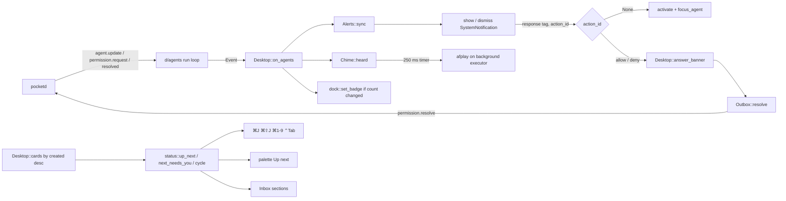

# E08 desktop-attention: technical design

M1 · L (6 d) · lane C · base `main` f8f7293 · roadmap `docs/orchestrators/product/05-roadmap.md` §3 E08.
Paths: `pk` = `packages/desktop/crates/pocket/src`, `d` = `packages/desktop/crates`, `pd` = `packages/pocketd`. `P path:L` = f8f7293.

> **Rebase note (owner's dark theme, `docs/plans/2026-09-30-dark-theme.md`, authoritative).** Colour tokens become `pub const X: Token = Token::new(light, dark)` / `Token::fixed(..)`. `impl From<Token> for Hsla/Fill` removes the `rgba(..)` wrappers. Helpers take `Token`: `dot`, `alert_color -> Option<Token>`, `git_color -> Token`, the rail `badge` closure, `icon(.., impl Into<Hsla>)`. Every E08 colour below is written as a token name; `u32` at f8f7293 means `Token` after that plan.
> - Files both touch: `d/theme/src/theme.rs`, `d/ui/src/ui.rs`, `pk/desktop.rs`, `pk/sidebar.rs`, `pk/sidebar/{sessions,rail,column}.rs`, `pk/palette.rs`, `pk/inbox/{list,detail}.rs`, `pk/modals/confirm.rs`, `pk/terminal_view/tabs.rs`, `pk/desktop/chrome.rs`.
> - Mechanical port: strip `rgba(X)` → `X` (the plan's perl one-liner). Retype `u32` colour params and fields (`ui::Tone`) as `Token`.
> - `SUCCESS`/`SUCCESS_TEXT`/`SUCCESS_BG` (E16 PR1) take the owner's `RUNNING*` values: `Token::fixed(0x30a46cff)`, `Token::new(0x18794eff, 0x3dd68cff)`, `Token::fixed(0x30a46c21)`. If E08 PR1 leaves `RUNNING*` unused, delete them.
> - `ACCENT` stays `0x5b5bd6` in light (the owner keeps the light accent). Working = `ACCENT` per D1.
> - `count_badge` text becomes `ON_SOLID` (UXD §2.2). This overrides the plan's "count_badge keeps WHITE" for light. Dark takes the owner's value for `ON_SOLID`.
> - The rail ring stays the owner's `CUTOUT`. E08 changes only the badge fill.
> - Tests never flip the dark flag; contrast tests use `Token::pick(false)`.
> - E16 PR1's "`Palette` struct + `p(cx)`" yields to the owner's `Token` consts. E08 reads token names only.

## 1. Problem

At the desk the owner can't tell at a glance what Needs you, can't hear it, and can't answer a permission without switching to Pocket.

Today Working is green "Running" (P d/ui/src/ui.rs:235,457); Done is an accent dot (P d/ui/src/ui.rs:239,283). Lists re-sort on every status change (P pk/sidebar/sessions.rs:15, P pk/sidebar/rail.rs:12, P pk/palette.rs:84; `updated_at` sort at P pk/desktop/project.rs:43). Banners carry no actions (P pk/desktop/alerts.rs:86). No Dock badge, no sound. Copy uses avoid-list words: "Workspace", "Mark all read", "Jump to next waiting session", "The repository stays on disk".

## 2. Scope / non-goals

**In** (FR 08-1…08-7): D1 looks + Needs you row; C-tagged copy + avoid-list test; stable `created_at` order; `up_next` + palette Up next; Inbox NEEDS YOU / FAILED / DONE; ⌘J, ⌘⇧J, ⌘1–9 + chips, ⌃Tab / ⌃⇧Tab + keymap uniqueness test; Dock badge; sounds + palette toggles in `desktop.json`; banner Allow / Deny and stop over the Outbox.

**Out:** Settings and dark (S1); notification mute / per-project categories; convergence with pocketd's detector (D21, after M3); longer Allow options (E12); any protocol or pocketd change (§5); `desktop.json` 0600 atomic writes (NFR S-4 / FR 05-1; E08 uses `Store::save`, P d/store/src/store.rs:38-42).

## 3. UX

### 3.1 Spec overrides (roadmap §7.1, verbatim)

| UX section | Spec says | Winning decision | Text to build |
|---|---|---|---|
| UXP §4.2 Up next tie-break | most recently updated first | D39 | Needs you > Failed > Done (not Seen), then oldest transition first |
| UXD §3.12 Inbox sort | sections sorted by (status, newest) | D39 | NEEDS YOU / FAILED / DONE, each oldest transition first |
| UXD §3.13, §6 notifications | Subtitle "{project} · {worktree}" | D30 | No subtitle. Body line 1: "{project} · {worktree}"; line 2: the ask, ≤240 chars. Actions on permission asks only: "Allow" · "Deny and stop" |
| UXD §2.9, §3.10 sound toggles | Settings › Notifications | D25 | Palette actions "Needs you sound: On/Off", "Done sound: On/Off", "Failed sound: On/Off". Persisted in `desktop.json`; default on |
| UXD §5, §6 ⌘J | "Next up" walks Up next | D2, D6, D24 | ⌘J, "Go to next Needs you": Needs you only, oldest transition first, wraps. ⌘⇧J and palette "Go to Up next": the top-ranked Up next item other than the current Session, recomputed per press |
| UXD §5 ⌘1–9 | nth row of the selected worktree, filter applied | D6, D40 | ⌘n = the nth Session in the visible sidebar list after filters, across expanded Worktrees. In Compact, the nth rail item |
| UXD §7 constraint 1 | tokens (Phase 1, incl. dark) before everything | D26 | E16 PR1 (light `Palette`) lands before E08 PR1 and every later desktop component. E01 and E04 PR4 predate it and use the existing constants. Dark waits for S1 |
| UXD §7 constraint 2 | Settings before sounds | D25 | Sounds ship with palette toggles (E08 PR4); Settings is S1 |

The owner's dark plan also overrides UXD §2 on the dark palette, the blur and the unchanged light accent (Rebase note).

### 3.2 Status looks (UXD §2.2, D1)

| Status | Glyph | Label | Bg |
|---|---|---|---|
| Needs you | 7 px dot `WAITING` | "Needs you" `WAITING_TEXT` | `WAITING_BG` |
| Working | spinner 11 `ACCENT` | "Working" `ACCENT` | `ACCENT_TINT` |
| Done | check 11 `SUCCESS` | "Done" `SUCCESS_TEXT` + diffstat | `SUCCESS_BG` |
| Failed | x-bold 11 `FAILED` | "Failed" `FAILED_TEXT` | `FAILED_BG` |
| Idle | none | "Idle" `TEXT_2` (palette, Inbox only) | none |

Sites that change:
- P d/ui/src/ui.rs:234-239 pills, :283 `alert_color`, :308 rail bottom badge → `ACCENT`, :375 `indicator` spinner.
- P d/ui/src/ui.rs:456-458 `status_label`: "Running" → "Working", 7 px dot.
- P d/ui/src/ui.rs:467 git A → `SUCCESS_TEXT`.
- P d/ui/src/ui.rs:599 `count_badge` → `ON_SOLID`.
- P pk/terminal_view/tabs.rs:34-38 tab marks.
- P pk/palette.rs:238-239 leads.
- P pk/inbox/list.rs:81-84 note glyphs.

Shape carries status without colour.

### 3.3 Sessions row, Needs you (UXD §3.3)

```
┌ row 80, r8, px10 py10 gap4 ─────────────────┐
│ ●6 Claude Code                    2m | ⌘1   │ right: age, or jump chip
│ Fix the login redirect loop                 │ title 14/20 SemiBold
│ ⎇12 feat-login                ● Needs you   │ branch · status label (§2.2)
└─────────────────────────────────────────────┘
```

- The row fill is `WAITING_BG`, with hover (`FILL_1`) and selected (`FILL_3`) drawn over it.
- The column header is "{worktree name}" (was "Workspace", P pk/sidebar/column.rs:61). It is the basename of the selected Worktree's path, else the Project name.
- Jump chips "⌘1"…"⌘9" appear after ⌘ has been held alone for 280 ms: h16 px4 r4 `FILL_4`, mono 10 Medium `TEXT_2`.
  - Rows 10+ keep their age.
  - Chips hide when another modifier joins, and never show while an overlay is open.

### 3.4 Palette (UXD §3.11, on E16 PR2's v2)

```
│ Up next                                         11.5 SemiBold TEXT_2 │
│ [●] Fix login redirect     pocket · feat-login · Needs you           │
│ [×] Migrate schema         api · main · Failed                       │
│ Sessions                                                             │
│ [●] Add rate limiter       pocket · main · Claude Code · Working     │
```

- **Up next** (cap 5, `status::up_next`) sits above Sessions (8, newest created), Worktrees (5), Files (8) and Actions.
- **Details** use `Status::label()`, replacing the lowercase `status_word` (P pk/palette.rs:38-46).
- **Actions:**
  - "Go to next Needs you" ⌘J, was "Jump to next waiting session" (P pk/palette.rs:125).
  - "Go to Up next" ⌘⇧J.
  - "Needs you sound: On", "Done sound: On" and "Failed sound: On". Each title shows the current state, and choosing it flips that state.

### 3.5 Inbox (UXD §3.12)

```
Inbox                                  [filter] [Mark all seen]
NEEDS YOU                                                    2
  ...oldest transition first
FAILED                                                       1
DONE                                                         3
```

- "Mark all read" → "Mark all seen" (P pk/inbox/list.rs:34). It marks FAILED and DONE Seen; NEEDS YOU stays (P pk/inbox.rs:59-61 already does this).
- "Answer in the terminal ·" stays (P pk/inbox/detail.rs:51).

### 3.6 Notification, Dock, sounds (UXD §3.13, §2.9, §6)

```
[Pocket]  Fix login redirect                   <- title: session title, else provider name
          pocket · feat-login                  <- body line 1
          Wants to run pnpm test               <- line 2: ask / label / first paragraph, ≤240
          [Allow] [Deny and stop]              <- permission asks only
Dock: [3]   Needs you count; empty at 0
```

- A body click activates Pocket and focuses the Session.
- There is one notification per Session (tag = agent id). Seen Sessions get none (D11).

Sounds:

| Cue | File | Priority |
|---|---|---|
| Needs you | `request.wav` | 2 |
| Done, fresh ≤45 s | `done.wav` | 3 |
| Failed | `attention.wav` | 1 |

- A 250 ms coalesce window plays only the highest-priority cue.
- The baseline is silent at launch and after a reconnect.
- Only non-Seen Sessions play, even when the window is focused.

Other copy: "Its files stay on disk" (was "The repository stays on disk", P pk/modals/confirm.rs:27,95).

## 4. Architecture



- **Logic** stays pure in `pk/status.rs`, `pk/desktop/sounds.rs` and `pk/desktop/dock.rs` (`badge_label`). `impl Desktop` only wires events to effects (ADR 0003).
- **Seen** = `Alerts.viewing` (P pk/desktop/alerts.rs:11), which pocketd mirrors via `agent.view`.
- **No new polls (P-7).** Sounds, badge and banners ride the existing `Event` stream (P pk/desktop/alerts.rs:63-78).
- **No playback on the UI thread (P-3).**
- **Render cost:** `up_next` is O(Sessions), and the chips are one bool.

## 5. Contract

**Protocol:** none. TS (`packages/protocol/src/messages.ts:26-33`) and Go are unchanged. The existing `permission.resolve {id, requestId, decision: "allow"|"deny", option?, message?}` covers both cases:
- **Allow once:** no `option`, so `updates("")` is nil (P pd/internal/daemon/permission.go:29-37).
- **Deny and stop:** pocketd already interrupts and clears (P pd/internal/daemon/daemon.go:148-150), and the Session goes Idle. Covered by P pd/internal/daemon/daemon_test.go:48.

Also unchanged: caps, CLI verbs, error codes. pocketd's "Permission request is no longer open" (P pd/internal/wsserver/wsserver.go:156) is ignored.

`d/agents/src/agents.rs` (the transport becomes E03 PR1's owner channel; the API is the same):
```rust
#[derive(Clone, Copy, Debug, PartialEq)]
pub enum Decision { Allow, Deny }
impl Outbox { pub fn resolve(&self, request_id: &str, decision: Decision) }
// sends {"type":"permission.resolve","id":"resolve","requestId":request_id,"decision":"allow"|"deny"}
```

`d/store/src/store.rs`:
```rust
#[derive(Serialize, Deserialize, Debug, PartialEq, Clone, Copy)]
#[serde(default)]
pub struct Sounds { pub needs_you: bool, pub done: bool, pub failed: bool }
impl Default for Sounds   // all true
pub struct Store { /* existing */ pub sounds: Sounds }
```
Config keys in `desktop.json`: `sounds.needs_you`, `sounds.done`, `sounds.failed` (bool, default `true`; a missing key reads as `true`).

`d/ui/src/ui.rs`:
```rust
#[derive(Clone, Copy, Debug, PartialEq)]
pub enum Glyph { Dot, Spinner, Check, Cross }
#[derive(Clone, Copy, Debug, PartialEq)]
pub struct Tone { pub glyph: Glyph, pub mark: u32, pub text: u32, pub bg: u32 }
pub fn tone(state: State) -> Option<Tone>          // NeedsYou | Working | Done | Failed; the only status→look map
pub fn jump_chip(n: usize) -> Div                  // "⌘{n}"
pub fn session_row(id: impl Into<ElementId>, selected: bool, lead: impl IntoElement, when: impl IntoElement,
                   title: String, branch: Option<String>, state: Option<State>) -> Stateful<Div>   // `when` was String
```

`pk/status.rs`:
```rust
pub struct Card { /* existing */ pub created: i64 }   // a.created_at; `at` stays updated_at = transition time
#[derive(Clone, Debug, PartialEq)]
pub struct Alert { pub status: Status, pub ask: Option<String> }   // ask = oldest pending request id
pub fn alerts(before: &HashMap<String, Alert>, now: &HashMap<String, Alert>, shown: &HashSet<String>, viewing: &[String]) -> (Vec<String>, Vec<String>)
pub fn up_next(cards: &[Card]) -> Vec<&Card>       // NeedsYou > Failed > Done, then at asc, then id
pub fn next_up(cards: &[Card], current: Option<&str>) -> Option<String>
pub fn next_needs_you(cards: &[Card], current: Option<&str>) -> Option<String>
pub fn cycle(ids: &[String], current: Option<&str>, forward: bool) -> Option<String>
```

`pk/actions.rs`:
```rust
actions!(desktop, [OpenPalette, GoToFile, OpenSession, StartSession, NextNeedsYou, GoToUpNext, NextSession, PrevSession,
                   ToggleRail, ToggleFocus, NewWorktree, ProjectSettings, NewTab]);   // NextWaiting renamed
#[derive(Clone, PartialEq, Debug, Action)]
#[action(namespace = desktop, no_json)]
pub struct JumpTo(pub usize);                       // 1..=9
// bindings, all context None:
// cmd-j NextNeedsYou · cmd-shift-j GoToUpNext · cmd-1..cmd-9 JumpTo(n) · ctrl-tab NextSession · ctrl-shift-tab PrevSession
```

`pk/desktop/jump.rs` (new; takes `next_waiting` from P pk/desktop.rs:253-262):
```rust
pub const CHIP_DELAY_MS: u64 = 280;
pub fn arms_chips(m: &Modifiers, overlay_open: bool) -> bool   // *m == Modifiers::command() && !overlay_open
impl Desktop {
    pub(crate) fn visible_sessions(&self, cx: &App) -> Vec<Card>   // Sidebars/Focus: matching(in_tree(..)); Compact: rail::live(..)
    pub(crate) fn next_needs_you(&mut self, _: &NextNeedsYou, window: &mut Window, cx: &mut Context<Self>)
    pub(crate) fn go_to_up_next(&mut self, _: &GoToUpNext, window: &mut Window, cx: &mut Context<Self>)
    pub(crate) fn jump_to(&mut self, a: &JumpTo, window: &mut Window, cx: &mut Context<Self>)   // no-op while overlay open
    pub(crate) fn next_session(&mut self, _: &NextSession, window: &mut Window, cx: &mut Context<Self>)
    pub(crate) fn prev_session(&mut self, _: &PrevSession, window: &mut Window, cx: &mut Context<Self>)
    pub(crate) fn on_modifiers(&mut self, ev: &ModifiersChangedEvent, window: &mut Window, cx: &mut Context<Self>)
}
```
`Desktop` fields: `chips: bool`, `chip_timer: Option<Task<()>>`.

`pk/desktop/alerts.rs`:
```rust
pub const ALLOW: &str = "allow";
pub const DENY: &str = "deny";
pub struct Notice { pub id: String, pub title: String, pub body: String, pub ask: Option<String> }
pub fn body(place: &str, line: &str) -> String      // "{place}\n{line truncated to 240 chars + …}"
impl Alerts {
    pub fn sync(&mut self, agents: &Agents, place: impl Fn(&Summary) -> String, quiet: bool) -> (Vec<Notice>, Vec<String>)
    pub fn ask(&self, agent: &str) -> Option<&str>   // the request the agent's shown banner offers
}
impl Desktop { pub(crate) fn answer_banner(&mut self, agent: &str, action: &str, cx: &mut Context<Self>) }
```
- `Alerts` gains `asks: HashMap<String, String>`, and `statuses` becomes `HashMap<String, Alert>`.
- `SystemNotificationAction { id: ALLOW, label: "Allow" }` and `{ id: DENY, label: "Deny and stop" }` are added only when `ask` is `Some`.
- In P pk/main.rs:90-93, a response with `action_id: None` activates Pocket and focuses the agent. `Some(id)` calls `answer_banner` without activating.

`pk/desktop/sounds.rs` (new):
```rust
#[derive(Clone, Copy, PartialEq, Eq, PartialOrd, Ord, Debug)]
pub enum Cue { Failed, NeedsYou, Done }            // Ord = priority
pub const COALESCE_MS: u64 = 250;
pub const FRESH_MS: i64 = 45_000;
pub struct Chime { statuses: HashMap<String, Status>, primed: bool, pending: Option<Cue> }
impl Chime {
    pub fn new() -> Self
    pub fn rebase(&mut self)                        // next heard() is a silent baseline
    pub fn heard(&mut self, agents: &[Summary], seen: &[String], on: store::Sounds, now_ms: i64) -> bool   // true = window opened
    pub fn flush(&mut self) -> Option<Cue>
}
impl Desktop { fn play(&self, cue: Cue, cx: &App) }  // background: write the embedded WAV once to temp_dir()/pocket-sounds/, `afplay` it
```

`pk/desktop/dock.rs` (new):
```rust
pub fn badge_label(needs_you: usize) -> Option<String>   // None at 0
pub fn set_badge(label: Option<&str>)                    // macOS: NSApplication::sharedApplication(mtm).dockTile().setBadgeLabel(..)
```
- The `Desktop` field `badge: usize` gates the FFI call to changes.
- `packages/desktop/Cargo.toml:47` gains the `objc2-app-kit` features `NSApplication`, `NSResponder` and `NSDockTile`, plus `objc2` and `objc2-foundation` (`NSString`, `MainThreadMarker`). Both are already in Cargo.lock.

`pk/palette.rs`: `Pick` gains `UpNext` and `Sound(Cue)`. `Pick::Next` activates `NextNeedsYou`.

Files created:
- `pk/desktop/jump.rs`, `pk/desktop/sounds.rs`, `pk/desktop/dock.rs`.
- `packages/desktop/crates/pocket/assets/sounds/{request,done,attention}.wav`, from Zeron `crates/ui/assets/sounds/` (MIT, "Copyright (c) 2026 Wing").
- `packages/desktop/THIRD_PARTY.md`: the Zeron MIT notice.
- `packages/desktop/crates/pocket/tests/avoid_list.rs`.
- `CONTEXT.md` gains the terms "Failed" (PR1) and "Up next" (PR2).

## 6. Data / state

| State | Owner | Lifetime | Notes |
|---|---|---|---|
| `Card.created` / `Card.at` | pocketd `createdAt` / `updatedAt` | per snapshot | `updatedAt` moves only on status-machine steps (P pd/internal/agent/agent.go:186-203), so it is the transition time |
| Up next | derived | per call | Done/Failed are unseen by construction: viewing clears `unseenEnd` (P pd/internal/agent/agent.go:263-269) |
| `Alerts.statuses: HashMap<String, Alert>`, `asks` | desktop | process | re-alerts on a new ask id; an ask clearing never re-alerts |
| `Chime` | desktop | process; `rebase()` on launch and `Event::Connected` | seen = `Alerts.viewing` |
| `Store.sounds` | `desktop.json` | persistent | saved on toggle via `Store::save` |
| `badge` | desktop | process | NSDockTile badge cleared at 0; macOS drops it on quit |
| `chips`, `chip_timer` | desktop | while ⌘ is held | a dropped `Task` cancels the timer |

- **Order.** `Desktop::cards` sorts `Reverse(created)` (P pk/desktop/project.rs:43). `matching` (P pk/sidebar/sessions.rs:15), `live` (P pk/sidebar/rail.rs:12) and `session_entries` (P pk/palette.rs:84) drop their status sorts.
- **Inbox.** `notes` sorts `(status, at)` ascending (P pk/inbox.rs:45). The list renders three sections by status.
- **Done freshness.** `now_ms - updated_at ≤ FRESH_MS`, on the same host clock.
- **Interrupts.** An interrupt goes Idle, never Done (P pd/internal/agent/agent_test.go:169), so every Done is a completed turn.
- **Subagents** never change an Agent's status, so they stay silent by construction.

## 7. Failure modes

| Case | Behaviour |
|---|---|
| `cargo run` without a bundle | gpui disables notifications (gpui-pre-macos-0.3.6 system_notifications.rs:124-127). Badge and sounds still work: GPUI sets `NSApplicationActivationPolicyRegular` (gpui-pre-macos-0.3.6 platform.rs:1320), so the process has a Dock tile. Banner acceptance runs through `scripts/bundle-dev.sh` |
| Status arrives before `permission.request` (P pd/internal/daemon/daemon.go:132-133) | First a "Needs you" banner without actions, then the same tag is replaced with the ask and its actions |
| Ask answered in the terminal, then a new ask, then the user presses the old banner | `answer_banner` resolves `alerts.ask(agent)` only if that request is still in `agents.pending`; otherwise it dismisses. It never answers an ask the user didn't see |
| Request closed before the press | pocketd errors "no longer open"; ignored; the next status change dismisses the banner |
| pocketd unreachable at the press | Outbox queues the message (P d/agents/src/agents.rs:204-205); on reconnect pocketd resolves it or rejects it as closed |
| Reconnect replays the snapshot | `Event::Connected` → `Chime::rebase`; `Alerts` already ignores unknown ids (P pk/status.rs:120-124) |
| Many Sessions change at once | one cue per 250 ms window |
| `afplay` fails or the temp dir is unwritable | silent; no retry |
| ⌘⇧J pressed again before pocketd's seen update lands | may revisit the previous item; the window is one local round trip (ms) |
| ⌘1–9 with an overlay open, or n > the list | no-op |
| Focus layout / Inbox screen | ⌘n and ⌃Tab use the Sessions column list; no chips |
| ⌃Tab inside a Terminal | the global binding runs before `on_term_key` (UXD §5); `keys::bindings` binds only `tab` / `shift-tab` (P d/keys/src/keys.rs:6-8) |
| `set_badge` off the main thread | `MainThreadMarker::new()` is `None` → skip (`on_agents` runs on the main thread) |
| Capture mode | no banners (existing `quiet`), no sounds, no badge |

## 8. Test strategy

Tests sit beside the logic and are named as sentences; no mocks, no render tests. Run from `packages/desktop`.

| PR | Crate · test | Proves |
|---|---|---|
| 1 | `ui` · `every_alerting_state_has_its_own_glyph_and_colour`; `working_reads_working_in_accent` | FR 08-5 status → glyph/colour |
| 1 | `ui` (on E16 `contrast.rs`) · `status_text_passes_aa_and_glyphs_pass_3_to_1_on_side` | AA, via `Token::pick(false)` after the rebase |
| 1 | `pocket --test avoid_list` · `desktop_copy_uses_no_avoid_list_words` | FR 08-6 |
| 1 | `pocket` · `removing_a_project_keeps_its_files` (renamed from confirm.rs:94) | copy |
| 2 | `pocket` · `a_status_change_keeps_the_session_order` (sessions, rail, palette) | FR 08-4 order |
| 2 | `pocket` · `up_next_ranks_needs_you_then_failed_then_done_oldest_first`; `the_inbox_lists_needs_you_failed_done_oldest_first` | D39 |
| 3 | `pocket` · `no_two_bindings_share_a_keystroke_and_context` (over `actions::bindings()` + `keys::bindings()`) | keymap uniqueness |
| 3 | `pocket` · `go_to_up_next_visits_three_done_sessions_in_turn` (models pocketd clearing Done on view) | FR 08-7 |
| 3 | `pocket` · `next_needs_you_wraps_oldest_first`; `cycle_starts_at_either_end_with_none_selected` | ⌘J, ⌃Tab |
| 3 | `pocket` · `cmd_n_counts_the_filtered_list_and_the_rail_in_compact`; `chips_arm_on_cmd_alone_and_never_over_an_overlay` | D40, chips |
| 4 | `pocket` · `the_badge_counts_needs_you_and_clears_at_zero` | FR 08-2 |
| 4 | `pocket` · sound gate: `the_first_snapshot_is_silent`, `a_reconnect_is_silent`, `the_highest_cue_wins_a_window`, `seen_sessions_stay_silent`, `a_stale_done_is_silent`, `a_muted_cue_is_silent` | FR 08-3 |
| 4 | `store` · `sounds_default_on_when_desktop_json_predates_them` | D25 |
| 5 | `agents` · `resolve_sends_permission_resolve_with_the_decision` | message shape |
| 5 | `pocket` · `only_a_permission_ask_offers_allow_and_deny`; `body_is_place_then_the_ask_cut_to_240`; `a_new_ask_re_alerts_and_a_cleared_one_does_not`; `a_banner_never_answers_a_newer_ask` | FR 08-1 |

Commands:
- Per change: `cargo test -p pocket <filter>`, `-p ui`, `-p store`, `-p agents`, or `cargo test -p pocket --test avoid_list`.
- Before push: `scripts/check.sh` (E01 PR1), else `cargo build --workspace && cargo clippy --workspace --all-targets && cargo test --workspace`.
- Deny → interrupt → Idle is already covered by P pd/internal/daemon/daemon_test.go:48 (`cd packages/pocketd && go test ./internal/daemon`).

Acceptance for PR4 and PR5: a scratch pocketd with its own `POCKET_HOME`, `POCKETD_SOCK` and port; `scripts/bundle-dev.sh` pointed at it; post a `PermissionRequest` hook payload as `daemon_test.go` does (no paid turns). Check the banner fires, Allow resolves, Deny and stop leaves the Session Idle, and the badge shows from both `cargo run` and the bundle. Never touch the owner's pocketd (roadmap §7).

## 9. PR slicing (roadmap §3 order)

1. **D1 + copy.** FR 08-5, 08-6. Needs E16 PR1. `ui::tone` and the §3.2 sites. The Needs you row, "Working", "{worktree name}", "Mark all seen", "Go to next Needs you", "Its files stay on disk". `avoid_list.rs`; CONTEXT.md "Failed".
2. **Order + Up next.** FR 08-4. Needs E16 PR2 and PR1. `Card.created`; the status sorts go. `status::up_next`; the palette Up next group. Inbox sections; CONTEXT.md "Up next".
3. **Keyboard.** FR 08-7. Needs PR2. `jump.rs`; ⌘J / ⌘⇧J / ⌘1–9 + chips / ⌃Tab. Palette "Go to Up next"; the keymap test.
4. **Badge + sounds.** FR 08-2, 08-3. Needs PR1 (merge order on palette actions). `dock.rs`, `sounds.rs`, `Store.sounds`, palette toggles. The WAVs and `THIRD_PARTY.md`.
5. **Banner actions.** FR 08-1. Needs E03 PR1 (owner channel) and E01 PR1 (`bundle-dev.sh`). `Outbox::resolve`, `Alert.ask`, `Notice.body/ask`. `answer_banner`; the main.rs response branch. E12 depends on this PR.

## 10. Decisions log

Settled upstream: D1, D2, D6, D11, D21, D24, D25, D30, D39, D40. Mine follow; each is **PO-decided — review**.

1. **No protocol change.** Allow once = `decision:"allow"` with no option; Deny and stop = `decision:"deny"`, since pocketd already interrupts. Rejected: a new `interrupt` field or message (duplicates daemon.go:148-150; lane P); "Allow for this session" on the banner (E12).
2. **A banner answers only the request it showed.** `Alerts.asks` records it; resolve only while it is pending. Rejected: request id in the tag (breaks per-Session replace and dismiss); resolving the agent's oldest pending request (could approve an ask the user never saw).
3. **Re-alert on a new ask id; never when an ask clears.** Rejected: debouncing the status by 100 ms (a timer and latency); ignoring asks (the banner would never get actions, because status precedes the ask).
4. **An action press doesn't activate Pocket; a body click does.** Rejected: always activate (defeats "answer without switching windows").
5. **Line 2 content.** `Permission::ask()`, else for Done the first paragraph of `last_text`, else `Status::label()`, cut to 240 chars plus "…". Rejected: "Approve: {tool}" (less than `ask()` already says).
6. **`updated_at` is the transition time; add `Card.created`.** Rejected: a desktop-side transition clock (lost on restart, duplicates pocketd).
7. **Up next filters no Seen set.** pocketd already turns viewed Done into Idle. Rejected: a desktop Seen filter (a second source of truth).
8. **Accept the ⌘⇧J round-trip race.** The test models pocketd's clear. Rejected: a local "visited" set (diverges from pocketd and the phone).
9. **One `visible_sessions()` serves render, ⌘n and ⌃Tab.** Focus and Inbox use the hidden Sessions list; no chips. Rejected: no-op outside Sidebars/Compact.
10. **`JumpTo(usize)` via `#[action(no_json)]`.** Also rename `NextWaiting` → `NextNeedsYou`. Rejected: nine unit actions; keeping the avoid-list identifier.
11. **Sounds: embedded WAVs written once to `temp_dir()/pocket-sounds/`, then `afplay`.** Rejected: rodio or CoreAudio (new deps); NSSound FFI (more objc surface); files beside the binary (`cargo run` has no bundle).
12. **Done freshness = `now_ms - updated_at ≤ 45 s`; no interrupt check**, since an interrupt never yields Done. Rejected: tracking turn starts.
13. **Toggle titles show the current state** ("Needs you sound: On"). Rejected: verb titles such as "Turn off …" (not UXD §6 copy).
14. **The Dock badge works from `cargo run`** (Regular activation policy). This answers the plan question; read from source, not run; PR4 checks both paths. The badge counts every Needs you, Seen included. Rejected: bundle-only capture; excluding Seen (the badge would flicker as you look).
15. **Avoid-list test.** Word-boundary, case-insensitive over string literals before `#[cfg(test)]` in `pk/src` and `d/ui/src`. Words: workspace, waiting, attention, blocked, unread, acknowledged, finished, running, busy, "mark all read". Allowlist: "This session is not running.". Rejected: the whole CONTEXT.md avoid list ("tab", "branch", "read", "folder" and "repository" are valid UI or git copy, e.g. Add project); a test module inside `src`.
16. **`ui::tone` is the single status → look map.** Rejected: per-site match arms (today's drift: tab, rail, pill and label disagree).
17. **`THIRD_PARTY.md` lives in `packages/desktop/`.** Rejected: repo root (the WAVs ship only with the desktop).
18. **CONTEXT.md gains "Failed" and "Up next"** in PR1 and PR2. Rejected: waiting on PRD Q5 (the avoid-list test needs the terms settled).
19. **Capture mode plays no sounds and sets no badge.** Rejected: live effects in capture (nondeterministic, and they touch the user's Dock).
20. **`Store::save` stays as is.** 0600 atomic writes belong to FR 05-1. Rejected: folding S-4 into E08.

The plan is rebased on 5091a01: `Chips` and `Badge` are state structs (ADR 0003); `Alerts::answerable` replaces `ask()`; `failed.wav` replaces `attention.wav` (avoid list); `badge_label` takes the agents; there is no Ended kind (8a10124); the contrast test runs on `WINDOW_SOLID`; `count_badge` stays `WHITE`.

## 11. Owner questions

None. Zeron's WAVs are MIT (`/Users/mingo/tmp/orchestrators/zeron/LICENSE`, "Copyright (c) 2026 Wing"). PRD Q1 already accepts MIT with the notice. No money or account calls arise.
