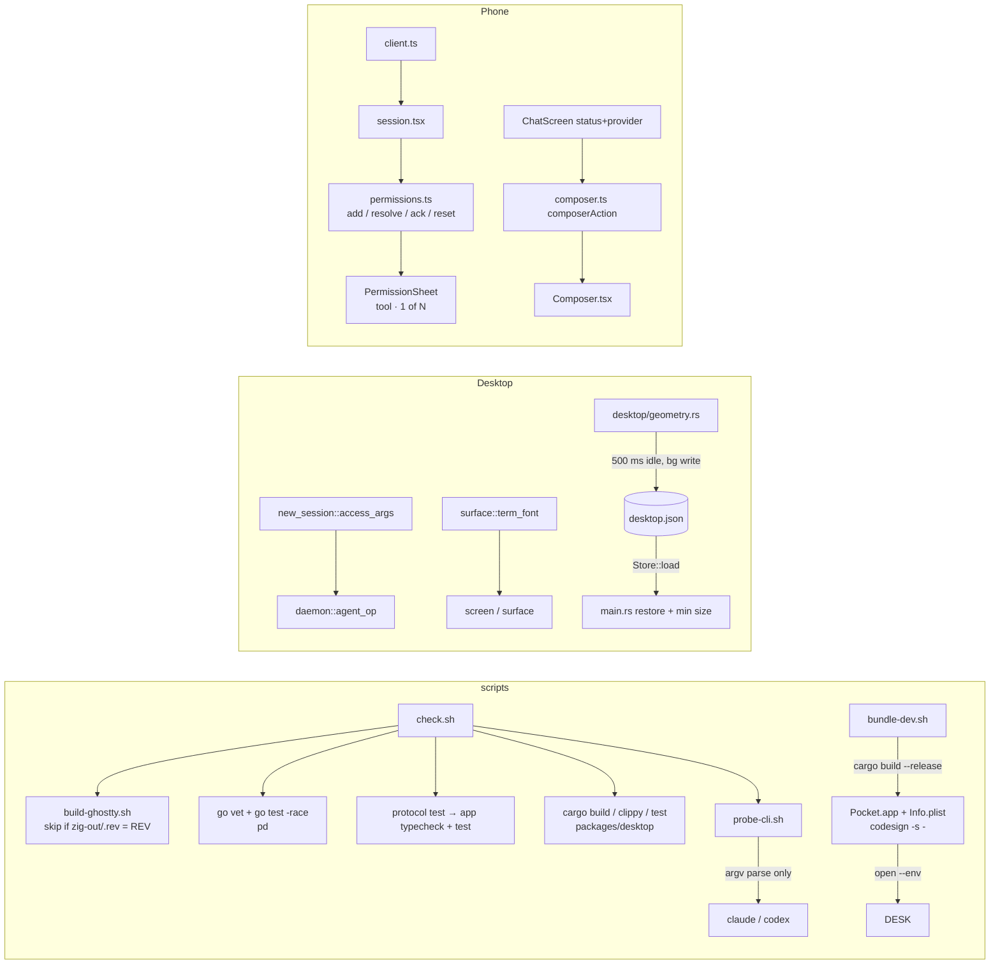

# Design: E01 fix-now (M0, M, lane C)

Date: 2026-09-30. Base: main `f8f7293`. Cites `P path:L` at that commit; `pd` = `packages/pocketd`, `pk` = `packages/desktop/crates/pocket/src`, `d` = `packages/desktop/crates`, `app` = `packages/app/src`.
Sources: PRD FR 01-1..01-7, D12, D31, D32, D33, D37, Q3; 05-roadmap §3 E01, §4, §7, §7.1; UXD §3.1, §6; UXP §4.4, §4.5, §13; R17 §F14; R14 §F10, ideas 14-15, 14-23; R16 idea 16-3; R04 idea 04-7; R08 idea 08-13; 06-prd-review rows 19, 36, 37, 44, 48, 57, 61.

> **Review needed.** There was no owner interview. D12, D31, D32, D33 and D37 are settled or already PO-decided in the PRD. Every other entry in §10 is **PO-decided — review**.

> **Rebase note (dark theme).** The owner's plan `docs/plans/2026-09-30-dark-theme.md` is authoritative, and this epic follows it. If dark lands first, apply its mechanical rules to new E01 code: `rgba(theme::X)` → `theme::X`, and any `u32` colour parameter → `Token`. Files the two plans both touch:
> - PR2 `pk/modals/new_session/picker.rs` (:26 loses `rgba`) and `pk/modals/new_session.rs` (shadow literals become `rgba(0x…)`).
> - PR3 `pk/terminal_view/surface.rs` (:42-43 ink/paper become `TEXT.into()` / `ON_TEXT`). PR3 changes only the `font(MONO)` lines :21 and :59.
> - PR5 `pk/main.rs` (dark adds `window_background` to the same `WindowOptions` literal), `pk/desktop.rs` (dark adds `observe_window_appearance` to `_subs`; PR5 extends `_subs` with its own vec) and `pk/desktop/chrome.rs` (rgba sites; PR5 only adds `save_soon` calls).
> - PR1 and PR4 need no rebase. E04 PR4 (desktop reconnect) also edits `pk/main.rs`. Whichever PR lands second rebases; the two changes are independent.

## 1. Problem

- The desktop spawns codex with `--full-auto` for Auto-edit (P pk/modals/new_session.rs:77). For Ask it passes no flags at all (:74), so codex falls back to the user's config. Its Plan runs `-s read-only` and never plans (:78). D12.
- The Terminal draws ligatures: Geist Mono `calt`/`liga` merge `--` and `->`, so `codex --yolo` renders as one glyph run (P pk/terminal_view/surface.rs:59; R16 idea 16-3). D12.
- While an agent is Working, the phone's only button is Stop (P app/components/Composer.tsx:49-55), so a follow-up can't be sent and a tap stops the turn. D12.
- The phone holds one permission request (P app/session.tsx:43). A second request overwrites the first (:61-63), and resolving clears state before the server answers (:116-119).
- There is no local gate. Each PR runs four toolchains by hand, and libghostty must be built first (P scripts/build-ghostty.sh). Nothing notices when claude or codex rename a flag.
- Desktop notifications never fire from `cargo run`. gpui-pre-macos disables them when there is no bundle id (system_notifications.rs:118-127, verified in source).
- The window always opens centered at 1440×900 (P pk/main.rs:41), with no minimum size. Layout and column widths reset on every launch (P pk/desktop.rs:99-100).

## 2. Scope and non-goals

In scope: FR 01-1 through 01-7, in the five roadmap PRs (§9).

Non-goals:
- `.github/workflows/ci.yml`, which waits on owner Q3 (D33).
- Agent self-approval (E03).
- Access labels and the launch spec (E06 PR4). PR2 keeps the labels "Ask" / "Auto-edit" / "Plan only" (P pk/modals/new_session/picker.rs:97).
- E16 tokens. Per §7.1, E01 uses the existing constants.
- E17 PR1 phone copy, and the inline approval panel (E17). PR4 changes only the data and the header of today's global PermissionSheet.
- "Steer" (E10), and a ligature toggle (D32: none).
- Atomic `desktop.json` writes (E05 PR1).

## 3. UX

§7.1 rows this epic touches, copied verbatim:

| Spec | Says | Decision | Plans use |
|---|---|---|---|
| UXP §4.4 / UXD §3.7 composer | Queue (Claude) / Steer (Codex) | D37 + E01 PR4 step 0 | Working + text → "Queue" for a provider where step 0 shows that the text queues, else "Send". "Steer" waits for E10 |
| UXP §4.8 Codex hint | "Codex plan needs a chat session" | D14, D31 | "Codex can't plan first in a terminal session" |
| UXD §7 constraint 1 | tokens (Phase 1, incl. dark) before everything | D26 | E16 PR1 (light `Palette`) lands before E08 PR1 and every later desktop component. E01 and E04 PR4 predate it and use the existing constants. Dark waits for S1 |

**PR2: agent menu with codex selected.** The menu is 260 wide (P picker.rs:107).
```
│ Permissions                        │ ← pick_head
│ Ask                              ✓ │
│ Auto-edit                          │
│ Plan only                          │ ← TEXT_4, not clickable
│ Codex can't plan first in a        │ ← 11.5 TEXT_4, wraps
│ terminal session                   │
```
- With claude selected, the menu is unchanged.
- Picking codex while Plan is selected resets access to Ask, and the chip suffix follows (P picker.rs:137-141).

**PR3.** `->`, `!=`, `--yolo`, `===` draw as separate cells; no setting.
**PR4: phone composer** (UXP §4.4 state table; copy from UXD §6 :1057 and UXP §9 :778).

| State | Button | a11y label / hint | Tap | Return |
|---|---|---|---|---|
| not Working, text | Send | "Send" | `agent.prompt` | same |
| not Working, blank | Send, disabled | "Send", dimmed | — | — |
| Working, text, provider queues | Queue | "Queue" / "Sends while {Provider} works" | `agent.prompt` | same |
| Working, text, provider doesn't | Send | "Send" | `agent.prompt` | same |
| Working, blank | Stop | "Stop" | `agent.interrupt` | nothing |

Whether a provider queues comes from the step-0 record (§5.4). Both providers read "Send" until the record exists (06-prd-review row 44).

**PR4: sheet header.** The PermissionSheet title `request.toolName` becomes the header from UXP §4.5 :429 and the a11y row :782:
```
Bash · 1 of 2
```
- With a single request it shows `Bash` alone. PO-decided: "· 1 of 1" is noise.
- The sheet shows the oldest open request. Resolving it moves to the next one. A stale request (resolved elsewhere, or "no longer open") drops silently.

**PR5.** No new chrome. The window reopens where it was, with the same layout and column widths, and can't be resized below 900×600 (UXD §3.1).

**PR1 CLI copy** (new, PO-decided):
```
check: ghostty ok (cached 4ae9f1a)
check: pocketd … ok
check: FAILED app test            ← exits with that step's code
probe: claude 2.1.285 · codex-cli 0.159.0
probe: DRIFT codex -s read-only -a on-request: <first stderr line>
probe: skip codex (not on PATH)
bundle-dev: open packages/desktop/target/release/Pocket.app · log /tmp/pocket-dev.log
```

## 4. Architecture



The protocol and pocketd are unchanged. check.sh isolates itself: it exports a scratch `POCKET_HOME` / `POCKETD_SOCK` and unsets `POCKETD_PTY`. Tests run from inside a Pocket Terminal therefore never reach the owner's pocketd (05 §7).

## 5. Contract

### 5.1 Scripts (PR1)

All scripts are POSIX `sh` with `set -eu`, run from any cwd. Each resolves the repo root from `$0` the way P scripts/build-ghostty.sh:5 does.

`scripts/build-ghostty.sh` (changed):
- If `third_party/ghostty/zig-out/.rev` equals `$REV` and `lib/libghostty-vt.a` exists, it prints `ghostty ok (cached <rev7>)` and exits 0.
- Otherwise it keeps today's clone/checkout/`zig build`, then writes `$REV` to `zig-out/.rev`.

`scripts/check.sh` (new). No arguments. Steps run in order and stop at the first failure:
1. `export POCKET_HOME="$(mktemp -d)" POCKETD_SOCK="$POCKET_HOME/pocketd.sock"`; `unset POCKETD_PTY`; `trap 'rm -rf "$POCKET_HOME"' EXIT`.
2. `scripts/build-ghostty.sh`.
3. `pnpm install --frozen-lockfile --prefer-offline`.
4. `(cd packages/pocketd && go vet ./... && go test -race -count=1 ./...)`.
5. `pnpm --filter @pocket/protocol test` (builds `dist`, which app types need).
6. `pnpm --filter @pocket/app typecheck && pnpm --filter @pocket/app test`.
7. `(cd packages/desktop && cargo build --workspace && cargo clippy --workspace --all-targets && cargo test --workspace)`. No `-D warnings`: main has one `double_ended_iterator_last` warning (R14 §F10). No `cargo fmt`.
8. `scripts/probe-cli.sh`.

On failure it prints `check: FAILED <step>` and exits with that step's status. On success it prints `check: ok` and exits 0.

`scripts/probe-cli.sh` (new). No arguments. It exits 0 when every probe passes or its CLI is missing, and 1 when any probe drifts. It never starts a turn: every probe stops at argument parsing, with stdin from `/dev/null`.
- Helpers, which later epics (E06 PR2, E09 PR3) extend by adding lines:
  - `claude_mode <mode>`: runs `claude -p --permission-mode <mode> --pocket-probe </dev/null`. It passes when stderr contains `unknown option '--pocket-probe'`, and drifts when it contains `is invalid`.
  - `codex_ok <args…>`: runs `codex <args…> --version`, which must exit 0. clap validates values before `--version`.
  - `codex_bad <args…>`: the same command must exit non-zero.
- Checks at E01:
  - claude: `claude_mode default`, `claude_mode acceptEdits`, `claude_mode plan`. Control: `claude_mode pocket-bogus` must drift; if it doesn't, the technique is broken, which also exits 1.
  - codex: `codex_ok -s read-only -a on-request`, `codex_ok -s workspace-write -a on-request`, `codex_ok -c model_reasoning_effort=high`. Controls: `codex_bad -a untrusted` (D31) and `codex_bad --full-auto`.
  - Informational only: the `supported_reasoning_levels[].effort` values from `codex debug models`. `-c` values are not validated at parse time (verified with `…=bogus`), so this line is printed, never gated.
- R17's `claude --permission-mode X --version` technique is not used: claude's `--version` short-circuits and exits 0 for any X (verified on 2.1.285).

`scripts/bundle-dev.sh` (new). Usage: `scripts/bundle-dev.sh [--no-open]`.
1. `cargo build --release -p pocket` in `packages/desktop`.
2. Builds `packages/desktop/target/release/Pocket.app`, with `Contents/MacOS/pocket-desktop` (copied) and `Contents/Info.plist`: `CFBundleIdentifier=dev.mingo.codingpocket.desktop`, `CFBundleName=Pocket`, `CFBundleExecutable=pocket-desktop`, `CFBundlePackageType=APPL`, `CFBundleShortVersionString=0.0.0`, `CFBundleVersion=1`, `NSHighResolutionCapable=true`, `LSMinimumSystemVersion` (the workspace's macOS floor).
3. `codesign --force --sign - Pocket.app`.
4. Unless `--no-open`: quits a running instance (`osascript -e 'quit app id "dev.mingo.codingpocket.desktop"'`, errors ignored), then runs `open -n Pocket.app --stdout "$LOG" --stderr "$LOG"`, adding `--env POCKETD_SOCK=… --env POCKET_HOME=…` for each variable that is set. `LOG=${TMPDIR}pocket-dev.log` and its path is printed. `open` gives the app launchd's env, not the shell's, so a scratch pocketd must be forwarded explicitly.

### 5.2 Desktop argv (PR2): `pk/modals/new_session.rs`

```rust
/// None: the provider can't start with this access in a terminal session.
fn access_args(provider: &str, perm: Perm) -> Option<&'static [&'static str]>;
fn plans_first(provider: &str) -> bool;   // claude true, codex false
```

| provider × Perm | argv after the provider |
|---|---|
| claude × Ask | `--permission-mode default` |
| claude × AutoEdit | `--permission-mode acceptEdits` |
| claude × Plan | `--permission-mode plan` |
| codex × Ask | `-s read-only -a on-request` |
| codex × AutoEdit | `-s workspace-write -a on-request` |
| codex × Plan | none (`access_args` → `None`) |

- `Draft::argv` = provider, then `access_args` (empty if `None`), then the trimmed prompt. `Draft::ready` also requires `access_args(..).is_some()`.
- Provider click (P picker.rs:89-91): if `!plans_first(provider) && perm == Plan`, set `perm = Ask`.
- Picker: the Plan row with codex is a new `fn pick_note(label: &str, hint: &str) -> Div` (non-interactive, TEXT_4).
- Hint copy: `"Codex can't plan first in a terminal session"`.
- `--full-auto` never appears.

### 5.3 Terminal font (PR3): `pk/terminal_view/surface.rs`

```rust
/// Geist Mono with ligatures off: a merged `--` would collapse two cells into one.
pub(crate) fn term_font() -> Font; // font(MONO) + FontFeatures(Arc::new(vec![("liga",0),("calt",0),("dlig",0)]))
```
Used at :21 (cell advance) and :59 (per-cell run base), so measure and paint resolve the same font. `FontFeatures::disable_ligatures()` is not used: it clears only `calt`.

### 5.4 Phone (PR4)

`app/src/composer.ts` (new):
```ts
export type ComposerAction = "send" | "queue" | "stop";
/** Step 0 record (E01 PR4): does typing mid-turn queue the text for the next turn? */
export const QUEUES: Readonly<Record<string, boolean>> = { claude: false, codex: false };
export function composerAction(working: boolean, text: string): ComposerAction;  // UXP §4.4 verbatim
export function composerLabel(action: ComposerAction, provider: string): "Send" | "Queue" | "Stop";
export function sendDisabled(working: boolean, text: string): boolean;          // !working && !text.trim()
```
- `composerLabel("queue", p)` is `"Queue"` only when `QUEUES[p]`. The PR sets the `QUEUES` values from the step-0 record.
- `Composer` gains a prop `provider: string` (ChatScreen passes `agent?.provider ?? ""`) and its `busy` becomes `working`.
  - The button's `onPress` follows the action: send and queue call `submit`, stop calls `onInterrupt`.
  - `accessibilityHint` is `"Sends while {Provider} works"` when the label is Queue.
  - `onSubmitEditing` stays `submit`, which no-ops on blank, so Return never stops.

`app/src/permissions.ts` (new). Pure functions; each returns a new object.
```ts
export type Permissions = {
  open: Readonly<Record<string, PermissionRequest>>;   // requestId → request; insertion order = arrival ("perm-N" keys aren't integer-like)
  sending: Readonly<Record<string, string>>;           // client msg id → requestId, awaiting ack
};
export const empty: Permissions;
export function add(p: Permissions, r: PermissionRequest): Permissions;
export function sent(p: Permissions, msgId: string, requestId: string): Permissions;
export function acked(p: Permissions, msgId: string): Permissions;              // drops the request
export function resolved(p: Permissions, requestId: string): Permissions;       // drops it
export function failed(p: Permissions, msgId: string, message: string): Permissions; // stale → drop; else un-send
export function pending(p: Permissions, agentId?: string): PermissionRequest[]; // arrival order, minus sending
export function header(p: Permissions): string | undefined;                      // "Bash · 1 of 2" | "Bash"
export const STALE = "Permission request is no longer open";                     // P pd/internal/wsserver/wsserver.go:158
```
`session.tsx` wiring:
- `hello.ok` → `empty`. pocketd resends every open request after hello (P pd/internal/wsserver/wsserver.go:122-141), and request ids restart per process (P pd/internal/daemon/broker.go:44-50).
- `permission.request` → `add`; `permission.resolved` → `resolved`.
- `ack` → `acked`, if `msg.id` is in `sending`.
- `error` whose `id` is in `sending` → `failed`. A stale error sets no error banner.
- `resolvePermission` keeps `client.send`'s returned id and calls `sent`, instead of clearing first. This is the UXP §4.5 "Clearing" rule.
- The Session type swaps `permission?` for `permissions: Permissions`. App.tsx passes `pending(permissions)[0]` and `header(permissions)` to the sheet.
- Ending an agent needs no extra rule: pocketd's DenyAll publishes `permission.resolved` for each of its requests.

### 5.5 Window geometry (PR5)

`d/store/src/store.rs` additions (all `#[serde(default)]`):
```rust
#[derive(Serialize, Deserialize, Clone, Copy, Debug, PartialEq, Default)]
#[serde(rename_all = "lowercase")]
pub enum Layout { #[default] Sidebars, Compact, Focus }     // moved from pk/desktop/chrome.rs:21-26; chrome re-exports

#[derive(Serialize, Deserialize, Clone, Debug, PartialEq)]
pub struct WindowGeometry { pub display: Option<String>, pub x: f32, pub y: f32, pub width: f32, pub height: f32 }

#[derive(Serialize, Deserialize, Clone, Copy, Debug, PartialEq, Default)]
pub struct ColumnWidths { pub projects: Option<f32>, pub sessions: Option<f32> }

pub struct Store { /* existing */ pub window: Option<WindowGeometry>, pub layout: Layout, pub widths: ColumnWidths, /* path */ }
impl Store {
    pub fn encode(&self) -> Option<(PathBuf, Vec<u8>)>;   // save() = encode + write
}
pub fn write(path: &Path, raw: &[u8]);                   // the single write site E05 PR1 makes atomic
```
`desktop.json` gains the keys `window {display, x, y, width, height}`, `layout: "sidebars"|"compact"|"focus"` and `widths {projects, sessions}`. `x`/`y` are relative to the display's origin, and `display` is the `PlatformDisplay::uuid()` string. Older files load with defaults.

`pk/desktop/geometry.rs` (new):
```rust
pub const MIN_WINDOW: Size<Pixels>;                        // 900×600
pub const DEFAULT_WINDOW: Size<Pixels>;                    // 1440×900
/// Saved bounds on their display, or the default size centered on the first display.
pub fn restore(saved: Option<&WindowGeometry>, displays: &[(Option<String>, Bounds<Pixels>)]) -> (usize, Bounds<Pixels>);
/// What to persist for the window's current bounds; fullscreen and maximized keep their restore bounds.
pub fn snapshot(bounds: WindowBounds, display: Option<String>) -> WindowGeometry;
pub struct Geometry { save: Option<Task<()>> }
impl Geometry { pub fn new(window: &mut Window, cx: &mut Context<Desktop>) -> (Self, Vec<Subscription>); }
impl Desktop { pub(crate) fn save_soon(&mut self, cx: &mut Context<Self>); }   // 500 ms debounce
```
- `restore` keeps the saved bounds when the display uuid matches and the rect, clamped up to `MIN_WINDOW` and down to the display size, lies fully inside that display's bounds. Otherwise it centers `DEFAULT_WINDOW`, clamped to the display.
- `main.rs` passes `display_id` and `WindowBounds::Windowed` from `restore`, sets `window_min_size: Some(MIN_WINDOW)` and seeds `Desktop.layout` / `widths` from the store.
- Capture mode skips restore and never saves.
- The subscriptions are `observe_window_bounds`, which calls `save_soon`, and `cx.on_app_quit`, which flushes synchronously. `toggle_focus` (P chrome.rs:107-119) and `drag_edge` (:148-155) also call `save_soon`.
- `save_soon` replaces the pending task with one that sleeps 500 ms, then does three things:
  1. copies layout, widths and `snapshot(window.window_bounds(), display uuid)` into `store`;
  2. calls `encode()` on the UI thread;
  3. runs `write` on the background executor.
- `Desktop` gains the single field `geometry: Geometry`. `layout` and `widths` stay where they are.

No protocol messages, caps, error codes, ops or pocketd config change in this epic.

## 6. Data and state

| State | Owner | Lifetime | Persisted |
|---|---|---|---|
| libghostty stamp `third_party/ghostty/zig-out/.rev` | build-ghostty.sh | per checkout (gitignored) | disk |
| `QUEUES` | `app/composer.ts` | source constant, set by step 0 | code |
| `Permissions {open, sending}` | `session.tsx` | per WS connection; reset on `hello.ok` | no |
| `window`, `layout`, `widths` | `Store` in `desktop.json` | across launches | yes, 500 ms debounce + on quit |
| `Geometry.save` task | `Desktop.geometry` | until it fires or is replaced | no |

`desktop.json` has two writers: sync `Store::save()` (P pk/sidebar.rs:175,231, pk/modals/add_project.rs:247, pk/modals/new_session.rs:298, pk/desktop/project.rs:170,181) and PR5's background write. Both serialize the whole `Store` from the UI thread, so the later write is at least as new. The only race is two in-flight writes landing out of order within milliseconds. Accepted until E05 PR1 makes `write` atomic and serial.

## 7. Failure modes

| Failure | Effect | Handling |
|---|---|---|
| Network down on a first check.sh (ghostty clone) | step 2 fails | message names build-ghostty; rerun. A cached stamp never needs network |
| `pnpm install --frozen-lockfile` sees lockfile drift | step 3 fails | fix the lockfile in the PR; intended |
| check.sh run inside a Pocket Terminal | would hit owner pocketd | scratch POCKET_HOME/POCKETD_SOCK exported, POCKETD_PTY unset |
| claude/codex missing | probe skips | `probe: skip …`, exit 0 |
| CLI changes its error wording | sentinel check misreads | the negative control fails, so drift is reported, never a false pass |
| codex starts validating before clap (e.g. network) | `--version` probe slow | probes are argv-only; no timeout binary on macOS, so none added |
| Ad-hoc signature changes each build | macOS may re-ask notification permission | click Allow; documented in bundle-dev.sh `--help` |
| `open` launches while an old instance runs | two windows / old binary | quit by bundle id first; `-n` for a fresh instance |
| codex user picks Plan | spawn would lack a plan mode | row disabled, provider switch resets to Ask, `ready()` refuses |
| Features unsupported by a fallback font (emoji, CJK) | ignored by CoreText | harmless |
| Step 0 not yet recorded | Working + text shows "Send" | default `false`; correct behaviour either way (text is typed) |
| Phone reconnects to a restarted pocketd | stale perm-N ids collide | map reset on `hello.ok`; pocketd resends open ones |
| Resolve races with another client | `error STALE` | `failed` drops silently |
| Resolve send lost (socket closes) | page stuck "sending" | `hello.ok` on reconnect resets the map |
| Saved display unplugged / resolution shrank | window off-screen | `restore` falls back to centered default |
| Quit while fullscreen | would reopen fullscreen | `snapshot` stores restore bounds as windowed |
| `desktop.json` unreadable | defaults | today's behaviour (P d/store/src/store.rs:33) |

## 8. Test strategy

Order: lint/typecheck, then the smallest test, then check.sh. Tests are named as sentences and sit beside the logic, with no mocks.

- PR1:
  - `sh -n scripts/*.sh`; `scripts/probe-cli.sh` against the installed claude 2.1.285 / codex 0.159.0 must exit 0.
  - With `PATH` pointing to a stub `codex` that exits 2 on `-a`, it must exit 1.
  - `scripts/check.sh` exits 0 on main. It exits non-zero after a deliberately failing `node --test` case, which is reverted before commit.
  - A second check.sh run prints `ghostty ok (cached …)`.
  - Bundle: `scripts/bundle-dev.sh --no-open`, then `codesign -v` and `plutil -lint`.
  - Notification smoke (manual, free): start a scratch pocketd with its own `POCKET_HOME`, `POCKETD_SOCK` and port, and `pd/e2e/fakeclaude` built as `claude` on PATH. Run `scripts/bundle-dev.sh`, then `pocketd run claude` in Terminal.app, type `run ls`, and focus another app. A banner appears.
- PR2: `cargo test -p pocket` with new tests in `new_session.rs`:
  - `every_provider_and_access_spawns_with_both_axes` (table from §5.2), which replaces :430-443;
  - `codex_cannot_plan_first_in_a_terminal_session`;
  - `picking_codex_drops_plan_first`;
  - `no_spawn_ever_passes_full_auto`.
- PR3: `terminal_font_turns_off_every_ligature_feature` (asserts `tag_value_list` contains liga/calt/dlig = 0).
  - Manual capture in release on a scratch pocketd: `echo '-> != --yolo ==='`. Each character sits in its own cell.
- PR4: `pnpm --filter @pocket/app typecheck && pnpm --filter @pocket/app test`.
  - `test/composer.test.mts`: not working → send; working + text → queue; working + "  " → stop; three cases per provider for the label; `sendDisabled` blank only when idle.
  - `test/permissions.test.mts`:
    - a second request keeps the first;
    - resolving one keeps the rest;
    - an ack drops only its request;
    - a stale error drops silently and another error keeps the page;
    - `resolved` from another client drops it;
    - the header reads "Bash · 1 of 2";
    - `pending` keeps arrival order.
  - Step 0 (manual, paid; the owner runs it, see §11):
    1. Start a scratch pocketd and run `pocketd run claude` in Terminal.app, then start a long turn.
    2. Mid-turn, send `printf '{"op":"prompt","id":"<id>","text":"say QUEUED"}\n' | nc -U "$POCKETD_SOCK"`, which goes through the same `Terminal.Prompt` path as the phone (P pd/internal/ops/ops.go:152-153).
    3. Record whether the text queued, steered or was lost.
    4. Repeat with codex. Record the versions and results in the PR, then set `QUEUES`.
- PR5: `cargo test -p store -p pocket`.
  - store: `round_trips_through_desktop_json` extended with window/layout/widths, plus `an_old_desktop_json_loads_with_default_geometry`.
  - geometry:
    - `a_window_reopens_where_it_was_on_the_same_display`;
    - `a_window_on_a_missing_display_opens_centered`;
    - `a_saved_size_below_the_minimum_grows_to_it`;
    - `an_off_screen_window_opens_centered`;
    - `fullscreen_saves_its_restore_bounds`.
  - Manual on a scratch pocketd, in release: resize, move, toggle ⌘., drag a column, quit, relaunch. Everything restores, and dragging below 900×600 is refused.

## 9. PR slicing (roadmap E01; no incoming deps)

| PR | Title | FR | Files | Depends on |
|---|---|---|---|---|
| 1 | Scripts: check, probe-cli, bundle-dev | 01-5, 01-6 | `scripts/{check,probe-cli,bundle-dev}.sh` (new), `scripts/build-ghostty.sh` | — |
| 2 | Spawn agents with both access axes; codex can't plan first | 01-1 | `pk/modals/new_session.rs`, `pk/modals/new_session/picker.rs` | — |
| 3 | Terminal ligatures off | 01-2 | `pk/terminal_view/surface.rs` | — |
| 4 | Phone composer Send/Queue/Stop and a permissions map | 01-3, 01-4 | `app/composer.ts`, `app/permissions.ts`, `test/{composer,permissions}.test.mts` (new); `app/components/{Composer,PermissionSheet}.tsx`, `app/screens/ChatScreen.tsx`, `app/session.tsx`, `app/App.tsx` | — |
| 5 | Remember window bounds, layout and widths; 900×600 minimum | 01-7 | `d/store/src/store.rs`, `pk/desktop/geometry.rs` (new), `pk/desktop.rs`, `pk/desktop/chrome.rs`, `pk/main.rs` | — |

Downstream (roadmap §4): E07 PR1 needs PR3 (same `surface.rs`), E08 PR5 needs PR1 (dev bundle), and E12 needs PR4. The PRs are mutually independent. PR1 first is recommended so the rest run `check.sh` (before it, the 05 §7 commands).

## 10. Decisions log (PO-decided — review unless marked settled)

1. **Settled (D12, D31):** the argv table in §5.2. Codex Plan first is disabled, with the §7.1 hint. Rejected: `-a untrusted` (the CLI rejects it); keeping `--full-auto`.
2. **Settled (D32):** ligatures off unconditionally. Rejected: a settings toggle; `disable_ligatures()` (it clears only `calt`).
3. **Settled (D33):** check.sh is the gate; no ci.yml until Q3.
4. **Settled (D37):** the Queue label per provider comes from step 0, defaulting to "Send".
5. Probe claude with a sentinel unknown option plus a negative control. Rejected: `--version` (it short-circuits, exits 0 for any mode, verified); a real `-p` turn (paid).
6. Probe codex with `--version` after the flags, since clap validates first (verified: `-a untrusted` exits 2). The effort values are informational only. Rejected: gating on `-c` values, which aren't validated.
7. The ghostty cache is a stamp file inside the gitignored `zig-out`, keyed on `REV`. Rejected: a shared `~/Library/Caches` build, which crosses worktrees and needs invalidation logic.
8. check.sh runs `pnpm install --frozen-lockfile --prefer-offline`. Rejected: assuming `node_modules` exists (fresh worktrees lack it).
9. check.sh isolates POCKET_HOME/POCKETD_SOCK and unsets POCKETD_PTY. Rejected: trusting each test to isolate itself (05 §7 risk).
10. check.sh stops at the first failure. Rejected: run-all-then-report, which is slower to read and can cascade (protocol dist → app types).
11. bundle-dev builds **release** (resolves the epic's open question). Notifications and perf are judged in release (CLAUDE.md). Rejected: debug, which is faster to build but ~10× slower UI and would mislead capture.
12. The bundle id is `dev.mingo.codingpocket.desktop`, beside the phone's `dev.mingo.codingpocket` (P packages/app/app.json:12). Rejected: reusing the phone id (the two collide in Notification Center settings).
13. bundle-dev forwards `POCKETD_SOCK`/`POCKET_HOME` via `open --env`, because `open` gives launchd's env. Rejected: running the binary directly (no bundle → no notifications).
14. Codex+Plan is guarded three ways (disabled row, reset on provider switch, `ready()`). Rejected: hiding the row (the hint explains why it's missing).
15. `term_font()` is used for both measure and paint. Rejected: paint only, which would diverge the cell advance if features change widths.
16. `composerAction` keeps UXP's two-argument signature, and the provider only picks the label. Rejected: a three-state enum per provider, which duplicates the rule.
17. The permissions state is `{open, sending}` and clears on ack/resolved (UXP §4.5). Rejected: today's optimistic clear, which loses the page on a failed send.
18. The permissions map resets on `hello.ok`. Rejected: merging across reconnects (perm-N ids restart per pocketd process).
19. The header drops "· 1 of 1". Rejected: always showing the count.
20. The global sheet counts all open requests. Rejected: per-agent paging now (that is the E17 inline panel; `pending(p, agentId)` is ready for it).
21. `Layout` moves into `store` with serde. Rejected: a string mirror field (two sources of truth).
22. Geometry is saved as display uuid + display-relative rect; fullscreen/maximized save their restore bounds; the window never reopens fullscreen. Mirrors Zeron `restored_main_window_bounds` / `save_window_geometry`.
23. The write runs on the background executor after a UI-thread encode, and flushes on quit. Rejected: sync `save()` on every resize (UI-thread IO, CLAUDE.md).
24. Last-write-wins between sync `save()` and the debounced write is accepted until E05 PR1.
25. Capture mode neither restores nor saves geometry. Rejected: restoring during capture (non-deterministic shots).

## 11. Owner questions

1. **Step 0 needs paid turns.** Please run the §8 PR4 step-0 recipe on claude 2.1.285 and codex 0.159 against a scratch pocketd, and paste the result into PR4. Until then both providers read "Send". This isn't a design choice; agents may not run paid turns.
2. **Q3 (existing):** CI runner cost, repo visibility and licence. It gates `.github/workflows/ci.yml` (D33) and is not answered here.
