# Design: E06 launchspec-create (M1, L)

Date: 2026-09-30. Base: main `f8f7293`. Cites `P path:L` at that commit; `pd` = `packages/pocketd`, `pk` = `packages/desktop/crates/pocket/src`, `d` = `packages/desktop/crates`, `app` = `packages/app/src`.
Sources: PRD FR 06-1..06-7, NFR S-5/S-6/S-9; 05-roadmap §3 E06, §4, §7.1; UXD §3.9, §6, copy table; UXP §4.8; research R17 §F13, §F14, §S1–S6; R18 §F6 R7; D5, D8, D15, D16, D18, D19, D31, D35, D36, D41.

> **Review needed.** No owner interview took place. Every entry in the Decisions log is **PO-decided — review**.

> **Rebase note (dark theme).** The owner's plan `docs/plans/2026-09-30-dark-theme.md` changes colour tokens from `const u32` to `const Token { light, dark }` and migrates every call site. It touches these PR4 files: `pk/modals/new_session.rs` (tokens, shadow literal), `pk/modals/new_session/picker.rs` (`rgba(if … { X } else { Y })` at :26), `pk/palette.rs`, and the helpers PR4 calls (P d/theme/src/theme.rs:115 `icon(.., color: u32)`, P d/ui/src/ui.rs:46 `dot`, :748 `menu_item(.., tint, hover)`, `provider_color`). If dark lands first, PR4 applies these mechanical changes: `rgba(theme::X)` → `theme::X`, `rgba(<Token expr>)` → the expr, any new `u32` colour parameter → `Token`, and literal shadows stay `rgba(0x…)`. Full access renders in `WAITING_TEXT`, passed as a token. The owner's theme decisions (MonoCode dark palette, blur, light unchanged, follows macOS) override UXD §2. PR1–PR3 and PR5 need no rebase.

## 1. Problem

- The desktop builds argv itself (P pk/modals/new_session.rs:72-83). It creates Worktrees and copies files, with overwrite, on its own thread (:280-293), then spawns over the ops socket (:301-302, P d/daemon/src/daemon.rs:99-122). The phone has no way to start a Session: `agent.create` is rejected as Malformed (P pd/internal/proto/golden_test.go:102).
- Access mapping is wrong for codex (`--full-auto` at P pk/modals/new_session.rs:78; codex 0.159.0 removed it) and implicit for Ask (no flag).
- Errors are free text (`Error{Type, ID, Message}`, P pd/internal/proto/messages.go:175-181), so no client can tell a taken name from an untrusted folder.
- A failed setup or a crashing agent is invisible to the requester. `Terminal.Screen()` is empty once the terminal closes (P pd/internal/terminal/terminal.go:304).
- Claude skips hooks in a folder it has not trusted (P pd/internal/daemon/presence.go:53-55). A phone-started claude there would wait on a dialog nobody sees.

## 2. Scope and non-goals

In scope: FR 06-1 (protocol), 06-2 (`internal/launch`), 06-3 (phone policy, cap `launch.v1`), 06-4 (desktop sheet on `agent.create`), 06-5 (phone sheet), 06-6 (trusted Worktree create), 06-7 (`phone.maxAccess`).

Non-goals:
- The New-session canvas 17-4, model card 17-7 and the model catalog (S10). Model is free text from the last pick. Checkout and base chips on the phone (17-6).
- The tab-menu quick rows keep `agent_op` with a bare `[provider]` (P pk/terminals.rs:139-143).
- Grants for phone Sessions (D19); `agent.configure`; changing access after start.
- Any write to Claude's config, including trust (§5.6).
- Removing a Worktree when its first spawn fails.

## 3. UX

§7.1 overrides, copied verbatim:

| UX section | Spec says | Winning decision | Text to build |
|---|---|---|---|
| UXP §4.8 access chips | Full access allowed from the phone, with a confirm | D18 | The phone offers Ask / Auto-accept edits / Auto, up to `phone.maxAccess` (default Ask), and never Full access. Hint under a locked chip: "On your Mac: ⌘K → Phone access level" |
| UXP §4.8 Codex hint | "Codex plan needs a chat session" | D14, D31 | "Codex can't plan first in a terminal session" |
| UXP §4.8 states | "Trust this folder on your Mac first" | FR 06-6 | On `folder_not_trusted`: "Trust this folder in Claude on your Mac first" |
| UXD §3.9 access rules | canvas chips, Phase 4 | E06 PR4 | The existing sheet, not the canvas, uses the §6 chips: "Ask" · "Auto-accept edits" · "Auto" · "Full access" (desktop only, amber) · "Plan first". Picks are remembered per Project |

### 3.1 Desktop sheet (PR4)

The existing sheet stays. Only the Agent picker's "Permissions" rows (P pk/modals/new_session/picker.rs:96-97) change into a separate Access chip and menu:

```
[◐ Claude Code ⌄]  [Ask ⌄]  [Plan first]                      (↑)
[⎇ New worktree]  From [main ⌄]  branch calm-otter   ☑ Copy .env  ☑ Run setup
```

Access menu (w288), two-line rows, hints from R17 §F14:

| Row | Hint | Notes |
|---|---|---|
| "Ask" | "Ask before commands and file changes." | default |
| "Auto-accept edits" | "Auto-approve edits, ask before other actions." | |
| "Auto" | "A reviewer model approves or denies actions." | |
| "Full access" | "Run commands and edits without prompts." | `WAITING_TEXT`; never remembered |
| "Plan first" (toggle) | "Review a plan before building." | pill tooltip "Turn off Plan first"; Codex: dimmed 0.5, "Codex can't plan first in a terminal session" |

States (UXD copy table): "pocketd disconnected — sessions can't start."; "No agents available" / "Install Claude Code or Codex, then reopen."; missing codex row "Install the Codex CLI to enable. Install with `npm install -g @openai/codex`"; "Loading branches…"; name errors "A worktree or branch with this name already exists" / "Use letters, digits, - _ or .".

Behaviour:
- Send builds a LaunchSpec from chip state and sends `agent.create`. The sheet stays open, with the draft, until `agent.creating` or `error`. An error shows in the sheet's error row, and the prompt is kept.
- On `agent.creating` the sheet closes and the Terminal is adopted as a tab of its Worktree. The Terminal is marked "setting up" when `setup` is true (P pk/terminals.rs:44-47). The Project is un-collapsed and `refresh_git` runs.
- A later `error` for that request (setup or agent exit) goes to the page error line, and the failed pane stays open (P pk/terminals.rs:51-56).
- Picks remembered per Project: provider, model, effort, access (never Full). Plan is not remembered.
- Palette: "Phone access level…" opens a three-row menu (Ask / Auto-accept edits / Auto) with a check on the current value, and sends `config.set`.

### 3.2 Phone sheet (PR5), UXP §4.8 with overrides

```
│ Cancel          New session              │
│   What should we work on in pocket?      │
│ │ Describe what the agent should do…   │ │
│ │ [▣ pocket ⌄] [◐ Claude · opus ⌄]     │ │
│ │ [Ask ⌄] [Plan first]             (↑) │ │
│  [⎇ New worktree ⌄]  branch calm-otter   │
│  Trust this folder in Claude on your Mac │
│  first.                                  │
```

- Chips follow the UXP §4.8 table: Project (last used); Checkout (Worktrees by name, main first, meta "on {branch}", then "New worktree"; not remembered); name slug from the first 4 words of the prompt, else adjective-noun; Agent (last pick per provider); Access (Ask; remembered; rows above `maxAccess` locked with the hint); Plan first (off; Codex disabled with the D31 hint).
- Send is disabled while the prompt is empty (D16). While the create runs, Send shows a spinner and the draft is kept. Cancel only closes the sheet: the create continues, and the Session appears in the list.
- On `agent.created` the sheet is replaced by that Session.

| Reply | Copy |
|---|---|
| no `launch.v1` in `hello.ok.caps`, or Malformed | "Update Pocket on your Mac." (Send disabled) |
| `project.list` empty | "Add a project on your Mac first." |
| no provider available | "No agents available" / "Install Claude Code or Codex, then reopen." |
| `invalid_name` / `worktree_exists` | "Use letters, digits, - _ or ." / "A worktree or branch with this name already exists" (inline) |
| `folder_not_trusted` | "Trust this folder in Claude on your Mac first" |
| `access_not_allowed` | "On your Mac: ⌘K → Phone access level" (refetches `agent.providers`) |
| other codes | message verbatim, then `detail` in mono |

## 4. Architecture

```mermaid
flowchart LR
  DS[desktop sheet] -->|agent.create, owner channel| WS[wsserver dispatch]
  PH[phone sheet] -->|agent.create, device| WS
  WS --> RC[receipts: principal+requestId]
  RC --> POL[policy: scope, phone.maxAccess]
  POL --> REG[registry: desktop.json, E05]
  REG --> WT[worktree.Create, E05]
  WT --> PR[provider probe: LoginEnv PATH, 30s]
  PR --> TR[trust check: .claude.json, read-only]
  TR --> AV[argv: F14 table]
  AV --> SP[Daemon.Spawn: login-shell wrapper]
  SP -->|agent.creating| WS
  SP --> W{first of}
  W -->|Agent Attached, or present 10s| OK[agent.created]
  W -->|pocketd hook exit / terminal exit| KO[error spawn_failed + tail]
  OK --> EV[events.jsonl create]
  KO --> EV
```



- `internal/launch` is the only place that builds a Session's argv. Clients send intent only (D5).
- The Terminal is spawned with the Login shell env (E04 PR2 `Daemon.LoginEnv`), and setup runs inside it, so the owner can watch it on the Mac.
- A create finishes when presence (250 ms poll of the foreground pgrp) finds the Agent in that Terminal and it attaches (claude SessionStart, codex app-server). If it is present but unattached after 10 s, the create also succeeds: untrusted owner folders and slow codex attach end here.
- The wrapper calls `pocketd hook exit` before the shell takes over, so pocketd captures the screen tail while the Terminal still exists.

## 5. Contract

### 5.1 Protocol, Go (`pd/internal/proto`)

```go
type LaunchSpec struct {
	Project  string   `json:"project"`          // Project id from project.list (E05)
	Checkout Checkout `json:"checkout"`         // exactly one of Worktree, New
	Provider string   `json:"provider"`         // "claude" | "codex"
	Model    string   `json:"model,omitempty"`  // ^[A-Za-z0-9._:\[\]-]{1,64}$
	Effort   string   `json:"effort,omitempty"` // one of agent.providers efforts
	Access   string   `json:"access"`           // "ask" | "edits" | "auto" | "full"
	Plan     bool     `json:"plan"`
	Prompt   string   `json:"prompt,omitempty"` // ≤ 64 KiB UTF-8; empty starts Idle (D16)
}
type Checkout struct {
	Worktree string       `json:"worktree,omitempty"` // path of a Worktree listed for Project
	New      *NewWorktree `json:"new,omitempty"`
}
type NewWorktree struct {
	Name  string `json:"name"`            // name_problem rules; branch = dir = name
	Base  string `json:"base,omitempty"`  // owner only; default RepoConfig.base
	Copy  *bool  `json:"copy,omitempty"`  // owner only; default true
	Setup *bool  `json:"setup,omitempty"` // owner only; default true
}
type ClientMessage struct{ /* existing */ Spec *LaunchSpec; Key, Value string }
type AgentCreating struct{ Type, ID, RequestID, TerminalID, Cwd string; Setup bool } // "agent.creating"
type AgentCreated struct{ Type, ID, RequestID, AgentID, TerminalID string }          // "agent.created"
type ProviderInfo struct{ ID string; Available bool; Efforts []string; Plan bool }
type AgentProviders struct{ Type, ID string; Providers []ProviderInfo; MaxAccess, PhoneMaxAccess string } // "agent.providers"
type Error struct{ Type, ID, Message string; Code, Detail string } // code, detail: omitempty
func NewAgentCreating(id, requestID, terminalID, cwd string, setup bool) AgentCreating
func NewAgentCreated(id, requestID, agentID, terminalID string) AgentCreated
func NewAgentProviders(id string, p []ProviderInfo, maxAccess, phoneMaxAccess string) AgentProviders
func NewCodedError(id, code, message, detail string) Error
const CapLaunch = "launch.v1"
```

JSON tags are lower camel (`requestId`, `terminalId`, `agentId`, `phoneMaxAccess`). `DecodeClient` (P pd/internal/proto/messages.go:30-87) accepts:
- `{"type":"agent.create","id","requestId","spec"}` with `requestId` 1–64 chars;
- `{"type":"agent.providers","id"}`;
- `{"type":"config.set","id","key":"phone.maxAccess","value":"ask"|"edits"|"auto"}`.

Anything else is Malformed, including an unknown spec field, both or neither checkout, or a prompt over 64 KiB. The old `{"type":"agent.create","cwd","profileId",…}` stays rejected; PR1 moves that line out of `TestDecodeClientRejects` and adds the new shape to the accepted goldens.

Replies, all to the requesting connection only:
- `agent.create` → `agent.creating` (once the Terminal exists), then `agent.created` or `error{code}`. Pre-spawn errors come without `agent.creating`.
- `agent.providers` → `agent.providers`. `maxAccess` is this principal's ceiling: `full` for owner, else `phone.maxAccess`.
- `config.set` → `ack`, or `error{code:"invalid_config"}`.

Error codes (`Error.code`; E02 PR1 / E03 add their own to the same field):

| code | when | detail |
|---|---|---|
| `unknown_project` | `project` not in the registry | — |
| `unknown_worktree` | `checkout.worktree` not listed for the Project | — |
| `invalid_name` | `new.name` fails the name rules | — |
| `worktree_exists` | branch or dir already taken | — |
| `invalid_spec` | bad model charset; effort not offered for provider | — |
| `provider_unavailable` | binary not on the Login shell PATH | — |
| `access_not_allowed` | above ceiling; `full` from phone; owner-only field from phone; codex `plan` | — |
| `folder_not_trusted` | claude, non-owner, cwd untrusted (§5.6) | — |
| `spawn_failed` | git worktree add, copy, spawn, setup exit, agent exit before created | git stderr or last 20 screen lines, ≤ 4 KiB |
| `duplicate` | same principal + requestId, different spec | — |
| `invalid_config` | unknown key or value | — |

### 5.2 Protocol, TS (`packages/protocol`)

`src/launch.ts` (new, re-exported from `index.ts`):
```ts
export const Access = Schema.Literal("ask", "edits", "auto", "full")
export const NewWorktree = Schema.Struct({ name: Schema.String, base: Schema.optional(Schema.String),
  copy: Schema.optional(Schema.Boolean), setup: Schema.optional(Schema.Boolean) })
export const Checkout = Schema.Union(Schema.Struct({ worktree: Schema.String }), Schema.Struct({ new: NewWorktree }))
export const LaunchSpec = Schema.Struct({ project: Schema.String, checkout: Checkout,
  provider: Schema.Literal("claude", "codex"), model: Schema.optional(Schema.String),
  effort: Schema.optional(Schema.String), access: Access, plan: Schema.Boolean, prompt: Schema.optional(Schema.String) })
export const ProviderInfo = Schema.Struct({ id: Schema.String, available: Schema.Boolean,
  efforts: Schema.Array(Schema.String), plan: Schema.Boolean })
export const ErrorCode = Schema.Literal("unknown_project", "unknown_worktree", "invalid_name", "worktree_exists",
  "invalid_spec", "provider_unavailable", "access_not_allowed", "folder_not_trusted", "spawn_failed", "duplicate", "invalid_config")
export const CAP_LAUNCH = "launch.v1"
```
`src/messages.ts` (P packages/protocol/src/messages.ts:4-62): ClientMessage gains `agent.create {id, requestId, spec}`, `agent.providers {id}`, `config.set {id, key: Literal("phone.maxAccess"), value: Literal("ask","edits","auto")}`. ServerMessage gains `agent.creating {id, requestId, terminalId, cwd, setup}`, `agent.created {id, requestId, agentId, terminalId}`, `agent.providers {id, providers, maxAccess, phoneMaxAccess}`. `error` gains `code: optional(String)` (open, so newer codes decode) and `detail: optional(String)`. `PROTOCOL_VERSION` stays 3; the cap gates the feature.

### 5.3 pocketd packages and CLI

```go
// pd/internal/launch
type Principal struct{ Owner bool; Scopes []string; ID string } // from E03; ID keys receipts
type Request struct{ P Principal; RequestID string; Spec proto.LaunchSpec }
type Result struct{ AgentID, TerminalID string; Err *Failure }
type Failure struct{ Code, Message, Detail string }
type Launcher struct{ /* daemon, registry, worktree, config, trust, receipts, probe */ }
func New(d *daemon.Daemon, reg *registry.Registry, cfg *config.Store) *Launcher
func (l *Launcher) Create(ctx context.Context, r Request, creating func(proto.AgentCreating)) Result
func (l *Launcher) Providers(p Principal) []proto.ProviderInfo
func (l *Launcher) Exited(terminalID, phase string, status int) // from ops launch-exit
func Argv(s proto.LaunchSpec, name string, efforts bool) ([]string, *Failure) // pure; F14 table
func Wrap(shell, exe, setup string, argv []string) []string                // pure; login-shell args
func Check(p Principal, s proto.LaunchSpec, maxAccess string, worktrees []string) *Failure // pure policy
func Trusted(claudeJSON []byte, cwd, canonical, toplevel string) bool      // pure mirror of claude
// pd/internal/config (changed)
type Store struct{ /* path, mu */ }
func (s *Store) PhoneMaxAccess() string          // "ask" when unset or invalid
func (s *Store) SetPhoneMaxAccess(v string) error // temp + rename, 0600, unknown keys kept
```

Argv (`Argv`, prompt last after `--`, `-n` = new Worktree name, else prompt slug, else omitted):

| access / plan | claude 2.1.285 | codex 0.159.0 |
|---|---|---|
| ask | `--permission-mode default` | `-s read-only -a on-request` |
| edits | `--permission-mode acceptEdits` | `-s workspace-write -a on-request` |
| auto | `--permission-mode auto` | `--approve-for-me` |
| full | `--permission-mode bypassPermissions --allow-dangerously-skip-permissions` | `-s danger-full-access -a never` |
| plan | `--permission-mode plan` replaces the access flag | `access_not_allowed` |
| model / effort | `--model m`, `--effort e` (low…max) | `-m m`; `-c model_reasoning_effort=e` only if the step-0 probe passes |

Wrapper (`Wrap`; argv passed as shell args, as today at P d/daemon/src/daemon.rs:112-121; `exe` = absolute pocketd path, `Daemon.Exe`):
- sh: `{\n<setup>\n} || { s=$?; '<exe>' hook exit setup $s; exit $s; }\n"$@"; s=$?; '<exe>' hook exit agent $s; exec '<shell>' -l`
- fish: `begin\n<setup>\nend; or begin; set s $status; '<exe>' hook exit setup $s; exit $s; end\n$argv; set s $status; '<exe>' hook exit agent $s; exec '<shell>' -l`
- No setup line when setup is empty or `new.setup` is false.

CLI verbs (P pd/cmd/pocketd/main.go:20-31):
- `pocketd config set phone.maxAccess <ask|edits|auto>`: sends ops `config-set` to the running pocketd. Prints `phone.maxAccess = auto`; exit 1 with `pocketd: <err>` if pocketd is down or the value is invalid; refused from PTY descendants (E03 PR3).
- `pocketd hook exit <setup|agent> <status>`: internal. It needs `POCKETD_PTY`, sends ops `launch-exit`, waits for the reply (≤ 2 s), and always exits 0.

ops messages (`ops.Msg`, P pd/internal/ops/ops.go:15-32; adds `Key string json:"key,omitempty"`):
- `{"op":"launch-exit","id":<POCKETD_PTY>,"text":"setup"|"agent","code":<status>}` → `{"ev":"ok"}`. The peer must descend from Terminal `id` (E03 PR3 rule). Unknown or finished creates are ignored.
- `{"op":"config-set","key":"phone.maxAccess","text":<value>}` → `{"ev":"ok"}` or `{"ev":"error","error":…}`. Owner peers only.

### 5.4 Caps, config, files

- Cap `launch.v1` in `hello.ok.caps`, from PR3. Before PR3, `agent.create` works for the owner principal only, and a device gets `access_not_allowed`.
- Config key `phone.maxAccess`, stored in `$POCKET_HOME/config.json` as `{"phone":{"maxAccess":"ask"}}`. Default `ask`; `full` is never accepted.
- Scope matrix rows (S-9, E03): `agent.create` → `spawn`, owner-only fields → `owner`; `agent.providers` → `observe`; `config.set` and ops `config-set` → `owner`; ops `launch-exit` → Terminal descendant of `id`.
- Files created:
  - `pd/internal/launch/{launch.go,argv.go,wrap.go,policy.go,trust.go,receipts.go}` + `_test.go`
  - `pd/cmd/pocketd/config.go`
  - `pd/internal/proto/testdata/golden/{client,server}/…` new goldens
  - `packages/protocol/src/launch.ts`
  - `scripts/probe-cli.sh`
  - `app/screens/NewSessionScreen.tsx`, `app/launch.ts`, `packages/app/test/launch.test.mts`

### 5.5 Desktop (`d/agents`, `d/store`, `pk`)

```rust
// d/agents
impl Outbox { pub fn create(&self, spec: serde_json::Value) -> String /* requestId */; pub fn providers(&self); pub fn set_phone_access(&self, v: &str); }
pub enum Event { /* existing */ Creating { request: String, terminal: String, cwd: String, setup: bool },
  Created { request: String, agent: String }, CreateFailed { request: String, code: String, message: String, detail: String },
  Providers { list: Vec<Provider>, phone_max: String } }
// d/store
pub struct RepoConfig { /* existing */ pub launch: LaunchPick }
#[derive(Serialize, Deserialize, Default, Debug, PartialEq, Clone)] #[serde(default)]
pub struct LaunchPick { pub provider: String, pub model: String, pub effort: String, pub access: String }
// pk/modals/new_session.rs
pub enum Access { Ask, Edits, Auto, Full }
impl Draft { fn spec(&self, project: &str, cwd: Option<&str>, name: &str, prompt: &str) -> serde_json::Value }
```

Removed: `Perm`, `Draft::argv`, the copy loop and `git::add_worktree` call in `start_session` (P pk/modals/new_session.rs:280-293), and `daemon::setup_op` with its `Intent::Setup` use. `agent_op` stays for quick rows.

### 5.6 Folder trust (settles the plan question)

Verified by reading claude 2.1.285 (`~/.local/share/claude/versions/2.1.285`):
- Trust is `projects[<path>].hasTrustDialogAccepted === true` in the global config (`~/.claude.json`, or `$CLAUDE_CONFIG_DIR/.claude.json`). If `CLAUDE_CODE_SANDBOXED` is set, everything is trusted.
- Order of checks: first `projects[projectPathForConfig]`, which is the canonical git root, so a linked Worktree maps to its main checkout. Then a walk from cwd up to the git toplevel, or up to `/` outside git.
- Local evidence: interactive `cli` sessions (2.1.284, 2.1.285) ran in `~/.worktrees/anywhere/*`, yet those paths have no `projects` entries. Only `~/Developer/self/anywhere` is trusted. So a new Worktree of a trusted Project is already trusted, with nothing written.
- Writing is unsafe. Every running claude rewrites the whole file (lastSessionId, costs, and so on) without a lock that pocketd can take, so a read-modify-write races it and loses one side.

Decision: pocketd never writes Claude's config. `launch.Trusted` mirrors the rule above, reading the file and resolving `git rev-parse --path-format=absolute --git-common-dir` and `--show-toplevel` in the cwd. The result:
- A claude create by a non-owner in an untrusted cwd gets `folder_not_trusted`, before any Worktree is made. The check runs on the Project root for `checkout.new`, and on the Worktree path for `checkout.worktree`.
- The owner proceeds, and claude's own dialog shows in the Terminal on the Mac.
- Codex is not checked.

## 6. Data and state

| State | Where | Lifetime |
|---|---|---|
| Receipts `(principal ID, requestId) → spec hash, in-flight waiters, final reply` | pocketd memory | 10 min after the final reply; lost on restart |
| In-flight creates `terminalId → request` | pocketd memory | until created or failed |
| Provider probe `provider → path, ok` | pocketd memory | 30 s TTL, from `LoginEnv` PATH |
| `phone.maxAccess` | `config.json`, 0600, atomic | persistent |
| `RepoConfig.launch` picks | `desktop.json` (desktop is the only writer, D15) | persistent; `full` never written |
| Phone picks `{projectId: {provider, model, effort, access}}` | SecureStore key `pocket.launch` | persistent |
| `create` rows `{origin: owner|phone, provider, ok, code}` | `events.jsonl` (E04) | persistent |

Nothing stores argv, env, prompt or screen tail (S-5). The tail lives only in the reply. `~/.claude.json` is read, never written.

## 7. Failure modes

| Case | Result |
|---|---|
| Same requestId retried after a dropped connection | Joins the in-flight create or replays its final reply; no second Terminal |
| Same requestId, different spec | `duplicate` |
| `desktop.json` unreadable | E05 keeps the last good registry; `unknown_project` only if absent there too |
| Name taken by a branch but not a dir, or the reverse | `worktree_exists` (checked before `git worktree add`) |
| `git worktree add` fails | `spawn_failed`, detail = git stderr; nothing spawned |
| Copy source missing or a symlink | Skipped (D35); the create continues |
| Setup exits non-zero | Hook `setup` → `spawn_failed` with 20-line tail; pane stays open showing it; Worktree kept |
| Agent exits before created (bogus model, bad flag) | Hook `agent` → `spawn_failed` with tail; no timeout wait |
| Hook never arrives (shell killed) | Terminal exit event → `spawn_failed`, detail "terminal exited <code>" (screen already empty) |
| claude waits on its trust dialog (owner) | No SessionStart; present 10 s → `agent.created`, Attached false (existing 5 s attach rule) |
| Owner lowers `phone.maxAccess` while the phone sheet is open | Next create gets `access_not_allowed`; the phone refetches providers and locks the chip |
| pocketd restarts mid-create | Connection drops; Terminal dies (E04); the retry with the same requestId starts fresh (receipts are memory-only) and meets `worktree_exists` if the Worktree was made |
| Prompt has control bytes | Stripped by E03's sanitizer (keeps `\n`, `\t`); a prompt over 64 KiB is Malformed |
| Prompt starts with `-` | Safe: `--` precedes it |

## 8. Test strategy

pocketd (`cd packages/pocketd && go vet ./... && go test -race -count=1 ./...`; goldens `go test ./internal/proto -update`):
- proto: `TestServerGolden` / `TestDecodeClientAcceptsGoldens` gain `agent_create_worktree`, `agent_create_new`, `agent_creating`, `agent_created`, `agent_providers`, `config_set`, `error_coded`. `TestDecodeClientRejects` gains both-checkouts, no-checkout, unknown spec field, prompt 64 KiB + 1, and `phone.maxAccess=full`.
- launch, pure: `TestArgvMatchesTheF14TableForEveryProviderAccessAndPlan` (table golden `testdata/argv.golden`), `TestCodexPlanIsNotAllowed`, `TestPromptGoesLastAfterDoubleDash`, `TestWrapRecordsTheExitBeforeTheShellTakesOver` (sh and fish; runs `sh -c` with a stub exe that appends to a file), `TestAFailedSetupStopsBeforeTheAgent`.
- policy: `TestPhonePolicyTable` (rows: provider, project, worktree, base/copy/setup, access × maxAccess, full, plan × provider, missing `spawn` scope).
- receipts: `TestADuplicateReturnsTheFirstResult`, `TestADifferentSpecUnderTheSameRequestIsADuplicate`, `TestAReceiptExpiresAfterTenMinutes` (injected clock).
- trust: `TestALinkedWorktreeOfATrustedRepoIsTrusted`, `TestTrustWalkStopsAtTheGitToplevel`, `TestSandboxedIsTrusted`, `TestAnUntrustedClaudeFolderIsRefusedForThePhone`. Each uses a temp `HOME` with a real `git worktree add`.
- e2e (`pd/e2e`, fakeclaude P pd/e2e/fakeclaude/main.go gains `--model bogus` → exit 1): `TestABogusModelFailsWithoutWaiting` (< 2 s, code `spawn_failed`, tail contains fakeclaude's message), `TestASetupFailureIsSpawnFailed`, `TestAPhoneCreateInAFreshWorktreeOfATrustedProjectReachesWorking` (FR 06-6), `TestPhoneCreateIsRefusedWithoutTheCap` (PR2), `TestOwnerSetsPhoneAccessAndThePhoneIsRefusedAbove` (FR 06-7). The harness runs a scratch pocketd with its own `POCKET_HOME`, `POCKETD_SOCK` and port.
- config: `TestSettingPhoneAccessKeepsOtherKeys`, `TestFullIsNeverAcceptedForThePhone`.
- Red-team script (E03 PR5) gains `agent.create` from a PTY descendant and `config-set` from a PTY descendant.

TS: `pnpm --filter @pocket/protocol test` (golden decode of every new Go golden; unknown code decodes). `pnpm --filter @pocket/app typecheck && pnpm --filter @pocket/app test`:
- `launch.test.mts`: `builds a LaunchSpec from chip state`, `never sends base from the phone`, `locks access above maxAccess`, `disables plan for codex`, `maps every error code to its copy`, `slugs the first four words of the prompt`, `remembers picks per project but not plan`.

Desktop: `cargo build --workspace && cargo clippy --workspace -- -D warnings && cargo test --workspace` (in `packages/desktop`):
- new_session.rs tests: `a_spec_carries_access_and_plan_not_argv`, `full_access_is_never_remembered`, `picks_are_remembered_per_project`, `a_create_error_keeps_the_draft`, `codex_cannot_plan_first`.
- terminals.rs: `a_creating_reply_adopts_its_terminal_and_marks_setup`.
- d/store: `an_old_desktop_json_loads_with_empty_launch_picks`.
- Speed: capture mode (`cargo run --release -p pocket --features capture -- --capture <dir> new=new-session`) before and after. The sheet does no IO in render, and Send does not wait on `refresh_git`.

Lane C (PR4, PR5) never edits goldens.

## 9. PR slicing

| PR | Title | Lane | Depends on | Content |
|---|---|---|---|---|
| 1 | LaunchSpec protocol and coded errors | P | E02 PR1 | §5.1, §5.2 types, `Error.code/detail`, goldens both sides, flip golden_test.go:102. No handler, no cap |
| 2 | `internal/launch` for the owner | P | PR1, E05 PR2, E04 PR2, E03 PR2 | Step 0 `scripts/probe-cli.sh` (codex effort `-c`; `claude --permission-mode default` accepted), argv, wrapper, `hook exit`, trust, receipts, probe, `agent.providers`, `config.set` + `pocketd config set` + storage, `create` events. Device → `access_not_allowed` |
| 3 | Phone policy and `launch.v1` | P | PR2, E03 PR3 | `Check` for non-owner principals, `folder_not_trusted`, cap advertised, scope-matrix rows, red-team cases |
| 4 | Desktop New session on `agent.create` | C | PR2 | §3.1, §5.5; deletes argv/copy/setup_op paths; Phone access level palette action |
| 5 | Phone New session sheet | C | PR3, E02 PR5 | §3.2; `app/launch.ts`, `NewSessionScreen.tsx`, entry from the Sessions list |

## 10. Decisions log

1. **Never write `~/.claude.json`; honour Claude's own canonical-root trust; non-owner untrusted → `folder_not_trusted`; the owner proceeds to the dialog.** PO-decided — review. Rejected: pre-seeding via read-modify-write (races every running claude; §5.6); a `flock` (claude takes none); spawning claude to accept (a paid turn, and it needs a person); refusing the owner too (the desktop would lose today's flow for untrusted Projects).
2. **`agent.creating` progress reply with `terminalId`, before setup.** PO-decided — review. Rejected: silence until `agent.created` (the desktop can't show setup output, and setup can take minutes); a client-chosen terminal id (lets clients name pocketd's objects).
3. **Success = Agent present and Attached, or present 10 s; any exit first = `spawn_failed`.** PO-decided — review. Rejected: waiting for Working (an empty prompt stays Idle, D16); non-zero exits only (an exit 0 before attach is still no Session).
4. **`pocketd hook exit <phase> <status>` called by the wrapper; pocketd reads `Screen()` then.** PO-decided — review. Rejected: the terminal exit event only (the screen is gone, P terminal.go:304, and `exec $SHELL` hides the agent's exit); keeping closed screens (memory across all Terminals).
5. **`checkout.new` also takes `copy?` and `setup?`, owner only, default true.** PO-decided — review. Rejected: dropping the desktop's Copy and Run setup toggles (P pk/modals/new_session.rs:38-39; loses a shipped feature); client-side copy (the reason D41 moved it).
6. **Receipts in memory, keyed by principal + requestId, 10 min, spec-hash compare.** PO-decided — review. Rejected: persisted receipts (S-5; a restart kills the Terminal anyway); keyed by requestId alone (one device could collide with another).
7. **Error `code` + `detail` optional fields on the existing `error` frame.** PO-decided — review. Rejected: a separate `agent.create.failed` type (every verb would need its own); codes inside `message` text.
8. **`--` before the prompt.** PO-decided — review. Rejected: raw last positional (a prompt starting with `-` becomes a flag).
9. **`-n` = new Worktree name, else a 4-word prompt slug.** PO-decided — review. Rejected: always the Worktree name (every Session in main is "main"); no name (loses 17-12).
10. **`config.set`, its CLI and storage move to PR2 (owner-only; no effect until PR3 enforces it).** PO-decided — review. Rejected: keep them in PR3 (PR4's palette action would then need PR3, breaking the binding dep PR4 → PR2).
11. **`pocketd config set` goes through the running pocketd.** PO-decided — review. Rejected: the CLI writes the file (races the WS writer, and pocketd would need a reload).
12. **Worktree kept when its first spawn fails.** PO-decided — review. Rejected: auto-remove (it may hold setup output and copied env the owner wants to inspect; D8 keeps removal explicit).
13. **Effort is claude-only unless the step-0 probe proves `-c model_reasoning_effort`.** PO-decided — review. Rejected: sending it unprobed (if codex ignores the key, the pick silently does nothing).
14. **Phone Cancel during a create does not cancel it.** PO-decided — review. Rejected: a cancel verb (it would kill setup mid-run; the Session appears in the list anyway).
15. **Model validated by charset only.** PO-decided — review. Rejected: an allowlist (needs the S10 catalog); no check (argv injection is already blocked by args, but junk would reach the CLI).
16. **Phone picks in SecureStore `pocket.launch`.** PO-decided — review. Rejected: pocketd-side memory (a cross-device leak of picks; the desktop keeps its own in `desktop.json`).

Assumed from unwritten designs; adapt on merge: E05 `project.list` Project `{id, root, worktrees[{path, name, branch}]}` and `worktree.Create(root, name, base, copy)`; E03 principal `{owner, scopes, id}` and its prompt sanitizer; E04 `LoginEnv` and the events writer.

## 11. Owner questions

None. Everything left in E06 is a product or technical call, decided above for review.
