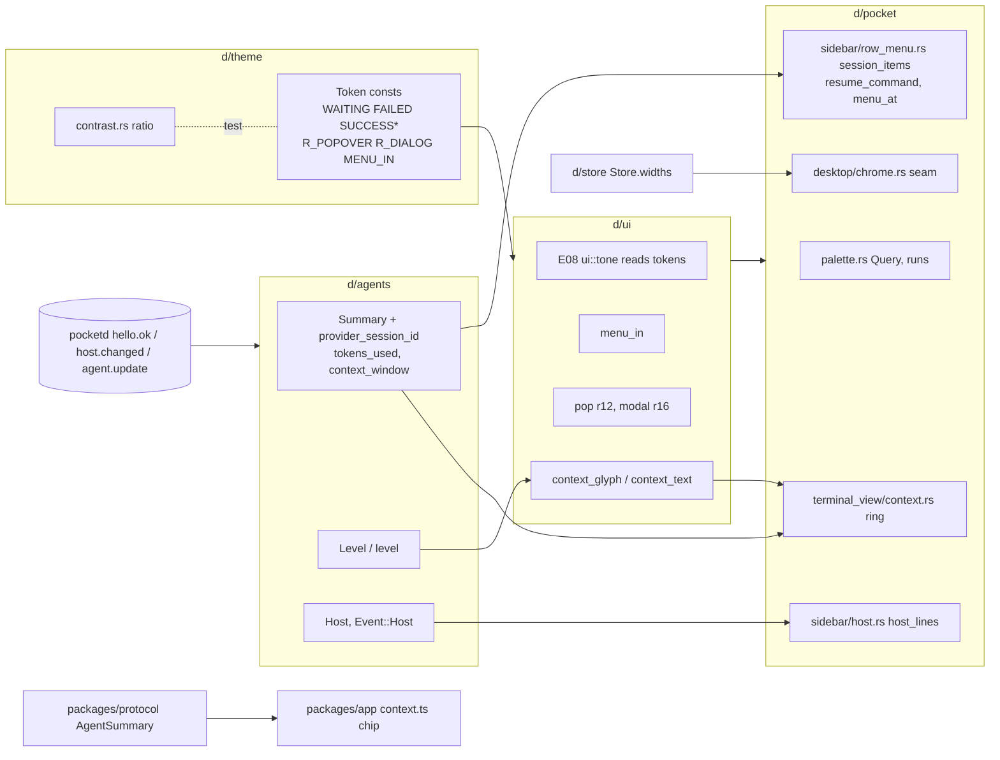

# E16 `look`: technical design

Epic E16 (05-roadmap, M1, lane C + PR4 phone). FRs 16-1..16-5. Base: main f8f7293. Paths: `pk/` = `packages/desktop/crates/pocket/src/`, `d/` = `packages/desktop/crates/`. The technical-design skill file was not found on disk (full `find`), so this doc follows the task's section list and the format of `2026-09-28-agent-sessions.md`.

> **Rebase note (dark theme).** The owner's plan (`docs/plans/2026-09-30-dark-theme.md`, 3 PRs) touches `d/theme/src/theme.rs`, `d/ui/src/ui.rs`, `d/storybook`, and every pocket file that uses tokens (about 250 sites). Named files: `pk/sidebar/{rail,panel,usage}.rs`, `pk/terminal_view/{tabs,surface,pane}.rs`, `pk/modals/{new_session,new_session/picker,add_project}.rs`, `pk/git_ui/changes/{commit_box,rows}.rs`, `pk/git_ui/{diff,diff/row,diff/target,diff/comment,diff/composer}.rs`, `pk/explorer{,/mermaid,/preview/markdown,/preview/code}.rs`, `pk/{syntax,main,desktop,capture}.rs`. E16 overlaps it in theme.rs, ui.rs, usage.rs, rail.rs, tabs.rs, pane.rs, picker.rs, commit_box.rs, target.rs, terminal_view.rs, chrome.rs and palette.rs. **E16 PR1 lands after the owner's PR1.** Until then, and for any E16 branch cut earlier, adapt mechanically:
> - `rgba(theme::X)` → `theme::X` (Token is `Into<Hsla>`);
> - `u32` colour params → `Token` (`dot(size, Token)`, `menu_item(.., tint: Token, hover: Token)`, `Variant::fg -> Token`);
> - new tokens are written `Token::new(light, dark)`, or `Token::fixed(v)` when one value serves both schemes;
> - tests call `Token::pick(dark)` and never flip the global flag.
> This doc writes everything in the post-merge form.

## 1. Problem

The owner's plan gives every colour a light and a dark value, but it keeps today's light values. Those still fail AA:
- WAITING ffb224 on WINDOW is 1.64:1, and so is white on it in the count badge.
- RUNNING 30a46c is 2.87:1.
- FAILED e5484d as text is 3.56:1, and white on the Danger button is 3.91:1.
- TEXT_3 is used as text at 3.07:1, and TEXT_4 at 2.33:1.

Status is told apart by colour alone: the dots differ only in hue (D1). Radii are ad hoc: `pop` r26 (P d/ui/src/ui.rs:32-34), overridden to r10 or r14 at five call sites. Only More animates its menu (P pk/modals.rs:33-52).

The rest of the gaps:
- The palette only matches substrings, clamps on ↑/↓ and has no highlight (P pk/palette.rs:64-79).
- Sessions have no context menu, and right-click opens menus at the `···` button, not at the pointer (P pk/sidebar/row_menu.rs:9-15).
- The seam handles are 5 px, and widths are lost on relaunch (P pk/desktop/chrome.rs:126-155; P pk/desktop.rs:41).
- Context assumes a 200k window (P d/agents/src/agents.rs:57,158-161) and warns at 80% (P d/ui/src/ui.rs:665-668).
- The host state from E04 is not shown anywhere.

## 2. Scope and non-goals

**Re-scope.** The roadmap's PR1 ("Palette struct + p(cx)", "Split WHITE") is replaced by the owner's `theme::Token`, which already covers the dark scheme. What remains of the Zeron/MonoCode look is:
1. D1 status tokens and glyph shapes;
2. the AA fixes;
3. radii;
4. menu motion;
5. copy;
6. the phone warning token.

In scope, with no FR/PR changes from the roadmap: FR 16-1 tokens, AA, radii and `MENU_IN`; 16-2 palette v2; 16-3 menus and seams; 16-4 the context meter on desktop and phone; 16-5 the host line.

Not in scope:
- anything the owner's plan does: `Token`, dark values, appearance following, blur;
- Appearance actions and Settings (S1);
- the canvas (S10);
- seam animation;
- Up next and removing the status sorts (E08 PR2);
- the D1 call-site swap and deleting `RUNNING` (E08 PR1);
- the phone context sheet and "Compact now";
- the full UXP §2 token set. No FR or epic owns it; this doc flags it, and E16 adds only `warning`.

## 3. UX (UXD/UXP excerpts, with §7.1 overrides applied)

**Status glyphs** (UXD §2.2, D1). Each state has its own shape, so colour is never the only cue. E16 PR1 ships the tokens; E08 PR1's `ui::tone` (desktop-attention design) owns the `Glyph` shapes and the call sites:

| State | Glyph | Colour | Text colour |
|---|---|---|---|
| Needs you | dot | WAITING | WAITING_TEXT |
| Working | spinner | ACCENT | ACCENT |
| Done | check | SUCCESS | SUCCESS_TEXT |
| Failed | × bold | FAILED | FAILED_TEXT |

**Menus** (UXD §3.2):
- Right-click opens the same menu as `···`, at the pointer.
- Menus are w216, r12, p6 and use `MENU_IN`: 150 ms, −4→0 px, fade, quint-out, snapped under Reduce motion.

**Session menu** copy (UXD §6, N): "Copy path" · "Copy resume command" · "Close session…" (danger).
- The confirm reads "Close {title}?" with the action "Close".
- Its facts are "Closes its terminal", plus "Stops its current turn" while Working.

**Palette** (UXD §3.11, without Up next; E08 PR2 adds that group):
```
card w660, top 120, r16 (R_DIALOG)
│ 🔍  Search sessions, files and actions…                            esc   │ h60
│ Sessions                                          11.5 SemiBold TEXT_2   │
│ [●] Add rate limiter       pocket · main · Claude Code · Working          │ matched runs ACCENT
│ Worktrees · Files · Actions …                                            │
│ ↑↓ Navigate   ↵ Open   Tab to search all projects   esc Close           │ footer 11.5 TEXT_2
```
- Empty result: "No matches." with "Try a session title, project, worktree or branch."
- When scoped to all projects, the Tab hint reads "Tab to filter by project".

**Seams** (UXD §3.1):
- A 20 px hit area centred on the edge.
- On hover, a 1 px SEPARATOR_STRONG line.
- Double-click resets the width.

**Context ring** (UXD §3.4, D7):
- 16 px, in the session page bar, left of the status cluster.
- Hidden until the agent reports its window.
- Colours: TEXT_3 below 75%, WAITING from 75%, FAILED from 90%.
- Hover card: "Context window" / "184,000 / 200,000 tokens" / "16,000 tokens remaining".
- The rail bars and the usage card ("context left") follow the same thresholds.

**Phone chip** (UXP §4.3):
- "NN% context" by the composer.
- Colour: muted below 75, warning from 75, red from 90.
- Hidden when the window is unknown.
- VoiceOver: "{n} percent of context used".

**Host line** (UXD §3.2):
```
│ Phone access needs Tailscale ↗      │ 12 TEXT_2, h24, px8; link to tailscale.com/download/mac
│ Keeping Mac awake                   │
│ [ Add project        ]  [⚙]         │ foot
```
Both lines can show, Tailscale first. With no host state, neither shows.

## 4. Architecture



## 5. Contract

### Rust: `d/theme` (PR1)
```rust
pub const WAITING: Token      = Token::new(0xad5700ff, 0xffb224ff); // light was ffb224
pub const FAILED: Token       = Token::new(0xcd2b31ff, 0xe5484dff); // light was e5484d
pub const FAILED_TEXT: Token  = Token::new(0xcd2b31ff, 0xff9592ff);
pub const SUCCESS: Token      = Token::new(0x2b9a66ff, 0x30a46cff);
pub const SUCCESS_TEXT: Token = Token::new(0x18794eff, 0x3dd68cff);
pub const SUCCESS_BG: Token   = Token::fixed(0x30a46c21);
pub const R_POPOVER: f32 = 12.;
pub const R_DIALOG: f32 = 16.;
pub const MENU_IN: Duration = Duration::from_millis(150);
// d/theme/src/contrast.rs (new)
pub fn ratio(fg: u32, bg: u32) -> f32; // WCAG 2.x; fg alpha composited over an opaque bg
```
WAITING_BG, FAILED_BG, WAITING_TEXT and the owner's roles are unchanged. `RUNNING*` stays until E08 PR1 deletes it.

### Rust: `d/ui` (PR1, PR2, PR4)
```rust
pub fn menu_in(id: impl Into<ElementId>, e: Div) -> AnimationElement<Div>;
pub fn pop() -> Div;                                              // radius R_POPOVER (was 26)
pub fn palette_row(id, selected: bool, lead: impl IntoElement, title: impl IntoElement,
                   detail: impl IntoElement, keys: Option<..>) -> Stateful<Div>; // PR2: was String, String; no .hover bg
pub fn context_glyph(level: Level) -> Token;   // Low TEXT_3, Warn WAITING, Danger FAILED (PR4)
pub fn context_text(level: Level) -> Token;    // Low TEXT_2, Warn WAITING_TEXT, Danger FAILED_TEXT (PR4)
```
`menu_in` is `with_animation(id, Animation::new(MENU_IN).with_easing(ease_out_quint()), |e, t| e.opacity(t).mt(px(-4. * (1. - t))))`. It is applied to the menus in row_menu, picker, changes header, diff target, tab_menu and commit_box, and to the new session menu. Storybook's `palette_row` call still compiles, because `String: IntoElement`.

### Rust: `d/agents` (PR3, PR4, PR5)
```rust
pub struct Summary { /* existing */ pub provider_session_id: Option<String>,   // PR3, wire providerSessionId
                     pub tokens_used: u64, pub context_window: Option<u64> }  // PR4, wire tokensUsed, contextWindow
impl Summary { pub fn context(&self) -> Option<(u64, u64)>; }  // (used, window); None without a window or window 0
pub enum Level { Low, Warn, Danger }
pub fn level(used: u64, window: u64) -> Level;                 // <75 Low, 75..90 Warn, ≥90 Danger (integer percent)
#[serde(rename_all = "camelCase")] pub struct Host { pub tailnet: bool, pub keeping_awake: bool } // PR5
pub enum Event { /* existing */ Host(Host) }                   // from hello.ok.host and host.changed
pub struct Agents { /* existing */ pub host: Option<Host> }    // None on Event::Connected
```
PR4 deletes `CONTEXT_WINDOW` and `Agents::context_left` (P d/agents/src/agents.rs:57,158-161).

### Rust: `d/store` (PR3)
```rust
pub struct Store { /* existing */ #[serde(default)] pub widths: [Option<f32>; 2] }  // desktop.json key "widths"
```
`Desktop.widths` (P pk/desktop.rs:41,100) moves here.

### Rust: `d/pocket` (PR2–PR5)
```rust
// palette.rs
enum Query { All(Vec<String>), Actions(Vec<String>) }          // ">" prefix → Actions
fn query(raw: &str) -> Query;
fn matches(words: &[String], fields: &[&str]) -> bool;         // every word ⊂ some field, case-insensitive
fn runs(text: &str, words: &[String]) -> Vec<Range<usize>>;    // merged byte ranges; empty when lowercasing changes byte length
enum Pick { Session(..), File(..), New, Split, Next, Tree { project: usize, tree: Option<String> } }
// desktop/chrome.rs
enum RowMenu { Project(..), Tree(..), Session(String) }
// sidebar.rs
struct SidebarState { search, menu_at: Option<Point<Pixels>>, save_widths: Option<Task<()>> }
// sidebar/row_menu.rs
fn resume_command(provider: &str, session_id: &str, cwd: &str) -> Option<String>;
fn session_items(s: &Summary) -> Vec<SessionItem>;             // CopyPath, CopyResume (only with an id), Close
// modals/confirm.rs
enum Confirm { .., CloseSession(String) }
impl ConfirmText { fn close_session(title: &str, working: bool) -> Self; }
// terminal_view/context.rs (new)
fn ring(used: u64, window: u64) -> impl IntoElement;            // 16 px PathBuilder arc; hover card via tooltip_show_delay(350 ms)
fn thousands(n: u64) -> String;                                 // 184000 → "184,000"
// sidebar/host.rs (new)
enum HostLine { NeedsTailscale, KeepingAwake }
fn host_lines(host: Option<&Host>) -> Vec<HostLine>;            // Tailscale first
```
`resume_command` returns:
- claude: `cd '<cwd>' && claude --resume <id>`;
- codex: `cd '<cwd>' && codex resume <id>`;
- any other provider: `None`.

A `'` in the cwd is escaped as `'\''`. Checked locally against `claude --help` 2.1.285 (`-r, --resume [value]`) and `codex resume --help` 0.159.0 (`codex resume [OPTIONS] [SESSION_ID]`).

### Protocol
E16 defines no new messages. It consumes these:
- `AgentSummary.providerSessionId`, already on the wire (P pd/internal/proto/proto.go:181; P packages/protocol/src/timeline.ts:96);
- E05 PR3's `tokensUsed`, `contextWindow?` under cap `summary.v2`;
- E04 PR2's host contract, under cap `host.v1`. Go: `CapHost = "host.v1"`, `HostState{Tailnet bool "tailnet"; KeepingAwake bool "keepingAwake"}`, `HelloOK.Host *HostState "host,omitempty"`, `HostChanged{Type "host.changed"; Host HostState "host"}`. TS: `CAP_HOST`, `HostState`, `HelloOk.host?`, `HostChanged`.

E02 PR1's `caps` field is required on both clients:
- The desktop hello (P d/agents/src/agents.rs:248) gains `"caps": ["summary.v2"]` in PR4, and `"host.v1"` is appended in PR5.
- The phone hello (P packages/app/src/client.ts:33) gains `"summary.v2"` in PR4, appended to E02's `["pair.v1"]`.

`protocolVersion` stays 3.

### TS: `packages/app` (PR4)
```ts
// src/context.ts (new)
export type ContextTone = "muted" | "warning" | "danger";
export const contextChip = (a: AgentSummary): { percent: number; tone: ContextTone } | undefined;
// src/design.ts: d.warning = "#FACC15"
```
Composer renders `{percent}% context` with `accessibilityLabel={`${percent} percent of context used`}`.

### Other contract items
- **Caps and config.** No new caps. Config: `desktop.json` gains `widths: [number|null, number|null]`, absent = defaults 272/334.
- **CLI and errors.** No CLI verbs and no error codes.
- **Files created.**
  - `d/theme/src/contrast.rs`
  - `pk/terminal_view/context.rs`
  - `pk/sidebar/host.rs`
  - `packages/app/src/context.ts`
  - `packages/app/test/context.test.mts`

## 6. Data and state

**Literal scope** (the plan question): the owner's PR1 already tokenizes every per-scheme literal. E16 PR1 moves no other literal sites. It changes only:
- the token values above;
- the TEXT_3/TEXT_4-as-text sites below;
- the `pop`/`modal` radii and the per-site `.rounded` overrides at `picker.rs:55-60`, `changes/header.rs:54-57`, `tab_menu.rs:41-44`, `commit_box.rs:74-77` and `row_menu.rs:34`.

These literals stay: `0x0a84ff59` (Accent shadow, P d/ui/src/ui.rs:91) and the `0x1111131a` dims, because the owner's plan keeps shadows and dims. Later PRs touch literals only on lines they already edit.

**AA site fixes** (PR1):
- TEXT_3/TEXT_4 used as text → TEXT_2, at:
  - P d/ui/src/ui.rs: 241 (NotAttached pill), 430 (session meta), 459 (status_label), 682 (section_header), 692 (field_label), 744 (palette detail), 814 and 817 (trigger label and kbd);
  - P pk/desktop/chrome.rs:96 (empty).
- The error text at P pk/terminal_view.rs:62 → FAILED_TEXT.
- The palette's group label (:233) and "No matches." (:252) move in PR2.

**Hand-off to E08 PR1**, which owns the D1 swap:
- `RUNNING` sites: P d/ui/src/ui.rs:308, P pk/sidebar/rail.rs:56, P pk/terminal_view/tabs.rs:37,46, P pk/explorer.rs:36;
- the ui pill and label arms at :234-241 and :456-459 switch to E08's `ui::tone`, which reads WAITING, ACCENT, SUCCESS* and FAILED*.

**Palette state.** Palette state is the existing per-feature palette struct, plus a parsed `Query` recomputed on each edit.
- Caps: Sessions 8, Worktrees 5, Files 8, Actions all.
- The empty query shows 5 sessions, 3 changed files and all actions.
- At most 30 rows are built per frame.
- `nav` wraps. `ix` changes on `on_mouse_move` only; GPUI fires it only while hovered (gpui-pre 0.3.6 div.rs:303-313).

**Menu anchor.** `SidebarState.menu_at` is `Some(pos)` for right-click and `None` for `···`.
- With a position, the menu renders in `deferred(anchored().position(at).snap_to_window_with_margin(px(8.)))`.
- `close_menus` (P pk/desktop.rs:247-251) clears it.
- Session rows get a trailing `···` via `.child()` on hover or while their menu is open. The `session_row` signature is unchanged.

**Widths.** A drag writes to `store.widths[i]` and replaces `SidebarState.save_widths` with a 500 ms timer that then calls `store.save()`. Replacing the task cancels the older timer.
- Double-click (`click_count == 2`) sets the width to `None`, falling back to 272/334, and saves.
- The handle is 20 px (±10 around the edge) and is drawn via `deferred`, because `column()` clips.
- The clamps stay 200–420 and 280–600 (P pk/desktop/chrome.rs:148-155).

**Context data.**
- Desktop: the ring, rail and usage card all read `Summary::context()`. The usage card and rail bars keep showing "left".
- Phone: `contextChip` reads `tokensUsed`/`contextWindow` from `AgentSummary`.

**Host data.** `Agents.host` is set by `Event::Host` and cleared on reconnect. Nothing is persisted.

## 7. Failure modes

| Case | Behaviour |
|---|---|
| Old pocketd without `summary.v2` | `context_window` stays None: no ring, chip, rail bar or usage card. This replaces today's fake 200k |
| `contextWindow` is 0 or `tokensUsed` exceeds it | `context()` → None when the window is 0; percent clamps to 100 → Danger |
| No `providerSessionId` yet (just started) | "Copy resume command" is hidden, never disabled with an empty id |
| cwd with `'` or spaces | Single-quoted with `'\''`; tested |
| Unknown provider | `resume_command` → None, item hidden |
| Close session on a Working agent | The confirm names "Stops its current turn". Confirming calls the existing `close_session` (P pk/terminals.rs:166) |
| Right-click near the window edge | `snap_to_window_with_margin(8)` keeps the menu inside |
| Rapid seam drags | Each drag cancels the pending save; one write lands 500 ms after the last move |
| `store.save()` fails | Same as today's toggle save (plain write, errors ignored); widths revert to defaults on the next launch |
| Old pocketd without `host.v1` | `host` stays None: no line |
| Reconnect | `Agents.host` resets on Connected, then comes back from the next `hello.ok` |
| A pocketd that sends `host` without the cap | Accepted anyway; serde ignores unknown frames otherwise |
| Non-ASCII query where lowercasing changes byte length | Matching still works (it uses `to_lowercase` on both sides); only the highlight is skipped |
| Reduce motion | `with_animation` snaps (gpui-pre 0.3.6 window.rs:2627) |
| Dark scheme on low-contrast pairs | Listed in `DARK_EXEMPT`, which cites the owner's plan: ACCENT as text on every surface, ACCENT glyph on SURFACE/POPOVER, WHITE on WAITING (1.8), WHITE on FAILED (3.91) |

## 8. Test strategy

Tests sit beside the logic in `#[cfg(test)] mod tests`, named as sentences, with no mocks and no render tests. Run lint and types first, then the crate under change.

| Crate / package | Tests | Command |
|---|---|---|
| `d/theme` | "light text roles clear 4.5 on every surface" covers TEXT, TEXT_BODY, TEXT_2, WAITING_TEXT, SUCCESS_TEXT, FAILED_TEXT, ACCENT, DIFF_ADD_TEXT, DIFF_DEL_TEXT and MODIFIED over WINDOW, SURFACE, SURFACE_SUNKEN, PAGE, POPOVER and SIDE-over-WINDOW. "light status glyphs clear 3" covers WAITING, SUCCESS, FAILED, ACCENT and TEXT_3. "white labels clear 4.5 on accent, failed and waiting fills". "dark pairs clear AA except the listed exemptions", over WINDOW_SOLID. "ratio composites alpha over the background". TEAL (4.4996) is left out and noted | `cargo test -p theme` |
| `d/ui` | "context colours follow the level" (glyph shape tests are E08's `ui::tone`) | `cargo test -p ui` |
| `d/agents` | "level is low at 74, warn at 75 and 89, danger at 90"; "context is unknown without a window"; "summary reads providerSessionId, tokensUsed and contextWindow"; "hello.ok host and host.changed become host events"; "connecting clears the host"; "hello asks for summary.v2 and host.v1" | `cargo test -p agents` |
| `d/store` | "widths round-trip through desktop.json"; "a file without widths loads defaults" | `cargo test -p store` |
| `d/pocket` palette | "every word must match some field"; "a `>` prefix keeps only actions"; "runs merge overlapping matches"; "runs are empty when lowercasing changes length"; "arrow keys wrap"; "empty query shows five sessions and three files"; "groups cap at 8/5/8" | `cargo test -p pocket palette` |
| `d/pocket` menus | "resume command quotes the cwd"; "codex resumes with the resume verb"; "no resume item without a provider session id"; "close confirm mentions the turn only while working" | `cargo test -p pocket row_menu confirm` |
| `d/pocket` context and host | "thousands groups digits"; "usage card hides without a window"; "tailscale line comes before keeping awake"; "no host, no lines" | `cargo test -p pocket context host usage` |
| `packages/app` | `test/context.test.mts`: 74/75/89/90/unknown, percent rounding, clamp at 100 | `pnpm --filter app typecheck && pnpm --filter app test` |

Lint: `cargo clippy --workspace --all-targets -- -D warnings` in `packages/desktop`.

Visual check, in release: `cargo run --release -p pocket --features capture -- --capture <dir> palette=…,menu=…,dark=…`, using the owner's `dark` step. Captures are for review only and have no golden. The perf budget is the Changes baseline: the palette builds at most 30 rows, and no new per-frame IO is added.

## 9. PR slicing

| # | Title | FR | Depends on | Files |
|---|---|---|---|---|
| 1 | Tokens, AA, radii, MENU_IN | 16-1 | the owner's dark-theme PR1 (see Rebase note) | theme.rs, contrast.rs, ui.rs, chrome.rs, terminal_view.rs, the five `pop` sites, new_session.rs, modals.rs |
| 2 | Palette v2 | 16-2 | E16 PR1 | palette.rs, ui.rs (`palette_row`) |
| 3 | Menus and seams | 16-3 | E16 PR1, E03 PR1, E05 PR1 (lane rule for `d/agents` and `d/store`, 05-roadmap:62) | agents.rs, store.rs, sidebar.rs, row_menu.rs, sessions.rs, chrome.rs, desktop.rs, confirm.rs |
| 4 | Context meter, desktop and phone | 16-4 | E16 PR1, E05 PR3 (and E02 PR1 `caps`, via E05) | agents.rs, ui.rs, usage.rs, rail.rs, terminal_view.rs, context.rs; app design.ts, context.ts, Composer.tsx, client.ts |
| 5 | Aside-foot host line | 16-5 | E04 PR2, E03 PR1, E05 PR1 | agents.rs, sidebar.rs, host.rs |

E08 PR1 needs E16 PR1, and E08 PR2 needs E16 PR2.

## 10. Decisions log (all PO-decided — review)

1. **Build on the owner's `Token`; no `Palette` struct, `p(cx)`, ON_SOLID, ON_ACCENT or PAPER.** Rejected: UXD §2.0's struct (duplicates the owner's plan); a parallel set of token names.
2. **Change the light values of WAITING (ad5700) and FAILED (cd2b31) and keep their dark values.** Glyphs then clear 3:1, and white on the badge and Danger fills is 5.07 and 5.27. Rejected: keeping ffb224/e5484d with an exemption (fails FR 16-1); a separate glyph token next to the fill (two ambers for one state). This departs from the owner's "fixed in both schemes"; review.
3. **Add SUCCESS, SUCCESS_TEXT, SUCCESS_BG and FAILED_TEXT; keep RUNNING until E08 PR1.** Rejected: renaming RUNNING in E16 (E08 PR1 owns the D1 swap); reusing DIFF_ADD_TEXT (couples status to diffs).
4. **Dark is asserted with an explicit `DARK_EXEMPT` list, not fixed.** The owner fixed ACCENT and WHITE across schemes. Rejected: re-tuning dark ACCENT (overrides the owner).
5. **Leave TEAL out of the AA test.** Rejected: nudging it by 0.0004 (not E16's colour; owner-owned).
6. **Literal scope: only the listed sites; shadows and dims stay.** Rejected: sweeping every literal (the owner's PR1 already did it; conflict churn).
7. **`pop()` defaults to R_POPOVER and the per-site overrides go; the palette gets R_DIALOG (16), not 22.** Rejected: keeping per-site radii.
8. **`menu_in` wraps the 7 menus; More keeps its own animation.** Rejected: a menu component rewrite.
9. **E16 ships the D1 tokens; E08 PR1's `ui::Glyph`/`ui::tone` owns the shapes and call sites.** Rejected: an E16 `status_glyph` (duplicates E08's `tone`); E16 swapping call sites (collides with E08 PR1's row treatment). The E08 design assumes `SUCCESS = Token::fixed(0x30a46cff)`, which is 2.87:1 in light and fails its own 3:1 test; E16's 2b9a66 light value fixes that, and E08 reads names only.
10. **Palette: `runs` highlights by byte range and is skipped on length-changing lowercase.** Rejected: Unicode case folding (new dependency).
11. **Pointer guard via `on_mouse_move`, and `palette_row` drops its hover background.** Rejected: tracking the last mouse position (more state, same effect).
12. **Right-click anchors at the pointer via `anchored().position`; `···` keeps the dropdown.** Rejected: always anchoring at the pointer (`···` would jump).
13. **Session menu items come from a pure `session_items`; "Copy resume command" is hidden without an id.** Rejected: showing it disabled (an item that never works for fresh sessions reads as broken).
14. **Resume uses `cd '<cwd>' && <cli> resume`,** so a pasted command lands in the right worktree. Rejected: a bare `claude --resume <id>` (resumes in the wrong cwd).
15. **Widths live in `Store` and save 500 ms after the last drag, on the UI thread like the collapse toggle.** Rejected: a background write (E05 PR1 owns `save`); keeping them on `Desktop` (breaks the per-feature state rule).
16. **Seam handles render via `deferred` in a non-clipping wrapper.** Rejected: removing `overflow_hidden` from `column()` (content would spill).
17. **Context percent is an integer, `used * 100 / window`, and thresholds compare against it.** Rejected: floats (74.99 edge cases in tests).
18. **The usage card and rail keep showing "left"; the ring shows "used".** Rejected: flipping the card's copy (UXD §6 keeps "context left").
19. **`ui::context_bar` (no callers) is left in place and listed as dead code.** Rejected: deleting it (surgical-change rule).
20. **Phone: only `d.warning` is added.** Rejected: implementing UXP §2 in full (no FR or epic owns it; flagged below).
21. **The host line depends on the desktop hello sending `caps`,** which is added in E16 PR4/PR5, not in E04. Rejected: E04 editing `d/agents` (E04's design keeps it out of scope).
22. **§7.1 rows added: where UXD §2 conflicts with the owner's plan, the owner wins.** The UXD §2 note mirrors this.
23. **count_badge keeps WHITE (owner wins, §7.1).** The E08 design's `ON_SOLID` override yields. White on the new light WAITING is 5.07:1, so light passes without ON_SOLID. Rejected: ON_SOLID (overrides the owner's plan).

## 11. Owner questions

None. No money, account or licence calls. Flagged for the roadmap owner rather than a question: no epic owns the full UXP §2 phone token set.

## 12. Verified locally, and how

- **Contrast ratios.** WCAG formula in a scratch Python script (`/tmp/c2.py`), with alpha composited over the solid surfaces.
- **Resume syntax.** `claude --help` (2.1.285) and `codex resume --help` (0.159.0). No prompts were run.
- **GPUI APIs**, read from the gpui-pre 0.3.6 sources:
  - `on_mouse_move` hover gating (div.rs:303-313);
  - `tooltip_show_delay`, default 500 ms (div.rs:53,735,1702);
  - `anchored().position` (anchored.rs:47);
  - `PathBuilder::stroke`/`arc_to` (path_builder.rs:88,155);
  - reduce-motion snap (window.rs:2627);
  - `click_count` (interactive.rs:159);
  - `write_to_clipboard` (app.rs:1546).
- **Code facts**, checked with grep and reads at f8f7293:
  - `providerSessionId` on the wire but absent from the desktop `Summary`;
  - `ui::context_bar` has no callers;
  - no phone context chip exists;
  - the desktop hello has no `caps`;
  - the WAITING/FAILED/RUNNING use sites listed above.
