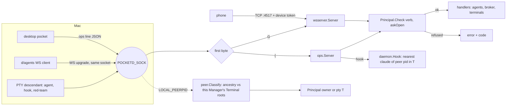

# Design: E03 no-self-approval (M0, L)

Date: 2026-09-30. Base: main `f8f7293`. Cites `P path:L` at that commit; `pd` = `packages/pocketd`, `pk` = `packages/desktop/crates/pocket/src`, `d` = `packages/desktop/crates`.
Sources: PRD FR 03-1..03-7, 02-3, 02-4, NFR S-10, D10, D17, D19, D20, D36; 05-roadmap §3 E03, §4, §7, §7.1; UXD §3.4, §3.11, §3.13, §6; UXP §4.1; R18 R6, R8, R9; C-control-plane §3, §10.

> **Review needed.** No owner interview took place. Every entry in the Decisions log is **PO-decided — review**.

> **Rebase note (dark theme).** The owner's plan `docs/plans/2026-09-30-dark-theme.md` touches these files that E03 also edits: `pk/palette.rs` (7 `rgba(..)` sites), `pk/desktop/chrome.rs` (3), `pk/terminal_view.rs` (2, incl. :63), `pk/desktop.rs` (3; dark PR3 adds `observe_window_appearance` to `_subs`), `pk/main.rs` (dark PR3: `WindowOptions`, `Root::new`; E03 PR1 changes only :33), and `d/ui/src/ui.rs` (E03 only calls `ui::modal`, `pop`, `Variant`). E03's `pk/modals.rs` and new `pk/modals/pair_phone.rs` have no colour sites today. If dark lands first, adapt PR4 mechanically:
> - `rgba(theme::X)` → `theme::X` (the plan's `perl -pi -e 's/\brgba\(([A-Z][A-Z0-9_]*)\)/$1/g'`).
> - Any new `u32` colour parameter → `theme::Token { light, dark }`. Literal colours stay `rgba(0x…)`.
> - The owner's decisions override UXD §2 where they differ: the dark palette, the blurred window, and the light accent unchanged. So PR4 uses only tokens that exist (`WAITING_TEXT`, `WAITING_BG`, `TEXT*`, `WHITE`), not UXD's `DIALOG`, `OVERLAY` or `ON_SOLID`.
> - `WHITE` is `Token::fixed` in the plan, so the QR card stays white in dark. QR modules are a literal black.
>
> pocketd, `packages/protocol`, `d/agents` and `d/daemon` are untouched by the theme work, so PR1–PR3 and PR5 need no rebase.

## 1. Problem

- Any process that can read `~/.coding-pocket/config.json` holds the phone token. That includes every agent in a Pocket Terminal (P pd/internal/config/config.go:36-61).
  - The desktop reads the token too (P d/agents/src/agents.rs:197-201) and sends it in hello (:248).
  - `pocketd serve` prints it (P pd/cmd/pocketd/serve.go:59; the roadmap cites :61).
- With the token, `permission.resolve` works for anyone: dispatch checks no scope (P pd/internal/wsserver/wsserver.go:154-161). An agent can approve its own ask.
- The ops socket has no authorization at all (P pd/internal/ops/ops.go:102-164). Any local process can spawn, attach, read screens, type input and prompts into any Terminal, or close one (:121-158).
- Hooks are forgeable. The client picks both the Terminal (`POCKETD_PTY`) and the claude pid (P pd/cmd/pocketd/hook.go:14-38). The server only checks that the pid is a claude in that Terminal (P pd/internal/daemon/claude.go:14-24).
- Prompts are typed raw: ESC, C0 and control sequences all reach the TUI (P pd/internal/terminal/terminal.go:278-287).

## 2. Scope and non-goals

In scope:
- FR 03-1: owner channel.
- FR 03-2: the scope matrix.
- FR 03-3 and 03-4: PTY-peer and input rules, prompt sanitation.
- FR 03-5: the red-team gate and the legacy grace.
- FR 03-6 and 03-7: the observe-only banner and the Pair phone dialog.

Non-goals:
- Grants (`pocketd grant`, `POCKETD_GRANT`): E15 (D19). The matrix below keeps the grant row as design only.
- The Devices sheet (S5), and the `files` and `orchestrate` scopes (D36).
- The "Driven by" badge, and a `proc_pidpath` owner allowlist (S-10 hardening later).
- Anything same-uid file access can do outside pocketd (§7).
- TCP binding and handshake hardening: E02 PR2.
- Pre-auth `pair` and `devices.json`: E02 PR3 and PR4.

## 3. UX

Palette (UXD §3.11, §6 Actions): the Actions group gains **"Pair phone…"**. It shows only when the principal is owner and hello.ok negotiated E02's pairing cap.

Pair phone dialog (UXD §3.13 dialog, §6 copy; details from R18 idea 18-4):

```
ui::modal w440 top160 pt22 px24 pb20, Esc closes, entrance (200, 8.) like Confirm
┌──────────────────────────────────────────────┐
│ Pair phone                              [×]  │ Display 20 Bold (ui::modal)
│ Scan with the iPhone Camera                  │ 13.5 TEXT_2
│      ┌──────────────────────────┐            │ card WHITE r12, 16 px quiet zone
│      │       240×240 QR          │            │ modules literal black, from `url`
│      └──────────────────────────┘            │
│ Or enter this code: {code}                   │ 13.5 TEXT_2; {code} MONO 14 TEXT, 22 chars
│ Expires in 4:59                              │ MONO 12 TEXT_3, ticks each second
└──────────────────────────────────────────────┘
expired: "Code expired" 13.5 TEXT_2 in place of the QR, [New code] Secondary h36 → pair.begin again
paired:  "Paired" replaces the QR block; the dialog closes 1.5 s later
```

Observe-only banner (UXD §3.4, D20, FR 03-6), directly under the session page bar:

```
│ Observe only — pocketd is managed elsewhere                              │ h28 px24, 12.5 WAITING_TEXT on WAITING_BG
```

When the principal is not owner, owner actions are disabled: new session, worktree and terminal, split, terminal keystrokes, close, and Pair phone. The palette omits them; their buttons are hidden (`ui` has no disabled state today).

Phone copy override, copied verbatim from 05 §7.1:

| UX section | Spec says | Winning decision | Text to build |
|---|---|---|---|
| UXP §4.1 pair copy | "On your Mac, open Devices → Pair phone" | E03 PR4 (the Devices sheet is S5) | "On your Mac, press ⌘K → Pair phone" |

The phone screen itself is E02 PR5. E03 only provides the Mac side the copy points to.

## 4. Architecture



- **One socket, two protocols.** `ops.Server.Serve` reads the peer pid once per conn and classifies it. It then peeks one byte, with a 10 s deadline:
  - `{`: the existing line-JSON loop.
  - `G`: the conn goes to an in-process `net.Listener`, served by `http.Server{Handler: ws, ConnContext: peer.With}`. `wsserver` reads the principal from the context.
  - TCP conns carry no principal until hello. After hello, the device from the token (E02 PR3) is the principal.
- **Classification (PR3).** Walk `proc.Parent` from the peer pid (P pd/internal/proc/proc_darwin.go). The nearest ancestor (or self) that is a live Terminal root pid (`t.Pid()`, P pd/internal/terminal/terminal.go:230) of *this* Manager makes the peer `pty(T)`. Otherwise it is owner.
  - A scratch pocketd's Manager holds none of the owner's Terminals. A desktop run from a Pocket Terminal is therefore owner of a scratch pocketd (D20 dev loop).
  - A walk that fails midway (pid died) yields an observe-only principal: fail closed.
  - PR1 and PR2 use E02 PR3's classification as merged. PR3 replaces it.
- **Hooks (PR3).** The server derives the claude pid: `daemon.NearestClaude(peer.Ancestors(peerPid))`, moved from P pd/cmd/pocketd/hook.go:40-65 with its test. The hook is accepted only if the principal is `pty(T)`, `T == m.ID`, and that claude has a presence in T. The client stops sending `Pid`.
- **Ask guard (PR3).** `askOpen(T)` is true when any Agent in T has status Needs you or an open broker request. For a pty principal it is checked before scope, so the red-team sees `ask_open` rather than a generic refusal. It holds for any future pty scope (E15).
- **Sanitize (PR3).** It runs inside `Terminal.Prompt`, so every path is covered:
  - WS `agent.prompt` (P pd/internal/wsserver/wsserver.go:192)
  - ops prompt (P pd/internal/ops/ops.go:152)
  - deny feedback (P pd/internal/daemon/daemon.go:167)
  - compact (P pd/internal/daemon/presence.go:149)
  - The `!`/`/` refusal applies only to pty principals, in `Check`, because `/compact` is pocketd's own.
- **Desktop (PR1).** `agents::connect` takes the socket path and runs `tungstenite::client("ws://localhost/", UnixStream)`. Its hello carries no token and adds cap `scopes.v1`. `Event::Connected` is sent after hello.ok, carrying the scopes.

## 5. Contract

### Scope matrix (FR 03-2, 03-3; R18 R6)

Principals and their scopes:
- **owner**: observe, drive, approve, spawn, owner.
- **device** (E02 paired): observe, drive, approve, spawn.
- **legacy device**: observe, drive, approve.
- **pty(T)**: observe, plus a hook for T only.
- **grant (E15)**: design only, never approve (D19).

| Surface | Verb | Needs | pty(T) |
|---|---|---|---|
| ws | `agent.list`, `agent.timeline`, `agent.view`, `agent.seen` | observe | allowed |
| ws | `agent.prompt`, `agent.interrupt`, `agent.compact`, `agent.close` | drive | `ask_open` if the target's T has an open ask, else `scope_denied` |
| ws | `permission.resolve` | approve | `scope_denied` |
| ws | `pair.begin`, E02 devices verbs | owner | `scope_denied` |
| ops | `list`, `status` (E04) | observe | allowed |
| ops | `hook` | own Terminal | `not_own_terminal` / `hook_forged` |
| ops | `spawn` | spawn + owner | `scope_denied` |
| ops | `attach`, `screen`, `resize`, `close` | owner | `scope_denied` (never read other Terminals, R18 R9) |
| ops | `input`, `prompt` | owner | `ask_open` if T has an open ask, else `scope_denied` |
| any | unknown verb | refused | `scope_denied` (fail closed; new verbs add a `Needs` row) |

### Error codes (extend E02 PR1's coded `error`; the message names the fix)

| Code | When | Message |
|---|---|---|
| `scope_denied` | missing scope | "{verb} needs {scope}; run it outside Pocket Terminals, or against a scratch pocketd (POCKETD_SOCK)" |
| `ask_open` | pty input/prompt while T has an ask | "Terminal {T} is waiting on an ask; answer it from the desktop or phone" |
| `not_own_terminal` | hook `m.ID` ≠ the peer's T | "hooks are accepted only for the caller's own Terminal" |
| `hook_forged` | no claude ancestor with a presence in T, or a hook from an owner/device | "hook sender is not a claude in this Terminal" |
| `prompt_refused` | a pty-sourced prompt starts with `!` or `/` | "agent prompts can't start with ! or /" |
| `prompt_too_large` | > 64 KiB after sanitation | "prompt exceeds 64 KiB" |

Legacy expiry reuses E02's `not_paired` at hello, and closes live sockets with 4401 (E02 revoke path).

### Go

```go
// internal/peer (package from E02 PR3; E03 adds or adapts names to what merged)
type Scope string
const (Observe Scope = "observe"; Drive Scope = "drive"; Approve Scope = "approve"; Spawn Scope = "spawn"; Own Scope = "owner")
type Kind uint8
const (Owner Kind = iota; Device; PTY)
type Principal struct { Kind Kind; Pid int; Terminal string; Device string; Scopes []Scope }
type Refusal struct { Code, Message string }            // implements error
var Needs map[string]Scope                                // keys "ws:agent.list", "ops:spawn", …
func (p Principal) Check(verb string, askOpen bool, text string) *Refusal
func Classify(pid int, roots map[int]string) Principal    // PR3; roots = Terminal root pid → Terminal ID
func Ancestors(pid int) ([]proc.Proc, error)              // PR3; moved from cmd/pocketd/hook.go:40-54
func With(ctx context.Context, p Principal) context.Context
func From(ctx context.Context) (Principal, bool)

// internal/terminal
const MaxPrompt = 64 << 10
func Sanitize(text string) (string, error)                // strips C0 except \n \t, ESC, DEL; ErrPromptTooLarge
func (m *Manager) Roots() map[int]string                  // PR3
// Terminal.Prompt(text) error: unchanged signature, now calls Sanitize first

// internal/daemon
func NearestClaude(chain []proc.Proc) int                 // PR3; moved from cmd/pocketd/hook.go:58-65
func (d *Daemon) Hook(ctx context.Context, p peer.Principal, m ops.Msg) []byte   // PR3; was (ctx, m)
func (d *Daemon) AskOpen(terminalID string) bool          // PR3

// internal/ops
type Msg struct { …; ErrorCode string `json:"errorCode,omitempty"` }            // PR2; Pid removed in PR3
type Server struct { Terminals *terminal.Manager; Spawn …; Hook func(context.Context, peer.Principal, Msg) []byte; WS http.Handler; AskOpen func(string) bool }

// internal/wsserver
type Server struct { …; AskOpen func(terminalID string) bool; Pair *pair.Service /* E02 PR4 */ }  // Token field removed (PR1)

// internal/config
type Config struct { Port int `json:"port"` }             // PR1: Token removed; Load migrates it

// internal/proto
type HelloOK struct { …; Scopes []string `json:"scopes,omitempty"` }            // PR1, cap scopes.v1
type PairDone struct { Type string `json:"type"`; DeviceID string `json:"deviceId"`; Name string `json:"name"` }  // PR2
const CapScopes = "scopes.v1"
const (CodeScopeDenied = "scope_denied"; CodeAskOpen = "ask_open"; CodeNotOwnTerminal = "not_own_terminal"; CodeHookForged = "hook_forged"; CodePromptRefused = "prompt_refused"; CodePromptTooLarge = "prompt_too_large")
```

`DecodeClient` stops requiring `hello.token`. On TCP a missing token is `not_paired`. On the unix socket the token is ignored.

### TypeScript (`packages/protocol/src/messages.ts`)

```ts
export const CAP_SCOPES = "scopes.v1";
export const Scope = Schema.Literal("observe", "drive", "approve", "spawn", "owner");
// Hello: token: Schema.optional(Schema.String)
// HelloOk gains: scopes: Schema.optional(Schema.Array(Scope))
export const PairDone = Schema.Struct({ type: Schema.Literal("pair.done"), deviceId: Schema.String, name: Schema.String });
// ServerMessage union += PairDone
// ErrorCode literal (E02 PR1) += "scope_denied" | "ask_open" | "not_own_terminal" | "hook_forged" | "prompt_refused" | "prompt_too_large"
```

- `PROTOCOL_VERSION` stays 3. Changes are additive, and `scopes` is sent only under `scopes.v1`.
- `pair.done` goes only to the conn that issued the matching `pair.begin`, when the phone's `pair` succeeds. It rides E02's pairing cap.
- New goldens:
  - `client/hello_no_token.json`
  - `server/hello_ok_scopes.json`
  - `server/pair_done.json`
  - `server/error_scope_denied.json`

### Rust

```rust
// d/agents (PR1)
pub fn connect(sock: &Path) -> (Outbox, UnboundedReceiver<Event>)   // was connect(home)
pub enum Event { …, Connected(Vec<String>) /* scopes from hello.ok */ }
impl Agents { pub scopes: Vec<String>; pub fn owner(&self) -> bool }
// d/agents (PR4)
impl Outbox { pub fn pair_begin(&self) }
pub enum Event { …, PairCode { url: String, code: String, expires_at: String }, Paired(String) }
// d/daemon (PR2)
pub struct Msg { …, #[serde(rename = "errorCode")] pub error_code: String }
// pk (PR4)
pub enum Overlay { …, PairPhone }                                    // pk/desktop/chrome.rs:36
pub enum Pick { …, PairPhone }                                       // pk/palette.rs:12
pub struct PairPhone { code: Option<Code>, paired_at: Option<Instant> } // pk/modals/pair_phone.rs, composed by Desktop
struct Code { url: String, code: String, expires: Instant, qr: Qr }
struct Qr { size: usize, dark: Vec<bool> }                           // encoded once per code, never in render
fn pair_text(left: Duration, paired: bool) -> PairText               // pure; "Expires in 4:59" / "Code expired" / "Paired"
pub fn observe_banner() -> Div                                       // pk/desktop/chrome.rs
```

Dependency: `qrcode` (MIT OR Apache-2.0) with `default-features = false`, in `pk` only. No QR crate is in `~/.cargo/registry`, so it is new. The QR paints in one `canvas`, as one quad per horizontal run of dark modules.

### CLI, config keys, files

- CLI:
  - `pocketd serve` stops printing `token:` (P pd/cmd/pocketd/serve.go:59). It still prints the socket and the phone URL.
  - `pocketd hook` stops sending a pid.
  - `pocketd run` and `pocketd attach` from inside a Pocket Terminal now fail with `scope_denied`.
  - `pocketd devices` (E02) shows `· grace ends {YYYY-MM-DD}` on the legacy row; `--json` gains `graceEndsAt`.
  - No new verbs.
- Config keys:
  - `config.json` loses `token`; `port` stays.
  - The `devices.json` legacy record gains `graceEndsAt` (RFC 3339; PR5).
  - `POCKET_HOME` and `POCKETD_SOCK` are unchanged. The red-team sets both, plus its own port.
- Files created:
  - `pd/internal/peer/scope.go`
  - `pd/internal/peer/classify.go` (PR3)
  - `pd/internal/terminal/sanitize.go`
  - `pk/modals/pair_phone.rs`
  - `pd/cmd/redteam/main.go` (not installed)
  - `scripts/red-team.sh`
  - Goldens as above.

## 6. Data and state

- `config.json`: `{ "port": 4517 }`. PR1 migration in `config.Load`:
  - If `token` is present, call E02's `devices.EnsureLegacy(token)`. It is idempotent and stores only sha256.
  - Then rewrite `config.json` without the token, atomically (temp + rename, 0600).
  - A fresh install creates no legacy device. Phones pair.
- `devices.json` (E02, 0600, atomic): PR5 sets `graceEndsAt = firstStart + 7d` on the legacy record if it is unset. `firstStart` is the first `serve` of a PR5 build.
  - A timer at `graceEndsAt` calls E02's `Revoke(legacyID)`: the record is deleted, and live sockets close with 4401.
  - A later hello with the old token gets `not_paired`, and the phone shows its Revoked screen (E02 PR5).
- Principal: computed per conn, never persisted. Classification costs about 10 `sysctl` reads per conn, including hook conns (one per hook call).
- Asks: already in memory (`presence.asks`, broker pending). `AskOpen` reads them under their existing locks.
- Desktop:
  - `Agents.scopes` (d/agents) is replaced on each hello.ok.
  - `PairPhone` state lives in `pk/modals/pair_phone.rs` (ADR 0003).
  - A 1 s timer runs only while the dialog is open.
- Events: if E04 PR4's `events.jsonl` has landed, each refusal emits `refusal {surface, code}`. E03 does not depend on it.

## 7. Failure modes

| Case | Behaviour |
|---|---|
| Old desktop, new pocketd | `config.json` has no token, so `agents::run` returns early. Terminals work; agents and timelines stay empty. PR1 is atomic, so only a stale build hits this. |
| New desktop, old pocketd | The ops loop fails to parse `GET /…` and closes the conn. Agents retry every 2 s (P d/agents/src/agents.rs:226-240). Fixed by the owner's next pocketd restart (never restarted from a plan, 05 §7). |
| Conn sends nothing | The peek deadline (10 s) closes it. |
| Peer pid dies before the walk | Observe-only principal (fail closed). A desktop reconnects and reclassifies. |
| Desktop started inside a Pocket Terminal against the owner's pocketd | Banner. `attach` is refused with `scope_denied`, whose message names the fix and shows in the page bar (P pk/terminal_view.rs:63). |
| Reparent: `nohup` + parent exits, `launchctl submit`, `open -a Terminal` | Looks external, so it gets owner. Residual, S-10 (R18:136,353). |
| TIOCSTI on the own `/dev/tty` | **Kernel-allowed** on macOS 26.6.2 (25G83) for a non-root process. Verified: a `pty.fork` child opened `/dev/tty`, `ioctl(TIOCSTI)` returned 0, and the child read the injected line back. pocketd never sees those bytes, so an agent's tool subprocess can type into its own TUI, including an open dialog. Residual, S-10. The red-team probes it at runtime and records the result. |
| Agent tool subprocess forges a hook for its own claude | Accepted: it descends from that claude in T. Harm is bounded: a forged `PermissionRequest` is answered back to the forger, and status events only mislabel its own Agent. Residual, added to S-10. |
| Same-uid file writes (`devices.json`, `~/.claude/settings.json`, killing pocketd) | Outside pocketd's reach. Gated only by the agent's own permission prompt. Residual, added to S-10. |
| Terminal root exits while its children live | The children reparent to launchd, so they look external. Same as the reparent residual. |
| pocketd restarts while the dialog is open | On `Connected` the dialog drops its code and shows "Code expired" with [New code]. |
| `pair.done` never arrives | The countdown reaches "Code expired". |
| Phone not re-paired within 7 days | Revoked screen, then the pair flow (E02 PR5). `pocketd pair` in Terminal.app stays the fallback (FR 03-7). |
| Clock jumps | `graceEndsAt` is wall time. A jump only moves the expiry; the fail direction is refusal. |

## 8. Test strategy

Tests sit beside the logic and are named as sentences. No mocks and no render tests: real processes, real unix sockets in `t.TempDir()`, and an injected `now` for grace.

- pocketd: `cd packages/pocketd && go vet ./... && go test -race -count=1 ./...`
  - `internal/peer`: "a child of a terminal root is that terminal's pty peer" (real `sh -c 'sleep 5'` under a real `terminal.Manager`); "a process outside every terminal is the owner"; "a nearer terminal root wins"; "a dead pid gets observe only"; "every verb × principal matches the matrix" (table over `Needs`); "an unknown verb is refused"; "a pty prompt starting with ! or / is refused".
  - `internal/terminal`: "sanitize strips C0, ESC and DEL but keeps newline and tab" (table); "a prompt over 64 KiB is refused".
  - `internal/ops`: "a websocket upgrade and line json share one socket"; "a silent conn is closed after the peek deadline"; "a pty peer can list but not attach".
  - `internal/daemon`: "a hook from another terminal is refused as not_own_terminal"; "a hook whose nearest claude is not in that terminal is refused as hook_forged" (fake claude: `bash -c 'exec -a claude sleep 5'`); "input to a terminal with an open ask is refused as ask_open". The `nearestClaude` cases move here from `cmd/pocketd/hook_test.go`.
  - `internal/wsserver`: "resolve without approve is refused"; "hello over the socket needs no token"; "hello over tcp without a token is not paired"; "pair.done reaches only the conn that began pairing"; "the legacy device is refused once its grace ends".
  - `internal/config`: "a config with a token moves it into devices and forgets it".
  - Goldens: `go test ./internal/proto -update`, then `git diff testdata/golden`.
- protocol: `pnpm --filter @pocket/protocol test` (excess properties fail).
- desktop, from `packages/desktop`: `cargo build --workspace`, `cargo clippy --workspace --all-targets`, `cargo test -p agents`, `cargo test -p pocket pair`.
  - `d/agents`: `sends_queued_messages_while_pocketd_is_quiet` (P d/agents/src/agents.rs:354) moves from `TcpListener` + `config.json` to a `UnixListener`. New: "connected carries the scopes from hello.ok".
  - `pk/modals/pair_phone.rs`: "the countdown reads minutes and seconds"; "an expired code offers a new one"; "paired replaces the code"; "a qr is encoded once per code".
  - `pk/palette.rs`: "pair phone is offered only to the owner".
- Red-team (the PR5 gate): `scripts/red-team.sh`, run from a Pocket Terminal.
  1. Builds pocketd and `cmd/redteam` into a temp dir, then starts a **scratch** pocketd with its own `POCKET_HOME`, `POCKETD_SOCK` and a free port.
  2. As owner of that scratch pocketd, spawns scratch Terminals. One runs a fake `claude` (above); its real hook raises an open ask. Another runs `redteam --inside`.
  3. The inside stage, a pty peer of scratch, expects these codes:
     - `permission.resolve` → `scope_denied`
     - `pair.begin` → `scope_denied`
     - devices verbs → `scope_denied`
     - ops `spawn` → `scope_denied`
     - forged hook (other T, fake pid) → `not_own_terminal` / `hook_forged`
     - input to the other Terminal → `ask_open` / `scope_denied`
     - prompt "1" into the Needs-you Terminal → `ask_open`
  4. Residual probes, whose outcome is recorded, not failed:
     - `nohup` a probe, then exit its parent
     - `launchctl submit -l pocket.redteam.<rand>`, removed afterwards
     - TIOCSTI on `/dev/tty`
  5. It exits 0 and lists the residuals, or exits 1 if any expected code is missing.
  - It never touches the owner's pocketd and never runs an agent turn.
- Manual: by the implementer only, never by a plan run. A desktop against a scratch pocketd:
  - pair via ⌘K with a phone
  - from inside a Pocket Terminal against the owner's pocketd, the banner shows

## 9. PR slicing (roadmap E03; deps binding)

| # | Title | Lane | Scope | Depends on |
|---|---|---|---|---|
| 1 | Owner channel | P (atomic: pd + d/agents + pk/main.rs:33, alerts.rs:64) | WS over the unix socket (sniff); hello token optional; `hello.ok.scopes` + `scopes.v1`; the desktop dials the socket and drops `token()`; `config.json` token migrated and deleted; the serve print removed | E02 PR3 |
| 2 | Scope enforcement | P | `peer.Needs`/`Check` on every WS and ops verb; `errorCode` on ops; `pair.done`; d/daemon `error_code`; goldens | PR1, E02 PR4 |
| 3 | PTY-peer rules | P | `Classify` by this instance's Terminal roots; server-side hook verification (`Pid` dropped); `AskOpen` guard; `Sanitize`; refusal codes | E02 PR3, PR2 |
| 4 | Desktop owner UI | C | palette "Pair phone…"; `PairPhone` dialog + QR; observe-only banner; owner actions disabled | PR1, PR2, E02 PR4 |
| 5 | Red-team gate + legacy grace | P | `scripts/red-team.sh`, `cmd/redteam`; `graceEndsAt` + revoke timer; S-10 residual lines | PR2, PR3, PR4, E02 PR5 |

- The dependencies go beyond the roadmap's §4 table in two places, and neither changes the week:
  - PR3 and PR4 also need PR2. PR3's ask guard and PR4's `pair.done` land there.
  - PR2 needs E02 PR4, because `pair.begin` must exist to gate it.
  - Roadmap wk 2 already orders E02 PR4 → E03 PR1 → PR2 in lane P, and PR4 is wk 3.
- Lane C stays out of `d/agents` and `d/daemon` until PR1 merges (05 §2). Only one golden-touching PR is open at a time.
- Downstream: E04 PR1 and E06 PR3 need PR3. E05 PR2, E06 PR2, E10, E12 and E13 need PR2. E08 PR5 needs PR1.

## 10. Decisions log (each PO-decided — review)

| # | Decision | Rejected alternatives |
|---|---|---|
| E03-1 | The WS for local clients runs over the existing `POCKETD_SOCK`, split by its first byte | a second `ws.sock` (a second path to mirror in env, scratch setups and chmod); moving the agent namespace into ops (rewrites `d/agents` and the phone schema twice) |
| E03-2 | The owner is decided by the peer (`LOCAL_PEERPID` + ancestry), never by a token or env | a desktop-only token (any same-uid reader takes it); `POCKETD_PTY` in the peer env (strippable: `env -u`) |
| E03-3 | A PTY peer is a descendant of a live Terminal root of *this* Manager | "has `POCKETD_PTY`" (fails the scratch dev loop, D20); any pocketd's Terminals (a scratch desktop would be observe-only) |
| E03-4 | PTY peers get observe plus an own-Terminal hook only; attach, screen and resize are owner | read-only attach for PTY (R18 R9: never read other Terminals; the D20 dev loop uses scratch) |
| E03-5 | Hook identity is derived server-side from the peer pid; the payload pid is dropped | keep verifying the client pid (forgeable); signing hooks with a per-Terminal secret in env (readable by the same agent) |
| E03-6 | The ask guard is checked before scope for PTY principals, and returns `ask_open` | only scope (red-team can't tell the rule from a missing scope; E15 grants would reopen the hole) |
| E03-7 | `Sanitize` lives in `Terminal.Prompt`; the `!`/`/` refusal sits in `Check`, for PTY only | sanitizing at each caller (the deny feedback path would be missed, P pd/internal/daemon/daemon.go:167); refusing `/` for everyone (breaks `/compact`, presence.go:149) |
| E03-8 | Unknown verbs are refused (`Needs` is an allowlist) | default observe (a new verb ships open by accident) |
| E03-9 | ops `errorCode` is a new field | reusing `code` (already the exit code, P pd/internal/ops/ops.go `Msg.Code`) |
| E03-10 | `hello.token` becomes optional; the socket ignores it, TCP requires it (`not_paired`) | a separate `hello.local` type (a second hello path and golden set) |
| E03-11 | `pair.done` goes to the conn that began pairing, so the dialog closes | polling a devices verb (E02 has no desktop-facing list yet); closing on expiry only (fails FR 03-7) |
| E03-12 | The desktop renders the QR locally from `url` with the `qrcode` crate | pocketd returning a module matrix (extends E02's `pair.begin` contract and couples it to E02's Go QR choice) |
| E03-13 | Dialog copy is UXD §6 ("Paired", not R18's "Paired {name}"); expiry copy is R18's "Code expired" / "New code" | UXD alone (it has no expiry state) |
| E03-14 | The grace starts at the first `serve` of a PR5 build, and expiry is E02's revoke | a manual `pocketd devices grace` verb (new CLI surface); a hello-time check only (live sockets would outlive the grace) |
| E03-15 | TIOCSTI is a confirmed residual (verified on 26.6.2); no mitigation in E03 | spawning agents without a controlling tty (breaks every TUI); intercepting on the master (the injected bytes never pass it) |
| E03-16 | The red-team is a Go stage driven by a bash wrapper against a scratch pocketd, with a fake `claude` | pure bash (no WS client on a stock Mac); against the owner's pocketd (05 §7; a regression could resolve a real ask); real agent turns (paid) |
| E03-17 | Observe-only disables pocketd owner verbs only; git actions stay | disabling the whole UI (git is local and not pocketd's to gate) |

## 11. Owner questions

None. No item involves money, accounts or licences. `qrcode` is MIT OR Apache-2.0.

## Appendix: assumptions on E02, and how they were checked

- E02 PR1 adds `code` to `error`, plus `hello.caps` and `protocol`. E03 extends the code enum.
- E02 PR3 ships `internal/peer`, `devices.json` with sha256, `EnsureLegacy` and `Revoke` closing with 4401. E03 adapts to the merged names, not the reverse.
- E02 PR4 names the `pair.begin` reply. The Rust `Event::PairCode` maps whatever it merged.
- `LOCAL_PEERPID` is `0x2` in golang.org/x/sys ≥ v0.39 (`unix/zerrors_darwin_arm64.go:938`). `pd/go.mod` pins v0.48.0.
- TIOCSTI is defined in the SDK's `sys/ttycom.h:125`. Runtime behaviour was probed as in §7, with a harmless local pty and no pocketd.
- No Rust QR crate is cached. `rsc.io/qr` v0.2.0 is in the Go module cache (E02's choice for `pocketd pair`).
