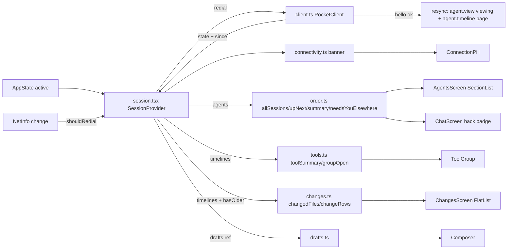

# Design: E17 phone-shell (M1, L)

Date: 2026-09-30. Base: main `f8f7293`. Cites `P path:L` at that commit; `app` = `packages/app/src`, `apt` = `packages/app/test`, `pd` = `packages/pocketd`, `proto` = `packages/protocol/src`.
Sources: PRD FR 17-1..17-5, D1, D2, D39, D43; 05-roadmap §3 E17, §4, §7, §7.1; UXP §1, §2.2, §3, §4.2, §4.3, §4.6, §5.1, §5.3, §9, §12; R08 §F12, ideas 08-6/08-7/08-11; R05 ideas 05-1/05-10/05-11; CONTEXT.md.

> **Review needed.** No owner interview took place. Every entry in the Decisions log is **PO-decided — review**.

> **Rebase note (dark theme).** `docs/plans/2026-09-30-dark-theme.md` touches no `packages/app` file (verified: no `packages/app`, `phone` or `app/` hits in the plan). No adaptation is needed.
>
> **Rebase note (other lane-C phone PRs, same files).** Written against `f8f7293`. If they merge first:
> - E01 PR4 (`docs/designs/2026-09-30-fix-now.md` §5.4). `Composer`'s `busy` becomes `working`, and it gains `provider`. Here, `offline` is ORed into its `sendDisabled(...)`. `permission?` becomes `permissions: Permissions`, which E01 already resets on `hello.ok`, so PR2 drops its own `setPermission(undefined)`.
> - E02 PR5 (`2026-09-30-reach-lockdown.md` §5.6). `ConnectScreen` is replaced by Pair. The saved-key loading here moves to `credentials.load`, and the `"Rejected"` stop moves to `outcome()`. `redial()`, the backoff and `connectivity.ts` stay as they are.

## 1. Problem

- **Dead controls.** "Review changes", "Open raw terminal", "Attach" and "Dictate" have no handler (P app/screens/ChatScreen.tsx:147-159; P app/components/Composer.tsx:28-32,44-46).
- **Wrong words.** "Agents" (P app/screens/AgentsScreen.tsx:14), "Waiting for approval" (P app/components/TimelineView.tsx:83; "waiting" is on the CONTEXT.md avoid list) and "Back to agents" (P app/screens/ChatScreen.tsx:131). The empty state tells the user to type a CLI command (P app/screens/AgentsScreen.tsx:24).
- **Ejects on every drop.** Any close sets `offline`, and Root then swaps to ConnectScreen, which reads "Disconnected — retrying" (P app/App.tsx:22-26; P app/screens/ConnectScreen.tsx:59). Other problems:
  - Backoff runs 1 s → 30 s (P app/client.ts:7,54), with no redial on foreground or network change.
  - Nothing resyncs after a reconnect. pocketd drops the connection's view (P pd/internal/wsserver/wsserver.go:61), so the open Session stops being Seen. A tool call that ended during the drop stays "running".
  - A bad token retries forever (P app/client.ts:44-48 vs P pd/internal/wsserver/wsserver.go:124-125).
  - The app never auto-connects; the user taps Connect on every launch (P app/screens/ConnectScreen.tsx:15-26).
- **Order and colour disagree with the desktop.**
  - The whole list re-sorts on every status change, and ties go newest-first (P app/screens/AgentsScreen.tsx:9; P app/status.ts:23-25). This violates D2 and D39.
  - Tones: Done is accent and Working is green (P app/status.ts:15-17). This violates D1.
  - There is no summary line, and a Needs you in another Session isn't visible from inside one.
- **Chat loses work.** The draft dies on unmount (P app/components/Composer.tsx:16). Tool groups read "N actions · Ns" and are always open (P app/components/ToolGroup.tsx:75-86).
- **No way to review edits.** The diff pill shows totals only (P app/screens/ChatScreen.tsx:62-77,147-153).

## 2. Scope and non-goals

In scope: FR 17-1..17-5 in five PRs (§9). `packages/app` only. No pocketd, protocol or golden change. All PRs are lane C.

Non-goals:
- Outbox, delivery states, "Offline — sends are saved", held sends (E10 phone PR).
- Context chip (E16 PR4); New session and `(+)` (E06 PR5); push and the pre-prompt card (E11); Pair / Revoked / Update screens (E02 PR5).
- The rest of UXP §5.1 (S2):
  - "Reconnecting in {n}s" countdown and `retryAt`;
  - pull-to-refresh;
  - version-mismatch screen.
- UXP §2 token set, light mode, the native stack (UXP §3), row restyle (62 pt, no border), bubble fold, scroll rules, inline approval panel (E12), the terminal button (Phase 3 / S7), DiffView metric changes.
- "Session ended." screen (E09 restore decides what a restarted pocketd returns).

## 3. UX

§7.1 overrides touched, copied verbatim:

| UX section | Spec says | Winning decision | Text to build |
|---|---|---|---|
| UXP §4.2 Up next tie-break | most recently updated first | D39 | Needs you > Failed > Done (not Seen), then oldest transition first |
| UXP §4.2 summary | "1 needs you · 1 done · 2 working" | FR 17-3 | Urgency order, zero counts omitted: "1 needs you · 1 failed · 2 done · 3 working" |

Sessions (UXP §4.2, trimmed to E17; row style unchanged from P app/screens/AgentsScreen.tsx:64-79):

```
┌──────────────────────────────────────────┐
│ Sessions                    Disconnect   │ ← "Disconnect" stays until Settings (S)
│ 1 needs you · 1 failed · 2 done · 3 working
│              ( Reconnecting… )           │ ← glass 30 capsule; only down ≥ 4 s; tap = redial
│ UP NEXT                                  │ ← only if ≥ 1
│ ● Fix login redirect          Needs you  │   amber dot
│ ● Port uploader                  Failed  │   red dot
│ ✓ Add retry to uploader            Done  │   green check
│ ALL SESSIONS                             │ ← createdAt desc; never re-sorts
│ ✓ Add retry to uploader            Done  │ ← rows repeat (UXP §12)
│ ◌ Refactor store                Working  │   accent spinner
│ ● Fix login redirect          Needs you  │
│   Tidy README                            │   Idle: no label
│   zsh  Not attached · open on your Mac   │   0.5 opacity
└──────────────────────────────────────────┘
First connect (saved host, no hello.ok yet): centred spinner + "Connecting to {host}…";
after 10 s: "Can't reach {host}. Is your Mac awake (lid open) and on Tailscale?" + "Try again".
Empty online: "No sessions yet" / "Start one on your Mac."
```

Session header (UXP §4.3 minus the terminal button):

```
│ (‹ 2) ( Fix login redirect     )( ± +42 −7 ) │ ← badge = other Sessions in Needs you; pill only if edits (PR5)
│       ( Claude · pocket · opus )             │
│            ( Reconnecting… )                 │ ← same capsule; error banner below it as today
```

Changes (UXP §4.6), a full-screen layer over the Session:

```
│ (‹)          Changes             +42 −7  │
│ Edits in this session · 3 files          │ ← "Recent edits · 3 files" when older items weren't loaded
│ ›  app/session.tsx            +30  −4    │ ← file row, 44
│ ⌄  app/components/Composer.tsx +12 −3    │
│   Edit 2 of 2                            │ ← oldest first; each a DiffView
│ ›  README.md                   +0  −0    │
```

Copy (UXP §9; **new** marked):
- Titles and sections: "Sessions" · "Up next" · "All sessions" · "Changes".
- Empty list: "No sessions yet" / "Start one on your Mac.".
- Summary: "{n} needs you" / "{n} need you" · "{n} failed" · "{n} done" · "{n} working". Fallback "{n} sessions" / "1 session" (**new** singular).
- Connectivity:
  - "Connecting to {host}…";
  - "Reconnecting…" (05-roadmap E17 PR2 wording);
  - "Can't reach {host}. Is your Mac awake (lid open) and on Tailscale?";
  - "Try again".
- Rejected: "Rejected — token or version mismatch" (UXP §5.3).
- a11y:
  - "Back to sessions"; with a badge, "Back to sessions, {n} need you" / "…{n} needs you" (**new**);
  - "Review changes" (pill, PR5);
  - "Reconnect now" (capsule, **new**).
- Working row: "Needs you" replaces "Waiting for approval".
- Tool group, R05 grammar with the first letter capitalized:
  - `ran N command(s)` · `edited N file(s)` · `read N file(s)` · `searched N time(s)` · `started N task(s)` (**new**, for `task`) · `called N tool(s)` · `N failed`;
  - e.g. "Ran 2 commands · edited 1 file · 1 failed".
- Changes: "Edits in this session · {n} files" · "Recent edits · {n} files" (**new**) · "Edit {i} of {n}" · "Empty file".

## 4. Architecture



- Pure logic sits in `app/*.ts`, with tests beside it in `apt/*.test.mts`, as `status.test.mts` does today. Node 26 strips types from `.ts`; `.tsx` can't be imported by tests.
- Root keeps the state switch (P app/App.tsx:15-31):
  - `idle | rejected` → ConnectScreen.
  - An open agent present in `agents` → ChatScreen, **whatever the connection state**.
  - Otherwise → AgentsScreen.
  - `agents` is never cleared on a drop (only `disconnect` clears, P app/session.tsx:101-107), so the Session stays on screen while offline.
- ChatScreen renders ChangesScreen as an absolute full-screen layer (`showChanges` state). The timeline, the draft and `agent.view` stay mounted, so Changes keeps the Session Seen (UXP §3).

## 5. Contract

Nothing crosses the wire. No protocol message, cap, config key, CLI verb or error code is added. Types and fields below are exact.

```ts
// app/client.ts (changed)
export type ConnectionState = "idle" | "connecting" | "online" | "offline" | "rejected";
export class PocketClient {
  connect(): void;
  /** Reset backoff, drop any socket (handlers detached first, so it schedules no retry), dial now. No-op after close(). */
  redial(): void;
  send(msg: Outbound): string;       // unchanged; still a silent no-op when down (E10 fixes)
  close(): void;
}
// retry: BACKOFF.first doubling to BACKOFF.cap; reset after BACKOFF.stable ms online or on redial.
// hello timeout: no hello.ok within HELLO_TIMEOUT_MS of dialing → close → retry.
// error "Rejected" before hello.ok → state "rejected", no retry (E02 PR5 swaps in outcome()).

// app/connectivity.ts (new)
export const BACKOFF = { first: 250, cap: 16_000, stable: 30_000 } as const;
export const GRACE_MS = 4_000;            // UXP §1.4 "hide fast"
export const UNREACHABLE_MS = 30_000;     // down after having been online
export const FIRST_CONNECT_MS = 10_000;   // UXP §5.1 first connect failing
export const HELLO_TIMEOUT_MS = 10_000;   // = pocketd defaultHelloTimeout (P pd/internal/wsserver/wsserver.go:24)
export type Link = { state: ConnectionState; since: number; everOnline: boolean };
export type Banner =
  | { kind: "connecting"; text: string }      // "Connecting to {host}…" (first connect only, centred)
  | { kind: "reconnecting"; text: string }    // "Reconnecting…"
  | { kind: "unreachable"; text: string };    // "Can't reach {host}. Is your Mac awake (lid open) and on Tailscale?"
export function banner(link: Link, now: number, host: string): Banner | null;
export function nextBackoff(ms: number): number;                    // min(ms * 2, BACKOFF.cap)
export type Net = { isConnected: boolean | null; type: string };
export function shouldRedial(prev: Net | undefined, next: Net): boolean; // came online, or interface type changed while connected

// app/session.tsx (changed Session type; additions only, plus renamed keys)
type Session = {
  // existing fields…
  link: Link;
  host?: string;                          // hello.ok.hostname once seen, else the saved host
  hasOlder: Readonly<Record<string, boolean>>; // from agent.timeline.hasOlder
  drafts: Drafts;                         // stable object, never changes identity
  redial: () => void;
};
export const HOST_KEY = "pocket.host";    // moved from P app/screens/ConnectScreen.tsx:7-8
export const TOKEN_KEY = "pocket.token";
// Mount: saved host+token → connect(). AppState "active" && state !== "online" → redial().
// NetInfo listener → shouldRedial → redial(). hello.ok → clear permission; for `viewing` (the last ids
// passed to view()): send agent.view(viewing) and agent.timeline {agentId} (latest page, replace).

// app/order.ts (new)
export function allSessions(agents: readonly AgentSummary[]): AgentSummary[];   // createdAt desc, then id
export function upNext(agents: readonly AgentSummary[]): AgentSummary[];        // look().rank 0|1|2, then updatedAt asc, then id
export function summary(agents: readonly AgentSummary[]): string | null;       // null when empty
export function needsYouElsewhere(agents: readonly AgentSummary[], agentId: string): number;

// app/status.ts (changed): Tone unchanged; look(): done → "ok" (green), working → "accent". byUrgency deleted.

// app/drafts.ts (new)
export type Drafts = { get(agentId: string): string; set(agentId: string, text: string): void; clear(agentId: string): void };
export function createDrafts(): Drafts;   // Map-backed; setting "" deletes

// app/tools.ts (new)
export function toolSummary(calls: readonly ToolCall[]): string;
export function groupOpen(calls: readonly ToolCall[], live: boolean, override?: boolean): boolean;
// override ?? (live || calls.some(c => c.status === "running"))

// app/changes.ts (new)
export type ChangedFile = { path: string; edits: readonly FileDiff[]; additions: number; deletions: number };
export type ChangeRow =
  | { kind: "file"; key: string; file: ChangedFile; open: boolean }                           // key "f:" + path
  | { kind: "edit"; key: string; path: string; index: number; count: number; diff: FileDiff }; // key "e:" + path + ":" + index
export function changedFiles(items: readonly TimelineItem[]): ChangedFile[]; // first-edit order; +/- = latest edit
export function totals(files: readonly ChangedFile[]): { added: number; removed: number };
export function changeRows(files: readonly ChangedFile[], open: ReadonlySet<string>): ChangeRow[];
```

Components:
- `Composer`: props gain `offline: boolean`, `initialText: string`, `onChangeText(text: string): void`. Removed: Attach and Dictate.
- New `ConnectionPill({banner, onPress})` (`app/components/ConnectionPill.tsx`).
- New `ChangesScreen({agentId, onBack})` (`app/screens/ChangesScreen.tsx`).
- `ToolGroup`: props gain `live: boolean`.

Files created:
- `app/{connectivity,order,drafts,tools,changes}.ts`;
- `app/components/ConnectionPill.tsx`;
- `app/screens/ChangesScreen.tsx`;
- `apt/{copy,connectivity,order,drafts,tools,changes}.test.mts`.

Dependency: `@react-native-community/netinfo` 12.0.1, the version Expo 57 pins (verified in `node_modules/expo/bundledNativeModules.json:11`). Install with `npx expo install`, then `pod install`. Deleted exports: `byUrgency`; icons `Plus`, `Mic`.

Consumers:
- E10 builds its outbox on `link` + `redial` + the `hello.ok` resync.
- E11 holds a notification tap until `link.state === "online"`.
- E12 keeps the back badge (`needsYouElsewhere`) and `upNext`.
- E09 PR5 shows restore notices after the resync.

## 6. Data and state

| State | Where | Lifetime | Persisted |
|---|---|---|---|
| `link {state, since, everOnline}` | session.tsx | per `connect()`; `everOnline` resets on connect/disconnect | no |
| backoff ms, hello timer, online-since | PocketClient | per client | no |
| `viewing: string[]` | session.tsx ref | set by `view()`, even when the send drops | no |
| `host` | session.tsx | hello.ok.hostname > saved host | host in SecureStore (existing key) |
| drafts | `createDrafts()` in a ref | app process; cleared on send and on `closed` update | no (UXP §12) |
| `hasOlder` | session.tsx | per agent, replaced on each `agent.timeline` | no |
| group `override` | ToolGroup `useState` | per mounted group | no |
| Changes `open: Set<path>` | ChangesScreen | per open | no |

- The drafts store is a ref, so a keystroke re-renders only the Composer, not every `useSession` consumer.
- `banner()` needs a clock. The screens tick `now` every 1 s only while `link.state !== "online"`.
- Up next ties use `updatedAt` ascending as "oldest transition first". This is sound: pocketd moves `updatedAt` only on a status step, not on Seen or setters (P pd/agent/agent.go:187-203). Status `done` already means not Seen, since Seen turns it Idle (UXP §5.4).
- Changes is bounded by the loaded timeline: the latest page (default 200, P pd/internal/wsserver/wsserver.go:23) plus streamed items, one path per tool item. So 1000+ files is an upper bound, not the norm. The list is virtualized anyway (§8).

## 7. Failure modes

| Case | Behaviour |
|---|---|
| pocketd restarts (pre-E09) | Screen stays; "Reconnecting…" after 4 s; a 250 ms-based redial lands within ~1 s of pocketd's return. After `hello.ok` the new `agent.list` has no old agents → Root falls back to Sessions (today's rule P app/App.tsx:18). Drafts are kept by id |
| Lid closed / Mac asleep | Dial hangs → hello timeout 10 s → retry. After 30 s down the capsule reads the lid-open copy |
| Wi-Fi → cellular while foreground | NetInfo `type` change → `redial()`, dropping a possibly half-open socket |
| Phone suspended > 30 s | pocketd pings every 20 s, times out after 10 s (P pd/internal/wsserver/wsserver.go:25-26) and drops the socket and the view. On `active`: redial → resync re-sends `agent.view`, so Seen recovers |
| Tool call ended during the drop | `tool_end` rewrites an item in place and keeps its `seq` (P pd/internal/timeline/timeline.go:122-140), so `sinceSeq` would miss it. The resync refetches the latest page and replaces it |
| Permission resolved elsewhere during the drop | `permission` is cleared on `hello.ok`; pocketd resends the ones still open (P pd/internal/wsserver/wsserver.go:135-139) |
| Wrong token / version | `error "Rejected"` → state `rejected` → ConnectScreen with "Rejected — token or version mismatch"; no retry loop |
| Send tapped while down | Send and Stop are disabled while `link.state !== "online"`; the text stays in the field and the draft |
| Redial storm (AppState + NetInfo together) | `redial()` is idempotent within one dial: it no-ops while `connecting` started < 1 s ago |
| Timeline has older items | Changes subtitle reads "Recent edits · {n} files" |
| A 5,000-line single edit | Rendered as one DiffView row, as ToolGroup does today (P app/components/ToolGroup.tsx:68). Not capped (D25) |

## 8. Test strategy

Commands (05-roadmap §7): `pnpm --filter @pocket/protocol build && pnpm --filter @pocket/app typecheck && pnpm --filter @pocket/app test`.
- Verified: in a fresh worktree `typecheck` fails with TS2307 until protocol's `dist/` is built.
- Verified: `pnpm --filter @pocket/app test` passes 7/7 on Node v26.8.1.
- No mocks, no render tests. Every test drives a pure module through its exports.

| File | Tests (named as sentences) |
|---|---|
| `apt/copy.test.mts` (PR1) | `phone copy uses no CONTEXT.md avoided word`; `dead controls are gone` ("Open raw terminal", "Attach", "Dictate"; "Review changes" is also asserted absent in PR1, and PR5 flips that assertion to present) |
| `apt/connectivity.test.mts` (PR2) | `a blip under four seconds shows nothing`; `a drop shows reconnecting from four seconds`; `a long drop names the lid and tailscale`; `a first connect shows connecting then unreachable after ten seconds`; `online shows nothing`; `backoff doubles from 250 ms to a 16 s cap`; `coming online or switching network redials`; `an unchanged network does not redial` |
| `apt/order.test.mts` (PR3) | `all sessions stay in creation order when a status changes`; `a new session goes first`; `up next ranks needs you then failed then done`; `up next breaks ties by oldest transition`; `working idle and not attached sessions are not up next`; `summary lists urgency order and omits zeros`; `summary says need you for more than one`; `summary falls back to a session count`; `summary is empty with no sessions`; `the back badge counts needs you in other sessions only` |
| `apt/status.test.mts` (PR3) | Tones updated: Done `ok`, Working `accent`. The two `byUrgency` tests move to `order.test.mts` with D39 semantics |
| `apt/drafts.test.mts` (PR4) | `a draft survives leaving and reopening its session`; `drafts are kept per session`; `sending clears only that draft`; `an empty draft is dropped` |
| `apt/tools.test.mts` (PR4) | `a group summary counts commands edits and failures`; `edits to one file count once`; `a single call reads singular`; `the first word is capitalized`; `a live group is open`; `a settled group folds`; `a user toggle wins over the fold` |
| `apt/changes.test.mts` (PR5) | `totals use the latest edit per file`; `edits are listed oldest first`; `files keep first-edit order`; `a closed file shows one row`; `an open file shows a row per edit`; `fifteen hundred files build one uniquely keyed row each` |

- **Avoid-list test (PR1).**
  - It parses every `app/**/*.ts(x)` with `typescript` (devDependency 6.0.3; verified importable from a `.mts` test).
  - It collects JSX text, string-valued JSX attributes, and string/template literals that contain a space or start with an uppercase letter. Code literals such as `"running"` (P app/components/ToolGroup.tsx:45) are therefore skipped.
  - Terms come from the `_Avoid_:` lines of the repo-root `CONTEXT.md`, read at test time. It matches whole words, case-insensitively.
  - The allowlist is `{file, term, reason}` with one entry to start: `read` in `components/ToolGroup.tsx` and `tools.ts`. It is Claude's Read tool, not Seen.
- **Manual, per 05-roadmap §7.**
  - Start a scratch pocketd: `POCKET_HOME=$(mktemp -d)`, a `config.json` with its own `token` and `port` (e.g. 4599), and `POCKETD_SOCK=$POCKET_HOME/pocketd.sock`. Point the simulator at it. Never touch the owner's pocketd.
  - PR2 steps:
    1. Kill the scratch pocketd: the Sessions screen stays, and "Reconnecting…" shows at about 4 s.
    2. Start it again: the capsule clears within about 1 s.
    3. Wrong token: the Rejected copy shows, and nothing loops.
  - PR5: scroll a synthetic 1000-file session (a scratch pocketd timeline isn't needed; use a dev-only fixture in the model test). Frame drops are judged in a release build (`expo run:ios --configuration Release`).

## 9. PR slicing

| PR | Title | FR | Files | Needs |
|---|---|---|---|---|
| 1 | Phone copy and dead controls | 17-1 | `app/screens/ChatScreen.tsx` (drop :147-159, a11y :131), `app/components/Composer.tsx` (drop :28-32, :44-46), `app/icons.tsx` (drop `Plus`, `Mic`), `app/screens/AgentsScreen.tsx` (:14, :24), `app/components/TimelineView.tsx` (:83), `apt/copy.test.mts` | — |
| 2 | Phone rides out drops | 17-2 | `app/client.ts`, `app/connectivity.ts`, `app/session.tsx`, `app/App.tsx`, `app/screens/{ConnectScreen,AgentsScreen,ChatScreen}.tsx`, `app/components/{Composer,ConnectionPill}.tsx`, `package.json`, `ios/Podfile.lock`, `apt/connectivity.test.mts` | — (rebases over E17 PR1 in Composer/ChatScreen if PR1 lands first) |
| 3 | Stable order, Up next, D1 tones, summary, back badge | 17-3 | `app/order.ts`, `app/status.ts`, `app/screens/AgentsScreen.tsx` (FlatList → SectionList), `app/screens/ChatScreen.tsx` (badge), `apt/{order,status}.test.mts` | — |
| 4 | Per-session drafts; tool summary and fold | 17-4 | `app/drafts.ts`, `app/tools.ts`, `app/session.tsx`, `app/components/{Composer,ToolGroup,TimelineView}.tsx`, `app/screens/ChatScreen.tsx`, `apt/{drafts,tools}.test.mts` | E17 PR1, E17 PR2 (both edit Composer props) |
| 5 | Changes screen | 17-5 | `app/changes.ts`, `app/screens/ChangesScreen.tsx`, `app/screens/ChatScreen.tsx` (pill back, `diffTotals` :62-77 → `changes.ts`), `app/session.tsx` (`hasOlder`), `apt/{changes,copy}.test.mts` | E17 PR1 |

No PR-level edges into or out of other epics are added. 05-roadmap §4 lists none for E17. Its consumers (E09 PR5, E10 phone, E11, E12) are §4 rows owned by those epics.

Per-PR notes for the implementer:
- **PR1.**
  - The GitBranch import drops with the pill; the `GitBranch` export stays because PR5 reuses it.
  - Only the three accessibility labels and the one working-row label change; no layout change.
- **PR2.**
  - `connect()` saves nothing new.
  - Order in `onmessage`: an `"error"` with message `"Rejected"` and no prior `hello.ok` sets a `rejected` flag, and `onclose` then emits `rejected`.
  - `redial()` sets `onclose = null` on the old socket before `close()`.
  - The hello timer starts in `connect()` and is cleared on `hello.ok`.
  - Online-since is stamped on `hello.ok`. `onclose` resets the backoff when online lasted ≥ 30 s.
- **PR3.**
  - Sections are `[{key:"up", title:"Up next", data: upNext}, {key:"all", title:"All sessions", data: allSessions}]`. Keys are prefixed per section. The Up next section is omitted when empty.
  - Glyphs: Needs you and Failed are 7 pt dots; Done is a `Check` icon; Working is an `ActivityIndicator` in the accent.
- **PR4.**
  - ChatScreen mounts `<Composer key={agentId} initialText={drafts.get(agentId)} onChangeText={t => drafts.set(agentId, t)} …/>` and clears on send.
  - `live` is true for the last timeline row while the agent is Working.
- **PR5.**
  - The pill shows when `changedFiles(items).length > 0`.
  - ChangesScreen uses `FlatList<ChangeRow>`. `getItemLayout` is not used, because edit rows vary in height. Defaults `initialNumToRender` 10 and `windowSize` 21 are kept.
  - File rows toggle `open` with a 200 ms chevron.

## 10. Decisions log

All **PO-decided — review**.

1. **No navigation library.** Keep the App.tsx state switch. Changes is a layer inside ChatScreen. Rejected: `@react-navigation/native-stack` (new native deps; E02 PR5 decision 25 also keeps the switch); a Root route for Changes (unmounts the timeline, drops `agent.view` and scroll, and loses Seen).
2. **Keep file names `AgentsScreen`/`ChatScreen`.** Rejected: the UXP §11 renames. They churn files that E01 PR4 and E02 PR5 also edit.
3. **Avoid-list test.** Uses the TS AST, reads the terms from CONTEXT.md, and has a per-file allowlist. Rejected: regex grep over all literals (flags code literals such as `"running"`); a hard-coded term list (drifts from CONTEXT.md).
4. **Hide "Review changes" by deleting it in PR1 and restoring it in PR5.** Rejected: a flag constant (dead code for two weeks).
5. **"Disconnect" stays on Sessions**, and so does the global PermissionSheet. Rejected: `(⋯)` Settings (S item); an inline panel (E12).
6. **Capsule text "Reconnecting…"** (roadmap) at 4 s; the lid copy at 30 s; first-connect copy at 10 s. Rejected: "Reconnecting in {n}s" + `retryAt` (rest of S2); "Offline — sends are saved" (false until E10's outbox).
7. **`{host}` = `hello.ok.hostname` once seen, else the saved host:port.** Rejected: always the IP (unfriendly); always the hostname (unknown before the first hello).
8. **Backoff 250 ms → 16 s, reset after 30 s online or on redial; hello timeout 10 s** (R08 §F12; matches pocketd's 10 s). Rejected: today's 1 s → 30 s (up to 30 s dead after pocketd returns); no dial timeout (a sleeping Mac hangs the dial).
9. **Add NetInfo now.** A reconnect or interface change forces a redial. Rejected: AppState only (misses Wi-Fi ↔ cellular in the foreground and leaves half-open sockets). Cost: one native rebuild (owner question 1).
10. **Resync = the latest page for every viewed Session, plus `agent.view` resent.** Rejected: `sinceSeq` merge (UXP §5.1): in-place `tool_end` keeps its seq, so completions are missed; refetching every cached timeline (wasted; ChatScreen refetches on mount anyway).
11. **Offline disables Send and Stop and keeps the text.** Rejected: today's silent drop; holding sends (E10 outbox).
12. **Stop retrying on `"Rejected"`.** Rejected: waiting for E02 PR5 (until then the phone loops against a wrong token forever).
13. **Auto-connect on launch with the saved keys.** Rejected: keep tapping Connect (makes FR 17-2's first-connect copy unreachable). E02 PR5 later swaps in `credentials.load`.
14. **An agent missing after resync returns to Sessions** (today's rule). Rejected: a "Session ended." screen (not in FR 17-2; E09 decides restored identity).
15. **Up next tie-break by `updatedAt` ascending.** Rejected: a new `transitionAt` field (pocketd change; out of scope, and `updatedAt` already moves only on status steps).
16. **All sessions ordered `createdAt` desc, then id.** Rows appear in both sections. Rejected: list order from pocketd (not guaranteed stable across `agent.list` reloads).
17. **D1 tones via the existing `Tone` names.** Glyphs as §9 PR3; phone palette values unchanged. Rejected: UXP §2's full token set (no M1 epic owns it); the 2×3 cell spinner (motion work, later).
18. **Summary built from `look()` counts.** Singular "1 session"; hidden when the list is empty. Rejected: counting unattached agents' raw status (they look Idle per P app/status.ts:10).
19. **Back badge `‹ n`, hidden at 0,** counting other attached Sessions in Needs you.
20. **Drafts are an in-memory Map behind a stable ref.** Rejected: provider state (re-renders every consumer per keystroke); SecureStore/AsyncStorage persistence (AsyncStorage isn't installed; UXP §12 says in memory).
21. **Tool grammar.**
    - `task` → "started N task(s)"; `other` → "called N tool(s)";
    - edit and write dedupe paths; failures come last;
    - no duration.
    Rejected: keeping "· Ns" (R05 grammar has none); "ran N task(s)" (collides with commands).
22. **Fold rule: open while live or while any call runs; a user toggle wins.** Rejected: open only while a call runs (flickers between consecutive calls).
23. **Changes model.**
    - Files in first-edit order; totals from each file's latest edit (keeps today's pill numbers, P app/screens/ChatScreen.tsx:61-77); edits oldest first.
    - Rejected: most-recent-first (reorders while the agent works, against D2's spirit).
24. **"Recent edits" subtitle when `hasOlder`.** Rejected: claiming the whole session; auto-fetching older pages (unbounded; P-5 ≤512 KiB per reply).
25. **Plan question settled: no paging cap.** A virtualized `FlatList` over flattened rows. The loaded page bounds the size (§6). Rejected: a hard cap or "Show more" paging (new copy and state for a case the page limit already bounds).
26. **FR 17-5's "render test with 1000+ files" becomes a model test with 1500 files, plus a manual release scroll.** Rejected: adding a React Native renderer to the package (new test deps; the repo rule says no render tests).
27. **DiffView unchanged.** Rejected: the UXP §4.6 metric changes (visual polish; not in FR 17-5).

## 11. Owner questions

1. PR2 adds a native module (NetInfo). Your iPhone then needs a new dev build signed with your Apple team (`expo run:ios --device`). Is a rebuild in week 2 fine? Or should PR2 ship AppState-only, with NetInfo riding the next native rebuild (E11 push needs one anyway)? Default: add it now.
