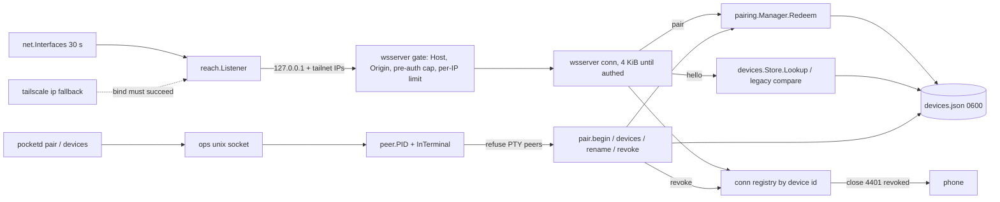

# Design: E02 reach lockdown (M0)

Date: 2026-09-30. Base: main `f8f7293`. Cites `P path:L` at that commit; `pd` = `packages/pocketd`, `app` = `packages/app/src`, `proto` = `packages/protocol/src`, `d` = `packages/desktop/crates`.
Sources: PRD FR 02-1..02-7, NFR S-1/S-4/S-8, D10/D17/D36, Q3; 05-roadmap §0, §3 E02, §4, §7, §7.1; UXP §3, §4.1, §5.1, §5.3; research R18 (R1, R5, R6); 06-prd-review #17, #50.

> **Review needed.** No owner interview took place. Every entry in the Decisions log is **PO-decided — review**.

> **Rebase note (dark theme).** The owner's dark-theme design and plan (`docs/plans/2026-09-30-dark-theme.md`) touch only `packages/desktop`. E02 touches no desktop files (`d/agents` keeps its hello unchanged, P d/agents/src/agents.rs:248). None are affected; no rebase needed.

## 1. Problem

- pocketd binds every interface: `net.Listen("tcp", ":"+port)` (P pd/cmd/pocketd/serve.go:46). NFR S-1 says never 0.0.0.0.
- `websocket.Accept` runs with `InsecureSkipVerify: true` (P pd/internal/wsserver/wsserver.go:53), so any web page can open the socket. There is no Host check. Pre-auth reads allow 1 MiB (:57). Nothing limits pre-auth sockets or failed attempts. The token compare is not constant-time (:123).
- One shared token for every client (P pd/internal/config/config.go:29-32). It is printed at startup (P pd/cmd/pocketd/serve.go:59), typed by hand into the phone (P app/ConnectScreen.tsx:36), and can't be revoked per phone.
- `requestId` is `"perm-" + seq` (P pd/internal/broker/broker.go:47), so it can be guessed.
- The version check is exact-match with a bare "Rejected" (P pd/internal/wsserver/wsserver.go:122-127). The phone can't tell "update Mac" from "update phone" and retries forever whatever the close code (P app/client.ts:44-48).
- Every phone connects as `"pocket-app"` (P app/session.tsx:76). SecureStore uses default accessibility (P app/ConnectScreen.tsx:7-8).
- The phone address comes from `tailscale ip -4` (P pd/cmd/pocketd/serve.go:63-69). Verified: with Tailscale Stopped the CLI still prints 100.77.122.82, but no interface carries it.

## 2. Scope and non-goals

In scope: FR 02-1 bind, 02-2 hardening, 02-3 devices, 02-4 pairing, 02-5 caps and range, 02-6 phone pairing, 02-7 Revoked and version screens.

Non-goals:
- Scope enforcement per message (E03 PR2). E02 stores scopes only.
- Owner WS channel, desktop to unix socket, legacy token migration and cutoff (E03 PR1/PR5, D17 steps 2–3).
- PTY-peer rules for other ops verbs (E03 PR3). E02 applies them only to its own verbs.
- The desktop Pair phone dialog (E03 PR4), Settings → Unpair via `devices.revokeSelf` (UXP §4.9), `hello.ok.host` and `host.v1` (E04 PR2).
- TLS. Tailscale (WireGuard) is the transport; wss:// is used only for hosts outside the tailnet.
- Navigation library (E17). Scopes `files`, `orchestrate` (D36).

## 3. UX

Copy is from UXP §4.1, §5.1 and §5.3, with the roadmap §7.1 override applied:

| Where | UXP says | Owner | Use |
|---|---|---|---|
| UXP §4.1 pair copy | "On your Mac, open Devices → Pair phone" | E03 PR4 (the Devices sheet is S5) | "On your Mac, press ⌘K → Pair phone" |

Until E03 PR4 ships, ⌘K → Pair phone doesn't exist yet; `pocketd pair` is the stopgap (see Failure modes).

Phone (root state switch, as in P app/App.tsx:15-31):

```
Pair                              EnterCode
┌──────────────────────────┐      ┌──────────────────────────┐
│         [qrcode]         │      │ Mac address              │
│   Pair with your Mac     │      │ [mac-mini.tail1234.ts.net:4517]
│ On your Mac, press ⌘K →  │      │ Code                     │
│ Pair phone, then scan    │      │ [22 characters from your Mac]
│ the code with the Camera │      │        ( Continue )      │
│ app.                     │      └──────────────────────────┘
│ Can't reach {host}. Is   │ ← danger status line, only after a failed reach
│ Tailscale on?            │
│  ( Enter code instead )  │
└──────────────────────────┘
ConfirmPair                        Revoked                    Update
┌──────────────────────────┐      ┌────────────────────┐     ┌──────────────────────────┐
│ Pair with {name}?        │      │ This phone was     │     │ Update Pocket on your    │
│ 100.77.122.82:4517 (mono │      │ removed.           │     │ Mac.  | Update Pocket on │
│ 13, muted)               │      │   ( Pair again )   │     │ this phone.              │
│ Name on your Mac [iPhone]│      └────────────────────┘     │     ( Try again )        │
│ A paired phone can run   │                                  └──────────────────────────┘
│ commands on this Mac as  │
│ you.                     │
│ ( Pair ⟳ )   Cancel      │
└──────────────────────────┘
```

- Camera scan opens `codingpocket://pair?...` (scheme at P packages/app/app.json:7) → ConfirmPair. EnterCode → Continue → ConfirmPair with the typed host.
- Pair shows a spinner and sends `pair`. On `pair.ok`: success haptic → Sessions. On relaunch, auto-connect.
- Errors on ConfirmPair (danger status line): `pair_expired` "Code expired. Make a new one on your Mac."; `pair_used` "This code was already used."; `pair_invalid` "This code doesn't match. Check it on your Mac."; `pair_locked` "Too many tries. Make a new code on your Mac in a minute."; unreachable "Can't reach {host}. Is Tailscale on?"; uncoded "Pairing failed. Make a new code on your Mac."
- Revoked (4401 or `not_paired`): SecureStore credentials are already wiped. "Pair again" → Pair. No retry.
- Update (4426, or hello.ok range below the phone's min, or "Malformed message"): "Update Pocket on your Mac." or "Update Pocket on this phone." Try again makes one attempt; no loop.

Mac CLI (owner terminal):

```
$ pocketd pair
█▀▀▀▀▀█ ▄▀ ▄ █▀▀▀▀▀█      ← QR, black on white via SGR, 4-module quiet zone
...
Scan with the iPhone Camera app, or enter  100.77.122.82:4517  q3xY…(22)  Expires at 14:05.
Paired iPhone.                                   (exit 0)
Code expired. Run pocketd pair again.            (exit 1)
Refused from inside a Pocket terminal. Run it in Terminal.app.   (exit 1)
Tailscale isn't running. Phones can't reach this Mac.            (exit 1)

$ pocketd devices
ID        NAME                    PLATFORM  LAST SEEN
legacy    Shared token (legacy)   -         2 min ago
3fa9c1d2  iPhone                  ios       now
$ pocketd devices revoke 3fa9 → "Removed iPhone. It was disconnected."   rename 3fa9 "Work" → "Renamed to Work."
```

`pocketd serve` prints `phone: ws://100.77.122.82:4517` for each tailnet listener, or `Phone access needs Tailscale`. It no longer prints the token (FR 02-3; the legacy token stays in config.json per D17).

## 4. Architecture



New packages: `pd/internal/reach` (bind, Host allowlist), `pd/internal/devices`, `pd/internal/pairing`, `pd/internal/peer`, `pd/internal/atomicfile`. Serve order: config → devices.Open → reach.Listen → ops.Listen.

## 5. Contract

### 5.1 Protocol (Go `pd/internal/proto`, TS `proto/messages.ts`, goldens in both)

`Version` stays 3 (P pd/internal/proto/proto.go:11, P proto/constants.ts:1). Add `MinVersion = 3`, `MaxVersion = 3` (Go) and `PROTOCOL_MIN = 3`, `PROTOCOL_MAX = 3` (TS). All new fields are optional and additive. The phone parses without a schema (P app/client.ts:37), and desktop serde ignores unknown fields (P d/agents/src/agents.rs:262). Old clients keep working.

```go
type Range struct{ Min int `json:"min"`; Max int `json:"max"` }
// ClientMessage (P pd/internal/proto/messages.go:9-24) gains:
Caps     []string `json:"caps,omitempty"`     // hello
Protocol *Range   `json:"protocol,omitempty"` // hello, pair; absent = {protocolVersion, protocolVersion}
Code     string   `json:"code,omitempty"`     // pair
Name     string   `json:"name,omitempty"`     // pair, ≤64 after trim
Platform string   `json:"platform,omitempty"` // pair: "ios" | "android"
// HelloOK (:89-99) gains; ProtocolVersion becomes the chosen version = min(client.Max, MaxVersion):
Caps     []string `json:"caps"`     // client caps ∩ server caps, sorted
Protocol Range    `json:"protocol"` // server range
// Error (:175-181) gains:
Code string `json:"code,omitempty"`
type PairOK struct{ Type string `json:"type"`; ID string `json:"id"`; DeviceID string `json:"deviceId"`; Token string `json:"token"` }
func Negotiate(client Range, clientCaps []string, serverCaps []string) (version int, caps []string, code string)
func NewErrorCode(id, code, message string) Error
var ServerCaps = []string{"pair.v1"}
```

```ts
// hello: add
caps: Schema.optional(Schema.Array(Schema.String)),
protocol: Schema.optional(Schema.Struct({ min: Schema.Number, max: Schema.Number })),
// new client message
Schema.Struct({ type: Schema.Literal("pair"), id: Schema.String, code: Schema.String, name: Schema.String,
  platform: Schema.Literal("ios", "android"), protocol: Schema.optional(Range) }),
// hello.ok: add  caps: Schema.optional(Schema.Array(Schema.String)), protocol: Schema.optional(Range)
// error: add     code: Schema.optional(Schema.String)
// new server message
Schema.Struct({ type: Schema.Literal("pair.ok"), id: Schema.String, deviceId: Schema.String, token: Schema.String }),
```

- `pair` is valid only before `hello`; after `pair.ok` the server closes 1000 and the phone reconnects with `hello`. `pair` after auth → `error` "Already authenticated". New clients send `protocolVersion` = their max plus `protocol`; `protocolVersion` stays required (P pd/internal/proto/messages.go:65-66).
- Caps: `<area>.v<n>`. E02 adds `pair.v1`. Reserved for later epics: `host.v1` (E04 PR2), `restore.v1` (E09).

### 5.2 Error codes and close codes

| `error.code` | Message | Then |
|---|---|---|
| `not_paired` | "Not paired" | close 4401 "not_paired" |
| `revoked` | (none: close only) | close 4401 "revoked" |
| `client_too_old` | "Update Pocket on this phone" | close 4426 "client_too_old" |
| `server_too_old` | "Update Pocket on your Mac" | close 4426 "server_too_old" |
| `pair_expired` / `pair_used` / `pair_invalid` / `pair_locked` | UX §3 copy | socket stays open until 10 s hello deadline |
| `rate_limited` | "Too many attempts" | close 1008 "rate_limited" (3rd failure); next upgrade → HTTP 429 |
| `tailnet_off` | "Tailscale isn't running. Phones can't reach this Mac." | ops only |
| `pty_peer` | "Refused from inside a Pocket terminal. Run it in Terminal.app." | ops only |

Before the upgrade: bad Host or Origin → HTTP 403; more than 16 pre-auth sockets → 503; per-IP limit → 429. A pre-auth frame over 4 KiB → close 1009 (library). "Not authenticated" (P pd/internal/wsserver/wsserver.go:145-147) is unchanged.

### 5.3 pocketd Go APIs

```go
// pd/internal/reach
func IsTailnet(ip netip.Addr, iface string) bool // 100.64.0.0/10 on utun* only; fd7a:115c:a1e0::/48 anywhere
type Iface struct{ Name string; Addrs []netip.Addr }
func TailnetAddrs(ifaces []Iface) []netip.Addr
type Listener struct{ /* set keyed by addr */ }
func Listen(port int, mode string, h http.Handler) (*Listener, error) // mode "auto" | "loopback"
func (l *Listener) Refresh()                       // run every 30 s by Listen's goroutine
func (l *Listener) Addrs() []netip.AddrPort
func (l *Listener) Tailnet() bool                  // E04 PR2 reads this for hello.ok.host.tailnet
func (l *Listener) AllowHost(host string) bool     // loopback, bound tailnet IPs, *.ts.net
func (l *Listener) PairHost() (string, bool)       // first tailnet IPv4:port
func (l *Listener) Close() error

// pd/internal/devices
type Scope string // "observe" | "drive" | "approve" | "spawn" | "owner"
var PhoneScopes  = []Scope{"observe", "drive", "approve", "spawn"}
var LegacyScopes = []Scope{"observe", "drive", "approve"}
const LegacyID = "legacy"
type Device struct {
  ID string `json:"id"`; Name string `json:"name"`; Platform string `json:"platform"`
  Scopes []Scope `json:"scopes"`; TokenHash string `json:"tokenHash"`
  CreatedAt int64 `json:"createdAt"`; LastSeenAt int64 `json:"lastSeenAt"`; LastAddr string `json:"lastAddr"` // ms
  Legacy bool `json:"legacy,omitempty"` // E03 PR1 writes the hashed legacy entry
}
func Open(path, legacyToken string) (*Store, error)
func (s *Store) Add(name, platform string, scopes []Scope) (Device, string, error) // token returned once
func (s *Store) Lookup(token string) (Device, bool)
func (s *Store) Has(id string) bool
func (s *Store) Seen(id, addr string, now time.Time) // persists at most once per 60 s
func (s *Store) List() []Device                      // TokenHash blanked
func (s *Store) Resolve(idOrPrefix string) (string, error) // ErrNotFound, ErrAmbiguous
func (s *Store) Rename(id, name string) error        // ErrLegacy for LegacyID
func (s *Store) Revoke(id string) error              // ErrLegacy for LegacyID
func NewToken() string                               // 32 bytes base64url, 43 chars

// pd/internal/pairing
type Offer struct{ URL string `json:"url"`; Code string `json:"code"`; ExpiresAt int64 `json:"expiresAt"` }
type Result struct{ DeviceID, Name, Code string } // Code "" | "pair_expired" | "pair_locked"
func New(now func() time.Time) *Manager
func (m *Manager) Begin(host, macName string) (Offer, <-chan Result, error)          // ErrLocked
func (m *Manager) Cancel(code string)
func (m *Manager) Redeem(code string, add func() (devices.Device, string, error)) (devices.Device, string, error)
var ErrExpired, ErrUsed, ErrInvalid, ErrLocked error

// pd/internal/peer
func PID(c *net.UnixConn) (int, error) // getsockopt SOL_LOCAL/LOCAL_PEERPID via SyscallConn().Control
func InTerminal(pid int, terminals []int, parent func(int) (int, error)) bool // walks to pid 1

// pd/internal/atomicfile
func Write(path string, data []byte, perm os.FileMode) error // temp in same dir, fsync, rename

// pd/internal/wsserver.Server (P pd/internal/wsserver/wsserver.go:29-40): Token string → Legacy string; adds
Devices *devices.Store; Pairing *pairing.Manager; Hosts interface{ AllowHost(string) bool }
func (s *Server) CloseDevice(id, reason string) // close 4401 on every live conn of that device
```

### 5.4 Ops verbs (unix socket, `ops.Msg` P pd/internal/ops/ops.go:15-32)

`Msg` gains `Devices []devices.Device json:"devices,omitempty"`, `Pair *pairing.Offer json:"pair,omitempty"` and `ErrorCode string json:"errorCode,omitempty"`. The name avoids the existing `Code int` (exit code). `ops.Server` (:79-83) gains `Devices`, `Pairing`, `Kick func(id, reason string)`, `Terminals` (existing) for the peer check, and `Host func() (string, bool)`.

| Request | Reply | PTY peer |
|---|---|---|
| `{op:"devices"}` | `{ev:"devices", devices:[...]}` | refused |
| `{op:"devices.rename", id, text}` | `{ev:"ok"}` or `{ev:"error", error, errorCode}` | refused |
| `{op:"devices.revoke", id}` | `{ev:"ok"}`, then live sockets close 4401 "revoked" | refused |
| `{op:"pair.begin", text?: "h:p"}` | `{ev:"pair.begin", pair:{url,code,expiresAt}}`; later `{ev:"pair.ok", id, text:name}` or `{ev:"pair.expired", errorCode?}` | refused |

Closing the ops conn cancels its code. E03 PR1 re-exposes `pair.begin` on the owner WS.

### 5.5 CLI, config, files

- `pocketd pair [--host h:p]`: stdin must be a TTY (`term.IsTerminal`), else "Run pocketd pair in a terminal." exit 2. `--host` overrides `h=` (simulator, dev).
- `pocketd devices [--json]`, `pocketd devices rename <id> <name>`, `pocketd devices revoke <id>`. `<id>` is a unique prefix.
- Usage (P pd/cmd/pocketd/main.go:10): `pocketd serve | run <cmd> [args...] | attach <id> | hook | pair [--host h:p] | devices [--json|rename <id> <name>|revoke <id>]`.
- config.json key `listen`: `"auto"` (default) | `"loopback"`. Other values fail `config.Load` (P pd/internal/config/config.go:36-50). The e2e harness writes `"loopback"`.
- Files created: `$POCKET_HOME/devices.json` (0600); `pd/cmd/pocketd/{pair,devices,qr}.go`; the packages in §4; `app/{pairing,connection,credentials}.ts`; `app/screens/{PairScreen,EnterCodeScreen,ConfirmPairScreen,RevokedScreen,UpdateScreen}.tsx` (ConnectScreen.tsx is removed); goldens listed in §8.
- Pair URL: `codingpocket://pair?v=1&h=<tailnet IPv4:port>&c=<22-char code>&n=<ComputerName, url-encoded>`. It never carries a token.
- New Go dependency: `rsc.io/qr v0.2.0` (BSD-3, pure Go, no go.mod deps).

### 5.6 Phone modules (lane C)

```ts
// app/pairing.ts
export type PairLink = { host: string; code: string; name: string };
export function parsePairURL(url: string): PairLink | null;   // v=1, c /^[A-Za-z0-9_-]{22}$/, h host:port
export function wsURL(host: string): string;                  // ws:// for loopback, 100.64/10, fd7a:115c:a1e0::/48, *.ts.net; else wss://
export function pair(host: string, req: { code: string; name: string; platform: "ios" | "android" }): Promise<{ deviceId: string; token: string }>;
// app/connection.ts
export type Outcome = "retry" | "revoked" | "updateMac" | "updatePhone";
export function outcome(closeCode: number, errorCode?: string): Outcome;
export function versionOutcome(ok: { protocolVersion: number }): Outcome; // < PROTOCOL_MIN → updateMac
// app/credentials.ts: KV = {getItemAsync, setItemAsync, deleteItemAsync}, injected for tests
export type Creds = { host: string; token: string; deviceId?: string; macName?: string };
export function load(kv: KV): Promise<Creds | null>; export function save(kv: KV, c: Creds): Promise<void>;
export function wipe(kv: KV): Promise<void>;            // token, deviceId, macName; keeps host, clientId
export function clientId(kv: KV): Promise<string>;      // "<os>-<base36 ms>-<8 random>", created once
```

Keys `pocket.host`, `pocket.token`, `pocket.deviceId`, `pocket.macName`, `pocket.clientId`, all with `keychainAccessible: WHEN_UNLOCKED_THIS_DEVICE_ONLY`. On first load, legacy keys (default accessibility, P app/ConnectScreen.tsx:7-8) are re-saved with the new option. `PocketClient` sends `caps:["pair.v1"]` and `protocol`, takes the real clientId, and passes the close code and last `error.code` to `outcome`. It retries only on `"retry"`.

## 6. Data and state

- `devices.json`: `{"version":1,"devices":[Device...]}`, 0600 in the 0700 home, written with `atomicfile.Write`. `config.create` switches to `atomicfile.Write` too (S-4; P pd/internal/config/config.go:52-61).
- The legacy device is synthesized from config.json and never written in E02. Its `lastSeenAt` lives in memory only.
- Token lookup: a 43-char `^[A-Za-z0-9_-]{43}$` token → sha256 hex → map lookup. Anything else → `subtle.ConstantTimeCompare` with the legacy token (32 chars, so there's no overlap).
- In memory: one open pairing offer (minting a new one voids the old); hashes of used and expired codes for 10 min, so `pair_used` and `pair_expired` can be told from `pair_invalid`; a global failure count (5 → void all, lock 60 s); per-IP failure windows (3/min, pruned every minute); a pre-auth socket count; a conn registry `map[deviceID]set[*conn]`; the listener set.
- `requestId` = 16 random bytes hex (replaces P pd/internal/broker/broker.go:47).
- Phone: SecureStore keys as in §5.6. The Keychain survives reinstall, so the clientId and token do too.
- Secrets: the QR carries only the one-time code; the token crosses the wire once, in `pair.ok`, inside WireGuard. Plaintext tokens are never written or logged; `List` blanks `TokenHash`. The ops socket stays 0700/0600 (P pd/internal/ops/ops.go:67-77).

## 7. Failure modes

| Case | Behaviour |
|---|---|
| Tailscale stopped, CLI still prints IPs | Enumeration finds none. A CLI IP is kept only if bind succeeds, and it fails. Loopback only; `Tailnet()` false; serve prints "Phone access needs Tailscale". |
| Tailscale starts or its IP changes | Refresh at 30 s adds or closes listeners. Accepted conns on a closed listener live until they drop. |
| Tailnet bind fails (EADDRINUSE) | Log, retry next refresh. Loopback bind failure stays fatal, as today. |
| CGNAT 100.64/10 on a non-utun NIC | Not bound (IsTailnet requires utun*). |
| devices.json unreadable or bad JSON | serve exits: "devices.json unreadable: {err}. Move it away to reset pairing." Fail closed. |
| devices.json write fails during pair | The code is consumed; the phone gets an uncoded error; no device is added. |
| Revoke races a hello | After registering, the conn re-checks `Store.Has(id)`; if gone, it closes 4401 "revoked". |
| Two phones scan one code | First wins; second gets `pair_used`. |
| pocketd restarts mid-pair | The code is lost. The CLI prints "pocketd stopped. Run pocketd pair again." exit 1. |
| Brute force on code | 128-bit code, 3 failures/min per IP, 5 global failures lock 60 s. |
| `pocketd pair` from a Pocket terminal | Server-side peer check refuses with `pty_peer`. The TTY check can't catch it: a PTY is a TTY. |
| Descendant reparented to launchd (setsid+double fork) | Escapes the ancestor walk. Residual S-10, owned by E03 PR3. |
| RN iOS sends an unexpected Origin | All phones get 403. PR5 verifies on device before merge; the fix is `OriginPatterns` for the bound hosts. R5 says RN Android sends Origin; coder/websocket accepts Origin host == Host. |
| Copy says "⌘K → Pair phone" before E03 PR4 ships | Until then the owner uses `pocketd pair`. Roadmap order puts E03 PR4 before any phone user needs it. |
| M0 phone / current desktop (no caps, no range, legacy token) | Accepted: range {3,3}, caps [], legacy device. |
| Clock change during TTL | TTL uses Go monotonic `time.Now` deltas. |
| Deep link while paired to another Mac | ConfirmPair shows the new Mac; Pair replaces the credentials (one host per phone). |

Scope-matrix rows (roadmap §7):

| Surface | Handler | Who may call | Scope |
|---|---|---|---|
| WS pre-auth | `pair` | anyone past gate + rate limit | none (mints phone device) |
| WS pre-auth | `hello` | anyone past gate + rate limit | resolves device scopes |
| ops | `devices`, `devices.rename`, `devices.revoke`, `pair.begin` | socket owner, not a PTY peer of this pocketd | owner |

## 8. Test strategy

Commands (roadmap §7): `cd packages/pocketd && go vet ./... && go test -race -count=1 ./...`; goldens `go test ./internal/proto -update`; `pnpm --filter @pocket/protocol test`; `pnpm --filter @pocket/app typecheck && pnpm --filter @pocket/app test`; `scripts/check.sh` once E01 PR1 lands. No desktop crate changes, so there are no cargo runs beyond the release gate.

| Package | Tests |
|---|---|
| `pd/internal/proto` | New goldens `client/hello_caps.json`, `client/pair.json`, `server/pair_ok.json`, `server/error_coded.json`; `server/hello_ok.json` regenerated with caps and protocol. `TestNegotiate` table: old client {3,3}, both mismatch sides, caps intersection. Decode rejects: pair without code, bad platform, name > 64 after trim is clamped, not rejected. |
| `packages/protocol` | `golden.test.mjs` already decodes every Go golden with `onExcessProperty: "error"`, so it catches schema drift. |
| `pd/internal/reach` | `TestTailnetAddrsFromFakeInterfaces` (utun 100.x in, en0 100.x out, fd7a anywhere, never unspecified); `TestAllowHost` table; `TestRefreshAddsAndDropsListeners` with an injected lister and listen func. |
| `pd/internal/wsserver` | One table row per 02-2 rule: bad Host 403, foreign Origin 403, absent Origin ok, 5 KiB pre-auth frame closed, 17th pre-auth socket 503, 3rd failure 1008 then 429, wrong token 4401 `not_paired`, version mismatch 4426 both sides, the desktop's exact hello (P d/agents/src/agents.rs:248) → ok, revoke closes a live socket with 4401. `TestRejectsWrongTokenAndVersion` (:91) is rewritten for the codes. |
| `pd/internal/devices` | Plaintext never in file bytes; mode 0600; no temp file left; lastSeen throttled to 60 s; legacy rename/revoke refused; 43-char vs legacy lookup. |
| `pd/internal/pairing` | Fake clock: expiry, reuse, invalid vs used vs expired, 5-failure lockout and unlock, Begin voids old code, Cancel. |
| `pd/internal/peer` | `PID` over an in-process unix pair = own pid; `InTerminal` with a fake parent map (descendant, sibling, pid 1). |
| `pd/internal/ops` | PTY-peer refusal per verb with a fake `InTerminal`; revoke calls Kick. |
| `pd/cmd/pocketd` | QR renderer: module count and half-block mapping for a fixed payload. |
| `pd/e2e` | Harness writes `"listen":"loopback"`. Pair via ops → WS pair → hello with the new token; revoke closes the live socket 4401; `pocketd pair` with non-TTY stdin exits 2. |
| `packages/app` | `pairing.test.mts` (URL parser, wsURL); `connection.test.mts` (4401, `not_paired`, both mismatch sides, 1006 → retry); `credentials.test.mts` (clientId stable across loads with a fake KV; wipe keeps clientId). |

Manual on device, before PR5 merges: Camera deep link cold start and warm; iOS Origin header accepted; the Keychain option is applied.

## 9. PR slicing (roadmap E02; lane P weeks 1–2, PR5 lane C week 3)

| # | Title | FR | Depends on |
|---|---|---|---|
| 1 | hello.caps + protocol range + coded errors + goldens | 02-5 | none |
| 2 | Bind loopback + tailnet, handshake hardening | 02-1, 02-2 | none |
| 3 | internal/peer, devices.json, `pocketd devices`, legacy device | 02-3 | none |
| 4 | Pairing: pre-auth `pair`, `pair.begin`, `pocketd pair` QR | 02-4 | E02 PR1, E02 PR2, E02 PR3 |
| 5 | Phone pairing, Revoked and version screens (lane C) | 02-6, 02-7 | E02 PR1, E02 PR4 |

- PR1, PR2 and PR3 each edit the wsserver hello path. Land them in order 1 → 2 → 3 to limit rebases (ordering, not a dependency). PR2 and PR3 use only HTTP statuses and close codes, so they don't need PR1's `error.code`.
- PR4 adds PR1 and PR2 beyond the roadmap's PR3: `pair_*` codes need `Error.Code`, and `PairHost` needs `reach`. D10: pairing never ships over a 0.0.0.0 bind.
- Downstream: E03 PR1/PR3 and E11 → PR3; E03 PR4 → PR4; E04 PR1 → PR2; E06 PR1 → PR1; E03 PR5, E06 PR5 → PR5.

## 10. Decisions log (all PO-decided — review)

1. **Version stays 3; add a range {min,max} and `caps[]`.** Rejected: bump to v4 (breaks M0 phones); keep exact match (no "which side is older"); version only, no caps (E04/E09 need feature gates).
2. **`protocolVersion` stays required; new clients send their max.** Rejected: make it optional (the Go decoder and old goldens reject that).
3. **Chosen version = min(client max, server max); the phone checks it against its own min.** Rejected: server-only check (the server can't know a newer phone's min without the range).
4. **First cap `pair.v1`; naming `<area>.v<n>`.** Rejected: bare names (can't version a cap).
5. **Optional `error.code` + app close codes 4401/4426.** Rejected: parse message strings (copy changes break clients); close codes only (not enough for pair errors on an open socket).
6. **Bind 127.0.0.1 + tailnet addresses from `net.Interfaces()`; 100.64/10 only on `utun*`.** Rejected: CLI as the source (prints IPs while Stopped, verified); bind 100.64/10 on any NIC (CGNAT hotspots); bind `::1` too (desktop uses 127.0.0.1). Also: **CLI fallback kept only if bind succeeds.** Rejected: drop the CLI entirely (#50 asks for it); trust its output.
7. **Recheck every 30 s by polling.** Rejected: route-socket watch (more code; E04 reached the same call).
8. **config `listen: auto|loopback`.** Rejected: env var (config.json already holds serve settings); flag (the e2e harness writes config).
9. **Host allowlist accepts any `*.ts.net`.** Rejected: exact MagicDNS name via `tailscale status --json` (CLI can be absent); PTR via 100.100.100.100 (unverified). DNS for ts.net is controlled by Tailscale, and a rebinding page can't be served from it.
10. **Drop InsecureSkipVerify; use the library's same-host Origin rule.** Rejected: reject any Origin (RN Android sends one, R5).
11. **4 KiB read limit until authed, then 1 MiB.** Verified: `SetReadLimit` can change after hello. Also: **≤16 pre-auth sockets (503); 3 failures/min per IP (429).** Rejected: a global rate limit only (one bad client locks out the rest).
12. **Keep the 10 s hello deadline; it also covers pre-auth `pair`.** Rejected: a shorter deadline (a slow phone on LTE).
13. **Device tokens: 32 bytes base64url, sha256 at rest, 43-char gate before hashing.** Rejected: bcrypt/argon2 (high-entropy tokens don't need it and it adds latency on every hello). Also: **Device timestamps in ms since epoch.** Matches `expiresAt`. Rejected: RFC 3339 strings.
14. **devices.json via temp+fsync+rename, and config.json create moves to the same helper.** Rejected: flock + in-place writes.
15. **Legacy device synthesized, not stored; rename/revoke refused.** Rejected: write it now (D17 gives that to E03 PR1); allow revoke (would lock out the desktop).
16. **Corrupt devices.json fails serve.** Rejected: silent reset (unpairs quietly), or ignore and run legacy-only (hides the fault).
17. **Revoke = delete entry + registry close + re-check after register.** Rejected: a tombstone list (nothing needs it this horizon).
18. **Peer check by LOCAL_PEERPID + ancestor walk against this pocketd's terminals.** Rejected: LOCAL_PEERTOKEN audit token (no gain for ancestry); refuse any descendant of any pocketd (breaks scratch pocketd tests).
19. **Ops fields `ErrorCode`, `Pair`, `Devices`.** `ErrorCode` avoids clashing with `Code int`. Rejected: reuse `Code`.
20. **Pairing in memory: one open code, 22-char code, 5-min TTL, single use, remember used/expired 10 min, 5 global failures → lock 60 s.** Rejected: persist codes (a restart should void them); several open codes.
21. **Pair on the pre-auth WS, then close 1000 and reconnect with hello.** Rejected: upgrade the same socket to authed (two auth paths in one conn).
22. **Name: trim, strip control chars, ≤64, empty → "iPhone"; platform ios|android.** The phone prefills "iPhone" (iOS 16+ returns a generic name anyway). Rejected: expo-device (a new native dep for a generic string). Also: **URL `h=` is the first tailnet IPv4; `n=` is ComputerName (scutil), falling back to hostname.** Rejected: MagicDNS name (not known without the CLI).
23. **`pocketd pair` needs a TTY; the server peer check is the real gate.** Rejected: TTY check alone (a Pocket terminal is a TTY).
24. **Terminal QR with `rsc.io/qr` + our own half-block renderer using explicit SGR black-on-white.** Rejected: `qrencode` (not installed); `mdp/qrterminal` (pulls go-colorable); PNG to a temp file (needs a viewer).
25. **Phone keeps the App.tsx state switch; deep links through RN core `Linking`.** Rejected: native-stack now (E17); expo-linking (a new dep for what core gives).
26. **ws:// only for loopback, tailnet ranges and *.ts.net; wss:// otherwise.** Rejected: always ws:// (plaintext over the internet).
27. **clientId `<Platform.OS>-<base36 ms>-<8 base36 chars from Math.random>`, made once and stored in SecureStore.** It is an identifier, not a secret. Rejected: expo-crypto UUID (a new native dep).
28. **Update screen has one "Try again" button making one attempt.** Rejected: auto-retry (FR 02-7: no loop); no button (forces killing the app after updating the Mac). Also: **Revoked wipes token, deviceId, macName and keeps host + clientId.** Keeping host prefills EnterCode. Rejected: wipe all (loses install identity).
29. **EnterCode replaces the host+token form; stored legacy credentials keep auto-connecting.** Rejected: keep manual token entry (it spreads the legacy token D17 retires).
30. **E04 PR2 reads `reach.Listener.Tailnet()`** instead of re-deriving from addresses, so the utun rule lives in one place. Rejected: two tailnet functions.
31. **PR4 depends on PR1 and PR2 too.** Rejected: the roadmap's PR3-only dependency (pairing would need error codes and a safe bind anyway).

## 11. Owner questions

1. **Licence (PRD Q3):** add `rsc.io/qr` (BSD-3-Clause, one module, no transitive deps) to pocketd? BSD-3 needs its notice kept in distributions, and the project licence isn't settled yet. If no, `pocketd pair` prints only host and code until E03 PR4's desktop dialog renders the QR.

## 12. What I verified and how

- Code facts: read at `f8f7293` in this worktree; every `P` cite was re-read.
- `coder/websocket v1.8.15` (module cache): `authenticateOrigin` in `accept.go` allows an absent Origin or Origin host == `r.Host`, else `OriginPatterns`. `read.go:97-105`: `SetReadLimit` is an atomic store (can change after hello); default 32768.
- `golang.org/x/sys v0.48.0` `zerrors_darwin_arm64.go:938-939,1373`: `LOCAL_PEERPID=0x2`, `LOCAL_PEERTOKEN=0x6`, `SOL_LOCAL=0x0`. `x/term` is already in go.mod. Go 1.27.1.
- Tailscale 1.102.4 on this Mac (`tailscale --version`; `/usr/local/bin/tailscale` wraps the app binary). With BackendState Stopped, `tailscale ip` printed 100.77.122.82 and fd7a:115c:a1e0::8038:7a53, while `ifconfig utun0`–`utun9` carried neither. `tailscale status --json` gives `Self.DNSName` `*.ts.net.`.
- `rsc.io/qr v0.2.0` source: BSD-3, empty go.mod, `Encode(text, Level) (*Code, error)`, `Code.Black(x, y)`. `qrencode` is not installed (`command -v`).
- `scutil --get ComputerName` returned "mingo’s MacBook Pro" (a curly apostrophe, so `n=` must be url-encoded).
- Old clients tolerate new fields: the phone casts `JSON.parse` output (P app/client.ts:37); desktop serde has no `deny_unknown_fields`.
- Not verified (no `node_modules`; no device runs allowed): RN iOS Origin behaviour, `Linking` cold-start URL, the SecureStore `keychainAccessible` constant name. All three are PR5 manual checks. Not run: pocketd, the desktop app, any agent turn.
