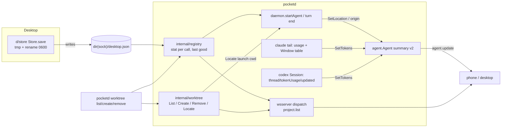

# Design: E05 registry-worktrees (M1, M)

Date: 2026-09-30. Base: main `f8f7293`. Cites `P path:L` at that commit; `pd` = `packages/pocketd`, `pk` = `packages/desktop/crates/pocket/src`, `d` = `packages/desktop/crates`.
Sources: PRD FR 05-1..05-3, FR 06-1 codes, NFR S-4/P-3/P-7; D7, D8, D15, D30, D35, D36, D41; 05-roadmap §2, §3 E05, §4, §7, §7.1; UXP §4.2, §4.8; UXD notifications, palette; C-control-plane; CONTEXT.md; ideas 11-4, 15-9, 14-21.

> **Review needed.** No owner interview took place. Every entry in the Decisions log is **PO-decided — review**. The technical-design skill templates were not found; this follows the section list in the task.

> **Rebase note (dark theme).** No overlap. `docs/plans/2026-09-30-dark-theme.md` touches `d/theme`, `d/ui`, `d/storybook` and colour sites in `d/pocket`. `d/store/src/store.rs` and all of pocketd are untouched. E05 adds no colour code. If any E05 follow-up adds UI: `rgba(theme::X)` → `theme::X`, and `u32` colour parameters → `Token`.

## 1. Problem

- Only the desktop knows the Projects. `desktop.json` is written in place with `std::fs::write` (P d/store/src/store.rs:38-42): a crash mid-write truncates it, and the mode is 0644 (umask), against NFR S-4.
- pocketd has no registry. The phone can't list Projects or Worktrees, so phone New session (E06) has nothing to offer (UXP §13 open question).
- Worktree create and remove exist only in the desktop (P d/git/src/git.rs:168,174; P pk/modals/new_session.rs:278-291). The copy step overwrites existing files (P pk/modals/new_session.rs:290) and follows symlinks.
- AgentSummary carries only `cwd` (P pd/internal/proto/proto.go:168-184). Clients show `basename(cwd)` (UXP §4.2), which is wrong once the agent `cd`s, and there's no worktree or branch.
- Nothing reports context use. The desktop assumes a 200k window (P d/agents/src/agents.rs:57) and reads usage that pocketd never sends (`TurnUsage` has no producer).

## 2. Scope and non-goals

In scope: FR 05-1 (atomic save, pocketd reader, `project.list`, cap `registry.v1`); FR 05-2 (`internal/worktree`, `pocketd worktree` CLI); FR 05-3 (AgentSummary v2, cap `summary.v2`).

Non-goals:
- `POCKET_PORT` / `POCKET_ROOT_PATH` / `ports.json` (15-10, cut); retention (15-8); auto-archive (15-11).
- Moving the desktop onto `internal/worktree`. The desktop keeps `d/git` and its own copy step until E06 PR4 removes it (P pk/modals/new_session.rs:280-290). Its overwrite bug stays until then.
- `agent.create` and `checkout.new` (E06). E05 provides the library they call.
- A WS verb for worktree create/remove. Only E06 launch creates over WS; remove is desktop and CLI only.
- Rendering the meter or the new row meta (E16 PR4, E08, phone). The desktop's `CONTEXT_WINDOW` removal is E16 PR4.
- pocketd writing `desktop.json`. The desktop stays the only writer (D15).

## 3. UX

E05 ships data, not screens. The copy below is what consumers render from it; E05 only guarantees the fields exist.

Phone New session (UXP §4.8), fed by `project.list`:

```
│  [▣ pocket ⌄]  [⎇ New worktree ⌄]  branch calm-otter   │
```

| Chip | Content (UXP §4.8) | Field |
|---|---|---|
| Project | "registered projects by name" | `Project.name`, order = registry order |
| Checkout | "worktrees by name (main first, meta 'on {branch}'), then 'New worktree'" | `Worktree.name`, `.branch`, `.isMain` |
| Worktree name | inline "branch {name}" | validated by `worktree.Validate` rules |

States: no registered project → "Add a project on your Mac first." Name taken → "A worktree or branch with this name already exists". Invalid → "Use letters, digits, - _ or ." (same strings as P pk/modals/new_session.rs:136-138). Git failure → git's error verbatim.

AgentSummary v2 consumers:
- Phone row meta (UXP §4.2): `{Provider} · {project}`; `{Provider} · {project} / {worktree}` when `mainWorktree` is false.
- Notification body line 1 (§7.1 override, D30): "{project} · {worktree}". No subtitle.
- Palette row detail (UXD): "{project} · {worktree} · {status}".
- Context meter (D7): 75/90 thresholds on `tokensUsed / contextWindow`; hidden when `contextWindow` is absent.
- CLI output (`pocketd worktree list`), one line per worktree:

```
pocket        main         /Users/me/dev/pocket                       (main)
pocket        calm-otter   /Users/me/.worktrees/pocket/calm-otter     on calm-otter
```

## 4. Architecture



- `internal/registry` reads `filepath.Dir(config.Sock())/desktop.json`, the file the desktop writes next to the socket (P pk/main.rs:32,34; P d/store/src/store.rs:17). No watcher, no poll (P-7): each `Load` stats the file.
- `internal/worktree` shells out to `git` for List/Create/Remove, and reads files only for `Locate`.
- The CLI runs in-process: it loads the registry and calls `internal/worktree` directly. No ops verb, so a PTY peer gains nothing it couldn't do with `git`.
- Location resolves from the Terminal's launch cwd (`t.Info().Cwd`, P pd/internal/daemon/presence.go:36-40), per CONTEXT: a Session belongs to its terminal's Worktree wherever the agent `cd`s.

## 5. Contract

### 5.1 Desktop (`d/store`)

- `pub fn save(&self)` keeps its signature. It writes `desktop.json.tmp` in the same dir with mode 0600 (`OpenOptions::mode`, then `set_permissions` 0600 in case a stale tmp exists), then `rename`s over `desktop.json`. No fsync. Errors stay ignored, as today.

### 5.2 pocketd Go

```go
// internal/registry
type Repo struct {
	Name      string   `json:"name"`
	Base      string   `json:"base"`
	Worktrees string   `json:"worktrees"`
	Setup     string   `json:"setup"`
	Copy      []string `json:"copy"`
}
type File struct {
	Projects []string        `json:"projects"`
	Repos    map[string]Repo `json:"repos"`
}
func Path() string                   // filepath.Join(filepath.Dir(config.Sock()), "desktop.json")
func New(path string) *Registry
func (r *Registry) Load() File        // stat; re-read when mtime/size changed or the last parse failed
func (f File) Name(project string) string // Repos[p].Name, else filepath.Base(p)

// internal/worktree
type Worktree struct{ Name, Path, Branch string; Main bool } // Branch "" when detached or not a repo
type Created struct{ Path, Branch, Base string; Copied, Skipped []string }
type Location struct{ Root, Common, Branch string; Main bool }
var (
	ErrUnknownProject  = coded("unknown_project")
	ErrUnknownWorktree = coded("unknown_worktree")
	ErrExists          = coded("worktree_exists")
	ErrInvalidName     = coded("invalid_name")
	ErrMain            = coded("main_worktree")
)
func Code(err error) string                                        // "" when not coded
func List(project string) ([]Worktree, error)                      // PR1
func Validate(name string, taken []string) error                   // PR2
func Taken(project, dir string) ([]string, error)                  // PR2: branches + entries of dir
func Dir(f registry.File, project string) string                   // PR2: Repos[p].Worktrees, else ~/.worktrees/{Name}
func Create(f registry.File, project, name, base string) (Created, error) // PR2
func Remove(f registry.File, project, path string) error            // PR2
func Locate(cwd string) (Location, bool)                            // PR3: file reads only

// internal/claude (PR3)
func Tokens(raw []byte) (int64, bool)  // input + cache_creation_input + cache_read_input of a main-chain assistant line
func Window(model string) int64        // 0 = unknown

// internal/codex (PR3)
type Sink interface { Apply(timeline.Event); SetTitle(string); SetTokens(used, window int64) }

// internal/agent (PR3)
func (a *Agent) SetLocation(project, worktree, branch string, main bool)
func (a *Agent) SetTokens(used, window int64) // window 0 keeps the current window
func (a *Agent) SetOrigin(origin string)

// internal/terminal (PR3)
type Spec struct { /* existing */ Origin string }
func (t *Terminal) TakeOrigin() string // Spec.Origin once, then ""

// internal/proto
const CapRegistry = "registry.v1"   // PR1
const CapSummaryV2 = "summary.v2"   // PR3
type Worktree struct {
	Name   string `json:"name"`
	Path   string `json:"path"`
	Branch string `json:"branch"`
	IsMain bool   `json:"isMain"`
}
type Project struct {
	Path      string     `json:"path"`
	Name      string     `json:"name"`
	Worktrees []Worktree `json:"worktrees"`
}
type ProjectList struct {
	Type     string    `json:"type"` // "project.list"
	ID       string    `json:"id,omitempty"`
	Projects []Project `json:"projects"`
}
// AgentSummary additions (PR3); all comparable, so update()'s == dedupe still works
Project       string `json:"project,omitempty"`
Worktree      string `json:"worktree,omitempty"`
MainWorktree  bool   `json:"mainWorktree,omitempty"`
Branch        string `json:"branch,omitempty"`
TokensUsed    int64  `json:"tokensUsed,omitempty"`
ContextWindow int64  `json:"contextWindow,omitempty"`
Origin        string `json:"origin"`
```

### 5.3 Protocol (TS, `packages/protocol`)

```ts
// messages.ts (PR1)
export const ProjectListRequest = Schema.Struct({ type: Schema.Literal("project.list"), id: Schema.String })
export const Worktree = Schema.Struct({ name: Schema.String, path: Schema.String, branch: Schema.String, isMain: Schema.Boolean })
export const Project = Schema.Struct({ path: Schema.String, name: Schema.String, worktrees: Schema.Array(Worktree) })
export const ProjectList = Schema.Struct({ type: Schema.Literal("project.list"), id: Schema.optional(Schema.String), projects: Schema.Array(Project) })
// constants.ts
export const CAP_REGISTRY = "registry.v1"  // PR1
export const CAP_SUMMARY_V2 = "summary.v2" // PR3
// timeline.ts AgentSummary (PR3), added fields
project: Schema.optional(Schema.String),
worktree: Schema.optional(Schema.String),
mainWorktree: Schema.optional(Schema.Boolean),
branch: Schema.optional(Schema.String),
tokensUsed: Schema.optional(Schema.Number),
contextWindow: Schema.optional(Schema.Number),
origin: Schema.optional(Schema.String), // always sent by summary.v2 servers; optional for older ones
```

`ProjectListRequest` joins `ClientMessage`, `ProjectList` joins `ServerMessage`. `PROTOCOL_VERSION` stays 3: every change is additive and gated by caps (E02 PR1).

### 5.4 Messages and semantics

- `project.list {id}` → `project.list {id, projects}`. Scope **observe** (D36). One scope-matrix row. Projects in registry order. A missing folder is left out. A folder that isn't a repo lists one Worktree `{name: basename, path, branch: "", isMain: true}`. Worktrees: main first, then oldest folder first (mirrors P d/git/src/git.rs:143).
- Worktree `name` = folder basename; `branch` = short branch, `""` when detached.
- AgentSummary v2: `project` = Project name; `worktree` = Worktree name; `mainWorktree` true for the main checkout; `branch` = the Worktree's current branch. All four are absent when the launch cwd is in no registered Project.
- `tokensUsed` = tokens in the context at the last main-chain response. `contextWindow` is agent-reported (codex) or from the claude table; absent when unknown.
- `origin` ∈ `desktop` (default: any Terminal-started agent) · `phone` · `agent:<id>` · `automation:<id>` · `run:<id>` (C-control-plane). E05 only emits `desktop`. E06 sets `phone`/`desktop` via `terminal.Spec.Origin`; E15 sets `agent:<id>`.

### 5.5 Error codes

Go-side codes from `internal/worktree`, reused by E06: `unknown_project`, `unknown_worktree`, `worktree_exists` (FR 06-1), plus new `invalid_name` (bad `checkout.new.name`) and `main_worktree` (remove refused). Handoff: E06 PR1 adds `invalid_name` to the protocol code enum. `main_worktree` never crosses the wire (no WS remove).

### 5.6 CLI verbs

```
pocketd worktree list [--json] [<project>]
pocketd worktree create [--project <path>] [--base <branch>] [--no-copy] <name>
pocketd worktree remove <path>
```

- `<project>` / `--project`: a registered path, or omitted = the registered Project containing the cwd. Otherwise `unknown_project`.
- `create` prints the new path on stdout, and each skipped copy entry on stderr as `skipped {rel}: {reason}`.
- `remove` keeps the branch (D8) and matches the desktop's `--force` (P d/git/src/git.rs:174-176): uncommitted changes are lost.
- Errors: `pocketd worktree: {message}` on stderr, exit 1. Usage errors exit 2.
- `list --json` prints `[]proto.Project`.

### 5.7 Config keys, caps, files

- Config keys: none new. Reads `RepoConfig.base`, `.worktrees`, `.copy`, `.name` (P d/store/src/store.rs:8-15). `.setup` stays E06.
- Caps: `registry.v1` (PR1), `summary.v2` (PR3), both added to the `hello.ok.caps` list from E02 PR1.
- Files created:
  - `pd/internal/registry/registry.go`, `registry_test.go`
  - `pd/internal/worktree/list.go`, `list_test.go` (PR1); `create.go`, `create_test.go` (PR2); `locate.go`, `locate_test.go` (PR3)
  - `pd/cmd/pocketd/worktree.go` (PR2)
  - `pd/internal/claude/window.go`, `window_test.go` (PR3)
  - goldens `client/project_list.json`, `server/project_list.json` (PR1); `server/agent_list.json` and `server/agent_update.json` regenerated (PR3)
  - runtime: `desktop.json.tmp` (transient, same dir, 0600)

## 6. Data and state

- **Registry cache** (`*Registry`, mutex): path, last stat `{mtime, size}`, last good `File`, `broken bool`. `Load` stats. If the stat changed or `broken` is set, it reads and parses: success replaces the cache, failure sets `broken` and logs once per stat. A missing file gives an empty `File`. Unknown JSON keys are ignored (`collapsed`, and future D25 sounds or widths).
- **Worktree lists** are not cached. `project.list` runs `git worktree list --porcelain` per Project on the WS conn goroutine, off every lock. That's ~10 ms per Project, on demand only.
- **Copy set** = `Repo.Copy`, else the root `.env*` files (the desktop default, P pk/modals/new_session.rs:180-187), ∪ non-comment, non-blank lines of `<project>/.worktreeinclude`. Each entry is `filepath.Clean`ed. It must be relative and not escape the root. It must `Lstat` as a regular file (symlinks and dirs skipped), and the target must not exist (`O_CREATE|O_EXCL`, then mode copied). Parent dirs are created. Skips are returned, never fatal.
- **Base resolution** (Create): `base` arg, else `Repo.Base` if that branch exists, else `main`, `master`, the current branch, the first branch (P pk/modals/form.rs:5-8).
- **Name rules** (Validate): port of `name_problem` / `is_taken` (P pk/modals/new_session.rs:103-141). Taken = local branches + entries of `Dir`, case-insensitive; a branch `a/b` owns `a`. Taken is checked before validity, as in the desktop.
- **Location** (`Locate`): walk up from cwd to a `.git`. A dir means the main checkout (common = it). A file means `gitdir: X`; common = `X/commondir` resolved against X. Branch comes from `<gitdir>/HEAD` `ref: refs/heads/…`. The Project is the registered path whose `Locate` has the same `Common`. A non-repo registered folder matches by path prefix.
- **Agent fields** live under `a.mu` in `agent.Agent`, and publish through `update()` (P pd/internal/agent/agent.go:188). The daemon sets location right after `startAgent` and again after each turn end, computed outside `a.mu`. `SetConversation` clears `tokensUsed` (a new conversation starts empty).
- **Claude window table** (from claude 2.1.285's model catalog): longest-prefix match on the id. A `[1m]` suffix → 1,000,000.
  - 1,000,000: `claude-opus-5`, `claude-opus-5-5`, `claude-sonnet-5`, `claude-sonnet-5-5`, `claude-opus-4-7`, `claude-opus-4-8`, `claude-fable-5`, `claude-fable-5-1`, `claude-mythos-5`, `claude-mythos-5-1`.
  - 200,000: `claude-haiku-4-5`, `claude-opus-4-0`/`4-1`/`4-5`/`4-6`, `claude-sonnet-4-0`/`4-5`/`4-6`.
  - Anything else → 0 (meter hidden).
- **Claude tokens**: `line.Message.Usage {input_tokens, cache_creation_input_tokens, cache_read_input_tokens}` from each main-chain, non-`<synthetic>` assistant line. The sum is claude's own `total_input_tokens`.
- **Codex tokens**: `thread/tokenUsage/updated {tokenUsage: {last: {totalTokens}, modelContextWindow: number|null}}` (codex 0.159.0 `generate-ts`) → `SetTokens(last.totalTokens, modelContextWindow ?? 0)`.

## 7. Failure modes

| Case | Behaviour |
|---|---|
| Desktop crashes mid-save | Old `desktop.json` intact; a stale `.tmp` is overwritten by the next save |
| `desktop.json` hand-edited to invalid JSON | pocketd keeps the last good copy and re-parses on every `Load` until it is valid; one log line |
| pocketd starts with an invalid file, no last good | Empty registry: `project.list` = `[]`; phone shows "Add a project on your Mac first." |
| `POCKETD_SOCK` points elsewhere | Registry follows the socket's dir, as the desktop does; scratch daemons see their own file |
| Registered folder deleted | Left out of `project.list`; `Create` → `unknown_project` |
| Registered path is a subfolder of a repo | `List` runs `git -C path`; main = porcelain's first block, which may differ from `path`. Location matches by common dir |
| Name taken by a branch or folder | `worktree_exists` before git runs |
| Base branch gone | git's error verbatim (`git worktree add` fails); nothing is created |
| `git worktree add` succeeds, copy fails midway | Worktree kept; the failed entries go into `Skipped` with the reason |
| `.worktreeinclude` has `../secret` or `/etc/x` | Skipped: "outside the project" |
| Copy source is a symlink or dir | Skipped: "not a regular file" |
| Copy target exists | Skipped: "exists" (D35) |
| `remove` on main | `main_worktree`; nothing runs |
| `remove` on a path that isn't a Worktree of the Project | `unknown_worktree` |
| Agent `cd`s to another repo | Location unchanged: it's the Terminal's launch cwd |
| Agent runs `git checkout` | Branch refreshes at turn end |
| Unknown claude model or `<synthetic>` | `contextWindow` absent; `tokensUsed` still sent |
| Codex never sends `thread/tokenUsage/updated` on the shared app-server | Both fields absent; meter hidden. Covered by a fixture test; verify on a live scratch daemon before merge |
| `tokensUsed` changes every response | One extra `agent.update` per assistant line while Working. Hub marshals once (P pd/internal/hub/hub.go) |
| Old phone gets v2 fields | Ignored: JSON.parse + cast. The desktop's serde ignores unknown fields |
| Client sends `project.list` to an older pocketd | `ErrMalformed` today; clients gate on `registry.v1` |

## 8. Test strategy

Commands (05-roadmap §7):
- `cd packages/pocketd && go vet ./... && go test -race -count=1 ./...`
- Goldens: `go test ./internal/proto -update`, then `pnpm --filter @pocket/protocol test`
- Desktop: `cd packages/desktop && cargo test -p store`, then `cargo build --workspace && cargo clippy --workspace --all-targets`

Tests per PR:
- PR1
  - `d/store`: save leaves mode 0600 and no `.tmp`; an existing 0644 file becomes 0600; round trip still holds.
  - `internal/registry`: fixture file loads; rewrite with a new mtime reloads; truncated file keeps the last copy; fixing it recovers without an mtime bump; missing file → empty; unknown keys ignored.
  - `internal/worktree` List on a temp repo (`git init`, `git worktree add`): main first, detached → `""`, non-repo folder → one main.
  - wsserver: `project.list` round trip over a test server. Scope-matrix row: observe allowed.
  - Goldens: client and server `project_list.json`.
- PR2 (temp git checkouts under `t.TempDir()`, `HOME` set to a temp dir)
  - create with and without base; `Repo.Base` default; `Repo.Worktrees` dir honoured.
  - name rules: table test ported from the desktop's cases (taken, `a/b` owns `a`, case-insensitive, `.lock`, `..`, `HEAD`, leading `-`/`.`).
  - copy: list + `.worktreeinclude`; existing target untouched; symlink skipped; `../x` skipped; dir skipped.
  - remove keeps the branch (`git branch --list name`); main refused with `main_worktree`.
  - CLI: `run([]string{...})` in-process with a temp `POCKETD_SOCK` dir holding a fixture `desktop.json`; exit codes and stdout.
- PR3
  - `worktree.Locate`: main checkout, linked worktree, subfolder, non-repo.
  - `claude.Window`: table cases, dated id `claude-haiku-4-5-20251001` → 200k, `claude-opus-5-5[1m]` → 1M, unknown → 0.
  - `claude.Tokens`: sum of the three fields; sidechain and `<synthetic>` → false.
  - codex: `codextest` fixture sends `thread/tokenUsage/updated` → the agent reports both; `modelContextWindow: null` → window absent.
  - daemon: an agent started in a registered linked worktree gets project/worktree/branch/`mainWorktree=false`, `origin=desktop`; outside any Project → all absent; `SetConversation` clears tokens.
  - Goldens: `agent_list.json` / `agent_update.json` with v2 fields; the TS golden test decodes them with `onExcessProperty: "error"`.
- Live check, PR3 only: a scratch pocketd with its own `POCKET_HOME`, `POCKETD_SOCK` and port (§7) and a scratch `desktop.json`. No paid turns: the codex check reuses a fixture unless the owner runs one.

## 9. PR slicing

| # | Title | Lane | Depends on | Scope |
|---|---|---|---|---|
| 1 | Registry: atomic `desktop.json`, pocketd reader, `project.list` (`registry.v1`) | P (atomic exception: `d/store` + pocketd) | — (E02 PR1 caps must be on main, per its "lands first") | §5.1, `internal/registry`, `worktree.List`, `project.list` in Go + TS + goldens. Lane C stays out of `d/store` until merged |
| 2 | `internal/worktree` create/remove + `pocketd worktree` CLI | P | E03 PR2 | Validate, Taken, Dir, Create, Remove, copy rules, CLI; scope-matrix row "`pocketd worktree`: no socket verb, runs as the invoking user". No proto change |
| 3 | AgentSummary v2 (`summary.v2`) | P | E05 PR1 | Locate, claude usage + Window, codex tokenUsage, origin plumbing, goldens |

Consumers: E06 PR2 → E05 PR2 (Create + codes); E16 PR4 → E05 PR3 (meter). PR1 and PR3 touch goldens, so they run one at a time with other golden PRs (§2).

## 10. Decisions log

Each entry is **PO-decided — review**.

1. **Claude context window = a per-model table in pocketd.** claude 2.1.285 reports `context_window` only on the statusLine command's stdin. It isn't in hook input (SessionStart has `model`, not the window), the JSONL (`message.model` has no `[1m]`), or `~/.claude.json` `lastModelUsage`. So the table comes from claude's own catalog, and unknown models get no window (D7: hidden). Rejected: injecting a statusLine via `--settings` (edits claude config beyond the trust entry, which E06 rules out, and replaces the owner's statusline); a fixed 200k (wrong for every 1M model and hides the error); `CLAUDE_CODE_MAX_CONTEXT_TOKENS` (only honoured with `DISABLE_COMPACT`).
2. **Codex window is agent-reported** from `thread/tokenUsage/updated.modelContextWindow`; `tokensUsed = last.totalTokens`. Rejected: a codex model table (the notification carries the value); `total.totalTokens` (cumulative across turns, not context fill).
3. **Claude `tokensUsed`** = input + cache-creation + cache-read of the latest main-chain assistant line (claude's own `total_input_tokens`). Rejected: result-line usage (per-turn sums, not context fill); including output tokens (claude's meter excludes them).
4. **Registry path = `dir(config.Sock())/desktop.json`**, mirroring the desktop's lookup. Rejected: `config.Home()` (diverges when `POCKETD_SOCK` is set, so pocketd would read another file than the desktop writes).
5. **Reload on demand: stat per `Load`**, no fsnotify, no poll (P-7). A parse failure retries on every call until fixed. Rejected: fsnotify (a new dependency and goroutine for a file that changes a few times a day); a timer (NFR P-7).
6. **Atomic save without fsync**, on the UI thread as today. Rejected: fsync (adds ms of UI-thread IO per save, against P-3, for a crash-during-power-loss case); moving save to a background task (touches six call sites for no user-visible gain).
7. **`worktree.List` ships in PR1** because `project.list` needs Worktrees; PR2 adds create/remove. Rejected: `project.list` without Worktrees until PR2 (the phone Checkout chip would need a second cap).
8. **`project.list` shells out to git on each call.** Rejected: caching Worktree lists (needs invalidation on every desktop/CLI/agent `git worktree add`); file-reading `.git/worktrees/*` (misses prunable state; git already parses it).
9. **Missing folders are left out of `project.list`.** Rejected: listing them with an empty Worktree list (the phone would offer a Project it can't launch in).
10. **AgentSummary location = display names + `mainWorktree` flag.** Every surface renders names (row meta, notification, palette), and the phone has no lookup table. `mainWorktree` is one field beyond FR 05-3, because "when the worktree isn't main" can't be derived from names (a custom `RepoConfig.name`). Rejected: paths as ids (every client needs `project.list` to render a row); a nested Worktree object (duplicates `branch`, and a pointer breaks `update()`'s `==` dedupe); omitting `worktree` for main (breaks "{project} · {worktree}").
11. **Location from the Terminal's launch cwd, refreshed at turn end**, by file reads (CONTEXT rule). Rejected: the agent's live cwd (`SetCwd`), which moves the Session when the agent `cd`s; running `git` in `startAgent` (a subprocess per agent start while holding presence state).
12. **`origin` uses the C-control-plane enum, default `desktop`**, carried by `terminal.Spec.Origin` and taken once by the first agent in the Terminal. Rejected: a new `terminal` value (not in the control-plane enum; every Terminal today comes from the desktop); keeping the origin for every later agent in the same Terminal (a second agent the owner types is not phone-started).
13. **Always send v2 fields; cap only advertises them.** Additive JSON is safe for the phone (cast) and desktop (serde ignores). Rejected: per-connection summaries by cap (breaks the hub's marshal-once fan-out).
14. **CLI runs in-process, not over the ops socket.** It works with pocketd down, and adds no socket verb for PTY peers to reach. Rejected: an ops `worktree.*` op (a new privileged surface under E03 PR3 rules, and no gain: the caller already has `git`).
15. **Copy default stays "root `.env*`" when `Repo.Copy` is empty, ∪ `.worktreeinclude`.** This matches today's desktop plus 15-9. Rejected: `.worktreeinclude` replacing the list (drops the owner's configured copies); copying dirs (the desktop never did).
16. **`remove` uses `--force`**, like the desktop, because UXD's delete confirm already warns "{n} uncommitted files will be lost." Rejected: refusing dirty worktrees (the CLI would differ from the desktop's delete).
17. **New codes `invalid_name` and `main_worktree`.** Rejected: folding into `spawn_failed` (the phone shows the inline name error only for a name code).
18. **No `PROTOCOL_VERSION` bump.** Rejected: bumping to 4 (would reject old phones for additive fields).

## 11. Owner questions

None. No decision here involves money, accounts or licences.
