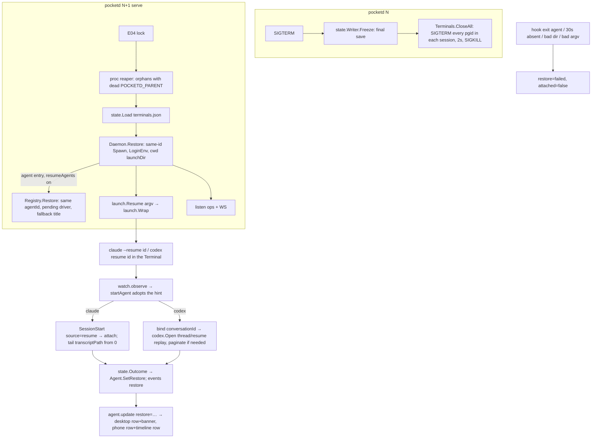

# Design: E09 restore (M2, L)

Date: 2026-09-30. Base: main `f8f7293`. Cites `P path:L` at that commit; `pd` = `packages/pocketd`, `pk` = `packages/desktop/crates/pocket/src`, `d` = `packages/desktop/crates`, `app` = `packages/app/src`.
Sources: PRD FR 09-1..09-6, NFR S-4/S-5/S-9, D27, D28; 05-roadmap §3 E09, §4, §7, §7.1; UXD §3.14 and copy table; UXP §5.4 and copy table; R15 idea 15-1 (herdr restore rules), R10 10-5 and 10-7, R14 14-4, R17 §F14; sibling designs E02, E04, E05, E06, E17.

> **Review needed.** No owner interview took place. Every entry in the Decisions log is **PO-decided — review**.

> **Rebase note (dark theme).** The owner's plan `docs/plans/2026-09-30-dark-theme.md` changes colour tokens from `const u32` to `const Token { light, dark }` and migrates every call site. E09 touches only PR5 view files: `pk/sidebar/sessions.rs` (a new notice line under the row, P pk/sidebar/sessions.rs:45-57) and `pk/terminal_view/pane.rs` (unchanged styling; the banner text source changes, P pk/terminal_view/pane.rs:86-88). `pk/status.rs` gets copy logic only, with no colours. E09 does not change `ui::session_row` (P d/ui/src/ui.rs:428-450), which the plan migrates. If dark lands first, PR5 applies mechanical changes: `rgba(theme::X)` → `theme::X`, and any new `u32` colour parameter → `Token`. The notice line uses `TEXT_2`, passed as a token. The owner's theme decisions (MonoCode dark palette, blur, light unchanged, follows macOS) override UXD §2. PR1–PR4 are pocketd-only and need no rebase.

## 1. Problem

- `Terminal.Close` is `cmd.Process.Kill()` on the shell alone (P pd/internal/terminal/terminal.go:310-312). The pty's `Setsid` makes the shell a session leader, but job-control jobs get their own pgids. Anything that ignores SIGHUP (`nohup`, MCP servers once claude dies) outlives both the Terminal and pocketd, reparented to launchd.
- Nothing is persisted. On restart, `serve` builds an empty `Manager` and `Registry` (P pd/cmd/pocketd/serve.go:32-40). Every Terminal id is new (P pd/internal/daemon/daemon.go:34-41), and every Agent id is new (P pd/internal/daemon/presence.go:40). So the desktop's tabs, the phone's drafts (E17, keyed by agent id) and every Conversation are lost.
- There is no resume path. A restarted pocketd can't tell a claude or codex to continue, and clients can't tell a restored Agent from a fresh one.
- `serve` has no signal handling, so SIGTERM from launchd (E04) skips any cleanup.

## 2. Scope and non-goals

In scope: FR 09-1 (kill and reap), 09-2 (state file, same-id recreate), 09-3 (resume, outcome, cap `restore.v1`), 09-4 (Timeline rebuild), 09-5 (desktop re-adopt e2e), 09-6 (notices, both clients).

Non-goals:
- An on-disk journal (D27, idea 02-11). History comes only from provider files.
- A live-upgrade fd handoff (15-14). Every restart kills and recreates.
- Layout restore beyond Terminal ids: tabs, splits and scrollback. A plain Terminal returns as a fresh login shell, and its running program (vim, a dev server) is not re-run.
- Resuming agents other than claude and codex, embedded codex (`exec`, `-c`, …), and `claude -p`.
- A UI toggle for `restore.resumeAgents`.

## 3. UX

§7.1 overrides that apply (rows copied verbatim):

| Spec says | Replaced by | Source | Plans use |
|---|---|---|---|
| UXD §2.0 Palette struct | `Palette` + `LIGHT`/`DARK` statics + `p(cx)` | Owner's dark-theme plan | `theme::Token { light, dark }` consts, read as `theme::X` (`Into<Hsla>`); `Token::pick(dark)` in tests. No `Palette`, no `p(cx)` |
| UXD §7 constraint 1, D26 dark | Dark waits for S1 | Owner's dark-theme plan | Dark ships with the owner's plan and follows macOS appearance; no Appearance action. E16 PR1 lands on top of it |

No §7.1 row changes restore copy. Spec rows (verbatim):
- UXD §3.14: "Session row, tab banner | after a pocketd restart (PRD FR 09-6) | "Resumed" · "Interrupted by restart" · "Full access resumed as Ask" · "Couldn't resume" | —"
- UXP §5.4: "Restored after a pocketd restart (PRD FR 09-6) | row notice "Resumed" · "Interrupted by restart" · "Full access resumed as Ask" · "Couldn't resume" | the same notice as a timeline row"

Copy (`summary.restore` → text):

| `restore` | Copy | Shown until |
|---|---|---|
| `resumed` | "Resumed" | the Agent's next Working |
| `interrupted` | "Interrupted by restart" | the Agent's next Working |
| `access_lowered` | "Full access resumed as Ask" | the Agent's next Working |
| `failed` | "Couldn't resume" | the placeholder closes |
| absent or unknown | nothing | — |

Desktop (PR5):
```
┌ Sessions ─────────────────────────┐
│ ◐ Claude Code                  2m │
│ Fix the login redirect            │
│ ⎇ main                     ● Idle │
│ Interrupted by restart            │   ← 12 px, TEXT_2, truncates
└───────────────────────────────────┘
┌ tab: Fix the login redirect ──────────────────────────┐
│ Interrupted by restart                                │   ← the existing banner strip
│ $ claude --resume …                                   │
```
- The session row gets a fourth line holding the notice, appended at the call site (P pk/sidebar/sessions.rs:55).
- `status::banner` returns the notice. `failed` comes before the not-attached text. For the other outcomes, the not-attached trust hint wins, so an untrusted claude still tells the owner why (P pk/status.rs:101-110).
- The body text "This session is not running." is unchanged (P pk/terminal_view/pane.rs:94).

Phone (PR5):
```
│ ◐ Fix the login redirect      Idle │
│   Interrupted by restart           │  ← row notice, muted, 13
...
│ ── Interrupted by restart ──       │  ← last row of the Session screen timeline
```
- Row: `restoreNotice(a)` renders under the title in `AgentsScreen` (next to `look`, P app/screens/AgentsScreen.tsx:26-42).
- Session screen: the same text is appended by the client as the final timeline row. There is no new `TimelineItem` kind.
- A failed placeholder is not attached. It keeps today's 0.5-opacity row (P app/status.ts:10) and adds the notice.

## 4. Architecture



- Restore runs before either listener opens, so the first `list` / `agent.list` already has every Terminal and Agent id. E04 PR4's `Terminals::reconnected()` re-attaches the desktop to the same ids (P pk/terminals.rs:86-115). E17's resync finds the same agent ids, so the phone stays on the Session screen.
- Every Terminal env gets `POCKETD_PARENT=<pid>`. `Daemon.Env` also strips an inherited value (P pd/internal/daemon/plugin.go:65-82).
- **Reaper rule.** The reaper runs once at start. It takes a process only if all of these hold:
  - same uid, and ppid == 1;
  - its env has `POCKETD_PARENT=p`, with p ≠ self and p not alive;
  - it is not a session leader (`getsid(pid) != pid`), so a daemon that called `setsid` (codex's shared app-server, tmux) is spared.

  Each match gets SIGTERM, then SIGKILL after 2 s. Env reads fail for Apple binaries and for title-rewriting processes (`proc.Read`, P pd/internal/proc/proc_darwin.go:50-61); those are skipped.
- **codex rebind.** A codex binds via Enter within `CodexMapWindow` (P pd/internal/daemon/codex.go:81-101). A restored one has typed nothing, so the hint calls `d.bind(pr, conversationId)` directly (P pd/internal/daemon/codex.go:156-176).
- **claude attach.** A resumed claude re-sends SessionStart with the same `session_id` (`source: "resume"`), so today's path attaches it (P pd/internal/daemon/claude.go:54-75).

## 5. Contract

### 5.1 Protocol, Go (`pd/internal/proto`)

```go
// AgentSummary (P proto.go:168-184) gains, after Attached:
Restore string `json:"restore,omitempty"` // "resumed" | "interrupted" | "access_lowered" | "failed"
const (
	RestoreResumed       = "resumed"
	RestoreInterrupted   = "interrupted"
	RestoreAccessLowered = "access_lowered"
	RestoreFailed        = "failed"
	CapRestore           = "restore.v1"
	CodeAgentResuming    = "agent_resuming" // E06 Error.code: prompt/interrupt/compact to an Agent still resuming
)
```
- `Version` stays 3. `restore.v1` joins the server caps and is intersected by E02 `Negotiate`. It is only an advertisement: the hub publishes shared bytes, so `restore` reaches every client. Old clients ignore it (Effect Schema drops excess keys; Rust `Summary` is `#[serde(default)]`, P d/agents/src/agents.rs:12-27).
- Goldens: `server/agent_list_restored.json` (one of each outcome), `server/agent_update_restore_cleared.json`, `server/error_agent_resuming.json`.

### 5.2 Protocol, TS (`packages/protocol`)

```ts
// src/timeline.ts AgentSummary (P :83-99) gains
restore: Schema.optional(Schema.String), // open: a future outcome decodes; clients map known values
export const RESTORE = ["resumed", "interrupted", "access_lowered", "failed"] as const
export type RestoreOutcome = (typeof RESTORE)[number]
```
`test/golden.test.mjs` picks up the new goldens.

### 5.3 pocketd packages

```go
// pd/internal/proc (darwin)
func Session(sid int) ([]int, error)            // pids with getsid(pid)==sid, from kern.proc.all
func Orphans(uid int) ([]Proc, error)           // ppid==1, same uid, env read where allowed
func Reap(self int, alive func(int) bool, ps []Proc) []int // pure: pids to kill (rule in §4)
func Kill(pids []int, grace time.Duration)      // SIGTERM each distinct pgid / pid, wait, SIGKILL survivors

// pd/internal/terminal (changed)
func (s *Terminal) Close()                      // async: SIGTERM every pgid in the shell's session, 2 s, SIGKILL
func (m *Manager) CloseAll(grace time.Duration) // parallel Close, returns when all exited or grace+500ms
// Spawn already honours spec.ID; Restore passes the saved id (P terminal.go:112-156)

// pd/internal/state (new)
type Launch struct {
	Access string `json:"access"`           // ask | edits | auto | full
	Plan   bool   `json:"plan,omitempty"`
	Model  string `json:"model,omitempty"`
	Effort string `json:"effort,omitempty"`
}
type Terminal struct {
	TerminalID     string  `json:"terminalId"`
	LaunchDir      string  `json:"launchDir"`
	Cols           uint16  `json:"cols"`
	Rows           uint16  `json:"rows"`
	Provider       string  `json:"provider,omitempty"`       // claude | codex
	ConversationID string  `json:"conversationId,omitempty"`
	TranscriptPath string  `json:"transcriptPath,omitempty"` // claude only
	Launch         *Launch `json:"launch,omitempty"`
	AgentID        string  `json:"agentId,omitempty"`
	CreatedAt      int64   `json:"createdAt,omitempty"`
	Status         string  `json:"status,omitempty"`         // idle | done | working | needsYou
	Failed         bool    `json:"failed,omitempty"`
	Origin         string  `json:"origin,omitempty"`         // E05/E06 pass-through
}
type File struct {
	Version   int        `json:"version"` // 1
	Terminals []Terminal `json:"terminals"`
}
func Path(home string) string                       // <home>/state/terminals.json
func Load(path string) (File, error)                // missing → empty; bad → empty, renamed .bad
func Save(path string, f File) error                // dir 0700; temp 0600, fsync, rename (S-4)
type Writer struct{ /* path, snap, last []byte, frozen */ }
func NewWriter(path string, snap func() File) *Writer
func (w *Writer) Run(ctx context.Context)           // every 1 s: marshal snap(); Save only if bytes changed
func (w *Writer) Freeze() error                      // final Save, then Run writes nothing
func Outcome(saved Terminal, phase string, failed bool) string // pure; precedence failed > interrupted > access_lowered > resumed

// pd/internal/launch (E06 package; E09 adds)
func Parse(provider string, argv []string) Launch    // pure inverse of Argv; unknown → ask
func Mode(permissionMode string) (access string, plan bool) // claude hook permission_mode → Launch
func Resume(t state.Terminal) (argv []string, lowered bool, f *Failure) // pure; §5.3.1
func ValidResume(argv []string) *Failure             // herdr rules
func (l *Launcher) Exited(terminalID, phase string, status int) // E06; now also notifies the restorer

// pd/internal/agent (changed)
type Restored struct{ ID, Cwd, Provider, Terminal, Fallback string; CreatedAt int64; Done, Failed bool }
func (r *Registry) Restore(x Restored, d Driver) *Agent // attached=true, phase idle, unseenEnd=Done
func (a *Agent) SetDriver(d Driver)
func (a *Agent) SetRestore(outcome string)           // "" clears; Working() clears it too
func (a *Agent) SetFallbackTitle(t string)           // summary title when title is empty

// pd/internal/daemon (changed)
func (d *Daemon) Snapshot() state.File               // Terminals.List + presences + summaries
func (d *Daemon) Restore(f state.File, resume bool)  // before listeners; spawns, registers hints
// Daemon gains: restoring map[terminalID]*hint; startAgent adopts a hint instead of AddFunc
// Env appends POCKETD_PARENT=<os.Getpid()> and strips an inherited one
```

#### 5.3.1 Resume argv (`launch.Resume`)

The command word is plain (`claude`, `codex`), resolved on `LoginEnv` PATH. Full → Ask (D28). Plan stays plan.

| saved | claude 2.1.285 | codex 0.159.2 |
|---|---|---|
| base | `claude --resume <id>` | `codex resume <id>` |
| ask | `--permission-mode default` | `-s read-only -a on-request` |
| edits | `--permission-mode acceptEdits` | `-s workspace-write -a on-request` |
| auto | `--permission-mode auto` | `--approve-for-me` |
| full | as ask; `lowered=true` | as ask; `lowered=true` |
| plan | `--permission-mode plan` | n/a (E06 refuses codex plan) |
| model / effort | `--model m`, `--effort e` | `-m m`; effort dropped (`-c` makes it embedded, P pd/internal/daemon/codex.go:37-52) |

- **Validation.** `conversationId` must match `^[A-Za-z0-9._:-]{1,128}$` → else `invalid_resume_argv`. The herdr rules then apply: first word a plain command on PATH; no `'` or control chars in any arg; ≤64 args; ≤8 KiB total. A breach → `invalid_resume_argv`, and a missing binary → `resume_not_accepted`.
- **Wrapper.** Argv goes through E06 `Wrap(shell, exe, "", argv)`, so `hook exit agent $s` fires and the Terminal falls back to `exec $SHELL -l`.

### 5.4 Caps, config, CLI, files, reasons

- Cap `restore.v1` (PR3).
- Config key `restore.resumeAgents` (the FR's `resume_agents_on_restore`): `$POCKET_HOME/config.json` `{"restore":{"resumeAgents":true}}`, default true. E06 `config.Store` gains `ResumeAgents() bool` and `SetResumeAgents(bool) error` (temp + rename, 0600, unknown keys kept).
- CLI: `pocketd config set restore.resumeAgents <true|false>`, through ops `{"op":"config-set","key":"restore.resumeAgents","text":"false"}` → `ok` / `error`. Owner peers only, refused from PTY descendants (E03). The WS `config.set` key literal stays `phone.maxAccess`.
- Scope matrix (S-9): no new WS verbs. Ops `config-set` with the new key → `owner`. The field `AgentSummary.restore` → `observe`.
- Env: `POCKETD_PARENT` in every Terminal.
- Event (E04 `events.jsonl`): `restore {agent, ok, ms, outcome, reason?}`, emitted by E09. E04's table lists the emitter as E11; that is a swap with `push`. `Stats`' "restore ≤30 s rate" reads `ok && ms<=30000`.
- Reasons (log and event only, not sent to clients): `invalid_resume_argv`, `resume_not_accepted`, `launch_dir_missing`, `agent_exited`, `resume_timeout`, `resume_off`.
- Files created:
  - `pd/internal/state/{state.go,writer.go,outcome.go}` + `_test.go`
  - `pd/internal/proc/reap.go` + `reap_darwin.go` + `_test.go`
  - `pd/internal/launch/resume.go` + `resume_test.go`
  - `pd/internal/daemon/restore.go` + `restore_test.go`
  - `pd/cmd/pocketd/restore_e2e_test.go`
  - `pd/internal/codex/testdata/{thread_read.json,thread_resume.json,turns_list.json}` (scrubbed)
  - `pd/internal/proto/testdata/golden/server/{agent_list_restored,agent_update_restore_cleared,error_agent_resuming}.json`
  - `d/daemon/tests/restore.rs` (`#[ignore]`)
  - Runtime: `$POCKET_HOME/state/terminals.json`

### 5.5 Desktop and phone

```rust
// d/agents: Summary gains
pub restore: String,
// pk/status.rs
pub fn notice(a: &Summary) -> Option<&'static str> // §3 table; unknown → None
pub struct Card { /* … */ pub notice: Option<&'static str> } // card() fills it
// banner(a): failed notice first, then the not-attached text, then notice(a)
```
```ts
// app/status.ts
export function restoreNotice(a: AgentSummary): string | undefined
```

### 5.6 Codex history over `thread/resume` (settles the open question)

- **Schema answer.** The 0.159.2 app-server schema (`codex app-server generate-ts`) says `Thread.turns` is populated on `thread/resume`, `thread/fork` and `thread/read{includeTurns}`. So today's `Open` replay already rebuilds a normal thread (P pd/internal/codex/session.go:68-126).
- **Paginated threads.** "Full-history hydration is deprecated for paginated threads". For those, `ThreadResumeResponse` carries `turnsBackwardsCursor`. PR4 then pages `thread/turns/list{threadId, cursor, sortDirection:"desc", itemsView:"full"}` until `nextCursor` is null (cap 50 pages), reverses the pages and replays them. `excludeTurns` is never sent.
- **Fixture first (PR4 step 0).** Copy one finished rollout into a scratch `CODEX_HOME` and run `codex app-server --listen unix://<scratch>` there. Record `thread/read{includeTurns:true}`, `thread/resume` and one `thread/turns/list` page, and compare turn counts. Scrub all text before commit. This is read-only, needs no model call, and never touches the owner's app-server.
- **If the fixture disagrees** (resume returns fewer turns than read), PR4 hydrates from `thread/turns/list` always.

## 6. Data and state

| Data | Where | Lifetime |
|---|---|---|
| `terminals.json` (§5.3) | `$POCKET_HOME/state/`, 0600, dir 0700 | Rewritten on change (1 s poll). Frozen at shutdown. Replaced on the next start once restore has run |
| Restore hint `{agentId, saved entry, started, deadline}` | `Daemon.restoring`, memory | Until adopted and settled, or failed at 30 s |
| `Agent.restore` | memory, AgentSummary | Until next Working; failed until the placeholder closes |
| `Agent.fallback` title | memory | Agent lifetime; not persisted |
| `presence.launch` | memory, from `launch.Parse(argv)`; claude `permission_mode` hook updates it | Presence lifetime; saved into the entry |

- **Not stored (S-5).** Title, env, argv and conversation text are never stored; nor are Timeline items or cols/rows history. `agentId`, `createdAt`, `status`, `failed` and `origin` are opaque metadata. They keep phone drafts and views (keyed by agent id), sort order and Done.
- **Entry lifetime.** An Agent that ends normally clears provider fields from its entry. A plain Terminal keeps `{terminalId, launchDir, cols, rows}`, and a closed Terminal leaves the file.
- **Shutdown order.** SIGTERM or SIGINT → `Writer.Freeze()` → `Terminals.CloseAll(2 s)` → exit 0. Freezing first means exits during the kill don't erase entries. PR1 adds `signal.NotifyContext` to serve; if E04 PR3's stop handling lands first, it goes into that path.
- **Settling a hint.**
  - **Success:** the presence is adopted, and it is Attached on the saved Conversation or has been present 10 s. The outcome is then `state.Outcome(saved, phase, lowered)`:
    - `interrupted` iff saved status was working or needsYou and the current phase is neither;
    - else `access_lowered` if `lowered`;
    - else `resumed`.
  - **Failure:** an `agent` exit hook, a missing launchDir, an invalid argv, or no presence by 30 s. The Agent becomes `failed`, `attached=false`, and keeps its pending driver.
  - **Saved done/failed** restore as `unseenEnd` / `failed`.
- **Placeholder lifetime.** A failed placeholder closes when its Terminal closes, or when a new agent is detected in that Terminal; `startAgent` without a hint closes it first.

## 7. Failure modes

| Case | Behaviour |
|---|---|
| pocketd crashes (SIGKILL, panic) | No Freeze; state is ≤1 s stale. The pty master closes, so session members get SIGHUP. Survivors are reaped on the next start |
| Mac reboots | No orphans. launchd (E04) starts pocketd, which restores from state |
| `terminals.json` missing, corrupt or future version | Start empty. A bad file is renamed `terminals.json.bad` and logged. Never fatal |
| State write fails (disk full) | Logged once; pocketd keeps running; the next change retries |
| launchDir deleted | Terminal not recreated. The Agent entry becomes a failed placeholder (`launch_dir_missing`) with no Terminal; it closes 10 min later |
| `claude --resume` finds no transcript | claude exits non-zero → `hook exit agent` → failed; the shell remains in the Terminal |
| Binary missing on PATH | `resume_not_accepted`; the Terminal returns as a shell; failed |
| A future codex rejects `-s`/`-a` | exit 2 → failed. `scripts/probe-cli.sh` catches it on CLI upgrade |
| Folder untrusted, so no SessionStart | Present 10 s → `resumed`, attached=false. The banner shows the trust hint. The Timeline still loads from the saved `transcriptPath` (PR4) |
| codex turn still running in the shared daemon | Rejoined; phase Working, so not `interrupted`; `resumed` (then cleared by that Working) |
| Prompt to an Agent still resuming | `error{code:"agent_resuming"}`; the draft is kept (E17) |
| Reaper sees a process of a live pocketd (prod vs scratch) | `alive(p)` → skip. Pid reuse of a dead marker parent also reads as alive → skip (fails safe) |
| Reaper sees the codex app-server daemon or tmux started in a Terminal | Session leader → skip |
| `nohup job &` in a Pocket Terminal | Killed on close and reaped after a crash. Documented, not a bug |
| Two pocketd on one home | E04 flock refuses the second before restore |
| `restore.resumeAgents=false` | Terminals return as shells; no Agents or placeholders; entries lose provider fields on the next write (`resume_off` event) |
| Transcript path outside `$CLAUDE_CONFIG_DIR/projects` (or `~/.claude/projects`) | Not tailed; the Timeline waits for SessionStart |
| Paginated codex thread | `thread/turns/list` pages (§5.6); over 50 pages, oldest turns are dropped with a log line |

## 8. Test strategy

pocketd (`cd packages/pocketd && go vet ./... && go test ./internal/proc ./internal/terminal ./internal/state ./internal/launch ./internal/agent ./internal/daemon ./internal/codex ./internal/claude ./internal/proto ./cmd/pocketd`). Live process tests only signal pids the test spawned; `Reap` is pure over `[]Proc`.
- `proc`: `TestSessionListsAJobInItsOwnGroup`, `TestReapTakesOnlyOrphansOfADeadPocketd`, `TestReapSparesALiveMarkerParent`, `TestReapSparesSessionLeaders`, `TestReapSkipsUnreadableEnv`.
- `terminal`: `TestCloseKillsAChildOfAChild` (FR test), `TestCloseKillsABackgroundJob`, `TestCloseEscalatesToSigkillAfterGrace` (child traps TERM), `TestCloseAllWaitsInParallel`, `TestSpawnKeepsTheGivenID`.
- `state`: `TestSaveLoadRoundTrips`, `TestTheFileHoldsNoTitleEnvArgvOrText` (FR test), `TestSaveIsAtomicAndPrivate` (0600, dir 0700, no temp left), `TestACorruptFileLoadsEmptyAndIsKept`, `TestWriterSkipsUnchangedSnapshots`, `TestFreezeStopsLaterWrites`, `TestOutcomePrecedence`, `TestAWorkingAgentIsInterrupted`, `TestAStillRunningTurnIsNotInterrupted`.
- `launch`: `TestResumeArgvTable` (provider × access × plan × model), `TestFullResumesAsAsk`, `TestCodexResumeNeverCarriesConfigFlags` (asserts `!embedded`), `TestResumeRejectsHerdrBreaches` (quote, control char, 65 args, 8 KiB+1, bad id), `TestParseInvertsArgv` (every E06 row), `TestParseUnknownIsAsk`.
- `agent`: `TestARestoredAgentKeepsItsIDAndCreatedAt`, `TestWorkingClearsTheRestoreOutcome`, `TestTheFallbackTitleYieldsToAProviderTitle`, `TestDoneSurvivesRestore`.
- `daemon`, with fake agents (the test binary linked as claude/codex, P pd/internal/daemon/presence_test.go:24-49; codex through `codextest`), one fixture per provider × outcome (FR 09-3 test): `TestRestoreRecreatesTerminalsWithTheirIDs`, `TestARestoredClaudeAttachesOnItsConversation`, `TestARestoredCodexBindsWithoutEnter`, `TestAnExitBeforeAttachFailsTheRestore`, `TestAMissingLaunchDirFailsTheRestore`, `TestNoPresenceIn30sFailsTheRestore` (clock injected), `TestResumeOffReturnsShellsOnly`, `TestPromptToAResumingAgentIsRefused`, `TestTerminalEnvCarriesOnePocketdParent`, `TestShutdownFreezesBeforeKilling`.
- `codex`: `TestResumeReplayEqualsTheLiveTimeline` (the same turns pushed live via `codextest.Push`, then as a resume response; FR 09-4 test), `TestAPaginatedThreadHydratesFromTurnsList`, `TestTheRecordedFixturesDecode`.
- `claude`: `TestTailFromZeroEqualsTheLiveTimeline`, `TestAnOutsideTranscriptPathIsNotTailed`.
- `proto`: new goldens in `TestServerGolden`; `TestAgentSummaryOmitsEmptyRestore`.
- `cmd/pocketd` `TestRestartRestoresTwoAgents`: builds pocketd, runs it with a scratch `POCKET_HOME`, `POCKETD_SOCK`, port, `CODEX_HOME` and a PATH of fake agents (05-roadmap §7); makes one claude and one codex; SIGTERMs and restarts; asserts over WS `agent.list` the same agent and terminal ids, attached, the same `providerSessionId`, and `restore:"resumed"`, all ≤30 s.

protocol: `cd packages/protocol && npm run typecheck && npm test` (goldens).

Desktop (`cd packages/desktop && cargo build --workspace && cargo clippy --workspace --all-targets && cargo test --workspace`):
- `pk/status`: `each_restore_outcome_has_its_notice`, `an_unknown_outcome_shows_nothing`, `a_failed_restore_banner_beats_the_trust_hint`, `an_untrusted_resumed_claude_still_shows_the_trust_hint`, `a_card_carries_the_notice`. `d/agents`: `a_summary_without_restore_decodes`.
- e2e (FR 09-5), `cargo test -p daemon --test restore -- --ignored`: starts a scratch pocketd built from `pd` with two fake claudes, drives the desktop's own `daemon` client and `Terminals` logic through the restart, and asserts both Terminals re-attach by id and both Agents are Attached on the same Conversation ≤30 s. It runs by hand and in the release gate, not in `cargo test --workspace`.
- View: `.ui-review/fixture/capture.sh` before and after, for the row and banner with a restored fixture.

Phone: `cd packages/app && npm run typecheck && npm test`. `status.test.mts`: `restoreNotice maps each outcome`, `restoreNotice ignores unknown values`.

FR 09-6 asks for "one render test per outcome, both clients". CLAUDE.md forbids render tests, so the per-outcome tests run over the pure copy mapping on both clients, plus captures. Lane C (PR5) never edits goldens.

## 9. PR slicing

| PR | Title | Lane | Depends on | Content |
|---|---|---|---|---|
| 1 | Kill whole Terminal sessions and reap orphans | P | — | Step 0: in a scratch Terminal with a scratch `CODEX_HOME`, check the sid of codex's app-server daemon (`codex app-server daemon --help`; no model call). Then `proc.Session/Orphans/Reap/Kill`, async `Close`, `CloseAll`, `POCKETD_PARENT` in `Env`, the reaper in serve, signal shutdown. FR 09-1 |
| 2 | Persist Terminals and recreate them by id | P | PR1 | `internal/state` (file, writer, freeze), `Daemon.Snapshot`, `launch.Parse`/`Mode` (pure, in `internal/launch`, no E06 dep), same-id recreate of plain Terminals as login shells; agent fields recorded but not yet resumed. FR 09-2 |
| 3 | Resume Agents with an outcome | P | PR2, E06 PR2 | `launch.Resume`/`ValidResume`, `Wrap`, `Registry.Restore`, hints and adoption, codex direct bind, fallback title, `Outcome`, `AgentSummary.restore`, cap `restore.v1`, `agent_resuming`, `restore.resumeAgents` + CLI, `restore` event, goldens both sides, `probe-cli.sh` line for `codex resume -s -a`. FR 09-3 |
| 4 | Rebuild Timelines from provider files | P | PR3 | Step 0: fixture (§5.6). Then claude tail from the saved `transcriptPath` at adoption, codex `thread/turns/list` hydration, equality tests. FR 09-4 |
| 5 | Restore notices and re-adopt e2e | C | PR3, E04 PR4, E17 PR2 | `Summary.restore`, `status::notice`, the banner, a row line, phone `restoreNotice` row plus timeline row, `d/daemon/tests/restore.rs`, captures. FR 09-5, 09-6 |

## 10. Decisions log

1. **Kill every pgid in the Terminal's session (`getsid` over kern.proc.all): SIGTERM, 2 s, SIGKILL.** PO-decided — review. Rejected: `kill(-shellPid)` only (misses job-control jobs in their own pgids); `Setpgid` instead of the pty's `Setsid` (loses the controlling tty); a ppid tree walk (misses reparented orphans); `kern.proc.session` (ENOENT on darwin, and `Eproc.Sess` is zeroed).
2. **Reap at start: same uid, ppid 1, marker parent ≠ self and dead, not a session leader.** PO-decided — review. Rejected: an argv allowlist (misses MCP and dev servers); every marked process (kills a live scratch or prod pocketd's children); including session leaders (kills codex's shared app-server daemon and tmux, which serve work outside Pocket).
3. **`Close` is async; `CloseAll` runs in parallel with a 2.5 s bound.** PO-decided — review. Rejected: a blocking `Close` (the ops `close` handler, P pd/internal/ops/ops.go:159, would stall 2 s).
4. **Flat entries with `agentId`, `createdAt`, `status`, `failed`, `origin`, `cols`, `rows` beyond the FR list; no title, env, argv or text.** PO-decided — review. Rejected: FR fields only (new agent ids break phone drafts and E17 routes; Done and sort order lost); storing the title (S-5; FR 09-2).
5. **Writer polls a snapshot every 1 s and saves only on change; `Freeze` before the kill.** PO-decided — review. Rejected: a kick from every mutator (hooks in terminal, agent and presence); writing on exit only (a crash loses everything).
6. **Plain Terminals return as login shells in launchDir.** PO-decided — review. Rejected: re-running `Cmd`/`Args` (raw argv is forbidden by S-5, and it would re-run arbitrary commands after a crash).
7. **Launch fields come from `launch.Parse(provider, argv)` of the detected process, with claude's `permission_mode` hook updating them.** PO-decided — review. Rejected: E06 receipts (they expire at 10 min and miss typed-in agents); asking the provider (no API).
8. **Keep the agent id: pre-register at restore with a pending driver; `startAgent` adopts the hint.** PO-decided — review. Rejected: a new id (breaks drafts and views); registering on detection only (the ~1 s gap makes E17 drop the phone to Sessions, and the first list lacks the Agent).
9. **Step 0 passes on codex 0.159.2 (`codex resume --help` lists `-s`, `-a`, `--approve-for-me`), so the app-server `thread/resume` fallback is not built.** A runtime rejection → `failed`, and `probe-cli.sh` guards upgrades. PO-decided — review. Rejected: app-server-only resume (no TUI in the Terminal, so the desktop has nothing to show); building both paths.
10. **Resume argv never carries `-c`/`-p`/`--remote`; codex effort is not resumed.** PO-decided — review. Rejected: effort via `-c` (makes the codex embedded and unattached, P pd/internal/daemon/codex.go:37-52).
11. **`AgentSummary.restore` is an open string sent to every client; the cap only advertises.** PO-decided — review. Rejected: per-connection gating (the hub publishes shared bytes); a TS `Literal` (a future outcome would fail decode); a new `TimelineItem` kind for the marker (a union change breaks old clients).
12. **One outcome per Agent: failed > interrupted > access_lowered > resumed.** PO-decided — review. Rejected: several notices (UX specs show one).
13. **Interrupted = saved working/needsYou and not working/needsYou once resumed; the Agent goes Idle.** PO-decided — review. Rejected: saved status alone (a codex turn still running in the shared daemon would be mislabelled).
14. **The outcome clears on the next Working; failed clears with its placeholder.** PO-decided — review. Rejected: clearing on Seen (Idle Agents are never "seen"); a timer (a notice could vanish before the owner looks).
15. **Success = adopted and Attached on the saved Conversation, or present 10 s; failed = exit hook, missing dir, bad argv, or 30 s.** PO-decided — review. Rejected: requiring Attached (an untrusted claude never attaches, yet it did resume; E06 uses the same 10 s rule); a timeout longer than 30 s (the ≤30 s metric).
16. **A failed restore leaves a placeholder Agent (same id, attached=false).** PO-decided — review. Rejected: dropping the Agent (FR 09-6 must show "Couldn't resume").
17. **`restore.resumeAgents` lives in config.json and is set by the CLI via ops `config-set`; not WS `config.set`.** PO-decided — review. Rejected: an env var (needs plist edits); a WS key (no client offers it, and it would widen phone-reachable config).
18. **Paginated codex threads hydrate through `thread/turns/list` desc/full, capped at 50 pages.** PO-decided — review. Rejected: `thread/read` (doesn't subscribe, so it's a second call anyway); resume-only (loses history on paginated threads).
19. **A claude tails its saved `transcriptPath` at adoption, validated under the claude projects dir.** PO-decided — review. Rejected: waiting for SessionStart (an untrusted folder would show no Timeline); tailing any path from the file (the state file is owner-only, but the check is cheap).
20. **A missing launchDir fails the restore; nothing spawns elsewhere.** PO-decided — review. Rejected: spawning in `$HOME` (the agent would resume in the wrong folder).
21. **Notice tests are pure copy mappings per outcome on both clients, plus captures.** PO-decided — review. Rejected: render tests (CLAUDE.md forbids them, overriding the FR 09-6 test wording).
22. **Desktop notice: a fourth row line at the `sessions.rs` call site, and text via `status::banner`.** PO-decided — review. Rejected: a new `ui::session_row` parameter (collides with the dark-theme migration of that fn); replacing the relative time (loses recency).
23. **Phone notice: a row line plus a client-side final timeline row.** PO-decided — review. Rejected: a server-sent timeline item (see 11).
24. **`nohup` jobs in a Pocket Terminal don't survive a restart.** PO-decided — review. Rejected: sparing them (indistinguishable from leaked MCP servers).
25. **E09 emits the `restore` event; E04's emitter column (E11) is a swap with `push`.** PO-decided — review. Rejected: leaving it to E11 (E11 is push).
26. **Prompting an Agent that is still resuming returns `agent_resuming`.** PO-decided — review. Rejected: queueing the prompt (it could land in a failed resume); silently dropping it.

Assumed from sibling designs; adapt on merge: E04 `Daemon.LoginEnv`, `LoginShell`, flock, `events.Log.Emit`, stop handling, `Terminals::reconnected`; E06 `launch.Wrap`, `Launcher.Exited`, ops `launch-exit`, `config.Store`, `Error.code`, `probe-cli.sh`; E05 summary `worktree` (fallback title, else `basename(launchDir)`); E02 `Negotiate` and server caps; E17 resync keeps agent ids.

## 11. Owner questions

None. Everything in E09 is a product or technical call, decided above for review. No money, account or licence choice is involved.
