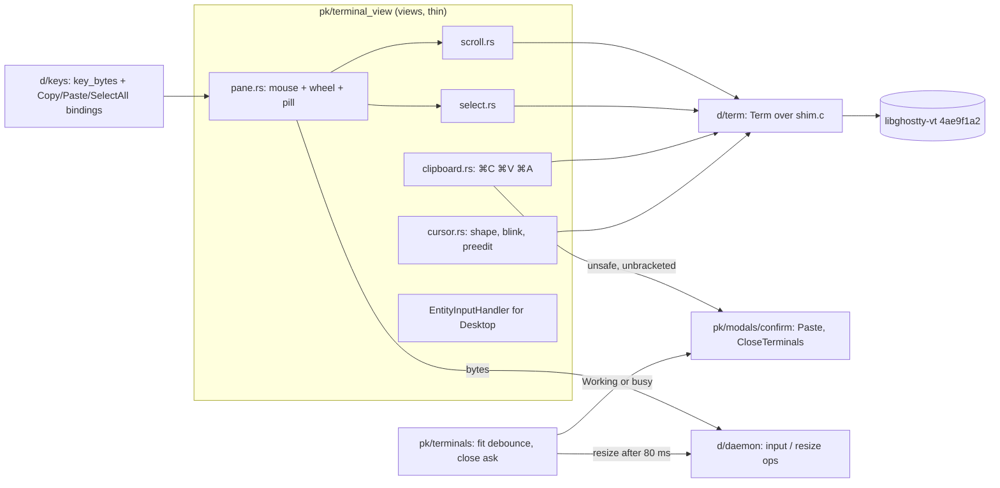

# Design: E07 `terminal-surface`: scroll, select, copy, paste, Mac keys, cursor

Date: 2026-09-30. Epic E07 (M1, L, lane C) in `docs/orchestrators/product/05-roadmap.md:330-355`. FR 07-1…07-6 in `00-prd.md:174-183`. UX in `02-ux-spec-desktop.md` (UXD) §3.5, §5, §6. Research is R16 (`docs/orchestrators/research/16-terminal-surface.md`). Vocabulary follows `CONTEXT.md`.

Cites are `P <path>:<line>` at f8f7293. Abbreviations: `d/` = `packages/desktop/crates/`, `pk/` = `d/pocket/src/`, `pd/` = `packages/pocketd/`. `G <file>:<line>` is `include/ghostty/vt/<file>` at the libghostty pin `4ae9f1a2`.

> **Review needed.** D9 and D32 are settled. Every line marked **PO-decided — review** was decided by the agent alone. Check those before implementing.

> **Rebase note: owner's dark-theme plan** (`docs/plans/2026-09-30-dark-theme.md`).
> - That plan touches these E07 files:
>   - `pk/terminal_view.rs` (`rgba(FAILED)`, `rgba(SURFACE_SUNKEN)`)
>   - `pk/terminal_view/pane.rs:107,149`
>   - `pk/terminal_view/surface.rs:43` (ink/paper; paper becomes `ON_TEXT`)
>   - `pk/terminal_view/tabs.rs:99,146`
>   - `pk/modals/confirm.rs`
>   - `pk/desktop.rs` (`set_appearance` next to `follow_reduce_motion`)
>   - `d/theme/src/theme.rs`
> - The mechanical change for whichever lands second:
>   - `rgba(theme::X)` → `theme::X`.
>   - Every `u32` colour parameter or return value becomes `theme::Token`. It resolves when it is turned into `Hsla`/`Fill` at paint time.
>   - The blend helper takes `Hsla`: `let bg: Hsla = TERM_SELECTION.into()`.
> - E07 adds two tokens, `TERM_SELECTION` and `TERM_CURSOR`. The owner's dark-theme decisions (dark palette, blur, light accent unchanged) override UXD §2, and that plan has no terminal tokens.
>   - Before the plan lands: `u32` light values from UXD §2.1:206-207.
>   - After: `Token::new(0x00000029, 0xebebeb38)` and `Token::new(0x3030358c, 0xebebeb66)`. The dark values use the owner's ink (`#ebebeb`) over transparent, at UXD's alphas. **PO-decided — review.**
> - E07 changes no other colour, and ink/paper stay whatever the plan sets.

## Problem

The Terminal is a canvas that shows only the live screen.
- Scrollback is libghostty's default, because `pt_new` sets no options (P d/term/src/shim.c:32-43).
- There is no wheel, selection, copy or paste. `⌘C` reaches nothing (P d/keys/src/keys.rs:113).
- `⌥←` sends `ESC ESC [D` (P d/keys/src/keys.rs:47).
- The cursor is an inverted cell (P pk/terminal_view/surface.rs:54-56).
- IME keeps only the preedit length (P pk/terminal_view.rs:126-135), and `bounds_for_range` is `None` (:137-139).
- Every canvas prepaint sends `resize` without a debounce (P pk/terminals.rs:185-193).
- Closing a Working agent's terminal has no confirm (P pk/terminal_view/tabs.rs:78, pane.rs:111-114, modals/more.rs:22-27).

D9 puts the Terminal surface in scope, so it must behave like a Mac terminal.

## Scope

- **In (roadmap PR1–5):**
  - 10k scrollback, wheel, snap to bottom, "Jump to bottom ↓" pill (FR 07-1)
  - 1/2/3-click selection, Shift-extend, autoscroll, ⌘C, ⌘A (FR 07-2)
  - ⌘V with the unsafe-paste confirm (FR 07-3)
  - ⌥←/→, ⌘←/→, ⌘⌫, 80 ms fit debounce, close-while-Working confirm (FR 07-4, 07-6)
  - cursor shape, blink and hollow; IME preedit (FR 07-5)
  - Ideas 16-1, 16-2, 16-4, 16-5, 16-6, 16-10, 16-11, 16-16, 13-12, 13-13.
- **Out:** scrollbar 16-7, links 16-8, mouse reporting 16-9 (the wheel never goes to the encoder), tab drag 16-12, find 16-14, OSC side channels 16-15, phone read-only Terminal 16-13 (S7), ⌘W.
- **Out, cross-lane:** pocketd's VT history (P pd/internal/vt/vt.go:16-19 sets no scrollback, and `Snapshot` redraws the current screen, :99-100).
  - After a re-attach, desktop scrollback therefore starts at the snapshot.
  - Growing it is lane P work; see the follow-up in the decisions log.
- **Settled:** ligatures stay off with no toggle (D32, E01 PR3, P pk/terminal_view/surface.rs:59). Line height stays 22 (UXD §9 Q3; `MAIN = 13/22`, P pk/terminal_view/surface.rs:11).
- No protocol, config key, CLI verb, cap or error code changes. `input` and `resize` ops are unchanged (P d/daemon/src/daemon.rs:188-195). No ADR is needed: this is within ADR 0003's layout.

## UX (UXD §3.5, §5, §6; §7.1 overrides touch nothing here)

```
│ pt10                                                                          │
│ px20   grid: Geist Mono 13 / line 22, ligatures off                           │
│        cursor: filled block TERM_CURSOR, blink 530; unfocused: hollow 1 px    │
│        selection TERM_SELECTION (inactive: half α)                            │
│                                                     ┌─────────────────────┐   │
│                                                     │ Jump to bottom  ↓   │ h28 r14, 12, GLASS
│                                                     └─────────────────────┘ 12 from right/bottom
│ pb14                                                                          │
```

- **Scrollback:** 10 000 lines. The view follows the bottom until the user scrolls. Any input snaps it back. The pill shows while the view is scrolled up. No smooth scroll.
- **Wheel routing:**
  1. Shift → viewport.
  2. Mouse-reporting mode → encoder. Out of scope, so this falls through to 3–4.
  3. Alt screen with mode 1007 → arrow keys.
  4. Else → viewport.
- **Selection:**
  - 1, 2 or 3 clicks select a cell, word or line.
  - A drag arms after 2 px. Shift+click extends.
  - Autoscroll at the edges every 24 ms, 1–3 lines.
- **Keys (UXD §5):**
  - ⌘C copies the selection and is a no-op without one. ⌘A selects all scrollback. ⌘V pastes.
  - ⌥←/→ → `ESC b`/`ESC f`. ⌘←/→ → `^A`/`^E`. ⌘⌫ → `^U`.
  - "⌘ never reaches the PTY" otherwise.
- **Cursor:**
  - Shape from DECSCUSR (block, bar, underline). The default is a blinking block.
  - Blinks 530 on / 530 off, stepped (`CURSOR_BLINK`), with no blink under Reduce Motion.
  - Hollow 1 px when the pane is unfocused.
- **IME:** preedit is drawn underlined at the cursor; `bounds_for_range` returns the cursor cell.
- **Copy (UXD §6):**
  - Pill: "Jump to bottom ↓".
  - Paste confirm: "Paste {n} lines into {title}?" · "Paste" · "Cancel".
  - Close confirm (agent): "\"{title}\" is still working in {worktree}. Close this terminal anyway?" · "Close terminal" · "Cancel".
  - Close confirm (shell): "\"{command}\" is still running in {worktree}. Close this terminal anyway?" · "Close terminal" · "Cancel".
- States are unchanged: "Connecting…", "This session is not running.", "Process exited with code {c}" (P pk/terminal_view/pane.rs:94,148-150).

## Architecture



- Every input path (key, IME commit, paste, wheel-as-arrows) goes through one `Desktop::send_input(id, bytes)`. It clears the selection, snaps to the bottom, restarts the blink phase, then calls `daemon.input`.
- Nothing in render does IO. Per-frame work stays proportional to the viewport, because `pt_frame` walks only the render state's rows (P d/term/src/shim.c:56-110). A 10k-line history adds no frame cost (NFR P-2).
- No new polls (NFR P-7).
  - The blink and autoscroll timers are GPUI `background_executor().timer` tasks.
  - The blink timer runs only while a focused, blinking, visible cursor exists and Reduce Motion is off.
  - The autoscroll timer runs only while a drag reports an autoscroll direction.

## Contract

### `d/term` (shim.c + term.rs). Model crate, no GPUI.

```c
// shim.c. PCell gains `selected` (row range from GHOSTTY_RENDER_STATE_ROW_DATA_SELECTION, G render.h:270).
typedef struct { uint32_t cp; uint8_t fg[3], bg[3]; uint8_t has_fg, has_bg, bold, italic, underline, inverse, wide, selected; } PCell;
// PFrame gains the cursor shape, blinking and viewport state (G render.h:144-153,200,206).
typedef struct { uint16_t cols, rows, cursor_x, cursor_y; uint8_t cursor_visible, cursor_style, cursor_blink, at_bottom;
                 uint8_t fg[3], bg[3]; } PFrame;
PTerm *pt_new(uint16_t cols, uint16_t rows);  // + SCROLLBACK_MAX_LINES=10000, MAX_BYTES=NULL, default cursor block+blink
void  pt_scroll(PTerm*, int tag, intptr_t delta);   // ghostty_terminal_scroll_viewport, G terminal.h:219-247,2384
bool  pt_mode(PTerm*, uint16_t mode);               // generalises pt_app_cursor (shim.c:47-50); 1, 1007, 2004
bool  pt_alt_screen(PTerm*);                        // GHOSTTY_TERMINAL_DATA_ACTIVE_SCREEN, G terminal.h:1761
int   pt_press(PTerm*, uint16_t col, uint16_t row, float x, float y, uint64_t ns, uint64_t interval_ns);
int   pt_drag(PTerm*, uint16_t col, uint16_t row, float x, float y, PGeom);  // returns autoscroll 0/1/2
int   pt_tick(PTerm*, float x, float y, PGeom);     // AUTOSCROLL_TICK; returns autoscroll
void  pt_release(PTerm*);
void  pt_extend(PTerm*, uint16_t col, uint16_t row);// DATA_SELECTION start kept, end = grid_ref(viewport)
void  pt_select_all(PTerm*);  void pt_select_clear(PTerm*);
size_t pt_selection_text(PTerm*, uint8_t **out);    // format_alloc PLAIN, unwrap+trim; 0 = none; free with pt_free_bytes
typedef struct { uint32_t columns, cell_width, padding_left, screen_height; } PGeom;  // GhosttySelectionGestureGeometry
int   pt_paste(const uint8_t *data, size_t len, bool bracketed, uint8_t **out, size_t *out_len);  // paste_encode, G paste.h:241
bool  pt_paste_is_safe(const uint8_t *data, size_t len);                                           // G paste.h:209
```

- The gesture handle (`ghostty_selection_gesture_new`, G selection.h:652) lives in `PTerm`.
- Every press, drag or tick result is installed with `GHOSTTY_TERMINAL_OPT_SELECTION` (G terminal.h:1426), so it survives output.

```rust
// term.rs
pub const SCROLLBACK: usize = 10_000;
pub enum Scroll { Top, Bottom, Delta(isize) }        // Delta: negative = older
pub enum Autoscroll { None, Up, Down }
pub struct Geometry { pub columns: u32, pub cell_width: u32, pub padding_left: u32, pub screen_height: u32 }
pub enum CursorStyle { Bar, Block, Underline, BlockHollow }
pub struct Cell { /* existing */ pub selected: u8 }
pub struct Frame { /* existing */ pub cursor_style: u8, pub cursor_blink: u8, pub at_bottom: u8 }
impl Frame { pub fn cursor_style(&self) -> CursorStyle }
impl Term {
    pub fn scroll(&mut self, s: Scroll);
    pub fn mode(&self, n: u16) -> bool;              // app_cursor() becomes mode(1)
    pub fn alt_screen(&self) -> bool;
    pub fn press(&mut self, col: u16, row: u16, pos: (f32, f32), at: Duration, interval: Duration);
    pub fn drag(&mut self, col: u16, row: u16, pos: (f32, f32), g: &Geometry) -> Autoscroll;
    pub fn tick(&mut self, pos: (f32, f32), g: &Geometry) -> Autoscroll;
    pub fn release(&mut self);
    pub fn extend(&mut self, col: u16, row: u16);
    pub fn select_all(&mut self);
    pub fn clear_selection(&mut self);
    pub fn selection_text(&self) -> Option<String>;
}
pub fn paste_bytes(text: &str, bracketed: bool) -> Vec<u8>;
pub fn paste_is_safe(text: &str) -> bool;
```

### `d/keys`

```rust
actions!(terminal, [Copy, Paste, SelectAll]);
pub fn bindings() -> Vec<KeyBinding>;  // + cmd-c → Copy, cmd-v → Paste, cmd-a → SelectAll, all Some(CONTEXT)
pub fn key_bytes(k: &Keystroke, app_cursor: bool) -> Option<Vec<u8>>;  // signature unchanged
// alt-left → b"\x1bb", alt-right → b"\x1bf", cmd-left → b"\x01", cmd-right → b"\x05", cmd-backspace → b"\x15"
// every other cmd-* keystroke → None
```

### `pk` (pocket)

```rust
// terminal_view.rs
pub struct Grid { pub bounds: Bounds<Pixels>, pub cell: Pixels, pub line: f32, pub rows: u16 }
TerminalViewState { /* existing */ marked: Option<String>,             // was Option<usize>
                    grids: HashMap<String, Grid>,                      // written in surface prepaint
                    wheel: Option<(String, f32)>,                      // id, fractional-row remainder
                    drag: Option<Drag>, autoscroll: Option<Task<()>>,
                    blink: Option<Task<()>>, blink_on: bool }
impl Desktop { pub fn send_input(&mut self, id: &str, bytes: &[u8], cx: &mut Context<Self>) }
// terminal_view/scroll.rs
pub enum Wheel { Viewport(isize), Arrows { up: bool, n: usize } }
pub fn wheel_rows(rest: f32, delta: ScrollDelta, line: f32) -> (isize, f32);
pub fn route(rows: isize, shift: bool, alt_screen: bool, alt_scroll: bool) -> Wheel;
pub fn jump_pill(id: &str, cx: &mut Context<Desktop>) -> Stateful<Div>;   // "Jump to bottom ↓"
// terminal_view/select.rs
pub fn cell_at(g: &Grid, p: Point<Pixels>) -> (u16, u16);     // clamped; rows are bottom-aligned (surface.rs:88)
pub fn tick_lines(g: &Grid, y: Pixels) -> usize;              // 1..=3 by distance past the edge
pub struct Drag { pub id: String, pub from: Point<Pixels>, pub armed: bool }   // armed after 2 px
// terminal_view/clipboard.rs: on_action handlers for keys::{Copy, Paste, SelectAll}
// terminal_view/cursor.rs
pub fn blinks(focused: bool, frame_blink: bool, reduce_motion: bool, window_active: bool) -> bool;
pub fn cursor(f: &Frame, g: &Grid, focused: bool, on: bool, preedit: Option<&str>) -> Option<Div>;
// terminal_view/surface.rs
pub fn cell_width(window: &Window, m: &Metrics) -> Pixels;
pub fn surface(view, id, m, focus)                            // prepaint also writes grids[id]
// terminals.rs
pub fn fit(&mut self, id: &str, cols: u16, rows: u16, cx: &mut Context<Self>);  // gains cx
pub fn ask_close(&mut self, ids: Vec<String>, cx: &mut Context<Self>);          // tab ×, pane ×, More "Close session"
// terminals/close.rs
pub enum Busy { Agent { title: String }, Shell { command: String } }
pub fn busy(summary: Option<&Summary>, session: Option<&Session>) -> Option<Busy>;
// desktop/chrome.rs Confirm gains:
Paste { id: String, text: String },
CloseTerminals { ids: Vec<String>, busy: Busy, worktree: String },
// modals/confirm.rs ConfirmText gains `danger: bool` (Paste is Primary; the rest stay Danger), and adds:
fn paste(text: &str, title: &str) -> Self;                         // "Paste {n} lines into {title}?", n = 1 → "1 line"
fn close_terminals(busy: &Busy, worktree: &str, n: usize) -> Self; // facts: closes(n) when n > 1
```

- **Files created:**
  - `pk/terminal_view/scroll.rs`
  - `pk/terminal_view/select.rs`
  - `pk/terminal_view/clipboard.rs`
  - `pk/terminal_view/cursor.rs`
  - `pk/terminals/close.rs`
- **Config:** `packages/desktop/Cargo.toml:47` adds the `NSEvent` feature to `objc2-app-kit`, for `NSEvent::doubleClickInterval`. The feature is verified present in objc2-app-kit 0.3.2 at `src/generated/NSEvent.rs:1154`.
- **Built on later:**
  - E16 PR3 "Close session…" reuses `ask_close`/`busy`.
  - Scrollbar 16-7 reads `GHOSTTY_TERMINAL_DATA_SCROLLBAR` through a future `Term::scrollbar`.
  - Find 16-14 builds on `Scroll`.

## Data and state

- **Scrollback and selection** live in the desktop's local `Term`, not in pocketd. `Sessions::apply("snapshot")` rebuilds the `Term` (P pk/terminals/sessions.rs:47-51), which drops history, scroll position and selection. This matches today.
- **Wheel:**
  - `wheel_rows`: `Lines(l)` gives `l.y` rows. `Pixels(p)` gives `p.y / line`.
  - The fractional remainder carries over per terminal. It resets when the id changes or on `TouchPhase::Started`.
  - Positive `y` is `Delta(-rows)` (older). Verify the sign manually with a trackpad and with a wheel mouse.
- **Snap to bottom:**
  - `send_input` calls `Scroll::Bottom`.
  - New output never moves a scrolled-up viewport, because libghostty pins it.
  - The pill shows iff `frame.at_bottom == 0` (`DATA_VIEWPORT_ACTIVE`, G terminal.h:2016). Clicking it scrolls to Bottom and calls `cx.notify()`.
- **Selection gesture:**
  - `press` passes `TIME_NS` from a process-start `Instant`, plus `REPEAT_INTERVAL_NS = NSEvent::doubleClickInterval()`. Without `TIME_NS`, only single clicks work (G selection.h:492-500).
  - `drag` is sent only once `Drag.armed` is set (≥2 px from `from`). A press without a drag leaves no selection; it only focuses.
  - Shift+mouse-down with an active selection calls `extend`, and no press.
  - While `drag` returns Up or Down, a 24 ms timer calls `tick` `tick_lines` times per step. It stops on `None`, on release or on `on_mouse_up_out`.
- **Painting:**
  - `screen()` merges `selected` into runs (P pk/terminal_view/surface.rs:74-84).
  - The run background is `TERM_SELECTION` composited over the cell's background: full α when the pane is focused, half α when not.
  - The cursor stops inverting its cell. `cursor.rs` draws an absolute overlay at `(cursor_x·cell, bounds.bottom − (rows − cursor_y)·line)`:
    - block: fill `TERM_CURSOR`
    - bar: 2 px wide
    - underline: 2 px tall
    - unfocused: hollow 1 px border
    - hidden in the blink's off phase
- **Blink:**
  - `blink_on` toggles every 530 ms in one task, which is created or dropped when `blinks(..)` changes.
  - `blinks` is true iff the pane is focused, the frame says blinking, Reduce Motion is off (`cx.reduce_motion()`, P pk/desktop.rs:353-356) and the window is active.
  - `send_input` resets the phase to on.
- **Clipboard:**
  - ⌘C: `selection_text()` → `cx.write_to_clipboard(ClipboardItem::new_string(..))` (precedent P pk/explorer/preview/header.rs:20). Without a selection, nothing happens.
  - ⌘V: `cx.read_from_clipboard()?.text()`, and `bracketed = mode(2004)`.
    - If `!bracketed && !paste_is_safe` → `Confirm::Paste`.
    - Else `send_input(paste_bytes(text, bracketed))`.
  - On confirm, `bracketed` is re-read, and the paste is dropped if the id is gone.
- **IME:**
  - `replace_and_mark_text_in_range` stores the string.
  - `cursor.rs` draws it underlined (`TEXT`) over the cursor cell and following cells.
  - `bounds_for_range` returns the cursor cell from `grids[focused]`.
  - A commit clears `marked` and goes through `send_input`.
- **Fit:**
  - Unchanged sizes return early, so a prepaint every frame never restarts the timer.
  - The first size for an id is sent at once.
  - A changed size is stored as pending and (re)starts one 80 ms `fit` task. When it fires, it sends every pending size through the existing dedup (P pk/terminals.rs:69-75).
  - `capturing` still skips (P pk/terminals.rs:187-189).
  - "Suspended during sash drag" has no site yet: split rows are fixed at 250 (P pk/terminal_view/pane.rs:64). E16's sash inherits the trailing timer.
- **Close ask:**
  - `busy(summary, session)`:
    - If an attached agent summary exists (`Status::of` is `Some`, P pk/status.rs), the result is `Agent{title}` iff the status is Working, else `None`.
    - Otherwise it is `Shell{command}` iff `session.busy()` is `Some` (P pk/terminals/sessions.rs:16-18).
  - `ask_close(ids)` takes the first busy id. If none is busy, it closes at once (today's path). Otherwise it sets `Confirm::CloseTerminals` and `Overlay::Confirm`, as at P pk/desktop/project.rs:188-217.
  - `worktree` is `basename(info.cwd)`.
  - `confirmed` calls `close_pane` for each id (P pk/terminals.rs:154-163).
  - `close_tab` becomes: ids = `workspace.tabs[i]` panes, then `ask_close`. `workspace.remove` drops the empty tab.

## Failure modes

| Case | Behaviour |
|---|---|
| Re-attach or reconnect `snapshot` | The local `Term` is rebuilt; history before it, the scroll offset and the selection are lost. |
| libghostty scrollback prunes by page | It keeps ≥10 000 lines, "almost always higher" (G terminal.h:1501-1523). The test asserts ≥, not ==. |
| Selection text of ⌘A over 10k lines | One `format_alloc`, synchronous on ⌘C. About 1 MB; acceptable, and not on the render path. |
| Clipboard empty or not text | ⌘V is a no-op. |
| `paste_encode` returns OUT_OF_SPACE | The shim retries once with the reported size. Encode happens in place on a copy of the text (G paste.h:241). |
| Paste confirm open when the terminal exits or closes | On confirm, `send_input` finds no session → no-op. |
| Close confirm open when the agent finishes | The confirm stays. Confirming closes, cancelling keeps. No live re-check. |
| Needs you agent | No confirm (FR 07-6 says Working). **PO-decided — review.** |
| Alt screen app without 1007 (e.g. `less` with it off) | The wheel scrolls the viewport, which is a no-op on the alt screen. Matches the UXD route. |
| Mouse-reporting app (vim `mouse=a`) | The wheel still scrolls the viewport or sends arrows. Encoder is 16-9. |
| Window inactive or pane unfocused | The blink task drops. The cursor is hollow and steady. |
| Reduce Motion toggled | Mirrored on window activation (P pk/desktop.rs:81); `blinks` re-evaluates at the next render. |
| Resize burst during a window drag | One `resize` op 80 ms after the last change. The local grid keeps the last size until pocketd echoes `resize` (P pk/terminals/sessions.rs:53). |
| `NSEvent::doubleClickInterval` | Read per press. It needs the new feature flag; there is no fallback path. |

## Test strategy

Tests sit beside the logic and are named as sentences, with no mocks and no render tests. From `packages/desktop`, run `scripts/check.sh` once E01 PR1 lands; until then `cargo build --workspace && cargo clippy --workspace --all-targets && cargo test --workspace`. Smallest loop: `cargo test -p term`, `cargo test -p keys`, `cargo test -p pocket <filter>`.

- **`term`** (real libghostty, as in P d/term/src/term.rs:80-127): `keeps_ten_thousand_lines_of_scrollback`, `scrolling_up_leaves_the_bottom_and_back_returns_to_it`, `output_while_scrolled_up_keeps_the_viewport`, `a_double_press_within_the_interval_selects_a_word`, `a_triple_press_selects_the_line`, `shift_extend_moves_the_selection_end`, `select_all_copies_scrollback_as_plain_text`, `the_selection_survives_new_output`, `a_drag_past_the_top_asks_to_autoscroll_up`, `bracketed_paste_is_wrapped`, `unbracketed_newlines_become_returns`, `control_bytes_are_stripped_from_pastes`, `a_multi_line_paste_is_not_safe`, `reports_bracketed_paste_and_alternate_scroll_modes`, `decscusr_sets_the_cursor_shape_and_blink`.
- **`keys`:** `option_arrows_move_by_word`, `command_arrows_go_to_line_start_and_end`, `command_backspace_kills_the_line`, `command_letters_never_reach_the_pty`: replaces the `cmd-c` assert at :113 with a loop over a–z..
- **`pocket`:**
  - Wheel: `pixel_deltas_accumulate_into_whole_rows`, `a_new_gesture_drops_the_remainder`, `shift_always_scrolls_the_viewport`, `alt_screen_with_alternate_scroll_sends_arrows`.
  - Selection: `cell_at_counts_rows_from_the_bottom_aligned_grid`, `points_outside_the_grid_clamp_to_the_edge`, `autoscroll_speeds_up_with_distance`.
  - Close: `a_working_agent_asks_before_close`, `an_agent_that_needs_you_closes_at_once`, `a_running_shell_command_asks_before_close`, `an_idle_shell_closes_at_once`.
  - Confirm copy: `paste_confirm_counts_lines`, `close_confirm_names_the_worktree`.
  - Fit: `the_first_size_is_sent_at_once_and_later_ones_wait`, `an_unchanged_size_does_not_restart_the_debounce`. Pure fit-step logic on `Terminals`, no timers.
  - Cursor: `the_cursor_does_not_blink_under_reduce_motion`, `an_unfocused_cursor_does_not_blink`.
- **Manual QA** in a release build, with scratch pocketd only (own `POCKET_HOME`, `POCKETD_SOCK`, port; roadmap §7): `seq 20000` then wheel, trackpad, pill and typing, `vim` (1007 arrows) and `less`, double- and triple-click and drag past the edges, ⌘C/⌘V in `claude`; paste of two lines at a `bash --norc` prompt (no 2004 → confirm), Japanese IME, close ×, split ×, More while `claude` is Working.
- **Perf** (CLAUDE.md): capture mode, `cargo run --release -p pocket --features capture -- --capture <dir> session=session`, with a 10k-line scrollback and a full-screen selection.
  - Add `[DEBUG-e07]` timings around `pane()`, then grep them out.
  - A session frame must stay near the 3 ms Changes-list baseline.

## PR slicing

| # | Title | FR | Depends on | Files |
|---|---|---|---|---|
| 1 | Scrollback, wheel and "Jump to bottom" | 07-1 | E01 PR3 (`surface.rs`) | shim.c, term.rs, scroll.rs, pane.rs, surface.rs, terminal_view.rs |
| 2 | Selection, ⌘C and ⌘A | 07-2 | E07 PR1 | shim.c, term.rs, keys.rs, select.rs, clipboard.rs, pane.rs, surface.rs, desktop.rs, `packages/desktop/Cargo.toml` |
| 3 | ⌘V with unsafe-paste confirm | 07-3 | E07 PR2 | shim.c, term.rs, keys.rs, clipboard.rs, chrome.rs, confirm.rs |
| 4 | Mac keys, fit debounce, close-while-Working confirm | 07-4, 07-6 | — | keys.rs, terminals.rs, terminals/close.rs, tabs.rs, pane.rs, more.rs, chrome.rs, confirm.rs |
| 5 | Cursor shape, blink, hollow; IME preedit | 07-5 | E07 PR2 | shim.c, term.rs, cursor.rs, surface.rs, terminal_view.rs |

- PR1 adds `send_input` and the `Grid` record.
- PR2 adds the `keys` actions that PR3 extends, and the run blend that PR5 reuses.
- PR4 conflicts with PR3 only additively (`Confirm` variants, `ConfirmText.danger`). Whichever lands second rebases.

## Decisions log

- **D9** (settled): the Terminal surface is in scope. **D32** (settled): ligatures off, no toggle; E01 PR3 owns it.
- **Line height stays 22** (UXD §9 Q3, roadmap plan question). Rejected: 18, pending box-drawing screenshots that nobody has asked for.
- **Scrollback lives in the desktop VT only; pocketd unchanged.** **PO-decided — review.**
  - Rejected: a lane P PR in E07 that sets pocketd's scrollback and makes `Snapshot` carry history. E07 is lane C, and its packages are `d/term`, `d/keys`, `d/pocket`.
  - Follow-up for the roadmap owner: "pocketd VT keeps 10k lines and snapshots include history" (lane P, a candidate for E16 or E08).
- **`SCROLLBACK_MAX_BYTES = NULL`**, so only the line limit applies. **PO-decided — review.** Rejected: a byte cap. It's harder to explain, and UXD says lines.
- **Selection via libghostty's gesture state machine with `TIME_NS` and `doubleClickInterval`.** **PO-decided — review.**
  - Rejected: GPUI `click_count` + `select_word`/`select_line`. It loses word- and line-granular drag.
  - Rejected: a hand-rolled selection. It duplicates G selection.h.
- **Selection is cleared on any input and kept across output.** **PO-decided — review.** Rejected: keep it on input (iTerm style), because a stale highlight over typed text reads as a bug.
- **The 2 px arm is enforced in Rust before the first `drag`.** Autoscroll takes 1/2/3 ticks per 24 ms by distance: ≤1, ≤2 or >2 lines past the edge. **PO-decided — review.**
- **⌘C/⌘V/⌘A are `keys` actions in the `Terminal` context**, not `key_bytes` arms. `key_bytes` returns `None` for every other `cmd-*`. **PO-decided — review.** Rejected: handling them in `on_term_key` (P pk/terminal_view.rs:42-50). Actions keep the menu bar and palette able to show them later.
- **Paste asks iff not bracketed and `paste_is_safe` is false.** Encoding strips control bytes, so bracketed pastes can't break out of the bracket (G paste.h:241). **PO-decided — review.** Rejected: always ask for multi-line pastes (Terminal.app doesn't).
- **"Paste 1 line into…" is singular when n = 1.** An unsafe single line carries `ESC[201~`, or ends in a newline. **PO-decided — review.**
- **The Paste button is Primary; Close terminal stays Danger** (`ConfirmText.danger`). **PO-decided — review.** Rejected: Danger for Paste, because pasting isn't destructive.
- **The close confirm covers Working agents and running shell commands. Needs you, Idle and a shell at its prompt close at once.** **PO-decided — review.**
  - Rejected: confirm for Needs you too. FR 07-6 and roadmap say Working.
  - The shell copy exists in UXD §6, so `busy()` foreground is included.
- **A multi-terminal close (tab ×) shows one confirm**, named after the first busy terminal, with "Closes {n} terminals". **PO-decided — review.** Rejected: one confirm per busy terminal.
- **Fit sends the first size at once; later sizes trail by 80 ms.** **PO-decided — review.** Rejected: trailing for all, because a new shell would draw its prompt at the wrong width for 80 ms.
- **Wheel on a mouse-reporting app goes to the viewport or arrows until 16-9.** **PO-decided — review.**
- **Cursor overlay:** block `TERM_CURSOR` fill (not inversion), 2 px bar and underline, 1 px hollow when unfocused. **PO-decided — review.** Rejected: keep inversion; UXD specifies a translucent block.
- **The default cursor is a blinking block** (`OPT_DEFAULT_CURSOR_STYLE`/`_BLINK`, G terminal.h:1435-1445). Apps override it with DECSCUSR. **PO-decided — review.**
- **The blink needs an active window as well as focus.** **PO-decided — review.** Rejected: blinking in background windows, which means a 530 ms whole-window redraw for nothing.
- **Dark values of `TERM_SELECTION`/`TERM_CURSOR` use the owner's ink over transparent** (see Rebase note). **PO-decided — review.** Rejected: UXD's `#FFFFFF38`/`#E8E8EA66`, because the owner's palette overrides UXD §2.
- **Rebased on 5091a01:** mouse selection and ⌘C already shipped (`term::Selection`, `terminal_view::Drag`, `CopySelection` on `cmd-c` in `keys::CONTEXT`, `theme::SELECTION`). E07 PR 2 moves the selection into libghostty's gesture, because the owner's screen `Pos` can't follow scrolling or output, autoscroll into history, or ⌘A over history. It keeps `CopySelection` and its binding, `SELECTION`, `selection: Option<Drag>` and a drag that follows only its own pane. Every owner test keeps its name; `copied_rows_drop_trailing_blanks_but_keep_inner_ones` now expects `"a b"` (ghostty's `trim`), and `grid_point`'s off-grid test moves to `Pointer::at`.
- **Rebased on 5091a01:** GPUI's `click_count` counts clicks and ghostty's press repeat is forced on (`TIME_NS` 0, unlimited interval and distance). Replaces the `TIME_NS` + `doubleClickInterval` decision; no NSEvent, no Cargo.toml change.
- **Rebased on 5091a01:** no 2 px arm in Rust; ghostty's gesture decides when a drag starts (`a_click_without_a_drag_selects_nothing`).
- **Rebased on 5091a01:** selection paints the owner's `SELECTION` as the cell background. No `TERM_SELECTION`; `TERM_CURSOR` is the only new token.
- **Rebased on 5091a01:** `SelectAll` and `Paste` are pocket actions in `pocket/src/actions.rs` beside `CopySelection`, not `keys` actions. Selection code stays in `terminal_view.rs`; no `select.rs` or `clipboard.rs`.
- **Rebased on 5091a01:** no Ended status. `8a10124` drops a session when its agent exits, so there's nothing to confirm.
- **Rebased on 5091a01:** the scrollback test accepts 9 000–10 000 lines, because libghostty prunes a page at a time.
- **Rebased on 5091a01:** More → Close session closes its menu before `close_session`, so the close confirm stays open. Tab × already goes through `close_tab`; `tabs.rs` is unchanged.
- **Rebased on 5091a01:** ⌘C copies the focused pane's selection; other panes keep theirs until they get input.
- **Rebased on 5091a01:** correcting "every owner test keeps its name" above: only the five `term/src/selection.rs` tests do. Cells replace boundaries, so `a_drag_selects_in_the_pane_it_started_in_until_released` becomes `a_drag_follows_only_the_pane_it_started_in`, the nearest-boundary `grid_point` test goes, and the off-grid test now expects top-down cells.

## Owner questions

None. E07 involves no money, accounts or licences. libghostty-vt is already vendored at the pin, and it is MIT.

## Verified, and how

- **libghostty API at `4ae9f1a2`:** sparse-fetched `include/ghostty` and `src/terminal/c` into `/tmp/e07-ghostty` and read every `G` cite: `paste.h:209,241`; `terminal.h:219-247,1426-1523,1761,2016,2384,2520`; `selection.h:28-50,418-500,610-714,841-928`; `render.h:144-206,270,300-350,791`; `modes.h:81,91`. The default scrollback is small: `ghostty_terminal_new` passes only cols/rows (`src/terminal/c/terminal.zig:842-848`).
- **GPUI** (`~/.cargo/registry/.../gpui-pre-0.3.6/src`): `ScrollWheelEvent{delta, modifiers, touch_phase}` (interactive.rs:522-534), `ScrollDelta` (:554), `TouchPhase::Started` (:88), `MouseDownEvent.click_count` (:159), `on_scroll_wheel`/`on_mouse_move` (elements/div.rs:303,390), `App::{read_from_clipboard, write_to_clipboard, reduce_motion}` (app.rs:1518,1546,1138), `timer` (executor.rs:183).
- **Pocket code:** every `P` cite was read at f8f7293 in this worktree.
- **The dark-theme plan's file list and tokens:** read in the owner's plan, lines 8, 130-201, 280-330 and 405-430.
- **Not verified:** the wheel sign on hardware, and `format_alloc` time for 10k lines. Both are covered by the manual QA and perf steps.
