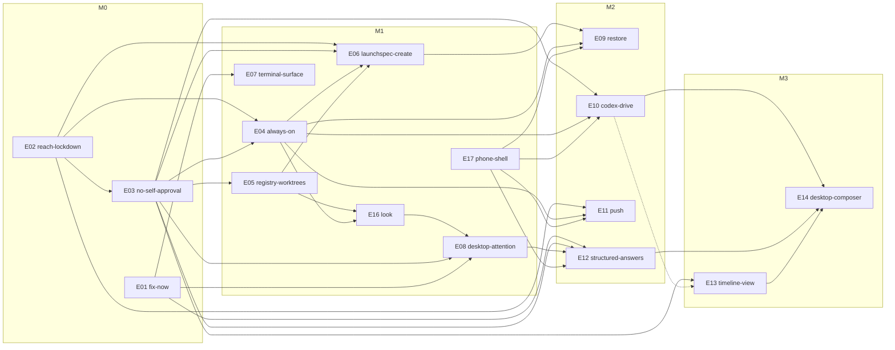

# 05 Roadmap — 8 weeks, E01–E14 + E16–E17 (E15 stretch)

- Date: 2026-09-30. Revised after the PO review (06-prd-review.md). Strategy: "C spine + A cockpit" (04-strategy-decision.md). Requirements: 00-prd.md (FR ids match epic ids).
- Citation keys: as in 00-prd.md. `P path:L` at main `f8f7293`. Prefixes: `pk/` = `packages/desktop/crates/pocket/src/`, `d/` = `packages/desktop/crates/`, `pd/` = `packages/pocketd/`, `app/` = `packages/app/src/`.
- Sizes: S ≤2 dev-days, M 3–5, L 6–10, XL >10. Every plan ≤5 PRs; each PR ships alone.
- **The spec overrides in §7.1 win over 02-ux-spec-desktop.md and 03-ux-spec-phone.md.** Each plan copies the rows it touches verbatim.

## 0. Main state, before writing any plan

- Main is `f8f7293`, and this research worktree is at the same commit. R14's in-flight icon work landed as `4442823` [R14 §F12]. No branch holds unmerged code; nothing is in flight.
- The strategy docs cite `5bc8ea8` / `b9d14a1` / `86deb13`. `pd/`, `app/` and `packages/protocol` are unchanged since `5bc8ea8` (`git diff --stat 5bc8ea8 f8f7293` is empty for them). Only desktop paths moved.
- **Every plan must:**
  - branch from the latest main and run `git status` first;
  - re-anchor every `P path:L` it relies on (the map below is a start, not a guarantee);
  - not write an ADR numbered 0003 (P docs/adr/0003-desktop-code-layout.md has it; the next is 0004).

### Path map (report / UXD / UXP citation → main `f8f7293`)

| Cited as | Now |
|---|---|
| `forms.rs` argv, copy, labels | P pk/modals/new_session.rs:72-79 (argv; `--full-auto` :78), :173-190 (base, worktrees dir, copy, setup), :280-290 (copy; overwrites at :290), :328 (`new_session_view`), :432-438 (argv test); picker "Permissions" P pk/modals/new_session/picker.rs:96; "Clone into" P pk/modals/add_project.rs:257 |
| `termview.rs` | P pk/terminal_view.rs (`on_term_key` :42, `session_page` :52); P pk/terminal_view/{pane,surface,tabs,tab_menu}.rs; font at surface.rs:59; `Metrics` at surface.rs:11 |
| `main.rs` bindings, window | P pk/actions.rs:5-18 (bound at P pk/main.rs:39-40); window 1440×900 + title at P pk/main.rs:41-45 |
| `main.rs` notifications | `sync_alerts` P pk/desktop/alerts.rs:80 (`actions: Vec::new()` at :86); the rule is in P pk/status.rs:120-124 |
| `main.rs` exit when pocketd is down | P pk/main.rs:30 |
| `main.rs` reduce motion | P pk/desktop.rs:81, :353 (`follow_reduce_motion`) |
| `main.rs` NextWaiting, rail, layout | P pk/desktop.rs:253 (`next_waiting`); P pk/desktop/chrome.rs:100 (`toggle_rail`), :107 (`toggle_focus`) |
| `main.rs` `cards()` sort | P pk/desktop/project.rs:43 |
| `view.rs` sidebar | P pk/sidebar.rs:19 (`row_mark`), :81 (`aside`); P pk/sidebar/column.rs:61 ("Workspace"); P pk/sidebar/sessions.rs:15 (sort), :45 (row); P pk/sidebar/rail.rs:12 (sort), :18 (`nav`); P pk/sidebar/usage.rs:21; P pk/sidebar/panel.rs:7; P pk/sidebar/row_menu.rs |
| `view.rs` page bar, tabs, blank page | P pk/desktop/chrome.rs:95 (`empty`), :158 (`bar_start`); P pk/terminal_view/tabs.rs:15 (`tab_lead`; Done mark :36), :53 (`term_tabs`); P pk/terminal_view/tab_menu.rs:18; P pk/terminal_view/pane.rs:81; `Render` P pk/desktop.rs:299 |
| `overlay.rs` palette, menus, dialogs | P pk/palette.rs:84 (status sort), :125 ("Jump to next waiting session"), :153 (`open_palette`), :206 (keys), :226 (render); P pk/modals.rs:31 (`overlay_view`); P pk/modals/more.rs:9; P pk/modals/confirm.rs:53 |
| `inbox.rs` | P pk/inbox.rs:45 (sort), :72 (j/k); P pk/inbox/list.rs:34 ("Mark all read"); P pk/inbox/detail.rs:51 ("Answer in the terminal ·") |
| `diff.rs`, `changes.rs` | P pk/git_ui/diff.rs:32-34 (row consts); P pk/git_ui/diff/comment.rs:18; P pk/git_ui/changes/commit_box.rs:54; P pk/git_ui/changes/rows.rs |
| `explore.rs` | P pk/explorer/preview/markdown.rs:27 |
| "Running" label, context bar | P d/ui/src/ui.rs:457; P d/ui/src/ui.rs:665-668 (`context_bar`, warns at > 0.8) |
| agents token, hello, Outbox | P d/agents/src/agents.rs:197-200 (token), :243-248 (hello), :208-216 (Outbox), :57,160 (`CONTEXT_WINDOW`), :118,135 (timelines) |
| `agent_op`, `setup_op`, `connect`, socket | P d/daemon/src/daemon.rs:43-51 (`POCKETD_SOCK` read first), :99-121 (`agent_op`, `setup_op`, wrapper; `|| exit` at :111, fish at :114), :172-183 (`connect`) |
| Worktree ops | P d/git/src/git.rs:143,168 |
| Registry | P d/store/src/store.rs:8-15 (`RepoConfig {base, worktrees, setup, copy}`), :17-27 (`Store`), :38-42 (`save` = plain `std::fs::write`) |
| Tabs | P d/workspace/src/workspace.rs:10-13 |
| Terminal re-attach | P pk/terminals.rs:30-36,90 |
| libghostty shim | P d/term/src/term.rs:33-38; the build needs `third_party/ghostty/zig-out` from `scripts/build-ghostty.sh` |
| pocketd bind, token print | P pd/cmd/pocketd/serve.go:46 (`:port` on every interface), :61 (prints the token), :64-70 (`tailscale ip -4`) |
| pocketd deny | P pd/internal/daemon/daemon.go:148 (deny sets `Interrupt: true`) |

The pocketd and phone anchors cited by the reports and UXP hold at `f8f7293`. Spot-checked: P pd/internal/wsserver/wsserver.go:156, P pd/internal/terminal/terminal.go:310-312, P pd/internal/timeline/timeline.go:156, P app/screens/ChatScreen.tsx:131,147,155, P app/components/Composer.tsx:28,44.

## 1. Milestones

| Milestone | Target | Epics | Exit gate |
|---|---|---|---|
| **M0** fix-now + trust floor | wk 1–3 | E01, E02, E03 | D12, bug by bug: `--full-auto` gone (E01 PR2); ligatures off (E01 PR3); phone composer morph (E01 PR4); agent self-approval, where direct paths are refused (E03 PR2–3) and the red-team is green with the reparent residual documented (E03 PR5). The phone pairs by QR from ⌘K → Pair phone. No `0.0.0.0` listener. Extra scope, not D12: the permissions map (E01 PR4) and window geometry (E01 PR5) |
| **M1** the look, the cockpit, always-on | wk 2–7 | E04, E05, E06, E07, E08, E16, E17 | Light tokens + AA test + palette v2 (E16). Stable order, D1 tones and Up next on desktop and phone. Context 75/90 on both. The Terminal selects, copies and pastes. A permission banner fires **from the dev bundle**, and Allow / Deny and stop resolve it. Badge + sounds. The phone survives a pocketd restart without ejecting. pocketd survives logout as a LaunchAgent. Phone and desktop start Sessions via `agent.create` |
| **M2** reach and drive | wk 5–8 | E09, E10, E11, E12 | A pocketd restart restores Agents in ≤30 s, with restore notices. Codex prompts are acked. Push on Needs you / Done / Failed, if owner Q2 is answered. Phone and Inbox answer questions and plans |
| **M3** cut line | after wk 8 unless ahead | E13, E14 | Timeline view (page-bar switch, ⌘⇧T); desktop composer |

## 2. Lanes and budget

- **Lane P** owns pocketd, `packages/protocol`, `pd/internal/proto` goldens and WS dispatch (P pd/internal/wsserver/wsserver.go:118-165). Every change to those goes through lane P, one golden-touching PR open at a time.
- **Lane C** owns the desktop and the phone. Lane C PRs consume merged protocol and never edit goldens.
- **Epics span lanes.** An epic's plan names the lane of each PR. E02, E03, E04, E06, E09, E10, E11, E12 and E13 have PRs in both lanes. No epic is "lane C end to end".
- **Atomic exceptions.** E03 PR1 and E05 PR1 change pocketd and a desktop crate together. They run in lane P. Lane C stays out of `d/agents`, `d/daemon` and `d/store` until each one merges.
- **Budget.** ~91 dev-days against 8 wk × 2 lanes = 80.
  - M0–M2 ≈ 81: lane C ≈ 42, lane P ≈ 39. Lane C is the critical path.
  - The E11 phone half overflows wk 8.
  - M3 (≈10) ships only if lane C runs ahead.
- **Cut order if behind:** E15 (already stretch) → S-items → E14 → E13. Never cut M0, E16 or E17.

| Week | Lane P | Lane C |
|---|---|---|
| 1 | E02 PR1 caps, PR2 bind, PR3 devices | E01 PR1–5; E04 PR4 desktop reconnect |
| 2 | E02 PR4 pair; E03 PR1 owner channel, PR2 scopes; E04 PR2 env + IOPM + host | E16 PR1 tokens; E17 PR1 copy, PR2 connectivity, PR3 order |
| 3 | E03 PR3 PTY-peer rules, then PR5 red-team; E04 PR1 LaunchAgent, PR3 events | E16 PR2 palette v2; E08 PR1 D1 + copy; E02 PR5 phone pair; E03 PR4 Pair phone dialog |
| 4 | E05 PR1–3; E06 PR1 | E17 PR4 drafts, PR5 Changes; E08 PR2 order, PR3 keys |
| 5 | E06 PR2 launch, PR3 phone policy; E09 PR1 | E16 PR3 menus, PR4 context, PR5 host line; E08 PR4 badge + sounds; E07 PR1 |
| 6 | E09 PR2–4 | E07 PR2–3; E08 PR5 Allow/Deny; E06 PR4 desktop create |
| 7 | E10 spike + driver; E12 pocketd spike + ladder | E07 PR4–5; E06 PR5 phone create; E09 PR5 restore UX |
| 8 | E10 acks + matrix; E11 pocketd (if Q2) | E10 phone outbox; E12 panels; E11 phone (if Q2, overflow) |

## 3. Epics

Each epic lists: goal · PRs (in scope) · out of scope · ideas · depends on (PR level) · size · packages · plan_now · decisions · plan-level questions.

### E01 `fix-now` — M0 · M (4 d) · lane C · plan_now

- **Goal.** Remove the D12 client bugs. Give every later PR a local gate, and make desktop notifications testable.
- **PRs.**
  1. Scripts. FR 01-5, 01-6.
     - `scripts/check.sh` is the gate every later PR runs locally. It covers:
       - pocketd `go vet` + `go test -race`;
       - protocol tests; app typecheck + tests;
       - `cargo build/clippy/test --workspace`. Clippy runs without `-D warnings`, because main has a baseline warning [R14 §F10]. No `cargo fmt` check.
     - `check.sh` builds libghostty once via `scripts/build-ghostty.sh`, cached in `third_party/ghostty/zig-out` and keyed on the pin. Both cargo and pocketd cgo link it.
     - `scripts/probe-cli.sh`, run by `check.sh`, checks for flag drift in `claude --permission-mode default`, `codex -s read-only -a on-request` and `codex -c model_reasoning_effort=…` [R17 §F14]. It prints CLI versions and skips missing CLIs.
     - `scripts/bundle-dev.sh` builds `Anywhere.app` with an `Info.plist` (`CFBundleIdentifier`), signs it ad hoc with `codesign -s -`, and launches it with `open`. Without a bundle id, gpui-pre-macos turns notifications off (gpui-pre-macos-0.3.6 system_notifications.rs:118-127).
  2. Desktop argv on both axes per [R17 §F14] (P pk/modals/new_session.rs:72-79). FR 01-1. **D12.**
     - Codex Plan first is disabled, with a hint.
     - An argv test over provider × access replaces :432-438.
  3. Ligatures off: `FontFeatures` `liga`/`calt`/`dlig` = 0 at P pk/terminal_view/surface.rs:59. gpui-pre's `FontFeatures(Vec<(String,u32)>)` is at font_features.rs:8; `disable_ligatures()` only clears `calt`. FR 01-2. **D12.**
  4. Phone composer and permissions. FR 01-3, 01-4.
     - Step 0, recorded in the PR: type a prompt mid-turn via `pocketd` ops into claude 2.1.285 and into codex 0.159. Per provider, the label is "Queue" where the text queues and "Send" where it steers or is lost [R05 §Open questions; UXP §13].
     - `composerAction` in `app/composer.ts` + `test/composer.test.mts`, wired at P app/components/Composer.tsx:51-52. **D12.**
     - Permissions as a `Record<requestId>` (P app/session.tsx:43,61-64); the sheet shows "{tool} · 1 of N". **Extra scope, not D12.**
  5. Window geometry. FR 01-7 [R04 idea 04-7; UXD §3.1].
     - Persist the window bounds and layout in `desktop.json`, saved 500 ms after the last change.
     - Minimum window 900×600 (P pk/main.rs:41-45).
- **Out.**
  - `.github/workflows/ci.yml` is a follow-up S PR once owner Q3 (runner cost, public repo, licence) is answered. It runs `scripts/check.sh`.
  - Agent self-approval (E03); desktop access labels (E06 PR4); tokens (E16).
  - Phone copy and dead controls (E17 PR1).
- **Ideas.** 17-1, 17-2, 16-3, 05-2, 08-13 (data half), 14-23 (local half), 04-7.
- **Depends on.** —
- **Packages.** `d/pocket`, `d/store`, `packages/app`, `scripts/`.
- **Decisions.** D12, D31, D32, D33, D37.
- **Plan questions.** Should `bundle-dev.sh` use a debug or release binary? Default release, since perf is judged there (CLAUDE.md).

### E02 `reach-lockdown` — M0 · L (7 d) · lane P (+ PR5 lane C) · plan_now

- **Goal.** Only paired devices on loopback or the tailnet can reach pocketd. A revoked or outdated phone says so.
- **PRs.**
  1. `hello.caps` + `protocol {min, max}` [R02 idea 02-9; R19 idea 19-10]. FR 02-5. Lands first, because later caps build on it.
     - `hello.ok` returns the intersection.
     - A mismatch returns a coded error naming the older side.
     - Goldens in Go and `packages/protocol`.
  2. Bind + handshake. FR 02-1, 02-2.
     - Bind `127.0.0.1:4517` plus each Tailscale address, found by enumerating interfaces (100.64.0.0/10, fd7a:115c:a1e0::/48).
     - The `tailscale` CLI is only a fallback. It isn't on a LaunchAgent PATH, and App Store Tailscale ships none (P pd/cmd/pocketd/serve.go:46,64-70).
     - Re-check every 30 s. With no Tailscale: loopback only, reported as `host.tailnet = false` (E04 PR2).
     - Handshake hardening per [R18 R3, R5] (P pd/internal/wsserver/wsserver.go:53,123).
  3. Devices [R18 R1]. FR 02-3.
     - `internal/peer` (`LOCAL_PEERPID` ancestry) and `devices.json`.
     - `pocketd devices [--json] / rename / revoke`; revoke closes with 4401.
     - The legacy device (D17 step 1).
  4. Pairing [R18 R2]. FR 02-4.
     - Pre-auth `pair`; owner verb `pair.begin` → `{url, code, expiresAt}`.
     - `pocketd pair` prints the QR from a TTY, and is refused from PTY descendants.
  5. Phone (lane C) [UXP §4.1, §5.1]. FR 02-6, 02-7.
     - Deep link, confirm screen, SecureStore, per-install clientId (P app/session.tsx:76), trust copy.
     - Revoked screen on 4401 or "not paired": "This phone was removed. Pair again" → pair flow.
     - Version mismatch: "Update Pocket on your Mac" or "Update Pocket on this phone", whichever side is older.
     - Tests for both close codes.
- **Out.**
  - Tailscale Serve 18-15 (S4); Devices sheet 18-5 (S5); relay; in-app scanner.
  - The desktop Pair phone dialog is E03 PR4, because it needs the owner channel.
- **Ideas.** 18-1, 18-2, 18-3, 18-4, 18-14, 18-18, 19-10, 19-11, 02-9, 02-5 (clientId half).
- **Depends on.** PR4 → PR3. PR5 → PR1, PR4.
- **Packages.** `packages/pocketd` (cmd/pocketd, internal/wsserver, internal/config, new internal/peer, internal/proto), `packages/protocol`, `packages/app`.
- **Decisions.** D10, D17, D36.
- **Plan questions.**
  - Terminal QR: vendored Go lib or `qrencode`?
  - Keep the 10 s hello deadline (P pd/internal/wsserver/wsserver.go:22-27).

### E03 `no-self-approval` — M0 · L (7 d) · lane P (+ PR4 lane C) · plan_now

- **Goal.** No process inside a Pocket Terminal can approve, pair, or type into a pending ask. The desktop holds no phone-grade token. Closes D12 "agent self-approval" for direct paths.
- **PRs.**
  1. Owner channel. Atomic across pocketd and the desktop; lane P; D17 step 2. FR 03-1.
     - WS over the unix socket; owner is decided by the peer.
     - The desktop `agents` crate dials it and stops reading the token (P d/agents/src/agents.rs:197-200,243-248).
     - The legacy token moves, hashed, into `devices.json` and is deleted from `config.json`. `pocketd serve` stops printing it (P pd/cmd/pocketd/serve.go:61).
  2. Scope enforcement in WS and ops dispatch; resolve requires approve (P pd/internal/wsserver/wsserver.go:156). FR 03-2.
  3. PTY-peer rules. FR 03-3, 03-4.
     - A peer is classified as "descendant of a Terminal of this pocketd instance", not "has `POCKETD_PTY`". A scratch pocketd started from a Pocket Terminal can then grant owner to its own test desktop.
     - The hook PID must descend from that Terminal's process (P pd/cmd/pocketd/hook.go:14; P pd/internal/ops/ops.go:118-158).
     - Refusals carry a code.
     - PTY descendants can't send input or prompts to any Terminal, their own included, whose Agent has an open permission or question.
     - Prompts are sanitized before typing (P pd/internal/terminal/terminal.go:278-287) [R18 R8].
  4. Desktop owner UI (lane C). FR 03-6, 03-7.
     - A palette action "Pair phone…" calls `pair.begin` over the owner channel. A dialog shows the QR and the one-time code (22 chars, typed into the phone's EnterCode), and closes on `pair.ok`.
     - An observe-only page-bar banner: "Observe only — pocketd is managed elsewhere" (D20).
  5. Red-team script as the Done gate, plus the legacy grace timer and expiry (D17 step 3). FR 03-5.
     - Cases: resolve, pair, devices, spawn, forged hook, input to another Terminal, `nohup`, `launchctl submit`, TIOCSTI on the own `/dev/tty`, and prompt "1" into a Needs-you Terminal.
     - Reparent cases (`nohup`, `launchctl submit`, `open -a Terminal`) are expected residual [R18:136,353].
     - TIOCSTI is residual if the kernel allows it, since pocketd never sees those bytes.
     - Both residuals are recorded in NFR S-10.
- **Out.**
  - Grant issuance and verification (`pocketd grant`, `POCKETD_GRANT`) move to E15 (stretch). The scope matrix keeps the grant row as design only.
  - Devices sheet; `files` scope; orchestrate scope; "Driven by" badge; `proc_pidpath` owner allowlist.
- **Ideas.** 18-6, 18-7, 18-8, 18-9.
- **Depends on.** PR1 → E02 PR3. PR3 → E02 PR3. PR4 → PR1, E02 PR4. PR5 → PR2–4, E02 PR5 (re-pair must exist before grace starts).
- **Packages.** `packages/pocketd` (internal/wsserver, internal/ops, internal/daemon, internal/terminal, internal/peer, cmd/pocketd), `d/agents`, `d/daemon`, `d/pocket`.
- **Decisions.** D10, D17, D19, D20, D36.
- **Plan questions.** Step 0 of PR5: does macOS still allow TIOCSTI on the controlling tty? Unverified.

### E17 `phone-shell` — M1 · L (6 d) · lane C · plan_now

- **Goal.** The phone matches the desktop on order, colour and words. It has no dead controls, and it rides out pocketd restarts. No pocketd change [UXP §10 Phases 0–1c].
- **PRs.**
  1. Copy and dead controls. FR 17-1.
     - Hide the diff pill "Review changes" until PR5.
     - Remove "Open raw terminal", "Attach" and "Dictate" (P app/screens/ChatScreen.tsx:147,155; P app/components/Composer.tsx:28,44) [UXP §1 principle 7].
     - UXP §9 strings: "Sessions" (was "Agents", P app/screens/AgentsScreen.tsx:14); "Needs you" (was "Waiting for approval", P app/components/TimelineView.tsx:83); "Back to sessions" (P app/screens/ChatScreen.tsx:131).
     - A test greps phone UI strings for the CONTEXT.md avoid list.
  2. Graced connectivity, minimal [UXP §5.1]. FR 17-2. The rest of UXP §5.1 stays S2.
     - No eject to ConnectScreen on a drop; the banner reads "Reconnecting…".
     - Redial with backoff on drop and on AppState / NetInfo change; resync on `hello.ok`.
     - Offline copy: "Can't reach {host}. Is your Mac awake (lid open) and on Tailscale?".
  3. `order.ts` [UXP §4.2]. FR 17-3 (was 11-6).
     - Stable order (D2), plus an Up next section (D39).
     - D1 tones.
     - Summary line in urgency order, zero counts omitted: "1 needs you · 1 failed · 2 done · 3 working".
     - Back badge = the Needs you count in other Sessions [UXP §3].
  4. Chat. FR 17-4.
     - Per-session drafts [R05 idea 05-11].
     - Tool summary grammar + settled-group fold [R05 idea 05-1; UXP §4.3].
  5. Changes screen [UXP §4.6]; the diff pill "Review changes" opens it. FR 17-5.
- **Out.** Outbox and delivery states (E10); context chip (E16 PR4); New session (E06 PR5); push (E11); the rest of S2.
- **Ideas.** 08-6 (minimal), 08-7 (minimal), 08-11, 05-1, 05-11.
- **Depends on.** — (PR5 needs no protocol change [UXP §4.6]).
- **Packages.** `packages/app`.
- **Decisions.** D1, D2, D39.
- **Plan questions.** Does the Changes screen need a paging cap for 1000+ files? Default: a virtualized `FlatList`, as the desktop rule requires (CLAUDE.md).

### E16 `look` — M1 · L (6 d) · lane C (+ PR4 phone) · plan_now

- **Goal.** The Zeron/MonoCode look on the desktop: token struct, AA contrast, radii, menus, palette v2 and the context meter. Light only; dark is S1 [UXD §7 Phases 1–2 subset].
- **PRs.**
  1. Tokens [UXD §2.0, §2.5]. FR 16-1.
     - A `Palette` struct + `p(cx)`, light values only.
     - Split WHITE; move literals to tokens on the sites this epic touches.
     - Radii: popover 12, dialog 16, palette 16. `MENU_IN` on all menus.
     - AA contrast test in `contrast.rs`: text ≥4.5:1, status glyphs ≥3:1.
  2. Palette v2 [UXD §3.11]. FR 16-2.
     - Every-word match with accent highlight.
     - A `>` prefix means actions only.
     - Groups: Sessions / Worktrees / Files / Actions. E08 PR2 adds Up next on top.
     - Pointer guard.
  3. Menus and seams [UXD §3.1, §3.2, §6]. FR 16-3.
     - Session context menu: "Copy path" · "Copy resume command" · "Close session…". Right-click opens the `···` menu at the pointer.
     - Seams: 20 px hit area; double-click resets; column widths persist.
  4. Context meter (D7), desktop and phone [UXD §3.4; UXP §4.3]. FR 16-4.
     - Delete `CONTEXT_WINDOW` (P d/agents/src/agents.rs:57,160).
     - The desktop bar, rail and usage card (P d/ui/src/ui.rs:665-668; P pk/sidebar/usage.rs:21) switch to 75/90.
     - A 16 px page-bar ring, with a hover card: "Context window" / "{used} / {window} tokens" / "{left} tokens remaining".
     - The phone context chip switches to 75/90.
     - Hidden when the window is unknown. Tested at 74/75/89/90/unknown.
  5. Aside-foot host line [UXD §3.2], reading `host` from E04 PR2. FR 16-5.
     - "Keeping Mac awake" while the IOPM assertion is held.
     - "Phone access needs Tailscale", linking to the docs.
- **Out.** Dark mode and Appearance actions (S1); the Settings surface (S1); the canvas (S10); seam animation; theme rebinding.
- **Ideas.** 07-1 (light half), 04-5, 04-7 (widths), 04-6, 05-7, 07-8.
- **Depends on.** PR4 → E05 PR3. PR5 → E04 PR2. (E08 PR1 needs PR1; E08 PR2 needs PR2.)
- **Packages.** `d/theme`, `d/ui`, `d/pocket`, `d/store`, `packages/app` (PR4 chip).
- **Decisions.** D1, D7, D26.
- **Plan questions.** Which literal sites move to tokens in PR1, and which on touch? Default: only the sites that E16 PR1–5 and E08 edit.

### E04 `always-on` — M1 · M (4 d) · lane P (+ PR4 lane C) · plan_now

- **Goal.** pocketd runs as a LaunchAgent, finds the CLIs, keeps the Mac from idle sleep while an Agent works, and logs locally. The desktop waits for pocketd instead of exiting.
- **PRs.**
  1. `pocketd daemon install / uninstall`, `--version`, `status`, flock, rotating log. FR 04-1.
  2. Login shell, sleep and host state. FR 04-2, 04-3.
     - Login-shell env via sentinel markers + `env -0`, parsed between the sentinels. Tested on zsh and fish (the desktop special-cases fish at P d/daemon/src/daemon.rs:114). It feeds `LookPath` (P pd/internal/terminal/terminal.go:87-101).
     - IOPM `PreventUserIdleSystemSleep`, held only while some Agent is Working or Needs you. It blocks idle sleep only; the lid-closed case is out of scope (PRD §7).
     - `hello.ok.host {tailnet, keepingAwake}` + `host.changed` (cap `host.v1`), with goldens.
  3. `events.jsonl` + `pocketd stats`. FR 04-4.
  4. Desktop reconnect (lane C, wk 1). FR 04-5.
     - Retry `Daemon::connect` (P d/daemon/src/daemon.rs:172-183); drop `exit(1)` (P pk/main.rs:30).
     - Shows "Starting Pocket's terminal service…"; re-attaches (P pk/terminals.rs:90).
     - Softens every later pocketd restart.
- **Out.** SMAppService, signed bundle, updater (19-1, 19-2, 19-8); poll → events (S8); clamshell guidance.
- **Ideas.** 02-7, 02-8, 19-4, 10-6, 15-7, 19-3.
- **Depends on.** PR1 → E02 PR2, E03 PR3: a LaunchAgent must never start a pocketd that binds `0.0.0.0` or trusts PTY peers. PR2, PR3 and PR4 depend on nothing.
- **Packages.** `packages/pocketd` (cmd/pocketd, internal/daemon, internal/terminal, new internal/events, internal/proto), `packages/protocol`, `d/daemon`, `d/pocket`.
- **Decisions.** D27.
- **Plan questions.** IOPM via cgo, or via `caffeinate -i -w <pid>`? Prefer the child process if cgo complicates the build.

### E05 `registry-worktrees` — M1 · M (4 d) · lane P · plan_now

- **Goal.** pocketd knows the Projects, can list, create and remove Worktrees, and reports where each Agent runs and how full its context is.
- **PRs.**
  1. Registry (an atomic exception, §2). FR 05-1; NFR S-4.
     - `d/store` `save` writes a temp file and renames it, 0600 (P d/store/src/store.rs:38-42).
     - pocketd's `desktop.json` reader reloads on mtime. A parse failure keeps the last good copy and retries.
     - `project.list` (cap `registry.v1`) + goldens.
  2. `internal/worktree`. FR 05-2.
     - List / create / remove.
     - `create` takes `base?` (default `RepoConfig.base`) and uses `RepoConfig.worktrees` (P d/store/src/store.rs:8-15).
     - D8 applies; removing main is refused.
     - Copy list + `.worktreeinclude`: no overwrite; symlinks skipped.
     - `pocketd worktree` CLI (owner).
  3. AgentSummary v2 (cap `summary.v2`; P pd/internal/proto/proto.go:168-184) [R14 idea 14-21]. FR 05-3.
     - Adds project, worktree, branch, tokensUsed, contextWindow? and origin.
- **Out.** `POCKET_PORT` / `POCKET_ROOT_PATH` / `ports.json` (15-10, cut); retention 15-8; auto-archive 15-11; desktop git crate migration.
- **Ideas.** 11-4, 15-9, 14-21.
- **Depends on.** PR1 → — (read-only). PR2 → E03 PR2 (owner/spawn scopes). PR3 → PR1.
- **Packages.** `packages/pocketd` (new internal/registry, new internal/worktree, internal/proto, cmd/pocketd), `packages/protocol`, `d/store`.
- **Decisions.** D8, D15, D35.
- **Plan questions.** Does the claude TUI report a context window anywhere? The JSONL carries none [R05 §Open questions]. If it doesn't, `contextWindow` comes from a per-model table in pocketd, and the meter stays hidden for unknown models.

### E06 `launchspec-create` — M1 · L (7 d) · lane P (+ PR4–5 lane C) · plan_now

- **Goal.** Desktop and phone start Sessions through one pocketd verb. pocketd builds argv, creates Worktrees with the Project's base, copy list and setup, and returns coded errors. The desktop loses no shipped feature.
- **Decision (review finding 41): option (a), D41.**
  - LaunchSpec `checkout` gains an additive optional `new {name, base?}`.
  - pocketd reads `RepoConfig` base / worktrees / setup / copy from `desktop.json`.
  - Only the desktop may pass `base`.
  - Phone-created Worktrees run the Project's owner-configured setup and use its default base.
  - This doesn't reopen D5.
- **PRs.**
  1. Protocol. FR 06-1. Types only: no handler, cap not advertised.
     - LaunchSpec (+ `checkout.new {name, base?}`); `agent.create` / `agent.created`; `agent.providers`.
     - Codes, including `folder_not_trusted`; `frame.Error.code`; goldens.
  2. `internal/launch`, for the owner principal only. FR 06-2, 06-6.
     - Step 0: `scripts/probe-cli.sh` shows whether `-c model_reasoning_effort` works on the pinned codex [R17 §F14]. If it doesn't, effort is claude-only in `agent.providers`.
     - Argv from the F14 table; `claude -n`; prompt last.
     - Codex plan → `access_not_allowed`.
     - Setup runs as today (`|| exit`, P d/daemon/src/daemon.rs:111); failure → `spawn_failed` + output tail.
     - The wrapper records the agent's exit status before handing back: `"$@"; s=$?; pocketd hook exit $s; exec $SHELL -l` (fish: `$argv; …`). A non-zero exit before Attached → `spawn_failed` + the last 20 lines. Tested with a bogus model.
     - Folder trust: before a claude spawn, pocketd checks Claude's recorded trust for the cwd. It pre-seeds trust for a new Worktree of a trusted Project; otherwise it returns `folder_not_trusted` [R18 §Open questions; P pd/internal/daemon/presence.go:53-55].
     - Receipts; provider probe (30 s TTL).
  3. Phone policy (D5, D18). FR 06-3, 06-7.
     - Phone limits: claude|codex, a registered Project, access ≤ `phone.maxAccess`, no cmd/env/cwd/base.
     - `pocketd config set phone.maxAccess <ask|edits|auto>`, plus a WS `config.set` (owner only).
     - Only now: advertise `launch.v1` and accept non-owner principals.
  4. Desktop New session (lane C) [UXD §6 Chips]. FR 06-4.
     - Sends `agent.create`. Removes argv (P pk/modals/new_session.rs:72-79) and copy (:280-290).
     - Base, worktrees dir, copy list and setup keep working through `checkout.new` + `RepoConfig`.
     - Access chips: "Ask" · "Auto-accept edits" · "Auto" · "Full access" (desktop only, amber) · "Plan first".
     - Picks are remembered per Project (17-5); Full access never is.
     - Palette action "Phone access level…".
  5. Phone New session sheet [UXP §4.8], with the §7.1 overrides. FR 06-5.
- **Out.** Canvas 17-4 and model card 17-7 (S10); checkout/base chips 17-6 on the phone; claude config edits beyond the trust entry.
- **Ideas.** 17-10, 17-2, 17-3, 17-5, 17-8, 17-9, 17-12, 18-10, 14-19, 11-15, 03-12, 08-21 (reduced).
- **Depends on.** PR1 → E02 PR1. PR2 → PR1, E05 PR2, E04 PR2, E03 PR2. PR3 → PR2, E03 PR3. PR4 → PR2. PR5 → PR3, E02 PR5.
- **Packages.** `packages/pocketd` (internal/proto, new internal/launch, internal/daemon, internal/wsserver, internal/config, cmd/pocketd), `packages/protocol`, `d/pocket`, `d/daemon`, `packages/app`.
- **Decisions.** D5, D16, D18, D31, D41.
- **Plan questions.** Where does claude 2.1.x record folder trust, and is writing it safe while other claude processes run? Probe before PR2. If writing is unsafe, skip pre-seeding and always return `folder_not_trusted` for untrusted paths.

### E07 `terminal-surface` — M1 · L (6 d) · lane C · plan_now

- **Goal.** The Terminal scrolls, selects, copies and pastes like a Mac terminal (D9).
- **Shim.** The pinned libghostty `4ae9f1a2` exports what PR1–3 need:
  - `scroll_viewport` (terminal.h:2384);
  - `paste_encode` / `paste_is_safe` (paste.h:187,209,241);
  - `selection.h`;
  - `formatter.h`.
- **PRs.**
  1. Scrollback. FR 07-1.
     - 10k lines; `scroll_viewport`; wheel accumulation; snap to bottom (P d/term/src/term.rs:33-38).
     - A "Jump to bottom ↓" pill [UXD §3.5].
  2. Selection. FR 07-2.
     - 1/2/3-click, Shift-extend, autoscroll.
     - ⌘C copies plain text and never sends ^C; ⌘A.
  3. ⌘V via `ghostty_paste_encode`; unsafe multi-line pastes ask first. FR 07-3.
  4. Keys and close. FR 07-4, 07-6.
     - ⌥←/→, ⌘←/→, ⌘⌫ in the `keys` crate; 80 ms fit debounce.
     - A close-while-Working confirm [UXD §6 Close confirm; R13 idea 13-13], tested for Status = Working.
  5. Cursor shape, blink, hollow (no blink under Reduce Motion); IME preedit. FR 07-5.
- **Out.** Scrollbar 16-7; links 16-8; mouse reporting 16-9; tab drag 16-12; find 16-14; OSC side channels 16-15; phone read-only Terminal 16-13 (S7); ⌘W.
- **Ideas.** 16-1, 16-2, 16-4, 16-5, 16-6, 16-10, 16-11, 16-16, 13-12, 13-13.
- **Depends on.** PR1 → E01 PR3 (same file, `surface.rs`).
- **Packages.** `d/term`, `d/keys`, `d/pocket` (terminal_view).
- **Decisions.** D9, D32.
- **Plan questions.** Line height 22 vs 18: it stays 22 [UXD §9 Q3].

### E08 `desktop-attention` — M1 · L (6 d) · lane C · plan_now

- **Goal.** At the desk, the owner sees what Needs you, hears it, and answers a permission without switching windows.
- **PRs** (in merge order).
  1. D1 + copy. FR 08-5, 08-6.
     - D1 remap on E16 tokens: "Working" (P d/ui/src/ui.rs:457); Done green + check; Needs you `WAITING`.
     - Needs you row treatment [UXD §3.3].
     - UXD §6 C-tagged strings:
       - "{worktree name}", was "Workspace" (P pk/sidebar/column.rs:61);
       - "Mark all seen" (P pk/inbox/list.rs:34);
       - "Go to next Needs you" (P pk/palette.rs:125);
       - "Its files stay on disk".
     - A test greps desktop UI strings for the CONTEXT.md avoid list.
  2. Order + Up next. FR 08-4.
     - Remove the status sorts (P pk/sidebar/sessions.rs:15, P pk/sidebar/rail.rs:12, P pk/palette.rs:84); order by `created_at`.
     - `status::up_next()` (D39); a palette Up next group on palette v2.
     - Inbox sections NEEDS YOU / FAILED / DONE per D39 (P pk/inbox.rs:45), plus "Mark all seen".
  3. Keyboard [UXD §5 + §7.1]. FR 08-7.
     - ⌘J = next Needs you (D6). ⌘⇧J and palette "Go to Up next" walk Up next (D24).
     - ⌘1–9 + chips (D40); ⌃Tab / ⌃⇧Tab.
     - A keymap uniqueness test.
  4. Badge + sounds. FR 08-2, 08-3.
     - Dock badge via objc2 FFI (`NSDockTile.badgeLabel`).
     - Sounds via `afplay`, gated per [UXD §2.9]. Palette toggles are stored in `desktop.json`.
     - Zeron WAVs + `THIRD_PARTY.md` with the MIT notice.
  5. Banner actions → Outbox `resolve` (P pk/desktop/alerts.rs:86; P d/agents/src/agents.rs:208-216). FR 08-1.
     - "Allow" = allow once. "Deny and stop" = deny + interrupt (P pd/internal/daemon/daemon.go:148).
     - Body lines per D30.
     - Capture and e2e run through `scripts/bundle-dev.sh`. Acceptance: a notification fires from the dev bundle.
- **Out.**
  - Settings surface (S1); dark (S1); notification mute / per-project categories.
  - Convergence with pocketd's detector (after M3, D21).
  - Longer Allow options (Inbox panel, E12).
- **Ideas.** 14-10, 13-20, 09-1, 05-5, 05-6, 07-6, 04-9, 04-1, 04-2, 04-3, 12-3.
- **Depends on.** PR1 → E16 PR1. PR2 → E16 PR2. PR5 → E03 PR1, E01 PR1.
- **Packages.** `d/pocket`, `d/ui`, `d/theme`, `d/agents`, `d/store`.
- **Decisions.** D1, D2, D6, D11, D21, D24, D25, D30, D39, D40.
- **Plan questions.** Does `NSDockTile.badgeLabel` work from `cargo run` without a bundle? If not, badge capture also runs through the dev bundle.

### E09 `restore` — M2 · L (7 d) · lane P (+ PR5 lane C) · plan_now (design settled)

- **Goal.** A pocketd or Mac restart brings every Agent back, Attached on the same Conversation with its Timeline, and tells the owner what happened.
- **PRs.**
  1. Process group; SIGTERM → 2 s → SIGKILL (P pd/internal/terminal/terminal.go:310-312); `POCKETD_PARENT`; reaper. FR 09-1.
  2. `state/terminals.json`; recreate with the same id. FR 09-2.
     - No `title` is stored (NFR S-5). On restore it is re-derived from the provider session files, falling back to the Worktree name.
  3. Resume via `internal/launch`. FR 09-3.
     - Step 0: probe `codex resume <id> -s … -a …` on 0.159 [R17 §F14]. If it rejects `-s`/`-a`, rebuild via the app-server `thread/resume` with sandbox and approval params (P pd/internal/codex/session.go).
     - Full access → Ask; herdr validation; `resume_agents_on_restore`.
     - A per-Agent outcome on AgentSummary: `resumed | interrupted | access_lowered | failed` (cap `restore.v1`).
  4. Timeline rebuild from `transcriptPath` / `thread/resume`. FR 09-4.
  5. Clients (lane C). FR 09-5, 09-6.
     - Desktop re-adopt e2e.
     - Restore notices on desktop and phone per [UXD §3.14; UXP §5.4]: "Resumed" · "Interrupted by restart" · "Full access resumed as Ask" · "Couldn't resume".
- **Out.** Journal 02-11; live-upgrade fd handoff 15-14; layout restore beyond Terminal ids.
- **Ideas.** 15-1, 14-4 (re-derived), 10-5, 10-7 (marker only).
- **Depends on.** PR1 → —. PR3 → PR2, E06 PR2. PR5 → PR3, E04 PR4, E17 PR2.
- **Packages.** `packages/pocketd` (internal/terminal, new internal/state, internal/launch, internal/timeline, internal/claude, internal/codex, internal/proto), `packages/protocol`, `d/pocket`, `packages/app`.
- **Decisions.** D27, D28.
- **Plan questions.** Does codex `thread/resume` over the shared app-server return the full history, or only what follows the resume? Build a fixture first.

### E10 `codex-drive` — M2 · L (6 d) · lane P (+ phone PR lane C) · plan later (spike first)

- **Goal.** Prompts reach codex without typing, and every prompt returns a delivery result that the phone shows.
- **Work.**
  - A spike doc: policy inheritance, originator side effects, approval fan-out, claude mid-turn typing.
  - `codexDriver` with fallback → acks + dedupe → capability matrix + conformance → a "TUI behind `less`" acceptance test.
  - Phone PR: the UXP §5.2 outbox (queue, ack by id, retry, "Offline — sends are saved") and delivery states.
- **Out.** Private app-server (D4); claude structured drive; pocketd queue (S6); AgentSummary v2 (E05 PR3).
- **Ideas.** 03-1, 03-5 (steer), 03-6, 03-12, 05-9, 02-5, 08-8.
- **Depends on.** E03 PR2, E04 PR1. Phone PR → E17 PR2.
- **Packages.** `packages/pocketd` (internal/codex, internal/agent, internal/daemon, internal/proto), `packages/protocol`, `d/agents`, `packages/app`.
- **Decisions.** D4, D37.

### E11 `push` — M2 · L (6 d) · lane P (pocketd half) + lane C (phone half) · plan later (owner Q2: ADP / EAS / APNs)

- **Goal.** The phone buzzes on Needs you / Done / Failed for Sessions that aren't Seen, and a tap opens the Session.
- **Work.**
  - Lane P: `internal/notify`. Fresh = a transition this pocketd process observed live. The baseline on start, restore and client hello is silent. Test: a restart with 3 Done sends 0 pushes.
  - Lane P: `push.register`, then the Expo sender (fixed copy, receipts, prune), then `pocketd push status`.
  - Lane C: expo-notifications, a pre-prompt, tap routing (held until E17 PR2 reconnects).
- **Out.** Lock-screen actions 08-19; Live Activities; an opt-in for details on the lock screen; presence suppression (D38); list order and tones (E17 PR3).
- **Ideas.** 19-12, 08-1, 08-2, 08-3, 08-4, 08-5, 18-13, 19-13.
- **Depends on.** E02 PR3, E04 PR1, E17 PR2, owner Q2. Not scheduled before Q2 is answered.
- **Packages.** `packages/pocketd` (new internal/notify, internal/proto), `packages/protocol`, `packages/app`.
- **Decisions.** D3, D29, D38, D39.

### E12 `structured-answers` — M2 · M (5 d) · lane P (pocketd) + lane C (panels) · plan later (ladder spike)

- **Goal.** A question or plan that Needs you can be answered from the phone or the desktop Inbox.
- **Work.**
  - `question.request` from PreToolUse input, then the answer ladder. Rung 3 is client-specific:
    - desktop: "Answer in the terminal" + "Open terminal";
    - phone: "Answer on your Mac", no button until S7, with a test.
  - Phone ApprovalPanel with the plan variant [UXP §4.5]. It keeps the E17 back badge; a test covers a pending ask in another Session.
  - Desktop Inbox answer panel [UXD §3.12]: keys 1–9, Enter, Esc; for permissions, questions and plans.
  - Codex `acceptForSession`.
- **Out.** Wizard auto-advance polish; lock-screen answers; Undo/Keep.
- **Ideas.** 14-11, 05-4, 01-13, 08-13.
- **Depends on.** E01 PR4, E03 PR2, E08 PR5 (desktop Outbox resolve), E17 PR3 (back badge).
- **Packages.** `packages/pocketd` (internal/daemon, internal/claude, internal/codex, internal/proto), `packages/protocol`, `packages/app`, `d/pocket` (inbox).

### E13 `timeline-view` — M3 · L (7 d) · lane P (PR1) + lane C · plan later

- **Goal.** Read any Agent as a Timeline next to its Terminal, at a render cost proportional to what's visible.
- **Work.**
  - Lane P: `beforeSeq` + ≤512 KiB pages + a memory cap.
  - Lane C: Rust full v3 decode → a `Tab` view switch in its own feature module (ADR 0003) → `list` rendering, tool groups, folds, jump pill.
  - The view switch: a page-bar segmented control "Timeline" | "Terminal" (only for Attached Sessions with a Conversation), ⌘⇧T, and palette actions "Show Timeline" / "Show Terminal". It never resizes the PTY.
- **Out.** Default Timeline (D22); rotating trailer words; Undo/Keep.
- **Ideas.** 14-3, 14-1, 14-5, 02-3, 03-15, 05-1, 05-10, 05-12, 05-17, 05-8.
- **Depends on.** E03 PR2. Scheduled after E10.
- **Packages.** `packages/pocketd` (internal/timeline, internal/proto), `packages/protocol`, `d/agents`, `d/workspace`, `d/pocket`.
- **Decisions.** D22, D23, D34.

### E14 `desktop-composer` — M3 · M (3 d) · lane C · plan later

- **Goal.** Drive an Agent from the Timeline without the TUI.
- **Work.** A plain input with no pickers (§7.1):
  - Outbox prompt / interrupt with acks;
  - composer morph Send / Queue / Stop, with labels per E01 PR4 step 0 (Steer after E10);
  - drafts;
  - approval panel slot;
  - optimistic bubble.
- **Ideas.** 14-2, 05-2 (desktop), 05-11, 05-9, 03-6.
- **Depends on.** E13, E10, E12.
- **Packages.** `d/agents`, `d/pocket`.
- **Decisions.** D7, D37.

### Stretch (unscheduled; add in this order if ahead)

| # | Item | Ideas |
|---|---|---|
| E15 | `agent-cli` + grants: `pocketd grant`, `POCKETD_GRANT`, scopes ⊆ {observe, drive, spawn, notify}; `pocketd agent list / read / start / prompt / wait / worktree create`; `pocketd notify`; never approve. First to drop | 11-1, 11-2, 11-15, 15-3 (notify) |
| S1 | Dark mode + Appearance actions + Settings surface v1, which takes over the sound toggles and adds a Reduce Motion override [UXD §7 Phase 1 dark half; UXP §10 Phase 1a] | 07-1 (dark), 07-2, 14-20 |
| S2 | Phone graced connectivity beyond E17 PR2 [UXP §5.1] | 08-6, 08-7 |
| S3 | One-day headless probe doc | 03-2, 10-1 |
| S4 | Tailscale Serve `wss://` | 18-15 |
| S5 | Desktop Devices sheet | 18-5 |
| S6 | pocketd queue (Send next / Send now) | 05-3, 03-5 |
| S7 | Phone read-only Terminal | 16-13 |
| S8 | Polling → events | 14-14 |
| S9 | Undo / Keep | 13-1 |
| S10 | New-session canvas + model card [UXD §3.9] | 17-4, 17-6, 17-7 |

## 4. Dependencies (PR level)

| PR | Needs |
|---|---|
| E02 PR4 pair | E02 PR3 |
| E02 PR5 phone | E02 PR1, PR4 |
| E03 PR1 owner channel; E03 PR3 PTY-peer rules | E02 PR3 |
| E03 PR4 Pair phone dialog | E03 PR1, E02 PR4 |
| E03 PR5 red-team + grace | E03 PR2–4, E02 PR5 |
| E04 PR1 LaunchAgent | E02 PR2, E03 PR3 |
| E04 PR2–4 | — |
| E05 PR1 | — |
| E05 PR2 worktree | E03 PR2 |
| E05 PR3 summary v2 | E05 PR1 |
| E06 PR1 | E02 PR1 |
| E06 PR2 launch | E06 PR1, E05 PR2, E04 PR2, E03 PR2 |
| E06 PR3 phone policy | E06 PR2, E03 PR3 |
| E06 PR4 desktop create | E06 PR2 |
| E06 PR5 phone create | E06 PR3, E02 PR5 |
| E07 PR1 | E01 PR3 |
| E08 PR1 | E16 PR1 |
| E08 PR2 | E16 PR2 |
| E08 PR5 | E03 PR1, E01 PR1 |
| E16 PR4 context | E05 PR3 |
| E16 PR5 host line | E04 PR2 |
| E09 PR3 | E09 PR2, E06 PR2 |
| E09 PR5 | E09 PR3, E04 PR4, E17 PR2 |
| E10 | E03 PR2, E04 PR1; phone PR → E17 PR2 |
| E11 | E02 PR3, E04 PR1, E17 PR2, owner Q2 |
| E12 | E01 PR4, E03 PR2, E08 PR5, E17 PR3 |
| E13 | E03 PR2; after E10 |
| E14 | E13, E10, E12 |

Edges are epic-level summaries; the table above is binding. For example, E03 → E04 means only E04 PR1 waits.

## 5. Ordering rationale

1. **Security before reach (D10).** E02 → E03 gate every phone-facing verb (E06 phone create, E11 push). The LaunchAgent (E04 PR1) waits for E03 PR3, so an always-on pocketd never runs with today's open bind and forgeable hooks (P pd/cmd/pocketd/serve.go:46; P pd/cmd/pocketd/hook.go:14).
2. **Visible value from week 1.** Lane C starts with E01 and the desktop reconnect. From week 2 it builds the look (E16) and the phone shell (E17); neither needs pocketd. By week 4 the owner has:
   - on the desktop: light tokens, palette v2, stable order and D1 tones;
   - on the phone: the same order, tones and words.
3. **Re-pair before grace.** E03 PR5 starts the legacy grace only after the phone flow (E02 PR5) and the desktop Pair phone dialog (E03 PR4) exist. Existing phones then re-pair from ⌘K, without Terminal.app.
4. **Allow/Deny last in E08.** It is the only E08 PR that sends a mutating verb. It lands after E03 PR1, on the owner channel, and after E01 PR1's dev bundle, so the banner can fire at all.
5. **Always-on before restore and push.**
   - Restore needs something to restart pocketd. Push needs pocketd running while the owner is away (15-7).
   - The IOPM assertion blocks idle sleep only. A closed lid still sleeps the Mac, which is a known limit (PRD §7).
6. **Registry before launch.** `agent.create` resolves Projects and Worktrees in pocketd (E05). Phone create is useless without it (D5).
7. **Push decoupled from the Timeline.** E11 depends on E02, E04 and E17 PR2 only, plus owner Q2 [A §4].
8. **Spikes before code where the ground is unverified.**
   - E10 (codex policy inheritance [R03 risks]) and E12 (can a PreToolUse reply carry an answer?) start with a doc, so plan_now = false.
   - Probes gate E01 PR4 (Queue label), E06 PR2 (effort, folder trust) and E09 PR3 (codex resume flags).
9. **Timeline last.** It is the most expensive UI bet, with the least evidence of daily use. It sits at the cut line with a kill signal (D34), after the codex driver, so the composer can drive both providers.
10. **Protocol serialized.** Every golden and wsserver change goes through lane P. The parallel epics in weeks 4–8 therefore never regenerate goldens against each other.

## 6. Plans to write now (plan_now)

| Plan | Epic | PRs | Size | Start | Needs first |
|---|---|---|---|---|---|
| 1 | E01 fix-now | 5 | M | wk 1 | — |
| 2 | E02 reach-lockdown | 5 | L | wk 1 | — |
| 3 | E03 no-self-approval | 5 | L | wk 2 | E02 PR3 |
| 4 | E04 always-on | 4 | M | wk 1 (PR4), wk 2 (PR2) | E02 PR2 + E03 PR3, for PR1 only |
| 5 | E16 look | 5 | L | wk 2 | — (PR4, PR5 per §4) |
| 6 | E17 phone-shell | 5 | L | wk 2 | — |
| 7 | E08 desktop-attention | 5 | L | wk 3 | E16 PR1 |
| 8 | E05 registry-worktrees | 3 | M | wk 4 | E03 PR2, for PR2 |
| 9 | E06 launchspec-create | 5 | L | wk 4 | §4 |
| 10 | E07 terminal-surface | 5 | L | wk 5 | E01 PR3 |
| 11 | E09 restore | 5 | L | wk 5 | E06 PR2, for PR3 |

Later plans:
- E10 and E12, after their spikes;
- E11, after owner Q2;
- E13–E14, at M2 exit, re-scoped by the metrics;
- stretch, in table order.

## 7. Rules for every plan

- **Commands.** Run `scripts/check.sh` before every push (E01 PR1). Until it exists:
  - pocketd: `cd packages/pocketd && go vet ./... && go test -race -count=1 ./...`; goldens: `go test ./internal/proto -update`.
  - protocol: `pnpm --filter @pocket/protocol test`.
  - phone: `pnpm --filter @pocket/app typecheck && pnpm --filter @pocket/app test`.
  - desktop: `cargo build --workspace`, `cargo clippy --workspace --all-targets`, `cargo test --workspace`. Judge perf via capture mode in release (CLAUDE.md).
- **Scratch pocketd for tests and capture.**
  - Every Pocket Terminal exports `POCKETD_SOCK`, and the desktop reads it first (P d/daemon/src/daemon.rs:43-51). An agent that runs capture or e2e inside a Pocket Terminal would therefore hit the owner's pocketd, and after E03 that desktop is observe-only (D20).
  - Tests and capture start a scratch pocketd with their own `POCKET_HOME`, `POCKETD_SOCK` and port, and point the desktop at it.
  - Never restart the production pocketd from a plan. Until E09 lands, a restart kills every PTY, the implementing agent's included. Batch restarts and leave them to the owner.
- **Notifications.** Capture and e2e for notifications run through `scripts/bundle-dev.sh` (E01 PR1).
- **Protocol.** Changes land in `packages/protocol` and `pd/internal/proto` together, with goldens, behind a cap, in lane P only (§2) [C §7].
- **Security.** Every new WS / ops handler adds a scope-matrix row. E03+ PRs touching dispatch run the red-team script (NFR S-9).
- **Desktop.**
  - Virtualize lists that grow; no IO in `render`; clicks don't wait on `refresh_git` (CLAUDE.md).
  - Once E16 PR1 has merged, new UI reads E16 tokens.
- **Vocabulary.** CONTEXT.md terms only; the avoid-list tests (E08 PR1, E17 PR1) stay green. UI copy follows [UXD §6] and [UXP §9], overridden by §7.1.
- **Path map.** Cite `P path:L` at the plan's base commit. Resolve old report paths through §0.

### 7.1 Spec overrides

Plans copy the rows they touch verbatim. Where UXD or UXP disagrees with a row, the row wins. Most rows are now also written into UXD/UXP (06-prd-review.md); this table stays the source of truth.

| UX section | Spec says | Winning decision | Text to build |
|---|---|---|---|
| UXP §4.8 access chips | Full access allowed from the phone, with a confirm | D18 | The phone offers Ask / Auto-accept edits / Auto, up to `phone.maxAccess` (default Ask), and never Full access. Hint under a locked chip: "On your Mac: ⌘K → Phone access level" |
| UXP §4.8 Codex hint | "Codex plan needs a chat session" | D14, D31 | "Codex can't plan first in a terminal session" |
| UXP §4.8 states | "Trust this folder on your Mac first" | FR 06-6 | On `folder_not_trusted`: "Trust this folder in Claude on your Mac first" |
| UXP §4.1 pair copy | "On your Mac, open Devices → Pair phone" | E03 PR4 (the Devices sheet is S5) | "On your Mac, press ⌘K → Pair phone" |
| UXP §4.2 Up next tie-break | most recently updated first | D39 | Needs you > Failed > Done (not Seen), then oldest transition first |
| UXP §4.2 summary | "1 needs you · 1 done · 2 working" | FR 17-3 | Urgency order, zero counts omitted: "1 needs you · 1 failed · 2 done · 3 working" |
| UXP §4.4 / UXD §3.7 composer | Queue (Claude) / Steer (Codex) | D37 + E01 PR4 step 0 | Working + text → "Queue" for a provider where step 0 shows that the text queues, else "Send". "Steer" waits for E10 |
| UXP §4.5, UXD §3.7 rung 3 | phone "Open terminal" button in Phase 3 | FR 12-2 | Phone: "Answer on your Mac", no button until S7. Desktop: "Answer in the terminal" + "Open terminal" |
| UXD §3.12 Inbox sort | sections sorted by (status, newest) | D39 | NEEDS YOU / FAILED / DONE, each oldest transition first |
| UXD §3.13, §6 notifications | Subtitle "{project} · {worktree}" | D30 | No subtitle. Body line 1: "{project} · {worktree}"; line 2: the ask, ≤240 chars. Actions on permission asks only: "Allow" · "Deny and stop" |
| UXD §2.9, §3.10 sound toggles | Settings › Notifications | D25 | Palette actions "Needs you sound: On/Off", "Done sound: On/Off", "Failed sound: On/Off". Persisted in `desktop.json`; default on |
| UXD §3.4, §9 Q1 default view | a setting (Settings › General) | D22 | Terminal by default; the per-Session choice is remembered; no setting |
| UXD §5, §6 ⌘J | "Next up" walks Up next | D2, D6, D24 | ⌘J, "Go to next Needs you": Needs you only, oldest transition first, wraps. ⌘⇧J and palette "Go to Up next": the top-ranked Up next item other than the current Session, recomputed per press |
| UXD §5 ⌘1–9 | nth row of the selected worktree, filter applied | D6, D40 | ⌘n = the nth Session in the visible sidebar list after filters, across expanded Worktrees. In Compact, the nth rail item |
| UXD §5 ⌘⇧T | unbound | D23 | ⌘⇧T switches Terminal ⇄ Timeline (E13) |
| UXD §3.9 access rules | canvas chips, Phase 4 | E06 PR4 | The existing sheet, not the canvas, uses the §6 chips: "Ask" · "Auto-accept edits" · "Auto" · "Full access" (desktop only, amber) · "Plan first". Picks are remembered per Project |
| UXD §7 constraint 1 | tokens (Phase 1, incl. dark) before everything | D26 | E16 PR1 (light `Palette`) lands before E08 PR1 and every later desktop component. E01 and E04 PR4 predate it and use the existing constants. Dark waits for S1 |
| UXD §7 constraint 2 | Settings before sounds | D25 | Sounds ship with palette toggles (E08 PR4); Settings is S1 |
| UXD §7 constraint 4 | canvas before the Timeline composer | S10 | E14 builds a plain multiline input + morph button, with no pickers. The canvas later reuses it |
| UXD §2.0 Palette struct | `Palette` + `LIGHT`/`DARK` statics + `p(cx)` | Owner's dark-theme plan | `theme::Token { light, dark }` consts, read as `theme::X` (`Into<Hsla>`); `Token::pick(dark)` in tests. No `Palette`, no `p(cx)` |
| UXD §2.0 WHITE split | ON_SOLID / ON_ACCENT / PAPER | Owner's dark-theme plan | ON_TEXT (text on TEXT fills), CUTOUT (badge rings), WHITE on coloured fills (count badge, Accent/Danger buttons), SURFACE on selected rows |
| UXD §2.1 light values | Zeron light palette | Owner's dark-theme plan + E16 PR1 | Today's light values, except E16's AA changes: WAITING ad5700, FAILED cd2b31, new SUCCESS 2b9a66, SUCCESS_TEXT 18794e, FAILED_TEXT cd2b31 |
| UXD §2.1 dark values | Zeron dark palette | Owner's dark-theme plan | The owner's MonoCode dark values. ACCENT 5b5bd6, agent colours and the status fills stay the same in both schemes; E16 tokens carry dark values (WAITING ffb224, FAILED e5484d, FAILED_TEXT ff9592, SUCCESS 30a46c, SUCCESS_TEXT 3dd68c) |
| UXD §2.1 chrome literals | FIELD / OVERLAY / DIALOG / SCRIM / PAPER / ACCENT_GLOW tokens | Owner's dark-theme plan | The owner's SIDE / GLASS / POPOVER / HIGHLIGHT / WELL / WINDOW_SOLID and inline `Token::new` literals; the Accent shadow 0x0a84ff59 and the 0x1111131a dims stay literal |
| UXD §2.2 count badge | label in ON_SOLID | Owner's dark-theme plan | WHITE stays. White on dark WAITING (1.8:1) and FAILED (3.91:1) is a listed exemption in E16's contrast test |
| UXD §2.7, §8 blur and shadows | "No blur anywhere"; dark drops shadows | Owner's dark-theme plan | The dark window is Blurred and translucent (WINDOW 171717d9); light stays opaque. Shadows are unchanged in both schemes |
| UXD §7 constraint 1, D26 dark | Dark waits for S1 | Owner's dark-theme plan | Dark ships with the owner's plan and follows macOS appearance; no Appearance action. E16 PR1 lands on top of it |
