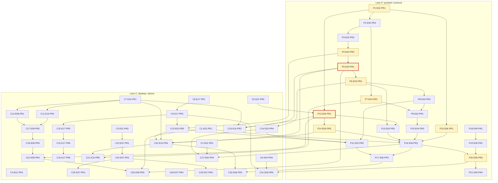

# 07 Plan index

All 11 plans for M0–M1 (+ E07, E08, E16, E17, E09), checked against each other and against roadmap §4. Plans: `docs/plans/2026-09-30-<slug>.md`; designs: `docs/designs/2026-09-30-<slug>.md`.

Paths: `pd/` = `packages/pocketd/`, `d/` = `packages/desktop/crates/`, `pk/` = `d/pocket/src/`, `app/` = `packages/app/src/` (tests: `app/test/`), `protocol/` = `packages/protocol/src/`.

## Base

Every plan targets `main` at **5091a01**. Already merged there, so no plan redoes them:

- **1e71e24** dark theme: `theme::Token {light, dark}`, macOS appearance.
- **8a10124** session drop on exit: `Registry.Remove` ends an Agent.
- **5091a01** terminal mouse selection: `term::{Pos, Selection}`, drag, `cmd-c` copy, `theme::SELECTION`.

E07 PR2 replaces 5091a01's `term::Selection` with libghostty's gesture state (owner question 8).

## Plans

| Epic | Plan / design slug | PRs (lane) | Size | Probe | Review findings |
|---|---|---|---|---|---|
| E01 | `fix-now` | PR1–5 (C) | M 4d | PR1 dry run: automatable steps pass; manual banner not run | 10 (2 major, 8 minor), all applied |
| E02 | `reach-lockdown` | PR1–4 (P), PR5 (C) | L 7d | PR1 dry run pass; PR1–5 patches apply exactly; `go test -race` ok; protocol 34 pass; app typecheck ok | 10 minor; all applied, 2 in part |
| E03 | `no-self-approval` | PR1–3, PR5 (P), PR4 (C) | L 7d | No dry run (needs E02) | 9 (2 major, 7 minor), all applied |
| E04 | `always-on` | PR1–3 (P), PR4 (C) | M 4d | PR4 dry run pass; shellenv 9/9 | 16 (1 blocker, 6 major, 9 minor), all applied |
| E05 | `registry-worktrees` | PR1–3 (P) | M 4d | Partial: non-E02 Go blocks apply at 5091a01, vet clean, `-race` green except proto goldens | 12 (2 major, 10 minor), all applied |
| E06 | `launchspec-create` | PR1–3 (P), PR4–5 (C) | L 7d | No dry run; Task 1.1 probe ok; shim compile (pocket 179, app 13) | 7 (1 blocker, 1 major, 5 minor), all applied |
| E07 | `terminal-surface` | PR1–5 (C) | L 6d | PR4 dry run pass (pocket 182, keys 11); PR1 compiles; PR2/PR5 FFI not compiled | 7 (1 major, 6 minor), all applied |
| E08 | `desktop-attention` | PR1–5 (C) | L 6d | Stub compile, 6 tests pass | 8 (2 major, 6 minor), all applied |
| E16 | `look` | PR1–5 (C) | L 6d | PR1 dry run pass; no screen captures | 10 (2 major, 8 minor), all applied |
| E17 | `phone-shell` | PR1–5 (C) | L 6d | PR1 dry run pass; PR1–5 probe, up to 46 tests | 9 (1 major, 8 minor), all applied |
| E09 | `restore` | PR1–4 (P), PR5 (C) | L 7d | PR1 dry run pass; PR1–4 pocketd tests with an E06 stub; Rust e2e pass | 7 (2 major, 5 minor), all applied |

## Execution order

Rules:

1. Lanes run in parallel. Within a lane, merge in number order.
2. "needs X" is a cross-lane dependency: wait until X merges.
3. **G** touches proto goldens. All G PRs are lane P, so lane order keeps one open at a time (roadmap §2).
4. **Atomic** (roadmap §2): while P5 E03 PR1 is open, lane C merges nothing into `d/agents`, `pk/main.rs` or `pk/desktop/alerts.rs`; while P12 E05 PR1 is open, nothing into `d/store`. §2 also names `d/daemon`, but neither atomic PR touches it. The lock is read as "while open" because §2 itself puts E01 PR5 (`d/store`) and E04 PR4 (`d/daemon`) in week 1.
5. Same file: each PR applies its edits by content over every earlier PR in this order that touches the file, keeping their lines. See [File collisions](#file-collisions).

No cycles. Every PR is in a week no earlier than its dependencies. Every roadmap §4 edge is honoured.

### Lane P: pocketd, protocol

1. E02 PR1 (wk1). G.
2. E02 PR2 (wk1).
3. E02 PR3 (wk1).
4. E02 PR4 (wk2). G.
5. E03 PR1 (wk2). G, atomic.
6. E03 PR2 (wk2). G.
7. E04 PR2 (wk2). G.
8. E03 PR3 (wk3).
9. E04 PR1 (wk3).
10. E04 PR3 (wk3).
11. E03 PR5 (wk3). Needs C13 E02 PR5 and C14 E03 PR4.
12. E05 PR1 (wk4). G, atomic. Needs C5 E01 PR5.
13. E05 PR2 (wk4).
14. E05 PR3 (wk4). G.
15. E06 PR1 (wk4). G.
16. E06 PR2 (wk5). Needs C1 E01 PR1. Probe gate: effort, folder trust.
17. E06 PR3 (wk5).
18. E09 PR1 (wk5).
19. E09 PR2 (wk6).
20. E09 PR3 (wk6). G. Probe gate: codex resume flags.
21. E09 PR4 (wk6).

### Lane C: desktop, phone

1. E01 PR1 (wk1).
2. E01 PR2 (wk1).
3. E01 PR3 (wk1).
4. E01 PR4 (wk1). Blocked on E01 step 0's paid probe turns (owner). Nothing depends on it. If it slips, later PRs go ahead and it lands by content later (fix-now.md:798).
5. E01 PR5 (wk1).
6. E04 PR4 (wk1).
7. E16 PR1 (wk2).
8. E17 PR1 (wk2).
9. E17 PR2 (wk2).
10. E17 PR3 (wk2).
11. E16 PR2 (wk3).
12. E08 PR1 (wk3).
13. E02 PR5 (wk3). Needs P4 E02 PR4.
14. E03 PR4 (wk3). Needs P6 E03 PR2.
15. E17 PR4 (wk4).
16. E17 PR5 (wk4).
17. E08 PR2 (wk4).
18. E08 PR3 (wk4).
19. E16 PR3 (wk5). Needs P5 E03 PR1 and P12 E05 PR1.
20. E16 PR4 (wk5). Needs P5 E03 PR1 and P14 E05 PR3.
21. E16 PR5 (wk5). Needs P7 E04 PR2.
22. E08 PR4 (wk5). Needs P12 E05 PR1.
23. E07 PR1 (wk5).
24. E07 PR2 (wk6).
25. E07 PR3 (wk6).
26. E08 PR5 (wk6). Needs P5 E03 PR1.
27. E06 PR4 (wk6). Needs P16 E06 PR2.
28. E07 PR4 (wk7).
29. E07 PR5 (wk7).
30. E06 PR5 (wk7). Needs P17 E06 PR3.
31. E09 PR5 (wk7). Needs P20 E09 PR3.

### Deviations from roadmap §4

All add edges and none moves a week. §4 can absorb them.

| PR | §4 | Plan adds | Why |
|---|---|---|---|
| E02 PR5 | E02 PR1, PR4 | E17 PR2 | E17 PR2 rewrites `client.ts`, `session.tsx`, `App.tsx` first |
| E03 PR1 | E02 PR3 | E02 PR4 | `devices`, `pairing`, `peer.PID`, ops `pair.begin` |
| E04 PR1 | E02 PR2, E03 PR3 | E04 PR2 | `status` reports keep-awake, tailnet, shell env |
| E04 PR2 | — | E02 PR1, PR2 | `ServerCaps`, `Negotiate`, `reach.Listen` |
| E04 PR3 | — | E04 PR1, PR2, E03 PR3 | `logfile`, `Registry.OnStatus`, `peer.From` |
| E05 PR1 | — | E02 PR1, E01 PR5 | `ServerCaps`/`Negotiate`; replaces E01's `store::write` |
| E06 PR2 | E06 PR1, E05 PR2, E04 PR2, E03 PR2 | E01 PR1, E02 PR3–4, E03 PR3, E04 PR1, PR3, E05 PR1, PR3 | `probe-cli.sh`, `atomicfile`, `pair.begin`, PTY principals, `events.Log`, `registry` |
| E06 PR3 | E06 PR2, E03 PR3 | E02 PR4, PR5, E03 PR5 | `Negotiate` in hello, paired devices, red-team stage |
| E06 PR4 | E06 PR2 | E01 PR2, E03 PR1, PR4 | `pick_provider`, owner socket, `Overlay::PairPhone` |
| E06 PR5 | E06 PR3, E02 PR5 | E05 PR1, E16 PR4 | `CAP_REGISTRY`; caps line in `client.ts` |
| E07 PR5 | not listed | E07 PR2, E01 PR3 | `surface::term_font` |
| E08 PR4 | not listed | E08 PR3, E05 PR1 | Lane rule for `d/store` |
| E16 PR3 | not listed | E16 PR1, E01 PR5, E03 PR1, E05 PR1 | `menu_in`, `save_soon`, lane rule for `d/agents` |
| E16 PR4 | E05 PR3 | E16 PR1, E03 PR1, E02 PR5 | Tokens; desktop and phone hello `caps` |
| E16 PR5 | E04 PR2 | E16 PR4, E03 PR1, E05 PR1 | `CAPS` from PR4; hello shape; lane rule for `d/agents` |
| E09 PR3 | E09 PR2, E06 PR2 | E02 PR1, E04 PR2, PR3 | `ServerCaps`, `LoginEnv`, `events` |

### Graph

Transitive reduction of the plans' dependencies. Thick red border: atomic. Yellow: G.

## File collisions

Files touched by more than one epic: 90. "Deps fix order" means every pair is ordered by dependencies. Lane order applies otherwise, and the later PR applies by content.

| File | PRs, in landing order | Merge-order note |
|---|---|---|
| `.ui-review/fixture/fixture.ts` | P5 E03 PR1, C14 E03 PR4, C31 E09 PR5 | E03 PR1 first; E03 PR4, E09 PR5 by content. |
| `pd/internal/config/settings_test.go` | P16 E06 PR2, P20 E09 PR3 | Deps fix order. |
| `app/App.tsx` | C4 E01 PR4, C9 E17 PR2, C13 E02 PR5, C30 E06 PR5 | E01 PR4 first (wk1); E17 PR2 and E02 PR5 keep its changes (phone-shell.md:44, reach-lockdown.md:5040); E06 PR5 by content. |
| `app/client.ts` | C9 E17 PR2, C13 E02 PR5, C20 E16 PR4, C30 E06 PR5 | Deps fix order. Hello caps: E02 PR5 `pair.v1`, E16 PR4 `summary.v2`, E06 PR5 registry + launch (launchspec-create.md:3911). |
| `app/components/Composer.tsx` | C4 E01 PR4, C8 E17 PR1, C9 E17 PR2, C15 E17 PR4, C20 E16 PR4 | E01 PR4 first; E17 by content (phone-shell.md:44, fix-now.md:798); E16 PR4 after both (look.md:1857). |
| `app/components/TimelineView.tsx` | C8 E17 PR1, C15 E17 PR4, C31 E09 PR5 | Index order; later PR applies by content. |
| `app/screens/AgentsScreen.tsx` | C8 E17 PR1, C9 E17 PR2, C10 E17 PR3, C30 E06 PR5, C31 E09 PR5 | E17 first; E06 PR5 and E09 PR5 (both wk7) by content, second keeps the first's lines. |
| `app/screens/ChatScreen.tsx` | C4 E01 PR4, C8 E17 PR1, C9 E17 PR2, C10 E17 PR3, C15 E17 PR4, C16 E17 PR5, C20 E16 PR4, C31 E09 PR5 | E01 PR4 first; E17 PR1-5 by content (phone-shell.md:44); E16 PR4 after both (look.md:1857); E09 PR5 last. |
| `app/screens/ConnectScreen.tsx` | C9 E17 PR2, C13 E02 PR5 | E17 PR2 rewrites it; E02 PR5 deletes it (reach-lockdown.md:5040). |
| `app/session.tsx` | C4 E01 PR4, C9 E17 PR2, C13 E02 PR5, C15 E17 PR4, C16 E17 PR5, C30 E06 PR5 | E01 PR4 first; E17 PR2 and E02 PR5 keep its permissions map (phone-shell.md:44, reach-lockdown.md:5040); E17 PR4-5, E06 PR5 by content. |
| `app/status.ts` | C10 E17 PR3, C31 E09 PR5 | E17 PR3 (wk2) first; E09 PR5 by content. |
| `app/test/status.test.mts` | C10 E17 PR3, C31 E09 PR5 | E17 PR3 (wk2) first; E09 PR5 by content. |
| `desktop/Cargo.lock` | C14 E03 PR4, C22 E08 PR4 | Additive; index order; regenerate the lock. |
| `desktop/Cargo.toml` | C14 E03 PR4, C22 E08 PR4 | Additive; index order. |
| `d/agents/src/agents.rs` | P5 E03 PR1, C14 E03 PR4, C19 E16 PR3, C20 E16 PR4, C21 E16 PR5, C26 E08 PR5, C27 E06 PR4, C31 E09 PR5 | E03 PR1 (atomic) first. Hello caps: E03 PR1 `pair.v1`,`scopes.v1`; E16 PR4 adds `summary.v2`; E16 PR5 `host.v1`. Rest index order by content. |
| `d/daemon/src/daemon.rs` | C6 E04 PR4, C27 E06 PR4 | E04 PR4 (wk1) first; E06 PR4 by content (launchspec-create.md:2746). |
| `d/pocket/Cargo.toml` | C14 E03 PR4, C22 E08 PR4 | Additive; index order. |
| `pk/actions.rs` | C18 E08 PR3, C24 E07 PR2, C25 E07 PR3 | Index order; later PR applies by content. |
| `pk/capture.rs` | C5 E01 PR5, C14 E03 PR4, C27 E06 PR4 | Index order; later PR applies by content. |
| `pk/desktop.rs` | C5 E01 PR5, C6 E04 PR4, C14 E03 PR4, C18 E08 PR3, C19 E16 PR3, C22 E08 PR4, C29 E07 PR5 | Index order. E03 PR4 keeps E01 PR5's fields and E04 PR4's `send_spawn`/`link_page` (no-self-approval.md:4059). |
| `pk/desktop/alerts.rs` | P5 E03 PR1, C14 E03 PR4, C22 E08 PR4, C26 E08 PR5, C27 E06 PR4 | E03 PR1 (atomic) first; rest index order by content. |
| `pk/desktop/chrome.rs` | C5 E01 PR5, C7 E16 PR1, C14 E03 PR4, C19 E16 PR3, C25 E07 PR3, C27 E06 PR4, C28 E07 PR4 | Index order. E03 PR4 per no-self-approval.md:4059. E16 PR3, E07 PR3, E07 PR4 each add a `Confirm` variant; later keeps all (terminal-surface.md:1620). |
| `pk/main.rs` | C5 E01 PR5, C6 E04 PR4, P5 E03 PR1, C26 E08 PR5 | E01 PR5, E04 PR4 (wk1) before E03 PR1 (wk2); E03 PR1 edits only the `agents::connect` line after `Daemon::spawn` (no-self-approval.md:1972); E08 PR5 by content. |
| `pk/modals.rs` | C14 E03 PR4, C27 E06 PR4 | Deps fix order. |
| `pk/modals/add_project.rs` | C12 E08 PR1, C27 E06 PR4 | Index order; later PR applies by content. |
| `pk/modals/confirm.rs` | C12 E08 PR1, C19 E16 PR3, C25 E07 PR3, C28 E07 PR4 | E08 PR1, E16 PR3, E07 PR3, E07 PR4. `danger: true` on every text (terminal-surface.md:1515, look.md:1546); one close-session sheet (look.md:1564, terminal-surface.md:2040). |
| `pk/modals/more.rs` | C7 E16 PR1, C28 E07 PR4 | Index order; later PR applies by content. |
| `pk/modals/new_session.rs` | C2 E01 PR2, C7 E16 PR1, C27 E06 PR4 | Index order; E06 PR4 uses E16 PR1's `FAILED_TEXT` (launchspec-create.md:3521). |
| `pk/modals/new_session/picker.rs` | C2 E01 PR2, C7 E16 PR1, C27 E06 PR4 | Index order; later PR applies by content. |
| `pk/palette.rs` | C11 E16 PR2, C12 E08 PR1, C14 E03 PR4, C17 E08 PR2, C18 E08 PR3, C22 E08 PR4, C27 E06 PR4, C31 E09 PR5 | E16 PR2 rewrites it (v2). E08 PR2+ anchor on v2 (desktop-attention.md:16); E03 PR4 re-applies on v2 (no-self-approval.md:4742); E06 PR4, E09 PR5 by content. |
| `pk/sidebar.rs` | C18 E08 PR3, C19 E16 PR3, C21 E16 PR5 | Index order; later PR applies by content. |
| `pk/sidebar/rail.rs` | C12 E08 PR1, C17 E08 PR2, C18 E08 PR3, C20 E16 PR4 | Index order; later PR applies by content. |
| `pk/sidebar/sessions.rs` | C17 E08 PR2, C18 E08 PR3, C19 E16 PR3, C31 E09 PR5 | E08 PR2-3 first; E16 PR3 keeps E08 PR3's chips and `when` (look.md:1747, desktop-attention.md:1885); E09 PR5 by content. |
| `pk/status.rs` | C17 E08 PR2, C18 E08 PR3, C26 E08 PR5, C31 E09 PR5 | Index order; later PR applies by content. |
| `pk/terminal_view.rs` | C7 E16 PR1, C14 E03 PR4, C20 E16 PR4, C23 E07 PR1, C24 E07 PR2, C25 E07 PR3, C29 E07 PR5 | E16 PR1, E03 PR4 first; E07 PR1 keeps E03's `observe_only` returns and adds one to `send_input` (terminal-surface.md:165). |
| `pk/terminal_view/surface.rs` | C3 E01 PR3, C23 E07 PR1, C24 E07 PR2, C28 E07 PR4, C29 E07 PR5 | Index order; later PR applies by content. |
| `pk/terminal_view/tabs.rs` | C7 E16 PR1, C12 E08 PR1 | Deps fix order. |
| `pk/terminals.rs` | C6 E04 PR4, C14 E03 PR4, C27 E06 PR4, C28 E07 PR4 | E04 PR4, E03 PR4, E06 PR4, E07 PR4. `observe_only` stays first in `send_spawn` (no-self-approval.md:4059); E07 PR4 keeps E04/E06 fields (terminal-surface.md:1620). |
| `d/store/src/store.rs` | C5 E01 PR5, P12 E05 PR1, C22 E08 PR4, C27 E06 PR4 | E01 PR5 (wk1) before atomic E05 PR1; E08 PR4, E06 PR4 additive. |
| `d/storybook/src/main.rs` | C11 E16 PR2, C18 E08 PR3, C31 E09 PR5 | Index order; later PR applies by content. |
| `d/theme/src/theme.rs` | C7 E16 PR1, C12 E08 PR1, C29 E07 PR5 | Index order; later PR applies by content. |
| `d/ui/src/ui.rs` | C7 E16 PR1, C11 E16 PR2, C12 E08 PR1, C18 E08 PR3, C19 E16 PR3, C31 E09 PR5 | One `SESSION_ROW` const for E08 PR1 and E16 PR3 (look.md:1727, desktop-attention.md:576); E09 PR5 by content. |
| `pd/cmd/pocketd/devices.go` | P3 E02 PR3, P11 E03 PR5 | Deps fix order. |
| `pd/cmd/pocketd/devices_test.go` | P3 E02 PR3, P11 E03 PR5 | Deps fix order. |
| `pd/cmd/pocketd/main.go` | P3 E02 PR3, P4 E02 PR4, P9 E04 PR1, P10 E04 PR3, P13 E05 PR2, P16 E06 PR2 | Lane P order; each PR appends to `usage` (registry-worktrees.md:1959, launchspec-create.md:2351). |
| `pd/cmd/pocketd/serve.go` | P2 E02 PR2, P3 E02 PR3, P4 E02 PR4, P5 E03 PR1, P6 E03 PR2, P7 E04 PR2, P8 E03 PR3, P9 E04 PR1, P11 E03 PR5, P12 E05 PR1, P14 E05 PR3, P16 E06 PR2, P18 E09 PR1, P19 E09 PR2, P20 E09 PR3 | Lane P index order; each plan re-anchors by content. |
| `pd/e2e/devices_test.go` | P3 E02 PR3, P6 E03 PR2 | Deps fix order. |
| `pd/e2e/harness_test.go` | P2 E02 PR2, P7 E04 PR2, P9 E04 PR1, P11 E03 PR5, P16 E06 PR2, P18 E09 PR1, P19 E09 PR2, P20 E09 PR3 | Index order; later PR applies by content. |
| `pd/e2e/phone_test.go` | P4 E02 PR4, P16 E06 PR2 | Deps fix order. |
| `pd/e2e/redteam/main.go` | P11 E03 PR5, P17 E06 PR3 | Deps fix order. |
| `pd/e2e/redteam_test.go` | P11 E03 PR5, P17 E06 PR3 | Deps fix order. |
| `pd/internal/agent/agent.go` | P7 E04 PR2, P14 E05 PR3, P20 E09 PR3 | E04 PR2 adds `reg: r` to the `AddFunc` literal; E05 PR3's replacement literal and E09 PR3's `Restore` literal keep it (registry-worktrees.md:2232, restore.md:1786). |
| `pd/internal/agent/agent_test.go` | P7 E04 PR2, P14 E05 PR3, P20 E09 PR3 | E04 PR2, E05 PR3 additive; E09 PR3 last. |
| `pd/internal/codex/session.go` | P14 E05 PR3, P21 E09 PR4 | Deps fix order. |
| `pd/internal/codex/session_test.go` | P14 E05 PR3, P21 E09 PR4 | Deps fix order. |
| `pd/internal/config/config.go` | P2 E02 PR2, P3 E02 PR3, P5 E03 PR1 | Deps fix order. |
| `pd/internal/config/config_test.go` | P2 E02 PR2, P5 E03 PR1 | Deps fix order. |
| `pd/internal/config/settings.go` | P16 E06 PR2, P20 E09 PR3 | Deps fix order. |
| `pd/internal/daemon/claude.go` | P8 E03 PR3, P14 E05 PR3, P20 E09 PR3 | Index order; later PR applies by content. |
| `pd/internal/daemon/codex.go` | P14 E05 PR3, P20 E09 PR3 | Deps fix order. |
| `pd/internal/daemon/daemon.go` | P7 E04 PR2, P8 E03 PR3, P14 E05 PR3, P19 E09 PR2, P20 E09 PR3 | Lane P order; E04 PR2 and E05 PR3 each add a field after `Plugin`; keep both. |
| `pd/internal/daemon/daemon_test.go` | P7 E04 PR2, P14 E05 PR3 | Index order; later PR applies by content. |
| `pd/internal/daemon/presence.go` | P14 E05 PR3, P19 E09 PR2, P20 E09 PR3, P21 E09 PR4 | Index order; later PR applies by content. |
| `pd/internal/devices/devices.go` | P3 E02 PR3, P5 E03 PR1, P11 E03 PR5 | Deps fix order. |
| `pd/internal/devices/devices_test.go` | P3 E02 PR3, P5 E03 PR1 | Deps fix order. |
| `pd/internal/events/events.go` | P10 E04 PR3, P20 E09 PR3 | Deps fix order. |
| `pd/internal/events/events_test.go` | P10 E04 PR3, P20 E09 PR3 | Deps fix order. |
| `pd/internal/events/testdata/schema.jsonl` | P10 E04 PR3, P20 E09 PR3 | Deps fix order. |
| `pd/internal/ops/devices.go` | P3 E02 PR3, P4 E02 PR4, P5 E03 PR1, P6 E03 PR2 | Deps fix order. |
| `pd/internal/ops/devices_test.go` | P3 E02 PR3, P6 E03 PR2 | Deps fix order. |
| `pd/internal/ops/ops.go` | P3 E02 PR3, P4 E02 PR4, P5 E03 PR1, P6 E03 PR2, P8 E03 PR3, P9 E04 PR1, P16 E06 PR2 | Deps fix order. |
| `pd/internal/ops/ops_test.go` | P6 E03 PR2, P8 E03 PR3, P9 E04 PR1 | Deps fix order. |
| `pd/internal/ops/pair.go` | P4 E02 PR4, P6 E03 PR2 | Deps fix order. |
| `pd/internal/peer/check.go` | P6 E03 PR2, P16 E06 PR2 | Deps fix order. |
| `pd/internal/peer/peer.go` | P3 E02 PR3, P5 E03 PR1 | Deps fix order. |
| `pd/internal/peer/peer_test.go` | P3 E02 PR3, P5 E03 PR1 | Deps fix order. |
| `pd/internal/proto/golden_test.go` | P1 E02 PR1, P4 E02 PR4, P5 E03 PR1, P6 E03 PR2, P7 E04 PR2, P12 E05 PR1, P14 E05 PR3, P15 E06 PR1, P20 E09 PR3 | One G PR open at a time (roadmap §2); lane P order. |
| `pd/internal/proto/messages.go` | P1 E02 PR1, P4 E02 PR4, P5 E03 PR1, P6 E03 PR2, P7 E04 PR2, P12 E05 PR1, P14 E05 PR3, P15 E06 PR1 | One G PR open at a time; lane P order. |
| `pd/internal/proto/proto.go` | P1 E02 PR1, P14 E05 PR3, P20 E09 PR3 | Deps fix order. |
| `pd/internal/proto/version.go` | P1 E02 PR1, P4 E02 PR4, P5 E03 PR1, P7 E04 PR2, P12 E05 PR1, P14 E05 PR3, P17 E06 PR3, P20 E09 PR3 | `ServerCaps` append order: `pair.v1` (E02 PR4), `CapScopes` (E03 PR1), `CapHost` (E04 PR2), `CapRegistry` (E05 PR1), `CapSummaryV2` (E05 PR3), `CapLaunch` (E06 PR3), `CapRestore` (E09 PR3, restore.md:1666). |
| `pd/internal/terminal/terminal.go` | P5 E03 PR1, P8 E03 PR3, P14 E05 PR3, P18 E09 PR1 | Index order; later PR applies by content. |
| `pd/internal/terminal/terminal_test.go` | P5 E03 PR1, P14 E05 PR3, P18 E09 PR1 | Index order; later PR applies by content. |
| `pd/internal/wsserver/pair.go` | P4 E02 PR4, P6 E03 PR2 | Deps fix order. |
| `pd/internal/wsserver/pair_test.go` | P4 E02 PR4, P6 E03 PR2 | Deps fix order. |
| `pd/internal/wsserver/wsserver.go` | P1 E02 PR1, P2 E02 PR2, P3 E02 PR3, P4 E02 PR4, P5 E03 PR1, P6 E03 PR2, P7 E04 PR2, P8 E03 PR3, P10 E04 PR3, P12 E05 PR1, P16 E06 PR2, P17 E06 PR3, P20 E09 PR3 | Lane P index order; one G PR at a time. |
| `pd/internal/wsserver/wsserver_test.go` | P1 E02 PR1, P2 E02 PR2, P3 E02 PR3, P4 E02 PR4, P5 E03 PR1, P6 E03 PR2, P7 E04 PR2, P8 E03 PR3, P12 E05 PR1, P20 E09 PR3 | Lane P index order. |
| `protocol/constants.ts` | P1 E02 PR1, P12 E05 PR1, P14 E05 PR3, P15 E06 PR1 | One G PR at a time; lane P order. |
| `protocol/messages.ts` | P1 E02 PR1, P4 E02 PR4, P5 E03 PR1, P6 E03 PR2, P7 E04 PR2, P12 E05 PR1, P15 E06 PR1 | One G PR at a time; lane P order. |
| `protocol/timeline.ts` | P14 E05 PR3, P20 E09 PR3 | Deps fix order. |
| `scripts/probe-cli.sh` | C1 E01 PR1, P16 E06 PR2, P20 E09 PR3 | Deps fix order. |

## Cross-plan fixes made

All are plan edits; no design changed, so no "Rebased on 5091a01" line was needed.

| # | Plan:line | Defect | Fix |
|---|---|---|---|
| 1 | look.md:1564 | E16 PR3's `CloseSession` arm opened a second sheet after E07 PR4's `ask_close` | Close directly if E07 PR4 is in |
| 2 | look.md:1546, terminal-surface.md:1515 | E07 PR3's `ConfirmText.danger` missing on E16 PR3's text, and vice versa | `danger: true` whichever lands second |
| 3 | terminal-surface.md:2040 | Same double sheet from E07 PR4's side | Same direct-close arm |
| 4 | look.md:1953 | Read `summary.v2` as gating the fields; E05 decision 13 always sends them | Cap only announces them |
| 5 | look.md:1747, desktop-attention.md:1885 | E16 PR3 and E08 PR3 each rewrote `session_row`'s `when`, dropping the other's chips or `open` check | Each keeps the other's |
| 6 | look.md:1727, desktop-attention.md:576 | Two constants, `SESSION_GROUP` and `SESSION_ROW`, named the same `"session-row"` group | One `pub const SESSION_ROW` |
| 7 | look.md:1857 | E16 PR4 anchored `Composer.tsx` only after E17 PR1; E17 PR2–5 and `client.ts` also move first | Re-anchor after E17 PR1–5 and E01 PR4 |
| 8 | launchspec-create.md:3643, :3645 | E06 PR5 extends the `client.ts` caps line E16 PR4 adds, without depending on it | Depends on E16 PR4; deviation line updated |
| 9 | launchspec-create.md:2746 | E06 PR4 anchored `daemon.rs`/`terminals.rs` at 5091a01 though E04 PR4 rewrites them | Names E04 PR4's edits |
| 10 | launchspec-create.md:3521 | E06 PR4 used `FAILED` for error text; E16 PR1 makes `FAILED_TEXT` the text token | Use `FAILED_TEXT` |
| 11 | reach-lockdown.md:5039–5040 | E02 PR5 (wk3) edits files E17 PR2 (wk2) and E01 PR4 (wk1) rewrite, without depending on them | Depends on E17 PR2; keep E01 PR4's changes |
| 12 | restore.md:1666 | `CapRestore` placement ignored the other caps | Append after all of them, in order |
| 13 | restore.md:60 | E09 PR3's extra deps were not stated against §4 | §4 row and additions stated |
| 14 | restore.md:1786 | `Restore`'s `&Agent{…}` lacked E04 PR2's `reg: r`; `update` would dereference a nil `reg` on a restored Agent's first status change | Add `reg: r` |
| 15 | registry-worktrees.md:2232 | E05 PR3's replacement `AddFunc` literal dropped E04 PR2's `reg: r` (same nil dereference for every Agent) | Keep `reg: r` |
| 16 | registry-worktrees.md:1959 | E05 PR2 replaced `usage`, dropping E02's `pair`/`devices` and E04's `status`/`stats`/`daemon` | Append to `usage` |
| 17 | no-self-approval.md:1972 | E03 PR1 anchored `main.rs` at 5091a01; E04 PR4's `Daemon::spawn` lands first | Change only the `agents::connect` line |
| 18 | no-self-approval.md:4059 | E03 PR4 anchored `desktop.rs`, `chrome.rs`, `terminal_view.rs`, `terminals.rs` at 5091a01; E01 PR5, E04 PR4, E16 PR1 land first | Apply by content; `observe_only` return stays first in `send_spawn` |
| 19 | terminal-surface.md:165 | E07 PR1 replaces `replace_text_in_range`, dropping E03 PR4's `observe_only` guard; `send_input` (wheel arrows, pastes) bypassed it | Keep E03's guards; add one first in `send_input` |
| 20 | terminal-surface.md:1620 | E07 PR4 said "All anchors are at 5091a01", but E04 PR4 and E06 PR4 change `terminals.rs` first | Anchors re-stated; apply by content |
| 21 | fix-now.md:798 | E01 PR4 had no rule for E17 landing first | Apply by content, reverse of phone-shell.md:44 |

## Open owner questions

Deduped across plans.

1. E01 step 0 needs paid agent turns (claude 2.1.285, codex 0.159). E01 PR4 waits on it.
2. PRD Q3: CI runner cost, repo visibility, licence.
3. `rsc.io/qr` (BSD-3) for `pocketd pair`, or drop `qr.go`.
4. Bundle namespace clash. E04 uses `dev.mingo.anywhere.pocketd` and `dev.mingo.anywhere.*`; E01 uses `dev.mingo.anywhere.desktop`; the phone is `dev.mingo.anywhere` (P packages/app/app.json:12). Pick one.
5. E17: NetInfo needs a native rebuild in wk2. Do the rebuild, or ship AppState-only?
6. E08: a pill label on its own tint is 4.18–4.46:1 in light, under 4.5 (desktop-attention.md:3248).
7. E16 decision 2: light WAITING `ad5700`, FAILED `cd2b31` (see below).
8. E07 PR2 replaces the owner's 5091a01 `term::Selection` with libghostty's gesture state.
9. E09 step 0: if the codex binary grep for resume flags misses, the owner decides.
10. E04 and E05 ask for the §4 row updates listed under Deviations.
11. No epic owns the full UXP §2 phone token set (flagged by E16).

## PO-decided, for owner review

From plan headers:

- **look.md:30, :126, :296, :2681.** Decision 2: light WAITING `ad5700`, light FAILED `cd2b31`; dark values kept. Departs from "fixed in both schemes".
- **reach-lockdown.md:130.** Every line of design §10 (1–31). The weighty ones:
  - version stays 3, with a `{min,max}` range and caps;
  - bind loopback + tailnet;
  - `listen: auto|loopback`;
  - any `*.ts.net` Host allowed;
  - sha256-hashed device tokens;
  - the legacy device kept in memory only;
  - a 22-char pairing code, valid 5 min;
  - `rsc.io/qr`;
  - the phone keeps App.tsx's switch;
  - `ws://` only on loopback or tailnet.
- **registry-worktrees.md:98.** Every line of design §10 (1–18). The weighty ones:
  - the claude window table;
  - `desktop.json` read beside the socket, with no watcher;
  - rename without fsync;
  - `summary.v2` fields always sent;
  - CLI in its own process;
  - `remove --force`;
  - `invalid_name`/`main_worktree` codes;
  - no PROTOCOL_VERSION bump.
- **desktop-attention.md:3248.** Pill contrast (question 6).

The designs' §10 lines marked "PO-decided — review":

- E01 (all but D12, D31–33, D37)
- E03
- E04
- E06 (16 lines)
- E08
- E09
- E16
- E17
- E07 (design 360–382: libghostty selection, close-confirm rules, `TERM_*` dark values)
