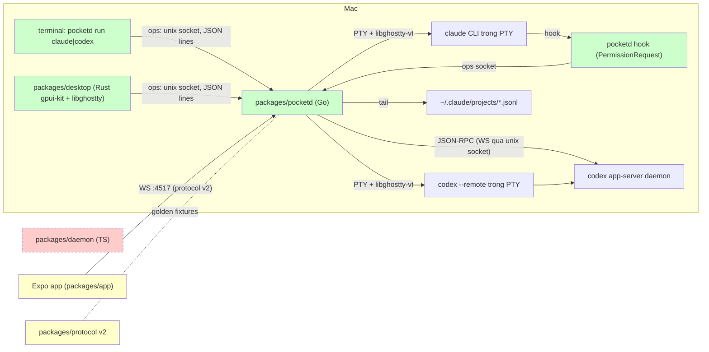

# pocketd: điều khiển session Claude và Codex trên Mac từ điện thoại — Implementation Plan

> **For Claude:** REQUIRED SUB-SKILL: Use /implement to execute this plan task-by-task.

**Goal:** Session Claude Code và Codex chạy trên Mac (từ terminal hoặc app desktop) hiện lên điện thoại, và điện thoại xem, gửi prompt và duyệt quyền được, thông qua daemon Go mới `pocketd`.

**Toolset:**
- Build libghostty một lần (khoảng 1.5 phút, cần Zig 0.16.0): `./scripts/build-ghostty.sh`
- Một package Go: `cd packages/pocketd && go test -count=1 ./internal/<pkg>/`
- Full suite Go: `cd packages/pocketd && go vet ./... && go test -race -count=1 ./...`
- Sau khi thêm import module mới trong Go: `cd packages/pocketd && go mod tidy`
- Contract test protocol: `pnpm --filter @pocket/protocol test`
- Typecheck TS: `pnpm -r typecheck`
- Desktop: `export PATH=$HOME/.cargo/bin:$PATH && cd packages/desktop && cargo test` (build: `cargo build`)
- Full suite của cả repo = tất cả các lệnh trên. Lệnh nào chưa có (ví dụ desktop trước PR7) thì bỏ qua.

**Read first:**
- `docs/spike-remote-sessions.md` — kết quả spike: cái gì đã kiểm chứng, hook Claude và app-server Codex hoạt động ra sao, các bẫy (env `USER`, `.a` và `.dylib`, trust thư mục).
- `packages/protocol/src/messages.ts`, `packages/protocol/src/timeline.ts` — protocol mà phone đang nói. pocketd phải khớp từng field.
- `packages/daemon/src/timeline.ts`, `packages/daemon/src/tool-detail.ts`, `packages/daemon/src/diff.ts` — bản TS mà `internal/timeline` port lại. Thư mục này bị xoá ở PR5, nên hãy đọc trước.
- `packages/app/src/session.tsx` — cách app dùng protocol (hello, list, timeline, stream).

**Không bao giờ đụng vào git index.** Người dùng có thay đổi đã staged trong `packages/app/src/screens/{AgentsScreen,ConnectScreen}.tsx` và `packages/daemon/src/{agent-manager,providers/claude,providers/types,timeline}.ts`. Không `git add`, `git rm`, `git stash`, `git commit`, hay `git apply --index`.

---

## Architecture



Xanh là mới, vàng là sửa, đỏ gạch là bị xoá.

- `pocketd` giữ PTY và terminal ảo (libghostty-vt) của mọi session. Session vẫn sống khi terminal hoặc app desktop đóng.
- Terminal, app desktop và `pocketd hook` nói chuyện với pocketd qua một unix socket (ops). Phone nói qua WebSocket với protocol v2.
- Claude: timeline lấy từ file transcript mà Claude tự ghi; duyệt quyền qua hook `PermissionRequest`.
- Codex: TUI chạy với `--remote` vào app-server của account; pocketd là client thứ hai của cùng thread, lấy timeline, stream và approval từ đó.
- Phone giữ nguyên chat UI, chỉ bỏ phần tạo session. `packages/daemon` bị xoá.

## Why this approach

- **Go thay daemon TS.** PTY, libghostty (cgo) và hook nằm trong một process. Không giữ song song hai daemon.
- **Phone chỉ điều khiển, không tạo session.** Bỏ `agent.create` và `profile.list`. Account do env của người dùng quyết định (`CLAUDE_CONFIG_DIR`, `CODEX_HOME`); pocket không quản lý account.
- **Claude duyệt quyền qua hook.** Loại Claude Channels vì bị allowlist chặn, loại đọc màn hình vì dễ vỡ.
- **Timeline Claude lấy từ transcript,** không dùng SDK. Session chạy trong terminal cũng được thấy. Đổi lại: không có token streaming, và không biết task, cost hay các bước của subagent. Vì vậy `task.stop`, `agent.tasks` và `agentRun` bị bỏ khỏi protocol.
- **Codex đi qua app-server,** không đọc rollout, vì rollout không có approval và không có token delta.
- **Desktop duyệt trước thì phone tự đóng card.** Claude: pocketd thấy `tool_result` khớp tool đang chờ. Codex: app-server gửi `serverRequest/resolved`.
- **Không giữ session qua lần restart pocketd.** Session chết theo PTY.
- **Test không cần account thật.** E2E dùng `fakeclaude`, `fakecodex` (chương trình Go) và một app-server giả, đặt trong `PATH`.
- **Thứ tự: pocketd → mobile → desktop.** Desktop chỉ cần ops socket, nên làm cuối được.

## Tasks at a glance

| PR | Task | Nội dung | File chính | Rủi ro |
|---|---|---|---|---|
| **1 · pocketd chạy session trong PTY.** Tạo module Go `packages/pocketd`, VT headless bằng libghostty, session manager, ops socket và CLI `pocketd serve \| run \| attach`. Chưa có phone, chưa có timeline. Daemon TS vẫn chạy như cũ. | 1.1 | E2E harness và fake claude | `packages/pocketd/go.mod`, `packages/pocketd/e2e/harness_test.go` … | Thấp |
|  | 1.2 | Build libghostty và package `vt` | `scripts/build-ghostty.sh`, `.gitignore` … | Cao (cgo) |
|  | 1.3 | Session manager | `packages/pocketd/internal/session/session.go` | TB |
|  | 1.4 | Ops socket | `packages/pocketd/internal/ops/ops.go` | TB |
|  | 1.5 | Config và CLI `pocketd serve \| run \| attach` | `packages/pocketd/internal/config/config.go`, `packages/pocketd/cmd/pocketd/main.go` … | Thấp |
| **2 · Timeline trong Go.** Port kiểu dữ liệu của `packages/protocol` và reducer timeline của daemon TS sang Go, kèm golden fixtures cho protocol v2. Chưa có code nào gọi tới (inert), PR4 mới dùng. | 2.1 | Kiểu protocol trong Go và golden fixtures | `packages/pocketd/internal/proto/proto.go`, `packages/pocketd/internal/proto/messages.go` … | TB |
|  | 2.2 | Tool detail và diff | `packages/pocketd/internal/timeline/detail.go`, `packages/pocketd/internal/timeline/diff.go` | Thấp |
|  | 2.3 | Reducer timeline | `packages/pocketd/internal/timeline/timeline.go` | TB |
| **3 · Các khối cho phone: hub, transcript Claude, agent, broker.** Các package thuần, mỗi package có unit test riêng. Chưa có code nào gọi tới (inert). PR4 nối chúng với phone server. | 3.1 | Hub | `packages/pocketd/internal/hub/hub.go` | Thấp |
|  | 3.2 | Transcript Claude | `packages/pocketd/internal/claude/transcript.go` | TB |
|  | 3.3 | Agent registry | `packages/pocketd/internal/agent/agent.go` | Thấp |
|  | 3.4 | Permission broker | `packages/pocketd/internal/broker/broker.go` | Cao (chặn tool) |
| **4 · Phone nói chuyện với pocketd (Claude).** Phone server WebSocket theo protocol v2, và nối session `claude` vào agent registry, transcript và hook. Sau PR này, phone thấy và điều khiển được session Claude chạy bằng `pocketd run claude`. App chưa được cập nhật (PR5), nên app hiện tại vẫn nói v1 với daemon TS. | 4.1 | Phone server (WebSocket) | `packages/pocketd/internal/wsserver/wsserver.go`, `packages/pocketd/go.mod`, `packages/pocketd/go.sum` | TB |
|  | 4.2 | E2E: phone thấy Claude và duyệt quyền | `packages/pocketd/e2e/phone_test.go` | Thấp |
|  | 4.3 | Nối Claude vào phone | `packages/pocketd/internal/daemon/daemon.go`, `packages/pocketd/cmd/pocketd/serve.go` … | Cao (nối dây) |
| **5 · App và protocol lên v2, bỏ daemon TS.** Sửa `packages/protocol` và `packages/app` cho khớp protocol v2 của pocketd, rồi xoá `packages/daemon`. Sau PR này, phone chỉ còn nói chuyện với pocketd. | 5.1 | Protocol v2 | `packages/protocol/package.json`, `packages/protocol/src/constants.ts`, `packages/protocol/src/messages.ts`, `packages/protocol/src/timeline.ts` | TB |
|  | 5.2 | App theo protocol v2 | `packages/app/src/session.tsx`, `packages/app/src/screens/AgentsScreen.tsx` … | Thấp |
|  | 5.3 | Xoá daemon TS | `packages/daemon/`, `pnpm-workspace.yaml` … | Thấp |
| **6 · Codex qua app-server.** `pocketd run codex` chạy TUI Codex nối vào app-server của account, và pocketd tham gia cùng thread làm client thứ hai. Phone thấy timeline có token streaming, gửi prompt, và duyệt quyền. | 6.1 | JSON-RPC client cho app-server | `packages/pocketd/internal/codex/codextest/server.go`, `packages/pocketd/internal/codex/rpc.go` | TB |
|  | 6.2 | Theo dõi một thread Codex | `packages/pocketd/internal/codex/session.go` | Cao (protocol Codex đổi theo version) |
|  | 6.3 | E2E: phone thấy thread Codex | `packages/pocketd/e2e/fakecodex/main.go`, `packages/pocketd/e2e/harness_test.go` | Thấp |
|  | 6.4 | Nối Codex vào daemon | `packages/pocketd/internal/daemon/codex.go`, `packages/pocketd/internal/daemon/daemon.go` | TB |
| **7 · Desktop app: xem và gõ vào session.** App desktop Rust (gpui-kit) trong `packages/desktop`, là một cargo project riêng, ngoài pnpm workspace. Mỗi session của pocketd là một tab. Terminal được vẽ bằng libghostty-vt, và gõ phím được gửi thẳng vào PTY. | 7.1 | Crate desktop và terminal libghostty | `packages/desktop/Cargo.toml`, `packages/desktop/build.rs` … | Cao (link libghostty) |
|  | 7.2 | Client ops socket và phím | `packages/desktop/src/daemon.rs`, `packages/desktop/src/keys.rs` … | TB |
|  | 7.3 | Tab và cửa sổ desktop | `packages/desktop/src/tabs.rs`, `packages/desktop/src/main.rs` | TB |
| **8 · Desktop: tạo session và gửi prompt.** Desktop thêm form tạo session (lệnh + thư mục) và ô composer để gửi prompt vào tab đang chọn. Phone vẫn không tạo session. | 8.1 | Spawn op và chọn tab | `packages/desktop/src/daemon.rs`, `packages/desktop/src/tabs.rs` | Thấp |
|  | 8.2 | Form tạo session và composer | `packages/desktop/src/main.rs` | Thấp |

---

## PR 1: pocketd chạy session trong PTY

**Scope:** Tạo module Go `packages/pocketd`, VT headless bằng libghostty, session manager, ops socket và CLI `pocketd serve | run | attach`. Chưa có phone, chưa có timeline. Daemon TS vẫn chạy như cũ.
**Depends on:** nothing
**Done when:** `go test -race ./...` trong `packages/pocketd` xanh, gồm e2e `TestPromptFromOpsReachesCLI`. Chạy `pocketd serve` rồi `pocketd run bash` ở terminal khác là dùng được, và `pocketd attach <id>` vẽ lại màn hình.

### Task 1.1: E2E harness và fake claude

**What & why:** Viết test e2e trước, để các task sau có đích để đạt. Harness chạy binary `pocketd` thật và một `claude` giả, nên không cần account thật.

**Files:**
- Create: `packages/pocketd/go.mod`
- Create: `packages/pocketd/e2e/harness_test.go`
- Create: `packages/pocketd/e2e/fakeclaude/main.go`
- Test: `packages/pocketd/e2e/pty_test.go`

**Context:**

- `pocketd` là daemon Go mới, thay `packages/daemon` (TS). Nó nằm trong `packages/pocketd` nhưng không phải package pnpm (không có `package.json`, pnpm bỏ qua).
- `TestMain` build `pocketd` và các CLI giả vào một thư mục tạm. Thư mục `fake/` được đặt đầu `PATH`, nên `claude` trong session chính là `fakeclaude`.
- macOS giới hạn đường dẫn unix socket ở 104 byte. `t.TempDir()` quá dài, nên harness dùng `os.MkdirTemp("/tmp", "pk")`.
- `fakeclaude` đã có sẵn phần ghi transcript và gọi hook. PR1 chỉ dùng phần echo: in `fake claude ready`, sau đó mỗi dòng nhập vào được trả lời `echo: <dòng>`. Các phần kia dùng ở PR4.
- Harness ghi `config.json` (token, port). PR1 chưa đọc file này, PR4 mới dùng.

**Step 1: Write the failing test**

Create `packages/pocketd/go.mod`:

```text
module pocketd

go 1.27.1
```

Create `packages/pocketd/e2e/harness_test.go`:

```go
package e2e

import (
	"bytes"
	"fmt"
	"net"
	"os"
	"os/exec"
	"path/filepath"
	"strings"
	"testing"
	"time"

	"pocketd/internal/ops"
)

var binDir string

func TestMain(m *testing.M) {
	dir, err := os.MkdirTemp("", "pocketd-e2e")
	if err != nil {
		panic(err)
	}
	for _, b := range [][2]string{{"pocketd", "../cmd/pocketd"}, {"fake/claude", "./fakeclaude"}} {
		out, err := exec.Command("go", "build", "-o", filepath.Join(dir, b[0]), b[1]).CombinedOutput()
		if err != nil {
			fmt.Fprintf(os.Stderr, "build %s: %v\n%s", b[1], err, out)
			os.Exit(1)
		}
	}
	binDir = dir
	code := m.Run()
	os.RemoveAll(dir)
	os.Exit(code)
}

type Harness struct {
	t         *testing.T
	Home      string
	Sock      string
	ClaudeDir string
	Port      int
	Token     string
	Env       []string
	log       *bytes.Buffer
}

func freePort(t *testing.T) int {
	ln, err := net.Listen("tcp", "127.0.0.1:0")
	if err != nil {
		t.Fatal(err)
	}
	defer ln.Close()
	return ln.Addr().(*net.TCPAddr).Port
}

// Start runs `pocketd serve` against a throwaway POCKET_HOME, with the fake
// claude first on PATH.
func Start(t *testing.T) *Harness {
	t.Helper()
	// Unix socket paths are capped at 104 bytes on macOS; t.TempDir() is too long.
	home, err := os.MkdirTemp("/tmp", "pk")
	if err != nil {
		t.Fatal(err)
	}
	t.Cleanup(func() { os.RemoveAll(home) })
	h := &Harness{
		t:         t,
		Home:      home,
		Sock:      filepath.Join(home, "pocketd.sock"),
		ClaudeDir: filepath.Join(home, "claude"),
		Port:      freePort(t),
		Token:     "test-token",
		log:       &bytes.Buffer{},
	}
	config := fmt.Sprintf(`{"token":%q,"port":%d}`, h.Token, h.Port)
	if err := os.WriteFile(filepath.Join(home, "config.json"), []byte(config), 0o600); err != nil {
		t.Fatal(err)
	}
	h.Env = append(os.Environ(),
		"POCKET_HOME="+home,
		"POCKETD_SOCK="+h.Sock,
		"CLAUDE_CONFIG_DIR="+h.ClaudeDir,
		"PATH="+filepath.Join(binDir, "fake")+":"+os.Getenv("PATH"),
	)
	cmd := exec.Command(filepath.Join(binDir, "pocketd"), "serve")
	cmd.Env = h.Env
	cmd.Stdout, cmd.Stderr = h.log, h.log
	if err := cmd.Start(); err != nil {
		t.Fatal(err)
	}
	t.Cleanup(func() {
		cmd.Process.Kill()
		cmd.Wait()
		if t.Failed() {
			t.Logf("pocketd output:\n%s", h.log)
		}
	})
	h.eventually("ops socket", func() bool {
		c, err := ops.Dial(h.Sock)
		if err == nil {
			c.Close()
		}
		return err == nil
	})
	return h
}

func (h *Harness) eventually(what string, ok func() bool) {
	h.t.Helper()
	deadline := time.Now().Add(10 * time.Second)
	for time.Now().Before(deadline) {
		if ok() {
			return
		}
		time.Sleep(50 * time.Millisecond)
	}
	h.t.Fatalf("timed out waiting for %s", what)
}

func (h *Harness) Ops() *ops.Conn {
	h.t.Helper()
	c, err := ops.Dial(h.Sock)
	if err != nil {
		h.t.Fatal(err)
	}
	h.t.Cleanup(func() { c.Close() })
	return c
}

// Spawn starts cmd the way `pocketd run` would from h.Home and returns the session id.
func (h *Harness) Spawn(cmd string, args ...string) string {
	h.t.Helper()
	c := h.Ops()
	c.Send(ops.Msg{Op: "spawn", Cmd: cmd, Args: args, Cwd: h.Home, Env: h.Env, Cols: 100, Rows: 30})
	m, err := c.Recv()
	if err != nil || m.Ev != "spawned" {
		h.t.Fatalf("spawn %s: %+v %v", cmd, m, err)
	}
	return m.ID
}

func (h *Harness) Screen(id string) string {
	h.t.Helper()
	c := h.Ops()
	c.Send(ops.Msg{Op: "screen", ID: id})
	m, err := c.Recv()
	if err != nil {
		h.t.Fatal(err)
	}
	return m.Text
}

func (h *Harness) Prompt(id, text string) {
	h.t.Helper()
	h.Ops().Send(ops.Msg{Op: "prompt", ID: id, Text: text})
}

func (h *Harness) WaitScreen(id, want string) {
	h.t.Helper()
	h.eventually(fmt.Sprintf("screen to show %q", want), func() bool {
		return strings.Contains(h.Screen(id), want)
	})
}
```

Create `packages/pocketd/e2e/fakeclaude/main.go`:

```go
// Command fakeclaude stands in for the claude CLI in e2e tests. It writes
// transcript lines in Claude Code's JSONL shape and calls the
// PermissionRequest hook from --settings the way Claude Code does.
//
// Input lines:
//
//	<text>      reply "echo: <text>"
//	run <cmd>   ask the hook, then run a Bash tool with its answer
//	desk <cmd>  ask the hook, but answer on the "desktop" before it replies
package main

import (
	"bufio"
	"bytes"
	"crypto/rand"
	"encoding/json"
	"fmt"
	"os"
	"os/exec"
	"path/filepath"
	"regexp"
	"strings"
	"time"
)

type transcript struct {
	f       *os.File
	session string
}

func openTranscript(sessionID, cwd string) *transcript {
	if sessionID == "" {
		return &transcript{}
	}
	slug := regexp.MustCompile(`[^a-zA-Z0-9]`).ReplaceAllString(cwd, "-")
	dir := filepath.Join(os.Getenv("CLAUDE_CONFIG_DIR"), "projects", slug)
	os.MkdirAll(dir, 0o700)
	f, err := os.OpenFile(filepath.Join(dir, sessionID+".jsonl"), os.O_CREATE|os.O_APPEND|os.O_WRONLY, 0o600)
	if err != nil {
		panic(err)
	}
	return &transcript{f: f, session: sessionID}
}

func uuid() string {
	var b [16]byte
	rand.Read(b[:])
	return fmt.Sprintf("%x-%x-%x-%x-%x", b[0:4], b[4:6], b[6:8], b[8:10], b[10:])
}

func (t *transcript) write(line map[string]any) {
	if t.f == nil {
		return
	}
	line["uuid"] = uuid()
	line["sessionId"] = t.session
	line["timestamp"] = time.Now().UTC().Format(time.RFC3339Nano)
	b, _ := json.Marshal(line)
	t.f.Write(append(b, '\n'))
}

func user(content any) map[string]any {
	return map[string]any{"type": "user", "message": map[string]any{"role": "user", "content": content}}
}

func assistant(blocks ...map[string]any) map[string]any {
	return map[string]any{"type": "assistant", "message": map[string]any{
		"id": "msg_" + uuid(), "role": "assistant", "model": "fake-model", "content": blocks,
	}}
}

func toolResult(id, content string, isError bool) map[string]any {
	return user([]map[string]any{{"type": "tool_result", "tool_use_id": id, "content": content, "is_error": isError}})
}

func hookCommand(settings string) string {
	var s struct {
		Hooks struct {
			PermissionRequest []struct {
				Hooks []struct{ Command string }
			}
		}
	}
	b, err := os.ReadFile(settings)
	if err != nil || json.Unmarshal(b, &s) != nil || len(s.Hooks.PermissionRequest) == 0 {
		panic("no PermissionRequest hook in " + settings)
	}
	return s.Hooks.PermissionRequest[0].Hooks[0].Command
}

func runTool(tr *transcript, settings, sessionID, cwd, id, command string, desktop bool) {
	input := map[string]any{"command": command}
	tr.write(assistant(map[string]any{"type": "tool_use", "id": id, "name": "Bash", "input": input}))
	payload, _ := json.Marshal(map[string]any{
		"session_id": sessionID, "hook_event_name": "PermissionRequest", "cwd": cwd,
		"tool_name": "Bash", "tool_input": input,
	})
	hook := exec.Command("sh", "-c", hookCommand(settings))
	hook.Stdin = bytes.NewReader(payload)
	var out bytes.Buffer
	hook.Stdout = &out
	hook.Stderr = os.Stderr

	if desktop {
		hook.Start()
		time.Sleep(500 * time.Millisecond)
		fmt.Println("desktop: allow")
		tr.write(toolResult(id, "ran: "+command, false))
		hook.Wait()
		fmt.Printf("hook released: %q\n", out.String())
		return
	}

	hook.Run()
	var reply struct {
		HookSpecificOutput struct {
			Decision struct{ Behavior, Message string }
		}
	}
	json.Unmarshal(out.Bytes(), &reply)
	d := reply.HookSpecificOutput.Decision
	fmt.Println("hook:", d.Behavior)
	if d.Behavior == "allow" {
		tr.write(toolResult(id, "ran: "+command, false))
	} else {
		tr.write(toolResult(id, d.Message, true))
	}
}

func main() {
	var sessionID, settings string
	for i := 1; i+1 < len(os.Args); i++ {
		switch os.Args[i] {
		case "--session-id":
			sessionID = os.Args[i+1]
		case "--settings":
			settings = os.Args[i+1]
		}
	}
	cwd, _ := os.Getwd()
	tr := openTranscript(sessionID, cwd)
	fmt.Println("fake claude ready")

	sc := bufio.NewScanner(os.Stdin)
	for n := 1; sc.Scan(); n++ {
		line := strings.TrimSpace(sc.Text())
		if line == "" {
			continue
		}
		tr.write(user(line))
		id := fmt.Sprintf("toolu_%d", n)
		switch {
		case strings.HasPrefix(line, "run "):
			runTool(tr, settings, sessionID, cwd, id, strings.TrimPrefix(line, "run "), false)
		case strings.HasPrefix(line, "desk "):
			runTool(tr, settings, sessionID, cwd, id, strings.TrimPrefix(line, "desk "), true)
		default:
			fmt.Println("echo: " + line)
			tr.write(assistant(map[string]any{"type": "text", "text": "echo: " + line}))
		}
		tr.write(map[string]any{"type": "system", "subtype": "turn_duration", "durationMs": 5, "messageCount": 2})
	}
}
```

`TestPromptFromOpsReachesCLI` chứng minh cả chuỗi: spawn qua ops socket, gửi prompt, và CLI trong PTY nhận được.

Create `packages/pocketd/e2e/pty_test.go`:

```go
package e2e

import "testing"

func TestPromptFromOpsReachesCLI(t *testing.T) {
	h := Start(t)
	id := h.Spawn("claude")
	h.WaitScreen(id, "fake claude ready")
	h.Prompt(id, "hello")
	h.WaitScreen(id, "echo: hello")
}
```

**Step 2: Run the test to verify it fails**

Run: `cd packages/pocketd && go vet ./e2e/`
Expected: FAIL: không build được vì package `pocketd/internal/ops` chưa tồn tại.

**Step 3: Write the implementation**

Task này chưa có code chính. Task 1.2 đến 1.5 sẽ làm test này xanh.

**Step 4: Verify**

Run: `cd packages/pocketd && go vet ./e2e/fakeclaude/`
Expected: không có output (fakeclaude tự build được).

### Task 1.2: Build libghostty và package `vt`

**What & why:** Mỗi session cần một terminal ảo headless để gửi snapshot khi client attach và để tự trả lời các câu hỏi terminal. Đây là phần rủi ro nhất (cgo), nên làm sớm.

**Files:**
- Create: `scripts/build-ghostty.sh`
- Modify: `.gitignore` (thêm `third_party/`)
- Create: `packages/pocketd/internal/vt/vt.go`
- Test: `packages/pocketd/internal/vt/vt_test.go`

**Context:**

- libghostty-vt là thư viện C của Ghostty. C API chưa có version ổn định, nên script pin commit `4ae9f1a2de5484de3d6a13fe03676b8853b9c41c`. Cần Zig 0.16.0 (`zig version`). Build mất khoảng 1.5 phút.
- Script clone Ghostty vào `third_party/ghostty` ở gốc repo. Thư mục này nằm trong `.gitignore`. Nếu đã có sẵn một bản clone thì script chỉ checkout rồi build.
- `vt.go` link bản `.a` bằng đường dẫn tuyệt đối trong `#cgo LDFLAGS`. Nếu để linker tự tìm, nó sẽ lấy `.dylib` nằm cùng thư mục.
- Callback `WRITE_PTY` của Ghostty cho VT tự trả lời query của terminal (ví dụ vị trí cursor). Codex cần có câu trả lời này mới chạy được khi không có terminal thật nào attach.

**Step 1: Write the failing test**

Create `scripts/build-ghostty.sh`:

```sh
#!/bin/sh
# libghostty's C API has no stable version yet, so the commit is pinned.
set -eu
REV=4ae9f1a2de5484de3d6a13fe03676b8853b9c41c
DIR="$(cd "$(dirname "$0")/.." && pwd)/third_party/ghostty"
if [ ! -d "$DIR/.git" ]; then
  git clone https://github.com/ghostty-org/ghostty.git "$DIR"
fi
git -C "$DIR" checkout --quiet "$REV"
cd "$DIR"
zig build -Demit-lib-vt -Doptimize=ReleaseFast
```

Then: `chmod +x scripts/build-ghostty.sh`, and append this line to `.gitignore`:

```
third_party/
```

Các test chứng minh: text ghi vào thì đọc lại được, query vị trí cursor được trả lời, và snapshot vẽ lại đúng màn hình trên một VT mới.

Create `packages/pocketd/internal/vt/vt_test.go`:

```go
package vt

import (
	"strings"
	"testing"
)

func newVT(t *testing.T, reply func([]byte)) *VT {
	t.Helper()
	v, err := New(20, 4, reply)
	if err != nil {
		t.Fatal(err)
	}
	t.Cleanup(v.Free)
	return v
}

func TestPlainShowsWrittenText(t *testing.T) {
	v := newVT(t, func([]byte) {})
	v.Write([]byte("hello\r\nworld"))
	if got := v.Plain(); got != "hello\nworld" {
		t.Fatalf("Plain() = %q", got)
	}
}

func TestAnswersCursorPositionQuery(t *testing.T) {
	var reply []byte
	v := newVT(t, func(b []byte) { reply = append(reply, b...) })
	v.Write([]byte("ab\x1b[6n"))
	if string(reply) != "\x1b[1;3R" {
		t.Fatalf("reply = %q", reply)
	}
}

func TestSnapshotRedrawsScreen(t *testing.T) {
	src := newVT(t, func([]byte) {})
	src.Write([]byte("\x1b[1mbold\x1b[0m\r\nline two"))
	dst := newVT(t, func([]byte) {})
	dst.Write(src.Snapshot())
	if got := dst.Plain(); got != src.Plain() {
		t.Fatalf("copy = %q, want %q", got, src.Plain())
	}
	if !strings.Contains(string(src.Snapshot()), "bold") {
		t.Fatal("snapshot lost text")
	}
}
```

**Step 2: Run the test to verify it fails**

Run: `./scripts/build-ghostty.sh && ls third_party/ghostty/zig-out/lib/libghostty-vt.a`
Expected: script build xong và in ra đường dẫn file `.a`.

Run: `cd packages/pocketd && go test -count=1 ./internal/vt/`
Expected: FAIL: build lỗi `undefined: VT` và `undefined: New`.

**Step 3: Write the implementation**

Create `packages/pocketd/internal/vt/vt.go`:

```go
package vt

/*
#cgo CFLAGS: -I${SRCDIR}/../../../../third_party/ghostty/zig-out/include
#cgo LDFLAGS: ${SRCDIR}/../../../../third_party/ghostty/zig-out/lib/libghostty-vt.a
#include <ghostty/vt.h>
#include <stdint.h>

extern void goWritePty(uintptr_t handle, uint8_t* data, size_t len);

static void write_pty_trampoline(GhosttyTerminal t, void* ud, const uint8_t* data, size_t len) {
	goWritePty((uintptr_t)ud, (uint8_t*)data, len);
}

static GhosttyResult vt_new(GhosttyTerminal* out, uint16_t cols, uint16_t rows, uintptr_t handle) {
	GhosttyResult r = ghostty_terminal_new(NULL, out, cols, rows);
	if (r != GHOSTTY_SUCCESS) return r;
	ghostty_terminal_set(*out, GHOSTTY_TERMINAL_OPT_USERDATA, (void*)handle);
	return ghostty_terminal_set(*out, GHOSTTY_TERMINAL_OPT_WRITE_PTY, (const void*)write_pty_trampoline);
}

static GhosttyResult vt_format(GhosttyTerminal t, GhosttyFormatterFormat emit, uint8_t** buf, size_t* len) {
	GhosttyFormatterTerminalOptions o = GHOSTTY_INIT_SIZED(GhosttyFormatterTerminalOptions);
	o.emit = emit;
	o.trim = emit == GHOSTTY_FORMATTER_FORMAT_PLAIN;
	o.extra = (GhosttyFormatterTerminalExtra)GHOSTTY_INIT_SIZED(GhosttyFormatterTerminalExtra);
	o.extra.screen = (GhosttyFormatterScreenExtra)GHOSTTY_INIT_SIZED(GhosttyFormatterScreenExtra);
	if (emit == GHOSTTY_FORMATTER_FORMAT_VT) {
		o.extra.modes = true;
		o.extra.keyboard = true;
		o.extra.screen.cursor = true;
		o.extra.screen.style = true;
	}
	GhosttyFormatter f;
	GhosttyResult r = ghostty_formatter_terminal_new(NULL, &f, t, o);
	if (r != GHOSTTY_SUCCESS) return r;
	r = ghostty_formatter_format_alloc(f, NULL, buf, len);
	ghostty_formatter_free(f);
	return r;
}
*/
import "C"

import (
	"fmt"
	"runtime/cgo"
	"unsafe"
)

// VT is a headless terminal. It is not safe for concurrent use.
type VT struct {
	term   C.GhosttyTerminal
	handle cgo.Handle
}

//export goWritePty
func goWritePty(handle C.uintptr_t, data *C.uint8_t, n C.size_t) {
	reply := cgo.Handle(handle).Value().(func([]byte))
	reply(C.GoBytes(unsafe.Pointer(data), C.int(n)))
}

// New creates a terminal. reply receives the terminal's answers to queries
// such as cursor position reports, which belong on the PTY.
func New(cols, rows int, reply func([]byte)) (*VT, error) {
	v := &VT{handle: cgo.NewHandle(reply)}
	if r := C.vt_new(&v.term, C.uint16_t(cols), C.uint16_t(rows), C.uintptr_t(v.handle)); r != C.GHOSTTY_SUCCESS {
		v.handle.Delete()
		return nil, fmt.Errorf("ghostty_terminal_new: %d", r)
	}
	return v, nil
}

func (v *VT) Write(b []byte) {
	if len(b) > 0 {
		C.ghostty_terminal_vt_write(v.term, (*C.uint8_t)(unsafe.Pointer(&b[0])), C.size_t(len(b)))
	}
}

func (v *VT) Resize(cols, rows int) {
	C.ghostty_terminal_resize(v.term, C.uint16_t(cols), C.uint16_t(rows), 0, 0)
}

func (v *VT) format(emit C.GhosttyFormatterFormat) []byte {
	var buf *C.uint8_t
	var n C.size_t
	if C.vt_format(v.term, emit, &buf, &n) != C.GHOSTTY_SUCCESS {
		return nil
	}
	defer C.ghostty_free(nil, buf, n)
	return C.GoBytes(unsafe.Pointer(buf), C.int(n))
}

// Plain is the visible text with trailing blanks trimmed.
func (v *VT) Plain() string { return string(v.format(C.GHOSTTY_FORMATTER_FORMAT_PLAIN)) }

// Snapshot is a VT byte stream that redraws the current screen, modes and cursor.
func (v *VT) Snapshot() []byte { return v.format(C.GHOSTTY_FORMATTER_FORMAT_VT) }

func (v *VT) Free() {
	C.ghostty_terminal_free(v.term)
	v.handle.Delete()
}
```

**Step 4: Run the test to verify it passes**

Run: `cd packages/pocketd && go test -count=1 ./internal/vt/`
Expected: `ok  pocketd/internal/vt`

### Task 1.3: Session manager

**What & why:** Session là một CLI chạy trong PTY, kèm VT của nó. Session vẫn sống khi client đóng. Mọi thứ phía sau (ops, phone, desktop) đều dựa trên nó.

**Files:**
- Create: `packages/pocketd/internal/session/session.go`
- Test: `packages/pocketd/internal/session/session_test.go`

**Context:**

- Session được spawn với env của client (`Spec.Env`). Env phải có `USER`: thiếu biến này thì Claude báo "Not logged in", vì lookup keychain cần nó.
- `LookPath` tìm command theo `PATH` trong env của client chứ không theo PATH của daemon. Hàm được export vì PR6 dùng nó để tìm `codex`.
- Attach trả về snapshot VT, sau đó stream các byte output. Subscriber có `tty=true` (tức `pocketd run`) là một terminal thật và tự trả lời query. Khi có subscriber như vậy, VT không trả lời nữa, để không bị trả lời hai lần.
- `Prompt` ghi text, đợi 150ms rồi mới gửi `\r`. Nếu gửi liền, TUI của Claude/Codex coi đó là paste và không submit.
- Id session là UUID v4, vì Claude nhận nó qua `--session-id` và yêu cầu đúng dạng UUID.

**Step 1: Write the failing test**

Create `packages/pocketd/internal/session/session_test.go`:

```go
package session

import (
	"os"
	"strings"
	"testing"
	"time"
)

func spawn(t *testing.T, m *Manager, script string) *Session {
	t.Helper()
	s, err := m.Spawn(Spec{Cmd: "sh", Args: []string{"-c", script}, Cols: 40, Rows: 5})
	if err != nil {
		t.Fatal(err)
	}
	t.Cleanup(s.Close)
	return s
}

func waitScreen(t *testing.T, s *Session, want string) {
	t.Helper()
	deadline := time.Now().Add(5 * time.Second)
	for time.Now().Before(deadline) {
		if strings.Contains(s.Screen(), want) {
			return
		}
		time.Sleep(20 * time.Millisecond)
	}
	t.Fatalf("screen never showed %q; got:\n%s", want, s.Screen())
}

func TestPromptReachesProcess(t *testing.T) {
	s := spawn(t, NewManager(), `printf 'ready\n'; read x; echo "got:$x"; sleep 5`)
	waitScreen(t, s, "ready")
	if err := s.Prompt("hi"); err != nil {
		t.Fatal(err)
	}
	waitScreen(t, s, "got:hi")
}

func TestAttachGetsSnapshotThenOutput(t *testing.T) {
	s := spawn(t, NewManager(), `printf 'first\n'; read x; echo second; sleep 5`)
	waitScreen(t, s, "first")
	events := make(chan Event, 16)
	snap, detach, err := s.Attach(false, func(e Event) { events <- e })
	if err != nil {
		t.Fatal(err)
	}
	defer detach()
	if !strings.Contains(string(snap), "first") {
		t.Fatalf("snapshot = %q", snap)
	}
	s.Write([]byte("\r"))
	var out strings.Builder
	timeout := time.After(5 * time.Second)
	for !strings.Contains(out.String(), "second") {
		select {
		case e := <-events:
			out.Write(e.Data)
		case <-timeout:
			t.Fatalf("output = %q", out.String())
		}
	}
}

func TestExitRemovesSessionAndKeepsCode(t *testing.T) {
	m := NewManager()
	s := spawn(t, m, "exit 3")
	if code := s.ExitCode(); code != 3 {
		t.Fatalf("code = %d", code)
	}
	if m.Get(s.Info().ID) != nil || len(m.List()) != 0 {
		t.Fatal("session still listed after exit")
	}
}

func TestLookPathUsesCallerPath(t *testing.T) {
	dir := t.TempDir()
	os.WriteFile(dir+"/only-here", []byte("#!/bin/sh\n"), 0o755)
	got, err := LookPath("only-here", []string{"PATH=/nowhere", "PATH=" + dir})
	if err != nil || got != dir+"/only-here" {
		t.Fatalf("LookPath = %q, %v", got, err)
	}
}

func TestNewIDIsUUIDv4(t *testing.T) {
	id := NewID()
	if len(id) != 36 || id[14] != '4' {
		t.Fatalf("id = %q", id)
	}
}
```

**Step 2: Run the test to verify it fails**

Run: `cd packages/pocketd && go test -count=1 ./internal/session/`
Expected: FAIL: build lỗi `undefined: Manager`.

**Step 3: Write the implementation**

Create `packages/pocketd/internal/session/session.go`:

```go
package session

import (
	"crypto/rand"
	"errors"
	"fmt"
	"os"
	"os/exec"
	"path/filepath"
	"strings"
	"sync"
	"time"

	"github.com/creack/pty"

	"pocketd/internal/vt"
)

type Info struct {
	ID   string   `json:"id"`
	Cmd  string   `json:"cmd"`
	Args []string `json:"args,omitempty"`
	Cwd  string   `json:"cwd"`
	Cols int      `json:"cols"`
	Rows int      `json:"rows"`
}

type Spec struct {
	ID   string
	Cmd  string
	Args []string
	Cwd  string
	Env  []string
	Cols int
	Rows int
}

type Event struct {
	Kind string
	Data []byte
	Cols int
	Rows int
	Code int
}

type subscriber struct {
	fn  func(Event)
	tty bool
}

type Session struct {
	info   Info
	mu     sync.Mutex
	pty    *os.File
	cmd    *exec.Cmd
	vt     *vt.VT
	subs   map[*subscriber]bool
	done   chan struct{}
	code   int
	closed bool
}

type Manager struct {
	mu       sync.Mutex
	sessions map[string]*Session
}

func NewManager() *Manager {
	return &Manager{sessions: map[string]*Session{}}
}

func NewID() string {
	var b [16]byte
	rand.Read(b[:])
	b[6] = b[6]&0x0f | 0x40
	b[8] = b[8]&0x3f | 0x80
	return fmt.Sprintf("%x-%x-%x-%x-%x", b[0:4], b[4:6], b[6:8], b[8:10], b[10:])
}

// LookPath resolves cmd against the caller's PATH, not the daemon's: a
// daemon started by launchd has a minimal PATH. The last PATH entry wins, as
// it does for exec.Cmd.Env.
func LookPath(cmd string, env []string) (string, error) {
	if strings.Contains(cmd, "/") {
		return cmd, nil
	}
	path, found := "", false
	for _, kv := range env {
		if p, ok := strings.CutPrefix(kv, "PATH="); ok {
			path, found = p, true
		}
	}
	if !found {
		return exec.LookPath(cmd)
	}
	for _, dir := range filepath.SplitList(path) {
		f := filepath.Join(dir, cmd)
		if st, err := os.Stat(f); err == nil && !st.IsDir() && st.Mode()&0o111 != 0 {
			return f, nil
		}
	}
	return "", &exec.Error{Name: cmd, Err: exec.ErrNotFound}
}

func (m *Manager) Spawn(spec Spec) (*Session, error) {
	if spec.ID == "" {
		spec.ID = NewID()
	}
	if spec.Cols <= 0 || spec.Rows <= 0 {
		spec.Cols, spec.Rows = 80, 24
	}
	if spec.Env == nil {
		spec.Env = os.Environ()
	}
	bin, err := LookPath(spec.Cmd, spec.Env)
	if err != nil {
		return nil, err
	}
	cmd := exec.Command(bin, spec.Args...)
	cmd.Dir = spec.Cwd
	cmd.Env = spec.Env
	f, err := pty.StartWithSize(cmd, &pty.Winsize{Cols: uint16(spec.Cols), Rows: uint16(spec.Rows)})
	if err != nil {
		return nil, err
	}
	s := &Session{
		info: Info{ID: spec.ID, Cmd: spec.Cmd, Args: spec.Args, Cwd: spec.Cwd, Cols: spec.Cols, Rows: spec.Rows},
		pty:  f,
		cmd:  cmd,
		subs: map[*subscriber]bool{},
		done: make(chan struct{}),
	}
	s.vt, err = vt.New(spec.Cols, spec.Rows, s.replyToQuery)
	if err != nil {
		cmd.Process.Kill()
		f.Close()
		return nil, err
	}
	m.mu.Lock()
	m.sessions[s.info.ID] = s
	m.mu.Unlock()
	go s.pump(func() {
		m.mu.Lock()
		delete(m.sessions, s.info.ID)
		m.mu.Unlock()
	})
	return s, nil
}

func (m *Manager) Get(id string) *Session {
	m.mu.Lock()
	defer m.mu.Unlock()
	return m.sessions[id]
}

func (m *Manager) List() []Info {
	m.mu.Lock()
	defer m.mu.Unlock()
	out := []Info{}
	for _, s := range m.sessions {
		out = append(out, s.Info())
	}
	return out
}

// replyToQuery runs under s.mu (inside vt.Write). A real terminal attached
// through `pocketd run` answers queries itself; answering twice corrupts input.
func (s *Session) replyToQuery(b []byte) {
	for sub := range s.subs {
		if sub.tty {
			return
		}
	}
	s.pty.Write(b)
}

func (s *Session) pump(onExit func()) {
	buf := make([]byte, 32*1024)
	for {
		n, err := s.pty.Read(buf)
		if n > 0 {
			chunk := append([]byte(nil), buf[:n]...)
			s.mu.Lock()
			s.vt.Write(chunk)
			s.broadcast(Event{Kind: "output", Data: chunk})
			s.mu.Unlock()
		}
		if err != nil {
			break
		}
	}
	s.cmd.Wait()
	onExit()
	s.mu.Lock()
	s.closed = true
	s.code = s.cmd.ProcessState.ExitCode()
	s.broadcast(Event{Kind: "exit", Code: s.code})
	s.vt.Free()
	s.pty.Close()
	s.mu.Unlock()
	close(s.done)
}

func (s *Session) broadcast(e Event) {
	for sub := range s.subs {
		sub.fn(e)
	}
}

func (s *Session) Info() Info {
	s.mu.Lock()
	defer s.mu.Unlock()
	return s.info
}

// Attach returns a snapshot of the screen and streams every later event to
// fn. fn runs with the session locked, so it must not call back into s.
func (s *Session) Attach(tty bool, fn func(Event)) (snapshot []byte, detach func(), err error) {
	s.mu.Lock()
	defer s.mu.Unlock()
	if s.closed {
		return nil, nil, errors.New("session closed")
	}
	sub := &subscriber{fn: fn, tty: tty}
	s.subs[sub] = true
	return s.vt.Snapshot(), func() {
		s.mu.Lock()
		delete(s.subs, sub)
		s.mu.Unlock()
	}, nil
}

func (s *Session) Write(b []byte) error {
	_, err := s.pty.Write(b)
	return err
}

// Prompt types text, then Enter. TUIs treat a fast "text\r" burst as a paste
// and keep the newline, so Enter goes out after a pause.
func (s *Session) Prompt(text string) error {
	if err := s.Write([]byte(text)); err != nil {
		return err
	}
	go func() {
		time.Sleep(150 * time.Millisecond)
		s.Write([]byte("\r"))
	}()
	return nil
}

func (s *Session) Resize(cols, rows int) {
	s.mu.Lock()
	defer s.mu.Unlock()
	if s.closed {
		return
	}
	s.info.Cols, s.info.Rows = cols, rows
	pty.Setsize(s.pty, &pty.Winsize{Cols: uint16(cols), Rows: uint16(rows)})
	s.vt.Resize(cols, rows)
	s.broadcast(Event{Kind: "resize", Cols: cols, Rows: rows})
}

func (s *Session) Screen() string {
	s.mu.Lock()
	defer s.mu.Unlock()
	if s.closed {
		return ""
	}
	return s.vt.Plain()
}

func (s *Session) Close() {
	s.cmd.Process.Kill()
}

func (s *Session) Done() <-chan struct{} { return s.done }

func (s *Session) ExitCode() int {
	<-s.done
	return s.code
}
```

Then: `cd packages/pocketd && go mod tidy` (thêm `github.com/creack/pty`).

**Step 4: Run the test to verify it passes**

Run: `cd packages/pocketd && go test -count=1 -race ./internal/session/`
Expected: `ok  pocketd/internal/session`

### Task 1.4: Ops socket

**What & why:** Terminal (`pocketd run`) và desktop nói chuyện với pocketd qua một unix socket, mỗi message là một dòng JSON. Task này định nghĩa protocol đó.

**Files:**
- Create: `packages/pocketd/internal/ops/ops.go`
- Test: `packages/pocketd/internal/ops/ops_test.go`

**Context:**

- Op từ client: `list`, `spawn`, `attach` (có cờ `tty`), `input` (`data` là base64, vì Go mã hoá `[]byte` như vậy), `prompt`, `resize`, `screen`, `close`, `hook`.
- Event từ server: `sessions`, `spawned`, `snapshot`, `output`, `resize`, `exit`, `screen`, `hook`, `error`. Event của một session có trường `id`, nên một connection attach được nhiều session (desktop cần điều này).
- `Server.Spawn` và `Server.Hook` là hook để PR4 gắn logic Claude vào. Khi các hook này nil thì spawn thẳng, còn op `hook` trả lỗi `hooks unsupported`.
- Socket được chmod `0600`, vì ai kết nối được là gõ được vào session.

**Step 1: Write the failing test**

Create `packages/pocketd/internal/ops/ops_test.go`:

```go
package ops

import (
	"context"
	"os"
	"path/filepath"
	"strings"
	"testing"
	"time"

	"pocketd/internal/session"
)

func start(t *testing.T, srv *Server) *Conn {
	t.Helper()
	// Unix socket paths are capped at 104 bytes on macOS; t.TempDir() is too long.
	dir, err := os.MkdirTemp("/tmp", "ops")
	if err != nil {
		t.Fatal(err)
	}
	t.Cleanup(func() { os.RemoveAll(dir) })
	ln, err := Listen(filepath.Join(dir, "s.sock"))
	if err != nil {
		t.Fatal(err)
	}
	t.Cleanup(func() { ln.Close() })
	go srv.Serve(ln)
	c, err := Dial(filepath.Join(dir, "s.sock"))
	if err != nil {
		t.Fatal(err)
	}
	t.Cleanup(func() { c.Close() })
	return c
}

func recv(t *testing.T, c *Conn, ev string) Msg {
	t.Helper()
	for {
		m, err := c.Recv()
		if err != nil {
			t.Fatalf("waiting for %s: %v", ev, err)
		}
		if m.Ev == ev {
			return m
		}
	}
}

func TestSpawnAttachAndScreen(t *testing.T) {
	c := start(t, &Server{Sessions: session.NewManager()})
	c.Send(Msg{Op: "spawn", Cmd: "sh", Args: []string{"-c", "read x; echo got:$x; sleep 5"}, Cols: 40, Rows: 5})
	id := recv(t, c, "spawned").ID

	c.Send(Msg{Op: "attach", ID: id})
	if snap := recv(t, c, "snapshot"); snap.Cols != 40 || snap.Rows != 5 {
		t.Fatalf("snapshot size %dx%d", snap.Cols, snap.Rows)
	}
	c.Send(Msg{Op: "prompt", ID: id, Text: "hi"})
	deadline := time.Now().Add(5 * time.Second)
	for time.Now().Before(deadline) {
		c.Send(Msg{Op: "screen", ID: id})
		if strings.Contains(recv(t, c, "screen").Text, "got:hi") {
			c.Send(Msg{Op: "close", ID: id})
			recv(t, c, "exit")
			return
		}
		time.Sleep(50 * time.Millisecond)
	}
	t.Fatal("prompt never reached the process")
}

func TestListShowsLiveSessions(t *testing.T) {
	c := start(t, &Server{Sessions: session.NewManager()})
	c.Send(Msg{Op: "spawn", Cmd: "sleep", Args: []string{"5"}})
	id := recv(t, c, "spawned").ID
	c.Send(Msg{Op: "list"})
	items := recv(t, c, "sessions").Items
	if len(items) != 1 || items[0].ID != id || items[0].Cmd != "sleep" {
		t.Fatalf("items = %+v", items)
	}
}

func TestUnknownSessionIsAnError(t *testing.T) {
	c := start(t, &Server{Sessions: session.NewManager()})
	c.Send(Msg{Op: "input", ID: "nope"})
	if m := recv(t, c, "error"); m.Error != "no such session" {
		t.Fatalf("error = %q", m.Error)
	}
}

func TestHookBlocksUntilAnswered(t *testing.T) {
	c := start(t, &Server{Sessions: session.NewManager(), Hook: func(_ context.Context, p []byte) []byte {
		return append([]byte("seen:"), p...)
	}})
	c.Send(Msg{Op: "hook", Data: []byte("x")})
	if m := recv(t, c, "hook"); string(m.Data) != "seen:x" {
		t.Fatalf("data = %q", m.Data)
	}
}
```

**Step 2: Run the test to verify it fails**

Run: `cd packages/pocketd && go test -count=1 ./internal/ops/`
Expected: FAIL: build lỗi `undefined: Server`.

**Step 3: Write the implementation**

Create `packages/pocketd/internal/ops/ops.go`:

```go
package ops

import (
	"bufio"
	"context"
	"encoding/json"
	"net"
	"os"
	"path/filepath"
	"sync"

	"pocketd/internal/session"
)

type Msg struct {
	Op    string         `json:"op,omitempty"`
	Ev    string         `json:"ev,omitempty"`
	ID    string         `json:"id,omitempty"`
	Cmd   string         `json:"cmd,omitempty"`
	Args  []string       `json:"args,omitempty"`
	Cwd   string         `json:"cwd,omitempty"`
	Env   []string       `json:"env,omitempty"`
	Cols  int            `json:"cols,omitempty"`
	Rows  int            `json:"rows,omitempty"`
	TTY   bool           `json:"tty,omitempty"`
	Text  string         `json:"text,omitempty"`
	Data  []byte         `json:"data,omitempty"`
	Code  int            `json:"code,omitempty"`
	Items []session.Info `json:"items,omitempty"`
	Error string         `json:"error,omitempty"`
}

type Conn struct {
	mu   sync.Mutex
	conn net.Conn
	enc  *json.Encoder
	dec  *json.Decoder
}

func newConn(c net.Conn) *Conn {
	return &Conn{conn: c, enc: json.NewEncoder(c), dec: json.NewDecoder(bufio.NewReader(c))}
}

func Dial(path string) (*Conn, error) {
	c, err := net.Dial("unix", path)
	if err != nil {
		return nil, err
	}
	return newConn(c), nil
}

func (c *Conn) Send(m Msg) error {
	c.mu.Lock()
	defer c.mu.Unlock()
	return c.enc.Encode(m)
}

func (c *Conn) Recv() (Msg, error) {
	var m Msg
	err := c.dec.Decode(&m)
	return m, err
}

func (c *Conn) Close() error { return c.conn.Close() }

func Listen(path string) (net.Listener, error) {
	if err := os.MkdirAll(filepath.Dir(path), 0o700); err != nil {
		return nil, err
	}
	os.Remove(path)
	ln, err := net.Listen("unix", path)
	if err != nil {
		return nil, err
	}
	return ln, os.Chmod(path, 0o600)
}

type Server struct {
	Sessions *session.Manager
	Spawn    func(Msg) (*session.Session, error)
	Hook     func(ctx context.Context, payload []byte) []byte
}

func (s *Server) Serve(ln net.Listener) error {
	for {
		c, err := ln.Accept()
		if err != nil {
			return err
		}
		go s.handle(newConn(c))
	}
}

func (s *Server) spawn(m Msg) (*session.Session, error) {
	if s.Spawn != nil {
		return s.Spawn(m)
	}
	return s.Sessions.Spawn(session.Spec{Cmd: m.Cmd, Args: m.Args, Cwd: m.Cwd, Env: m.Env, Cols: m.Cols, Rows: m.Rows})
}

func (s *Server) handle(c *Conn) {
	ctx, cancel := context.WithCancel(context.Background())
	var detaches []func()
	defer func() {
		cancel()
		for _, d := range detaches {
			d()
		}
		c.Close()
	}()
	for {
		m, err := c.Recv()
		if err != nil {
			return
		}
		switch m.Op {
		case "list":
			c.Send(Msg{Ev: "sessions", Items: s.Sessions.List()})
			continue
		case "spawn":
			sess, err := s.spawn(m)
			if err != nil {
				c.Send(Msg{Ev: "error", Error: err.Error()})
				continue
			}
			c.Send(Msg{Ev: "spawned", ID: sess.Info().ID})
			continue
		case "hook":
			if s.Hook == nil {
				c.Send(Msg{Ev: "error", Error: "hooks unsupported"})
				continue
			}
			go func() { c.Send(Msg{Ev: "hook", Data: s.Hook(ctx, m.Data)}) }()
			continue
		}
		sess := s.Sessions.Get(m.ID)
		if sess == nil {
			c.Send(Msg{Ev: "error", ID: m.ID, Error: "no such session"})
			continue
		}
		switch m.Op {
		case "attach":
			id := m.ID
			snap, detach, err := sess.Attach(m.TTY, func(e session.Event) {
				c.Send(Msg{Ev: e.Kind, ID: id, Data: e.Data, Cols: e.Cols, Rows: e.Rows, Code: e.Code})
			})
			if err != nil {
				c.Send(Msg{Ev: "error", ID: id, Error: err.Error()})
				continue
			}
			detaches = append(detaches, detach)
			info := sess.Info()
			c.Send(Msg{Ev: "snapshot", ID: id, Cols: info.Cols, Rows: info.Rows, Data: snap})
		case "input":
			sess.Write(m.Data)
		case "prompt":
			sess.Prompt(m.Text)
		case "resize":
			sess.Resize(m.Cols, m.Rows)
		case "screen":
			c.Send(Msg{Ev: "screen", ID: m.ID, Text: sess.Screen()})
		case "close":
			sess.Close()
		default:
			c.Send(Msg{Ev: "error", ID: m.ID, Error: "unknown op " + m.Op})
		}
	}
}
```

**Step 4: Run the test to verify it passes**

Run: `cd packages/pocketd && go test -count=1 -race ./internal/ops/`
Expected: `ok  pocketd/internal/ops`

### Task 1.5: Config và CLI `pocketd serve | run | attach`

**What & why:** Nối các phần lại thành binary chạy được. Test e2e của Task 1.1 xanh từ đây.

**Files:**
- Create: `packages/pocketd/internal/config/config.go`
- Test: `packages/pocketd/internal/config/config_test.go`
- Create: `packages/pocketd/cmd/pocketd/main.go`
- Create: `packages/pocketd/cmd/pocketd/run.go`
- Create: `packages/pocketd/cmd/pocketd/serve.go`

**Context:**

- Config dùng lại `~/.coding-pocket/config.json` của daemon TS, để phone đang kết nối không phải nhập lại token. Các field cũ (profiles) bị bỏ qua. `POCKET_HOME` và `POCKETD_SOCK` dùng để override khi test.
- `pocketd run <cmd>` spawn từ thư mục hiện tại, gửi kèm env của terminal, rồi attach với `tty=true` và chuyển terminal sang raw mode. `pocketd attach <id>` resize theo terminal hiện tại rồi attach.
- `serve.go` ở PR1 chỉ mở ops socket. PR4 sẽ thay bằng bản có phone server.

**Step 1: Write the failing test**

Create `packages/pocketd/internal/config/config_test.go`:

```go
package config

import (
	"os"
	"path/filepath"
	"testing"
)

func TestLoadCreatesPrivateConfigOnce(t *testing.T) {
	t.Setenv("POCKET_HOME", t.TempDir())
	first, err := Load()
	if err != nil || first.Port != 4517 || len(first.Token) != 32 {
		t.Fatalf("%+v %v", first, err)
	}
	st, _ := os.Stat(filepath.Join(Home(), "config.json"))
	if st.Mode().Perm() != 0o600 {
		t.Fatalf("mode %v", st.Mode())
	}
	again, _ := Load()
	if again != first {
		t.Fatal("token changed on second load")
	}
}

func TestLoadKeepsOldConfigWorking(t *testing.T) {
	t.Setenv("POCKET_HOME", t.TempDir())
	os.WriteFile(filepath.Join(Home(), "config.json"), []byte(`{"token":"t","port":1,"profiles":[]}`), 0o600)
	c, err := Load()
	if err != nil || c.Token != "t" || c.Port != 1 {
		t.Fatalf("%+v %v", c, err)
	}
}

func TestLoadRejectsBrokenConfig(t *testing.T) {
	t.Setenv("POCKET_HOME", t.TempDir())
	os.WriteFile(filepath.Join(Home(), "config.json"), []byte(`{"port":1}`), 0o600)
	if _, err := Load(); err == nil {
		t.Fatal("want error")
	}
}
```

**Step 2: Run the test to verify it fails**

Run: `cd packages/pocketd && go test -count=1 ./internal/config/`
Expected: FAIL: build lỗi `undefined: Load`.

**Step 3: Write the implementation**

Create `packages/pocketd/internal/config/config.go`:

```go
package config

import (
	"crypto/rand"
	"encoding/base64"
	"encoding/json"
	"errors"
	"fmt"
	"io/fs"
	"os"
	"path/filepath"
)

func Home() string {
	if h := os.Getenv("POCKET_HOME"); h != "" {
		return h
	}
	home, _ := os.UserHomeDir()
	return filepath.Join(home, ".coding-pocket")
}

func Sock() string {
	if s := os.Getenv("POCKETD_SOCK"); s != "" {
		return s
	}
	return filepath.Join(Home(), "pocketd.sock")
}

type Config struct {
	Token string `json:"token"`
	Port  int    `json:"port"`
}

// Load reads config.json, creating it with a fresh token on first run. Fields
// left by the TypeScript daemon (profiles) are ignored.
func Load() (Config, error) {
	path := filepath.Join(Home(), "config.json")
	raw, err := os.ReadFile(path)
	if errors.Is(err, fs.ErrNotExist) {
		return create(path)
	}
	if err != nil {
		return Config{}, err
	}
	var c Config
	if err := json.Unmarshal(raw, &c); err != nil || c.Token == "" || c.Port == 0 {
		return Config{}, fmt.Errorf("invalid config %s: need token and port", path)
	}
	return c, nil
}

func create(path string) (Config, error) {
	b := make([]byte, 24)
	rand.Read(b)
	c := Config{Token: base64.RawURLEncoding.EncodeToString(b), Port: 4517}
	raw, _ := json.MarshalIndent(c, "", "  ")
	if err := os.MkdirAll(filepath.Dir(path), 0o700); err != nil {
		return Config{}, err
	}
	return c, os.WriteFile(path, append(raw, '\n'), 0o600)
}
```

Create `packages/pocketd/cmd/pocketd/main.go`:

```go
package main

import (
	"fmt"
	"os"

	"pocketd/internal/config"
)

const usage = "usage: pocketd serve | run <cmd> [args...] | attach <id>"

func main() {
	if len(os.Args) < 2 {
		fmt.Fprintln(os.Stderr, usage)
		os.Exit(2)
	}
	sock := config.Sock()
	var err error
	code := 0
	switch {
	case os.Args[1] == "serve":
		err = serve(sock)
	case os.Args[1] == "run" && len(os.Args) > 2:
		code, err = run(sock, "", os.Args[2], os.Args[3:])
	case os.Args[1] == "attach" && len(os.Args) == 3:
		code, err = run(sock, os.Args[2], "", nil)
	default:
		fmt.Fprintln(os.Stderr, usage)
		os.Exit(2)
	}
	if err != nil {
		fmt.Fprintln(os.Stderr, "pocketd:", err)
		os.Exit(1)
	}
	os.Exit(code)
}
```

Create `packages/pocketd/cmd/pocketd/run.go`:

```go
package main

import (
	"errors"
	"os"
	"os/signal"
	"syscall"

	"golang.org/x/term"

	"pocketd/internal/ops"
)

func run(sock, id, cmd string, args []string) (int, error) {
	c, err := ops.Dial(sock)
	if err != nil {
		return 1, err
	}
	defer c.Close()
	cols, rows, _ := term.GetSize(int(os.Stdout.Fd()))
	if id == "" {
		cwd, _ := os.Getwd()
		c.Send(ops.Msg{Op: "spawn", Cmd: cmd, Args: args, Cwd: cwd, Env: os.Environ(), Cols: cols, Rows: rows})
		m, err := c.Recv()
		if err != nil {
			return 1, err
		}
		if m.Ev == "error" {
			return 1, errors.New(m.Error)
		}
		id = m.ID
	} else {
		c.Send(ops.Msg{Op: "resize", ID: id, Cols: cols, Rows: rows})
	}
	c.Send(ops.Msg{Op: "attach", ID: id, TTY: true})

	state, err := term.MakeRaw(int(os.Stdin.Fd()))
	if err != nil {
		return 1, err
	}
	defer term.Restore(int(os.Stdin.Fd()), state)

	winch := make(chan os.Signal, 1)
	signal.Notify(winch, syscall.SIGWINCH)
	go func() {
		for range winch {
			cols, rows, _ := term.GetSize(int(os.Stdout.Fd()))
			c.Send(ops.Msg{Op: "resize", ID: id, Cols: cols, Rows: rows})
		}
	}()
	go func() {
		buf := make([]byte, 4096)
		for {
			n, err := os.Stdin.Read(buf)
			if err != nil {
				return
			}
			c.Send(ops.Msg{Op: "input", ID: id, Data: buf[:n]})
		}
	}()

	for {
		m, err := c.Recv()
		if err != nil {
			return 1, err
		}
		switch m.Ev {
		case "snapshot":
			os.Stdout.Write([]byte("\x1b[H\x1b[2J"))
			os.Stdout.Write(m.Data)
		case "output":
			os.Stdout.Write(m.Data)
		case "exit":
			return m.Code, nil
		case "error":
			return 1, errors.New(m.Error)
		}
	}
}
```

Create `packages/pocketd/cmd/pocketd/serve.go`:

```go
package main

import (
	"fmt"

	"pocketd/internal/ops"
	"pocketd/internal/session"
)

func serve(sock string) error {
	ln, err := ops.Listen(sock)
	if err != nil {
		return err
	}
	fmt.Println("pocketd listening on", sock)
	return (&ops.Server{Sessions: session.NewManager()}).Serve(ln)
}
```

Then: `cd packages/pocketd && go mod tidy` (thêm `golang.org/x/term`).

**Step 4: Run the test to verify it passes**

Run: `cd packages/pocketd && go test -count=1 ./internal/config/ && go test -count=1 ./e2e/`
Expected: `ok` cho cả hai package, gồm `TestPromptFromOpsReachesCLI`.

Run: `cd packages/pocketd && go vet ./... && go test -race -count=1 ./...`
Expected: tất cả package `ok` (full suite của PR1).

## PR 2: Timeline trong Go

**Scope:** Port kiểu dữ liệu của `packages/protocol` và reducer timeline của daemon TS sang Go, kèm golden fixtures cho protocol v2. Chưa có code nào gọi tới (inert), PR4 mới dùng.
**Depends on:** PR1
**Done when:** `go test ./internal/proto/ ./internal/timeline/` xanh. `internal/proto/testdata/golden/` có 8 file client và 16 file server.

### Task 2.1: Kiểu protocol trong Go và golden fixtures

**What & why:** Phone decode mọi message bằng Effect Schema. Nếu Go ghi thừa hoặc thiếu field, phone sẽ bỏ message đó mà không báo lỗi. Golden files là hợp đồng chung: Go ghi ra, còn TS (PR5) decode lại chính các file đó.

**Files:**
- Create: `packages/pocketd/internal/proto/proto.go`
- Create: `packages/pocketd/internal/proto/messages.go`
- Test: `packages/pocketd/internal/proto/golden_test.go`
- Create (generated): `packages/pocketd/internal/proto/testdata/golden/{client,server}/*.json`

**Context:**

- Đây là protocol **v2**. So với `packages/protocol/src` hiện tại: bỏ `agent.create`, `profile.list`, `task.stop`, `agent.tasks`. `AgentSummary.profileId` đổi thành `provider`. `ToolCall.agentRun`, `Result.costUsd` và `Result.turns` bị bỏ. PR5 sửa phía TS cho khớp.
- `ToolDetail` và `Item` là union theo `kind`. `MarshalJSON` tự viết để mỗi kind chỉ ghi đúng các field của nó, giống schema TS.
- `DecodeClient` chỉ nhận đúng những gì `ClientMessage` bên TS nhận. Message sai thì trả `ErrMalformed` ("Malformed message", cùng câu với daemon TS).
- Cờ `-update` ghi lại golden files. Chạy không có cờ thì test so sánh với file đã có.

**Step 1: Write the failing test**

`TestServerGolden` và `TestClientGolden` khoá JSON của từng message. `TestDecodeClientRejects` chứng minh message sai bị từ chối.

Create `packages/pocketd/internal/proto/golden_test.go`:

```go
package proto

import (
	"bytes"
	"encoding/json"
	"flag"
	"os"
	"path/filepath"
	"testing"
)

var update = flag.Bool("update", false, "rewrite testdata/golden")

func ptr[T any](v T) *T { return &v }

func summary() AgentSummary {
	return AgentSummary{ID: "a1", Title: "fix tests", Cwd: "/w", Provider: "claude", Status: "idle", Epoch: 1, MaxSeq: 3, ProviderSessionID: "s1", CreatedAt: 1, UpdatedAt: 2}
}

var serverGolden = map[string]any{
	"hello_ok":        NewHelloOK("h1", "mac"),
	"agent_list":      NewAgentList("l1", []AgentSummary{summary()}),
	"agent_list_push": NewAgentList("", nil),
	"agent_update":    NewAgentUpdate(summary()),
	"stream_user":     NewAgentStream("a1", 1, Item{ID: "i1", Seq: 1, Ts: 10, Kind: "user", Text: "hi"}),
	"stream_tool_running": NewAgentStream("a1", 1, Item{ID: "i2", Seq: 2, Ts: 11, Kind: "tool", Call: &ToolCall{
		ToolUseID: "t1", Name: "Bash", Status: "running", Detail: ToolDetail{Kind: "shell", Command: "ls"},
	}}),
	"stream_tool_done": NewAgentStream("a1", 1, Item{ID: "i2", Seq: 2, Ts: 11, Kind: "tool", Call: &ToolCall{
		ToolUseID: "t2", Name: "Edit", Status: "ok", Output: ptr("done"), DurationMs: ptr(int64(5)),
		Detail: ToolDetail{Kind: "edit", Path: "a.go", Diff: &FileDiff{Lines: []DiffLine{{Number: 1, Kind: "del", Text: "a"}, {Number: 1, Kind: "add", Text: "b"}}, Additions: 1, Deletions: 1}},
	}}),
	"stream_tool_other": NewAgentStream("a1", 1, Item{ID: "i3", Seq: 3, Ts: 12, Kind: "tool", Call: &ToolCall{
		ToolUseID: "t3", Name: "mcp__x", Status: "error", Detail: ToolDetail{Kind: "other", Name: "mcp__x", Input: json.RawMessage(`{"q":1}`)},
	}}),
	"stream_tasks":   NewAgentStream("a1", 1, Item{ID: "i4", Seq: 4, Ts: 13, Kind: "tasks", Tasks: []TaskItem{{Text: "x", Status: "in_progress"}}}),
	"stream_compact": NewAgentStream("a1", 1, Item{ID: "i5", Seq: 5, Ts: 14, Kind: "compact", Trigger: "manual"}),
	"stream_result":  NewAgentStream("a1", 1, Item{ID: "i6", Seq: 6, Ts: 15, Kind: "result", OK: false, Error: "interrupted"}),
	"timeline": NewAgentTimeline("t1", "a1", 1, []Item{
		{ID: "i1", Seq: 1, Ts: 10, Kind: "assistant", Text: "hey"},
		{ID: "i2", Seq: 2, Ts: 11, Kind: "result", OK: true, DurationMs: 5, Usage: &TurnUsage{InputTokens: 1, OutputTokens: 2}},
	}, false, 2),
	"permission_request":  NewPermissionRequest(PermissionRequest{RequestID: "r1", AgentID: "a1", ToolName: "Bash", Detail: ToolDetail{Kind: "shell", Command: "rm x", Description: "remove"}}),
	"permission_resolved": NewPermissionResolved("r1", "allow"),
	"ack":                 NewAck("p1"),
	"error":               NewError("p1", "Unknown agent: zz"),
}

// TestServerGolden pins the exact JSON the phone decodes.
func TestServerGolden(t *testing.T) {
	for name, msg := range serverGolden {
		got, err := json.MarshalIndent(msg, "", "  ")
		if err != nil {
			t.Fatalf("%s: %v", name, err)
		}
		path := filepath.Join("testdata", "golden", "server", name+".json")
		if *update {
			if err := os.WriteFile(path, append(got, '\n'), 0o644); err != nil {
				t.Fatal(err)
			}
			continue
		}
		want, err := os.ReadFile(path)
		if err != nil {
			t.Fatalf("%s: %v (run with -update)", name, err)
		}
		if !bytes.Equal(bytes.TrimSpace(want), got) {
			t.Errorf("%s:\n got %s\nwant %s", name, got, want)
		}
	}
}

// TestClientGolden proves every message the phone may send decodes here.
func TestClientGolden(t *testing.T) {
	files, _ := filepath.Glob(filepath.Join("testdata", "golden", "client", "*.json"))
	if len(files) == 0 {
		t.Fatal("no client golden files")
	}
	for _, f := range files {
		raw, _ := os.ReadFile(f)
		if _, err := DecodeClient(raw); err != nil {
			t.Errorf("%s: %v", filepath.Base(f), err)
		}
	}
}

func TestDecodeClientRejects(t *testing.T) {
	for _, raw := range []string{
		`not json`,
		`{"type":"agent.list"}`,
		`{"type":"agent.create","id":"1","cwd":"/","profileId":"p","prompt":"x"}`,
		`{"type":"agent.prompt","id":"1","agentId":"a"}`,
		`{"type":"agent.timeline","id":"1","agentId":"a","limit":501}`,
		`{"type":"permission.resolve","id":"1","requestId":"r","decision":"maybe"}`,
		`{"type":"hello","id":"1","token":"t","clientId":"c"}`,
	} {
		if _, err := DecodeClient([]byte(raw)); err != ErrMalformed {
			t.Errorf("%s: got %v, want ErrMalformed", raw, err)
		}
	}
}
```

**Step 2: Run the test to verify it fails**

Run: `cd packages/pocketd && go test -count=1 ./internal/proto/`
Expected: FAIL: build lỗi `undefined: AgentSummary`.

**Step 3: Write the implementation**

Create `packages/pocketd/internal/proto/proto.go`:

```go
// Package proto mirrors packages/protocol (TypeScript). The golden files in
// testdata are the contract: packages/protocol decodes them too.
package proto

import (
	"encoding/json"
	"errors"
)

const (
	Version          = 2
	ToolOutputLimit  = 64 * 1024
	DiffPreviewLines = 24
	DiffLineChars    = 160
)

type DiffLine struct {
	Number int    `json:"number,omitempty"`
	Kind   string `json:"kind"`
	Text   string `json:"text"`
}

type FileDiff struct {
	Lines       []DiffLine `json:"lines"`
	Additions   int        `json:"additions"`
	Deletions   int        `json:"deletions"`
	ContentOnly bool       `json:"contentOnly,omitempty"`
}

// ToolDetail is a union keyed by Kind; MarshalJSON writes only that kind's fields.
type ToolDetail struct {
	Kind        string
	Command     string
	Description string
	Path        string
	Diff        *FileDiff
	Query       string
	Name        string
	Input       json.RawMessage
}

func (d ToolDetail) MarshalJSON() ([]byte, error) {
	switch d.Kind {
	case "shell":
		return json.Marshal(struct {
			Kind        string `json:"kind"`
			Command     string `json:"command"`
			Description string `json:"description,omitempty"`
		}{d.Kind, d.Command, d.Description})
	case "read":
		return json.Marshal(struct {
			Kind string `json:"kind"`
			Path string `json:"path"`
		}{d.Kind, d.Path})
	case "edit", "write":
		return json.Marshal(struct {
			Kind string    `json:"kind"`
			Path string    `json:"path"`
			Diff *FileDiff `json:"diff,omitempty"`
		}{d.Kind, d.Path, d.Diff})
	case "search":
		return json.Marshal(struct {
			Kind  string `json:"kind"`
			Query string `json:"query"`
			Path  string `json:"path,omitempty"`
		}{d.Kind, d.Query, d.Path})
	case "task":
		return json.Marshal(struct {
			Kind        string `json:"kind"`
			Description string `json:"description"`
		}{d.Kind, d.Description})
	case "other":
		input := d.Input
		if len(input) == 0 {
			input = json.RawMessage("null")
		}
		return json.Marshal(struct {
			Kind  string          `json:"kind"`
			Name  string          `json:"name"`
			Input json.RawMessage `json:"input"`
		}{d.Kind, d.Name, input})
	}
	return nil, errors.New("proto: unknown tool detail kind " + d.Kind)
}

type ToolCall struct {
	ToolUseID  string     `json:"toolUseId"`
	Name       string     `json:"name"`
	Detail     ToolDetail `json:"detail"`
	Status     string     `json:"status"`
	Output     *string    `json:"output,omitempty"`
	DurationMs *int64     `json:"durationMs,omitempty"`
}

type TaskItem struct {
	Text   string `json:"text"`
	Status string `json:"status"`
}

type TurnUsage struct {
	InputTokens     int `json:"inputTokens"`
	OutputTokens    int `json:"outputTokens"`
	CacheReadTokens int `json:"cacheReadTokens,omitempty"`
}

// Item is a TimelineItem, a union keyed by Kind; MarshalJSON writes only
// that kind's fields next to id, seq and ts.
type Item struct {
	ID         string
	Seq        int64
	Ts         int64
	Kind       string
	Text       string
	Call       *ToolCall
	Tasks      []TaskItem
	Trigger    string
	OK         bool
	DurationMs int64
	Error      string
	Usage      *TurnUsage
}

func (it Item) MarshalJSON() ([]byte, error) {
	type head struct {
		Kind string `json:"kind"`
		ID   string `json:"id"`
		Seq  int64  `json:"seq"`
		Ts   int64  `json:"ts"`
	}
	h := head{it.Kind, it.ID, it.Seq, it.Ts}
	switch it.Kind {
	case "user", "assistant", "thinking", "plan":
		return json.Marshal(struct {
			head
			Text string `json:"text"`
		}{h, it.Text})
	case "tool":
		return json.Marshal(struct {
			head
			Call *ToolCall `json:"call"`
		}{h, it.Call})
	case "tasks":
		items := it.Tasks
		if items == nil {
			items = []TaskItem{}
		}
		return json.Marshal(struct {
			head
			Items []TaskItem `json:"items"`
		}{h, items})
	case "compact":
		return json.Marshal(struct {
			head
			Trigger string `json:"trigger"`
		}{h, it.Trigger})
	case "result":
		return json.Marshal(struct {
			head
			OK         bool       `json:"ok"`
			DurationMs int64      `json:"durationMs"`
			Error      string     `json:"error,omitempty"`
			Usage      *TurnUsage `json:"usage,omitempty"`
		}{h, it.OK, it.DurationMs, it.Error, it.Usage})
	}
	return nil, errors.New("proto: unknown item kind " + it.Kind)
}

type AgentSummary struct {
	ID                string `json:"id"`
	Title             string `json:"title"`
	Cwd               string `json:"cwd"`
	Provider          string `json:"provider"`
	Model             string `json:"model,omitempty"`
	Status            string `json:"status"`
	Epoch             int64  `json:"epoch"`
	MaxSeq            int64  `json:"maxSeq"`
	ProviderSessionID string `json:"providerSessionId,omitempty"`
	CreatedAt         int64  `json:"createdAt"`
	UpdatedAt         int64  `json:"updatedAt"`
}

type PermissionRequest struct {
	RequestID string     `json:"requestId"`
	AgentID   string     `json:"agentId"`
	ToolName  string     `json:"toolName"`
	Detail    ToolDetail `json:"detail"`
}
```

Create `packages/pocketd/internal/proto/messages.go`:

```go
package proto

import (
	"encoding/json"
	"errors"
)

type ClientMessage struct {
	Type            string  `json:"type"`
	ID              string  `json:"id"`
	Token           string  `json:"token"`
	ClientID        string  `json:"clientId"`
	ProtocolVersion *int    `json:"protocolVersion"`
	AgentID         string  `json:"agentId"`
	Text            *string `json:"text"`
	SinceSeq        *int64  `json:"sinceSeq"`
	Limit           *int    `json:"limit"`
	RequestID       string  `json:"requestId"`
	Decision        string  `json:"decision"`
}

var ErrMalformed = errors.New("Malformed message")

// DecodeClient accepts exactly what packages/protocol's ClientMessage accepts.
func DecodeClient(raw []byte) (ClientMessage, error) {
	var m ClientMessage
	if json.Unmarshal(raw, &m) != nil || m.ID == "" {
		return m, ErrMalformed
	}
	ok := false
	switch m.Type {
	case "hello":
		ok = m.Token != "" && m.ClientID != "" && m.ProtocolVersion != nil
	case "agent.list":
		ok = true
	case "agent.prompt":
		ok = m.AgentID != "" && m.Text != nil
	case "agent.interrupt", "agent.compact", "agent.close":
		ok = m.AgentID != ""
	case "agent.timeline":
		ok = m.AgentID != "" && (m.Limit == nil || *m.Limit <= 500)
	case "permission.resolve":
		ok = m.RequestID != "" && (m.Decision == "allow" || m.Decision == "deny")
	}
	if !ok {
		return m, ErrMalformed
	}
	return m, nil
}

type HelloOK struct {
	Type            string `json:"type"`
	ID              string `json:"id"`
	ServerID        string `json:"serverId"`
	Hostname        string `json:"hostname"`
	ProtocolVersion int    `json:"protocolVersion"`
}

func NewHelloOK(id, hostname string) HelloOK {
	return HelloOK{"hello.ok", id, hostname, hostname, Version}
}

type AgentList struct {
	Type   string         `json:"type"`
	ID     string         `json:"id,omitempty"`
	Agents []AgentSummary `json:"agents"`
}

func NewAgentList(id string, agents []AgentSummary) AgentList {
	if agents == nil {
		agents = []AgentSummary{}
	}
	return AgentList{"agent.list", id, agents}
}

type AgentUpdate struct {
	Type  string       `json:"type"`
	Agent AgentSummary `json:"agent"`
}

func NewAgentUpdate(a AgentSummary) AgentUpdate { return AgentUpdate{"agent.update", a} }

type AgentStream struct {
	Type    string `json:"type"`
	AgentID string `json:"agentId"`
	Epoch   int64  `json:"epoch"`
	Item    Item   `json:"item"`
}

func NewAgentStream(agentID string, epoch int64, item Item) AgentStream {
	return AgentStream{"agent.stream", agentID, epoch, item}
}

type AgentTimeline struct {
	Type     string `json:"type"`
	ID       string `json:"id"`
	AgentID  string `json:"agentId"`
	Epoch    int64  `json:"epoch"`
	Items    []Item `json:"items"`
	HasOlder bool   `json:"hasOlder"`
	MaxSeq   int64  `json:"maxSeq"`
}

func NewAgentTimeline(id, agentID string, epoch int64, items []Item, hasOlder bool, maxSeq int64) AgentTimeline {
	if items == nil {
		items = []Item{}
	}
	return AgentTimeline{"agent.timeline", id, agentID, epoch, items, hasOlder, maxSeq}
}

type PermissionRequested struct {
	Type    string            `json:"type"`
	Request PermissionRequest `json:"request"`
}

func NewPermissionRequest(r PermissionRequest) PermissionRequested {
	return PermissionRequested{"permission.request", r}
}

type PermissionResolved struct {
	Type      string `json:"type"`
	RequestID string `json:"requestId"`
	Decision  string `json:"decision"`
}

func NewPermissionResolved(requestID, decision string) PermissionResolved {
	return PermissionResolved{"permission.resolved", requestID, decision}
}

type Ack struct {
	Type string `json:"type"`
	ID   string `json:"id"`
}

func NewAck(id string) Ack { return Ack{"ack", id} }

type Error struct {
	Type    string `json:"type"`
	ID      string `json:"id,omitempty"`
	Message string `json:"message"`
}

func NewError(id, message string) Error { return Error{"error", id, message} }
```

Client fixtures are hand-written (`-update` only writes server ones). Create each file in `packages/pocketd/internal/proto/testdata/golden/client/`, one line of JSON plus a newline:

- `agent_close.json`: `{"type":"agent.close","id":"p4","agentId":"a1"}`
- `agent_compact.json`: `{"type":"agent.compact","id":"p3","agentId":"a1"}`
- `agent_interrupt.json`: `{"type":"agent.interrupt","id":"p2","agentId":"a1"}`
- `agent_list.json`: `{"type":"agent.list","id":"l1"}`
- `agent_prompt.json`: `{"type":"agent.prompt","id":"p1","agentId":"a1","text":"hi"}`
- `agent_timeline.json`: `{"type":"agent.timeline","id":"t1","agentId":"a1","sinceSeq":0,"limit":200}`
- `hello.json`: `{"type":"hello","id":"h1","token":"t","clientId":"phone","protocolVersion":2}`
- `permission_resolve.json`: `{"type":"permission.resolve","id":"r1","requestId":"q1","decision":"deny"}`

Then create `packages/pocketd/internal/proto/testdata/golden/server/` (empty) and generate the server fixtures: `cd packages/pocketd && go test -count=1 ./internal/proto/ -update`

**Step 4: Run the test to verify it passes**

Run: `cd packages/pocketd && go test -count=1 ./internal/proto/ && ls internal/proto/testdata/golden/client | wc -l && ls internal/proto/testdata/golden/server | wc -l`
Expected: `ok  pocketd/internal/proto`, rồi `8` và `16`.

### Task 2.2: Tool detail và diff

**What & why:** Card tool trên phone cần `detail` (lệnh shell, file đang sửa, diff...). Đây là bản port từ `packages/daemon/src/tool-detail.ts` và `diff.ts`, cộng thêm parser unified diff cho Codex.

**Files:**
- Create: `packages/pocketd/internal/timeline/detail.go`
- Create: `packages/pocketd/internal/timeline/diff.go`
- Test: `packages/pocketd/internal/timeline/diff_test.go`

**Context:**

- `Detail(name, input)` map tool call của Claude (Bash, Edit, Write, Read, Grep, Task...) sang `proto.ToolDetail`. Hãy đọc `packages/daemon/src/tool-detail.ts` để so sánh.
- `FileDiff` là bản diff greedy có cửa sổ đồng bộ 8 dòng, giống bản TS. Một thay đổi nhỏ chỉ ra một hunk nhỏ. Preview bị giới hạn bởi `DIFF_PREVIEW_LINES` và `DIFF_LINE_CHARS` trong `proto`.
- `ParseUnified` đọc file đầu tiên trong một unified diff. Codex báo thay đổi file theo dạng này (PR6).

**Step 1: Write the failing test**

Create `packages/pocketd/internal/timeline/diff_test.go`:

```go
package timeline

import (
	"encoding/json"
	"reflect"
	"strings"
	"testing"

	"pocketd/internal/proto"
)

func TestFileDiffSmallEditStaysSmall(t *testing.T) {
	d := FileDiff("a\nb\nc\nd\n", "a\nB\nc\nd\n")
	want := []proto.DiffLine{
		{Number: 1, Kind: "context", Text: "a"},
		{Number: 2, Kind: "del", Text: "b"},
		{Number: 2, Kind: "add", Text: "B"},
		{Number: 3, Kind: "context", Text: "c"},
		{Number: 4, Kind: "context", Text: "d"},
	}
	if !reflect.DeepEqual(d.Lines, want) || d.Additions != 1 || d.Deletions != 1 || d.ContentOnly {
		t.Fatalf("%+v", d)
	}
}

func TestFileDiffNewFileIsContentOnly(t *testing.T) {
	d := FileDiff("", "x\ny")
	if !d.ContentOnly || d.Additions != 2 || len(d.Lines) != 2 {
		t.Fatalf("%+v", d)
	}
}

func TestFileDiffCapsPreview(t *testing.T) {
	long := strings.Repeat("é", 200)
	d := FileDiff("", strings.Repeat(long+"\n", 30))
	if len(d.Lines) != proto.DiffPreviewLines || d.Additions != 30 {
		t.Fatalf("lines=%d additions=%d", len(d.Lines), d.Additions)
	}
	if got := []rune(d.Lines[0].Text); len(got) != proto.DiffLineChars+1 || got[len(got)-1] != '…' {
		t.Fatalf("not capped: %d runes", len(got))
	}
}

func TestParseUnified(t *testing.T) {
	d := ParseUnified("--- a/x\n+++ b/x\n@@ -3,3 +3,3 @@\n keep\n-old\n+new\n")
	want := []proto.DiffLine{
		{Number: 3, Kind: "context", Text: "keep"},
		{Number: 4, Kind: "del", Text: "old"},
		{Number: 4, Kind: "add", Text: "new"},
	}
	if !reflect.DeepEqual(d.Lines, want) {
		t.Fatalf("%+v", d.Lines)
	}
}

func TestDetail(t *testing.T) {
	cases := []struct {
		name, input string
		want        proto.ToolDetail
	}{
		{"Bash", `{"command":"ls","description":"list"}`, proto.ToolDetail{Kind: "shell", Command: "ls", Description: "list"}},
		{"Read", `{"file_path":"/a"}`, proto.ToolDetail{Kind: "read", Path: "/a"}},
		{"Grep", `{"pattern":"x"}`, proto.ToolDetail{Kind: "search", Query: "x"}},
		{"Agent", `{"description":"review"}`, proto.ToolDetail{Kind: "task", Description: "review"}},
		{"Edit", `{"file_path":"/a"}`, proto.ToolDetail{Kind: "edit", Path: "/a"}},
		{"mcp__x", `{"q":1}`, proto.ToolDetail{Kind: "other", Name: "mcp__x", Input: json.RawMessage(`{"q":1}`)}},
	}
	for _, c := range cases {
		if got := Detail(c.name, json.RawMessage(c.input)); !reflect.DeepEqual(got, c.want) {
			t.Errorf("%s: got %+v", c.name, got)
		}
	}
	if d := Detail("Write", json.RawMessage(`{"file_path":"/a","content":"x"}`)); d.Diff == nil || !d.Diff.ContentOnly {
		t.Errorf("Write: %+v", d)
	}
	if d := Detail("Edit", json.RawMessage(`{"file_path":"/a","old_string":"x","new_string":"y"}`)); d.Diff == nil || d.Diff.Deletions != 1 {
		t.Errorf("Edit: %+v", d)
	}
}
```

**Step 2: Run the test to verify it fails**

Run: `cd packages/pocketd && go test -count=1 ./internal/timeline/`
Expected: FAIL: build lỗi `undefined: FileDiff`.

**Step 3: Write the implementation**

Create `packages/pocketd/internal/timeline/detail.go`:

```go
package timeline

import (
	"encoding/json"

	"pocketd/internal/proto"
)

type toolInput map[string]any

func (in toolInput) str(key string) (string, bool) {
	s, ok := in[key].(string)
	return s, ok
}

func (in toolInput) get(key string) string {
	s, _ := in.str(key)
	return s
}

// Detail maps a Claude tool call to the card the phone draws.
func Detail(name string, raw json.RawMessage) proto.ToolDetail {
	var in toolInput
	_ = json.Unmarshal(raw, &in)
	switch name {
	case "Bash", "BashOutput":
		return proto.ToolDetail{Kind: "shell", Command: in.get("command"), Description: in.get("description")}
	case "Read", "NotebookRead":
		return proto.ToolDetail{Kind: "read", Path: in.get("file_path")}
	case "Edit", "NotebookEdit":
		d := proto.ToolDetail{Kind: "edit", Path: in.get("file_path")}
		newText, ok := in.str("new_string")
		if !ok {
			newText, ok = in.str("new_source")
		}
		if ok {
			oldText, has := in.str("old_string")
			if !has {
				oldText = in.get("old_source")
			}
			d.Diff = FileDiff(oldText, newText)
		}
		return d
	case "Write":
		d := proto.ToolDetail{Kind: "write", Path: in.get("file_path")}
		if content, ok := in.str("content"); ok {
			d.Diff = FileDiff("", content)
		}
		return d
	case "Grep", "Glob":
		return proto.ToolDetail{Kind: "search", Query: in.get("pattern"), Path: in.get("path")}
	case "Task", "Agent":
		return proto.ToolDetail{Kind: "task", Description: in.get("description")}
	}
	return proto.ToolDetail{Kind: "other", Name: name, Input: raw}
}
```

Create `packages/pocketd/internal/timeline/diff.go`:

```go
package timeline

import (
	"strconv"
	"strings"

	"pocketd/internal/proto"
)

const syncWindow = 8

func textLines(text string) []string {
	if text == "" {
		return nil
	}
	lines := strings.Split(strings.ReplaceAll(text, "\r\n", "\n"), "\n")
	if lines[len(lines)-1] == "" {
		lines = lines[:len(lines)-1]
	}
	return lines
}

func capRunes(text string, n int) string {
	r := []rune(text)
	if len(r) <= n {
		return text
	}
	return string(r[:n]) + "…"
}

// findSync returns the nearest matching pair within the window, so a small
// edit stays a small hunk.
func findSync(old, new []string, i, j int) (int, int, bool) {
	for di := 0; di <= syncWindow; di++ {
		for dj := 0; dj <= syncWindow; dj++ {
			if di == 0 && dj == 0 {
				continue
			}
			oi, nj := i+di, j+dj
			if oi < len(old) && nj < len(new) && old[oi] == new[nj] {
				return oi, nj, true
			}
		}
	}
	return 0, 0, false
}

func greedyDiff(old, new []string) []proto.DiffLine {
	var out []proto.DiffLine
	i, j := 0, 0
	for i < len(old) || j < len(new) {
		if i < len(old) && j < len(new) && old[i] == new[j] {
			out = append(out, proto.DiffLine{Number: j + 1, Kind: "context", Text: old[i]})
			i, j = i+1, j+1
			continue
		}
		if si, sj, ok := findSync(old, new, i, j); ok {
			for ; i < si; i++ {
				out = append(out, proto.DiffLine{Number: i + 1, Kind: "del", Text: old[i]})
			}
			for ; j < sj; j++ {
				out = append(out, proto.DiffLine{Number: j + 1, Kind: "add", Text: new[j]})
			}
			continue
		}
		if i < len(old) {
			out = append(out, proto.DiffLine{Number: i + 1, Kind: "del", Text: old[i]})
			i++
		} else {
			out = append(out, proto.DiffLine{Number: j + 1, Kind: "add", Text: new[j]})
			j++
		}
	}
	return out
}

func FileDiff(oldText, newText string) *proto.FileDiff {
	contentOnly := oldText == ""
	var hunks []proto.DiffLine
	if contentOnly {
		for n, text := range textLines(newText) {
			hunks = append(hunks, proto.DiffLine{Number: n + 1, Kind: "add", Text: text})
		}
	} else {
		hunks = greedyDiff(textLines(oldText), textLines(newText))
	}
	return preview(hunks, contentOnly)
}

// preview keeps one line of context before the first change.
func preview(hunks []proto.DiffLine, contentOnly bool) *proto.FileDiff {
	d := &proto.FileDiff{Lines: []proto.DiffLine{}, ContentOnly: contentOnly}
	start := 0
	for n, l := range hunks {
		if l.Kind != "context" {
			start = max(0, n-1)
			break
		}
	}
	for n, l := range hunks {
		switch l.Kind {
		case "add":
			d.Additions++
		case "del":
			d.Deletions++
		}
		if n >= start && n < start+proto.DiffPreviewLines {
			l.Text = capRunes(l.Text, proto.DiffLineChars)
			d.Lines = append(d.Lines, l)
		}
	}
	return d
}

// ParseUnified reads the first file of a unified diff, as Codex reports it.
func ParseUnified(diff string) *proto.FileDiff {
	var hunks []proto.DiffLine
	oldN, newN := 0, 0
	for _, line := range textLines(diff) {
		switch {
		case strings.HasPrefix(line, "@@"):
			oldN, newN = hunkStart(line)
		case strings.HasPrefix(line, "---"), strings.HasPrefix(line, "+++"), strings.HasPrefix(line, `\`):
		case strings.HasPrefix(line, "+"):
			hunks = append(hunks, proto.DiffLine{Number: newN, Kind: "add", Text: line[1:]})
			newN++
		case strings.HasPrefix(line, "-"):
			hunks = append(hunks, proto.DiffLine{Number: oldN, Kind: "del", Text: line[1:]})
			oldN++
		case strings.HasPrefix(line, " "):
			hunks = append(hunks, proto.DiffLine{Number: newN, Kind: "context", Text: line[1:]})
			oldN, newN = oldN+1, newN+1
		}
	}
	return preview(hunks, false)
}

// hunkStart parses "@@ -3,4 +3,5 @@".
func hunkStart(header string) (int, int) {
	f := strings.Fields(header)
	if len(f) < 3 {
		return 1, 1
	}
	num := func(s string) int {
		n, _ := strconv.Atoi(strings.SplitN(s[1:], ",", 2)[0])
		return n
	}
	return num(f[1]), num(f[2])
}
```

**Step 4: Run the test to verify it passes**

Run: `cd packages/pocketd && go test -count=1 ./internal/timeline/`
Expected: `ok  pocketd/internal/timeline`

### Task 2.3: Reducer timeline

**What & why:** Reducer gộp các event của provider thành các item mà phone vẽ. Claude (PR4) và Codex (PR6) dùng chung reducer này.

**Files:**
- Create: `packages/pocketd/internal/timeline/timeline.go`
- Test: `packages/pocketd/internal/timeline/timeline_test.go`

**Context:**

- Port từ `packages/daemon/src/timeline.ts`. Event: `user`, `assistant_text`, `thinking`, `tool_start`, `tool_end`, `result`, `compacted`.
- Text liên tiếp được gộp vào một item cho tới khi có event khác chen vào. `tool_end` tạo bản sao mới của item `tool_start` với status mới (không sửa item cũ), để các bản đã gửi đi không bị đổi theo.
- `TodoWrite` thành item `tasks`, và kết quả của nó bị nuốt. `ExitPlanMode` thành item `plan`.
- `StartEpoch` bắt đầu một lượt chạy mới. `Page(sinceSeq, limit)` phục vụ `agent.timeline`.

**Step 1: Write the failing test**

Create `packages/pocketd/internal/timeline/timeline_test.go`:

```go
package timeline

import (
	"encoding/json"
	"strings"
	"testing"

	"pocketd/internal/proto"
)

func str(s string) *string { return &s }

func TestTextMergesUntilSomethingElseArrives(t *testing.T) {
	tl := New()
	tl.Apply(Event{Kind: "assistant_text", Text: "a"}, 1)
	it, _ := tl.Apply(Event{Kind: "assistant_text", Text: "b"}, 2)
	if it.Seq != 1 || it.Text != "ab" {
		t.Fatalf("merge: %+v", it)
	}
	tl.Apply(Event{Kind: "thinking", Text: "hm"}, 3)
	it, _ = tl.Apply(Event{Kind: "assistant_text", Text: "c"}, 4)
	if it.Seq != 3 || it.ID != "i3" || it.Text != "c" {
		t.Fatalf("new item after thinking: %+v", it)
	}
}

func TestToolEndUpdatesTheStartItemWithoutMutatingIt(t *testing.T) {
	tl := New()
	start, _ := tl.Apply(Event{Kind: "tool_start", ToolUseID: "t1", Name: "Bash", Input: json.RawMessage(`{"command":"ls"}`)}, 10)
	end, ok := tl.Apply(Event{Kind: "tool_end", ToolUseID: "t1", OK: true, Output: str("a.go")}, 15)
	if !ok || end.Seq != start.Seq || end.Call.Status != "ok" || *end.Call.Output != "a.go" || *end.Call.DurationMs != 5 {
		t.Fatalf("%+v", end.Call)
	}
	if start.Call.Status != "running" {
		t.Fatal("published start item was mutated")
	}
	if _, ok := tl.Apply(Event{Kind: "tool_end", ToolUseID: "unknown"}, 16); ok {
		t.Fatal("unknown tool_end produced an item")
	}
}

func TestTodoWriteBecomesTasksAndSwallowsItsResult(t *testing.T) {
	tl := New()
	it, _ := tl.Apply(Event{Kind: "tool_start", ToolUseID: "t1", Name: "TodoWrite", Input: json.RawMessage(`{"todos":[{"content":"x","status":"in_progress"},{"content":"y","status":"weird"}]}`)}, 1)
	if it.Kind != "tasks" || it.Tasks[0].Status != "in_progress" || it.Tasks[1].Status != "pending" {
		t.Fatalf("%+v", it)
	}
	if _, ok := tl.Apply(Event{Kind: "tool_end", ToolUseID: "t1", OK: true}, 2); ok {
		t.Fatal("folded tool_end produced an item")
	}
}

func TestPrebuiltDetailWins(t *testing.T) {
	tl := New()
	d := proto.ToolDetail{Kind: "shell", Command: "go test"}
	it, _ := tl.Apply(Event{Kind: "tool_start", ToolUseID: "c1", Name: "commandExecution", Detail: &d}, 1)
	if it.Call.Detail.Command != "go test" {
		t.Fatalf("%+v", it.Call.Detail)
	}
}

func TestStartEpochStopsMerging(t *testing.T) {
	tl := New()
	tl.Apply(Event{Kind: "assistant_text", Text: "a"}, 1)
	if tl.StartEpoch() != 1 {
		t.Fatal("epoch")
	}
	it, _ := tl.Apply(Event{Kind: "assistant_text", Text: "b"}, 2)
	if it.Seq != 2 {
		t.Fatalf("merged across epochs: %+v", it)
	}
}

func TestOutputIsClamped(t *testing.T) {
	tl := New()
	tl.Apply(Event{Kind: "tool_start", ToolUseID: "t1", Name: "Bash"}, 1)
	it, _ := tl.Apply(Event{Kind: "tool_end", ToolUseID: "t1", OK: true, Output: str(strings.Repeat("x", proto.ToolOutputLimit+10))}, 2)
	if !strings.HasSuffix(*it.Call.Output, "\n… truncated") {
		t.Fatal("not truncated")
	}
}

func TestPage(t *testing.T) {
	tl := New()
	for n := range 5 {
		tl.Apply(Event{Kind: "user", Text: string(rune('a' + n))}, int64(n))
	}
	items, older := tl.Page(0, 2)
	if len(items) != 2 || items[0].Seq != 4 || !older {
		t.Fatalf("tail page: %v %v", items, older)
	}
	items, older = tl.Page(3, 200)
	if len(items) != 2 || items[0].Seq != 4 || !older {
		t.Fatalf("since page: %v %v", items, older)
	}
	if _, max := tl.State(); max != 5 {
		t.Fatal("maxSeq")
	}
}
```

**Step 2: Run the test to verify it fails**

Run: `cd packages/pocketd && go test -count=1 ./internal/timeline/`
Expected: FAIL: build lỗi `undefined: New` và `undefined: Event`.

**Step 3: Write the implementation**

Create `packages/pocketd/internal/timeline/timeline.go`:

```go
// Package timeline folds provider events into the items the phone shows.
package timeline

import (
	"encoding/json"
	"strconv"
	"sync"

	"pocketd/internal/proto"
)

type Event struct {
	Kind       string // user, assistant_text, thinking, tool_start, tool_end, result, compacted, error
	Text       string
	ToolUseID  string
	Name       string
	Input      json.RawMessage
	Detail     *proto.ToolDetail // set by providers that build it themselves (Codex)
	OK         bool
	Output     *string
	DurationMs int64
	Error      string
	Trigger    string
	Usage      *proto.TurnUsage
}

type Timeline struct {
	mu       sync.Mutex
	items    []proto.Item
	epoch    int64
	seq      int64
	tools    map[string]int
	openText int
	folded   map[string]bool
}

func New() *Timeline {
	t := &Timeline{}
	t.reset()
	return t
}

func (t *Timeline) reset() {
	t.tools = map[string]int{}
	t.folded = map[string]bool{}
	t.openText = -1
}

// StartEpoch keeps a new run from merging into text or tools left open by the last one.
func (t *Timeline) StartEpoch() int64 {
	t.mu.Lock()
	defer t.mu.Unlock()
	t.epoch++
	t.reset()
	return t.epoch
}

func (t *Timeline) State() (epoch, maxSeq int64) {
	t.mu.Lock()
	defer t.mu.Unlock()
	return t.epoch, t.seq
}

func (t *Timeline) append(it proto.Item, ts int64) proto.Item {
	t.seq++
	it.ID, it.Seq, it.Ts = "i"+strconv.FormatInt(t.seq, 10), t.seq, ts
	t.items = append(t.items, it)
	t.openText = -1
	return it
}

// Apply returns the new or changed item, or false when nothing visible changed.
func (t *Timeline) Apply(e Event, ts int64) (proto.Item, bool) {
	t.mu.Lock()
	defer t.mu.Unlock()
	switch e.Kind {
	case "user":
		return t.append(proto.Item{Kind: "user", Text: e.Text}, ts), true

	case "assistant_text", "thinking":
		kind := "assistant"
		if e.Kind == "thinking" {
			kind = "thinking"
		}
		if t.openText >= 0 && t.items[t.openText].Kind == kind {
			t.items[t.openText].Text += e.Text
			return t.items[t.openText], true
		}
		it := t.append(proto.Item{Kind: kind, Text: e.Text}, ts)
		t.openText = len(t.items) - 1
		return it, true

	case "tool_start":
		if e.Name == "TodoWrite" {
			if tasks, ok := taskItems(e.Input); ok {
				t.folded[e.ToolUseID] = true
				return t.append(proto.Item{Kind: "tasks", Tasks: tasks}, ts), true
			}
		}
		if e.Name == "ExitPlanMode" {
			if plan, ok := planText(e.Input); ok {
				t.folded[e.ToolUseID] = true
				return t.append(proto.Item{Kind: "plan", Text: plan}, ts), true
			}
		}
		detail := Detail(e.Name, e.Input)
		if e.Detail != nil {
			detail = *e.Detail
		}
		it := t.append(proto.Item{Kind: "tool", Call: &proto.ToolCall{ToolUseID: e.ToolUseID, Name: e.Name, Detail: detail, Status: "running"}}, ts)
		t.tools[e.ToolUseID] = len(t.items) - 1
		return it, true

	case "tool_end":
		n, ok := t.tools[e.ToolUseID]
		if t.folded[e.ToolUseID] || !ok {
			return proto.Item{}, false
		}
		call := *t.items[n].Call
		call.Status = "error"
		if e.OK {
			call.Status = "ok"
		}
		d := ts - t.items[n].Ts
		call.DurationMs = &d
		if e.Output != nil {
			out := clamp(*e.Output)
			call.Output = &out
		}
		// Published items are shared with subscribers, so replace the call instead of mutating it.
		t.items[n].Call = &call
		return t.items[n], true

	case "result":
		return t.append(proto.Item{Kind: "result", OK: e.OK, DurationMs: e.DurationMs, Error: e.Error, Usage: e.Usage}, ts), true

	case "compacted":
		return t.append(proto.Item{Kind: "compact", Trigger: e.Trigger}, ts), true

	case "error":
		return t.append(proto.Item{Kind: "result", OK: false, Error: e.Error}, ts), true
	}
	return proto.Item{}, false
}

// Page returns up to limit items newer than sinceSeq, newest last.
func (t *Timeline) Page(sinceSeq int64, limit int) ([]proto.Item, bool) {
	t.mu.Lock()
	defer t.mu.Unlock()
	var newer []proto.Item
	for _, it := range t.items {
		if it.Seq > sinceSeq {
			newer = append(newer, it)
		}
	}
	items := newer[max(0, len(newer)-limit):]
	return append([]proto.Item(nil), items...), len(items) < len(newer) || sinceSeq > 0
}

func clamp(out string) string {
	if len(out) <= proto.ToolOutputLimit {
		return out
	}
	cut := proto.ToolOutputLimit
	for cut > 0 && out[cut]&0xC0 == 0x80 {
		cut--
	}
	return out[:cut] + "\n… truncated"
}

func taskItems(raw json.RawMessage) ([]proto.TaskItem, bool) {
	var in struct {
		Todos []struct {
			Content string `json:"content"`
			Status  string `json:"status"`
		} `json:"todos"`
	}
	if json.Unmarshal(raw, &in) != nil || in.Todos == nil {
		return nil, false
	}
	items := make([]proto.TaskItem, len(in.Todos))
	for n, todo := range in.Todos {
		status := todo.Status
		if status != "in_progress" && status != "completed" {
			status = "pending"
		}
		items[n] = proto.TaskItem{Text: todo.Content, Status: status}
	}
	return items, true
}

func planText(raw json.RawMessage) (string, bool) {
	var in struct {
		Plan *string `json:"plan"`
	}
	if json.Unmarshal(raw, &in) != nil || in.Plan == nil {
		return "", false
	}
	return *in.Plan, true
}
```

**Step 4: Run the test to verify it passes**

Run: `cd packages/pocketd && go test -count=1 -race ./internal/timeline/`
Expected: `ok  pocketd/internal/timeline`

Run: `cd packages/pocketd && go vet ./... && go test -race -count=1 ./...`
Expected: tất cả package `ok` (full suite của PR2).

## PR 3: Các khối cho phone: hub, transcript Claude, agent, broker

**Scope:** Các package thuần, mỗi package có unit test riêng. Chưa có code nào gọi tới (inert). PR4 nối chúng với phone server.
**Depends on:** PR2
**Done when:** `go test -race ./internal/hub/ ./internal/claude/ ./internal/agent/ ./internal/broker/` xanh.

### Task 3.1: Hub

**What & why:** Mọi thay đổi (agent, timeline, approval) phải tới mọi phone đang kết nối. Hub là chỗ fan-out duy nhất.

**Files:**
- Create: `packages/pocketd/internal/hub/hub.go`
- Test: `packages/pocketd/internal/hub/hub_test.go`

**Context:**

- `Publish` không bao giờ block. Subscriber nào chậm quá cả buffer (1024 message) thì bị ngắt. Phone sẽ reconnect và tải lại timeline, còn session thì không bị treo vì một phone chậm.
- Gọi hàm unsubscribe hai lần vẫn an toàn.

**Step 1: Write the failing test**

Create `packages/pocketd/internal/hub/hub_test.go`:

```go
package hub

import "testing"

func TestPublishReachesEverySubscriber(t *testing.T) {
	h := New()
	a, _ := h.Subscribe()
	b, _ := h.Subscribe()
	h.Publish(map[string]int{"n": 1})
	for _, ch := range []<-chan []byte{a, b} {
		if got := string(<-ch); got != `{"n":1}` {
			t.Fatal(got)
		}
	}
}

func TestSlowSubscriberIsDropped(t *testing.T) {
	h := New()
	slow, _ := h.Subscribe()
	for range buffer + 1 {
		h.Publish(1)
	}
	n := 0
	for range slow {
		n++
	}
	if n != buffer {
		t.Fatalf("got %d then close, want %d", n, buffer)
	}
}

func TestUnsubscribeTwiceIsSafe(t *testing.T) {
	h := New()
	_, stop := h.Subscribe()
	stop()
	stop()
	h.Publish(1)
}
```

**Step 2: Run the test to verify it fails**

Run: `cd packages/pocketd && go test -count=1 ./internal/hub/`
Expected: FAIL: build lỗi `undefined: New`.

**Step 3: Write the implementation**

Create `packages/pocketd/internal/hub/hub.go`:

```go
// Package hub fans server messages out to every connected phone.
package hub

import (
	"encoding/json"
	"sync"
)

const buffer = 1024

type Hub struct {
	mu   sync.Mutex
	subs map[chan []byte]bool
}

func New() *Hub { return &Hub{subs: map[chan []byte]bool{}} }

func (h *Hub) Subscribe() (<-chan []byte, func()) {
	ch := make(chan []byte, buffer)
	h.mu.Lock()
	h.subs[ch] = true
	h.mu.Unlock()
	return ch, func() { h.drop(ch) }
}

func (h *Hub) drop(ch chan []byte) {
	h.mu.Lock()
	defer h.mu.Unlock()
	if h.subs[ch] {
		delete(h.subs, ch)
		close(ch)
	}
}

// Publish never blocks: a subscriber that fell a whole buffer behind is
// dropped, and its phone reconnects and pages the timeline again.
func (h *Hub) Publish(msg any) {
	raw, err := json.Marshal(msg)
	if err != nil {
		panic(err)
	}
	h.mu.Lock()
	defer h.mu.Unlock()
	for ch := range h.subs {
		select {
		case ch <- raw:
		default:
			delete(h.subs, ch)
			close(ch)
		}
	}
}
```

**Step 4: Run the test to verify it passes**

Run: `cd packages/pocketd && go test -count=1 -race ./internal/hub/`
Expected: `ok  pocketd/internal/hub`

### Task 3.2: Transcript Claude

**What & why:** Timeline của Claude lấy từ file transcript JSONL mà Claude Code tự ghi. Không cần SDK, và session chạy trong terminal cũng được thấy.

**Files:**
- Create: `packages/pocketd/internal/claude/transcript.go`
- Test: `packages/pocketd/internal/claude/transcript_test.go`

**Context:**

- File nằm ở `$CLAUDE_CONFIG_DIR/projects/<slug>/<session-id>.jsonl`, mặc định `~/.claude`. `Glob` đọc `CLAUDE_CONFIG_DIR` từ env của session, nên mỗi account có file riêng.
- `Map` đổi một dòng thành event: dòng `user` thành `user` hoặc `tool_end` (với tool_result); dòng `assistant` thành `assistant_text`, `thinking` hoặc `tool_start`. `system/turn_duration` (cuối mỗi turn) thành `result`. `summary` / `ai-title` đặt title. `compact_boundary` thành `compacted`.
- Transcript không có token streaming, và không ghi approval đang chờ (xem `docs/spike-remote-sessions.md`).
- `Tail` đợi file xuất hiện, và chỉ gọi callback với dòng đã đủ (có `\n`). Poll mỗi 100ms.

**Step 1: Write the failing test**

Create `packages/pocketd/internal/claude/transcript_test.go`:

```go
package claude

import (
	"context"
	"os"
	"path/filepath"
	"reflect"
	"testing"
	"time"

	"pocketd/internal/timeline"
)

func kinds(events []timeline.Event) []string {
	var out []string
	for _, e := range events {
		out = append(out, e.Kind)
	}
	return out
}

func TestMap(t *testing.T) {
	cases := []struct {
		name, line string
		want       []string
	}{
		{"prompt", `{"type":"user","message":{"content":"hi"}}`, []string{"user"}},
		{"prompt blocks", `{"type":"user","message":{"content":[{"type":"text","text":"hi"}]}}`, []string{"user"}},
		{"interrupt", `{"type":"user","message":{"content":[{"type":"text","text":"[Request interrupted by user]"}]}}`, []string{"result"}},
		{"slash command", `{"type":"user","message":{"content":"<command-name>/compact</command-name>"}}`, nil},
		{"local command", `{"type":"user","message":{"content":"<local-command-stdout>ok</local-command-stdout>"}}`, nil},
		{"meta", `{"type":"user","isMeta":true,"message":{"content":"x"}}`, nil},
		{"subagent", `{"type":"assistant","isSidechain":true,"message":{"content":[{"type":"text","text":"x"}]}}`, nil},
		{"compact summary", `{"type":"user","isCompactSummary":true,"message":{"content":"x"}}`, nil},
		{"assistant", `{"type":"assistant","message":{"content":[{"type":"thinking","thinking":""},{"type":"thinking","thinking":"hm"},{"type":"text","text":"ok"},{"type":"tool_use","id":"t1","name":"Bash","input":{"command":"ls"}}]}}`, []string{"thinking", "assistant_text", "tool_start"}},
		{"tool result", `{"type":"user","message":{"content":[{"type":"tool_result","tool_use_id":"t1","content":[{"type":"text","text":"a"}],"is_error":true}]}}`, []string{"tool_end"}},
		{"turn end", `{"type":"system","subtype":"turn_duration","durationMs":7}`, []string{"result"}},
		{"compact", `{"type":"system","subtype":"compact_boundary","compactMetadata":{"trigger":"auto"}}`, []string{"compacted"}},
		{"junk", `{"type":"summary"}`, nil},
	}
	for _, c := range cases {
		got, _ := Map([]byte(c.line))
		if !reflect.DeepEqual(kinds(got), c.want) {
			t.Errorf("%s: got %v want %v", c.name, kinds(got), c.want)
		}
	}
}

func TestMapDetails(t *testing.T) {
	ev, _ := Map([]byte(`{"type":"user","message":{"content":[{"type":"tool_result","tool_use_id":"t1","content":"out","is_error":true}]}}`))
	if ev[0].ToolUseID != "t1" || ev[0].OK || *ev[0].Output != "out" {
		t.Errorf("tool_end: %+v", ev[0])
	}
	ev, _ = Map([]byte(`{"type":"user","message":{"content":"[Request interrupted by user for tool use]"}}`))
	if ev[0].OK || ev[0].Error != "interrupted" {
		t.Errorf("interrupt: %+v", ev[0])
	}
	ev, _ = Map([]byte(`{"type":"system","subtype":"turn_duration","durationMs":7}`))
	if !ev[0].OK || ev[0].DurationMs != 7 {
		t.Errorf("result: %+v", ev[0])
	}
	if _, title := Map([]byte(`{"type":"ai-title","aiTitle":"Fix tests"}`)); title != "Fix tests" {
		t.Errorf("title: %q", title)
	}
}

func TestGlobFollowsAccount(t *testing.T) {
	if got := Glob([]string{"CLAUDE_CONFIG_DIR=/acct"}, "s1"); got != "/acct/projects/*/s1.jsonl" {
		t.Fatal(got)
	}
}

func TestTailWaitsForFileAndPartialLines(t *testing.T) {
	dir := t.TempDir()
	lines := make(chan string, 10)
	ctx, cancel := context.WithCancel(context.Background())
	defer cancel()
	go Tail(ctx, filepath.Join(dir, "*", "s.jsonl"), func(b []byte) { lines <- string(b) })

	time.Sleep(3 * poll)
	os.Mkdir(filepath.Join(dir, "p"), 0o700)
	f, _ := os.Create(filepath.Join(dir, "p", "s.jsonl"))
	defer f.Close()
	f.WriteString("one\ntw")
	if got := <-lines; got != "one" {
		t.Fatal(got)
	}
	time.Sleep(3 * poll)
	f.WriteString("o\n")
	select {
	case got := <-lines:
		if got != "two" {
			t.Fatal(got)
		}
	case <-time.After(2 * time.Second):
		t.Fatal("line never arrived")
	}
}
```

**Step 2: Run the test to verify it fails**

Run: `cd packages/pocketd && go test -count=1 ./internal/claude/`
Expected: FAIL: build lỗi `undefined: Map`.

**Step 3: Write the implementation**

Create `packages/pocketd/internal/claude/transcript.go`:

```go
// Package claude turns Claude Code's JSONL transcript into timeline events.
package claude

import (
	"bufio"
	"context"
	"encoding/json"
	"io"
	"os"
	"path/filepath"
	"strings"
	"time"

	"pocketd/internal/timeline"
)

type line struct {
	Type             string `json:"type"`
	Subtype          string `json:"subtype"`
	IsMeta           bool   `json:"isMeta"`
	IsSidechain      bool   `json:"isSidechain"`
	IsCompactSummary bool   `json:"isCompactSummary"`
	AITitle          string `json:"aiTitle"`
	DurationMs       int64  `json:"durationMs"`
	CompactMetadata  struct {
		Trigger string `json:"trigger"`
	} `json:"compactMetadata"`
	Message struct {
		Content json.RawMessage `json:"content"`
	} `json:"message"`
}

type block struct {
	Type      string          `json:"type"`
	Text      string          `json:"text"`
	Thinking  string          `json:"thinking"`
	ID        string          `json:"id"`
	Name      string          `json:"name"`
	Input     json.RawMessage `json:"input"`
	ToolUseID string          `json:"tool_use_id"`
	Content   json.RawMessage `json:"content"`
	IsError   bool            `json:"is_error"`
}

// Map returns the events one transcript line adds, and the session title if
// the line sets one.
func Map(raw []byte) (events []timeline.Event, title string) {
	var l line
	if json.Unmarshal(raw, &l) != nil || l.IsMeta || l.IsSidechain || l.IsCompactSummary {
		return nil, ""
	}
	switch l.Type {
	case "ai-title":
		return nil, l.AITitle
	case "system":
		switch l.Subtype {
		case "turn_duration":
			return []timeline.Event{{Kind: "result", OK: true, DurationMs: l.DurationMs}}, ""
		case "compact_boundary":
			return []timeline.Event{{Kind: "compacted", Trigger: l.CompactMetadata.Trigger}}, ""
		}
	case "assistant":
		for _, b := range blocks(l.Message.Content) {
			switch {
			case b.Type == "text" && b.Text != "":
				events = append(events, timeline.Event{Kind: "assistant_text", Text: b.Text})
			case b.Type == "thinking" && b.Thinking != "":
				events = append(events, timeline.Event{Kind: "thinking", Text: b.Thinking})
			case b.Type == "tool_use":
				events = append(events, timeline.Event{Kind: "tool_start", ToolUseID: b.ID, Name: b.Name, Input: b.Input})
			}
		}
	case "user":
		return userEvents(l.Message.Content), ""
	}
	return events, ""
}

func userEvents(content json.RawMessage) []timeline.Event {
	var text string
	if json.Unmarshal(content, &text) != nil {
		var events []timeline.Event
		for _, b := range blocks(content) {
			switch b.Type {
			case "text":
				text += b.Text
			case "tool_result":
				out := textOf(b.Content)
				events = append(events, timeline.Event{Kind: "tool_end", ToolUseID: b.ToolUseID, OK: !b.IsError, Output: &out})
			}
		}
		if text == "" {
			return events
		}
	}
	switch {
	case strings.HasPrefix(text, "[Request interrupted by user"):
		return []timeline.Event{{Kind: "result", OK: false, Error: "interrupted"}}
	case strings.HasPrefix(text, "<command-"), strings.HasPrefix(text, "<local-command-"), text == "":
		return nil
	}
	return []timeline.Event{{Kind: "user", Text: text}}
}

func blocks(raw json.RawMessage) []block {
	var bs []block
	json.Unmarshal(raw, &bs)
	return bs
}

func textOf(raw json.RawMessage) string {
	var s string
	if json.Unmarshal(raw, &s) == nil {
		return s
	}
	var out strings.Builder
	for _, b := range blocks(raw) {
		out.WriteString(b.Text)
	}
	return out.String()
}

// Glob matches the transcript for sessionID under the account in env.
func Glob(env []string, sessionID string) string {
	dir := ""
	for _, kv := range env {
		if v, ok := strings.CutPrefix(kv, "CLAUDE_CONFIG_DIR="); ok {
			dir = v
		}
	}
	if dir == "" {
		home, _ := os.UserHomeDir()
		dir = filepath.Join(home, ".claude")
	}
	return filepath.Join(dir, "projects", "*", sessionID+".jsonl")
}

const poll = 100 * time.Millisecond

// Tail waits for a file matching glob, then calls fn with each complete line
// until ctx ends.
func Tail(ctx context.Context, glob string, fn func([]byte)) {
	var f *os.File
	for f == nil {
		if matches, _ := filepath.Glob(glob); len(matches) > 0 {
			f, _ = os.Open(matches[0])
		}
		if f == nil && !sleep(ctx) {
			return
		}
	}
	defer f.Close()
	r := bufio.NewReader(f)
	var partial []byte
	for {
		chunk, err := r.ReadBytes('\n')
		partial = append(partial, chunk...)
		if err == nil {
			fn(partial[:len(partial)-1])
			partial = nil
			continue
		}
		if err != io.EOF || !sleep(ctx) {
			return
		}
	}
}

func sleep(ctx context.Context) bool {
	select {
	case <-ctx.Done():
		return false
	case <-time.After(poll):
		return true
	}
}
```

**Step 4: Run the test to verify it passes**

Run: `cd packages/pocketd && go test -count=1 -race ./internal/claude/`
Expected: `ok  pocketd/internal/claude`

### Task 3.3: Agent registry

**What & why:** Agent là những session mà phone thấy (chỉ `claude` và `codex`, không có `bash`). Mỗi agent giữ timeline, status và title, và báo mọi thay đổi qua hub.

**Files:**
- Create: `packages/pocketd/internal/agent/agent.go`
- Test: `packages/pocketd/internal/agent/agent_test.go`

**Context:**

- `Driver` là cách phone điều khiển agent: `Prompt`, `Interrupt`, `Compact`, `Close`. Claude và Codex cài đặt nó khác nhau (PR4, PR6).
- Status: event `user` chuyển sang `running`, `result` chuyển sang `idle`, `SetCompacting` chuyển sang `compacting`, `Remove` chuyển sang `closed`.
- Title lấy từ dòng đầu của prompt đầu tiên, cho tới khi provider gửi title thật (`SetTitle`). Title của provider luôn thắng.

**Step 1: Write the failing test**

Create `packages/pocketd/internal/agent/agent_test.go`:

```go
package agent

import (
	"encoding/json"
	"strings"
	"testing"

	"pocketd/internal/hub"
	"pocketd/internal/timeline"
)

type fakeDriver struct{}

func (fakeDriver) Prompt(string) error { return nil }
func (fakeDriver) Interrupt() error    { return nil }
func (fakeDriver) Compact() error      { return nil }
func (fakeDriver) Close()              {}

type msg struct {
	Type  string `json:"type"`
	Epoch int64  `json:"epoch"`
	Agent struct {
		Status string `json:"status"`
		Title  string `json:"title"`
	} `json:"agent"`
	Item struct {
		Kind string `json:"kind"`
	} `json:"item"`
}

func drain(ch <-chan []byte) []msg {
	var out []msg
	for {
		select {
		case raw := <-ch:
			var m msg
			json.Unmarshal(raw, &m)
			out = append(out, m)
		default:
			return out
		}
	}
}

func TestTurnLifecycle(t *testing.T) {
	h := hub.New()
	ch, _ := h.Subscribe()
	r := NewRegistry(h)
	a := r.Add("a1", "/w", "claude", fakeDriver{})
	a.Apply(timeline.Event{Kind: "user", Text: "fix the tests\nplease"})
	a.Apply(timeline.Event{Kind: "assistant_text", Text: "ok"})
	a.Apply(timeline.Event{Kind: "result", OK: true})

	var got []string
	for _, m := range drain(ch) {
		if m.Type == "agent.update" {
			got = append(got, "update:"+m.Agent.Status)
		} else {
			got = append(got, "stream:"+m.Item.Kind)
		}
	}
	want := "update:idle stream:user update:running stream:assistant stream:result update:idle"
	if strings.Join(got, " ") != want {
		t.Fatalf("got  %s\nwant %s", strings.Join(got, " "), want)
	}
	s := a.Summary()
	if s.Title != "fix the tests" || s.Epoch != 1 || s.MaxSeq != 3 || s.Provider != "claude" {
		t.Fatalf("%+v", s)
	}
}

func TestAITitleWins(t *testing.T) {
	r := NewRegistry(hub.New())
	a := r.Add("a1", "/w", "claude", fakeDriver{})
	a.SetTitle("Fix tests")
	a.Apply(timeline.Event{Kind: "user", Text: "hello"})
	if a.Summary().Title != "Fix tests" {
		t.Fatal(a.Summary().Title)
	}
}

func TestRemovePublishesClosed(t *testing.T) {
	h := hub.New()
	r := NewRegistry(h)
	r.Add("a1", "/w", "claude", fakeDriver{})
	ch, _ := h.Subscribe()
	r.Remove("a1")
	if m := drain(ch); len(m) != 1 || m[0].Agent.Status != "closed" {
		t.Fatalf("%+v", m)
	}
	if _, err := r.Get("a1"); err == nil || err.Error() != "Unknown agent: a1" {
		t.Fatal(err)
	}
	if len(r.List()) != 0 {
		t.Fatal("still listed")
	}
}
```

**Step 2: Run the test to verify it fails**

Run: `cd packages/pocketd && go test -count=1 ./internal/agent/`
Expected: FAIL: build lỗi `undefined: NewRegistry`.

**Step 3: Write the implementation**

Create `packages/pocketd/internal/agent/agent.go`:

```go
// Package agent tracks the sessions the phone can see and drive.
package agent

import (
	"fmt"
	"sort"
	"strings"
	"sync"
	"time"

	"pocketd/internal/hub"
	"pocketd/internal/proto"
	"pocketd/internal/timeline"
)

type Driver interface {
	Prompt(text string) error
	Interrupt() error
	Compact() error
	Close()
}

type Agent struct {
	id, cwd, provider string
	driver            Driver
	hub               *hub.Hub
	Timeline          *timeline.Timeline

	mu        sync.Mutex
	title     string
	status    string
	createdAt int64
	updatedAt int64
}

type Registry struct {
	mu     sync.Mutex
	agents map[string]*Agent
	hub    *hub.Hub
}

func NewRegistry(h *hub.Hub) *Registry {
	return &Registry{agents: map[string]*Agent{}, hub: h}
}

func now() int64 { return time.Now().UnixMilli() }

func (r *Registry) Add(id, cwd, provider string, d Driver) *Agent {
	t := now()
	a := &Agent{id: id, cwd: cwd, provider: provider, driver: d, hub: r.hub, Timeline: timeline.New(), status: "idle", createdAt: t, updatedAt: t}
	r.mu.Lock()
	r.agents[id] = a
	r.mu.Unlock()
	r.hub.Publish(proto.NewAgentUpdate(a.Summary()))
	return a
}

func (r *Registry) Get(id string) (*Agent, error) {
	r.mu.Lock()
	defer r.mu.Unlock()
	if a := r.agents[id]; a != nil {
		return a, nil
	}
	return nil, fmt.Errorf("Unknown agent: %s", id)
}

// Remove marks the agent closed for every phone, then forgets it.
func (r *Registry) Remove(id string) {
	r.mu.Lock()
	a := r.agents[id]
	delete(r.agents, id)
	r.mu.Unlock()
	if a != nil {
		a.setStatus("closed")
	}
}

func (r *Registry) List() []proto.AgentSummary {
	r.mu.Lock()
	all := make([]*Agent, 0, len(r.agents))
	for _, a := range r.agents {
		all = append(all, a)
	}
	r.mu.Unlock()
	out := make([]proto.AgentSummary, len(all))
	for n, a := range all {
		out[n] = a.Summary()
	}
	sort.Slice(out, func(i, j int) bool { return out[i].CreatedAt < out[j].CreatedAt })
	return out
}

func (a *Agent) ID() string     { return a.id }
func (a *Agent) Driver() Driver { return a.driver }

func (a *Agent) Summary() proto.AgentSummary {
	epoch, maxSeq := a.Timeline.State()
	a.mu.Lock()
	defer a.mu.Unlock()
	return proto.AgentSummary{
		ID: a.id, Title: a.title, Cwd: a.cwd, Provider: a.provider, Status: a.status,
		Epoch: epoch, MaxSeq: maxSeq, ProviderSessionID: a.id, CreatedAt: a.createdAt, UpdatedAt: a.updatedAt,
	}
}

func (a *Agent) setStatus(status string) {
	a.mu.Lock()
	a.status, a.updatedAt = status, now()
	a.mu.Unlock()
	a.hub.Publish(proto.NewAgentUpdate(a.Summary()))
}

func (a *Agent) SetCompacting() { a.setStatus("compacting") }

// SetTitle takes the provider's title; it outranks the one taken from the first prompt.
func (a *Agent) SetTitle(title string) {
	a.mu.Lock()
	a.title = title
	a.mu.Unlock()
	a.hub.Publish(proto.NewAgentUpdate(a.Summary()))
}

func firstLine(text string) string {
	line, _, _ := strings.Cut(strings.TrimSpace(text), "\n")
	if r := []rune(line); len(r) > 80 {
		return string(r[:80])
	}
	return line
}

// Apply records one provider event and tells every phone.
func (a *Agent) Apply(e timeline.Event) {
	if e.Kind == "user" {
		a.Timeline.StartEpoch()
		a.mu.Lock()
		if a.title == "" {
			a.title = firstLine(e.Text)
		}
		a.mu.Unlock()
	}
	item, ok := a.Timeline.Apply(e, now())
	if ok {
		epoch, _ := a.Timeline.State()
		a.hub.Publish(proto.NewAgentStream(a.id, epoch, item))
	}
	switch e.Kind {
	case "user":
		a.setStatus("running")
	case "result", "compacted", "error":
		a.setStatus("idle")
	}
}
```

**Step 4: Run the test to verify it passes**

Run: `cd packages/pocketd && go test -count=1 -race ./internal/agent/`
Expected: `ok  pocketd/internal/agent`

### Task 3.4: Permission broker

**What & why:** Approval của Claude (hook) và Codex (server request) cùng đi qua broker. Broker giữ request mở cho tới khi phone hoặc desktop trả lời.

**Files:**
- Create: `packages/pocketd/internal/broker/broker.go`
- Test: `packages/pocketd/internal/broker/broker_test.go`

**Context:**

- `Ask` gửi `permission.request` tới mọi phone rồi block. Kết quả: `allow` / `deny` khi phone trả lời; `""` khi desktop trả lời trước (`Dismiss`) hoặc khi ctx kết thúc (process hook đã chết).
- Hết `Timeout` (10 phút) thì tự `deny`. Timeout của hook Claude là 610 giây, nên broker luôn trả lời trước khi Claude bỏ cuộc.
- `key` là cách provider nhận ra cùng một request (Claude: agent + tool + input; Codex: agent + request id). `Dismiss(key, decision)` dùng key đó để đóng card trên phone.
- `DenyAll(agentID)` chạy khi session thoát. `Open()` cho phone vừa kết nối lại thấy các request còn mở.

**Step 1: Write the failing test**

Create `packages/pocketd/internal/broker/broker_test.go`:

```go
package broker

import (
	"context"
	"encoding/json"
	"testing"
	"time"

	"pocketd/internal/hub"
	"pocketd/internal/proto"
)

func ask(b *Broker, ctx context.Context, agentID, key string) <-chan string {
	out := make(chan string, 1)
	go func() { out <- b.Ask(ctx, agentID, "Bash", proto.ToolDetail{Kind: "shell", Command: "ls"}, key) }()
	return out
}

func waitOpen(t *testing.T, b *Broker, n int) []proto.PermissionRequest {
	t.Helper()
	for range 100 {
		if open := b.Open(); len(open) == n {
			return open
		}
		time.Sleep(5 * time.Millisecond)
	}
	t.Fatalf("want %d open", n)
	return nil
}

func types(ch <-chan []byte) []string {
	var out []string
	for {
		select {
		case raw := <-ch:
			var m struct{ Type, Decision string }
			json.Unmarshal(raw, &m)
			out = append(out, m.Type+":"+m.Decision)
		default:
			return out
		}
	}
}

func TestPhoneAnswers(t *testing.T) {
	h := hub.New()
	msgs, _ := h.Subscribe()
	b := New(h)
	got := ask(b, context.Background(), "a1", "k")
	req := waitOpen(t, b, 1)[0]
	if !b.Resolve(req.RequestID, "allow") || <-got != "allow" {
		t.Fatal("not allowed")
	}
	if b.Resolve(req.RequestID, "deny") {
		t.Fatal("resolved twice")
	}
	if ts := types(msgs); len(ts) != 2 || ts[0] != "permission.request:" || ts[1] != "permission.resolved:allow" {
		t.Fatal(ts)
	}
}

func TestDesktopAnswersFirst(t *testing.T) {
	b := New(hub.New())
	got := ask(b, context.Background(), "a1", "k")
	waitOpen(t, b, 1)
	b.Dismiss("other", "allow")
	waitOpen(t, b, 1)
	b.Dismiss("k", "allow")
	if d := <-got; d != "" {
		t.Fatalf("got %q", d)
	}
	waitOpen(t, b, 0)
}

func TestHookGoneClosesRequest(t *testing.T) {
	b := New(hub.New())
	ctx, cancel := context.WithCancel(context.Background())
	got := ask(b, ctx, "a1", "k")
	waitOpen(t, b, 1)
	cancel()
	if <-got != "" {
		t.Fatal("want empty")
	}
	waitOpen(t, b, 0)
}

func TestTimeoutDenies(t *testing.T) {
	Timeout = 20 * time.Millisecond
	defer func() { Timeout = 10 * time.Minute }()
	b := New(hub.New())
	if d := <-ask(b, context.Background(), "a1", "k"); d != "deny" {
		t.Fatal(d)
	}
}

func TestDenyAllForClosedAgent(t *testing.T) {
	b := New(hub.New())
	mine := ask(b, context.Background(), "a1", "k1")
	other := ask(b, context.Background(), "a2", "k2")
	waitOpen(t, b, 2)
	b.DenyAll("a1")
	if <-mine != "deny" {
		t.Fatal("a1 not denied")
	}
	if len(waitOpen(t, b, 1)) != 1 {
		t.Fatal()
	}
	b.DenyAll("a2")
	<-other
}
```

**Step 2: Run the test to verify it fails**

Run: `cd packages/pocketd && go test -count=1 ./internal/broker/`
Expected: FAIL: build lỗi `undefined: Broker`.

**Step 3: Write the implementation**

Create `packages/pocketd/internal/broker/broker.go`:

```go
// Package broker holds approvals open until the phone or the desktop answers.
package broker

import (
	"context"
	"strconv"
	"sync"
	"time"

	"pocketd/internal/hub"
	"pocketd/internal/proto"
)

var Timeout = 10 * time.Minute

type pending struct {
	req    proto.PermissionRequest
	key    string
	answer chan string
}

type Broker struct {
	mu   sync.Mutex
	hub  *hub.Hub
	seq  int
	open map[string]*pending
}

func New(h *hub.Hub) *Broker { return &Broker{hub: h, open: map[string]*pending{}} }

// Ask shows the request on every phone and returns "allow" or "deny", or ""
// when the desktop answered first (see Dismiss). key identifies the same
// request as seen by the provider, so Dismiss can find it.
func (b *Broker) Ask(ctx context.Context, agentID, toolName string, detail proto.ToolDetail, key string) string {
	b.mu.Lock()
	b.seq++
	p := &pending{
		req:    proto.PermissionRequest{RequestID: "perm-" + strconv.Itoa(b.seq), AgentID: agentID, ToolName: toolName, Detail: detail},
		key:    key,
		answer: make(chan string, 1),
	}
	b.open[p.req.RequestID] = p
	b.mu.Unlock()
	b.hub.Publish(proto.NewPermissionRequest(p.req))

	timer := time.NewTimer(Timeout)
	defer timer.Stop()
	select {
	case d := <-p.answer:
		return d
	case <-ctx.Done():
		b.finish(p.req.RequestID, "deny")
		return ""
	case <-timer.C:
		b.finish(p.req.RequestID, "deny")
		return "deny"
	}
}

// finish closes the request for every phone; false if it was already closed.
func (b *Broker) finish(requestID, decision string) (*pending, bool) {
	b.mu.Lock()
	p, ok := b.open[requestID]
	delete(b.open, requestID)
	b.mu.Unlock()
	if ok {
		b.hub.Publish(proto.NewPermissionResolved(requestID, decision))
	}
	return p, ok
}

func (b *Broker) Resolve(requestID, decision string) bool {
	p, ok := b.finish(requestID, decision)
	if ok {
		p.answer <- decision
	}
	return ok
}

// Dismiss closes a request the desktop already answered; Ask returns "".
func (b *Broker) Dismiss(key, decision string) {
	for _, id := range b.match(func(p *pending) bool { return p.key == key }) {
		if p, ok := b.finish(id, decision); ok {
			p.answer <- ""
		}
	}
}

func (b *Broker) DenyAll(agentID string) {
	for _, id := range b.match(func(p *pending) bool { return p.req.AgentID == agentID }) {
		b.Resolve(id, "deny")
	}
}

func (b *Broker) match(ok func(*pending) bool) []string {
	b.mu.Lock()
	defer b.mu.Unlock()
	var ids []string
	for id, p := range b.open {
		if ok(p) {
			ids = append(ids, id)
		}
	}
	return ids
}

func (b *Broker) Open() []proto.PermissionRequest {
	b.mu.Lock()
	defer b.mu.Unlock()
	out := []proto.PermissionRequest{}
	for _, p := range b.open {
		out = append(out, p.req)
	}
	return out
}
```

**Step 4: Run the test to verify it passes**

Run: `cd packages/pocketd && go test -count=1 -race ./internal/broker/`
Expected: `ok  pocketd/internal/broker`

Run: `cd packages/pocketd && go vet ./... && go test -race -count=1 ./...`
Expected: tất cả package `ok` (full suite của PR3).

## PR 4: Phone nói chuyện với pocketd (Claude)

**Scope:** Phone server WebSocket theo protocol v2, và nối session `claude` vào agent registry, transcript và hook. Sau PR này, phone thấy và điều khiển được session Claude chạy bằng `pocketd run claude`. App chưa được cập nhật (PR5), nên app hiện tại vẫn nói v1 với daemon TS.
**Depends on:** PR3
**Done when:** e2e `TestPhonePromptStreamsTranscript`, `TestPlainCommandIsNotAnAgent` và 3 test approval xanh. `go test -race ./...` xanh.

### Task 4.1: Phone server (WebSocket)

**What & why:** Phone kết nối qua WebSocket như với daemon TS cũ. Server này dịch message của phone thành lời gọi tới agent registry và broker.

**Files:**
- Create: `packages/pocketd/internal/wsserver/wsserver.go`
- Test: `packages/pocketd/internal/wsserver/wsserver_test.go`
- Modify: `packages/pocketd/go.mod`, `packages/pocketd/go.sum` (qua `go mod tidy`)

**Context:**

- Luồng giống daemon TS (`packages/daemon/src/server.ts`): message đầu tiên phải là `hello` với đúng token và version 2. Sai token thì trả `Rejected` rồi đóng. Gửi message khác trước `hello` thì trả `Not authenticated`.
- Sau `hello`, phone được đăng ký vào hub, nhận `hello.ok`, và nhận lại các `permission.request` còn mở.
- `agent.timeline` trả tối đa 200 item mỗi trang nếu phone không gửi `limit`.
- Thư viện WebSocket là `github.com/coder/websocket`. Nó cần `InsecureSkipVerify` vì app không gửi header `Origin` giống trình duyệt.

**Step 1: Write the failing test**

Các test chứng minh: sai token hoặc sai version bị từ chối; phải `hello` trước; prompt được ack và tới driver; timeline được stream và phân trang; resolve một request đã đóng thì báo lỗi.

Create `packages/pocketd/internal/wsserver/wsserver_test.go`:

```go
package wsserver

import (
	"context"
	"encoding/json"
	"net/http/httptest"
	"strings"
	"testing"
	"time"

	"github.com/coder/websocket"

	"pocketd/internal/agent"
	"pocketd/internal/broker"
	"pocketd/internal/hub"
	"pocketd/internal/timeline"
)

type fakeDriver struct{ prompts []string }

func (d *fakeDriver) Prompt(text string) error { d.prompts = append(d.prompts, text); return nil }
func (d *fakeDriver) Interrupt() error         { return nil }
func (d *fakeDriver) Compact() error           { return nil }
func (d *fakeDriver) Close()                   {}

type phone struct {
	t  *testing.T
	ws *websocket.Conn
}

func setup(t *testing.T) (*agent.Registry, *fakeDriver, *phone) {
	h := hub.New()
	reg := agent.NewRegistry(h)
	d := &fakeDriver{}
	reg.Add("a1", "/w", "claude", d)
	srv := httptest.NewServer(&Server{Token: "tok", Hostname: "mac", Agents: reg, Broker: broker.New(h), Hub: h})
	t.Cleanup(srv.Close)
	ctx, cancel := context.WithTimeout(context.Background(), 5*time.Second)
	t.Cleanup(cancel)
	ws, _, err := websocket.Dial(ctx, "ws"+strings.TrimPrefix(srv.URL, "http"), nil)
	if err != nil {
		t.Fatal(err)
	}
	t.Cleanup(func() { ws.CloseNow() })
	return reg, d, &phone{t, ws}
}

func (p *phone) send(raw string) {
	p.t.Helper()
	if err := p.ws.Write(context.Background(), websocket.MessageText, []byte(raw)); err != nil {
		p.t.Fatal(err)
	}
}

func (p *phone) recv() map[string]any {
	p.t.Helper()
	ctx, cancel := context.WithTimeout(context.Background(), 5*time.Second)
	defer cancel()
	_, raw, err := p.ws.Read(ctx)
	if err != nil {
		p.t.Fatal(err)
	}
	var m map[string]any
	json.Unmarshal(raw, &m)
	return m
}

func (p *phone) hello() {
	p.send(`{"type":"hello","id":"h","token":"tok","clientId":"c","protocolVersion":2}`)
	if m := p.recv(); m["type"] != "hello.ok" {
		p.t.Fatalf("%v", m)
	}
	if m := p.recv(); m["type"] != "agent.list" || len(m["agents"].([]any)) != 1 {
		p.t.Fatalf("%v", m)
	}
}

func TestRejectsWrongTokenAndVersion(t *testing.T) {
	for _, hello := range []string{
		`{"type":"hello","id":"h","token":"nope","clientId":"c","protocolVersion":2}`,
		`{"type":"hello","id":"h","token":"tok","clientId":"c","protocolVersion":1}`,
	} {
		_, _, p := setup(t)
		p.send(hello)
		if m := p.recv(); m["type"] != "error" || m["message"] != "Rejected" {
			t.Fatalf("%v", m)
		}
	}
}

func TestNeedsHelloFirst(t *testing.T) {
	_, _, p := setup(t)
	p.send(`{"type":"agent.list","id":"l"}`)
	if m := p.recv(); m["message"] != "Not authenticated" || m["id"] != "l" {
		t.Fatalf("%v", m)
	}
	p.send(`garbage`)
	if m := p.recv(); m["message"] != "Malformed message" {
		t.Fatalf("%v", m)
	}
}

func TestPromptAcksAndReachesDriver(t *testing.T) {
	_, d, p := setup(t)
	p.hello()
	p.send(`{"type":"agent.prompt","id":"p","agentId":"a1","text":"hi"}`)
	if m := p.recv(); m["type"] != "ack" || m["id"] != "p" || len(d.prompts) != 1 {
		t.Fatalf("%v %v", m, d.prompts)
	}
	p.send(`{"type":"agent.prompt","id":"q","agentId":"zz","text":"hi"}`)
	if m := p.recv(); m["message"] != "Unknown agent: zz" || m["id"] != "q" {
		t.Fatalf("%v", m)
	}
}

func TestStreamsAndPagesTimeline(t *testing.T) {
	reg, _, p := setup(t)
	p.hello()
	a, _ := reg.Get("a1")
	a.Apply(timeline.Event{Kind: "user", Text: "hi"})
	var sawStream bool
	for !sawStream {
		m := p.recv()
		sawStream = m["type"] == "agent.stream" && m["item"].(map[string]any)["text"] == "hi"
	}
	p.send(`{"type":"agent.timeline","id":"t","agentId":"a1"}`)
	for {
		m := p.recv()
		if m["type"] != "agent.timeline" {
			continue
		}
		if len(m["items"].([]any)) != 1 || m["maxSeq"] != 1.0 || m["hasOlder"] != false {
			t.Fatalf("%v", m)
		}
		return
	}
}

func TestResolvingAClosedRequestFails(t *testing.T) {
	_, _, p := setup(t)
	p.hello()
	p.send(`{"type":"permission.resolve","id":"r","requestId":"perm-9","decision":"allow"}`)
	if m := p.recv(); m["message"] != "Permission request is no longer open" || m["id"] != "r" {
		t.Fatalf("%v", m)
	}
}
```

**Step 2: Run the test to verify it fails**

Run: `cd packages/pocketd && go test -count=1 ./internal/wsserver/`
Expected: FAIL: `no required module provides package github.com/coder/websocket` (Step 3 thêm module bằng `go mod tidy`).

**Step 3: Write the implementation**

Create `packages/pocketd/internal/wsserver/wsserver.go`:

```go
// Package wsserver speaks the phone protocol (packages/protocol) over WebSocket.
package wsserver

import (
	"context"
	"encoding/json"
	"errors"
	"net/http"

	"github.com/coder/websocket"

	"pocketd/internal/agent"
	"pocketd/internal/broker"
	"pocketd/internal/hub"
	"pocketd/internal/proto"
)

const defaultPage = 200

type Server struct {
	Token    string
	Hostname string
	Agents   *agent.Registry
	Broker   *broker.Broker
	Hub      *hub.Hub
}

type conn struct {
	s      *Server
	ws     *websocket.Conn
	ctx    context.Context
	cancel func()
	authed bool
	stop   func()
}

func (s *Server) ServeHTTP(w http.ResponseWriter, r *http.Request) {
	ws, err := websocket.Accept(w, r, &websocket.AcceptOptions{InsecureSkipVerify: true})
	if err != nil {
		return
	}
	ws.SetReadLimit(1 << 20)
	ctx, cancel := context.WithCancel(r.Context())
	defer cancel()
	c := &conn{s: s, ws: ws, ctx: ctx, cancel: cancel}
	defer func() {
		if c.stop != nil {
			c.stop()
		}
	}()
	for {
		_, raw, err := ws.Read(ctx)
		if err != nil {
			ws.CloseNow()
			return
		}
		c.handle(raw)
	}
}

func (c *conn) forward(msgs <-chan []byte) {
	for raw := range msgs {
		if c.ws.Write(c.ctx, websocket.MessageText, raw) != nil {
			break
		}
	}
	c.cancel()
}

func (c *conn) send(msg any) {
	raw, _ := json.Marshal(msg)
	c.ws.Write(c.ctx, websocket.MessageText, raw)
}

func (c *conn) handle(raw []byte) {
	m, err := proto.DecodeClient(raw)
	if err != nil {
		c.send(proto.NewError("", err.Error()))
		return
	}
	if m.Type == "hello" {
		if m.Token != c.s.Token || *m.ProtocolVersion != proto.Version {
			c.send(proto.NewError(m.ID, "Rejected"))
			c.ws.Close(websocket.StatusPolicyViolation, "rejected")
			return
		}
		c.authed = true
		// Subscribing before the snapshot means no update falls in the gap;
		// the channel buffers them until hello.ok and agent.list are out.
		if c.stop != nil {
			c.stop()
		}
		msgs, stop := c.s.Hub.Subscribe()
		c.stop = stop
		c.send(proto.NewHelloOK(m.ID, c.s.Hostname))
		c.send(proto.NewAgentList("", c.s.Agents.List()))
		for _, req := range c.s.Broker.Open() {
			c.send(proto.NewPermissionRequest(req))
		}
		go c.forward(msgs)
		return
	}
	if !c.authed {
		c.send(proto.NewError(m.ID, "Not authenticated"))
		return
	}
	if err := c.dispatch(m); err != nil {
		c.send(proto.NewError(m.ID, err.Error()))
	}
}

func (c *conn) dispatch(m proto.ClientMessage) error {
	switch m.Type {
	case "permission.resolve":
		if !c.s.Broker.Resolve(m.RequestID, m.Decision) {
			return errors.New("Permission request is no longer open")
		}
		c.send(proto.NewAck(m.ID))
		return nil
	case "agent.list":
		c.send(proto.NewAgentList(m.ID, c.s.Agents.List()))
		return nil
	}
	a, err := c.s.Agents.Get(m.AgentID)
	if err != nil {
		return err
	}
	switch m.Type {
	case "agent.timeline":
		since, limit := int64(0), defaultPage
		if m.SinceSeq != nil {
			since = *m.SinceSeq
		}
		if m.Limit != nil {
			limit = *m.Limit
		}
		items, older := a.Timeline.Page(since, limit)
		epoch, maxSeq := a.Timeline.State()
		c.send(proto.NewAgentTimeline(m.ID, a.ID(), epoch, items, older, maxSeq))
		return nil
	case "agent.prompt":
		err = a.Driver().Prompt(*m.Text)
	case "agent.interrupt":
		err = a.Driver().Interrupt()
	case "agent.compact":
		err = a.Driver().Compact()
	case "agent.close":
		a.Driver().Close()
	}
	if err != nil {
		return err
	}
	c.send(proto.NewAck(m.ID))
	return nil
}
```

Then: `cd packages/pocketd && go mod tidy`

**Step 4: Run the test to verify it passes**

Run: `cd packages/pocketd && go test -count=1 -race ./internal/wsserver/`
Expected: `ok  pocketd/internal/wsserver`

### Task 4.2: E2E: phone thấy Claude và duyệt quyền

**What & why:** Viết e2e trước khi nối dây, để Task 4.3 có đích. Test đóng vai phone thật, nói đúng protocol mà `packages/app` dùng.

**Files:**
- Create: `packages/pocketd/e2e/phone_test.go`
- Test: `packages/pocketd/e2e/transcript_test.go`
- Test: `packages/pocketd/e2e/approval_test.go`

**Context:**

- `phone_test.go` chỉ chứa helper: `Phone` (kết nối, gửi `hello`, chờ message) và `Message` (các field test cần đọc).
- `fakeclaude` (Task 1.1) đã biết ghi transcript vào `$CLAUDE_CONFIG_DIR/projects/<slug>/<session-id>.jsonl` và gọi hook `PermissionRequest` khi nhận dòng bắt đầu bằng `run `. Nó đọc file settings mà pocketd truyền qua `--settings`, giống Claude thật.
- Các test approval: phone duyệt thì tool chạy; desktop trả lời trước thì card trên phone biến mất; phone kết nối lại vẫn thấy request đang mở.

**Step 1: Write the failing test**

Create `packages/pocketd/e2e/phone_test.go`:

```go
package e2e

import (
	"context"
	"encoding/json"
	"fmt"
	"testing"
	"time"

	"github.com/coder/websocket"
)

// Phone speaks the phone protocol to pocketd the way packages/app does.
type Phone struct {
	t  *testing.T
	ws *websocket.Conn
}

type Message struct {
	Type    string `json:"type"`
	ID      string `json:"id"`
	Message string `json:"message"`
	AgentID string `json:"agentId"`
	Agent   struct {
		ID     string `json:"id"`
		Status string `json:"status"`
		Title  string `json:"title"`
	} `json:"agent"`
	Agents []struct {
		ID string `json:"id"`
	} `json:"agents"`
	Item struct {
		Kind string `json:"kind"`
		Text string `json:"text"`
		OK   bool   `json:"ok"`
		Call struct {
			Status string `json:"status"`
			Output string `json:"output"`
		} `json:"call"`
	} `json:"item"`
	Request struct {
		RequestID string `json:"requestId"`
		AgentID   string `json:"agentId"`
		ToolName  string `json:"toolName"`
		Detail    struct {
			Command string `json:"command"`
		} `json:"detail"`
	} `json:"request"`
	RequestID string `json:"requestId"`
	Decision  string `json:"decision"`
	Raw       string `json:"-"`
}

func (h *Harness) Phone() *Phone {
	h.t.Helper()
	var ws *websocket.Conn
	h.eventually("phone port", func() bool {
		var err error
		ws, _, err = websocket.Dial(context.Background(), fmt.Sprintf("ws://127.0.0.1:%d", h.Port), nil)
		return err == nil
	})
	h.t.Cleanup(func() { ws.CloseNow() })
	p := &Phone{t: h.t, ws: ws}
	p.Send(map[string]any{"type": "hello", "id": "hello", "token": h.Token, "clientId": "e2e", "protocolVersion": 2})
	p.WaitFor("hello.ok", func(m Message) bool { return m.Type == "hello.ok" })
	return p
}

func (p *Phone) Send(msg map[string]any) {
	p.t.Helper()
	raw, _ := json.Marshal(msg)
	if err := p.ws.Write(context.Background(), websocket.MessageText, raw); err != nil {
		p.t.Fatal(err)
	}
}

// WaitFor reads messages until ok matches one, failing after 10s.
func (p *Phone) WaitFor(what string, ok func(Message) bool) Message {
	p.t.Helper()
	ctx, cancel := context.WithTimeout(context.Background(), 10*time.Second)
	defer cancel()
	for {
		_, raw, err := p.ws.Read(ctx)
		if err != nil {
			p.t.Fatalf("waiting for %s: %v", what, err)
		}
		var m Message
		json.Unmarshal(raw, &m)
		m.Raw = string(raw)
		if ok(m) {
			return m
		}
	}
}

func (p *Phone) WaitStream(agentID, kind, text string) Message {
	p.t.Helper()
	return p.WaitFor(fmt.Sprintf("%s %q", kind, text), func(m Message) bool {
		return m.Type == "agent.stream" && m.AgentID == agentID && m.Item.Kind == kind && m.Item.Text == text
	})
}

func (p *Phone) WaitStatus(agentID, status string) {
	p.t.Helper()
	p.WaitFor("status "+status, func(m Message) bool {
		return m.Type == "agent.update" && m.Agent.ID == agentID && m.Agent.Status == status
	})
}
```

Create `packages/pocketd/e2e/transcript_test.go`:

```go
package e2e

import "testing"

func TestPhonePromptStreamsTranscript(t *testing.T) {
	h := Start(t)
	phone := h.Phone()
	id := h.Spawn("claude")
	phone.WaitStatus(id, "idle")
	h.WaitScreen(id, "fake claude ready")

	phone.Send(map[string]any{"type": "agent.prompt", "id": "p1", "agentId": id, "text": "hello"})
	phone.WaitFor("ack", func(m Message) bool { return m.Type == "ack" && m.ID == "p1" })
	phone.WaitStream(id, "user", "hello")
	phone.WaitStatus(id, "running")
	phone.WaitStream(id, "assistant", "echo: hello")
	phone.WaitFor("result", func(m Message) bool { return m.Type == "agent.stream" && m.Item.Kind == "result" && m.Item.OK })
	phone.WaitStatus(id, "idle")
	h.WaitScreen(id, "echo: hello")
}

func TestPlainCommandIsNotAnAgent(t *testing.T) {
	h := Start(t)
	phone := h.Phone()
	h.Spawn("sh")
	phone.Send(map[string]any{"type": "agent.list", "id": "l"})
	m := phone.WaitFor("agent.list", func(m Message) bool { return m.Type == "agent.list" && m.ID == "l" })
	if len(m.Agents) != 0 {
		t.Fatalf("sh became an agent: %s", m.Raw)
	}
}
```

Create `packages/pocketd/e2e/approval_test.go`:

```go
package e2e

import "testing"

func TestPhoneApprovesTool(t *testing.T) {
	for _, decision := range []string{"allow", "deny"} {
		t.Run(decision, func(t *testing.T) {
			h := Start(t)
			phone := h.Phone()
			id := h.Spawn("claude")
			h.WaitScreen(id, "fake claude ready")

			h.Prompt(id, "run ls")
			req := phone.WaitFor("permission.request", func(m Message) bool { return m.Type == "permission.request" })
			if req.Request.AgentID != id || req.Request.ToolName != "Bash" || req.Request.Detail.Command != "ls" {
				t.Fatalf("request: %s", req.Raw)
			}
			phone.Send(map[string]any{"type": "permission.resolve", "id": "r1", "requestId": req.Request.RequestID, "decision": decision})
			phone.WaitFor("ack", func(m Message) bool { return m.Type == "ack" && m.ID == "r1" })
			h.WaitScreen(id, "hook: "+decision)
			status := map[string]string{"allow": "ok", "deny": "error"}[decision]
			phone.WaitFor("tool "+status, func(m Message) bool {
				return m.Type == "agent.stream" && m.Item.Kind == "tool" && m.Item.Call.Status == status
			})
		})
	}
}

func TestDesktopAnswerClearsPhoneCard(t *testing.T) {
	h := Start(t)
	phone := h.Phone()
	id := h.Spawn("claude")
	h.WaitScreen(id, "fake claude ready")

	h.Prompt(id, "desk ls")
	req := phone.WaitFor("permission.request", func(m Message) bool { return m.Type == "permission.request" })
	res := phone.WaitFor("permission.resolved", func(m Message) bool { return m.Type == "permission.resolved" })
	if res.RequestID != req.Request.RequestID || res.Decision != "allow" {
		t.Fatalf("resolved: %s", res.Raw)
	}
	h.WaitScreen(id, `hook released: ""`)
}

func TestReconnectingPhoneSeesOpenRequest(t *testing.T) {
	h := Start(t)
	first := h.Phone()
	id := h.Spawn("claude")
	h.WaitScreen(id, "fake claude ready")
	h.Prompt(id, "run ls")
	first.WaitFor("permission.request", func(m Message) bool { return m.Type == "permission.request" })

	second := h.Phone()
	second.WaitFor("open request", func(m Message) bool { return m.Type == "permission.request" && m.Request.AgentID == id })
}
```

**Step 2: Run the test to verify it fails**

Run: `cd packages/pocketd && go test -count=1 ./e2e/`
Expected: FAIL: `timed out waiting for phone port` (serve chưa mở cổng cho phone). `TestPromptFromOpsReachesCLI` vẫn PASS.

**Step 3: Write the implementation**

Task 4.3 làm các test này xanh.

**Step 4: Verify**

Run: `cd packages/pocketd && go vet ./e2e/`
Expected: không có output.

### Task 4.3: Nối Claude vào phone

**What & why:** Đây là bước nối dây: `pocketd serve` mở cổng cho phone, session `claude` thành agent, transcript chảy vào timeline, và hook đi qua broker.

**Files:**
- Create: `packages/pocketd/internal/daemon/daemon.go`
- Modify: `packages/pocketd/cmd/pocketd/serve.go` (thay toàn bộ file)
- Create: `packages/pocketd/cmd/pocketd/hook.go`
- Modify: `packages/pocketd/cmd/pocketd/main.go` (thay toàn bộ file)

**Context:**

- `Daemon.Spawn` chọn theo tên binary (`filepath.Base(cmd)`). `claude` thành agent; mọi lệnh khác chỉ là session PTY, phone không thấy. Nếu client không gửi env thì dùng env của daemon.
- Khi spawn Claude, pocketd thêm `--session-id <id> --settings <file>`. File settings khai báo hook `PermissionRequest` gọi lại chính binary này: `"<exe>" hook`, timeout 610 giây.
- `pocketd hook` đọc payload từ stdin, gửi op `hook` qua ops socket, rồi in câu trả lời. Mọi lỗi đều in rỗng và thoát 0, để dialog của Claude tự quyết.
- Khi desktop trả lời trước, Claude bỏ qua hook nhưng không kill nó (xem spike). `dismissAnswered` thấy `tool_result` tương ứng trong transcript thì đóng card trên phone và thả hook ra.
- Env khi spawn Claude phải có `USER`, nếu không Claude báo "Not logged in". Hook chỉ chạy trong thư mục đã được trust.
- `CLAUDE_CONFIG_DIR` trong env chọn account. pocketd không quản lý account.

**Step 1: Write the failing test**

Test đã có từ Task 4.2.

**Step 2: Run the test to verify it fails**

Run: `cd packages/pocketd && go test -count=1 ./e2e/`
Expected: FAIL: `timed out waiting for phone port`.

**Step 3: Write the implementation**

Create `packages/pocketd/internal/daemon/daemon.go`:

```go
// Package daemon wires PTY sessions to the agents the phone sees.
package daemon

import (
	"context"
	"encoding/json"
	"fmt"
	"os"
	"path/filepath"

	"pocketd/internal/agent"
	"pocketd/internal/broker"
	"pocketd/internal/claude"
	"pocketd/internal/ops"
	"pocketd/internal/session"
	"pocketd/internal/timeline"
)

type Daemon struct {
	Sessions *session.Manager
	Agents   *agent.Registry
	Broker   *broker.Broker
	Home     string // settings files live in Home/run
	Exe      string // absolute path of this binary, for the hook command
	Sock     string
}

func (d *Daemon) Spawn(m ops.Msg) (*session.Session, error) {
	spec := session.Spec{ID: session.NewID(), Cmd: m.Cmd, Args: m.Args, Cwd: m.Cwd, Env: m.Env, Cols: m.Cols, Rows: m.Rows}
	if spec.Env == nil {
		spec.Env = os.Environ()
	}
	switch filepath.Base(m.Cmd) {
	case "claude":
		return d.spawnClaude(spec)
	}
	return d.Sessions.Spawn(spec)
}

func (d *Daemon) spawnClaude(spec session.Spec) (*session.Session, error) {
	settings, err := d.writeSettings(spec.ID)
	if err != nil {
		return nil, err
	}
	spec.Args = append([]string{"--session-id", spec.ID, "--settings", settings}, spec.Args...)
	spec.Env = append(spec.Env, "POCKETD_SOCK="+d.Sock)
	s, err := d.Sessions.Spawn(spec)
	if err != nil {
		return nil, err
	}
	drv := &claudeDriver{s: s}
	a := d.Agents.Add(spec.ID, spec.Cwd, "claude", drv)
	drv.a = a
	ctx, cancel := context.WithCancel(context.Background())
	keys := map[string]string{}
	go claude.Tail(ctx, claude.Glob(spec.Env, spec.ID), func(line []byte) {
		events, title := claude.Map(line)
		if title != "" {
			a.SetTitle(title)
		}
		for _, e := range events {
			d.dismissAnswered(a.ID(), keys, e)
			a.Apply(e)
		}
	})
	go func() {
		<-s.Done()
		cancel()
		d.Broker.DenyAll(spec.ID)
		d.Agents.Remove(spec.ID)
		os.Remove(settings)
	}()
	return s, nil
}

// dismissAnswered closes the phone's card when a tool it is asking about
// finishes anyway: the desktop dialog answered, and Claude ignores the hook.
func (d *Daemon) dismissAnswered(agentID string, keys map[string]string, e timeline.Event) {
	switch e.Kind {
	case "tool_start":
		keys[e.ToolUseID] = permissionKey(agentID, e.Name, e.Input)
	case "tool_end":
		decision := "allow"
		if !e.OK {
			decision = "deny"
		}
		d.Broker.Dismiss(keys[e.ToolUseID], decision)
		delete(keys, e.ToolUseID)
	}
}

// permissionKey matches a hook payload to its tool_use line. Re-encoding
// sorts object keys, so both sides agree on the input's bytes.
func permissionKey(agentID, tool string, input json.RawMessage) string {
	var v any
	json.Unmarshal(input, &v)
	canonical, _ := json.Marshal(v)
	return agentID + "\x00" + tool + "\x00" + string(canonical)
}

func (d *Daemon) writeSettings(id string) (string, error) {
	hook := map[string]any{"type": "command", "command": fmt.Sprintf("%q hook", d.Exe), "timeout": 610}
	settings := map[string]any{"hooks": map[string]any{"PermissionRequest": []any{map[string]any{"hooks": []any{hook}}}}}
	raw, _ := json.Marshal(settings)
	dir := filepath.Join(d.Home, "run")
	if err := os.MkdirAll(dir, 0o700); err != nil {
		return "", err
	}
	path := filepath.Join(dir, id+".settings.json")
	return path, os.WriteFile(path, raw, 0o600)
}

type hookInput struct {
	SessionID string          `json:"session_id"`
	ToolName  string          `json:"tool_name"`
	ToolInput json.RawMessage `json:"tool_input"`
}

type hookDecision struct {
	Behavior string `json:"behavior"`
	Message  string `json:"message,omitempty"`
}

// Hook answers one PermissionRequest hook call; nil lets Claude's dialog decide.
func (d *Daemon) Hook(ctx context.Context, payload []byte) []byte {
	var in hookInput
	if json.Unmarshal(payload, &in) != nil {
		return nil
	}
	if _, err := d.Agents.Get(in.SessionID); err != nil {
		return nil
	}
	detail := timeline.Detail(in.ToolName, in.ToolInput)
	decision := hookDecision{Behavior: d.Broker.Ask(ctx, in.SessionID, in.ToolName, detail, permissionKey(in.SessionID, in.ToolName, in.ToolInput))}
	switch decision.Behavior {
	case "":
		return nil
	case "deny":
		decision.Message = "Denied from phone"
	}
	out, _ := json.Marshal(map[string]any{"hookSpecificOutput": map[string]any{"hookEventName": "PermissionRequest", "decision": decision}})
	return out
}

type claudeDriver struct {
	s *session.Session
	a *agent.Agent
}

func (c *claudeDriver) Prompt(text string) error { return c.s.Prompt(text) }
func (c *claudeDriver) Interrupt() error         { return c.s.Write([]byte{0x1b}) }
func (c *claudeDriver) Close()                   { c.s.Close() }

func (c *claudeDriver) Compact() error {
	c.a.SetCompacting()
	return c.s.Prompt("/compact")
}
```

Replace `packages/pocketd/cmd/pocketd/serve.go` with:

```go
package main

import (
	"fmt"
	"net"
	"net/http"
	"os"
	"os/exec"
	"strconv"
	"strings"

	"pocketd/internal/agent"
	"pocketd/internal/broker"
	"pocketd/internal/config"
	"pocketd/internal/daemon"
	"pocketd/internal/hub"
	"pocketd/internal/ops"
	"pocketd/internal/session"
	"pocketd/internal/wsserver"
)

func serve(sock string) error {
	cfg, err := config.Load()
	if err != nil {
		return err
	}
	exe, err := os.Executable()
	if err != nil {
		return err
	}
	h := hub.New()
	d := &daemon.Daemon{
		Sessions: session.NewManager(),
		Agents:   agent.NewRegistry(h),
		Broker:   broker.New(h),
		Home:     config.Home(),
		Exe:      exe,
		Sock:     sock,
	}
	host, _ := os.Hostname()
	phones, err := net.Listen("tcp", ":"+strconv.Itoa(cfg.Port))
	if err != nil {
		return err
	}
	go http.Serve(phones, &wsserver.Server{Token: cfg.Token, Hostname: host, Agents: d.Agents, Broker: d.Broker, Hub: h})

	ln, err := ops.Listen(sock)
	if err != nil {
		return err
	}
	fmt.Println("pocketd listening on", sock)
	fmt.Printf("phone: ws://%s:%d\n", tailscaleIP(), cfg.Port)
	fmt.Println("token:", cfg.Token)
	return (&ops.Server{Sessions: d.Sessions, Spawn: d.Spawn, Hook: d.Hook}).Serve(ln)
}

func tailscaleIP() string {
	out, err := exec.Command("tailscale", "ip", "-4").Output()
	if ip, _, _ := strings.Cut(strings.TrimSpace(string(out)), "\n"); err == nil && ip != "" {
		return ip
	}
	return "localhost"
}
```

Create `packages/pocketd/cmd/pocketd/hook.go`:

```go
package main

import (
	"io"
	"os"

	"pocketd/internal/ops"
)

// hook is Claude Code's PermissionRequest hook. Printing nothing leaves the
// decision to Claude's own dialog, so every failure falls back to that.
func hook(sock string) error {
	payload, err := io.ReadAll(os.Stdin)
	if err != nil {
		return nil
	}
	c, err := ops.Dial(sock)
	if err != nil {
		return nil
	}
	defer c.Close()
	if c.Send(ops.Msg{Op: "hook", Data: payload}) != nil {
		return nil
	}
	m, err := c.Recv()
	if err == nil && m.Ev == "hook" {
		os.Stdout.Write(m.Data)
	}
	return nil
}
```

Replace `packages/pocketd/cmd/pocketd/main.go` with:

```go
package main

import (
	"fmt"
	"os"

	"pocketd/internal/config"
)

const usage = "usage: pocketd serve | run <cmd> [args...] | attach <id>"

func main() {
	if len(os.Args) < 2 {
		fmt.Fprintln(os.Stderr, usage)
		os.Exit(2)
	}
	sock := config.Sock()
	var err error
	code := 0
	switch {
	case os.Args[1] == "serve":
		err = serve(sock)
	case os.Args[1] == "run" && len(os.Args) > 2:
		code, err = run(sock, "", os.Args[2], os.Args[3:])
	case os.Args[1] == "hook":
		err = hook(sock)
	case os.Args[1] == "attach" && len(os.Args) == 3:
		code, err = run(sock, os.Args[2], "", nil)
	default:
		fmt.Fprintln(os.Stderr, usage)
		os.Exit(2)
	}
	if err != nil {
		fmt.Fprintln(os.Stderr, "pocketd:", err)
		os.Exit(1)
	}
	os.Exit(code)
}
```

**Step 4: Run the test to verify it passes**

Run: `cd packages/pocketd && go test -count=1 -race ./e2e/`
Expected: `ok  pocketd/e2e`

Run: `cd packages/pocketd && go vet ./... && go test -race -count=1 ./...`
Expected: tất cả package `ok` (full suite của PR4).

## PR 5: App và protocol lên v2, bỏ daemon TS

**Scope:** Sửa `packages/protocol` và `packages/app` cho khớp protocol v2 của pocketd, rồi xoá `packages/daemon`. Sau PR này, phone chỉ còn nói chuyện với pocketd.
**Depends on:** PR4
**Done when:** `pnpm --filter @pocket/protocol test` decode được mọi golden file của Go. `pnpm -r typecheck` xanh. `packages/daemon` không còn.

### Task 5.1: Protocol v2

**What & why:** Phone decode bằng schema trong `packages/protocol`. Schema phải khớp đúng những gì pocketd gửi. Test đọc chính golden files mà Go ghi ở Task 2.1, nên hai bên không thể lệch nhau mà không ai biết.

**Files:**
- Modify: `packages/protocol/package.json` (thêm script `test`)
- Test: `packages/protocol/test/golden.test.mjs`
- Modify: `packages/protocol/src/constants.ts`, `packages/protocol/src/messages.ts`, `packages/protocol/src/timeline.ts`

**Context:**

- Thay đổi v2: `PROTOCOL_VERSION` lên 2. Bỏ `profile.list`, `agent.create`, `task.stop`, `agent.tasks`, cùng các kiểu `PermissionMode`, `ProfileSummary`, `SessionTask`, `AgentStep`, `AgentRun`. `AgentSummary.profileId` đổi thành `provider`. `result` bỏ `costUsd` và `turns`.
- Lý do: phone không tạo session nữa (session bắt đầu trên Mac), và transcript không có đủ dữ liệu cho task, cost hay các bước của subagent.
- Test decode với `onExcessProperty: "error"`. Nếu Go thêm một field mà schema không có, test sẽ đỏ.
- `node --test` đọc `dist/`, nên script `test` chạy `tsc -b` trước.

**Step 1: Write the failing test**

Save this patch as `/tmp/pocket-5-1-test.patch`, then run `git apply /tmp/pocket-5-1-test.patch` from the repo root. Do not pass `--index` and do not `git add`: the index holds the user's staged work and must stay as it is.

```diff
diff --git a/packages/protocol/package.json b/packages/protocol/package.json
index c661879..b3a27df 100644
--- a/packages/protocol/package.json
+++ b/packages/protocol/package.json
@@ -16,7 +16,8 @@
   "types": "./dist/index.d.ts",
   "scripts": {
     "build": "tsc -b",
-    "typecheck": "tsc --noEmit"
+    "typecheck": "tsc --noEmit",
+    "test": "tsc -b && node --test test/"
   },
   "dependencies": {
     "effect": "^3.22.2"
```

Mỗi golden file thành một test: decode phải thành công, và không được có field thừa.

Create `packages/protocol/test/golden.test.mjs`:

```js
import assert from "node:assert/strict";
import { readdirSync, readFileSync } from "node:fs";
import { test } from "node:test";
import { Either, Schema } from "effect";
import { ClientMessage, ServerMessage } from "../dist/index.js";

// pocketd writes these fixtures; excess properties fail so a field added in Go
// without a matching schema change is caught here.
const golden = new URL("../../pocketd/internal/proto/testdata/golden/", import.meta.url);
const schemas = { client: ClientMessage, server: ServerMessage };

for (const [side, schema] of Object.entries(schemas)) {
  const dir = new URL(`${side}/`, golden);
  for (const name of readdirSync(dir)) {
    test(`${side}/${name}`, () => {
      const raw = JSON.parse(readFileSync(new URL(name, dir), "utf8"));
      const decoded = Schema.decodeUnknownEither(schema)(raw, { onExcessProperty: "error" });
      assert.ok(Either.isRight(decoded), Either.isLeft(decoded) ? String(decoded.left) : "");
    });
  }
}
```

**Step 2: Run the test to verify it fails**

Run: `pnpm --filter @pocket/protocol test`
Expected: FAIL: `ℹ pass 22`, `ℹ fail 2`. `server/agent_list.json` và `server/agent_update.json` lỗi `["provider"] is unexpected`.

**Step 3: Write the implementation**

Save this patch as `/tmp/pocket-5-1.patch`, then run `git apply /tmp/pocket-5-1.patch` from the repo root. Do not pass `--index` and do not `git add`: the index holds the user's staged work and must stay as it is.

```diff
diff --git a/packages/protocol/src/constants.ts b/packages/protocol/src/constants.ts
index ac3faa0..ae5264a 100644
--- a/packages/protocol/src/constants.ts
+++ b/packages/protocol/src/constants.ts
@@ -1,4 +1,4 @@
-export const PROTOCOL_VERSION = 1;
+export const PROTOCOL_VERSION = 2;
 export const TOOL_OUTPUT_LIMIT = 64 * 1024;
 export const DIFF_PREVIEW_LINES = 24;
 export const DIFF_LINE_CHARS = 160;
diff --git a/packages/protocol/src/messages.ts b/packages/protocol/src/messages.ts
index cd4cefb..97de734 100644
--- a/packages/protocol/src/messages.ts
+++ b/packages/protocol/src/messages.ts
@@ -1,13 +1,5 @@
 import { Schema } from "effect";
-import {
-  AgentSummary,
-  Decision,
-  PermissionMode,
-  PermissionRequest,
-  ProfileSummary,
-  SessionTask,
-  TimelineItem,
-} from "./timeline.js";
+import { AgentSummary, Decision, PermissionRequest, TimelineItem } from "./timeline.js";
 
 export const ClientMessage = Schema.Union(
   Schema.Struct({
@@ -17,22 +9,11 @@ export const ClientMessage = Schema.Union(
     clientId: Schema.String,
     protocolVersion: Schema.Number,
   }),
-  Schema.Struct({ type: Schema.Literal("profile.list"), id: Schema.String }),
   Schema.Struct({ type: Schema.Literal("agent.list"), id: Schema.String }),
-  Schema.Struct({
-    type: Schema.Literal("agent.create"),
-    id: Schema.String,
-    cwd: Schema.String,
-    profileId: Schema.String,
-    prompt: Schema.String,
-    model: Schema.optional(Schema.String),
-    permissionMode: Schema.optional(PermissionMode),
-  }),
   Schema.Struct({ type: Schema.Literal("agent.prompt"), id: Schema.String, agentId: Schema.String, text: Schema.String }),
   Schema.Struct({ type: Schema.Literal("agent.interrupt"), id: Schema.String, agentId: Schema.String }),
   Schema.Struct({ type: Schema.Literal("agent.compact"), id: Schema.String, agentId: Schema.String }),
   Schema.Struct({ type: Schema.Literal("agent.close"), id: Schema.String, agentId: Schema.String }),
-  Schema.Struct({ type: Schema.Literal("task.stop"), id: Schema.String, agentId: Schema.String, taskId: Schema.String }),
   Schema.Struct({
     type: Schema.Literal("agent.timeline"),
     id: Schema.String,
@@ -57,10 +38,8 @@ export const ServerMessage = Schema.Union(
     hostname: Schema.String,
     protocolVersion: Schema.Number,
   }),
-  Schema.Struct({ type: Schema.Literal("profile.list"), id: Schema.String, profiles: Schema.Array(ProfileSummary) }),
   Schema.Struct({ type: Schema.Literal("agent.list"), id: Schema.optional(Schema.String), agents: Schema.Array(AgentSummary) }),
   Schema.Struct({ type: Schema.Literal("agent.update"), agent: AgentSummary }),
-  Schema.Struct({ type: Schema.Literal("agent.tasks"), agentId: Schema.String, tasks: Schema.Array(SessionTask) }),
   Schema.Struct({ type: Schema.Literal("agent.stream"), agentId: Schema.String, epoch: Schema.Number, item: TimelineItem }),
   Schema.Struct({
     type: Schema.Literal("agent.timeline"),
diff --git a/packages/protocol/src/timeline.ts b/packages/protocol/src/timeline.ts
index 6f27eb3..34670a6 100644
--- a/packages/protocol/src/timeline.ts
+++ b/packages/protocol/src/timeline.ts
@@ -3,9 +3,6 @@ import { Schema } from "effect";
 export const AgentStatus = Schema.Literal("initializing", "idle", "running", "compacting", "error", "closed");
 export type AgentStatus = typeof AgentStatus.Type;
 
-export const PermissionMode = Schema.Literal("default", "plan", "acceptEdits", "bypassPermissions");
-export type PermissionMode = typeof PermissionMode.Type;
-
 export const Decision = Schema.Literal("allow", "deny");
 export type Decision = typeof Decision.Type;
 
@@ -36,22 +33,6 @@ export const ToolDetail = Schema.Union(
 );
 export type ToolDetail = typeof ToolDetail.Type;
 
-export const AgentStep = Schema.Struct({
-  id: Schema.String,
-  kind: Schema.Literal("tool", "message", "reasoning"),
-  text: Schema.String,
-  detail: Schema.optional(ToolDetail),
-  status: Schema.optional(Schema.Literal("running", "ok", "error")),
-});
-export type AgentStep = typeof AgentStep.Type;
-
-/** The inside of a delegated run, carried on the Task call that spawned it. */
-export const AgentRun = Schema.Struct({
-  name: Schema.String,
-  steps: Schema.Array(AgentStep),
-});
-export type AgentRun = typeof AgentRun.Type;
-
 export const ToolCall = Schema.Struct({
   toolUseId: Schema.String,
   name: Schema.String,
@@ -59,7 +40,6 @@ export const ToolCall = Schema.Struct({
   status: Schema.Literal("running", "ok", "error"),
   output: Schema.optional(Schema.String),
   durationMs: Schema.optional(Schema.Number),
-  agentRun: Schema.optional(AgentRun),
 });
 export type ToolCall = typeof ToolCall.Type;
 
@@ -69,20 +49,6 @@ export const TaskItem = Schema.Struct({
 });
 export type TaskItem = typeof TaskItem.Type;
 
-/** A subagent, background shell or workflow the provider is running for an agent. */
-export const SessionTask = Schema.Struct({
-  taskId: Schema.String,
-  kind: Schema.Literal("agent", "shell", "workflow"),
-  title: Schema.String,
-  detail: Schema.optional(Schema.String),
-  status: Schema.Literal("running", "ok", "error", "stopped"),
-  startedAt: Schema.Number,
-  endedAt: Schema.optional(Schema.Number),
-  tools: Schema.optional(Schema.Number),
-  tokens: Schema.optional(Schema.Number),
-});
-export type SessionTask = typeof SessionTask.Type;
-
 export const TurnUsage = Schema.Struct({
   inputTokens: Schema.Number,
   outputTokens: Schema.Number,
@@ -102,10 +68,8 @@ export const TimelineBody = Schema.Union(
     kind: Schema.Literal("result"),
     ok: Schema.Boolean,
     durationMs: Schema.Number,
-    costUsd: Schema.optional(Schema.Number),
     error: Schema.optional(Schema.String),
     usage: Schema.optional(TurnUsage),
-    turns: Schema.optional(Schema.Number),
   }),
 );
 export type TimelineBody = typeof TimelineBody.Type;
@@ -120,7 +84,7 @@ export const AgentSummary = Schema.Struct({
   id: Schema.String,
   title: Schema.String,
   cwd: Schema.String,
-  profileId: Schema.String,
+  provider: Schema.String,
   model: Schema.optional(Schema.String),
   status: AgentStatus,
   epoch: Schema.Number,
@@ -131,14 +95,6 @@ export const AgentSummary = Schema.Struct({
 });
 export type AgentSummary = typeof AgentSummary.Type;
 
-export const ProfileSummary = Schema.Struct({
-  id: Schema.String,
-  label: Schema.String,
-  provider: Schema.String,
-  models: Schema.Array(Schema.String),
-});
-export type ProfileSummary = typeof ProfileSummary.Type;
-
 export const PermissionRequest = Schema.Struct({
   requestId: Schema.String,
   agentId: Schema.String,
```

**Step 4: Run the test to verify it passes**

Run: `pnpm --filter @pocket/protocol test`
Expected: `ℹ pass 24`, `ℹ fail 0`.

### Task 5.2: App theo protocol v2

**What & why:** Sau Task 5.1, app không typecheck được vì còn dùng các message đã bỏ. Task này gỡ các chỗ đó.

**Files:**
- Modify: `packages/app/src/session.tsx`
- Modify: `packages/app/src/screens/AgentsScreen.tsx`
- Modify: `packages/app/src/screens/ChatScreen.tsx`
- Modify: `packages/app/src/components/ToolGroup.tsx`
- Modify: `packages/app/src/components/TimelineView.tsx`
- Delete: `packages/app/src/screens/TasksScreen.tsx`

**Context:**

- `packages/app/src/screens/AgentsScreen.tsx` và `ConnectScreen.tsx` đang có thay đổi đã staged của người dùng. Patch dưới đây áp lên bản đó. Chỉ sửa working tree, không đụng index.
- `session.tsx` bỏ `profiles`, `tasks`, `createAgent`, `stopTask`.
- `AgentsScreen` bỏ form tạo agent (nút ＋ và modal). Khi chưa có agent, nó hiện `Start one on your Mac: pocketd run claude`. Mỗi dòng hiện `provider · cwd`.
- `ChatScreen` lấy tên provider từ `agent.provider` (`claude` → Claude, `codex` → Codex) và bỏ nút task. `TasksScreen` bị xoá.
- `ToolGroup` bỏ phần hiện các bước của subagent (`agentRun`). `TimelineView` bỏ số `turns`.
- App không có test. Kiểm tra bằng typecheck.

**Step 1: Write the failing test**

Không có test mới. Typecheck là cổng kiểm tra.

**Step 2: Run the check to verify it fails**

Run: `pnpm --filter @pocket/app typecheck`
Expected: FAIL: 18 lỗi `error TS` trong `session.tsx`, `TimelineView.tsx`, `ToolGroup.tsx`, `ChatScreen.tsx`, `TasksScreen.tsx` (ví dụ `Property 'turns' does not exist`).

**Step 3: Write the implementation**

Save this patch as `/tmp/pocket-5-2.patch`, then run `git apply /tmp/pocket-5-2.patch` from the repo root. Do not pass `--index` and do not `git add`: the index holds the user's staged work and must stay as it is.

```diff
diff --git a/packages/app/src/components/TimelineView.tsx b/packages/app/src/components/TimelineView.tsx
index f3321a1..9f7ea10 100644
--- a/packages/app/src/components/TimelineView.tsx
+++ b/packages/app/src/components/TimelineView.tsx
@@ -126,7 +126,6 @@ function Result({ item }: { item: Extract<TimelineItem, { kind: "result" }> }) {
 
   const metrics = [
     item.usage ? `${tokens(item.usage.inputTokens)} in · ${tokens(item.usage.outputTokens)} out` : null,
-    item.turns ? `${item.turns} turn${item.turns === 1 ? "" : "s"}` : null,
   ].filter(Boolean);
 
   return (
diff --git a/packages/app/src/components/ToolGroup.tsx b/packages/app/src/components/ToolGroup.tsx
index 32eb399..12932dd 100644
--- a/packages/app/src/components/ToolGroup.tsx
+++ b/packages/app/src/components/ToolGroup.tsx
@@ -1,16 +1,14 @@
 import React, { useState } from "react";
 import { ActivityIndicator, Pressable, StyleSheet, Text, View } from "react-native";
-import type { AgentStep, FileDiff, ToolCall, ToolDetail } from "@pocket/protocol";
+import type { FileDiff, ToolCall, ToolDetail } from "@pocket/protocol";
 import { d, font } from "../design";
 import {
-  Bot,
   Check,
   ChevronDown,
   ChevronRight,
   Cross,
   File,
   type IconProps,
-  Minus,
   Pencil,
   Search,
   Target,
@@ -48,39 +46,12 @@ function Status({ status }: { status: ToolCall["status"] }) {
   return status === "ok" ? <Check size={14} color={d.green} /> : <Cross size={14} color={d.red} />;
 }
 
-function Step({ step }: { step: AgentStep }) {
-  if (step.kind !== "tool") {
-    const Glyph = step.kind === "reasoning" ? Minus : Bot;
-    return (
-      <View style={styles.stepRow}>
-        <Glyph size={13} color={d.faint} />
-        <Text style={styles.stepText} numberOfLines={2}>
-          {step.text.trim()}
-        </Text>
-      </View>
-    );
-  }
-
-  const { Glyph, name, text } = step.detail ? describe(step.detail) : { Glyph: Target, name: step.text, text: "" };
-  return (
-    <View style={styles.stepRow}>
-      <Glyph size={13} color={d.faint} />
-      <Text style={styles.stepName}>{name}</Text>
-      <Text style={styles.stepText} numberOfLines={1}>
-        {text}
-      </Text>
-      {step.status && step.status !== "running" ? <Status status={step.status} /> : null}
-    </View>
-  );
-}
-
 function Row({ call }: { call: ToolCall }) {
   const [open, setOpen] = useState(false);
   const { Glyph, name, text } = describe(call.detail);
   const diff = diffOf(call.detail);
-  const run = call.agentRun;
   const failed = call.status === "error";
-  const expandable = !!diff || !!run?.steps.length || !!call.output;
+  const expandable = !!diff || !!call.output;
 
   return (
     <View style={styles.row}>
@@ -96,15 +67,6 @@ function Row({ call }: { call: ToolCall }) {
 
       {open && diff ? <DiffView diff={diff} /> : null}
 
-      {open && run?.steps.length ? (
-        <View style={styles.run}>
-          <Text style={styles.runName}>{run.name}</Text>
-          {run.steps.map((step) => (
-            <Step key={step.id} step={step} />
-          ))}
-        </View>
-      ) : null}
-
       {open && call.output ? <Text style={[styles.output, failed && { color: d.red }]}>{call.output}</Text> : null}
     </View>
   );
@@ -146,11 +108,6 @@ const styles = StyleSheet.create({
   rowHead: { height: 36, paddingHorizontal: 12, flexDirection: "row", alignItems: "center", gap: 10 },
   rowName: { color: d.text, fontSize: 12.5, fontFamily: font.monoSemibold },
   rowText: { flex: 1, color: d.muted, fontSize: 12.5, fontFamily: font.mono },
-  run: { paddingLeft: 12, paddingRight: 12, paddingBottom: 8, gap: 2 },
-  runName: { color: d.teal, fontSize: 11.5, fontFamily: font.monoSemibold, paddingVertical: 4 },
-  stepRow: { flexDirection: "row", alignItems: "center", gap: 8, paddingVertical: 2, paddingLeft: 4 },
-  stepName: { color: d.body, fontSize: 11.5, fontFamily: font.monoSemibold },
-  stepText: { flex: 1, color: d.faint, fontSize: 11.5, fontFamily: font.mono },
   output: {
     color: d.muted,
     fontSize: 12,
diff --git a/packages/app/src/screens/AgentsScreen.tsx b/packages/app/src/screens/AgentsScreen.tsx
index 93b16dd..52141dc 100644
--- a/packages/app/src/screens/AgentsScreen.tsx
+++ b/packages/app/src/screens/AgentsScreen.tsx
@@ -1,5 +1,5 @@
-import React, { useState } from "react";
-import { FlatList, KeyboardAvoidingView, Modal, Platform, Pressable, StyleSheet, Text, TextInput, View } from "react-native";
+import React from "react";
+import { FlatList, Pressable, StyleSheet, Text, View } from "react-native";
 import type { AgentSummary } from "@pocket/protocol";
 import { theme } from "../theme";
 import { useSession } from "../session";
@@ -14,17 +14,7 @@ const statusColor: Record<AgentSummary["status"], string> = {
 };
 
 export function AgentsScreen({ onOpen }: { onOpen: (agentId: string) => void }) {
-  const { agents, createAgent, disconnect } = useSession();
-  const [composing, setComposing] = useState(false);
-  const [cwd, setCwd] = useState("");
-  const [prompt, setPrompt] = useState("");
-
-  const start = () => {
-    if (!cwd.trim() || !prompt.trim()) return;
-    createAgent(cwd.trim(), prompt.trim(), "claude-default");
-    setComposing(false);
-    setPrompt("");
-  };
+  const { agents, disconnect } = useSession();
 
   return (
     <View style={styles.root}>
@@ -39,7 +29,7 @@ export function AgentsScreen({ onOpen }: { onOpen: (agentId: string) => void })
         data={agents}
         keyExtractor={(a) => a.id}
         contentContainerStyle={styles.list}
-        ListEmptyComponent={<Text style={styles.empty}>No agents yet</Text>}
+        ListEmptyComponent={<Text style={styles.empty}>Start one on your Mac: pocketd run claude</Text>}
         renderItem={({ item }) => (
           <Pressable style={styles.row} onPress={() => onOpen(item.id)}>
             <View style={[styles.dot, { backgroundColor: statusColor[item.status] }]} />
@@ -48,49 +38,12 @@ export function AgentsScreen({ onOpen }: { onOpen: (agentId: string) => void })
                 {item.title}
               </Text>
               <Text style={styles.cwd} numberOfLines={1}>
-                {item.cwd}
+                {item.provider} · {item.cwd}
               </Text>
             </View>
           </Pressable>
         )}
       />
-
-      <Pressable style={styles.fab} onPress={() => setComposing(true)}>
-        <Text style={styles.fabText}>＋</Text>
-      </Pressable>
-
-      <Modal visible={composing} transparent animationType="slide">
-        <KeyboardAvoidingView style={styles.backdrop} behavior={Platform.OS === "ios" ? "padding" : "height"}>
-          <View style={styles.sheet}>
-            <Text style={styles.sheetTitle}>New agent</Text>
-            <TextInput
-              style={styles.input}
-              value={cwd}
-              onChangeText={setCwd}
-              placeholder="/Users/you/project"
-              placeholderTextColor={theme.muted}
-              autoCapitalize="none"
-              autoCorrect={false}
-            />
-            <TextInput
-              style={[styles.input, styles.multiline]}
-              value={prompt}
-              onChangeText={setPrompt}
-              placeholder="First message"
-              placeholderTextColor={theme.muted}
-              multiline
-            />
-            <View style={styles.actions}>
-              <Pressable style={[styles.button, styles.cancel]} onPress={() => setComposing(false)}>
-                <Text style={styles.cancelText}>Cancel</Text>
-              </Pressable>
-              <Pressable style={[styles.button, styles.start]} onPress={start}>
-                <Text style={styles.startText}>Start</Text>
-              </Pressable>
-            </View>
-          </View>
-        </KeyboardAvoidingView>
-      </Modal>
     </View>
   );
 }
@@ -122,42 +75,4 @@ const styles = StyleSheet.create({
   rowText: { flex: 1 },
   title: { color: theme.text, fontSize: 15 },
   cwd: { color: theme.muted, fontSize: 11, marginTop: 2 },
-  fab: {
-    position: "absolute",
-    right: 20,
-    bottom: 32,
-    width: 56,
-    height: 56,
-    borderRadius: 28,
-    backgroundColor: theme.accent,
-    alignItems: "center",
-    justifyContent: "center",
-  },
-  fabText: { color: theme.bg, fontSize: 28, lineHeight: 32 },
-  backdrop: { flex: 1, justifyContent: "flex-end", backgroundColor: "#0008" },
-  sheet: {
-    backgroundColor: theme.surface,
-    borderTopLeftRadius: 20,
-    borderTopRightRadius: 20,
-    padding: 20,
-    paddingBottom: 40,
-    gap: 12,
-  },
-  sheetTitle: { color: theme.text, fontSize: 16, fontWeight: "600" },
-  input: {
-    color: theme.text,
-    backgroundColor: theme.surfaceAlt,
-    borderWidth: 1,
-    borderColor: theme.border,
-    borderRadius: theme.radius,
-    padding: 12,
-    fontSize: 14,
-  },
-  multiline: { minHeight: 80, textAlignVertical: "top" },
-  actions: { flexDirection: "row", gap: 12 },
-  button: { flex: 1, borderRadius: theme.radius, paddingVertical: 14, alignItems: "center" },
-  cancel: { backgroundColor: theme.surfaceAlt, borderWidth: 1, borderColor: theme.border },
-  start: { backgroundColor: theme.accent },
-  cancelText: { color: theme.text, fontWeight: "600" },
-  startText: { color: theme.bg, fontWeight: "600" },
 });
diff --git a/packages/app/src/screens/ChatScreen.tsx b/packages/app/src/screens/ChatScreen.tsx
index 3ff4a50..49554e9 100644
--- a/packages/app/src/screens/ChatScreen.tsx
+++ b/packages/app/src/screens/ChatScreen.tsx
@@ -4,10 +4,9 @@ import { useSafeAreaInsets } from "react-native-safe-area-context";
 import { d, font } from "../design";
 import type { TimelineItem } from "@pocket/protocol";
 import { useSession } from "../session";
-import { Bot, ChevronLeft, GitBranch, Terminal } from "../icons";
+import { ChevronLeft, GitBranch, Terminal } from "../icons";
 import { Glass } from "../components/Glass";
 import { TimelineView, type Pending } from "../components/TimelineView";
-import { TasksScreen } from "./TasksScreen";
 import { Composer } from "../components/Composer";
 
 /** The composer floats over the list, so it has to ride the keyboard itself instead of relying on padding. */
@@ -42,6 +41,8 @@ function isCompact(text: string): boolean {
   return /^\/compact$/i.test(text.trim());
 }
 
+const providerLabel: Record<string, string> = { claude: "Claude", codex: "Codex" };
+
 function basename(path: string): string {
   return path.split("/").filter(Boolean).pop() ?? path;
 }
@@ -65,20 +66,17 @@ function diffTotals(items: readonly TimelineItem[]): { added: number; removed: n
 }
 
 export function ChatScreen({ agentId, onBack }: { agentId: string; onBack: () => void }) {
-  const { agents, profiles, timelines, tasks, permission, error, clearError, loadTimeline, prompt, compact, interrupt, stopTask } =
-    useSession();
+  const { agents, timelines, permission, error, clearError, loadTimeline, prompt, compact, interrupt } = useSession();
   const insets = useSafeAreaInsets();
   const agent = agents.find((a) => a.id === agentId);
-  const provider = profiles.find((p) => p.id === agent?.profileId)?.label ?? "Agent";
+  const provider = providerLabel[agent?.provider ?? ""] ?? "Agent";
   const meta = [agent ? basename(agent.cwd) : null, agent?.model].filter(Boolean).join(" · ");
   const items = timelines[agentId] ?? [];
   const diff = useMemo(() => diffTotals(items), [items]);
-  const liveTasks = (tasks[agentId] ?? []).filter((task) => task.status === "running");
 
   const compacting = agent?.status === "compacting";
   const busy = agent?.status === "running" || compacting;
   const [startedAt, setStartedAt] = useState<number | null>(null);
-  const [tasksOpen, setTasksOpen] = useState(false);
   const [headerHeight, setHeaderHeight] = useState(0);
   const [dockHeight, setDockHeight] = useState(0);
   const keyboard = useKeyboard();
@@ -96,17 +94,6 @@ export function ChatScreen({ agentId, onBack }: { agentId: string; onBack: () =>
       ? undefined
       : { startedAt, model: agent?.model, waiting: permission?.agentId === agentId, compacting };
 
-  if (tasksOpen) {
-    return (
-      <TasksScreen
-        cwd={agent?.cwd ?? ""}
-        tasks={liveTasks}
-        onStop={(taskId) => stopTask(agentId, taskId)}
-        onBack={() => setTasksOpen(false)}
-      />
-    );
-  }
-
   return (
     <View style={styles.root}>
       <TimelineView
@@ -138,15 +125,6 @@ export function ChatScreen({ agentId, onBack }: { agentId: string; onBack: () =>
             </Text>
           </Glass>
 
-          {liveTasks.length ? (
-            <Pressable accessibilityLabel="Running tasks" onPress={() => setTasksOpen(true)}>
-              <Glass style={styles.tasks} interactive>
-                <Bot size={15} color={d.green} />
-                <Text style={styles.tasksCount}>{liveTasks.length}</Text>
-              </Glass>
-            </Pressable>
-          ) : null}
-
           <Pressable accessibilityLabel="Review changes">
             <Glass style={styles.diff} interactive>
               <GitBranch size={15} color={d.text} />
@@ -228,16 +206,6 @@ const styles = StyleSheet.create({
     alignItems: "center",
     gap: 6,
   },
-  tasks: {
-    height: 44,
-    paddingHorizontal: 12,
-    borderRadius: 22,
-    overflow: "hidden",
-    flexDirection: "row",
-    alignItems: "center",
-    gap: 6,
-  },
-  tasksCount: { color: d.green, fontSize: 12, fontFamily: font.mono },
   added: { color: d.green, fontSize: 12, fontFamily: font.mono },
   removed: { color: d.red, fontSize: 12, fontFamily: font.mono },
 });
diff --git a/packages/app/src/screens/TasksScreen.tsx b/packages/app/src/screens/TasksScreen.tsx
deleted file mode 100644
index aa7c34c..0000000
--- a/packages/app/src/screens/TasksScreen.tsx
+++ /dev/null
@@ -1,199 +0,0 @@
-import React, { useEffect, useRef, useState } from "react";
-import { Animated, Easing, Pressable, ScrollView, StyleSheet, Text, View } from "react-native";
-import { useSafeAreaInsets } from "react-native-safe-area-context";
-import type { SessionTask } from "@pocket/protocol";
-import { d, font } from "../design";
-import { Asterisk, Bot, ChevronLeft, Stop, Terminal } from "../icons";
-import { Glass } from "../components/Glass";
-import { elapsed, useTick } from "../components/TimelineView";
-
-type Kind = SessionTask["kind"];
-
-const SECTIONS: { kind: Kind; label: string; icon: typeof Bot }[] = [
-  { kind: "agent", label: "Sub-agents", icon: Bot },
-  { kind: "shell", label: "Shells", icon: Terminal },
-  { kind: "workflow", label: "Workflows", icon: Asterisk },
-];
-
-const FILTERS: { key: Kind | "all"; label: string }[] = [
-  { key: "all", label: "All" },
-  { key: "agent", label: "Agents" },
-  { key: "shell", label: "Shells" },
-  { key: "workflow", label: "Workflows" },
-];
-
-function count(value: number, unit: string): string {
-  return `${value} ${unit}${value === 1 ? "" : "s"}`;
-}
-
-function tokens(value: number): string {
-  return value >= 1000 ? `${(value / 1000).toFixed(1)}k` : String(value);
-}
-
-function Spinner() {
-  const spin = useRef(new Animated.Value(0)).current;
-
-  useEffect(() => {
-    const loop = Animated.loop(
-      Animated.timing(spin, { toValue: 1, duration: 1200, easing: Easing.linear, useNativeDriver: true }),
-    );
-    loop.start();
-    return () => loop.stop();
-  }, [spin]);
-
-  return (
-    <Animated.View
-      style={{ transform: [{ rotate: spin.interpolate({ inputRange: [0, 1], outputRange: ["0deg", "360deg"] }) }] }}
-    >
-      <Asterisk size={14} color={d.green} />
-    </Animated.View>
-  );
-}
-
-function Row({ task, onStop }: { task: SessionTask; onStop: () => void }) {
-  const ms = useTick(task.startedAt);
-
-  const meta = [
-    elapsed(ms),
-    task.tools ? count(task.tools, "tool") : null,
-    task.tokens ? `${tokens(task.tokens)} tokens` : null,
-    task.detail,
-  ]
-    .filter(Boolean)
-    .join(" · ");
-
-  return (
-    <View style={styles.row}>
-      <View style={styles.status}>
-        <Spinner />
-      </View>
-      <View style={styles.rowBody}>
-        <Text style={styles.rowTitle} numberOfLines={1}>
-          {task.title}
-        </Text>
-        <Text style={styles.rowMeta} numberOfLines={1}>
-          {meta}
-        </Text>
-      </View>
-      <Pressable style={styles.stop} accessibilityLabel={`Stop ${task.title}`} onPress={onStop} hitSlop={8}>
-        <Stop size={13} color={d.red} />
-      </Pressable>
-    </View>
-  );
-}
-
-type Props = {
-  cwd: string;
-  tasks: readonly SessionTask[];
-  onStop: (taskId: string) => void;
-  onBack: () => void;
-};
-
-export function TasksScreen({ cwd, tasks, onStop, onBack }: Props) {
-  const insets = useSafeAreaInsets();
-  const [filter, setFilter] = useState<Kind | "all">("all");
-
-  const present = SECTIONS.filter((section) => tasks.some((task) => task.kind === section.kind));
-  const filters = FILTERS.filter((entry) => entry.key === "all" || present.some((s) => s.kind === entry.key));
-
-  return (
-    <View style={[styles.root, { paddingTop: Math.max(insets.top + 8, 52) }]}>
-      <View style={styles.header}>
-        <Pressable accessibilityLabel="Back to chat" onPress={onBack}>
-          <Glass style={styles.circle} interactive>
-            <ChevronLeft size={24} color={d.text} />
-          </Glass>
-        </Pressable>
-        <View style={styles.headText}>
-          <Text style={styles.title}>Running now</Text>
-          <Text style={styles.subtitle} numberOfLines={1}>
-            {cwd}
-            {tasks.length ? ` · ${count(tasks.length, "task")}` : ""}
-          </Text>
-        </View>
-      </View>
-
-      {filters.length > 2 ? (
-        <View style={styles.filters}>
-          {filters.map((entry) => (
-            <Pressable
-              key={entry.key}
-              style={[styles.filter, filter === entry.key && styles.filterOn]}
-              onPress={() => setFilter(entry.key)}
-            >
-              <Text style={[styles.filterText, filter === entry.key && styles.filterTextOn]}>{entry.label}</Text>
-            </Pressable>
-          ))}
-        </View>
-      ) : null}
-
-      <ScrollView
-        contentContainerStyle={[styles.scrollBody, { paddingBottom: Math.max(insets.bottom, 20) }]}
-        showsVerticalScrollIndicator={false}
-      >
-        {present.length ? (
-          present
-            .filter((section) => filter === "all" || filter === section.kind)
-            .map((section) => {
-              const rows = tasks.filter((task) => task.kind === section.kind);
-              const Icon = section.icon;
-              return (
-                <View key={section.kind} style={styles.section}>
-                  <View style={styles.sectionHead}>
-                    <Icon size={13} color={d.muted} />
-                    <Text style={styles.sectionLabel}>
-                      {section.label} · {rows.length}
-                    </Text>
-                    {rows.length > 1 ? (
-                      <Pressable onPress={() => rows.forEach((task) => onStop(task.taskId))} hitSlop={8}>
-                        <Text style={styles.stopAll}>Stop all</Text>
-                      </Pressable>
-                    ) : null}
-                  </View>
-                  {rows.map((task) => (
-                    <Row key={task.taskId} task={task} onStop={() => onStop(task.taskId)} />
-                  ))}
-                </View>
-              );
-            })
-        ) : (
-          <Text style={styles.empty}>Nothing running</Text>
-        )}
-      </ScrollView>
-    </View>
-  );
-}
-
-const styles = StyleSheet.create({
-  root: { flex: 1, backgroundColor: d.bg, paddingHorizontal: 16 },
-  header: { flexDirection: "row", alignItems: "center", gap: 12, paddingBottom: 16 },
-  circle: { width: 44, height: 44, borderRadius: 22, overflow: "hidden", alignItems: "center", justifyContent: "center" },
-  headText: { flex: 1, gap: 2 },
-  title: { color: d.text, fontSize: 20, fontFamily: font.semibold },
-  subtitle: { color: d.faint, fontSize: 11.5, fontFamily: font.mono },
-  filters: { flexDirection: "row", gap: 8, paddingBottom: 12 },
-  filter: { paddingHorizontal: 12, paddingVertical: 6, borderRadius: 14, backgroundColor: d.chip },
-  filterOn: { backgroundColor: d.greenChip },
-  filterText: { color: d.muted, fontSize: 12, fontFamily: font.medium },
-  filterTextOn: { color: d.green },
-  scrollBody: { gap: 18 },
-  empty: { color: d.faint, fontSize: 13, fontFamily: font.mono, textAlign: "center", marginTop: 40 },
-  section: { gap: 6 },
-  sectionHead: { flexDirection: "row", alignItems: "center", gap: 7, paddingBottom: 2 },
-  sectionLabel: { flex: 1, color: d.muted, fontSize: 11.5, fontFamily: font.mono },
-  stopAll: { color: d.red, fontSize: 11.5, fontFamily: font.medium },
-  row: {
-    flexDirection: "row",
-    alignItems: "center",
-    gap: 10,
-    paddingVertical: 10,
-    paddingHorizontal: 12,
-    borderRadius: 14,
-    backgroundColor: d.code,
-  },
-  status: { width: 16, alignItems: "center" },
-  rowBody: { flex: 1, gap: 3 },
-  rowTitle: { color: d.text, fontSize: 13, fontFamily: font.monoSemibold },
-  rowMeta: { color: d.faint, fontSize: 11, fontFamily: font.mono },
-  stop: { width: 26, height: 26, borderRadius: 13, alignItems: "center", justifyContent: "center", backgroundColor: d.delBg },
-});
diff --git a/packages/app/src/session.tsx b/packages/app/src/session.tsx
index 3601cd6..b1d0129 100644
--- a/packages/app/src/session.tsx
+++ b/packages/app/src/session.tsx
@@ -1,16 +1,8 @@
 import React, { createContext, useCallback, useContext, useMemo, useRef, useState } from "react";
-import type {
-  AgentSummary,
-  PermissionRequest,
-  ProfileSummary,
-  ServerMessage,
-  SessionTask,
-  TimelineItem,
-} from "@pocket/protocol";
+import type { AgentSummary, PermissionRequest, ServerMessage, TimelineItem } from "@pocket/protocol";
 import { PocketClient, type ConnectionState } from "./client";
 
 type Timelines = Record<string, readonly TimelineItem[]>;
-type Tasks = Record<string, readonly SessionTask[]>;
 
 function mergeItem(items: readonly TimelineItem[], item: TimelineItem): readonly TimelineItem[] {
   const at = items.findIndex((existing) => existing.id === item.id);
@@ -25,18 +17,14 @@ function mergeItem(items: readonly TimelineItem[], item: TimelineItem): readonly
 type Session = {
   state: ConnectionState;
   agents: readonly AgentSummary[];
-  profiles: readonly ProfileSummary[];
   timelines: Timelines;
-  tasks: Tasks;
   permission?: PermissionRequest;
   error?: string;
   connect: (host: string, token: string) => void;
   disconnect: () => void;
-  createAgent: (cwd: string, prompt: string, profileId: string) => void;
   prompt: (agentId: string, text: string) => void;
   compact: (agentId: string) => void;
   interrupt: (agentId: string) => void;
-  stopTask: (agentId: string, taskId: string) => void;
   loadTimeline: (agentId: string) => void;
   resolvePermission: (requestId: string, decision: "allow" | "deny") => void;
   clearError: () => void;
@@ -47,21 +35,13 @@ const SessionContext = createContext<Session | null>(null);
 export function SessionProvider({ children }: { children: React.ReactNode }) {
   const [state, setState] = useState<ConnectionState>("idle");
   const [agents, setAgents] = useState<readonly AgentSummary[]>([]);
-  const [profiles, setProfiles] = useState<readonly ProfileSummary[]>([]);
   const [timelines, setTimelines] = useState<Timelines>({});
-  const [tasks, setTasks] = useState<Tasks>({});
   const [permission, setPermission] = useState<PermissionRequest>();
   const [error, setError] = useState<string>();
   const clientRef = useRef<PocketClient>(null);
 
   const onMessage = useCallback((msg: ServerMessage) => {
     switch (msg.type) {
-      case "hello.ok":
-        clientRef.current?.send({ type: "profile.list" });
-        break;
-      case "profile.list":
-        setProfiles(msg.profiles);
-        break;
       case "agent.list":
         setAgents(msg.agents);
         break;
@@ -80,9 +60,6 @@ export function SessionProvider({ children }: { children: React.ReactNode }) {
       case "agent.timeline":
         setTimelines((prev) => ({ ...prev, [msg.agentId]: msg.items }));
         break;
-      case "agent.tasks":
-        setTasks((prev) => ({ ...prev, [msg.agentId]: msg.tasks }));
-        break;
       case "permission.request":
         setPermission(msg.request);
         break;
@@ -109,9 +86,7 @@ export function SessionProvider({ children }: { children: React.ReactNode }) {
     () => ({
       state,
       agents,
-      profiles,
       timelines,
-      tasks,
       permission,
       error,
       connect,
@@ -119,20 +94,15 @@ export function SessionProvider({ children }: { children: React.ReactNode }) {
         clientRef.current?.close();
         clientRef.current = null;
         setAgents([]);
-        setProfiles([]);
         setTimelines({});
-        setTasks({});
         setError(undefined);
       },
-      createAgent: (cwd, prompt, profileId) =>
-        clientRef.current?.send({ type: "agent.create", cwd, prompt, profileId, permissionMode: "default" }),
       prompt: (agentId, text) => {
         setError(undefined);
         clientRef.current?.send({ type: "agent.prompt", agentId, text });
       },
       compact: (agentId) => clientRef.current?.send({ type: "agent.compact", agentId }),
       interrupt: (agentId) => clientRef.current?.send({ type: "agent.interrupt", agentId }),
-      stopTask: (agentId, taskId) => clientRef.current?.send({ type: "task.stop", agentId, taskId }),
       loadTimeline: (agentId) => clientRef.current?.send({ type: "agent.timeline", agentId }),
       resolvePermission: (requestId, decision) => {
         setPermission(undefined);
@@ -140,7 +110,7 @@ export function SessionProvider({ children }: { children: React.ReactNode }) {
       },
       clearError: () => setError(undefined),
     }),
-    [state, agents, profiles, timelines, tasks, permission, error, connect],
+    [state, agents, timelines, permission, error, connect],
   );
 
   return <SessionContext.Provider value={value}>{children}</SessionContext.Provider>;
```

**Step 4: Run the check to verify it passes**

Run: `pnpm --filter @pocket/app typecheck`
Expected: `tsc --noEmit` không có lỗi.

### Task 5.3: Xoá daemon TS

**What & why:** pocketd đã thay daemon TS. Giữ `packages/daemon` lại thì `pnpm -r typecheck` đỏ, vì nó vẫn dùng protocol v1.

**Files:**
- Delete: `packages/daemon/` (cả thư mục)
- Modify: `pnpm-workspace.yaml`
- Modify: `pnpm-lock.yaml` (qua `pnpm install`)

**Context:**

- Chỉ xoá trong working tree bằng `rm -rf`. **Không dùng `git rm`**: vài file trong `packages/daemon/src` đang có thay đổi đã staged của người dùng, và index phải giữ nguyên.
- Các dòng `minimumReleaseAgeExclude` trong `pnpm-workspace.yaml` chỉ phục vụ `@anthropic-ai/claude-agent-sdk`, mà chỉ daemon dùng. Nên bỏ luôn.
- `pnpm install` cập nhật lockfile (bỏ importer `packages/daemon`, 77 package). Lệnh này có thể cần mạng.

**Step 1: Write the failing test**

Không có test mới.

**Step 2: Run the check to verify it fails**

Run: `pnpm -r typecheck`
Expected: FAIL trong `packages/daemon` (28 lỗi `error TS`, vì daemon còn dùng các kiểu v1 đã bỏ).

**Step 3: Write the implementation**

Run: `rm -rf packages/daemon`
Expected: không có output.

Save this patch as `/tmp/pocket-5-3.patch`, then run `git apply /tmp/pocket-5-3.patch` from the repo root. Do not pass `--index` and do not `git add`: the index holds the user's staged work and must stay as it is.

```diff
diff --git a/pnpm-workspace.yaml b/pnpm-workspace.yaml
index 055bbe5..924b55f 100644
--- a/pnpm-workspace.yaml
+++ b/pnpm-workspace.yaml
@@ -1,12 +1,2 @@
 packages:
   - packages/*
-minimumReleaseAgeExclude:
-  - '@anthropic-ai/claude-agent-sdk-darwin-arm64@0.3.278'
-  - '@anthropic-ai/claude-agent-sdk-darwin-x64@0.3.278'
-  - '@anthropic-ai/claude-agent-sdk-linux-arm64-musl@0.3.278'
-  - '@anthropic-ai/claude-agent-sdk-linux-arm64@0.3.278'
-  - '@anthropic-ai/claude-agent-sdk-linux-x64-musl@0.3.278'
-  - '@anthropic-ai/claude-agent-sdk-linux-x64@0.3.278'
-  - '@anthropic-ai/claude-agent-sdk-win32-arm64@0.3.278'
-  - '@anthropic-ai/claude-agent-sdk-win32-x64@0.3.278'
-  - '@anthropic-ai/claude-agent-sdk@0.3.278'
```

Run: `pnpm install`
Expected: `Packages: -77`, rồi `Done`.

**Step 4: Run the check to verify it passes**

Run: `pnpm -r typecheck && pnpm --filter @pocket/protocol test`
Expected: typecheck không lỗi ở `packages/app` và `packages/protocol`; `ℹ pass 24`, `ℹ fail 0`.

Run: `git diff --cached --stat`
Expected: đúng 6 file đã staged từ trước (`AgentsScreen.tsx`, `ConnectScreen.tsx` và 4 file trong `packages/daemon/src`). Index không đổi.

Run: `cd packages/pocketd && go vet ./... && go test -race -count=1 ./...`
Expected: tất cả package `ok` (full suite của PR5 gồm cả Go).

## PR 6: Codex qua app-server

**Scope:** `pocketd run codex` chạy TUI Codex nối vào app-server của account, và pocketd tham gia cùng thread làm client thứ hai. Phone thấy timeline có token streaming, gửi prompt, và duyệt quyền.
**Depends on:** PR4 (PR5 chỉ cần để app hiển thị)
**Done when:** e2e `TestCodexThreadReachesPhone` và unit test `internal/codex` xanh. `go test -race ./...` xanh.

### Task 6.1: JSON-RPC client cho app-server

**What & why:** pocketd nói chuyện với app-server của Codex bằng JSON-RPC qua WebSocket trên unix socket. Client này là nền cho Task 6.2 và 6.4.

**Files:**
- Create: `packages/pocketd/internal/codex/codextest/server.go`
- Create: `packages/pocketd/internal/codex/rpc.go`
- Test: `packages/pocketd/internal/codex/rpc_test.go`

**Context:**

- App-server nằm ở `$CODEX_HOME/app-server-control/app-server-control.sock` (mặc định `~/.codex`). Đây là WebSocket qua unix socket, và phải tắt nén (permessage-deflate) mới kết nối được (xem `docs/spike-remote-sessions.md`).
- Bắt tay: gọi `initialize`, rồi gửi notification `initialized`.
- Có ba loại message đến: trả lời cho lời gọi của mình (có `id`, không có `method`), notification (có `method`, không có `id`), và server request (có cả hai, ví dụ xin quyền). `Handler` nhận hai loại sau.
- `Loaded` gọi `thread/loaded/list`, trả về `{data: [threadId...]}`.
- `codextest` là app-server giả có kịch bản, dùng chung cho unit test và e2e. Nó có `Push` để gửi notification hoặc server request, `Next` để chờ lời gọi của client, và `Reply` để đọc câu trả lời của client.

**Step 1: Write the failing test**

Create `packages/pocketd/internal/codex/codextest/server.go`:

```go
// Package codextest is a scripted Codex app-server on a unix socket.
package codextest

import (
	"context"
	"encoding/json"
	"net"
	"net/http"
	"os"
	"path/filepath"
	"sync"
	"testing"
	"time"

	"github.com/coder/websocket"
)

type Frame struct {
	ID     json.RawMessage `json:"id,omitempty"`
	Method string          `json:"method,omitempty"`
	Params json.RawMessage `json:"params,omitempty"`
	Result json.RawMessage `json:"result,omitempty"`
}

// Answer returns a call's result, or an error message.
type Answer func(method string, params json.RawMessage) (any, string)

type Server struct {
	t      *testing.T
	Sock   string
	answer Answer
	calls  chan Frame
	ready  chan struct{}
	mu     sync.Mutex
	ws     *websocket.Conn
}

// Start listens on sock. Push goes to the newest connection: a session
// connects after the short-lived ones that list threads.
func Start(t *testing.T, sock string, answer Answer) *Server {
	t.Helper()
	os.MkdirAll(filepath.Dir(sock), 0o700)
	ln, err := net.Listen("unix", sock)
	if err != nil {
		t.Fatal(err)
	}
	s := &Server{t: t, Sock: sock, answer: answer, calls: make(chan Frame, 1000), ready: make(chan struct{})}
	srv := &http.Server{Handler: http.HandlerFunc(s.serve)}
	go srv.Serve(ln)
	t.Cleanup(func() { srv.Close() })
	return s
}

func OK(string, json.RawMessage) (any, string) { return map[string]any{}, "" }

func (s *Server) serve(w http.ResponseWriter, r *http.Request) {
	ws, err := websocket.Accept(w, r, &websocket.AcceptOptions{CompressionMode: websocket.CompressionDisabled})
	if err != nil {
		return
	}
	for {
		_, raw, err := ws.Read(context.Background())
		if err != nil {
			return
		}
		var f Frame
		json.Unmarshal(raw, &f)
		s.calls <- f
		if f.Method == "" || f.ID == nil {
			continue
		}
		result, errMsg := s.answer(f.Method, f.Params)
		msg := map[string]any{"id": f.ID, "result": result}
		if errMsg != "" {
			msg = map[string]any{"id": f.ID, "error": map[string]any{"code": -1, "message": errMsg}}
		}
		s.write(ws, msg)
		if f.Method == "initialize" {
			s.mu.Lock()
			s.ws = ws
			s.mu.Unlock()
			select {
			case <-s.ready:
			default:
				close(s.ready)
			}
		}
	}
}

func (s *Server) write(ws *websocket.Conn, v any) {
	raw, _ := json.Marshal(v)
	s.mu.Lock()
	defer s.mu.Unlock()
	ws.Write(context.Background(), websocket.MessageText, raw)
}

// Push sends a notification, or a server request when id is not nil.
func (s *Server) Push(method string, id any, params string) {
	<-s.ready
	msg := map[string]any{"method": method, "params": json.RawMessage(params)}
	if id != nil {
		msg["id"] = id
	}
	s.mu.Lock()
	ws := s.ws
	s.mu.Unlock()
	s.write(ws, msg)
}

func (s *Server) wait(what string, ok func(Frame) bool) Frame {
	s.t.Helper()
	timeout := time.After(10 * time.Second)
	for {
		select {
		case f := <-s.calls:
			if ok(f) {
				return f
			}
		case <-timeout:
			s.t.Fatalf("app-server never got %s", what)
			return Frame{}
		}
	}
}

// Next returns the next call or notification the client sent with method.
func (s *Server) Next(method string) Frame {
	s.t.Helper()
	return s.wait(method, func(f Frame) bool { return f.Method == method })
}

// Reply returns the result the client sent for server request id.
func (s *Server) Reply(id string) string {
	s.t.Helper()
	return string(s.wait("reply "+id, func(f Frame) bool { return f.Method == "" && string(f.ID) == id }).Result)
}
```

Các test chứng minh: bắt tay xong mới gọi được, và notification với server request tới đúng handler.

Create `packages/pocketd/internal/codex/rpc_test.go`:

```go
package codex

import (
	"context"
	"encoding/json"
	"os"
	"path/filepath"
	"testing"
	"time"

	"pocketd/internal/codex/codextest"
)

type recorder struct {
	notes    chan string
	requests chan string
}

func (r *recorder) Notify(method string, _ json.RawMessage) { r.notes <- method }
func (r *recorder) Request(id json.RawMessage, method string, _ json.RawMessage) {
	r.requests <- string(id) + " " + method
}

func sock(t *testing.T) string {
	dir, _ := os.MkdirTemp("/tmp", "cx")
	t.Cleanup(func() { os.RemoveAll(dir) })
	return filepath.Join(dir, "s.Sock")
}

func dial(t *testing.T, s *codextest.Server) (*Client, *recorder) {
	t.Helper()
	ctx, cancel := context.WithTimeout(context.Background(), 5*time.Second)
	defer cancel()
	r := &recorder{notes: make(chan string, 10), requests: make(chan string, 10)}
	c, err := Dial(ctx, s.Sock, r)
	if err != nil {
		t.Fatal(err)
	}
	t.Cleanup(c.Close)
	return c, r
}

func TestHandshakeThenCall(t *testing.T) {
	s := codextest.Start(t, sock(t), func(method string, _ json.RawMessage) (any, string) {
		if method == "thread/loaded/list" {
			return map[string]any{"data": []string{"th1"}}, ""
		}
		if method == "thread/resume" {
			return nil, "no rollout found"
		}
		return map[string]any{}, ""
	})
	c, _ := dial(t, s)
	if s.Next("initialize").ID == nil || s.Next("initialized").Method != "initialized" {
		t.Fatal("handshake")
	}
	res, err := c.Call(context.Background(), "thread/loaded/list", map[string]any{})
	if err != nil || string(res) != `{"data":["th1"]}` {
		t.Fatalf("%s %v", res, err)
	}
	if _, err := c.Call(context.Background(), "thread/resume", nil); err == nil || err.Error() != "thread/resume: no rollout found" {
		t.Fatal(err)
	}
}

func TestRoutesNotificationsAndServerRequests(t *testing.T) {
	s := codextest.Start(t, sock(t), codextest.OK)
	c, r := dial(t, s)
	s.Push("turn/started", nil, `{}`)
	s.Push("item/commandExecution/requestApproval", "req-7", `{}`)
	if got := <-r.notes; got != "turn/started" {
		t.Fatal(got)
	}
	if got := <-r.requests; got != `"req-7" item/commandExecution/requestApproval` {
		t.Fatal(got)
	}
	c.Reply(json.RawMessage(`"req-7"`), map[string]string{"decision": "accept"})
	if got := s.Reply(`"req-7"`); got != `{"decision":"accept"}` {
		t.Fatal(got)
	}
}
```

**Step 2: Run the test to verify it fails**

Run: `cd packages/pocketd && go test -count=1 ./internal/codex/`
Expected: FAIL: build lỗi `undefined: Client` và `undefined: Dial`.

**Step 3: Write the implementation**

Create `packages/pocketd/internal/codex/rpc.go`:

```go
// Package codex follows a Codex thread through its app-server, next to the TUI.
package codex

import (
	"context"
	"encoding/json"
	"errors"
	"net"
	"net/http"
	"os"
	"path/filepath"
	"strconv"
	"strings"
	"sync"

	"github.com/coder/websocket"
)

type Handler interface {
	Notify(method string, params json.RawMessage)
	Request(id json.RawMessage, method string, params json.RawMessage)
}

type Client struct {
	ws      *websocket.Conn
	h       Handler
	mu      sync.Mutex
	next    int
	pending map[string]chan frame
	done    chan struct{}
}

type frame struct {
	ID     json.RawMessage `json:"id,omitempty"`
	Method string          `json:"method,omitempty"`
	Params json.RawMessage `json:"params,omitempty"`
	Result json.RawMessage `json:"result,omitempty"`
	Error  *struct {
		Message string `json:"message"`
	} `json:"error,omitempty"`
}

// Dial connects to the app-server control socket. It only speaks
// uncompressed WebSocket, so permessage-deflate must stay off.
func Dial(ctx context.Context, sock string, h Handler) (*Client, error) {
	httpc := &http.Client{Transport: &http.Transport{
		DialContext: func(ctx context.Context, _, _ string) (net.Conn, error) {
			return (&net.Dialer{}).DialContext(ctx, "unix", sock)
		},
	}}
	ws, _, err := websocket.Dial(ctx, "ws://localhost/", &websocket.DialOptions{HTTPClient: httpc, CompressionMode: websocket.CompressionDisabled})
	if err != nil {
		return nil, err
	}
	ws.SetReadLimit(64 << 20)
	c := &Client{ws: ws, h: h, pending: map[string]chan frame{}, done: make(chan struct{})}
	go c.read()
	if _, err := c.Call(ctx, "initialize", map[string]any{"clientInfo": map[string]any{"name": "pocketd", "title": nil, "version": "0"}, "capabilities": nil}); err != nil {
		ws.CloseNow()
		return nil, err
	}
	return c, c.send(frame{Method: "initialized"})
}

func (c *Client) read() {
	defer close(c.done)
	for {
		_, raw, err := c.ws.Read(context.Background())
		if err != nil {
			return
		}
		var f frame
		if json.Unmarshal(raw, &f) != nil {
			continue
		}
		switch {
		case f.Method != "" && f.ID != nil:
			c.h.Request(f.ID, f.Method, f.Params)
		case f.Method != "":
			c.h.Notify(f.Method, f.Params)
		default:
			c.mu.Lock()
			ch := c.pending[string(f.ID)]
			delete(c.pending, string(f.ID))
			c.mu.Unlock()
			if ch != nil {
				ch <- f
			}
		}
	}
}

func (c *Client) send(f frame) error {
	raw, _ := json.Marshal(f)
	return c.ws.Write(context.Background(), websocket.MessageText, raw)
}

func (c *Client) Call(ctx context.Context, method string, params any) (json.RawMessage, error) {
	p, _ := json.Marshal(params)
	c.mu.Lock()
	c.next++
	id := json.RawMessage(strconv.Itoa(c.next))
	ch := make(chan frame, 1)
	c.pending[string(id)] = ch
	c.mu.Unlock()
	if err := c.send(frame{ID: id, Method: method, Params: p}); err != nil {
		return nil, err
	}
	select {
	case f := <-ch:
		if f.Error != nil {
			return nil, errors.New(method + ": " + f.Error.Message)
		}
		return f.Result, nil
	case <-c.done:
		return nil, errors.New("codex app-server closed the connection")
	case <-ctx.Done():
		return nil, ctx.Err()
	}
}

func (c *Client) Reply(id json.RawMessage, result any) error {
	r, _ := json.Marshal(result)
	return c.send(frame{ID: id, Result: r})
}

func (c *Client) Done() <-chan struct{} { return c.done }

func (c *Client) Close() { c.ws.CloseNow() }

type nopHandler struct{}

func (nopHandler) Notify(string, json.RawMessage)                   {}
func (nopHandler) Request(json.RawMessage, string, json.RawMessage) {}

// Loaded lists the threads the app-server has open.
func Loaded(ctx context.Context, sock string) ([]string, error) {
	c, err := Dial(ctx, sock, nopHandler{})
	if err != nil {
		return nil, err
	}
	defer c.Close()
	res, err := c.Call(ctx, "thread/loaded/list", map[string]any{})
	if err != nil {
		return nil, err
	}
	var r struct {
		Data []string `json:"data"`
	}
	return r.Data, json.Unmarshal(res, &r)
}

// Sock is the app-server control socket for the account in env.
func Sock(env []string) string {
	home := ""
	for _, kv := range env {
		if v, ok := strings.CutPrefix(kv, "CODEX_HOME="); ok {
			home = v
		}
	}
	if home == "" {
		h, _ := os.UserHomeDir()
		home = filepath.Join(h, ".codex")
	}
	return filepath.Join(home, "app-server-control", "app-server-control.sock")
}
```

**Step 4: Run the test to verify it passes**

Run: `cd packages/pocketd && go test -count=1 -race ./internal/codex/`
Expected: `ok  pocketd/internal/codex`

### Task 6.2: Theo dõi một thread Codex

**What & why:** Mỗi agent Codex là một thread trên app-server. Session này đổi item của Codex thành event timeline, và đưa approval của Codex qua broker giống Claude.

**Files:**
- Create: `packages/pocketd/internal/codex/session.go`
- Test: `packages/pocketd/internal/codex/session_test.go`

**Context:**

- `Open` gọi `thread/resume` để subscribe. Resume lỗi cho tới khi thread có turn đầu tiên, nên nó thử lại mỗi `ResumeRetry` (500ms) cho tới khi ctx kết thúc. Kết quả resume chứa lịch sử, được phát lại trước mọi event live.
- Map item: `userMessage` → `user`; `agentMessage` → `assistant_text` (delta từ `item/agentMessage/delta` được stream ngay, nên item hoàn chỉnh không bị ghi lại lần nữa); `reasoning` → `thinking`; `plan` → card plan; `contextCompaction` → `compacted`; `commandExecution`, `fileChange`, `mcpToolCall`, `webSearch` → `tool_start` khi bắt đầu và `tool_end` khi xong. `turn/completed` → `result`. `thread/name/updated` đặt title.
- Approval đến dưới dạng server request `item/commandExecution/requestApproval` hoặc `item/fileChange/requestApproval`. Phone `allow` thì trả `{decision: "accept"}`, `deny` thì `{decision: "decline"}`. Nếu desktop trả lời trước, app-server gửi `serverRequest/resolved`, và card trên phone bị đóng.
- Prompt dùng `turn/start`, interrupt dùng `turn/interrupt`, compact dùng `thread/compact/start`.

**Step 1: Write the failing test**

Các test chứng minh: lịch sử được phát lại sau khi resume thử lại; turn live chỉ stream một lần; phone duyệt được; approval sửa file hiện đúng item đang chạy; desktop trả lời thì card đóng; prompt, interrupt và compact gọi đúng method.

Create `packages/pocketd/internal/codex/session_test.go`:

```go
package codex

import (
	"context"
	"encoding/json"
	"fmt"
	"strings"
	"sync"
	"testing"
	"time"

	"pocketd/internal/broker"
	"pocketd/internal/codex/codextest"
	"pocketd/internal/hub"
	"pocketd/internal/proto"
	"pocketd/internal/timeline"
)

type sink struct {
	mu     sync.Mutex
	events []string
	title  string
}

func (s *sink) Apply(e timeline.Event) {
	s.mu.Lock()
	defer s.mu.Unlock()
	line := e.Kind
	switch e.Kind {
	case "user", "assistant_text", "thinking":
		line += ":" + e.Text
	case "tool_start":
		line += ":" + e.Name
		if e.Detail != nil {
			line += fmt.Sprintf(":%s:%s%s", e.Detail.Kind, e.Detail.Command, e.Detail.Path)
		}
	case "tool_end":
		line += fmt.Sprintf(":%s:%v", e.ToolUseID, e.OK)
		if e.Output != nil {
			line += ":" + *e.Output
		}
	case "result":
		line += fmt.Sprintf(":%v:%d:%s", e.OK, e.DurationMs, e.Error)
	}
	s.events = append(s.events, line)
}

func (s *sink) SetTitle(title string) {
	s.mu.Lock()
	defer s.mu.Unlock()
	s.title = title
}

func (s *sink) wait(t *testing.T, want ...string) {
	t.Helper()
	for range 200 {
		s.mu.Lock()
		got := strings.Join(s.events, "\n")
		s.mu.Unlock()
		if got == strings.Join(want, "\n") {
			return
		}
		time.Sleep(10 * time.Millisecond)
	}
	t.Fatalf("events:\n%s\nwant:\n%s", strings.Join(s.events, "\n"), strings.Join(want, "\n"))
}

const history = `{"thread":{"name":"Fix build","turns":[{"id":"t1","status":"completed","durationMs":5,"items":[
 {"type":"userMessage","id":"u1","content":[{"type":"text","text":"run ls","text_elements":[]}]},
 {"type":"reasoning","id":"r1","summary":["Listing files"],"content":[]},
 {"type":"commandExecution","id":"c1","command":"ls","commandActions":[],"cwd":"/w","status":"completed","exitCode":0,"aggregatedOutput":"a.go\n"},
 {"type":"fileChange","id":"f1","status":"failed","changes":[{"path":"/w/a.go","kind":{"type":"update"},"diff":"@@ -1 +1 @@\n-a\n+b\n"}]},
 {"type":"agentMessage","id":"a1","text":"done"}]}]}}`

func open(t *testing.T, answer codextest.Answer) (*codextest.Server, *Session, *sink, *broker.Broker) {
	t.Helper()
	srv := codextest.Start(t, sock(t), answer)
	snk := &sink{}
	b := broker.New(hub.New())
	ctx, cancel := context.WithTimeout(context.Background(), 5*time.Second)
	defer cancel()
	s, err := Open(ctx, srv.Sock, "th1", "agent1", snk, b)
	if err != nil {
		t.Fatal(err)
	}
	t.Cleanup(s.Close)
	return srv, s, snk, b
}

func TestReplaysHistoryAfterResumeRetries(t *testing.T) {
	ResumeRetry = 10 * time.Millisecond
	fails := 2
	_, _, snk, _ := open(t, func(method string, _ json.RawMessage) (any, string) {
		if method == "thread/resume" {
			if fails > 0 {
				fails--
				return nil, "no rollout found for thread id th1"
			}
			return json.RawMessage(history), ""
		}
		return map[string]any{}, ""
	})
	snk.wait(t,
		"user:run ls",
		"thinking:Listing files",
		"tool_start:shell:shell:ls",
		"tool_end:c1:true:a.go\n",
		"tool_start:apply_patch:edit:/w/a.go",
		"tool_end:f1:false",
		"assistant_text:done",
		"result:true:5:")
	if snk.title != "Fix build" {
		t.Fatal(snk.title)
	}
}

func emptyThread(method string, _ json.RawMessage) (any, string) {
	if method == "thread/resume" {
		return json.RawMessage(`{"thread":{"turns":[]}}`), ""
	}
	return map[string]any{}, ""
}

func TestLiveTurnStreamsOnce(t *testing.T) {
	srv, _, snk, _ := open(t, emptyThread)
	srv.Push("turn/started", nil, `{"threadId":"th1","turn":{"id":"t2","items":[],"status":"inProgress"}}`)
	srv.Push("item/started", nil, `{"threadId":"th1","turnId":"t2","item":{"type":"userMessage","id":"u2","content":[{"type":"text","text":"hi"}]}}`)
	srv.Push("item/agentMessage/delta", nil, `{"threadId":"th1","turnId":"t2","itemId":"a2","delta":"hel"}`)
	srv.Push("item/agentMessage/delta", nil, `{"threadId":"th1","turnId":"t2","itemId":"a2","delta":"lo"}`)
	srv.Push("item/completed", nil, `{"threadId":"th1","turnId":"t2","item":{"type":"agentMessage","id":"a2","text":"hello"}}`)
	srv.Push("thread/name/updated", nil, `{"threadId":"th1","threadName":"Greeting"}`)
	srv.Push("turn/completed", nil, `{"threadId":"th1","turn":{"id":"t2","items":[],"status":"interrupted"}}`)
	snk.wait(t, "user:hi", "assistant_text:hel", "assistant_text:lo", "result:false:0:interrupted")
	if snk.title != "Greeting" {
		t.Fatal(snk.title)
	}
}

func TestPhoneAnswersApproval(t *testing.T) {
	for _, c := range []struct{ decision, reply string }{{"allow", `{"decision":"accept"}`}, {"deny", `{"decision":"decline"}`}} {
		t.Run(c.decision, func(t *testing.T) {
			srv, _, _, b := open(t, emptyThread)
			srv.Push("item/commandExecution/requestApproval", 7, `{"threadId":"th1","turnId":"t2","itemId":"c2","startedAtMs":1,"command":"rm -rf build"}`)
			open := waitOpen(t, b)
			if open.AgentID != "agent1" || open.ToolName != "shell" || open.Detail.Command != "rm -rf build" {
				t.Fatalf("%+v", open)
			}
			b.Resolve(open.RequestID, c.decision)
			if got := srv.Reply("7"); got != c.reply {
				t.Fatal(got)
			}
		})
	}
}

func TestFileApprovalShowsStartedItem(t *testing.T) {
	srv, _, _, b := open(t, emptyThread)
	srv.Push("item/started", nil, `{"threadId":"th1","turnId":"t2","item":{"type":"fileChange","id":"f2","status":"inProgress","changes":[{"path":"/w/b.go","kind":{"type":"update"},"diff":"@@ -1 +1 @@\n-a\n+b\n"}]}}`)
	srv.Push("item/fileChange/requestApproval", "r9", `{"threadId":"th1","turnId":"t2","itemId":"f2","startedAtMs":1}`)
	open := waitOpen(t, b)
	if open.ToolName != "apply_patch" || open.Detail.Path != "/w/b.go" || open.Detail.Diff == nil {
		t.Fatalf("%+v", open)
	}
}

func TestDesktopAnswerClosesCard(t *testing.T) {
	srv, _, _, b := open(t, emptyThread)
	srv.Push("item/commandExecution/requestApproval", "r1", `{"threadId":"th1","turnId":"t2","itemId":"c2","startedAtMs":1,"command":"ls"}`)
	waitOpen(t, b)
	srv.Push("serverRequest/resolved", nil, `{"threadId":"th1","requestId":"r1"}`)
	for range 100 {
		if len(b.Open()) == 0 {
			return
		}
		time.Sleep(10 * time.Millisecond)
	}
	t.Fatal("card still open")
}

func TestPromptInterruptCompact(t *testing.T) {
	srv, s, _, _ := open(t, emptyThread)
	if err := s.Interrupt(); err != nil {
		t.Fatal(err)
	}
	s.Prompt("hi")
	if got := string(srv.Next("turn/start").Params); got != `{"input":[{"text":"hi","text_elements":[],"type":"text"}],"threadId":"th1"}` {
		t.Fatal(got)
	}
	srv.Push("turn/started", nil, `{"threadId":"th1","turn":{"id":"t3","items":[],"status":"inProgress"}}`)
	for range 100 {
		s.mu.Lock()
		started := s.turnID == "t3"
		s.mu.Unlock()
		if started {
			break
		}
		time.Sleep(10 * time.Millisecond)
	}
	s.Interrupt()
	if got := string(srv.Next("turn/interrupt").Params); got != `{"threadId":"th1","turnId":"t3"}` {
		t.Fatal(got)
	}
	s.Compact()
	if got := string(srv.Next("thread/compact/start").Params); got != `{"threadId":"th1"}` {
		t.Fatal(got)
	}
}

func waitOpen(t *testing.T, b *broker.Broker) proto.PermissionRequest {
	t.Helper()
	for range 200 {
		if open := b.Open(); len(open) == 1 {
			return open[0]
		}
		time.Sleep(10 * time.Millisecond)
	}
	t.Fatal("no open request")
	return proto.PermissionRequest{}
}
```

**Step 2: Run the test to verify it fails**

Run: `cd packages/pocketd && go test -count=1 ./internal/codex/`
Expected: FAIL: build lỗi `undefined: Session` và `undefined: Open`.

**Step 3: Write the implementation**

Create `packages/pocketd/internal/codex/session.go`:

```go
package codex

import (
	"context"
	"encoding/json"
	"strings"
	"sync"
	"time"

	"pocketd/internal/broker"
	"pocketd/internal/proto"
	"pocketd/internal/timeline"
)

type Sink interface {
	Apply(timeline.Event)
	SetTitle(string)
}

// Session follows one thread: it maps app-server items to timeline events
// and forwards approvals to the phone.
type Session struct {
	c        *Client
	threadID string
	agentID  string
	sink     Sink
	broker   *broker.Broker
	ctx      context.Context
	cancel   context.CancelFunc

	mu       sync.Mutex
	ready    bool
	queued   []func()
	turnID   string
	streamed map[string]bool
	details  map[string]proto.ToolDetail
}

type item struct {
	Type             string                  `json:"type"`
	ID               string                  `json:"id"`
	Text             string                  `json:"text"`
	Content          []struct{ Text string } `json:"content"`
	Summary          []string                `json:"summary"`
	Command          string                  `json:"command"`
	Status           string                  `json:"status"`
	AggregatedOutput *string                 `json:"aggregatedOutput"`
	ExitCode         *int                    `json:"exitCode"`
	DurationMs       *int64                  `json:"durationMs"`
	Changes          []struct {
		Path string `json:"path"`
		Diff string `json:"diff"`
	} `json:"changes"`
	Server    string          `json:"server"`
	Tool      string          `json:"tool"`
	Arguments json.RawMessage `json:"arguments"`
	Query     string          `json:"query"`
}

type turn struct {
	ID         string `json:"id"`
	Items      []item `json:"items"`
	Status     string `json:"status"`
	DurationMs int64  `json:"durationMs"`
	Error      *struct {
		Message string `json:"message"`
	} `json:"error"`
}

var ResumeRetry = 500 * time.Millisecond

// Open subscribes to a thread and replays its history. Resume fails until the
// thread has its first turn, so it retries until ctx ends.
func Open(ctx context.Context, sock, threadID, agentID string, sink Sink, b *broker.Broker) (*Session, error) {
	sctx, cancel := context.WithCancel(context.Background())
	s := &Session{threadID: threadID, agentID: agentID, sink: sink, broker: b, ctx: sctx, cancel: cancel,
		streamed: map[string]bool{}, details: map[string]proto.ToolDetail{}}
	c, err := Dial(ctx, sock, s)
	if err != nil {
		cancel()
		return nil, err
	}
	s.c = c
	for {
		res, err := c.Call(ctx, "thread/resume", map[string]any{"threadId": threadID})
		if err == nil {
			s.replay(res)
			return s, nil
		}
		select {
		case <-ctx.Done():
			s.Close()
			return nil, err
		case <-time.After(ResumeRetry):
		}
	}
}

func (s *Session) replay(res json.RawMessage) {
	var r struct {
		Thread struct {
			Name  *string `json:"name"`
			Turns []turn  `json:"turns"`
		} `json:"thread"`
	}
	json.Unmarshal(res, &r)
	s.mu.Lock()
	defer s.mu.Unlock()
	if r.Thread.Name != nil {
		s.sink.SetTitle(*r.Thread.Name)
	}
	for _, t := range r.Thread.Turns {
		for _, it := range t.Items {
			s.started(it)
			s.completed(it)
		}
		if t.Status == "inProgress" {
			s.turnID = t.ID
		} else {
			s.turnDone(t)
		}
	}
	for _, f := range s.queued {
		f()
	}
	s.queued = nil
	s.ready = true
}

// run applies live messages in order, holding them back until replay is done.
func (s *Session) run(f func()) {
	s.mu.Lock()
	defer s.mu.Unlock()
	if !s.ready {
		s.queued = append(s.queued, f)
		return
	}
	f()
}

func (s *Session) Notify(method string, params json.RawMessage) {
	var p struct {
		Item       item            `json:"item"`
		Turn       turn            `json:"turn"`
		ItemID     string          `json:"itemId"`
		Delta      string          `json:"delta"`
		ThreadName *string         `json:"threadName"`
		RequestID  json.RawMessage `json:"requestId"`
	}
	if json.Unmarshal(params, &p) != nil {
		return
	}
	s.run(func() {
		switch method {
		case "turn/started":
			s.turnID = p.Turn.ID
		case "item/started":
			s.started(p.Item)
		case "item/completed":
			s.completed(p.Item)
		case "item/agentMessage/delta":
			s.streamed[p.ItemID] = true
			s.sink.Apply(timeline.Event{Kind: "assistant_text", Text: p.Delta})
		case "turn/completed":
			s.turnDone(p.Turn)
		case "thread/name/updated":
			if p.ThreadName != nil {
				s.sink.SetTitle(*p.ThreadName)
			}
		case "serverRequest/resolved":
			s.broker.Dismiss(s.key(p.RequestID), "allow")
		}
	})
}

func (s *Session) started(it item) {
	switch it.Type {
	case "userMessage":
		var parts []string
		for _, c := range it.Content {
			parts = append(parts, c.Text)
		}
		s.sink.Apply(timeline.Event{Kind: "user", Text: strings.Join(parts, "\n")})
	case "commandExecution", "fileChange", "mcpToolCall", "webSearch":
		name, detail := tool(it)
		s.details[it.ID] = detail
		s.sink.Apply(timeline.Event{Kind: "tool_start", ToolUseID: it.ID, Name: name, Detail: &detail})
	}
}

func (s *Session) completed(it item) {
	switch it.Type {
	case "agentMessage":
		if !s.streamed[it.ID] {
			s.sink.Apply(timeline.Event{Kind: "assistant_text", Text: it.Text})
		}
		delete(s.streamed, it.ID)
	case "reasoning":
		if text := strings.Join(it.Summary, "\n"); text != "" {
			s.sink.Apply(timeline.Event{Kind: "thinking", Text: text})
		}
	case "plan":
		s.sink.Apply(timeline.Event{Kind: "tool_start", ToolUseID: it.ID, Name: "ExitPlanMode", Input: mustJSON(map[string]string{"plan": it.Text})})
	case "contextCompaction":
		s.sink.Apply(timeline.Event{Kind: "compacted", Trigger: "manual"})
	case "commandExecution", "fileChange", "mcpToolCall", "webSearch":
		ok := it.Status == "completed" && (it.ExitCode == nil || *it.ExitCode == 0)
		e := timeline.Event{Kind: "tool_end", ToolUseID: it.ID, OK: ok, Output: it.AggregatedOutput}
		if it.DurationMs != nil {
			e.DurationMs = *it.DurationMs
		}
		s.sink.Apply(e)
		delete(s.details, it.ID)
	}
}

func (s *Session) turnDone(t turn) {
	e := timeline.Event{Kind: "result", OK: t.Status == "completed", DurationMs: t.DurationMs}
	if t.Error != nil {
		e.Error = t.Error.Message
	} else if t.Status == "interrupted" {
		e.Error = "interrupted"
	}
	s.turnID = ""
	s.sink.Apply(e)
}

func tool(it item) (string, proto.ToolDetail) {
	switch it.Type {
	case "commandExecution":
		return "shell", proto.ToolDetail{Kind: "shell", Command: it.Command}
	case "fileChange":
		d := proto.ToolDetail{Kind: "edit"}
		if len(it.Changes) > 0 {
			d.Path = it.Changes[0].Path
			d.Diff = timeline.ParseUnified(it.Changes[0].Diff)
		}
		return "apply_patch", d
	case "mcpToolCall":
		name := it.Server + "." + it.Tool
		return name, proto.ToolDetail{Kind: "other", Name: name, Input: it.Arguments}
	default:
		return "web_search", proto.ToolDetail{Kind: "search", Query: it.Query}
	}
}

func (s *Session) key(requestID json.RawMessage) string {
	return s.agentID + "\x00" + string(requestID)
}

// Request answers approvals. It runs outside the reader goroutine because
// the broker blocks until someone decides.
func (s *Session) Request(id json.RawMessage, method string, params json.RawMessage) {
	var p struct {
		ItemID  string `json:"itemId"`
		Command string `json:"command"`
	}
	json.Unmarshal(params, &p)
	var name string
	var detail proto.ToolDetail
	switch method {
	case "item/commandExecution/requestApproval":
		name, detail = "shell", proto.ToolDetail{Kind: "shell", Command: p.Command}
	case "item/fileChange/requestApproval":
		s.mu.Lock()
		name, detail = "apply_patch", s.details[p.ItemID]
		s.mu.Unlock()
	default:
		return
	}
	go func() {
		switch s.broker.Ask(s.ctx, s.agentID, name, detail, s.key(id)) {
		case "allow":
			s.c.Reply(id, map[string]string{"decision": "accept"})
		case "deny":
			s.c.Reply(id, map[string]string{"decision": "decline"})
		}
	}()
}

func (s *Session) Prompt(text string) error {
	_, err := s.c.Call(s.ctx, "turn/start", map[string]any{"threadId": s.threadID, "input": []any{map[string]any{"type": "text", "text": text, "text_elements": []any{}}}})
	return err
}

func (s *Session) Interrupt() error {
	s.mu.Lock()
	turnID := s.turnID
	s.mu.Unlock()
	if turnID == "" {
		return nil
	}
	_, err := s.c.Call(s.ctx, "turn/interrupt", map[string]any{"threadId": s.threadID, "turnId": turnID})
	return err
}

func (s *Session) Compact() error {
	_, err := s.c.Call(s.ctx, "thread/compact/start", map[string]any{"threadId": s.threadID})
	return err
}

func (s *Session) Done() <-chan struct{} { return s.c.Done() }

func (s *Session) Close() {
	s.cancel()
	s.c.Close()
}

func mustJSON(v any) json.RawMessage {
	raw, _ := json.Marshal(v)
	return raw
}
```

**Step 4: Run the test to verify it passes**

Run: `cd packages/pocketd && go test -count=1 -race ./internal/codex/`
Expected: `ok  pocketd/internal/codex`

### Task 6.3: E2E: phone thấy thread Codex

**What & why:** Viết e2e trước khi nối dây, để Task 6.4 có đích.

**Files:**
- Create: `packages/pocketd/e2e/fakecodex/main.go`
- Test: `packages/pocketd/e2e/codex_test.go`
- Modify: `packages/pocketd/e2e/harness_test.go` (build thêm `fakecodex`)

**Context:**

- `fakecodex` đóng vai CLI `codex`: `codex app-server daemon start` thoát ngay; ngoài ra nó in `fake codex ready <args>` rồi echo input.
- Test chạy một `codextest` app-server ở socket mà pocketd sẽ tìm theo `CODEX_HOME`. Lần gọi `thread/loaded/list` đầu trả `[old]`, các lần sau trả `[old, th9]`. pocketd phải nhận ra `th9` là thread mới của session vừa spawn.

**Step 1: Write the failing test**

Create `packages/pocketd/e2e/fakecodex/main.go`:

```go
// Command fakecodex stands in for the codex CLI in e2e tests: it accepts
// `app-server daemon start`, otherwise prints its arguments and echoes input.
package main

import (
	"bufio"
	"fmt"
	"os"
	"strings"
)

func main() {
	if len(os.Args) > 1 && os.Args[1] == "app-server" {
		return
	}
	fmt.Printf("fake codex ready %s\r\n", strings.Join(os.Args[1:], " "))
	in := bufio.NewScanner(os.Stdin)
	for in.Scan() {
		fmt.Printf("typed: %s\r\n", in.Text())
	}
}
```

Create `packages/pocketd/e2e/codex_test.go`:

```go
package e2e

import (
	"encoding/json"
	"path/filepath"
	"sync/atomic"
	"testing"

	"pocketd/internal/codex/codextest"
	"pocketd/internal/ops"
)

const codexHistory = `{"thread":{"name":"Codex task","turns":[{"id":"t1","status":"completed","durationMs":3,"items":[
 {"type":"userMessage","id":"u1","content":[{"type":"text","text":"first"}]},
 {"type":"agentMessage","id":"a1","text":"hi"}]}]}}`

func TestCodexThreadReachesPhone(t *testing.T) {
	h := Start(t)
	codexHome := filepath.Join(h.Home, "codex")
	h.Env = append(h.Env, "CODEX_HOME="+codexHome)
	var lists atomic.Int32
	srv := codextest.Start(t, filepath.Join(codexHome, "app-server-control", "app-server-control.sock"), func(method string, _ json.RawMessage) (any, string) {
		switch method {
		case "thread/loaded/list":
			if lists.Add(1) == 1 {
				return map[string]any{"data": []string{"old"}}, ""
			}
			return map[string]any{"data": []string{"old", "th9"}}, ""
		case "thread/resume":
			return json.RawMessage(codexHistory), ""
		}
		return map[string]any{}, ""
	})
	phone := h.Phone()
	id := h.Spawn("codex")
	h.WaitScreen(id, "fake codex ready --remote unix://")

	phone.WaitStream("th9", "user", "first")
	phone.WaitStream("th9", "assistant", "hi")
	phone.WaitFor("title", func(m Message) bool {
		return m.Type == "agent.update" && m.Agent.ID == "th9" && m.Agent.Title == "Codex task"
	})

	phone.Send(map[string]any{"type": "agent.prompt", "id": "p1", "agentId": "th9", "text": "again"})
	phone.WaitFor("ack", func(m Message) bool { return m.Type == "ack" && m.ID == "p1" })
	if got := string(srv.Next("turn/start").Params); got != `{"input":[{"text":"again","text_elements":[],"type":"text"}],"threadId":"th9"}` {
		t.Fatalf("turn/start: %s", got)
	}

	srv.Push("item/commandExecution/requestApproval", 5, `{"threadId":"th9","turnId":"t2","itemId":"c1","startedAtMs":1,"command":"ls"}`)
	req := phone.WaitFor("permission.request", func(m Message) bool { return m.Type == "permission.request" })
	if req.Request.AgentID != "th9" || req.Request.Detail.Command != "ls" {
		t.Fatalf("request: %s", req.Raw)
	}
	phone.Send(map[string]any{"type": "permission.resolve", "id": "r1", "requestId": req.Request.RequestID, "decision": "allow"})
	if got := srv.Reply("5"); got != `{"decision":"accept"}` {
		t.Fatalf("reply: %s", got)
	}

	srv.Push("turn/completed", nil, `{"threadId":"th9","turn":{"id":"t2","items":[],"status":"completed","durationMs":9}}`)
	phone.WaitFor("result", func(m Message) bool { return m.Type == "agent.stream" && m.Item.Kind == "result" && m.Item.OK })
	phone.WaitStatus("th9", "idle")

	h.Ops().Send(ops.Msg{Op: "close", ID: id})
	phone.WaitStatus("th9", "closed")
}
```

In `packages/pocketd/e2e/harness_test.go`, replace:

```go
{"fake/claude", "./fakeclaude"}}
```

with:

```go
{"fake/claude", "./fakeclaude"}, {"fake/codex", "./fakecodex"}}
```

**Step 2: Run the test to verify it fails**

Run: `cd packages/pocketd && go test -count=1 -run Codex ./e2e/`
Expected: FAIL: `timed out waiting for screen to show "fake codex ready --remote unix://"` (pocketd chưa biết `codex`, nên chạy nó như lệnh thường).

**Step 3: Write the implementation**

Task 6.4 làm test này xanh.

**Step 4: Verify**

Run: `cd packages/pocketd && go vet ./e2e/...`
Expected: không có output.

### Task 6.4: Nối Codex vào daemon

**What & why:** Bước nối dây: `codex` thành agent, TUI chạy với `--remote`, và pocketd theo dõi thread mới.

**Files:**
- Create: `packages/pocketd/internal/daemon/codex.go`
- Modify: `packages/pocketd/internal/daemon/daemon.go` (thay toàn bộ file)

**Context:**

- Khi spawn `codex`, pocketd chạy `codex app-server daemon start` trước, rồi chạy TUI với `--remote unix://<sock> -C <cwd>`. Session thật nằm trong app-server; TUI chỉ là một client.
- Thread mới được tìm bằng cách so danh sách `thread/loaded/list` trước và sau khi spawn. Vì vậy hai lần spawn trên cùng một account phải chạy lần lượt (`codexLocks`, mỗi socket một mutex).
- Agent id bằng thread id.
- Trước khi thread có turn đầu tiên, app-server không cho resume. Trong lúc đó `codexDriver` gõ thẳng vào TUI; khi đã theo dõi được thread thì dùng `turn/start`.
- `daemon.go` chỉ thêm import `sync`, field `codexLocks sync.Map` và `case "codex"` trong `Spawn`.

**Step 1: Write the failing test**

Test đã có từ Task 6.3.

**Step 2: Run the test to verify it fails**

Run: `cd packages/pocketd && go test -count=1 -run Codex ./e2e/`
Expected: FAIL: `timed out waiting for screen to show "fake codex ready --remote unix://"`.

**Step 3: Write the implementation**

Create `packages/pocketd/internal/daemon/codex.go`:

```go
package daemon

import (
	"context"
	"fmt"
	"os/exec"
	"slices"
	"sync"
	"sync/atomic"
	"time"

	"pocketd/internal/agent"
	"pocketd/internal/codex"
	"pocketd/internal/session"
)

var CodexThreadWait = 30 * time.Second

// spawnCodex runs the TUI against the account's app-server so pocketd can
// join the same thread as a second client.
func (d *Daemon) spawnCodex(spec session.Spec) (*session.Session, error) {
	bin, err := session.LookPath(spec.Cmd, spec.Env)
	if err != nil {
		return nil, err
	}
	start := exec.Command(bin, "app-server", "daemon", "start")
	start.Env = spec.Env
	if out, err := start.CombinedOutput(); err != nil {
		return nil, fmt.Errorf("codex app-server daemon start: %v: %s", err, out)
	}
	sock := codex.Sock(spec.Env)
	// The new thread is found by diffing the loaded list around the spawn,
	// so two spawns on one account must not overlap.
	lock, _ := d.codexLocks.LoadOrStore(sock, &sync.Mutex{})
	mu := lock.(*sync.Mutex)
	mu.Lock()
	ctx, cancel := context.WithTimeout(context.Background(), CodexThreadWait)
	before, err := codex.Loaded(ctx, sock)
	if err == nil {
		spec.Args = append([]string{"--remote", "unix://" + sock, "-C", spec.Cwd}, spec.Args...)
		var s *session.Session
		if s, err = d.Sessions.Spawn(spec); err == nil {
			go func() {
				threadID := newThread(ctx, sock, before)
				cancel()
				mu.Unlock()
				if threadID != "" {
					d.followCodex(s, sock, spec.Cwd, threadID)
				}
			}()
			return s, nil
		}
	}
	cancel()
	mu.Unlock()
	return nil, err
}

func newThread(ctx context.Context, sock string, before []string) string {
	for {
		ids, _ := codex.Loaded(ctx, sock)
		for _, id := range ids {
			if !slices.Contains(before, id) {
				return id
			}
		}
		select {
		case <-ctx.Done():
			return ""
		case <-time.After(200 * time.Millisecond):
		}
	}
}

func (d *Daemon) followCodex(s *session.Session, sock, cwd, threadID string) {
	ctx, cancel := context.WithCancel(context.Background())
	defer cancel()
	go func() {
		<-s.Done()
		cancel()
	}()
	drv := &codexDriver{s: s}
	a := d.Agents.Add(threadID, cwd, "codex", drv)
	drv.a = a
	thread, err := codex.Open(ctx, sock, threadID, threadID, a, d.Broker)
	if err == nil {
		drv.thread.Store(thread)
		defer thread.Close()
	}
	<-s.Done()
	d.Broker.DenyAll(threadID)
	d.Agents.Remove(threadID)
}

// codexDriver types into the TUI until the thread has its first turn:
// the app-server refuses to resume it before then.
type codexDriver struct {
	s      *session.Session
	a      *agent.Agent
	thread atomic.Pointer[codex.Session]
}

func (c *codexDriver) Prompt(text string) error {
	if t := c.thread.Load(); t != nil {
		return t.Prompt(text)
	}
	return c.s.Prompt(text)
}

func (c *codexDriver) Interrupt() error {
	if t := c.thread.Load(); t != nil {
		return t.Interrupt()
	}
	return c.s.Write([]byte{0x1b})
}

func (c *codexDriver) Compact() error {
	c.a.SetCompacting()
	if t := c.thread.Load(); t != nil {
		return t.Compact()
	}
	return c.s.Prompt("/compact")
}

func (c *codexDriver) Close() { c.s.Close() }
```

Replace `packages/pocketd/internal/daemon/daemon.go` with:

```go
// Package daemon wires PTY sessions to the agents the phone sees.
package daemon

import (
	"context"
	"encoding/json"
	"fmt"
	"os"
	"path/filepath"
	"sync"

	"pocketd/internal/agent"
	"pocketd/internal/broker"
	"pocketd/internal/claude"
	"pocketd/internal/ops"
	"pocketd/internal/session"
	"pocketd/internal/timeline"
)

type Daemon struct {
	Sessions *session.Manager
	Agents   *agent.Registry
	Broker   *broker.Broker
	Home     string // settings files live in Home/run
	Exe      string // absolute path of this binary, for the hook command
	Sock     string

	codexLocks sync.Map
}

func (d *Daemon) Spawn(m ops.Msg) (*session.Session, error) {
	spec := session.Spec{ID: session.NewID(), Cmd: m.Cmd, Args: m.Args, Cwd: m.Cwd, Env: m.Env, Cols: m.Cols, Rows: m.Rows}
	if spec.Env == nil {
		spec.Env = os.Environ()
	}
	switch filepath.Base(m.Cmd) {
	case "claude":
		return d.spawnClaude(spec)
	case "codex":
		return d.spawnCodex(spec)
	}
	return d.Sessions.Spawn(spec)
}

func (d *Daemon) spawnClaude(spec session.Spec) (*session.Session, error) {
	settings, err := d.writeSettings(spec.ID)
	if err != nil {
		return nil, err
	}
	spec.Args = append([]string{"--session-id", spec.ID, "--settings", settings}, spec.Args...)
	spec.Env = append(spec.Env, "POCKETD_SOCK="+d.Sock)
	s, err := d.Sessions.Spawn(spec)
	if err != nil {
		return nil, err
	}
	drv := &claudeDriver{s: s}
	a := d.Agents.Add(spec.ID, spec.Cwd, "claude", drv)
	drv.a = a
	ctx, cancel := context.WithCancel(context.Background())
	keys := map[string]string{}
	go claude.Tail(ctx, claude.Glob(spec.Env, spec.ID), func(line []byte) {
		events, title := claude.Map(line)
		if title != "" {
			a.SetTitle(title)
		}
		for _, e := range events {
			d.dismissAnswered(a.ID(), keys, e)
			a.Apply(e)
		}
	})
	go func() {
		<-s.Done()
		cancel()
		d.Broker.DenyAll(spec.ID)
		d.Agents.Remove(spec.ID)
		os.Remove(settings)
	}()
	return s, nil
}

// dismissAnswered closes the phone's card when a tool it is asking about
// finishes anyway: the desktop dialog answered, and Claude ignores the hook.
func (d *Daemon) dismissAnswered(agentID string, keys map[string]string, e timeline.Event) {
	switch e.Kind {
	case "tool_start":
		keys[e.ToolUseID] = permissionKey(agentID, e.Name, e.Input)
	case "tool_end":
		decision := "allow"
		if !e.OK {
			decision = "deny"
		}
		d.Broker.Dismiss(keys[e.ToolUseID], decision)
		delete(keys, e.ToolUseID)
	}
}

// permissionKey matches a hook payload to its tool_use line. Re-encoding
// sorts object keys, so both sides agree on the input's bytes.
func permissionKey(agentID, tool string, input json.RawMessage) string {
	var v any
	json.Unmarshal(input, &v)
	canonical, _ := json.Marshal(v)
	return agentID + "\x00" + tool + "\x00" + string(canonical)
}

func (d *Daemon) writeSettings(id string) (string, error) {
	hook := map[string]any{"type": "command", "command": fmt.Sprintf("%q hook", d.Exe), "timeout": 610}
	settings := map[string]any{"hooks": map[string]any{"PermissionRequest": []any{map[string]any{"hooks": []any{hook}}}}}
	raw, _ := json.Marshal(settings)
	dir := filepath.Join(d.Home, "run")
	if err := os.MkdirAll(dir, 0o700); err != nil {
		return "", err
	}
	path := filepath.Join(dir, id+".settings.json")
	return path, os.WriteFile(path, raw, 0o600)
}

type hookInput struct {
	SessionID string          `json:"session_id"`
	ToolName  string          `json:"tool_name"`
	ToolInput json.RawMessage `json:"tool_input"`
}

type hookDecision struct {
	Behavior string `json:"behavior"`
	Message  string `json:"message,omitempty"`
}

// Hook answers one PermissionRequest hook call; nil lets Claude's dialog decide.
func (d *Daemon) Hook(ctx context.Context, payload []byte) []byte {
	var in hookInput
	if json.Unmarshal(payload, &in) != nil {
		return nil
	}
	if _, err := d.Agents.Get(in.SessionID); err != nil {
		return nil
	}
	detail := timeline.Detail(in.ToolName, in.ToolInput)
	decision := hookDecision{Behavior: d.Broker.Ask(ctx, in.SessionID, in.ToolName, detail, permissionKey(in.SessionID, in.ToolName, in.ToolInput))}
	switch decision.Behavior {
	case "":
		return nil
	case "deny":
		decision.Message = "Denied from phone"
	}
	out, _ := json.Marshal(map[string]any{"hookSpecificOutput": map[string]any{"hookEventName": "PermissionRequest", "decision": decision}})
	return out
}

type claudeDriver struct {
	s *session.Session
	a *agent.Agent
}

func (c *claudeDriver) Prompt(text string) error { return c.s.Prompt(text) }
func (c *claudeDriver) Interrupt() error         { return c.s.Write([]byte{0x1b}) }
func (c *claudeDriver) Close()                   { c.s.Close() }

func (c *claudeDriver) Compact() error {
	c.a.SetCompacting()
	return c.s.Prompt("/compact")
}
```

**Step 4: Run the test to verify it passes**

Run: `cd packages/pocketd && go test -count=1 -race ./e2e/`
Expected: `ok  pocketd/e2e`

Run: `cd packages/pocketd && go vet ./... && go test -race -count=1 ./...`
Expected: tất cả package `ok` (full suite của PR6).

## PR 7: Desktop app: xem và gõ vào session

**Scope:** App desktop Rust (gpui-kit) trong `packages/desktop`, là một cargo project riêng, ngoài pnpm workspace. Mỗi session của pocketd là một tab. Terminal được vẽ bằng libghostty-vt, và gõ phím được gửi thẳng vào PTY.
**Depends on:** PR1 (chỉ cần ops socket)
**Done when:** `cargo test` trong `packages/desktop` xanh (11 test). Chạy `pocketd serve`, rồi `pocketd run bash`, rồi `cargo run`: tab `bash` hiện ra và gõ được.

### Task 7.1: Crate desktop và terminal libghostty

**What & why:** Tạo crate và phần khó nhất trước: gọi libghostty-vt từ Rust qua một C shim nhỏ, rồi đọc ra lưới ô (cell) để vẽ.

**Files:**
- Create: `packages/desktop/Cargo.toml`
- Create: `packages/desktop/build.rs`
- Create: `packages/desktop/src/shim.c`
- Create: `packages/desktop/src/main.rs`
- Create: `packages/desktop/src/term.rs`
- Modify: `.gitignore` (thêm `target/`)
- Create (generated): `packages/desktop/Cargo.lock`

**Context:**

- Cần Rust (`cargo` ở `~/.cargo/bin`) và libghostty đã build bằng `scripts/build-ghostty.sh` (Task 1.2).
- `build.rs` copy riêng file `libghostty-vt.a` vào `OUT_DIR` rồi link từ đó. Nếu link thẳng từ `zig-out/lib`, linker sẽ lấy `.dylib` nằm cùng thư mục.
- `shim.c` gói API của libghostty thành 5 hàm đơn giản (`pt_new`, `pt_write`, `pt_resize`, `pt_frame`, `pt_free`). `pt_frame` trả về lưới cell (ký tự, màu, bold...) và vị trí cursor. `term.rs` là lớp Rust an toàn bọc 5 hàm đó.
- `main.rs` ở task này chỉ khai báo module. Task 7.3 mới viết UI.
- Crate không nằm trong pnpm workspace (không có `package.json`). `Cargo.lock` được commit vì đây là app.

**Step 1: Write the failing test**

Create `packages/desktop/Cargo.toml`:

```toml
[package]
name = "pocket-desktop"
version = "0.0.0"
edition = "2024"

[dependencies]
gpui-kit = "0.6.6"
serde = { version = "1", features = ["derive"] }
serde_json = "1"
base64 = "0.22"
futures = "0.3"

[build-dependencies]
cc = "1"
```

Create `packages/desktop/build.rs`:

```rust
fn main() {
    let ghostty = "../../third_party/ghostty/zig-out";
    let out = std::env::var("OUT_DIR").unwrap();
    // Copied alone into OUT_DIR: next to the .dylib the linker would pick the dylib.
    std::fs::copy(format!("{ghostty}/lib/libghostty-vt.a"), format!("{out}/libghostty-vt.a"))
        .expect("libghostty-vt.a missing: run scripts/build-ghostty.sh");
    cc::Build::new()
        .file("src/shim.c")
        .include(format!("{ghostty}/include"))
        .compile("pocketshim");
    println!("cargo:rustc-link-search=native={out}");
    println!("cargo:rustc-link-lib=static=ghostty-vt");
    println!("cargo:rerun-if-changed=src/shim.c");
    println!("cargo:rerun-if-changed={ghostty}/lib/libghostty-vt.a");
}
```

Create `packages/desktop/src/shim.c`:

```c
#include <ghostty/vt.h>
#include <stdlib.h>

typedef struct {
  uint32_t cp;
  uint8_t fg[3];
  uint8_t bg[3];
  uint8_t has_fg;
  uint8_t has_bg;
  uint8_t bold;
  uint8_t italic;
  uint8_t underline;
  uint8_t inverse;
  uint8_t wide;
} PCell;

typedef struct {
  uint16_t cols, rows, cursor_x, cursor_y;
  uint8_t cursor_visible;
  uint8_t fg[3], bg[3];
} PFrame;

typedef struct {
  GhosttyTerminal term;
  GhosttyRenderState rs;
  GhosttyRenderStateRowIterator rows;
  GhosttyRenderStateRowCells cells;
} PTerm;

PTerm* pt_new(uint16_t cols, uint16_t rows) {
  PTerm* p = calloc(1, sizeof(PTerm));
  ghostty_terminal_new(NULL, &p->term, cols, rows);
  ghostty_render_state_new(NULL, &p->rs);
  ghostty_render_state_row_iterator_new(NULL, &p->rows);
  ghostty_render_state_row_cells_new(NULL, &p->cells);
  return p;
}

void pt_write(PTerm* p, const uint8_t* data, size_t len) { ghostty_terminal_vt_write(p->term, data, len); }

void pt_resize(PTerm* p, uint16_t cols, uint16_t rows) { ghostty_terminal_resize(p->term, cols, rows, 0, 0); }

static void rgb(uint8_t out[3], GhosttyColorRgb c) { out[0] = c.r; out[1] = c.g; out[2] = c.b; }

size_t pt_frame(PTerm* p, PFrame* f, PCell* out, size_t cap) {
  ghostty_render_state_update(p->rs, p->term);
  ghostty_render_state_get(p->rs, GHOSTTY_RENDER_STATE_DATA_COLS, &f->cols);
  ghostty_render_state_get(p->rs, GHOSTTY_RENDER_STATE_DATA_ROWS, &f->rows);
  GhosttyRenderStateColors colors = GHOSTTY_INIT_SIZED(GhosttyRenderStateColors);
  ghostty_render_state_get(p->rs, GHOSTTY_RENDER_STATE_DATA_COLORS, &colors);
  rgb(f->fg, colors.foreground);
  rgb(f->bg, colors.background);
  GhosttyRenderStateCursor cur = GHOSTTY_INIT_SIZED(GhosttyRenderStateCursor);
  ghostty_render_state_get(p->rs, GHOSTTY_RENDER_STATE_DATA_CURSOR, &cur);
  f->cursor_visible = cur.visible && cur.viewport_has_value;
  f->cursor_x = cur.viewport_x;
  f->cursor_y = cur.viewport_y;

  size_t n = 0;
  ghostty_render_state_get(p->rs, GHOSTTY_RENDER_STATE_DATA_ROW_ITERATOR, &p->rows);
  while (ghostty_render_state_row_iterator_next(p->rows)) {
    ghostty_render_state_row_get(p->rows, GHOSTTY_RENDER_STATE_ROW_DATA_CELLS, &p->cells);
    while (ghostty_render_state_row_cells_next(p->cells) && n < cap) {
      PCell* c = &out[n++];
      *c = (PCell){0};
      uint32_t glen = 0;
      ghostty_render_state_row_cells_get(p->cells, GHOSTTY_RENDER_STATE_ROW_CELLS_DATA_GRAPHEMES_LEN, &glen);
      if (glen > 0) {
        uint32_t cps[16];
        ghostty_render_state_row_cells_get(p->cells, GHOSTTY_RENDER_STATE_ROW_CELLS_DATA_GRAPHEMES_BUF, cps);
        c->cp = cps[0];
      }
      GhosttyCell raw;
      ghostty_render_state_row_cells_get(p->cells, GHOSTTY_RENDER_STATE_ROW_CELLS_DATA_RAW, &raw);
      GhosttyCellWide wide = GHOSTTY_CELL_WIDE_NARROW;
      ghostty_cell_get(raw, GHOSTTY_CELL_DATA_WIDE, &wide);
      c->wide = (uint8_t)wide;
      GhosttyColorRgb col;
      if (ghostty_render_state_row_cells_get(p->cells, GHOSTTY_RENDER_STATE_ROW_CELLS_DATA_FG_COLOR, &col) == GHOSTTY_SUCCESS) {
        rgb(c->fg, col);
        c->has_fg = 1;
      }
      if (ghostty_render_state_row_cells_get(p->cells, GHOSTTY_RENDER_STATE_ROW_CELLS_DATA_BG_COLOR, &col) == GHOSTTY_SUCCESS) {
        rgb(c->bg, col);
        c->has_bg = 1;
      }
      GhosttyStyle st = GHOSTTY_INIT_SIZED(GhosttyStyle);
      ghostty_render_state_row_cells_get(p->cells, GHOSTTY_RENDER_STATE_ROW_CELLS_DATA_STYLE, &st);
      c->bold = st.bold;
      c->italic = st.italic;
      c->underline = st.underline != 0;
      c->inverse = st.inverse;
    }
  }
  ghostty_render_state_clean(p->rs);
  return n;
}

void pt_free(PTerm* p) {
  ghostty_render_state_row_cells_free(p->cells);
  ghostty_render_state_row_iterator_free(p->rows);
  ghostty_render_state_free(p->rs);
  ghostty_terminal_free(p->term);
  free(p);
}
```

Create `packages/desktop/src/main.rs`:

```rust
mod term;

fn main() {}
```

Append this line to `.gitignore`:

```
target/
```

Các test chứng minh: text và style ghi vào được đọc lại đúng ô, cursor đúng chỗ; resize đổi kích thước lưới.

Create `packages/desktop/src/term.rs`:

```rust
#[cfg(test)]
mod tests {
    use super::*;

    #[test]
    fn renders_written_text_style_and_cursor() {
        let mut t = Term::new(10, 2);
        t.write(b"ab\x1b[1mc");
        let (f, cells) = t.frame();
        assert_eq!((f.cols, f.rows, cells.len()), (10, 2, 20));
        let text: String = cells[..3].iter().map(|c| char::from_u32(c.cp).unwrap()).collect();
        assert_eq!(text, "abc");
        assert_eq!((cells[1].bold, cells[2].bold), (0, 1));
        assert_eq!((f.cursor_x, f.cursor_y), (3, 0));
    }

    #[test]
    fn resize_changes_the_grid() {
        let mut t = Term::new(10, 2);
        t.resize(4, 3);
        let (f, cells) = t.frame();
        assert_eq!((f.cols, f.rows, cells.len()), (4, 3, 12));
    }
}
```

**Step 2: Run the test to verify it fails**

Run: `export PATH=$HOME/.cargo/bin:$PATH && cd packages/desktop && cargo test`
Expected: FAIL: `error[E0433]: cannot find type `Term` in this scope`.

**Step 3: Write the implementation**

Add this code at the top of `packages/desktop/src/term.rs`, above `#[cfg(test)]`:

```rust
use std::ffi::c_void;

#[repr(C)]
#[derive(Clone, Copy, Default)]
pub struct Cell {
    pub cp: u32,
    pub fg: [u8; 3],
    pub bg: [u8; 3],
    pub has_fg: u8,
    pub has_bg: u8,
    pub bold: u8,
    pub italic: u8,
    pub underline: u8,
    pub inverse: u8,
    pub wide: u8,
}

#[repr(C)]
#[derive(Clone, Copy, Default)]
pub struct Frame {
    pub cols: u16,
    pub rows: u16,
    pub cursor_x: u16,
    pub cursor_y: u16,
    pub cursor_visible: u8,
    pub fg: [u8; 3],
    pub bg: [u8; 3],
}

pub const WIDE_SPACER_TAIL: u8 = 2;

unsafe extern "C" {
    fn pt_new(cols: u16, rows: u16) -> *mut c_void;
    fn pt_write(p: *mut c_void, data: *const u8, len: usize);
    fn pt_resize(p: *mut c_void, cols: u16, rows: u16);
    fn pt_frame(p: *mut c_void, f: *mut Frame, out: *mut Cell, cap: usize) -> usize;
    fn pt_free(p: *mut c_void);
}

pub struct Term {
    ptr: *mut c_void,
    cells: Vec<Cell>,
}

impl Term {
    pub fn new(cols: u16, rows: u16) -> Self {
        Self { ptr: unsafe { pt_new(cols, rows) }, cells: Vec::new() }
    }

    pub fn write(&mut self, data: &[u8]) {
        unsafe { pt_write(self.ptr, data.as_ptr(), data.len()) }
    }

    pub fn resize(&mut self, cols: u16, rows: u16) {
        unsafe { pt_resize(self.ptr, cols, rows) }
    }

    pub fn frame(&mut self) -> (Frame, &[Cell]) {
        let mut f = Frame::default();
        unsafe { pt_frame(self.ptr, &mut f, std::ptr::null_mut(), 0) };
        self.cells.resize(f.cols as usize * f.rows as usize, Cell::default());
        let n = unsafe { pt_frame(self.ptr, &mut f, self.cells.as_mut_ptr(), self.cells.len()) };
        (f, &self.cells[..n])
    }
}

impl Drop for Term {
    fn drop(&mut self) {
        unsafe { pt_free(self.ptr) }
    }
}
```

**Step 4: Run the test to verify it passes**

Run: `export PATH=$HOME/.cargo/bin:$PATH && cd packages/desktop && cargo test`
Expected: `test result: ok. 2 passed` (có warning dead code vì `main` chưa dùng `Term`, task sau sẽ hết). `Cargo.lock` được tạo.

### Task 7.2: Client ops socket và phím

**What & why:** Desktop nói chuyện với pocketd qua cùng ops socket mà `pocketd run` và `pocketd attach` dùng. Phím gõ trong app phải thành đúng byte mà terminal mong đợi.

**Files:**
- Create: `packages/desktop/src/daemon.rs`
- Create: `packages/desktop/src/keys.rs`
- Modify: `packages/desktop/src/main.rs` (thay toàn bộ file)

**Context:**

- Ops socket là JSON lines trên unix socket (xem `packages/pocketd/internal/ops/ops.go`). Desktop gửi `list`, `attach`, `input` (byte mã hoá base64), `prompt`, `spawn`. pocketd trả `sessions`, `snapshot`, `output`, `resize`, `exit`, `spawned`, `error`. Mỗi event mang `id` của session, nên một kết nối attach được nhiều session.
- `sock_path()` phải khớp `config.Sock` trong pocketd: `POCKETD_SOCK`, nếu không có thì `$POCKET_HOME/pocketd.sock`, mặc định `~/.coding-pocket/pocketd.sock`.
- `Daemon::connect` mở một thread đọc, đẩy từng message vào channel. Dòng không parse được thì bỏ qua.
- `key_bytes` đổi phím của gpui thành byte: phím tên (Enter, mũi tên, Backspace...) thành chuỗi escape, Ctrl+chữ thành mã C0, ký tự thường giữ nguyên, phím modifier đứng riêng thì bỏ.

**Step 1: Write the failing test**

Replace `packages/desktop/src/main.rs` with:

```rust
mod daemon;
mod keys;
mod term;

fn main() {}
```

Các test chứng minh: `output` được decode ra byte; danh sách session bỏ qua field lạ; gửi và nhận JSON lines qua socket thật.

Create `packages/desktop/src/daemon.rs`:

```rust
#[cfg(test)]
mod tests {
    use super::*;
    use futures::StreamExt;
    use futures::executor::block_on;
    use std::os::unix::net::UnixListener;

    #[test]
    fn decodes_output_bytes() {
        let m: Msg = serde_json::from_str(r#"{"ev":"output","id":"s1","data":"aGk="}"#).unwrap();
        assert_eq!((m.ev.as_str(), m.id.as_str(), m.bytes()), ("output", "s1", b"hi".to_vec()));
    }

    #[test]
    fn decodes_session_list_ignoring_unknown_fields() {
        let m: Msg = serde_json::from_str(r#"{"ev":"sessions","items":[{"id":"a","cmd":"claude","args":["-c"],"cwd":"/w","cols":80,"rows":24}]}"#).unwrap();
        assert_eq!(m.items, vec![Info { id: "a".into(), cmd: "claude".into(), cwd: "/w".into() }]);
    }

    #[test]
    fn talks_json_lines_over_the_socket() {
        let dir = std::env::temp_dir().join(format!("pocket-desktop-{}", std::process::id()));
        std::fs::create_dir_all(&dir).unwrap();
        let path = dir.join("d.sock");
        let _ = std::fs::remove_file(&path);
        let ln = UnixListener::bind(&path).unwrap();
        let (d, mut rx) = Daemon::connect(&path).unwrap();
        let (peer, _) = ln.accept().unwrap();

        d.input("s1", b"x");
        let mut line = String::new();
        BufReader::new(peer.try_clone().unwrap()).read_line(&mut line).unwrap();
        assert_eq!(serde_json::from_str::<Value>(&line).unwrap(), json!({"op": "input", "id": "s1", "data": "eA=="}));

        writeln!(&peer, r#"{{"ev":"spawned","id":"s2"}}"#).unwrap();
        let m = block_on(rx.next()).unwrap();
        assert_eq!((m.ev.as_str(), m.id.as_str()), ("spawned", "s2"));
    }
}
```

Các test chứng minh: phím tên, Ctrl+chữ, và ký tự thường cho đúng byte.

Create `packages/desktop/src/keys.rs`:

```rust
#[cfg(test)]
mod tests {
    use super::*;

    fn bytes(s: &str) -> Option<Vec<u8>> {
        key_bytes(&Keystroke::parse(s).unwrap())
    }

    #[test]
    fn maps_named_keys_to_terminal_sequences() {
        assert_eq!(bytes("enter"), Some(b"\r".to_vec()));
        assert_eq!(bytes("escape"), Some(b"\x1b".to_vec()));
        assert_eq!(bytes("shift-tab"), Some(b"\x1b[Z".to_vec()));
        assert_eq!(bytes("up"), Some(b"\x1b[A".to_vec()));
    }

    #[test]
    fn maps_control_letters_to_c0_codes() {
        assert_eq!(bytes("ctrl-c"), Some(vec![3]));
    }

    #[test]
    fn sends_typed_characters_and_drops_bare_modifiers() {
        let mut k = Keystroke::parse("e").unwrap();
        k.key_char = Some("é".into());
        assert_eq!(key_bytes(&k), Some("é".as_bytes().to_vec()));
        k.key_char = None;
        assert_eq!(key_bytes(&k), None);
    }
}
```

**Step 2: Run the test to verify it fails**

Run: `export PATH=$HOME/.cargo/bin:$PATH && cd packages/desktop && cargo test`
Expected: FAIL: nhiều lỗi `cannot find`, trong đó có `cannot find type `Msg` in this scope` và `cannot find function `key_bytes` in this scope`.

**Step 3: Write the implementation**

Add this code at the top of `packages/desktop/src/daemon.rs`, above `#[cfg(test)]`:

```rust
use base64::{Engine, engine::general_purpose::STANDARD};
use futures::channel::mpsc::{UnboundedReceiver, unbounded};
use serde::Deserialize;
use serde_json::{Value, json};
use std::io::{BufRead, BufReader, Write};
use std::os::unix::net::UnixStream;
use std::path::{Path, PathBuf};
use std::sync::{Arc, Mutex};

#[derive(Deserialize, Default, Clone, Debug, PartialEq)]
pub struct Info {
    pub id: String,
    pub cmd: String,
    pub cwd: String,
}

#[derive(Deserialize, Default, Debug)]
#[serde(default)]
pub struct Msg {
    pub ev: String,
    pub id: String,
    pub cols: u16,
    pub rows: u16,
    pub data: Option<String>,
    pub items: Vec<Info>,
    pub error: String,
}

impl Msg {
    pub fn bytes(&self) -> Vec<u8> {
        self.data.as_deref().and_then(|d| STANDARD.decode(d).ok()).unwrap_or_default()
    }
}

/// Mirrors `config.Sock` in pocketd.
pub fn sock_path() -> PathBuf {
    if let Some(s) = std::env::var_os("POCKETD_SOCK") {
        return s.into();
    }
    let home = std::env::var_os("POCKET_HOME")
        .map(PathBuf::from)
        .unwrap_or_else(|| PathBuf::from(std::env::var_os("HOME").unwrap_or_default()).join(".coding-pocket"));
    home.join("pocketd.sock")
}

#[derive(Clone)]
pub struct Daemon {
    writer: Arc<Mutex<UnixStream>>,
}

impl Daemon {
    pub fn connect(path: &Path) -> std::io::Result<(Self, UnboundedReceiver<Msg>)> {
        let stream = UnixStream::connect(path)?;
        let reader = BufReader::new(stream.try_clone()?);
        let (tx, rx) = unbounded();
        std::thread::spawn(move || {
            for line in reader.lines().map_while(Result::ok) {
                let Ok(msg) = serde_json::from_str::<Msg>(&line) else { continue };
                if tx.unbounded_send(msg).is_err() {
                    break;
                }
            }
        });
        Ok((Self { writer: Arc::new(Mutex::new(stream)) }, rx))
    }

    pub fn send(&self, msg: Value) {
        let mut w = self.writer.lock().unwrap();
        let _ = writeln!(w, "{msg}");
    }

    pub fn input(&self, id: &str, bytes: &[u8]) {
        self.send(json!({"op": "input", "id": id, "data": STANDARD.encode(bytes)}));
    }
}
```

Add this code at the top of `packages/desktop/src/keys.rs`, above `#[cfg(test)]`:

```rust
use gpui_kit::Keystroke;

pub fn key_bytes(k: &Keystroke) -> Option<Vec<u8>> {
    let seq: &[u8] = match k.key.as_str() {
        "enter" => b"\r",
        "backspace" => b"\x7f",
        "escape" => b"\x1b",
        "tab" if k.modifiers.shift => b"\x1b[Z",
        "tab" => b"\t",
        "up" => b"\x1b[A",
        "down" => b"\x1b[B",
        "right" => b"\x1b[C",
        "left" => b"\x1b[D",
        "space" => b" ",
        key if k.modifiers.control && key.len() == 1 => return Some(vec![key.as_bytes()[0] & 0x1f]),
        _ => return k.key_char.as_ref().map(|c| c.as_bytes().to_vec()),
    };
    Some(seq.to_vec())
}
```

**Step 4: Run the test to verify it passes**

Run: `export PATH=$HOME/.cargo/bin:$PATH && cd packages/desktop && cargo test`
Expected: `test result: ok. 8 passed`.

### Task 7.3: Tab và cửa sổ desktop

**What & why:** Ghép mọi thứ thành app: mỗi session là một tab, tab đang chọn vẽ terminal của nó và nhận phím.

**Files:**
- Create: `packages/desktop/src/tabs.rs`
- Modify: `packages/desktop/src/main.rs` (thay toàn bộ file)

**Context:**

- `Tabs::sync` nhận danh sách session từ pocketd, bỏ tab của session đã mất, thêm tab mới, và trả về các id cần `attach`. Tab đang chọn được giữ theo id.
- `Tabs::apply` xử lý event: `snapshot` tạo `Term` mới, `output` và `resize` cập nhật nó, `exit` xoá tab mà vẫn giữ tab đang chọn.
- `main.rs` dùng gpui-kit 0.6.6: `cx.open_window` rồi bọc view trong `Root::new`; focus bằng `window.focus(&handle, cx)`. `v_flex` import từ `gpui_kit::component`.
- App gửi `list` mỗi giây để thấy session mới (kể cả session chạy từ terminal). Không kết nối được pocketd thì in `pocket-desktop: cannot reach pocketd at …` và thoát 1.
- Gõ phím trong cửa sổ chưa được kiểm chứng tự động trong spike (cần quyền Accessibility để giả lập), nên bước cuối là kiểm tra bằng tay.

**Step 1: Write the failing test**

Replace `packages/desktop/src/main.rs` with:

```rust
mod daemon;
mod keys;
mod tabs;
mod term;

fn main() {}
```

Các test chứng minh: sync attach session mới và bỏ session đã mất; snapshot rồi output vẽ vào terminal của tab; exit đóng tab mà giữ lựa chọn.

Create `packages/desktop/src/tabs.rs`:

```rust
#[cfg(test)]
mod tests {
    use super::*;

    fn info(id: &str) -> Info {
        Info { id: id.into(), cmd: "claude".into(), cwd: "/w".into() }
    }

    fn msg(ev: &str, id: &str, data: &str) -> Msg {
        let data = base64::Engine::encode(&base64::engine::general_purpose::STANDARD, data);
        Msg { ev: ev.into(), id: id.into(), cols: 20, rows: 3, data: Some(data), ..Default::default() }
    }

    fn ids(t: &Tabs) -> Vec<&str> {
        t.items.iter().map(|t| t.info.id.as_str()).collect()
    }

    #[test]
    fn sync_attaches_new_sessions_and_drops_gone_ones() {
        let mut t = Tabs::default();
        assert_eq!(t.sync(vec![info("a"), info("b")]), vec!["a", "b"]);
        t.active = 1;
        assert_eq!(t.sync(vec![info("c"), info("b")]), vec!["c"]);
        assert_eq!(ids(&t), vec!["b", "c"]);
        assert_eq!(t.active().unwrap().info.id, "b");
    }

    #[test]
    fn snapshot_then_output_render_into_the_tab_terminal() {
        let mut t = Tabs::default();
        t.sync(vec![info("a")]);
        t.apply(&msg("snapshot", "a", "hi"));
        t.apply(&msg("output", "a", "!"));
        let (f, cells) = t.active().unwrap().term.as_mut().unwrap().frame();
        let text: String = cells[..3].iter().map(|c| char::from_u32(c.cp).unwrap()).collect();
        assert_eq!((text.as_str(), f.cols, f.cursor_x), ("hi!", 20, 3));
    }

    #[test]
    fn exit_closes_the_tab_and_keeps_the_selection() {
        let mut t = Tabs::default();
        t.sync(vec![info("a"), info("b")]);
        t.active = 1;
        t.apply(&msg("exit", "a", ""));
        assert_eq!(ids(&t), vec!["b"]);
        assert_eq!(t.active().unwrap().info.id, "b");
    }
}
```

**Step 2: Run the test to verify it fails**

Run: `export PATH=$HOME/.cargo/bin:$PATH && cd packages/desktop && cargo test`
Expected: FAIL: `cannot find type `Tabs` in this scope`.

**Step 3: Write the implementation**

Add this code at the top of `packages/desktop/src/tabs.rs`, above `#[cfg(test)]`:

```rust
use crate::daemon::{Info, Msg};
use crate::term::Term;

pub struct Tab {
    pub info: Info,
    pub term: Option<Term>,
}

#[derive(Default)]
pub struct Tabs {
    pub items: Vec<Tab>,
    pub active: usize,
}

impl Tabs {
    /// Adopts the daemon's session list and returns the ids that still need an attach.
    pub fn sync(&mut self, sessions: Vec<Info>) -> Vec<String> {
        let current = self.active().map(|t| t.info.id.clone());
        self.items.retain(|t| sessions.iter().any(|s| s.id == t.info.id));
        let mut added = Vec::new();
        for info in sessions {
            if !self.items.iter().any(|t| t.info.id == info.id) {
                added.push(info.id.clone());
                self.items.push(Tab { info, term: None });
            }
        }
        self.active = current.and_then(|id| self.index(&id)).unwrap_or(0);
        added
    }

    pub fn apply(&mut self, m: &Msg) {
        let Some(i) = self.index(&m.id) else { return };
        let tab = &mut self.items[i];
        match m.ev.as_str() {
            "snapshot" => {
                let mut t = Term::new(m.cols, m.rows);
                t.write(&m.bytes());
                tab.term = Some(t);
            }
            "output" => tab.term.iter_mut().for_each(|t| t.write(&m.bytes())),
            "resize" => tab.term.iter_mut().for_each(|t| t.resize(m.cols, m.rows)),
            "exit" => {
                let current = self.active().map(|t| t.info.id.clone());
                self.items.remove(i);
                self.active = current.and_then(|id| self.index(&id)).unwrap_or(0);
            }
            _ => {}
        }
    }

    pub fn active(&mut self) -> Option<&mut Tab> {
        self.items.get_mut(self.active)
    }

    fn index(&self, id: &str) -> Option<usize> {
        self.items.iter().position(|t| t.info.id == id)
    }
}
```

Replace `packages/desktop/src/main.rs` with:

```rust
mod daemon;
mod keys;
mod tabs;
mod term;

use daemon::{Daemon, Info, Msg};
use futures::StreamExt;
use gpui_kit::component::{Root, v_flex};
use gpui_kit::component::tab::{Tab, TabBar};
use gpui_kit::*;
use serde_json::json;
use std::time::Duration;
use tabs::Tabs;
use term::{Cell, Frame, WIDE_SPACER_TAIL};

struct Desktop {
    daemon: Daemon,
    tabs: Tabs,
    error: Option<String>,
    focus: FocusHandle,
}

impl Desktop {
    fn on_msg(&mut self, m: Msg, cx: &mut Context<Self>) {
        match m.ev.as_str() {
            "sessions" => {
                for id in self.tabs.sync(m.items) {
                    self.daemon.send(json!({"op": "attach", "id": id}));
                }
            }
            "error" => self.error = Some(m.error),
            _ => self.tabs.apply(&m),
        }
        cx.notify();
    }
}

fn label(info: &Info) -> String {
    let dir = info.cwd.rsplit('/').next().unwrap_or_default();
    format!("{} · {dir}", info.cmd.rsplit('/').next().unwrap_or_default())
}

fn color([r, g, b]: [u8; 3]) -> Hsla {
    rgb(((r as u32) << 16) | ((g as u32) << 8) | b as u32).into()
}

fn screen(f: &Frame, cells: &[Cell]) -> Div {
    let mut rows = Vec::new();
    for (y, row) in cells.chunks(f.cols.max(1) as usize).enumerate() {
        let mut text = String::new();
        let mut runs: Vec<TextRun> = Vec::new();
        for (x, c) in row.iter().enumerate() {
            if c.wide == WIDE_SPACER_TAIL {
                continue;
            }
            let mut fg = if c.has_fg == 1 { c.fg } else { f.fg };
            let mut bg = (c.has_bg == 1).then_some(c.bg);
            if c.inverse == 1 || (f.cursor_visible == 1 && x == f.cursor_x as usize && y == f.cursor_y as usize) {
                (fg, bg) = (bg.unwrap_or(f.bg), Some(fg));
            }
            let ch = char::from_u32(c.cp).filter(|_| c.cp != 0).unwrap_or(' ');
            text.push(ch);
            let mut fnt = font("Menlo");
            if c.bold == 1 {
                fnt.weight = FontWeight::BOLD;
            }
            if c.italic == 1 {
                fnt.style = FontStyle::Italic;
            }
            let run = TextRun {
                len: ch.len_utf8(),
                font: fnt,
                color: color(fg),
                background_color: bg.map(color),
                underline: (c.underline == 1).then(|| UnderlineStyle { thickness: px(1.), color: None, wavy: false }),
                strikethrough: None,
            };
            match runs.last_mut() {
                Some(last)
                    if last.font == run.font
                        && last.color == run.color
                        && last.background_color == run.background_color
                        && last.underline == run.underline =>
                {
                    last.len += run.len
                }
                _ => runs.push(run),
            }
        }
        rows.push(div().h(px(16.)).whitespace_nowrap().child(StyledText::new(text).with_runs(runs)));
    }
    div().bg(color(f.bg)).children(rows)
}

impl Render for Desktop {
    fn render(&mut self, _: &mut Window, cx: &mut Context<Self>) -> impl IntoElement {
        let bar = TabBar::new("sessions")
            .selected_index(self.tabs.active)
            .children(self.tabs.items.iter().map(|t| Tab::new().label(label(&t.info))))
            .on_click(cx.listener(|this, i: &usize, _, cx| {
                this.tabs.active = *i;
                cx.notify();
            }));
        let body = match self.tabs.active().and_then(|t| t.term.as_mut()) {
            Some(term) => {
                let (f, cells) = term.frame();
                screen(&f, cells)
            }
            None => div().p_4().child("No sessions yet. Start one in a terminal: pocketd run claude"),
        };
        v_flex()
            .size_full()
            .child(bar)
            .children(self.error.clone().map(|e| div().px_2().text_color(red()).child(e)))
            .child(
                div()
                    .track_focus(&self.focus)
                    .on_key_down(cx.listener(|this, ev: &KeyDownEvent, _, cx| {
                        let Some(bytes) = keys::key_bytes(&ev.keystroke) else { return };
                        if let Some(tab) = this.tabs.active() {
                            this.daemon.input(&tab.info.id, &bytes);
                            cx.stop_propagation();
                        }
                    }))
                    .flex_1()
                    .p_2()
                    .font_family("Menlo")
                    .text_size(px(13.))
                    .line_height(px(16.))
                    .child(body),
            )
    }
}

fn main() {
    let path = daemon::sock_path();
    let (daemon, mut rx) = Daemon::connect(&path).unwrap_or_else(|e| {
        eprintln!("pocket-desktop: cannot reach pocketd at {}: {e}", path.display());
        std::process::exit(1)
    });
    gpui_kit::application().run(move |cx| {
        gpui_kit::init(cx);
        let bounds = Bounds::centered(None, size(px(1180.), px(760.)), cx);
        let opts = WindowOptions { window_bounds: Some(WindowBounds::Windowed(bounds)), ..Default::default() };
        cx.open_window(opts, move |window, cx| {
            let view = cx.new(|cx| {
                cx.spawn(async move |this, cx| {
                    while let Some(m) = rx.next().await {
                        if this.update(cx, |d: &mut Desktop, cx| d.on_msg(m, cx)).is_err() {
                            break;
                        }
                    }
                })
                .detach();
                let poll = daemon.clone();
                cx.spawn(async move |this, cx| {
                    while this.upgrade().is_some() {
                        poll.send(json!({"op": "list"}));
                        cx.background_executor().timer(Duration::from_secs(1)).await;
                    }
                })
                .detach();
                let focus = cx.focus_handle();
                window.focus(&focus, cx);
                Desktop { daemon, tabs: Tabs::default(), error: None, focus }
            });
            cx.new(|cx| Root::new(view, window, cx))
        })
        .expect("open window");
        cx.activate(true);
    });
}
```

**Step 4: Run the test to verify it passes**

Run: `export PATH=$HOME/.cargo/bin:$PATH && cd packages/desktop && cargo test && cargo build`
Expected: `test result: ok. 11 passed`, rồi `Finished`.

Kiểm tra bằng tay: ở terminal 1 chạy `cd packages/pocketd && go run ./cmd/pocketd serve`; ở terminal 2 chạy `cd packages/pocketd && go run ./cmd/pocketd run bash`; ở terminal 3 chạy `export PATH=$HOME/.cargo/bin:$PATH && cd packages/desktop && cargo run`. Expected: cửa sổ có tab `bash · pocketd`, gõ `echo hi` rồi Enter thì thấy `hi`, và terminal 2 cũng thấy.

## PR 8: Desktop: tạo session và gửi prompt

**Scope:** Desktop thêm form tạo session (lệnh + thư mục) và ô composer để gửi prompt vào tab đang chọn. Phone vẫn không tạo session.
**Depends on:** PR7
**Done when:** `cargo test` xanh (13 test). Bấm `+` trong app, nhập `bash` và một thư mục, bấm Start: tab mới mở và được chọn.

### Task 8.1: Spawn op và chọn tab

**What & why:** Hai khối nhỏ cho UI ở Task 8.2: dựng op `spawn` từ dòng lệnh người dùng gõ, và chuyển sang tab của session vừa tạo.

**Files:**
- Modify: `packages/desktop/src/daemon.rs`
- Modify: `packages/desktop/src/tabs.rs`

**Context:**

- `spawn_op` tách dòng lệnh theo khoảng trắng: từ đầu là lệnh, phần còn lại là args. Dòng rỗng thì trả `None`. Env của chính app desktop được gửi kèm, để pocketd tìm lệnh theo `PATH` của người dùng. Kích thước PTY cố định 120x36.
- `Tabs::select(id)` chỉ đổi tab khi id đó có thật.

**Step 1: Write the failing test**

In `packages/desktop/src/daemon.rs`, add this test inside `mod tests`, right above `fn talks_json_lines_over_the_socket`'s `#[test]` line:

```rust
    #[test]
    fn spawn_op_splits_the_command_line() {
        let op = spawn_op("  codex -s read-only ", "/w").unwrap();
        assert_eq!(op["cmd"], "codex");
        assert_eq!(op["args"], json!(["-s", "read-only"]));
        assert_eq!(op["cwd"], "/w");
        assert!(op["env"].as_array().unwrap().iter().any(|e| e.as_str().unwrap().starts_with("PATH=")));
        assert_eq!(spawn_op("   ", "/w"), None);
    }
```

In `packages/desktop/src/tabs.rs`, add this test at the end of `mod tests` (before its closing `}`):

```rust
    #[test]
    fn select_moves_to_a_known_session_only() {
        let mut t = Tabs::default();
        t.sync(vec![info("a"), info("b")]);
        assert!(t.select("b"));
        assert!(!t.select("zzz"));
        assert_eq!(t.active().unwrap().info.id, "b");
    }
```

**Step 2: Run the test to verify it fails**

Run: `export PATH=$HOME/.cargo/bin:$PATH && cd packages/desktop && cargo test`
Expected: FAIL: `cannot find function `spawn_op` in this scope` và `no method named `select` found for struct `tabs::Tabs``.

**Step 3: Write the implementation**

In `packages/desktop/src/daemon.rs`, add this right after the `sock_path` function (above `#[derive(Clone)]`):

```rust
/// Builds a spawn op for a command line typed in the new-session form. The
/// desktop's own env goes along so pocketd resolves the command on this PATH.
pub fn spawn_op(cmdline: &str, cwd: &str) -> Option<Value> {
    let mut words = cmdline.split_whitespace();
    let cmd = words.next()?;
    let env: Vec<String> = std::env::vars().map(|(k, v)| format!("{k}={v}")).collect();
    Some(json!({"op": "spawn", "cmd": cmd, "args": words.collect::<Vec<_>>(), "cwd": cwd, "env": env, "cols": 120, "rows": 36}))
}
```

In `packages/desktop/src/tabs.rs`, add this method inside `impl Tabs`, right above `pub fn active(`:

```rust
    pub fn select(&mut self, id: &str) -> bool {
        self.index(id).map(|i| self.active = i).is_some()
    }
```

**Step 4: Run the test to verify it passes**

Run: `export PATH=$HOME/.cargo/bin:$PATH && cd packages/desktop && cargo test`
Expected: `test result: ok. 13 passed` (có warning `spawn_op` và `select` chưa được dùng; Task 8.2 sẽ dùng).

### Task 8.2: Form tạo session và composer

**What & why:** Nối Task 8.1 vào UI: nút `+` mở form tạo session, ô composer ở dưới gửi prompt vào tab đang chọn.

**Files:**
- Modify: `packages/desktop/src/main.rs` (thay toàn bộ file)

**Context:**

- Form có hai ô: lệnh (mặc định `claude`) và thư mục (mặc định `$HOME`). Enter ở ô thư mục hoặc nút Start gửi `spawn_op`.
- Khi nhận `spawned`, app nhớ id đó (`want`) và gửi `list`. Khi danh sách về có id đó thì chọn tab ấy.
- Composer gửi op `prompt` cho tab đang chọn. pocketd ghi text rồi gửi Enter sau 150ms, giống prompt từ phone.
- Lỗi từ pocketd (ví dụ không tìm thấy lệnh) hiện thành một dòng đỏ.

**Step 1: Write the failing test**

Không có test mới: phần logic đã test ở Task 8.1, còn đây là UI.

**Step 2: Run the check**

Run: `export PATH=$HOME/.cargo/bin:$PATH && cd packages/desktop && cargo build`
Expected: `Finished`, còn warning `spawn_op` và `select` chưa dùng.

**Step 3: Write the implementation**

Replace `packages/desktop/src/main.rs` with:

```rust
mod daemon;
mod keys;
mod tabs;
mod term;

use daemon::{Daemon, Info, Msg};
use futures::StreamExt;
use gpui_kit::component::button::Button;
use gpui_kit::component::input::{Input, InputEvent, InputState};
use gpui_kit::component::tab::{Tab, TabBar};
use gpui_kit::component::{Root, h_flex, v_flex};
use gpui_kit::*;
use serde_json::json;
use std::time::Duration;
use tabs::Tabs;
use term::{Cell, Frame, WIDE_SPACER_TAIL};

struct Desktop {
    daemon: Daemon,
    tabs: Tabs,
    error: Option<String>,
    focus: FocusHandle,
    composer: Entity<InputState>,
    cmd: Entity<InputState>,
    cwd: Entity<InputState>,
    form: bool,
    want: Option<String>,
    _subs: Vec<Subscription>,
}

impl Desktop {
    fn new(daemon: Daemon, window: &mut Window, cx: &mut Context<Self>) -> Self {
        let home = std::env::var("HOME").unwrap_or_default();
        let composer = cx.new(|cx| InputState::new(window, cx).placeholder("Prompt the agent in this tab"));
        let cmd = cx.new(|cx| InputState::new(window, cx).default_value("claude"));
        let cwd = cx.new(|cx| InputState::new(window, cx).default_value(home));
        let _subs = vec![
            cx.subscribe_in(&composer, window, |this, _, ev: &InputEvent, window, cx| {
                if let InputEvent::PressEnter { .. } = ev {
                    this.prompt(window, cx);
                }
            }),
            cx.subscribe_in(&cwd, window, |this, _, ev: &InputEvent, _, cx| {
                if let InputEvent::PressEnter { .. } = ev {
                    this.start(cx);
                }
            }),
        ];
        let focus = cx.focus_handle();
        window.focus(&focus, cx);
        Self { daemon, tabs: Tabs::default(), error: None, focus, composer, cmd, cwd, form: false, want: None, _subs }
    }

    fn on_msg(&mut self, m: Msg, cx: &mut Context<Self>) {
        match m.ev.as_str() {
            "sessions" => {
                for id in self.tabs.sync(m.items) {
                    self.daemon.send(json!({"op": "attach", "id": id}));
                }
                if self.want.as_deref().is_some_and(|id| self.tabs.select(id)) {
                    self.want = None;
                }
            }
            "spawned" => {
                self.want = Some(m.id);
                self.daemon.send(json!({"op": "list"}));
            }
            "error" => self.error = Some(m.error),
            _ => self.tabs.apply(&m),
        }
        cx.notify();
    }

    fn prompt(&mut self, window: &mut Window, cx: &mut Context<Self>) {
        let text = self.composer.read(cx).value().trim().to_string();
        let Some(tab) = self.tabs.active() else { return };
        if text.is_empty() {
            return;
        }
        self.daemon.send(json!({"op": "prompt", "id": tab.info.id, "text": text}));
        self.composer.update(cx, |s, cx| s.set_value("", window, cx));
    }

    fn start(&mut self, cx: &mut Context<Self>) {
        let cmd = self.cmd.read(cx).value();
        let cwd = self.cwd.read(cx).value();
        let Some(op) = daemon::spawn_op(&cmd, &cwd) else { return };
        self.daemon.send(op);
        self.form = false;
        self.error = None;
        cx.notify();
    }
}

fn label(info: &Info) -> String {
    let dir = info.cwd.rsplit('/').next().unwrap_or_default();
    format!("{} · {dir}", info.cmd.rsplit('/').next().unwrap_or_default())
}

fn color([r, g, b]: [u8; 3]) -> Hsla {
    rgb(((r as u32) << 16) | ((g as u32) << 8) | b as u32).into()
}

fn screen(f: &Frame, cells: &[Cell]) -> Div {
    let mut rows = Vec::new();
    for (y, row) in cells.chunks(f.cols.max(1) as usize).enumerate() {
        let mut text = String::new();
        let mut runs: Vec<TextRun> = Vec::new();
        for (x, c) in row.iter().enumerate() {
            if c.wide == WIDE_SPACER_TAIL {
                continue;
            }
            let mut fg = if c.has_fg == 1 { c.fg } else { f.fg };
            let mut bg = (c.has_bg == 1).then_some(c.bg);
            if c.inverse == 1 || (f.cursor_visible == 1 && x == f.cursor_x as usize && y == f.cursor_y as usize) {
                (fg, bg) = (bg.unwrap_or(f.bg), Some(fg));
            }
            let ch = char::from_u32(c.cp).filter(|_| c.cp != 0).unwrap_or(' ');
            text.push(ch);
            let mut fnt = font("Menlo");
            if c.bold == 1 {
                fnt.weight = FontWeight::BOLD;
            }
            if c.italic == 1 {
                fnt.style = FontStyle::Italic;
            }
            let run = TextRun {
                len: ch.len_utf8(),
                font: fnt,
                color: color(fg),
                background_color: bg.map(color),
                underline: (c.underline == 1).then(|| UnderlineStyle { thickness: px(1.), color: None, wavy: false }),
                strikethrough: None,
            };
            match runs.last_mut() {
                Some(last)
                    if last.font == run.font
                        && last.color == run.color
                        && last.background_color == run.background_color
                        && last.underline == run.underline =>
                {
                    last.len += run.len
                }
                _ => runs.push(run),
            }
        }
        rows.push(div().h(px(16.)).whitespace_nowrap().child(StyledText::new(text).with_runs(runs)));
    }
    div().bg(color(f.bg)).children(rows)
}

impl Render for Desktop {
    fn render(&mut self, _: &mut Window, cx: &mut Context<Self>) -> impl IntoElement {
        let bar = TabBar::new("sessions")
            .selected_index(self.tabs.active)
            .children(self.tabs.items.iter().map(|t| Tab::new().label(label(&t.info))))
            .on_click(cx.listener(|this, i: &usize, _, cx| {
                this.tabs.active = *i;
                cx.notify();
            }));
        let body = match self.tabs.active().and_then(|t| t.term.as_mut()) {
            Some(term) => {
                let (f, cells) = term.frame();
                screen(&f, cells)
            }
            None => div().p_4().child("No sessions yet. Start one in a terminal: pocketd run claude"),
        };
        let form = self.form.then(|| {
            h_flex()
                .gap_2()
                .p_2()
                .child(div().w(px(240.)).child(Input::new(&self.cmd)))
                .child(div().flex_1().child(Input::new(&self.cwd)))
                .child(Button::new("start").label("Start").on_click(cx.listener(|this, _: &ClickEvent, _, cx| this.start(cx))))
        });
        v_flex()
            .size_full()
            .child(
                h_flex().child(div().flex_1().child(bar)).child(Button::new("new").label("+").on_click(cx.listener(
                    |this, _: &ClickEvent, _, cx| {
                        this.form = !this.form;
                        cx.notify();
                    },
                ))),
            )
            .children(form)
            .children(self.error.clone().map(|e| div().px_2().text_color(red()).child(e)))
            .child(
                div()
                    .track_focus(&self.focus)
                    .on_key_down(cx.listener(|this, ev: &KeyDownEvent, _, cx| {
                        let Some(bytes) = keys::key_bytes(&ev.keystroke) else { return };
                        if let Some(tab) = this.tabs.active() {
                            this.daemon.input(&tab.info.id, &bytes);
                            cx.stop_propagation();
                        }
                    }))
                    .flex_1()
                    .p_2()
                    .font_family("Menlo")
                    .text_size(px(13.))
                    .line_height(px(16.))
                    .child(body),
            )
            .child(div().p_2().child(Input::new(&self.composer)))
    }
}

fn main() {
    let path = daemon::sock_path();
    let (daemon, mut rx) = Daemon::connect(&path).unwrap_or_else(|e| {
        eprintln!("pocket-desktop: cannot reach pocketd at {}: {e}", path.display());
        std::process::exit(1)
    });
    gpui_kit::application().run(move |cx| {
        gpui_kit::init(cx);
        let bounds = Bounds::centered(None, size(px(1180.), px(760.)), cx);
        let opts = WindowOptions { window_bounds: Some(WindowBounds::Windowed(bounds)), ..Default::default() };
        cx.open_window(opts, move |window, cx| {
            let view = cx.new(|cx| {
                cx.spawn(async move |this, cx| {
                    while let Some(m) = rx.next().await {
                        if this.update(cx, |d: &mut Desktop, cx| d.on_msg(m, cx)).is_err() {
                            break;
                        }
                    }
                })
                .detach();
                let poll = daemon.clone();
                cx.spawn(async move |this, cx| {
                    while this.upgrade().is_some() {
                        poll.send(json!({"op": "list"}));
                        cx.background_executor().timer(Duration::from_secs(1)).await;
                    }
                })
                .detach();
                Desktop::new(daemon, window, cx)
            });
            cx.new(|cx| Root::new(view, window, cx))
        })
        .expect("open window");
        cx.activate(true);
    });
}
```

**Step 4: Run the test to verify it passes**

Run: `export PATH=$HOME/.cargo/bin:$PATH && cd packages/desktop && cargo test && cargo build`
Expected: `test result: ok. 13 passed`, rồi `Finished` không còn warning của `pocket-desktop`.

Kiểm tra bằng tay: chạy `pocketd serve` như Task 7.3, rồi `export PATH=$HOME/.cargo/bin:$PATH && cd packages/desktop && cargo run`. Bấm `+`, để lệnh là `bash`, bấm Start. Expected: tab mới mở và được chọn. Gõ `echo hi` vào composer rồi Enter: terminal hiện `hi`.
