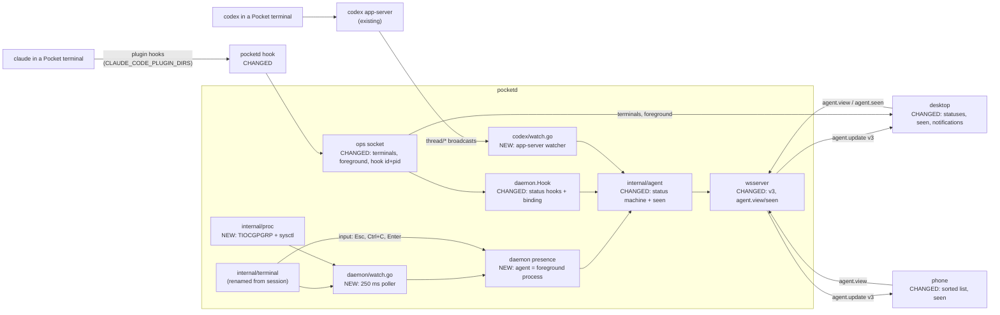
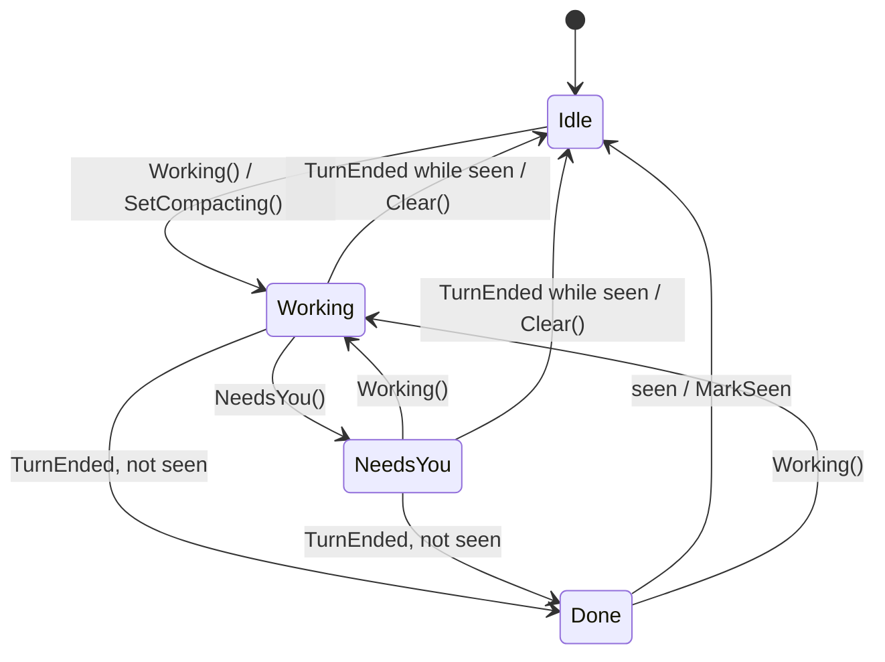

# Agent Sessions Implementation Plan

> **For Claude:** REQUIRED SUB-SKILL: Use /implement to execute this plan task-by-task.

> **Status: implemented** in `9980d81`, amended by `b15b94e` and `8a10124`; verified 2026-10-01 (see the design). Tasks touching `lastProvider`/`lastTitle` were superseded by `b15b94e`.

> **Review needed.** Parts of the design were decided by the agent alone while the user was away: tickets 08 and 09, and every line marked **(agent-decided)** in the design doc. Review those before running this plan.

**Goal:** When the user types `claude` or `codex` in a Pocket terminal, an agent shows up in the session list by itself, with a status of Needs you, Done (maybe failed), Working or Idle, on desktop and phone.

**Toolset:**
- pocketd (Go): `cd packages/pocketd && go test ./internal/<pkg>/...` for one package, `go test ./...` for all, `go vet ./...`, `go build ./...`. Regenerate protocol golden files with `go test ./internal/proto -update`.
- Protocol (TS): `pnpm --filter @pocket/protocol test` (runs `tsc -b` then `node --test test/`).
- Phone app: `pnpm --filter @pocket/app test`, `pnpm --filter @pocket/app typecheck`.
- Desktop (Rust): `cd packages/desktop && cargo test -p <crate>`, `cargo build -p pocket`.

**Read first:**
- `docs/designs/2026-09-28-agent-sessions.md`: the design this plan builds. Every rule the code follows is there.
- `CONTEXT.md`: the words the plan uses (Terminal, Session, Agent, Attached, Conversation, Status, Needs you, Working, Done, Idle, Seen).
- `docs/wayfinder/agent-sessions/`: one ticket per decision. Ticket 09 has the full rendering rules; tickets 02 and 03 have the Claude and Codex research.
- `docs/plans/2026-09-25-pocketd-remote-sessions.md`: how pocketd, the ops socket and protocol v2 were built.

---

## Architecture



pocketd polls each terminal's foreground process group every 250 ms. A `claude` or `codex` in the foreground is an agent, for as long as that process stays in the foreground. Claude reports its status through plugin hooks that pocketd adds to every terminal's environment. Codex reports it through the app-server that plain `codex` already uses. pocketd turns both into one status (Needs you, Done, Working, Idle), marks agents seen from what each client has on screen, and pushes it all over protocol v3. Desktop and phone only draw.

## Why this approach

- **Poll the foreground group every 250 ms** rather than kqueue process events plus shell integration (OSC 133). One code path works for every shell and catches `fg`, Ctrl-Z and `exec claude`. 250 ms is invisible next to an agent turn. (agent-decided)
- **Claude plugin through `CLAUDE_CODE_PLUGIN_DIRS` in the terminal's env** rather than a `claude` shim on `PATH` or hooks in the user's global settings. It reaches every claude in a Pocket terminal and nothing outside, and changes no user file.
- **Synchronous hooks** rather than `async: true`. Async hook processes can reach pocketd out of order, and a late PostToolUse after Stop would leave the agent Working forever. A sync hook costs about 10 ms. (agent-decided)
- **Hook counts only if its nearest claude ancestor is the terminal's agent** rather than "the agent is among the hook's ancestors". A nested `claude -p` run by Claude's Bash tool has the outer claude among its ancestors too, so only the nearest one tells them apart. (agent-decided)
- **Codex thread bound by the most recent Enter within 3 s** rather than by process cwd plus start time. One rule covers new threads, `codex resume`, `/new`, and two codex in one folder. (agent-decided)
- **Codex spawned plainly and watched as a non-originating client** rather than Pocket owning a `--remote` connection. Plain codex already shares the account's app-server, so Pocket-spawned and hand-typed codex take the same path.
- **Protocol v3, a clean break** rather than keeping v2 compatible. Status values change meaning, and pocketd, desktop and phone ship from one repo.
- **Seen = a per-connection set of agents on screen** rather than seen timestamps. No clock agreement, and pocketd drops a set when its client disconnects. (agent-decided)
- **A crash no longer marks Done ✕** (a deviation from ticket 06). An agent is its process, so when it exits the agent is gone; the terminal's exit code still shows red. (agent-decided)
- **Clients ship before presence** (PR 4 and 5 before PR 6), so desktop and phone already group agents by `terminalId` when agent id and terminal id first differ.

---

## Tasks at a glance

Every PR merges on its own with all suites green. PR 4 is split into 4a and 4b only to keep each diff readable; they ship in order.

**PR 1: Rename pocketd `session` to `terminal`.** No behaviour change. The ops `sessions` event becomes `terminals`.

| Task | What | Main files | Risk |
|---|---|---|---|
| 1.1 | Ops sends `terminals` and "no such terminal" | `internal/ops/ops.go` | Low |
| 1.2 | Desktop reads `terminals` | `pocket/src/main.rs`, `daemon/src/daemon.rs` | Low |
| 1.3 | Move `internal/session` to `internal/terminal` | `internal/terminal/terminal.go`, every importer | Low: mechanical |

**PR 2: Foreground poller.** pocketd knows each terminal's foreground command. Clients ignore it until PR 4b.

| Task | What | Main files | Risk |
|---|---|---|---|
| 2.1 | `internal/proc`: foreground group, members, argv/env, parent | `internal/proc/proc_darwin.go` | Medium: raw sysctl parsing |
| 2.2 | Terminal stores and broadcasts its foreground | `internal/terminal/terminal.go` | Low |
| 2.3 | Ops attach streams `foreground` | `internal/ops/ops.go` | Low |
| 2.4 | Daemon polls every terminal every 250 ms | `internal/daemon/watch.go` | Low |
| 2.5 | `pocketd serve` runs the poller | `cmd/pocketd/serve.go`, `e2e/pty_test.go` | Low |

**PR 3: Protocol v3.** One status machine, seen, `agent.view`/`agent.seen`. Desktop and phone bumped just enough to speak v3.

| Task | What | Main files | Risk |
|---|---|---|---|
| 3.1 | `Timeline.Clear` for conversation switches | `internal/timeline/timeline.go` | Low |
| 3.2 | Wire v3 in Go, TS and the phone; golden files | `internal/proto`, `packages/protocol/src`, `AgentsScreen.tsx` | Medium: breaks v2 clients by design |
| 3.3 | Desktop speaks v3 | `agents/src/agents.rs`, `main.rs`, `view.rs` | Low |
| 3.4 | The status machine | `internal/agent/agent.go` | Medium: every status flows through it |
| 3.5 | Seen through `agent.view` and `agent.seen` | `internal/agent/agent.go`, `internal/wsserver/wsserver.go` | Medium |
| 3.6 | Legacy agents report terminal and conversation | `internal/daemon/daemon.go`, `codex.go` | Low |

**PR 4a: Desktop status model, seen, notifications.** Parts are inert until PR 6 gives agents their own ids.

| Task | What | Main files | Risk |
|---|---|---|---|
| 4a.1 | One five-value `Status`; `ui::State` renames | `pocket/src/status.rs` (new), `main.rs`, `view.rs`, `ui/src/ui.rs` | Medium: touches files with uncommitted user edits |
| 4a.2 | A card per session, led by its most urgent agent | `status.rs`, `main.rs`, `view.rs` | Medium |
| 4a.3 | Outbox for `agent.view`/`agent.seen` | `agents/src/agents.rs` | Medium: read loop gains a timeout |
| 4a.4 | Tell pocketd which agents are on screen | `status.rs`, `main.rs`, `view.rs` | Medium |
| 4a.5 | System notifications for Needs you and Done | `status.rs`, `main.rs`, `workspace.rs` | Medium: works only from an app bundle |

**PR 4b: Desktop activity, card kinds, roll-ups, not attached, inbox.** Not-attached and ended cards stay inert until PR 6–8.

| Task | What | Main files | Risk |
|---|---|---|---|
| 4b.1 | Read terminal activity from pocketd | `daemon/src/daemon.rs`, `pocket/src/sessions.rs`, `view.rs` | Low |
| 4b.2 | Card kinds: agent, not attached, ended, shell | `status.rs`, `sessions.rs`, `view.rs`, `ui.rs` | Medium |
| 4b.3 | Roll-ups on rail, worktree rows, tiles, nav | `status.rs`, `ui.rs`, `view.rs` | Medium |
| 4b.4 | Agent tab leads and the not-attached banner | `status.rs`, `view.rs`, `agents.rs` | Low |
| 4b.5 | Inbox of Needs you and Done agents | `inbox.rs`, `main.rs`, `view.rs`, `agents.rs` | Medium |

**PR 5: Phone.** Sorted list, status labels, not-attached rows, `agent.view` from ChatScreen.

| Task | What | Main files | Risk |
|---|---|---|---|
| 5.1 | Status look and urgency order | `app/src/status.ts` (new) | Low |
| 5.2 | Sorted rows, labels, not-attached rows | `app/src/screens/AgentsScreen.tsx` | Low |
| 5.3 | ChatScreen sends `agent.view` | `app/src/session.tsx`, `ChatScreen.tsx` | Low |

**PR 6: Presence.** A claude or codex in any Pocket terminal becomes an agent, Idle and not attached. Pocket-spawned agents keep their old path for now.

| Task | What | Main files | Risk |
|---|---|---|---|
| 6.1 | Tell an agent's argv from anything else | `internal/daemon/detect.go` | Low |
| 6.2 | Agent = the foreground process | `internal/daemon/presence.go`, `watch.go` | Medium: agent lifecycle |
| 6.3 | An agent ends with its terminal | `watch.go` | Low |
| 6.4 | A Pocket-spawned agent stays one agent | `daemon.go`, `codex.go`, `watch.go` | Medium: temporary skip set |
| 6.5 | E2E: a phone sees and drives a claude typed at a shell | `e2e/pty_test.go` | Low |

**PR 7: Claude hooks.** Claude status from plugin hooks; Pocket-spawned claude runs plain.

| Task | What | Main files | Risk |
|---|---|---|---|
| 7.1 | Write the plugin; every terminal gets its env | `internal/daemon/plugin.go` | Medium: depends on Claude's plugin env |
| 7.2 | Hook op names the terminal and the sending claude | `internal/ops/ops.go`, `cmd/pocketd/hook.go` | Medium |
| 7.3 | Plain claude spawn; SessionStart binds and tails | `internal/daemon/claude.go`, `daemon.go`, `presence.go` | High: replaces the working claude path |
| 7.4 | Hooks drive the status | `daemon.go`, `claude.go` | Medium |
| 7.5 | Esc or Ctrl+C clears a claude turn | `internal/terminal/terminal.go`, `claude.go` | Low |
| 7.6 | No SessionStart within 5 s → not attached | `presence.go` | Low |

**PR 8: Codex.** Codex status from the app-server's thread broadcasts; Pocket-spawned codex runs plain; the last legacy path goes.

| Task | What | Main files | Risk |
|---|---|---|---|
| 8.1 | Non-originating client name and a thread watcher | `internal/codex/watch.go`, `rpc.go` | Medium: relies on codex's broadcast shapes |
| 8.2 | A thread binds to the codex that got Enter | `internal/daemon/codex.go`, `presence.go`, `claude.go` | High: heuristic mapping |
| 8.3 | Thread status drives its codex | `internal/daemon/codex.go` | Medium |
| 8.4 | An embedded codex is not attached | `internal/daemon/codex.go` | Low |
| 8.5 | Pocket-spawned codex runs plain; legacy path deleted | `daemon.go`, `codex.go`, `internal/codex/session.go`, e2e | High: replaces the working codex path |
| 8.6 | Delete `Agent.Apply` | `internal/agent/agent.go` | Low |

---

## PR 1: Rename pocketd `session` to `terminal`

**Scope:** This is a rename. Nothing about behavior changes. pocketd's `internal/session` package becomes `internal/terminal`. The type `Session` becomes `Terminal`. `Daemon.Sessions` and `ops.Server.Sessions` become `Terminals`. On the ops socket, the `list` reply event `"sessions"` becomes `"terminals"`, and the unknown-id error "no such session" becomes "no such terminal". The desktop changes only the one match arm and one test fixture that read that event. Out of scope: the desktop's own `Sessions` type and `sessions.rs` (a desktop session is a card, see `CONTEXT.md`), Claude's `session_id`, `codex.Session`, and `providerSessionId`. No TypeScript changes. The phone talks to pocketd over the WebSocket, not the ops socket, so this PR does not touch it.
**Depends on:** nothing
**Done when:** `{"op":"list"}` answers `{"ev":"terminals",...}`, and an unknown id answers `"no such terminal"`. The desktop lists terminals again from that event. `git grep` finds no pocketd reference to the old package, type, field, event, or error text. These pass: `cd packages/pocketd && go build ./... && go vet ./... && go test ./...` and `cd packages/desktop && cargo test -p daemon && cargo build -p pocket`.

All commands in this PR run from the repo root, `/Users/mingo/Developer/self/anywhere`. The `sed -i ''` form is macOS (BSD) sed.

### Task 1.1: Ops socket sends `terminals` and "no such terminal"

**What & why:** Change the two wire strings in pocketd's ops server. Tests come first. This task goes first because it's the only part of the PR that changes what goes over the socket, so it's the only part with a failing test.

**Files:**
- Modify: `packages/pocketd/internal/ops/ops.go:118,138`
- Test: `packages/pocketd/internal/ops/ops_test.go:83-110`

**Context:** The ops socket is a Unix socket that speaks JSON lines. It sits between pocketd and its local clients: the desktop app and the `pocketd run` / `pocketd attach` CLI. `{"op":"list"}` gets back one `Msg{Ev: "sessions", Items: [...]}`. Any op with an `id` pocketd doesn't know gets back `Msg{Ev: "error", ID: id, Error: "no such session"}`. The CLI prints that error as `pocketd: no such session` (`cmd/pocketd/run.go:30-31`). After this task, it prints `pocketd: no such terminal`. The test helper `recv(t, c, ev)` (`ops_test.go:47-58`) reads messages until one has event `ev`. It has no timeout, so a test that waits for an event that never comes hangs until `go test` gives up. That's why Step 2 uses `-timeout`.

**Step 1: Write the failing test**

Check the lines that will change:

```sh
cd packages/pocketd
grep -n -e '"sessions"' -e 'no such session' -e 'TestListShowsLiveSessions' -e 'TestUnknownSessionIsAnError' internal/ops/ops_test.go
```

Expected output, exactly:

```
83:func TestListShowsLiveSessions(t *testing.T) {
88:	items := recv(t, c, "sessions").Items
94:func TestUnknownSessionIsAnError(t *testing.T) {
97:	if m := recv(t, c, "error"); m.Error != "no such session" {
109:	if m, _ := c.Recv(); m.Ev != "sessions" {
```

Edit them:

```sh
cd packages/pocketd
sed -i '' -e 's/"sessions"/"terminals"/g' -e 's/"no such session"/"no such terminal"/' -e 's/TestListShowsLiveSessions/TestListShowsLiveTerminals/' -e 's/TestUnknownSessionIsAnError/TestUnknownTerminalIsAnError/' internal/ops/ops_test.go
```

Result, `ops_test.go:83-100`:

```go
func TestListShowsLiveTerminals(t *testing.T) {
	c := start(t, &Server{Sessions: session.NewManager()})
	c.Send(Msg{Op: "spawn", Cmd: "sleep", Args: []string{"5"}})
	id := recv(t, c, "spawned").ID
	c.Send(Msg{Op: "list"})
	items := recv(t, c, "terminals").Items
	if len(items) != 1 || items[0].ID != id || items[0].Cmd != "sleep" {
		t.Fatalf("items = %+v", items)
	}
}

func TestUnknownTerminalIsAnError(t *testing.T) {
	c := start(t, &Server{Sessions: session.NewManager()})
	c.Send(Msg{Op: "input", ID: "nope"})
	if m := recv(t, c, "error"); m.Error != "no such terminal" {
		t.Fatalf("error = %q", m.Error)
	}
}
```

and `ops_test.go:109`:

```go
	if m, _ := c.Recv(); m.Ev != "terminals" {
```

(`Server{Sessions: session.NewManager()}` stays for now. Task 1.3 renames it.)

- `TestListShowsLiveTerminals` proves `list` answers with the `terminals` event and lists the live terminal in `items`.
- `TestUnknownTerminalIsAnError` proves an op on an unknown id answers `"no such terminal"`.
- `TestHookBlocksUntilAnswered` (unchanged except for line 109) proves a pending hook doesn't block the `list` reply, now called `terminals`.

**Step 2: Run the test to verify it fails**

Run: `cd packages/pocketd && go test ./internal/ops -run 'TestUnknownTerminalIsAnError|TestHookBlocksUntilAnswered' -count=1`
Expected: FAIL. The output contains `ops_test.go:98: error = "no such session"` and `ops_test.go:110: hook answered before its decision: {Op: Ev:sessions`.

Run: `cd packages/pocketd && go test ./internal/ops -run TestListShowsLiveTerminals -count=1 -timeout 10s`
Expected: FAIL with `panic: test timed out after 10s`, naming `TestListShowsLiveTerminals`. `recv` waits for a `terminals` event that never comes.

**Step 3: Write the implementation**

Check the two lines:

```sh
cd packages/pocketd
grep -n -e '"sessions"' -e 'no such session' internal/ops/ops.go
```

Expected output, exactly:

```
118:			c.Send(Msg{Ev: "sessions", Items: s.Sessions.List()})
138:			c.Send(Msg{Ev: "error", ID: m.ID, Error: "no such session"})
```

Edit them:

```sh
cd packages/pocketd
sed -i '' -e 's/Ev: "sessions"/Ev: "terminals"/' -e 's/"no such session"/"no such terminal"/' internal/ops/ops.go
```

Before (`ops.go:118`, `ops.go:138`):

```go
			c.Send(Msg{Ev: "sessions", Items: s.Sessions.List()})
```

```go
			c.Send(Msg{Ev: "error", ID: m.ID, Error: "no such session"})
```

After:

```go
			c.Send(Msg{Ev: "terminals", Items: s.Sessions.List()})
```

```go
			c.Send(Msg{Ev: "error", ID: m.ID, Error: "no such terminal"})
```

**Step 4: Run the test to verify it passes**

Run: `cd packages/pocketd && go test ./internal/ops -count=1`
Expected: PASS, `ok  	pocketd/internal/ops`

### Task 1.2: Desktop reads the `terminals` event

**What & why:** The desktop builds its session list from the `list` reply. It must match the new event name, or the list stays empty. This task comes right after Task 1.1, so the wire format and its only reader change together.

**Files:**
- Modify: `packages/desktop/crates/pocket/src/main.rs:275`
- Modify: `packages/desktop/crates/daemon/src/daemon.rs:123` (test fixture)

**Context:** `packages/desktop/crates/daemon` (crate name `daemon`) is the desktop's ops socket client. Its `Msg` struct decodes every ops line and never checks the event name. `packages/desktop/crates/pocket` (crate name `pocket`) is the app. `on_msg` in `main.rs` switches on `m.ev`: `"sessions"` feeds `self.sessions.sync(items)`, and every other unknown event goes to `self.sessions.apply(&m)`, which ignores it. So without this change, a new pocketd's `terminals` reply gets silently dropped and the list stays empty. `crates/pocket/src/sessions.rs` handles only the attach-stream events (`snapshot`, `output`, `resize`, `exit`), so it needs no change. The test `decodes_session_list_ignoring_unknown_fields` in `daemon.rs` only checks `items`. It passes before and after this change. Its JSON changes only so the fixture matches the real wire. Keep the test name: on the desktop, "session" is still the right word. `main.rs` has uncommitted user edits. The `sed` command below matches the line's text, not its line number, so it touches nothing else. `.ui-review/config.json` has a `"sessions"` key too, but that's a UI-review screen name, not this event. Leave it alone.

**Step 1: Confirm the two matches**

```sh
git grep -n '"sessions"' -- packages/desktop
```

Expected output, exactly:

```
packages/desktop/crates/daemon/src/daemon.rs:123:        let m: Msg = serde_json::from_str(r#"{"ev":"sessions","items":[{"id":"a","cmd":"claude","args":["-c"],"cwd":"/w","cols":80,"rows":24}]}"#).unwrap();
packages/desktop/crates/pocket/src/main.rs:275:            "sessions" => {
```

**Step 2: Edit**

```sh
sed -i '' 's/{"ev":"sessions",/{"ev":"terminals",/' packages/desktop/crates/daemon/src/daemon.rs
sed -i '' 's/"sessions" => {/"terminals" => {/' packages/desktop/crates/pocket/src/main.rs
```

Before (`main.rs:273-276`):

```rust
    fn on_msg(&mut self, m: Msg, window: &mut Window, cx: &mut Context<Self>) {
        match m.ev.as_str() {
            "sessions" => {
                let items = m.items.into_iter().filter(|i| !self.closed.contains(&i.id)).collect();
```

After:

```rust
    fn on_msg(&mut self, m: Msg, window: &mut Window, cx: &mut Context<Self>) {
        match m.ev.as_str() {
            "terminals" => {
                let items = m.items.into_iter().filter(|i| !self.closed.contains(&i.id)).collect();
```

Before (`daemon.rs:123`):

```rust
        let m: Msg = serde_json::from_str(r#"{"ev":"sessions","items":[{"id":"a","cmd":"claude","args":["-c"],"cwd":"/w","cols":80,"rows":24}]}"#).unwrap();
```

After:

```rust
        let m: Msg = serde_json::from_str(r#"{"ev":"terminals","items":[{"id":"a","cmd":"claude","args":["-c"],"cwd":"/w","cols":80,"rows":24}]}"#).unwrap();
```

**Step 3: Verify**

Run: `git grep -n '"sessions"' -- packages/desktop`
Expected: no output.

Run: `cd packages/desktop && cargo test -p daemon`
Expected: PASS, `test result: ok. 6 passed; 0 failed`

Run: `cd packages/desktop && cargo build -p pocket`
Expected: PASS, ends with `Finished`, no errors.

Manual check: rebuild pocketd (`cd packages/pocketd && go build -o bin/pocketd ./cmd/pocketd`), restart `pocketd serve`, then relaunch the desktop app. The session list should show the running terminals. Upgrade both sides together: pairing an old desktop with a new pocketd, or the reverse, shows an empty list.

### Task 1.3: Move `internal/session` to `internal/terminal`

**What & why:** Rename the package, its files, the `Session` type, and every Go name that means "a pocketd PTY". This matches the glossary: a pocketd PTY is a Terminal, and a Session is a desktop card. This task comes last because it's purely mechanical. The build and the unchanged test suite prove it changes nothing.

**Files:**
- Move: `packages/pocketd/internal/session/session.go` -> `packages/pocketd/internal/terminal/terminal.go`
- Move: `packages/pocketd/internal/session/session_test.go` -> `packages/pocketd/internal/terminal/terminal_test.go`
- Modify: `packages/pocketd/internal/ops/ops.go:12-184`
- Modify: `packages/pocketd/internal/ops/ops_test.go:12-166`
- Modify: `packages/pocketd/internal/daemon/daemon.go:1-196`
- Modify: `packages/pocketd/internal/daemon/codex.go:16-125`
- Modify: `packages/pocketd/internal/daemon/daemon_test.go:21-27`
- Modify: `packages/pocketd/cmd/pocketd/serve.go:18-54`
- Modify: `packages/pocketd/e2e/harness_test.go:131` (comment)

**Context:**
- The naming rule: identifiers, strings, comments, and test names that say "session" and mean a pocketd PTY become "terminal". Receivers and one-letter locals keep their names (`func (s *Terminal) ...`, `s, err := d.Terminals.Spawn(spec)`, driver field `s`). Renaming those would touch every method body for no gain, and `t` is already `*testing.T` in every test. The one exception is `sess` in `ops.go`, which spells out the old word; it becomes `t`. Never name a variable `terminal` — it would shadow the package.
- The new file names are `terminal.go` and `terminal_test.go`. Later PRs refer to `internal/terminal/terminal.go`.
- These stay as they are, because they mean Claude's or Codex's own session, not a pocketd PTY: `internal/codex/session.go` (`codex.Session`, which follows one Codex thread), `codexDriver.thread atomic.Pointer[codex.Session]` (`codex.go:127`), Claude's `--session-id` (`daemon.go:53`), the hook's `SessionID`/`session_id` (`daemon.go:138,158,162,163`, `daemon_test.go:197-205`), `"destination":"session"` (`permission.go`), `ProviderSessionID` and its golden files (`internal/proto`), `internal/claude/transcript.go`, `e2e/fakeclaude`, and the comments in `internal/agent/agent.go:1` and `internal/codex/codextest/server.go:38`.
- `gofmt -l .` is clean today, so the `gofmt -w` in Step 3 only realigns the struct fields and tags whose width changed.
- The desktop needs nothing from this task — it only sees the wire, which Task 1.1 already changed.

**Step 1: Confirm the reference list**

In these five files, every "session" means a pocketd PTY, so a blanket replace is safe:

```sh
cd packages/pocketd
git grep -c -i session -- internal/session internal/ops cmd/pocketd/serve.go
git grep -n -i -e session_id -e session-id -e providerSession -e 'codex\.Session' -e '"session"' -- internal/session internal/ops cmd/pocketd/serve.go
```

Expected output of the first command, exactly (after Task 1.1):

```
cmd/pocketd/serve.go:3
internal/ops/ops.go:10
internal/ops/ops_test.go:10
internal/session/session.go:25
internal/session/session_test.go:5
```

Expected output of the second command: nothing. None of Claude's or Codex's session names appear in these files.

The three daemon files mix both meanings, so they get targeted patterns:

```sh
cd packages/pocketd
git grep -n -i session -- internal/daemon/daemon.go internal/daemon/codex.go internal/daemon/daemon_test.go | cut -d: -f1,2
```

Expected: 30 lines. These must change: `codex.go:16,23,24,48,49,105,125`, `daemon.go:1,18,23,34,35,45,48,55,82,83,196`, `daemon_test.go:21,27`. These must stay: `codex.go:127`, `daemon.go:53,138,158,162,163`, `daemon_test.go:197,198,204,205`.

**Step 2: Move the files**

```sh
cd packages/pocketd
git mv internal/session internal/terminal
git mv internal/terminal/session.go internal/terminal/terminal.go
git mv internal/terminal/session_test.go internal/terminal/terminal_test.go
```

Expected: no output. `ls internal/terminal` prints `terminal.go` and `terminal_test.go`. `ls internal/session` fails with `No such file or directory`.

**Step 3: Rename the identifiers**

```sh
cd packages/pocketd
sed -i '' -e 's/Session/Terminal/g' -e 's/session/terminal/g' internal/terminal/terminal.go internal/terminal/terminal_test.go internal/ops/ops.go internal/ops/ops_test.go cmd/pocketd/serve.go
sed -i '' -e 's/[[:<:]]sess[[:>:]]/t/g' internal/ops/ops.go
sed -i '' -e 's#"pocketd/internal/session"#"pocketd/internal/terminal"#' -e 's/session\.Session/terminal.Terminal/g' -e 's/session\./terminal./g' -e 's/Sessions/Terminals/g' internal/daemon/daemon.go internal/daemon/codex.go internal/daemon/daemon_test.go
sed -i '' -e 's/wires PTY sessions/wires PTY terminals/' -e 's/ends with the session;/ends with the terminal;/' internal/daemon/daemon.go
sed -i '' -e 's/returns the session id/returns the terminal id/' e2e/harness_test.go
gofmt -w internal/terminal internal/ops internal/daemon cmd/pocketd
```

`[[:<:]]` and `[[:>:]]` are BSD sed word boundaries. They make the second command hit the variable `sess` only.

The resulting changes, per file (line numbers are unchanged; no line is added or removed):

`internal/terminal/terminal.go`
- 1: `package session` -> `package terminal`
- 51: `type Session struct {` -> `type Terminal struct {`
- 64-65: `sessions map[string]*Session` -> `terminals map[string]*Terminal` (gofmt realigns `mu`)
- 69: `&Manager{sessions: map[string]*Session{}}` -> `&Manager{terminals: map[string]*Terminal{}}`
- 105: `Spawn(spec Spec) (*Session, error)` -> `Spawn(spec Spec) (*Terminal, error)`
- 126: `s := &Session{` -> `s := &Terminal{`
- 140, 144, 153, 160: `m.sessions` -> `m.terminals`
- 150: `Get(id string) *Session` -> `Get(id string) *Terminal`
- 168, 177, 204, 210, 218, 233, 240, 251, 263, 272, 276, 278: `func (s *Session)` -> `func (s *Terminal)`
- 217 (comment): `fn runs with the session locked` -> `fn runs with the terminal locked`
- 222: `errors.New("session closed")` -> `errors.New("terminal closed")`

`internal/terminal/terminal_test.go`
- 1: `package session` -> `package terminal`
- 10, 20: `*Session` -> `*Terminal`
- 66: `TestExitRemovesSessionAndKeepsCode` -> `TestExitRemovesTerminalAndKeepsCode`
- 73: `"session still listed after exit"` -> `"terminal still listed after exit"`

`internal/ops/ops.go`
- 12: import `"pocketd/internal/session"` -> `"pocketd/internal/terminal"`
- 29: `Items []session.Info` -> `Items []terminal.Info` (gofmt realigns the tags on 16-30)
- 79-81: `Sessions *session.Manager` -> `Terminals *terminal.Manager`; `Spawn func(Msg) (*session.Session, error)` -> `Spawn func(Msg) (*terminal.Terminal, error)` (gofmt realigns `Hook`)
- 94: `spawn(m Msg) (*session.Session, error)` -> `spawn(m Msg) (*terminal.Terminal, error)`
- 98: `s.Sessions.Spawn(session.Spec{` -> `s.Terminals.Spawn(terminal.Spec{`
- 118: `s.Sessions.List()` -> `s.Terminals.List()`
- 121, 126, 136, 137, 143, 150, 152, 154, 156, 158, 184: `sess` -> `t`; 136: `s.Sessions.Get(m.ID)` -> `s.Terminals.Get(m.ID)`
- 167: `attach(c *Conn, sess *session.Session, m Msg)` -> `attach(c *Conn, t *terminal.Terminal, m Msg)`
- 171: `sess.Attach(m.TTY, func(e session.Event) {` -> `t.Attach(m.TTY, func(e terminal.Event) {`

`internal/ops/ops_test.go`
- 12: import -> `"pocketd/internal/terminal"`
- 61, 84, 95, 104, 120, 135, 149, 159, 166: `Server{Sessions: session.NewManager()` -> `Server{Terminals: terminal.NewManager()`
- 135: `Spawn: func(Msg) (*session.Session, error)` -> `Spawn: func(Msg) (*terminal.Terminal, error)`

`internal/daemon/daemon.go`
- 1 (package doc): `wires PTY sessions` -> `wires PTY terminals`
- 18: import -> `"pocketd/internal/terminal"`
- 23: `Sessions *session.Manager` -> `Terminals *terminal.Manager` (gofmt realigns 24-28)
- 34: `Spawn(m ops.Msg) (*session.Session, error)` -> `Spawn(m ops.Msg) (*terminal.Terminal, error)`
- 35: `session.Spec{ID: session.NewID(),` -> `terminal.Spec{ID: terminal.NewID(),`
- 45, 55: `d.Sessions.Spawn(spec)` -> `d.Terminals.Spawn(spec)`
- 48: `spawnClaude(spec session.Spec) (*session.Session, error)` -> `spawnClaude(spec terminal.Spec) (*terminal.Terminal, error)`
- 82 (comment): `ends with the session;` -> `ends with the terminal;`
- 83: `track(s *session.Session, ...` -> `track(s *terminal.Terminal, ...`
- 196: `s *session.Session` -> `s *terminal.Terminal`

`internal/daemon/codex.go`
- 16: import -> `"pocketd/internal/terminal"`
- 23: `spawnCodex(spec session.Spec) (*session.Session, error)` -> `spawnCodex(spec terminal.Spec) (*terminal.Terminal, error)`
- 24: `session.LookPath` -> `terminal.LookPath`
- 48: `var s *session.Session` -> `var s *terminal.Terminal`
- 49: `d.Sessions.Spawn(spec)` -> `d.Terminals.Spawn(spec)`
- 105: `followCodex(s *session.Session, ...` -> `followCodex(s *terminal.Terminal, ...`
- 125: `s      *session.Session` -> `s      *terminal.Terminal`

`internal/daemon/daemon_test.go`
- 21: import -> `"pocketd/internal/terminal"`
- 27: `&Daemon{Sessions: session.NewManager(), ...` -> `&Daemon{Terminals: terminal.NewManager(), ...`

`cmd/pocketd/serve.go`
- 18: import -> `"pocketd/internal/terminal"`
- 33: `Sessions: session.NewManager(),` -> `Terminals: terminal.NewManager(),` (gofmt realigns 34-38)
- 54: `ops.Server{Sessions: d.Sessions, ...` -> `ops.Server{Terminals: d.Terminals, ...`

`e2e/harness_test.go`
- 131 (comment): `returns the session id` -> `returns the terminal id`

The imports stay in order: `terminal` sorts where `session` did (before `timeline` and `wsserver`).

**Step 4: Verify**

Run:

```sh
cd packages/pocketd
git grep -n -e 'internal/session' -e 'session\.' -e 'Sessions' -e '"sessions"' -e 'no such session' -e 'session closed' -e 'TestUnknownSession' -- .
git grep -n -w sess -- .
git grep -n -i session -- internal/terminal internal/ops cmd/pocketd e2e/harness_test.go
gofmt -l .
```

Expected: no output from any of the four.

Run: `cd packages/pocketd && git grep -n -i session -- internal/daemon/daemon.go internal/daemon/codex.go internal/daemon/daemon_test.go`
Expected: exactly the 10 lines that must stay:

```
internal/daemon/codex.go:127:	thread atomic.Pointer[codex.Session]
internal/daemon/daemon.go:53:	spec.Args = append([]string{"--session-id", spec.ID, "--settings", settings}, spec.Args...)
internal/daemon/daemon.go:138:	SessionID             string            `json:"session_id"`
internal/daemon/daemon.go:158:	ag, err := d.Agents.Get(in.SessionID)
internal/daemon/daemon.go:162:	req := proto.PermissionRequest{AgentID: in.SessionID, ToolName: in.ToolName, Detail: timeline.Detail(in.ToolName, in.ToolInput), Options: in.options(), Feedback: true}
internal/daemon/daemon.go:163:	a := d.Broker.Ask(ctx, req, permissionKey(in.SessionID, in.ToolName, in.ToolInput))
internal/daemon/daemon_test.go:197:	const payload = `{"session_id":"s1","permission_mode":"default","tool_name":"Bash","tool_input":{"command":"touch c.txt"},
internal/daemon/daemon_test.go:198:		"permission_suggestions":[{"type":"addDirectories","directories":["/w"],"destination":"session"}]}`
internal/daemon/daemon_test.go:204:		{broker.Answer{Decision: "allow", Option: optionAlways}, `{"behavior":"allow","updatedPermissions":[{"type":"addDirectories","directories":["/w"],"destination":"session"}]}`},
internal/daemon/daemon_test.go:205:		{broker.Answer{Decision: "allow", Option: optionAuto}, `{"behavior":"allow","updatedPermissions":[{"type":"setMode","mode":"auto","destination":"session"}]}`},
```

Run: `cd packages/pocketd && go build ./... && go vet ./...`
Expected: PASS, no output.

Run: `cd packages/pocketd && go test ./...`
Expected: PASS. Every line is `ok` or `[no test files]`, and there is no `FAIL` (timings vary):

```
?   	pocketd/cmd/pocketd	[no test files]
ok  	pocketd/e2e
?   	pocketd/e2e/fakeclaude	[no test files]
?   	pocketd/e2e/fakecodex	[no test files]
ok  	pocketd/internal/agent
ok  	pocketd/internal/broker
ok  	pocketd/internal/claude
ok  	pocketd/internal/codex
?   	pocketd/internal/codex/codextest	[no test files]
ok  	pocketd/internal/config
ok  	pocketd/internal/daemon
ok  	pocketd/internal/envdir
ok  	pocketd/internal/hub
ok  	pocketd/internal/ops
ok  	pocketd/internal/proto
ok  	pocketd/internal/terminal
ok  	pocketd/internal/timeline
ok  	pocketd/internal/vt
ok  	pocketd/internal/wsserver
```

Run: `cd packages/desktop && cargo test -p daemon && cargo build -p pocket`
Expected: PASS, `test result: ok. 6 passed; 0 failed`, then `Finished`. The desktop is unchanged by this task; this confirms the whole PR is green.

---

## PR 2: Foreground poller

**Scope:** pocketd learns what's running in the foreground of each terminal. A new `internal/proc` package reads a PTY's foreground process group, plus each member's argv and env, from the macOS kernel. Every 250 ms, a poller in the daemon stores that text as `Info.foreground` and sends a `foreground` event to attached clients. `Info` also gains `lastProvider` and `lastTitle`, which stay empty until PR 6. Out of scope: agent detection (PR 6), and any desktop or phone change. Both clients ignore the new field and event.
**Depends on:** PR 1 (package `pocketd/internal/terminal`, type `Terminal`, `Daemon.Terminals`).
**Done when:** Typing `sleep 30` at a shell in a Pocket terminal shows up as `"foreground":"sleep 30"` in `{"op":"list"}` within one poll, and goes back to empty after Ctrl+C. Attached clients get `{"ev":"foreground","id":...,"text":...}` on each change. `cd packages/pocketd && gofmt -l . && go vet ./... && go test ./...` passes, with no gofmt output.

All commands in this PR run from `packages/pocketd`. Line numbers are those of the tree after PR 1.

### Task 2.1: `internal/proc` reads the processes behind a PTY

**What & why:** A small macOS-only (darwin) package built on `ioctl` and `sysctl`. Everything later — foreground text here, agent detection in PR 6, hook ancestry in PR 7 — reads processes through these four functions.

**Files:**
- Create: `packages/pocketd/internal/proc/proc_darwin.go`
- Modify: `packages/pocketd/go.mod:5-11` (through `go mod tidy`)
- Test: `packages/pocketd/internal/proc/proc_darwin_test.go`

**Context:**
- `TIOCGPGRP` on the PTY master gives the terminal's foreground process group. We read it through `f.SyscallConn().Control`, never `f.Fd()`: `Fd()` puts the file in blocking mode, and the terminal's reader goroutine would then hang in `Close`.
- `kern.proc.pgrp` lists a group's members. It gives an empty list when the group no longer exists.
- `kern.procargs2` gives argc, the exec path, NUL padding, argv, then env, up to an empty string.
- `kern.proc.pid` gives the parent pid and the kernel's 16-byte process name (`P_comm`). It fails once the process is reaped (x/sys returns EIO).
- `procargs2` fails for zombies and for other users' processes. `Read` then falls back to `P_comm`. So `Read` only errors when the process is gone.
- macOS never returns the env of Apple's own binaries (`/bin/sh`, `/bin/sleep`), even to their own parent. It does return it for `claude`, `codex`, and `node`. So the env test re-runs the test binary as the child (the usual `TestHelperProcess` pattern).
- `pty.Start` runs the child with `setsid` and `setctty`, so the child's pid is the foreground group until it hands the terminal to a job.
- `golang.org/x/sys` is already in `go.mod` as an indirect dependency (v0.48.0). `go mod tidy` moves it into the main `require` block. `go.sum` doesn't change.
- pocketd runs only on macOS. The `_darwin` suffix makes that explicit.

**Step 1: Write the failing test**

Create `internal/proc/proc_darwin_test.go`:

```go
package proc

import (
	"os"
	"os/exec"
	"slices"
	"syscall"
	"testing"
	"time"

	"github.com/creack/pty"
)

// TestHelperProcess is a child that is not an Apple binary: the kernel
// hides the env of those.
func TestHelperProcess(t *testing.T) {
	if os.Getenv("POCKET_TEST") == "" {
		return
	}
	time.Sleep(10 * time.Second)
}

func start(t *testing.T, name string, args ...string) *exec.Cmd {
	t.Helper()
	cmd := exec.Command(name, args...)
	cmd.Env = []string{"PATH=/bin:/usr/bin", "POCKET_TEST=1"}
	cmd.SysProcAttr = &syscall.SysProcAttr{Setpgid: true}
	if err := cmd.Start(); err != nil {
		t.Fatal(err)
	}
	t.Cleanup(func() {
		syscall.Kill(-cmd.Process.Pid, syscall.SIGKILL)
		cmd.Wait()
	})
	return cmd
}

func eventually(t *testing.T, what string, ok func() bool) {
	t.Helper()
	for deadline := time.Now().Add(5 * time.Second); time.Now().Before(deadline); time.Sleep(20 * time.Millisecond) {
		if ok() {
			return
		}
	}
	t.Fatalf("timed out waiting for %s", what)
}

func TestForegroundIsThePTYChild(t *testing.T) {
	cmd := exec.Command("sleep", "10")
	f, err := pty.Start(cmd)
	if err != nil {
		t.Fatal(err)
	}
	t.Cleanup(func() {
		cmd.Process.Kill()
		cmd.Wait()
		f.Close()
	})
	if pgid, err := Foreground(f); err != nil || pgid != cmd.Process.Pid {
		t.Fatalf("Foreground = %d, %v; want %d", pgid, err, cmd.Process.Pid)
	}
}

func TestMembersListsTheGroupInPidOrder(t *testing.T) {
	pgid := start(t, "sh", "-c", "sleep 10 & sleep 10 & wait").Process.Pid
	var pids []int
	eventually(t, "three members", func() bool {
		pids, _ = Members(pgid)
		return len(pids) == 3
	})
	if !slices.IsSorted(pids) || !slices.Contains(pids, pgid) {
		t.Fatalf("members = %v", pids)
	}
}

func TestReadGivesArgvEnvAndParent(t *testing.T) {
	pid := start(t, os.Args[0], "-test.run=^TestHelperProcess$").Process.Pid
	var p Proc
	eventually(t, "env", func() bool {
		p, _ = Read(pid)
		return slices.Contains(p.Env, "POCKET_TEST=1")
	})
	if !slices.Equal(p.Argv, []string{os.Args[0], "-test.run=^TestHelperProcess$"}) {
		t.Fatalf("argv = %q", p.Argv)
	}
	if ppid, err := Parent(pid); err != nil || ppid != os.Getpid() {
		t.Fatalf("Parent = %d, %v", ppid, err)
	}
}

func TestReadOfAZombieFallsBackToTheKernelName(t *testing.T) {
	pid := start(t, "sleep", "0").Process.Pid
	var p Proc
	eventually(t, "a zombie", func() bool {
		p, _ = Read(pid)
		return len(p.Argv) == 1
	})
	if p.Argv[0] != "sleep" {
		t.Fatalf("argv = %q", p.Argv)
	}
}

func TestReadOfAGoneProcessFails(t *testing.T) {
	cmd := exec.Command("true")
	if err := cmd.Run(); err != nil {
		t.Fatal(err)
	}
	if p, err := Read(cmd.Process.Pid); err == nil {
		t.Fatalf("Read = %+v", p)
	}
	if _, err := Parent(cmd.Process.Pid); err == nil {
		t.Fatal("Parent of a gone process")
	}
}
```

- `TestForegroundIsThePTYChild`: the ioctl works on a real PTY master, and a fresh PTY's foreground group is its own child.
- `TestMembersListsTheGroupInPidOrder`: the group lookup finds every member, including the leader, sorted by pid.
- `TestReadGivesArgvEnvAndParent`: `procargs2` parsing splits argv from env correctly, and `Parent` reads the right ppid.
- `TestReadOfAZombieFallsBackToTheKernelName`: an exited child that isn't reaped yet still reads, as its kernel name (`sleep 0` has two argv words, so one word proves the fallback).
- `TestReadOfAGoneProcessFails`: a reaped pid is an error, not an empty `Proc`.

**Step 2: Run the test to verify it fails**

Run: `go test ./internal/proc`
Expected: FAIL with:
```
# pocketd/internal/proc [pocketd/internal/proc.test]
internal/proc/proc_darwin_test.go:59:18: undefined: Foreground
internal/proc/proc_darwin_test.go:68:13: undefined: Members
...
```

**Step 3: Write the implementation**

Create `internal/proc/proc_darwin.go`:

```go
// Package proc reads the processes behind a PTY from the macOS kernel.
package proc

import (
	"bytes"
	"encoding/binary"
	"os"
	"slices"

	"golang.org/x/sys/unix"
)

type Proc struct {
	Pid  int
	Argv []string
	Env  []string
}

// Foreground returns the PTY's foreground process group; 0 means none.
func Foreground(f *os.File) (int, error) {
	rc, err := f.SyscallConn()
	if err != nil {
		return 0, err
	}
	var pgid int
	var ioErr error
	if err := rc.Control(func(fd uintptr) { pgid, ioErr = unix.IoctlGetInt(int(fd), unix.TIOCGPGRP) }); err != nil {
		return 0, err
	}
	return pgid, ioErr
}

func Members(pgid int) ([]int, error) {
	kps, err := unix.SysctlKinfoProcSlice("kern.proc.pgrp", pgid)
	if err != nil {
		return nil, err
	}
	pids := make([]int, len(kps))
	for i, kp := range kps {
		pids[i] = int(kp.Proc.P_pid)
	}
	slices.Sort(pids)
	return pids, nil
}

// Read falls back to the kernel's 16-byte name when argv is unreadable:
// another user's process, a zombie, or one that is mid-exec. The kernel
// never gives the env of Apple's own binaries (/bin/sh, /bin/sleep).
func Read(pid int) (Proc, error) {
	if b, err := unix.SysctlRaw("kern.procargs2", pid); err == nil {
		if argv, env := parse(b); len(argv) > 0 {
			return Proc{Pid: pid, Argv: argv, Env: env}, nil
		}
	}
	kp, err := unix.SysctlKinfoProc("kern.proc.pid", pid)
	if err != nil {
		return Proc{}, err
	}
	return Proc{Pid: pid, Argv: []string{unix.ByteSliceToString(kp.Proc.P_comm[:])}}, nil
}

func Parent(pid int) (int, error) {
	kp, err := unix.SysctlKinfoProc("kern.proc.pid", pid)
	if err != nil {
		return 0, err
	}
	return int(kp.Eproc.Ppid), nil
}

// parse reads kern.procargs2: argc, the exec path, NUL padding, argc argv
// strings, then env strings up to an empty one.
func parse(b []byte) (argv, env []string) {
	if len(b) < 4 {
		return nil, nil
	}
	argc := int(binary.NativeEndian.Uint32(b))
	_, rest, _ := bytes.Cut(b[4:], []byte{0})
	rest = bytes.TrimLeft(rest, "\x00")
	for s := range bytes.SplitSeq(rest, []byte{0}) {
		switch {
		case len(argv) < argc:
			argv = append(argv, string(s))
		case len(s) == 0:
			return argv, env
		default:
			env = append(env, string(s))
		}
	}
	return argv, env
}
```

Then run `go mod tidy`. The `go.mod` diff is exactly:

```diff
 require (
 	github.com/coder/websocket v1.8.15
 	github.com/creack/pty v1.1.24
+	golang.org/x/sys v0.48.0
 	golang.org/x/term v0.46.0
 )
-
-require golang.org/x/sys v0.48.0 // indirect
```

**Step 4: Run the test to verify it passes**

Run: `go test -count=1 -v ./internal/proc`
Expected: PASS. All six tests (including `TestHelperProcess`) pass, then `ok  	pocketd/internal/proc`.

### Task 2.2: Terminal stores and broadcasts its foreground

**What & why:** `Terminal` gets the new `Info` fields and the small methods the poller calls. The terminal owns its PTY and lock, so it's the one that reads the group and sends the event.

**Files:**
- Modify: `packages/pocketd/internal/terminal/terminal.go:3-17` (imports), `:19-26` (`Info`), `:38-44` (`Event`), after `:164` (`All`), after `:214` (`Pid`, `Pgrp`, `SetForeground`, `SetLast`)
- Test: `packages/pocketd/internal/terminal/terminal_test.go:3-8` (imports), append after `:91`

**Context:**
- `Terminal` keeps `info Info`, `pty *os.File`, `cmd *exec.Cmd`, `closed bool`, and `subs` under `s.mu`. `broadcast(e)` must run with `s.mu` held (see `Info()` at `:210` and `broadcast` at `:204`).
- When the child exits, `s.closed` gets set, the PTY closes, and the terminal is removed from the manager (`:144`, `:195-199`).
- `Pgrp` holds `s.mu` so the PTY can't be closed during the ioctl. It returns `0, nil` once closed.
- `SetForeground` does nothing once closed. The poller may still hold a terminal from `All()` after it exits, and an attached client must never get `foreground` after `exit`.
- `SetForeground` broadcasts only on change, so a poll every 250 ms sends nothing while the foreground stays the same.
- `SetLast` only stores a value. PR 6 calls it when an agent ends.
- The test helper `spawn(t, m, script)` (`:10`) runs `sh -c script` on a 40x5 PTY.

**Step 1: Write the failing test**

In `terminal_test.go`, change the import block (`:3-8`):

```go
import (
	"os"
	"strings"
	"testing"
	"time"
)
```

to:

```go
import (
	"os"
	"slices"
	"strings"
	"testing"
	"time"
)
```

Append at the end of the file:

```go
func TestSetForegroundBroadcastsOnlyChanges(t *testing.T) {
	s := spawn(t, NewManager(), "sleep 5")
	var got []string
	_, detach, err := s.Attach(false, func(e Event) {
		if e.Kind == "foreground" {
			got = append(got, e.Text)
		}
	})
	if err != nil {
		t.Fatal(err)
	}
	defer detach()
	s.SetForeground("npm run dev")
	s.SetForeground("npm run dev")
	if f := s.Info().Foreground; f != "npm run dev" {
		t.Fatalf("Info().Foreground = %q", f)
	}
	s.SetForeground("")
	if !slices.Equal(got, []string{"npm run dev", ""}) {
		t.Fatalf("events = %q", got)
	}
}

func TestSetLastLandsInInfo(t *testing.T) {
	s := spawn(t, NewManager(), "sleep 5")
	s.SetLast("claude", "Fix the login bug")
	if i := s.Info(); i.LastProvider != "claude" || i.LastTitle != "Fix the login bug" {
		t.Fatalf("info = %+v", i)
	}
}

func TestPgrpIsTheChildUntilExit(t *testing.T) {
	m := NewManager()
	s := spawn(t, m, "sleep 5")
	if pgrp, err := s.Pgrp(); err != nil || pgrp != s.Pid() {
		t.Fatalf("Pgrp = %d, %v; Pid = %d", pgrp, err, s.Pid())
	}
	if all := m.All(); len(all) != 1 || all[0] != s {
		t.Fatalf("All = %v", all)
	}
	s.Close()
	s.ExitCode()
	if pgrp, err := s.Pgrp(); err != nil || pgrp != 0 {
		t.Fatalf("Pgrp after exit = %d, %v", pgrp, err)
	}
	if all := m.All(); len(all) != 0 {
		t.Fatalf("All after exit = %v", all)
	}
}
```

- `TestSetForegroundBroadcastsOnlyChanges`: the text lands in `Info`, and repeating the same text sends no second event.
- `TestSetLastLandsInInfo`: the last agent's provider and title show up in `Info`.
- `TestPgrpIsTheChildUntilExit`: a fresh terminal's group is its own child. After exit, `Pgrp` returns `0, nil` (no error on a closed PTY), and `All` no longer returns it.

**Step 2: Run the test to verify it fails**

Run: `go test ./internal/terminal`
Expected: FAIL with:
```
# pocketd/internal/terminal [pocketd/internal/terminal.test]
internal/terminal/terminal_test.go:99:24: e.Text undefined (type Event has no field or method Text)
internal/terminal/terminal_test.go:106:4: s.SetForeground undefined (type *Terminal has no field or method SetForeground)
...
```

**Step 3: Write the implementation**

In `terminal.go`, replace the import block (`:3-17`) with:

```go
import (
	"crypto/rand"
	"errors"
	"fmt"
	"maps"
	"os"
	"os/exec"
	"path/filepath"
	"slices"
	"strings"
	"sync"
	"time"

	"github.com/creack/pty"

	"pocketd/internal/proc"
	"pocketd/internal/vt"
)
```

Replace `Info` (`:19-26`) with:

```go
type Info struct {
	ID           string   `json:"id"`
	Cmd          string   `json:"cmd"`
	Args         []string `json:"args,omitempty"`
	Cwd          string   `json:"cwd"`
	Cols         int      `json:"cols"`
	Rows         int      `json:"rows"`
	Foreground   string   `json:"foreground,omitempty"`
	LastProvider string   `json:"lastProvider,omitempty"`
	LastTitle    string   `json:"lastTitle,omitempty"`
}
```

In `Event` (`:38-44`), after `Code int` add:

```go
	Text string
```

After `List()` (`:156-164`) add:

```go

func (m *Manager) All() []*Terminal {
	m.mu.Lock()
	defer m.mu.Unlock()
	return slices.Collect(maps.Values(m.terminals))
}
```

After `Info()` (`:210-214`) add:

```go

func (s *Terminal) Pid() int { return s.cmd.Process.Pid }

func (s *Terminal) Pgrp() (int, error) {
	s.mu.Lock()
	defer s.mu.Unlock()
	if s.closed {
		return 0, nil
	}
	return proc.Foreground(s.pty)
}

func (s *Terminal) SetForeground(text string) {
	s.mu.Lock()
	defer s.mu.Unlock()
	if s.closed || s.info.Foreground == text {
		return
	}
	s.info.Foreground = text
	s.broadcast(Event{Kind: "foreground", Text: text})
}

func (s *Terminal) SetLast(provider, title string) {
	s.mu.Lock()
	defer s.mu.Unlock()
	s.info.LastProvider, s.info.LastTitle = provider, title
}
```

**Step 4: Run the test to verify it passes**

Run: `go test -count=1 ./internal/terminal`
Expected: PASS, `ok  	pocketd/internal/terminal`.

### Task 2.3: Ops attach streams `foreground`

**What & why:** The ops attach stream copies each terminal event into a `Msg`, but it doesn't copy the new `Text` field. Adding that one field fixes it, so the desktop can show terminal activity (PR 4).

**Files:**
- Modify: `packages/pocketd/internal/ops/ops.go:172`
- Test: `packages/pocketd/internal/ops/ops_test.go`, append after `:179`

**Context:**
- `Msg.Text` already exists (`json:"text,omitempty"`, used by `prompt` and `screen`). An empty text is left off the wire, which the contract defines as "at the prompt".
- `start(t, srv)` (`:42`) serves `srv` on a temp socket and dials it. `recv(t, c, ev)` (`:47`) reads until event `ev` (no timeout).
- The event kind already passes through (`Ev: e.Kind`), so before the fix the test gets a `foreground` message with an empty `Text`, and fails instead of hanging.
- `pocketd run` (`cmd/pocketd/run.go:75-85`) switches on four events and ignores the rest. The desktop's `sessions.rs:41-49` has a `_ => {}` arm. Neither needs a change.

**Step 1: Write the failing test**

Append to `ops_test.go`:

```go

func TestAttachStreamsForeground(t *testing.T) {
	terms := terminal.NewManager()
	c := start(t, &Server{Terminals: terms})
	c.Send(Msg{Op: "spawn", Cmd: "sleep", Args: []string{"5"}})
	id := recv(t, c, "spawned").ID
	c.Send(Msg{Op: "attach", ID: id})
	recv(t, c, "snapshot")
	terms.Get(id).SetForeground("npm run dev")
	if m := recv(t, c, "foreground"); m.ID != id || m.Text != "npm run dev" {
		t.Fatalf("%+v", m)
	}
}
```

- `TestAttachStreamsForeground`: an attached ops client gets the foreground text, tagged with the terminal id.

**Step 2: Run the test to verify it fails**

Run: `go test ./internal/ops -run TestAttachStreamsForeground -count=1`
Expected: FAIL with:
```
--- FAIL: TestAttachStreamsForeground
    ops_test.go:190: {Op: Ev:foreground ID:... Text: ...}
```

**Step 3: Write the implementation**

In `ops.go:172`, change:

```go
		ev := Msg{Ev: e.Kind, ID: m.ID, Data: e.Data, Cols: e.Cols, Rows: e.Rows, Code: e.Code}
```

to:

```go
		ev := Msg{Ev: e.Kind, ID: m.ID, Data: e.Data, Cols: e.Cols, Rows: e.Rows, Code: e.Code, Text: e.Text}
```

**Step 4: Run the test to verify it passes**

Run: `go test -count=1 ./internal/ops`
Expected: PASS, `ok  	pocketd/internal/ops`.

### Task 2.4: The daemon polls every terminal's foreground

**What & why:** A ticker in the daemon reads each terminal's foreground group and stores its text. Polling works the same way for every shell, and it catches `fg`, Ctrl-Z, and `exec` (see the design doc, "Why this approach").

**Files:**
- Create: `packages/pocketd/internal/daemon/watch.go`
- Test: `packages/pocketd/internal/daemon/watch_test.go`

**Context:**
- The text rule (design doc §1): it's empty when `pgid <= 0` or `pgid` is the terminal's own child pid. That covers the shell at its prompt, and an agent Pocket spawned directly. Otherwise it's the leader's argv joined by spaces. The leader is the member whose pid equals `pgid`, or else the first member.
- The "else the first member" case really happens. In `sleep 0.1 | sleep 30`, the first `sleep` is the group leader. It exits and gets reaped, and the group lives on as the second `sleep`.
- `foreground` returns the group's members even when the text is empty. PR 6 looks for `claude`/`codex` among them, and a Pocket-spawned or `exec`'d agent is the terminal's own child.
- `observe` is split out because PR 6 adds presence to it. `WatchEvery` is a variable, so the test can poll every 10 ms.
- Reuse `newDaemon(t)` (`daemon_test.go:25`) and `eventually(t, what, ok)` (`daemon_test.go:186`).
- An interactive `sh` (bash 3.2 in POSIX mode on macOS) runs each job in its own process group, and Ctrl+C (`0x03`) interrupts only that group. The test's `PATH` and `PS1` keep the prompt stable across users.

**Step 1: Write the failing test**

Create `internal/daemon/watch_test.go`:

```go
package daemon

import (
	"context"
	"slices"
	"strings"
	"testing"
	"time"

	"pocketd/internal/proc"
	"pocketd/internal/terminal"
)

func shell(t *testing.T, d *Daemon) *terminal.Terminal {
	t.Helper()
	term, err := d.Terminals.Spawn(terminal.Spec{Cmd: "sh", Env: []string{"PATH=/bin:/usr/bin", "PS1=ready$ "}})
	if err != nil {
		t.Fatal(err)
	}
	t.Cleanup(term.Close)
	eventually(t, "prompt", func() bool { return strings.Contains(term.Screen(), "ready$") })
	return term
}

func TestForegroundAtThePromptIsEmptyButListsTheShell(t *testing.T) {
	term := shell(t, newDaemon(t))
	text, procs := foreground(term)
	if text != "" || !slices.ContainsFunc(procs, func(p proc.Proc) bool { return p.Pid == term.Pid() }) {
		t.Fatalf("foreground = %q, %+v", text, procs)
	}
}

func TestWatchFollowsTheForegroundJob(t *testing.T) {
	defer func(e time.Duration) { WatchEvery = e }(WatchEvery)
	WatchEvery = 10 * time.Millisecond
	d := newDaemon(t)
	term := shell(t, d)
	ctx, cancel := context.WithCancel(context.Background())
	defer cancel()
	go d.Watch(ctx)
	term.Write([]byte("sleep 30\r"))
	eventually(t, "sleep in the foreground", func() bool { return term.Info().Foreground == "sleep 30" })
	term.Write([]byte{0x03})
	eventually(t, "back at the prompt", func() bool { return term.Info().Foreground == "" })
	term.Write([]byte("sleep 0.1 | sleep 30\r"))
	eventually(t, "the pipeline's last member", func() bool { return term.Info().Foreground == "sleep 30" })
	term.Write([]byte{0x03})
	eventually(t, "back at the prompt", func() bool { return term.Info().Foreground == "" })
}
```

- `TestForegroundAtThePromptIsEmptyButListsTheShell`: at the prompt, the text is empty, but the shell is still returned, for PR 6.
- `TestWatchFollowsTheForegroundJob`: the poller sets the text when a job starts, clears it after Ctrl+C, and falls back to the first member once a pipeline's leader is gone.

**Step 2: Run the test to verify it fails**

Run: `go test ./internal/daemon -run 'Foreground|Watch'`
Expected: FAIL with:
```
# pocketd/internal/daemon [pocketd/internal/daemon.test]
internal/daemon/watch_test.go:27:17: undefined: foreground
internal/daemon/watch_test.go:34:49: undefined: WatchEvery
internal/daemon/watch_test.go:40:7: d.Watch undefined (type *Daemon has no field or method Watch)
...
```

**Step 3: Write the implementation**

Create `internal/daemon/watch.go`:

```go
package daemon

import (
	"context"
	"slices"
	"strings"
	"time"

	"pocketd/internal/proc"
	"pocketd/internal/terminal"
)

var WatchEvery = 250 * time.Millisecond

func (d *Daemon) Watch(ctx context.Context) {
	tick := time.NewTicker(WatchEvery)
	defer tick.Stop()
	for {
		select {
		case <-ctx.Done():
			return
		case <-tick.C:
			for _, t := range d.Terminals.All() {
				d.observe(t)
			}
		}
	}
}

func (d *Daemon) observe(t *terminal.Terminal) {
	text, _ := foreground(t)
	t.SetForeground(text)
}

// foreground lists the group even when it is the terminal's own process:
// that is where a Pocket-spawned or exec'd agent runs.
func foreground(t *terminal.Terminal) (text string, procs []proc.Proc) {
	pgid, err := t.Pgrp()
	if err != nil || pgid <= 0 {
		return "", nil
	}
	pids, _ := proc.Members(pgid)
	for _, pid := range pids {
		if p, err := proc.Read(pid); err == nil {
			procs = append(procs, p)
		}
	}
	if pgid == t.Pid() || len(procs) == 0 {
		return "", procs
	}
	leader := procs[0]
	if i := slices.IndexFunc(procs, func(p proc.Proc) bool { return p.Pid == pgid }); i >= 0 {
		leader = procs[i]
	}
	return strings.Join(leader.Argv, " "), procs
}
```

**Step 4: Run the test to verify it passes**

Run: `go test -count=1 ./internal/daemon`
Expected: PASS, `ok  	pocketd/internal/daemon`.

### Task 2.5: `pocketd serve` runs the poller

**What & why:** Start `Watch` for the daemon's lifetime, and prove it end to end: a job typed into a terminal shows up in `list`.

**Files:**
- Modify: `packages/pocketd/cmd/pocketd/serve.go:3-20` (imports), after `:45`
- Test: `packages/pocketd/e2e/pty_test.go:3`, append after `:10`

**Context:**
- The e2e harness (`e2e/harness_test.go`) builds and runs a real `pocketd serve`. `Start(t)` (`:59`) starts it. `h.Ops()` (`:121`) dials its ops socket. `h.WaitScreen(id, want)` (`:175`) waits for text on a terminal's screen. `h.eventually(what, ok)` (`:109`) polls. `h.Home` (`:39`) is its temp home directory.
- The poller runs until the process exits, so it gets `context.Background()`.
- Before the `serve.go` change, the test times out after about 10 seconds.

**Step 1: Write the failing test**

In `e2e/pty_test.go`, change `:3`:

```go
import "testing"
```

to:

```go
import (
	"testing"

	"pocketd/internal/ops"
)
```

Append at the end of the file:

```go

func TestForegroundJobShowsInList(t *testing.T) {
	h := Start(t)
	c := h.Ops()
	c.Send(ops.Msg{Op: "spawn", Cmd: "sh", Cwd: h.Home, Env: []string{"PATH=/bin:/usr/bin", "PS1=ready$ "}})
	m, err := c.Recv()
	if err != nil || m.Ev != "spawned" {
		t.Fatalf("spawn: %+v %v", m, err)
	}
	id := m.ID
	h.WaitScreen(id, "ready$")
	c.Send(ops.Msg{Op: "input", ID: id, Data: []byte("sleep 30\r")})
	h.eventually("sleep 30 in the list", func() bool {
		c.Send(ops.Msg{Op: "list"})
		m, _ := c.Recv()
		return len(m.Items) == 1 && m.Items[0].Foreground == "sleep 30"
	})
}
```

- `TestForegroundJobShowsInList`: the real daemon polls, and the result reaches ops clients through `list`.

**Step 2: Run the test to verify it fails**

Run: `go test ./e2e -run TestForegroundJobShowsInList -count=1`
Expected: FAIL with:
```
--- FAIL: TestForegroundJobShowsInList (10.61s)
    pty_test.go:27: timed out waiting for sleep 30 in the list
```

**Step 3: Write the implementation**

In `serve.go`, the import block (`:3-20`) starts:

```go
import (
	"fmt"
```

Change it to:

```go
import (
	"context"
	"fmt"
```

After `:45`:

```go
	go http.Serve(phones, &wsserver.Server{Token: cfg.Token, Hostname: host, Agents: d.Agents, Broker: d.Broker, Hub: h})
```

add:

```go
	go d.Watch(context.Background())
```

**Step 4: Run the test to verify it passes**

Run: `go test ./e2e -run TestForegroundJobShowsInList -count=1`
Expected: PASS, `ok  	pocketd/e2e`.

Then run the whole gate:

Run: `gofmt -l . && go vet ./... && go test -count=1 ./...`
Expected: PASS. `gofmt` prints nothing, and every package prints `ok`, including the new `pocketd/internal/proc`. No desktop, protocol or app file changed, so their suites are untouched.

---

## PR 3: Protocol v3 — status machine, seen, TS protocol, minimal desktop and phone bumps

**Scope:** pocketd speaks protocol v3. `AgentSummary` gains `terminalId`, `failed`, `attached`, and `compacting`. `status` becomes one of `needsYou`, `done`, `working`, `idle`, `closed`. A status machine in `internal/agent` replaces `setStatus`. Two new client messages, `agent.view` and `agent.seen`, mark agents as seen. `@pocket/protocol` and the golden files match. The desktop and phone change only enough to speak v3 and read the new status values. Out of scope: new desktop or phone surfaces (PR 4, PR 5), presence (PR 6), hooks (PR 7), and removing `Agent.Apply`'s status mapping (PR 8).
**Depends on:** PR 1 (`internal/terminal`, `*terminal.Terminal`). PR 2 is independent.
**Done when:** A v2 hello gets rejected. Over v3, an agent whose turn ends while no client is showing it reports `done` (with `failed` if the turn failed). An agent shown in some connection's `agent.view` ends `idle` instead. `agent.seen` clears `done`. Every agent reports `terminalId` equal to its own id, and `providerSessionId` equal to its conversation. These all pass:
- `cd packages/pocketd && go vet ./... && go test -count=1 ./...`
- `pnpm --filter @pocket/protocol test && pnpm --filter @pocket/app test && pnpm --filter @pocket/app typecheck`
- `cd packages/desktop && cargo test -p agents && cargo build -p pocket`

All commands run from the repo root, `/Users/mingo/Developer/self/anywhere`.

Run e2e tests with `-count=1`. `go test` caches e2e results, so a cached pass can hide a real failure.

The app's typecheck reads `@pocket/protocol` from its gitignored `dist/`. Run `pnpm --filter @pocket/protocol test`, which runs `tsc -b`, before `pnpm --filter @pocket/app typecheck`.

### Task 3.1: `Timeline.Clear`

**What & why:** Add a way to drop a finished conversation from an agent's timeline. Task 3.4's `SetConversation` needs this when `/clear`, `/resume`, or codex `/new` switches the conversation.

**Files:**
- Modify: `packages/pocketd/internal/timeline/timeline.go`. Insert before line 58, `func (t *Timeline) State()`.
- Test: `packages/pocketd/internal/timeline/timeline_test.go`. Insert before line 75, `func TestOutputIsClamped`.

**Context:**
- `Timeline` holds `items`, `epoch`, and `seq`. `reset()` forgets open tool calls and the text being merged.
- `StartEpoch` already bumps the epoch without dropping items.
- `Clear` must drop items, bump the epoch, and reset, all while keeping `seq`. That keeps `maxSeq` always increasing, so a phone asking for `sinceSeq` never gets a new item under an old seq.

**Step 1: Write the failing test**

```go
func TestClearDropsItemsButKeepsCounting(t *testing.T) {
	tl := New()
	tl.Apply(Event{Kind: "tool_start", ToolUseID: "t1", Name: "Bash"}, 1)
	tl.Apply(Event{Kind: "assistant_text", Text: "a"}, 2)
	tl.Clear()
	if items, _ := tl.Page(0, 200); len(items) != 0 {
		t.Fatalf("items survived: %v", items)
	}
	if epoch, seq := tl.State(); epoch != 1 || seq != 2 {
		t.Fatalf("state: epoch %d seq %d", epoch, seq)
	}
	if _, ok := tl.Apply(Event{Kind: "tool_end", ToolUseID: "t1", OK: true}, 3); ok {
		t.Fatal("tool from the old conversation updated")
	}
	if it, _ := tl.Apply(Event{Kind: "assistant_text", Text: "b"}, 4); it.Seq != 3 || it.Text != "b" {
		t.Fatalf("after clear: %+v", it)
	}
}
```

The test proves:
- Items are gone, the epoch moved, and `seq` didn't restart.
- A `tool_end` for a tool from before the clear changes nothing.
- The next item takes the next seq and doesn't merge into old text.

**Step 2: Run it**

```sh
cd packages/pocketd && go test ./internal/timeline/...
```

Expected FAIL:

```
internal/timeline/timeline_test.go:79:5: tl.Clear undefined (type *Timeline has no field or method Clear)
FAIL	pocketd/internal/timeline [build failed]
```

**Step 3: Implement**

```go
// Clear drops a finished conversation. seq keeps counting so a phone's sinceSeq never matches a new item.
func (t *Timeline) Clear() {
	t.mu.Lock()
	defer t.mu.Unlock()
	t.items = nil
	t.epoch++
	t.reset()
}
```

**Step 4: Run it**

```sh
cd packages/pocketd && go test ./internal/timeline/...
```

Expected PASS: `ok  	pocketd/internal/timeline`.

### Task 3.2: Wire format v3 in Go, TS and the phone

**What & why:** Bump the protocol to 3 on both ends in one go. Add the new `AgentSummary` fields and the `agent.view`/`agent.seen` client messages, then regenerate the golden files.
- The Go goldens and the TS schema have to change together, because the TS golden test treats any extra property in a decoded Go golden as an error.
- The TS status literals change, so the phone must change in the same task, or its typecheck fails.
- pocketd's own status values don't change yet (that's Task 3.4).

**Files:**
- Modify: `packages/pocketd/internal/proto/proto.go`: line 11 (`Version`) and 168-180 (`AgentSummary`).
- Modify: `packages/pocketd/internal/proto/messages.go`: 3-6 (imports), 21 (`ClientMessage`), 45-48 (after `optionalString`), 57-58 (switch).
- Modify: `packages/protocol/src/constants.ts:1`.
- Modify: `packages/protocol/src/timeline.ts`: line 3 and 83-95.
- Modify: `packages/protocol/src/messages.ts`: after line 16.
- Modify: `packages/app/src/screens/AgentsScreen.tsx`: 7-14.
- Modify: `packages/app/src/screens/ChatScreen.tsx`: 77-78.
- Test: `packages/pocketd/internal/proto/golden_test.go`: 16-25, 101, 116.
- Test: `packages/pocketd/internal/wsserver/wsserver_test.go`: 75, 93-94.
- Test: `packages/pocketd/e2e/phone_test.go:64`.
- Test: `packages/pocketd/internal/proto/testdata/golden/client/hello.json`.
- Create: `packages/pocketd/internal/proto/testdata/golden/client/agent_view.json` and `agent_seen.json`.
- Generated by `-update`: `testdata/golden/server/hello_ok.json`, `agent_list.json`, `agent_update.json`, and the new `agent_update_failed.json` and `agent_update_compacting.json`.

**Context:**
- Server goldens are written by `go test ./internal/proto -update`. Client goldens are written by hand, and decoded by both `DecodeClient` and the TS schema.
- `DecodeClient`'s `get` treats `null` as missing.
- `json.Unmarshal` of `["a1",null]` into `[]string` gives `["a1",""]` with no error. So `agentIds` decodes into `[]*string` and rejects nil entries, matching `Schema.Array(Schema.String)`.
- `agentIds` is required. It can be empty for `agent.view`, meaning "nothing on screen".
- `failed` and `compacting` are `omitempty`; `attached` is always sent.
- Between this task and Task 3.3, the desktop's v2 hello gets rejected. No test suite covers that gap.

**Step 1: Write the failing tests**

`golden_test.go` lines 16-25: add the new fields to `summary()`, add a `with` helper and two new server goldens. The block after `gofmt -w internal/proto/golden_test.go`:

```go
func summary() AgentSummary {
	return AgentSummary{ID: "a1", TerminalID: "t1", Title: "fix tests", Cwd: "/w", Provider: "claude", Status: "idle", Attached: true, Epoch: 1, MaxSeq: 3, ProviderSessionID: "s1", CreatedAt: 1, UpdatedAt: 2}
}

func with(f func(*AgentSummary)) AgentSummary {
	s := summary()
	f(&s)
	return s
}

var serverGolden = map[string]any{
	"hello_ok":            NewHelloOK("h1", "mac"),
	"agent_list":          NewAgentList("l1", []AgentSummary{summary()}),
	"agent_list_push":     NewAgentList("", nil),
	"agent_update":        NewAgentUpdate(summary()),
	"agent_update_failed": NewAgentUpdate(with(func(s *AgentSummary) { s.Status, s.Failed = "done", true })),
	"agent_update_compacting": NewAgentUpdate(with(func(s *AgentSummary) {
		s.Status, s.Compacting, s.Attached, s.ProviderSessionID = "working", true, false, ""
	})),
	"stream_user": NewAgentStream("a1", 1, Item{ID: "i1", Seq: 1, Ts: 10, Kind: "user", Text: "hi"}),
```

The rest of the map is unchanged. What the new goldens prove:
- `agent_update_failed` proves `failed` goes out together with `done`.
- `agent_update_compacting` proves `compacting` is sent, and that `attached: false` is still sent.
- Its missing `providerSessionId` proves an agent with no conversation yet leaves that field out.

In `TestDecodeClientRejects`, add after line 101 (`agent.close` with a null id):

```go
		`{"type":"agent.view","id":"1"}`,
		`{"type":"agent.view","id":"1","agentIds":null}`,
		`{"type":"agent.seen","id":"1","agentIds":"a1"}`,
		`{"type":"agent.seen","id":"1","agentIds":[1]}`,
		`{"type":"agent.seen","id":"1","agentIds":["a1",null]}`,
```

These prove `agentIds` is required: not null, must be an array, and must hold only strings, with no `null` entries.

In `TestDecodeClientAcceptsWhatTheSchemaAccepts`, add after line 116 (the `hello` line):

```go
		`{"type":"agent.view","id":"1","agentIds":[]}`,
```

This proves an empty view is valid.

Client goldens. Write each as one line ending in a newline:

```sh
cd packages/pocketd/internal/proto/testdata/golden/client
printf '%s\n' '{"type":"hello","id":"h1","token":"t","clientId":"phone","protocolVersion":3}' > hello.json
printf '%s\n' '{"type":"agent.view","id":"v1","agentIds":["a1"]}' > agent_view.json
printf '%s\n' '{"type":"agent.seen","id":"s1","agentIds":["a1"]}' > agent_seen.json
```

Hello bumps in the Go tests:

```sh
cd packages/pocketd
sed -i '' '75s/"protocolVersion":2/"protocolVersion":3/; 93s/"protocolVersion":2/"protocolVersion":3/; 94s/"protocolVersion":1/"protocolVersion":2/' internal/wsserver/wsserver_test.go
sed -i '' '64s/"protocolVersion": 2/"protocolVersion": 3/' e2e/phone_test.go
```

What the bumps prove:
- `wsserver_test.go:94` now proves the old v2 hello gets rejected.
- Lines 75 and 93 keep the other tests on v3.

**Step 2: Run them**

```sh
cd packages/pocketd && go test ./internal/proto ./internal/wsserver
pnpm --filter @pocket/protocol test
```

Expected FAIL:

```
internal/proto/golden_test.go:17:32: unknown field TerminalID in struct literal of type AgentSummary
internal/proto/golden_test.go:17:117: unknown field Attached in struct literal of type AgentSummary
internal/proto/golden_test.go:31:81: s.Failed undefined (type *AgentSummary has no field or method Failed)
...
FAIL	pocketd/internal/proto [build failed]
--- FAIL: TestRejectsWrongTokenAndVersion (0.00s)
    wsserver_test.go:99: map[hostname:mac id:h protocolVersion:2 serverId:mac type:hello.ok]
--- FAIL: TestSecondHelloResendsSnapshot (0.00s)
    wsserver_test.go:77: map[id:h message:Rejected type:error]
...
FAIL	pocketd/internal/wsserver
```

and from the protocol test:

```
✖ client/agent_seen.json
        └─ Expected "hello" | "agent.list" | "agent.prompt" | "agent.interrupt" | "agent.compact" | "agent.close" | "agent.timeline" | "permission.resolve", actual "agent.seen"
✖ client/agent_view.json
ℹ pass 26
ℹ fail 2
```

**Step 3: Implement**

`proto.go:11`: `Version          = 2` becomes `Version          = 3`.

`proto.go`, `AgentSummary`: add `TerminalID` after `ID`, and the three flags after `Status`:

```go
type AgentSummary struct {
	ID                string `json:"id"`
	TerminalID        string `json:"terminalId"`
	Title             string `json:"title"`
	Cwd               string `json:"cwd"`
	Provider          string `json:"provider"`
	Model             string `json:"model,omitempty"`
	Status            string `json:"status"`
	Failed            bool   `json:"failed,omitempty"`
	Attached          bool   `json:"attached"`
	Compacting        bool   `json:"compacting,omitempty"`
	Epoch             int64  `json:"epoch"`
```

The remaining fields are unchanged.

In `messages.go`:
- Add `"slices"` to the imports, after `"errors"`.
- Add `	AgentIDs        []string` after `	Message         string` in `ClientMessage`.
- After the `optionalString` closure, add:

```go
	stringList := func(key string, dst *[]string) bool {
		var items []*string
		if !get(key, &items) || slices.Contains(items, nil) {
			return false
		}
		*dst = make([]string, len(items))
		for n, item := range items {
			(*dst)[n] = *item
		}
		return true
	}
```

and in the switch, after the `agent.interrupt`/`agent.compact`/`agent.close` case:

```go
	case m.Type == "agent.view", m.Type == "agent.seen":
		ok = stringList("agentIds", &m.AgentIDs)
```

Regenerate the server goldens and check Go:

```sh
cd packages/pocketd && go test ./internal/proto -update && go test ./internal/proto ./internal/wsserver
```

What the regenerated files contain:
- `hello_ok.json` now says `"protocolVersion": 3`.
- `agent_list.json` and `agent_update.json` gain `"terminalId": "t1"` after `id`, and `"attached": true` after `status`.
- New `agent_update_failed.json`:

```json
{
  "type": "agent.update",
  "agent": {
    "id": "a1",
    "terminalId": "t1",
    "title": "fix tests",
    "cwd": "/w",
    "provider": "claude",
    "status": "done",
    "failed": true,
    "attached": true,
    "epoch": 1,
    "maxSeq": 3,
    "providerSessionId": "s1",
    "createdAt": 1,
    "updatedAt": 2
  }
}
```

- New `agent_update_compacting.json` is the same, except:
  - `"status": "working", "attached": false, "compacting": true`
  - no `failed`
  - no `providerSessionId`

At this point `pnpm --filter @pocket/protocol test` fails on 6 files: `client/agent_seen.json`, `client/agent_view.json`, and `server/agent_list.json`, `agent_update.json`, `agent_update_compacting.json`, `agent_update_failed.json` — all with `["terminalId"] is unexpected`. Now for the TS side.

`packages/protocol/src/constants.ts:1`: `export const PROTOCOL_VERSION = 3;`

`packages/protocol/src/timeline.ts:3`:

```ts
export const AgentStatus = Schema.Literal("needsYou", "done", "working", "idle", "closed");
```

`timeline.ts`, `AgentSummary`: add `terminalId: Schema.String,` after `id: Schema.String,`, and after `status: AgentStatus,` add:

```ts
  failed: Schema.optional(Schema.Boolean),
  attached: Schema.Boolean,
  compacting: Schema.optional(Schema.Boolean),
```

`packages/protocol/src/messages.ts`: after the `agent.close` struct (line 16):

```ts
  Schema.Struct({ type: Schema.Literal("agent.view"), id: Schema.String, agentIds: Schema.Array(Schema.String) }),
  Schema.Struct({ type: Schema.Literal("agent.seen"), id: Schema.String, agentIds: Schema.Array(Schema.String) }),
```

Run `pnpm --filter @pocket/protocol test`, then `pnpm --filter @pocket/app typecheck`. The phone now fails:

```
src/screens/AgentsScreen.tsx(8,3): error TS2353: ... 'initializing' does not exist in type 'Record<"idle" | "needsYou" | "done" | "working" | "closed", string>'.
src/screens/ChatScreen.tsx(77,22): error TS2367: ... have no overlap.
src/screens/ChatScreen.tsx(78,16): error TS2367: ... have no overlap.
```

`AgentsScreen.tsx` lines 7-14 become 7-13:

```ts
const statusColor: Record<AgentSummary["status"], string> = {
  needsYou: theme.warn,
  done: theme.accent,
  working: theme.ok,
  idle: theme.muted,
  closed: theme.muted,
};
```

`ChatScreen.tsx:77-78`:

```ts
  const compacting = agent?.compacting === true;
  const busy = agent?.status === "working";
```

**Step 4: Run them**

```sh
cd packages/pocketd && go vet ./... && go test ./internal/proto ./internal/wsserver && go test -count=1 ./e2e
pnpm --filter @pocket/protocol test && pnpm --filter @pocket/app test && pnpm --filter @pocket/app typecheck
```

Expected PASS:
- Go: `ok` for proto, wsserver and e2e.
- Protocol: `ℹ pass 30`, `ℹ fail 0`.
- App: tests `ℹ pass 2`, and typecheck prints no errors.

### Task 3.3: Desktop speaks v3

**What & why:** The desktop's hello still says 2, so pocketd now rejects it. Bump it, decode the new fields, and read `working` where the desktop used to read `running` or `compacting`. Nothing else changes here; PR 4 builds the desktop surfaces on top of these fields.

**Files:**
- Modify: `packages/desktop/crates/agents/src/agents.rs`: 10-19 (`Summary`) and 229 (hello).
- Modify: `packages/desktop/crates/pocket/src/main.rs:356`.
- Modify: `packages/desktop/crates/pocket/src/view.rs`: the `tab_lead` status check, line 822 in the current tree. Find it with `grep -n 'a.status == "running"' packages/desktop/crates/pocket/src/view.rs`.
- Test: `packages/desktop/crates/agents/src/agents.rs`, after `an_interrupted_turn_has_not_failed` (lines 321-325).

**Context:**
- `Summary` has `#[serde(default, rename_all = "camelCase")]`. That's why missing `failed` and `compacting` decode as `false`, and why `terminal_id` reads `terminalId`.
- The test reads pocketd's `agent_update_failed.json` golden, so the desktop decodes exactly what pocketd sends.
- `main.rs` and `view.rs` carry uncommitted user edits. Change only the one line in each file.

**Step 1: Write the failing test**

```rust
    #[test]
    fn decodes_a_v3_summary() {
        let f: Frame = serde_json::from_str(include_str!("../../../../pocketd/internal/proto/testdata/golden/server/agent_update_failed.json")).unwrap();
        let a = f.agent.unwrap();
        assert_eq!((a.terminal_id.as_str(), a.status.as_str(), a.failed, a.attached, a.compacting), ("t1", "done", true, true, false));
    }
```

It proves the desktop reads every v3 field from pocketd's own golden, including a `compacting` field that isn't there.

**Step 2: Run it**

```sh
cd packages/desktop && cargo test -p agents
```

Expected FAIL:

```
error[E0609]: no field `terminal_id` on type `Summary`
error[E0609]: no field `failed` on type `Summary`
error[E0609]: no field `attached` on type `Summary`
error[E0609]: no field `compacting` on type `Summary`
error: could not compile `agents` (lib test) due to 4 previous errors
```

**Step 3: Implement**

`agents.rs`, `Summary`: add `pub terminal_id: String,` after `pub id: String,`, and after `pub status: String,` add:

```rust
    pub failed: bool,
    pub attached: bool,
    pub compacting: bool,
```

`agents.rs:229`: `"protocolVersion": 2` becomes `"protocolVersion": 3`.

`main.rs:356`, before:

```rust
                    _ if a.status == "running" || a.status == "compacting" => Status::Working,
```

after:

```rust
                    _ if a.status == "working" => Status::Working,
```

`view.rs` (`tab_lead`), before:

```rust
            } else if a.status == "running" || a.status == "compacting" {
```

after:

```rust
            } else if a.status == "working" {
```

**Step 4: Run it**

```sh
cd packages/desktop && cargo test -p agents && cargo build -p pocket
```

Expected PASS: `test result: ok. 6 passed`, and `pocket` builds.

### Task 3.4: The status machine

**What & why:** Replace `setStatus` with the design's status machine (design doc §2). Every provider will drive it through the same methods: presence in PR 6, hooks in PR 7, and the codex watcher in PR 8. Until PR 8, `Apply` maps the legacy drivers' timeline events onto it.

**Files:**
- Modify: `packages/pocketd/internal/agent/agent.go`:
  - 23-35 (`Agent` struct)
  - 56 (`AddFunc`)
  - 81 (`Remove`)
  - 100-169 (from `func (a *Agent) ID()` to the end of the file)
- Test: `packages/pocketd/internal/agent/agent_test.go`: 3-10 (imports), 62 (`want`), and append after line 114.
- Test: `packages/pocketd/e2e/transcript_test.go:12,15`.
- Test: `packages/pocketd/e2e/codex_test.go`: after line 48, and line 62.

**Context:**

pocketd holds, per agent:
- `phase` (`idle`, `working` or `needsYou`)
- `unseenEnd` (a Done no one has seen)
- `failed`
- `compacting`
- `compactFromIdle`
- `attached`
- `seen` (set in Task 3.5)
- `closed`

| Call | Effect |
|---|---|
| `Working()` | phase = working; unseenEnd = failed = false |
| `NeedsYou()` | phase = needsYou |
| `TurnEnded(f)` | only if phase ≠ idle: phase = idle, unseenEnd = !seen, failed = f |
| `Clear()` | only if phase ≠ idle: phase = idle, unseenEnd = false (a user interrupt is not Done) |
| `SetCompacting()` | compacting = true; if phase = idle: phase = working, compactFromIdle = true |
| `Compacted()` | compacting = false; if compactFromIdle: compactFromIdle = false, then the `TurnEnded(false)` rule |
| seen becomes true (3.5) | unseenEnd = false |
| `MarkSeen` (3.5) | unseenEnd = false |
| `Registry.Remove` | closed = true |



Wire status:
- `closed` if closed.
- Otherwise the phase, if it is not idle.
- Otherwise `done` if unseenEnd.
- Otherwise `idle`.

`failed` is only sent when the status is `done`. `compacting` is sent as-is. A new agent starts idle, with `attached = true` and no terminal or conversation.

Rules the code keeps:
- **One update per change.** Every call runs through `update(touch, f)`. It compares the summary before and after `f` runs (`AgentSummary` is comparable), and publishes one `agent.update` only if they differ. It publishes under `a.mu`, so updates reach the hub in order. `hub.Publish` never blocks.
- **Lock order.** The order is `Registry.mu`, then `Agent.mu`, then `Timeline.mu`. The timeline never takes agent locks.
- **What moves `updatedAt`.** Only status-machine steps and `Remove` (`touch`) move it. Setters and seen changes don't, so a card's time doesn't jump when a client opens it.
- **What stays as given.** `Working()` leaves `compactFromIdle` alone, as the design specifies. Claude's `/compact` user entries start with `<command-` and never reach `Apply` as `user`, so `Working()` never interrupts a compaction started from idle.
- **Title updates.** `Record` sets the title from the first prompt, which publishes its own update. So `TestTurnLifecycle` now sees two `update:idle` events.
- **Existing callers.** `SetCompacting` keeps its name and callers (`daemon.go` and `codex.go`'s `Compact`), just with the new meaning.
- **Known gap.** `promptAfterTurn` still waits for `idle` until Task 3.6. No test suite covers this gap.

`codex_test.go` needs a live `userMessage`:
- The replayed history already ends Done.
- The fake server never echoes the phone's prompt.
- `TurnEnded` is ignored while idle.

So the test pushes the `item/started` message a real codex sends, which starts the turn.

**Step 1: Write the failing tests**

Add `"pocketd/internal/proto"` to the `agent_test.go` imports, after `"pocketd/internal/hub"`.

`agent_test.go:62`:

```go
	want := "update:idle update:idle stream:user update:working stream:assistant stream:result update:done"
```

That proves a legacy turn now reads `working` then `done`.

Append:

```go
func state(s proto.AgentSummary) string {
	out := s.Status
	if s.Failed {
		out += " failed"
	}
	if s.Compacting {
		out += " compacting"
	}
	return out
}

func TestStatusMachine(t *testing.T) {
	for _, tc := range []struct {
		name  string
		steps func(a *Agent)
		want  string
	}{
		{"a new agent is idle", func(a *Agent) {}, "idle"},
		{"working", func(a *Agent) { a.Working() }, "working"},
		{"needs you", func(a *Agent) { a.Working(); a.NeedsYou() }, "needsYou"},
		{"an unseen turn end is done", func(a *Agent) { a.Working(); a.TurnEnded(false) }, "done"},
		{"a failed turn is done failed", func(a *Agent) { a.Working(); a.TurnEnded(true) }, "done failed"},
		{"a turn can end from needs you", func(a *Agent) { a.NeedsYou(); a.TurnEnded(false) }, "done"},
		{"turn end while idle is ignored", func(a *Agent) { a.TurnEnded(true) }, "idle"},
		{"working clears done failed", func(a *Agent) { a.Working(); a.TurnEnded(true); a.Working() }, "working"},
		{"failed is only sent with done", func(a *Agent) { a.Working(); a.TurnEnded(true); a.NeedsYou() }, "needsYou"},
		{"an interrupt is not done", func(a *Agent) { a.Working(); a.Clear() }, "idle"},
		{"clear while idle keeps done", func(a *Agent) { a.Working(); a.TurnEnded(false); a.Clear() }, "done"},
		{"compacting from idle works", func(a *Agent) { a.SetCompacting() }, "working compacting"},
		{"compaction from idle ends like a turn", func(a *Agent) { a.SetCompacting(); a.Compacted() }, "done"},
		{"compaction mid-turn keeps the turn", func(a *Agent) { a.Working(); a.SetCompacting(); a.Compacted() }, "working"},
		{"a turn end during compaction keeps compacting", func(a *Agent) { a.Working(); a.SetCompacting(); a.TurnEnded(false) }, "done compacting"},
	} {
		t.Run(tc.name, func(t *testing.T) {
			a := NewRegistry(hub.New()).Add("a1", "/w", "claude", fakeDriver{})
			tc.steps(a)
			if got := state(a.Summary()); got != tc.want {
				t.Fatalf("got %q, want %q", got, tc.want)
			}
		})
	}
}

func TestEachChangePublishesOnce(t *testing.T) {
	h := hub.New()
	a := NewRegistry(h).Add("a1", "/w", "claude", fakeDriver{})
	ch, _ := h.Subscribe()
	a.Working()
	a.Working()
	a.SetTerminal("t1")
	a.SetTerminal("t1")
	a.TurnEnded(false)
	a.TurnEnded(false)
	a.SetAttached(true)
	var got []string
	for _, m := range drain(ch) {
		got = append(got, m.Agent.Status)
	}
	if strings.Join(got, " ") != "working working done" {
		t.Fatalf("got %v", got)
	}
}

func TestSettersShowInTheSummary(t *testing.T) {
	a := NewRegistry(hub.New()).Add("a1", "/w", "claude", fakeDriver{})
	if s := a.Summary(); s.TerminalID != "" || s.ProviderSessionID != "" || !s.Attached {
		t.Fatalf("new agent: %+v", s)
	}
	a.SetTerminal("t1")
	a.SetAttached(false)
	a.SetCwd("/x")
	a.SetConversation("c1")
	s := a.Summary()
	if s.TerminalID != "t1" || s.Attached || s.Cwd != "/x" || s.ProviderSessionID != "c1" || a.Provider() != "claude" {
		t.Fatalf("%+v", s)
	}
}

func TestConversationSwitchStartsOver(t *testing.T) {
	a := NewRegistry(hub.New()).Add("a1", "/w", "claude", fakeDriver{})
	a.SetConversation("c1")
	a.Record(timeline.Event{Kind: "user", Text: "one"})
	a.SetConversation("c1")
	if s := a.Summary(); s.Title != "one" || s.Epoch != 1 {
		t.Fatalf("same conversation reset: %+v", s)
	}
	a.SetConversation("c2")
	items, _ := a.Timeline.Page(0, 200)
	if s := a.Summary(); s.Title != "" || s.Epoch != 2 || s.MaxSeq != 1 || len(items) != 0 || s.ProviderSessionID != "c2" {
		t.Fatalf("after switch: %+v %v", s, items)
	}
}

func TestRecordLeavesStatusAlone(t *testing.T) {
	a := NewRegistry(hub.New()).Add("a1", "/w", "claude", fakeDriver{})
	a.Record(timeline.Event{Kind: "user", Text: "hi"})
	a.Record(timeline.Event{Kind: "result", OK: false})
	if s := a.Summary(); s.Status != "idle" || s.Title != "hi" || s.MaxSeq != 2 {
		t.Fatalf("%+v", s)
	}
}

func TestApplyKeepsTheLegacyStatus(t *testing.T) {
	for _, tc := range []struct {
		end  timeline.Event
		want string
	}{
		{timeline.Event{Kind: "result", OK: true}, "done"},
		{timeline.Event{Kind: "result", OK: false, Error: "boom"}, "done failed"},
		{timeline.Event{Kind: "result", OK: false, Error: "interrupted"}, "idle"},
		{timeline.Event{Kind: "error", Error: "boom"}, "done failed"},
	} {
		a := NewRegistry(hub.New()).Add("a1", "/w", "claude", fakeDriver{})
		a.Apply(timeline.Event{Kind: "user", Text: "hi"})
		a.Apply(tc.end)
		if got := state(a.Summary()); got != tc.want {
			t.Errorf("%+v: got %q, want %q", tc.end, got, tc.want)
		}
	}
}
```

What each test proves:
- `TestStatusMachine`: each row of the table above, including the idle-only rules for `TurnEnded` and `Clear`, and that `failed` only rides along with `done`.
- `TestEachChangePublishesOnce`:
  - A repeated call publishes nothing, but a change in `terminalId` alone does publish.
  - A setter that changes nothing (`SetAttached(true)` on an already-attached agent) stays silent.
- `TestSettersShowInTheSummary`: a new agent has no terminal or conversation, and is attached. Every setter reaches the summary, and there's no fallback from `terminalId` to `id`.
- `TestConversationSwitchStartsOver`: setting the same conversation again keeps the timeline. Switching to a different one clears items and title, bumps the epoch, and keeps `maxSeq`.
- `TestRecordLeavesStatusAlone`: `Record` only records events and sets titles.
- `TestApplyKeepsTheLegacyStatus`: `Apply` maps the legacy `result`/`error` events: ok means Done, failed means Done failed, and interrupted means Idle.

e2e:

```sh
cd packages/pocketd
sed -i '' '12s/"running"/"working"/; 15s/"idle"/"done"/' e2e/transcript_test.go
sed -i '' '62s/"idle"/"done"/' e2e/codex_test.go
```

In `codex_test.go`, after line 48 (the `}` closing the `turn/start` check), insert:

```go
	srv.Push("item/started", nil, `{"threadId":"th9","turnId":"t2","item":{"type":"userMessage","id":"u2","content":[{"type":"text","text":"again"}]}}`)
	phone.WaitStatus(id, "working")
```

These prove a phone sees `working` then `done` for a Pocket-spawned claude or codex turn that no client is showing.

**Step 2: Run them**

```sh
cd packages/pocketd && go test ./internal/agent/... && go test -count=1 ./e2e
```

Expected FAIL:

```
internal/agent/agent_test.go:136:34: a.Working undefined (type *Agent has no field or method Working)
...
FAIL	pocketd/internal/agent [build failed]
```

and in e2e:

```
transcript_test.go:12: waiting for status working: failed to get reader: context deadline exceeded
codex_test.go:50: waiting for status working: failed to get reader: context deadline exceeded
```

**Step 3: Implement**

`agent.go`, the `Agent` struct (lines 23-35):

```go
type Agent struct {
	id, provider string
	driver       Driver
	hub          *hub.Hub
	Timeline     *timeline.Timeline

	mu              sync.Mutex
	cwd             string
	terminal        string
	conversation    string
	title           string
	model           string
	phase           string // idle, working or needsYou
	unseenEnd       bool
	failed          bool
	compacting      bool
	compactFromIdle bool
	attached        bool
	seen            bool
	closed          bool
	createdAt       int64
	updatedAt       int64
}
```

`AddFunc` (line 56):

```go
	a := &Agent{id: id, cwd: cwd, provider: provider, hub: r.hub, Timeline: timeline.New(), phase: "idle", attached: true, createdAt: t, updatedAt: t}
```

`Remove` (line 81): `a.setStatus("closed")` becomes `a.update(true, func() { a.closed = true })`.

Replace lines 100-169, from `func (a *Agent) ID()` to the end of the file:

```go
func (a *Agent) ID() string       { return a.id }
func (a *Agent) Provider() string { return a.provider }
func (a *Agent) Driver() Driver   { return a.driver }

func (a *Agent) Summary() proto.AgentSummary {
	a.mu.Lock()
	defer a.mu.Unlock()
	return a.summary()
}

func (a *Agent) summary() proto.AgentSummary {
	epoch, maxSeq := a.Timeline.State()
	status := a.status()
	return proto.AgentSummary{
		ID: a.id, TerminalID: a.terminal, Title: a.title, Cwd: a.cwd, Provider: a.provider, Model: a.model,
		Status: status, Failed: status == "done" && a.failed, Attached: a.attached, Compacting: a.compacting,
		Epoch: epoch, MaxSeq: maxSeq, ProviderSessionID: a.conversation, CreatedAt: a.createdAt, UpdatedAt: a.updatedAt,
	}
}

func (a *Agent) status() string {
	switch {
	case a.closed:
		return "closed"
	case a.phase != "idle":
		return a.phase
	case a.unseenEnd:
		return "done"
	}
	return "idle"
}

// update runs f and publishes one agent.update if phones would see a change.
// A status machine step (touch) also moves updatedAt; being seen or a setter does not.
func (a *Agent) update(touch bool, f func()) {
	a.mu.Lock()
	defer a.mu.Unlock()
	before := a.summary()
	f()
	after := a.summary()
	if after == before {
		return
	}
	if touch {
		a.updatedAt = now()
		after.UpdatedAt = a.updatedAt
	}
	a.hub.Publish(proto.NewAgentUpdate(after))
}

func (a *Agent) Working() {
	a.update(true, func() { a.phase, a.unseenEnd, a.failed = "working", false, false })
}

func (a *Agent) NeedsYou() {
	a.update(true, func() { a.phase = "needsYou" })
}

// TurnEnded is Done unless a phone or the desktop shows the agent right now.
func (a *Agent) TurnEnded(failed bool) {
	a.update(true, func() { a.turnEnded(failed) })
}

func (a *Agent) turnEnded(failed bool) {
	if a.phase != "idle" {
		a.phase, a.unseenEnd, a.failed = "idle", !a.seen, failed
	}
}

// Clear ends a turn the user stopped, so it is not Done.
func (a *Agent) Clear() {
	a.update(true, func() {
		if a.phase != "idle" {
			a.phase, a.unseenEnd = "idle", false
		}
	})
}

func (a *Agent) SetCompacting() {
	a.update(true, func() {
		a.compacting = true
		if a.phase == "idle" {
			a.phase, a.compactFromIdle = "working", true
		}
	})
}

// Compacted ends a compaction; one the user started from idle ends like a turn.
func (a *Agent) Compacted() {
	a.update(true, func() {
		a.compacting = false
		if a.compactFromIdle {
			a.compactFromIdle = false
			a.turnEnded(false)
		}
	})
}

func (a *Agent) SetTerminal(id string) {
	a.update(false, func() { a.terminal = id })
}

func (a *Agent) SetAttached(attached bool) {
	a.update(false, func() { a.attached = attached })
}

func (a *Agent) SetCwd(cwd string) {
	a.update(false, func() { a.cwd = cwd })
}

// SetConversation tracks the provider's conversation id. A switch to another
// conversation (/clear, /resume, /new) starts the timeline and title over.
func (a *Agent) SetConversation(id string) {
	a.update(false, func() {
		if a.conversation != "" && a.conversation != id {
			a.Timeline.Clear()
			a.title = ""
		}
		a.conversation = id
	})
}

// SetTitle takes the provider's title; it outranks the one taken from the first prompt.
func (a *Agent) SetTitle(title string) {
	a.update(false, func() { a.title = title })
}

func (a *Agent) SetModel(model string) {
	a.update(false, func() { a.model = model })
}

func firstLine(text string) string {
	line, _, _ := strings.Cut(strings.TrimSpace(text), "\n")
	if r := []rune(line); len(r) > 80 {
		return string(r[:80])
	}
	return line
}

// Record adds one provider event to the timeline and tells every phone. It leaves the status alone.
func (a *Agent) Record(e timeline.Event) {
	if e.Kind == "user" {
		a.Timeline.StartEpoch()
		a.update(false, func() {
			if a.title == "" {
				a.title = firstLine(e.Text)
			}
		})
	}
	if item, ok := a.Timeline.Apply(e, now()); ok {
		epoch, _ := a.Timeline.State()
		a.hub.Publish(proto.NewAgentStream(a.id, epoch, item))
	}
}

// Apply is Record plus the status the Pocket-spawned drivers read from their events.
func (a *Agent) Apply(e timeline.Event) {
	a.Record(e)
	switch e.Kind {
	case "user":
		a.Working()
	case "result":
		if e.Error == "interrupted" {
			a.Clear()
		} else {
			a.TurnEnded(!e.OK)
		}
	case "error":
		a.TurnEnded(true)
	case "compacted":
		a.Compacted()
	}
}
```

**Step 4: Run them**

```sh
cd packages/pocketd && go vet ./... && go test -race ./internal/agent/... && go test -count=1 ./...
```

Expected PASS: `ok` for every package, e2e included.

### Task 3.5: Seen, through `agent.view` and `agent.seen`

**What & why:** A turn that ends while a client is showing the agent isn't Done. Clients report what they're showing with `agent.view`, and clear a Done they've seen with `agent.seen`. pocketd keeps one view per connection and drops it when the connection goes away, so a client that vanishes can't keep agents stuck as seen.

**Files:**
- Modify: `packages/pocketd/internal/agent/agent.go`:
  - `Registry` struct and `NewRegistry` (lines 47-56 after Task 3.4)
  - insert before `func (a *Agent) ID()`
  - insert `setSeen` after `Compacted`
- Modify: `packages/pocketd/internal/wsserver/wsserver.go`:
  - imports (9-10)
  - `Server` (after line 32)
  - `conn` (after `s      *Server`)
  - line 52
  - `dispatch` (after the `agent.list` case, 134-136)
- Test: `packages/pocketd/internal/agent/agent_test.go` (imports, append).
- Test: `packages/pocketd/internal/wsserver/wsserver_test.go`: append after line 237.

**Context:**
- **Seen is derived.** An agent is seen while any connection's view holds its id. `SetView` replaces one connection's set, and `DropView` removes it. Both recompute seen for every agent under `Registry.mu`, so two views changing at once can't leave an agent's seen status stale.
- **What seen does.** Becoming seen clears a Done. A seen agent's `TurnEnded` ends Idle instead, because `unseenEnd = !seen` from Task 3.4.
- **MarkSeen.** It clears Done once, whether or not anything is showing the agent.
- **Unknown ids.** Ids of unknown agents are ignored in both messages.
- **No touch.** Seen changes publish without moving `updatedAt`.
- **Connection keys.** Each connection gets a key from a per-server counter. `ServeHTTP` defers `DropView`, so the view goes away when the socket does.
- **Acks.** Both messages get acked, like `agent.prompt`.

**Step 1: Write the failing tests**

Add `"time"` to the `agent_test.go` imports, after `"testing"`. Append:

```go
func TestAnAgentOnScreenIsNeverDone(t *testing.T) {
	r := NewRegistry(hub.New())
	a := r.Add("a1", "/w", "claude", fakeDriver{})
	b := r.Add("a2", "/w", "claude", fakeDriver{})
	r.SetView("phone", []string{"a1", "zz"})
	r.SetView("desk", []string{"a1"})
	for _, x := range []*Agent{a, b} {
		x.Working()
		x.TurnEnded(true)
	}
	if got := state(a.Summary()) + ", " + state(b.Summary()); got != "idle, done failed" {
		t.Fatal(got)
	}
	r.DropView("phone")
	a.Working()
	a.TurnEnded(false)
	if got := state(a.Summary()); got != "idle" {
		t.Fatalf("still shown on desk: %s", got)
	}
	r.SetView("desk", []string{})
	a.Working()
	a.TurnEnded(false)
	if got := state(a.Summary()); got != "done" {
		t.Fatalf("shown nowhere: %s", got)
	}
}

func TestShowingADoneAgentClearsDone(t *testing.T) {
	h := hub.New()
	r := NewRegistry(h)
	a := r.Add("a1", "/w", "claude", fakeDriver{})
	a.Working()
	a.TurnEnded(true)
	at := a.Summary().UpdatedAt
	time.Sleep(2 * time.Millisecond)
	ch, _ := h.Subscribe()
	r.SetView("phone", []string{"a1"})
	r.SetView("phone", []string{"a1"})
	if m := drain(ch); len(m) != 1 || m[0].Agent.Status != "idle" || a.Summary().UpdatedAt != at {
		t.Fatalf("%+v", m)
	}
}

func TestMarkSeenClearsDoneOnce(t *testing.T) {
	r := NewRegistry(hub.New())
	a := r.Add("a1", "/w", "claude", fakeDriver{})
	a.Working()
	a.TurnEnded(false)
	r.MarkSeen([]string{"a1", "zz"})
	if got := state(a.Summary()); got != "idle" {
		t.Fatal(got)
	}
	a.Working()
	a.TurnEnded(false)
	if got := state(a.Summary()); got != "done" {
		t.Fatalf("mark seen lasted: %s", got)
	}
}
```

What each test proves:
- `TestAnAgentOnScreenIsNeverDone`:
  - A viewed agent ends Idle; an unviewed one still ends Done failed; unknown ids are ignored.
  - Dropping one view keeps an agent seen if another view still shows it.
  - An empty view un-sees everything.
- `TestShowingADoneAgentClearsDone`: showing a Done agent clears it with exactly one update, even when the view is sent twice, and leaves `updatedAt` alone.
- `TestMarkSeenClearsDoneOnce`: `agent.seen` clears Done but doesn't make later turns seen.

Append to `wsserver_test.go`:

```go
func TestAnAgentOnScreenEndsIdleUntilItsPhoneLeaves(t *testing.T) {
	reg, _, p := setup(t)
	p.hello()
	p.send(`{"type":"agent.view","id":"v1","agentIds":["a1"]}`)
	if m := p.recv(); m["type"] != "ack" || m["id"] != "v1" {
		t.Fatalf("%v", m)
	}
	a, _ := reg.Get("a1")
	a.Working()
	a.TurnEnded(false)
	if s := a.Summary().Status; s != "idle" {
		t.Fatalf("viewed agent ended %s", s)
	}
	p.ws.Close(websocket.StatusNormalClosure, "")
	for deadline := time.Now().Add(5 * time.Second); a.Summary().Status != "done"; time.Sleep(10 * time.Millisecond) {
		if time.Now().After(deadline) {
			t.Fatal("view outlived its connection")
		}
		a.Working()
		a.TurnEnded(false)
	}
}

func TestSeenClearsDone(t *testing.T) {
	reg, _, p := setup(t)
	a, _ := reg.Get("a1")
	a.Working()
	a.TurnEnded(false)
	p.hello()
	p.send(`{"type":"agent.seen","id":"s1","agentIds":["a1"]}`)
	m := p.recv()
	for m["type"] == "agent.update" {
		m = p.recv()
	}
	if m["type"] != "ack" || m["id"] != "s1" || a.Summary().Status != "idle" {
		t.Fatalf("%v %+v", m, a.Summary())
	}
}
```

What each test proves:
- `TestAnAgentOnScreenEndsIdleUntilItsPhoneLeaves`: `agent.view` acks and marks the agent seen, and closing the socket drops the view.
- `TestSeenClearsDone`: `agent.seen` acks and clears Done.

**Step 2: Run them**

```sh
cd packages/pocketd && go test ./internal/agent/... ./internal/wsserver/...
```

Expected FAIL:

```
internal/agent/agent_test.go:243:4: r.SetView undefined (type *Registry has no field or method SetView)
...
FAIL	pocketd/internal/agent [build failed]
--- FAIL: TestAnAgentOnScreenEndsIdleUntilItsPhoneLeaves
    wsserver_test.go:244: map[id:v1 message:Unknown agent:  type:error]
--- FAIL: TestSeenClearsDone
    wsserver_test.go:274: map[id:s1 message:Unknown agent:  type:error] ...
FAIL	pocketd/internal/wsserver
```

**Step 3: Implement**

`agent.go`, `Registry` and `NewRegistry`:

```go
type Registry struct {
	mu     sync.Mutex
	agents map[string]*Agent
	views  map[string][]string
	hub    *hub.Hub
}

func NewRegistry(h *hub.Hub) *Registry {
	return &Registry{agents: map[string]*Agent{}, views: map[string][]string{}, hub: h}
}
```

Before `func (a *Agent) ID()`:

```go
// SetView replaces the agents one connection shows. An agent is seen while any connection shows it.
func (r *Registry) SetView(conn string, ids []string) {
	r.mu.Lock()
	defer r.mu.Unlock()
	r.views[conn] = ids
	r.refreshSeen()
}

func (r *Registry) DropView(conn string) {
	r.mu.Lock()
	defer r.mu.Unlock()
	delete(r.views, conn)
	r.refreshSeen()
}

// refreshSeen runs under r.mu, so two views changing at once can't leave an agent's seen stale.
func (r *Registry) refreshSeen() {
	shown := map[string]bool{}
	for _, ids := range r.views {
		for _, id := range ids {
			shown[id] = true
		}
	}
	for id, a := range r.agents {
		a.setSeen(shown[id])
	}
}

// MarkSeen clears Done once, whether or not anything shows the agents.
func (r *Registry) MarkSeen(ids []string) {
	for _, id := range ids {
		if a, err := r.Get(id); err == nil {
			a.update(false, func() { a.unseenEnd = false })
		}
	}
}
```

After `Compacted`:

```go
func (a *Agent) setSeen(seen bool) {
	a.update(false, func() {
		a.seen = seen
		if seen {
			a.unseenEnd = false
		}
	})
}
```

`wsserver.go`: add `"strconv"` and `"sync/atomic"` to the imports, after `"net/http"`. In `Server`, after `HelloTimeout time.Duration`:

```go

	conns atomic.Int64
```

In `conn`, after `s      *Server`, add `	key    string`. Line 52 becomes:

```go
	c := &conn{s: s, key: strconv.FormatInt(s.conns.Add(1), 10), ws: ws, ctx: ctx, cancel: cancel}
	defer s.Agents.DropView(c.key)
```

In `dispatch`, after the `agent.list` case:

```go
	case "agent.view":
		c.s.Agents.SetView(c.key, m.AgentIDs)
		c.send(proto.NewAck(m.ID))
		return nil
	case "agent.seen":
		c.s.Agents.MarkSeen(m.AgentIDs)
		c.send(proto.NewAck(m.ID))
		return nil
```

Run `gofmt -l internal/`; it prints nothing.

**Step 4: Run them**

```sh
cd packages/pocketd && go vet ./... && go test -race ./internal/agent/... ./internal/wsserver/... && go test -count=1 ./...
```

Expected PASS: `ok` for every package.

### Task 3.6: Legacy agents report their terminal and conversation

**What & why:** The contract says a Pocket-spawned agent's `terminalId` is its terminal, and its `providerSessionId` is its conversation. Until now that was only implied by `id`. Also, `promptAfterTurn` must fire after a turn ends Done, not just Idle.

**Files:**
- Modify: `packages/pocketd/internal/daemon/daemon.go`: after line 62 (`defer os.Remove(settings)`), after line 84 (`a := d.Agents.AddFunc(...)`), and line 188.
- Modify: `packages/pocketd/internal/daemon/codex.go`: before line 108 (`thread, err := codex.Open(...)`).
- Test: `packages/pocketd/internal/daemon/daemon_test.go`: insert before line 239 (`type promptRecorder struct {`).
- Test: `packages/pocketd/e2e/phone_test.go:24-28` (the `Agent` struct in `Message`).
- Test: `packages/pocketd/e2e/transcript_test.go:7`.
- Test: `packages/pocketd/e2e/codex_test.go:41`.

**Context:**
- `track` serves both Pocket-spawned claude and codex. Its `id` is the terminal's id, so after this task `terminalId == id` for every agent, as the contract requires until PR 6.
- `SetTerminal` runs right after `AddFunc`, so the first `agent.update` still has `terminalId: ""`, and the second one carries it. That's fine for PR 4 and PR 5 clients, which group on the latest update.
- Legacy claude runs with `--session-id <spec.ID>`, so its conversation is `spec.ID`. Legacy codex's conversation is `threadID`.
- `promptAfterTurn` sends a permission denial's feedback once the turn is over. After Task 3.4, an unseen turn ends `done`.

**Step 1: Write the failing tests**

`daemon_test.go`, before `type promptRecorder struct {`:

```go
func TestFeedbackFollowsATurnThatEndsDone(t *testing.T) {
	d := newDaemon(t)
	drv := &promptRecorder{prompts: make(chan string, 1)}
	a := d.Agents.Add("s1", "/w", "claude", drv)
	a.Apply(timeline.Event{Kind: "user", Text: "go"})
	go promptAfterTurn(a, a.Summary().MaxSeq, "use b.txt")
	a.Apply(timeline.Event{Kind: "result", OK: true})
	select {
	case p := <-drv.prompts:
		if p != "use b.txt" {
			t.Fatalf("prompted %q", p)
		}
	case <-time.After(5 * time.Second):
		t.Fatal("no prompt after the turn ended Done")
	}
}
```

It proves feedback reaches the agent after a turn that ends Done.

`e2e/phone_test.go`, the `Agent` struct inside `Message`:

```go
	Agent   struct {
		ID                string `json:"id"`
		TerminalID        string `json:"terminalId"`
		ProviderSessionID string `json:"providerSessionId"`
		Status            string `json:"status"`
		Title             string `json:"title"`
	} `json:"agent"`
```

`e2e/transcript_test.go:7`, replace `phone.WaitStatus(id, "idle")` with:

```go
	phone.WaitFor("terminal and conversation", func(m Message) bool {
		return m.Type == "agent.update" && m.Agent.ID == id && m.Agent.TerminalID == id && m.Agent.ProviderSessionID == id
	})
```

`e2e/codex_test.go:41`, the `title` predicate becomes:

```go
		return m.Type == "agent.update" && m.Agent.ID == id && m.Agent.Title == "Codex task" && m.Agent.TerminalID == id && m.Agent.ProviderSessionID == "th9"
```

These prove a phone sees the terminal and conversation for a Pocket-spawned claude and for codex.

**Step 2: Run them**

```sh
cd packages/pocketd && go test ./internal/daemon/... && go test -count=1 ./e2e
```

Expected FAIL:

```
--- FAIL: TestFeedbackFollowsATurnThatEndsDone
    daemon_test.go:252: no prompt after the turn ended Done
FAIL	pocketd/internal/daemon
--- FAIL: TestPhonePromptStreamsTranscript
    transcript_test.go:7: waiting for terminal and conversation: failed to get reader: context deadline exceeded
--- FAIL: TestCodexThreadReachesPhone
    codex_test.go:40: waiting for title: failed to get reader: context deadline exceeded
FAIL	pocketd/e2e
```

**Step 3: Implement**

`daemon.go`, in `spawnClaude`'s follow func, after `defer os.Remove(settings)`:

```go
		a.SetConversation(spec.ID)
```

`daemon.go`, in `track`, after `a := d.Agents.AddFunc(id, cwd, provider, newDriver)`:

```go
	a.SetTerminal(s.Info().ID)
```

`daemon.go:188`, before:

```go
		if s := a.Summary(); s.Status == "idle" && s.MaxSeq > seq {
```

after:

```go
		if s := a.Summary(); (s.Status == "idle" || s.Status == "done") && s.MaxSeq > seq {
```

`codex.go`, in `followCodex`'s follow func, before `thread, err := codex.Open(ctx, sock, threadID, a.ID(), a, d.Broker)`:

```go
		a.SetConversation(threadID)
```

**Step 4: Run them**

```sh
cd packages/pocketd && go vet ./... && go test -race ./internal/daemon/... ./internal/codex/... && go test -count=1 ./...
pnpm --filter @pocket/protocol test && pnpm --filter @pocket/app test && pnpm --filter @pocket/app typecheck
cd packages/desktop && cargo test -p agents && cargo build -p pocket
```

Expected PASS: every Go package `ok`; protocol `ℹ pass 30`; app `ℹ pass 2` and a clean typecheck; `agents` `6 passed`; `pocket` builds.

---

## PR 4a: Desktop — one status model, `agent.view`/`agent.seen`, notifications

**Scope:** The desktop turns PR 3's v3 agent statuses into one `Status` with five values, most urgent first: Needs you, Failed, Done, Working, Idle. A card is one session: a top-level terminal plus its tabs and splits. It shows the most urgent agent among them. The card list groups cards under "Needs you", "Done", "Working", "Earlier today" and "Earlier". The desktop tells pocketd which agents are on screen (`agent.view`). It posts a macOS notification when an agent nobody is watching becomes Needs you, Failed or Done. Clicking the notification focuses that agent's pane. Out of scope: terminal activity, card kinds, roll-ups, not-attached surfaces and the inbox (PR 4b); the phone (PR 5). This does nothing until PR 6, where an agent's id can differ from its terminal's id. Until then, every agent's `terminalId` is its own id, so a tab never holds a second agent.

**Depends on:** PR 1 (the ops `list` reply is `"terminals"`) and PR 3 (desktop hello v3; `Summary.terminal_id`, `failed`, `attached`, `compacting`; pocketd accepts `agent.view` and `agent.seen`).

**Done when:** `cd packages/desktop && cargo test -p agents -p pocket -p workspace` passes 7, 49 and 5 tests, and `cargo build -p pocket -p storybook` builds with no new warnings. By hand, with pocketd running and Pocket started from its app bundle (gpui posts no notification without a bundle id): an agent that finishes in a pane you aren't watching posts "Done". Opening that pane removes the notification. Clicking a notification opens the session and focuses the pane.

Commands run from the repo root, `/Users/mingo/Developer/self/anywhere`. Code blocks are unified diffs against the repo root. Their line numbers are the tree after PR 3 plus the earlier tasks of this PR. The desktop files carry uncommitted user edits, and the diffs were written against them. `git apply` takes a block while its context still matches; otherwise make the same edit by hand. Build `storybook` too whenever `ui` changes, because it calls `ui`'s functions.

Words used below. A *terminal* is one pocketd PTY: `daemon::Info` on the wire, `sessions::Session` in the desktop. A *session* is what one card shows: a top-level terminal plus the tabs and splits opened from it (`store.parent(id)` and `store.children_of(id)`, `crates/store/src/store.rs:44-50`). An *agent* is pocketd's `agents::Summary`; its `terminal_id` names the terminal it runs in.

### Task 4a.1: One `Status` for the v3 statuses

**What & why:** Replace `main.rs`'s four-value `Status`, and the guesses behind it (`needs_you`, `last_result`), with a five-value `Status` read straight from the v3 summary, in a new `status.rs`. Rename `ui::State`'s `Waiting`/`Running` to `NeedsYou`/`Working` and add `Idle`, so every surface uses the design's words.

**Files:**
- Create: `packages/desktop/crates/pocket/src/status.rs`
- Modify: `packages/desktop/crates/pocket/src/main.rs`: after 8 (`mod status;`), after 23 (`use`), 53-60 (old enum), 355-359 and 371 (`cards`)
- Modify: `packages/desktop/crates/pocket/src/view.rs:83-84, 116-118, 156, 182-188, 344-346, 438`
- Modify: `packages/desktop/crates/ui/src/ui.rs:195-196, 232-238, 337-338, 357-358, 789-790`
- Modify: `packages/desktop/crates/pocket/src/overlay.rs:39-40, 82, 304`
- Modify: `packages/desktop/crates/pocket/src/inbox.rs:234`
- Modify: `packages/desktop/crates/storybook/src/main.rs:103-109, 139-149, 189`
- Test: `packages/desktop/crates/pocket/src/status.rs` (new `tests` module)

**Context:**
- After PR 3, `Summary.status` is one of `"needsYou"`, `"done"`, `"working"`, `"idle"`, `"closed"`. `failed` is only set with `"done"`. `attached` says whether pocketd can see the agent's status at all. A not-attached agent's status means nothing, so `Status::of` returns `None` for it, and for `"closed"`.
- `cards()` (`main.rs:333-376`) builds one card per agent and one per agentless terminal. This task only swaps its status logic; 4a.2 rewrites it. A card with no known status is Idle, or Failed if its terminal exited non-zero.
- `view::state` (`view.rs:81-88`) turns a `Status` into the `ui::State` that `ui::status` draws (`ui.rs:223-241`). Per ticket 09, Done is an accent dot plus the diffstat, and Idle is the diffstat alone (today's Done look).
- `Status` derives `Ord` in declaration order, so sorting by it sorts by urgency. The palette (`overlay.rs:82`) now sorts that way.
- `view.rs`, `overlay.rs` and `capture.rs` import `crate::Status`. The private `use status::Status;` in `main.rs` keeps that path working.
- The rail's "{n} waiting"/"Running" note stays until 4b.3 replaces it with roll-ups.

**Step 1: Write the failing test**

Create `status.rs` holding only the tests, and declare the module:

```diff
diff --git a/packages/desktop/crates/pocket/src/main.rs b/packages/desktop/crates/pocket/src/main.rs
--- a/packages/desktop/crates/pocket/src/main.rs
+++ b/packages/desktop/crates/pocket/src/main.rs
@@ -6,6 +6,7 @@ mod inbox;
 mod mermaid;
 mod overlay;
 mod sessions;
+mod status;
 mod syntax;
 mod termview;
 mod view;
diff --git a/packages/desktop/crates/pocket/src/status.rs b/packages/desktop/crates/pocket/src/status.rs
new file mode 100644
--- /dev/null
+++ b/packages/desktop/crates/pocket/src/status.rs
@@ -0,0 +1,27 @@
+#[cfg(test)]
+mod tests {
+    use super::*;
+
+    fn agent(terminal: &str, status: &str) -> Summary {
+        Summary { id: format!("agent-{terminal}"), terminal_id: terminal.into(), status: status.into(), attached: true, ..Default::default() }
+    }
+
+    #[test]
+    fn maps_the_wire_status() {
+        let failed = Summary { failed: true, ..agent("t", "done") };
+        let got: Vec<_> = [agent("t", "needsYou"), failed, agent("t", "done"), agent("t", "working"), agent("t", "idle"), agent("t", "closed")].iter().map(Status::of).collect();
+        assert_eq!(got, vec![Some(Status::NeedsYou), Some(Status::Failed), Some(Status::Done), Some(Status::Working), Some(Status::Idle), None]);
+    }
+
+    #[test]
+    fn ignores_the_status_of_an_agent_that_is_not_attached() {
+        assert_eq!(Status::of(&Summary { attached: false, ..agent("t", "needsYou") }), None);
+    }
+
+    #[test]
+    fn sorts_by_urgency() {
+        let mut s = vec![Status::Idle, Status::Working, Status::Done, Status::Failed, Status::NeedsYou];
+        s.sort();
+        assert_eq!(s, vec![Status::NeedsYou, Status::Failed, Status::Done, Status::Working, Status::Idle]);
+    }
+}
```

- `maps_the_wire_status`: each v3 status maps to its `Status`; `done` with `failed` is Failed; `closed` has none.
- `ignores_the_status_of_an_agent_that_is_not_attached`: a not-attached agent has no status, whatever pocketd reports.
- `sorts_by_urgency`: the declaration order is the urgency order, and cards and roll-ups sort by it.

**Step 2: Run the test to verify it fails**

Run: `cd packages/desktop && cargo test -p pocket`
Expected: FAIL with "error[E0433]: cannot find type `Status` in this scope" (17 times) and "error[E0422]: cannot find struct, variant or union type `Summary` in this scope".

**Step 3: Write the implementation**

```diff
diff --git a/packages/desktop/crates/pocket/src/inbox.rs b/packages/desktop/crates/pocket/src/inbox.rs
--- a/packages/desktop/crates/pocket/src/inbox.rs
+++ b/packages/desktop/crates/pocket/src/inbox.rs
@@ -231,7 +231,7 @@ impl Desktop {
             .child(div().text_color(rgba(TEXT_6)).child("/"))
             .child(div().truncate().font_weight(FontWeight::SEMIBOLD).child(title))
             .when(n.kind == Kind::Ask, |d| {
-                d.child(ui::status("waiting", State::Waiting)).child(div().font_family(MONO).text_size(px(11.5)).text_color(rgba(WAITING_TEXT)).child(format!("{}:{:02}", secs / 60, secs % 60)))
+                d.child(ui::status("needs-you", State::NeedsYou)).child(div().font_family(MONO).text_size(px(11.5)).text_color(rgba(WAITING_TEXT)).child(format!("{}:{:02}", secs / 60, secs % 60)))
             })
             .child(div().flex_1())
             .child(ui::button("open-session", Variant::Secondary, None, "Open session").child(icon("forward", 14., TEXT)).on_click(cx.listener(move |this, _: &ClickEvent, window, cx| {
diff --git a/packages/desktop/crates/pocket/src/main.rs b/packages/desktop/crates/pocket/src/main.rs
--- a/packages/desktop/crates/pocket/src/main.rs
+++ b/packages/desktop/crates/pocket/src/main.rs
@@ -21,6 +21,7 @@ use gpui_kit::component::Root;
 use gpui_kit::*;
 use serde_json::json;
 use sessions::Sessions;
+use status::Status;
 use std::collections::{HashMap, HashSet, VecDeque};
 use std::ops::Range;
 use std::path::PathBuf;
@@ -50,14 +51,6 @@ pub enum Layout {
     Focus,
 }
 
-#[derive(Clone, Copy, PartialEq)]
-pub enum Status {
-    NeedsYou,
-    Working,
-    Done,
-    Failed,
-}
-
 #[derive(Clone)]
 pub struct Card {
     pub id: String,
@@ -352,11 +345,10 @@ impl Desktop {
                 title: if a.title.is_empty() { "New session".into() } else { a.title.clone() },
                 cwd: a.cwd.clone(),
                 at: a.updated_at,
-                status: match () {
-                    _ if self.agents.needs_you(&a.id) => Status::NeedsYou,
-                    _ if a.status == "working" => Status::Working,
-                    _ if self.sessions.get(&a.id).is_some_and(|s| s.failed()) || self.agents.last_result(&a.id).is_some_and(|r| r.failed()) => Status::Failed,
-                    _ => Status::Done,
+                status: match Status::of(a) {
+                    Some(s) => s,
+                    None if self.sessions.get(&a.id).is_some_and(|s| s.failed()) => Status::Failed,
+                    None => Status::Idle,
                 },
             })
             .collect();
@@ -368,7 +360,7 @@ impl Desktop {
                     title: view::command_line(&s.info),
                     cwd: s.info.cwd.clone(),
                     at: 0,
-                    status: if s.failed() { Status::Failed } else { Status::Done },
+                    status: if s.failed() { Status::Failed } else { Status::Idle },
                 });
             }
         }
diff --git a/packages/desktop/crates/pocket/src/overlay.rs b/packages/desktop/crates/pocket/src/overlay.rs
--- a/packages/desktop/crates/pocket/src/overlay.rs
+++ b/packages/desktop/crates/pocket/src/overlay.rs
@@ -36,10 +36,11 @@ pub struct Entry {
 
 fn status_word(s: Status) -> &'static str {
     match s {
-        Status::NeedsYou => "waiting",
-        Status::Working => "running",
+        Status::NeedsYou => "needs you",
         Status::Failed => "failed",
         Status::Done => "done",
+        Status::Working => "working",
+        Status::Idle => "idle",
     }
 }
 
@@ -79,7 +80,7 @@ impl Desktop {
             })
             .filter(|(_, c)| hit(&c.title))
             .collect();
-        cards.sort_by_key(|(_, c)| (c.status != Status::NeedsYou, c.status != Status::Working, Reverse(c.at)));
+        cards.sort_by_key(|(_, c)| (c.status, Reverse(c.at)));
         let sessions: Vec<Entry> = cards
             .into_iter()
             .take(5)
@@ -301,7 +302,8 @@ impl Desktop {
                     Status::NeedsYou => dot(6., WAITING).into_any_element(),
                     Status::Working => spinner(("menu-spin", i), 11., RUNNING_TEXT).into_any_element(),
                     Status::Failed => icon("x", 11., FAILED).into_any_element(),
-                    Status::Done => div().into_any_element(),
+                    Status::Done => dot(6., ACCENT).into_any_element(),
+                    Status::Idle => div().into_any_element(),
                 };
                 let title = match c.status {
                     Status::Failed => format!("{} · idle {}", c.title, ago(c.at, now_ms())),
diff --git a/packages/desktop/crates/pocket/src/status.rs b/packages/desktop/crates/pocket/src/status.rs
--- a/packages/desktop/crates/pocket/src/status.rs
+++ b/packages/desktop/crates/pocket/src/status.rs
@@ -1,3 +1,31 @@
+use agents::Summary;
+
+/// Variants run from most to least urgent; cards and roll-ups sort on that order.
+#[derive(Clone, Copy, PartialEq, Eq, PartialOrd, Ord, Debug)]
+pub enum Status {
+    NeedsYou,
+    Failed,
+    Done,
+    Working,
+    Idle,
+}
+
+impl Status {
+    pub fn of(a: &Summary) -> Option<Status> {
+        if !a.attached {
+            return None;
+        }
+        match a.status.as_str() {
+            "needsYou" => Some(Status::NeedsYou),
+            "done" if a.failed => Some(Status::Failed),
+            "done" => Some(Status::Done),
+            "working" => Some(Status::Working),
+            "idle" => Some(Status::Idle),
+            _ => None,
+        }
+    }
+}
+
 #[cfg(test)]
 mod tests {
     use super::*;
diff --git a/packages/desktop/crates/pocket/src/view.rs b/packages/desktop/crates/pocket/src/view.rs
--- a/packages/desktop/crates/pocket/src/view.rs
+++ b/packages/desktop/crates/pocket/src/view.rs
@@ -80,10 +80,11 @@ pub fn drag_area(d: Div) -> Div {
 
 pub fn state(status: Status, added: usize, removed: usize) -> State {
     match status {
-        Status::NeedsYou => State::Waiting,
-        Status::Working => State::Running,
+        Status::NeedsYou => State::NeedsYou,
         Status::Failed => State::Failed,
         Status::Done => State::Done(added, removed),
+        Status::Working => State::Working,
+        Status::Idle => State::Idle(added, removed),
     }
 }
 
@@ -113,9 +114,9 @@ impl Desktop {
     pub fn project_state(&self, p: &str) -> Option<State> {
         let cards = self.cards(p);
         if cards.iter().any(|c| c.status == Status::NeedsYou) {
-            Some(State::Waiting)
+            Some(State::NeedsYou)
         } else if cards.iter().any(|c| c.status == Status::Working) {
-            Some(State::Running)
+            Some(State::Working)
         } else {
             None
         }
@@ -153,7 +154,7 @@ impl Desktop {
             let tiles = self.projects().into_iter().enumerate().map(|(i, p)| {
                 let selected = self.screen == Screen::Sessions && self.project.as_ref() == Some(&p);
                 let state = self.project_state(&p);
-                let tile = ui::repo_tile(&initials(&self.repo_name(&p)), 38., selected, state == Some(State::Waiting), state == Some(State::Running));
+                let tile = ui::repo_tile(&initials(&self.repo_name(&p)), 38., selected, state == Some(State::NeedsYou), state == Some(State::Working));
                 div().id(("rail-project", i)).cursor_pointer().child(tile).on_click(cx.listener(move |this, _: &ClickEvent, _, cx| this.select_project(p.clone(), cx)))
             });
             let bell = icon_button_sized("rail-bell", "bell", 38., if self.screen == Screen::Inbox { TEXT } else { TEXT_2 })
@@ -179,13 +180,13 @@ impl Desktop {
             let state = self.project_state(&p);
             let waiting = self.cards(&p).iter().filter(|c| c.status == Status::NeedsYou).count();
             let note = match state {
-                Some(State::Waiting) => Some((format!("{waiting} waiting"), WAITING_TEXT)),
-                Some(State::Running) => Some(("Running".to_string(), RUNNING_TEXT)),
+                Some(State::NeedsYou) => Some((format!("{waiting} waiting"), WAITING_TEXT)),
+                Some(State::Working) => Some(("Running".to_string(), RUNNING_TEXT)),
                 _ => None,
             };
             row(("rail-row", i).into())
                 .when(selected, |d| d.bg(rgba(FILL_3)))
-                .child(ui::repo_tile(&initials(&self.repo_name(&p)), 28., selected, state == Some(State::Waiting), state == Some(State::Running)))
+                .child(ui::repo_tile(&initials(&self.repo_name(&p)), 28., selected, state == Some(State::NeedsYou), state == Some(State::Working)))
                 .child(
                     div()
                         .flex_1()
@@ -341,9 +342,9 @@ impl Desktop {
             let state = if !w.main && self.merged.contains(&w.branch) {
                 Some(State::Merged)
             } else if mine.iter().any(|c| c.status == Status::NeedsYou) {
-                Some(State::Waiting)
+                Some(State::NeedsYou)
             } else if mine.iter().any(|c| c.status == Status::Working) {
-                Some(State::Running)
+                Some(State::Working)
             } else {
                 None
             };
@@ -435,7 +436,7 @@ impl Desktop {
     fn nav(&self, cx: &mut Context<Self>) -> Div {
         let rule = || div().w(px(28.)).h(px(0.5)).my(px(4.)).flex_none().bg(rgba(SEPARATOR_STRONG));
         let mark = |name: &str, selected: bool, state: Option<State>| {
-            ui::repo_mark(name, selected, state == Some(State::Waiting), state == Some(State::Running)).size(px(24.)).text_size(px(12.))
+            ui::repo_mark(name, selected, state == Some(State::NeedsYou), state == Some(State::Working)).size(px(24.)).text_size(px(12.))
         };
         let toggle = div()
             .id("nav-panel")
diff --git a/packages/desktop/crates/storybook/src/main.rs b/packages/desktop/crates/storybook/src/main.rs
--- a/packages/desktop/crates/storybook/src/main.rs
+++ b/packages/desktop/crates/storybook/src/main.rs
@@ -100,13 +100,14 @@ impl Render for Storybook {
                 div()
                     .flex()
                     .gap(px(12.))
-                    .child(ui::status("waiting", State::Waiting))
-                    .child(ui::status("running", State::Running))
+                    .child(ui::status("needs-you", State::NeedsYou))
+                    .child(ui::status("working", State::Working))
                     .child(ui::status("failed", State::Failed))
                     .child(ui::status("merged", State::Merged))
                     .child(ui::status("sent", State::Sent))
                     .child(ui::status("draft", State::Draft))
-                    .child(ui::status("done", State::Done(84, 51))),
+                    .child(ui::status("done", State::Done(84, 51)))
+                    .child(ui::status("idle", State::Idle(84, 51))),
             ))
             .child(story(
                 "Badges, tags, keys",
@@ -136,17 +137,17 @@ impl Render for Storybook {
                 "Sidebar rail",
                 list()
                     .child(ui::repo_row("repo-android", "app-android", true, Some(3), None, "spin-android"))
-                    .child(ui::repo_row("repo-ios", "app-ios", false, None, Some(State::Waiting), "spin-ios"))
-                    .child(ui::repo_row("repo-web", "web", false, None, Some(State::Running), "spin-web")),
+                    .child(ui::repo_row("repo-ios", "app-ios", false, None, Some(State::NeedsYou), "spin-ios"))
+                    .child(ui::repo_row("repo-web", "web", false, None, Some(State::Working), "spin-web")),
             ))
             .child(story(
                 "Session row",
                 "Sessions tab of the column",
                 list()
-                    .child(ui::session_row("s1", true, "Fix stale terminal reveal".into(), State::Waiting, "codex", "fix/restore-handoff".into(), "2m".into(), vec![]))
-                    .child(ui::session_row("s2", false, "Split restore hook into two files".into(), State::Running, "claude", "refactor/restore-hook".into(), "now".into(), vec!["2 sub-agents".into(), "pnpm dev".into()]))
+                    .child(ui::session_row("s1", true, "Fix stale terminal reveal".into(), State::NeedsYou, "codex", "fix/restore-handoff".into(), "2m".into(), vec![]))
+                    .child(ui::session_row("s2", false, "Split restore hook into two files".into(), State::Working, "claude", "refactor/restore-hook".into(), "now".into(), vec!["2 sub-agents".into(), "pnpm dev".into()]))
                     .child(ui::session_row("s3", false, "Upgrade to RN 0.81".into(), State::Failed, "codex", "chore/rn-081".into(), "3h".into(), vec![]))
-                    .child(ui::session_row("s4", false, "Migrate legacy hooks".into(), State::Done(28, 11), "codex", "chore/migrate-hooks".into(), "6m".into(), vec![])),
+                    .child(ui::session_row("s4", false, "Migrate legacy hooks".into(), State::Idle(28, 11), "codex", "chore/migrate-hooks".into(), "6m".into(), vec![])),
             ))
             .child(story(
                 "File rows",
@@ -186,7 +187,7 @@ impl Render for Storybook {
                 "Nested under the selected repository",
                 list()
                     .child(ui::worktree_row("w1", "main".into(), "~/code/app-android".into(), true, false, None))
-                    .child(ui::worktree_row("w2", "restore-handoff".into(), "fix/restore-handoff".into(), false, true, Some(State::Waiting)))
+                    .child(ui::worktree_row("w2", "restore-handoff".into(), "fix/restore-handoff".into(), false, true, Some(State::NeedsYou)))
                     .child(ui::worktree_row("w3", "migrate-hooks".into(), "chore/migrate-hooks".into(), false, false, Some(State::Merged))),
             ))
             .child(story(
diff --git a/packages/desktop/crates/ui/src/ui.rs b/packages/desktop/crates/ui/src/ui.rs
--- a/packages/desktop/crates/ui/src/ui.rs
+++ b/packages/desktop/crates/ui/src/ui.rs
@@ -192,13 +192,14 @@ pub fn segmented<V: 'static, T: Copy + PartialEq + 'static>(
 
 #[derive(Clone, Copy, PartialEq)]
 pub enum State {
-    Waiting,
-    Running,
+    NeedsYou,
+    Working,
     Failed,
     Merged,
     Sent,
     Draft,
     Done(usize, usize),
+    Idle(usize, usize),
 }
 
 pub fn diffstat(added: usize, removed: usize) -> Div {
@@ -229,13 +230,14 @@ pub fn status(id: impl Into<ElementId>, state: State) -> Div {
             .text_color(rgba(fg))
     };
     match state {
-        State::Waiting => pill(WAITING_BG, WAITING_TEXT).child(dot(6., WAITING)).child("Waiting"),
-        State::Running => pill(RUNNING_BG, RUNNING_TEXT).child(spinner(id, 11., RUNNING_TEXT)).child("Running"),
+        State::NeedsYou => pill(WAITING_BG, WAITING_TEXT).child(dot(6., WAITING)).child("Needs you"),
+        State::Working => pill(RUNNING_BG, RUNNING_TEXT).child(spinner(id, 11., RUNNING_TEXT)).child("Working"),
         State::Failed => pill(FAILED_BG, FAILED).child(icon("x-bold", 11., FAILED)).child("Failed"),
         State::Merged => pill(MERGED_BG, MERGED).child(icon("merge", 11., MERGED)).child("Merged"),
         State::Sent => pill(FILL_3, TEXT_2).child(icon("check", 11., TEXT_2)).child("Sent"),
         State::Draft => pill(ACCENT_BG, ACCENT).child(dot(6., ACCENT)).child("Draft"),
-        State::Done(added, removed) => diffstat(added, removed),
+        State::Done(added, removed) => div().flex().flex_none().items_center().gap(px(6.)).child(dot(6., ACCENT)).child(diffstat(added, removed)),
+        State::Idle(added, removed) => diffstat(added, removed),
     }
 }
 
@@ -334,8 +336,8 @@ pub fn repo_row(id: impl Into<ElementId>, name: &str, selected: bool, count: Opt
         .child(div().flex_1().truncate().child(name.to_string()))
         .children(count.map(|n| div().text_size(px(11.5)).font_weight(FontWeight::MEDIUM).text_color(rgba(TEXT_3)).child(n.to_string())))
         .map(|d| match state {
-            Some(State::Waiting) => d.child(dot(7., WAITING)),
-            Some(State::Running) => d.child(spinner(spin, 11., RUNNING_TEXT)),
+            Some(State::NeedsYou) => d.child(dot(7., WAITING)),
+            Some(State::Working) => d.child(spinner(spin, 11., RUNNING_TEXT)),
             _ => d,
         })
 }
@@ -354,8 +356,8 @@ pub fn session_row(
     let id = id.into();
     // The design's browser sizes this line by the status's inline box, not the title.
     let line = match state {
-        State::Waiting | State::Draft => 22.,
-        State::Done(..) => 18.,
+        State::NeedsYou | State::Draft => 22.,
+        State::Done(..) | State::Idle(..) => 18.,
         _ => 20.7,
     };
     div()
@@ -786,8 +788,8 @@ pub fn worktree_row(id: impl Into<ElementId>, label: String, branch: String, mai
                 .child(div().truncate().font_family(MONO).text_size(px(11.)).line_height(px(14.)).text_color(rgba(TEXT_4)).child(branch)),
         )
         .children(state.map(|s| match s {
-            State::Waiting => mini_status(WAITING_BG, dot(6., WAITING)),
-            State::Running => mini_status(RUNNING_BG, spinner(id.clone(), 11., RUNNING_TEXT)),
+            State::NeedsYou => mini_status(WAITING_BG, dot(6., WAITING)),
+            State::Working => mini_status(RUNNING_BG, spinner(id.clone(), 11., RUNNING_TEXT)),
             _ => status(id, s).into_any_element(),
         }))
 }
```

**Step 4: Run the test to verify it passes**

Run: `cd packages/desktop && cargo test -p pocket && cargo build -p pocket -p storybook`
Expected: PASS, `test result: ok. 40 passed; 0 failed`, and both crates build.

### Task 4a.2: A card per session, led by its most urgent agent

**What & why:** Today a card is an agent whose id is a top-level terminal id. That ignores agents in tabs and splits, and breaks once agents get their own ids (PR 6). Build each card from the session's terminals instead, pick the agent to show by urgency, and group cards into the design's five sections.

**Files:**
- Modify: `packages/desktop/crates/pocket/src/status.rs`: top (imports), after 28 (`Card`, `card`, `SECTIONS`, `section`)
- Modify: `packages/desktop/crates/pocket/src/main.rs:23-24` (imports), `54-63` (old `Card`), `336-372` (`cards`, `summary`)
- Modify: `packages/desktop/crates/pocket/src/view.rs`: after 5 (import), `673-688` (`session_list`)
- Test: `packages/desktop/crates/pocket/src/status.rs` (tests module)

**Context:**
- `self.sessions.items` holds every pocketd terminal the window knows. `Session { info, term, exit, closed }`; `failed()` is "exited non-zero and not closed by this window".
- `card()` ranks the session's agents in this order: attached with a known status first, then live over closed, then urgency, then the top terminal's own agent, then the newest. So a Needs-you agent in a tab leads the card, and a closed agent leads only when nothing else is there.
- `summary(terminal)` answers "which agent runs in this terminal" for pane headers and tab leads. The old `agents.get(id)` only worked because agent id equals terminal id until PR 6.
- `cards.sort_by_key(|c| c.status)` is stable, so each section keeps `cards()`'s newest-first order, and "Done" lists Failed first.
- The wide layout still keeps all finished sessions under one heading, per the user's rule: `!self.wide && today(..)` is passed into `section`.
- The palette, the nav and `tree_cards` also call `cards()` and need no change.
- The test helper `term(id)` builds a `Session` for a `/bin/zsh -l` terminal; `command_line` shows it as `zsh`.

**Step 1: Write the failing test**

```diff
diff --git a/packages/desktop/crates/pocket/src/status.rs b/packages/desktop/crates/pocket/src/status.rs
--- a/packages/desktop/crates/pocket/src/status.rs
+++ b/packages/desktop/crates/pocket/src/status.rs
@@ -29,11 +29,17 @@ impl Status {
 #[cfg(test)]
 mod tests {
     use super::*;
+    use daemon::Info;
 
     fn agent(terminal: &str, status: &str) -> Summary {
         Summary { id: format!("agent-{terminal}"), terminal_id: terminal.into(), status: status.into(), attached: true, ..Default::default() }
     }
 
+    fn term(id: &str) -> Session {
+        let info = Info { id: id.into(), cmd: "/bin/zsh".into(), args: vec!["-l".into()], cwd: "/w".into(), ..Default::default() };
+        Session { info, term: None, exit: None, closed: false }
+    }
+
     #[test]
     fn maps_the_wire_status() {
         let failed = Summary { failed: true, ..agent("t", "done") };
@@ -52,4 +58,49 @@ mod tests {
         s.sort();
         assert_eq!(s, vec![Status::NeedsYou, Status::Failed, Status::Done, Status::Working, Status::Idle]);
     }
+
+    #[test]
+    fn a_card_shows_its_most_urgent_agent_across_tabs() {
+        let (top, tab) = (term("t1"), term("t2"));
+        let agents = [Summary { title: "Top".into(), updated_at: 5, ..agent("t1", "idle") }, Summary { title: "Fix".into(), updated_at: 1, ..agent("t2", "needsYou") }];
+        let c = card(&[&top, &tab], &agents);
+        assert_eq!((c.id.as_str(), c.title.as_str(), c.status, c.at), ("t1", "Fix", Status::NeedsYou, 1));
+    }
+
+    #[test]
+    fn agents_in_other_sessions_do_not_count() {
+        let c = card(&[&term("t1")], &[agent("x", "working")]);
+        assert_eq!((c.title.as_str(), c.provider.as_str(), c.status, c.at), ("zsh", "/bin/zsh", Status::Idle, 0));
+    }
+
+    #[test]
+    fn an_agentless_card_fails_on_a_non_zero_exit() {
+        let top = Session { exit: Some(1), ..term("t1") };
+        assert_eq!(card(&[&top], &[]).status, Status::Failed);
+    }
+
+    #[test]
+    fn closed_and_detached_agents_rank_below_attached_ones() {
+        let (top, tab) = (term("t1"), term("t2"));
+        let agents = [
+            Summary { title: "Gone".into(), updated_at: 9, ..agent("t1", "closed") },
+            Summary { title: "Blind".into(), attached: false, ..agent("t1", "working") },
+            Summary { title: "Tab".into(), ..agent("t2", "idle") },
+        ];
+        assert_eq!(card(&[&top, &tab], &agents).title, "Tab");
+        assert_eq!(card(&[&top], &agents[..2]).title, "Blind");
+        assert_eq!(card(&[&top], &agents[..2]).status, Status::Idle);
+        assert_eq!(card(&[&top], &agents[..1]).title, "Gone");
+    }
+
+    #[test]
+    fn an_untitled_agent_reads_new_session() {
+        assert_eq!(card(&[&term("t1")], &[agent("t1", "working")]).title, "New session");
+    }
+
+    #[test]
+    fn sections_put_failed_with_done_and_split_idle_by_day() {
+        let got: Vec<_> = [(Status::NeedsYou, false), (Status::Failed, false), (Status::Done, true), (Status::Working, true), (Status::Idle, true), (Status::Idle, false)].iter().map(|(s, t)| SECTIONS[section(*s, *t)]).collect();
+        assert_eq!(got, vec!["Needs you", "Done", "Done", "Working", "Earlier today", "Earlier"]);
+    }
 }
```

- `a_card_shows_its_most_urgent_agent_across_tabs`: a Needs-you agent in a tab beats the top terminal's Idle agent; the card keeps the top terminal's id and takes the lead agent's time.
- `agents_in_other_sessions_do_not_count`: an agent in another terminal is ignored; an agentless card reads its command line, Idle, at 0.
- `an_agentless_card_fails_on_a_non_zero_exit`: a shell that exited non-zero is Failed (4b.2 changes this rule).
- `closed_and_detached_agents_rank_below_attached_ones`: an attached agent in a tab beats a closed and a not-attached one in the top terminal; a not-attached agent beats a closed one and reads Idle; a closed one leads only when alone.
- `an_untitled_agent_reads_new_session`: an agent with no title yet reads "New session".
- `sections_put_failed_with_done_and_split_idle_by_day`: Failed shares "Done", and Idle splits into "Earlier today" and "Earlier".

**Step 2: Run the test to verify it fails**

Run: `cd packages/desktop && cargo test -p pocket`
Expected: FAIL with "error[E0425]: cannot find function `card` in this scope" (8 times), "error[E0425]: cannot find function `section` in this scope", "error[E0425]: cannot find value `SECTIONS` in this scope" and "error[E0425]: cannot find type `Session` in this scope".

**Step 3: Write the implementation**

```diff
diff --git a/packages/desktop/crates/pocket/src/main.rs b/packages/desktop/crates/pocket/src/main.rs
--- a/packages/desktop/crates/pocket/src/main.rs
+++ b/packages/desktop/crates/pocket/src/main.rs
@@ -20,8 +20,8 @@ use gpui_kit::component::text::TextViewState;
 use gpui_kit::component::Root;
 use gpui_kit::*;
 use serde_json::json;
-use sessions::Sessions;
-use status::Status;
+use sessions::{Session, Sessions};
+use status::{Card, Status};
 use std::collections::{HashMap, HashSet, VecDeque};
 use std::ops::Range;
 use std::path::PathBuf;
@@ -51,16 +51,6 @@ pub enum Layout {
     Focus,
 }
 
-#[derive(Clone)]
-pub struct Card {
-    pub id: String,
-    pub provider: String,
-    pub title: String,
-    pub cwd: String,
-    pub at: i64,
-    pub status: Status,
-}
-
 #[derive(Clone, Copy, PartialEq)]
 pub enum Overlay {
     Palette,
@@ -333,43 +323,23 @@ impl Desktop {
 
     pub fn cards(&self, project: &str) -> Vec<Card> {
         let projects = self.projects();
-        let mine = |cwd: &str| self.project_of(cwd, &projects).is_some_and(|p| p == project);
         let mut out: Vec<Card> = self
-            .agents
-            .list
+            .sessions
+            .items
             .iter()
-            .filter(|a| mine(&a.cwd) && self.store.parent(&a.id).is_none())
-            .map(|a| Card {
-                id: a.id.clone(),
-                provider: a.provider.clone(),
-                title: if a.title.is_empty() { "New session".into() } else { a.title.clone() },
-                cwd: a.cwd.clone(),
-                at: a.updated_at,
-                status: match Status::of(a) {
-                    Some(s) => s,
-                    None if self.sessions.get(&a.id).is_some_and(|s| s.failed()) => Status::Failed,
-                    None => Status::Idle,
-                },
+            .filter(|s| self.store.parent(&s.info.id).is_none() && self.project_of(&s.info.cwd, &projects).is_some_and(|p| p == project))
+            .map(|s| {
+                let terms: Vec<&Session> = std::iter::once(s).chain(self.store.children_of(&s.info.id).filter_map(|c| self.sessions.get(c))).collect();
+                status::card(&terms, &self.agents.list)
             })
             .collect();
-        for s in &self.sessions.items {
-            if mine(&s.info.cwd) && self.store.parent(&s.info.id).is_none() && self.agents.get(&s.info.id).is_none() {
-                out.push(Card {
-                    id: s.info.id.clone(),
-                    provider: s.info.cmd.clone(),
-                    title: view::command_line(&s.info),
-                    cwd: s.info.cwd.clone(),
-                    at: 0,
-                    status: if s.failed() { Status::Failed } else { Status::Idle },
-                });
-            }
-        }
         out.sort_by_key(|c| std::cmp::Reverse(c.at));
         out
     }
 
-    pub fn summary(&self, id: &str) -> Option<&Summary> {
-        self.agents.get(id)
+    /// The agent in `terminal`: the live one, else the last to exit.
+    pub fn summary(&self, terminal: &str) -> Option<&Summary> {
+        self.agents.list.iter().filter(|a| a.terminal_id == terminal).max_by_key(|a| (a.status != "closed", a.updated_at))
     }
 
     pub fn cwd_of(&self, id: &str) -> Option<String> {
diff --git a/packages/desktop/crates/pocket/src/status.rs b/packages/desktop/crates/pocket/src/status.rs
--- a/packages/desktop/crates/pocket/src/status.rs
+++ b/packages/desktop/crates/pocket/src/status.rs
@@ -1,4 +1,7 @@
+use crate::sessions::Session;
+use crate::view::command_line;
 use agents::Summary;
+use std::cmp::Reverse;
 
 /// Variants run from most to least urgent; cards and roll-ups sort on that order.
 #[derive(Clone, Copy, PartialEq, Eq, PartialOrd, Ord, Debug)]
@@ -26,6 +29,51 @@ impl Status {
     }
 }
 
+#[derive(Clone)]
+pub struct Card {
+    pub id: String,
+    pub provider: String,
+    pub title: String,
+    pub cwd: String,
+    pub at: i64,
+    pub status: Status,
+}
+
+/// A session's card. `terms[0]` is its top-level terminal; the rest are its tabs and splits.
+pub fn card(terms: &[&Session], agents: &[Summary]) -> Card {
+    let top = terms[0];
+    let rank = |a: &&Summary| (Status::of(a).is_none(), a.status == "closed", Status::of(a), a.terminal_id != top.info.id, Reverse(a.updated_at));
+    let lead = agents.iter().filter(|a| terms.iter().any(|t| t.info.id == a.terminal_id)).min_by_key(rank);
+    Card {
+        id: top.info.id.clone(),
+        provider: lead.map_or_else(|| top.info.cmd.clone(), |a| a.provider.clone()),
+        title: match lead {
+            Some(a) if a.title.is_empty() => "New session".into(),
+            Some(a) => a.title.clone(),
+            None => command_line(&top.info),
+        },
+        cwd: top.info.cwd.clone(),
+        at: lead.map_or(0, |a| a.updated_at),
+        status: match lead.and_then(Status::of) {
+            Some(s) => s,
+            None if top.failed() => Status::Failed,
+            None => Status::Idle,
+        },
+    }
+}
+
+pub const SECTIONS: [&str; 5] = ["Needs you", "Done", "Working", "Earlier today", "Earlier"];
+
+pub fn section(status: Status, today: bool) -> usize {
+    match status {
+        Status::NeedsYou => 0,
+        Status::Failed | Status::Done => 1,
+        Status::Working => 2,
+        Status::Idle if today => 3,
+        Status::Idle => 4,
+    }
+}
+
 #[cfg(test)]
 mod tests {
     use super::*;
diff --git a/packages/desktop/crates/pocket/src/view.rs b/packages/desktop/crates/pocket/src/view.rs
--- a/packages/desktop/crates/pocket/src/view.rs
+++ b/packages/desktop/crates/pocket/src/view.rs
@@ -3,6 +3,7 @@ use crate::termview::{self, Metrics};
 use ui::{self, Segment, State, dot, icon_button_sized};
 use theme::*;
 use workspace::Tab;
+use crate::status::{SECTIONS, section};
 use crate::{Card, Desktop, Layout, Overlay, Screen, Side, Status};
 use gpui_kit::prelude::FluentBuilder as _;
 use gpui_kit::*;
@@ -670,22 +671,17 @@ impl Desktop {
         };
         let now = now_ms();
         let tree = self.worktree.clone();
-        let cards: Vec<Card> = self
+        let mut cards: Vec<Card> = self
             .cards(&project)
             .into_iter()
             .filter(|c| tree.as_ref().is_none_or(|t| self.worktree_of(&c.cwd).is_some_and(|w| &w.path == t)))
             .collect();
-        let group = |c: &Card| match c.status {
-            Status::NeedsYou => 0,
-            Status::Working => 1,
-            // The design's worktree view keeps finished sessions under one heading.
-            _ if !self.wide && today(c.at) => 2,
-            _ => 3,
-        };
+        cards.sort_by_key(|c| c.status);
         let mut body = div().pt(px(2.)).px(px(8.)).pb(px(8.)).flex().flex_col().gap(px(2.));
         let mut i = 0;
-        for (g, label) in ["Needs you", "Running", "Earlier today", "Earlier"].into_iter().enumerate() {
-            let mine: Vec<Card> = cards.iter().filter(|c| group(c) == g).cloned().collect();
+        for (g, label) in SECTIONS.into_iter().enumerate() {
+            // The design's worktree view keeps finished sessions under one heading.
+            let mine: Vec<Card> = cards.iter().filter(|c| section(c.status, !self.wide && today(c.at)) == g).cloned().collect();
             if mine.is_empty() {
                 continue;
             }
```

**Step 4: Run the test to verify it passes**

Run: `cd packages/desktop && cargo test -p pocket && cargo build -p pocket`
Expected: PASS, `test result: ok. 46 passed; 0 failed`.

### Task 4a.3: An outbox for `agent.view` and `agent.seen`

**What & why:** The agent connection only reads: `run` blocks in `ws.read()` until pocketd sends a frame. Give `connect` an `Outbox` that queues client messages, and make reads time out so the loop sends the queue even while pocketd is quiet.

**Files:**
- Modify: `packages/desktop/crates/agents/src/agents.rs`: after 4 (imports), `215-238` (`Outbox`, `connect`, `run`)
- Modify: `packages/desktop/crates/pocket/src/main.rs:807`
- Test: `packages/desktop/crates/agents/src/agents.rs` (tests module: import after 274, test after 336)

**Context:**
- `connect(home)` spawns a thread that calls `run` and reconnects every 2 s. `run` reads pocketd's token and port from `home/config.json` (`token`, `agents.rs:208-212`), sends the hello, then loops over frames.
- `tungstenite::connect` owns its `TcpStream`, so there is no way to set a read timeout. Connecting the stream first and handing it to `tungstenite::client` gives access to it. A read that times out returns `Io` with `WouldBlock` or `TimedOut`; the loop goes on.
- The queue is a std `mpsc` channel. Messages sent while pocketd is down wait and go out after the next hello. `Outbox` is `Clone`.
- pocketd acks both messages with `{"type":"ack",...}`. `run` already skips frame types it doesn't know.
- The test plays pocketd: a `TcpListener` on a free port, a `config.json` in a temp home, and `tungstenite::accept` for the server side. Its reads time out after 5 s, so a broken loop fails instead of hanging.
- `main.rs` keeps the outbox unused for now; 4a.4 hands it to `Desktop`.

**Step 1: Write the failing test**

```diff
diff --git a/packages/desktop/crates/agents/src/agents.rs b/packages/desktop/crates/agents/src/agents.rs
--- a/packages/desktop/crates/agents/src/agents.rs
+++ b/packages/desktop/crates/agents/src/agents.rs
@@ -272,6 +272,7 @@ fn run(home: &Path, tx: &UnboundedSender<Event>) -> Option<()> {
 #[cfg(test)]
 mod tests {
     use super::*;
+    use std::net::TcpListener;
 
     fn summary(provider: &str, model: Option<&str>) -> Summary {
         Summary { provider: provider.into(), model: model.map(Into::into), ..Default::default() }
@@ -334,4 +335,24 @@ mod tests {
         let a = f.agent.unwrap();
         assert_eq!((a.terminal_id.as_str(), a.status.as_str(), a.failed, a.attached, a.compacting), ("t1", "done", true, true, false));
     }
+
+    #[test]
+    fn sends_queued_messages_while_pocketd_is_quiet() {
+        let server = TcpListener::bind("127.0.0.1:0").unwrap();
+        let home = std::env::temp_dir().join(format!("pocket-agents-{}", std::process::id()));
+        std::fs::create_dir_all(&home).unwrap();
+        std::fs::write(home.join("config.json"), json!({"token": "t", "port": server.local_addr().unwrap().port()}).to_string()).unwrap();
+        let (out, _events) = connect(&home);
+        let (peer, _) = server.accept().unwrap();
+        peer.set_read_timeout(Some(Duration::from_secs(5))).unwrap();
+        let mut ws = tungstenite::accept(peer).unwrap();
+        let read = |ws: &mut tungstenite::WebSocket<TcpStream>| serde_json::from_str::<Value>(ws.read().unwrap().to_text().unwrap()).unwrap();
+
+        assert_eq!(read(&mut ws)["type"], "hello");
+        out.view(&["a1".into()]);
+        assert_eq!(read(&mut ws), json!({"type": "agent.view", "id": "view", "agentIds": ["a1"]}));
+        out.seen(&["a1".into()]);
+        assert_eq!(read(&mut ws), json!({"type": "agent.seen", "id": "seen", "agentIds": ["a1"]}));
+        std::fs::remove_dir_all(&home).unwrap();
+    }
 }
```

- `sends_queued_messages_while_pocketd_is_quiet`: messages queued while pocketd sends nothing still reach it, in order, as `agent.view` and `agent.seen` frames with their `agentIds`.

**Step 2: Run the test to verify it fails**

Run: `cd packages/desktop && cargo test -p agents`
Expected: FAIL with "error[E0425]: cannot find type `TcpStream` in this scope", "error[E0433]: cannot find type `Duration` in this scope" and "error[E0308]: mismatched types" (`connect` returns a receiver, not a pair).

**Step 3: Write the implementation**

```diff
diff --git a/packages/desktop/crates/agents/src/agents.rs b/packages/desktop/crates/agents/src/agents.rs
--- a/packages/desktop/crates/agents/src/agents.rs
+++ b/packages/desktop/crates/agents/src/agents.rs
@@ -2,7 +2,11 @@ use futures::channel::mpsc::{UnboundedReceiver, UnboundedSender, unbounded};
 use serde::Deserialize;
 use serde_json::{Value, json};
 use std::collections::HashMap;
+use std::io::ErrorKind;
+use std::net::TcpStream;
 use std::path::Path;
+use std::sync::mpsc::{Receiver, Sender, channel};
+use std::time::Duration;
 use tungstenite::Message;
 
 #[derive(Deserialize, Default, Clone, Debug, PartialEq)]
@@ -211,31 +215,61 @@ fn token(home: &Path) -> Option<(String, u16)> {
     Some((v["token"].as_str()?.to_string(), v["port"].as_u64()? as u16))
 }
 
+/// Client messages for pocketd. They wait in a queue while it is unreachable.
+#[derive(Clone)]
+pub struct Outbox(Sender<String>);
+
+impl Outbox {
+    pub fn view(&self, ids: &[String]) {
+        self.send(json!({"type": "agent.view", "id": "view", "agentIds": ids}));
+    }
+
+    pub fn seen(&self, ids: &[String]) {
+        self.send(json!({"type": "agent.seen", "id": "seen", "agentIds": ids}));
+    }
+
+    fn send(&self, m: Value) {
+        let _ = self.0.send(m.to_string());
+    }
+}
+
 /// Follows pocketd's phone protocol on localhost: the agent list and every agent's timeline.
-pub fn connect(home: &Path) -> UnboundedReceiver<Event> {
+pub fn connect(home: &Path) -> (Outbox, UnboundedReceiver<Event>) {
     let (tx, rx) = unbounded();
+    let (out, queue) = channel();
     let home = home.to_path_buf();
     std::thread::spawn(move || {
         loop {
-            let _ = run(&home, &tx);
+            let _ = run(&home, &tx, &queue);
             if tx.is_closed() {
                 return;
             }
             std::thread::sleep(std::time::Duration::from_secs(2));
         }
     });
-    rx
+    (Outbox(out), rx)
 }
 
-fn run(home: &Path, tx: &UnboundedSender<Event>) -> Option<()> {
+fn run(home: &Path, tx: &UnboundedSender<Event>, queue: &Receiver<String>) -> Option<()> {
     let (tok, port) = token(home)?;
-    let (mut ws, _) = tungstenite::connect(format!("ws://127.0.0.1:{port}")).ok()?;
+    let stream = TcpStream::connect(("127.0.0.1", port)).ok()?;
+    let (mut ws, _) = tungstenite::client(format!("ws://127.0.0.1:{port}"), stream).ok()?;
+    // Reads time out so the loop gets to send the queue even while pocketd is quiet.
+    ws.get_ref().set_read_timeout(Some(Duration::from_millis(100))).ok()?;
     let hello = json!({"type": "hello", "id": "h", "token": tok, "clientId": "desktop", "protocolVersion": 3});
     ws.send(Message::text(hello.to_string())).ok()?;
     tx.unbounded_send(Event::Connected).ok()?;
     let mut known: Vec<String> = Vec::new();
     loop {
-        let Message::Text(raw) = ws.read().ok()? else { continue };
+        for m in queue.try_iter() {
+            ws.send(Message::text(m)).ok()?;
+        }
+        let raw = match ws.read() {
+            Ok(Message::Text(raw)) => raw,
+            Ok(_) => continue,
+            Err(tungstenite::Error::Io(e)) if matches!(e.kind(), ErrorKind::WouldBlock | ErrorKind::TimedOut) => continue,
+            Err(_) => return None,
+        };
         let Ok(f) = serde_json::from_str::<Frame>(&raw) else { continue };
         let mut fresh: Vec<String> = Vec::new();
         let ev = match f.kind.as_str() {
diff --git a/packages/desktop/crates/pocket/src/main.rs b/packages/desktop/crates/pocket/src/main.rs
--- a/packages/desktop/crates/pocket/src/main.rs
+++ b/packages/desktop/crates/pocket/src/main.rs
@@ -804,7 +804,7 @@ fn main() {
         std::process::exit(1)
     });
     let home = path.parent().unwrap_or(&path).to_path_buf();
-    let mut agent_rx = agents::connect(&home);
+    let (_outbox, mut agent_rx) = agents::connect(&home);
     let store = Store::load(&home);
     gpui_kit::application().with_assets(theme::Assets).run(move |cx| {
         gpui_kit::init(cx);
```

**Step 4: Run the test to verify it passes**

Run: `cd packages/desktop && cargo test -p agents && cargo build -p pocket`
Expected: PASS, `test result: ok. 7 passed; 0 failed` for `src/agents.rs`.

### Task 4a.4: Tell pocketd which agents are on screen

**What & why:** While some client is viewing an agent, pocketd marks it seen and ends its turn as Idle instead of Done (PR 3). Send `agent.view` with the live agents in the panes currently on screen, whenever that set changes.

**Files:**
- Modify: `packages/desktop/crates/pocket/src/status.rs`: after 76 (`view_set`)
- Modify: `packages/desktop/crates/pocket/src/main.rs:14` (import), after 80 and after 183 (fields), `158` (`new`), after 256 (`on_agents`, `visible_panes`, `sync_view`), `807`, `851-856`, `873`
- Modify: `packages/desktop/crates/pocket/src/view.rs`: after 1111 (`render`)
- Test: `packages/desktop/crates/pocket/src/status.rs` (tests module)

**Context:**
- On screen means all of: the Sessions screen is showing, it's the selected session's active tab, no file or diff preview covers it, and the window is active. `Tab::Term(rows)` (workspace crate) holds a tab's pane ids as rows of splits.
- `sync_view` runs on every render, like `sync_code`, and sends only when the set changes. gpui refreshes the window when it gains or loses focus, so leaving the window sends an empty view.
- pocketd drops a connection's view when it closes, so `on_agents` forgets the last sent set on `Event::Connected`, and the next render sends it again.
- `view_set` sorts the ids so an unchanged view compares equal.

**Step 1: Write the failing test**

```diff
diff --git a/packages/desktop/crates/pocket/src/status.rs b/packages/desktop/crates/pocket/src/status.rs
--- a/packages/desktop/crates/pocket/src/status.rs
+++ b/packages/desktop/crates/pocket/src/status.rs
@@ -151,4 +151,10 @@ mod tests {
         let got: Vec<_> = [(Status::NeedsYou, false), (Status::Failed, false), (Status::Done, true), (Status::Working, true), (Status::Idle, true), (Status::Idle, false)].iter().map(|(s, t)| SECTIONS[section(*s, *t)]).collect();
         assert_eq!(got, vec!["Needs you", "Done", "Done", "Working", "Earlier today", "Earlier"]);
     }
+
+    #[test]
+    fn views_the_live_agents_of_visible_panes() {
+        let agents = [Summary { id: "b".into(), ..agent("t2", "idle") }, Summary { id: "a".into(), ..agent("t1", "working") }, Summary { id: "c".into(), ..agent("t1", "closed") }, agent("t3", "idle")];
+        assert_eq!(view_set(&["t1".into(), "t2".into()], &agents), vec!["a", "b"]);
+    }
 }
```

- `views_the_live_agents_of_visible_panes`: only live agents in the given panes count. Closed agents and agents in other terminals don't. The result is sorted by id.

**Step 2: Run the test to verify it fails**

Run: `cd packages/desktop && cargo test -p pocket`
Expected: FAIL with "error[E0425]: cannot find function `view_set` in this scope".

**Step 3: Write the implementation**

```diff
diff --git a/packages/desktop/crates/pocket/src/main.rs b/packages/desktop/crates/pocket/src/main.rs
--- a/packages/desktop/crates/pocket/src/main.rs
+++ b/packages/desktop/crates/pocket/src/main.rs
@@ -11,7 +11,7 @@ mod syntax;
 mod termview;
 mod view;
 
-use agents::{Agents, Summary};
+use agents::{Agents, Event, Outbox, Summary};
 use daemon::{Daemon, Msg};
 use futures::StreamExt;
 use git::Repo;
@@ -78,6 +78,8 @@ enum Intent {
 
 pub struct Desktop {
     daemon: Daemon,
+    outbox: Outbox,
+    viewing: Option<Vec<String>>,
     sessions: Sessions,
     agents: Agents,
     store: Store,
@@ -155,7 +157,7 @@ fn under(cwd: &str, project: &str) -> bool {
 }
 
 impl Desktop {
-    fn new(daemon: Daemon, store: Store, window: &mut Window, cx: &mut Context<Self>) -> Self {
+    fn new(daemon: Daemon, outbox: Outbox, store: Store, window: &mut Window, cx: &mut Context<Self>) -> Self {
         let filter = cx.new(|cx| InputState::new(window, cx).placeholder("Search sessions, files and actions…"));
         let comment_input = cx.new(|cx| TextareaState::new(window, cx).placeholder("Ask the agent about these lines…").rows(3));
         let code = cx.new(|cx| EditorState::new(window, cx).line_number(true).searchable(true).soft_wrap(false));
@@ -181,6 +183,8 @@ impl Desktop {
         _subs.extend(repo_subs);
         Self {
             daemon,
+            outbox,
+            viewing: None,
             sessions: Sessions::default(),
             agents: Agents::default(),
             project: store.projects.first().cloned(),
@@ -254,6 +258,33 @@ impl Desktop {
         }
     }
 
+    fn on_agents(&mut self, ev: Event, cx: &mut Context<Self>) {
+        if matches!(ev, Event::Connected) {
+            self.viewing = None;
+        }
+        self.agents.apply(ev);
+        cx.notify();
+    }
+
+    /// The terminals on screen: the selected session's active tab, unless a preview covers it.
+    fn visible_panes(&mut self) -> Vec<String> {
+        let preview = (self.side == Side::Changes && self.diff_file.is_some()) || (self.side == Side::Explorer && self.file.is_some());
+        let Some(id) = self.session.clone().filter(|_| self.screen == Screen::Sessions && !preview) else { return Vec::new() };
+        match self.workspace(&id).active() {
+            Some(Tab::Term(rows)) => rows.concat(),
+            _ => Vec::new(),
+        }
+    }
+
+    fn sync_view(&mut self, window: &Window) {
+        let panes = if window.is_window_active() { self.visible_panes() } else { Vec::new() };
+        let ids = status::view_set(&panes, &self.agents.list);
+        if self.viewing.as_ref() != Some(&ids) {
+            self.outbox.view(&ids);
+            self.viewing = Some(ids);
+        }
+    }
+
     fn on_msg(&mut self, m: Msg, window: &mut Window, cx: &mut Context<Self>) {
         match m.ev.as_str() {
             "terminals" => {
@@ -804,7 +835,7 @@ fn main() {
         std::process::exit(1)
     });
     let home = path.parent().unwrap_or(&path).to_path_buf();
-    let (_outbox, mut agent_rx) = agents::connect(&home);
+    let (outbox, mut agent_rx) = agents::connect(&home);
     let store = Store::load(&home);
     gpui_kit::application().with_assets(theme::Assets).run(move |cx| {
         gpui_kit::init(cx);
@@ -848,12 +879,7 @@ fn main() {
                 .detach();
                 cx.spawn(async move |this, cx| {
                     while let Some(ev) = agent_rx.next().await {
-                        if this.update(cx, |d: &mut Desktop, cx| {
-                            d.agents.apply(ev);
-                            cx.notify();
-                        })
-                        .is_err()
-                        {
+                        if this.update(cx, |d: &mut Desktop, cx| d.on_agents(ev, cx)).is_err() {
                             break;
                         }
                     }
@@ -870,7 +896,7 @@ fn main() {
                     }
                 })
                 .detach();
-                Desktop::new(daemon, store, window, cx)
+                Desktop::new(daemon, outbox, store, window, cx)
             });
             cx.new(|cx| Root::new(view, window, cx))
         })
diff --git a/packages/desktop/crates/pocket/src/status.rs b/packages/desktop/crates/pocket/src/status.rs
--- a/packages/desktop/crates/pocket/src/status.rs
+++ b/packages/desktop/crates/pocket/src/status.rs
@@ -74,6 +74,13 @@ pub fn section(status: Status, today: bool) -> usize {
     }
 }
 
+/// The live agents in `panes`, sorted so an unchanged view compares equal.
+pub fn view_set(panes: &[String], agents: &[Summary]) -> Vec<String> {
+    let mut ids: Vec<String> = agents.iter().filter(|a| a.status != "closed" && panes.contains(&a.terminal_id)).map(|a| a.id.clone()).collect();
+    ids.sort();
+    ids
+}
+
 #[cfg(test)]
 mod tests {
     use super::*;
diff --git a/packages/desktop/crates/pocket/src/view.rs b/packages/desktop/crates/pocket/src/view.rs
--- a/packages/desktop/crates/pocket/src/view.rs
+++ b/packages/desktop/crates/pocket/src/view.rs
@@ -1109,6 +1109,7 @@ impl Desktop {
 impl Render for Desktop {
     fn render(&mut self, window: &mut Window, cx: &mut Context<Self>) -> impl IntoElement {
         self.sync_code(window, cx);
+        self.sync_view(window);
         let lead = match self.layout {
             Layout::Sidebars if self.wide => Some(self.aside(cx)),
             Layout::Sidebars => Some(self.rail(cx)),
```

**Step 4: Run the test to verify it passes**

Run: `cd packages/desktop && cargo test -p pocket && cargo build -p pocket`
Expected: PASS, `test result: ok. 47 passed; 0 failed`.

### Task 4a.5: System notifications for Needs you and Done

**What & why:** Ticket 09: post a notification when an agent enters Needs you or Done (Failed counts as Done) while nobody is viewing it. Tag the notification with the agent id, dismiss it once the agent is viewed or leaves that status, and focus the agent's pane when the notification is clicked.

**Files:**
- Modify: `packages/desktop/crates/pocket/src/status.rs`: after 4 (imports), after 29 (`Status::label`), after 83 (`alerts`)
- Modify: `packages/desktop/crates/pocket/src/main.rs`: after 82 and after 187 (fields), after 265 (`sync_alerts`, `focus_agent`), `279` (`sync_view`), after 898 (click handler)
- Modify: `packages/desktop/crates/pocket/src/view.rs:1112`
- Modify: `packages/desktop/crates/workspace/src/workspace.rs`: after 37 (`tab_of`)
- Test: `packages/desktop/crates/pocket/src/status.rs` and `packages/desktop/crates/workspace/src/workspace.rs` (tests modules)

**Context:**
- gpui 0.3.6 (`gpui-pre`, re-exported by `gpui_kit`): `cx.show_system_notification(SystemNotification { tag, title, body, actions })` replaces a notification with the same tag; `cx.dismiss_system_notification(tag)`; `cx.on_system_notification_response(|r, cx| ..)` is app-wide and the last registration wins; `r.tag` is the clicked notification's tag. All of them do nothing when the app has no bundle id (`cargo run`). There is no sound and no dock badge API.
- `statuses` keeps each agent's last `Status`. `alerts` fires only on a change into Needs you, Failed or Done, so agents that were already done when the window opened don't alert. It skips agents in the current view.
- `alerted` keeps the ids with a notification up. A notification is dismissed when its agent is viewed, its status moves away from Needs you/Failed/Done, or the agent disappears.
- `sync_alerts` runs after each agent event and after each view change. It posts nothing while `capturing` (the headless `--capture` mode). The title is the agent's title, or the provider's name while it has none; the body is the status label.
- `focus_agent` resolves the agent's terminal and its top-level session, shows the Sessions sidebar, selects the session, activates the tab that holds the pane (`Workspace::tab_of`, new) and focuses the pane. 4b.5 reuses it for the inbox.
- The click handler is registered where both the window handle and the `Desktop` entity exist, inside the window's `cx.new`. `cx.activate(true)` brings Pocket to the front.

**Step 1: Write the failing test**

```diff
diff --git a/packages/desktop/crates/pocket/src/status.rs b/packages/desktop/crates/pocket/src/status.rs
--- a/packages/desktop/crates/pocket/src/status.rs
+++ b/packages/desktop/crates/pocket/src/status.rs
@@ -164,4 +164,25 @@ mod tests {
         let agents = [Summary { id: "b".into(), ..agent("t2", "idle") }, Summary { id: "a".into(), ..agent("t1", "working") }, Summary { id: "c".into(), ..agent("t1", "closed") }, agent("t3", "idle")];
         assert_eq!(view_set(&["t1".into(), "t2".into()], &agents), vec!["a", "b"]);
     }
+
+    fn statuses(list: &[(&str, Status)]) -> HashMap<String, Status> {
+        list.iter().map(|(id, s)| (id.to_string(), *s)).collect()
+    }
+
+    #[test]
+    fn alerts_when_an_unseen_agent_enters_needs_you_or_done() {
+        let before = statuses(&[("a", Status::Working), ("b", Status::Working), ("c", Status::Idle), ("d", Status::Done)]);
+        let now = statuses(&[("a", Status::Done), ("b", Status::Done), ("c", Status::Working), ("d", Status::Done), ("e", Status::NeedsYou)]);
+        let (show, dismiss) = alerts(&before, &now, &HashSet::new(), &["b".into()]);
+        assert_eq!((show, dismiss), (vec!["a".to_string()], vec![]));
+    }
+
+    #[test]
+    fn dismisses_once_seen_or_out_of_the_status() {
+        let now = statuses(&[("a", Status::Done), ("b", Status::Working), ("c", Status::NeedsYou)]);
+        let shown: HashSet<String> = ["a", "b", "c", "gone"].map(String::from).into();
+        let (show, mut dismiss) = alerts(&now, &now, &shown, &["a".into()]);
+        dismiss.sort();
+        assert_eq!((show, dismiss), (vec![], vec!["a".to_string(), "b".into(), "gone".into()]));
+    }
 }
diff --git a/packages/desktop/crates/workspace/src/workspace.rs b/packages/desktop/crates/workspace/src/workspace.rs
--- a/packages/desktop/crates/workspace/src/workspace.rs
+++ b/packages/desktop/crates/workspace/src/workspace.rs
@@ -117,4 +117,12 @@ mod tests {
         assert_eq!(w.close_tab(1), Vec::<String>::new());
         assert_eq!(w.active, 0);
     }
+
+    #[test]
+    fn finds_the_tab_holding_a_pane() {
+        let mut w = Workspace::new("a", ["b"].into_iter());
+        w.split("c".into(), true);
+        w.open_changes();
+        assert_eq!((w.tab_of("c"), w.tab_of("b"), w.tab_of("x")), (Some(0), Some(1), None));
+    }
 }
```

- `alerts_when_an_unseen_agent_enters_needs_you_or_done`: a change into Done triggers an alert. These don't: an agent the user is viewing, a change into Working, an unchanged Done, and an agent seen for the first time.
- `dismisses_once_seen_or_out_of_the_status`: a notification is dismissed once its agent is viewed, leaves the status, or disappears. It stays up while the agent still needs you.
- `finds_the_tab_holding_a_pane`: `tab_of` finds a pane in a split, in a later tab, and nothing for an unknown id.

**Step 2: Run the test to verify it fails**

Run: `cd packages/desktop && cargo test -p pocket`
Expected: FAIL with "error[E0425]: cannot find function `alerts` in this scope" (twice) and "error[E0425]: cannot find type `HashMap` in this scope".

Run: `cd packages/desktop && cargo test -p workspace`
Expected: FAIL with "error[E0599]: no method named `tab_of` found for struct `Workspace` in the current scope" (3 times).

**Step 3: Write the implementation**

```diff
diff --git a/packages/desktop/crates/pocket/src/main.rs b/packages/desktop/crates/pocket/src/main.rs
--- a/packages/desktop/crates/pocket/src/main.rs
+++ b/packages/desktop/crates/pocket/src/main.rs
@@ -80,6 +80,8 @@ pub struct Desktop {
     daemon: Daemon,
     outbox: Outbox,
     viewing: Option<Vec<String>>,
+    statuses: HashMap<String, Status>,
+    alerted: HashSet<String>,
     sessions: Sessions,
     agents: Agents,
     store: Store,
@@ -185,6 +187,8 @@ impl Desktop {
             daemon,
             outbox,
             viewing: None,
+            statuses: HashMap::new(),
+            alerted: HashSet::new(),
             sessions: Sessions::default(),
             agents: Agents::default(),
             project: store.projects.first().cloned(),
@@ -263,9 +267,38 @@ impl Desktop {
             self.viewing = None;
         }
         self.agents.apply(ev);
+        self.sync_alerts(cx);
         cx.notify();
     }
 
+    fn sync_alerts(&mut self, cx: &mut App) {
+        let now: HashMap<String, Status> = self.agents.list.iter().filter_map(|a| Some((a.id.clone(), Status::of(a)?))).collect();
+        let (show, dismiss) = status::alerts(&self.statuses, &now, &self.alerted, self.viewing.as_deref().unwrap_or_default());
+        for id in dismiss {
+            cx.dismiss_system_notification(&id);
+            self.alerted.remove(&id);
+        }
+        for id in show.into_iter().filter(|_| !self.capturing) {
+            let Some(a) = self.agents.get(&id) else { continue };
+            let title = if a.title.is_empty() { theme::provider_name(&a.provider).to_string() } else { a.title.clone() };
+            cx.show_system_notification(SystemNotification { tag: id.clone().into(), title: title.into(), body: now[&id].label().into(), actions: Vec::new() });
+            self.alerted.insert(id);
+        }
+        self.statuses = now;
+    }
+
+    fn focus_agent(&mut self, id: &str, window: &mut Window, cx: &mut Context<Self>) {
+        let Some(term) = self.agents.get(id).map(|a| a.terminal_id.clone()) else { return };
+        let top = self.store.parent(&term).unwrap_or(&term).to_string();
+        self.side = Side::Sessions;
+        self.select_session(top.clone(), window, cx);
+        let w = self.workspace(&top);
+        if let Some(i) = w.tab_of(&term) {
+            w.active = i;
+        }
+        self.focus_pane(term, window, cx);
+    }
+
     /// The terminals on screen: the selected session's active tab, unless a preview covers it.
     fn visible_panes(&mut self) -> Vec<String> {
         let preview = (self.side == Side::Changes && self.diff_file.is_some()) || (self.side == Side::Explorer && self.file.is_some());
@@ -276,12 +309,13 @@ impl Desktop {
         }
     }
 
-    fn sync_view(&mut self, window: &Window) {
+    fn sync_view(&mut self, window: &Window, cx: &mut App) {
         let panes = if window.is_window_active() { self.visible_panes() } else { Vec::new() };
         let ids = status::view_set(&panes, &self.agents.list);
         if self.viewing.as_ref() != Some(&ids) {
             self.outbox.view(&ids);
             self.viewing = Some(ids);
+            self.sync_alerts(cx);
         }
     }
 
@@ -896,6 +930,12 @@ fn main() {
                     }
                 })
                 .detach();
+                let handle = window.window_handle();
+                let this = cx.weak_entity();
+                cx.on_system_notification_response(move |r, cx| {
+                    cx.activate(true);
+                    let _ = handle.update(cx, |_, window, cx| this.update(cx, |d, cx| d.focus_agent(&r.tag, window, cx)));
+                });
                 Desktop::new(daemon, outbox, store, window, cx)
             });
             cx.new(|cx| Root::new(view, window, cx))
diff --git a/packages/desktop/crates/pocket/src/status.rs b/packages/desktop/crates/pocket/src/status.rs
--- a/packages/desktop/crates/pocket/src/status.rs
+++ b/packages/desktop/crates/pocket/src/status.rs
@@ -2,6 +2,7 @@ use crate::sessions::Session;
 use crate::view::command_line;
 use agents::Summary;
 use std::cmp::Reverse;
+use std::collections::{HashMap, HashSet};
 
 /// Variants run from most to least urgent; cards and roll-ups sort on that order.
 #[derive(Clone, Copy, PartialEq, Eq, PartialOrd, Ord, Debug)]
@@ -27,6 +28,16 @@ impl Status {
             _ => None,
         }
     }
+
+    pub fn label(self) -> &'static str {
+        match self {
+            Status::NeedsYou => "Needs you",
+            Status::Failed => "Failed",
+            Status::Done => "Done",
+            Status::Working => "Working",
+            Status::Idle => "Idle",
+        }
+    }
 }
 
 #[derive(Clone)]
@@ -81,6 +92,14 @@ pub fn view_set(panes: &[String], agents: &[Summary]) -> Vec<String> {
     ids
 }
 
+/// The agents to notify about and those whose notification should go, once statuses went from `before` to `now`.
+pub fn alerts(before: &HashMap<String, Status>, now: &HashMap<String, Status>, shown: &HashSet<String>, viewing: &[String]) -> (Vec<String>, Vec<String>) {
+    let alerting = |s: &Status| matches!(s, Status::NeedsYou | Status::Failed | Status::Done);
+    let show = now.iter().filter(|(id, s)| alerting(s) && before.get(*id).is_some_and(|b| b != *s) && !viewing.contains(id)).map(|(id, _)| id.clone()).collect();
+    let dismiss = shown.iter().filter(|id| !now.get(*id).is_some_and(alerting) || viewing.contains(id)).cloned().collect();
+    (show, dismiss)
+}
+
 #[cfg(test)]
 mod tests {
     use super::*;
diff --git a/packages/desktop/crates/pocket/src/view.rs b/packages/desktop/crates/pocket/src/view.rs
--- a/packages/desktop/crates/pocket/src/view.rs
+++ b/packages/desktop/crates/pocket/src/view.rs
@@ -1109,7 +1109,7 @@ impl Desktop {
 impl Render for Desktop {
     fn render(&mut self, window: &mut Window, cx: &mut Context<Self>) -> impl IntoElement {
         self.sync_code(window, cx);
-        self.sync_view(window);
+        self.sync_view(window, cx);
         let lead = match self.layout {
             Layout::Sidebars if self.wide => Some(self.aside(cx)),
             Layout::Sidebars => Some(self.rail(cx)),
diff --git a/packages/desktop/crates/workspace/src/workspace.rs b/packages/desktop/crates/workspace/src/workspace.rs
--- a/packages/desktop/crates/workspace/src/workspace.rs
+++ b/packages/desktop/crates/workspace/src/workspace.rs
@@ -35,6 +35,10 @@ impl Workspace {
         }
     }
 
+    pub fn tab_of(&self, id: &str) -> Option<usize> {
+        self.tabs.iter().position(|t| matches!(t, Tab::Term(rows) if rows.iter().flatten().any(|p| p == id)))
+    }
+
     pub fn open_changes(&mut self) {
         self.active = match self.tabs.iter().position(|t| *t == Tab::Changes) {
             Some(i) => i,
```

**Step 4: Run the test to verify it passes**

Run: `cd packages/desktop && cargo test -p pocket -p workspace && cargo build -p pocket`
Expected: PASS, `test result: ok. 49 passed; 0 failed` for `src/main.rs` and `test result: ok. 5 passed; 0 failed` for `src/workspace.rs`.

## PR 4b: Desktop — terminal activity, card kinds, roll-ups, not attached, inbox

**Scope:** The rest of ticket 09 on the desktop. Agentless tabs show their foreground command. Cards come in four kinds: agent, not attached, ended (the last agent exited) and shell. Rail rows, worktree rows, rail tiles and the nav strip roll up into "2 need you", "1 done" or "Working". A live agent that is not attached gets a muted chip and a banner on its pane. The inbox lists Needs you and Done agents, and "Mark all read" sends `agent.seen`. This stays inert until PR 6, 7 and 8 land. Not-attached cards and banners need PR 6, since every agent is attached until PR 6 makes pocketd find agents by their process. Ended cards also need PR 6, since that's when pocketd starts setting `lastProvider`/`lastTitle`.

**Depends on:** PR 4a, and PR 2 (`Info.foreground`, `lastProvider`, `lastTitle` and the `foreground` attach event).

**Done when:** `cd packages/desktop && cargo test -p agents -p daemon -p pocket` passes 6, 7 and 57 tests, and `cargo build -p pocket -p storybook` builds with no new warnings. By hand, with pocketd running: `sleep 30` in a shell tab shows `sleep 30` and a green dot, both in the tab lead and on its card. A rail row with two waiting sessions reads "2 need you". The inbox lists a Done agent, and "Mark all read" empties its DONE section.

The notes under PR 4a (repo root, diffs, line numbers, `storybook`) hold here too.

### Task 4b.1: Read terminal activity from pocketd

**What & why:** pocketd reports a terminal's foreground command (PR 2), but the desktop drops it. Decode it, keep it fresh, and show it in agentless tab leads: the command and a green dot while it runs, a grey dot at the prompt, a red ✕ after a non-zero exit.

**Files:**
- Modify: `packages/desktop/crates/daemon/src/daemon.rs`: after 16 (`Info` fields), after 29 (`Msg.text`)
- Modify: `packages/desktop/crates/pocket/src/sessions.rs`: after 15 (`busy`), `30-32` (`sync`), after 48 (`apply`)
- Modify: `packages/desktop/crates/pocket/src/view.rs:841-846` (`tab_lead`)
- Test: `packages/desktop/crates/daemon/src/daemon.rs` (line 124 and a new test) and `packages/desktop/crates/pocket/src/sessions.rs` (tests module)

**Context:**
- `Info` and `Msg` already have `#[serde(default)]`, so missing fields decode as empty strings. The wire names are `foreground`, `lastProvider`, `lastTitle` and `text`.
- `{"op":"list"}` is polled every second (`main.rs`, the `terminals` arm of `on_msg`). `Sessions::sync` used to add new terminals only; now it also refreshes the `info` of known ones, so `foreground`, `lastProvider` and `lastTitle` stay current. It still returns only the new ids, which the caller attaches to.
- The attach stream sends `{"ev":"foreground","id":..,"text":..}` whenever the command changes; an empty `text` means the shell is at its prompt.
- `busy()` ignores the foreground once the terminal exited, so an exited tab never shows a green dot.
- The agent branch of `tab_lead` is left for 4b.4.

**Step 1: Write the failing test**

```diff
diff --git a/packages/desktop/crates/daemon/src/daemon.rs b/packages/desktop/crates/daemon/src/daemon.rs
--- a/packages/desktop/crates/daemon/src/daemon.rs
+++ b/packages/desktop/crates/daemon/src/daemon.rs
@@ -121,7 +121,16 @@ mod tests {
     #[test]
     fn decodes_session_list_ignoring_unknown_fields() {
         let m: Msg = serde_json::from_str(r#"{"ev":"terminals","items":[{"id":"a","cmd":"claude","args":["-c"],"cwd":"/w","cols":80,"rows":24}]}"#).unwrap();
-        assert_eq!(m.items, vec![Info { id: "a".into(), cmd: "claude".into(), args: vec!["-c".into()], cwd: "/w".into() }]);
+        assert_eq!(m.items, vec![Info { id: "a".into(), cmd: "claude".into(), args: vec!["-c".into()], cwd: "/w".into(), ..Default::default() }]);
+    }
+
+    #[test]
+    fn decodes_terminal_activity() {
+        let m: Msg = serde_json::from_str(r#"{"ev":"terminals","items":[{"id":"a","cmd":"zsh","cwd":"/w","foreground":"npm run dev","lastProvider":"claude","lastTitle":"Fix CI"}]}"#).unwrap();
+        let i = &m.items[0];
+        assert_eq!((i.foreground.as_str(), i.last_provider.as_str(), i.last_title.as_str()), ("npm run dev", "claude", "Fix CI"));
+        let m: Msg = serde_json::from_str(r#"{"ev":"foreground","id":"a","text":"cargo test"}"#).unwrap();
+        assert_eq!(m.text, "cargo test");
     }
 
     #[test]
diff --git a/packages/desktop/crates/pocket/src/sessions.rs b/packages/desktop/crates/pocket/src/sessions.rs
--- a/packages/desktop/crates/pocket/src/sessions.rs
+++ b/packages/desktop/crates/pocket/src/sessions.rs
@@ -121,4 +121,23 @@ mod tests {
         assert!(!s.get("a").unwrap().failed());
         assert!(s.get("b").unwrap().failed());
     }
+
+    #[test]
+    fn sync_refreshes_what_the_list_says_about_known_sessions() {
+        let mut s = Sessions::default();
+        s.sync(vec![info("a")]);
+        assert_eq!(s.sync(vec![Info { last_title: "Fix CI".into(), ..info("a") }]), Vec::<String>::new());
+        assert_eq!(s.get("a").unwrap().info.last_title, "Fix CI");
+    }
+
+    #[test]
+    fn busy_follows_the_foreground_until_exit() {
+        let mut s = Sessions::default();
+        s.sync(vec![info("a")]);
+        assert_eq!(s.get("a").unwrap().busy(), None);
+        s.apply(&Msg { ev: "foreground".into(), id: "a".into(), text: "npm run dev".into(), ..Default::default() });
+        assert_eq!(s.get("a").unwrap().busy(), Some("npm run dev"));
+        s.apply(&Msg { code: 1, ..msg("exit", "a", "") });
+        assert_eq!(s.get("a").unwrap().busy(), None);
+    }
 }
```

- `decodes_session_list_ignoring_unknown_fields` (changed): the old literal gains `..Default::default()` for the new fields.
- `decodes_terminal_activity`: the three new `Info` fields and the `foreground` event's `text` decode from their wire names.
- `sync_refreshes_what_the_list_says_about_known_sessions`: a second `terminals` list updates a known terminal and reports nothing new.
- `busy_follows_the_foreground_until_exit`: the foreground command counts only while it is set and the terminal is up.

**Step 2: Run the test to verify it fails**

Run: `cd packages/desktop && cargo test -p daemon`
Expected: FAIL with "error[E0609]: no field `foreground` on type `&Info`", the same for `last_provider` and `last_title`, and "error[E0609]: no field `text` on type `Msg`".

Run: `cd packages/desktop && cargo test -p pocket`
Expected: FAIL with "error[E0560]: struct `daemon::Info` has no field named `last_title`", "error[E0560]: struct `Msg` has no field named `text`" and "error[E0599]: no method named `busy` found for reference `&sessions::Session` in the current scope" (3 times).

**Step 3: Write the implementation**

```diff
diff --git a/packages/desktop/crates/daemon/src/daemon.rs b/packages/desktop/crates/daemon/src/daemon.rs
--- a/packages/desktop/crates/daemon/src/daemon.rs
+++ b/packages/desktop/crates/daemon/src/daemon.rs
@@ -14,6 +14,11 @@ pub struct Info {
     pub cmd: String,
     pub args: Vec<String>,
     pub cwd: String,
+    pub foreground: String,
+    #[serde(rename = "lastProvider")]
+    pub last_provider: String,
+    #[serde(rename = "lastTitle")]
+    pub last_title: String,
 }
 
 #[derive(Deserialize, Default, Debug)]
@@ -27,6 +32,7 @@ pub struct Msg {
     pub data: Option<String>,
     pub items: Vec<Info>,
     pub error: String,
+    pub text: String,
 }
 
 impl Msg {
diff --git a/packages/desktop/crates/pocket/src/sessions.rs b/packages/desktop/crates/pocket/src/sessions.rs
--- a/packages/desktop/crates/pocket/src/sessions.rs
+++ b/packages/desktop/crates/pocket/src/sessions.rs
@@ -13,6 +13,11 @@ impl Session {
     pub fn failed(&self) -> bool {
         !self.closed && self.exit.is_some_and(|c| c != 0)
     }
+
+    /// The command running in the foreground, while the terminal is up and not at its prompt.
+    pub fn busy(&self) -> Option<&str> {
+        Some(self.info.foreground.as_str()).filter(|f| self.exit.is_none() && !f.is_empty())
+    }
 }
 
 /// pocketd's sessions this window is attached to. Exited ones stay until closed so their last screen can be read.
@@ -27,9 +32,12 @@ impl Sessions {
         self.items.retain(|s| s.exit.is_some() || sessions.iter().any(|i| i.id == s.info.id));
         let mut added = Vec::new();
         for info in sessions {
-            if self.get(&info.id).is_none() {
-                added.push(info.id.clone());
-                self.items.push(Session { info, term: None, exit: None, closed: false });
+            match self.get_mut(&info.id) {
+                Some(s) => s.info = info,
+                None => {
+                    added.push(info.id.clone());
+                    self.items.push(Session { info, term: None, exit: None, closed: false });
+                }
             }
         }
         added
@@ -46,6 +54,7 @@ impl Sessions {
             "output" => s.term.iter_mut().for_each(|t| t.write(&m.bytes())),
             "resize" => s.term.iter_mut().for_each(|t| t.resize(m.cols.max(1), m.rows.max(1))),
             "exit" => s.exit = Some(m.code),
+            "foreground" => s.info.foreground = m.text.clone(),
             _ => {}
         }
     }
diff --git a/packages/desktop/crates/pocket/src/view.rs b/packages/desktop/crates/pocket/src/view.rs
--- a/packages/desktop/crates/pocket/src/view.rs
+++ b/packages/desktop/crates/pocket/src/view.rs
@@ -838,12 +838,15 @@ impl Desktop {
             };
             return row.child(dot(7., provider_color(&a.provider))).child(label(count(provider_name(&a.provider).into()))).children(state.map(|c| dot(6., c)));
         }
-        let mark = match self.sessions.get(&p[0]).map(|s| s.exit) {
-            Some(None) => dot(6., RUNNING).into_any_element(),
-            Some(Some(c)) if c != 0 => icon("x", 12., FAILED).into_any_element(),
+        let s = self.sessions.get(&p[0]);
+        let busy = s.and_then(|s| s.busy());
+        let mark = match s {
+            Some(s) if s.failed() => icon("x", 12., FAILED).into_any_element(),
+            _ if busy.is_some() => dot(6., RUNNING).into_any_element(),
             _ => dot(6., TEXT_5).into_any_element(),
         };
-        row.child(icon("prompt", 13., TEXT_3)).child(label(count(self.pane_label(&p[0])))).child(mark)
+        let text = busy.map_or_else(|| self.pane_label(&p[0]), str::to_string);
+        row.child(icon("prompt", 13., TEXT_3)).child(label(count(text))).child(mark)
     }
 
     fn term_tabs(&mut self, parent: &str, cx: &mut Context<Self>) -> Div {
```

**Step 4: Run the test to verify it passes**

Run: `cd packages/desktop && cargo test -p daemon -p pocket && cargo build -p pocket`
Expected: PASS, `test result: ok. 7 passed; 0 failed` for `src/daemon.rs` and `test result: ok. 51 passed; 0 failed` for `src/main.rs`.

### Task 4b.2: Card kinds: agent, not attached, ended, shell

**What & why:** Ticket 09: an agentless card shows its activity (`npm run dev`, `at prompt`, `exited 1`) with no pill. After the last agent exits, the card keeps that agent's title with a faded provider badge. A not-attached agent shows a muted "Not attached" chip. Add a `Kind` to `Card`, and draw each kind.

**Files:**
- Modify: `packages/desktop/crates/pocket/src/sessions.rs`: after 20 (`activity`)
- Modify: `packages/desktop/crates/pocket/src/status.rs`: after 42 (`Kind`), after 50 (`Card.kind`), `60-70` (`card`)
- Modify: `packages/desktop/crates/pocket/src/view.rs:6` (import), `704` (`session_card`)
- Modify: `packages/desktop/crates/ui/src/ui.rs`: after 202 (`State::NotAttached`), after 240 (its pill), `350-351` (`provider_label`), `359-360`, `382`, `394-395` (`session_row`)
- Modify: `packages/desktop/crates/storybook/src/main.rs:110, 147-150`
- Test: `packages/desktop/crates/pocket/src/sessions.rs` and `packages/desktop/crates/pocket/src/status.rs` (tests modules)

**Context:**
- `card()` (4a.2) picks the lead agent. The kind follows from it: a live, attached agent is `Agent`. A live agent that is not attached is `NotAttached`. A closed agent, or no agent but a `lastProvider` on the top terminal, is `Ended`. No agent and no `lastProvider` is `Shell(activity)`.
- A shell card never fails: it has no pill, and its activity already says `exited 1`. An ended card is Failed when its terminal exited non-zero, like today's agent cards. (agent-decided)
- `ui::session_row` took a `State` and a provider string. It now takes `Option<State>` (no pill for shells) and any element for the lead slot: `ui::provider_label(provider, faded)` for agents, the activity text for shells. With no pill the title line keeps the default 20.7 px height.
- `State::NotAttached` is a `FILL_3`/`TEXT_3` pill reading "Not attached", with no dot.

**Step 1: Write the failing test**

```diff
diff --git a/packages/desktop/crates/pocket/src/sessions.rs b/packages/desktop/crates/pocket/src/sessions.rs
--- a/packages/desktop/crates/pocket/src/sessions.rs
+++ b/packages/desktop/crates/pocket/src/sessions.rs
@@ -149,4 +149,13 @@ mod tests {
         s.apply(&Msg { code: 1, ..msg("exit", "a", "") });
         assert_eq!(s.get("a").unwrap().busy(), None);
     }
+
+    #[test]
+    fn activity_reads_the_foreground_the_prompt_or_the_exit_code() {
+        let mut s = Sessions::default();
+        s.sync(vec![info("a"), info("b"), Info { foreground: "npm run dev".into(), ..info("c") }]);
+        s.apply(&Msg { code: 1, ..msg("exit", "a", "") });
+        let got: Vec<String> = s.items.iter().map(Session::activity).collect();
+        assert_eq!(got, vec!["exited 1", "at prompt", "npm run dev"]);
+    }
 }
diff --git a/packages/desktop/crates/pocket/src/status.rs b/packages/desktop/crates/pocket/src/status.rs
--- a/packages/desktop/crates/pocket/src/status.rs
+++ b/packages/desktop/crates/pocket/src/status.rs
@@ -145,11 +145,22 @@ mod tests {
     fn agents_in_other_sessions_do_not_count() {
         let c = card(&[&term("t1")], &[agent("x", "working")]);
         assert_eq!((c.title.as_str(), c.provider.as_str(), c.status, c.at), ("zsh", "/bin/zsh", Status::Idle, 0));
+        assert_eq!(c.kind, Kind::Shell("at prompt".into()));
     }
 
     #[test]
-    fn an_agentless_card_fails_on_a_non_zero_exit() {
-        let top = Session { exit: Some(1), ..term("t1") };
+    fn an_agentless_card_shows_its_exit_but_never_fails() {
+        let c = card(&[&Session { exit: Some(1), ..term("t1") }], &[]);
+        assert_eq!((c.kind, c.status), (Kind::Shell("exited 1".into()), Status::Idle));
+    }
+
+    #[test]
+    fn a_card_keeps_its_last_agent_after_it_exits() {
+        let mut top = term("t1");
+        (top.info.last_provider, top.info.last_title) = ("claude".into(), "Fix CI".into());
+        let c = card(&[&top], &[]);
+        assert_eq!((c.kind, c.provider.as_str(), c.title.as_str(), c.status), (Kind::Ended, "claude", "Fix CI", Status::Idle));
+        top.exit = Some(1);
         assert_eq!(card(&[&top], &[]).status, Status::Failed);
     }
 
@@ -162,9 +173,10 @@ mod tests {
             Summary { title: "Tab".into(), ..agent("t2", "idle") },
         ];
         assert_eq!(card(&[&top, &tab], &agents).title, "Tab");
-        assert_eq!(card(&[&top], &agents[..2]).title, "Blind");
-        assert_eq!(card(&[&top], &agents[..2]).status, Status::Idle);
-        assert_eq!(card(&[&top], &agents[..1]).title, "Gone");
+        let blind = card(&[&top], &agents[..2]);
+        assert_eq!((blind.title.as_str(), blind.kind, blind.status), ("Blind", Kind::NotAttached, Status::Idle));
+        let gone = card(&[&top], &agents[..1]);
+        assert_eq!((gone.title.as_str(), gone.kind), ("Gone", Kind::Ended));
     }
 
     #[test]
```

- `activity_reads_the_foreground_the_prompt_or_the_exit_code`: a terminal's activity is its exit code, else its foreground command, else "at prompt".
- `agents_in_other_sessions_do_not_count` (extended): an agentless card is a shell card showing "at prompt".
- `an_agentless_card_shows_its_exit_but_never_fails` (replaces `an_agentless_card_fails_on_a_non_zero_exit`): a shell that exited 1 reads "exited 1" and stays Idle.
- `a_card_keeps_its_last_agent_after_it_exits`: with no agent left, the card is Ended, with `lastProvider` and `lastTitle`, and turns Failed on a non-zero exit.
- `closed_and_detached_agents_rank_below_attached_ones` (extended): the not-attached lead is `NotAttached`. The closed one is `Ended`.

**Step 2: Run the test to verify it fails**

Run: `cd packages/desktop && cargo test -p pocket`
Expected: FAIL with "error[E0433]: cannot find type `Kind` in this scope" (5 times), "error[E0609]: no field `kind` on type `Card`" (5 times) and "error[E0599]: no associated function or constant named `activity` found for struct `sessions::Session` in the current scope".

**Step 3: Write the implementation**

```diff
diff --git a/packages/desktop/crates/pocket/src/sessions.rs b/packages/desktop/crates/pocket/src/sessions.rs
--- a/packages/desktop/crates/pocket/src/sessions.rs
+++ b/packages/desktop/crates/pocket/src/sessions.rs
@@ -18,6 +18,14 @@ impl Session {
     pub fn busy(&self) -> Option<&str> {
         Some(self.info.foreground.as_str()).filter(|f| self.exit.is_none() && !f.is_empty())
     }
+
+    pub fn activity(&self) -> String {
+        match (self.exit, self.busy()) {
+            (Some(c), _) => format!("exited {c}"),
+            (None, Some(f)) => f.to_string(),
+            (None, None) => "at prompt".into(),
+        }
+    }
 }
 
 /// pocketd's sessions this window is attached to. Exited ones stay until closed so their last screen can be read.
diff --git a/packages/desktop/crates/pocket/src/status.rs b/packages/desktop/crates/pocket/src/status.rs
--- a/packages/desktop/crates/pocket/src/status.rs
+++ b/packages/desktop/crates/pocket/src/status.rs
@@ -40,6 +40,16 @@ impl Status {
     }
 }
 
+#[derive(Clone, Debug, PartialEq)]
+pub enum Kind {
+    Agent,
+    NotAttached,
+    /// Its last agent exited; the card keeps that agent's title and a faded provider badge.
+    Ended,
+    /// No agent ever ran here, so the card reads what the terminal does.
+    Shell(String),
+}
+
 #[derive(Clone)]
 pub struct Card {
     pub id: String,
@@ -48,6 +58,7 @@ pub struct Card {
     pub cwd: String,
     pub at: i64,
     pub status: Status,
+    pub kind: Kind,
 }
 
 /// A session's card. `terms[0]` is its top-level terminal; the rest are its tabs and splits.
@@ -55,21 +66,29 @@ pub fn card(terms: &[&Session], agents: &[Summary]) -> Card {
     let top = terms[0];
     let rank = |a: &&Summary| (Status::of(a).is_none(), a.status == "closed", Status::of(a), a.terminal_id != top.info.id, Reverse(a.updated_at));
     let lead = agents.iter().filter(|a| terms.iter().any(|t| t.info.id == a.terminal_id)).min_by_key(rank);
+    let kind = match lead {
+        None if top.info.last_provider.is_empty() => Kind::Shell(top.activity()),
+        Some(a) if a.status != "closed" && a.attached => Kind::Agent,
+        Some(a) if a.status != "closed" => Kind::NotAttached,
+        _ => Kind::Ended,
+    };
+    let (provider, title) = match lead {
+        Some(a) => (a.provider.clone(), a.title.clone()),
+        None if top.info.last_provider.is_empty() => (top.info.cmd.clone(), command_line(&top.info)),
+        None => (top.info.last_provider.clone(), top.info.last_title.clone()),
+    };
     Card {
         id: top.info.id.clone(),
-        provider: lead.map_or_else(|| top.info.cmd.clone(), |a| a.provider.clone()),
-        title: match lead {
-            Some(a) if a.title.is_empty() => "New session".into(),
-            Some(a) => a.title.clone(),
-            None => command_line(&top.info),
-        },
+        provider,
+        title: if title.is_empty() { "New session".into() } else { title },
         cwd: top.info.cwd.clone(),
         at: lead.map_or(0, |a| a.updated_at),
         status: match lead.and_then(Status::of) {
             Some(s) => s,
-            None if top.failed() => Status::Failed,
+            None if kind == Kind::Ended && top.failed() => Status::Failed,
             None => Status::Idle,
         },
+        kind,
     }
 }
 
diff --git a/packages/desktop/crates/pocket/src/view.rs b/packages/desktop/crates/pocket/src/view.rs
--- a/packages/desktop/crates/pocket/src/view.rs
+++ b/packages/desktop/crates/pocket/src/view.rs
@@ -3,7 +3,7 @@ use crate::termview::{self, Metrics};
 use ui::{self, Segment, State, dot, icon_button_sized};
 use theme::*;
 use workspace::Tab;
-use crate::status::{SECTIONS, section};
+use crate::status::{Kind, SECTIONS, section};
 use crate::{Card, Desktop, Layout, Overlay, Screen, Side, Status};
 use gpui_kit::prelude::FluentBuilder as _;
 use gpui_kit::*;
@@ -701,7 +701,16 @@ impl Desktop {
         let (added, removed) = repo.map(|r| r.totals()).unwrap_or_default();
         let tags = self.store.children_of(&c.id).map(|child| self.pane_label(child)).collect();
         let id = c.id.clone();
-        ui::session_row(("card", i), selected, c.title, state(c.status, added, removed), &c.provider, branch, ago(c.at, now), tags)
+        let pill = match c.kind {
+            Kind::Shell(_) => None,
+            Kind::NotAttached => Some(State::NotAttached),
+            _ => Some(state(c.status, added, removed)),
+        };
+        let lead = match &c.kind {
+            Kind::Shell(activity) => div().child(activity.clone()),
+            kind => ui::provider_label(&c.provider, *kind == Kind::Ended),
+        };
+        ui::session_row(("card", i), selected, c.title, pill, lead, branch, ago(c.at, now), tags)
             .on_click(cx.listener(move |this, _: &ClickEvent, window, cx| this.select_session(id.clone(), window, cx)))
     }
 
diff --git a/packages/desktop/crates/storybook/src/main.rs b/packages/desktop/crates/storybook/src/main.rs
--- a/packages/desktop/crates/storybook/src/main.rs
+++ b/packages/desktop/crates/storybook/src/main.rs
@@ -107,7 +107,8 @@ impl Render for Storybook {
                     .child(ui::status("sent", State::Sent))
                     .child(ui::status("draft", State::Draft))
                     .child(ui::status("done", State::Done(84, 51)))
-                    .child(ui::status("idle", State::Idle(84, 51))),
+                    .child(ui::status("idle", State::Idle(84, 51)))
+                    .child(ui::status("not-attached", State::NotAttached)),
             ))
             .child(story(
                 "Badges, tags, keys",
@@ -144,10 +145,10 @@ impl Render for Storybook {
                 "Session row",
                 "Sessions tab of the column",
                 list()
-                    .child(ui::session_row("s1", true, "Fix stale terminal reveal".into(), State::NeedsYou, "codex", "fix/restore-handoff".into(), "2m".into(), vec![]))
-                    .child(ui::session_row("s2", false, "Split restore hook into two files".into(), State::Working, "claude", "refactor/restore-hook".into(), "now".into(), vec!["2 sub-agents".into(), "pnpm dev".into()]))
-                    .child(ui::session_row("s3", false, "Upgrade to RN 0.81".into(), State::Failed, "codex", "chore/rn-081".into(), "3h".into(), vec![]))
-                    .child(ui::session_row("s4", false, "Migrate legacy hooks".into(), State::Idle(28, 11), "codex", "chore/migrate-hooks".into(), "6m".into(), vec![])),
+                    .child(ui::session_row("s1", true, "Fix stale terminal reveal".into(), Some(State::NeedsYou), ui::provider_label("codex", false), "fix/restore-handoff".into(), "2m".into(), vec![]))
+                    .child(ui::session_row("s2", false, "Split restore hook into two files".into(), Some(State::Working), ui::provider_label("claude", false), "refactor/restore-hook".into(), "now".into(), vec!["2 sub-agents".into(), "pnpm dev".into()]))
+                    .child(ui::session_row("s3", false, "Upgrade to RN 0.81".into(), Some(State::Failed), ui::provider_label("codex", false), "chore/rn-081".into(), "3h".into(), vec![]))
+                    .child(ui::session_row("s4", false, "Migrate legacy hooks".into(), Some(State::Idle(28, 11)), ui::provider_label("codex", true), "chore/migrate-hooks".into(), "6m".into(), vec![])),
             ))
             .child(story(
                 "File rows",
diff --git a/packages/desktop/crates/ui/src/ui.rs b/packages/desktop/crates/ui/src/ui.rs
--- a/packages/desktop/crates/ui/src/ui.rs
+++ b/packages/desktop/crates/ui/src/ui.rs
@@ -200,6 +200,7 @@ pub enum State {
     Draft,
     Done(usize, usize),
     Idle(usize, usize),
+    NotAttached,
 }
 
 pub fn diffstat(added: usize, removed: usize) -> Div {
@@ -238,6 +239,7 @@ pub fn status(id: impl Into<ElementId>, state: State) -> Div {
         State::Draft => pill(ACCENT_BG, ACCENT).child(dot(6., ACCENT)).child("Draft"),
         State::Done(added, removed) => div().flex().flex_none().items_center().gap(px(6.)).child(dot(6., ACCENT)).child(diffstat(added, removed)),
         State::Idle(added, removed) => diffstat(added, removed),
+        State::NotAttached => pill(FILL_3, TEXT_3).child("Not attached"),
     }
 }
 
@@ -342,13 +344,17 @@ pub fn repo_row(id: impl Into<ElementId>, name: &str, selected: bool, count: Opt
         })
 }
 
+pub fn provider_label(provider: &str, faded: bool) -> Div {
+    div().flex().flex_none().items_center().gap(px(6.)).when(faded, |d| d.opacity(0.5)).child(dot(6., provider_color(provider))).child(provider_name(provider))
+}
+
 #[allow(clippy::too_many_arguments)]
 pub fn session_row(
     id: impl Into<ElementId>,
     selected: bool,
     title: String,
-    state: State,
-    provider: &str,
+    state: Option<State>,
+    lead: impl IntoElement,
     branch: String,
     when: String,
     tags: Vec<String>,
@@ -356,8 +362,8 @@ pub fn session_row(
     let id = id.into();
     // The design's browser sizes this line by the status's inline box, not the title.
     let line = match state {
-        State::NeedsYou | State::Draft => 22.,
-        State::Done(..) | State::Idle(..) => 18.,
+        Some(State::NeedsYou | State::Draft) => 22.,
+        Some(State::Done(..) | State::Idle(..)) => 18.,
         _ => 20.7,
     };
     div()
@@ -379,7 +385,7 @@ pub fn session_row(
                 .items_center()
                 .gap(px(8.))
                 .child(div().flex_1().truncate().text_size(px(14.)).font_weight(FontWeight::SEMIBOLD).text_color(rgba(TEXT)).child(title))
-                .child(status(id, state)),
+                .children(state.map(|s| status(id, s))),
         )
         .child(
             div()
@@ -391,8 +397,7 @@ pub fn session_row(
                 .text_size(px(12.))
                 .line_height(px(15.))
                 .text_color(rgba(TEXT_2))
-                .child(dot(6., provider_color(provider)))
-                .child(provider_name(provider))
+                .child(lead)
                 .child(div().text_color(rgba(TEXT_6)).child("·"))
                 .child(icon("worktree", 12., TEXT_4))
                 .child(div().min_w_0().truncate().font_family(MONO).text_size(px(11.5)).child(branch))
```

**Step 4: Run the test to verify it passes**

Run: `cd packages/desktop && cargo test -p pocket && cargo build -p pocket -p storybook`
Expected: PASS, `test result: ok. 53 passed; 0 failed`, and both crates build.

### Task 4b.3: Roll-ups on rail, worktree rows, tiles and the nav

**What & why:** Ticket 09: a rail row or worktree row rolls up its sessions as "2 need you", then "1 done" (Failed counts), then "Working". Tiles and nav marks show the same state as a dot. Today they only know Needs you and Working.

**Files:**
- Modify: `packages/desktop/crates/pocket/src/status.rs`: after 106 (`roll_up`, `roll_up_label`)
- Modify: `packages/desktop/crates/ui/src/ui.rs:292-299` (`repo_mark`, `alert_color`, `repo_tile`), `317-318`, `337-343` (`repo_row`), after 796 (`worktree_row`)
- Modify: `packages/desktop/crates/pocket/src/view.rs:6, 116-123` (`roll_up`, `project_state`), `157-158` (rail tile), `181-190` (rail row), `345-350` (worktree state), `440` (nav mark), `458-459` (nav filter), `476` (nav badge), `629`
- Modify: `packages/desktop/crates/pocket/src/forms.rs:526`
- Modify: `packages/desktop/crates/pocket/src/inbox.rs:229`
- Modify: `packages/desktop/crates/storybook/src/main.rs:127-134, 179-181`
- Test: `packages/desktop/crates/pocket/src/status.rs` (tests module)

**Context:**
- `roll_up` takes a group's card statuses and returns the most urgent one with its count. Failed and Done count together, and all Idle means none. Agentless and not-attached cards are always Idle (4b.2), so they never roll up.
- The rail note colour follows the lead status: amber for Needs you, red for Failed, accent for Done, green for Working.
- `ui::repo_mark` and `ui::repo_tile` took two booleans (waiting, running). They now take `Option<State>`. Needs you, Failed or Done shows a top-right badge, colored by `ui::alert_color` (amber, red or accent). Working shows a bottom-right green badge. Callers with no state (`forms.rs`, `inbox.rs`, `view.rs:629`, `repo_row`'s own mark) pass `None`.
- A worktree row still shows Merged first. `worktree_row` gains Failed and Done mini badges.
- The nav strip showed Needs you and Working sessions plus the selected one. It now shows every session that is not Idle, plus the selected one, sorted by status. (agent-decided: sorted)
- The user's own `tree_cards` sort and the worktree sub-row filter (Needs you and Working only) are left as they are.

**Step 1: Write the failing test**

```diff
diff --git a/packages/desktop/crates/pocket/src/status.rs b/packages/desktop/crates/pocket/src/status.rs
--- a/packages/desktop/crates/pocket/src/status.rs
+++ b/packages/desktop/crates/pocket/src/status.rs
@@ -209,6 +209,21 @@ mod tests {
         assert_eq!(got, vec!["Needs you", "Done", "Done", "Working", "Earlier today", "Earlier"]);
     }
 
+    #[test]
+    fn rolls_up_the_most_urgent_status_counting_failed_as_done() {
+        use Status::*;
+        assert_eq!(roll_up([Working, Done, Failed, Idle]), Some((Failed, 2)));
+        assert_eq!(roll_up([Working, NeedsYou, Done, NeedsYou]), Some((NeedsYou, 2)));
+        assert_eq!(roll_up([Idle, Working]), Some((Working, 1)));
+        assert_eq!(roll_up([Idle]), None);
+    }
+
+    #[test]
+    fn labels_a_roll_up() {
+        let got: Vec<String> = [(Status::NeedsYou, 1), (Status::NeedsYou, 2), (Status::Failed, 3), (Status::Working, 2)].into_iter().map(roll_up_label).collect();
+        assert_eq!(got, vec!["1 needs you", "2 need you", "3 done", "Working"]);
+    }
+
     #[test]
     fn views_the_live_agents_of_visible_panes() {
         let agents = [Summary { id: "b".into(), ..agent("t2", "idle") }, Summary { id: "a".into(), ..agent("t1", "working") }, Summary { id: "c".into(), ..agent("t1", "closed") }, agent("t3", "idle")];
```

- `rolls_up_the_most_urgent_status_counting_failed_as_done`: in a group of Done and Failed, Failed leads and both count. Needs you beats Done. Working counts itself. All Idle rolls up to nothing.
- `labels_a_roll_up`: the labels read "1 needs you", "2 need you", "3 done" and "Working".

**Step 2: Run the test to verify it fails**

Run: `cd packages/desktop && cargo test -p pocket`
Expected: FAIL with "error[E0425]: cannot find function `roll_up` in this scope" (4 times) and "error[E0425]: cannot find value `roll_up_label` in this scope".

**Step 3: Write the implementation**

```diff
diff --git a/packages/desktop/crates/pocket/src/forms.rs b/packages/desktop/crates/pocket/src/forms.rs
--- a/packages/desktop/crates/pocket/src/forms.rs
+++ b/packages/desktop/crates/pocket/src/forms.rs
@@ -523,7 +523,7 @@ impl Desktop {
             .px(px(4.))
             .pb(px(2.))
             .child(div().text_size(px(16.)).font_weight(FontWeight::BOLD).child("New session"))
-            .child(div().flex().items_center().gap(px(6.)).text_size(px(13.)).text_color(rgba(TEXT_3)).child(ui::repo_tile(&crate::view::initials(&name), 18., false, false, false)).child(name))
+            .child(div().flex().items_center().gap(px(6.)).text_size(px(13.)).text_color(rgba(TEXT_3)).child(ui::repo_tile(&crate::view::initials(&name), 18., false, None)).child(name))
             .child(div().ml_auto().child(close));
         let mut model = self.model_hint(f.provider).unwrap_or_else(|| "Default model".into());
         match f.perm {
diff --git a/packages/desktop/crates/pocket/src/inbox.rs b/packages/desktop/crates/pocket/src/inbox.rs
--- a/packages/desktop/crates/pocket/src/inbox.rs
+++ b/packages/desktop/crates/pocket/src/inbox.rs
@@ -226,7 +226,7 @@ impl Desktop {
             .items_center()
             .gap(px(10.))
             .text_size(px(14.))
-            .child(ui::repo_mark(&project, false, false, false))
+            .child(ui::repo_mark(&project, false, None))
             .child(div().text_color(rgba(TEXT_2)).child(project))
             .child(div().text_color(rgba(TEXT_6)).child("/"))
             .child(div().truncate().font_weight(FontWeight::SEMIBOLD).child(title))
diff --git a/packages/desktop/crates/pocket/src/status.rs b/packages/desktop/crates/pocket/src/status.rs
--- a/packages/desktop/crates/pocket/src/status.rs
+++ b/packages/desktop/crates/pocket/src/status.rs
@@ -104,6 +104,22 @@ pub fn section(status: Status, today: bool) -> usize {
     }
 }
 
+/// A group's most urgent status and how many of its cards share that section, so Failed counts as Done.
+pub fn roll_up(statuses: impl IntoIterator<Item = Status>) -> Option<(Status, usize)> {
+    let all: Vec<Status> = statuses.into_iter().collect();
+    let top = all.iter().copied().min().filter(|s| *s != Status::Idle)?;
+    Some((top, all.iter().filter(|s| section(**s, true) == section(top, true)).count()))
+}
+
+pub fn roll_up_label((status, n): (Status, usize)) -> String {
+    match status {
+        Status::NeedsYou if n == 1 => "1 needs you".into(),
+        Status::NeedsYou => format!("{n} need you"),
+        Status::Failed | Status::Done => format!("{n} done"),
+        _ => "Working".into(),
+    }
+}
+
 /// The live agents in `panes`, sorted so an unchanged view compares equal.
 pub fn view_set(panes: &[String], agents: &[Summary]) -> Vec<String> {
     let mut ids: Vec<String> = agents.iter().filter(|a| a.status != "closed" && panes.contains(&a.terminal_id)).map(|a| a.id.clone()).collect();
diff --git a/packages/desktop/crates/pocket/src/view.rs b/packages/desktop/crates/pocket/src/view.rs
--- a/packages/desktop/crates/pocket/src/view.rs
+++ b/packages/desktop/crates/pocket/src/view.rs
@@ -3,7 +3,7 @@ use crate::termview::{self, Metrics};
 use ui::{self, Segment, State, dot, icon_button_sized};
 use theme::*;
 use workspace::Tab;
-use crate::status::{Kind, SECTIONS, section};
+use crate::status::{self, Kind, SECTIONS, section};
 use crate::{Card, Desktop, Layout, Overlay, Screen, Side, Status};
 use gpui_kit::prelude::FluentBuilder as _;
 use gpui_kit::*;
@@ -112,15 +112,12 @@ impl Desktop {
         self.store.repos.get(path).map(|r| r.color).filter(|c| *c != 0).unwrap_or_else(fallback)
     }
 
+    pub fn roll_up(&self, p: &str) -> Option<(Status, usize)> {
+        status::roll_up(self.cards(p).iter().map(|c| c.status))
+    }
+
     pub fn project_state(&self, p: &str) -> Option<State> {
-        let cards = self.cards(p);
-        if cards.iter().any(|c| c.status == Status::NeedsYou) {
-            Some(State::NeedsYou)
-        } else if cards.iter().any(|c| c.status == Status::Working) {
-            Some(State::Working)
-        } else {
-            None
-        }
+        self.roll_up(p).map(|(s, _)| state(s, 0, 0))
     }
 
     pub fn open(&mut self, o: Overlay, window: &mut Window, cx: &mut Context<Self>) {
@@ -154,8 +151,7 @@ impl Desktop {
         if !open {
             let tiles = self.projects().into_iter().enumerate().map(|(i, p)| {
                 let selected = self.screen == Screen::Sessions && self.project.as_ref() == Some(&p);
-                let state = self.project_state(&p);
-                let tile = ui::repo_tile(&initials(&self.repo_name(&p)), 38., selected, state == Some(State::NeedsYou), state == Some(State::Working));
+                let tile = ui::repo_tile(&initials(&self.repo_name(&p)), 38., selected, self.project_state(&p));
                 div().id(("rail-project", i)).cursor_pointer().child(tile).on_click(cx.listener(move |this, _: &ClickEvent, _, cx| this.select_project(p.clone(), cx)))
             });
             let bell = icon_button_sized("rail-bell", "bell", 38., if self.screen == Screen::Inbox { TEXT } else { TEXT_2 })
@@ -178,16 +174,19 @@ impl Desktop {
         let row = |id: ElementId| div().id(id).h(px(40.)).px(px(8.)).flex().flex_none().items_center().gap(px(10.)).rounded(px(10.)).cursor_pointer().hover(|s| s.bg(rgba(FILL_2)));
         let rows = self.projects().into_iter().enumerate().map(|(i, p)| {
             let selected = self.screen == Screen::Sessions && self.project.as_ref() == Some(&p);
-            let state = self.project_state(&p);
-            let waiting = self.cards(&p).iter().filter(|c| c.status == Status::NeedsYou).count();
-            let note = match state {
-                Some(State::NeedsYou) => Some((format!("{waiting} waiting"), WAITING_TEXT)),
-                Some(State::Working) => Some(("Running".to_string(), RUNNING_TEXT)),
-                _ => None,
-            };
+            let roll = self.roll_up(&p);
+            let note = roll.map(|r| {
+                let color = match r.0 {
+                    Status::NeedsYou => WAITING_TEXT,
+                    Status::Failed => FAILED,
+                    Status::Done => ACCENT,
+                    _ => RUNNING_TEXT,
+                };
+                (status::roll_up_label(r), color)
+            });
             row(("rail-row", i).into())
                 .when(selected, |d| d.bg(rgba(FILL_3)))
-                .child(ui::repo_tile(&initials(&self.repo_name(&p)), 28., selected, state == Some(State::NeedsYou), state == Some(State::Working)))
+                .child(ui::repo_tile(&initials(&self.repo_name(&p)), 28., selected, roll.map(|(s, _)| state(s, 0, 0))))
                 .child(
                     div()
                         .flex_1()
@@ -342,12 +341,8 @@ impl Desktop {
             let branch = if w.main { tilde(&w.path) } else { w.branch.clone() };
             let state = if !w.main && self.merged.contains(&w.branch) {
                 Some(State::Merged)
-            } else if mine.iter().any(|c| c.status == Status::NeedsYou) {
-                Some(State::NeedsYou)
-            } else if mine.iter().any(|c| c.status == Status::Working) {
-                Some(State::Working)
             } else {
-                None
+                status::roll_up(mine.iter().map(|c| c.status)).map(|(s, _)| state(s, 0, 0))
             };
             let selected = self.worktree.as_ref() == Some(&w.path);
             let path = w.path.clone();
@@ -437,7 +432,7 @@ impl Desktop {
     fn nav(&self, cx: &mut Context<Self>) -> Div {
         let rule = || div().w(px(28.)).h(px(0.5)).my(px(4.)).flex_none().bg(rgba(SEPARATOR_STRONG));
         let mark = |name: &str, selected: bool, state: Option<State>| {
-            ui::repo_mark(name, selected, state == Some(State::NeedsYou), state == Some(State::Working)).size(px(24.)).text_size(px(12.))
+            ui::repo_mark(name, selected, state).size(px(24.)).text_size(px(12.))
         };
         let toggle = div()
             .id("nav-panel")
@@ -455,8 +450,8 @@ impl Desktop {
             .on_click(cx.listener(|this, _: &ClickEvent, window, cx| this.toggle_rail(&crate::ToggleRail, window, cx)));
         let project = self.project.clone().unwrap_or_default();
         let badge = |d: Div, color: u32| d.absolute().right(px(3.)).size(px(8.)).rounded(px(4.)).bg(rgba(color)).shadow(vec![ui::ring(SURFACE_SUNKEN, 2.)]);
-        let mut live: Vec<Card> = self.cards(&project).into_iter().filter(|c| matches!(c.status, Status::NeedsYou | Status::Working) || self.session.as_ref() == Some(&c.id)).collect();
-        live.sort_by_key(|c| c.status != Status::NeedsYou);
+        let mut live: Vec<Card> = self.cards(&project).into_iter().filter(|c| c.status != Status::Idle || self.session.as_ref() == Some(&c.id)).collect();
+        live.sort_by_key(|c| c.status);
         let sessions = live.into_iter().enumerate().map(|(i, c)| {
             let selected = self.session.as_ref() == Some(&c.id);
             let id = c.id.clone();
@@ -473,7 +468,7 @@ impl Desktop {
                 .when(selected, |d| d.bg(rgba(WHITE)).shadow(ui::row_shadow()))
                 .when(!selected, |d| d.hover(|s| s.bg(rgba(FILL_2))))
                 .child(icon("terminal", 17., provider_color(&c.provider)))
-                .when(c.status == Status::NeedsYou, |d| d.child(badge(div().top(px(3.)), WAITING)))
+                .children(ui::alert_color(state(c.status, 0, 0)).map(|color| badge(div().top(px(3.)), color)))
                 .when(c.status == Status::Working, |d| d.child(badge(div().bottom(px(3.)), RUNNING)))
                 .on_click(cx.listener(move |this, _: &ClickEvent, window, cx| this.select_session(id.clone(), window, cx)))
         });
@@ -626,7 +621,7 @@ impl Desktop {
             .text_size(px(12.))
             .line_height(px(17.))
             .text_color(rgba(TEXT_3))
-            .child(ui::repo_tile(&letter, 16., false, false, false))
+            .child(ui::repo_tile(&letter, 16., false, None))
             .child(name)
             .child(div().text_color(rgba(TEXT_6)).child("/"))
             .child(if tree.as_ref().is_some_and(|t| !t.main) { "worktree" } else { "main" });
diff --git a/packages/desktop/crates/storybook/src/main.rs b/packages/desktop/crates/storybook/src/main.rs
--- a/packages/desktop/crates/storybook/src/main.rs
+++ b/packages/desktop/crates/storybook/src/main.rs
@@ -124,14 +124,15 @@ impl Render for Storybook {
             ))
             .child(story(
                 "Repository mark",
-                "Filled dark when selected, dot for waiting / running",
+                "Filled dark when selected, dot for needs you / done / working",
                 div()
                     .flex()
                     .gap(px(12.))
-                    .child(ui::repo_mark("app", false, false, false))
-                    .child(ui::repo_mark("android", true, false, false))
-                    .child(ui::repo_mark("ios", false, true, false))
-                    .child(ui::repo_mark("hk", false, false, true)),
+                    .child(ui::repo_mark("app", false, None))
+                    .child(ui::repo_mark("android", true, None))
+                    .child(ui::repo_mark("ios", false, Some(State::NeedsYou)))
+                    .child(ui::repo_mark("web", false, Some(State::Done(0, 0))))
+                    .child(ui::repo_mark("hk", false, Some(State::Working))),
             ))
             .child(story(
                 "Repository row",
@@ -176,9 +177,9 @@ impl Render for Storybook {
                     .flex()
                     .items_center()
                     .gap(px(12.))
-                    .child(ui::repo_tile("AN", 38., true, false, false))
-                    .child(ui::repo_tile("iO", 38., false, true, false))
-                    .child(ui::repo_tile("HK", 38., false, false, true))
+                    .child(ui::repo_tile("AN", 38., true, None))
+                    .child(ui::repo_tile("iO", 38., false, Some(State::NeedsYou)))
+                    .child(ui::repo_tile("HK", 38., false, Some(State::Working)))
                     .child(ui::add_tile("rail-add", 38.))
                     .child(ui::count_badge(2))
                     .child(ui::avatar("MN", 32.)),
diff --git a/packages/desktop/crates/ui/src/ui.rs b/packages/desktop/crates/ui/src/ui.rs
--- a/packages/desktop/crates/ui/src/ui.rs
+++ b/packages/desktop/crates/ui/src/ui.rs
@@ -289,14 +289,24 @@ pub fn kbd(keys: &str) -> Div {
 }
 
 /// One letter for a repository, taken from its last dash-separated word: "app-ios" is I.
-pub fn repo_mark(name: &str, selected: bool, waiting: bool, running: bool) -> Div {
+pub fn repo_mark(name: &str, selected: bool, state: Option<State>) -> Div {
     let word = name.rsplit('-').find(|w| !w.is_empty()).unwrap_or(name);
     let letter = word.chars().next().map(|c| c.to_uppercase().to_string()).unwrap_or_default();
-    repo_tile(&letter, 22., selected, waiting, running)
+    repo_tile(&letter, 22., selected, state)
 }
 
-/// A repository's initials on a square tile, dotted top-right while it waits and bottom-right while it runs.
-pub fn repo_tile(letters: &str, size: f32, selected: bool, waiting: bool, running: bool) -> Div {
+/// The color that marks a state asking for a look: Needs you, Failed or Done.
+pub fn alert_color(state: State) -> Option<u32> {
+    match state {
+        State::NeedsYou => Some(WAITING),
+        State::Failed => Some(FAILED),
+        State::Done(..) => Some(ACCENT),
+        _ => None,
+    }
+}
+
+/// A repository's initials on a square tile, dotted top-right when it asks for a look and bottom-right while it works.
+pub fn repo_tile(letters: &str, size: f32, selected: bool, state: Option<State>) -> Div {
     let badge = |d: Div, color: u32| d.absolute().right(px(-2.)).size(px(9.)).rounded(px(5.)).bg(rgba(color)).shadow(vec![ring(WHITE, 2.)]);
     let scale = if letters.chars().count() > 1 { 0.34 } else { 0.5 };
     div()
@@ -314,8 +324,8 @@ pub fn repo_tile(letters: &str, size: f32, selected: bool, waiting: bool, runnin
             d.bg(rgba(SURFACE)).text_color(rgba(TEXT_2)).shadow(vec![BoxShadow { inset: true, ..ring(SEPARATOR_STRONG, 0.5) }, shadow(0x0000000a, 1., 1.)])
         })
         .child(letters.to_string())
-        .when(waiting, |d| d.child(badge(div().top(px(-2.)), WAITING)))
-        .when(running, |d| d.child(badge(div().bottom(px(-2.)), RUNNING)))
+        .children(state.and_then(alert_color).map(|c| badge(div().top(px(-2.)), c)))
+        .when(state == Some(State::Working), |d| d.child(badge(div().bottom(px(-2.)), RUNNING)))
 }
 
 pub fn repo_row(id: impl Into<ElementId>, name: &str, selected: bool, count: Option<usize>, state: Option<State>, spin: impl Into<ElementId>) -> Stateful<Div> {
@@ -334,13 +344,13 @@ pub fn repo_row(id: impl Into<ElementId>, name: &str, selected: bool, count: Opt
         .font_weight(FontWeight::SEMIBOLD)
         .hover(|s| s.bg(rgba(FILL_2)))
         .child(div().w(px(14.)).flex().justify_center().child(icon(if selected { "chevron-down" } else { "chevron-right" }, 12., TEXT_5)))
-        .child(repo_mark(name, false, false, false))
+        .child(repo_mark(name, false, None))
         .child(div().flex_1().truncate().child(name.to_string()))
         .children(count.map(|n| div().text_size(px(11.5)).font_weight(FontWeight::MEDIUM).text_color(rgba(TEXT_3)).child(n.to_string())))
         .map(|d| match state {
-            Some(State::NeedsYou) => d.child(dot(7., WAITING)),
             Some(State::Working) => d.child(spinner(spin, 11., RUNNING_TEXT)),
-            _ => d,
+            Some(s) => d.children(alert_color(s).map(|c| dot(7., c))),
+            None => d,
         })
 }
 
@@ -794,6 +804,8 @@ pub fn worktree_row(id: impl Into<ElementId>, label: String, branch: String, mai
         )
         .children(state.map(|s| match s {
             State::NeedsYou => mini_status(WAITING_BG, dot(6., WAITING)),
+            State::Failed => mini_status(FAILED_BG, icon("x", 11., FAILED)),
+            State::Done(..) => mini_status(ACCENT_BG, dot(6., ACCENT)),
             State::Working => mini_status(RUNNING_BG, spinner(id.clone(), 11., RUNNING_TEXT)),
             _ => status(id, s).into_any_element(),
         }))
```

**Step 4: Run the test to verify it passes**

Run: `cd packages/desktop && cargo test -p pocket && cargo build -p pocket -p storybook`
Expected: PASS, `test result: ok. 55 passed; 0 failed`, and both crates build.

### Task 4b.4: Agent tab leads and the not-attached banner

**What & why:** An agent's tab lead still relies on the old `needs_you` guess, and only knows amber and green. Draw its dot from `Status::of` instead, and add ticket 09's one-line banner on top of a pane whose live agent is not attached. `Agents::needs_you` loses its last caller, so remove it.

**Files:**
- Modify: `packages/desktop/crates/pocket/src/status.rs`: after 122 (`banner`)
- Modify: `packages/desktop/crates/pocket/src/view.rs:836-843` (`tab_lead`), after 1051 and after 1096 (`pane`)
- Modify: `packages/desktop/crates/agents/src/agents.rs:165-168` (`needs_you`), `341, 344` (its test)
- Test: `packages/desktop/crates/pocket/src/status.rs` (tests module)

**Context:**
- Tab lead dots: amber for Needs you, red ✕ for Failed, accent for Done, green for Working, none for Idle or not attached.
- `self.summary(id)` (4a.2) is the pane's agent. Only live, not-attached claude and codex agents get a banner. It sits between the pane header and the terminal.
- `Agents::needs_you` guessed Needs you from open permission asks. `tab_lead` was its last caller, so it goes. Its test, `permissions_stay_pending_until_resolved_or_reconnected`, checks `pending` directly instead. That edit is cleanup in Step 3, not a new failing test.

**Step 1: Write the failing test**

```diff
diff --git a/packages/desktop/crates/pocket/src/status.rs b/packages/desktop/crates/pocket/src/status.rs
--- a/packages/desktop/crates/pocket/src/status.rs
+++ b/packages/desktop/crates/pocket/src/status.rs
@@ -240,6 +240,15 @@ mod tests {
         assert_eq!(got, vec!["1 needs you", "2 need you", "3 done", "Working"]);
     }
 
+    #[test]
+    fn banners_a_live_agent_that_is_not_attached() {
+        let blind = |provider: &str, status: &str| Summary { provider: provider.into(), attached: false, ..agent("t", status) };
+        assert_eq!(banner(&blind("claude", "idle")), Some("Claude skips hooks in folders it doesn't trust. Trust this folder in Claude to see status."));
+        assert_eq!(banner(&blind("codex", "working")), Some("This codex runs without the app-server, so Pocket can't see its status."));
+        assert_eq!(banner(&blind("claude", "closed")), None);
+        assert_eq!(banner(&Summary { provider: "claude".into(), ..agent("t", "idle") }), None);
+    }
+
     #[test]
     fn views_the_live_agents_of_visible_panes() {
         let agents = [Summary { id: "b".into(), ..agent("t2", "idle") }, Summary { id: "a".into(), ..agent("t1", "working") }, Summary { id: "c".into(), ..agent("t1", "closed") }, agent("t3", "idle")];
```

- `banners_a_live_agent_that_is_not_attached`: claude and codex agents each get their own banner text. A closed or an attached agent gets none.

**Step 2: Run the test to verify it fails**

Run: `cd packages/desktop && cargo test -p pocket`
Expected: FAIL with "error[E0425]: cannot find function `banner` in this scope" (4 times).

**Step 3: Write the implementation**

```diff
diff --git a/packages/desktop/crates/agents/src/agents.rs b/packages/desktop/crates/agents/src/agents.rs
--- a/packages/desktop/crates/agents/src/agents.rs
+++ b/packages/desktop/crates/agents/src/agents.rs
@@ -162,10 +162,6 @@ impl Agents {
         }
     }
 
-    pub fn needs_you(&self, id: &str) -> bool {
-        self.pending.iter().any(|p| p.agent_id == id)
-    }
-
     pub fn last_result(&self, id: &str) -> Option<&Item> {
         self.timelines.get(id)?.iter().rev().find(|i| i.kind == "result")
     }
@@ -338,10 +334,9 @@ mod tests {
         let mut a = Agents::default();
         a.apply(Event::Asked(p.clone()));
         a.apply(Event::Asked(p));
-        assert!(a.needs_you("a"));
         assert_eq!(a.pending.len(), 1);
         a.apply(Event::Resolved("r1".into()));
-        assert!(!a.needs_you("a"));
+        assert!(a.pending.is_empty());
         a.apply(Event::Asked(Permission { request_id: "r2".into(), ..Default::default() }));
         a.apply(Event::Connected);
         assert!(a.pending.is_empty());
diff --git a/packages/desktop/crates/pocket/src/status.rs b/packages/desktop/crates/pocket/src/status.rs
--- a/packages/desktop/crates/pocket/src/status.rs
+++ b/packages/desktop/crates/pocket/src/status.rs
@@ -120,6 +120,18 @@ pub fn roll_up_label((status, n): (Status, usize)) -> String {
     }
 }
 
+/// Why Pocket can't see the status of a live agent that is not attached.
+pub fn banner(a: &Summary) -> Option<&'static str> {
+    if a.attached || a.status == "closed" {
+        return None;
+    }
+    match a.provider.as_str() {
+        "claude" => Some("Claude skips hooks in folders it doesn't trust. Trust this folder in Claude to see status."),
+        "codex" => Some("This codex runs without the app-server, so Pocket can't see its status."),
+        _ => None,
+    }
+}
+
 /// The live agents in `panes`, sorted so an unchanged view compares equal.
 pub fn view_set(panes: &[String], agents: &[Summary]) -> Vec<String> {
     let mut ids: Vec<String> = agents.iter().filter(|a| a.status != "closed" && panes.contains(&a.terminal_id)).map(|a| a.id.clone()).collect();
diff --git a/packages/desktop/crates/pocket/src/view.rs b/packages/desktop/crates/pocket/src/view.rs
--- a/packages/desktop/crates/pocket/src/view.rs
+++ b/packages/desktop/crates/pocket/src/view.rs
@@ -833,14 +833,14 @@ impl Desktop {
         };
         let count = |text: String| if p.len() > 1 { format!("{text} · {} panes", p.len()) } else { text };
         if let Some(a) = self.summary(&p[0]) {
-            let state = if self.agents.needs_you(&p[0]) {
-                Some(WAITING)
-            } else if a.status == "working" {
-                Some(RUNNING)
-            } else {
-                None
+            let mark = match Status::of(a) {
+                Some(Status::NeedsYou) => Some(dot(6., WAITING).into_any_element()),
+                Some(Status::Failed) => Some(icon("x", 12., FAILED).into_any_element()),
+                Some(Status::Done) => Some(dot(6., ACCENT).into_any_element()),
+                Some(Status::Working) => Some(dot(6., RUNNING).into_any_element()),
+                _ => None,
             };
-            return row.child(dot(7., provider_color(&a.provider))).child(label(count(provider_name(&a.provider).into()))).children(state.map(|c| dot(6., c)));
+            return row.child(dot(7., provider_color(&a.provider))).child(label(count(provider_name(&a.provider).into()))).children(mark);
         }
         let s = self.sessions.get(&p[0]);
         let busy = s.and_then(|s| s.busy());
@@ -1049,6 +1049,9 @@ impl Desktop {
             Some(a) => format!("{} — {}", a.provider, basename(&a.cwd)),
             None => self.pane_label(id),
         };
+        let banner = self.summary(id).and_then(status::banner).map(|text| {
+            div().flex_none().px(px(16.)).py(px(6.)).border_b(px(0.5)).border_color(rgba(SEPARATOR)).bg(rgba(FILL_2)).text_size(px(12.)).text_color(rgba(TEXT_2)).child(text)
+        });
         let body = match self.sessions.get_mut(id).and_then(|s| s.term.as_mut()) {
             Some(t) => {
                 let (f, cells) = t.frame();
@@ -1094,6 +1097,7 @@ impl Desktop {
             .overflow_hidden()
             .on_mouse_down(MouseButton::Left, cx.listener(move |this, _: &MouseDownEvent, window, cx| this.focus_pane(focus_id.clone(), window, cx)))
             .children(header)
+            .children(banner)
             .child(
                 div()
                     .flex_1()
```

**Step 4: Run the test to verify it passes**

Run: `cd packages/desktop && cargo test -p agents -p pocket && cargo build -p pocket`
Expected: PASS, `test result: ok. 7 passed; 0 failed` for `src/agents.rs` and `test result: ok. 56 passed; 0 failed` for `src/main.rs`.

### Task 4b.5: Inbox of Needs you and Done agents

**What & why:** Today the inbox lists open permission asks and "today's finished turns", and the window marks them read in memory. Ticket 09 wants it to list Needs you and Done agents instead, let "Mark all read" send `agent.seen`, count both on the bell, and focus the agent's pane on open. Remove the fields only the old inbox used: `Permission.at`, `Item::failed` and `Item.ok`.

**Files:**
- Modify: `packages/desktop/crates/pocket/src/inbox.rs:9-19` (imports, `Note`), `29-63` (`notes`), `72-74, 94-96, 110-112` (list, Mark all read), `142` (sections), `154-157` (glyphs), `213, 233-240` (detail)
- Modify: `packages/desktop/crates/pocket/src/main.rs:121, 228` (`read` field), `758-759` (`open_selected`)
- Modify: `packages/desktop/crates/pocket/src/view.rs:148, 160, 234` (bell count)
- Modify: `packages/desktop/crates/agents/src/agents.rs:37` (`Item.ok`), `50-56` (`Item::failed`), `85-86` (`Permission.at`), `154-156` (`Event::Asked`), `354-360` (`an_interrupted_turn_has_not_failed`)
- Modify: `packages/desktop/crates/agents/Cargo.toml:11`, `packages/desktop/Cargo.lock:116` (`chrono`)
- Test: `packages/desktop/crates/pocket/src/inbox.rs` (tests module)

**Context:**
- `Desktop::notes` becomes a free function `inbox::notes(&Agents)`, so the test needs no window. Notes go Needs you first, then Failed, then Done, newest first within each. Not-attached agents have no status and never show.
- A Needs-you note titles itself with the open permission ask ("Wants to use Bash") when there is one. A Failed note shows the error's first line. A Done note shows the last text's first line. `n.at` is the agent's `updated_at`.
- A Done agent stays Done only until some client sees it (PR 3), so the list needs no read set. Mark all read sends `agent.seen` for the listed Failed and Done agents. pocketd then turns them Idle, and they drop off the list. The `read` field goes.
- "Open session" and Cmd+Enter call `focus_agent` (4a.5), which makes the agent visible and so seen. Selecting a note shows its pane in the detail view but does not count as viewing. (agent-decided)
- The sections read "NEEDS YOU" and "DONE". The Done checkmark is now accent-colored; it used to be green.
- The bell counts Needs you and Done notes, not just permission asks.
- The old inbox was the last reader of `Permission.at` (when the ask arrived), `Item::failed` and `Item.ok`. pocketd now reports failure itself (`Summary.failed`, PR 3), so all three are removed, along with the test `an_interrupted_turn_has_not_failed` and the agents crate's `chrono` dependency (which only stamped `at`). `cargo build` then drops `chrono` from `agents` in `Cargo.lock`; the diff shows that line. This is cleanup in Step 3, not a new failing test.
- Inside the Mark all read listener, a local `notes` variable shadows the function, so the code uses `crate::inbox::notes` instead.

**Step 1: Write the failing test**

```diff
diff --git a/packages/desktop/crates/pocket/src/inbox.rs b/packages/desktop/crates/pocket/src/inbox.rs
--- a/packages/desktop/crates/pocket/src/inbox.rs
+++ b/packages/desktop/crates/pocket/src/inbox.rs
@@ -266,7 +266,22 @@ impl Desktop {
 
 #[cfg(test)]
 mod tests {
-    use super::first_line;
+    use super::{first_line, notes};
+    use crate::status::Status;
+    use agents::{Agents, Item, Permission, Summary};
+
+    #[test]
+    fn lists_agents_that_need_you_then_failed_then_done() {
+        let agent = |id: &str, status: &str, at: i64| Summary { id: id.into(), terminal_id: format!("t-{id}"), title: id.to_uppercase(), status: status.into(), attached: true, updated_at: at, ..Default::default() };
+        let mut agents = Agents::default();
+        agents.list = vec![agent("done", "done", 3), Summary { failed: true, ..agent("fail", "done", 1) }, agent("ask", "needsYou", 0), agent("busy", "working", 9), Summary { attached: false, ..agent("blind", "done", 9) }];
+        agents.pending = vec![Permission { agent_id: "ask".into(), tool_name: "Bash".into(), ..Default::default() }];
+        agents.timelines.insert("done".into(), vec![Item { kind: "assistant".into(), text: "\nTagged v2\nmore".into(), ..Default::default() }]);
+        agents.timelines.insert("fail".into(), vec![Item { kind: "result".into(), error: "exit 1".into(), ..Default::default() }]);
+        let got: Vec<(String, Status, String, String)> = notes(&agents).into_iter().map(|n| (n.terminal, n.status, n.title, n.subtitle)).collect();
+        let want = [("t-ask", Status::NeedsYou, "Wants to use Bash", "ASK"), ("t-fail", Status::Failed, "FAIL failed", "exit 1"), ("t-done", Status::Done, "DONE", "Tagged v2")];
+        assert_eq!(got, want.map(|(t, s, a, b)| (t.to_string(), s, a.to_string(), b.to_string())));
+    }
 
     #[test]
     fn first_line_skips_blank_lines() {
```

- `lists_agents_that_need_you_then_failed_then_done`: the ask, the failure and the finished turn are listed in that order, with their titles and first lines. Working and not-attached agents are left out.

**Step 2: Run the test to verify it fails**

Run: `cd packages/desktop && cargo test -p pocket`
Expected: FAIL with "error[E0432]: unresolved import `super::notes`".

**Step 3: Write the implementation**

```diff
diff --git a/packages/desktop/Cargo.lock b/packages/desktop/Cargo.lock
--- a/packages/desktop/Cargo.lock
+++ b/packages/desktop/Cargo.lock
@@ -113,7 +113,6 @@ dependencies = [
 name = "agents"
 version = "0.0.0"
 dependencies = [
- "chrono",
  "futures",
  "serde",
  "serde_json",
diff --git a/packages/desktop/crates/agents/Cargo.toml b/packages/desktop/crates/agents/Cargo.toml
--- a/packages/desktop/crates/agents/Cargo.toml
+++ b/packages/desktop/crates/agents/Cargo.toml
@@ -8,7 +8,6 @@ publish.workspace = true
 path = "src/agents.rs"
 
 [dependencies]
-chrono.workspace = true
 futures.workspace = true
 serde.workspace = true
 serde_json.workspace = true
diff --git a/packages/desktop/crates/agents/src/agents.rs b/packages/desktop/crates/agents/src/agents.rs
--- a/packages/desktop/crates/agents/src/agents.rs
+++ b/packages/desktop/crates/agents/src/agents.rs
@@ -34,7 +34,6 @@ pub struct Item {
     pub ts: i64,
     pub kind: String,
     pub text: String,
-    pub ok: bool,
     pub error: String,
     pub duration_ms: i64,
     pub usage: Option<Usage>,
@@ -47,13 +46,6 @@ pub struct Call {
     pub detail: Detail,
 }
 
-impl Item {
-    /// Both providers end an interrupted turn with a not-ok result, but the user stopped it.
-    pub fn failed(&self) -> bool {
-        !self.ok && self.error != "interrupted"
-    }
-}
-
 #[derive(Deserialize, Default, Clone, Debug, PartialEq)]
 #[serde(default, rename_all = "camelCase")]
 pub struct Usage {
@@ -82,8 +74,6 @@ pub struct Permission {
     pub agent_id: String,
     pub tool_name: String,
     pub detail: Detail,
-    #[serde(skip)]
-    pub at: i64,
 }
 
 impl Permission {
@@ -151,9 +141,8 @@ impl Agents {
                 }
                 t.sort_by_key(|x| x.seq);
             }
-            Event::Asked(mut p) => {
+            Event::Asked(p) => {
                 if !self.pending.iter().any(|x| x.request_id == p.request_id) {
-                    p.at = chrono::Utc::now().timestamp_millis();
                     self.pending.push(p);
                 }
             }
@@ -351,13 +340,6 @@ mod tests {
         assert_eq!(a.context_left("b"), None);
     }
 
-    #[test]
-    fn an_interrupted_turn_has_not_failed() {
-        let result = |error: &str| Item { kind: "result".into(), error: error.into(), ..Default::default() };
-        assert!(!result("interrupted").failed());
-        assert!(result("boom").failed());
-    }
-
     #[test]
     fn decodes_a_v3_summary() {
         let f: Frame = serde_json::from_str(include_str!("../../../../pocketd/internal/proto/testdata/golden/server/agent_update_failed.json")).unwrap();
diff --git a/packages/desktop/crates/pocket/src/inbox.rs b/packages/desktop/crates/pocket/src/inbox.rs
--- a/packages/desktop/crates/pocket/src/inbox.rs
+++ b/packages/desktop/crates/pocket/src/inbox.rs
@@ -1,22 +1,17 @@
 use theme::*;
 use ui::{self, State, Variant, icon_button, kbd};
+use crate::status::Status;
 use crate::view::{ago, basename, column, drag_area, empty, now_ms};
 use crate::{Desktop, Screen, termview};
+use agents::Agents;
 use gpui_kit::prelude::FluentBuilder as _;
 use gpui_kit::*;
 use std::cmp::Reverse;
 
-#[derive(Clone, Copy, PartialEq)]
-pub enum Kind {
-    Ask,
-    Failed,
-    Done,
-}
-
 pub struct Note {
-    pub key: String,
     pub agent: String,
-    pub kind: Kind,
+    pub terminal: String,
+    pub status: Status,
     pub title: String,
     pub subtitle: String,
     pub at: i64,
@@ -26,42 +21,26 @@ fn first_line(s: &str) -> String {
     s.lines().map(str::trim).find(|l| !l.is_empty()).unwrap_or_default().to_string()
 }
 
-impl Desktop {
-    /// Open permission asks first, then today's finished turns that haven't been marked read.
-    pub fn notes(&self) -> Vec<Note> {
-        let title = |id: &str| self.agents.get(id).map(|a| a.title.clone()).unwrap_or_default();
-        let mut asks: Vec<Note> = self
-            .agents
-            .pending
-            .iter()
-            .map(|p| Note { key: p.request_id.clone(), agent: p.agent_id.clone(), kind: Kind::Ask, title: p.ask(), subtitle: title(&p.agent_id), at: p.at })
-            .collect();
-        asks.sort_by_key(|n| Reverse(n.at));
-        let today = chrono::Local::now().date_naive();
-        let mut done: Vec<Note> = self
-            .agents
-            .list
-            .iter()
-            .filter_map(|a| {
-                let r = self.agents.last_result(&a.id)?;
-                let key = format!("{}:{}", a.id, r.id);
-                let day = chrono::DateTime::from_timestamp_millis(r.ts)?.with_timezone(&chrono::Local).date_naive();
-                if day != today || self.read.contains(&key) {
-                    return None;
-                }
-                let (kind, title, subtitle) = if !r.failed() {
-                    (Kind::Done, a.title.clone(), first_line(self.agents.last_text(&a.id).unwrap_or_default()))
-                } else {
-                    (Kind::Failed, format!("{} failed", a.title), first_line(&r.error))
-                };
-                Some(Note { key, agent: a.id.clone(), kind, title, subtitle, at: r.ts })
-            })
-            .collect();
-        done.sort_by_key(|n| Reverse(n.at));
-        asks.extend(done);
-        asks
-    }
+/// Agents that need you, then the failed and done ones nobody has seen yet.
+pub fn notes(agents: &Agents) -> Vec<Note> {
+    let mut out: Vec<Note> = agents
+        .list
+        .iter()
+        .filter_map(|a| {
+            let status = Status::of(a).filter(|s| *s <= Status::Done)?;
+            let (title, subtitle) = match (status, agents.pending.iter().find(|p| p.agent_id == a.id)) {
+                (Status::NeedsYou, Some(p)) => (p.ask(), a.title.clone()),
+                (Status::Failed, _) => (format!("{} failed", a.title), first_line(agents.last_result(&a.id).map_or("", |r| r.error.as_str()))),
+                _ => (a.title.clone(), first_line(agents.last_text(&a.id).unwrap_or_default())),
+            };
+            Some(Note { agent: a.id.clone(), terminal: a.terminal_id.clone(), status, title, subtitle, at: a.updated_at })
+        })
+        .collect();
+    out.sort_by_key(|n| (n.status, Reverse(n.at)));
+    out
+}
 
+impl Desktop {
     pub fn open_inbox(&mut self, window: &mut Window, cx: &mut Context<Self>) {
         self.screen = Screen::Inbox;
         self.select_note(0, cx);
@@ -69,9 +48,9 @@ impl Desktop {
     }
 
     fn select_note(&mut self, i: usize, cx: &mut Context<Self>) {
-        let notes = self.notes();
+        let notes = notes(&self.agents);
         self.inbox = i.min(notes.len().saturating_sub(1));
-        self.focused = notes.get(self.inbox).map(|n| n.agent.clone());
+        self.focused = notes.get(self.inbox).map(|n| n.terminal.clone());
         cx.notify();
     }
 
@@ -91,9 +70,9 @@ impl Desktop {
     }
 
     pub fn inbox_list(&mut self, cx: &mut Context<Self>) -> Div {
-        let notes = self.notes();
+        let notes = notes(&self.agents);
         let total = notes.len();
-        let asks = notes.iter().filter(|n| n.kind == Kind::Ask).count();
+        let asks = notes.iter().filter(|n| n.status == Status::NeedsYou).count();
         let now = now_ms();
         let header = drag_area(div())
             .h(px(52.))
@@ -107,9 +86,9 @@ impl Desktop {
             .child(icon_button("inbox-filter", "filter"))
             .child(
                 ui::button("mark-read", Variant::Ghost, None, "Mark all read").on_click(cx.listener(|this, _: &ClickEvent, _, cx| {
-                        let keys: Vec<String> = this.notes().into_iter().filter(|n| n.kind != Kind::Ask).map(|n| n.key).collect();
-                        this.read.extend(keys);
-                        this.select_note(this.inbox, cx);
+                        let ids: Vec<String> = crate::inbox::notes(&this.agents).into_iter().filter(|n| n.status != Status::NeedsYou).map(|n| n.agent).collect();
+                        this.outbox.seen(&ids);
+                        this.select_note(0, cx);
                     })),
             );
         let section = |label: &str, count: usize| {
@@ -139,7 +118,7 @@ impl Desktop {
                 list = list.child(section("NEEDS YOU", asks));
             }
             if i == asks {
-                list = list.child(section("TODAY", total - asks));
+                list = list.child(section("DONE", total - asks));
             }
             list = list.child(self.note_row(i, n, now, cx));
         }
@@ -151,10 +130,10 @@ impl Desktop {
 
     fn note_row(&self, i: usize, n: Note, now: i64, cx: &mut Context<Self>) -> Stateful<Div> {
         let selected = i == self.inbox;
-        let (glyph, color) = match n.kind {
-            Kind::Ask => ("shield", WAITING_TEXT),
-            Kind::Failed => ("x", FAILED),
-            Kind::Done => ("check", RUNNING_TEXT),
+        let (glyph, color) = match n.status {
+            Status::NeedsYou => ("shield", WAITING_TEXT),
+            Status::Failed => ("x", FAILED),
+            _ => ("check", ACCENT),
         };
         let project = self.project_name(&n.agent);
         let provider = self.agents.get(&n.agent).map(|a| provider_name(&a.provider)).unwrap_or("Shell");
@@ -210,7 +189,7 @@ impl Desktop {
     }
 
     pub fn inbox_detail(&mut self, cx: &mut Context<Self>) -> Div {
-        let Some(n) = self.notes().into_iter().nth(self.inbox) else {
+        let Some(n) = notes(&self.agents).into_iter().nth(self.inbox) else {
             return drag_area(div()).flex_1().flex().items_center().justify_center().text_size(px(14.)).text_color(rgba(TEXT_3)).child("You're all caught up.");
         };
         let project = self.project_name(&n.agent);
@@ -230,14 +209,14 @@ impl Desktop {
             .child(div().text_color(rgba(TEXT_2)).child(project))
             .child(div().text_color(rgba(TEXT_6)).child("/"))
             .child(div().truncate().font_weight(FontWeight::SEMIBOLD).child(title))
-            .when(n.kind == Kind::Ask, |d| {
+            .when(n.status == Status::NeedsYou, |d| {
                 d.child(ui::status("needs-you", State::NeedsYou)).child(div().font_family(MONO).text_size(px(11.5)).text_color(rgba(WAITING_TEXT)).child(format!("{}:{:02}", secs / 60, secs % 60)))
             })
             .child(div().flex_1())
             .child(ui::button("open-session", Variant::Secondary, None, "Open session").child(icon("forward", 14., TEXT)).on_click(cx.listener(move |this, _: &ClickEvent, window, cx| {
-                this.select_session(agent.clone(), window, cx)
+                this.focus_agent(&agent, window, cx)
             })));
-        let pane = self.pane(&n.agent, None, &termview::MAIN, cx);
+        let pane = self.pane(&n.terminal, None, &termview::MAIN, cx);
         let hints = div()
             .h(px(36.))
             .flex_none()
diff --git a/packages/desktop/crates/pocket/src/main.rs b/packages/desktop/crates/pocket/src/main.rs
--- a/packages/desktop/crates/pocket/src/main.rs
+++ b/packages/desktop/crates/pocket/src/main.rs
@@ -118,7 +118,6 @@ pub struct Desktop {
     git_run: u64,
     git_done: u64,
     inbox: usize,
-    read: HashSet<String>,
     error: Option<String>,
     root: FocusHandle,
     term_focus: FocusHandle,
@@ -225,7 +224,6 @@ impl Desktop {
             git_run: 0,
             git_done: 0,
             inbox: 0,
-            read: HashSet::new(),
             error: None,
             root: cx.focus_handle(),
             term_focus: cx.focus_handle(),
@@ -755,8 +753,8 @@ impl Desktop {
         if self.screen != Screen::Inbox {
             return;
         }
-        if let Some(n) = self.notes().into_iter().nth(self.inbox) {
-            self.select_session(n.agent, window, cx);
+        if let Some(n) = inbox::notes(&self.agents).into_iter().nth(self.inbox) {
+            self.focus_agent(&n.agent, window, cx);
         }
     }
 
diff --git a/packages/desktop/crates/pocket/src/view.rs b/packages/desktop/crates/pocket/src/view.rs
--- a/packages/desktop/crates/pocket/src/view.rs
+++ b/packages/desktop/crates/pocket/src/view.rs
@@ -145,7 +145,7 @@ impl Desktop {
         let rule = div().h(px(0.5)).flex_none().bg(rgba(SEPARATOR_STRONG));
         let add = cx.listener(|this, _: &ClickEvent, window, cx| this.open(Overlay::AddRepo, window, cx));
         let inbox = cx.listener(|this, _: &ClickEvent, window, cx| this.open_inbox(window, cx));
-        let asks = self.agents.pending.len();
+        let notes = crate::inbox::notes(&self.agents).len();
         let me = if self.initials.is_empty() { "ME".to_string() } else { self.initials.clone() };
         let rail = drag_area(ui::side(div())).w(px(if open { 240. } else { 72. })).flex_none().h_full().pb(px(12.)).flex().flex_col();
         if !open {
@@ -157,7 +157,7 @@ impl Desktop {
             let bell = icon_button_sized("rail-bell", "bell", 38., if self.screen == Screen::Inbox { TEXT } else { TEXT_2 })
                 .relative()
                 .rounded(px(11.))
-                .when(asks > 0, |d| d.child(ui::count_badge(asks)))
+                .when(notes > 0, |d| d.child(ui::count_badge(notes)))
                 .on_click(inbox);
             return rail
                 .pt(px(37.))
@@ -231,7 +231,7 @@ impl Desktop {
                     .hover(|s| s.bg(rgba(FILL_2)))
                     .child(icon("bell", 17., TEXT))
                     .child(div().flex_1().pl(px(3.)).child("Notifications"))
-                    .when(asks > 0, |d| d.child(ui::count_badge(asks).relative().top_0().right_0()))
+                    .when(notes > 0, |d| d.child(ui::count_badge(notes).relative().top_0().right_0()))
                     .on_click(inbox),
             )
             .child(div().h(px(44.)).pl(px(6.)).pr(px(8.)).flex().flex_none().items_center().gap(px(10.)).child(ui::avatar(&me, 32.)).child(div().text_size(px(13.5)).font_weight(FontWeight::MEDIUM).child("Account")))
```

**Step 4: Run the test to verify it passes**

Run: `cd packages/desktop && cargo test -p agents -p pocket && cargo build -p pocket`
Expected: PASS, `test result: ok. 6 passed; 0 failed` for `src/agents.rs` and `test result: ok. 57 passed; 0 failed` for `src/main.rs`.

---

## PR 5: Phone — sorting, status labels, not-attached rows, agent.view

**Scope:** The phone's agent list sorts by urgency, then by `updatedAt`. Each row shows a status dot and a status label. A not-attached row looks dimmed, reads "Not attached · open on your Mac", and can't be opened. ChatScreen tells pocketd which agent it's showing, using `agent.view`, so pocketd knows when an agent is open on the phone.

**Depends on:** PR 3. It adds the v3 `AgentSummary` type (`status` is `needsYou | done | working | idle | closed`, plus `failed?` and `attached`) and the `agent.view` client message. It also makes small edits to `AgentsScreen.tsx` (`statusColor`) and `ChatScreen.tsx` (`compacting`, `busy`). The app's typecheck reads `@pocket/protocol` types from `packages/protocol/dist`, which git ignores. If PR 3's types aren't built yet, run `pnpm --filter @pocket/protocol build` first.

**Done when:** `pnpm --filter @pocket/app test` and `pnpm --filter @pocket/app typecheck` pass. On a phone, rows appear in this order: Needs you, Failed, Done, Working, then Idle. A not-attached row is dimmed and does nothing when tapped. Opening a Done agent on the phone also clears its Done status on the desktop.

### Task 5.1: Status look and urgency order

**What & why:** A pure module gives each agent a rank, a theme color key, and a glossary label. The list uses it to sort, and the rows use it to draw. Because it's pure, Node can test it without React Native.

**Files:**
- Create: `packages/app/src/status.ts`
- Test: `packages/app/test/status.test.mts`

**Context:**
- The tests import TypeScript directly: `test/agents.test.mts` imports `../src/agents.ts`, and Node strips the types. Node can only resolve imports that include a file extension. But imports inside `src/` have none (like `./theme`), because that's what Metro and `tsc` expect. So `status.ts` can only use `import type`. That's why `look` returns a theme key (`Tone`), not a color — the screen looks up `theme[tone]` itself.
- Urgency comes from the glossary: Needs you > Done (failed first) > Working > Idle. Colors and labels come from ticket 09: Needs you `warn`, Failed `error`, Done `accent`, Working `ok`, Idle `muted` with no label.
- A not-attached agent never shows Needs you or Done (glossary › Attached), and clients ignore its `status` (design §6). So it ranks and looks like Idle.
- `closed` never reaches the list, because `applyAgentUpdate` drops it (`src/agents.ts:4`). `default` covers it along with `idle`.

**Step 1: Write the failing test**

Create `packages/app/test/status.test.mts`:

```ts
import { test } from "node:test";
import assert from "node:assert/strict";
import type { AgentSummary } from "@pocket/protocol";
import { byUrgency, look } from "../src/status.ts";

const agent = (id: string, status: AgentSummary["status"], more: Partial<AgentSummary> = {}) =>
  ({ id, status, attached: true, updatedAt: 0, ...more }) as AgentSummary;

const ids = (list: AgentSummary[]) => list.sort(byUrgency).map((a) => a.id);

test("rows sort needs you, failed, done, working, idle", () => {
  const list = [
    agent("idle", "idle"),
    agent("working", "working"),
    agent("done", "done"),
    agent("failed", "done", { failed: true }),
    agent("needs", "needsYou"),
  ];
  assert.deepEqual(ids(list), ["needs", "failed", "done", "working", "idle"]);
});

test("rows with the same status sort by most recent update", () => {
  const list = [agent("old", "working", { updatedAt: 1 }), agent("new", "working", { updatedAt: 2 })];
  assert.deepEqual(ids(list), ["new", "old"]);
});

test("a not-attached agent sorts and looks idle whatever its status", () => {
  const detached = agent("detached", "needsYou", { attached: false, updatedAt: 1 });
  assert.deepEqual(look(detached), look(agent("idle", "idle")));
  assert.deepEqual(ids([detached, agent("working", "working")]), ["working", "detached"]);
});

test("each status has its glossary label and theme tone", () => {
  const looks = [
    agent("a", "needsYou"),
    agent("b", "done", { failed: true }),
    agent("c", "done"),
    agent("d", "working"),
    agent("e", "idle"),
  ].map(look);
  assert.deepEqual(
    looks.map(({ tone, label }) => [tone, label]),
    [
      ["warn", "Needs you"],
      ["error", "Failed"],
      ["accent", "Done"],
      ["ok", "Working"],
      ["muted", undefined],
    ],
  );
});
```

- "rows sort needs you, failed, done, working, idle": the urgency order, with failed Done above plain Done.
- "rows with the same status sort by most recent update": ties go to the newest `updatedAt` first.
- "a not-attached agent sorts and looks idle whatever its status": a not-attached agent's `needsYou` status is ignored, for both color and order.
- "each status has its glossary label and theme tone": the label and color of every status, and no label for Idle.

**Step 2: Run the test to verify it fails**

Run: `pnpm --filter @pocket/app test`
Expected: FAIL with `Error [ERR_MODULE_NOT_FOUND]: Cannot find module '.../packages/app/src/status.ts' imported from .../packages/app/test/status.test.mts`. The two `agents.test.mts` tests still pass.

**Step 3: Write the implementation**

Create `packages/app/src/status.ts`:

```ts
import type { AgentSummary } from "@pocket/protocol";

export type Tone = "warn" | "error" | "accent" | "ok" | "muted";

type Look = { rank: number; tone: Tone; label?: string };

const idle: Look = { rank: 4, tone: "muted" };

export function look(agent: AgentSummary): Look {
  if (!agent.attached) return idle;
  switch (agent.status) {
    case "needsYou":
      return { rank: 0, tone: "warn", label: "Needs you" };
    case "done":
      return agent.failed ? { rank: 1, tone: "error", label: "Failed" } : { rank: 2, tone: "accent", label: "Done" };
    case "working":
      return { rank: 3, tone: "ok", label: "Working" };
    default:
      return idle;
  }
}

export function byUrgency(a: AgentSummary, b: AgentSummary): number {
  return look(a).rank - look(b).rank || b.updatedAt - a.updatedAt;
}
```

**Step 4: Run the test to verify it passes**

Run: `pnpm --filter @pocket/app test`
Expected: PASS. The four `status.test.mts` tests and the two `agents.test.mts` tests pass, `ℹ fail 0`. The `MODULE_TYPELESS_PACKAGE_JSON` warning was already there.

Run: `pnpm --filter @pocket/app typecheck`
Expected: PASS (no output from `tsc --noEmit`).

### Task 5.2: Sorted rows with status labels and not-attached rows

**What & why:** AgentsScreen draws the rows sorted by `byUrgency`, each with a dot and a label from `look`. Not-attached rows are dimmed, tell you to open them on the Mac, and can't be tapped — pocketd has no timeline for them.

**Files:**
- Modify: `packages/app/src/screens/AgentsScreen.tsx` (whole file, 78 lines; it replaces the `statusColor` map PR 3 left at lines 7-13)

**Context:**
- After PR 3, the file starts like this. The rest of it matches the current tree:

  ```tsx
  import React from "react";
  import { FlatList, Pressable, StyleSheet, Text, View } from "react-native";
  import type { AgentSummary } from "@pocket/protocol";
  import { theme } from "../theme";
  import { useSession } from "../session";

  const statusColor: Record<AgentSummary["status"], string> = {
    needsYou: theme.warn,
    done: theme.accent,
    working: theme.ok,
    idle: theme.muted,
    closed: theme.muted,
  };
  ```

- `look` replaces `statusColor`, so the `AgentSummary` import is removed too. Every `Tone` value is a key in `theme` from `src/theme.ts` (`warn`, `error`, `accent`, `ok`, `muted`).
- `agents` is a readonly array held in React state (`src/session.tsx:40`), and `sort` sorts in place. So the screen sorts a copy instead.
- `disabled` on `Pressable` keeps a not-attached row from calling `onOpen`, so `App.tsx` never opens ChatScreen for it.
- This task has no logic of its own to test. The typecheck and the existing tests are the only checks needed.

**Step 1: Write the implementation**

Replace `packages/app/src/screens/AgentsScreen.tsx` with:

```tsx
import React, { useMemo } from "react";
import { FlatList, Pressable, StyleSheet, Text, View } from "react-native";
import { theme } from "../theme";
import { useSession } from "../session";
import { byUrgency, look } from "../status";

export function AgentsScreen({ onOpen }: { onOpen: (agentId: string) => void }) {
  const { agents, disconnect } = useSession();
  const rows = useMemo(() => [...agents].sort(byUrgency), [agents]);

  return (
    <View style={styles.root}>
      <View style={styles.header}>
        <Text style={styles.heading}>Agents</Text>
        <Pressable onPress={disconnect}>
          <Text style={styles.link}>Disconnect</Text>
        </Pressable>
      </View>

      <FlatList
        data={rows}
        keyExtractor={(a) => a.id}
        contentContainerStyle={styles.list}
        ListEmptyComponent={<Text style={styles.empty}>Start one on your Mac: pocketd run claude</Text>}
        renderItem={({ item }) => {
          const { tone, label } = look(item);
          return (
            <Pressable
              style={[styles.row, !item.attached && styles.detached]}
              disabled={!item.attached}
              onPress={() => onOpen(item.id)}
            >
              <View style={[styles.dot, { backgroundColor: theme[tone] }]} />
              <View style={styles.rowText}>
                <Text style={styles.title} numberOfLines={1}>
                  {item.title}
                </Text>
                <Text style={styles.cwd} numberOfLines={1}>
                  {item.attached ? `${item.provider} · ${item.cwd}` : "Not attached · open on your Mac"}
                </Text>
              </View>
              {label ? <Text style={[styles.label, { color: theme[tone] }]}>{label}</Text> : null}
            </Pressable>
          );
        }}
      />
    </View>
  );
}

const styles = StyleSheet.create({
  root: { flex: 1 },
  header: {
    flexDirection: "row",
    justifyContent: "space-between",
    alignItems: "center",
    paddingHorizontal: theme.gap,
    paddingVertical: 12,
  },
  heading: { color: theme.text, fontSize: 22, fontWeight: "700" },
  link: { color: theme.accent, fontSize: 13 },
  list: { paddingHorizontal: theme.gap, gap: 8 },
  empty: { color: theme.muted, textAlign: "center", marginTop: 40 },
  row: {
    flexDirection: "row",
    alignItems: "center",
    gap: 12,
    backgroundColor: theme.surface,
    borderWidth: 1,
    borderColor: theme.border,
    borderRadius: theme.radius,
    padding: 14,
  },
  detached: { opacity: 0.5 },
  dot: { width: 8, height: 8, borderRadius: 4 },
  rowText: { flex: 1 },
  title: { color: theme.text, fontSize: 15 },
  cwd: { color: theme.muted, fontSize: 11, marginTop: 2 },
  label: { fontSize: 12, fontWeight: "600" },
});
```

**Step 2: Typecheck**

Run: `pnpm --filter @pocket/app typecheck`
Expected: PASS (no output).

**Step 3: Run the tests**

Run: `pnpm --filter @pocket/app test`
Expected: PASS, 6 tests, `ℹ fail 0`.

### Task 5.3: ChatScreen sends `agent.view`

**What & why:** While ChatScreen is open and the app is active, the phone sends `agent.view` with that agent's id. When the app leaves the foreground, or ChatScreen closes, it sends `agent.view` with `[]`. pocketd treats an agent as seen as long as any connection's view includes it. So a turn that finishes while you're watching it never turns into Done, and opening a Done agent clears its Done status (design §5).

**Files:**
- Modify: `packages/app/src/session.tsx:31` (`Session` type), `:82-85` (next to `loadTimeline`), `:108` and `:115` (context value and its deps)
- Modify: `packages/app/src/screens/ChatScreen.tsx:2` (import), `:36-37` (new hook after `useKeyboard`), `:69`, `:82`, `:84-86`

**Context:**
- `view` must keep one identity for the life of the provider (`useCallback` with `[]`, like `loadTimeline`). Otherwise every `agent.update` would build a new function, re-run ChatScreen's effect, and send `[]` then `[id]` again.
- ChatScreen's effect runs only when `agentId` or `active` changes, and its cleanup sends `[]` on background or unmount. So the phone only sends on change, with no extra dedupe state to maintain.
- Only `AppState` `"active"` counts as viewing. `"inactive"` (iOS app switcher, Control Center) and `"background"` both send `[]`, as design §5 says: "`[]` otherwise".
- Reconnects need no extra code. `App.tsx:22` mounts ChatScreen only while `state === "online"`. A dropped socket unmounts ChatScreen: its cleanup tries to send `[]`, but that goes nowhere, because `PocketClient.send` does nothing once `ws` is gone. The next `hello.ok` mounts ChatScreen again, which sends `[id]`. pocketd also drops a connection's view when it disconnects, so both sides stay in agreement.
- pocketd answers with `{"type":"ack"}`, which `onMessage` already ignores.

**Step 1: Write the implementation**

In `packages/app/src/session.tsx`, add `view` to the `Session` type (line 31).

Before:

```tsx
  loadTimeline: (agentId: string) => void;
  resolvePermission: (requestId: string, decision: "allow" | "deny", answer?: PermissionAnswer) => void;
```

After:

```tsx
  loadTimeline: (agentId: string) => void;
  view: (agentIds: readonly string[]) => void;
  resolvePermission: (requestId: string, decision: "allow" | "deny", answer?: PermissionAnswer) => void;
```

Define it next to `loadTimeline` (lines 82-85).

Before:

```tsx
  const loadTimeline = useCallback(
    (agentId: string) => clientRef.current?.send({ type: "agent.timeline", agentId }),
    [],
  );
```

After:

```tsx
  const loadTimeline = useCallback(
    (agentId: string) => clientRef.current?.send({ type: "agent.timeline", agentId }),
    [],
  );

  const view = useCallback(
    (agentIds: readonly string[]) => clientRef.current?.send({ type: "agent.view", agentIds }),
    [],
  );
```

Put it into the context value (line 108) and its deps (line 115).

Before:

```tsx
      loadTimeline,
      resolvePermission: (requestId, decision, answer) => {
```

After:

```tsx
      loadTimeline,
      view,
      resolvePermission: (requestId, decision, answer) => {
```

Before:

```tsx
    [state, agents, timelines, permission, error, connect, loadTimeline],
```

After:

```tsx
    [state, agents, timelines, permission, error, connect, loadTimeline, view],
```

In `packages/app/src/screens/ChatScreen.tsx`, import `AppState` (line 2).

Before:

```tsx
import { Animated, Keyboard, Platform, Pressable, StyleSheet, Text, View } from "react-native";
```

After:

```tsx
import { Animated, AppState, Keyboard, Platform, Pressable, StyleSheet, Text, View } from "react-native";
```

Add `useActive` right after `useKeyboard` (lines 36-37).

Before:

```tsx
  return { height, offset };
}
```

After:

```tsx
  return { height, offset };
}

function useActive(): boolean {
  const [active, setActive] = useState(AppState.currentState === "active");

  useEffect(() => {
    const change = AppState.addEventListener("change", (state) => setActive(state === "active"));
    return () => change.remove();
  }, []);

  return active;
}
```

Take `view` from the session (line 69; with `view` the line is too long, so it wraps).

Before:

```tsx
  const { agents, timelines, permission, error, clearError, loadTimeline, prompt, compact, interrupt } = useSession();
```

After:

```tsx
  const { agents, timelines, permission, error, clearError, loadTimeline, view, prompt, compact, interrupt } =
    useSession();
```

Track the app state (line 82).

Before:

```tsx
  const keyboard = useKeyboard();
```

After:

```tsx
  const keyboard = useKeyboard();
  const active = useActive();
```

Send the view after the timeline load (lines 84-86).

Before:

```tsx
  useEffect(() => {
    loadTimeline(agentId);
  }, [agentId, loadTimeline]);
```

After:

```tsx
  useEffect(() => {
    loadTimeline(agentId);
  }, [agentId, loadTimeline]);

  useEffect(() => {
    if (!active) return;
    view([agentId]);
    return () => view([]);
  }, [agentId, active, view]);
```

**Step 2: Typecheck**

Run: `pnpm --filter @pocket/app typecheck`
Expected: PASS (no output). If `@pocket/protocol` lacks the `agent.view` message, you get `Type '"agent.view"' is not assignable to type ...` on the `send` call. Run `pnpm --filter @pocket/protocol build` and try again.

**Step 3: Run the tests**

Run: `pnpm --filter @pocket/app test`
Expected: PASS, 6 tests, `ℹ fail 0`.

---

## PR 6: Presence — a claude or codex in any Pocket terminal becomes an agent

**Scope:** The PR 2 poller now also looks for an agent in each terminal's foreground group. A `claude` or `codex` process found there counts as an agent for as long as its pid stays in the foreground. The agent gets its own UUID, a `terminalId` pointing at its terminal, and `attached: false`, and it starts out `idle`. The agent ends when its pid leaves the foreground (exit, crash, Ctrl-Z), when another pid takes its place, or when the terminal closes. When it ends, its open requests are denied, the terminal keeps `lastProvider` and `lastTitle`, and the agent goes `closed`. Phone prompts reach the agent by typing into its terminal. Terminals that Pocket itself spawned as `claude` or `codex` keep their existing agent, and the poller skips them. Not in scope: status from claude hooks (PR 7) or from codex's app-server (PR 8). `attach` is a no-op here, so every detected agent stays Idle and not attached.
**Depends on:** PR 2 (`internal/proc`, `foreground`, `Watch` and `observe`, `Terminal.SetLast`, `Info.LastProvider` and `LastTitle`). PR 3 (`AddFunc`, `SetTerminal`, `SetAttached`, `SetCompacting`, `Summary().TerminalID` and `Attached`, statuses `idle` and `closed`). PR 4 and PR 5 ship first, so desktop and phone already group agents by `terminalId` and show not-attached rows.
**Done when:**
- Typing `claude` at a shell in a Pocket terminal makes a phone see an `agent.update` within one poll. The update has a new id, that terminal's `terminalId`, `attached: false`, and `idle`.
- A phone prompt shows up on the terminal's screen.
- Ctrl+C makes the agent `closed`, and `{"op":"list"}` then shows `lastProvider: "claude"`.
- A Pocket-spawned claude or codex is still exactly one agent.
- `cd packages/pocketd && gofmt -l . && go vet ./... && go test -count=1 ./...` passes, and `gofmt` prints nothing.

All commands in this PR run from `packages/pocketd`. Line numbers are from the tree after PR 5, unless a task says otherwise. PR 4 and PR 5 don't touch pocketd, so this is pocketd as PR 3 left it.

### Task 6.1: Tell an agent's argv from anything else

**What & why:** `Provider(argv)` names the agent that an argv runs. `agentProc` picks the agent out of a foreground group. Together they hold the whole rule from design doc §1, apart from any real process, so one table test covers all of it.

**Files:**
- Create: `packages/pocketd/internal/daemon/detect.go`
- Test: `packages/pocketd/internal/daemon/detect_test.go`

**Context:**
- The match is on `basename(argv[0])`. So `/Users/me/.local/bin/claude` counts, and `claude-helper` does not.
- Subcommands that don't run an agent (`claude mcp`, `codex app-server`, `--version`, …) are skipped. The lists come from the design doc.
- Only claude has `bg-*` helpers. `codex bg-agent` is a prompt, not a helper.
- npm-installed codex runs as `node /usr/local/bin/codex`, with the native `codex` binary as a later member of the group. `agentProc` takes the first match in pid order, so it finds that later member.
- A nested `claude -p`, run by claude's own Bash tool, has a later pid than the claude that started it.
- `procs` comes from PR 2's `foreground`, already sorted in pid order.

**Step 1: Write the failing test**

Create `internal/daemon/detect_test.go`:

```go
package daemon

import (
	"testing"

	"pocketd/internal/proc"
)

func TestProvider(t *testing.T) {
	for _, c := range []struct {
		argv []string
		want string
	}{
		{[]string{"claude"}, "claude"},
		{[]string{"/Users/me/.local/bin/claude", "--resume"}, "claude"},
		{[]string{"claude", "-p", "fix the tests"}, "claude"},
		{[]string{"claude", "mcp", "serve"}, ""},
		{[]string{"claude", "doctor"}, ""},
		{[]string{"claude", "--version"}, ""},
		{[]string{"claude", "bg-agent"}, ""},
		{[]string{"codex"}, "codex"},
		{[]string{"/opt/homebrew/bin/codex", "resume", "--last"}, "codex"},
		{[]string{"codex", "exec", "fix the tests"}, "codex"},
		{[]string{"codex", "bg-agent"}, "codex"},
		{[]string{"codex", "app-server"}, ""},
		{[]string{"codex", "login"}, ""},
		{[]string{"codex", "a"}, ""},
		{[]string{"codex", "-V"}, ""},
		{[]string{"node", "/usr/local/bin/codex"}, ""},
		{[]string{"sh", "-c", "claude"}, ""},
		{[]string{"claude-helper"}, ""},
		{nil, ""},
	} {
		if got := Provider(c.argv); got != c.want {
			t.Errorf("Provider(%q) = %q, want %q", c.argv, got, c.want)
		}
	}
}

func TestAgentProcIsTheFirstMatchInPidOrder(t *testing.T) {
	npmCodex := []proc.Proc{
		{Pid: 200, Argv: []string{"node", "/usr/local/bin/codex"}},
		{Pid: 201, Argv: []string{"/usr/local/lib/node_modules/@openai/codex/vendor/aarch64-apple-darwin/codex/codex"}},
	}
	nested := []proc.Proc{
		{Pid: 300, Argv: []string{"claude"}},
		{Pid: 301, Argv: []string{"claude", "-p", "summarize"}},
	}
	for _, c := range []struct {
		procs    []proc.Proc
		provider string
		pid      int
	}{
		{nil, "", 0},
		{[]proc.Proc{{Pid: 100, Argv: []string{"sh"}}, {Pid: 101, Argv: []string{"sleep", "30"}}}, "", 0},
		{npmCodex, "codex", 201},
		{nested, "claude", 300},
	} {
		provider, p, ok := agentProc(c.procs)
		if provider != c.provider || p.Pid != c.pid || ok != (c.pid != 0) {
			t.Errorf("agentProc(%+v) = %q, %d, %v", c.procs, provider, p.Pid, ok)
		}
	}
}
```

- `TestProvider`: agents match by basename, with or without args. Every non-agent subcommand and look-alike gives `""`.
- `TestAgentProcIsTheFirstMatchInPidOrder`: an empty group, or one with no agent, gives none back. npm codex is found through its native member. The outer claude wins over a nested `claude -p`.

**Step 2: Run the test to verify it fails**

Run: `go test ./internal/daemon/...`
Expected: FAIL with:
```
# pocketd/internal/daemon [pocketd/internal/daemon.test]
internal/daemon/detect_test.go:34:13: undefined: Provider
internal/daemon/detect_test.go:59:22: undefined: agentProc
FAIL	pocketd/internal/daemon [build failed]
```

**Step 3: Write the implementation**

Create `internal/daemon/detect.go`:

```go
package daemon

import (
	"path/filepath"
	"slices"
	"strings"

	"pocketd/internal/proc"
)

var notAgent = map[string][]string{
	"claude": {"mcp", "doctor", "config", "update", "install", "plugin", "setup-token", "migrate-installer", "-v", "--version", "-h", "--help"},
	"codex":  {"login", "logout", "mcp", "mcp-server", "app-server", "completion", "sandbox", "debug", "apply", "a", "cloud", "features", "help", "-h", "--help", "-V", "--version"},
}

func Provider(argv []string) string {
	if len(argv) == 0 {
		return ""
	}
	name := filepath.Base(argv[0])
	skip, ok := notAgent[name]
	if !ok {
		return ""
	}
	if len(argv) > 1 && (slices.Contains(skip, argv[1]) || name == "claude" && strings.HasPrefix(argv[1], "bg-")) {
		return ""
	}
	return name
}

func agentProc(procs []proc.Proc) (provider string, p proc.Proc, ok bool) {
	for _, p := range procs {
		if provider := Provider(p.Argv); provider != "" {
			return provider, p, true
		}
	}
	return "", proc.Proc{}, false
}
```

**Step 4: Run the test to verify it passes**

Run: `go test ./internal/daemon/...`
Expected: PASS, `ok  	pocketd/internal/daemon`.

### Task 6.2: An agent is the process, for as long as its pid stays in the foreground

**What & why:** Each poll compares the terminal's current agent process with the presence the terminal had before:
- No presence yet, and now a match: start an agent.
- A different pid than before: end the old agent and start a new one.
- No match now: end the agent.

An agent is defined by its process. So a second `claude` run in the same terminal is a new agent, not the old one coming back.

**Files:**
- Create: `packages/pocketd/internal/daemon/presence.go`
- Modify: `packages/pocketd/internal/daemon/watch.go:22-33` (the tick body, and `observe`)
- Modify: `packages/pocketd/internal/daemon/daemon.go:30-32` (the end of `Daemon`)
- Test: `packages/pocketd/internal/daemon/presence_test.go`

**Context:**
- The tick body moves into `d.poll()`. Tests call `poll` directly, so they never have to wait on the ticker or change `WatchEvery`.
- `startAgent` gives the agent a fresh `terminal.NewID()`. From now on, the agent id and the terminal id differ.
- `AddFunc` publishes the agent with `terminalId: ""` and attached. `SetTerminal` and `SetAttached(false)` follow right after. PR 4 and PR 5 clients group agents by the latest update.
- `attach` is where PR 7 (claude hooks) and PR 8 (codex app-server) will connect a presence to its status. Here it does nothing yet. The `ctx`, `argv`, and `env` fields exist for them to use later.
- `endAgent` denies the agent's open requests, stores `lastProvider` and `lastTitle` on the terminal, then removes the agent. `SetLast` runs before `Remove`, because a client that sees `closed` and then asks for the list must already find the last title.
- `d.mu` guards `present`. `endAgent` takes the lock itself, so `observe` reads the map and releases the lock before ending anything. Only the poller goroutine starts and ends presences.
- `termDriver` is how the phone and desktop drive a detected agent:
  - `Prompt` types the text into the terminal.
  - `Interrupt` sends Esc; claude and codex both stop a turn on Esc.
  - `Compact` types `/compact`.
  - `Close` sends SIGTERM to the agent's pid only. The shell stays open.
- The fake agent must show `claude` to the kernel as `argv[0]`. A `#!/bin/sh` script would show up as `/bin/sh <script>` instead. So `fakeAgent` symlinks the test binary itself as `claude` or `codex`, and `TestMain` acts as that agent before `m.Run` parses flags.
- The fake agent just sleeps. The one exception is `app-server`, which Task 6.4's codex spawn runs and expects to return.
- PR 2's `shell(t, d)` runs each job in its own process group. Ctrl+C (`0x03`) sends SIGINT to that group only.
- `TestANewClaudePidIsANewAgent` kills the pid it reads from `d.present`, never a pid from `agentPid`. `agentPid` can return 0, and `kill(0, …)` would signal the test's own process group instead.

**Step 1: Write the failing tests**

Create `internal/daemon/presence_test.go`:

```go
package daemon

import (
	"context"
	"os"
	"path/filepath"
	"syscall"
	"testing"
	"time"

	"pocketd/internal/broker"
	"pocketd/internal/proto"
	"pocketd/internal/terminal"
)

// TestMain is also the fake agent that fakeAgent links: a #!/bin/sh script
// would not do, the kernel shows its argv as /bin/sh <script>.
func TestMain(m *testing.M) {
	switch filepath.Base(os.Args[0]) {
	case "claude", "codex":
		if len(os.Args) < 2 || os.Args[1] != "app-server" {
			time.Sleep(time.Minute)
		}
		os.Exit(0)
	}
	os.Exit(m.Run())
}

// fakeAgent links this test binary as name, in a dir short enough for a
// codex socket under it.
func fakeAgent(t *testing.T, name string) string {
	t.Helper()
	exe, err := os.Executable()
	if err != nil {
		t.Fatal(err)
	}
	dir, _ := os.MkdirTemp("/tmp", "pd")
	t.Cleanup(func() { os.RemoveAll(dir) })
	bin := filepath.Join(dir, name)
	if err := os.Symlink(exe, bin); err != nil {
		t.Fatal(err)
	}
	return bin
}

func agentIn(d *Daemon, term *terminal.Terminal) (proto.AgentSummary, bool) {
	for _, a := range d.Agents.List() {
		if a.TerminalID == term.Info().ID {
			return a, true
		}
	}
	return proto.AgentSummary{}, false
}

func waitAgent(t *testing.T, d *Daemon, term *terminal.Terminal) proto.AgentSummary {
	t.Helper()
	var a proto.AgentSummary
	eventually(t, "agent", func() bool {
		d.poll()
		var ok bool
		a, ok = agentIn(d, term)
		return ok
	})
	return a
}

func waitGone(t *testing.T, d *Daemon, id string) {
	t.Helper()
	eventually(t, "agent gone", func() bool {
		d.poll()
		_, err := d.Agents.Get(id)
		return err != nil
	})
}

func agentPid(term *terminal.Terminal) int {
	_, procs := foreground(term)
	_, p, _ := agentProc(procs)
	return p.Pid
}

func TestClaudeInATerminalIsAnAgentWhileItRuns(t *testing.T) {
	d := newDaemon(t)
	term := shell(t, d)
	term.Write([]byte(fakeAgent(t, "claude") + "\r"))
	a := waitAgent(t, d, term)
	if a.Provider != "claude" || a.Attached || a.ID == term.Info().ID || a.Status != "idle" {
		t.Fatalf("agent = %+v", a)
	}
	ag, _ := d.Agents.Get(a.ID)
	ag.SetTitle("Fix the login bug")
	term.Write([]byte{0x03})
	waitGone(t, d, a.ID)
	if i := term.Info(); i.LastProvider != "claude" || i.LastTitle != "Fix the login bug" {
		t.Fatalf("info = %+v", i)
	}
}

func TestANewClaudePidIsANewAgent(t *testing.T) {
	d := newDaemon(t)
	term := shell(t, d)
	claude := fakeAgent(t, "claude")
	term.Write([]byte(claude + "; " + claude + "\r"))
	first := waitAgent(t, d, term)
	pid := d.present[term.Info().ID].pid
	syscall.Kill(pid, syscall.SIGKILL)
	eventually(t, "the second claude", func() bool { p := agentPid(term); return p != 0 && p != pid })
	d.poll()
	if a, ok := agentIn(d, term); !ok || a.ID == first.ID {
		t.Fatalf("agent = %+v, %v", a, ok)
	}
	if _, err := d.Agents.Get(first.ID); err == nil {
		t.Fatal("the first agent is still listed")
	}
}

func TestClosingADetectedAgentStopsOnlyItsProcess(t *testing.T) {
	d := newDaemon(t)
	term := shell(t, d)
	term.Write([]byte(fakeAgent(t, "claude") + "\r"))
	a := waitAgent(t, d, term)
	req := proto.PermissionRequest{AgentID: a.ID, ToolName: "Bash", Detail: proto.ToolDetail{Kind: "shell", Command: "ls"}}
	answer := make(chan broker.Answer, 1)
	go func() { answer <- d.Broker.Ask(context.Background(), req, "k") }()
	eventually(t, "open request", func() bool { return len(d.Broker.Open()) == 1 })
	ag, _ := d.Agents.Get(a.ID)
	ag.Driver().Close()
	waitGone(t, d, a.ID)
	if got := <-answer; got.Decision != "deny" {
		t.Fatalf("answer = %+v", got)
	}
	select {
	case <-term.Done():
		t.Fatal("closing the agent closed its terminal")
	default:
	}
}
```

- `TestClaudeInATerminalIsAnAgentWhileItRuns`: a claude typed at a shell becomes an idle, not-attached agent with its own id. Ctrl+C ends it, and the terminal keeps its provider and title.
- `TestANewClaudePidIsANewAgent`: the first claude dies and a second starts in the same terminal. The first agent disappears, and a new agent takes its place.
- `TestClosingADetectedAgentStopsOnlyItsProcess`: `Close` stops the agent and denies its open permission request. The terminal keeps running.

**Step 2: Run the tests to verify they fail**

Run: `go test ./internal/daemon/...`
Expected: FAIL with:
```
# pocketd/internal/daemon [pocketd/internal/daemon.test]
internal/daemon/presence_test.go:59:5: d.poll undefined (type *Daemon has no field or method poll)
internal/daemon/presence_test.go:70:5: d.poll undefined (type *Daemon has no field or method poll)
internal/daemon/presence_test.go:105:11: d.present undefined (type *Daemon has no field or method present)
...
FAIL	pocketd/internal/daemon [build failed]
```

**Step 3: Write the implementation**

Create `internal/daemon/presence.go`:

```go
package daemon

import (
	"context"
	"syscall"

	"pocketd/internal/agent"
	"pocketd/internal/proc"
	"pocketd/internal/terminal"
)

// presence is the agent that process pid is, for as long as pid stays in t's foreground.
type presence struct {
	t         *terminal.Terminal
	a         *agent.Agent
	pid       int
	provider  string
	argv, env []string
	ctx       context.Context
	cancel    context.CancelFunc
}

func (d *Daemon) startAgent(t *terminal.Terminal, provider string, p proc.Proc) *presence {
	ctx, cancel := context.WithCancel(context.Background())
	pr := &presence{t: t, pid: p.Pid, provider: provider, argv: p.Argv, env: p.Env, ctx: ctx, cancel: cancel}
	info := t.Info()
	pr.a = d.Agents.AddFunc(terminal.NewID(), info.Cwd, provider, func(a *agent.Agent) agent.Driver {
		return termDriver{t: t, a: a, pid: p.Pid}
	})
	pr.a.SetTerminal(info.ID)
	pr.a.SetAttached(false)
	d.mu.Lock()
	if d.present == nil {
		d.present = map[string]*presence{}
	}
	d.present[info.ID] = pr
	d.mu.Unlock()
	return pr
}

// attach connects pr to its provider's status. Nothing does yet, so every
// detected agent stays not attached.
func (d *Daemon) attach(pr *presence) {}

func (d *Daemon) endAgent(pr *presence) {
	d.mu.Lock()
	delete(d.present, pr.t.Info().ID)
	d.mu.Unlock()
	pr.cancel()
	d.Broker.DenyAll(pr.a.ID())
	// Before Remove: a client that sees the agent closed must find its last title.
	pr.t.SetLast(pr.provider, pr.a.Summary().Title)
	d.Agents.Remove(pr.a.ID())
}

type termDriver struct {
	t   *terminal.Terminal
	a   *agent.Agent
	pid int
}

func (c termDriver) Prompt(text string) error { return c.t.Prompt(text) }
func (c termDriver) Interrupt() error         { return c.t.Write([]byte{0x1b}) }
func (c termDriver) Close()                   { syscall.Kill(c.pid, syscall.SIGTERM) }

func (c termDriver) Compact() error {
	c.a.SetCompacting()
	return c.t.Prompt("/compact")
}
```

`daemon.go:30-32`, before:

```go
	codexLocks   sync.Map
	codexThreads sync.Map
}
```

after:

```go
	codexLocks   sync.Map
	codexThreads sync.Map

	mu      sync.Mutex
	present map[string]*presence // by terminal id
}
```

`watch.go:22-33`, before:

```go
		case <-tick.C:
			for _, t := range d.Terminals.All() {
				d.observe(t)
			}
		}
	}
}

func (d *Daemon) observe(t *terminal.Terminal) {
	text, _ := foreground(t)
	t.SetForeground(text)
}
```

after:

```go
		case <-tick.C:
			d.poll()
		}
	}
}

func (d *Daemon) poll() {
	for _, t := range d.Terminals.All() {
		d.observe(t)
	}
}

func (d *Daemon) observe(t *terminal.Terminal) {
	text, procs := foreground(t)
	t.SetForeground(text)
	provider, p, ok := agentProc(procs)
	d.mu.Lock()
	pr := d.present[t.Info().ID]
	d.mu.Unlock()
	if pr != nil && (!ok || p.Pid != pr.pid) {
		d.endAgent(pr)
		pr = nil
	}
	if ok && pr == nil {
		d.attach(d.startAgent(t, provider, p))
	}
}
```

**Step 4: Run the tests to verify they pass**

Run: `go vet ./internal/daemon/... && go test -race ./internal/daemon/...`
Expected: PASS, `ok  	pocketd/internal/daemon`.

### Task 6.3: An agent ends with its terminal

**What & why:** A closed terminal drops out of `Terminals.All()` right away, so `observe` never sees it again. Without extra handling, its agent would stay listed forever. So after observing, `poll` also ends every presence whose terminal is done.

**Files:**
- Modify: `packages/pocketd/internal/daemon/watch.go:28-32` (`poll`, line numbers after Task 6.2)
- Test: `packages/pocketd/internal/daemon/presence_test.go` (append)

**Context:**
- `Terminal.Close` kills the shell. The kernel then sends SIGHUP to the foreground job, so claude exits too.
- The test waits on `Done`, then polls once. It doesn't race against the 250 ms tick.
- `exited` collects the presences under `d.mu` and returns them, because `endAgent` takes `d.mu` itself.

**Step 1: Write the failing test**

Append to `internal/daemon/presence_test.go`:

```go
func TestAgentEndsWithItsTerminal(t *testing.T) {
	d := newDaemon(t)
	term := shell(t, d)
	term.Write([]byte(fakeAgent(t, "claude") + "\r"))
	a := waitAgent(t, d, term)
	term.Close()
	<-term.Done()
	d.poll()
	if _, err := d.Agents.Get(a.ID); err == nil {
		t.Fatal("the agent outlived its terminal")
	}
}
```

- `TestAgentEndsWithItsTerminal`: closing a terminal while claude runs in it removes the agent on the next poll.

**Step 2: Run the test to verify it fails**

Run: `go test ./internal/daemon/...`
Expected: FAIL with:
```
--- FAIL: TestAgentEndsWithItsTerminal (0.05s)
    presence_test.go:148: the agent outlived its terminal
FAIL
FAIL	pocketd/internal/daemon
```

**Step 3: Write the implementation**

`watch.go:28-32`, before:

```go
func (d *Daemon) poll() {
	for _, t := range d.Terminals.All() {
		d.observe(t)
	}
}
```

after:

```go
func (d *Daemon) poll() {
	for _, t := range d.Terminals.All() {
		d.observe(t)
	}
	for _, pr := range d.exited() {
		d.endAgent(pr)
	}
}

// exited finds agents whose terminal closed before a poll saw them leave.
func (d *Daemon) exited() []*presence {
	d.mu.Lock()
	defer d.mu.Unlock()
	var gone []*presence
	for _, pr := range d.present {
		select {
		case <-pr.t.Done():
			gone = append(gone, pr)
		default:
		}
	}
	return gone
}
```

**Step 4: Run the test to verify it passes**

Run: `go test -race ./internal/daemon/...`
Expected: PASS, `ok  	pocketd/internal/daemon`.

### Task 6.4: A Pocket-spawned claude or codex stays one agent

**What & why:** `spawnClaude` and `spawnCodex` already track their own agent, attached, with the agent id equal to the terminal id. Without a fix, the poller would find the same process in the same terminal and add a second, not-attached agent. `d.legacy` holds the ids of those terminals, and `observe` skips them. PR 7 drops claude from `d.legacy`, and PR 8 deletes it.

**Files:**
- Modify: `packages/pocketd/internal/daemon/daemon.go` (line numbers after Task 6.2): line 31 (`codexThreads sync.Map`), line 58 (`s, err := d.Terminals.Spawn(spec)` in `spawnClaude`), and before line 85 (`// track shows s to the phone as agent id while follow runs. follow's ctx`)
- Modify: `packages/pocketd/internal/daemon/codex.go:49`
- Modify: `packages/pocketd/internal/daemon/watch.go:54` (`t.SetForeground(text)` in `observe`, after Task 6.3)
- Test: `packages/pocketd/internal/daemon/presence_test.go` (the imports, and append)

**Context:**
- The mark is stored under `spec.ID`, which becomes the terminal's id, before `Terminals.Spawn` runs. Marking after `Spawn` returns would leave a window where a poll could see the terminal unmarked.
- `d.legacy` is a `sync.Map`, like `codexLocks`: the poller reads it while spawns write to it.
- The mark is dropped once the terminal is done, and also if the spawn fails, so the map doesn't keep growing.
- `observe` still sets the foreground text for these terminals.
- In the claude case, the fake runs through `spawnClaude`, so it gets `--session-id … --settings …`. `Provider` still recognizes that as claude.
- `spawnCodex` first runs `codex app-server daemon start`; the fake exits 0 for it. It then asks the app-server at `codex.Sock(env)` for loaded threads, and only spawns after that.
- `codextest.OK` answers every call with `{}`. So no thread shows up, and no legacy codex agent appears. The test fails if any agent's id isn't the terminal's — which is exactly what presence would add.
- `CODEX_HOME` is the fake's directory under `/tmp`, short enough for a unix socket path.

**Step 1: Write the failing test**

`presence_test.go` imports, before:

```go
	"pocketd/internal/broker"
	"pocketd/internal/proto"
	"pocketd/internal/terminal"
```

after:

```go
	"pocketd/internal/broker"
	"pocketd/internal/codex"
	"pocketd/internal/codex/codextest"
	"pocketd/internal/ops"
	"pocketd/internal/proto"
	"pocketd/internal/terminal"
```

Append:

```go
func TestPocketSpawnedAgentIsNotDetectedAgain(t *testing.T) {
	for _, name := range []string{"claude", "codex"} {
		t.Run(name, func(t *testing.T) {
			d := newDaemon(t)
			bin := fakeAgent(t, name)
			env := []string{"PATH=/bin:/usr/bin", "CODEX_HOME=" + filepath.Dir(bin)}
			if name == "codex" {
				codextest.Start(t, codex.Sock(env), codextest.OK)
			}
			term, err := d.Spawn(ops.Msg{Cmd: bin, Env: env})
			if err != nil {
				t.Fatal(err)
			}
			defer term.Close()
			eventually(t, name, func() bool { return agentPid(term) != 0 })
			d.poll()
			for _, a := range d.Agents.List() {
				if a.ID != term.Info().ID {
					t.Fatalf("second agent %+v", a)
				}
			}
		})
	}
}
```

- `TestPocketSpawnedAgentIsNotDetectedAgain`: the agent process runs in a Pocket-spawned claude or codex terminal. A poll adds no extra agent alongside the terminal's own.

**Step 2: Run the test to verify it fails**

Run: `go test ./internal/daemon/...`
Expected: FAIL with:
```
--- FAIL: TestPocketSpawnedAgentIsNotDetectedAgain (0.01s)
    --- FAIL: TestPocketSpawnedAgentIsNotDetectedAgain/claude (0.00s)
        presence_test.go:173: second agent {ID:f9ba8675-… TerminalID:51f3b390-… Title: Cwd: Provider:claude Model: Status:idle Failed:false Attached:false ...}
    --- FAIL: TestPocketSpawnedAgentIsNotDetectedAgain/codex (0.01s)
        presence_test.go:173: second agent {ID:da50f092-… TerminalID:33437c83-… Title: Cwd: Provider:codex Model: Status:idle Failed:false Attached:false ...}
FAIL
FAIL	pocketd/internal/daemon
```

**Step 3: Write the implementation**

`daemon.go:31`, before:

```go
	codexThreads sync.Map
```

after:

```go
	codexThreads sync.Map
	legacy       sync.Map // ids of the terminals whose agent spawnClaude or spawnCodex tracks
```

`daemon.go:58`, in `spawnClaude`, before:

```go
	s, err := d.Terminals.Spawn(spec)
```

after:

```go
	s, err := d.spawnLegacy(spec)
```

`daemon.go`, before `// track shows s to the phone as agent id while follow runs. follow's ctx`:

```go
// spawnLegacy marks the terminal before it exists, so no poll takes its agent for a new one.
func (d *Daemon) spawnLegacy(spec terminal.Spec) (*terminal.Terminal, error) {
	d.legacy.Store(spec.ID, true)
	s, err := d.Terminals.Spawn(spec)
	if err != nil {
		d.legacy.Delete(spec.ID)
		return nil, err
	}
	go func() {
		<-s.Done()
		d.legacy.Delete(spec.ID)
	}()
	return s, nil
}
```

`codex.go:49`, before:

```go
		if s, err = d.Terminals.Spawn(spec); err == nil {
```

after:

```go
		if s, err = d.spawnLegacy(spec); err == nil {
```

`watch.go:54`, in `observe`, after `t.SetForeground(text)`:

```go
	if _, ok := d.legacy.Load(t.Info().ID); ok {
		return
	}
```

**Step 4: Run the tests to verify they pass**

Run: `go vet ./... && go test -race ./internal/daemon/... && go test -count=1 ./e2e`
Expected: PASS, `ok  	pocketd/internal/daemon` and `ok  	pocketd/e2e`. The e2e tests for Pocket-spawned claude and codex still pass.

### Task 6.5: A phone sees and drives a claude typed at a shell

**What & why:** This test runs end to end through `pocketd serve`. Ops spawns a plain shell, and the user types `claude`. A phone sees the detected agent, prompts it, and sees it close. This proves two things: `serve`'s poller (from PR 2) now runs presence, and `termDriver.Prompt` types into the right terminal.

**Files:**
- Modify: `packages/pocketd/e2e/phone_test.go:29` (after `Title` in `Message.Agent`)
- Test: `packages/pocketd/e2e/pty_test.go:4` (imports), and append after line 32

**Context:**
- `cmd/pocketd/serve.go` already runs `go d.Watch(context.Background())` (from PR 2). Nothing changes there.
- The shell's `PATH` puts `binDir/fake` first, so `claude` runs the e2e fakeclaude. With no `--session-id`, the fake writes no transcript. It prints `fake claude ready` and echoes each line back as `echo: <line>`.
- A new detected agent sends three `agent.update`s: from `AddFunc`, `SetTerminal`, and `SetAttached(false)`. The test waits for the one that has this terminal and `attached: false`.
- `attached` has no `omitempty`, so `false` still appears on the wire. The e2e `Message` struct just lacks the field.
- Against the tree before this PR, the test builds (with the field added) but times out: `pty_test.go:47: waiting for detected claude: failed to get reader: context deadline exceeded`. Before this PR, a `claude` typed at a shell was never an agent.

**Step 1: Write the failing test**

`pty_test.go:3-7`, before:

```go
import (
	"testing"

	"pocketd/internal/ops"
)
```

after:

```go
import (
	"path/filepath"
	"testing"

	"pocketd/internal/ops"
)
```

Append:

```go
func TestClaudeTypedInAShellIsAnAgent(t *testing.T) {
	h := Start(t)
	phone := h.Phone()
	c := h.Ops()
	c.Send(ops.Msg{Op: "spawn", Cmd: "sh", Cwd: h.Home, Env: []string{"PATH=" + filepath.Join(binDir, "fake") + ":/bin:/usr/bin", "PS1=ready$ "}})
	m, err := c.Recv()
	if err != nil || m.Ev != "spawned" {
		t.Fatalf("spawn: %+v %v", m, err)
	}
	id := m.ID
	h.WaitScreen(id, "ready$")
	c.Send(ops.Msg{Op: "input", ID: id, Data: []byte("claude\r")})
	a := phone.WaitFor("detected claude", func(m Message) bool {
		return m.Type == "agent.update" && m.Agent.TerminalID == id && !m.Agent.Attached && m.Agent.Status == "idle"
	}).Agent
	if a.ID == id {
		t.Fatalf("agent id is the terminal id %s", id)
	}
	phone.Send(map[string]any{"type": "agent.prompt", "id": "p1", "agentId": a.ID, "text": "hello"})
	phone.WaitFor("ack", func(m Message) bool { return m.Type == "ack" && m.ID == "p1" })
	h.WaitScreen(id, "echo: hello")
	c.Send(ops.Msg{Op: "input", ID: id, Data: []byte{0x03}})
	phone.WaitStatus(a.ID, "closed")
	c.Send(ops.Msg{Op: "list"})
	if m, _ := c.Recv(); len(m.Items) != 1 || m.Items[0].LastProvider != "claude" {
		t.Fatalf("list: %+v", m.Items)
	}
}
```

- `TestClaudeTypedInAShellIsAnAgent`: a hand-typed claude reaches a phone as an idle, not-attached agent with its own id. A phone prompt reaches the terminal. Ctrl+C closes the agent, and the terminal then lists `lastProvider: "claude"`.

**Step 2: Run the test to verify it fails**

Run: `go test -count=1 -run TestClaudeTypedInAShellIsAnAgent ./e2e`
Expected: FAIL with:
```
# pocketd/e2e [pocketd/e2e.test]
e2e/pty_test.go:48:75: m.Agent.Attached undefined (type struct{ID string "json:\"id\""; ...} has no field or method Attached)
FAIL	pocketd/e2e [build failed]
```

**Step 3: Write the implementation**

`phone_test.go:29`, in `Message.Agent`, before:

```go
		Title             string `json:"title"`
	} `json:"agent"`
```

after:

```go
		Title             string `json:"title"`
		Attached          bool   `json:"attached"`
	} `json:"agent"`
```

**Step 4: Run the tests to verify they pass**

Run: `go test -count=1 -run TestClaudeTypedInAShellIsAnAgent ./e2e`
Expected: PASS, `ok  	pocketd/e2e`.

Then run the PR's gate:

Run: `gofmt -l . && go vet ./... && go test -count=1 ./...`
Expected: PASS. `gofmt` prints nothing, and every package prints `ok`.

---

## PR 7: Claude hooks — a claude in any Pocket terminal reports its status

**Scope:** At startup, pocketd writes a Claude plugin to `Home/plugin`. Its hooks run `pocketd hook`. Every Pocket terminal gets environment variables that load the plugin, name the terminal (`POCKETD_PTY`), and remove `CLAUDECODE` and `CLAUDE_CODE_CHILD_SESSION`.

`pocketd hook` sends each hook call with the terminal id and the pid of the nearest claude process above it. pocketd only counts the call if that pid is the terminal's agent. This stops a `claude -p` run by the agent's Bash tool from taking over the agent.

- SessionStart binds the agent to its conversation, model and cwd, and tails its transcript.
- The other hooks set the status, per design doc §3.
- Esc or Ctrl+C, written alone to a claude's terminal, clears the turn.
- A claude that sends no SessionStart within `ClaudeAttachWait` (5 s) goes not attached.
- A Pocket-spawned claude now runs plain: no `--session-id`, no `--settings`. Presence finds it like a typed one.

Not in scope: codex (PR 8). `spawnCodex`, `legacy` and `Agent.Apply`'s status mapping stay.
**Depends on:** PR 1: the `terminal` package. PR 2: `proc.Parent` and `proc.Read`. PR 3: `Working`, `NeedsYou`, `TurnEnded`, `Clear`, `SetCompacting`, `Compacted`, `Record`, `SetConversation`, `SetAttached` and `SetCwd`. PR 6: `presence`, `startAgent`, `endAgent`, `attach`, `observe`, `termDriver`, `Provider` and `legacy`, plus the test helpers `shell`, `fakeAgent`, `waitAgent`, `agentPid` and `agentIn`.
**Done when:**
- `pocketd serve` writes `Home/plugin/.claude-plugin/plugin.json` and `Home/plugin/hooks/hooks.json`, with the 11 events of design doc §3.
- In any Pocket terminal, the environment has:
  - `POCKETD_PTY=<terminal id>` and `POCKETD_SOCK`;
  - `CLAUDE_CODE_PLUGIN_DIRS`, ending in the plugin dir;
  - no `CLAUDECODE` and no `CLAUDE_CODE_CHILD_SESSION`.
- A claude typed in a shell is attached from its first `agent.update`. SessionStart gives it a `providerSessionId`. A phone prompt makes it `working`, then `done`.
- Phone approvals still work for a Pocket-spawned claude, whose agent id now differs from its terminal id.
- Esc or Ctrl+C, sent alone to a working claude, makes it `idle`.
- A claude that sends no SessionStart within `ClaudeAttachWait` is not attached. A later SessionStart attaches it again.
- `cd packages/pocketd && gofmt -l . && go vet ./... && go test -count=1 ./...` passes, and `gofmt` prints nothing.

All commands in this PR run from `packages/pocketd`. Task 7.1's line numbers are from the tree after PR 6. Each later task's line numbers are from the tree the task before it leaves.

### Task 7.1: Write the plugin and give every terminal its env

**What & why:** pocketd writes one Claude plugin at startup. Every Pocket terminal gets environment variables that load the plugin and name the terminal. So any claude run in Pocket, typed or spawned, calls pocketd's hooks and reports where it runs.

**Files:**
- Create: `packages/pocketd/internal/daemon/plugin.go`
- Modify: `packages/pocketd/internal/daemon/daemon.go:28` (`Daemon`), `:40-42` (`Spawn`), `:58` (`spawnClaude`)
- Modify: `packages/pocketd/cmd/pocketd/serve.go:40` (after the `Daemon` literal)
- Test: `packages/pocketd/internal/daemon/plugin_test.go`

**Context:**
- Claude loads every plugin dir in `CLAUDE_CODE_PLUGIN_DIRS`, a `:`-separated list. `Env` keeps the user's own dirs and adds pocketd's once.
- The events and matchers are the table in design doc §3. Hooks are synchronous. Each has a 5 s timeout, except PermissionRequest (610 s), which waits for the phone.
- The command is `"<exe>" hook`, quoted, the way `writeSettings` builds it today.
- A pocketd started from inside a Claude session inherits `CLAUDECODE` and `CLAUDE_CODE_CHILD_SESSION`. A claude that sees them runs as a child session, so `Env` drops them. It also drops any old `POCKETD_SOCK` and `POCKETD_PTY` and sets its own.
- `Spawn` applies `Env` to every terminal, a shell or an agent. The `POCKETD_SOCK` that `spawnClaude` added is now already there.
- `newDaemon(t)` gives each test its own `Home`.

**Step 1: Write the failing test**

Create `internal/daemon/plugin_test.go`:

```go
package daemon

import (
	"encoding/json"
	"os"
	"path/filepath"
	"slices"
	"strings"
	"testing"

	"pocketd/internal/ops"
)

func readJSON(t *testing.T, path string, v any) {
	t.Helper()
	raw, err := os.ReadFile(path)
	if err != nil {
		t.Fatal(err)
	}
	if err := json.Unmarshal(raw, v); err != nil {
		t.Fatalf("%s: %v", path, err)
	}
}

func TestWritePluginHooksEveryStatusEvent(t *testing.T) {
	d := newDaemon(t)
	d.Exe = "/Applications/Anywhere.app/pocketd"
	if err := d.WritePlugin(); err != nil {
		t.Fatal(err)
	}
	if d.Plugin != filepath.Join(d.Home, "plugin") {
		t.Fatalf("plugin = %q", d.Plugin)
	}
	var manifest struct{ Name, Version string }
	readJSON(t, filepath.Join(d.Plugin, ".claude-plugin", "plugin.json"), &manifest)
	if manifest.Name != "anywhere" || manifest.Version != "1.0.0" {
		t.Fatalf("manifest = %+v", manifest)
	}
	type hook struct {
		Type, Command string
		Timeout       int
	}
	var file struct {
		Hooks map[string][]struct {
			Matcher string
			Hooks   []hook
		}
	}
	readJSON(t, filepath.Join(d.Plugin, "hooks", "hooks.json"), &file)
	want := map[string]string{
		"SessionStart": "", "UserPromptSubmit": "", "PermissionRequest": "",
		"PreToolUse":   "AskUserQuestion|ExitPlanMode",
		"Notification": "permission_prompt|elicitation_dialog|elicitation_url_dialog|agent_needs_input",
		"PostToolUse":  "", "PostToolUseFailure": "", "PermissionDenied": "",
		"Stop": "", "StopFailure": "", "PreCompact": "",
	}
	if len(file.Hooks) != len(want) {
		t.Fatalf("events = %v", file.Hooks)
	}
	for event, matcher := range want {
		cmd := hook{"command", `"/Applications/Anywhere.app/pocketd" hook`, 5}
		if event == "PermissionRequest" {
			cmd.Timeout = 610
		}
		if g := file.Hooks[event]; len(g) != 1 || g[0].Matcher != matcher || !slices.Equal(g[0].Hooks, []hook{cmd}) {
			t.Errorf("%s = %+v", event, g)
		}
	}
}

func TestEnvLoadsThePluginAndNamesTheTerminal(t *testing.T) {
	d := &Daemon{Plugin: "/h/plugin", Sock: "/h/pocketd.sock"}
	got := d.Env([]string{"PATH=/bin", "CLAUDECODE=1", "CLAUDE_CODE_CHILD_SESSION=1", "POCKETD_PTY=outer", "POCKETD_SOCK=/old", "CLAUDE_CODE_PLUGIN_DIRS=/mine:/h/plugin"}, "t1")
	if want := []string{"PATH=/bin", "CLAUDE_CODE_PLUGIN_DIRS=/mine:/h/plugin", "POCKETD_SOCK=/h/pocketd.sock", "POCKETD_PTY=t1"}; !slices.Equal(got, want) {
		t.Errorf("env = %q", got)
	}
	if got, want := d.Env(nil, "t2"), []string{"CLAUDE_CODE_PLUGIN_DIRS=/h/plugin", "POCKETD_SOCK=/h/pocketd.sock", "POCKETD_PTY=t2"}; !slices.Equal(got, want) {
		t.Errorf("empty env = %q", got)
	}
}

func TestEveryPocketTerminalGetsTheEnv(t *testing.T) {
	d := newDaemon(t)
	term, err := d.Spawn(ops.Msg{Cmd: "sh", Args: []string{"-c", "echo pty=$POCKETD_PTY. claudecode=$CLAUDECODE.; sleep 30"}, Env: []string{"PATH=/bin:/usr/bin", "CLAUDECODE=1"}})
	if err != nil {
		t.Fatal(err)
	}
	defer term.Close()
	eventually(t, "the env", func() bool { return strings.Contains(term.Screen(), "pty="+term.Info().ID+". claudecode=.") })
}
```

- `TestWritePluginHooksEveryStatusEvent`: the manifest names the plugin. Each of the 11 events has one hook with its matcher, the quoted command and its timeout.
- `TestEnvLoadsThePluginAndNamesTheTerminal`: `Env` keeps the other variables and the user's plugin directories. It adds pocketd's directory once, drops the Claude session variables, and replaces any old `POCKETD_*` variables. It works with no environment variables too.
- `TestEveryPocketTerminalGetsTheEnv`: a plain shell spawned through the daemon sees its own terminal id and no `CLAUDECODE`.

**Step 2: Run the test to verify it fails**

Run: `go test -count=1 ./internal/daemon/ -run 'TestWritePlugin|TestEnv|TestEveryPocket'`
Expected: FAIL with:
```
# pocketd/internal/daemon [pocketd/internal/daemon.test]
internal/daemon/plugin_test.go:28:14: d.WritePlugin undefined (type *Daemon has no field or method WritePlugin)
internal/daemon/plugin_test.go:31:7: d.Plugin undefined (type *Daemon has no field or method Plugin)
internal/daemon/plugin_test.go:32:29: d.Plugin undefined (type *Daemon has no field or method Plugin)
internal/daemon/plugin_test.go:35:30: d.Plugin undefined (type *Daemon has no field or method Plugin)
internal/daemon/plugin_test.go:49:30: d.Plugin undefined (type *Daemon has no field or method Plugin)
internal/daemon/plugin_test.go:72:15: unknown field Plugin in struct literal of type Daemon
internal/daemon/plugin_test.go:73:11: d.Env undefined (type *Daemon has no field or method Env)
internal/daemon/plugin_test.go:77:20: d.Env undefined (type *Daemon has no field or method Env)
FAIL	pocketd/internal/daemon [build failed]
```

**Step 3: Write the implementation**

Create `internal/daemon/plugin.go`:

```go
package daemon

import (
	"encoding/json"
	"fmt"
	"os"
	"path/filepath"
	"strings"
)

var hookEvents = map[string]string{
	"SessionStart":       "",
	"UserPromptSubmit":   "",
	"PreToolUse":         "AskUserQuestion|ExitPlanMode",
	"PermissionRequest":  "",
	"Notification":       "permission_prompt|elicitation_dialog|elicitation_url_dialog|agent_needs_input",
	"PostToolUse":        "",
	"PostToolUseFailure": "",
	"PermissionDenied":   "",
	"Stop":               "",
	"StopFailure":        "",
	"PreCompact":         "",
}

func (d *Daemon) WritePlugin() error {
	dir := filepath.Join(d.Home, "plugin")
	hooks := map[string]any{}
	for event, matcher := range hookEvents {
		timeout := 5
		if event == "PermissionRequest" {
			timeout = 610
		}
		group := map[string]any{"hooks": []any{map[string]any{"type": "command", "command": fmt.Sprintf("%q hook", d.Exe), "timeout": timeout}}}
		if matcher != "" {
			group["matcher"] = matcher
		}
		hooks[event] = []any{group}
	}
	files := map[string]any{
		".claude-plugin/plugin.json": map[string]string{"name": "anywhere", "version": "1.0.0", "description": "Shows Claude sessions in Anywhere."},
		"hooks/hooks.json":           map[string]any{"hooks": hooks},
	}
	for name, v := range files {
		path := filepath.Join(dir, name)
		if err := os.MkdirAll(filepath.Dir(path), 0o700); err != nil {
			return err
		}
		raw, _ := json.MarshalIndent(v, "", "  ")
		if err := os.WriteFile(path, raw, 0o600); err != nil {
			return err
		}
	}
	d.Plugin = dir
	return nil
}

// Env is env for terminal id: a claude in it loads the plugin, and its hooks
// tell pocketd which terminal they come from. Without CLAUDECODE and
// CLAUDE_CODE_CHILD_SESSION, a pocketd started from a Claude session still
// gets transcripts from the claudes it runs.
func (d *Daemon) Env(env []string, terminalID string) []string {
	var out, plugins []string
	for _, kv := range env {
		k, v, _ := strings.Cut(kv, "=")
		switch k {
		case "CLAUDE_CODE_PLUGIN_DIRS":
			for _, dir := range strings.Split(v, ":") {
				if dir != "" && dir != d.Plugin {
					plugins = append(plugins, dir)
				}
			}
		case "CLAUDECODE", "CLAUDE_CODE_CHILD_SESSION", "POCKETD_SOCK", "POCKETD_PTY":
		default:
			out = append(out, kv)
		}
	}
	return append(out, "CLAUDE_CODE_PLUGIN_DIRS="+strings.Join(append(plugins, d.Plugin), ":"), "POCKETD_SOCK="+d.Sock, "POCKETD_PTY="+terminalID)
}
```

`daemon.go:28`, before:

```go
	Sock      string

	codexLocks   sync.Map
```

after:

```go
	Sock      string
	Plugin    string

	codexLocks   sync.Map
```

`daemon.go:40-42`, before:

```go
	if spec.Env == nil {
		spec.Env = os.Environ()
	}
	switch filepath.Base(m.Cmd) {
```

after:

```go
	if spec.Env == nil {
		spec.Env = os.Environ()
	}
	spec.Env = d.Env(spec.Env, spec.ID)
	switch filepath.Base(m.Cmd) {
```

`daemon.go:58`, in `spawnClaude`, delete:

```go
	spec.Env = append(spec.Env, "POCKETD_SOCK="+d.Sock)
```

`serve.go:40`, before:

```go
		Sock:      sock,
	}
	host, _ := os.Hostname()
```

after:

```go
		Sock:      sock,
	}
	if err := d.WritePlugin(); err != nil {
		return err
	}
	host, _ := os.Hostname()
```

**Step 4: Run the test to verify it passes**

Run: `go test -count=1 ./internal/daemon/ ./e2e/`
Expected: PASS, `ok  	pocketd/internal/daemon` and `ok  	pocketd/e2e`.

### Task 7.2: The hook op names the terminal and the claude that sent it

**What & why:** `pocketd hook` now sends the terminal id from `POCKETD_PTY`, plus the pid of the nearest claude above it. pocketd needs both to tell the terminal's agent from a `claude -p` that the agent's Bash tool runs.

**Files:**
- Modify: `packages/pocketd/internal/ops/ops.go:18` (`Msg`), `:81` (`Server.Hook`), `:133` (`handle`)
- Modify: `packages/pocketd/cmd/pocketd/hook.go` (whole file)
- Modify: `packages/pocketd/internal/daemon/daemon.go:174-178` (`Hook`'s signature)
- Modify: `packages/pocketd/internal/daemon/daemon_test.go:213`
- Test: `packages/pocketd/internal/ops/ops_test.go:5`, `:102-120`
- Test: `packages/pocketd/cmd/pocketd/hook_test.go`

**Context:**
- The message sent looks like `{"op":"hook","id":"<terminal id>","pid":1234,"data":<payload>}`. `Server.Hook` now gets the whole `Msg`.
- Claude runs each hook command through a shell, so the process chain is `sh -c` → claude → the user's shell. The nearest claude in that chain owns the hook. A nested `claude -p` sits closer than the claude that started it, so its hooks report the nested pid. Task 7.3 drops those hooks.
- `ancestors` walks up from the hook's own pid, using `proc.Parent`, and stops at launchd (pid 1). It is kept separate from `nearestClaude`, so the rule can be tested with a table of cases, without real processes.
- The hook still prints nothing on any failure. That includes a missing `POCKETD_PTY`, which means a claude outside Pocket loaded the plugin some other way.
- `daemon.Hook` only changes its signature here. It still finds the agent by `session_id`.

**Step 1: Write the failing test**

`ops_test.go:5`, add `"fmt"` after `"errors"`:

```go
	"errors"
	"fmt"
	"os"
```

`ops_test.go:102-120`, before:

```go
func TestHookBlocksUntilAnswered(t *testing.T) {
	answer := make(chan []byte)
	c := start(t, &Server{Terminals: terminal.NewManager(), Hook: func(_ context.Context, p []byte) []byte {
		return append(<-answer, p...)
	}})
	c.Send(Msg{Op: "hook", Data: []byte("x")})
	c.Send(Msg{Op: "list"})
	if m, _ := c.Recv(); m.Ev != "terminals" {
		t.Fatalf("hook answered before its decision: %+v", m)
	}
	answer <- []byte("seen:")
	if m := recv(t, c, "hook"); string(m.Data) != "seen:x" {
		t.Fatalf("data = %q", m.Data)
	}
}

func TestHookIsCancelledWhenTheCallerLeaves(t *testing.T) {
	cancelled := make(chan struct{})
	c := start(t, &Server{Terminals: terminal.NewManager(), Hook: func(ctx context.Context, _ []byte) []byte {
```

after:

```go
func TestHookBlocksUntilAnswered(t *testing.T) {
	answer := make(chan []byte)
	c := start(t, &Server{Terminals: terminal.NewManager(), Hook: func(_ context.Context, m Msg) []byte {
		return fmt.Appendf(<-answer, "%s/%d/%s", m.ID, m.Pid, m.Data)
	}})
	c.Send(Msg{Op: "hook", ID: "t1", Pid: 42, Data: []byte("x")})
	c.Send(Msg{Op: "list"})
	if m, _ := c.Recv(); m.Ev != "terminals" {
		t.Fatalf("hook answered before its decision: %+v", m)
	}
	answer <- []byte("seen:")
	if m := recv(t, c, "hook"); string(m.Data) != "seen:t1/42/x" {
		t.Fatalf("data = %q", m.Data)
	}
}

func TestHookIsCancelledWhenTheCallerLeaves(t *testing.T) {
	cancelled := make(chan struct{})
	c := start(t, &Server{Terminals: terminal.NewManager(), Hook: func(ctx context.Context, _ Msg) []byte {
```

Create `cmd/pocketd/hook_test.go`:

```go
package main

import (
	"os"
	"testing"

	"pocketd/internal/proc"
)

func TestNearestClaudeOwnsTheHook(t *testing.T) {
	for _, c := range []struct {
		name  string
		chain []proc.Proc
		want  int
	}{
		{"claude's shell", []proc.Proc{{Pid: 30, Argv: []string{"sh", "-c", "pocketd hook"}}, {Pid: 20, Argv: []string{"claude"}}, {Pid: 10, Argv: []string{"-zsh"}}}, 20},
		{"nested claude -p", []proc.Proc{{Pid: 50, Argv: []string{"claude", "-p", "hi"}}, {Pid: 40, Argv: []string{"bash"}}, {Pid: 20, Argv: []string{"claude"}}}, 50},
		{"claude mcp is not claude", []proc.Proc{{Pid: 60, Argv: []string{"claude", "mcp", "serve"}}, {Pid: 20, Argv: []string{"/Users/me/.local/bin/claude"}}}, 20},
		{"no claude", []proc.Proc{{Pid: 10, Argv: []string{"-zsh"}}}, 0},
	} {
		if got := nearestClaude(c.chain); got != c.want {
			t.Errorf("%s: pid %d, want %d", c.name, got, c.want)
		}
	}
}

func TestAncestorsStartAtTheParent(t *testing.T) {
	chain := ancestors(os.Getpid())
	if len(chain) == 0 || chain[0].Pid != os.Getppid() {
		t.Fatalf("ancestors = %+v", chain)
	}
}
```

- `TestHookBlocksUntilAnswered`: the hook handler gets the terminal id, the pid and the payload, and a slow hook still doesn't block other ops.
- `TestHookIsCancelledWhenTheCallerLeaves`: unchanged apart from the new signature.
- `TestNearestClaudeOwnsTheHook`:
  - claude's own hook shell resolves to that claude;
  - a nested `claude -p` resolves to itself;
  - `claude mcp` doesn't count;
  - a chain with no claude gives 0.
- `TestAncestorsStartAtTheParent`: the walk reads real processes, starting at the parent.

**Step 2: Run the test to verify it fails**

Run: `go test -count=1 ./internal/ops/ ./cmd/pocketd/`
Expected: FAIL with:
```
# pocketd/internal/ops [pocketd/internal/ops.test]
internal/ops/ops_test.go:105:64: cannot use func(_ context.Context, m Msg) []byte {…} (value of type func(_ context.Context, m Msg) []byte) as func(ctx context.Context, payload []byte) []byte value in struct literal
internal/ops/ops_test.go:106:52: m.Pid undefined (type Msg has no field or method Pid)
internal/ops/ops_test.go:108:35: unknown field Pid in struct literal of type Msg
internal/ops/ops_test.go:121:64: cannot use func(ctx context.Context, _ Msg) []byte {…} (value of type func(ctx context.Context, _ Msg) []byte) as func(ctx context.Context, payload []byte) []byte value in struct literal
FAIL	pocketd/internal/ops [build failed]
# pocketd/cmd/pocketd [pocketd/cmd/pocketd.test]
cmd/pocketd/hook_test.go:21:13: undefined: nearestClaude
cmd/pocketd/hook_test.go:28:11: undefined: ancestors
FAIL	pocketd/cmd/pocketd [build failed]
```

**Step 3: Write the implementation**

`ops.go:18`, before:

```go
	ID    string          `json:"id,omitempty"`
	Cmd   string          `json:"cmd,omitempty"`
```

after:

```go
	ID    string          `json:"id,omitempty"`
	Pid   int             `json:"pid,omitempty"`
	Cmd   string          `json:"cmd,omitempty"`
```

`ops.go:81`, before:

```go
	Hook      func(ctx context.Context, payload []byte) []byte
```

after:

```go
	Hook      func(ctx context.Context, m Msg) []byte
```

`ops.go:133`, before:

```go
			go func() { c.Send(Msg{Ev: "hook", Data: s.Hook(ctx, m.Data)}) }()
```

after:

```go
			go func() { c.Send(Msg{Ev: "hook", Data: s.Hook(ctx, m)}) }()
```

Replace `cmd/pocketd/hook.go` with:

```go
package main

import (
	"io"
	"os"

	"pocketd/internal/daemon"
	"pocketd/internal/ops"
	"pocketd/internal/proc"
)

// hook runs for every Claude Code hook in pocketd's plugin. Printing nothing
// lets Claude go on as if there were no hook, so every failure falls back to that.
func hook(sock string) error {
	payload, err := io.ReadAll(os.Stdin)
	pty := os.Getenv("POCKETD_PTY")
	if err != nil || pty == "" {
		return nil
	}
	pid := nearestClaude(ancestors(os.Getpid()))
	if pid == 0 {
		return nil
	}
	c, err := ops.Dial(sock)
	if err != nil {
		return nil
	}
	defer c.Close()
	if c.Send(ops.Msg{Op: "hook", ID: pty, Pid: pid, Data: payload}) != nil {
		return nil
	}
	m, err := c.Recv()
	if err == nil && m.Ev == "hook" {
		os.Stdout.Write(m.Data)
	}
	return nil
}

// ancestors lists pid's parents, nearest first.
func ancestors(pid int) []proc.Proc {
	var chain []proc.Proc
	for {
		ppid, err := proc.Parent(pid)
		if err != nil || ppid <= 1 {
			return chain
		}
		p, err := proc.Read(ppid)
		if err != nil {
			return chain
		}
		chain = append(chain, p)
		pid = ppid
	}
}

// nearestClaude is the claude whose hook this is. A claude -p run by
// Claude's Bash tool is nearer than the claude that ran it.
func nearestClaude(chain []proc.Proc) int {
	for _, p := range chain {
		if daemon.Provider(p.Argv) == "claude" {
			return p.Pid
		}
	}
	return 0
}
```

`daemon.go:174-178`, before:

```go
func (d *Daemon) Hook(ctx context.Context, payload []byte) []byte {
	var in hookInput
	if json.Unmarshal(payload, &in) != nil {
```

after:

```go
func (d *Daemon) Hook(ctx context.Context, m ops.Msg) []byte {
	var in hookInput
	if json.Unmarshal(m.Data, &in) != nil {
```

`daemon_test.go:213`, before:

```go
		go func() { out <- d.Hook(context.Background(), []byte(payload)) }()
```

after:

```go
		go func() { out <- d.Hook(context.Background(), ops.Msg{Data: []byte(payload)}) }()
```

**Step 4: Run the test to verify it passes**

Run: `go test -count=1 ./internal/ops/ ./cmd/pocketd/ ./internal/daemon/ ./e2e/`
Expected: PASS, `ok  	pocketd/internal/ops`, `ok  	pocketd/cmd/pocketd`, `ok  	pocketd/internal/daemon` and `ok  	pocketd/e2e`.

### Task 7.3: A Pocket-spawned claude runs plain, and SessionStart binds the agent

**What & why:** A Pocket-spawned claude now runs as the user typed it, and presence finds it like any other claude. Its SessionStart hook binds the agent to its conversation and starts the transcript tail. The old spawn path did both from `--session-id`.

**Files:**
- Create: `packages/pocketd/internal/daemon/claude.go`
- Modify: `packages/pocketd/internal/daemon/daemon.go`:
  - `:4-20` (imports), `:22-37` (`Daemon`), `:45-50` (`Spawn`);
  - delete `spawnClaude` (`:54-86`), `writeSettings` (`:147-157`) and `claudeDriver` (`:217-229`);
  - `:159-165` (`hookInput`), `:174-202` (`Hook`).
- Modify: `packages/pocketd/internal/daemon/presence.go:3-10` (imports), `:21` (`presence`), `:49` (`endAgent`)
- Modify: `packages/pocketd/internal/daemon/watch.go:52` (`observe`)
- Modify: `packages/pocketd/internal/claude/transcript.go:14`, `:134-137` (`Glob`)
- Modify: `packages/pocketd/internal/claude/transcript_test.go:71-75` (`TestGlobFollowsAccount`)
- Test: `packages/pocketd/internal/daemon/claude_test.go`
- Test: `packages/pocketd/internal/daemon/daemon_test.go:9`, `:41-49`, `:196-237`
- Test: `packages/pocketd/internal/daemon/presence_test.go:6`, `:14`, `:155-178`
- Test: `packages/pocketd/e2e/fakeclaude/main.go` (whole file), `e2e/harness_test.go:151-157`, `e2e/transcript_test.go:6-9`, `:18`, `e2e/approval_test.go`

**Context:**
- **Plain spawn.** `Spawn` now treats only codex as a special case. The claude in a Pocket-spawned terminal is that terminal's foreground process, so PR 6's poller finds it. From now on, `legacy` only holds codex terminals.
- **Which agent.** `Hook` finds the agent with `claudeAt(m.ID, m.Pid)`. The pid must be the terminal's current agent pid, and that agent must be a claude. A nested `claude -p` names its own pid, so its hooks are dropped.
- **Hooks can beat the poller.** SessionStart fires as soon as claude starts, and that can happen before the poller has seen it. When that happens, `claudeAt` runs `observe` on the terminal itself. The new `d.watch` mutex lets only one `observe` run at a time, so the poller and a hook can't both start an agent for the same pid.
- **SessionStart.** It calls `SetConversation(session_id)` (PR 3: a new id starts a new epoch and clears the timeline), then `SetAttached(true)`, and sets the model and cwd.
- **Changing transcripts.** When `transcript_path` changes (startup, `/clear`, `--resume`), the old tail stops first, so none of its lines land in the new conversation. Then the new file is tailed. `pr.mu` guards `transcript` and `stopTail`.
- **The tail** maps lines the same way `spawnClaude` did. It calls `claude.Tail` with the exact path (a plain path is a glob that matches only itself). `claude.Glob` has no callers left, so it is removed, along with its test.
- **Status.** The tail still calls `Apply`, so for now status still comes from the transcript. Task 7.4 moves it to hooks.
- **`endAgent`** stops the tail and waits for it, so the last lines and the title land before `SetLast`.
- **`permission`** uses `ag.ID()`. The old code used `session_id` as the agent id, which only worked for the legacy claude.
- **The e2e fakeclaude** now behaves like Claude:
  - it reads hook commands from the plugins in `CLAUDE_CODE_PLUGIN_DIRS`;
  - it makes up its own session id;
  - it fires SessionStart at launch, with `transcript_path` under `CLAUDE_CONFIG_DIR`;
  - it runs each hook through `sh -c`, so the hook's nearest claude is the fakeclaude.

  The harness puts it on PATH as `claude` and sets `CLAUDE_CONFIG_DIR`.
- `StartClaude` now returns the terminal id and the agent id separately. It waits for the agent that SessionStart bound.

**Step 1: Write the failing test**

Create `internal/daemon/claude_test.go`:

```go
package daemon

import (
	"context"
	"fmt"
	"os"
	"path/filepath"
	"testing"

	"pocketd/internal/ops"
	"pocketd/internal/terminal"
)

func claudeIn(t *testing.T, d *Daemon) (*terminal.Terminal, *presence) {
	t.Helper()
	term := shell(t, d)
	term.Write([]byte(fakeAgent(t, "claude") + "\r"))
	waitAgent(t, d, term)
	return term, d.present[term.Info().ID]
}

func hookFrom(d *Daemon, pr *presence, payload string) []byte {
	return d.Hook(context.Background(), ops.Msg{ID: pr.t.Info().ID, Pid: pr.pid, Data: []byte(payload)})
}

func transcript(t *testing.T, prompt string) string {
	path := filepath.Join(t.TempDir(), "s.jsonl")
	os.WriteFile(path, fmt.Appendf(nil, `{"type":"user","message":{"role":"user","content":%q}}`+"\n", prompt), 0o600)
	return path
}

func sessionStart(id, path string) string {
	return fmt.Sprintf(`{"hook_event_name":"SessionStart","session_id":%q,"transcript_path":%q,"cwd":"/w","source":"startup","model":"claude-opus-5-5"}`, id, path)
}

func TestSessionStartBindsTheClaudeThatSentIt(t *testing.T) {
	d := newDaemon(t)
	term := shell(t, d)
	term.Write([]byte(fakeAgent(t, "claude") + "\r"))
	eventually(t, "claude", func() bool { return agentPid(term) != 0 })
	pid := agentPid(term)
	hook := func(pid int, payload string) {
		d.Hook(context.Background(), ops.Msg{ID: term.Info().ID, Pid: pid, Data: []byte(payload)})
	}
	hook(pid, sessionStart("s1", transcript(t, "fix the login bug")))
	a, ok := agentIn(d, term)
	if !ok || a.ProviderSessionID != "s1" || !a.Attached || a.Model != "claude-opus-5-5" || a.Cwd != "/w" {
		t.Fatalf("agent = %+v, %v", a, ok)
	}
	eventually(t, "the transcript", func() bool { a, _ := agentIn(d, term); return a.Title == "fix the login bug" })
	hook(pid+1, sessionStart("s2", transcript(t, "nested")))
	if a, _ := agentIn(d, term); a.ProviderSessionID != "s1" {
		t.Fatalf("a nested claude's hook took the agent: %+v", a)
	}
}

func TestANewSessionStartsTheTimelineOver(t *testing.T) {
	d := newDaemon(t)
	_, pr := claudeIn(t, d)
	hookFrom(d, pr, sessionStart("s1", transcript(t, "first")))
	eventually(t, "first", func() bool { return pr.a.Summary().Title == "first" })
	hookFrom(d, pr, sessionStart("s2", transcript(t, "second")))
	eventually(t, "second", func() bool { return pr.a.Summary().Title == "second" })
	items, _ := pr.a.Timeline.Page(0, 10)
	if s := pr.a.Summary(); s.ProviderSessionID != "s2" || len(items) != 1 || items[0].Text != "second" {
		t.Fatalf("summary = %+v, items = %+v", s, items)
	}
}
```

`daemon_test.go:9`, add `"strings"` after `"path/filepath"`:

```go
	"path/filepath"
	"strings"
	"testing"
```

`daemon_test.go:41-49`, delete `TestClaudeSpawnFailureRemovesSettings`: no settings file is written any more.

`daemon_test.go:196-237`, replace `TestHookOffersDesktopChoices` with:

```go
func TestHookOffersDesktopChoices(t *testing.T) {
	const payload = `{"hook_event_name":"PermissionRequest","session_id":"s1","permission_mode":"default","tool_name":"Bash","tool_input":{"command":"touch c.txt"},
		"permission_suggestions":[{"type":"addDirectories","directories":["/w"],"destination":"session"}]}`
	d := newDaemon(t)
	term, pr := claudeIn(t, d)
	for _, c := range []struct {
		answer broker.Answer
		want   string
	}{
		{broker.Answer{Decision: "allow"}, `{"behavior":"allow"}`},
		{broker.Answer{Decision: "allow", Option: optionAlways}, `{"behavior":"allow","updatedPermissions":[{"type":"addDirectories","directories":["/w"],"destination":"session"}]}`},
		{broker.Answer{Decision: "allow", Option: optionAuto}, `{"behavior":"allow","updatedPermissions":[{"type":"setMode","mode":"auto","destination":"session"}]}`},
		{broker.Answer{Decision: "deny"}, `{"behavior":"deny","message":"Denied from phone","interrupt":true}`},
		{broker.Answer{Decision: "deny", Message: "use b.txt"}, `{"behavior":"deny","message":"Denied from phone","interrupt":true}`},
	} {
		out := make(chan []byte, 1)
		go func() { out <- hookFrom(d, pr, payload) }()
		eventually(t, "open request", func() bool { return len(d.Broker.Open()) == 1 })
		req := d.Broker.Open()[0]
		opts, _ := json.Marshal(req.Options)
		if string(opts) != `[{"id":"always","label":"Yes, and always allow access to /w"},{"id":"auto","label":"Yes, and switch to auto mode"}]` || !req.Feedback || req.AgentID != pr.a.ID() {
			t.Fatalf("%s feedback=%v agent=%s", opts, req.Feedback, req.AgentID)
		}
		d.Broker.Resolve(req.RequestID, c.answer)
		var got struct {
			HookSpecificOutput struct{ Decision json.RawMessage }
		}
		json.Unmarshal(<-out, &got)
		if string(got.HookSpecificOutput.Decision) != c.want {
			t.Errorf("%+v: got %s", c.answer, got.HookSpecificOutput.Decision)
		}
		if c.answer.Message != "" {
			pr.a.Record(timeline.Event{Kind: "result", Error: "interrupted"})
			eventually(t, "the feedback typed", func() bool { return strings.Contains(term.Screen(), c.answer.Message) })
		}
	}
}
```

`presence_test.go:6` and `:14`, add `"slices"` after `"path/filepath"` and `"pocketd/internal/proc"` after `"pocketd/internal/ops"`.

`presence_test.go:155-178`, replace `TestPocketSpawnedAgentIsNotDetectedAgain` with:

```go
func TestPocketSpawnedCodexIsNotDetectedAgain(t *testing.T) {
	d := newDaemon(t)
	bin := fakeAgent(t, "codex")
	env := []string{"PATH=/bin:/usr/bin", "CODEX_HOME=" + filepath.Dir(bin)}
	codextest.Start(t, codex.Sock(env), codextest.OK)
	term, err := d.Spawn(ops.Msg{Cmd: bin, Env: env})
	if err != nil {
		t.Fatal(err)
	}
	defer term.Close()
	eventually(t, "codex", func() bool { return agentPid(term) != 0 })
	d.poll()
	for _, a := range d.Agents.List() {
		if a.ID != term.Info().ID {
			t.Fatalf("second agent %+v", a)
		}
	}
}

func TestPocketSpawnedClaudeRunsPlainAndIsDetected(t *testing.T) {
	d := newDaemon(t)
	bin := fakeAgent(t, "claude")
	term, err := d.Spawn(ops.Msg{Cmd: bin, Args: []string{"--resume"}, Env: []string{"PATH=/bin:/usr/bin"}})
	if err != nil {
		t.Fatal(err)
	}
	defer term.Close()
	a := waitAgent(t, d, term)
	if all := d.Agents.List(); len(all) != 1 || a.ID == term.Info().ID {
		t.Fatalf("agents = %+v", all)
	}
	if p, _ := proc.Read(d.present[term.Info().ID].pid); !slices.Equal(p.Argv, []string{bin, "--resume"}) {
		t.Fatalf("argv = %q", p.Argv)
	}
}
```

Replace `e2e/fakeclaude/main.go` with:

```go
// Command fakeclaude stands in for the claude CLI in e2e tests. It writes
// transcript lines in Claude Code's JSONL shape and calls the hooks of the
// plugins in CLAUDE_CODE_PLUGIN_DIRS the way Claude Code does. Without
// CLAUDE_CONFIG_DIR it writes no transcript.
//
// Input lines:
//
//	<text>      reply "echo: <text>"
//	run <cmd>   ask the PermissionRequest hook, then run a Bash tool with its answer
//	desk <cmd>  ask the hook, but answer on the "desktop" before it replies
package main

import (
	"bufio"
	"bytes"
	"crypto/rand"
	"encoding/json"
	"fmt"
	"maps"
	"os"
	"os/exec"
	"path/filepath"
	"regexp"
	"strings"
	"time"
)

type session struct {
	id, cwd, transcript string
	f                   *os.File
	hooks               map[string]string
}

func start() *session {
	cwd, _ := os.Getwd()
	s := &session{id: uuid(), cwd: cwd, hooks: pluginHooks()}
	if dir := os.Getenv("CLAUDE_CONFIG_DIR"); dir != "" {
		slug := regexp.MustCompile(`[^a-zA-Z0-9]`).ReplaceAllString(cwd, "-")
		s.transcript = filepath.Join(dir, "projects", slug, s.id+".jsonl")
		os.MkdirAll(filepath.Dir(s.transcript), 0o700)
		f, err := os.OpenFile(s.transcript, os.O_CREATE|os.O_APPEND|os.O_WRONLY, 0o600)
		if err != nil {
			panic(err)
		}
		s.f = f
	}
	return s
}

func pluginHooks() map[string]string {
	hooks := map[string]string{}
	for _, dir := range strings.Split(os.Getenv("CLAUDE_CODE_PLUGIN_DIRS"), ":") {
		var file struct {
			Hooks map[string][]struct {
				Hooks []struct{ Command string }
			}
		}
		b, err := os.ReadFile(filepath.Join(dir, "hooks", "hooks.json"))
		if err != nil || json.Unmarshal(b, &file) != nil {
			continue
		}
		for event, groups := range file.Hooks {
			if len(groups) > 0 && len(groups[0].Hooks) > 0 {
				hooks[event] = groups[0].Hooks[0].Command
			}
		}
	}
	return hooks
}

func (s *session) hook(event string, fields map[string]any) (wait func() []byte) {
	command := s.hooks[event]
	if command == "" {
		return func() []byte { return nil }
	}
	payload := map[string]any{"session_id": s.id, "transcript_path": s.transcript, "cwd": s.cwd, "hook_event_name": event}
	maps.Copy(payload, fields)
	raw, _ := json.Marshal(payload)
	cmd := exec.Command("sh", "-c", command)
	cmd.Stdin = bytes.NewReader(raw)
	var out bytes.Buffer
	cmd.Stdout, cmd.Stderr = &out, os.Stderr
	cmd.Start()
	return func() []byte {
		cmd.Wait()
		return out.Bytes()
	}
}

func uuid() string {
	var b [16]byte
	rand.Read(b[:])
	return fmt.Sprintf("%x-%x-%x-%x-%x", b[0:4], b[4:6], b[6:8], b[8:10], b[10:])
}

func (s *session) write(line map[string]any) {
	if s.f == nil {
		return
	}
	line["uuid"] = uuid()
	line["sessionId"] = s.id
	line["timestamp"] = time.Now().UTC().Format(time.RFC3339Nano)
	b, _ := json.Marshal(line)
	s.f.Write(append(b, '\n'))
}

func user(content any) map[string]any {
	return map[string]any{"type": "user", "message": map[string]any{"role": "user", "content": content}}
}

func assistant(blocks ...map[string]any) map[string]any {
	return map[string]any{"type": "assistant", "message": map[string]any{
		"id": "msg_" + uuid(), "role": "assistant", "model": "fake-model", "content": blocks,
	}}
}

func toolResult(id, content string, isError bool) map[string]any {
	return user([]map[string]any{{"type": "tool_result", "tool_use_id": id, "content": content, "is_error": isError}})
}

func runTool(s *session, id, command string, desktop bool) {
	input := map[string]any{"command": command}
	s.write(assistant(map[string]any{"type": "tool_use", "id": id, "name": "Bash", "input": input}))
	wait := s.hook("PermissionRequest", map[string]any{"tool_name": "Bash", "tool_input": input})

	if desktop {
		time.Sleep(500 * time.Millisecond)
		fmt.Println("desktop: allow")
		s.write(toolResult(id, "ran: "+command, false))
		fmt.Printf("hook released: %q\n", wait())
		return
	}

	var reply struct {
		HookSpecificOutput struct {
			Decision struct{ Behavior, Message string }
		}
	}
	json.Unmarshal(wait(), &reply)
	d := reply.HookSpecificOutput.Decision
	fmt.Println("hook:", d.Behavior)
	if d.Behavior == "allow" {
		s.write(toolResult(id, "ran: "+command, false))
	} else {
		s.write(toolResult(id, d.Message, true))
	}
}

func main() {
	s := start()
	s.hook("SessionStart", map[string]any{"source": "startup", "model": "fake-model"})()
	fmt.Println("fake claude ready")

	sc := bufio.NewScanner(os.Stdin)
	for n := 1; sc.Scan(); n++ {
		line := strings.TrimSpace(sc.Text())
		if line == "" {
			continue
		}
		s.write(user(line))
		id := fmt.Sprintf("toolu_%d", n)
		switch {
		case strings.HasPrefix(line, "run "):
			runTool(s, id, strings.TrimPrefix(line, "run "), false)
		case strings.HasPrefix(line, "desk "):
			runTool(s, id, strings.TrimPrefix(line, "desk "), true)
		default:
			fmt.Println("echo: " + line)
			s.write(assistant(map[string]any{"type": "text", "text": "echo: " + line}))
		}
		s.write(map[string]any{"type": "system", "subtype": "turn_duration", "durationMs": 5, "messageCount": 2})
	}
}
```

`harness_test.go:151-157`, before:

```go
// StartClaude starts pocketd with a phone connected and a ready claude.
func StartClaude(t *testing.T) (*Harness, *Phone, string) {
	t.Helper()
	h := Start(t)
	phone := h.Phone()
	return h, phone, h.SpawnReady("claude")
}
```

after:

```go
// StartClaude starts pocketd with a phone connected and a ready claude, and
// returns the claude's terminal and agent.
func StartClaude(t *testing.T) (h *Harness, phone *Phone, term, agent string) {
	t.Helper()
	h = Start(t)
	phone = h.Phone()
	term = h.SpawnReady("claude")
	agent = phone.WaitFor("the claude's agent", func(m Message) bool {
		return m.Type == "agent.update" && m.Agent.TerminalID == term && m.Agent.ProviderSessionID != "" && m.Agent.Attached
	}).Agent.ID
	return h, phone, term, agent
}
```

`transcript_test.go:6-9`, before:

```go
	h, phone, id := StartClaude(t)
	phone.WaitFor("terminal and conversation", func(m Message) bool {
		return m.Type == "agent.update" && m.Agent.ID == id && m.Agent.TerminalID == id && m.Agent.ProviderSessionID == id
	})
```

after:

```go
	h, phone, term, id := StartClaude(t)
	if id == term {
		t.Fatalf("agent id is the terminal id %s", id)
	}
```

`transcript_test.go:18`, before:

```go
	h.WaitScreen(id, "echo: hello")
```

after:

```go
	h.WaitScreen(term, "echo: hello")
```

Replace the three tests in `e2e/approval_test.go` with:

```go
func TestPhoneApprovesTool(t *testing.T) {
	for _, decision := range []string{"allow", "deny"} {
		t.Run(decision, func(t *testing.T) {
			h, phone, term, id := StartClaude(t)

			h.Prompt(term, "run ls")
			req := phone.WaitFor("permission.request", func(m Message) bool { return m.Type == "permission.request" })
			if req.Request.AgentID != id || req.Request.ToolName != "Bash" || req.Request.Detail.Command != "ls" {
				t.Fatalf("request: %s", req.Raw)
			}
			phone.Send(map[string]any{"type": "permission.resolve", "id": "r1", "requestId": req.Request.RequestID, "decision": decision})
			phone.WaitFor("ack", func(m Message) bool { return m.Type == "ack" && m.ID == "r1" })
			h.WaitScreen(term, "hook: "+decision)
			status := map[string]string{"allow": "ok", "deny": "error"}[decision]
			phone.WaitFor("tool "+status, func(m Message) bool {
				return m.Type == "agent.stream" && m.Item.Kind == "tool" && m.Item.Call.Status == status
			})
		})
	}
}

func TestDesktopAnswerClearsPhoneCard(t *testing.T) {
	h, phone, term, _ := StartClaude(t)

	h.Prompt(term, "desk ls")
	req := phone.WaitFor("permission.request", func(m Message) bool { return m.Type == "permission.request" })
	res := phone.WaitFor("permission.resolved", func(m Message) bool { return m.Type == "permission.resolved" })
	if res.RequestID != req.Request.RequestID || res.Decision != "allow" {
		t.Fatalf("resolved: %s", res.Raw)
	}
	h.WaitScreen(term, `hook released: ""`)
}

func TestReconnectingPhoneSeesOpenRequest(t *testing.T) {
	h, first, term, id := StartClaude(t)
	h.Prompt(term, "run ls")
	first.WaitFor("permission.request", func(m Message) bool { return m.Type == "permission.request" })

	second := h.Phone()
	second.WaitFor("open request", func(m Message) bool { return m.Type == "permission.request" && m.Request.AgentID == id })
}
```

- `TestSessionStartBindsTheClaudeThatSentIt`: SessionStart from the terminal's claude binds the agent (conversation, attached, model, cwd) and tails the transcript. The same event from another pid in that terminal changes nothing.
- `TestANewSessionStartsTheTimelineOver`: a second SessionStart with a new transcript (as after `/clear`) swaps the conversation. The timeline then holds only the new transcript's lines.
- `TestHookOffersDesktopChoices`: a PermissionRequest from a detected claude asks the phone for that agent's id. Deny feedback is still typed into the terminal once the turn has ended.
- `TestPocketSpawnedCodexIsNotDetectedAgain`: a Pocket-spawned codex is still only its legacy agent.
- `TestPocketSpawnedClaudeRunsPlainAndIsDetected`: a Pocket-spawned claude runs with exactly the user's args and becomes one detected agent, whose id is not the terminal id.
- e2e: a Pocket-spawned claude binds through SessionStart. Approval and transcript tests use the terminal to type, and the agent id for the phone.

**Step 2: Run the test to verify it fails**

Run: `go test -count=1 ./internal/daemon/ -run 'TestSessionStart|TestANewSession|TestHookOffers|TestPocketSpawned'`
Expected: FAIL with:
```
--- FAIL: TestSessionStartBindsTheClaudeThatSentIt (0.05s)
    claude_test.go:50: agent = {ID: TerminalID: Title: Cwd: Provider: Model: Status: Failed:false Attached:false Compacting:false Epoch:0 MaxSeq:0 ProviderSessionID: CreatedAt:0 UpdatedAt:0}, false
--- FAIL: TestANewSessionStartsTheTimelineOver (5.05s)
    claude_test.go:63: timed out waiting for first
--- FAIL: TestHookOffersDesktopChoices (5.07s)
    daemon_test.go:204: timed out waiting for open request
--- FAIL: TestPocketSpawnedClaudeRunsPlainAndIsDetected (0.00s)
    presence_test.go:186: agents = [{ID:6f1a21d9-… TerminalID:6f1a21d9-… Provider:claude … Attached:true … ProviderSessionID:6f1a21d9-…}]
FAIL	pocketd/internal/daemon
```

Run: `go test -count=1 ./e2e/`
Expected: FAIL. The hooks find no agent by `session_id`, so no request reaches the phone. The spawned claude is still the legacy agent. Each failure also prints pocketd's output:
```
--- FAIL: TestPhoneApprovesTool (21.09s)
    --- FAIL: TestPhoneApprovesTool/allow (10.53s)
        approval_test.go:11: waiting for permission.request: failed to get reader: context deadline exceeded
    --- FAIL: TestPhoneApprovesTool/deny (10.12s)
        approval_test.go:11: waiting for permission.request: failed to get reader: context deadline exceeded
--- FAIL: TestDesktopAnswerClearsPhoneCard (10.12s)
    approval_test.go:30: waiting for permission.request: failed to get reader: context deadline exceeded
--- FAIL: TestReconnectingPhoneSeesOpenRequest (10.12s)
    approval_test.go:41: waiting for permission.request: failed to get reader: context deadline exceeded
--- FAIL: TestPhonePromptStreamsTranscript (0.11s)
    transcript_test.go:8: agent id is the terminal id dc732a90-79a3-4c7b-af08-07fd0cbb2399
FAIL	pocketd/e2e
```

**Step 3: Write the implementation**

Create `internal/daemon/claude.go`:

```go
package daemon

import (
	"context"

	"pocketd/internal/claude"
)

// claudeAt is the claude agent that pid is in terminal id, or nil for any
// other process, like a claude -p run by the agent's Bash tool. A hook can
// beat the poller to a new claude, so a miss looks at the terminal again.
func (d *Daemon) claudeAt(id string, pid int) *presence {
	pr := d.presentIn(id)
	if t := d.Terminals.Get(id); t != nil && (pr == nil || pr.pid != pid) {
		d.observe(t)
		pr = d.presentIn(id)
	}
	if pr == nil || pr.pid != pid || pr.provider != "claude" {
		return nil
	}
	return pr
}

func (d *Daemon) presentIn(id string) *presence {
	d.mu.Lock()
	defer d.mu.Unlock()
	return d.present[id]
}

// sessionStart binds pr to the conversation Claude started, resumed or
// cleared to. The old tail stops before SetConversation clears the timeline,
// so none of its lines land in the new conversation.
func (d *Daemon) sessionStart(pr *presence, in hookInput) {
	pr.mu.Lock()
	defer pr.mu.Unlock()
	moved := in.TranscriptPath != pr.transcript
	if moved && pr.stopTail != nil {
		pr.stopTail()
	}
	pr.a.SetConversation(in.SessionID)
	pr.a.SetAttached(true)
	if in.Model != "" {
		pr.a.SetModel(in.Model)
	}
	if in.Cwd != "" {
		pr.a.SetCwd(in.Cwd)
	}
	if moved {
		pr.transcript, pr.stopTail = in.TranscriptPath, d.tail(pr, in.TranscriptPath)
	}
}

// tail feeds pr's agent from a transcript. stop returns once the lines
// written so far are in.
func (d *Daemon) tail(pr *presence, path string) (stop func()) {
	ctx, cancel := context.WithCancel(pr.ctx)
	done := make(chan struct{})
	go func() {
		defer close(done)
		keys := map[string]string{}
		claude.Tail(ctx, path, func(line []byte) {
			events, title := claude.Map(line)
			if title != "" {
				pr.a.SetTitle(title)
			}
			if model := claude.Model(line); model != "" {
				pr.a.SetModel(model)
			}
			for _, e := range events {
				d.dismissAnswered(pr.a.ID(), keys, e)
				pr.a.Apply(e)
			}
		})
	}()
	return func() {
		cancel()
		<-done
	}
}
```

`daemon.go:4-20`, remove the `"fmt"` and `"pocketd/internal/claude"` imports:

```go
import (
	"context"
	"encoding/json"
	"os"
	"path/filepath"
	"sync"
	"time"

	"pocketd/internal/agent"
	"pocketd/internal/broker"
	"pocketd/internal/ops"
	"pocketd/internal/proto"
	"pocketd/internal/terminal"
	"pocketd/internal/timeline"
)
```

`daemon.go:22-37`, before:

```go
type Daemon struct {
	Terminals *terminal.Manager
	Agents    *agent.Registry
	Broker    *broker.Broker
	Home      string // settings files live in Home/run
	Exe       string // absolute path of this binary, for the hook command
	Sock      string
	Plugin    string

	codexLocks   sync.Map
	codexThreads sync.Map
	legacy       sync.Map // ids of the terminals whose agent spawnClaude or spawnCodex tracks

	mu      sync.Mutex
	present map[string]*presence // by terminal id
}
```

after:

```go
type Daemon struct {
	Terminals *terminal.Manager
	Agents    *agent.Registry
	Broker    *broker.Broker
	Home      string // the Claude plugin lives in Home/plugin
	Exe       string // absolute path of this binary, for the hook command
	Sock      string
	Plugin    string

	codexLocks   sync.Map
	codexThreads sync.Map
	legacy       sync.Map // ids of the terminals whose agent spawnCodex tracks

	mu      sync.Mutex
	present map[string]*presence // by terminal id
	watch   sync.Mutex           // one observe at a time: the poller and hooks both run it
}
```

`daemon.go:45-50`, before:

```go
	switch filepath.Base(m.Cmd) {
	case "claude":
		return d.spawnClaude(spec)
	case "codex":
		return d.spawnCodex(spec)
	}
```

after:

```go
	if filepath.Base(m.Cmd) == "codex" {
		return d.spawnCodex(spec)
	}
```

Delete `spawnClaude` (`daemon.go:54-86`), `writeSettings` (`daemon.go:147-157`), and `claudeDriver` with its four methods (`daemon.go:217-229`).

`daemon.go:159-165`, before:

```go
type hookInput struct {
	SessionID             string            `json:"session_id"`
	ToolName              string            `json:"tool_name"`
```

after:

```go
type hookInput struct {
	Event                 string            `json:"hook_event_name"`
	SessionID             string            `json:"session_id"`
	TranscriptPath        string            `json:"transcript_path"`
	Cwd                   string            `json:"cwd"`
	Model                 string            `json:"model"`
	ToolName              string            `json:"tool_name"`
```

`daemon.go:174-202`, replace `Hook` with:

```go
// Hook takes one hook call from the claude that m.Pid is in terminal m.ID.
// Only a PermissionRequest gets a reply; nil lets Claude go on as if there were no hook.
func (d *Daemon) Hook(ctx context.Context, m ops.Msg) []byte {
	var in hookInput
	if json.Unmarshal(m.Data, &in) != nil {
		return nil
	}
	pr := d.claudeAt(m.ID, m.Pid)
	if pr == nil {
		return nil
	}
	switch in.Event {
	case "SessionStart":
		d.sessionStart(pr, in)
	case "PermissionRequest":
		return d.permission(ctx, pr.a, in)
	}
	return nil
}

// permission asks the phone; nil lets Claude's dialog decide.
func (d *Daemon) permission(ctx context.Context, ag *agent.Agent, in hookInput) []byte {
	req := proto.PermissionRequest{AgentID: ag.ID(), ToolName: in.ToolName, Detail: timeline.Detail(in.ToolName, in.ToolInput), Options: in.options(), Feedback: true}
	a := d.Broker.Ask(ctx, req, permissionKey(ag.ID(), in.ToolName, in.ToolInput))
	var decision hookDecision
	switch a.Decision {
	case "":
		return nil
	case "allow":
		decision = hookDecision{Behavior: "allow", UpdatedPermissions: in.updates(a.Option)}
	case "deny":
		decision = hookDecision{Behavior: "deny", Message: "Denied from phone", Interrupt: true}
		if a.Message != "" {
			// Claude distrusts a hook's deny message as tool output, so feedback
			// goes in as the next prompt, like the desktop's "What should Claude do instead?".
			go promptAfterTurn(ag, ag.Summary().MaxSeq, a.Message)
		}
	}
	out, _ := json.Marshal(map[string]any{"hookSpecificOutput": map[string]any{"hookEventName": "PermissionRequest", "decision": decision}})
	return out
}
```

`presence.go:3-10`, add `"sync"`:

```go
import (
	"context"
	"sync"
	"syscall"
```

`presence.go:21`, before:

```go
	ctx       context.Context
	cancel    context.CancelFunc
}
```

after:

```go
	ctx       context.Context
	cancel    context.CancelFunc

	mu         sync.Mutex
	transcript string
	stopTail   func()
}
```

`presence.go:49`, in `endAgent`, before:

```go
	pr.cancel()
	d.Broker.DenyAll(pr.a.ID())
```

after:

```go
	pr.cancel()
	pr.mu.Lock()
	if pr.stopTail != nil {
		pr.stopTail()
	}
	pr.mu.Unlock()
	d.Broker.DenyAll(pr.a.ID())
```

`watch.go:52`, before:

```go
func (d *Daemon) observe(t *terminal.Terminal) {
	text, procs := foreground(t)
```

after:

```go
func (d *Daemon) observe(t *terminal.Terminal) {
	d.watch.Lock()
	defer d.watch.Unlock()
	text, procs := foreground(t)
```

`claude/transcript.go:14`, delete the `"pocketd/internal/envdir"` import. `claude/transcript.go:134-137`, delete `Glob`:

```go
// Glob matches the transcript for sessionID under the account in env.
func Glob(env []string, sessionID string) string {
	return filepath.Join(envdir.Lookup(env, "CLAUDE_CONFIG_DIR", ".claude"), "projects", "*", sessionID+".jsonl")
}
```

`claude/transcript_test.go:71-75`, delete `TestGlobFollowsAccount`.

**Step 4: Run the test to verify it passes**

Run: `go test -count=1 ./internal/daemon/ ./internal/claude/ ./e2e/`
Expected: PASS, `ok  	pocketd/internal/daemon`, `ok  	pocketd/internal/claude` and `ok  	pocketd/e2e`.

### Task 7.4: Hooks drive the status

**What & why:** Hooks now set the claude agent's status, per the table in design doc §3. The transcript tail only records the timeline, so status has one source.

**Files:**
- Modify: `packages/pocketd/internal/daemon/daemon.go:115` (`hookInput`), `:140-145` (`Hook`), `:151-160` (`permission`)
- Modify: `packages/pocketd/internal/daemon/claude.go:45-47` (`sessionStart`), `:53-54`, `:71` (`tail`)
- Test: `packages/pocketd/internal/daemon/claude_test.go` (import, and a new test at the end)
- Test: `packages/pocketd/internal/daemon/daemon_test.go:192-217` (`TestHookOffersDesktopChoices`)
- Test: `packages/pocketd/e2e/fakeclaude/main.go:162`, `:173`, `e2e/phone_test.go:6`, `:99-111`, `e2e/transcript_test.go:13-17`

**Context:**
- The status methods are PR 3's. They ignore a call that doesn't fit the state: a Stop while idle leaves the agent idle.
- Only PermissionRequest gets a reply. Every other event returns nil right away. That's because any stdout from SessionStart or UserPromptSubmit would go into Claude's context.
- PermissionRequest calls `NeedsYou` before asking the broker. Allow calls `Working`. Deny calls `Clear`, because the deny carries `interrupt`, which stops the turn. If there's no answer (the desktop dialog answered first, or the hook timed out), the status is left for the next hook to set.
- SessionStart with `source: "compact"` ends a compaction with `Compacted`.
- The tail now calls `Record`, not `Apply`. Apply also sets status from transcript lines, which would race the hooks. PR 8 removes Apply's status mapping.
- The fakeclaude now fires UserPromptSubmit before it writes the user line, and fires Stop after the turn, just like real Claude. Stop arrives over the socket, but the transcript lines come from a tailed file, so the phone can see `done` before it sees the stream items. `WaitAll` accepts either order.

**Step 1: Write the failing test**

`claude_test.go`, add `"strings"` after `"path/filepath"` and append:

```go
func TestHooksDriveTheStatus(t *testing.T) {
	for _, c := range []struct {
		events []string
		want   string
	}{
		{[]string{"UserPromptSubmit"}, "working"},
		{[]string{"UserPromptSubmit", "PreToolUse"}, "needsYou"},
		{[]string{"UserPromptSubmit", "Notification"}, "needsYou"},
		{[]string{"UserPromptSubmit", "PreToolUse", "PostToolUse"}, "working"},
		{[]string{"UserPromptSubmit", "Notification", "PostToolUseFailure"}, "working"},
		{[]string{"UserPromptSubmit", "Notification", "PermissionDenied"}, "working"},
		{[]string{"UserPromptSubmit", "Stop"}, "done"},
		{[]string{"UserPromptSubmit", "StopFailure"}, "done failed"},
		{[]string{"Stop"}, "idle"},
		{[]string{"PreCompact"}, "working compacting"},
		{[]string{"PreCompact", "SessionStart compact"}, "done"},
	} {
		d := newDaemon(t)
		_, pr := claudeIn(t, d)
		for _, e := range c.events {
			event, source, _ := strings.Cut(e, " ")
			if out := hookFrom(d, pr, fmt.Sprintf(`{"hook_event_name":%q,"session_id":"s1","source":%q}`, event, source)); out != nil {
				t.Errorf("%s replied %s", e, out)
			}
		}
		s := pr.a.Summary()
		got := s.Status
		if s.Failed {
			got += " failed"
		}
		if s.Compacting {
			got += " compacting"
		}
		if got != c.want {
			t.Errorf("%v: %s, want %s", c.events, got, c.want)
		}
	}
}
```

`daemon_test.go:192-217`, in `TestHookOffersDesktopChoices`, before:

```go
	for _, c := range []struct {
		answer broker.Answer
		want   string
	}{
		{broker.Answer{Decision: "allow"}, `{"behavior":"allow"}`},
		{broker.Answer{Decision: "allow", Option: optionAlways}, `{"behavior":"allow","updatedPermissions":[{"type":"addDirectories","directories":["/w"],"destination":"session"}]}`},
		{broker.Answer{Decision: "allow", Option: optionAuto}, `{"behavior":"allow","updatedPermissions":[{"type":"setMode","mode":"auto","destination":"session"}]}`},
		{broker.Answer{Decision: "deny"}, `{"behavior":"deny","message":"Denied from phone","interrupt":true}`},
		{broker.Answer{Decision: "deny", Message: "use b.txt"}, `{"behavior":"deny","message":"Denied from phone","interrupt":true}`},
	} {
		out := make(chan []byte, 1)
		go func() { out <- hookFrom(d, pr, payload) }()
		eventually(t, "open request", func() bool { return len(d.Broker.Open()) == 1 })
		req := d.Broker.Open()[0]
```

after:

```go
	for _, c := range []struct {
		answer broker.Answer
		want   string
		status string
	}{
		{broker.Answer{Decision: "allow"}, `{"behavior":"allow"}`, "working"},
		{broker.Answer{Decision: "allow", Option: optionAlways}, `{"behavior":"allow","updatedPermissions":[{"type":"addDirectories","directories":["/w"],"destination":"session"}]}`, "working"},
		{broker.Answer{Decision: "allow", Option: optionAuto}, `{"behavior":"allow","updatedPermissions":[{"type":"setMode","mode":"auto","destination":"session"}]}`, "working"},
		{broker.Answer{Decision: "deny"}, `{"behavior":"deny","message":"Denied from phone","interrupt":true}`, "idle"},
		{broker.Answer{Decision: "deny", Message: "use b.txt"}, `{"behavior":"deny","message":"Denied from phone","interrupt":true}`, "idle"},
	} {
		out := make(chan []byte, 1)
		go func() { out <- hookFrom(d, pr, payload) }()
		eventually(t, "open request", func() bool { return len(d.Broker.Open()) == 1 })
		if s := pr.a.Summary().Status; s != "needsYou" {
			t.Fatalf("asking: %s", s)
		}
		req := d.Broker.Open()[0]
```

and, before:

```go
		if string(got.HookSpecificOutput.Decision) != c.want {
			t.Errorf("%+v: got %s", c.answer, got.HookSpecificOutput.Decision)
		}
```

after:

```go
		if s := pr.a.Summary().Status; string(got.HookSpecificOutput.Decision) != c.want || s != c.status {
			t.Errorf("%+v: got %s, %s", c.answer, got.HookSpecificOutput.Decision, s)
		}
```

`fakeclaude/main.go:162`, before:

```go
		s.write(user(line))
```

after:

```go
		s.hook("UserPromptSubmit", map[string]any{"prompt": line})()
		s.write(user(line))
```

`fakeclaude/main.go:173`, before:

```go
		s.write(map[string]any{"type": "system", "subtype": "turn_duration", "durationMs": 5, "messageCount": 2})
	}
```

after:

```go
		s.write(map[string]any{"type": "system", "subtype": "turn_duration", "durationMs": 5, "messageCount": 2})
		s.hook("Stop", nil)()
	}
```

`phone_test.go:6`, add `"slices"` after `"fmt"`.

`phone_test.go:99-111`, replace `WaitStream` and `WaitStatus` with:

```go
// WaitAll reads messages until each of oks has matched one, in any order.
func (p *Phone) WaitAll(what string, oks ...func(Message) bool) {
	p.t.Helper()
	p.WaitFor(what, func(m Message) bool {
		oks = slices.DeleteFunc(oks, func(ok func(Message) bool) bool { return ok(m) })
		return len(oks) == 0
	})
}

func streamOf(agentID, kind, text string) func(Message) bool {
	return func(m Message) bool {
		return m.Type == "agent.stream" && m.AgentID == agentID && m.Item.Kind == kind && m.Item.Text == text
	}
}

func statusOf(agentID, status string) func(Message) bool {
	return func(m Message) bool {
		return m.Type == "agent.update" && m.Agent.ID == agentID && m.Agent.Status == status
	}
}

func (p *Phone) WaitStream(agentID, kind, text string) Message {
	p.t.Helper()
	return p.WaitFor(fmt.Sprintf("%s %q", kind, text), streamOf(agentID, kind, text))
}

func (p *Phone) WaitStatus(agentID, status string) {
	p.t.Helper()
	p.WaitFor("status "+status, statusOf(agentID, status))
}
```

`transcript_test.go:13-17`, before:

```go
	phone.WaitStream(id, "user", "hello")
	phone.WaitStatus(id, "working")
	phone.WaitStream(id, "assistant", "echo: hello")
	phone.WaitFor("result", func(m Message) bool { return m.Type == "agent.stream" && m.Item.Kind == "result" && m.Item.OK })
	phone.WaitStatus(id, "done")
```

after:

```go
	phone.WaitStatus(id, "working")
	// Stop is a hook and the stream is a tailed file, so done can come first.
	phone.WaitAll("the turn",
		streamOf(id, "user", "hello"),
		streamOf(id, "assistant", "echo: hello"),
		func(m Message) bool { return m.Type == "agent.stream" && m.Item.Kind == "result" && m.Item.OK },
		statusOf(id, "done"),
	)
```

- `TestHooksDriveTheStatus`: each event, or pair of events, from design doc §3 gives its status (with the failed and compacting flags), and no status event gets a reply.
- `TestHookOffersDesktopChoices`: the agent needs you while the phone is asked. Allow makes it working, and deny clears it.
- `TestPhonePromptStreamsTranscript`: a phone prompt turns working from UserPromptSubmit, and done from Stop, with the whole turn streamed.

**Step 2: Run the test to verify it fails**

Run: `go test -count=1 ./internal/daemon/ -run 'TestHooksDrive|TestHookOffers'`
Expected: FAIL with:
```
--- FAIL: TestHooksDriveTheStatus (0.50s)
    claude_test.go:107: [UserPromptSubmit]: idle, want working
    claude_test.go:107: [UserPromptSubmit PreToolUse]: idle, want needsYou
    claude_test.go:107: [UserPromptSubmit Notification]: idle, want needsYou
    claude_test.go:107: [UserPromptSubmit PreToolUse PostToolUse]: idle, want working
    claude_test.go:107: [UserPromptSubmit Notification PostToolUseFailure]: idle, want working
    claude_test.go:107: [UserPromptSubmit Notification PermissionDenied]: idle, want working
    claude_test.go:107: [UserPromptSubmit Stop]: idle, want done
    claude_test.go:107: [UserPromptSubmit StopFailure]: idle, want done failed
    claude_test.go:107: [PreCompact]: idle, want working compacting
    claude_test.go:107: [PreCompact SessionStart compact]: idle, want done
--- FAIL: TestHookOffersDesktopChoices (0.07s)
    daemon_test.go:207: asking: idle
FAIL	pocketd/internal/daemon
```

Run: `go test -count=1 ./e2e/ -run TestPhonePromptStreamsTranscript`
Expected: FAIL with:
```
--- FAIL: TestPhonePromptStreamsTranscript (11.14s)
    transcript_test.go:15: waiting for the turn: failed to get reader: context deadline exceeded
FAIL	pocketd/e2e
```
This fails because the tail still sets the status to working from the user line, after that line's stream item has already arrived. So `WaitStatus` reads past the item that `WaitAll` is waiting for.

**Step 3: Write the implementation**

`daemon.go:115`, before:

```go
	Model                 string            `json:"model"`
	ToolName              string            `json:"tool_name"`
```

after:

```go
	Model                 string            `json:"model"`
	Source                string            `json:"source"`
	ToolName              string            `json:"tool_name"`
```

`daemon.go:140-145`, before:

```go
	switch in.Event {
	case "SessionStart":
		d.sessionStart(pr, in)
	case "PermissionRequest":
		return d.permission(ctx, pr.a, in)
	}
```

after:

```go
	switch in.Event {
	case "SessionStart":
		d.sessionStart(pr, in)
	case "UserPromptSubmit", "PostToolUse", "PostToolUseFailure", "PermissionDenied":
		pr.a.Working()
	case "PreToolUse", "Notification":
		pr.a.NeedsYou()
	case "PermissionRequest":
		return d.permission(ctx, pr.a, in)
	case "Stop":
		pr.a.TurnEnded(false)
	case "StopFailure":
		pr.a.TurnEnded(true)
	case "PreCompact":
		pr.a.SetCompacting()
	}
```

`daemon.go:151-160`, in `permission`, before:

```go
	req := proto.PermissionRequest{AgentID: ag.ID(), ToolName: in.ToolName, Detail: timeline.Detail(in.ToolName, in.ToolInput), Options: in.options(), Feedback: true}
	a := d.Broker.Ask(ctx, req, permissionKey(ag.ID(), in.ToolName, in.ToolInput))
	var decision hookDecision
	switch a.Decision {
	case "":
		return nil
	case "allow":
		decision = hookDecision{Behavior: "allow", UpdatedPermissions: in.updates(a.Option)}
	case "deny":
		decision = hookDecision{Behavior: "deny", Message: "Denied from phone", Interrupt: true}
```

after:

```go
	req := proto.PermissionRequest{AgentID: ag.ID(), ToolName: in.ToolName, Detail: timeline.Detail(in.ToolName, in.ToolInput), Options: in.options(), Feedback: true}
	ag.NeedsYou()
	a := d.Broker.Ask(ctx, req, permissionKey(ag.ID(), in.ToolName, in.ToolInput))
	var decision hookDecision
	switch a.Decision {
	case "":
		return nil
	case "allow":
		decision = hookDecision{Behavior: "allow", UpdatedPermissions: in.updates(a.Option)}
		ag.Working()
	case "deny":
		decision = hookDecision{Behavior: "deny", Message: "Denied from phone", Interrupt: true}
		ag.Clear()
```

`claude.go:45-47`, before:

```go
	if in.Cwd != "" {
		pr.a.SetCwd(in.Cwd)
	}
	if moved {
```

after:

```go
	if in.Cwd != "" {
		pr.a.SetCwd(in.Cwd)
	}
	if in.Source == "compact" {
		pr.a.Compacted()
	}
	if moved {
```

`claude.go:53-54`, before:

```go
// tail feeds pr's agent from a transcript. stop returns once the lines
// written so far are in.
```

after:

```go
// tail feeds pr's timeline from a transcript; hooks set the status. stop
// returns once the lines written so far are in.
```

`claude.go:71`, before:

```go
				pr.a.Apply(e)
```

after:

```go
				pr.a.Record(e)
```

**Step 4: Run the test to verify it passes**

Run: `go test -count=1 ./internal/daemon/ ./e2e/`
Expected: PASS, `ok  	pocketd/internal/daemon` and `ok  	pocketd/e2e`.

### Task 7.5: Esc or Ctrl+C clears a claude's turn

**What & why:** Claude fires no hook when the user stops a turn with Esc or Ctrl+C. So pocketd watches the terminal's input, and clears the turn when one of those keys is written on its own.

**Files:**
- Modify: `packages/pocketd/internal/terminal/terminal.go:67` (`Terminal`), `:72` (`Manager`), `:133-139` (`Spawn`), `:273-276` (`Write`)
- Modify: `packages/pocketd/internal/daemon/claude.go:24` (before `presentIn`)
- Modify: `packages/pocketd/cmd/pocketd/serve.go:43`
- Test: `packages/pocketd/internal/terminal/terminal_test.go:6`, `:42`
- Test: `packages/pocketd/internal/daemon/daemon_test.go:28` (`newDaemon`)
- Test: `packages/pocketd/internal/daemon/claude_test.go` (append)

**Context:**
- The keys are Esc (`0x1b`, or kitty's `ESC[27u`) and Ctrl+C (`0x03`, or kitty's `ESC[99;5u`), per design doc §3. Only a write of exactly that key counts:
  - the desktop and `pocketd run` send each keypress as its own `input` op, which becomes one `Write`;
  - an arrow key (`ESC[A`) or a paste is one longer chunk, so it doesn't match.
- `Prompt` writes the text and `"\r"` as two `Write`s (`terminal.go:280-289`). So a phone prompt never matches on its Enter, and its text only matches if the whole prompt is one of these keys.
- `termDriver.Interrupt` (the phone's `agent.interrupt`) writes Esc, so it clears too.
- `Clear` does nothing when the agent is idle (PR 3), and the next hook fixes a wrong clear.
- `OnInput` is copied into each `Terminal` at `Spawn`, so `Write` reads no `Manager` state. Set it before spawning anything.
- `Input` only acts on claude presences. Codex's status comes from its app-server (PR 8).

**Step 1: Write the failing test**

`terminal_test.go:6`, add `"sync"` after `"strings"`. Before `TestAttachGetsSnapshotThenOutput` (`terminal_test.go:42`), add:

```go
func TestOnInputSeesEachWriteBeforeTheProcess(t *testing.T) {
	var mu sync.Mutex
	var got []string
	m := NewManager()
	m.OnInput = func(id string, b []byte) {
		mu.Lock()
		defer mu.Unlock()
		got = append(got, id+" "+string(b))
	}
	s := spawn(t, m, `read x; echo "got:$x"; sleep 5`)
	s.Write([]byte("a"))
	s.Prompt("hi")
	waitScreen(t, s, "got:ahi")
	mu.Lock()
	defer mu.Unlock()
	id := s.Info().ID
	if want := []string{id + " a", id + " hi", id + " \r"}; !slices.Equal(got, want) {
		t.Fatalf("got %q, want %q", got, want)
	}
}
```

`daemon_test.go:28`, in `newDaemon`, before:

```go
	return &Daemon{Terminals: terminal.NewManager(), Agents: agent.NewRegistry(h), Broker: broker.New(h), Home: t.TempDir(), Exe: "/bin/true"}
```

after:

```go
	d := &Daemon{Terminals: terminal.NewManager(), Agents: agent.NewRegistry(h), Broker: broker.New(h), Home: t.TempDir(), Exe: "/bin/true"}
	d.Terminals.OnInput = d.Input
	return d
```

Append to `claude_test.go`:

```go
func TestEscOrCtrlCClearsTheTurn(t *testing.T) {
	for _, key := range []string{"\x1b", "\x1b[27u", "\x03", "\x1b[99;5u"} {
		d := newDaemon(t)
		term, pr := claudeIn(t, d)
		hookFrom(d, pr, `{"hook_event_name":"UserPromptSubmit"}`)
		term.Write([]byte(key))
		if s := pr.a.Summary(); s.Status != "idle" {
			t.Errorf("%q: %s", key, s.Status)
		}
	}
}

func TestTypingKeepsTheTurn(t *testing.T) {
	d := newDaemon(t)
	term, pr := claudeIn(t, d)
	hookFrom(d, pr, `{"hook_event_name":"UserPromptSubmit"}`)
	for _, b := range []string{"hello", "\r", "\x1b[A", "\x1b\r"} {
		term.Write([]byte(b))
	}
	if s := pr.a.Summary().Status; s != "working" {
		t.Fatalf("status = %s", s)
	}
}
```

- `TestOnInputSeesEachWriteBeforeTheProcess`: every `Write`, including `Prompt`'s text and its Enter, reaches `OnInput` with the terminal id, one chunk at a time, before the process reads it.
- `TestEscOrCtrlCClearsTheTurn`: each Esc and Ctrl+C form, written alone, takes a working claude to idle.
- `TestTypingKeepsTheTurn`: typed text, Enter, an arrow key and an Esc inside a longer chunk leave the turn working.

**Step 2: Run the test to verify it fails**

Run: `go test -count=1 ./internal/terminal/ -run TestOnInput`
Expected: FAIL with:
```
# pocketd/internal/terminal [pocketd/internal/terminal.test]
internal/terminal/terminal_test.go:47:4: m.OnInput undefined (type *Manager has no field or method OnInput)
FAIL	pocketd/internal/terminal [build failed]
```

Run: `go test -count=1 ./internal/daemon/ -run 'TestEscOrCtrlC|TestTypingKeeps'`
Expected: FAIL with:
```
# pocketd/internal/daemon [pocketd/internal/daemon.test]
internal/daemon/daemon_test.go:29:14: d.Terminals.OnInput undefined (type *terminal.Manager has no field or method OnInput)
internal/daemon/daemon_test.go:29:26: d.Input undefined (type *Daemon has no field or method Input)
FAIL	pocketd/internal/daemon [build failed]
```

**Step 3: Write the implementation**

`terminal.go:67`, before:

```go
	closed bool
}

type Manager struct {
	mu        sync.Mutex
	terminals map[string]*Terminal
}
```

after:

```go
	closed bool
	input  func(id string, b []byte)
}

type Manager struct {
	mu        sync.Mutex
	terminals map[string]*Terminal
	OnInput   func(id string, b []byte) // sees each Write, before the process does
}
```

`terminal.go:133-139`, before:

```go
	s := &Terminal{
		info: Info{ID: spec.ID, Cmd: spec.Cmd, Args: spec.Args, Cwd: spec.Cwd, Cols: spec.Cols, Rows: spec.Rows},
		pty:  f,
		cmd:  cmd,
		subs: map[*subscriber]bool{},
		done: make(chan struct{}),
	}
```

after:

```go
	s := &Terminal{
		info:  Info{ID: spec.ID, Cmd: spec.Cmd, Args: spec.Args, Cwd: spec.Cwd, Cols: spec.Cols, Rows: spec.Rows},
		pty:   f,
		cmd:   cmd,
		subs:  map[*subscriber]bool{},
		done:  make(chan struct{}),
		input: m.OnInput,
	}
```

`terminal.go:273-276`, before:

```go
func (s *Terminal) Write(b []byte) error {
	_, err := s.pty.Write(b)
	return err
}
```

after:

```go
func (s *Terminal) Write(b []byte) error {
	if s.input != nil {
		s.input(s.info.ID, b)
	}
	_, err := s.pty.Write(b)
	return err
}
```

`claude.go:24`, before `presentIn`, add:

```go
// Input clears a claude turn the user stops with Esc or Ctrl+C, as Claude
// fires no hook for it. Only a key written alone counts, so typed or pasted
// text that holds one, or an Esc sequence like an arrow key, doesn't.
func (d *Daemon) Input(id string, b []byte) {
	switch string(b) {
	case "\x1b", "\x1b[27u", "\x03", "\x1b[99;5u":
		if pr := d.presentIn(id); pr != nil && pr.provider == "claude" {
			pr.a.Clear()
		}
	}
}
```

`serve.go:43`, before:

```go
	if err := d.WritePlugin(); err != nil {
		return err
	}
	host, _ := os.Hostname()
```

after:

```go
	if err := d.WritePlugin(); err != nil {
		return err
	}
	d.Terminals.OnInput = d.Input
	host, _ := os.Hostname()
```

**Step 4: Run the test to verify it passes**

Run: `go test -count=1 ./internal/terminal/ ./internal/daemon/ ./e2e/`
Expected: PASS, `ok  	pocketd/internal/terminal`, `ok  	pocketd/internal/daemon` and `ok  	pocketd/e2e`.

### Task 7.6: A claude that sends no SessionStart is not attached

**What & why:** Claude skips hooks in folders the user hasn't trusted, so such a claude never reports. A claude now starts attached, and goes not attached if no SessionStart arrives within `ClaudeAttachWait`.

**Files:**
- Modify: `packages/pocketd/internal/daemon/presence.go:6` (imports), `:36` (`startAgent`), `:46-48` (`attach`)
- Test: `packages/pocketd/internal/daemon/presence_test.go:92`
- Test: `packages/pocketd/internal/daemon/claude_test.go` (import, append)
- Test: `packages/pocketd/e2e/pty_test.go:47-55`

**Context:**
- Pocket never writes Claude's trust flag. A later SessionStart, after the user trusts the folder, attaches the agent again: `sessionStart` already calls `SetAttached(true)`.
- `AddFunc` publishes a new agent as attached (PR 3). `startAgent` no longer calls `SetAttached(false)`, so a claude doesn't flash "not attached" at launch. `attach` now does that for every other provider, so a detected codex stays not attached until PR 8.
- The timer checks `ProviderSessionID`, which only SessionStart sets. It holds `pr.mu`, like `sessionStart` does, so it can't run between that function's `SetConversation` and `SetAttached(true)`.
- `time.After` is called before the goroutine starts. A later test that changes `ClaudeAttachWait` then can't race with an earlier agent's timer.
- The timer ends with the presence (`pr.ctx`).
- In e2e tests, the fakeclaude on PATH gets the plugin environment variables from Pocket and sends SessionStart. So a typed claude must never show `attached: false`.

**Step 1: Write the failing test**

`presence_test.go:92`, before:

```go
	if a.Provider != "claude" || a.Attached || a.ID == term.Info().ID || a.Status != "idle" {
```

after:

```go
	if a.Provider != "claude" || !a.Attached || a.ID == term.Info().ID || a.Status != "idle" {
```

`claude_test.go`, add `"time"` after `"testing"` and append:

```go
func TestAClaudeWithoutASessionStartIsNotAttached(t *testing.T) {
	defer func(w time.Duration) { ClaudeAttachWait = w }(ClaudeAttachWait)
	ClaudeAttachWait = 100 * time.Millisecond
	d := newDaemon(t)
	_, hooked := claudeIn(t, d)
	hookFrom(d, hooked, sessionStart("s1", transcript(t, "hi")))
	_, silent := claudeIn(t, d)
	time.Sleep(2 * ClaudeAttachWait)
	if !hooked.a.Summary().Attached || silent.a.Summary().Attached {
		t.Fatalf("hooked = %+v, silent = %+v", hooked.a.Summary(), silent.a.Summary())
	}
	hookFrom(d, silent, sessionStart("s2", transcript(t, "trusted")))
	if !silent.a.Summary().Attached {
		t.Fatalf("a late SessionStart left %+v", silent.a.Summary())
	}
}
```

`pty_test.go:47-55`, before:

```go
	a := phone.WaitFor("detected claude", func(m Message) bool {
		return m.Type == "agent.update" && m.Agent.TerminalID == id && !m.Agent.Attached && m.Agent.Status == "idle"
	}).Agent
	if a.ID == id {
		t.Fatalf("agent id is the terminal id %s", id)
	}
	phone.Send(map[string]any{"type": "agent.prompt", "id": "p1", "agentId": a.ID, "text": "hello"})
	phone.WaitFor("ack", func(m Message) bool { return m.Type == "ack" && m.ID == "p1" })
	h.WaitScreen(id, "echo: hello")
```

after:

```go
	flashed := false
	a := phone.WaitFor("bound claude", func(m Message) bool {
		mine := m.Type == "agent.update" && m.Agent.TerminalID == id
		flashed = flashed || mine && !m.Agent.Attached
		return mine && m.Agent.ProviderSessionID != ""
	}).Agent
	if flashed || a.ID == id {
		t.Fatalf("flashed not attached: %v, agent: %+v", flashed, a)
	}
	phone.Send(map[string]any{"type": "agent.prompt", "id": "p1", "agentId": a.ID, "text": "hello"})
	phone.WaitFor("ack", func(m Message) bool { return m.Type == "ack" && m.ID == "p1" })
	phone.WaitStatus(a.ID, "working")
	phone.WaitStatus(a.ID, "done")
	h.WaitScreen(id, "echo: hello")
```

- `TestClaudeInATerminalIsAnAgentWhileItRuns`: a detected claude now starts attached.
- `TestAClaudeWithoutASessionStartIsNotAttached`: past the wait, a claude that sent SessionStart stays attached and a silent one does not. A late SessionStart attaches the silent one.
- `TestClaudeTypedInAShellIsAnAgent`: a claude typed in a Pocket shell is attached from its first update, binds through SessionStart, and a phone prompt takes it through working to done.

**Step 2: Run the test to verify it fails**

Run: `go test -count=1 ./internal/daemon/ -run 'TestAClaudeWithout|TestClaudeInATerminal'`
Expected: FAIL with:
```
# pocketd/internal/daemon [pocketd/internal/daemon.test]
internal/daemon/claude_test.go:138:55: undefined: ClaudeAttachWait
internal/daemon/claude_test.go:139:2: undefined: ClaudeAttachWait
internal/daemon/claude_test.go:144:17: undefined: ClaudeAttachWait
FAIL	pocketd/internal/daemon [build failed]
```

Run: `go test -count=1 ./e2e/ -run TestClaudeTypedInAShellIsAnAgent`
Expected: FAIL with:
```
--- FAIL: TestClaudeTypedInAShellIsAnAgent (1.05s)
    pty_test.go:54: flashed not attached: true, agent: {ID:84d26a83-… TerminalID:156c210c-… ProviderSessionID:c5f18a4c-… Status:idle Title: Attached:false}
FAIL	pocketd/e2e
```

**Step 3: Write the implementation**

`presence.go:6`, add `"time"` after `"syscall"`:

```go
	"sync"
	"syscall"
	"time"
```

`presence.go:36`, in `startAgent`, delete:

```go
	pr.a.SetAttached(false)
```

`presence.go:46-48`, before:

```go
// attach connects pr to its provider's status. Nothing does yet, so every
// detected agent stays not attached.
func (d *Daemon) attach(pr *presence) {}
```

after:

```go
// ClaudeAttachWait is how long a new claude has to send its SessionStart.
// Claude skips hooks in a folder the user hasn't trusted.
var ClaudeAttachWait = 5 * time.Second

// attach connects pr to its provider's status. A claude starts attached, so
// it doesn't flash "not attached" before its first hook. Nothing attaches
// other providers yet.
func (d *Daemon) attach(pr *presence) {
	if pr.provider != "claude" {
		pr.a.SetAttached(false)
		return
	}
	expired := time.After(ClaudeAttachWait)
	go func() {
		select {
		case <-pr.ctx.Done():
		case <-expired:
			pr.mu.Lock()
			defer pr.mu.Unlock()
			if pr.a.Summary().ProviderSessionID == "" {
				pr.a.SetAttached(false)
			}
		}
	}()
}
```

**Step 4: Run the tests to verify they pass**

Run: `go test -race -count=1 ./internal/daemon/ && go test -count=1 ./e2e/`
Expected: PASS, `ok  	pocketd/internal/daemon` and `ok  	pocketd/e2e`.

Then run the PR's gate:

Run: `gofmt -l . && go vet ./... && go test -count=1 ./...`
Expected: PASS. `gofmt` prints nothing, and every package prints `ok`.

---

## PR 8: Codex — a codex in any Pocket terminal follows its own thread

**Scope:** pocketd now connects to the codex app-server as `codex_app_server_daemon`. Codex never treats this client name as the starter of a thread. For every app-server socket a detected codex uses, pocketd keeps one watcher connection open. The watcher reads the thread broadcasts and reconnects every second.

- **Binding a thread.** When a root thread turns `active`, it binds to the codex on that socket that most recently got Enter, within `CodexMapWindow` (3 s). A codex whose bound thread is already running is skipped. Once bound, the agent uses the thread id as its conversation id, and `codex.Open` follows the thread for its timeline, title and approvals.
- **Status.** When a bound thread sends `thread/status/changed`, it sets the agent's status. See the table in design doc §4.
- **Closing a thread.** `thread/closed` unbinds the thread, and the agent stays.
- **Embedded codex.** A codex started with `exec`, `--oss`, `-c` and the like is not attached, and never binds.
- **Pocket-spawned codex.** It now runs plain: no `app-server daemon start`, and no `--remote`. Presence finds it like a typed one.
- **Legacy path deleted.** The old spawn path is gone: `spawnCodex`, `legacy`, `codexLocks`, `track`, `codex.Loaded` and `Session.Prompt`. So is `Agent.Apply`.

Not in scope:
- Following a thread again after its follower connection drops, for example when the app-server restarts. The watcher reconnects, so status updates keep working. But the timeline stops until the codex binds a new thread.
- Telling an interrupted turn from a finished one. Design doc §4 accepts this as a known limitation: an interrupted codex turn shows Done.

**Depends on:**
- PR 7:
  - `Input`, and `terminal.Manager.OnInput`, which calls it;
  - `presence` with its `mu`, plus `attach`, `endAgent`, `presentIn`, `termDriver` and `poll`;
  - the test helpers `newDaemon`, `shell`, `fakeAgent`, `waitAgent`, `agentIn` and `eventually`, and the e2e harness (`Screen`, `WaitAll`, `streamOf` and `statusOf`).
- PR 3: `Working`, `NeedsYou`, `TurnEnded`, `Compacted`, `Record`, `SetConversation` and `SetAttached`.
- The existing `codex` package: `Dial`, `Open`, `Sock`, `Session` and `codextest`.

**Done when:**
- Every pocketd connection to an app-server sends `clientInfo.name = "codex_app_server_daemon"`.
- A codex typed in a Pocket shell is attached. After the user types a prompt and presses Enter, the root thread that turns `active` binds to it:
  - `providerSessionId` is the thread id;
  - the phone gets the thread's timeline and title;
  - the status goes `working`, then `needsYou` on an approval, then `done` on `idle`.
- In one folder, two codex get the thread that each one started.
- `thread/closed` unbinds the thread, and the agent stays.
- All codex on one account share one watcher. The watcher stops when the last of them leaves.
- An embedded codex is not attached and never binds.
- A Pocket-spawned codex runs with exactly the user's args. Its agent is found by presence and has its own id. Phone prompts are typed into its TUI, and its approvals still reach the phone.
- `Agent.Apply` and the legacy codex spawn path are gone.
- `cd packages/pocketd && gofmt -l . && go vet ./... && go test -count=1 ./...` passes, and `gofmt` prints nothing.

All commands in this PR run from `packages/pocketd`. Task 8.1's line numbers are from the tree after PR 7. Each later task's line numbers are from the tree the task before it leaves.

### Task 8.1: A non-originating client name and a thread watcher

**What & why:** pocketd must never look like it started the user's threads. So it now gives itself a client name that codex ignores when picking a thread's owner. `codex.Watch` keeps one connection per app-server and reports the thread broadcasts. The daemon needs these broadcasts to find and track each codex's thread.

**Files:**
- Create: `packages/pocketd/internal/codex/watch.go`
- Modify: `packages/pocketd/internal/codex/rpc.go:58` (`Dial`)
- Modify: `packages/pocketd/internal/codex/codextest/server.go`:
  - `:28-36` (`Server`), `:38-52` (`Start`);
  - `:60`, `:80` (`serve`);
  - after `:109` (after `Push`).
- Test: `packages/pocketd/internal/codex/watch_test.go`
- Test: `packages/pocketd/internal/codex/rpc_test.go:54-56` (`TestHandshakeThenCall`)

**Context:**
- **The client name.** `codex_app_server_daemon` is listed in codex's `NON_ORIGINATING_CLIENT_NAMES` (design doc §4). `Dial` sends this name on every connection: the watcher, `codex.Open`, and everything else.
- **The broadcasts.** An app-server sends every initialized client three thread broadcasts, so the watcher needs no subscribe call:
  - `thread/started {thread: {id, parentThreadId, threadSource, ephemeral}}`;
  - `thread/status/changed {threadId, status: {type, activeFlags}}`;
  - `thread/closed {threadId}`.

  `Watch` passes these three on and drops every other notification. It answers no server requests.
- **Root thread.** A thread is root when `parentThreadId` is null, `threadSource` is `"user"`, and it isn't `ephemeral`. Sub-agent, `exec` and ephemeral threads are not root.
- **Order.** The `Client` gives notifications to the handler in order, each on a goroutine chained after the last. So a broadcast can reach the handler before `Dial` returns. `watchHandler` holds every broadcast until `Connected` has run. This way, a `Watcher` always hears `Connected` first.
- **Redial.** After a failed dial or a dropped connection, `Watch` waits `WatchRetry` (1 s) and tries again. It only returns when ctx ends.
- **codextest.**
  - `Push` still goes to the newest initialized connection. A session always connects after the watcher, so its pushes still reach the session.
  - The new `Broadcast` reaches every initialized connection, the way the real broadcasts do.
  - The new `Close` also drops hijacked websocket connections, since `http.Server.Close` alone leaves them open. This lets a test stop the server and start a new one on the same path, because the unix listener deletes its socket file when it closes.

**Step 1: Write the failing test**

`rpc_test.go:54-56`, before:

```go
	if s.Next("initialize").ID == nil || s.Next("initialized").Method != "initialized" {
		t.Fatal("handshake")
	}
```

after:

```go
	init := s.Next("initialize")
	var p struct{ ClientInfo struct{ Name string } }
	json.Unmarshal(init.Params, &p)
	if init.ID == nil || s.Next("initialized").Method != "initialized" {
		t.Fatal("handshake")
	}
	if p.ClientInfo.Name != "codex_app_server_daemon" {
		t.Fatalf("clientInfo.name %q originates the user's threads", p.ClientInfo.Name)
	}
```

Create `internal/codex/watch_test.go`:

```go
package codex

import (
	"context"
	"fmt"
	"testing"
	"time"

	"pocketd/internal/codex/codextest"
)

type watchLog chan string

func (l watchLog) Connected()                         { l <- "connected" }
func (l watchLog) ThreadStarted(id string, root bool) { l <- fmt.Sprintf("started %s %v", id, root) }
func (l watchLog) ThreadStatus(id, typ string, flags []string) {
	l <- fmt.Sprintf("status %s %s %v", id, typ, flags)
}
func (l watchLog) ThreadClosed(id string) { l <- "closed " + id }

func (l watchLog) want(t *testing.T, want ...string) {
	t.Helper()
	for _, w := range want {
		select {
		case got := <-l:
			if got != w {
				t.Fatalf("got %q, want %q", got, w)
			}
		case <-time.After(5 * time.Second):
			t.Fatalf("never got %q", w)
		}
	}
}

func watch(t *testing.T, sock string) watchLog {
	ctx, cancel := context.WithCancel(context.Background())
	l := make(watchLog, 10)
	done := make(chan struct{})
	go func() {
		Watch(ctx, sock, l)
		close(done)
	}()
	t.Cleanup(func() {
		cancel()
		select {
		case <-done:
		case <-time.After(time.Second):
			t.Error("Watch outlived its ctx")
		}
	})
	return l
}

func TestWatchForwardsThreadBroadcasts(t *testing.T) {
	srv := codextest.Start(t, sock(t), codextest.OK)
	l := watch(t, srv.Sock)
	l.want(t, "connected")
	srv.Broadcast("thread/started", `{"thread":{"id":"th1","parentThreadId":null,"threadSource":"user","ephemeral":false}}`)
	srv.Broadcast("thread/started", `{"thread":{"id":"th2","parentThreadId":"th1","threadSource":"user","ephemeral":false}}`)
	srv.Broadcast("thread/started", `{"thread":{"id":"th3","parentThreadId":null,"threadSource":"exec","ephemeral":false}}`)
	srv.Broadcast("thread/started", `{"thread":{"id":"th4","parentThreadId":null,"threadSource":"user","ephemeral":true}}`)
	srv.Broadcast("turn/started", `{"threadId":"th1"}`)
	srv.Broadcast("thread/status/changed", `{"threadId":"th1","status":{"type":"active","activeFlags":["waitingOnApproval"]}}`)
	srv.Broadcast("thread/status/changed", `{"threadId":"th1","status":{"type":"idle"}}`)
	srv.Broadcast("thread/closed", `{"threadId":"th1"}`)
	l.want(t, "started th1 true", "started th2 false", "started th3 false", "started th4 false",
		"status th1 active [waitingOnApproval]", "status th1 idle []", "closed th1")
}

func TestWatchRedialsAfterTheServerRestarts(t *testing.T) {
	WatchRetry = 10 * time.Millisecond
	path := sock(t)
	srv := codextest.Start(t, path, codextest.OK)
	l := watch(t, path)
	l.want(t, "connected")
	srv.Close()
	srv = codextest.Start(t, path, codextest.OK)
	l.want(t, "connected")
	srv.Broadcast("thread/closed", `{"threadId":"th1"}`)
	l.want(t, "closed th1")
}
```

- `TestHandshakeThenCall`: the initialize call names the client `codex_app_server_daemon`.
- `TestWatchForwardsThreadBroadcasts`: the watcher hears `Connected` first, then each thread broadcast in order. It gets the right root flag for a user thread, a sub-agent thread, an `exec` thread, and an ephemeral thread. It drops all other notifications.
- `TestWatchRedialsAfterTheServerRestarts`: after the app-server goes away, a new one on the same socket gets a new connection. Its broadcasts still arrive.

**Step 2: Run the test to verify it fails**

Run: `go test -count=1 ./internal/codex/`
Expected: FAIL with:
```
# pocketd/internal/codex [pocketd/internal/codex.test]
internal/codex/watch_test.go:41:3: undefined: Watch
internal/codex/watch_test.go:59:6: srv.Broadcast undefined (type *codextest.Server has no field or method Broadcast)
internal/codex/watch_test.go:60:6: srv.Broadcast undefined (type *codextest.Server has no field or method Broadcast)
internal/codex/watch_test.go:61:6: srv.Broadcast undefined (type *codextest.Server has no field or method Broadcast)
internal/codex/watch_test.go:62:6: srv.Broadcast undefined (type *codextest.Server has no field or method Broadcast)
internal/codex/watch_test.go:63:6: srv.Broadcast undefined (type *codextest.Server has no field or method Broadcast)
internal/codex/watch_test.go:64:6: srv.Broadcast undefined (type *codextest.Server has no field or method Broadcast)
internal/codex/watch_test.go:65:6: srv.Broadcast undefined (type *codextest.Server has no field or method Broadcast)
internal/codex/watch_test.go:66:6: srv.Broadcast undefined (type *codextest.Server has no field or method Broadcast)
internal/codex/watch_test.go:72:2: undefined: WatchRetry
internal/codex/watch_test.go:72:2: too many errors
FAIL	pocketd/internal/codex [build failed]
```

**Step 3: Write the implementation**

`rpc.go:58`, before:

```go
	if _, err := c.Call(ctx, "initialize", map[string]any{"clientInfo": map[string]any{"name": "pocketd", "title": nil, "version": "0"}, "capabilities": nil}); err != nil {
```

after:

```go
	if _, err := c.Call(ctx, "initialize", map[string]any{"clientInfo": map[string]any{"name": "codex_app_server_daemon", "title": nil, "version": "0"}, "capabilities": nil}); err != nil {
```

Create `internal/codex/watch.go`:

```go
package codex

import (
	"context"
	"encoding/json"
	"time"
)

// Watcher hears the thread broadcasts an app-server sends every client.
type Watcher interface {
	Connected()
	ThreadStarted(id string, root bool)
	ThreadStatus(id, typ string, flags []string)
	ThreadClosed(id string)
}

var WatchRetry = time.Second

// Watch keeps a connection to the app-server at sock, redialing WatchRetry
// after each failure until ctx ends.
func Watch(ctx context.Context, sock string, w Watcher) {
	for {
		h := watchHandler{w: w, up: make(chan struct{})}
		c, err := Dial(ctx, sock, h)
		if err == nil {
			w.Connected()
		}
		close(h.up)
		if err == nil {
			select {
			case <-c.Done():
			case <-ctx.Done():
			}
			c.Close()
		}
		select {
		case <-ctx.Done():
			return
		case <-time.After(WatchRetry):
		}
	}
}

// watchHandler holds broadcasts back until w has heard Connected.
type watchHandler struct {
	w  Watcher
	up chan struct{}
}

func (h watchHandler) Notify(method string, params json.RawMessage) {
	<-h.up
	var p struct {
		Thread struct {
			ID           string  `json:"id"`
			Parent       *string `json:"parentThreadId"`
			ThreadSource string  `json:"threadSource"`
			Ephemeral    bool    `json:"ephemeral"`
		} `json:"thread"`
		ThreadID string `json:"threadId"`
		Status   struct {
			Type  string   `json:"type"`
			Flags []string `json:"activeFlags"`
		} `json:"status"`
	}
	if json.Unmarshal(params, &p) != nil {
		return
	}
	switch th := p.Thread; method {
	case "thread/started":
		h.w.ThreadStarted(th.ID, th.Parent == nil && th.ThreadSource == "user" && !th.Ephemeral)
	case "thread/status/changed":
		h.w.ThreadStatus(p.ThreadID, p.Status.Type, p.Status.Flags)
	case "thread/closed":
		h.w.ThreadClosed(p.ThreadID)
	}
}

func (watchHandler) Request(json.RawMessage, string, json.RawMessage) {}
```

`codextest/server.go:28-36`, before:

```go
type Server struct {
	t      *testing.T
	Sock   string
	answer Answer
	calls  chan Frame
	ready  chan struct{}
	mu     sync.Mutex
	ws     *websocket.Conn
}
```

after:

```go
type Server struct {
	t      *testing.T
	Sock   string
	answer Answer
	calls  chan Frame
	ready  chan struct{}
	srv    *http.Server
	mu     sync.Mutex
	ws     *websocket.Conn
	conns  map[*websocket.Conn]bool // true once initialized
}
```

`codextest/server.go:38-52`, before:

```go
// Start listens on sock. Push goes to the newest connection: a session
// connects after the short-lived ones that list threads.
func Start(t *testing.T, sock string, answer Answer) *Server {
	t.Helper()
	os.MkdirAll(filepath.Dir(sock), 0o700)
	ln, err := net.Listen("unix", sock)
	if err != nil {
		t.Fatal(err)
	}
	s := &Server{t: t, Sock: sock, answer: answer, calls: make(chan Frame, 1000), ready: make(chan struct{})}
	srv := &http.Server{Handler: http.HandlerFunc(s.serve)}
	go srv.Serve(ln)
	t.Cleanup(func() { srv.Close() })
	return s
}
```

after:

```go
// Start listens on sock. Push goes to the newest connection: a session
// connects after the watcher.
func Start(t *testing.T, sock string, answer Answer) *Server {
	t.Helper()
	os.MkdirAll(filepath.Dir(sock), 0o700)
	ln, err := net.Listen("unix", sock)
	if err != nil {
		t.Fatal(err)
	}
	s := &Server{t: t, Sock: sock, answer: answer, calls: make(chan Frame, 1000), ready: make(chan struct{}), conns: map[*websocket.Conn]bool{}}
	s.srv = &http.Server{Handler: http.HandlerFunc(s.serve)}
	go s.srv.Serve(ln)
	t.Cleanup(s.Close)
	return s
}

// Close stops the server and drops its connections, which http.Server.Close
// leaves open once hijacked.
func (s *Server) Close() {
	s.srv.Close()
	s.mu.Lock()
	defer s.mu.Unlock()
	for ws := range s.conns {
		ws.CloseNow()
	}
}
```

`codextest/server.go:60`, in `serve`, after the `Accept` error check:

```go
	if err != nil {
		return
	}
	s.mu.Lock()
	s.conns[ws] = false
	s.mu.Unlock()
	for {
```

`codextest/server.go:80`, in `serve`:

```go
			s.mu.Lock()
			s.ws = ws
			s.conns[ws] = true
			s.mu.Unlock()
```

`codextest/server.go:109`, after `Push`, add:

```go
func (s *Server) Broadcast(method, params string) {
	<-s.ready
	raw, _ := json.Marshal(map[string]any{"method": method, "params": json.RawMessage(params)})
	s.mu.Lock()
	defer s.mu.Unlock()
	for ws, up := range s.conns {
		if up {
			ws.Write(context.Background(), websocket.MessageText, raw)
		}
	}
}
```

**Step 4: Run the test to verify it passes**

Run: `go test -race -count=1 ./internal/codex/ && go test -count=1 ./internal/daemon/ ./e2e/`
Expected: PASS: `ok  	pocketd/internal/codex`, `ok  	pocketd/internal/daemon` and `ok  	pocketd/e2e`. The legacy codex tests still pass with the new client name and the new `codextest`.

### Task 8.2: A codex thread binds to the codex that got Enter

**What & why:** Each detected codex now gets a watcher on its account's app-server, one watcher per socket. When a root thread turns active, it binds to the codex on that socket whose Enter came last, within 3 s. The agent then follows that thread's timeline, title and approvals.

**Files:**
- Modify: `packages/pocketd/internal/daemon/codex.go:16` (imports); append after `:153`
- Modify: `packages/pocketd/internal/daemon/presence.go:22`, `:24-27` (`presence`), `:50-57` (`attach`), `:74` (`endAgent`)
- Modify: `packages/pocketd/internal/daemon/daemon.go:33-35` (`Daemon`)
- Modify: `packages/pocketd/internal/daemon/claude.go:4` (imports), `:24-34` (`Input`)
- Test: `packages/pocketd/internal/daemon/codex_test.go`

**Context:**
- **One watcher per socket.**
  - `attachCodex` sets `pr.sock = codex.Sock(pr.env)`, which reads `CODEX_HOME` from the codex's own env. Then, under `d.mu`, it starts a watcher, unless that socket already has one.
  - `endAgent` drops the presence, then calls `unwatch` under `d.mu`. `unwatch` stops the watcher once no presence uses the socket.
  - `d.watchers` holds each watcher's cancel func.
- **Enter.** `Input` notes when a codex's terminal gets a lone `\r` or kitty's `ESC[13u`. That moment becomes the `pr.enter` time.
  - Typed text arrives before its Enter. `Terminal.Prompt` writes `"\r"` on its own after the text, so a phone prompt counts too.
  - A paste that contains `\r` doesn't count. That's fine, since a new turn always starts with a lone Enter.
- **Binding.** A thread binds when it turns `active`, isn't bound yet, and isn't known to be non-root. It binds to whatever `typedIn()` returns: the codex on this socket with the latest `enter` inside `CodexMapWindow`.
  - Binding on the first activity covers new threads, `codex resume` (which sends no `thread/started`), `/new`, and two codex in one folder (design doc §4).
  - A thread nobody typed into matches no codex, so it's ignored. Such a thread belongs to another client.
- **On bind.** `bind` stops the old follower, if there was one, calls `SetConversation(thread)`, and starts `follow` on a ctx under `pr.ctx`.
  - `SetConversation` to a new id starts a new epoch (PR 3).
  - `follow` runs `codex.Open`, which keeps retrying the resume until the thread has its first turn.
  - The follower feeds a `codexSink`, which records events and picks up the thread's title. It sets no status; task 8.3 takes status from the watcher instead. It still calls `Compacted()` on a compaction item, since nothing else clears the compacting flag that `termDriver.Compact` sets.
- **Attached.** A codex that isn't embedded stays attached from its start, since `AddFunc` already marks it that way. So `attach` no longer marks it not attached. Task 8.4 handles embedded codex.
- **`thread/closed`** stops the follower and clears `pr.thread`. The agent stays until its process leaves.
- **Locks.** The lock order is `d.mu`, then `pr.mu`, then the agent. `pr.sock` is set under `d.mu` and never changes after that. `enter`, `thread` and `unfollow` are guarded by `pr.mu`.
- **The tests** call the `codexSock` methods directly when they need to change `enter` between calls, since a broadcast is handled asynchronously. `TestACodexThreadBindsToTheCodexThatGotEnter` and `TestThreadClosedUnbindsItButTheAgentStays` go through the real watcher instead. The legacy spawn path still runs in this task. Only typed codex use the new path, until task 8.5.

**Step 1: Write the failing test**

Create `internal/daemon/codex_test.go`:

```go
package daemon

import (
	"encoding/json"
	"os"
	"strings"
	"testing"
	"time"

	"pocketd/internal/codex"
	"pocketd/internal/codex/codextest"
	"pocketd/internal/terminal"
)

const codexHistory = `{"thread":{"name":"Codex task","turns":[{"id":"t1","status":"completed","items":[
 {"type":"userMessage","id":"u1","content":[{"type":"text","text":"first"}]},
 {"type":"agentMessage","id":"a1","text":"hi"}]}]}}`

// codexHome starts an app-server for a new CODEX_HOME. Every thread resumes
// with codexHistory.
func codexHome(t *testing.T) (string, *codextest.Server) {
	home, _ := os.MkdirTemp("/tmp", "cx")
	t.Cleanup(func() { os.RemoveAll(home) })
	srv := codextest.Start(t, codex.Sock([]string{"CODEX_HOME=" + home}), func(method string, _ json.RawMessage) (any, string) {
		if method == "thread/resume" {
			return json.RawMessage(codexHistory), ""
		}
		return map[string]any{}, ""
	})
	return home, srv
}

func codexIn(t *testing.T, d *Daemon, home string, args ...string) (*terminal.Terminal, *presence) {
	t.Helper()
	term := shell(t, d)
	term.Write([]byte(strings.Join(append([]string{"CODEX_HOME=" + home, fakeAgent(t, "codex")}, args...), " ") + "\r"))
	waitAgent(t, d, term)
	return term, d.presentIn(term.Info().ID)
}

func active(id string) string {
	return `{"threadId":"` + id + `","status":{"type":"active","activeFlags":[]}}`
}

func boundTo(pr *presence) string {
	pr.mu.Lock()
	defer pr.mu.Unlock()
	return pr.thread
}

func TestACodexThreadBindsToTheCodexThatGotEnter(t *testing.T) {
	d := newDaemon(t)
	home, srv := codexHome(t)
	term, pr := codexIn(t, d, home)
	term.Write([]byte("\r"))
	srv.Broadcast("thread/status/changed", active("th1"))
	if got := string(srv.Next("thread/resume").Params); got != `{"threadId":"th1"}` {
		t.Fatalf("resume %s", got)
	}
	eventually(t, "the thread's history", func() bool {
		a := pr.a.Summary()
		return a.ProviderSessionID == "th1" && a.Title == "Codex task" && a.MaxSeq > 0 && a.Attached
	})
}

func TestACodexThreadNobodyTypedIsIgnored(t *testing.T) {
	d := newDaemon(t)
	home, _ := codexHome(t)
	term, pr := codexIn(t, d, home)
	w := &codexSock{d: d, sock: pr.sock, nonRoot: map[string]bool{}}
	w.ThreadStatus("other", "active", nil)
	term.Write([]byte("\r"))
	w.ThreadStarted("sub", false)
	w.ThreadStatus("sub", "active", nil)
	pr.mu.Lock()
	pr.enter = time.Now().Add(-CodexMapWindow - time.Second)
	pr.mu.Unlock()
	w.ThreadStatus("late", "active", nil)
	if th := boundTo(pr); th != "" {
		t.Fatalf("bound %s", th)
	}
	term.Write([]byte("\r"))
	w.ThreadStatus("th1", "active", nil)
	if th := boundTo(pr); th != "th1" {
		t.Fatalf("bound %q", th)
	}
}

func TestThreadClosedUnbindsItButTheAgentStays(t *testing.T) {
	d := newDaemon(t)
	home, srv := codexHome(t)
	term, pr := codexIn(t, d, home)
	term.Write([]byte("\r"))
	srv.Broadcast("thread/status/changed", active("th1"))
	eventually(t, "bound", func() bool { return boundTo(pr) == "th1" })
	srv.Broadcast("thread/closed", `{"threadId":"th1"}`)
	eventually(t, "unbound", func() bool { return boundTo(pr) == "" })
	if _, ok := agentIn(d, term); !ok {
		t.Fatal("the agent left with its thread")
	}
}

func TestCodexOnOneAccountShareAWatcher(t *testing.T) {
	d := newDaemon(t)
	home, _ := codexHome(t)
	watchers := func() int {
		d.mu.Lock()
		defer d.mu.Unlock()
		return len(d.watchers)
	}
	a, _ := codexIn(t, d, home)
	b, _ := codexIn(t, d, home)
	if n := watchers(); n != 1 {
		t.Fatalf("%d watchers", n)
	}
	a.Close()
	<-a.Done()
	d.poll()
	if n := watchers(); n != 1 {
		t.Fatalf("%d watchers with one codex left", n)
	}
	b.Close()
	<-b.Done()
	d.poll()
	if n := watchers(); n != 0 {
		t.Fatalf("%d watchers with no codex left", n)
	}
}
```

- `TestACodexThreadBindsToTheCodexThatGotEnter`: after an Enter, a broadcast saying th1 is active binds th1. The agent resumes th1, gets its conversation id, title and history, and stays attached.
- `TestACodexThreadNobodyTypedIsIgnored`: no thread binds when it's active before any Enter, is a known non-root thread, or turns active after the window closes. The next thread after a fresh Enter does bind.
- `TestThreadClosedUnbindsItButTheAgentStays`: `thread/closed` clears the binding, but the agent is still there.
- `TestCodexOnOneAccountShareAWatcher`: two codex on one account share one watcher. It outlives the first one to leave, and stops when the last one leaves.

**Step 2: Run the test to verify it fails**

Run: `go test -count=1 ./internal/daemon/ -run 'TestACodex|TestThreadClosed|TestCodexOnOne'`
Expected: FAIL with:
```
# pocketd/internal/daemon [pocketd/internal/daemon.test]
internal/daemon/codex_test.go:49:12: pr.thread undefined (type *presence has no field or method thread)
internal/daemon/codex_test.go:71:8: undefined: codexSock
internal/daemon/codex_test.go:71:33: pr.sock undefined (type *presence has no field or method sock)
internal/daemon/codex_test.go:77:5: pr.enter undefined (type *presence has no field or method enter)
internal/daemon/codex_test.go:77:29: undefined: CodexMapWindow
internal/daemon/codex_test.go:110:16: d.watchers undefined (type *Daemon has no field or method watchers)
FAIL	pocketd/internal/daemon [build failed]
```

**Step 3: Write the implementation**

`presence.go:22`, after `cancel    context.CancelFunc`, add:

```go
	sock      string // codex's app-server; set under Daemon.mu
```

`presence.go:24-27`, before:

```go
	mu         sync.Mutex
	transcript string
	stopTail   func()
}
```

after:

```go
	mu         sync.Mutex
	transcript string
	stopTail   func()
	enter      time.Time
	thread     string
	unfollow   context.CancelFunc
}
```

`presence.go:50-57`, before:

```go
// attach connects pr to its provider's status. A claude starts attached, so
// it doesn't flash "not attached" before its first hook. Nothing attaches
// other providers yet.
func (d *Daemon) attach(pr *presence) {
	if pr.provider != "claude" {
		pr.a.SetAttached(false)
		return
	}
```

after:

```go
// attach connects pr to its provider's status. A claude starts attached, so
// it doesn't flash "not attached" before its first hook.
func (d *Daemon) attach(pr *presence) {
	if pr.provider == "codex" {
		d.attachCodex(pr)
		return
	}
```

`presence.go:74`, in `endAgent`:

```go
	d.mu.Lock()
	delete(d.present, pr.t.Info().ID)
	d.unwatch(pr.sock)
	d.mu.Unlock()
```

`daemon.go:33-35`, before:

```go
	mu      sync.Mutex
	present map[string]*presence // by terminal id
	watch   sync.Mutex           // one observe at a time: the poller and hooks both run it
```

after:

```go
	mu       sync.Mutex
	present  map[string]*presence          // by terminal id
	watchers map[string]context.CancelFunc // by app-server socket
	watch    sync.Mutex                    // one observe at a time: the poller and hooks both run it
```

`claude.go:3-7`, add `"time"` to the imports:

```go
import (
	"context"
	"time"

	"pocketd/internal/claude"
)
```

`claude.go:24-34`, before:

```go
// Input clears a claude turn the user stops with Esc or Ctrl+C, as Claude
// fires no hook for it. Only a key written alone counts, so typed or pasted
// text that holds one, or an Esc sequence like an arrow key, doesn't.
func (d *Daemon) Input(id string, b []byte) {
	switch string(b) {
	case "\x1b", "\x1b[27u", "\x03", "\x1b[99;5u":
		if pr := d.presentIn(id); pr != nil && pr.provider == "claude" {
			pr.a.Clear()
		}
	}
}
```

after:

```go
// Input clears a claude turn the user stops with Esc or Ctrl+C, as Claude
// fires no hook for it, and notes a codex's Enter, which starts the turn its
// thread is found by. Only a key written alone counts, so typed or pasted
// text that holds one, or an Esc sequence like an arrow key, doesn't.
func (d *Daemon) Input(id string, b []byte) {
	switch string(b) {
	case "\x1b", "\x1b[27u", "\x03", "\x1b[99;5u":
		if pr := d.presentIn(id); pr != nil && pr.provider == "claude" {
			pr.a.Clear()
		}
	case "\r", "\x1b[13u":
		if pr := d.presentIn(id); pr != nil && pr.provider == "codex" {
			pr.mu.Lock()
			pr.enter = time.Now()
			pr.mu.Unlock()
		}
	}
}
```

`codex.go:14-17`, add `"pocketd/internal/timeline"`:

```go
	"pocketd/internal/agent"
	"pocketd/internal/codex"
	"pocketd/internal/terminal"
	"pocketd/internal/timeline"
)
```

`codex.go:153`, after `func (c *codexDriver) Close() { c.s.Close() }`, add:

```go
// CodexMapWindow is how long after an Enter a thread that turns active is
// taken for the one that codex started.
var CodexMapWindow = 3 * time.Second

func (d *Daemon) attachCodex(pr *presence) {
	d.mu.Lock()
	defer d.mu.Unlock()
	pr.sock = codex.Sock(pr.env)
	if d.watchers[pr.sock] != nil {
		return
	}
	if d.watchers == nil {
		d.watchers = map[string]context.CancelFunc{}
	}
	ctx, cancel := context.WithCancel(context.Background())
	d.watchers[pr.sock] = cancel
	go codex.Watch(ctx, pr.sock, &codexSock{d: d, sock: pr.sock, nonRoot: map[string]bool{}})
}

// unwatch stops the watcher on sock once no codex uses it. d.mu is held.
func (d *Daemon) unwatch(sock string) {
	for _, pr := range d.present {
		if pr.sock == sock {
			return
		}
	}
	if stop := d.watchers[sock]; stop != nil {
		stop()
		delete(d.watchers, sock)
	}
}

type codexSock struct {
	d       *Daemon
	sock    string
	nonRoot map[string]bool
}

func (w *codexSock) Connected() {}

func (w *codexSock) ThreadStarted(id string, root bool) {
	if !root {
		w.nonRoot[id] = true
	}
}

func (w *codexSock) ThreadStatus(id, typ string, _ []string) {
	if w.bound(id) == nil && typ == "active" && !w.nonRoot[id] {
		if pr := w.typedIn(); pr != nil {
			w.d.bind(pr, id)
		}
	}
}

func (w *codexSock) ThreadClosed(id string) {
	delete(w.nonRoot, id)
	if pr := w.bound(id); pr != nil {
		pr.mu.Lock()
		defer pr.mu.Unlock()
		pr.unfollow()
		pr.thread, pr.unfollow = "", nil
	}
}

func (w *codexSock) bound(thread string) *presence {
	w.d.mu.Lock()
	defer w.d.mu.Unlock()
	for _, pr := range w.d.present {
		pr.mu.Lock()
		ok := pr.sock == w.sock && pr.thread == thread
		pr.mu.Unlock()
		if ok {
			return pr
		}
	}
	return nil
}

// typedIn is the codex on the socket that got Enter last, within CodexMapWindow.
func (w *codexSock) typedIn() *presence {
	w.d.mu.Lock()
	defer w.d.mu.Unlock()
	var last *presence
	var at time.Time
	for _, pr := range w.d.present {
		pr.mu.Lock()
		enter := pr.enter
		pr.mu.Unlock()
		if pr.sock == w.sock && time.Since(enter) < CodexMapWindow && enter.After(at) {
			last, at = pr, enter
		}
	}
	return last
}

func (d *Daemon) bind(pr *presence, thread string) {
	pr.mu.Lock()
	defer pr.mu.Unlock()
	if pr.unfollow != nil {
		pr.unfollow()
	}
	ctx, cancel := context.WithCancel(pr.ctx)
	pr.thread, pr.unfollow = thread, cancel
	pr.a.SetConversation(thread)
	go d.follow(ctx, pr, thread)
}

func (d *Daemon) follow(ctx context.Context, pr *presence, thread string) {
	s, err := codex.Open(ctx, pr.sock, thread, pr.a.ID(), codexSink{pr.a}, d.Broker)
	if err != nil {
		return
	}
	defer s.Close()
	select {
	case <-ctx.Done():
	case <-s.Done():
	}
}

// codexSink takes a thread's timeline and title; the watcher sets the status.
type codexSink struct{ *agent.Agent }

func (s codexSink) Apply(e timeline.Event) {
	s.Record(e)
	if e.Kind == "compacted" {
		s.Compacted()
	}
}
```

**Step 4: Run the test to verify it passes**

Run: `go test -race -count=1 ./internal/daemon/ && go test -count=1 ./e2e/`
Expected: PASS, `ok  	pocketd/internal/daemon` and `ok  	pocketd/e2e`.

### Task 8.3: The thread's status drives its codex

**What & why:** A bound thread's `thread/status/changed` now sets its agent's status, following design doc §4. When a codex's thread is already running, an Enter typed into it goes to that thread. So it can no longer bind a different thread to that codex.

**Files:**
- Modify: `packages/pocketd/internal/daemon/codex.go:204-210` (`ThreadStatus`), `:236-251` (`typedIn`)
- Test: `packages/pocketd/internal/daemon/codex_test.go` (append after `:129`)
- Test: `packages/pocketd/e2e/codex_test.go` (append after `:68`)

**Context:**
- **The table.**

  | `status` | Effect |
  |---|---|
  | `active` + `waitingOnApproval` or `waitingOnUserInput` | `NeedsYou()` |
  | `active` | `Working()` |
  | `idle` | `TurnEnded(false)` |
  | `systemError` | `TurnEnded(true)` |
  | `notLoaded` | nothing |

- **Which thread counts.** Only a bound thread's status counts. The status that binds a thread (its first `active`) also sets `Working`.
- **"Its thread is running"** means the bound thread's last status set the agent to `working` or `needsYou`. `typedIn` skips such a codex. Without this check, two codex that got Enter one after another would both claim the second thread (`TestTwoCodexInOneFolderGetTheirOwnThreads`).
- **The e2e fakecodex** echoes each line it reads as `typed: <line>`, so the test knows when the prompt and its Enter have landed.

**Step 1: Write the failing test**

Append to `internal/daemon/codex_test.go`:

```go
func TestTheThreadStatusDrivesItsCodex(t *testing.T) {
	d := newDaemon(t)
	home, _ := codexHome(t)
	term, pr := codexIn(t, d, home)
	w := &codexSock{d: d, sock: pr.sock, nonRoot: map[string]bool{}}
	term.Write([]byte("\r"))
	for _, c := range []struct {
		typ    string
		flags  []string
		want   string
		failed bool
	}{
		{"active", nil, "working", false},
		{"active", []string{"waitingOnApproval"}, "needsYou", false},
		{"active", nil, "working", false},
		{"active", []string{"waitingOnUserInput"}, "needsYou", false},
		{"idle", nil, "done", false},
		{"notLoaded", nil, "done", false},
		{"active", nil, "working", false},
		{"systemError", nil, "done", true},
	} {
		w.ThreadStatus("th1", c.typ, c.flags)
		if a := pr.a.Summary(); a.Status != c.want || a.Failed != c.failed {
			t.Fatalf("%s %v: %s failed=%v", c.typ, c.flags, a.Status, a.Failed)
		}
	}
	w.ThreadClosed("th1")
	pr.mu.Lock()
	pr.enter = time.Time{}
	pr.mu.Unlock()
	w.ThreadStatus("th1", "active", nil)
	if s := pr.a.Summary().Status; s != "done" {
		t.Fatalf("a closed thread set %s", s)
	}
}

func TestTwoCodexInOneFolderGetTheirOwnThreads(t *testing.T) {
	d := newDaemon(t)
	home, _ := codexHome(t)
	ta, a := codexIn(t, d, home)
	tb, b := codexIn(t, d, home)
	w := &codexSock{d: d, sock: a.sock, nonRoot: map[string]bool{}}
	tb.Write([]byte("\r"))
	ta.Write([]byte("\r"))
	w.ThreadStatus("th1", "active", nil)
	w.ThreadStatus("th2", "active", nil)
	if boundTo(a) != "th1" || boundTo(b) != "th2" {
		t.Fatalf("a has %q, b has %q", boundTo(a), boundTo(b))
	}
}
```

Append to `e2e/codex_test.go`:

```go
func TestCodexTypedInAShellGoesWorkingThenDone(t *testing.T) {
	h := Start(t)
	codexHome := filepath.Join(h.Home, "codex")
	srv := codextest.Start(t, filepath.Join(codexHome, "app-server-control", "app-server-control.sock"), func(method string, _ json.RawMessage) (any, string) {
		if method == "thread/resume" {
			return json.RawMessage(codexHistory), ""
		}
		return map[string]any{}, ""
	})
	phone := h.Phone()
	c := h.Ops()
	c.Send(ops.Msg{Op: "spawn", Cmd: "sh", Cwd: h.Home, Env: []string{"PATH=" + filepath.Join(binDir, "fake") + ":/bin:/usr/bin", "PS1=ready$ ", "CODEX_HOME=" + codexHome}})
	m, err := c.Recv()
	if err != nil || m.Ev != "spawned" {
		t.Fatalf("spawn: %+v %v", m, err)
	}
	id := m.ID
	h.WaitScreen(id, "ready$")
	c.Send(ops.Msg{Op: "input", ID: id, Data: []byte("codex\r")})
	a := phone.WaitFor("the codex's agent", func(m Message) bool { return m.Type == "agent.update" && m.Agent.TerminalID == id }).Agent
	c.Send(ops.Msg{Op: "input", ID: id, Data: []byte("fix the tests")})
	c.Send(ops.Msg{Op: "input", ID: id, Data: []byte("\r")})
	h.WaitScreen(id, "typed: fix the tests")
	srv.Broadcast("thread/started", `{"thread":{"id":"th1","parentThreadId":null,"threadSource":"user","ephemeral":false}}`)
	srv.Broadcast("thread/status/changed", `{"threadId":"th1","status":{"type":"active","activeFlags":[]}}`)
	phone.WaitFor("working on th1", func(m Message) bool {
		return m.Type == "agent.update" && m.Agent.ID == a.ID && m.Agent.ProviderSessionID == "th1" && m.Agent.Status == "working"
	})
	srv.Broadcast("thread/status/changed", `{"threadId":"th1","status":{"type":"idle"}}`)
	phone.WaitStatus(a.ID, "done")
}
```

- `TestTheThreadStatusDrivesItsCodex`: each row of the table sets its status and failed flag, and `notLoaded` changes nothing. Once its thread is closed, a status update for that thread changes nothing.
- `TestTwoCodexInOneFolderGetTheirOwnThreads`: two codex that got Enter one after another each bind the thread they started, not the other one's.
- `TestCodexTypedInAShellGoesWorkingThenDone`: over the real ops and phone sockets, a codex typed in a shell, then given a prompt, binds the new thread. It goes to `working` on `active` and `done` on `idle`.

**Step 2: Run the test to verify it fails**

Run: `go test -count=1 ./internal/daemon/ -run 'TestTheThreadStatus|TestTwoCodex'`
Expected: FAIL with:
```
--- FAIL: TestTheThreadStatusDrivesItsCodex (0.05s)
    codex_test.go:154: active []: idle failed=false
--- FAIL: TestTwoCodexInOneFolderGetTheirOwnThreads (0.09s)
    codex_test.go:178: a has "th2", b has ""
FAIL
FAIL	pocketd/internal/daemon	0.605s
```

Run: `go test -count=1 ./e2e/ -run TestCodexTypedInAShell`
Expected: FAIL with:
```
--- FAIL: TestCodexTypedInAShellGoesWorkingThenDone (11.03s)
    codex_test.go:95: waiting for working on th1: failed to get reader: context deadline exceeded
    harness_test.go:96: pocketd output:
        pocketd listening on /tmp/pk3064682694/pocketd.sock
        phone: ws://100.77.122.82:52743
        token: test-token
FAIL
FAIL	pocketd/e2e	13.270s
```

**Step 3: Write the implementation**

`codex.go:204-210`, before:

```go
func (w *codexSock) ThreadStatus(id, typ string, _ []string) {
	if w.bound(id) == nil && typ == "active" && !w.nonRoot[id] {
		if pr := w.typedIn(); pr != nil {
			w.d.bind(pr, id)
		}
	}
}
```

after:

```go
func (w *codexSock) ThreadStatus(id, typ string, flags []string) {
	pr := w.bound(id)
	if pr == nil && typ == "active" && !w.nonRoot[id] {
		if pr = w.typedIn(); pr != nil {
			w.d.bind(pr, id)
		}
	}
	if pr == nil {
		return
	}
	switch {
	case typ == "active" && (slices.Contains(flags, "waitingOnApproval") || slices.Contains(flags, "waitingOnUserInput")):
		pr.a.NeedsYou()
	case typ == "active":
		pr.a.Working()
	case typ == "idle":
		pr.a.TurnEnded(false)
	case typ == "systemError":
		pr.a.TurnEnded(true)
	}
}
```

`codex.go:236-251`, before:

```go
// typedIn is the codex on the socket that got Enter last, within CodexMapWindow.
func (w *codexSock) typedIn() *presence {
	w.d.mu.Lock()
	defer w.d.mu.Unlock()
	var last *presence
	var at time.Time
	for _, pr := range w.d.present {
		pr.mu.Lock()
		enter := pr.enter
		pr.mu.Unlock()
		if pr.sock == w.sock && time.Since(enter) < CodexMapWindow && enter.After(at) {
			last, at = pr, enter
		}
	}
	return last
}
```

after:

```go
// typedIn is the codex on the socket that got Enter last, within
// CodexMapWindow, unless its thread is running: that Enter went to it.
func (w *codexSock) typedIn() *presence {
	w.d.mu.Lock()
	defer w.d.mu.Unlock()
	var last *presence
	var at time.Time
	for _, pr := range w.d.present {
		pr.mu.Lock()
		enter, thread := pr.enter, pr.thread
		pr.mu.Unlock()
		status := pr.a.Summary().Status
		running := thread != "" && (status == "working" || status == "needsYou")
		if pr.sock == w.sock && !running && time.Since(enter) < CodexMapWindow && enter.After(at) {
			last, at = pr, enter
		}
	}
	return last
}
```

`slices` is already imported in `codex.go`.

**Step 4: Run the test to verify it passes**

Run: `go test -race -count=1 ./internal/daemon/ && go test -count=1 ./e2e/`
Expected: PASS, `ok  	pocketd/internal/daemon` and `ok  	pocketd/e2e`.

### Task 8.4: An embedded codex is not attached

**What & why:** Some codex launches run their own in-process app-server instead of the account's. So no watcher ever sees their threads. Such a codex is shown as not attached, and it never binds a thread.

**Files:**
- Modify: `packages/pocketd/internal/daemon/codex.go:9` (imports), `:161-162` (`attachCodex`); add `embedded` after `:175`
- Test: `packages/pocketd/internal/daemon/codex_test.go` (append after `:180`)

**Context:**
- **The rule (design doc §4).** A codex is embedded when any of these holds:
  - its first argument is `exec` or `e`;
  - it has any of these flags, bare or as `flag=value`: `--no-daemon`, `--oss`, `-p`/`--profile`, `-c`/`--config`, `--enable`, `--disable`, `--search`, `--strict-config`, `--dangerously-bypass-hook-trust`, `--remote`;
  - its env has `CODEX_EXEC_SERVER_URL`.

  `exec` counts only as the first argument: `codex -m gpt-5 exec` passes `exec` as the prompt.
- **What an embedded codex skips.** `attachCodex` returns before it sets `pr.sock`. So an embedded codex starts no watcher. `typedIn` matches on the socket, so it never picks an embedded codex.

**Step 1: Write the failing test**

Append to `internal/daemon/codex_test.go`:

```go
func TestEmbedded(t *testing.T) {
	for _, c := range []struct {
		argv, env []string
		want      bool
	}{
		{[]string{"codex"}, nil, false},
		{[]string{"codex", "resume", "--last"}, nil, false},
		{[]string{"codex", "-m", "gpt-5", "exec"}, nil, false},
		{[]string{"codex"}, []string{"CODEX_HOME=/h"}, false},
		{[]string{"codex", "exec", "fix it"}, nil, true},
		{[]string{"codex", "e", "fix it"}, nil, true},
		{[]string{"codex", "--profile=work"}, nil, true},
		{[]string{"codex", "resume", "-c", "model=o3"}, nil, true},
		{[]string{"codex"}, []string{"CODEX_EXEC_SERVER_URL=ws://h"}, true},
	} {
		if got := embedded(c.argv, c.env); got != c.want {
			t.Errorf("embedded(%q, %q) = %v", c.argv, c.env, got)
		}
	}
	for _, flag := range strings.Fields("--no-daemon --oss -p --profile -c --config --enable --disable --search --strict-config --dangerously-bypass-hook-trust --remote") {
		if !embedded([]string{"codex", flag, "x"}, nil) {
			t.Errorf("%s is not embedded", flag)
		}
	}
}

func TestAnEmbeddedCodexIsNotAttached(t *testing.T) {
	d := newDaemon(t)
	home, _ := codexHome(t)
	term, pr := codexIn(t, d, home, "exec", "fix")
	w := &codexSock{d: d, sock: codex.Sock([]string{"CODEX_HOME=" + home}), nonRoot: map[string]bool{}}
	term.Write([]byte("\r"))
	w.ThreadStatus("th1", "active", nil)
	if a := pr.a.Summary(); a.Attached || a.Status != "idle" || boundTo(pr) != "" || len(d.watchers) != 0 {
		t.Fatalf("agent %+v, bound %q, %d watchers", a, boundTo(pr), len(d.watchers))
	}
}
```

- `TestEmbedded`: plain codex, `resume`, and a prompt that is just the word `exec` are not embedded. `exec`, `e`, `--flag=value`, a flag after a subcommand, `CODEX_EXEC_SERVER_URL`, and each flag in the rule are embedded.
- `TestAnEmbeddedCodexIsNotAttached`: a `codex exec` on a watched account is not attached. It starts no watcher. An active thread after its Enter doesn't bind to it or set its status.

**Step 2: Run the test to verify it fails**

Run: `go test -count=1 ./internal/daemon/ -run 'TestEmbedded|TestAnEmbedded'`
Expected: FAIL with:
```
# pocketd/internal/daemon [pocketd/internal/daemon.test]
internal/daemon/codex_test.go:197:13: undefined: embedded
internal/daemon/codex_test.go:202:7: undefined: embedded
FAIL	pocketd/internal/daemon [build failed]
```

**Step 3: Write the implementation**

`codex.go:9`, add `"strings"` after `"slices"`:

```go
	"slices"
	"strings"
	"sync"
```

`codex.go:161-162`, in `attachCodex`:

```go
func (d *Daemon) attachCodex(pr *presence) {
	if embedded(pr.argv, pr.env) {
		pr.a.SetAttached(false)
		return
	}
	d.mu.Lock()
```

`codex.go:175`, after `attachCodex`, add:

```go
var embeddedFlags = []string{"--no-daemon", "--oss", "-p", "--profile", "-c", "--config", "--enable", "--disable",
	"--search", "--strict-config", "--dangerously-bypass-hook-trust", "--remote"}

// embedded is a codex that bypasses the account's app-server, so no watcher
// sees its threads.
func embedded(argv, env []string) bool {
	if len(argv) > 1 && (argv[1] == "exec" || argv[1] == "e") {
		return true
	}
	for _, arg := range argv[1:] {
		if flag, _, _ := strings.Cut(arg, "="); slices.Contains(embeddedFlags, flag) {
			return true
		}
	}
	return slices.ContainsFunc(env, func(kv string) bool { return strings.HasPrefix(kv, "CODEX_EXEC_SERVER_URL=") })
}
```

**Step 4: Run the test to verify it passes**

Run: `go test -race -count=1 ./internal/daemon/`
Expected: PASS, `ok  	pocketd/internal/daemon`.

### Task 8.5: A Pocket-spawned codex runs plain; the legacy path goes

**What & why:** A codex spawned from Pocket now runs exactly as the user typed it, and presence finds it like a typed one. The old path is gone: the `app-server daemon start`, the `--remote` flag, the loaded-list diff, and the per-account lock. Its agent now has its own id. Phone prompts are typed into the TUI, and the status comes from the watcher.

**Files:**
- Modify: `packages/pocketd/internal/daemon/daemon.go`:
  - `:8` (imports), `:29-32` (`Daemon`), `:45-47` (`Spawn`);
  - delete `spawnLegacy` and `track` (`:51-82`).
- Modify: `packages/pocketd/internal/daemon/codex.go`:
  - `:3-19` (imports);
  - delete `CodexThreadWait`, `spawnCodex`, `newThread`, `lockKey`, `followCodex` and `codexDriver` (`:21-156`).
- Modify: `packages/pocketd/internal/daemon/watch.go:57-59` (`observe`)
- Modify: `packages/pocketd/internal/codex/rpc.go`: delete `nopHandler` and `Loaded` (`:155-178`)
- Modify: `packages/pocketd/internal/codex/session.go`:
  - `:23-29` (`Session`), `:34`, `:76` (`Open`), `:119-123` (`replay`), `:157-158` (`Notify`), `:229` (`turnDone`);
  - delete `Prompt`, `Interrupt` and `Compact` (`:288-308`).
- Modify: `packages/pocketd/e2e/fakecodex/main.go:1-2`, `:13-15`
- Test: `packages/pocketd/internal/daemon/presence_test.go:13-14`, `:26-28` (`TestMain`), `:157-174`
- Test: `packages/pocketd/internal/daemon/daemon_test.go:3-24` (imports), `:33-178`
- Test: `packages/pocketd/internal/codex/session_test.go:180-208`
- Test: `packages/pocketd/e2e/codex_test.go:6`, `:17-67`

**Context:**
- **Spawn.** `Spawn` no longer treats codex as a special case, and `observe` no longer skips legacy terminals. With `legacy` gone, `spawnLegacy` and `track` have no caller left.
- **Orphans.** The daemon's `codexDriver` was the only caller of `Session.Prompt`, `Interrupt`, and `Compact`. A detected codex uses `termDriver` instead, which types into the TUI. So these three go, along with `Session.turnID`, which only `Interrupt` read, and `Session.threadID`, which is now write-only. `codex.Loaded` and `nopHandler` only served the loaded-list diff.
- **Test helpers.** The daemon test binary's fake codex no longer needs to handle `app-server daemon start`, and neither does the e2e fakecodex. `fakeCodex`, `dropServer`, and the five legacy codex tests are deleted. One of them, `TestCodexThreadAfterTheLockWindowStillReachesThePhone`, was a known flake.
- **The e2e test** now drives the Pocket-spawned codex the new way:
  - the phone's prompt shows up typed into the TUI (`typed: again`);
  - broadcasts bind the thread and set its status;
  - approvals still go from the follower to the phone.

  `WaitAll` is used wherever messages can arrive in any order. The title update can arrive before the replayed stream items, and `needsYou` can arrive before `permission.request`.

**Step 1: Write the failing test**

`presence_test.go:13-14`, delete these imports:

```go
	"pocketd/internal/codex"
	"pocketd/internal/codex/codextest"
```

`presence_test.go:157-174`, replace `TestPocketSpawnedCodexIsNotDetectedAgain` with:

```go
func TestPocketSpawnedCodexRunsPlainAndIsDetected(t *testing.T) {
	d := newDaemon(t)
	bin := fakeAgent(t, "codex")
	term, err := d.Spawn(ops.Msg{Cmd: bin, Args: []string{"resume"}, Env: []string{"PATH=/bin:/usr/bin", "CODEX_HOME=" + filepath.Dir(bin)}})
	if err != nil {
		t.Fatal(err)
	}
	defer term.Close()
	a := waitAgent(t, d, term)
	if all := d.Agents.List(); len(all) != 1 || a.ID == term.Info().ID {
		t.Fatalf("agents = %+v", all)
	}
	if p, _ := proc.Read(d.present[term.Info().ID].pid); !slices.Equal(p.Argv, []string{bin, "resume"}) {
		t.Fatalf("argv = %q", p.Argv)
	}
}
```

`e2e/codex_test.go:6`, replace `"sync/atomic"` with `"strings"`.

`e2e/codex_test.go:17-67`, replace `TestCodexThreadReachesPhone` with:

```go
func TestPocketSpawnedCodexThreadReachesPhone(t *testing.T) {
	h := Start(t)
	codexHome := filepath.Join(h.Home, "codex")
	h.Env = append(h.Env, "CODEX_HOME="+codexHome)
	srv := codextest.Start(t, filepath.Join(codexHome, "app-server-control", "app-server-control.sock"), func(method string, _ json.RawMessage) (any, string) {
		if method == "thread/resume" {
			return json.RawMessage(codexHistory), ""
		}
		return map[string]any{}, ""
	})
	phone := h.Phone()
	id := h.Spawn("codex")
	h.WaitScreen(id, "fake codex ready")
	if screen := h.Screen(id); strings.Contains(screen, "--remote") {
		t.Fatalf("codex spawned with --remote:\n%s", screen)
	}
	a := phone.WaitFor("the codex's agent", func(m Message) bool { return m.Type == "agent.update" && m.Agent.TerminalID == id }).Agent

	phone.Send(map[string]any{"type": "agent.prompt", "id": "p1", "agentId": a.ID, "text": "again"})
	phone.WaitFor("ack", func(m Message) bool { return m.Type == "ack" && m.ID == "p1" })
	h.WaitScreen(id, "typed: again")
	srv.Broadcast("thread/status/changed", `{"threadId":"th9","status":{"type":"active","activeFlags":[]}}`)
	phone.WaitAll("the thread", streamOf(a.ID, "user", "first"), streamOf(a.ID, "assistant", "hi"), func(m Message) bool {
		return m.Type == "agent.update" && m.Agent.ID == a.ID && m.Agent.Title == "Codex task" && m.Agent.ProviderSessionID == "th9" && m.Agent.Status == "working"
	})

	srv.Push("item/commandExecution/requestApproval", 5, `{"threadId":"th9","turnId":"t2","itemId":"c1","startedAtMs":1,"command":"ls"}`)
	srv.Broadcast("thread/status/changed", `{"threadId":"th9","status":{"type":"active","activeFlags":["waitingOnApproval"]}}`)
	var req Message
	phone.WaitAll("the approval", func(m Message) bool {
		if m.Type == "permission.request" {
			req = m
		}
		return m.Type == "permission.request"
	}, statusOf(a.ID, "needsYou"))
	if req.Request.AgentID != a.ID || req.Request.Detail.Command != "ls" {
		t.Fatalf("request: %s", req.Raw)
	}
	phone.Send(map[string]any{"type": "permission.resolve", "id": "r1", "requestId": req.Request.RequestID, "decision": "allow"})
	if got := srv.Reply("5"); got != `{"decision":"accept"}` {
		t.Fatalf("reply: %s", got)
	}

	srv.Broadcast("thread/status/changed", `{"threadId":"th9","status":{"type":"idle"}}`)
	phone.WaitStatus(a.ID, "done")
	h.Ops().Send(ops.Msg{Op: "close", ID: id})
	phone.WaitStatus(a.ID, "closed")
}
```

- `TestPocketSpawnedCodexRunsPlainAndIsDetected`: a Pocket-spawned codex runs with exactly the user's args, and needs no app-server to start. It becomes one detected agent, whose id is not the terminal id.
- `TestPocketSpawnedCodexThreadReachesPhone`: a Pocket-spawned codex has no `--remote`. The phone's prompt is typed into it, and its thread binds. The phone gets the thread's history, title and `working` status, then the approval and `needsYou`. It then gets `done` and `closed`.

**Step 2: Run the test to verify it fails**

Run: `go test -count=1 ./internal/daemon/ -run TestPocketSpawnedCodex`
Expected: FAIL with:
```
--- FAIL: TestPocketSpawnedCodexRunsPlainAndIsDetected (0.01s)
    presence_test.go:160: failed to WebSocket dial: failed to send handshake request: Get "http://localhost/": dial unix /tmp/pd2556899851/app-server-control/app-server-control.sock: connect: no such file or directory
FAIL
FAIL	pocketd/internal/daemon	0.931s
```

Run: `go test -count=1 ./e2e/ -run TestPocketSpawnedCodex`
Expected: FAIL with:
```
--- FAIL: TestPocketSpawnedCodexThreadReachesPhone (1.00s)
    codex_test.go:31: codex spawned with --remote:
        fake codex ready --remote unix:///tmp/pk697140821/codex/app-server-control/app-server-control.sock -
        C /tmp/pk697140821
    harness_test.go:96: pocketd output:
        pocketd listening on /tmp/pk697140821/pocketd.sock
        phone: ws://100.77.122.82:53024
        token: test-token
FAIL
FAIL	pocketd/e2e	3.124s
```

**Step 3: Write the implementation**

`daemon.go:8`, delete `"path/filepath"` from the imports.

`daemon.go:29-32`, delete:

```go
	codexLocks   sync.Map
	codexThreads sync.Map
	legacy       sync.Map // ids of the terminals whose agent spawnCodex tracks

```

`daemon.go:45-47`, in `Spawn`, delete:

```go
	if filepath.Base(m.Cmd) == "codex" {
		return d.spawnCodex(spec)
	}
```

`daemon.go:51-82`: delete `spawnLegacy` and `track`, with their doc comments.

`codex.go:21-156`: delete everything from `var CodexThreadWait` through `func (c *codexDriver) Close() { c.s.Close() }`. `CodexMapWindow` now follows the imports. `codex.go:3-19`, after:

```go
import (
	"context"
	"slices"
	"strings"
	"time"

	"pocketd/internal/agent"
	"pocketd/internal/codex"
	"pocketd/internal/timeline"
)
```

`watch.go:57-59`, in `observe`, delete:

```go
	if _, ok := d.legacy.Load(t.Info().ID); ok {
		return
	}
```

`rpc.go:155-178`: delete `nopHandler`, its two methods and `Loaded`. `context` and `encoding/json` are still used elsewhere in `rpc.go`.

`session.go:23-29` and `:34`, before:

```go
	c        *Client
	threadID string
	agentID  string
	sink     Sink
	broker   *broker.Broker
	ctx      context.Context
	cancel   context.CancelFunc

	mu       sync.Mutex
	ready    bool
	queued   []func()
	turnID   string
	streamed map[string]bool
```

after:

```go
	c       *Client
	agentID string
	sink    Sink
	broker  *broker.Broker
	ctx     context.Context
	cancel  context.CancelFunc

	mu       sync.Mutex
	ready    bool
	queued   []func()
	streamed map[string]bool
```

`session.go:76`, in `Open`, before:

```go
	s := &Session{threadID: threadID, agentID: agentID, sink: sink, broker: b, ctx: sctx, cancel: cancel,
```

after:

```go
	s := &Session{agentID: agentID, sink: sink, broker: b, ctx: sctx, cancel: cancel,
```

`session.go:119-123`, in `replay`, before:

```go
		if t.Status == "inProgress" {
			s.turnID = t.ID
		} else {
			s.turnDone(t)
		}
```

after:

```go
		if t.Status != "inProgress" {
			s.turnDone(t)
		}
```

`session.go:157-158`, in `Notify`, delete:

```go
		case "turn/started":
			s.turnID = p.Turn.ID
```

`session.go:229`, in `turnDone`, delete:

```go
	s.turnID = ""
```

`session.go:288-308`: delete `Prompt`, `Interrupt` and `Compact`.

`session_test.go:180-208`: delete `TestPromptInterruptCompact`.

`presence_test.go:26-28`, in `TestMain`, before:

```go
	case "claude", "codex":
		if len(os.Args) < 2 || os.Args[1] != "app-server" {
			time.Sleep(time.Minute)
		}
		os.Exit(0)
```

after:

```go
	case "claude", "codex":
		time.Sleep(time.Minute)
		os.Exit(0)
```

`daemon_test.go:33-178`: delete `fakeCodex`, `TestCodexTUIExitReleasesAccount`, `TestCodexThreadAfterTheLockWindowStillReachesThePhone`, `TestCodexDaemonStartIgnoresItsChildren`, `TestCodexLockKeyFollowsSymlinks`, `dropServer` and `TestCodexAgentLeavesWhenAppServerDrops`. `daemon_test.go:3-24`, the imports after:

```go
import (
	"encoding/json"
	"strings"
	"testing"
	"time"

	"pocketd/internal/agent"
	"pocketd/internal/broker"
	"pocketd/internal/hub"
	"pocketd/internal/terminal"
	"pocketd/internal/timeline"
)
```

`e2e/fakecodex/main.go:1-2`, before:

```go
// Command fakecodex stands in for the codex CLI in e2e tests: it accepts
// `app-server daemon start`, otherwise prints its arguments and echoes input.
```

after:

```go
// Command fakecodex stands in for the codex CLI in e2e tests: it prints its
// arguments and echoes input.
```

`e2e/fakecodex/main.go:13-15`, in `main`, delete:

```go
	if len(os.Args) > 1 && os.Args[1] == "app-server" {
		return
	}
```

**Step 4: Run the test to verify it passes**

Run: `go vet ./... && go test -race -count=1 ./internal/codex/ ./internal/daemon/ && go test -count=1 ./e2e/`
Expected: PASS. `go vet` prints nothing, then `ok  	pocketd/internal/codex`, `ok  	pocketd/internal/daemon` and `ok  	pocketd/e2e`.

### Task 8.6: Delete `Agent.Apply`

**What & why:** `Apply` used to read a status from timeline events for the old Pocket-spawned drivers. Now every provider sets its own status (claude from its hooks, codex from its thread status). So `Apply` has no caller left outside tests.

This is a deletion task, so the steps are adapted: delete first, watch the old callers fail, then move them.

**Files:**
- Modify: `packages/pocketd/internal/agent/agent.go:311-329` (`Apply`)
- Test: `packages/pocketd/internal/agent/agent_test.go:52-54` (`TestTurnLifecycle`), `:78` (`TestAITitleWins`), `:220-237` (`TestApplyKeepsTheLegacyStatus`)
- Test: `packages/pocketd/internal/daemon/daemon_test.go:79`, `:81` (`TestFeedbackFollowsATurnThatEndsDone`)
- Test: `packages/pocketd/internal/wsserver/wsserver_test.go:180`, `:203`

**Context:**
- **Callers.** The only callers left are tests. Each one moves to `Record`. Where a test needs a status, it adds the call a provider now makes: `Working()` after the user event, and `TurnEnded(false)` after the result.
- **Expected values.** `TestTurnLifecycle` still expects the same sequence of updates and stream items.
- **Tests that go.** `TestApplyKeepsTheLegacyStatus` only tested `Apply`, so it is deleted.
- **What stays.** The `Apply` name remains on `codex.Sink`, which `codexSink` implements. That one is not `Agent.Apply`.

**Step 1: Delete `Apply`**

`agent.go:311-329`, delete:

```go

// Apply is Record plus the status the Pocket-spawned drivers read from their events.
func (a *Agent) Apply(e timeline.Event) {
	a.Record(e)
	switch e.Kind {
	case "user":
		a.Working()
	case "result":
		if e.Error == "interrupted" {
			a.Clear()
		} else {
			a.TurnEnded(!e.OK)
		}
	case "error":
		a.TurnEnded(true)
	case "compacted":
		a.Compacted()
	}
}
```

**Step 2: Run the tests to see the old callers fail**

Run: `go test -count=1 ./internal/agent/ ./internal/daemon/ ./internal/wsserver/`
Expected: FAIL with:
```
# pocketd/internal/agent [pocketd/internal/agent.test]
internal/agent/agent_test.go:52:4: a.Apply undefined (type *Agent has no field or method Apply)
internal/agent/agent_test.go:53:4: a.Apply undefined (type *Agent has no field or method Apply)
internal/agent/agent_test.go:54:4: a.Apply undefined (type *Agent has no field or method Apply)
internal/agent/agent_test.go:78:4: a.Apply undefined (type *Agent has no field or method Apply)
internal/agent/agent_test.go:231:5: a.Apply undefined (type *Agent has no field or method Apply)
internal/agent/agent_test.go:232:5: a.Apply undefined (type *Agent has no field or method Apply)
FAIL	pocketd/internal/agent [build failed]
# pocketd/internal/wsserver [pocketd/internal/wsserver.test]
internal/wsserver/wsserver_test.go:180:4: a.Apply undefined (type *agent.Agent has no field or method Apply)
internal/wsserver/wsserver_test.go:203:5: a.Apply undefined (type *agent.Agent has no field or method Apply)
# pocketd/internal/daemon [pocketd/internal/daemon.test]
internal/daemon/daemon_test.go:79:4: a.Apply undefined (type *agent.Agent has no field or method Apply)
internal/daemon/daemon_test.go:81:4: a.Apply undefined (type *agent.Agent has no field or method Apply)
FAIL	pocketd/internal/daemon [build failed]
FAIL	pocketd/internal/wsserver [build failed]
FAIL
```

**Step 3: Move the callers**

`agent_test.go:52-54`, before:

```go
	a.Apply(timeline.Event{Kind: "user", Text: "fix the tests\nplease"})
	a.Apply(timeline.Event{Kind: "assistant_text", Text: "ok"})
	a.Apply(timeline.Event{Kind: "result", OK: true})
```

after:

```go
	a.Record(timeline.Event{Kind: "user", Text: "fix the tests\nplease"})
	a.Working()
	a.Record(timeline.Event{Kind: "assistant_text", Text: "ok"})
	a.Record(timeline.Event{Kind: "result", OK: true})
	a.TurnEnded(false)
```

`agent_test.go:78`, before:

```go
	a.Apply(timeline.Event{Kind: "user", Text: "hello"})
```

after:

```go
	a.Record(timeline.Event{Kind: "user", Text: "hello"})
```

`agent_test.go:220-237`: delete `TestApplyKeepsTheLegacyStatus`.

`daemon_test.go:79-81`, before:

```go
	a.Apply(timeline.Event{Kind: "user", Text: "go"})
	go promptAfterTurn(a, a.Summary().MaxSeq, "use b.txt")
	a.Apply(timeline.Event{Kind: "result", OK: true})
```

after:

```go
	a.Record(timeline.Event{Kind: "user", Text: "go"})
	a.Working()
	go promptAfterTurn(a, a.Summary().MaxSeq, "use b.txt")
	a.Record(timeline.Event{Kind: "result", OK: true})
	a.TurnEnded(false)
```

`wsserver_test.go:180`, before:

```go
	a.Apply(timeline.Event{Kind: "user", Text: "hi"})
```

after:

```go
	a.Record(timeline.Event{Kind: "user", Text: "hi"})
```

`wsserver_test.go:203`, before:

```go
		a.Apply(timeline.Event{Kind: "user", Text: "x"})
```

after:

```go
		a.Record(timeline.Event{Kind: "user", Text: "x"})
```

**Step 4: Run the tests to verify they pass**

Run: `go test -count=1 ./internal/agent/ ./internal/daemon/ ./internal/wsserver/`
Expected: PASS, `ok  	pocketd/internal/agent`, `ok  	pocketd/internal/daemon` and `ok  	pocketd/internal/wsserver`.

Then run the PR's gate:

Run: `gofmt -l . && go vet ./... && go test -count=1 ./...`
Expected: PASS. `gofmt` prints nothing, and every package prints `ok`.
