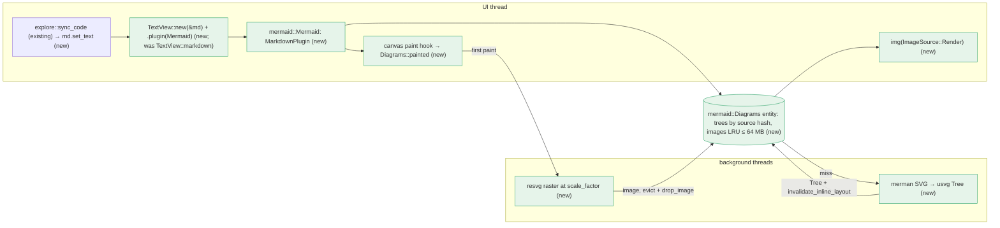

# Mermaid diagrams in the markdown preview — Implementation Plan

> **For Claude:** REQUIRED SUB-SKILL: Use /implement to execute this plan task-by-task.

**Goal:** In Explore's markdown preview, ```` ```mermaid ```` fences render as diagrams styled with our theme, fully in-process. Opening and scrolling stay as smooth as they are today.

**Toolset** (run everything from `packages/desktop`):
- Setup, once per shell: `export PATH=$HOME/.cargo/bin:$PATH && cd packages/desktop`
- This plan's tests: `cargo test -p pocket mermaid`
- Suites this plan touches: `cargo test -p git -p theme -p pocket`
- Build the app: `cargo build -p pocket`. Release build for the manual check: `cargo build --release -p pocket`
- Lint: `cargo clippy -p git -p theme -p pocket`. The baseline has one warning, `double_ended_iterator_last` in `crates/git/src/git.rs`. Ignore it and add no new ones (except the temporary `dead_code` warnings noted in Tasks 1.2–1.3).
- Run the app: `cargo run --release -p pocket`

**Read first:**
- `docs/spike-mermaid.md`: measured timings, memory and frame stats, the gotchas and the decision table this plan implements.
- `docs/research-mermaid-rendering.md`: why merman, and how gpui-kit's `MarkdownPlugin` hook works.
- `packages/desktop/crates/pocket/src/explore.rs`: the markdown preview (~L322) and `sync_code` (~L370). Task 1.4 edits both.
- `~/.cargo/registry/src/index.crates.io-*/gpui-base-0.6.6/src/text/markdown_ext.rs`: the `MarkdownPlugin` trait and `MarkdownNode`.
- `~/.cargo/registry/src/index.crates.io-*/gpui-base-0.6.6/src/text/state.rs`: `TextViewState::markdown`, `set_text`, `invalidate_inline_layout`, `list_state`.

**Never touch the git index.** The user has uncommitted work across `packages/desktop` (`crates/pocket/src/*.rs`, `crates/theme/src/theme.rs`, `crates/ui/src/ui.rs`, `crates/git`, `Cargo.toml`/`Cargo.lock`, new icons), plus staged changes in `.ui-review/`. This plan was compile-checked on a copy of exactly that tree. Do not `git add`, `git stash`, `git checkout --`, `git restore` or commit. Edit files in place only.

**Code rules (from the user's CLAUDE.md):** add no comments except a tricky "why". Add `///` docblocks only where the plan shows them. Test modules import names explicitly: `use super::*` also pulls in `gpui_kit::*`, whose `test` macro shadows `#[test]`. Don't run `cargo fmt`, because the files use long lines on purpose.

---

## Architecture



A gpui-kit `MarkdownPlugin` claims `mermaid` fences. When a fence is first seen, merman lays the diagram out on a background thread into a `usvg::Tree`, so the box size is exact before any pixels exist. Pixels are made only when the fence is first painted, at the window's scale factor. They are kept in a 64 MB LRU that never evicts what is on screen. `Desktop` now owns the `TextViewState`, so the diagram cache can ask it to remeasure.

## Why this approach

- **merman in-process (MIT/Apache-2.0).** Pure Rust: no JS runtime, no network, no CLI. Most diagrams take 5–14 ms. Rejected: an embedded JS engine running mermaid.js (needs a DOM and text measurement), `mmdc` (needs Node and Chromium), and kroki/mermaid.ink (sends document content off-machine).
- **The `MarkdownPlugin` hook, not splitting markdown ourselves.** Selection, scrolling and every other block stay stock gpui-kit.
- **Two-stage lazy rendering.** The spike measured eager 2× rasters at ~400 MB for 72 diagrams. Lazy mode holds 56–78 MB with identical frame times (p50 8.33 ms, p99 ~9.3 ms, 0 frames >33 ms). The cost is ~2 blank frames per diagram, with no layout shift.
- **Our own usvg fontdb with Geist.** gpui's `SvgRenderer` has no Geist, so its labels would not match the UI.
- **A `Desktop`-owned `Entity<TextViewState>`.** It replaces `TextView::markdown(id, text)`, so the cache can call `invalidate_inline_layout` when a layout lands. This mirrors how `code: Entity<EditorState>` already works.
- Zed is GPL: ideas only, no code copied.

## Performance rules (apply to every task)

1. No merman, usvg or resvg call on the UI thread. They run in `background_spawn` only.
2. One layout per unique source (hash key). Editing one fence re-lays out only that fence.
3. Pixels only for fences that were painted. The image bytes held stay under `BUDGET` (64 MB), except for images painted in the last `IN_USE` (250 ms).
4. Evicted images are freed from the GPU atlas with `window.drop_image`.

## Tasks at a glance

| Task | What | Main files | Risk |
|---|---|---|---|
| **PR 1: Mermaid diagrams in Explore's markdown preview** | | | |
| 1.1 | Add merman/resvg/image deps; make `theme::FONTS` public | `Cargo.toml`, `pocket/Cargo.toml`, `theme.rs` | `Cargo.lock` moves `serde-saphyr` down (see gotchas) |
| 1.2 | `mermaid.rs`: themed SVG, usvg tree, raster | new `pocket/src/mermaid.rs`, `main.rs` | Alpha crate API |
| 1.3 | `Diagrams` cache with LRU and the `Mermaid` plugin | `mermaid.rs` | Low |
| 1.4 | `Desktop` owns the `TextViewState`; wire the plugin | `main.rs`, `explore.rs` | Scroll on file switch |
| 1.5 | Manual look and performance check | none | — |

---

## PR 1: Mermaid diagrams in Explore's markdown preview

**Scope:** Mermaid fences in Explore's markdown preview render as diagrams. Other code fences, the Source toggle and the Changes view are unchanged. Tasks 1.2–1.3 add code that stays unreferenced until Task 1.4.
**Depends on:** nothing
**Done when:** `cargo test -p git -p theme -p pocket` is green, clippy shows only the baseline warning, and the Task 1.5 checklist passes.

### Task 1.1: Dependencies and public fonts

**Files:**
- Modify: `packages/desktop/Cargo.toml` (`[workspace.dependencies]`, around `imara-diff`)
- Modify: `packages/desktop/crates/pocket/Cargo.toml` (`[dependencies]`)
- Modify: `packages/desktop/crates/theme/src/theme.rs:127`

**Context:**
- `merman` renders Mermaid source to SVG. It is an alpha release, so pin it exactly.
  - `default-features = false` drops its own raster backend.
  - `layout-cytoscape` enables the layout that flowcharts and class diagrams need.
- `resvg` 0.46 is the version gpui already uses (it is in `Cargo.lock`), so no second copy gets built.
- `image` gives the `Frame`/`ImageBuffer` types that `gpui::RenderImage` takes.
- `theme::FONTS` holds the bundled Geist TTF bytes. Task 1.2 loads them into usvg, so it must be `pub`.

**Step 1: Add the workspace deps**

In `packages/desktop/Cargo.toml`, `[workspace.dependencies]`, keep the list alphabetical. Replace:

```toml
imara-diff = "0.2"
```

with:

```toml
image = { version = "0.25", default-features = false }
imara-diff = "0.2"
merman = { version = "=0.8.0-alpha.6", default-features = false, features = ["svg", "layout-cytoscape"] }
resvg = "0.46"
```

**Step 2: Use them in `pocket`**

In `packages/desktop/crates/pocket/Cargo.toml`, `[dependencies]`, replace:

```toml
gpui-kit.workspace = true
keys.workspace = true
```

with:

```toml
gpui-kit.workspace = true
image.workspace = true
keys.workspace = true
merman.workspace = true
resvg.workspace = true
```

**Step 3: Make the fonts public**

In `packages/desktop/crates/theme/src/theme.rs:127`, replace:

```rust
const FONTS: [&[u8]; 8] = [
```

with:

```rust
pub const FONTS: [&[u8]; 8] = [
```

**Step 4: Build**

Run: `cargo build -p pocket`
Expected: `Finished`, no new warnings.

`Cargo.lock` gains merman and its deps. Expect it to also move `serde-saphyr` 1.3.0 → 0.0.29, `granit-parser` 1.3.0 → 1.0.0/0.0.7, `rust-i18n` 4.2.2 → 4.2.1 and `smallvec` 1.16.2 → 1.15.2. The cause is merman-core pinning `granit-parser = "=1.0.0"`. This is expected: don't fight it with `cargo update --precise`.

Run: `cargo test -p theme`
Expected: PASS.

---

### Task 1.2: Themed SVG, usvg tree and raster

**Files:**
- Create: `packages/desktop/crates/pocket/src/mermaid.rs`
- Modify: `packages/desktop/crates/pocket/src/main.rs:4` (module list)
- Test: `mod tests` at the bottom of `mermaid.rs`

**Context:**
- **Pipeline:** Mermaid source → merman SVG → `usvg::Tree` (parsed SVG with a known size) → tiny-skia pixmap → `gpui::RenderImage`, which `img(ImageSource::Render(..))` draws.
- **`SvgPipelinePreset::ResvgSafe`** makes merman emit labels as plain `<text>`. The default emits `<foreignObject>` HTML, which resvg can't draw.
- **merman needs opaque `#rrggbb`.** Our tokens are `0xRRGGBBAA` and some are translucent, so `hex` flattens them onto white.
- **Fonts:** gpui's own SVG renderer has no Geist, so we build our own `usvg::Options` once in a `LazyLock`. `Options` is not `Clone`.
- **Pixel order:** tiny-skia gives premultiplied RGBA and gpui wants BGRA, so swap bytes 0 and 2.
- **`MAX_SIDE`:** the scale is clamped so the long side is at most 8192 px. Bigger textures fail on some GPUs.
- **Warnings:** these functions stay unused outside tests until Task 1.4, so `cargo build` shows `dead_code` warnings for now. That is expected.

**Step 1: Write the failing tests**

Create `packages/desktop/crates/pocket/src/mermaid.rs` with only:

```rust
#[cfg(test)]
mod tests {
    use super::{hex, rasterize, svg, tree};

    #[test]
    fn flattens_translucent_tokens_onto_white() {
        assert_eq!(hex(0x5b5bd6ff), "#5b5bd6");
        assert_eq!(hex(0x00000000), "#ffffff");
        assert_eq!(hex(0x00000080), "#7f7f7f");
    }

    #[test]
    fn renders_resvg_safe_svg_with_text_labels() {
        let out = svg("flowchart LR\n  A[Open] --> B[Close]\n").unwrap();
        assert!(out.starts_with("<svg"));
        assert!(out.contains(">Open<"));
        assert!(!out.contains("<foreignObject"));
    }

    #[test]
    fn reports_syntax_errors() {
        assert!(svg("flowchart LR\n  A -->\n").unwrap_err().contains("parse error"));
    }

    #[test]
    fn rasterizes_at_scale_and_caps_the_long_side() {
        let t = tree("flowchart LR\n  A --> B\n").unwrap();
        let (w, h) = (t.size().width(), t.size().height());
        let size = rasterize(&t, 2.).unwrap().size(0);
        assert_eq!((size.width.0, size.height.0), ((w * 2.).ceil() as i32, (h * 2.).ceil() as i32));
        let size = rasterize(&t, 10_000.).unwrap().size(0);
        assert_eq!(size.width.0.max(size.height.0), 8192);
    }
}
```

What each test proves:
- `flattens_…`: opaque tokens pass through, and translucent ones blend onto white.
- `renders_…`: output is SVG that resvg can draw, and labels are real text.
- `reports_…`: bad source gives merman's error, not a panic or an empty image.
- `rasterizes_…`: the pixel size follows the scale factor, and huge scales are clamped to 8192.

In `packages/desktop/crates/pocket/src/main.rs:4`, replace:

```rust
mod inbox;
```

with:

```rust
mod inbox;
mod mermaid;
```

**Step 2: Run the tests to verify they fail**

Run: `cargo test -p pocket mermaid`
Expected: FAIL to compile with `unresolved imports super::hex, super::rasterize, super::svg, super::tree`.

**Step 3: Write the implementation**

Insert above `#[cfg(test)]` in `mermaid.rs`:

```rust
use gpui_kit::*;
use merman::svg::{HostTheme, Presentation, ResolvedPresentation, SvgOutputPolicy, SvgPipelinePreset, ThemeRole};
use merman::{OperationControl, RenderOutput, RenderRequest, Renderer, SvgRequest};
use resvg::usvg::{Options, Tree};
use std::sync::{Arc, LazyLock};
use theme::*;

const MAX_SIDE: f32 = 8192.;

struct Merman {
    renderer: Renderer,
    presentation: ResolvedPresentation,
}

static MERMAN: LazyLock<Merman> = LazyLock::new(|| {
    let roles = [
        (ThemeRole::Canvas, SURFACE),
        (ThemeRole::Surface, SURFACE_SUNKEN),
        (ThemeRole::SurfaceAlt, WINDOW),
        (ThemeRole::Text, TEXT),
        (ThemeRole::SubtleText, TEXT_3),
        (ThemeRole::Border, TEXT_6),
        (ThemeRole::Line, TEXT_4),
        (ThemeRole::ClusterBackground, SURFACE_SUNKEN),
        (ThemeRole::ClusterBorder, TEXT_6),
        (ThemeRole::NoteBackground, ACCENT_BG),
        (ThemeRole::NoteBorder, ACCENT),
        (ThemeRole::NoteText, TEXT),
        (ThemeRole::Error, FAILED),
    ];
    let theme = roles.into_iter().fold(HostTheme::new().try_with_font_family("Geist, sans-serif").unwrap(), |t, (role, c)| t.try_with_role(role, hex(c)).unwrap());
    let presentation = Presentation::new().with_theme(theme.try_with_series_palette(PALETTE.map(hex)).unwrap()).resolve();
    let renderer = Renderer::new().with_engine(presentation.materialize_engine(merman::Engine::new()));
    Merman { renderer, presentation }
});

static USVG: LazyLock<Options<'static>> = LazyLock::new(|| {
    let mut options = Options::default();
    let db = Arc::make_mut(&mut options.fontdb);
    db.load_system_fonts();
    for font in theme::FONTS {
        db.load_font_data(font.to_vec());
    }
    options
});

/// Merman wants opaque colours, so translucent tokens are flattened onto white.
fn hex(c: u32) -> String {
    let a = (c & 0xff) as f32 / 255.;
    let mix = |v: u32| ((v & 0xff) as f32 * a + 255. * (1. - a)).round() as u8;
    format!("#{:02x}{:02x}{:02x}", mix(c >> 24), mix(c >> 16), mix(c >> 8))
}

/// Mermaid source as SVG that resvg can draw: labels are plain `<text>`, not `<foreignObject>`.
fn svg(source: &str) -> Result<String, String> {
    let pipeline = SvgOutputPolicy { preset: SvgPipelinePreset::ResvgSafe, ..Default::default() }.pipeline();
    let request = SvgRequest { pipeline: Some(pipeline), presentation: MERMAN.presentation.render_policy(), ..Default::default() };
    match MERMAN.renderer.render(RenderRequest::svg(source, OperationControl::new(), request)) {
        Ok(RenderOutput::Svg(Some(svg))) => Ok(svg.svg().to_string()),
        Ok(_) => Err("Not a Mermaid diagram".into()),
        Err(e) => Err(e.to_string()),
    }
}

fn tree(source: &str) -> Result<Arc<Tree>, String> {
    Tree::from_str(&svg(source)?, &USVG).map(Arc::new).map_err(|e| e.to_string())
}

fn rasterize(tree: &Tree, scale: f32) -> Result<Arc<RenderImage>, String> {
    let size = tree.size();
    let scale = scale.min(MAX_SIDE / size.width().max(size.height()));
    let mut pixmap = resvg::tiny_skia::Pixmap::new((size.width() * scale).ceil() as u32, (size.height() * scale).ceil() as u32).ok_or("Diagram is empty")?;
    resvg::render(tree, resvg::tiny_skia::Transform::from_scale(scale, scale), &mut pixmap.as_mut());
    let (w, h) = (pixmap.width(), pixmap.height());
    let mut bgra = pixmap.take();
    for px in bgra.as_chunks_mut::<4>().0 {
        px.swap(0, 2);
    }
    let buffer = image::ImageBuffer::from_raw(w, h, bgra).ok_or("Diagram buffer mismatch")?;
    Ok(Arc::new(RenderImage::new(vec![image::Frame::new(buffer)])))
}
```

**Step 4: Run the tests to verify they pass**

Run: `cargo test -p pocket mermaid`
Expected: PASS, 4 tests. (`dead_code` warnings for `rasterize`/`tree`/`MAX_SIDE` are expected until Task 1.4.)

---

### Task 1.3: `Diagrams` cache and the `Mermaid` plugin

**Files:**
- Modify: `packages/desktop/crates/pocket/src/mermaid.rs`
- Test: `mod tests` in `mermaid.rs`

**Context:**
- **The hook.** gpui-kit's `MarkdownPlugin` (`gpui-base-0.6.6/src/text/markdown_ext.rs`) runs in two steps:
  - `parse` sees each mdast node. Returning `Some(MarkdownNode)` claims the node; `None` leaves it to the default renderer, so other code fences stay normal code blocks.
  - `render` builds the element for a claimed node. `node.data::<T>()` gets back the value stored with `MarkdownNode::new`.
- **`render` runs for every block when a file opens.** `TextViewState` measures the whole list up front, so layout work must be async and cheap to start.
- **Stage 1 (layout).** `Diagrams::get` spawns merman + usvg on a background thread, keyed by the source hash. When the result lands, it calls `TextViewState::invalidate_inline_layout` so the list remeasures with the real box size.
- **Stage 2 (pixels).**
  - A zero-size `canvas` sits under the image. Its paint callback runs only when the fence is actually painted (on screen), and calls `Diagrams::painted`.
  - `painted` touches the LRU timestamp, or starts a background raster at `window.scale_factor()`.
  - When a raster lands, `evict` drops the least-recently-painted images over `BUDGET`, but never those painted in the last `IN_USE` (still on screen). `window.drop_image` frees their GPU atlas slot.
  - A failed raster turns the fence into `Diagram::Failed`, so it shows the error box instead of staying blank.
- **`Desktop` redraws automatically.** `cx.notify()` on `Diagrams` redraws `Desktop`, because gpui tracks entities read during a view's render.

**Step 1: Write the failing tests**

In `mermaid.rs`, replace the `use super::{hex, rasterize, svg, tree};` line in `mod tests` with:

```rust
    use super::{BUDGET, IN_USE, evict, hex, rasterize, svg, tree};
    use gpui_kit::RenderImage;
    use std::collections::HashMap;
    use std::sync::Arc;
    use std::time::Instant;

    fn image(w: u32, h: u32) -> Arc<RenderImage> {
        let buffer = image::ImageBuffer::from_raw(w, h, vec![0; (w * h * 4) as usize]).unwrap();
        Arc::new(RenderImage::new(vec![image::Frame::new(buffer)]))
    }
```

and append these tests inside `mod tests`, after `rasterizes_at_scale_and_caps_the_long_side`:

```rust
    #[test]
    fn evicts_least_recently_painted_past_the_budget() {
        let old = Instant::now() - IN_USE * 4;
        let big = (BUDGET / 4 / 4096) as u32;
        let mut images = HashMap::from([
            (1, (image(1024, big), old)),
            (2, (image(1024, big), old + IN_USE)),
            (3, (image(1024, big), old + IN_USE * 2)),
            (4, (image(1024, big), Instant::now())),
            (5, (image(1024, big), Instant::now())),
        ]);
        assert_eq!(evict(&mut images, BUDGET).len(), 1);
        assert!(!images.contains_key(&1) && images.contains_key(&2));
    }

    #[test]
    fn spares_images_on_screen_even_over_budget() {
        let mut images = HashMap::from([(1, (image(64, 64), Instant::now())), (2, (image(64, 64), Instant::now()))]);
        assert!(evict(&mut images, 0).is_empty());
        assert_eq!(images.len(), 2);
    }
```

What each test proves:
- `evicts_…`: five images of ¼ budget each (1.25× budget). Only the oldest is dropped, and eviction stops as soon as the rest fit.
- `spares_…`: images painted just now survive even a zero budget, so on-screen diagrams never go blank.

**Step 2: Run the tests to verify they fail**

Run: `cargo test -p pocket mermaid`
Expected: FAIL to compile with `unresolved imports super::BUDGET, super::IN_USE, super::evict`.

**Step 3: Write the implementation**

Replace the imports and constant at the top of `mermaid.rs`:

```rust
use gpui_kit::*;
use merman::svg::{HostTheme, Presentation, ResolvedPresentation, SvgOutputPolicy, SvgPipelinePreset, ThemeRole};
use merman::{OperationControl, RenderOutput, RenderRequest, Renderer, SvgRequest};
use resvg::usvg::{Options, Tree};
use std::sync::{Arc, LazyLock};
use theme::*;

const MAX_SIDE: f32 = 8192.;
```

with:

```rust
use gpui_kit::component::text::{MarkdownNode, MarkdownParseContext, MarkdownPlugin, TextViewState, markdown_ast as mdast};
use gpui_kit::*;
use merman::svg::{HostTheme, Presentation, ResolvedPresentation, SvgOutputPolicy, SvgPipelinePreset, ThemeRole};
use merman::{OperationControl, RenderOutput, RenderRequest, Renderer, SvgRequest};
use resvg::usvg::{Options, Tree};
use std::collections::{HashMap, HashSet};
use std::hash::{DefaultHasher, Hash, Hasher};
use std::sync::{Arc, LazyLock};
use std::time::{Duration, Instant};
use theme::*;

const BUDGET: usize = 64 << 20;
const MAX_SIDE: f32 = 8192.;
// Diagrams painted this recently are on screen, so eviction spares them.
const IN_USE: Duration = Duration::from_millis(250);
```

Then insert this between the end of `fn rasterize` and `#[cfg(test)]`:

```rust
fn bytes(image: &RenderImage) -> usize {
    image.as_bytes(0).map_or(0, <[u8]>::len)
}

fn evict(images: &mut HashMap<u64, (Arc<RenderImage>, Instant)>, budget: usize) -> Vec<Arc<RenderImage>> {
    let mut total: usize = images.values().map(|(i, _)| bytes(i)).sum();
    let mut lru: Vec<(u64, Instant)> = images.iter().map(|(k, (_, t))| (*k, *t)).collect();
    lru.sort_by_key(|(_, t)| *t);
    let mut dropped = Vec::new();
    for (key, painted) in lru {
        if total <= budget || painted.elapsed() < IN_USE {
            break;
        }
        let (image, _) = images.remove(&key).unwrap();
        total -= bytes(&image);
        dropped.push(image);
    }
    dropped
}

#[derive(Clone)]
enum Diagram {
    Pending,
    Ready(Arc<Tree>),
    Failed(SharedString),
}

/// Diagrams keyed by source hash. Layout happens off the UI thread as soon as a fence is seen; pixels only for painted fences, within [`BUDGET`].
pub struct Diagrams {
    md: WeakEntity<TextViewState>,
    items: HashMap<u64, Diagram>,
    images: HashMap<u64, (Arc<RenderImage>, Instant)>,
    rastering: HashSet<u64>,
}

impl Diagrams {
    pub fn new(md: &Entity<TextViewState>) -> Self {
        Self { md: md.downgrade(), items: HashMap::new(), images: HashMap::new(), rastering: HashSet::new() }
    }

    fn get(&mut self, key: u64, source: &SharedString, cx: &mut Context<Self>) -> Diagram {
        if let Some(d) = self.items.get(&key) {
            return d.clone();
        }
        self.items.insert(key, Diagram::Pending);
        let source = source.clone();
        cx.spawn(async move |this, cx| {
            let diagram = cx.background_spawn(async move { tree(&source) }).await;
            this.update(cx, |this, cx| {
                this.items.insert(key, diagram.map_or_else(|e| Diagram::Failed(e.into()), Diagram::Ready));
                this.md.update(cx, |md, cx| md.invalidate_inline_layout(cx)).ok();
                cx.notify();
            })
            .ok();
        })
        .detach();
        Diagram::Pending
    }

    fn painted(&mut self, key: u64, tree: &Arc<Tree>, window: &mut Window, cx: &mut Context<Self>) {
        if let Some((_, painted)) = self.images.get_mut(&key) {
            *painted = Instant::now();
            return;
        }
        if !self.rastering.insert(key) {
            return;
        }
        let (tree, scale) = (tree.clone(), window.scale_factor());
        cx.spawn_in(window, async move |this, cx| {
            let image = cx.background_spawn(async move { rasterize(&tree, scale) }).await;
            this.update_in(cx, |this, window, cx| {
                this.rastering.remove(&key);
                match image {
                    Ok(image) => {
                        this.images.insert(key, (image, Instant::now()));
                    }
                    Err(e) => {
                        this.items.insert(key, Diagram::Failed(e.into()));
                        this.md.update(cx, |md, cx| md.invalidate_inline_layout(cx)).ok();
                    }
                }
                for image in evict(&mut this.images, BUDGET) {
                    window.drop_image(image).ok();
                }
                cx.notify();
            })
            .ok();
        })
        .detach();
    }
}

struct Fence {
    key: u64,
    source: SharedString,
}

/// Renders `mermaid` code fences in a markdown `TextView` as diagrams.
pub struct Mermaid(pub Entity<Diagrams>);

impl MarkdownPlugin for Mermaid {
    fn is_block(&self) -> bool {
        true
    }

    fn name(&self) -> &str {
        "mermaid"
    }

    fn parse(&self, node: &mdast::Node, cx: &MarkdownParseContext<'_>) -> Option<MarkdownNode> {
        let mdast::Node::Code(code) = node else { return None };
        if code.lang.as_deref() != Some("mermaid") {
            return None;
        }
        let mut hasher = DefaultHasher::new();
        code.value.hash(&mut hasher);
        let fence = Fence { key: hasher.finish(), source: code.value.clone().into() };
        Some(MarkdownNode::new("mermaid", fence).text(code.value.clone()).markdown(cx.node_source(node).unwrap_or(&code.value).to_string()))
    }

    fn render(&self, node: &MarkdownNode, _: &mut Window, cx: &mut App) -> impl IntoElement {
        let Fence { key, source } = node.data::<Fence>().unwrap();
        let key = *key;
        let frame = div().id(SharedString::from(format!("mermaid-{key}"))).my(px(8.)).p(px(12.)).rounded(px(8.)).border_1().border_color(rgba(HAIRLINE)).bg(rgba(SURFACE));
        match self.0.update(cx, |d, cx| d.get(key, source, cx)) {
            Diagram::Ready(tree) => {
                let size = tree.size();
                let image = self.0.read(cx).images.get(&key).map(|(image, _)| image.clone());
                let diagrams = self.0.clone();
                let paint = canvas(|_, _, _| {}, move |_, _, window, cx| diagrams.update(cx, |d, cx| d.painted(key, &tree, window, cx)));
                frame.overflow_x_scroll().child(
                    div()
                        .relative()
                        .flex_none()
                        .w(px(size.width()))
                        .h(px(size.height()))
                        .child(paint.absolute().size_full())
                        .children(image.map(|image| img(ImageSource::Render(image)).size_full())),
                )
            }
            Diagram::Pending => frame.text_size(px(12.)).text_color(rgba(TEXT_3)).child("Rendering diagram…"),
            Diagram::Failed(error) => frame
                .flex()
                .flex_col()
                .gap(px(6.))
                .text_size(px(12.))
                .child(div().text_color(rgba(FAILED)).child(error))
                .child(div().font_family(MONO).text_color(rgba(TEXT_2)).child(source.clone())),
        }
    }
}
```

**Step 4: Run the tests to verify they pass**

Run: `cargo test -p pocket mermaid`
Expected: PASS, 6 tests. (`dead_code` warnings for `Diagrams`/`Mermaid` are expected until Task 1.4.)

---

### Task 1.4: Wire the plugin into Explore

**Files:**
- Modify: `packages/desktop/crates/pocket/src/main.rs:15` (imports), `:143` (fields), `:161` (init), `:237` (struct literal)
- Modify: `packages/desktop/crates/pocket/src/explore.rs:4` (imports), `:327` (preview), `:396` (`sync_code`)

**Context:**
- **Today** the preview is `TextView::markdown(id, text)`, which owns its state. The diagram cache needs a handle to call `invalidate_inline_layout`, so `Desktop` now owns `md: Entity<TextViewState>`. This mirrors `code: Entity<EditorState>`.
- **Loading text.** `sync_code` (called from `Desktop::render`) already knows when the text changed (`reload`) and when a different file opened (`!same`). Load the text there.
- **Scroll.** `TextViewState::set_text` keeps the scroll position and is a no-op on equal text. Reset scroll yourself only when the file changes, so an agent editing the open file doesn't jump the view.
- **Cheap per frame.** `.plugin(..)` is rebuilt every render. `TextView` compares parser shape, not identity, so it doesn't reparse.

**Step 1: Own the state in `Desktop`**

In `packages/desktop/crates/pocket/src/main.rs:15`, replace:

```rust
use gpui_kit::component::input::{EditorState, InputEvent, InputState, TextDecorationCollection, TextareaState};
```

with:

```rust
use gpui_kit::component::input::{EditorState, InputEvent, InputState, TextDecorationCollection, TextareaState};
use gpui_kit::component::text::TextViewState;
```

In the `Desktop` struct (~L143), replace:

```rust
    code_text: SharedString,
    md_source: bool,
```

with:

```rust
    code_text: SharedString,
    md: Entity<TextViewState>,
    diagrams: Entity<mermaid::Diagrams>,
    md_source: bool,
```

In `Desktop::new` (~L161), replace:

```rust
        let code_marks = code.update(cx, |s, cx| s.create_decorations_collection(Vec::new(), cx));
```

with:

```rust
        let code_marks = code.update(cx, |s, cx| s.create_decorations_collection(Vec::new(), cx));
        let md = cx.new(|cx| TextViewState::markdown("", cx));
        let diagrams = cx.new(|_| mermaid::Diagrams::new(&md));
```

In the struct literal (~L237), replace:

```rust
            code_text: SharedString::default(),
            md_source: false,
```

with:

```rust
            code_text: SharedString::default(),
            md,
            diagrams,
            md_source: false,
```

**Step 2: Render with the plugin**

In `packages/desktop/crates/pocket/src/explore.rs:4`, replace:

```rust
use crate::syntax::language_for;
```

with:

```rust
use crate::mermaid::Mermaid;
use crate::syntax::language_for;
```

At ~L327, replace:

```rust
                    TextView::markdown(id(format!("md-{path}")), self.code_text.clone())
```

with:

```rust
                    TextView::new(&self.md)
                        .plugin(Mermaid(self.diagrams.clone()))
```

Leave the chained `.selectable(true)`, `.scrollable(true)`, `.style(..)` and `.size_full()` as they are.

**Step 3: Load text in `sync_code`**

At the end of `sync_code` (~L396), replace:

```rust
        self.code_marks.set(marks, cx);
    }
```

with:

```rust
        self.code_marks.set(marks, cx);
        if reload {
            self.md.update(cx, |md, cx| {
                md.set_text(&self.code_text, cx);
                if !same {
                    md.list_state().scroll_to(ListOffset::default());
                }
            });
        }
    }
```

**Step 4: Build, lint, test**

Run: `cargo build -p pocket`
Expected: `Finished` with no warnings from `pocket`. The `dead_code` warnings from Tasks 1.2–1.3 are gone.

Run: `cargo clippy -p git -p theme -p pocket`
Expected: only the baseline `double_ended_iterator_last` warning.

Run: `cargo test -p git -p theme -p pocket`
Expected: PASS, including 6 `mermaid::tests`.

---

### Task 1.5: Look and performance checklist (manual, release build)

**Files:** none

**Context:**
- The spike (`docs/spike-mermaid.md`) measured the pieces. This checks the integrated app.
- Use a focused window: unfocused GPUI windows render at 30 fps.
- A good test file is `docs/research-mermaid-rendering.md`, or any `.md` with several ```` ```mermaid ```` fences.

**Steps:**

1. Run `cargo build --release -p pocket && cargo run --release -p pocket`.
2. **Render.** In Explore, open a markdown file with mermaid fences, in Preview mode.
   - Each fence shows "Rendering diagram…" briefly, then a diagram in a bordered `SURFACE` box, with Geist labels in our colours.
   - Other code fences still render as highlighted code blocks.
3. **Errors.** Add a fence with broken syntax (for example `flowchart LR\n  A -->`). Expected: a red merman error above the fence source, in mono.
4. **Scroll.** Fling-scroll top to bottom and back.
   - No stutter.
   - Diagrams may be blank for a frame or two as they scroll in, but boxes never change size or jump.
5. **Width.** A wide diagram scrolls horizontally inside its box, and the page doesn't widen.
6. **Live edits.** Edit one fence on disk while it is open. Within one refresh (≤2 s), only that diagram re-renders, and the scroll position stays.
7. **File switch.** Switch to another markdown file and back. Each opens scrolled to the top.
8. **Idle.** Activity Monitor: `pocket-desktop` CPU is near 0% when idle on the preview. Memory doesn't keep climbing as you scroll a long diagram-heavy file up and down; expect it to plateau under ~100 MB of diagram images.

Report any failure with the step number and what you saw. Don't tune constants blindly.

---

## Tradeoffs and follow-ups

- **Binary grows 18 MB** (44 → 62 MB release) from merman's parsers and layout engines.
- **Alpha dependency:** merman `=0.8.0-alpha.6` is pinned exactly. Upgrade on purpose and re-run the `mermaid::tests`.
- **Known merman gaps:** stateDiagram edge labels can overlap, and very large graphs (~150+ nodes) may fail or take long. Both happen off-thread and show the error box or a slow pop-in, never a hang.
- **Scale factor is fixed at first raster.** Moving the window to a different-DPI display leaves diagrams blurry or oversized until they are evicted. Follow-up: key images by `(hash, scale)`.
- **Light theme only:** colours come from the current light tokens. When a dark theme lands, rebuild `MERMAN` per theme and clear `Diagrams`.
- **Never pruned:** layouts for sources no longer in any open file stay in `Diagrams.items`. They are small (a parsed tree, no pixels). Prune on file switch if it ever matters.
- **Only Explore's preview renders diagrams.** Other markdown surfaces (for example chat messages) are untouched.
