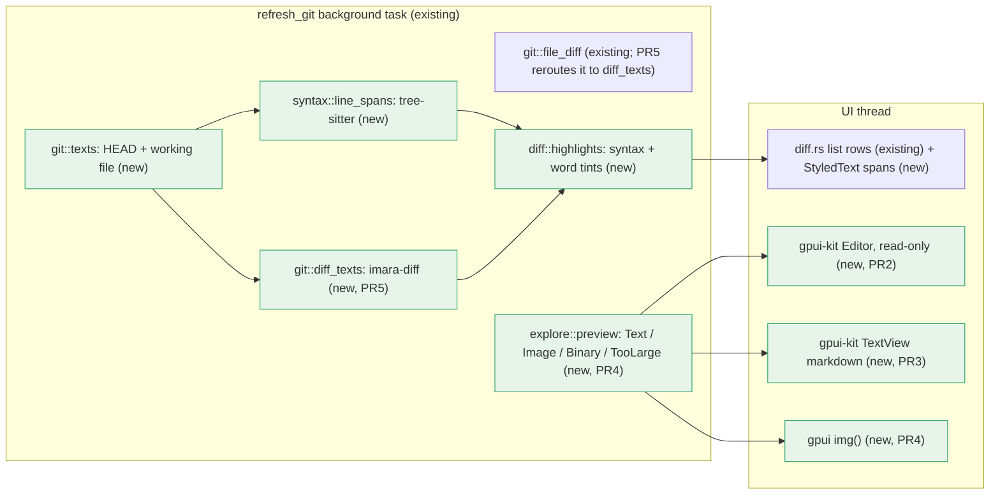

# Zed-style Explore and Changes views — Implementation Plan

> **For Claude:** REQUIRED SUB-SKILL: Use /implement to execute this plan task-by-task.

**Goal:** Explore previews files the way Zed does: real syntax colours, search, selection, 100k-line files, rendered markdown and images. Changes shows diffs the way Zed does: syntax colours on both sides, word-level highlights, and folds you can click open. Both stay smooth while scrolling.

**Toolset** (run everything from `packages/desktop`):
- Setup, once per shell: `export PATH=$HOME/.cargo/bin:$PATH && cd packages/desktop`
- One test: `cargo test -p <git|theme|pocket> <name filter>`
- Suites this plan touches: `cargo test -p git -p theme -p pocket`
- Build the app: `cargo build -p pocket`. Release build for the perf check: `cargo build --release -p pocket`
- Lint: `cargo clippy -p git -p theme -p pocket`. The baseline has one warning, `double_ended_iterator_last` in `crates/git/src/git.rs` (`name_status`). Ignore it and add no new ones.
- Run the app: `cargo run --release -p pocket`

**Read first:**
- `docs/spike-zed-preview.md`: spike results, the decision table and the gotchas this plan relies on.
- `docs/research-zed-diff-rendering.md`: how Zed renders diffs, file previews and markdown. Explains the "why" behind each PR.
- `packages/desktop/crates/pocket/src/diff.rs`: the Changes view. PR1 and PR5 extend its rows.
- `packages/desktop/crates/pocket/src/explore.rs`: the Explore view. PR2 to PR4 replace its code box.
- `refresh_git` in `packages/desktop/crates/pocket/src/main.rs` (~L475). A background task that runs every 2 s and on navigation. All file I/O and parsing go here.

**Never touch the git index.** The user has uncommitted work in `crates/pocket/src/{diff,explore,main,overlay,view}.rs`, `crates/theme/src/theme.rs`, `crates/ui/src/ui.rs` and new icons, plus staged changes in `.ui-review/`. This plan was written and compile-checked on top of that work. Do not `git add`, `git stash`, `git checkout --`, `git restore` or commit. Edit files in place only.

**Code rules (from the user's CLAUDE.md):** add no comments except a tricky "why". Add `/** */`-style docblocks (`///` in Rust) only where the plan shows them. Test modules import names explicitly: `use super::*` also pulls in `gpui_kit::*`, whose `test` macro shadows `#[test]`.

---

## Architecture



All parsing runs in `refresh_git`'s background task, and only when the diff changed. The UI thread gets finished spans. Explore hands text to gpui-kit's `Editor`, which highlights incrementally off-thread by itself.

## Why this approach

- **Explore uses gpui-kit's read-only `Editor`, not our own rows.** It scrolls as well as our rows did (5 ms/frame at 400 px/frame over 100k lines). Opening a file costs one 23 ms frame, and search, selection and copy come free. Own rows would need a 0.2–1 s parse plus hand-built search and selection.
- **Changes keeps our own `list` rows.** Rows must interleave comment cards and the composer, and support line picking and split view, which the Editor can't do. We add syntax colours and word diffs to those rows.
- **Markdown uses gpui-kit's `TextView`** with a Preview/Source toggle. It renders headings, tables and code with a local `TextViewStyle`, so global theme colours don't change.
- **The diff is computed in-process with imara-diff (Apache-2.0).** A line diff takes 0.6 ms. We already need both full texts for correct tree-sitter colours, and full text is what lets folds open. Zed's crates are GPL, so we take ideas only and copy no code.
- **Rejected:** highlighting each diff line on its own (wrong colours inside multi-line strings and comments), and using the Editor for diffs (no interleaved comment rows).

## Performance rules (apply to every task)

1. Rows stay virtualized: `list(ListState)` for diffs, the Editor for files. Never render every line into a `div`.
2. No tree-sitter parse, file read or git call on the UI thread. They all live in `refresh_git`'s background task.
3. Recompute only on change: diff colours are computed only when the diff lines differ from what is shown, and the Editor reloads only when the text changed.
4. No syntax colouring above 512 KB per side (`MAX_COLORED`). Explore previews stop at 512 KB (`MAX_BYTES`).
5. Keep the scroll position on refresh: restore the Editor's `scroll_offset`, and expand folds with `ListState::splice`, not `reset`.

## Tasks at a glance

| Task | What | Main files | Risk |
|---|---|---|---|
| **PR 1: Syntax-coloured diff rows with word highlights** | | | |
| 1.1 | Tree-sitter grammars + our highlight theme | `Cargo.toml`, `theme/Cargo.toml`, `theme.rs` | Build time grows |
| 1.2 | `git::texts`, `git::words` (imara-diff) | `git/Cargo.toml`, `git.rs` | Low |
| 1.3 | `syntax::line_spans`, `language_for` | new `pocket/src/syntax.rs` | Low |
| 1.4 | `diff::syntax`, `diff::highlights` | `diff.rs` | Low |
| 1.5 | Wire spans into `refresh_git` and diff rows | `main.rs`, `diff.rs` | Medium: visual check |
| **PR 2: Explore on gpui-kit's read-only Editor** | | | |
| 2.1 | Changed-line tints as `TextDecoration`s | `explore.rs` | Low |
| 2.2 | Swap `code_box` for the Editor | `main.rs`, `view.rs`, `explore.rs` | Medium: focus, scroll |
| **PR 3: Markdown preview** | | | |
| 3.1 | Preview/Source toggle + `TextView` | `main.rs`, `explore.rs` | Medium: visual check |
| **PR 4: Images, binary and large files** | | | |
| 4.1 | `Preview` enum, `decode`, `preview` | `explore.rs` | Low |
| 4.2 | Render each kind | `main.rs`, `view.rs`, `explore.rs` | Low |
| **PR 5: In-process diff with folds you can open** | | | |
| 5.1 | `git::diff_texts`; `file_diff` uses it | `git.rs` | Medium: diff correctness |
| 5.2 | `diff::fold_start` | `diff.rs` | Low |
| 5.3 | Click a hunk header to unfold | `main.rs`, `diff.rs` | Medium: refresh race |
| 5.4 | Manual perf and look checklist | none | none |

---

## PR 1: Syntax-coloured diff rows with word highlights

**Scope:** The Changes view colours code with tree-sitter on both sides and tints the changed words in lines replaced one-for-one. The diff itself still comes from `git diff`. Explore is untouched.
**Depends on:** nothing
**Done when:** `cargo test -p git -p theme -p pocket` is green and a modified `.rs` file in Changes shows keyword, function, string and comment colours plus darker word tints.

### Task 1.1: Tree-sitter grammars and our highlight theme

**Files:**
- Modify: `packages/desktop/Cargo.toml:25` (the `gpui-kit` line in `[workspace.dependencies]`)
- Modify: `packages/desktop/crates/theme/Cargo.toml`
- Modify: `packages/desktop/crates/theme/src/theme.rs:1-2` (imports), `:50` (after `DIFF_DEL_TEXT`), `:61` (after `SYN_COMMENT`), `:139` (end of `init`), end of file (tests)

**Context:** gpui-kit compiles a real highlighter only when a `tree-sitter-*` feature is on; otherwise every language is plain text. Put the features on the **workspace** dependency so every crate, including `cargo test -p theme`, gets them. `HighlightTheme` (in `gpui_kit::component::highlighter`) maps capture names like `keyword` or `string.special` to styles, and is serde-compatible. We rebuild gpui-kit's light theme with our `SYN_*` colours by editing its JSON form. That is simpler than listing every field. The Editor, markdown code blocks and diff rows all read it from `cx.theme().highlight_theme`.

**Step 1: Write the failing test**

Append to `crates/theme/src/theme.rs`:

```rust
#[cfg(test)]
mod tests {
    use super::{SYN_COMMENT, SYN_FN, SYN_KEYWORD, SYN_STRING, highlight_theme};
    use gpui_kit::component::input::HighlightStyleResolver;
    use gpui_kit::rgba;

    #[test]
    fn colours_syntax_with_our_tokens() {
        let t = highlight_theme();
        let color = |name: &str| t.style(name).and_then(|s| s.color);
        assert_eq!(color("keyword"), Some(rgba(SYN_KEYWORD).into()));
        assert_eq!(color("function"), Some(rgba(SYN_FN).into()));
        assert_eq!(color("string"), Some(rgba(SYN_STRING).into()));
        assert_eq!(color("comment"), Some(rgba(SYN_COMMENT).into()));
    }
}
```

This proves each capture family resolves to our token colour.

**Step 2: Run the test to verify it fails**

Run: `cargo test -p theme colours_syntax`
Expected: FAIL to compile: `cannot find function `highlight_theme``.

**Step 3: Write the implementation**

`packages/desktop/Cargo.toml`: replace `gpui-kit = "0.6.6"` with:

```toml
gpui-kit = { version = "0.6.6", features = [
    "tree-sitter-bash",
    "tree-sitter-css",
    "tree-sitter-go",
    "tree-sitter-html",
    "tree-sitter-java",
    "tree-sitter-javascript",
    "tree-sitter-kotlin",
    "tree-sitter-markdown",
    "tree-sitter-python",
    "tree-sitter-rust",
    "tree-sitter-swift",
    "tree-sitter-toml",
    "tree-sitter-tsx",
    "tree-sitter-typescript",
    "tree-sitter-yaml",
] }
```

`crates/theme/Cargo.toml`: under `[dependencies]` add:

```toml
serde_json.workspace = true
```

`crates/theme/src/theme.rs`: replace the two `use` lines at the top with:

```rust
use gpui_kit::component::highlighter::HighlightTheme;
use gpui_kit::*;
use std::borrow::Cow;
use std::sync::Arc;
```

After `pub const DIFF_DEL_TEXT: u32 = 0xcd2b31ff;` add:

```rust
pub const DIFF_ADD_WORD: u32 = 0x30a46c40;
pub const DIFF_DEL_WORD: u32 = 0xe5484d38;
```

After `pub const SYN_COMMENT: u32 = 0xa1a1aaff;` add:

```rust

fn syntax_color(name: &str) -> u32 {
    match name.split('.').next().unwrap_or(name) {
        "keyword" | "boolean" | "preproc" | "attribute" => SYN_KEYWORD,
        "function" | "constructor" | "type" | "enum" | "tag" => SYN_FN,
        "string" | "number" | "constant" => SYN_STRING,
        "comment" => SYN_COMMENT,
        _ => TEXT_BODY,
    }
}

/// gpui-kit's light highlight theme recoloured with the `SYN_*` tokens, for the code editor, markdown and diff rows.
pub fn highlight_theme() -> Arc<HighlightTheme> {
    let hsla = |c: u32| serde_json::to_value(Hsla::from(rgba(c))).expect("colour serializes");
    let mut v = serde_json::to_value(&*HighlightTheme::default_light()).expect("theme serializes");
    if let Some(syntax) = v["style"]["syntax"].as_object_mut() {
        for (name, style) in syntax.iter_mut() {
            *style = serde_json::json!({ "color": hsla(syntax_color(name)) });
        }
    }
    for (key, c) in [
        ("editor.background", SURFACE_SUNKEN),
        ("editor.foreground", TEXT_BODY),
        ("editor.line_number", TEXT_5),
        ("editor.active_line_number", TEXT_2),
        ("editor.active_line.background", FILL_1),
    ] {
        v["style"][key] = hsla(c);
    }
    Arc::new(serde_json::from_value(v).expect("theme deserializes"))
}
```

At the end of `init`, after `t.caret = rgba(TEXT).into();`, add:

```rust
    t.mono_font_family = MONO.into();
    t.mono_font_size = px(13.);
    t.link = rgba(ACCENT).into();
    t.highlight_theme = highlight_theme();
```

Do not change the global `selection`, `muted`, `border` or `accent`: inputs share them.

**Step 4: Run the test to verify it passes**

Run: `cargo test -p theme colours_syntax`
Expected: PASS, `test tests::colours_syntax_with_our_tokens ... ok`. The first build compiles 15 grammars (a few minutes).

Run: `cargo test -p git -p theme -p pocket`
Expected: all green, same pocket count as before.

### Task 1.2: `git::texts` and `git::words`

**Files:**
- Modify: `packages/desktop/Cargo.toml` (`[workspace.dependencies]`)
- Modify: `packages/desktop/crates/git/Cargo.toml`
- Modify: `packages/desktop/crates/git/src/git.rs:1` (imports), after `file_diff` (~L197), tests module (~L279)

**Context:** Tree-sitter needs whole files to colour correctly: a line in the middle of a block comment is only a comment if you parse from the top. `texts` returns the file at HEAD and in the working tree. `git show HEAD:./<rel>` resolves `./` against `cwd`, so it works from a subdirectory; Explore passes the file's parent dir and an absolute path. `words` is Zed's word diff: split each line into identifier runs and single punctuation characters, diff the tokens with imara-diff's Histogram algorithm, and map the changed tokens back to byte ranges.

**Step 1: Write the failing tests**

Add to the `tests` module in `crates/git/src/git.rs` (it already has `use super::*;`, which is fine here because this crate has no gpui glob):

```rust
    #[test]
    fn diffs_word_by_word() {
        assert_eq!(words("let a = 1;", "let b = 1;"), (vec![4..5], vec![4..5]));
        assert_eq!(words("foo(bar)", "foo(bar, baz)"), (vec![], vec![7..12]));
        assert_eq!(words("é = 1", "é = 2"), (vec![5..6], vec![5..6]));
    }

    #[test]
    fn reads_head_and_working_texts() {
        let dir = std::env::temp_dir().join(format!("pocket-git-texts-{}", std::process::id()));
        std::fs::create_dir_all(dir.join("src")).unwrap();
        let d = dir.to_str().unwrap();
        let run = |args: &[&str]| assert!(Command::new("git").arg("-C").arg(d).args(args).output().unwrap().status.success());
        run(&["init", "-q"]);
        std::fs::write(dir.join("src/a.rs"), "old\n").unwrap();
        run(&["add", "."]);
        run(&["-c", "user.name=t", "-c", "user.email=t@t", "-c", "commit.gpgsign=false", "commit", "-qm", "init"]);
        std::fs::write(dir.join("src/a.rs"), "new\n").unwrap();
        std::fs::write(dir.join("b.rs"), "fresh\n").unwrap();
        assert_eq!(texts(d, "src/a.rs"), ("old\n".into(), "new\n".into()));
        assert_eq!(texts(&format!("{d}/src"), &format!("{d}/src/a.rs")), ("old\n".into(), "new\n".into()));
        assert_eq!(texts(d, "b.rs"), (String::new(), "fresh\n".into()));
        std::fs::remove_dir_all(&dir).unwrap();
    }
```

The first test proves ranges are byte offsets on token boundaries (including after multibyte `é`) and that pure insertions leave the old side empty. The second proves repo-relative paths, the Explore call shape (subdir cwd + absolute path) and untracked files.

**Step 2: Run the tests to verify they fail**

Run: `cargo test -p git`
Expected: FAIL to compile: `cannot find function `words`` / `cannot find function `texts``.

**Step 3: Write the implementation**

`packages/desktop/Cargo.toml`, in `[workspace.dependencies]` after the `gpui-kit` entry:

```toml
imara-diff = "0.2"
```

`crates/git/Cargo.toml`, append:

```toml

[dependencies]
imara-diff.workspace = true
```

`crates/git/src/git.rs`: replace `use std::process::Command;` with:

```rust
use imara_diff::{Algorithm, Diff, InternedInput};
use std::ops::Range;
use std::path::Path;
use std::process::Command;
```

After the `file_diff` function add:

```rust
/// The file at HEAD (empty when untracked) and in the working tree (empty when deleted); `path` is relative to `cwd` or absolute.
pub fn texts(cwd: &str, path: &str) -> (String, String) {
    let full = Path::new(cwd).join(path);
    let rel = full.strip_prefix(cwd).unwrap_or(&full).to_string_lossy().into_owned();
    let old = git(cwd, &["show", &format!("HEAD:./{rel}")]).unwrap_or_default();
    let new = std::fs::read(&full).map(|b| String::from_utf8_lossy(&b).into_owned()).unwrap_or_default();
    (old, new)
}

fn tokens(s: &str) -> Vec<(usize, &str)> {
    let mut out = Vec::new();
    let mut start = None;
    for (i, c) in s.char_indices() {
        if c.is_alphanumeric() || c == '_' {
            start.get_or_insert(i);
            continue;
        }
        if let Some(a) = start.take() {
            out.push((a, &s[a..i]));
        }
        out.push((i, &s[i..i + c.len_utf8()]));
    }
    if let Some(a) = start {
        out.push((a, &s[a..]));
    }
    out
}

/// Byte ranges that differ between two versions of a line, compared word by word: (removed from `old`, added in `new`).
pub fn words(old: &str, new: &str) -> (Vec<Range<usize>>, Vec<Range<usize>>) {
    let (a, b) = (tokens(old), tokens(new));
    let mut input = InternedInput::default();
    input.update_before(a.iter().map(|t| t.1));
    input.update_after(b.iter().map(|t| t.1));
    let span = |t: &[(usize, &str)], r: Range<u32>| t[r.start as usize].0..t[r.end as usize - 1].0 + t[r.end as usize - 1].1.len();
    let (mut del, mut add) = (Vec::new(), Vec::new());
    for h in Diff::compute(Algorithm::Histogram, &input).hunks() {
        if !h.before.is_empty() {
            del.push(span(&a, h.before));
        }
        if !h.after.is_empty() {
            add.push(span(&b, h.after));
        }
    }
    (del, add)
}
```

**Step 4: Run the tests to verify they pass**

Run: `cargo test -p git`
Expected: PASS, including `diffs_word_by_word` and `reads_head_and_working_texts`.

### Task 1.3: `syntax.rs`: per-line spans from tree-sitter

**Files:**
- Create: `packages/desktop/crates/pocket/src/syntax.rs`
- Modify: `packages/desktop/crates/pocket/src/main.rs:6` (module list)

**Context:** gpui-kit's `SyntaxHighlighter::new(language)` parses a `Rope`. `styles(range, theme)` returns byte ranges over the whole text, **including unstyled gaps (`color: None`)**, which we skip. Diff rows need ranges per line, so we split by line start offsets. Line starts come from pointer offsets of `text.lines()`, which handles `\r\n` because `lines()` strips `\r`. Unknown language names fall back to plain text. `language_for` maps file extensions to gpui-kit grammar names. It is separate from `explore::language`, which returns display names such as "TypeScript".

**Step 1: Write the failing tests**

Create `crates/pocket/src/syntax.rs` with only the tests plus stubs, so they compile and fail:

```rust
use gpui_kit::HighlightStyle;
use std::ops::Range;

pub type Spans = Vec<(Range<usize>, HighlightStyle)>;

pub fn language_for(_path: &str) -> &'static str {
    "text"
}

pub fn line_spans(_language: &str, _text: &str) -> Vec<Spans> {
    Vec::new()
}

#[cfg(test)]
mod tests {
    use super::{language_for, line_spans};
    use gpui_kit::rgba;
    use std::ops::Range;
    use theme::{SYN_COMMENT, SYN_FN, SYN_KEYWORD};

    #[test]
    fn colours_each_line_by_its_own_offsets() {
        let spans = line_spans("rust", "fn main() {\n    // hi\n}\n");
        assert_eq!(spans.len(), 3);
        let has = |line: usize, range: Range<usize>, c: u32| spans[line].iter().any(|(r, s)| *r == range && s.color == Some(rgba(c).into()));
        assert!(has(0, 0..2, SYN_KEYWORD));
        assert!(has(0, 3..7, SYN_FN));
        assert!(has(1, 4..9, SYN_COMMENT));
    }

    #[test]
    fn keeps_ranges_inside_crlf_lines_and_plain_text_bare() {
        let spans = line_spans("rust", "fn a() {}\r\nfn b() {}\r\n");
        assert!(spans.iter().flatten().all(|(r, _)| r.end <= 9));
        assert_eq!(line_spans("text", "a\nb"), vec![vec![], vec![]]);
    }

    #[test]
    fn maps_extensions_to_grammars() {
        assert_eq!(language_for("src/a.tsx"), "tsx");
        assert_eq!(language_for("README.md"), "markdown");
        assert_eq!(language_for("Makefile"), "text");
    }
}
```

In `crates/pocket/src/main.rs`, after `mod sessions;` add `mod syntax;`.

These prove: ranges are relative to their own line, with our theme colours; nothing crosses a `\r`; plain text has no spans; extensions map to grammars.

**Step 2: Run the tests to verify they fail**

Run: `cargo test -p pocket syntax::`
Expected: FAIL: `colours_each_line_by_its_own_offsets` panics on `assertion left == right` (0 vs 3), and `maps_extensions_to_grammars` fails on `"text"` vs `"tsx"`.

**Step 3: Write the implementation**

Replace everything above `#[cfg(test)]` in `syntax.rs` with:

```rust
use gpui_kit::HighlightStyle;
use gpui_kit::component::highlighter::SyntaxHighlighter;
use gpui_kit::component::input::Rope;
use std::ops::Range;

pub type Spans = Vec<(Range<usize>, HighlightStyle)>;

/// gpui-kit's grammar name for a file, or "text" when it has none.
pub fn language_for(path: &str) -> &'static str {
    match path.rsplit_once('.').map(|(_, e)| e) {
        Some("rs") => "rust",
        Some("ts" | "mts" | "cts") => "typescript",
        Some("tsx") => "tsx",
        Some("js" | "jsx" | "mjs" | "cjs") => "javascript",
        Some("py") => "python",
        Some("go") => "go",
        Some("swift") => "swift",
        Some("kt" | "kts") => "kotlin",
        Some("java") => "java",
        Some("json") => "json",
        Some("md") => "markdown",
        Some("toml") => "toml",
        Some("yml" | "yaml") => "yaml",
        Some("sh" | "zsh" | "bash") => "bash",
        Some("css" | "scss") => "css",
        Some("html") => "html",
        _ => "text",
    }
}

/// Syntax colours for each line of `text`, as byte ranges within that line. Parses the whole text, so run it off the UI thread.
pub fn line_spans(language: &str, text: &str) -> Vec<Spans> {
    let lines: Vec<&str> = text.lines().collect();
    let starts: Vec<usize> = lines.iter().map(|l| l.as_ptr() as usize - text.as_ptr() as usize).collect();
    let mut hl = SyntaxHighlighter::new(language);
    hl.update(None, &Rope::from(text), None);
    let mut out = vec![Vec::new(); lines.len()];
    for (r, style) in hl.styles(&(0..text.len()), &*theme::highlight_theme()) {
        if style.color.is_none() {
            continue;
        }
        let mut i = starts.partition_point(|&s| s <= r.start).saturating_sub(1);
        while i < lines.len() && starts[i] < r.end {
            let (a, b) = (r.start.max(starts[i]) - starts[i], r.end.min(starts[i] + lines[i].len()).saturating_sub(starts[i]));
            if a < b {
                out[i].push((a..b, style));
            }
            i += 1;
        }
    }
    out
}
```

**Step 4: Run the tests to verify they pass**

Run: `cargo test -p pocket syntax::`
Expected: PASS, 3 tests. `cargo build -p pocket` warns that `line_spans`/`language_for` are unused. The next tasks use them.

### Task 1.4: `diff::syntax` and `diff::highlights`

**Files:**
- Modify: `packages/desktop/crates/pocket/src/diff.rs:4` (imports), `:16` (insert before `fn colors`), tests module (~L600)

**Context:** A diff `Line` has `old`/`new` 1-based line numbers. Deleted lines take colours from the old file, added and context lines from the new file, and hunk headers get none. Spans that don't fit the line text are dropped (safety net for a stale parse). Word tints (Zed's behaviour) apply only where a run of N deletions is followed by exactly N additions, with N ≤ 5. Line k of the deletions is paired with line k of the additions. `combine_highlights` (from `gpui_kit::*`) layers the word background over the syntax colour. `syntax()` returns nothing when either side is over 512 KB (performance rule 4). It runs in the background task.

**Step 1: Write the failing tests**

In `crates/pocket/src/diff.rs`, replace the tests module's first two lines:

```rust
    use super::{Row, changed, hunk_info, label, remap, rows};
    use git::parse;
```

with:

```rust
    use super::{Row, changed, highlights, hunk_info, label, remap, rows};
    use git::parse;
    use gpui_kit::{HighlightStyle, rgba};
    use theme::{DIFF_ADD_WORD, DIFF_DEL_WORD, SYN_FN, SYN_KEYWORD, SYN_STRING};
```

and append inside the module:

```rust
    fn color(c: u32) -> Vec<(std::ops::Range<usize>, HighlightStyle)> {
        vec![(0..1, HighlightStyle { color: Some(rgba(c).into()), ..Default::default() })]
    }

    #[test]
    fn tints_changed_words_in_lines_replaced_one_for_one() {
        let l = parse("@@ -1,2 +1,2 @@\n-let a = 1;\n+let b = 1;\n ctx\n");
        let hl = highlights(&l, &[], &[]);
        let tint = |i: usize| hl[i].iter().filter_map(|(r, s)| Some((r.clone(), s.background_color?))).collect::<Vec<_>>();
        assert_eq!(tint(1), vec![(4..5, rgba(DIFF_DEL_WORD).into())]);
        assert_eq!(tint(2), vec![(4..5, rgba(DIFF_ADD_WORD).into())]);
        assert!(hl[3].is_empty());
    }

    #[test]
    fn takes_syntax_from_each_side_and_skips_uneven_runs() {
        let l = parse("@@ -2,1 +2,2 @@\n-x\n+y\n+z\n");
        let hl = highlights(&l, &[vec![], color(SYN_KEYWORD)], &[vec![], color(SYN_FN), color(SYN_STRING)]);
        assert_eq!(hl[1][0].1.color, Some(rgba(SYN_KEYWORD).into()));
        assert_eq!(hl[2][0].1.color, Some(rgba(SYN_FN).into()));
        assert_eq!(hl[3][0].1.color, Some(rgba(SYN_STRING).into()));
        assert!(hl.iter().flatten().all(|(_, s)| s.background_color.is_none()));
    }

    #[test]
    fn drops_syntax_that_no_longer_fits_the_line() {
        let l = parse("@@ -1,1 +1,1 @@\n a\n");
        let long = vec![(0..5, HighlightStyle { color: Some(rgba(SYN_FN).into()), ..Default::default() })];
        assert!(highlights(&l, &[], &[long])[1].is_empty());
    }
```

These prove: word tints on a 1:1 replacement and none on context lines; each line takes colours from its own side, keyed by line number; a 1-del/2-add run gets no word tints; out-of-range spans are dropped.

**Step 2: Run the tests to verify they fail**

Run: `cargo test -p pocket diff::`
Expected: FAIL to compile: `unresolved import `super::highlights``.

**Step 3: Write the implementation**

In `diff.rs`, after `use crate::explore::status_word;` add:

```rust
use crate::syntax::{Spans, language_for, line_spans};
```

Insert right before `fn colors(kind: Kind)`:

```rust
const MAX_COLORED: usize = 512 * 1024;
const MAX_WORD_LINES: usize = 5;

/// Syntax colours for every line of the old and new file; none when either is too big to parse quickly. Run off the UI thread.
pub fn syntax(path: &str, old: &str, new: &str) -> (Vec<Spans>, Vec<Spans>) {
    if old.len().max(new.len()) > MAX_COLORED {
        return Default::default();
    }
    let language = language_for(path);
    (line_spans(language, old), line_spans(language, new))
}

fn tint(syntax: Spans, words: Vec<Range<usize>>, color: u32) -> Spans {
    let bg = HighlightStyle { background_color: Some(rgba(color).into()), ..Default::default() };
    combine_highlights(syntax, words.into_iter().map(|r| (r, bg))).collect()
}

/// Colours for each diff line: syntax from its side of the file, plus word tints where a run of up to five deletions is replaced line for line.
pub fn highlights(lines: &[Line], old: &[Spans], new: &[Spans]) -> Vec<Spans> {
    let syntax = |l: &Line| {
        let side = match l.kind {
            Kind::Hunk => None,
            Kind::Del => l.old.and_then(|n| old.get(n - 1)),
            Kind::Add | Kind::Context => l.new.and_then(|n| new.get(n - 1)),
        };
        let fits = |r: &Range<usize>| r.end <= l.text.len() && l.text.is_char_boundary(r.start) && l.text.is_char_boundary(r.end);
        side.map(|s| s.iter().filter(|(r, _)| fits(r)).cloned().collect()).unwrap_or_default()
    };
    let mut out: Vec<Spans> = lines.iter().map(syntax).collect();
    let mut i = 0;
    while i < lines.len() {
        let dels = lines[i..].iter().take_while(|l| l.kind == Kind::Del).count();
        let adds = lines[i + dels..].iter().take_while(|l| l.kind == Kind::Add).count();
        if dels == 0 {
            i += 1;
            continue;
        }
        if dels == adds && dels <= MAX_WORD_LINES {
            for k in 0..dels {
                let (d, a) = (i + k, i + dels + k);
                let (del, add) = git::words(&lines[d].text, &lines[a].text);
                out[d] = tint(std::mem::take(&mut out[d]), del, DIFF_DEL_WORD);
                out[a] = tint(std::mem::take(&mut out[a]), add, DIFF_ADD_WORD);
            }
        }
        i += dels + adds;
    }
    out
}
```

**Step 4: Run the tests to verify they pass**

Run: `cargo test -p pocket diff::`
Expected: PASS, all old diff tests plus the 3 new ones.

### Task 1.5: Wire spans into `refresh_git` and the diff rows

**Files:**
- Modify: `packages/desktop/crates/pocket/src/main.rs:103` (field), `:185` (init), `:483`, `:493`, `:523-525` (`refresh_git`)
- Modify: `packages/desktop/crates/pocket/src/diff.rs:131-143` (`code`), `:386` (`cell`)

**Context:** Colours ship in the same background result as the diff lines, so rows never flash uncoloured. They are recomputed only when the new lines differ from what is shown (performance rule 3). `diff_hl[i]` holds the spans for `self.diff[i]`. Row text becomes `StyledText` with those spans, on `TEXT_BODY`. Add and delete rows keep their red and green background and sign, and colour now comes from syntax, as in Zed.

**Step 1: Write the implementation** (UI wiring. The logic is covered by Task 1.4's tests.)

`main.rs`, in `struct Desktop` after `diff_split: bool,`:

```rust
    diff_hl: Vec<syntax::Spans>,
```

In `Desktop::new`'s struct literal, after `diff_split: false,`:

```rust
            diff_hl: Vec::new(),
```

In `refresh_git`, after `let diff = self.cwd().zip(self.diff_file.clone());` add:

```rust
        let shown = self.diff.clone();
```

Replace `let diff = diff.map(|(cwd, path)| (git::file_diff(&cwd, &path), path));` with:

```rust
            let diff = diff.map(|(cwd, path)| {
                let lines = git::file_diff(&cwd, &path);
                let hl = (lines != shown).then(|| {
                    let (old, new) = git::texts(&cwd, &path);
                    let (old, new) = diff::syntax(&path, &old, &new);
                    diff::highlights(&lines, &old, &new)
                });
                (lines, hl, path)
            });
```

Replace:

```rust
                if let Some((lines, _)) = diff.filter(|(_, p)| d.diff_file.as_ref() == Some(p)) {
                    changed |= d.set_diff(lines);
                }
```

with:

```rust
                if let Some((lines, hl, _)) = diff.filter(|(_, _, p)| d.diff_file.as_ref() == Some(p))
                    && d.set_diff(lines)
                {
                    d.diff_hl = hl.unwrap_or_default();
                    changed = true;
                }
```

`diff.rs`: change the `code` signature to:

```rust
fn code(l: &Line, hl: Option<&Spans>, numbers: Vec<Option<usize>>, picked: bool) -> Div {
```

and replace its last child

```rust
        .child(div().flex_1().min_w_0().pr(px(20.)).text_color(rgba(fg)).child(SharedString::from(l.text.clone())))
```

with:

```rust
        .child(
            div()
                .flex_1()
                .min_w_0()
                .pr(px(20.))
                .text_color(rgba(TEXT_BODY))
                .child(StyledText::new(SharedString::from(l.text.clone())).with_highlights(hl.cloned().unwrap_or_default())),
        )
```

In `cell`, replace `let row = code(&self.diff[i], numbers, self.picked(i)).id((id, i));` with:

```rust
        let row = code(&self.diff[i], self.diff_hl.get(i), numbers, self.picked(i)).id((id, i));
```

**Step 2: Verify**

Run: `cargo clippy -p git -p theme -p pocket`
Expected: no new warnings (only the baseline `double_ended_iterator_last`).

Run: `cargo test -p git -p theme -p pocket`
Expected: all green.

Manual: `cargo run --release -p pocket`, open Changes on a repo with a modified `.rs` or `.ts` file. Expected: keywords purple, functions blue, strings green and comments grey on added, deleted and context lines. In a one-line edit, the changed word has a darker red/green box. Split view looks the same per side.

---

## PR 2: Explore on gpui-kit's read-only Editor

**Scope:** Explore's hand-rolled `code_box` (3000-line cap, keyword regex) becomes gpui-kit's `Editor`: tree-sitter colours, Cmd+F, selection, copy, no line cap. Changed lines are tinted amber (modified) or green (added). Markdown, images and binaries are not handled yet.
**Depends on:** PR 1 (grammars, `highlight_theme`, `language_for`)
**Done when:** tests are green, and opening a 5k-line file in Explore is instant, scrolls smoothly and keeps its scroll position while an agent edits it.

### Task 2.1: Changed-line tints as decorations

**Files:**
- Modify: `packages/desktop/crates/pocket/src/explore.rs:4` (imports), before `impl Desktop` (~L122), tests module (~L347)

**Context:** The Editor has no public gutter-marker API (spike gotcha), so the old 3 px gutter bars become background tints over the line's text via `TextDecoration::new(byte_range, HighlightStyle)`. `gutter(&file_diff)` already returns `{new line number → modified?}`.

**Step 1: Write the failing test**

In `explore.rs`'s tests module, replace:

```rust
    use super::{gutter, highlight, language, size};
    use git::{Kind, Line};
    use theme::*;
```

with:

```rust
    use super::{decorations, gutter, highlight, language, size};
    use git::{Kind, Line};
    use gpui_kit::rgba;
    use std::collections::HashMap;
    use theme::*;

    #[test]
    fn tints_changed_lines() {
        let d = decorations("a\nbb\nccc\n", &HashMap::from([(2, true), (3, false)]));
        assert_eq!(d.iter().map(|d| d.range.clone()).collect::<Vec<_>>(), vec![2..4, 5..8]);
        assert_eq!(d[0].style.background_color, Some(rgba(WAITING_BG).into()));
        assert_eq!(d[1].style.background_color, Some(rgba(RUNNING_BG).into()));
    }
```

It proves byte ranges per line (no newline) and amber vs green.

**Step 2: Run the test to verify it fails**

Run: `cargo test -p pocket tints_changed_lines`
Expected: FAIL to compile: `unresolved import `super::decorations``.

**Step 3: Write the implementation**

In `explore.rs` replace `use gpui_kit::*;` with:

```rust
use gpui_kit::component::input::TextDecoration;
use gpui_kit::*;
```

Insert right before `impl Desktop {`:

```rust
/// Background tints for the lines git marks as changed: amber where a line was modified, green where it was only added.
pub fn decorations(text: &str, marks: &HashMap<usize, bool>) -> Vec<TextDecoration> {
    text.lines()
        .enumerate()
        .filter_map(|(i, line)| {
            let modified = *marks.get(&(i + 1))?;
            let start = line.as_ptr() as usize - text.as_ptr() as usize;
            let bg = HighlightStyle { background_color: Some(rgba(if modified { WAITING_BG } else { RUNNING_BG }).into()), ..Default::default() };
            Some(TextDecoration::new(start..start + line.len(), bg))
        })
        .collect()
}

```

**Step 4: Run the test to verify it passes**

Run: `cargo test -p pocket tints_changed_lines`
Expected: PASS.

### Task 2.2: Swap `code_box` for the Editor

**Files:**
- Modify: `packages/desktop/crates/pocket/src/main.rs:14` (import), `:132` (fields), `:149` (`new`), `:214` (init), `:520-521` (`refresh_git`)
- Modify: `packages/desktop/crates/pocket/src/view.rs:866` (`render`)
- Modify: `packages/desktop/crates/pocket/src/explore.rs` (imports, remove `MAX_LINES`/`KEYWORDS`/`highlight`/`code_box` and two tests, `open_file`, `file_view`, new `sync_code`)

**Context:**
- `EditorState` (gpui-kit) is an entity. `set_value` needs `&mut Window` and resets scroll and selection. `set_highlighter(lang)` switches grammar. `scroll_offset()`/`set_scroll_offset()` save and restore the scroll.
- `refresh_git` only has `&mut Context`, not a `Window`. So it sets `code_stale = true`, and `render` (which has the window) calls `sync_code` first.
- `sync_code` reloads only when the file or text changed (rule 3). It restores scroll when the same file refreshed (rule 5).
- `TextDecorationCollection::set` updates the editor entity itself, so call it **outside** `self.code.update(...)` or it double-borrows and panics.
- The Editor highlights incrementally in the background: opening a 100k-line file costs about one 23 ms frame (spike).

**Step 1: Write the implementation**

`main.rs`: change the input import to:

```rust
use gpui_kit::component::input::{EditorState, InputEvent, InputState, TextDecorationCollection, TextareaState};
```

In `struct Desktop` after `file_diff: Vec<git::Line>,`:

```rust
    code: Entity<EditorState>,
    code_marks: TextDecorationCollection,
    code_stale: bool,
    code_file: Option<String>,
    code_text: SharedString,
```

In `Desktop::new`, before `let (new_form, new_subs) = forms::NewForm::new(window, cx);`:

```rust
        let code = cx.new(|cx| EditorState::new(window, cx).line_number(true).searchable(true).soft_wrap(false));
        let code_marks = code.update(cx, |s, cx| s.create_decorations_collection(Vec::new(), cx));
```

In the struct literal after `file_diff: Vec::new(),`:

```rust
            code,
            code_marks,
            code_stale: false,
            code_file: None,
            code_text: SharedString::default(),
```

In `refresh_git`, replace `changed |= text != d.file_text || lines != d.file_diff;` with:

```rust
                    let fresh = text != d.file_text || lines != d.file_diff;
                    changed |= fresh;
                    d.code_stale |= fresh;
```

`view.rs`: make `sync_code` the first line of `render`:

```rust
    fn render(&mut self, window: &mut Window, cx: &mut Context<Self>) -> impl IntoElement {
        self.sync_code(window, cx);
```

`explore.rs`:

1. Imports. Replace

```rust
use gpui_kit::component::input::TextDecoration;
use gpui_kit::*;
use std::collections::HashMap;
use std::ops::Range;
use std::path::Path;
```

with

```rust
use crate::syntax::language_for;
use gpui_kit::component::input::{Editor, TextDecoration};
use gpui_kit::*;
use std::collections::HashMap;
use std::path::Path;
```

2. Delete `const MAX_LINES: usize = 3000;`, the whole `KEYWORDS` constant, the whole `highlight` function (with its `/// Colour ranges…` doc line) and the whole `code_box` method.
3. In `open_file`, after `self.file_diff.clear();` add `self.code_stale = true;`.
4. In `file_view`, replace `let text = self.file_text.clone();` with `let text = self.file_text.as_deref();`, and `if let Some(t) = &text {` with `if let Some(t) = text {`.
5. In `file_view`, replace:

```rust
        let code = match text {
            Some(t) => self.code_box(&t).into_any_element(),
            None => empty("This file can't be shown.").into_any_element(),
        };
```

with:

```rust
        let code = match text {
            Some(_) => pane()
                .bg(rgba(SURFACE_SUNKEN))
                .child(Editor::new(&self.code).readonly(true).bordered(false).size_full().font_family(MONO).text_size(px(13.)).line_height(px(22.)))
                .into_any_element(),
            None => empty("This file can't be shown.").into_any_element(),
        };
```

6. Right before `impl Desktop {` (after `decorations`), add the frame every preview body shares:

```rust
fn pane() -> Div {
    div().flex_1().min_h_0().border_t(px(0.5)).border_color(rgba(SEPARATOR))
}
```

7. Add as the last method of `impl Desktop` in `explore.rs` (where `code_box` was):

```rust
    /// Loads the open file into the code editor after it changed, keeping the scroll position when the same file refreshes.
    pub fn sync_code(&mut self, window: &mut Window, cx: &mut Context<Self>) {
        if !std::mem::take(&mut self.code_stale) {
            return;
        }
        let text = SharedString::from(self.file_text.clone().unwrap_or_default());
        let same = self.code_file == self.file;
        let reload = !same || text != self.code_text;
        let language = language_for(self.file.as_deref().unwrap_or_default());
        let marks = decorations(&text, &gutter(&self.file_diff));
        self.code_file = self.file.clone();
        self.code_text = text.clone();
        self.code.update(cx, |s, cx| {
            if !same {
                s.set_highlighter(language, cx);
            }
            if reload {
                let scroll = s.scroll_offset();
                s.set_value(text, window, cx);
                if same {
                    s.set_scroll_offset(scroll, cx);
                }
            }
        });
        self.code_marks.set(marks, cx);
    }
```

8. Tests module: delete `highlights_keywords_strings_calls_and_comments` and `highlight_survives_unterminated_strings_and_unicode`, and change the imports to:

```rust
    use super::{decorations, gutter, language, size};
    use git::{Kind, Line};
    use gpui_kit::rgba;
    use std::collections::HashMap;
    use theme::{RUNNING_BG, WAITING_BG};
```

**Step 2: Verify**

Run: `cargo clippy -p git -p theme -p pocket`
Expected: no new warnings.

Run: `cargo test -p git -p theme -p pocket`
Expected: all green (pocket loses 2 tests and gains 1 compared with PR 1).

Manual, `cargo run --release -p pocket`, Explore:
- Open a `.rs` file: tree-sitter colours, line numbers, 22 px rows, our sunken background.
- Click in the code, press Cmd+F: the search bar opens and finds text. Select text and press Cmd+C: it copies. Typing does nothing (read-only).
- Open a file with more than 3000 lines: all lines show, and scrolling is smooth.
- Edit the open file on disk while scrolled halfway: within 2 s the text updates, scroll stays put, and changed lines are tinted amber or green.
- Switch files: the new file starts at the top with the right colours.

---

## PR 3: Markdown preview

**Scope:** `.md` files open rendered, with a Preview/Source toggle in the page bar. Source is the Editor from PR 2.
**Depends on:** PR 2
**Done when:** a README renders headings, lists, tables, inline code and fenced code with our colours, and the toggle switches to highlighted source.

### Task 3.1: Preview/Source toggle and `TextView`

**Files:**
- Modify: `packages/desktop/crates/pocket/src/main.rs` (field `md_source` + init)
- Modify: `packages/desktop/crates/pocket/src/explore.rs` (imports, `file_view`)

**Context:**
- `TextView::markdown(id, text)` (from `gpui_kit::component::text`) parses in the background. It reuses the parse while the `SharedString` stays equal, which is why PR 2 keeps `code_text`.
- `TextViewStyle` has public fields: set it locally, never through global theme colours.
- The spike measured a one-frame hitch when the parse lands: 59 ms at 57 KB, about 150 ms at the 512 KB cap. That is acceptable.
- `ui::segmented` is the same control as Unified/Split in `diff.rs`.

**Step 1: Write the implementation** (UI only. `language_for("README.md") == "markdown"` is already tested.)

`main.rs`: in `struct Desktop` after `code_text: SharedString,` add `md_source: bool,`. In the struct literal after `code_text: SharedString::default(),` add `md_source: false,`.

`explore.rs`, in `open_file`, after `self.code_stale = true;` add `self.md_source = false;`, so every newly opened file starts in Preview.

`explore.rs` imports: replace

```rust
use gpui_kit::component::input::{Editor, TextDecoration};
use gpui_kit::*;
```

with

```rust
use gpui_kit::component::ActiveTheme;
use gpui_kit::component::input::{Editor, TextDecoration};
use gpui_kit::component::text::{TextView, TextViewStyle};
use gpui_kit::prelude::FluentBuilder as _;
use gpui_kit::*;
```

and `use ui::{self, Variant, dot};` with `use ui::{self, Segment, Variant, dot};`.

In `file_view`, delete the line `let text = self.file_text.as_deref();` (added in PR 2, near `status_word`). Then replace

```rust
        let opened = path.clone();
        let right = div()
            .flex()
            .items_center()
            .gap(px(4.))
```

with

```rust
        let opened = path.clone();
        let text = self.file_text.as_deref();
        let markdown = text.is_some() && language_for(&path) == "markdown";
        let right = div()
            .flex()
            .items_center()
            .gap(px(4.))
            .when(markdown, |d| {
                d.child(div().id("md-mode").child(ui::segmented(
                    vec![Segment { icon: None, value: false, label: "Preview".into(), badge: None }, Segment { icon: None, value: true, label: "Source".into(), badge: None }],
                    self.md_source,
                    true,
                    false,
                    |this, v, cx| {
                        this.md_source = v;
                        cx.notify();
                    },
                    cx,
                )))
            })
```

In the `let code = match text {` block, add this arm **before** the existing `Some(_) => div()` arm:

```rust
            Some(_) if markdown && !self.md_source => pane()
                .px(px(40.))
                .py(px(20.))
                .bg(rgba(SURFACE))
                .child(
                    TextView::markdown(id(format!("md-{path}")), self.code_text.clone())
                        .selectable(true)
                        .scrollable(true)
                        .style(TextViewStyle {
                            highlight_theme: cx.theme().highlight_theme.clone(),
                            inline_code: HighlightStyle { background_color: Some(rgba(FILL_2).into()), ..Default::default() },
                            code_block: StyleRefinement::default().bg(rgba(SURFACE_SUNKEN)).rounded(px(8.)).p(px(12.)),
                            ..Default::default()
                        })
                        .size_full(),
                )
                .into_any_element(),
```

**Step 2: Verify**

Run: `cargo clippy -p git -p theme -p pocket` and then `cargo test -p git -p theme -p pocket`
Expected: no new warnings; all green.

Manual: open the repo's `README.md` in Explore. Expected: rendered markdown with headings, lists, tables and links in `ACCENT`, inline code on a grey pill, fenced code in a rounded sunken box with syntax colours. Text is selectable and the view scrolls. Clicking "Source" shows highlighted markdown in the Editor, and "Preview" goes back. Non-markdown files show no toggle. Edit the README on disk: the preview updates within 2 s.

---

## PR 4: Images, binary and large files

**Scope:** Explore shows images, and says why other files can't be shown: binary with size, too large with size, or unreadable. Also fixes an old issue where a binary file that happened to be valid UTF-8 would open as text.
**Depends on:** PR 2 (PR 3 optional; the steps below assume PR 3 landed)
**Done when:** tests are green; a `.png` shows the image; a 1 MB log says "Too large to preview · 1.0 MB".

### Task 4.1: `Preview`, `decode` and `preview`

**Files:**
- Modify: `packages/desktop/crates/pocket/src/explore.rs:11` (after `MAX_BYTES`), tests module

**Context:** Check the size **before** reading, so a 2 GB file is never loaded. Images are sniffed by extension and may be up to 20 MB (gpui decodes them off-thread). Text is anything whose first 8 KB have no NUL byte and that is valid UTF-8, like git's binary check.

**Step 1: Write the failing tests**

In the tests module, change the first `use` to `use super::{Preview, decode, decorations, gutter, language, preview, size};` and append:

```rust
    #[test]
    fn tells_text_from_binary() {
        assert_eq!(decode(b"fn main() {}\n".to_vec()), Preview::Text("fn main() {}\n".into()));
        assert_eq!(decode(b"PK\x03\x04\0\0".to_vec()), Preview::Binary(6));
        assert_eq!(decode(vec![0xff, 0xfe, b'a']), Preview::Binary(3));
    }

    #[test]
    fn previews_files_by_kind_and_size() {
        let dir = std::env::temp_dir().join(format!("pocket-preview-{}", std::process::id()));
        std::fs::create_dir_all(&dir).unwrap();
        let file = |name: &str, bytes: &[u8]| {
            let p = dir.join(name);
            std::fs::write(&p, bytes).unwrap();
            p.to_string_lossy().into_owned()
        };
        assert_eq!(preview(&file("a.rs", b"x\n")), Preview::Text("x\n".into()));
        assert_eq!(preview(&file("logo.PNG", b"\x89PNG\0")), Preview::Image);
        assert_eq!(preview(&file("big.txt", &vec![b'a'; 600 * 1024])), Preview::TooLarge(600 * 1024));
        assert_eq!(preview(&dir.join("missing.rs").to_string_lossy()), Preview::Unreadable);
        std::fs::remove_dir_all(&dir).unwrap();
    }
```

They prove NUL and invalid UTF-8 mean binary; the extension check is case-insensitive; the size cap; a missing file is unreadable.

**Step 2: Run the tests to verify they fail**

Run: `cargo test -p pocket previews_files`
Expected: FAIL to compile: `unresolved imports `super::Preview`, `super::decode`, `super::preview``.

**Step 3: Write the implementation**

After `const MAX_BYTES: u64 = 512 * 1024;` add:

```rust
const MAX_IMAGE_BYTES: u64 = 20 * 1024 * 1024;
const IMAGES: &[&str] = &["png", "jpg", "jpeg", "gif", "webp", "bmp", "ico", "svg"];

#[derive(Clone, Debug, PartialEq)]
pub enum Preview {
    Text(String),
    Image,
    Binary(u64),
    TooLarge(u64),
    Unreadable,
}

/// Text unless the first 8 KB hold a NUL byte or the bytes aren't UTF-8.
fn decode(bytes: Vec<u8>) -> Preview {
    let len = bytes.len() as u64;
    if bytes[..bytes.len().min(8192)].contains(&0) {
        return Preview::Binary(len);
    }
    String::from_utf8(bytes).map_or(Preview::Binary(len), Preview::Text)
}

/// What Explore can show for the file at `path`.
pub fn preview(path: &str) -> Preview {
    let Ok(len) = std::fs::metadata(path).map(|m| m.len()) else { return Preview::Unreadable };
    let ext = path.rsplit_once('.').map(|(_, e)| e.to_ascii_lowercase()).unwrap_or_default();
    let image = IMAGES.contains(&ext.as_str());
    if len > if image { MAX_IMAGE_BYTES } else { MAX_BYTES } {
        return Preview::TooLarge(len);
    }
    if image {
        return Preview::Image;
    }
    std::fs::read(path).map_or(Preview::Unreadable, decode)
}
```

**Step 4: Run the tests to verify they pass**

Run: `cargo test -p pocket explore::`
Expected: PASS. `cargo build` warns that `Preview`/`preview` are unused until Task 4.2.

### Task 4.2: Render each kind

**Files:**
- Modify: `packages/desktop/crates/pocket/src/view.rs:94-96` (`empty`)
- Modify: `packages/desktop/crates/pocket/src/main.rs:131` (`file_text` becomes `file_preview`), `:213`, `refresh_git` file branch
- Modify: `packages/desktop/crates/pocket/src/explore.rs` (`load`, `open_file`, `file_view`, `sync_code`, imports)

**Context:** `file_preview: None` means "still loading": show an empty area, not an error. `empty()` takes owned strings so it can show sizes. `img(PathBuf)` loads and caches off-thread.

**Step 1: Write the implementation**

`view.rs`: change `pub fn empty(text: &'static str) -> Div {` to `pub fn empty(text: impl Into<SharedString>) -> Div {`, and its `.child(text)` to `.child(text.into())`.

`main.rs`: rename the field `file_text: Option<String>,` to `file_preview: Option<explore::Preview>,` and its init `file_text: None,` to `file_preview: None,`. In `refresh_git` replace:

```rust
                if let Some((_, text, lines)) = file.filter(|(p, _, _)| d.file.as_ref() == Some(p)) {
                    let fresh = text != d.file_text || lines != d.file_diff;
                    changed |= fresh;
                    d.code_stale |= fresh;
                    (d.file_text, d.file_diff) = (text, lines);
```

with:

```rust
                if let Some((_, preview, lines)) = file.filter(|(p, _, _)| d.file.as_ref() == Some(p)) {
                    let preview = Some(preview);
                    let fresh = preview != d.file_preview || lines != d.file_diff;
                    changed |= fresh;
                    d.code_stale |= fresh;
                    (d.file_preview, d.file_diff) = (preview, lines);
```

`explore.rs`:

1. `use std::path::Path;` becomes `use std::path::{Path, PathBuf};`.
2. Replace the head of `load`:

```rust
/// A file's text (None when too big or not UTF-8) and its diff against HEAD when git reports it changed.
pub fn load(path: &str, changed: bool) -> (String, Option<String>, Vec<Line>) {
    let small = std::fs::metadata(path).is_ok_and(|m| m.len() <= MAX_BYTES);
    let text = small.then(|| std::fs::read_to_string(path).ok()).flatten();
```

with:

```rust
/// What a file shows as and its diff against HEAD when git reports it changed.
pub fn load(path: &str, changed: bool) -> (String, Preview, Vec<Line>) {
    let preview = preview(path);
```

and its last line `(path.to_string(), text, diff)` with `(path.to_string(), preview, diff)`.

3. In `open_file`: `self.file_text = None;` becomes `self.file_preview = None;`.
4. In `file_view`: `let text = self.file_text.as_deref();` becomes:

```rust
        let text = match &self.file_preview {
            Some(Preview::Text(t)) => Some(t.as_str()),
            _ => None,
        };
```

and in the `let code = match text {` block, replace the arm `None => empty("This file can't be shown.").into_any_element(),` with:

```rust
            None => match &self.file_preview {
                Some(Preview::Image) => pane()
                    .p(px(24.))
                    .flex()
                    .items_center()
                    .justify_center()
                    .bg(rgba(SURFACE_SUNKEN))
                    .child(img(PathBuf::from(&path)).max_w_full().max_h_full().object_fit(ObjectFit::Contain))
                    .into_any_element(),
                Some(Preview::Binary(n)) => empty(format!("Binary file · {}", size(*n as usize))).into_any_element(),
                Some(Preview::TooLarge(n)) => empty(format!("Too large to preview · {}", size(*n as usize))).into_any_element(),
                Some(Preview::Unreadable) => empty("This file can't be shown.").into_any_element(),
                Some(Preview::Text(_)) | None => div().flex_1().into_any_element(),
            },
```

5. In `sync_code`, replace `let text = SharedString::from(self.file_text.clone().unwrap_or_default());` with:

```rust
        let text = match &self.file_preview {
            Some(Preview::Text(t)) => SharedString::from(t.clone()),
            _ => SharedString::default(),
        };
```

**Step 2: Verify**

Run: `cargo clippy -p git -p theme -p pocket` and then `cargo test -p git -p theme -p pocket`
Expected: no new warnings; all green.

Manual in Explore: a `.png`/`.svg` shows centred and scaled down to fit; a `.zip` or compiled binary shows "Binary file · N KB"; a file over 512 KB shows "Too large to preview · N MB"; a text file still opens in the Editor. Switching files never flashes the error text while loading.

---

## PR 5: In-process diff with folds you can open

**Scope:** Diffs are computed in-process from HEAD and working-tree text with imara-diff (Histogram, 3 lines of context), instead of shelling out to `git diff`. Clicking a hunk header's "N unchanged lines" shows those lines in place, keeping the scroll position. Explore's changed-line tints use the same engine.
**Depends on:** PR 1
**Done when:** tests are green, a Changes diff matches `git diff --histogram` line for line (headers aside), and clicking a fold opens it without the list jumping.

### Task 5.1: `git::diff_texts`; `file_diff` uses it

**Files:**
- Modify: `packages/desktop/crates/git/src/git.rs` (imports, `file_diff`, new `CONTEXT`/`diff_texts`, `read`'s numstat, tests)

**Context:**
- imara-diff returns hunks as old and new line ranges. We walk them and emit `Line`s in the same shape `git::parse` produces, so every consumer (`split`, `gutter`, `hunk_info`, comments) works unchanged.
- Between hunks, a gap longer than 2×`CONTEXT` folds into a `Hunk` header row `@@ -a +b @@`. `hunk_info` counts the folded lines from the line numbers around the header. Before the first change, only `CONTEXT` lines show. After the last change, `CONTEXT` lines show and nothing folds.
- `open` holds gaps the user unfolded, keyed by the gap's first new-side line number (see `fold_start`, Task 5.2).
- A NUL byte in either text means binary, so the result is empty (git shows "Binary files differ", which parses to nothing too).
- `postprocess_lines` slides hunks to line up with indentation, as git's heuristics do.
- `--histogram` on numstat keeps the +/- counts in the file list consistent with the diff view.

**Step 1: Write the failing tests**

Add to `git.rs`'s tests module:

```rust
    fn numbered(n: usize) -> String {
        (1..=n).map(|i| format!("l{i}\n")).collect()
    }

    #[test]
    fn diffs_texts_with_three_lines_of_context() {
        let old = numbered(20);
        let lines = diff_texts(&old, &old.replace("l10\n", "L10\n"), &HashSet::new());
        let got: Vec<_> = lines.iter().map(|l| (l.kind, l.old, l.new, l.text.as_str())).collect();
        assert_eq!(
            got,
            vec![
                (Kind::Hunk, None, None, "@@ -7 +7 @@"),
                (Kind::Context, Some(7), Some(7), "l7"),
                (Kind::Context, Some(8), Some(8), "l8"),
                (Kind::Context, Some(9), Some(9), "l9"),
                (Kind::Del, Some(10), None, "l10"),
                (Kind::Add, None, Some(10), "L10"),
                (Kind::Context, Some(11), Some(11), "l11"),
                (Kind::Context, Some(12), Some(12), "l12"),
                (Kind::Context, Some(13), Some(13), "l13"),
            ]
        );
    }

    #[test]
    fn folds_long_gaps_and_opens_them_on_request() {
        let old = numbered(30);
        let new = old.replace("l5\n", "L5\n").replace("l25\n", "L25\n");
        let folded = diff_texts(&old, &new, &HashSet::new());
        let headers: Vec<&str> = folded.iter().filter(|l| l.kind == Kind::Hunk).map(|l| l.text.as_str()).collect();
        assert_eq!(headers, ["@@ -2 +2 @@", "@@ -22 +22 @@"]);
        let open = diff_texts(&old, &new, &HashSet::from([9]));
        assert_eq!(open.iter().filter(|l| l.kind == Kind::Hunk).count(), 1);
        assert_eq!(open.len(), folded.len() - 1 + 13);
    }

    #[test]
    fn merges_nearby_changes_and_handles_edges() {
        let old = numbered(10);
        let near = diff_texts(&old, &old.replace("l1\n", "L1\n").replace("l6\n", "L6\n"), &HashSet::new());
        assert_eq!(near[0].text, "@@ -1 +1 @@");
        assert_eq!(near.iter().filter(|l| l.kind == Kind::Hunk).count(), 1);
        assert!(diff_texts(&old, &old, &HashSet::new()).is_empty());
        assert!(diff_texts("a\0", "b", &HashSet::new()).is_empty());
        let added = diff_texts("", "x\ny\n", &HashSet::new());
        assert_eq!(added.iter().map(|l| l.kind).collect::<Vec<_>>(), [Kind::Hunk, Kind::Add, Kind::Add]);
    }
```

Also, in the existing `reads_head_and_working_texts` test, add before `std::fs::remove_dir_all(&dir).unwrap();`:

```rust
        std::fs::write(dir.join("src/a.rs"), b"\x89PNG\0\xff").unwrap();
        assert!(file_diff(d, "src/a.rs").is_empty());
```

These prove:
- A tracked file overwritten with binary shows no diff, instead of looking fully deleted (`texts` reads bytes lossily, so the NUL survives).
- Exact output for one change: header, 3 context lines each side, correct line numbers.
- A 13-line gap between changes folds into a header, and opening it (key 9 = first hidden new line) removes that header and shows all 13 lines.
- Changes 5 lines apart share one hunk.
- There is no output for identical or binary texts.
- A new file is one header followed by adds.

**Step 2: Run the tests to verify they fail**

Run: `cargo test -p git diffs_texts`
Expected: FAIL to compile: `cannot find function `diff_texts``.

**Step 3: Write the implementation**

Imports: add `use std::collections::HashSet;` after the `imara_diff` line.

Replace the whole `file_diff` function with:

```rust
pub fn file_diff(cwd: &str, path: &str) -> Vec<Line> {
    let (old, new) = texts(cwd, path);
    diff_texts(&old, &new, &HashSet::new())
}

const CONTEXT: usize = 3;

/// A unified diff of two texts with three lines of context around each change. A gap whose first new-side line is in `open` shows in full instead of folding.
pub fn diff_texts(old: &str, new: &str, open: &HashSet<usize>) -> Vec<Line> {
    if old.contains('\0') || new.contains('\0') {
        return Vec::new();
    }
    let (ol, nl): (Vec<&str>, Vec<&str>) = (old.lines().collect(), new.lines().collect());
    let input = InternedInput::new(old, new);
    let mut diff = Diff::compute(Algorithm::Histogram, &input);
    diff.postprocess_lines(&input);
    let hunks: Vec<_> = diff.hunks().collect();
    if hunks.is_empty() {
        return Vec::new();
    }
    let mut out = Vec::new();
    let (mut o, mut n) = (0, 0);
    for k in 0..=hunks.len() {
        let last = k == hunks.len();
        let (bs, be, as_, ae) = hunks.get(k).map_or((ol.len(), ol.len(), nl.len(), nl.len()), |h| {
            (h.before.start as usize, h.before.end as usize, h.after.start as usize, h.after.end as usize)
        });
        let gap = bs - o;
        let lead = if k == 0 { 0 } else { gap.min(CONTEXT) };
        let trail = if last { 0 } else { (gap - lead).min(CONTEXT) };
        let fold = if last || open.contains(&(n + lead + 1)) { 0 } else { gap - lead - trail };
        let same = |i: usize| Line { kind: Kind::Context, old: Some(o + i + 1), new: Some(n + i + 1), text: ol[o + i].into() };
        out.extend((0..lead).map(same));
        if k == 0 || fold > 0 {
            let (a, b) = (o + lead + fold + 1, n + lead + fold + 1);
            out.push(Line { kind: Kind::Hunk, old: None, new: None, text: format!("@@ -{a} +{b} @@") });
        }
        out.extend((lead + fold..if last { lead } else { gap }).map(same));
        out.extend((bs..be).map(|i| Line { kind: Kind::Del, old: Some(i + 1), new: None, text: ol[i].into() }));
        out.extend((as_..ae).map(|i| Line { kind: Kind::Add, old: None, new: Some(i + 1), text: nl[i].into() }));
        (o, n) = (be, ae);
    }
    out
}
```

In `read`, change `["diff", "HEAD", "--numstat"]` to `["diff", "HEAD", "--numstat", "--histogram"]`.

**Step 4: Run the tests to verify they pass**

Run: `cargo test -p git`
Expected: PASS, 10 tests. Then `cargo test -p pocket`: still green, because `parse` stays and pocket tests use it.

### Task 5.2: `diff::fold_start`

**Files:**
- Modify: `packages/desktop/crates/pocket/src/diff.rs` (after `hunk`, before `fn line_label` ~L120; tests)

**Context:** `hunk_info(lines, i).0` is the number of lines folded above hunk `i`. The first of them is `hunk_start(header, '+') - hidden`: the key `diff_texts` expects in `open`.

**Step 1: Write the failing test**

Add `fold_start` to the tests module's `use super::{…}` list and append:

```rust
    #[test]
    fn finds_the_first_folded_line() {
        let l = parse("@@ -40,2 +45,2 @@ export function f() {\n a\n b\n@@ -60,1 +65,1 @@\n c\n");
        assert_eq!(fold_start(&l, 0), Some(1));
        assert_eq!(fold_start(&l, 3), Some(47));
        assert_eq!(fold_start(&parse("@@ -1,1 +1,1 @@\n a\n"), 0), None);
    }
```

It proves: the lines above the first hunk start at 1; the gap after new line 46 starts at 47; there is no fold when nothing is hidden.

**Step 2: Run the test to verify it fails**

Run: `cargo test -p pocket finds_the_first_folded_line`
Expected: FAIL to compile: `unresolved import `super::fold_start``.

**Step 3: Write the implementation**

Right before `fn line_label(`:

```rust
/// The first new-side line folded away above hunk `i`, the key `git::diff_texts` opens it by.
fn fold_start(lines: &[Line], i: usize) -> Option<usize> {
    let (hidden, _) = hunk_info(lines, i);
    (hidden > 0).then(|| git::hunk_start(&lines[i].text, '+') - hidden)
}

```

**Step 4: Run the test to verify it passes**

Run: `cargo test -p pocket finds_the_first_folded_line`
Expected: PASS. (`dead_code` warning until Task 5.3.)

### Task 5.3: Click a hunk header to unfold

**Files:**
- Modify: `packages/desktop/crates/pocket/src/main.rs` (fields, init, `refresh_git`, `open_changes` ~L539)
- Modify: `packages/desktop/crates/pocket/src/diff.rs` (`set_diff`, new `expand` and `fold`, `cell` ~L384, `diff_row` ~L404)

**Context:**
- `refresh_git` now reads both texts once and diffs them with the user's open folds. It keeps the texts (`diff_source`) and per-side syntax (`diff_syntax`), so a click can rebuild the diff **synchronously** without re-reading or re-parsing. Rebuilding costs about 1 ms plus word diffs.
- `set_diff` gains `reset`: refresh and file switches pass `true` (as today); `expand` passes `false`, so `ListState::splice` keeps the scroll position (rule 5).
- Race: a refresh started before a click would return lines computed without the new fold and close it again. So the result carries the `open` set it used and is dropped when it no longer matches `diff_open`.
- `diff_open` keys are line numbers of one file, so clear them when the file changes.

**Step 1: Write the implementation** (logic is covered by Tasks 5.1–5.2; this is wiring.)

`main.rs`, in `struct Desktop` after `diff_hl: Vec<syntax::Spans>,`:

```rust
    diff_open: HashSet<usize>,
    diff_source: (String, String),
    diff_syntax: (Vec<syntax::Spans>, Vec<syntax::Spans>),
```

In the struct literal after `diff_hl: Vec::new(),`:

```rust
            diff_open: HashSet::new(),
            diff_source: Default::default(),
            diff_syntax: Default::default(),
```

In `refresh_git`, after `let shown = self.diff.clone();` add:

```rust
        let open = self.diff_open.clone();
```

Replace the PR 1 `let diff = diff.map(...)` block with:

```rust
            let diff = diff.map(|(cwd, path)| {
                let (old, new) = git::texts(&cwd, &path);
                let lines = git::diff_texts(&old, &new, &open);
                let spans = (lines != shown).then(|| {
                    let syntax = diff::syntax(&path, &old, &new);
                    let hl = diff::highlights(&lines, &syntax.0, &syntax.1);
                    (syntax, hl)
                });
                (lines, (old, new), spans, path, open)
            });
```

Replace the PR 1 update block:

```rust
                if let Some((lines, hl, _)) = diff.filter(|(_, _, p)| d.diff_file.as_ref() == Some(p))
                    && d.set_diff(lines)
                {
                    d.diff_hl = hl.unwrap_or_default();
                    changed = true;
                }
```

with:

```rust
                if let Some((lines, source, spans, _, _)) = diff.filter(|(.., p, open)| d.diff_file.as_ref() == Some(p) && *open == d.diff_open) {
                    d.diff_source = source;
                    if let Some((syntax, hl)) = spans {
                        (d.diff_syntax, d.diff_hl) = (syntax, hl);
                    }
                    changed |= d.set_diff(lines, true);
                }
```

In `open_changes`, replace `self.set_diff(Vec::new());` with:

```rust
            self.diff_open.clear();
            self.set_diff(Vec::new(), true);
```

`diff.rs`: replace `set_diff` with:

```rust
    pub fn set_diff(&mut self, lines: Vec<Line>, reset: bool) -> bool {
        if lines == self.diff {
            return false;
        }
        self.selection = self.selection.and_then(|(a, b)| Some((remap(&self.diff, &lines, a)?, remap(&self.diff, &lines, b)?)));
        self.diff = lines;
        self.layout_diff(reset);
        true
    }

    /// Shows the unchanged lines folded away from `start` on, keeping the scroll position.
    fn expand(&mut self, start: usize, cx: &mut Context<Self>) {
        self.diff_open.insert(start);
        let lines = git::diff_texts(&self.diff_source.0, &self.diff_source.1, &self.diff_open);
        self.diff_hl = highlights(&lines, &self.diff_syntax.0, &self.diff_syntax.1);
        self.set_diff(lines, false);
        cx.notify();
    }
```

Right before `fn diff_row(&self`, add:

```rust
    /// A hunk header; clicking it unfolds the lines hidden above it.
    fn fold(&self, id: &'static str, i: usize, cx: &mut Context<Self>) -> Stateful<Div> {
        let row = hunk(&self.diff, i).id((id, i));
        match fold_start(&self.diff, i) {
            Some(start) => row.cursor_pointer().hover(|s| s.bg(rgba(FILL_2))).on_click(cx.listener(move |this, _: &ClickEvent, _, cx| this.expand(start, cx))),
            None => row,
        }
    }

```

In `cell`, replace `return hunk(&self.diff, i).id((id, i));` with `return self.fold(id, i, cx);`.

In `diff_row`, replace `=> hunk(&self.diff, i).w_full().into_any_element(),` (the `Row::Split` hunk arm) with `=> self.fold("fold", i, cx).w_full().into_any_element(),`.

**Step 2: Verify**

Run: `cargo clippy -p git -p theme -p pocket`
Expected: no new warnings (the `fold_start` dead-code warning is gone).

Run: `cargo test -p git -p theme -p pocket`
Expected: all green.

Manual, Changes view, on a file with two edits far apart:
- The diff shows the same +/- lines as `git diff --histogram <file>`. Headers read `@@ -a +b @@` with no function name (tradeoff below).
- Hovering a header with "N unchanged lines" shows a pointer and a darker row. Clicking it shows the lines in place: the header disappears and the rows above don't move.
- An agent editing the file keeps the fold open across refreshes.
- Switching files and coming back starts folded again.
- Split view: same behaviour.
- A deleted file shows all red; a new file all green; a binary file shows nothing.

### Task 5.4: Performance and look checklist (manual, release build)

**Files:** none

**Context:** The spike measured the pieces (see `docs/spike-zed-preview.md`). This checks the integrated app still holds 60 fps. Use a focused window: unfocused GPUI windows render at 30 fps.

**Steps:**

1. `cargo build --release -p pocket && cargo run --release -p pocket`
2. Explore: open a big source file (for example `packages/desktop/crates/pocket/src/view.rs` or a vendored 5k+ line file). Fling-scroll top to bottom with the trackpad. Expected: no visible stutter, colours never flash off.
3. Explore: open a 400 KB markdown file. Expected: at most one short hitch as it renders, then smooth scrolling.
4. Changes: open a file with 1000+ changed lines (for example, reformat a big file temporarily). Expected: the diff appears within one refresh (≤2 s) already coloured; scrolling is smooth; clicking folds is instant.
5. Changes: while an agent edits the file you are viewing, the view updates every 2 s without flicker. (The scroll resets on each change, as it does today; see tradeoffs.)
6. Activity Monitor: `pocket-desktop` CPU is near 0% when idle on Explore or Changes. A non-zero idle cost means something recomputes every tick: check that `code_stale` and `colors` only fire on change.

Report any failure with the step number and what you saw. Don't tune constants blindly.

---

## Tradeoffs and follow-ups

- **Changed-line tints in Explore cover the text only, not the full row or gutter**: gpui-kit's Editor has no gutter-marker API. Follow-up: upstream a gutter API, or draw bars in a sibling column synced to `scroll_offset`.
- **Generated hunk headers lose git's function context** (`@@ … @@ fn foo()`). `hunk_info` shows an empty context. Follow-up: take the nearest enclosing symbol from the tree-sitter outline.
- **No "expand below the last hunk"** yet, and no "expand 20 lines" steps: a click opens the whole gap.
- **A refresh that changes the diff still resets the scroll** (existing `set_diff(…, true)` behaviour, kept on purpose). Switching refresh to `false` would keep the position while an agent edits. It is a one-word change once someone confirms `ListState::splice` behaves well for large rewrites.
- **Build time rises** with 15 tree-sitter grammars (clean build a few minutes longer). Drop features for unused languages if it hurts.
- **Needs a manual look:** Cmd+F focus inside Explore's Editor, markdown code-block padding, and image scaling on very tall images.
