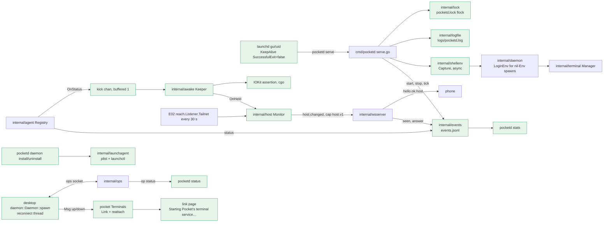

# Always-on Implementation Plan (E04)

> **For Claude:** REQUIRED SUB-SKILL: Use /implement to execute this plan task-by-task.

**Goal:** pocketd runs as a LaunchAgent. It finds the CLIs the login shell finds, keeps the Mac from idle sleep while an Agent works or needs you, and records local metrics. The desktop waits for pocketd instead of exiting.

**Toolset** (paths relative to the repo root `/Users/mingo/Developer/self/anywhere`):
- pocketd, everything (every PR boundary): `cd packages/pocketd && go vet ./... && env -u POCKETD_SOCK go test -race -count=1 ./...`
- pocketd, one test: `cd packages/pocketd && env -u POCKETD_SOCK go test -race -count=1 ./internal/<pkg> -run '<TestName>'` (e2e: `./e2e`; CLI: `./cmd/pocketd`)
- pocketd goldens: `cd packages/pocketd && go test ./internal/proto -update` (also `./internal/launchagent -update`, `./internal/events -update`). Review the diff of `testdata/` after every `-update`.
- protocol: `pnpm --filter @pocket/protocol test`
- desktop, one test: `cd packages/desktop && cargo test -p daemon <name>` or `cargo test -p pocket <name>`
- desktop, full (every PR boundary): `cd packages/desktop && cargo build --workspace && cargo clippy --workspace --all-targets && cargo test --workspace`. No new warnings.
- The shell is fish: quote globs and separators (`echo '----'`). Use `env -u NAME cmd`, not `unset`.

**Scratch pocketd rules** (from 05-roadmap §7; they bind every task):
- Tests and captures start a scratch pocketd with their own `POCKET_HOME`, `POCKETD_SOCK` and port. The e2e harness (`packages/pocketd/e2e/harness_test.go:60-100`) already does this.
- Never start, stop or restart the production pocketd. Never run `pocketd daemon install` or `uninstall` for real: they talk to the owner's launchd. No test calls `launchagent.Install` or `Uninstall`.
- A Pocket Terminal exports `POCKETD_SOCK`. Strip it (`env -u POCKETD_SOCK`) from every command that runs pocketd or its tests.
- Never run the desktop app. Manual acceptance of FR 04-5 (kill pocketd, the window stays, Terminals come back) is the owner's.

**Read first:**
- `docs/designs/2026-09-30-always-on.md`: the design. §5 is the contract, §6 the events schema, §7 the failure table.
- `docs/orchestrators/product/05-roadmap.md` §3 E04 and §4: PR scope and binding dependencies.
- `docs/designs/2026-09-30-reach-lockdown.md` §5 (E02 contract: `proto.Negotiate`, `ServerCaps`, `reach.Listen`, `Listener.Tailnet()`, `peer.InTerminal`, `atomicfile.Write`) and decision 30.
- `docs/designs/2026-09-30-no-self-approval.md` §5 (E03 contract: `peer.Principal`, `peer.With`/`From`, `peer.Needs`, the ops `status` row).
- `docs/adr/0003-desktop-code-layout.md`: where desktop state and logic go (PR4).
- `packages/pocketd/cmd/pocketd/serve.go` (69 lines at 5091a01): PRs 1–3 all edit it.

**Base:** main `5091a01`. Line numbers cite that commit. PRs 1–3 are written against the E02 and E03 contracts; each says when to re-anchor.

**§7.1 override rows** (copied verbatim from 05-roadmap §7.1):

| UX section | Spec says | Winning decision | Text to build |
|---|---|---|---|
| UXD §7 constraint 1 | tokens (Phase 1, incl. dark) before everything | D26 | E16 PR1 (light `Palette`) lands before E08 PR1 and every later desktop component. E01 and E04 PR4 predate it and use the existing constants. Dark waits for S1 |
| UXD §2.0 Palette struct | `Palette` + `LIGHT`/`DARK` statics + `p(cx)` | Owner's dark-theme plan | `theme::Token { light, dark }` consts, read as `theme::X` (`Into<Hsla>`); `Token::pick(dark)` in tests. No `Palette`, no `p(cx)` |
| UXD §7 constraint 1, D26 dark | Dark waits for S1 | Owner's dark-theme plan | Dark ships with the owner's plan and follows macOS appearance; no Appearance action. E16 PR1 lands on top of it |

**Differences from the design** (the design stays as written; these are settled here):
- Rebased on 5091a01: the dark theme has landed. PR4 reads colours as `theme::X` (`TEXT_3`), not `rgba(TEXT_3)`, and adds no `u32` colour parameters. There is no rebase step.
- Rebased on 5091a01: cited lines moved. "This session is not running." is at `packages/desktop/crates/pocket/src/terminal_view/pane.rs:96`.
- `agent.Registry.OnChange func()` becomes `OnStatus func(id, provider, from, to string)`. PR2 uses it to kick the keeper; PR3 uses it to write `status` events. One hook, no second callback.
- `awake.Keeper` takes `After func(time.Duration) <-chan time.Time` (not `Now`), and `Run(ctx, kick, busy func() bool)` (not a list func).
- No non-cgo `Sleeper`. pocketd already needs cgo (`packages/pocketd/internal/vt/vt.go:3-6`).
- No `host.Tailnet`. E02 decision 30 has PR2 read `reach.Listener.Tailnet()`, so the CGNAT test lives in E02.
- `logfile.Open(path, max, keep)` rotates to `path.1` … `path.keep`. The log keeps one old file (`pocketd.log.1`, not `.old`); events keep two.
- `launchagent.Install(s, path, uid)` and `Uninstall(path, uid)` take the plist path, so the CLI owns the home lookup. The plist is written with E02's `atomicfile.Write`.
- Agent statuses are spelled as pocketd sends them: `needsYou`, not `needs_you`.
- install when loaded prints `Updated {plist}. Applies at next login, or run pocketd daemon uninstall then install.` launchd keeps the loaded definition across crash restarts, so "the next restart" was wrong.
- install also refuses an exe under `/tmp` (manual builds go there; macOS empties it).
- shellenv starts the shell with `Setsid`, not only its own group: an interactive zsh in a background group of pocketd's terminal stops on SIGTTOU (verified: 5 s timeout under a pty).
- The `push` event field is `alert`, not `kind` (`kind` is the event kind).
- `seen` and `answer` principals come from E03's `peer.From(ctx)`.
- Desktop: `send(&self, msg: Value) -> bool` keeps its by-value argument, so no call site changes. `Link` holds only `down_since` and lives in `Terminals`. `reconnected()` also drops pending spawn intents, and a `reattach` set makes `listed` attach again (`Sessions::sync` returns only new ids).
- Dependencies: PR2 needs E02 PR1 (caps) and E02 PR2 (`Tailnet()`); PR1 needs PR2 (its `status` reports keep-awake, tailnet and shell env); PR3 needs PR1 and PR2. The roadmap said "none" for PR2 and PR3. The roadmap's weeks already order them this way.
- Roadmap §4 table: update the E04 rows to PR4 → —; PR2 → E02 PR1, E02 PR2; PR1 → E02 PR2, E03 PR3, E04 PR2; PR3 → E04 PR1, E04 PR2. E16 PR5 (needs E04 PR2) now waits on E02 PR1–PR2 too; E06 PR2 already did through E03 PR2.

**Assumptions** (settled; don't re-open):
- PR numbers follow the roadmap because other epics cite them (E06 PR2 and E16 PR5 need PR2; E09 PR5 needs PR4; E10 and E11 need PR1). They merge in the order this file lists them: **PR4 → PR2 → PR1 → PR3**.
- E02 PR1–PR3 and E03 PR1–PR3 merge before the PRs that name them. Where this plan shows a line those PRs wrote (the `reach.Listen` call, `proto.NewHelloOK(…, caps)`), keep it exactly as merged. The `serve.go` and `main.go` diffs are against E02 PR4's result; apply them by context if E03 moved lines.
- `pocketd daemon install` and `uninstall` are never run by an agent. Their logic is tested through `installCheck.refusal` and `launchagent.Plist`.
- `TestIOKitHoldsThenReleases` takes a real idle-sleep assertion for a moment. That is harmless and is the only way to prove the cgo call.
- CLAUDE.md: no comments unless the WHY can't be read from the code. Keep the doc comments this plan gives; add no others.

---

## Architecture



Green boxes are new; the rest exist and change a little.

pocketd `serve` first takes a lock on its home, so a second copy exits with code 75 and leaves the first one alone. It logs to a rotating file, and a stop signal ends it cleanly with exit 0. launchd restarts it only after a crash. In the background it reads the login shell's environment, so Terminals find `claude` and `codex` even under launchd. The agent registry reports every status change. A keeper then holds an IOKit "no idle sleep" assertion while any Agent works or needs you, and lets go two minutes after the last one stops.

A small host monitor tracks two facts, "tailnet" and "keeping awake". It sends them to phones that ask for cap `host.v1`. `events.jsonl` records ids and outcomes only, and `pocketd stats` turns them into the PRD §9 numbers.

The desktop no longer dies when pocketd is missing. A background thread keeps reconnecting and reports "up" or "down". While down, the main area shows "Starting Pocket's terminal service…". Once pocketd is back, every Terminal that still runs is attached again.

## Why this approach

- **One lock file, non-blocking, exit 75.** A blocking wait would look "running" to launchd while serving nothing. A pid file alone goes stale after `kill -9`, and the kernel drops a flock when the process dies.
- **KeepAlive only on failure, ThrottleInterval 30, ProcessType Interactive.** `KeepAlive true` would make a clean stop impossible. The default ProcessType lets launchd throttle the PTYs.
- **install never boots out a loaded service.** Booting it out would close every Terminal. The rewritten plist applies at the next login, or after `uninstall` then `install`.
- **install refuses temp builds, scratch homes and Pocket Terminals.** A plist that points at a deleted `go run` binary would respawn every 30 s forever.
- **Login env: `-l -i -c`, then `-l -c`, then inherited, 5 s each.** The script prints nonce markers around a standalone `env -0`. `printenv` breaks on multiline values. `-l -c` alone misses PATH lines in `.zshrc` (verified). The env stays in memory only (S-5).
- **Capture once at start, again once when a command is missing.** A capture per spawn costs 0.5–1.3 s. Never re-capturing would hide a CLI installed after pocketd started.
- **IOKit through cgo, not `caffeinate -w`.** A killed child would drop the assertion silently, and `keepingAwake` would lie.
- **Hold only while Working or Needs you, with a 2 min linger.** Without the linger the Mac can sleep just as Done arrives, before the phone acts on it.
- **Keeper kicked through a buffered-1 channel.** `OnStatus` runs under the agent's lock, so calling `List()` there would deadlock. A poll would break P-7.
- **`host.v1` is additive and cap-gated; the protocol version stays 3.** A separate request would add a round trip and still need a push; a version bump breaks older phones.
- **The whole events schema now; each epic adds its emitters.** Waiting would churn the golden and leave §9 unmeasurable. Reachability comes from 60 s ticks while keeping awake, because nothing can probe a dead pocketd.
- **Desktop `Daemon::spawn` never fails; it emits `up`/`down` with 200 ms → 2 s backoff.** Wrapping `connect` in `main` would duplicate the reader. Re-attach works by forgetting the old screens and listing again. Queued sends were rejected because stale input would reach a new PTY.
- **Install hint after 10 s down.** A user without the service would otherwise wait forever. Running install from the desktop would be a hidden side effect.

## Tasks at a glance

**PR 4: Desktop survives pocketd restarts: reconnect and re-attach** (lane C, wk 1; depends on nothing). The desktop opens without pocketd, shows a waiting page, and re-attaches Terminals after a restart.

| Task | What | Main files | Risk |
|---|---|---|---|
| 4.1 | `Daemon::spawn`: background connect loop, `up`/`down`, `send` returns whether it was written | `crates/daemon/src/daemon.rs`, `crates/pocket/src/main.rs` | Medium: threads and socket timing |
| 4.2 | `Link` state; `Terminals::reconnected` re-attaches running Terminals; no intent for an unsent spawn | `crates/pocket/src/terminals/link.rs`, `crates/pocket/src/terminals.rs` | Medium: attach bookkeeping |
| 4.3 | Wire `up`/`down` into `on_msg`; the link page with the 10 s hint | `crates/pocket/src/terminals.rs`, `crates/pocket/src/desktop.rs` | Low |

**PR 2: Login-shell env, idle-sleep assertion, `host.v1` host state** (lane P, wk 2; depends on E02 PR1, E02 PR2). Terminals get the login-shell env; the Mac stays awake while Agents work; phones with `host.v1` see host state.

| Task | What | Main files | Risk |
|---|---|---|---|
| 2.1 | `shellenv`: login shell, base env, capture with markers and time limit | `internal/shellenv/` | High: real shells, rc files, timeouts |
| 2.2 | Nil-Env spawns use the captured env; re-capture once on a missing command | `internal/daemon/daemon.go` | Medium |
| 2.3 | `awake.Keeper` and the IOKit sleeper | `internal/awake/` | Medium: cgo |
| 2.4 | `Registry.OnStatus` and `agent.Busy` | `internal/agent/agent.go` | Medium: runs under a lock |
| 2.5 | `proto` host types, cap, goldens; TS schema | `internal/proto/`, `packages/protocol/src/messages.ts` | Low |
| 2.6 | `host.Monitor`; wsserver sends host state; serve wires it all | `internal/host/`, `internal/wsserver/wsserver.go`, `cmd/pocketd/serve.go`, `e2e/harness_test.go` | Medium |

**PR 1: pocketd LaunchAgent: `daemon install/uninstall`, `--version`, `status`, flock, rotating log** (lane P, wk 3; depends on E02 PR2, E03 PR3, PR2). pocketd can run as a login service, and only one copy runs per home.

| Task | What | Main files | Risk |
|---|---|---|---|
| 1.1 | `lock` (flock + pid) and `logfile` (size rotation) | `internal/lock/`, `internal/logfile/` | Low |
| 1.2 | `launchagent`: plist golden, launchctl wrappers | `internal/launchagent/` | Medium: never run for real in tests |
| 1.3 | `--version` string; ops `status` verb | `cmd/pocketd/version.go`, `internal/ops/` | Low |
| 1.4 | CLI: `status`, `daemon install/uninstall`, `--version`; e2e for the offline paths | `cmd/pocketd/{main,status,daemon}.go`, `e2e/` | High: install refusals guard the owner's launchd |
| 1.5 | serve takes the lock, logs to file, exits 0 on a signal, answers `status` | `cmd/pocketd/serve.go`, `e2e/always_on_test.go` | High: exit codes decide launchd's restarts |

**PR 3: `events.jsonl` and `pocketd stats`** (lane P, wk 3; depends on PR1, PR2). pocketd records the §9 events, and `pocketd stats` reports them.

| Task | What | Main files | Risk |
|---|---|---|---|
| 3.1 | `events.Log`: schema, 10 MiB × 3 rotation, 0600 | `internal/events/events.go` | Low |
| 3.2 | `events.Stats` and its text report | `internal/events/stats.go` | Medium: metric definitions |
| 3.3 | Emitters: start, stop, tick, status, seen, answer | `cmd/pocketd/serve.go`, `internal/wsserver/wsserver.go` | Medium |
| 3.4 | `pocketd stats [--since] [--json]`; e2e for a clean SIGTERM | `cmd/pocketd/stats.go`, `e2e/always_on_test.go` | Low |

---

## PR 4: Desktop survives pocketd restarts: reconnect and re-attach

**Scope:** Lane C. `d/daemon` reconnects in the background; `pocket` shows a waiting page while pocketd is down and re-attaches running Terminals when it returns. No pocketd change. Paths below are under `packages/desktop/`.
**Depends on:** nothing.
**Done when:** the desktop full line is green with the new tests, and `main.rs` no longer exits when pocketd is missing.

### Task 4.1: `Daemon::spawn` reconnects in the background

**What & why:** Replace `Daemon::connect`, which fails when pocketd is down and gives up for good when it dies. The new `spawn` never fails. A thread keeps connecting and emits synthetic `up`/`down` messages. It comes first because the UI work builds on these two messages.

**Files:**
- Modify: `crates/daemon/src/daemon.rs:10` (imports), `:166-196` (`Daemon`, `connect`, `send`, `input`)
- Modify: `crates/pocket/src/main.rs:28-31`
- Test: `crates/daemon/src/daemon.rs:318-341` (replace `talks_json_lines_over_the_socket`; add three tests)

**Context:** pocketd speaks JSON lines over a unix socket. `Msg` (`:22-34`) is `#[serde(default)]`, so `Msg { ev: "up".into(), ..Default::default() }` is a valid message. The UI thread must never block on the socket (CLAUDE.md "Desktop performance"), so connects and sleeps stay on the reader thread. `send` today ignores write errors; now it returns `false` when there is no socket or the write fails. Callers that ignore the result need no change (`bool` is not `#[must_use]`). The old "pocketd disconnected" error message goes away: `down` replaces it.

**Step 1: Write the failing tests**

Replace the test at `:318-341` with these, inside `mod tests`:

```rust
    fn sock(name: &str) -> PathBuf {
        let dir = std::env::temp_dir().join(format!("pocket-desktop-{}-{name}", std::process::id()));
        let _ = std::fs::remove_dir_all(&dir);
        std::fs::create_dir_all(&dir).unwrap();
        dir.join("d.sock")
    }

    fn next(rx: &mut UnboundedReceiver<Msg>) -> String {
        block_on(rx.next()).unwrap().ev
    }

    #[test]
    fn talks_json_lines_over_the_socket() {
        let path = sock("talk");
        let ln = UnixListener::bind(&path).unwrap();
        let (d, mut rx) = Daemon::spawn(&path);
        assert_eq!(next(&mut rx), "up");
        let (peer, _) = ln.accept().unwrap();

        assert!(d.input("s1", b"x"));
        let mut line = String::new();
        BufReader::new(peer.try_clone().unwrap()).read_line(&mut line).unwrap();
        assert_eq!(serde_json::from_str::<Value>(&line).unwrap(), json!({"op": "input", "id": "s1", "data": "eA=="}));

        writeln!(&peer, r#"{{"ev":"spawned","id":"s2"}}"#).unwrap();
        let m = block_on(rx.next()).unwrap();
        assert_eq!((m.ev.as_str(), m.id.as_str()), ("spawned", "s2"));
    }

    #[test]
    fn spawn_reports_down_then_up_when_the_socket_appears() {
        let path = sock("appear");
        let (_d, mut rx) = Daemon::spawn(&path);
        assert_eq!(next(&mut rx), "down");
        let _ln = UnixListener::bind(&path).unwrap();
        assert_eq!(next(&mut rx), "up");
    }

    #[test]
    fn spawn_reports_down_when_the_server_closes() {
        let path = sock("close");
        let ln = UnixListener::bind(&path).unwrap();
        let (_d, mut rx) = Daemon::spawn(&path);
        assert_eq!(next(&mut rx), "up");
        drop(ln.accept().unwrap());
        assert_eq!(next(&mut rx), "down");
    }

    #[test]
    fn send_returns_false_while_down() {
        let path = sock("down");
        let (d, mut rx) = Daemon::spawn(&path);
        assert_eq!(next(&mut rx), "down");
        assert!(!d.send(json!({"op": "list"})));
        assert!(!d.input("s1", b"x"));
    }
```

They prove: messages still flow both ways; a missing socket reports `down`, then `up` once it appears; a closed server reports `down`; sending while down reports failure.

**Step 2: Run the tests to verify they fail**

Run: `cd packages/desktop && cargo test -p daemon spawn`
Expected: FAIL to compile with error[E0599] naming "`spawn` found for struct `Daemon`" (rustc words the start as "no function or associated item named" or "no associated function or constant named", by version).

**Step 3: Write the implementation**

Add `use std::time::Duration;` after `use std::sync::{Arc, Mutex, OnceLock};` (`:10`). Replace `:166-196` with:

```rust
#[derive(Clone)]
pub struct Daemon {
    writer: Arc<Mutex<Option<UnixStream>>>,
}

impl Daemon {
    /// Connects in the background and keeps reconnecting, reporting each change as a `Msg` with `ev` "up" or "down".
    pub fn spawn(path: &Path) -> (Self, UnboundedReceiver<Msg>) {
        let path = path.to_path_buf();
        let writer = Arc::new(Mutex::new(None));
        let (tx, rx) = unbounded();
        let shared = writer.clone();
        std::thread::spawn(move || {
            let link = |ev: &str| tx.unbounded_send(Msg { ev: ev.into(), ..Default::default() }).is_ok();
            let mut wait = Duration::from_millis(200);
            let mut down = false;
            loop {
                if let Ok((reader, stream)) = UnixStream::connect(&path).and_then(|s| Ok((BufReader::new(s.try_clone()?), s))) {
                    *shared.lock().unwrap() = Some(stream);
                    down = false;
                    if !link("up") {
                        return;
                    }
                    wait = Duration::from_millis(200);
                    for line in reader.lines().map_while(Result::ok) {
                        let Ok(msg) = serde_json::from_str::<Msg>(&line) else { continue };
                        if tx.unbounded_send(msg).is_err() {
                            return;
                        }
                    }
                    *shared.lock().unwrap() = None;
                }
                if !down {
                    if !link("down") {
                        return;
                    }
                    down = true;
                }
                if tx.is_closed() {
                    return;
                }
                std::thread::sleep(wait);
                wait = (wait * 2).min(Duration::from_secs(2));
            }
        });
        (Self { writer }, rx)
    }

    /// Whether the message reached pocketd's socket; false while it is down.
    pub fn send(&self, msg: Value) -> bool {
        self.writer.lock().unwrap().as_mut().is_some_and(|w| writeln!(w, "{msg}").is_ok())
    }

    pub fn input(&self, id: &str, bytes: &[u8]) -> bool {
        self.send(json!({"op": "input", "id": id, "data": STANDARD.encode(bytes)}))
    }
}
```

In `crates/pocket/src/main.rs`, replace `:28-31`:

```rust
    let (daemon, mut rx) = Daemon::connect(&path).unwrap_or_else(|e| {
        eprintln!("pocket-desktop: cannot reach pocketd at {}: {e}", path.display());
        std::process::exit(1)
    });
```

with:

```rust
    let (daemon, mut rx) = Daemon::spawn(&path);
```

Until Task 4.3, `up` and `down` reach `on_msg`'s `_ => self.terminals.sessions.apply(&m)` arm, which ignores them (no id).

**Step 4: Run the tests to verify they pass**

Run: `cd packages/desktop && cargo test -p daemon && cargo build --workspace`
Expected: PASS (every `daemon` test, including the four above); build succeeds.

### Task 4.2: `Link` state and re-attach bookkeeping in `Terminals`

**What & why:** Add the plain state the UI needs: whether pocketd is down and since when, and which Terminals to attach again. `reconnected()` clears each running session's screen and marks it for re-attach, because a new socket has no attaches. `listed()` then returns those ids even though `Sessions::sync` already knows them. A spawn that never reached pocketd records no intent. All of it is testable without GPUI (ADR 0003).

**Files:**
- Create: `crates/pocket/src/terminals/link.rs`
- Modify: `crates/pocket/src/terminals.rs:1-8` (mod, imports), `:16-23` (struct), `:26-28` (`new`), `:30-37` (`listed`); add methods after `listed`
- Test: `crates/pocket/src/terminals/link.rs` (`mod tests`), `crates/pocket/src/terminals.rs` `mod tests` (helpers after `exit` at `:202-204`, tests at the end before `:328`)

**Context:** `Terminals` (`terminals.rs:16-23`) holds `sessions: Sessions` (`terminals/sessions.rs`), pending spawn `intents` and the `closed` set. `Sessions::sync(items)` (`sessions.rs:29-42`) adopts pocketd's list and returns only ids it did not know, which are the ones to `attach`. A session's `term` is its screen; `None` renders "Connecting…" (`terminal_view/pane.rs:96`). A session missing from the list is dropped by `sync`, and its pane shows "This session is not running.". Exited sessions (`exit.is_some()`) stay to be read and are not re-attached. Pending intents belong to the lost socket: pocketd will never answer them on the new one.

**Step 1: Write the failing tests**

Create `crates/pocket/src/terminals/link.rs` with only the test first:

```rust
#[cfg(test)]
mod tests {
    use super::*;

    #[test]
    fn the_install_hint_waits_ten_seconds_from_the_first_down() {
        let t = Instant::now();
        let mut l = Link::default();
        l.down(t);
        l.down(t + Duration::from_secs(5));
        assert_eq!((l.is_down(), l.hint(t + Duration::from_secs(9)), l.hint(t + HINT_AFTER)), (true, false, true));
        l.up();
        assert_eq!((l.is_down(), l.hint(t + HINT_AFTER)), (false, false));
    }
}
```

In `terminals.rs` `mod tests`, add after the `exit` helper (`:202-204`):

```rust
    fn snapshot(id: &str) -> Msg {
        Msg { ev: "snapshot".into(), id: id.into(), cols: 80, rows: 24, ..Default::default() }
    }
```

and at the end of `mod tests`:

```rust
    #[test]
    fn reconnected_reattaches_every_listed_terminal() {
        let mut t = Terminals::new();
        t.listed(vec![info("a"), info("b"), info("c")]);
        t.sessions.apply(&snapshot("a"));
        t.exited(&exit("c", 1));
        t.reconnected();
        assert!(t.sessions.get("a").is_some_and(|s| s.term.is_none()));
        assert_eq!(t.listed(vec![info("a"), info("b")]), vec!["a", "b"]);
        assert_eq!(t.listed(vec![info("a"), info("b")]), Vec::<String>::new());
    }

    #[test]
    fn a_terminal_missing_after_reconnect_is_not_running() {
        let mut t = Terminals::new();
        t.listed(vec![info("a"), info("b")]);
        t.reconnected();
        assert_eq!(t.listed(vec![info("b")]), vec!["b"]);
        assert!(t.sessions.get("a").is_none());
    }

    #[test]
    fn reconnected_drops_spawns_the_lost_connection_never_answered() {
        let mut t = Terminals::new();
        t.intents.push_back(Intent::Tab("/w".into()));
        t.reconnected();
        assert_eq!(t.spawned("a"), None);
    }

    #[test]
    fn failed_spawn_send_records_no_intent() {
        let mut t = Terminals::new();
        t.spawn_sent(false, Intent::Tab("/w".into()));
        t.spawn_sent(true, Intent::Tab("/v".into()));
        assert_eq!(t.spawned("a"), Some(("/v".to_string(), None)));
    }
```

They prove: the hint shows 10 s after the first `down` and never while up; every running Terminal is attached once more after a reconnect; a Terminal pocketd lost is dropped; stale intents are dropped; an unsent spawn leaves no intent.

**Step 2: Run the tests to verify they fail**

Run: `cd packages/desktop && cargo test -p pocket reconnect`
Expected: FAIL to compile: "no method named `reconnected` found for struct `Terminals`" (and `link` is not a module yet).

**Step 3: Write the implementation**

Put this above the test module in `crates/pocket/src/terminals/link.rs`:

```rust
use std::time::{Duration, Instant};

/// How long pocketd may stay down before the page suggests installing its service.
pub(crate) const HINT_AFTER: Duration = Duration::from_secs(10);

/// Whether the socket to pocketd is up, and since when it has been down.
#[derive(Default)]
pub(crate) struct Link {
    down_since: Option<Instant>,
}

impl Link {
    pub(crate) fn down(&mut self, now: Instant) {
        self.down_since.get_or_insert(now);
    }

    pub(crate) fn up(&mut self) {
        self.down_since = None;
    }

    pub(crate) fn is_down(&self) -> bool {
        self.down_since.is_some()
    }

    pub(crate) fn hint(&self, now: Instant) -> bool {
        self.down_since.is_some_and(|t| now.duration_since(t) >= HINT_AFTER)
    }
}
```

In `terminals.rs`, make the top of the file read:

```rust
pub(crate) mod link;
pub(crate) mod sessions;

use crate::desktop::Desktop;
use crate::terminals::link::Link;
use crate::terminals::sessions::Sessions;
```

Add two fields at the end of `struct Terminals` (after `setups`, `:22`):

```rust
    /// Running terminals to attach again once pocketd lists them after a reconnect.
    pub(crate) reattach: HashSet<String>,
    pub(crate) link: Link,
```

Replace `new` (`:26-28`) with:

```rust
    pub fn new() -> Self {
        Self {
            sessions: Sessions::default(),
            intents: VecDeque::new(),
            closed: HashSet::new(),
            sized: HashMap::new(),
            setups: HashMap::new(),
            reattach: HashSet::new(),
            link: Link::default(),
        }
    }
```

Replace the body of `listed` (`:31-36`, keep its doc comment and signature) with:

```rust
        let items: Vec<Info> = items.into_iter().filter(|i| !self.closed.contains(&i.id)).collect();
        let again: Vec<String> = items.iter().filter(|i| self.reattach.contains(&i.id)).map(|i| i.id.clone()).collect();
        self.reattach.clear();
        let mut attach = self.sessions.sync(items);
        attach.extend(again);
        let sessions = &self.sessions;
        self.setups.retain(|id, _| sessions.get(id).is_some());
        attach
```

Add after `listed`:

```rust
    /// A new connection to pocketd has no attaches, and the lost one answers no pending spawns.
    /// Running terminals show "Connecting…" until their next screen.
    pub(crate) fn reconnected(&mut self) {
        self.link.up();
        self.intents.clear();
        for s in self.sessions.items.iter_mut().filter(|s| s.exit.is_none()) {
            s.term = None;
            self.reattach.insert(s.info.id.clone());
        }
    }

    pub(crate) fn spawn_sent(&mut self, sent: bool, intent: Intent) {
        if sent {
            self.intents.push_back(intent);
        }
    }
```

**Step 4: Run the tests to verify they pass**

Run: `cd packages/desktop && cargo test -p pocket terminals`
Expected: PASS (every `terminals` test, old and new, plus `the_install_hint_waits_ten_seconds_from_the_first_down`).

### Task 4.3: Show the link page and re-attach on `up`

**What & why:** Connect the messages to the state. `up` re-attaches and asks for the list at once; `down` shows the waiting page and schedules one redraw at 10 s so the hint appears. `send_spawn` records an intent only if the spawn was sent. This is last because it only wires tested pieces together.

**Files:**
- Modify: `crates/pocket/src/terminals.rs:9` (imports), `:107-112` (`on_msg`, after the `"exit"` arm), `:127-132` (`send_spawn`)
- Modify: `crates/pocket/src/desktop.rs:24` (imports), `:272-281` (`main_view`); add `link_page` before `blank_page` (`:283`)
- Test: none new (views and GPUI wiring; no render tests). The Task 4.2 tests cover the logic.

**Context:** `on_msg` (`terminals.rs:86-115`) dispatches pocketd messages and ends with `cx.notify()`. The 1 s poll in `main.rs:73-88` sends `list` anyway; sending it on `up` saves up to a second. The page copies `blank_page`'s layout (`desktop.rs:283-304`) and its `TEXT_3` colour (a `theme::Token` since the dark theme; no `rgba`). `MONO` is the monospace font constant from `theme`. On `up`, the mouse selection (`Desktop.terminal.selection`, `terminal_view.rs:23`) is cleared: it indexes cells of a `Term` that `reconnected` drops. Copy: line 1 "Starting Pocket's terminal service…" (UXD); after 10 s "Not running? In Terminal:" and `pocketd daemon install` in mono (design §3).

**Step 1: Write the implementation**

In `terminals.rs`, add `use std::time::Instant;` after `use std::collections::{HashMap, HashSet, VecDeque};`. In `on_msg`, add after the `"exit"` arm (before `_ => self.terminals.sessions.apply(&m),`):

```rust
            "up" => {
                self.terminals.reconnected();
                self.terminal.selection = None;
                self.daemon.send(json!({"op": "list"}));
            }
            "down" => {
                self.terminals.link.down(Instant::now());
                cx.spawn(async |this, cx| {
                    cx.background_executor().timer(link::HINT_AFTER).await;
                    this.update(cx, |_, cx| cx.notify())
                })
                .detach();
            }
```

In `send_spawn`, replace:

```rust
        self.daemon.send(op);
        self.terminals.intents.push_back(intent);
```

with:

```rust
        let sent = self.daemon.send(op);
        self.terminals.spawn_sent(sent, intent);
```

In `desktop.rs`, add `use std::time::Instant;` after `use std::collections::HashMap;` (`:24`). Make the first arm of the `match` in `main_view` (`:273`):

```rust
            _ if self.terminals.link.is_down() => self.link_page(cx),
```

Add before `fn blank_page`:

```rust
    fn link_page(&self, cx: &mut Context<Self>) -> Div {
        let hint = self.terminals.link.hint(Instant::now());
        div().flex_1().flex().flex_col().child(self.page_bar(vec!["Sessions".into()], Vec::new(), div(), cx)).child(
            div()
                .flex_1()
                .flex()
                .flex_col()
                .items_center()
                .justify_center()
                .gap(px(6.))
                .text_size(px(14.))
                .text_color(TEXT_3)
                .child("Starting Pocket's terminal service…")
                .when(hint, |d| d.child("Not running? In Terminal:").child(div().font_family(MONO).child("pocketd daemon install"))),
        )
    }
```

**Step 2: Run the desktop full line**

Run: `cd packages/desktop && cargo build --workspace && cargo clippy --workspace --all-targets && cargo test --workspace`
Expected: build succeeds; clippy reports no new warnings in `daemon.rs`, `terminals.rs`, `terminals/link.rs`, `desktop.rs` or `main.rs`; all tests pass.

If another worktree shares `CARGO_TARGET_DIR`, add `--config profile.dev.package.daemon.debug=1` to each cargo command so its `daemon` build does not overwrite theirs mid-run.

**Step 3: Owner check (not for agents)**

List for the owner in the PR body: start the desktop with pocketd stopped → the page shows, and after 10 s the hint; start pocketd → Terminals list; stop and start pocketd → surviving Terminals show "Connecting…" then their screen, and vanished ones show "This session is not running.".

---

## PR 2: Login-shell env, idle-sleep assertion, `host.v1` host state

**Scope:** Lane P plus the protocol package. Terminals spawned without an env get the login shell's env. The Mac stays awake while an Agent works or needs you. Phones that negotiate `host.v1` get `hello.ok.host` and `host.changed`. Paths are under `packages/pocketd/` unless they start with `packages/`.
**Depends on:** E02 PR1 (`caps` on hello, `proto.ServerCaps`, `Negotiate`), E02 PR2 (`reach.Listen`, `Listener.Tailnet()`). Re-anchor line numbers after E02 PR1 and E02 PR2 merge.
**Done when:** the pocketd full line and `pnpm --filter @pocket/protocol test` are green. `hello_ok_host.json` and `host_changed.json` exist in both golden runs. Owner check, not for agents: while an Agent works, `pmset -g assertions` lists "Pocket: an agent is working", and the entry is gone about 2 minutes after the Agent finishes.

### Task 2.1: `shellenv`: read the login shell's environment

**What & why:** Under launchd, pocketd inherits a bare env, so `claude` and `codex` are not on PATH. This package runs the user's login shell once, reads its env between random markers, and falls back safely. It comes first because 2.2 feeds its result to spawns.

**Files:**
- Create: `internal/shellenv/shellenv.go`
- Test: `internal/shellenv/shellenv_test.go`

**Context:**
- **Login shell:** read it from the account (`getpwuid`), not `$SHELL`. `$SHELL` is whatever started pocketd.
- **Base env:** the same basics the desktop gives a new Terminal (`packages/desktop/crates/daemon/src/daemon.rs` `terminal_env_in`, `:81-92`). No `TMUX`, no `POCKETD_SOCK` and no PATH from the terminal that ran `pocketd serve`.
- **Order:** `-l -i -c` first, so zsh reads `.zshrc`, where most PATH lines live. Then `-l -c`, in case an interactive rc hangs. Then pocketd's own env.
- **Time limit:** each attempt gets 5 s. The shell runs in its own session (`Setsid`), so it leads its own process group: a hung rc's children die too and release stdout. `Setpgid` alone would leave `-i` shells in a background group of pocketd's terminal, where zsh stops on SIGTTOU/SIGTTIN when `pocketd serve` runs in a Terminal.
- **Parsing:** `env -0` separates values with NUL, so multiline values survive. rc files may print banners, so only the text between the nonce markers counts.
- **Privacy:** the env is never written to disk.

**Step 1: Write the failing tests**

```go
package shellenv

import (
	"context"
	"os"
	"path/filepath"
	"reflect"
	"slices"
	"strings"
	"testing"
	"time"
)

func TestParseKeepsMultilineValues(t *testing.T) {
	out := []byte("Bn1A=1\x00MULTI=line1\nline2\x00PWD=/x\x00SHLVL=2\x00_=/usr/bin/env\x00En1")
	got, err := Parse(out, "n1")
	if err != nil || !reflect.DeepEqual(got, []string{"A=1", "MULTI=line1\nline2"}) {
		t.Fatalf("%q %v", got, err)
	}
}

func TestParseIgnoresNoiseOutsideSentinels(t *testing.T) {
	out := []byte("Last login: today\nwelcome\x00Bn1A=1\x00En1\ngoodbye")
	got, err := Parse(out, "n1")
	if err != nil || !reflect.DeepEqual(got, []string{"A=1"}) {
		t.Fatalf("%q %v", got, err)
	}
}

func TestParseRejectsAMissingEndSentinel(t *testing.T) {
	if _, err := Parse([]byte("Bn1A=1\x00"), "n1"); err == nil {
		t.Fatal("a cut-off env parsed")
	}
	if _, err := Parse([]byte("A=1\x00En1"), "n1"); err == nil {
		t.Fatal("an env without a start parsed")
	}
}

func TestBaseKeepsTheAccountNotTheLaunchingTerminal(t *testing.T) {
	got := Base([]string{"HOME=/h", "USER=u", "TMUX=/tmp/t", "PATH=/somewhere", "TERM=tmux-256color", "POCKETD_SOCK=/s"}, "/bin/zsh")
	want := []string{"HOME=/h", "USER=u", "LANG=en_US.UTF-8", "PATH=/usr/bin:/bin:/usr/sbin:/sbin", "SHELL=/bin/zsh", "TERM=xterm-256color", "COLORTERM=truecolor", "TERM_PROGRAM=Pocket"}
	if !reflect.DeepEqual(got, want) {
		t.Fatalf("%q", got)
	}
}

func home(t *testing.T, files map[string]string) string {
	t.Helper()
	dir := t.TempDir()
	for name, body := range files {
		path := filepath.Join(dir, name)
		os.MkdirAll(filepath.Dir(path), 0o700)
		if err := os.WriteFile(path, []byte(body), 0o600); err != nil {
			t.Fatal(err)
		}
	}
	return dir
}

func need(t *testing.T, shell string) {
	t.Helper()
	if _, err := os.Stat(shell); err != nil {
		t.Skip(shell + " not installed")
	}
}

func get(env []string, key string) string {
	i := slices.IndexFunc(env, func(kv string) bool { return strings.HasPrefix(kv, key+"=") })
	if i < 0 {
		return ""
	}
	return strings.TrimPrefix(env[i], key+"=")
}

func capture(dir, shell string, limit time.Duration) Result {
	return Capture(context.Background(), shell, Base([]string{"HOME=" + dir, "USER=" + os.Getenv("USER")}, shell), limit)
}

func TestZshLoginEnvIncludesRcPath(t *testing.T) {
	need(t, "/bin/zsh")
	dir := home(t, map[string]string{
		".zprofile": "echo profile noise\n",
		".zshrc":    "echo rc noise\nexport PATH=\"$HOME/rcbin:$PATH\"\nexport POCKET_MULTI=$'line1\\nline2'\n",
	})
	r := capture(dir, "/bin/zsh", 5*time.Second)
	if r.Mode != "interactive" || !strings.HasPrefix(get(r.Env, "PATH"), dir+"/rcbin:") || get(r.Env, "POCKET_MULTI") != "line1\nline2" {
		t.Fatalf("%s %q", r, r.Env)
	}
}

func TestFishLoginEnvIncludesConfigPath(t *testing.T) {
	fish := "/opt/homebrew/bin/fish"
	need(t, fish)
	dir := home(t, map[string]string{
		".config/fish/config.fish": "echo fish noise\nset -gx PATH $HOME/rcbin $PATH\nset -gx POCKET_MULTI line1\\nline2\n",
	})
	r := capture(dir, fish, 5*time.Second)
	if r.Mode != "interactive" || !strings.HasPrefix(get(r.Env, "PATH"), dir+"/rcbin:") || get(r.Env, "POCKET_MULTI") != "line1\nline2" {
		t.Fatalf("%s %q", r, r.Env)
	}
}

func TestCaptureGivesUpAfterTheLimit(t *testing.T) {
	need(t, "/bin/zsh")
	dir := home(t, map[string]string{".zprofile": "sleep 10\n"})
	r := capture(dir, "/bin/zsh", time.Second)
	if r.Mode != "inherited" || r.Err != "interactive: timeout; login: timeout" || r.Took > 4*time.Second {
		t.Fatalf("%s took %s", r, r.Took)
	}
}

func TestCaptureFallsBackToALoginShellWhenRcHangs(t *testing.T) {
	need(t, "/bin/zsh")
	dir := home(t, map[string]string{".zshrc": "sleep 10\n"})
	r := capture(dir, "/bin/zsh", time.Second)
	if r.Mode != "login" || get(r.Env, "HOME") != dir {
		t.Fatalf("%s %q", r, r.Env)
	}
}

func TestLoginShellIsAnAbsolutePath(t *testing.T) {
	if s := LoginShell(); !filepath.IsAbs(s) {
		t.Fatal(s)
	}
}
```

These tests use a temp `HOME`, so the owner's rc files never run. They prove that:
- multiline values survive;
- banners are ignored;
- a cut-off capture is rejected;
- the base env drops the launching terminal's variables;
- PATH lines from `.zshrc` and `config.fish` are picked up;
- a hanging `.zprofile` gives up in time;
- a hanging `.zshrc` falls back to a login shell.

**Step 2: Run the tests to verify they fail**

Run: `cd packages/pocketd && env -u POCKETD_SOCK go test -race -count=1 ./internal/shellenv`
Expected: FAIL with `undefined: Parse` (and `Base`, `Capture`, `Result`, `LoginShell`).

**Step 3: Write the implementation**

`internal/shellenv/shellenv.go`:

```go
// Package shellenv reads the env the user's login shell builds, so a pocketd
// started by launchd finds the same CLIs their terminal does.
package shellenv

/*
#include <pwd.h>
#include <unistd.h>
*/
import "C"

import (
	"bytes"
	"cmp"
	"context"
	"crypto/rand"
	"encoding/hex"
	"errors"
	"fmt"
	"os"
	"os/exec"
	"strings"
	"syscall"
	"time"
)

type Result struct {
	Env  []string
	Mode string // "interactive", "login" or "inherited"
	Took time.Duration
	Err  string
}

func (r Result) String() string {
	if r.Err != "" {
		return fmt.Sprintf("%s (%s)", r.Mode, r.Err)
	}
	return fmt.Sprintf("%s %s", r.Mode, r.Took.Round(10*time.Millisecond))
}

// LoginShell is the shell set with chsh; $SHELL is whatever launched pocketd.
func LoginShell() string {
	if pw := C.getpwuid(C.getuid()); pw != nil && pw.pw_shell != nil {
		if s := C.GoString(pw.pw_shell); s != "" {
			return s
		}
	}
	return "/bin/zsh"
}

var kept = []string{"HOME", "USER", "LOGNAME", "TMPDIR", "SSH_AUTH_SOCK", "__CF_USER_TEXT_ENCODING"}

// Base is the env a new Terminal.app window starts from, as the desktop
// builds it (terminal_env): the account's basics and nothing from the
// terminal pocketd was started in.
func Base(environ []string, shell string) []string {
	have := map[string]string{}
	for _, kv := range environ {
		if k, v, ok := strings.Cut(kv, "="); ok && v != "" {
			have[k] = v
		}
	}
	var out []string
	for _, k := range kept {
		if v, ok := have[k]; ok {
			out = append(out, k+"="+v)
		}
	}
	return append(out,
		"LANG="+cmp.Or(have["LANG"], "en_US.UTF-8"),
		"PATH=/usr/bin:/bin:/usr/sbin:/sbin",
		"SHELL="+shell,
		"TERM=xterm-256color",
		"COLORTERM=truecolor",
		"TERM_PROGRAM=Pocket",
	)
}

// Capture runs the login shell interactively (so zsh reads .zshrc), then as a
// plain login shell, each within limit. If both fail it keeps os.Environ().
func Capture(ctx context.Context, shell string, env []string, limit time.Duration) Result {
	start := time.Now()
	var errs []string
	for _, m := range []struct {
		mode  string
		flags []string
	}{{"interactive", []string{"-l", "-i", "-c"}}, {"login", []string{"-l", "-c"}}} {
		got, err := run(ctx, shell, m.flags, env, limit)
		if err == nil {
			return Result{Env: got, Mode: m.mode, Took: time.Since(start)}
		}
		errs = append(errs, m.mode+": "+err.Error())
	}
	return Result{Env: os.Environ(), Mode: "inherited", Took: time.Since(start), Err: strings.Join(errs, "; ")}
}

// env -0 refuses to run a command, so it runs on its own between the markers.
const script = `/usr/bin/printf "%%s" B%[1]s; /usr/bin/env -0; /usr/bin/printf "%%s" E%[1]s`

func run(ctx context.Context, shell string, flags, env []string, limit time.Duration) ([]string, error) {
	var b [8]byte
	rand.Read(b[:])
	nonce := hex.EncodeToString(b[:])
	ctx, cancel := context.WithTimeout(ctx, limit)
	defer cancel()
	cmd := exec.CommandContext(ctx, shell, append(flags, fmt.Sprintf(script, nonce))...)
	cmd.Env = env
	// A session without a controlling tty, so an interactive shell can't stop on
	// SIGTTOU/SIGTTIN; it leads its own group, so a hung rc's children die with it.
	cmd.SysProcAttr = &syscall.SysProcAttr{Setsid: true}
	cmd.Cancel = func() error { return syscall.Kill(-cmd.Process.Pid, syscall.SIGKILL) }
	cmd.WaitDelay = time.Second
	out, err := cmd.Output()
	if ctx.Err() != nil {
		return nil, errors.New("timeout")
	}
	got, perr := Parse(out, nonce)
	if perr != nil && err != nil {
		return nil, err
	}
	return got, perr
}

var dropped = map[string]bool{"PWD": true, "OLDPWD": true, "SHLVL": true, "_": true}

// Parse reads the NUL-separated env between the markers; rc output around them is ignored.
func Parse(out []byte, nonce string) ([]string, error) {
	begin, end := []byte("B"+nonce), []byte("E"+nonce)
	i := bytes.Index(out, begin)
	if i < 0 {
		return nil, errors.New("no start marker")
	}
	body := out[i+len(begin):]
	j := bytes.LastIndex(body, end)
	if j < 0 {
		return nil, errors.New("no end marker")
	}
	var env []string
	for _, kv := range bytes.Split(body[:j], []byte{0}) {
		k, _, ok := bytes.Cut(kv, []byte("="))
		if ok && len(k) > 0 && !dropped[string(k)] {
			env = append(env, string(kv))
		}
	}
	return env, nil
}
```

**Step 4: Run the tests to verify they pass**

Run: `cd packages/pocketd && env -u POCKETD_SOCK go test -race -count=1 ./internal/shellenv -v`
Expected: `ok  pocketd/internal/shellenv`. All 9 tests PASS; `TestFishLoginEnvIncludesConfigPath` shows SKIP only if fish is not at `/opt/homebrew/bin/fish`. Total time is under 10 s.

### Task 2.2: Spawns without an env use the login-shell env

**What & why:** `Daemon.Spawn` gives a nil-Env spawn `os.Environ()` today (`internal/daemon/daemon.go:36-38`). Now it gets the captured env. A command missing from PATH triggers one fresh capture and one retry, so a CLI installed after pocketd started is found.

**Files:**
- Modify: `internal/daemon/daemon.go:4-17` (imports), `:19-32` (struct: `Capture` after `Plugin` at `:26`, `env` after `mu` at `:28`), `:34-41` (`Spawn`)
- Test: `internal/daemon/daemon_test.go` (imports `:3-16`; append after `:148`)

**Context:**
- **Capture timing:** runs once at start (`go d.Recapture()` in serve, Task 2.6). Until it lands, spawns keep `os.Environ()`, so nothing waits on a slow rc file.
- **Who is affected:** only spawns that send no `env`. The desktop sends `terminal_env` and `pocketd run` sends `os.Environ()` (`cmd/pocketd/run.go:23`), so none do today; E06's phone-created Terminals will.
- **Missing command:** `terminal.Manager.Spawn` wraps the `exec.LookPath` error, so `errors.Is(err, exec.ErrNotFound)` holds. `d.Env(env, id)` (`internal/daemon/plugin.go:65`) still adds the Pocket variables afterwards.
- **`ShellEnv()`:** feeds `pocketd status` in PR1.

**Step 1: Write the failing tests**

Add to the imports of `daemon_test.go`: `"errors"`, `"os"`, `"os/exec"`, `"path/filepath"`, `"pocketd/internal/ops"`, `"pocketd/internal/shellenv"`. Append:

```go
func TestSpawnWithoutEnvUsesTheLoginEnv(t *testing.T) {
	d := newDaemon(t)
	d.Capture = func() shellenv.Result {
		return shellenv.Result{Env: []string{"PATH=/usr/bin:/bin", "POCKET_LOGIN=yes"}, Mode: "interactive"}
	}
	d.Recapture()
	term, err := d.Spawn(ops.Msg{Cmd: "sh", Args: []string{"-c", "echo login=$POCKET_LOGIN.; sleep 30"}})
	if err != nil {
		t.Fatal(err)
	}
	defer term.Close()
	eventually(t, "login env in the terminal", func() bool { return strings.Contains(term.Screen(), "login=yes.") })
	if d.ShellEnv() != "interactive 0s" {
		t.Fatalf("status %q", d.ShellEnv())
	}
}

func TestSpawnRecapturesOnceWhenTheCommandIsMissing(t *testing.T) {
	bin := t.TempDir()
	os.WriteFile(filepath.Join(bin, "newtool"), []byte("#!/bin/sh\nsleep 30\n"), 0o755)
	d := newDaemon(t)
	captures := 0
	d.Capture = func() shellenv.Result {
		captures++
		path := "PATH=/usr/bin:/bin"
		if captures > 1 {
			path += ":" + bin
		}
		return shellenv.Result{Env: []string{path}, Mode: "interactive"}
	}
	d.Recapture()
	term, err := d.Spawn(ops.Msg{Cmd: "newtool"})
	if err != nil {
		t.Fatal(err)
	}
	defer term.Close()
	if captures != 2 {
		t.Fatalf("captures %d, want 2: installed after the first capture", captures)
	}
	if _, err := d.Spawn(ops.Msg{Cmd: "nosuchtool"}); !errors.Is(err, exec.ErrNotFound) {
		t.Fatalf("err %v", err)
	}
	if captures != 3 {
		t.Fatalf("captures %d, want 3: one retry per missing command", captures)
	}
}
```

**Step 2: Run the tests to verify they fail**

Run: `cd packages/pocketd && env -u POCKETD_SOCK go test -race -count=1 ./internal/daemon -run 'TestSpawn'`
Expected: FAIL with `d.Capture undefined (type *Daemon has no field or method Capture)`.

**Step 3: Write the implementation**

Add `"errors"`, `"log"`, `"os/exec"` and `"pocketd/internal/shellenv"` to the imports. In `struct Daemon`, after `Plugin    string`:

```go
	// Capture reads the user's login-shell environment. Nil keeps pocketd's own.
	Capture func() shellenv.Result
```

and after `mu       sync.Mutex`:

```go
	env      *shellenv.Result
```

Replace `Spawn` (`:34-41`) with:

```go
// Spawn starts m in a terminal. Without m.Env it gets the login-shell
// environment, read again once if the command isn't on its PATH, so a tool
// installed after pocketd started is found.
func (d *Daemon) Spawn(m ops.Msg) (*terminal.Terminal, error) {
	t, err := d.spawn(m)
	if errors.Is(err, exec.ErrNotFound) && m.Env == nil && d.Capture != nil {
		d.Recapture()
		t, err = d.spawn(m)
	}
	return t, err
}

func (d *Daemon) spawn(m ops.Msg) (*terminal.Terminal, error) {
	spec := terminal.Spec{ID: terminal.NewID(), Cmd: m.Cmd, Args: m.Args, Cwd: m.Cwd, Env: m.Env, Cols: m.Cols, Rows: m.Rows}
	if spec.Env == nil {
		spec.Env = d.LoginEnv()
	}
	spec.Env = d.Env(spec.Env, spec.ID)
	return d.Terminals.Spawn(spec)
}

func (d *Daemon) Recapture() {
	r := d.Capture()
	if r.Err != "" {
		log.Printf("login shell env: %s", r)
	}
	d.mu.Lock()
	d.env = &r
	d.mu.Unlock()
}

// LoginEnv is pocketd's own environment until the first capture lands.
func (d *Daemon) LoginEnv() []string {
	d.mu.Lock()
	defer d.mu.Unlock()
	if d.env == nil {
		return os.Environ()
	}
	return d.env.Env
}

// ShellEnv describes the last capture for pocketd status.
func (d *Daemon) ShellEnv() string {
	d.mu.Lock()
	defer d.mu.Unlock()
	if d.env == nil {
		return "pending"
	}
	return d.env.String()
}
```

`Recapture` logs the mode and error only, never the env.

**Step 4: Run the tests to verify they pass**

Run: `cd packages/pocketd && env -u POCKETD_SOCK go test -race -count=1 ./internal/daemon`
Expected: `ok  pocketd/internal/daemon`.

### Task 2.3: `awake`: hold an idle-sleep assertion while busy

**What & why:** A sleeping Mac drops the phone's link mid-task. The `Keeper` holds a `PreventUserIdleSystemSleep` assertion while `busy()` holds. It releases the assertion `Linger` after `busy()` goes false, so the Mac does not sleep just as Done arrives. It is driven by kicks, not polls (P-7).

**Files:**
- Create: `internal/awake/awake.go`, `internal/awake/iokit.go`
- Test: `internal/awake/awake_test.go`

**Context:**
- **Kicks:** each kick re-reads `busy()`. Task 2.6 sends one on every Agent status change.
- **Fake timer:** `After` is injected, so a test fires the linger timer itself with no real waiting.
- **Failed calls:** if `Hold` or `Release` fails, the Keeper logs it and keeps its old state, so `OnHeld` never reports a hold that didn't happen.
- **Crash safety:** the kernel drops the assertion when pocketd dies, so a crash can't leave the Mac awake forever.
- **Real IOKit test:** `TestIOKitHoldsThenReleases` takes a real assertion for a moment. That is harmless.

**Step 1: Write the failing tests**

```go
package awake

import (
	"context"
	"sync/atomic"
	"testing"
	"time"
)

type fakeSleeper struct{ calls chan string }

func (s fakeSleeper) Hold(string) error { s.calls <- "hold"; return nil }
func (s fakeSleeper) Release() error    { s.calls <- "release"; return nil }

type rig struct {
	calls  chan string
	kick   chan struct{}
	linger chan time.Time
	busy   atomic.Bool
}

func start(t *testing.T) *rig {
	r := &rig{calls: make(chan string, 8), kick: make(chan struct{}), linger: make(chan time.Time, 1)}
	k := &Keeper{S: fakeSleeper{r.calls}, Linger: 2 * time.Minute, After: func(time.Duration) <-chan time.Time { return r.linger }}
	ctx, cancel := context.WithCancel(context.Background())
	t.Cleanup(cancel)
	go k.Run(ctx, r.kick, r.busy.Load)
	return r
}

// set kicks twice: the second send returns only once the first kick is handled.
func (r *rig) set(busy bool) {
	r.busy.Store(busy)
	r.kick <- struct{}{}
	r.kick <- struct{}{}
}

func (r *rig) expect(t *testing.T, want string) {
	t.Helper()
	select {
	case got := <-r.calls:
		if got != want {
			t.Fatalf("got %s, want %s", got, want)
		}
	case <-time.After(5 * time.Second):
		t.Fatalf("no %s", want)
	}
}

func (r *rig) none(t *testing.T) {
	t.Helper()
	select {
	case got := <-r.calls:
		t.Fatalf("unexpected %s", got)
	default:
	}
}

func TestKeeperHoldsWhileAnAgentIsWorking(t *testing.T) {
	r := start(t)
	r.set(false)
	r.none(t)
	r.set(true)
	r.expect(t, "hold")
	r.set(true)
	r.none(t)
}

func TestKeeperReleasesAfterTheLinger(t *testing.T) {
	r := start(t)
	r.set(true)
	r.expect(t, "hold")
	r.set(false)
	r.none(t)
	r.linger <- time.Now()
	r.expect(t, "release")
}

func TestKeeperKeepsHoldingWhenWorkResumesWithinTheLinger(t *testing.T) {
	r := start(t)
	r.set(true)
	r.expect(t, "hold")
	r.set(false)
	r.set(true)
	r.linger <- time.Now()
	r.set(true)
	r.none(t)
}

func TestIOKitHoldsThenReleases(t *testing.T) {
	s := &IOKit{}
	if err := s.Hold("pocketd test"); err != nil {
		t.Fatal(err)
	}
	if err := s.Release(); err != nil {
		t.Fatal(err)
	}
}
```

**Step 2: Run the tests to verify they fail**

Run: `cd packages/pocketd && env -u POCKETD_SOCK go test -race -count=1 ./internal/awake`
Expected: FAIL with `undefined: Keeper` and `undefined: IOKit`.

**Step 3: Write the implementation**

`internal/awake/awake.go`:

```go
// Package awake keeps the Mac from idle sleep while an agent is working or needs you.
package awake

import (
	"context"
	"log"
	"time"
)

type Sleeper interface {
	Hold(reason string) error
	Release() error
}

type Keeper struct {
	S      Sleeper
	Linger time.Duration
	After  func(time.Duration) <-chan time.Time
	OnHeld func(bool)
}

// Run holds S while busy() and releases it Linger after busy() goes false.
// busy is checked on each kick, so Run costs nothing between status changes.
func (k *Keeper) Run(ctx context.Context, kick <-chan struct{}, busy func() bool) {
	held := false
	var linger <-chan time.Time
	set := func(on bool) {
		if on == held {
			return
		}
		var err error
		if on {
			err = k.S.Hold("Pocket: an agent is working")
		} else {
			err = k.S.Release()
		}
		if err != nil {
			log.Printf("keep awake: %v", err)
			return
		}
		held = on
		if k.OnHeld != nil {
			k.OnHeld(on)
		}
	}
	for {
		select {
		case <-ctx.Done():
			set(false)
			return
		case <-kick:
			if busy() {
				linger = nil
				set(true)
			} else if held && linger == nil {
				linger = k.After(k.Linger)
			}
		case <-linger:
			linger = nil
			set(false)
		}
	}
}
```

`internal/awake/iokit.go`:

```go
package awake

/*
#cgo LDFLAGS: -framework IOKit -framework CoreFoundation
#include <stdlib.h>
#include <IOKit/pwr_mgt/IOPMLib.h>

static IOReturn hold(const char *reason, IOPMAssertionID *id) {
	CFStringRef name = CFStringCreateWithCString(kCFAllocatorDefault, reason, kCFStringEncodingUTF8);
	IOReturn r = IOPMAssertionCreateWithName(kIOPMAssertPreventUserIdleSystemSleep, kIOPMAssertionLevelOn, name, id);
	CFRelease(name);
	return r;
}
*/
import "C"

import (
	"fmt"
	"unsafe"
)

// IOKit holds a PreventUserIdleSystemSleep assertion. The kernel drops it if pocketd dies.
type IOKit struct {
	id   C.IOPMAssertionID
	held bool
}

func (s *IOKit) Hold(reason string) error {
	if s.held {
		return nil
	}
	cs := C.CString(reason)
	defer C.free(unsafe.Pointer(cs))
	if r := C.hold(cs, &s.id); r != 0 {
		return fmt.Errorf("IOPMAssertionCreateWithName: %#x", uint32(r))
	}
	s.held = true
	return nil
}

func (s *IOKit) Release() error {
	if !s.held {
		return nil
	}
	if r := C.IOPMAssertionRelease(s.id); r != 0 {
		return fmt.Errorf("IOPMAssertionRelease: %#x", uint32(r))
	}
	s.held = false
	return nil
}
```

**Step 4: Run the tests to verify they pass**

Run: `cd packages/pocketd && env -u POCKETD_SOCK go test -race -count=1 ./internal/awake`
Expected: `ok  pocketd/internal/awake`.

### Task 2.4: `Registry.OnStatus` and `agent.Busy`

**What & why:** The keeper needs to hear about every status change, and PR3's events log needs the change itself. One registry hook serves both. `Busy` is the rule "an Agent is working or needs you", as a pure function over the list.

**Files:**
- Modify: `internal/agent/agent.go:26` (add `reg`), `:47-52` (`Registry`), `:67` (`AddFunc` literal), `:198` (after `Publish`); add `Busy` after `update`
- Test: `internal/agent/agent_test.go` (append after `:289`)

**Context:**
- **Where it fires:** every status change goes through `Agent.update` (`agent.go:182-199`), which compares the summary before and after.
- **Locking:** `update` runs under `a.mu`. So `OnStatus` must not call `Registry.List` (it takes each agent's lock) and must stay short. Task 2.6's hook only does a non-blocking send; PR3's appends one line to `events.jsonl` (bounded file IO, accepted).
- **Closing:** `Remove` marks the Agent `closed` through `update` too, so `done>closed` fires.
- **Spelling:** statuses are spelled as proto sends them (`needsYou`).

**Step 1: Write the failing tests**

```go
func TestOnStatusFiresOnEveryStatusChange(t *testing.T) {
	reg := NewRegistry(hub.New())
	var got []string
	reg.OnStatus = func(id, provider, from, to string) { got = append(got, id+" "+provider+" "+from+">"+to) }
	a := reg.Add("a1", "/w", "claude", fakeDriver{})
	a.Working()
	a.SetTitle("x")
	a.NeedsYou()
	a.Working()
	a.TurnEnded(false)
	reg.Remove("a1")
	want := []string{"a1 claude idle>working", "a1 claude working>needsYou", "a1 claude needsYou>working", "a1 claude working>done", "a1 claude done>closed"}
	if strings.Join(got, "|") != strings.Join(want, "|") {
		t.Fatalf("%q", got)
	}
}

func TestBusyCountsWorkingAndNeedsYou(t *testing.T) {
	with := func(statuses ...string) []proto.AgentSummary {
		var out []proto.AgentSummary
		for _, s := range statuses {
			out = append(out, proto.AgentSummary{Status: s})
		}
		return out
	}
	for _, c := range []struct {
		agents []proto.AgentSummary
		busy   bool
	}{
		{nil, false},
		{with("idle", "done", "closed"), false},
		{with("idle", "working"), true},
		{with("needsYou"), true},
	} {
		if Busy(c.agents) != c.busy {
			t.Errorf("%v: want %v", c.agents, c.busy)
		}
	}
}
```

**Step 2: Run the tests to verify they fail**

Run: `cd packages/pocketd && env -u POCKETD_SOCK go test -race -count=1 ./internal/agent -run 'TestOnStatus|TestBusy'`
Expected: FAIL with `reg.OnStatus undefined` and `undefined: Busy`.

**Step 3: Write the implementation**

In `struct Agent`, after `hub          *hub.Hub`:

```go
	reg          *Registry
```

At the end of `struct Registry` (after `hub    *hub.Hub`):

```go

	// OnStatus runs under the agent's lock on each status change, so it must
	// stay short and not call back into the registry. Set it before adding agents.
	OnStatus func(id, provider, from, to string)
```

In `AddFunc`'s literal (`:67`), add `reg: r,` after `hub: r.hub,`. In `update`, after `a.hub.Publish(proto.NewAgentUpdate(after))`:

```go
	if after.Status != before.Status && a.reg.OnStatus != nil {
		a.reg.OnStatus(a.id, a.provider, before.Status, after.Status)
	}
```

After `update`:

```go
// Busy is whether any agent is working or waiting on the user.
func Busy(agents []proto.AgentSummary) bool {
	for _, a := range agents {
		if a.Status == "working" || a.Status == "needsYou" {
			return true
		}
	}
	return false
}
```

**Step 4: Run the tests to verify they pass**

Run: `cd packages/pocketd && env -u POCKETD_SOCK go test -race -count=1 ./internal/agent`
Expected: `ok  pocketd/internal/agent`.

### Task 2.5: `host.v1` in the protocol: Go types, goldens, TS schema

**What & why:** Phones learn two host facts: whether the Mac is on the tailnet and whether pocketd keeps it awake. They get these in `hello.ok.host` and in `host.changed`. Both are gated by cap `host.v1`, so older phones see nothing new, and the protocol version stays 3. The goldens pin the JSON that both sides decode.

**Files:**
- Modify: `internal/proto/messages.go` (the `HelloOK` struct, base `:89-99` plus E02's `Caps` and `Protocol`; append types at the end)
- Modify: `internal/proto/version.go` (E02 PR1's `ServerCaps`)
- Modify: `internal/proto/golden_test.go` (the `serverGolden` map, after `"error"` at base `:57`)
- Create: `internal/proto/testdata/golden/server/hello_ok_host.json`, `internal/proto/testdata/golden/server/host_changed.json` (written by `-update`)
- Modify: `packages/protocol/src/messages.ts` (after the `ClientMessage` type at `:35`; the `hello.ok` struct `:38-44`; after `error` at `:60`)

**Context:**
- **Go goldens:** `TestServerGolden` marshals each `serverGolden` entry and compares it with `testdata/golden/server/<name>.json`.
- **TS goldens:** the protocol package decodes every file in that directory against `ServerMessage`. So the new Go goldens make the TS test fail until the schema learns them.
- **Omitting `host`:** `Host` is a pointer with `omitempty`, so a phone without the cap gets no `host` key at all.
- **E02 PR1's hello:** `NewHelloOK(id, hostname, version, caps)` fills `caps` and `protocol`; `ServerCaps` lives in `version.go`. If E03 PR1 changed the signature again (`hello.ok.scopes`), build `helloOKHost` the way the merged `hello_ok` entry is built.

**Step 1: Write the failing test**

In `golden_test.go`, add to `serverGolden` after the `"error"` entry:

```go
	"hello_ok_host":       helloOKHost(),
	"host_changed":        NewHostChanged(HostState{Tailnet: true, KeepingAwake: true}),
```

and after the map:

```go
func helloOKHost() HelloOK {
	ok := NewHelloOK("h1", "mac", 3, []string{CapHost})
	ok.Host = &HostState{Tailnet: true}
	return ok
}
```

**Step 2: Run the test to verify it fails**

Run: `cd packages/pocketd && go test ./internal/proto -run TestServerGolden`
Expected: FAIL with `undefined: NewHostChanged`, `undefined: HostState`, `undefined: CapHost`.

**Step 3: Write the Go implementation and the goldens**

In `HelloOK`, add after E02's `Protocol` (gofmt realigns the tags):

```go
	Host            *HostState `json:"host,omitempty"`
```

In `version.go`, add `CapHost` and put it in `ServerCaps`: `var ServerCaps = []string{CapHost}` after E02 PR1, or `[]string{"pair.v1", CapHost}` once E02 PR4 has merged. Keep E03 PR1's `CapScopes` if it merged first; append, never replace.

```go
// CapHost gates hello.ok.host and host.changed.
const CapHost = "host.v1"
```

At the end of `messages.go`:

```go
type HostState struct {
	Tailnet      bool `json:"tailnet"`
	KeepingAwake bool `json:"keepingAwake"`
}

type HostChanged struct {
	Type string    `json:"type"`
	Host HostState `json:"host"`
}

func NewHostChanged(h HostState) HostChanged { return HostChanged{"host.changed", h} }
```

Run: `cd packages/pocketd && go test ./internal/proto -update && git status --short internal/proto/testdata`
Expected: two new files, and no change to existing goldens:
- `hello_ok_host.json` (E03 PR1's `scopes`, if merged, appears too):

```json
{
  "type": "hello.ok",
  "id": "h1",
  "serverId": "mac",
  "hostname": "mac",
  "protocolVersion": 3,
  "caps": [
    "host.v1"
  ],
  "protocol": {
    "min": 3,
    "max": 3
  },
  "host": {
    "tailnet": true,
    "keepingAwake": false
  }
}
```

- `host_changed.json`:

```json
{
  "type": "host.changed",
  "host": {
    "tailnet": true,
    "keepingAwake": true
  }
}
```

**Step 4: Run the TS golden test to verify it fails**

Run: `pnpm --filter @pocket/protocol test`
Expected: FAIL on `server/hello_ok_host.json` and `server/host_changed.json` (`ServerMessage` rejects them).

**Step 5: Write the TS schema**

In `messages.ts`, after `export type ClientMessage = typeof ClientMessage.Type;`:

```ts
export const CAP_HOST = "host.v1";

export const HostState = Schema.Struct({ tailnet: Schema.Boolean, keepingAwake: Schema.Boolean });
export type HostState = typeof HostState.Type;
```

In the `hello.ok` struct, after E02's `caps` and `protocol` lines:

```ts
    host: Schema.optional(HostState),
```

After the `error` member of `ServerMessage`:

```ts
  Schema.Struct({ type: Schema.Literal("host.changed"), host: HostState }),
```

**Step 6: Run both to verify they pass**

Run: `cd packages/pocketd && go test ./internal/proto && pnpm --filter @pocket/protocol test`
Expected: `ok  pocketd/internal/proto`; the protocol suite passes, with two more golden cases than before.

### Task 2.6: `host.Monitor`, host state on the socket, and serve wiring

**What & why:** The pieces meet here:
- a small monitor owns the host state and publishes changes;
- `wsserver` sends that state in `hello.ok` and forwards changes to phones with the cap;
- `serve` wires shellenv, the keeper, the monitor and the tailnet check together.

**Files:**
- Create: `internal/host/host.go`
- Test: `internal/host/host_test.go`
- Modify: `internal/wsserver/wsserver.go` (base lines, which E02 moves: imports `:4-20`; `Server` `:29-40`; `conn` `:42-50`; the cleanup defer `:62-66`; hello `:122-144`; add `withHost` before `dispatch` `:154`)
- Test: `internal/wsserver/wsserver_test.go` (imports; append at the end)
- Modify: `cmd/pocketd/serve.go` (as E02 PR4 left it; diff below)
- Modify: `e2e/harness_test.go:76-81` (`h.Env`)

**Context:**
- **Own hub:** the monitor has its own `hub.Hub`, so only subscribed phones get `host.changed`. The agents hub (`Server.Hub`) goes to every phone.
- **Order in hello:** as with agents (`wsserver.go:128-134`), subscribe before reading the state. Then no change can fall between `hello.ok` and the first `host.changed`.
- **Tailnet:** E02 decision 30 exposes it as `reach.Listener.Tailnet()`. `watchTailnet` polls it every 30 s; it only reads an interface list.
- **serve changes:**
  - The local `host` (hostname) becomes `hostname`, because the `host` package now shares the name.
  - `ctx` is `context.Background()` until PR1 adds signal handling.
  - Everything else (`devices.Open`, pairing, `reach.Listen`, the print lines, the `ops.Server` literal) stays as merged. If E03 edited `serve.go`, apply the diff by context.
- **e2e and rc files:** the harness's scratch pocketd now runs the login shell. Its env gets `HOME=<scratch home>`, so capture never runs the owner's rc files and `status` (PR1) reports no service.

**Step 1: Write the failing tests**

`internal/host/host_test.go`:

```go
package host

import (
	"testing"

	"pocketd/internal/proto"
)

func TestSetPublishesOnlyOnChange(t *testing.T) {
	m := NewMonitor()
	msgs, stop := m.Subscribe()
	defer stop()
	m.Set(func(h *proto.HostState) { h.Tailnet = true })
	m.Set(func(h *proto.HostState) { h.Tailnet = true })
	m.Set(func(h *proto.HostState) { h.KeepingAwake = true })
	want := []string{
		`{"type":"host.changed","host":{"tailnet":true,"keepingAwake":false}}`,
		`{"type":"host.changed","host":{"tailnet":true,"keepingAwake":true}}`,
	}
	for _, w := range want {
		if got := string(<-msgs); got != w {
			t.Fatalf("got %s, want %s", got, w)
		}
	}
	select {
	case raw := <-msgs:
		t.Fatalf("unexpected %s", raw)
	default:
	}
	if m.State() != (proto.HostState{Tailnet: true, KeepingAwake: true}) {
		t.Fatalf("state %+v", m.State())
	}
}
```

In `wsserver_test.go`, add `"pocketd/internal/host"` to the imports and append the code below. The `helloWithHost` literal is `phone.hello`'s literal (`:73` at base) plus `"caps":["host.v1"]`. Token `tok` still gets in after E02 PR3: its `setup` opens `devices.json` with `"tok"` as the legacy token and sets `Devices`. `setup(t, opts...)` is E02 PR2's.

```go
const helloWithHost = `{"type":"hello","id":"h","token":"tok","clientId":"c","protocolVersion":3,"caps":["host.v1"]}`

func TestHelloOkCarriesHostOnlyWithTheCap(t *testing.T) {
	mon := host.NewMonitor()
	mon.Set(func(h *proto.HostState) { h.Tailnet = true })
	withMonitor := func(s *Server) { s.Host = mon }

	_, _, p := setup(t, withMonitor)
	p.send(helloWithHost)
	m := p.recv()
	if !reflect.DeepEqual(m["host"], map[string]any{"tailnet": true, "keepingAwake": false}) || !reflect.DeepEqual(m["caps"], []any{"host.v1"}) {
		t.Fatalf("%v", m)
	}

	_, _, p = setup(t, withMonitor)
	p.send(`{"type":"hello","id":"h","token":"tok","clientId":"c","protocolVersion":3}`)
	if m := p.recv(); m["type"] != "hello.ok" || m["host"] != nil {
		t.Fatalf("%v", m)
	}
}

func TestHostChangedReachesOnlyCapClients(t *testing.T) {
	mon := host.NewMonitor()
	withMonitor := func(s *Server) { s.Host = mon }
	_, _, capable := setup(t, withMonitor)
	capable.send(helloWithHost)
	capable.recv()
	capable.recv()
	_, _, old := setup(t, withMonitor)
	old.hello()

	mon.Set(func(h *proto.HostState) { h.KeepingAwake = true })
	if m := capable.recv(); m["type"] != "host.changed" || !reflect.DeepEqual(m["host"], map[string]any{"tailnet": false, "keepingAwake": true}) {
		t.Fatalf("%v", m)
	}
	old.send(`{"type":"agent.list","id":"l"}`)
	if m := old.recv(); m["type"] != "agent.list" {
		t.Fatalf("old client got %v", m)
	}
}
```

The tests prove that:
- `host.changed` goes out only when the state moves;
- `hello.ok.host` appears only when the phone asks for `host.v1`;
- a change reaches a cap phone, and a phone without the cap sees nothing new.

**Step 2: Run the tests to verify they fail**

Run: `cd packages/pocketd && env -u POCKETD_SOCK go test -race -count=1 ./internal/host ./internal/wsserver`
Expected: FAIL with `undefined: NewMonitor` (and `s.Host undefined`).

**Step 3: Write the implementation**

`internal/host/host.go`:

```go
// Package host holds what the phone shows about the Mac itself.
package host

import (
	"sync"

	"pocketd/internal/hub"
	"pocketd/internal/proto"
)

type Monitor struct {
	mu    sync.Mutex
	state proto.HostState
	hub   *hub.Hub
}

func NewMonitor() *Monitor { return &Monitor{hub: hub.New()} }

func (m *Monitor) State() proto.HostState {
	m.mu.Lock()
	defer m.mu.Unlock()
	return m.state
}

// Set applies f and publishes host.changed if the state moved.
func (m *Monitor) Set(f func(*proto.HostState)) {
	m.mu.Lock()
	defer m.mu.Unlock()
	next := m.state
	f(&next)
	if next == m.state {
		return
	}
	m.state = next
	m.hub.Publish(proto.NewHostChanged(next))
}

func (m *Monitor) Subscribe() (<-chan []byte, func()) { return m.hub.Subscribe() }
```

`wsserver.go`, step by step:
- Imports: add `"slices"` and `"pocketd/internal/host"`.
- `Server`: add after `Hub      *hub.Hub`:

```go
	Host     *host.Monitor
```

- `conn`: add a `stopHost func()` field after `stop   func()`.
- The cleanup defer in `ServeHTTP`: after the `c.stop()` block, add:

```go
		if c.stopHost != nil {
			c.stopHost()
		}
```

- The hello branch:
  - Replace E02's `c.send(proto.NewHelloOK(m.ID, c.s.Hostname, version, caps))` with the lines below (keep any arguments E03 added). `ok` is taken by E02 PR3's `d, ok := c.s.Devices.Lookup(…)`, hence `reply`.
  - If E03 PR1 landed first, the branch already builds `ok := proto.NewHelloOK(…)` and sets `ok.Scopes`; add `hostMsgs := c.withHost(&ok)` before its `c.send(ok)` instead.

```go
		reply := proto.NewHelloOK(m.ID, c.s.Hostname, version, caps)
		hostMsgs := c.withHost(&reply)
		c.send(reply)
```

  - After the `if msgs != nil { go c.forward(msgs) }` block, add:

```go
		if hostMsgs != nil {
			go c.forward(hostMsgs)
		}
```

- Add before `dispatch`:

```go
// withHost fills hello.ok.host for a phone that negotiated host.v1 and, on
// its first hello, subscribes it to host.changed before the state is read.
func (c *conn) withHost(reply *proto.HelloOK) <-chan []byte {
	if c.s.Host == nil || !slices.Contains(reply.Caps, proto.CapHost) {
		return nil
	}
	var msgs <-chan []byte
	if c.stopHost == nil {
		msgs, c.stopHost = c.s.Host.Subscribe()
	}
	state := c.s.Host.State()
	reply.Host = &state
	return msgs
}
```

`cmd/pocketd/serve.go`, against E02 PR4's result:

```diff
--- a/packages/pocketd/cmd/pocketd/serve.go
+++ b/packages/pocketd/cmd/pocketd/serve.go
@@ -10,19 +10,24 @@
 	"time"
 
 	"pocketd/internal/agent"
+	"pocketd/internal/awake"
 	"pocketd/internal/broker"
 	"pocketd/internal/config"
 	"pocketd/internal/daemon"
 	"pocketd/internal/devices"
+	"pocketd/internal/host"
 	"pocketd/internal/hub"
 	"pocketd/internal/ops"
 	"pocketd/internal/pairing"
+	"pocketd/internal/proto"
 	"pocketd/internal/reach"
+	"pocketd/internal/shellenv"
 	"pocketd/internal/terminal"
 	"pocketd/internal/wsserver"
 )
 
 func serve(sock string) error {
+	ctx := context.Background()
 	cfg, err := config.Load()
 	if err != nil {
 		return err
@@ -40,6 +45,22 @@
 		Exe:       exe,
 		Sock:      sock,
 	}
+	d.Capture = func() shellenv.Result {
+		shell := shellenv.LoginShell()
+		return shellenv.Capture(ctx, shell, shellenv.Base(os.Environ(), shell), 5*time.Second)
+	}
+	go d.Recapture()
+	mon := host.NewMonitor()
+	kick := make(chan struct{}, 1)
+	d.Agents.OnStatus = func(id, provider, from, to string) {
+		select {
+		case kick <- struct{}{}:
+		default:
+		}
+	}
+	keeper := &awake.Keeper{S: &awake.IOKit{}, Linger: 2 * time.Minute, After: time.After,
+		OnHeld: func(on bool) { mon.Set(func(s *proto.HostState) { s.KeepingAwake = on }) }}
+	go keeper.Run(ctx, kick, func() bool { return agent.Busy(d.Agents.List()) })
 	if err := d.WritePlugin(); err != nil {
 		return err
 	}
@@ -48,13 +69,14 @@
 	if err != nil {
 		return fmt.Errorf("devices.json unreadable: %v. Move it away to reset pairing.", err)
 	}
-	host, _ := os.Hostname()
+	hostname, _ := os.Hostname()
 	pairs := pairing.New(time.Now)
-	ws := &wsserver.Server{Devices: devs, Pairing: pairs, Hostname: host, Agents: d.Agents, Broker: d.Broker, Hub: h}
+	ws := &wsserver.Server{Devices: devs, Pairing: pairs, Hostname: hostname, Agents: d.Agents, Broker: d.Broker, Hub: h, Host: mon}
 	phones, err := reach.Listen(cfg.Port, cfg.Listen, ws)
 	if err != nil {
 		return err
 	}
+	go watchTailnet(ctx, phones, mon)
 	go d.Watch(context.Background())
 
 	ln, err := ops.Listen(sock)
@@ -73,10 +95,21 @@
 	return (&ops.Server{
 		Terminals: d.Terminals, Spawn: d.Spawn, Hook: d.Hook,
 		Devices: devs, Kick: ws.CloseDevice,
-		Pairing: pairs, Host: phones.PairHost, MacName: computerName(host),
+		Pairing: pairs, Host: phones.PairHost, MacName: computerName(hostname),
 	}).Serve(ln)
 }
 
+func watchTailnet(ctx context.Context, ln *reach.Listener, mon *host.Monitor) {
+	for {
+		mon.Set(func(s *proto.HostState) { s.Tailnet = ln.Tailnet() })
+		select {
+		case <-ctx.Done():
+			return
+		case <-time.After(30 * time.Second):
+		}
+	}
+}
+
 // computerName is the name the Mac shows in Finder and AirDrop, which the
 // phone shows when asking to pair.
 func computerName(fallback string) string {
```

The kick channel has a buffer of 1, and the send never blocks, as `OnStatus` requires.

`e2e/harness_test.go`:

```diff
--- a/packages/pocketd/e2e/harness_test.go
+++ b/packages/pocketd/e2e/harness_test.go
@@ -72,6 +72,7 @@ func Start(t *testing.T) *Harness {
 		Token:     "test-token",
 	}
 	h.Env = append(os.Environ(),
+		"HOME="+home,
 		"POCKET_HOME="+home,
 		"POCKETD_SOCK="+h.Sock,
 		"CLAUDE_CONFIG_DIR="+h.ClaudeDir,
```

**Step 4: Run the tests to verify they pass**

Run: `cd packages/pocketd && go vet ./... && env -u POCKETD_SOCK go test -race -count=1 ./...`
Expected: every package `ok`, including `e2e`. The e2e harness already runs a scratch pocketd (own home, socket, port), and now it also exercises shellenv capture and the keeper.

Then run: `pnpm --filter @pocket/protocol test`
Expected: pass.

---

## PR 1: pocketd LaunchAgent: `daemon install/uninstall`, `--version`, `status`, flock, rotating log

**Scope:** Lane P. With this PR, pocketd can run as a per-user launchd service:
- only one pocketd runs per home;
- its log rotates;
- a stop signal exits 0, so launchd doesn't restart it;
- `pocketd status` reports what is running.

Paths are under `packages/pocketd/`.
**Depends on:**
- E02 PR2 (`reach.Listen`; `Addrs()` feeds `status`).
- E03 PR3, which brings in E02 PR3: `atomicfile.Write`, `peer.Classify` (E03 PR1 deletes E02's `peer.InTerminal`), `peer.Needs` and scope checks on ops verbs.
- E04 PR2 (`status` reports keep-awake, tailnet and shell env).

Re-anchor line numbers after E03 PR3 merges.
**Done when:**
- The pocketd full line is green, including the four new e2e tests.
- `go run ./cmd/pocketd --version` prints `pocketd <rev>`.
- `go test ./internal/launchagent` passes `plutil -lint` on the golden plist.
- No test or step runs `launchctl bootstrap`/`bootout` or `daemon install`.

### Task 1.1: `lock` and `logfile`

**What & why:** These are the two building blocks for running under launchd:
- **The lock:** a second `serve` on the same home must exit at once, with a message naming the holder. The kernel releases a flock when its holder dies, so `kill -9` leaves no stale lock.
- **The log file:** a service has no terminal, so logs go to a file. That file must not grow forever.

**Files:**
- Create: `internal/lock/lock.go`, `internal/logfile/logfile.go`
- Test: `internal/lock/lock_test.go`, `internal/logfile/logfile_test.go`

**Context:**
- **Holder pid:** the lock file holds the holder's pid, so `ErrRunning` can name it. `Holder` checks whether the lock is held by trying a shared, non-blocking lock.
- **Log size:** pocketd's log keeps one old file (`logs/pocketd.log.1`, 5 MiB each).
- **Events:** PR3 reuses `logfile` for `events.jsonl` (10 MiB, keep 2).
- **Permissions:** both files are `0600`.

**Step 1: Write the failing tests**

`internal/lock/lock_test.go`:

```go
package lock

import (
	"errors"
	"os"
	"testing"
)

func TestSecondAcquireReportsTheHolderPid(t *testing.T) {
	home := t.TempDir()
	l, err := Acquire(home)
	if err != nil {
		t.Fatal(err)
	}
	defer l.Close()
	_, err = Acquire(home)
	var running ErrRunning
	if !errors.As(err, &running) || running.PID != os.Getpid() || running.Home != home {
		t.Fatalf("%v", err)
	}
	if pid, ok := Holder(home); !ok || pid != os.Getpid() {
		t.Fatalf("holder %d %v", pid, ok)
	}
}

func TestLockIsFreeAfterTheHolderCloses(t *testing.T) {
	home := t.TempDir()
	l, err := Acquire(home)
	if err != nil {
		t.Fatal(err)
	}
	l.Close()
	if _, ok := Holder(home); ok {
		t.Fatal("a closed lock still has a holder")
	}
	l, err = Acquire(home)
	if err != nil {
		t.Fatal(err)
	}
	l.Close()
}
```

`internal/logfile/logfile_test.go`:

```go
package logfile

import (
	"os"
	"path/filepath"
	"testing"
)

func read(t *testing.T, path string) string {
	t.Helper()
	raw, err := os.ReadFile(path)
	if err != nil {
		t.Fatal(err)
	}
	return string(raw)
}

func TestWriterRotatesPastTheLimitKeepingTheNewest(t *testing.T) {
	path := filepath.Join(t.TempDir(), "logs", "x.log")
	f, err := Open(path, 8, 2)
	if err != nil {
		t.Fatal(err)
	}
	defer f.Close()
	for _, line := range []string{"aaaa\n", "bbbb\n", "cccc\n", "dddd\n"} {
		if _, err := f.Write([]byte(line)); err != nil {
			t.Fatal(err)
		}
	}
	if got := [3]string{read(t, path), read(t, path+".1"), read(t, path+".2")}; got != [3]string{"dddd\n", "cccc\n", "bbbb\n"} {
		t.Fatalf("%q", got)
	}
	if _, err := os.Stat(path + ".3"); !os.IsNotExist(err) {
		t.Fatalf("kept a third old file: %v", err)
	}
}

func TestReopenedFileAppendsAndIsPrivate(t *testing.T) {
	path := filepath.Join(t.TempDir(), "x.log")
	for _, line := range []string{"one\n", "two\n"} {
		f, err := Open(path, 1<<20, 1)
		if err != nil {
			t.Fatal(err)
		}
		f.Write([]byte(line))
		f.Close()
	}
	if got := read(t, path); got != "one\ntwo\n" {
		t.Fatalf("%q", got)
	}
	if st, _ := os.Stat(path); st.Mode().Perm() != 0o600 {
		t.Fatalf("mode %v", st.Mode())
	}
}
```

**Step 2: Run the tests to verify they fail**

Run: `cd packages/pocketd && env -u POCKETD_SOCK go test -race -count=1 ./internal/lock ./internal/logfile`
Expected: FAIL with `undefined: Acquire` and `undefined: Open`.

**Step 3: Write the implementation**

`internal/lock/lock.go`:

```go
// Package lock keeps one pocketd per home.
package lock

import (
	"errors"
	"fmt"
	"os"
	"path/filepath"
	"strconv"
	"strings"
	"syscall"
)

type Lock struct{ f *os.File }

type ErrRunning struct {
	PID  int
	Home string
}

func (e ErrRunning) Error() string {
	return fmt.Sprintf("pocketd is already running (pid %d) on %s. Stop it first, or use it.", e.PID, e.Home)
}

func path(home string) string { return filepath.Join(home, "pocketd.lock") }

// Acquire holds home's lock until Close or exit; the kernel drops it when the process dies.
func Acquire(home string) (*Lock, error) {
	if err := os.MkdirAll(home, 0o700); err != nil {
		return nil, err
	}
	f, err := os.OpenFile(path(home), os.O_RDWR|os.O_CREATE, 0o600)
	if err != nil {
		return nil, err
	}
	if err := syscall.Flock(int(f.Fd()), syscall.LOCK_EX|syscall.LOCK_NB); err != nil {
		f.Close()
		if errors.Is(err, syscall.EWOULDBLOCK) {
			pid, _ := Holder(home)
			return nil, ErrRunning{PID: pid, Home: home}
		}
		return nil, err
	}
	if err := f.Truncate(0); err != nil {
		f.Close()
		return nil, err
	}
	if _, err := f.WriteAt([]byte(strconv.Itoa(os.Getpid())+"\n"), 0); err != nil {
		f.Close()
		return nil, err
	}
	return &Lock{f}, nil
}

func (l *Lock) Close() error { return l.f.Close() }

// Holder is the pid of the pocketd holding home's lock, if one does.
func Holder(home string) (int, bool) {
	f, err := os.Open(path(home))
	if err != nil {
		return 0, false
	}
	defer f.Close()
	if syscall.Flock(int(f.Fd()), syscall.LOCK_SH|syscall.LOCK_NB) == nil {
		return 0, false
	}
	raw, err := os.ReadFile(path(home))
	if err != nil {
		return 0, false
	}
	pid, err := strconv.Atoi(strings.TrimSpace(string(raw)))
	return pid, err == nil && pid > 0
}
```

`internal/logfile/logfile.go`:

```go
// Package logfile is an append-only file that rotates by size.
package logfile

import (
	"fmt"
	"os"
	"path/filepath"
	"sync"
)

type File struct {
	mu   sync.Mutex
	path string
	max  int64
	keep int
	f    *os.File
	size int64
}

// Open appends to path. A write that would pass max first shifts path to
// path.1, path.1 to path.2, and so on, dropping the one past keep.
func Open(path string, max int64, keep int) (*File, error) {
	if err := os.MkdirAll(filepath.Dir(path), 0o700); err != nil {
		return nil, err
	}
	f, err := os.OpenFile(path, os.O_WRONLY|os.O_CREATE|os.O_APPEND, 0o600)
	if err != nil {
		return nil, err
	}
	st, err := f.Stat()
	if err != nil {
		f.Close()
		return nil, err
	}
	return &File{path: path, max: max, keep: keep, f: f, size: st.Size()}, nil
}

func (l *File) Write(p []byte) (int, error) {
	l.mu.Lock()
	defer l.mu.Unlock()
	if l.size > 0 && l.size+int64(len(p)) > l.max {
		if err := l.rotate(); err != nil {
			return 0, err
		}
	}
	n, err := l.f.Write(p)
	l.size += int64(n)
	return n, err
}

func (l *File) rotate() error {
	l.f.Close()
	for n := l.keep; n > 1; n-- {
		os.Rename(fmt.Sprintf("%s.%d", l.path, n-1), fmt.Sprintf("%s.%d", l.path, n))
	}
	os.Rename(l.path, l.path+".1")
	f, err := os.OpenFile(l.path, os.O_WRONLY|os.O_CREATE|os.O_TRUNC, 0o600)
	if err != nil {
		return err
	}
	l.f, l.size = f, 0
	return nil
}

func (l *File) Close() error {
	l.mu.Lock()
	defer l.mu.Unlock()
	return l.f.Close()
}
```

**Step 4: Run the tests to verify they pass**

Run: `cd packages/pocketd && env -u POCKETD_SOCK go test -race -count=1 ./internal/lock ./internal/logfile`
Expected: `ok` for both.

### Task 1.2: `launchagent`: the plist and launchctl

**What & why:** This package writes the service definition and talks to `launchctl`. The plist is pinned by a golden file and checked with `plutil -lint`. The launchctl wrappers are never called in tests, because they act on the owner's real launchd.

**Files:**
- Create: `internal/launchagent/launchagent.go`
- Create: `internal/launchagent/testdata/pocketd.plist` (written by `-update`)
- Test: `internal/launchagent/launchagent_test.go`

**Context:**
- **Plist settings:**
  - `KeepAlive { SuccessfulExit false }` restarts pocketd only after a failed exit, so a clean stop stays stopped.
  - `ThrottleInterval 30` spaces restarts 30 s apart.
  - `ProcessType Interactive` stops launchd from throttling the PTYs.
- **No env in the plist:** pocketd builds its env from the login shell (PR2). A plist `EnvironmentVariables` would pin a stale PATH.
- **Loaded check:** `launchctl print gui/<uid>/<label>` exits 113 when launchd doesn't know the label.
- **Install:** writes the plist with E02's `atomicfile.Write`, and never boots out a loaded service, because that would close every Terminal.
- **Paths:** `Install` and `Uninstall` take the plist path, so the CLI owns the home lookup.

**Step 1: Write the failing tests**

```go
package launchagent

import (
	"bytes"
	"flag"
	"os"
	"os/exec"
	"path/filepath"
	"testing"
)

var update = flag.Bool("update", false, "rewrite testdata")

var spec = Spec{Exe: "/Users/me/bin/pocketd", LogPath: "/Users/me/.coding-pocket/logs/launchd.log"}

func TestPlistMatchesGolden(t *testing.T) {
	golden := filepath.Join("testdata", "pocketd.plist")
	if *update {
		os.WriteFile(golden, Plist(spec), 0o644)
	}
	want, err := os.ReadFile(golden)
	if err != nil {
		t.Fatal(err)
	}
	if got := Plist(spec); !bytes.Equal(got, want) {
		t.Fatalf("got\n%s", got)
	}
	if out, err := exec.Command("plutil", "-lint", golden).CombinedOutput(); err != nil {
		t.Fatalf("%v: %s", err, out)
	}
}

func TestPlistCarriesNoEnvironment(t *testing.T) {
	if bytes.Contains(Plist(spec), []byte("EnvironmentVariables")) {
		t.Fatal("the service must build its env from the login shell, not the plist")
	}
}

func TestPlistEscapesThePath(t *testing.T) {
	p := Plist(Spec{Exe: "/Users/a&b/<pocketd>", LogPath: "/l"})
	if !bytes.Contains(p, []byte("<string>/Users/a&amp;b/&lt;pocketd&gt;</string>")) {
		t.Fatalf("%s", p)
	}
}
```

**Step 2: Run the tests to verify they fail**

Run: `cd packages/pocketd && go test ./internal/launchagent`
Expected: FAIL with `undefined: Spec` and `undefined: Plist`.

**Step 3: Write the implementation**

`internal/launchagent/launchagent.go`:

```go
// Package launchagent installs pocketd as a per-user launchd service.
package launchagent

import (
	"bytes"
	"encoding/xml"
	"errors"
	"fmt"
	"os"
	"os/exec"
	"path/filepath"

	"pocketd/internal/atomicfile"
)

const Label = "dev.mingo.anywhere.pocketd"

type Spec struct{ Exe, LogPath string }

// KeepAlive restarts only a failed exit, so a clean stop stays stopped.
// Interactive keeps launchd from throttling the PTYs' CPU and I/O.
const plist = `<?xml version="1.0" encoding="UTF-8"?>
<!DOCTYPE plist PUBLIC "-//Apple//DTD PLIST 1.0//EN" "http://www.apple.com/DTDs/PropertyList-1.0.dtd">
<plist version="1.0">
<dict>
	<key>Label</key>
	<string>%[1]s</string>
	<key>ProgramArguments</key>
	<array>
		<string>%[2]s</string>
		<string>serve</string>
	</array>
	<key>RunAtLoad</key>
	<true/>
	<key>KeepAlive</key>
	<dict>
		<key>SuccessfulExit</key>
		<false/>
	</dict>
	<key>ThrottleInterval</key>
	<integer>30</integer>
	<key>ProcessType</key>
	<string>Interactive</string>
	<key>StandardOutPath</key>
	<string>%[3]s</string>
	<key>StandardErrorPath</key>
	<string>%[3]s</string>
</dict>
</plist>
`

func escape(s string) string {
	var b bytes.Buffer
	xml.EscapeText(&b, []byte(s))
	return b.String()
}

func Plist(s Spec) []byte {
	return fmt.Appendf(nil, plist, Label, escape(s.Exe), escape(s.LogPath))
}

// Path is where the plist lives for the user whose home directory is home.
func Path(home string) string {
	return filepath.Join(home, "Library", "LaunchAgents", Label+".plist")
}

func target(uid int) string { return fmt.Sprintf("gui/%d/%s", uid, Label) }

// Loaded asks launchd; `launchctl print` exits 113 for a label it doesn't know.
func Loaded(uid int) (bool, error) {
	err := exec.Command("launchctl", "print", target(uid)).Run()
	var exit *exec.ExitError
	switch {
	case err == nil:
		return true, nil
	case errors.As(err, &exit) && exit.ExitCode() == 113:
		return false, nil
	}
	return false, err
}

// Service is "loaded", "installed" (plist only) or "none".
func Service(uid int, path string) string {
	if ok, _ := Loaded(uid); ok {
		return "loaded"
	}
	if _, err := os.Stat(path); err == nil {
		return "installed"
	}
	return "none"
}

// Install writes the plist and bootstraps it unless launchd already has the
// label. A loaded service is never booted out: that would close every Terminal.
func Install(s Spec, path string, uid int) (loaded bool, err error) {
	if err := os.MkdirAll(filepath.Dir(path), 0o755); err != nil {
		return false, err
	}
	if err := atomicfile.Write(path, Plist(s), 0o644); err != nil {
		return false, err
	}
	if loaded, err = Loaded(uid); err != nil || loaded {
		return loaded, err
	}
	if out, err := exec.Command("launchctl", "bootstrap", fmt.Sprintf("gui/%d", uid), path).CombinedOutput(); err != nil {
		return false, fmt.Errorf("launchctl bootstrap: %v: %s", err, bytes.TrimSpace(out))
	}
	return false, nil
}

// Uninstall stops the service and removes its plist.
func Uninstall(path string, uid int) error {
	loaded, err := Loaded(uid)
	if err != nil {
		return err
	}
	if loaded {
		if out, err := exec.Command("launchctl", "bootout", target(uid)).CombinedOutput(); err != nil {
			return fmt.Errorf("launchctl bootout: %v: %s", err, bytes.TrimSpace(out))
		}
	}
	if err := os.Remove(path); err != nil && !os.IsNotExist(err) {
		return err
	}
	return nil
}
```

If E02's `atomicfile.Write` has a different signature, adapt the one call; the plist must still be written atomically with mode `0644`.

Run: `cd packages/pocketd && go test ./internal/launchagent -run TestPlistMatchesGolden -update`
Review `internal/launchagent/testdata/pocketd.plist`:
- `Label` is `dev.mingo.anywhere.pocketd`;
- `ProgramArguments` is `/Users/me/bin/pocketd serve`;
- `KeepAlive`/`SuccessfulExit` is `<false/>`;
- `ThrottleInterval` is `30`;
- `ProcessType` is `Interactive`;
- both log paths are `/Users/me/.coding-pocket/logs/launchd.log`.

**Step 4: Run the tests to verify they pass**

Run: `cd packages/pocketd && go test ./internal/launchagent`
Expected: `ok  pocketd/internal/launchagent`.

### Task 1.3: `--version` and the ops `status` verb

**What & why:** `status` needs a version string and a way to ask the running pocketd. `versionString` prefers a `-ldflags` stamp, then the VCS revision Go embeds. The `status` op returns a plain `ops.Status`, which the CLI prints as JSON or text.

**Files:**
- Create: `cmd/pocketd/version.go`, `internal/ops/status.go`
- Test: `cmd/pocketd/version_test.go`, `internal/ops/ops_test.go` (append after `:193`)
- Modify: `internal/ops/ops.go` (`Msg` `:15-32`: add `Status`; `Server` `:79-83`: add `Status`; `handle`: a `"status"` case before `case "hook":` at `:129`)
- Modify: E03's `peer.Needs` table: add `"ops:status": Observe` next to `"ops:list"` if E03 did not already add it (E03 design matrix row "ops `list`, `status` (E04) | observe | allowed")

**Context:**
- **Version stamp:** `debug.ReadBuildInfo` carries `vcs.revision` and `vcs.modified` for `go build` inside the repo. `go run` and test binaries may carry none, so the fallback is `"dev"`.
- **Scope check:** E03 PR2 checks scope before `handle`'s switch, so the new case needs no check of its own. Without its `Needs` row, E03 refuses it as an unknown verb.
- **Where values come from:** the text layout is plain rows. The `serve` closure (Task 1.5) fills every field.

**Step 1: Write the failing tests**

`cmd/pocketd/version_test.go`:

```go
package main

import (
	"runtime/debug"
	"testing"
)

func TestVersionIsTheShortRevisionMarkedDirty(t *testing.T) {
	rev := debug.BuildSetting{Key: "vcs.revision", Value: "5091a01c0ffee5091a01c0ffee"}
	for _, c := range []struct {
		settings []debug.BuildSetting
		want     string
	}{
		{nil, "dev"},
		{[]debug.BuildSetting{rev}, "5091a01c0ffe"},
		{[]debug.BuildSetting{rev, {Key: "vcs.modified", Value: "true"}}, "5091a01c0ffe-dirty"},
	} {
		if got := fromSettings(c.settings); got != c.want {
			t.Errorf("%v: %q, want %q", c.settings, got, c.want)
		}
	}
}
```

Append to `internal/ops/ops_test.go`:

```go
func TestStatusAnswersWithWhatTheServerReports(t *testing.T) {
	c := start(t, &Server{Terminals: terminal.NewManager(), Status: func() Status { return Status{PID: 42, Terminals: 2} }})
	c.Send(Msg{Op: "status"})
	if st := recv(t, c, "status").Status; st == nil || st.PID != 42 || st.Terminals != 2 {
		t.Fatalf("%+v", st)
	}
}

func TestStatusTextNamesEveryField(t *testing.T) {
	st := Status{PID: 42, Version: "abc123", Home: "/h", Sock: "/h/pocketd.sock", Log: "/h/logs/pocketd.log", Uptime: 3725,
		Listen: []string{"100.64.1.2:7331"}, Terminals: 3, Agents: map[string]int{"working": 1, "idle": 2},
		KeepingAwake: true, ShellEnv: "interactive 490ms", Service: "loaded"}
	want := `pocketd abc123, pid 42, up 1h2m5s
home       /h
socket     /h/pocketd.sock
log        /h/logs/pocketd.log
listening  100.64.1.2:7331
service    loaded
terminals  3
agents     2 idle, 1 working
awake      yes
tailnet    no
shell env  interactive 490ms
`
	if got := st.Text(); got != want {
		t.Fatalf("got\n%s\nwant\n%s", got, want)
	}
}
```

If E03 PR2 made `start` build a server with a principal, keep its form. The owner principal must still reach `status`.

**Step 2: Run the tests to verify they fail**

Run: `cd packages/pocketd && env -u POCKETD_SOCK go test -race -count=1 ./cmd/pocketd ./internal/ops -run 'TestVersion|TestStatus'`
Expected: FAIL with `undefined: fromSettings` and `unknown field Status in struct literal of type Server`.

**Step 3: Write the implementation**

`cmd/pocketd/version.go`:

```go
package main

import "runtime/debug"

// version is set by -ldflags "-X main.version=…"; otherwise the VCS stamp names the build.
var version string

func versionString() string {
	if version != "" {
		return version
	}
	info, ok := debug.ReadBuildInfo()
	if !ok {
		return "dev"
	}
	return fromSettings(info.Settings)
}

func fromSettings(settings []debug.BuildSetting) string {
	rev, dirty := "", false
	for _, s := range settings {
		switch s.Key {
		case "vcs.revision":
			rev = s.Value
		case "vcs.modified":
			dirty = s.Value == "true"
		}
	}
	if len(rev) < 12 {
		return "dev"
	}
	if dirty {
		return rev[:12] + "-dirty"
	}
	return rev[:12]
}
```

`internal/ops/status.go`:

```go
package ops

import (
	"fmt"
	"maps"
	"slices"
	"strings"
	"time"
)

// Status is what pocketd status reports about the running host.
type Status struct {
	PID          int            `json:"pid"`
	Version      string         `json:"version"`
	Home         string         `json:"home"`
	Sock         string         `json:"sock"`
	Log          string         `json:"log"`
	Uptime       int64          `json:"uptime"` // seconds
	Listen       []string       `json:"listen"`
	Terminals    int            `json:"terminals"`
	Agents       map[string]int `json:"agents"` // by status
	KeepingAwake bool           `json:"keepingAwake"`
	Tailnet      bool           `json:"tailnet"`
	ShellEnv     string         `json:"shellEnv"`
	Service      string         `json:"service"` // "loaded", "installed" or "none"
}

func (s Status) Text() string {
	agents := "none"
	if len(s.Agents) > 0 {
		var parts []string
		for _, k := range slices.Sorted(maps.Keys(s.Agents)) {
			parts = append(parts, fmt.Sprintf("%d %s", s.Agents[k], k))
		}
		agents = strings.Join(parts, ", ")
	}
	yes := map[bool]string{true: "yes", false: "no"}
	listen := "none"
	if len(s.Listen) > 0 {
		listen = strings.Join(s.Listen, ", ")
	}
	return fmt.Sprintf(`pocketd %s, pid %d, up %s
home       %s
socket     %s
log        %s
listening  %s
service    %s
terminals  %d
agents     %s
awake      %s
tailnet    %s
shell env  %s
`, s.Version, s.PID, time.Duration(s.Uptime)*time.Second, s.Home, s.Sock, s.Log, listen, s.Service,
		s.Terminals, agents, yes[s.KeepingAwake], yes[s.Tailnet], s.ShellEnv)
}
```

In `ops.go`, add the last field of `Msg`, and let gofmt realign the struct:

```go
	Status *Status         `json:"status,omitempty"`
```

Add to `Server` after `Hook`:

```go
	Status    func() Status
```

In `handle`, before `case "hook":`:

```go
		case "status":
			if s.Status == nil {
				c.Send(Msg{Ev: "error", Error: "status unsupported"})
				continue
			}
			st := s.Status()
			c.Send(Msg{Ev: "status", Status: &st})
			continue
```

If E03 PR2 gave ops errors a code field, set it the way `"hooks unsupported"` does. Add the `Needs` row if E03 left it out.

**Step 4: Run the tests to verify they pass**

Run: `cd packages/pocketd && env -u POCKETD_SOCK go test -race -count=1 ./cmd/pocketd ./internal/ops ./internal/peer`
Expected: `ok` for all three. E03's matrix test in `internal/peer` covers the `ops:status` row.

### Task 1.4: CLI: `status`, `daemon install|uninstall`, `--version`

**What & why:** These are the commands a person types. `install` is the risky one, since it points launchd at a binary for good. It refuses:
- a temporary build;
- a scratch home or socket;
- a run from inside a Pocket Terminal.

A refused install leaves nothing behind. The refusal logic is a pure function, so it is tested without touching launchd.

**Files:**
- Create: `cmd/pocketd/status.go`, `cmd/pocketd/daemon.go`
- Test: `cmd/pocketd/daemon_test.go`
- Modify: `cmd/pocketd/main.go` (as E02 PR4 left it; diff below)
- Modify: `e2e/harness_test.go:3-15` (imports), insert before `func (h *Harness) eventually` at `:135`
- Test: `e2e/always_on_test.go` (create)

**Context:**
- **Exit codes:** `status` exits 3 when nothing answers (LSB "not running"). `serve` exits 75 (`EX_TEMPFAIL`) on `lock.ErrRunning`; Task 1.5 makes `serve` return it.
- **Temporary builds:** `go run` and test binaries live under `os.TempDir()` or the Go build cache; manual checks build into `/tmp` (Task 3.4), which macOS empties. `os.TempDir()` ends in `/`, so each dir is cleaned before symlinks are resolved.
- **Scratch runs:** a set `POCKET_HOME`/`POCKETD_SOCK` other than the defaults means a scratch pocketd (§ scratch rules).
- **Inside a Pocket Terminal:** decided by E03 PR1's `peer.Classify(os.Getpid(), map[int]string{holder: "pocketd"}).Kind == peer.PTY`: this CLI descends from the running pocketd. A broken walk also reads as inside, so install refuses.
- **Uninstall:** refuses while Terminals run, unless `--force` is given.
- **Tests:** the e2e harness builds `pocketd` into `binDir` (`e2e/harness_test.go:18-35`). The new helper runs the CLI with a chosen env and returns the output and exit code.
- **Never run for real:** `pocketd daemon install` and `uninstall`. Their launchd side is `launchagent.Install`/`Uninstall`.

**Step 1: Write the failing tests**

`cmd/pocketd/daemon_test.go`:

```go
package main

import (
	"strings"
	"testing"
)

func TestInstallRefusesWhatTheServiceCouldNotRun(t *testing.T) {
	ok := installCheck{Exe: "/Users/me/bin/pocketd", Temp: []string{"/private/var/folders/x/T", "/private/tmp", "/Users/me/Library/Caches/go-build"}, DefaultHome: "/Users/me/.coding-pocket"}
	for _, c := range []struct {
		name string
		edit func(*installCheck)
		want string
	}{
		{"a built binary", func(*installCheck) {}, ""},
		{"the default home spelled out", func(c *installCheck) {
			c.Home, c.Sock = "/Users/me/.coding-pocket/", "/Users/me/.coding-pocket/pocketd.sock"
		}, ""},
		{"go run", func(c *installCheck) { c.Exe = "/private/var/folders/x/T/go-build123/b001/exe/pocketd" }, "temporary build"},
		{"the go build cache", func(c *installCheck) { c.Exe = "/Users/me/Library/Caches/go-build/ab/pocketd" }, "temporary build"},
		{"a build in /tmp", func(c *installCheck) { c.Exe = "/private/tmp/pk-stats/pocketd" }, "temporary build"},
		{"a scratch home", func(c *installCheck) { c.Home = "/tmp/pk1" }, "POCKET_HOME is set to /tmp/pk1"},
		{"a scratch socket", func(c *installCheck) { c.Sock = "/tmp/pk1/s.sock" }, "POCKETD_SOCK is set to /tmp/pk1/s.sock"},
		{"inside a Pocket Terminal", func(c *installCheck) { c.InTerminal = true }, "outside Pocket"},
	} {
		check := ok
		c.edit(&check)
		got := check.refusal()
		if c.want == "" && got != "" || !strings.Contains(got, c.want) {
			t.Errorf("%s: %q, want %q", c.name, got, c.want)
		}
	}
}
```

In `e2e/harness_test.go`, add `"errors"` to the imports and insert before `func (h *Harness) eventually`:

```go
// pocketd runs the CLI with env and returns its combined output and exit code.
func pocketd(t *testing.T, env []string, args ...string) (string, int) {
	t.Helper()
	cmd := exec.Command(filepath.Join(binDir, "pocketd"), args...)
	cmd.Env = env
	out, err := cmd.CombinedOutput()
	if exit := (*exec.ExitError)(nil); err != nil && !errors.As(err, &exit) {
		t.Fatal(err)
	}
	return string(out), cmd.ProcessState.ExitCode()
}

func (h *Harness) Pocketd(args ...string) (string, int) {
	h.t.Helper()
	return pocketd(h.t, h.Env, args...)
}
```

Create `e2e/always_on_test.go`:

```go
package e2e

import (
	"os"
	"path/filepath"
	"strings"
	"testing"
)

func TestVersionPrintsWithoutAHome(t *testing.T) {
	home := filepath.Join(t.TempDir(), "never")
	out, code := pocketd(t, append(os.Environ(), "POCKET_HOME="+home), "--version")
	if code != 0 || !strings.HasPrefix(out, "pocketd ") {
		t.Fatalf("exit %d: %q", code, out)
	}
	if _, err := os.Stat(home); !os.IsNotExist(err) {
		t.Fatalf("--version touched %s: %v", home, err)
	}
}

func TestStatusExitsThreeWhenNotRunning(t *testing.T) {
	dir := t.TempDir()
	out, code := pocketd(t, append(os.Environ(), "POCKET_HOME="+dir, "POCKETD_SOCK="+filepath.Join(dir, "none.sock")), "status")
	if code != 3 || strings.TrimSpace(out) != "pocketd is not running" {
		t.Fatalf("exit %d: %q", code, out)
	}
}
```

These tests prove that:
- every unsafe install is refused with a message naming the fix, and a safe one passes;
- `--version` works before any home exists and creates none;
- `status` against an empty scratch home exits 3.

**Step 2: Run the tests to verify they fail**

Run: `cd packages/pocketd && env -u POCKETD_SOCK go test -race -count=1 ./cmd/pocketd -run TestInstall`
Expected: FAIL with `undefined: installCheck`.

Run: `cd packages/pocketd && env -u POCKETD_SOCK go test -race -count=1 ./e2e -run 'TestVersionPrints|TestStatusExitsThree'`
Expected: FAIL. `--version` and `status` print the usage line and exit 2.

**Step 3: Write the implementation**

`cmd/pocketd/status.go`:

```go
package main

import (
	"cmp"
	"encoding/json"
	"errors"
	"fmt"

	"pocketd/internal/ops"
)

// status exits 3 when no pocketd answers on sock.
func status(sock string, asJSON bool) (int, error) {
	c, err := ops.Dial(sock)
	if err != nil {
		fmt.Println("pocketd is not running")
		return 3, nil
	}
	defer c.Close()
	if err := c.Send(ops.Msg{Op: "status"}); err != nil {
		return 1, err
	}
	m, err := c.Recv()
	if err != nil {
		return 1, err
	}
	if m.Status == nil {
		return 1, errors.New(cmp.Or(m.Error, "no status in reply"))
	}
	if asJSON {
		out, _ := json.MarshalIndent(m.Status, "", "  ")
		fmt.Println(string(out))
		return 0, nil
	}
	fmt.Print(m.Status.Text())
	return 0, nil
}
```

`cmd/pocketd/daemon.go`:

```go
package main

import (
	"cmp"
	"errors"
	"fmt"
	"os"
	"path/filepath"
	"strings"

	"pocketd/internal/launchagent"
	"pocketd/internal/lock"
	"pocketd/internal/ops"
	"pocketd/internal/peer"
)

// installCheck is what decides whether the service may run this binary.
type installCheck struct {
	Exe         string   // symlinks resolved
	Temp        []string // dirs a lasting binary can't live in, symlinks resolved
	Home, Sock  string   // POCKET_HOME and POCKETD_SOCK as set
	DefaultHome string
	InTerminal  bool
}

// refusal says why install must not go ahead, or "" if it may.
func (c installCheck) refusal() string {
	for _, dir := range c.Temp {
		if strings.HasPrefix(c.Exe, dir+string(filepath.Separator)) {
			return fmt.Sprintf("%s is a temporary build and will be deleted. Build it with go build -o bin/pocketd ./cmd/pocketd, then run bin/pocketd daemon install.", c.Exe)
		}
	}
	if c.Home != "" && filepath.Clean(c.Home) != c.DefaultHome {
		return fmt.Sprintf("POCKET_HOME is set to %s. The service always uses %s; unset it first.", c.Home, c.DefaultHome)
	}
	if c.Sock != "" && filepath.Clean(c.Sock) != filepath.Join(c.DefaultHome, "pocketd.sock") {
		return fmt.Sprintf("POCKETD_SOCK is set to %s. The service always uses %s; unset it first.", c.Sock, filepath.Join(c.DefaultHome, "pocketd.sock"))
	}
	if c.InTerminal {
		return "This is a Pocket Terminal. Run pocketd daemon install from a terminal outside Pocket."
	}
	return ""
}

func tempDirs() []string {
	dirs := []string{os.TempDir(), "/tmp"}
	if cache, err := os.UserCacheDir(); err == nil {
		dirs = append(dirs, cmp.Or(os.Getenv("GOCACHE"), filepath.Join(cache, "go-build")))
	}
	for i, d := range dirs {
		dirs[i] = filepath.Clean(d)
		if r, err := filepath.EvalSymlinks(dirs[i]); err == nil {
			dirs[i] = r
		}
	}
	return dirs
}

func install() error {
	user, err := os.UserHomeDir()
	if err != nil {
		return err
	}
	exe, err := os.Executable()
	if err == nil {
		exe, err = filepath.EvalSymlinks(exe)
	}
	if err != nil {
		return err
	}
	home := filepath.Join(user, ".coding-pocket")
	holder, running := lock.Holder(home)
	check := installCheck{Exe: exe, Temp: tempDirs(), Home: os.Getenv("POCKET_HOME"), Sock: os.Getenv("POCKETD_SOCK"), DefaultHome: home,
		InTerminal: running && peer.Classify(os.Getpid(), map[int]string{holder: "pocketd"}).Kind == peer.PTY}
	if why := check.refusal(); why != "" {
		return errors.New(why)
	}
	logs := filepath.Join(home, "logs")
	if err := os.MkdirAll(logs, 0o700); err != nil {
		return err
	}
	// launchd would create its log world-readable.
	f, err := os.OpenFile(filepath.Join(logs, "launchd.log"), os.O_CREATE|os.O_APPEND|os.O_WRONLY, 0o600)
	if err != nil {
		return err
	}
	f.Close()
	path := launchagent.Path(user)
	loaded, err := launchagent.Install(launchagent.Spec{Exe: exe, LogPath: f.Name()}, path, os.Getuid())
	switch {
	case err != nil:
		return err
	case loaded:
		fmt.Printf("Updated %s. Applies at next login, or run pocketd daemon uninstall then install.\n", path)
	case running:
		fmt.Printf("Installed. The service takes over when the running pocketd (pid %d) exits.\n", holder)
	default:
		fmt.Printf("Installed. pocketd starts at login and restarts if it crashes. Logs: %s\n", filepath.Join(logs, "pocketd.log"))
	}
	return nil
}

func uninstall(force bool) (int, error) {
	user, err := os.UserHomeDir()
	if err != nil {
		return 1, err
	}
	home := filepath.Join(user, ".coding-pocket")
	if loaded, _ := launchagent.Loaded(os.Getuid()); loaded && !force {
		if n := terminals(filepath.Join(home, "pocketd.sock")); n > 0 {
			fmt.Fprintf(os.Stderr, "%d Terminals are running and will close. Run again with --force.\n", n)
			return 1, nil
		}
	}
	if err := launchagent.Uninstall(launchagent.Path(user), os.Getuid()); err != nil {
		return 1, err
	}
	fmt.Println("The host is stopped and will not start automatically.")
	fmt.Printf("Sessions, logs and device credentials are kept in %s. Delete that directory only if you want to erase them.\n", home)
	return 0, nil
}

// terminals counts the Terminals the pocketd on sock runs; 0 if none answers.
func terminals(sock string) int {
	c, err := ops.Dial(sock)
	if err != nil {
		return 0
	}
	defer c.Close()
	if c.Send(ops.Msg{Op: "list"}) != nil {
		return 0
	}
	m, err := c.Recv()
	if err != nil {
		return 0
	}
	return len(m.Items)
}
```

Adapt the `peer.Classify` call to E03 PR1's merged signature if it differs; it answers "is this pid a descendant of the running pocketd".

`cmd/pocketd/main.go`, against E02 PR4's result (the `os.Args[1]` form and the `pair`/`devices` cases stay):

```diff
--- a/packages/pocketd/cmd/pocketd/main.go
+++ b/packages/pocketd/cmd/pocketd/main.go
@@ -1,15 +1,18 @@
 package main
 
 import (
+	"errors"
 	"fmt"
 	"os"
+	"slices"
 
 	"golang.org/x/term"
 
 	"pocketd/internal/config"
+	"pocketd/internal/lock"
 )
 
-const usage = "usage: pocketd serve | run <cmd> [args...] | attach <id> | hook | pair [--host h:p] | devices [--json | rename <id> <name> | revoke <id>]"
+const usage = "usage: pocketd serve | run <cmd> [args...] | attach <id> | hook | pair [--host h:p] | devices [--json | rename <id> <name> | revoke <id>] | status [--json] | daemon install | daemon uninstall [--force] | --version"
 
 func main() {
 	if len(os.Args) < 2 {
@@ -20,6 +23,8 @@
 	var err error
 	code := 0
 	switch {
+	case slices.Equal(os.Args[1:], []string{"--version"}):
+		fmt.Println("pocketd", versionString())
 	case os.Args[1] == "serve":
 		err = serve(sock)
 	case os.Args[1] == "run" && len(os.Args) > 2:
@@ -32,10 +37,20 @@
 		code, err = pairCmd(sock, os.Args[2:], term.IsTerminal(int(os.Stdin.Fd())), os.Stdout, os.Stderr)
 	case os.Args[1] == "devices":
 		err = devicesCmd(sock, os.Args[2:], os.Stdout)
+	case slices.Equal(os.Args[1:], []string{"status"}), slices.Equal(os.Args[1:], []string{"status", "--json"}):
+		code, err = status(sock, len(os.Args) == 3)
+	case slices.Equal(os.Args[1:], []string{"daemon", "install"}):
+		err = install()
+	case slices.Equal(os.Args[1:], []string{"daemon", "uninstall"}), slices.Equal(os.Args[1:], []string{"daemon", "uninstall", "--force"}):
+		code, err = uninstall(len(os.Args) == 4)
 	default:
 		fmt.Fprintln(os.Stderr, usage)
 		os.Exit(2)
 	}
+	if running := (lock.ErrRunning{}); errors.As(err, &running) {
+		fmt.Fprintln(os.Stderr, err)
+		os.Exit(75)
+	}
 	if err != nil {
 		fmt.Fprintln(os.Stderr, "pocketd:", err)
 		os.Exit(1)
```

**Step 4: Run the tests to verify they pass**

Run: `cd packages/pocketd && env -u POCKETD_SOCK go test -race -count=1 ./cmd/pocketd ./e2e -run 'TestInstall|TestVersion|TestStatusExitsThree'`
Expected: `ok` for both packages.

### Task 1.5: `serve` takes the lock, logs to a file, exits 0 on a signal, answers `status`

**What & why:** This makes `serve` behave as a service:
- the lock comes first, so a second copy exits 75 before it touches the socket or port;
- logs go to `logs/pocketd.log`;
- SIGTERM/SIGINT close the ops listener, so `serve` returns nil and launchd (`SuccessfulExit false`) leaves it stopped;
- a `status` closure gathers everything `pocketd status` shows.

**Files:**
- Modify: `cmd/pocketd/serve.go` (as PR2 left it; diff below)
- Test: `e2e/always_on_test.go` (append)

**Context:**
- **Signal context:** `signal.NotifyContext` replaces PR2's `context.Background()`. The keeper releases its assertion and `watchTailnet` stops on a signal.
- **Terminals on exit:** pocketd does not end its Terminals on a signal. They die with the process, as today.
- **Service field:** only the default home (`~/.coding-pocket`) has a service, so any other home reports `none` without asking launchd. The default home asks `launchagent.Service` (`launchctl print`, a read). The e2e harness sets `HOME` to its scratch home (Task 2.6), so e2e always sees `none`.
- **The lock file:** holds the pid, so the e2e test reads it to know the exact message.

**Step 1: Write the failing tests**

Append to `e2e/always_on_test.go`, and add `"encoding/json"` and `"pocketd/internal/ops"` to its imports:

```go
func TestSecondServeExitsWithTheRunningPid(t *testing.T) {
	h := Start(t)
	pid, _ := os.ReadFile(filepath.Join(h.Home, "pocketd.lock"))
	out, code := h.Pocketd("serve")
	want := "pocketd is already running (pid " + strings.TrimSpace(string(pid)) + ") on " + h.Home + ". Stop it first, or use it."
	if code != 75 || strings.TrimSpace(out) != want {
		t.Fatalf("exit %d: %q, want %q", code, out, want)
	}
	c := h.Ops()
	c.Send(ops.Msg{Op: "list"})
	if m, err := c.Recv(); err != nil || m.Ev != "terminals" {
		t.Fatalf("the first pocketd stopped answering: %+v %v", m, err)
	}
}

func TestStatusReportsTerminalsAndVersion(t *testing.T) {
	h := Start(t)
	h.Spawn("sh", "-c", "sleep 30")
	version, _ := h.Pocketd("--version")
	out, code := h.Pocketd("status", "--json")
	var st ops.Status
	if err := json.Unmarshal([]byte(out), &st); err != nil || code != 0 {
		t.Fatalf("exit %d %v: %s", code, err, out)
	}
	if "pocketd "+st.Version != strings.TrimSpace(version) || st.Terminals != 1 || st.Home != h.Home || st.Sock != h.Sock {
		t.Fatalf("%+v, version %q", st, version)
	}
	if text, _ := h.Pocketd("status"); !strings.Contains(text, "terminals  1\n") {
		t.Fatalf("%s", text)
	}
}
```

**Step 2: Run the tests to verify they fail**

Run: `cd packages/pocketd && env -u POCKETD_SOCK go test -race -count=1 ./e2e -run 'TestSecondServe|TestStatusReports'`
Expected: FAIL.
- `TestSecondServe…`: there is no lock file yet, so the second `serve` fails on the port or socket with exit 1.
- `TestStatusReports…`: `status unsupported`, exit 1.

**Step 3: Write the implementation**

`cmd/pocketd/serve.go`, against PR2's result:

```diff
--- a/packages/pocketd/cmd/pocketd/serve.go
+++ b/packages/pocketd/cmd/pocketd/serve.go
@@ -3,10 +3,14 @@
 import (
 	"context"
 	"fmt"
+	"log"
+	"net/netip"
 	"os"
 	"os/exec"
+	"os/signal"
 	"path/filepath"
 	"strings"
+	"syscall"
 	"time"
 
 	"pocketd/internal/agent"
@@ -17,6 +21,9 @@
 	"pocketd/internal/devices"
 	"pocketd/internal/host"
 	"pocketd/internal/hub"
+	"pocketd/internal/launchagent"
+	"pocketd/internal/lock"
+	"pocketd/internal/logfile"
 	"pocketd/internal/ops"
 	"pocketd/internal/pairing"
 	"pocketd/internal/proto"
@@ -27,7 +34,23 @@
 )
 
 func serve(sock string) error {
-	ctx := context.Background()
+	home := config.Home()
+	held, err := lock.Acquire(home)
+	if err != nil {
+		return err
+	}
+	defer held.Close()
+	logPath := filepath.Join(home, "logs", "pocketd.log")
+	logs, err := logfile.Open(logPath, 5<<20, 1)
+	if err != nil {
+		return err
+	}
+	defer logs.Close()
+	log.SetOutput(logs)
+	started := time.Now()
+	ctx, stop := signal.NotifyContext(context.Background(), syscall.SIGTERM, syscall.SIGINT)
+	defer stop()
+
 	cfg, err := config.Load()
 	if err != nil {
 		return err
@@ -83,6 +106,11 @@
 	if err != nil {
 		return err
 	}
+	// Closing the listener ends Serve, so a stop signal exits 0 and launchd leaves pocketd stopped.
+	go func() {
+		<-ctx.Done()
+		ln.Close()
+	}()
 	fmt.Println("pocketd listening on", sock)
 	for _, a := range phones.Addrs() {
 		if !a.Addr().IsLoopback() {
@@ -92,11 +120,30 @@
 	if !phones.Tailnet() {
 		fmt.Println("Phone access needs Tailscale")
 	}
-	return (&ops.Server{
+	status := func() ops.Status {
+		agents := map[string]int{}
+		for _, a := range d.Agents.List() {
+			agents[a.Status]++
+		}
+		service := "none"
+		if user, _ := os.UserHomeDir(); home == filepath.Join(user, ".coding-pocket") {
+			service = launchagent.Service(os.Getuid(), launchagent.Path(user))
+		}
+		h := mon.State()
+		return ops.Status{PID: os.Getpid(), Version: versionString(), Home: home, Sock: sock, Log: logPath,
+			Uptime: int64(time.Since(started).Seconds()), Listen: addrs(phones.Addrs()), Terminals: len(d.Terminals.List()),
+			Agents: agents, KeepingAwake: h.KeepingAwake, Tailnet: h.Tailnet, ShellEnv: d.ShellEnv(), Service: service}
+	}
+	err = (&ops.Server{
 		Terminals: d.Terminals, Spawn: d.Spawn, Hook: d.Hook,
 		Devices: devs, Kick: ws.CloseDevice,
 		Pairing: pairs, Host: phones.PairHost, MacName: computerName(hostname),
+		Status: status,
 	}).Serve(ln)
+	if ctx.Err() != nil {
+		return nil
+	}
+	return err
 }
 
 func watchTailnet(ctx context.Context, ln *reach.Listener, mon *host.Monitor) {
@@ -110,6 +157,14 @@
 	}
 }
 
+func addrs(list []netip.AddrPort) []string {
+	out := []string{}
+	for _, a := range list {
+		out = append(out, a.String())
+	}
+	return out
+}
+
 // computerName is the name the Mac shows in Finder and AirDrop, which the
 // phone shows when asking to pair.
 func computerName(fallback string) string {
```

Keep any fields E03 PR3 added to the `ops.Server` literal (a principal resolver, the terminal roots); only `Status: status` is new there.

**Step 4: Run the tests to verify they pass**

Run: `cd packages/pocketd && go vet ./... && env -u POCKETD_SOCK go test -race -count=1 ./...`
Expected: every package `ok`, including `e2e` and its four `always_on_test.go` tests.

---

## PR 3: `events.jsonl` and `pocketd stats`

**Scope:** Lane P. pocketd appends the PRD §9 events to `events.jsonl`, and `pocketd stats` turns them into the §9 numbers.
- **What gets recorded:** only ids and outcomes. No titles, prompts, argv, env, paths or conversation text.
- **Emitted here:** `start`, `stop`, `tick`, `status`, `seen` and `answer`.
- **Reserved for later epics:** `prompt`, `create`, `restore`, `push` and `refusal` are in the schema, and the epics that own those flows emit them. `stats` already reads all of them.

Paths are under `packages/pocketd/`.
**Depends on:**
- E04 PR1 (`logfile`, `versionString`, `launchagent.Label`, the signal context in `serve`).
- E04 PR2 (`Registry.OnStatus`, `host.Monitor`).
- E03 PR3, through PR1 (`peer.From` and the principal kinds).

Re-anchor line numbers after E03 PR3 merges.
**Done when:**
- The pocketd full line is green.
- `TestSigtermStopsCleanlyAndStatsCountsTheRun` shows a SIGTERM leaves `stop reason signal` as the last line and frees the lock.
- `pocketd stats` on a scratch home prints the report.

### Task 3.1: `events.Log`: one JSON line per event

**What & why:** This is a single append-only file with a fixed schema. `stats` can read it back years later, and a person can check by eye what it records. A golden file pins every kind's exact JSON.

**Files:**
- Create: `internal/events/events.go`
- Create: `internal/events/testdata/schema.jsonl` (written by `-update`)
- Test: `internal/events/events_test.go`

**Context:**
- **Rotation:** reuses PR1's `logfile`, with 10 MiB per file and two old files kept (`events.jsonl.1`, `.2`).
- **Pointer fields:** `Service`, `OK` and `Acted` are `*bool`, so `false` is written. `omitempty` would drop a plain `false`.
- **Nil log:** a nil `*Log` drops events, so tests and servers built without one need no guard.
- **Timestamps:** millisecond UTC (`Layout`), so the lines sort as text.

**Step 1: Write the failing tests**

`internal/events/events_test.go`:

```go
package events

import (
	"bytes"
	"flag"
	"os"
	"path/filepath"
	"strings"
	"testing"
)

var update = flag.Bool("update", false, "rewrite testdata")

func yes() *bool { v := true; return &v }
func no() *bool  { v := false; return &v }

func golden(t *testing.T, name string, got []byte) {
	t.Helper()
	path := filepath.Join("testdata", name)
	if *update {
		if err := os.WriteFile(path, got, 0o644); err != nil {
			t.Fatal(err)
		}
	}
	want, err := os.ReadFile(path)
	if err != nil {
		t.Fatal(err)
	}
	if !bytes.Equal(got, want) {
		t.Fatalf("%s differs; got:\n%s", name, got)
	}
}

func TestEventSchemaMatchesGolden(t *testing.T) {
	home := t.TempDir()
	l, err := Open(home)
	if err != nil {
		t.Fatal(err)
	}
	ts := "2026-09-30T10:00:00.000Z"
	for _, e := range []Event{
		{Kind: "start", Version: "5091a01c0ffe", PID: 42, Service: yes()},
		{Kind: "stop", Reason: "signal"},
		{Kind: "tick"},
		{Kind: "status", Agent: "a1", Provider: "claude", From: "working", To: "needsYou"},
		{Kind: "seen", Agent: "a1", Principal: "device"},
		{Kind: "answer", Agent: "a1", Principal: "device", Decision: "allow"},
		{Kind: "prompt", Agent: "a1", Provider: "codex", Origin: "phone", Ack: "ok"},
		{Kind: "create", Origin: "desktop", Provider: "claude", OK: no(), Code: "spawn_failed"},
		{Kind: "restore", Agent: "a1", OK: yes(), MS: 1200},
		{Kind: "push", Agent: "a1", Alert: "needsYou", Acted: yes()},
		{Kind: "refusal", Surface: "ops", Code: "scope_denied"},
	} {
		e.TS = ts
		l.Emit(e)
	}
	l.Close()
	got, _ := os.ReadFile(filepath.Join(home, "events.jsonl"))
	golden(t, "schema.jsonl", got)
}

func TestLogRotatesAtTenMiB(t *testing.T) {
	home := t.TempDir()
	l, err := Open(home)
	if err != nil {
		t.Fatal(err)
	}
	defer l.Close()
	big := Event{Kind: "status", Agent: strings.Repeat("a", 1000)}
	for range 11 << 10 {
		l.Emit(big)
	}
	old, err := os.Stat(filepath.Join(home, "events.jsonl.1"))
	if err != nil || old.Size() > 10<<20 || old.Size() < 9<<20 {
		t.Fatalf("rotated file: %v %v", old, err)
	}
	if cur, _ := os.Stat(filepath.Join(home, "events.jsonl")); cur.Size() >= 2<<20 {
		t.Fatalf("current file %d bytes", cur.Size())
	}
}

func TestEventsFileIs0600(t *testing.T) {
	home := t.TempDir()
	l, err := Open(home)
	if err != nil {
		t.Fatal(err)
	}
	l.Emit(Event{Kind: "tick"})
	l.Close()
	st, err := os.Stat(filepath.Join(home, "events.jsonl"))
	if err != nil || st.Mode().Perm() != 0o600 {
		t.Fatalf("%v %v", st.Mode(), err)
	}
}

func TestANilLogDropsEvents(t *testing.T) {
	var l *Log
	l.Emit(Event{Kind: "tick"})
}
```

**Step 2: Run the tests to verify they fail**

Run: `cd packages/pocketd && go test ./internal/events`
Expected: FAIL with `undefined: Open`, `undefined: Event` and `undefined: Log`.

**Step 3: Write the implementation**

`internal/events/events.go`:

```go
// Package events appends what the PRD §9 metrics are computed from to
// events.jsonl. It records ids and outcomes only: no titles, prompts, argv,
// env, paths or conversation text.
package events

import (
	"encoding/json"
	"log"
	"path/filepath"
	"sync"
	"time"

	"pocketd/internal/logfile"
)

const Layout = "2006-01-02T15:04:05.000Z07:00"

// Event is one line. Kinds and their fields: start{version,pid,service},
// stop{reason}, tick, status{agent,provider,from,to}, seen{agent,principal},
// answer{agent,principal,decision}, prompt{agent,provider,origin,ack},
// create{origin,provider,ok,code}, restore{agent,ok,ms},
// push{agent,alert,acted}, refusal{surface,code}.
type Event struct {
	TS        string `json:"ts"`
	Kind      string `json:"kind"`
	Version   string `json:"version,omitempty"`
	PID       int    `json:"pid,omitempty"`
	Service   *bool  `json:"service,omitempty"`
	Reason    string `json:"reason,omitempty"`
	Agent     string `json:"agent,omitempty"`
	Provider  string `json:"provider,omitempty"`
	From      string `json:"from,omitempty"`
	To        string `json:"to,omitempty"`
	Principal string `json:"principal,omitempty"`
	Decision  string `json:"decision,omitempty"`
	Origin    string `json:"origin,omitempty"`
	Ack       string `json:"ack,omitempty"`
	OK        *bool  `json:"ok,omitempty"`
	Code      string `json:"code,omitempty"`
	MS        int64  `json:"ms,omitempty"`
	Alert     string `json:"alert,omitempty"`
	Acted     *bool  `json:"acted,omitempty"`
	Surface   string `json:"surface,omitempty"`
}

type Log struct {
	f    *logfile.File
	once sync.Once
}

// Open appends to home/events.jsonl, keeping two rotated files of 10 MiB.
func Open(home string) (*Log, error) {
	f, err := logfile.Open(filepath.Join(home, "events.jsonl"), 10<<20, 2)
	if err != nil {
		return nil, err
	}
	return &Log{f: f}, nil
}

// Emit stamps e and appends it. A nil Log drops it; a failed write is logged once.
func (l *Log) Emit(e Event) {
	if l == nil {
		return
	}
	if e.TS == "" {
		e.TS = time.Now().UTC().Format(Layout)
	}
	raw, _ := json.Marshal(e)
	if _, err := l.f.Write(append(raw, '\n')); err != nil {
		l.once.Do(func() { log.Printf("events: %v", err) })
	}
}

func (l *Log) Close() error { return l.f.Close() }
```

Run: `cd packages/pocketd && go test ./internal/events -run TestEventSchemaMatchesGolden -update`
Check that `internal/events/testdata/schema.jsonl` reads:

```
{"ts":"2026-09-30T10:00:00.000Z","kind":"start","version":"5091a01c0ffe","pid":42,"service":true}
{"ts":"2026-09-30T10:00:00.000Z","kind":"stop","reason":"signal"}
{"ts":"2026-09-30T10:00:00.000Z","kind":"tick"}
{"ts":"2026-09-30T10:00:00.000Z","kind":"status","agent":"a1","provider":"claude","from":"working","to":"needsYou"}
{"ts":"2026-09-30T10:00:00.000Z","kind":"seen","agent":"a1","principal":"device"}
{"ts":"2026-09-30T10:00:00.000Z","kind":"answer","agent":"a1","principal":"device","decision":"allow"}
{"ts":"2026-09-30T10:00:00.000Z","kind":"prompt","agent":"a1","provider":"codex","origin":"phone","ack":"ok"}
{"ts":"2026-09-30T10:00:00.000Z","kind":"create","provider":"claude","origin":"desktop","ok":false,"code":"spawn_failed"}
{"ts":"2026-09-30T10:00:00.000Z","kind":"restore","agent":"a1","ok":true,"ms":1200}
{"ts":"2026-09-30T10:00:00.000Z","kind":"push","agent":"a1","alert":"needsYou","acted":true}
{"ts":"2026-09-30T10:00:00.000Z","kind":"refusal","code":"scope_denied","surface":"ops"}
```

No line may carry a title, prompt text, command, env or path.

**Step 4: Run the tests to verify they pass**

Run: `cd packages/pocketd && go test ./internal/events`
Expected: `ok  pocketd/internal/events`.

### Task 3.2: `events.Stats`: the §9 report

**What & why:** `Stats` turns the event stream into the §9 numbers. It is a pure function over a reader, so a handwritten fixture and a golden report pin every definition.

**Files:**
- Create: `internal/events/stats.go`
- Create: `internal/events/testdata/events.jsonl` (handwritten fixture)
- Create: `internal/events/testdata/stats.txt` (written by `-update`)
- Test: `internal/events/events_test.go` (append; add `"time"` to its imports)

**Context:**
- **Needs you → answer:** time from `status → needsYou` to the first `answer`, grouped by principal. A `status` leaving `needsYou` with no `answer` counts as `other` (the answer came from the terminal).
- **Done → Seen:** time from `status → done` to the first `seen`, or to a `status` leaving `done`.
- **Restore ≤ 30 s:** a `restore` counts when `ok` is true and `ms` ≤ 30 000.
- **Unreachable:** the minutes pocketd could not be reached while an Agent was `working` (design §6). What counts is whether an Agent was working at the last beat (`tick` or `stop`) before the gap, not after it:
  - a `tick` more than 90 s after the last beat adds the gap minus one minute;
  - a `start` after a `stop` or `tick` adds the whole gap;
  - a `start` clears all Agent state.
- **Percentiles:** nearest rank.
- **Bad input:** unparseable lines are counted, not fatal. Events before `since` are skipped.
- **Timeline use:** printed as `n/a`; no epic defines it yet.

**Step 1: Write the failing tests**

Create `internal/events/testdata/events.jsonl` exactly as follows. The `not json` line and the event from the day before are deliberate.

```
{"ts":"2026-09-29T09:00:00.000Z","kind":"status","agent":"old","provider":"claude","from":"idle","to":"needsYou"}
{"ts":"2026-09-30T09:00:00.000Z","kind":"start","version":"5091a01c0ffe","pid":42,"service":true}
{"ts":"2026-09-30T09:00:10.000Z","kind":"status","agent":"a1","provider":"claude","from":"idle","to":"working"}
{"ts":"2026-09-30T09:01:10.000Z","kind":"tick"}
{"ts":"2026-09-30T09:01:20.000Z","kind":"status","agent":"a1","provider":"claude","from":"working","to":"needsYou"}
{"ts":"2026-09-30T09:01:32.000Z","kind":"answer","agent":"a1","principal":"device","decision":"allow"}
{"ts":"2026-09-30T09:01:32.000Z","kind":"status","agent":"a1","provider":"claude","from":"needsYou","to":"working"}
{"ts":"2026-09-30T09:02:10.000Z","kind":"tick"}
{"ts":"2026-09-30T09:07:10.000Z","kind":"tick"}
{"ts":"2026-09-30T09:07:20.000Z","kind":"status","agent":"a1","provider":"claude","from":"working","to":"needsYou"}
{"ts":"2026-09-30T09:08:20.000Z","kind":"status","agent":"a1","provider":"claude","from":"needsYou","to":"working"}
{"ts":"2026-09-30T09:08:30.000Z","kind":"status","agent":"a1","provider":"claude","from":"working","to":"done"}
{"ts":"2026-09-30T09:11:30.000Z","kind":"seen","agent":"a1","principal":"device"}
{"ts":"2026-09-30T09:11:30.000Z","kind":"status","agent":"a1","provider":"claude","from":"done","to":"idle"}
{"ts":"2026-09-30T09:12:00.000Z","kind":"status","agent":"b2","provider":"codex","from":"idle","to":"working"}
{"ts":"2026-09-30T09:12:05.000Z","kind":"prompt","agent":"b2","provider":"codex","origin":"phone","ack":"ok"}
{"ts":"2026-09-30T09:12:06.000Z","kind":"prompt","agent":"b2","provider":"codex","origin":"phone","ack":"timeout"}
{"ts":"2026-09-30T09:12:07.000Z","kind":"create","origin":"desktop","provider":"claude","ok":false,"code":"spawn_failed"}
{"ts":"2026-09-30T09:12:08.000Z","kind":"create","origin":"phone","provider":"codex","ok":true}
{"ts":"2026-09-30T09:12:09.000Z","kind":"refusal","surface":"ops","code":"scope_denied"}
not json
{"ts":"2026-09-30T09:13:00.000Z","kind":"tick"}
{"ts":"2026-09-30T09:13:30.000Z","kind":"stop","reason":"error"}
{"ts":"2026-09-30T09:20:30.000Z","kind":"start","version":"5091a01c0ffe","pid":43,"service":true}
{"ts":"2026-09-30T09:21:00.000Z","kind":"restore","agent":"b2","ok":true,"ms":4000}
{"ts":"2026-09-30T09:21:01.000Z","kind":"restore","agent":"a1","ok":true,"ms":45000}
{"ts":"2026-09-30T09:22:00.000Z","kind":"push","agent":"b2","alert":"done","acted":true}
{"ts":"2026-09-30T09:22:01.000Z","kind":"push","agent":"b2","alert":"needsYou","acted":false}
```

Append to `internal/events/events_test.go`:

```go
func TestStatsOnFixture(t *testing.T) {
	f, err := os.Open(filepath.Join("testdata", "events.jsonl"))
	if err != nil {
		t.Fatal(err)
	}
	defer f.Close()
	since, _ := time.Parse(Layout, "2026-09-30T00:00:00.000Z")
	golden(t, "stats.txt", []byte(Stats(f, since).Text()))
}

func TestAnIdleGapBeforeWorkResumesIsNotUnreachable(t *testing.T) {
	lines := []string{
		`{"ts":"2026-09-30T10:00:00.000Z","kind":"start"}`,
		`{"ts":"2026-09-30T10:00:10.000Z","kind":"status","agent":"a1","from":"idle","to":"working"}`,
		`{"ts":"2026-09-30T10:01:10.000Z","kind":"tick"}`,
		`{"ts":"2026-09-30T10:01:30.000Z","kind":"status","agent":"a1","from":"working","to":"done"}`,
		`{"ts":"2026-09-30T10:02:10.000Z","kind":"tick"}`,
		`{"ts":"2026-09-30T10:03:10.000Z","kind":"tick"}`,
		`{"ts":"2026-09-30T15:00:00.000Z","kind":"status","agent":"a1","from":"done","to":"working"}`,
		`{"ts":"2026-09-30T15:01:00.000Z","kind":"tick"}`,
	}
	if got := Stats(strings.NewReader(strings.Join(lines, "\n")), time.Time{}).UnreachableMinutes; got != 0 {
		t.Fatalf("%.1f min unreachable, want 0: the Mac slept while nothing worked", got)
	}
}

func TestStatsWithNoEventsShowsDashes(t *testing.T) {
	text := Stats(strings.NewReader(""), time.Time{}).Text()
	for _, row := range []string{"Done → Seen           —", "Push precision        —", "Refusals              —"} {
		if !strings.Contains(text, row) {
			t.Errorf("missing %q in\n%s", row, text)
		}
	}
}
```

**Step 2: Run the tests to verify they fail**

Run: `cd packages/pocketd && go test ./internal/events`
Expected: FAIL with `undefined: Stats`.

`TestAnIdleGapBeforeWorkResumes…` proves a sleep while nothing worked counts nothing, even when work resumes right before the next tick.

**Step 3: Write the implementation**

`internal/events/stats.go`:

```go
package events

import (
	"bufio"
	"encoding/json"
	"fmt"
	"io"
	"maps"
	"slices"
	"strings"
	"time"
)

type Percentiles struct {
	N   int   `json:"n"`
	P50 int64 `json:"p50Ms"`
	P90 int64 `json:"p90Ms"`
}

type Ratio struct {
	N  int `json:"n"`
	Of int `json:"of"`
}

// Report is PRD §9 over one window of events.
type Report struct {
	Since              string                 `json:"since"`
	Events             int                    `json:"events"`
	Skipped            int                    `json:"skipped"`
	Answer             map[string]Percentiles `json:"answer"`   // Needs you → answer, by principal
	Seen               Percentiles            `json:"seen"`     // Done → Seen
	Restores           Ratio                  `json:"restores"` // ok within 30 s
	Creates            int                    `json:"creates"`
	CreateFailures     map[string]int         `json:"createFailures"` // "origin code"
	AckErrors          map[string]Ratio       `json:"ackErrors"`      // by provider, of prompts
	Pushes             Ratio                  `json:"pushes"`         // acted on, of sent
	Refusals           map[string]int         `json:"refusals"`       // "surface code"
	UnreachableMinutes float64                `json:"unreachableMinutes"`
}

// Stats reads events.jsonl lines oldest first. Lines it can't parse are counted, not fatal.
func Stats(r io.Reader, since time.Time) Report {
	rep := Report{Since: since.UTC().Format(Layout), CreateFailures: map[string]int{}, AckErrors: map[string]Ratio{}, Refusals: map[string]int{}}
	answers := map[string][]time.Duration{}
	var seen []time.Duration
	needs, done := map[string]time.Time{}, map[string]time.Time{}
	working := map[string]bool{}
	var beat time.Time
	busyAtBeat := false
	var unreachable time.Duration
	sc := bufio.NewScanner(r)
	sc.Buffer(make([]byte, 64<<10), 1<<20)
	for sc.Scan() {
		var e Event
		if json.Unmarshal(sc.Bytes(), &e) != nil || e.Kind == "" {
			rep.Skipped++
			continue
		}
		ts, err := time.Parse(Layout, e.TS)
		if err != nil {
			rep.Skipped++
			continue
		}
		if ts.Before(since) {
			continue
		}
		rep.Events++
		switch e.Kind {
		case "start":
			if !beat.IsZero() && busyAtBeat {
				unreachable += ts.Sub(beat)
			}
			beat, busyAtBeat = time.Time{}, false
			clear(working)
			clear(needs)
			clear(done)
		case "stop":
			beat, busyAtBeat = ts, len(working) > 0
		case "tick":
			if gap := ts.Sub(beat); !beat.IsZero() && busyAtBeat && gap > 90*time.Second {
				unreachable += gap - time.Minute
			}
			beat, busyAtBeat = ts, len(working) > 0
		case "status":
			if t0, ok := needs[e.Agent]; ok && e.From == "needsYou" {
				answers["other"] = append(answers["other"], ts.Sub(t0))
				delete(needs, e.Agent)
			}
			if t0, ok := done[e.Agent]; ok && e.From == "done" {
				seen = append(seen, ts.Sub(t0))
				delete(done, e.Agent)
			}
			switch e.To {
			case "needsYou":
				needs[e.Agent] = ts
			case "done":
				done[e.Agent] = ts
			}
			delete(working, e.Agent)
			if e.To == "working" {
				working[e.Agent] = true
			}
		case "answer":
			if t0, ok := needs[e.Agent]; ok {
				answers[e.Principal] = append(answers[e.Principal], ts.Sub(t0))
				delete(needs, e.Agent)
			}
		case "seen":
			if t0, ok := done[e.Agent]; ok {
				seen = append(seen, ts.Sub(t0))
				delete(done, e.Agent)
			}
		case "restore":
			rep.Restores.Of++
			if e.OK != nil && *e.OK && e.MS <= 30_000 {
				rep.Restores.N++
			}
		case "create":
			rep.Creates++
			if e.OK != nil && !*e.OK {
				rep.CreateFailures[e.Origin+" "+e.Code]++
			}
		case "prompt":
			r := rep.AckErrors[e.Provider]
			r.Of++
			if e.Ack != "ok" {
				r.N++
			}
			rep.AckErrors[e.Provider] = r
		case "push":
			rep.Pushes.Of++
			if e.Acted != nil && *e.Acted {
				rep.Pushes.N++
			}
		case "refusal":
			rep.Refusals[e.Surface+" "+e.Code]++
		}
	}
	rep.Answer = map[string]Percentiles{}
	for p, ds := range answers {
		rep.Answer[p] = percentiles(ds)
	}
	rep.Seen = percentiles(seen)
	rep.UnreachableMinutes = unreachable.Minutes()
	return rep
}

// percentiles uses nearest rank.
func percentiles(ds []time.Duration) Percentiles {
	if len(ds) == 0 {
		return Percentiles{}
	}
	slices.Sort(ds)
	rank := func(p int) int64 { return ds[(p*len(ds)+99)/100-1].Milliseconds() }
	return Percentiles{N: len(ds), P50: rank(50), P90: rank(90)}
}

func (p Percentiles) text() string {
	if p.N == 0 {
		return "—"
	}
	ms := func(v int64) time.Duration { return (time.Duration(v) * time.Millisecond).Round(time.Second) }
	return fmt.Sprintf("p50 %s, p90 %s (n %d)", ms(p.P50), ms(p.P90), p.N)
}

func (r Ratio) text(what string) string {
	if r.Of == 0 {
		return "—"
	}
	return fmt.Sprintf("%d of %d %s (%d%%)", r.N, r.Of, what, r.N*100/r.Of)
}

func counts(m map[string]int) string {
	if len(m) == 0 {
		return "—"
	}
	var parts []string
	for _, k := range slices.Sorted(maps.Keys(m)) {
		parts = append(parts, fmt.Sprintf("%s %d", k, m[k]))
	}
	return strings.Join(parts, ", ")
}

func (r Report) Text() string {
	var b strings.Builder
	fmt.Fprintf(&b, "since %s: %d events", r.Since, r.Events)
	if r.Skipped > 0 {
		fmt.Fprintf(&b, ", %d unreadable lines skipped", r.Skipped)
	}
	b.WriteString("\n")
	row := func(name, value string) { fmt.Fprintf(&b, "%-22s%s\n", name, value) }
	if len(r.Answer) == 0 {
		row("Needs you → answer", "—")
	}
	for _, p := range slices.Sorted(maps.Keys(r.Answer)) {
		row("Needs you → answer", p+" "+r.Answer[p].text())
	}
	row("Done → Seen", r.Seen.text())
	row("Restore ≤ 30 s", r.Restores.text("restored"))
	failed := 0
	for _, n := range r.CreateFailures {
		failed += n
	}
	if r.Creates == 0 {
		row("Create failures", "—")
	} else {
		row("Create failures", fmt.Sprintf("%d of %d: %s", failed, r.Creates, counts(r.CreateFailures)))
	}
	if len(r.AckErrors) == 0 {
		row("Ack errors", "—")
	}
	for _, p := range slices.Sorted(maps.Keys(r.AckErrors)) {
		a := r.AckErrors[p]
		row("Ack errors", fmt.Sprintf("%s %.1f per 100 prompts (%d of %d)", p, float64(a.N)*100/float64(a.Of), a.N, a.Of))
	}
	row("Push precision", r.Pushes.text("acted on"))
	row("Refusals", counts(r.Refusals))
	row("Timeline use", "n/a")
	row("Unreachable", fmt.Sprintf("%.1f min while an agent was working", r.UnreachableMinutes))
	return b.String()
}
```

Run: `cd packages/pocketd && go test ./internal/events -run TestStatsOnFixture -update`
Check that `internal/events/testdata/stats.txt` reads:

```
since 2026-09-30T00:00:00.000Z: 26 events, 1 unreadable lines skipped
Needs you → answer    device p50 12s, p90 12s (n 1)
Needs you → answer    other p50 1m0s, p90 1m0s (n 1)
Done → Seen           p50 3m0s, p90 3m0s (n 1)
Restore ≤ 30 s        1 of 2 restored (50%)
Create failures       1 of 2: desktop spawn_failed 1
Ack errors            codex 50.0 per 100 prompts (1 of 2)
Push precision        1 of 2 acted on (50%)
Refusals              ops scope_denied 1
Timeline use          n/a
Unreachable           15.8 min while an agent was working
```

Check it by hand before you accept the golden:
- **Events:** 28 lines, minus `not json`, minus the 09-29 line, leaves 26.
- **device 12 s:** 09:01:20 → 09:01:32.
- **other 1 m:** 09:07:20 → 09:08:20, with no `answer`.
- **Done → Seen 3 m:** 09:08:30 → 09:11:30.
- **Restores:** the 45 000 ms restore misses 30 s.
- **Unreachable:** 15 m 50 s, the sum of three gaps:
  - 4 m: the tick gap 09:02:10 → 09:07:10, minus 1 m; a1 was working at 09:02:10;
  - 4 m 50 s: 09:07:10 → 09:13:00, minus 1 m; a1 was working at 09:07:10;
  - 7 m: the stop at 09:13:30 → the start at 09:20:30; b2 was working at the stop.

**Step 4: Run the tests to verify they pass**

Run: `cd packages/pocketd && go test ./internal/events`
Expected: `ok  pocketd/internal/events`.

### Task 3.3: Emit `start`, `stop`, `tick`, `status`, `seen`, `answer`

**What & why:** This wires the events PR3 owns into their sources:
- **In `serve`:** `start` and `stop` bracket the run. `status` comes from PR2's `OnStatus` hook. `tick` beats each minute while the keeper holds the Mac awake.
- **In `wsserver`:** `seen` and `answer`, with the principal that acted.

**Files:**
- Modify: `internal/wsserver/wsserver.go`:
  - imports `:4-20`: add `events`, `peer`;
  - `Server` `:29-40`: add `Events`;
  - `dispatch` `:154-172`: `permission.resolve`, `agent.view`, `agent.seen`.

  These are base lines; PR2's `Host` field and `withHost` move them down.
- Test: `internal/wsserver/wsserver_test.go`: imports `:3-19`; append after the last test (`:318` at base, plus PR2's two tests).
- Modify: `cmd/pocketd/serve.go` (as Task 1.5 left it)

**Context:**
- **`seen`:** emitted only if the Agent is `done` at the moment the phone views or marks it. The emit must run before `SetView`/`MarkSeen`, because they clear `done`.
- **`answer`:** its Agent id is read from `Broker.Open()` before `Resolve`, which removes the request.
- **Principal:** comes from E03's `peer.From(c.ctx)`. A websocket connection without one is a paired device.
- **`status` event:** emitted inside `Registry.OnStatus`, which runs under the agent's lock (PR2 Task 2.4). `Emit` formats and appends one line, rotating at 10 MiB, and never calls back into the registry. That bounded file IO under the lock is accepted: status changes are a few per turn.
- **`stop` reason:** `signal` when the signal context ended the run; otherwise `error`. A `kill -9` writes no `stop`, and `stats` treats that like a long tick gap.
- **Service field:** launchd sets `XPC_SERVICE_NAME` to the job label, so `start.service` says whether launchd started this run.

**Step 1: Write the failing test**

In `internal/wsserver/wsserver_test.go`, add `"os"`, `"path/filepath"` and `"pocketd/internal/events"` to the imports, and append:

```go
func TestSeenAndAnswerAreRecorded(t *testing.T) {
	home := t.TempDir()
	log, err := events.Open(home)
	if err != nil {
		t.Fatal(err)
	}
	var b *broker.Broker
	reg, _, p := setup(t, func(s *Server) { s.Events, b = log, s.Broker })
	p.hello()
	a, _ := reg.Get("a1")
	a.Working()
	a.TurnEnded(false)
	p.send(`{"type":"agent.seen","id":"s","agentIds":["a1"]}`)
	p.send(`{"type":"agent.seen","id":"s2","agentIds":["a1"]}`)
	ctx, cancel := context.WithCancel(context.Background())
	t.Cleanup(cancel)
	go b.Ask(ctx, proto.PermissionRequest{AgentID: "a1", ToolName: "Bash", Detail: proto.ToolDetail{Kind: "shell", Command: "ls"}}, "k")
	for len(b.Open()) == 0 {
		time.Sleep(time.Millisecond)
	}
	p.send(`{"type":"permission.resolve","id":"r","requestId":"` + b.Open()[0].RequestID + `","decision":"allow"}`)
	for m := p.recv(); m["id"] != "r"; m = p.recv() {
	}
	raw, _ := os.ReadFile(filepath.Join(home, "events.jsonl"))
	var kinds []string
	for _, line := range strings.Split(strings.TrimSpace(string(raw)), "\n") {
		var e events.Event
		json.Unmarshal([]byte(line), &e)
		kinds = append(kinds, e.Kind+" "+e.Agent+" "+e.Principal+" "+e.Decision)
	}
	if want := []string{"seen a1 device ", "answer a1 device allow"}; !reflect.DeepEqual(kinds, want) {
		t.Fatalf("%q", kinds)
	}
}
```

The test proves that:
- a second `seen` on an Agent already seen records nothing;
- `answer` names the asking Agent even though `Resolve` removed the request.

**Step 2: Run the test to verify it fails**

Run: `cd packages/pocketd && go test -race -count=1 ./internal/wsserver -run TestSeenAndAnswer`
Expected: FAIL with `s.Events undefined (type *Server has no field or method Events)`.

**Step 3: Write the implementation**

In `wsserver.go`, add imports `"pocketd/internal/events"` and `"pocketd/internal/peer"`, and add after `Host *host.Monitor`:

```go
	Events   *events.Log
```

Add after `withHost`:

```go
func (c *conn) asker(requestID string) string {
	for _, req := range c.s.Broker.Open() {
		if req.RequestID == requestID {
			return req.AgentID
		}
	}
	return ""
}

// emitSeen records Done → Seen; it runs before the view or seen clears Done.
func (c *conn) emitSeen(ids []string) {
	for _, id := range ids {
		if a, err := c.s.Agents.Get(id); err == nil && a.Summary().Status == "done" {
			c.s.Events.Emit(events.Event{Kind: "seen", Agent: id, Principal: c.principal()})
		}
	}
}

func (c *conn) principal() string {
	p, ok := peer.From(c.ctx)
	switch {
	case !ok || p.Kind == peer.Device:
		return "device"
	case p.Kind == peer.PTY:
		return "pty"
	}
	return "owner"
}
```

Use E03's merged names for the principal kinds if they differ. The strings `device`, `pty` and `owner` are the schema.

In `dispatch`:

```go
	case "permission.resolve":
		agentID := c.asker(m.RequestID)
		if !c.s.Broker.Resolve(m.RequestID, broker.Answer{Decision: m.Decision, Option: m.Option, Message: m.Message}) {
			return errors.New("Permission request is no longer open")
		}
		c.s.Events.Emit(events.Event{Kind: "answer", Agent: agentID, Principal: c.principal(), Decision: m.Decision})
		c.send(proto.NewAck(m.ID))
		return nil
```

and put `c.emitSeen(m.AgentIDs)` as the first line of both `case "agent.view":` and `case "agent.seen":`.

In `cmd/pocketd/serve.go`, import `"pocketd/internal/events"`, then insert after `defer stop()`:

```go
	evs, err := events.Open(home)
	if err != nil {
		return err
	}
	defer evs.Close()
	launchd := os.Getenv("XPC_SERVICE_NAME") == launchagent.Label
	evs.Emit(events.Event{Kind: "start", Version: versionString(), PID: os.Getpid(), Service: &launchd})
	defer func() {
		reason := "error"
		if ctx.Err() != nil {
			reason = "signal"
		}
		evs.Emit(events.Event{Kind: "stop", Reason: reason})
	}()
```

Make the first line of the `d.Agents.OnStatus` closure:

```go
		evs.Emit(events.Event{Kind: "status", Agent: id, Provider: provider, From: from, To: to})
```

Add `go tick(ctx, mon, evs)` after `go keeper.Run(…)`. Add `Events: evs` to the `wsserver.Server` literal. Add at the end of the file:

```go
// tick marks each minute pocketd is up while keeping the Mac awake; stats reads gaps as unreachable time.
func tick(ctx context.Context, mon *host.Monitor, evs *events.Log) {
	for {
		select {
		case <-ctx.Done():
			return
		case <-time.After(time.Minute):
			if mon.State().KeepingAwake {
				evs.Emit(events.Event{Kind: "tick"})
			}
		}
	}
}
```

**Step 4: Run the tests to verify they pass**

Run: `cd packages/pocketd && go vet ./... && env -u POCKETD_SOCK go test -race -count=1 ./internal/wsserver ./cmd/pocketd`
Expected: `ok` for both.

### Task 3.4: `pocketd stats [--since 7d] [--json]`, and a clean SIGTERM end to end

**What & why:**
- **The command:** `stats` reads the current file and both rotated files, oldest first, and prints the report.
- **The e2e test:** the whole always-on promise in one process: SIGTERM frees the lock, writes `stop reason signal` last, and `stats` counts the run.

**Files:**
- Create: `cmd/pocketd/stats.go`
- Test: `cmd/pocketd/stats_test.go`
- Modify: `cmd/pocketd/main.go` (as Task 1.4 left it): the usage line; a `stats` case after the `status` case
- Test: `e2e/always_on_test.go` (append; add `"strconv"`, `"syscall"`, `"pocketd/internal/lock"` to its imports)

**Context:**
- **`--since`:** takes whole days (`7d`) or any Go duration (`12h`).
- **Missing files:** skipped, so a fresh home prints dashes.
- **e2e env:** the harness sets `POCKET_HOME` to its temp home, so `stats` reads that run's file.
- **Counting the run:** `start` plus `stop` is 2 events. No Agent changes status, and no tick fires within a minute.

**Step 1: Write the failing tests**

`cmd/pocketd/stats_test.go`:

```go
package main

import (
	"testing"
	"time"
)

func TestSinceAcceptsDaysAndDurations(t *testing.T) {
	for in, want := range map[string]time.Duration{"7d": 7 * 24 * time.Hour, "12h": 12 * time.Hour, "90m": 90 * time.Minute} {
		if got, err := parseWindow(in); err != nil || got != want {
			t.Errorf("%s: %v %v", in, got, err)
		}
	}
	for _, bad := range []string{"", "d", "-1d", "0h", "week"} {
		if _, err := parseWindow(bad); err == nil {
			t.Errorf("%q accepted", bad)
		}
	}
}
```

Append to `e2e/always_on_test.go`:

```go
func TestSigtermStopsCleanlyAndStatsCountsTheRun(t *testing.T) {
	h := Start(t)
	raw, _ := os.ReadFile(filepath.Join(h.Home, "pocketd.lock"))
	pid, _ := strconv.Atoi(strings.TrimSpace(string(raw)))
	syscall.Kill(pid, syscall.SIGTERM)
	h.eventually("the lock to free", func() bool { _, held := lock.Holder(h.Home); return !held })
	events, _ := os.ReadFile(filepath.Join(h.Home, "events.jsonl"))
	if !strings.HasSuffix(string(events), `"kind":"stop","reason":"signal"}`+"\n") {
		t.Fatalf("%s", events)
	}
	out, code := h.Pocketd("stats", "--json")
	var rep struct{ Events int }
	if json.Unmarshal([]byte(out), &rep); code != 0 || rep.Events != 2 {
		t.Fatalf("exit %d: %s", code, out)
	}
}
```

**Step 2: Run the tests to verify they fail**

Run: `cd packages/pocketd && env -u POCKETD_SOCK go test -race -count=1 ./cmd/pocketd ./e2e -run 'TestSince|TestSigterm'`
Expected: FAIL.
- `cmd/pocketd`: `undefined: parseWindow`.
- `e2e`: `stats` prints the usage line and exits 2.

**Step 3: Write the implementation**

`cmd/pocketd/stats.go`:

```go
package main

import (
	"encoding/json"
	"flag"
	"fmt"
	"io"
	"os"
	"path/filepath"
	"strconv"
	"strings"
	"time"

	"pocketd/internal/config"
	"pocketd/internal/events"
)

func stats(args []string) (int, error) {
	fs := flag.NewFlagSet("stats", flag.ContinueOnError)
	since := fs.String("since", "7d", "window to report, like 7d or 12h")
	asJSON := fs.Bool("json", false, "print JSON")
	if fs.Parse(args) != nil || fs.NArg() > 0 {
		return 2, nil
	}
	window, err := parseWindow(*since)
	if err != nil {
		return 1, err
	}
	var files []io.Reader
	for _, name := range []string{"events.jsonl.2", "events.jsonl.1", "events.jsonl"} {
		f, err := os.Open(filepath.Join(config.Home(), name))
		if err != nil {
			continue
		}
		defer f.Close()
		files = append(files, f)
	}
	rep := events.Stats(io.MultiReader(files...), time.Now().Add(-window))
	if *asJSON {
		out, _ := json.MarshalIndent(rep, "", "  ")
		fmt.Println(string(out))
		return 0, nil
	}
	fmt.Print(rep.Text())
	return 0, nil
}

// parseWindow reads Go durations plus whole days ("7d").
func parseWindow(s string) (time.Duration, error) {
	if days, ok := strings.CutSuffix(s, "d"); ok {
		n, err := strconv.Atoi(days)
		if err != nil || n <= 0 {
			return 0, fmt.Errorf("--since %s: want days like 7d, or a duration like 12h", s)
		}
		return time.Duration(n) * 24 * time.Hour, nil
	}
	d, err := time.ParseDuration(s)
	if err != nil || d <= 0 {
		return 0, fmt.Errorf("--since %s: want days like 7d, or a duration like 12h", s)
	}
	return d, nil
}
```

In `cmd/pocketd/main.go`, change the usage line to:

```go
const usage = "usage: pocketd serve | run <cmd> [args...] | attach <id> | hook | pair [--host h:p] | devices [--json | rename <id> <name> | revoke <id>] | status [--json] | stats [--since 7d] [--json] | daemon install | daemon uninstall [--force] | --version"
```

and add after the `status` case:

```go
	case os.Args[1] == "stats":
		code, err = stats(os.Args[2:])
```

**Step 4: Run the tests to verify they pass**

Run: `cd packages/pocketd && go vet ./... && env -u POCKETD_SOCK go test -race -count=1 ./...`
Expected: every package `ok`, including `e2e` with its five `always_on_test.go` tests.

Then try it by hand on a scratch home only; never the default `~/.coding-pocket`:

```bash
cd packages/pocketd && go build -o /tmp/pk-stats/pocketd ./cmd/pocketd
POCKET_HOME=/tmp/pk-stats/home /tmp/pk-stats/pocketd stats
```

Expected: `since <7 days ago>: 0 events`, then a row of `—` for each metric, `Timeline use          n/a` and `Unreachable           0.0 min while an agent was working`.

---

## Verification

**Static review:** 16 findings: 1 blocker, 6 major, 9 minor. All 16 applied, none rejected.

| # | Severity | Finding | Now |
|---|---|---|---|
| F1 | blocker | Task 1.5 rewrote `serve.go` whole, dropping E02's devices, pairing, `cfg.Listen` and print lines | Diff against PR2's result, generated with `diff -u` |
| F2 | major | Task 2.6 whole-file `serve.go`, same loss | Diff against E02 PR4's result |
| F3 | major | Task 1.4 whole-file `main.go` dropped `pair`/`devices` and changed the switch form | Diff keeping the `os.Args[1]` form; Task 3.4 follows it |
| F4 | major | `Setpgid` lets an interactive zsh stop on SIGTTOU when `pocketd serve` runs in a terminal | `Setsid` |
| F5 | major | Unreachable counted a sleep while idle if work resumed before the next tick | Counts only if an Agent was working at the last beat; new test |
| F6 | major | Task 2.5 used the pre-E02 `NewHelloOK`, the wrong field order and file | E02 PR1 signature, `Host` after `Protocol`, `CapHost` in `version.go`, full golden |
| F7 | major | Hello branch cited a nonexistent `ok.Caps` line; `ok` clashes with E02 PR3's `d, ok :=` | `reply := proto.NewHelloOK(…)`, `withHost(&reply)` |
| F8 | minor | `Service` asked launchd for scratch homes | `none` unless home is `~/.coding-pocket` |
| F9 | minor | "Applies at the next restart" is false for launchd | Next login, or uninstall then install |
| F10 | minor | `/tmp` builds were installable; `os.TempDir()` trailing slash | `/tmp` refused; dirs cleaned before `EvalSymlinks`; test case |
| F11 | minor | "registry lock", stale import lines | Agent's lock, IO under it accepted; `:4-20` |
| F12 | minor | Why token `tok` still works after E02 PR3 was unstated | Stated (legacy device in `setup`) |
| F13 | minor | Task 2.2 said `pocketd run` sends no env | It sends `os.Environ()` (`run.go:23`); none affected today |
| F14 | minor | e2e would run the owner's rc files | Harness sets `HOME` to the scratch home |
| F15 | minor | Roadmap §4 E04 dependencies stale | Update listed under Differences |
| F16 | minor | Mouse selection outlived the `Term` it indexes | Cleared on `up` |

**Dry run:** PR 4, 3 tasks, 10 steps; done-when PASSED. Deviations and how the plan handles them:
- Task 4.1 Step 2: this rustc words E0599 differently. Expected now quotes only "`spawn` found for struct `Daemon`".
- Cargo lock waits and rebuilds from a shared target dir. Task 4.3 Step 2 says to add `--config profile.dev.package.daemon.debug=1` when sharing `CARGO_TARGET_DIR`.
- Observation: the reader thread outlived a dropped receiver while pocketd was down. Applied: `tx.is_closed()` check before sleeping. `cargo test -p daemon`: 15 passed; clippy clean.
- Observation, rejected: `sock()` leaves its dir in the OS temp dir. It is emptied by macOS and cleared at the next run; not worth code.

**Probes this pass** (detached worktree at 5091a01, E02 PR2–PR4 `serve.go`/`main.go` diffs applied with `patch`):
- shellenv with `Setsid`: 9/9 pass without a tty and under `script` (pty). With `Setpgid` under a pty, `TestZshLoginEnvIncludesRcPath` fails after 5.03 s (fell back to `login`).
- events + stats: `stats.txt` matches the Expected text byte for byte (15.8 min). `TestAnIdleGapBeforeWorkResumesIsNotUnreachable` passes; under the old rule it reports 296.8 min.
- lock, logfile, `installCheck`: pass. `tempDirs()` gives `/private/var/folders/…/T`, `/private/tmp`, `~/Library/Caches/go-build`.
- `hello_ok_host.json`: shape checked with `json.MarshalIndent`.
- e2e at base with `HOME` in `h.Env`: `ok`.
- `serve.go`/`main.go` diffs: generated with `diff -u` from gofmt-clean files; not compiled (E02 packages don't exist yet).

**Remaining risks:**
- E03 has no task bodies. Its edits to `serve.go` (E03 Tasks 1.5, 5.3), hello (1.3: `scopes`, token-less hello) and `devices.Open` (1.2) are unknown; the diffs must be applied by context, and `NewHelloOK` may change again.
- PR2's e2e run with shellenv capture and the keeper wired in is unproven until E02 lands.
- `Setsid` capture verified on this Mac only (zsh, fish).
- `TestIOKitHoldsThenReleases` takes a real idle-sleep assertion.
- F16's line is not compiled this pass (the `pocket` crate was not rebuilt).
- `status` events append to disk under the agent's lock.
