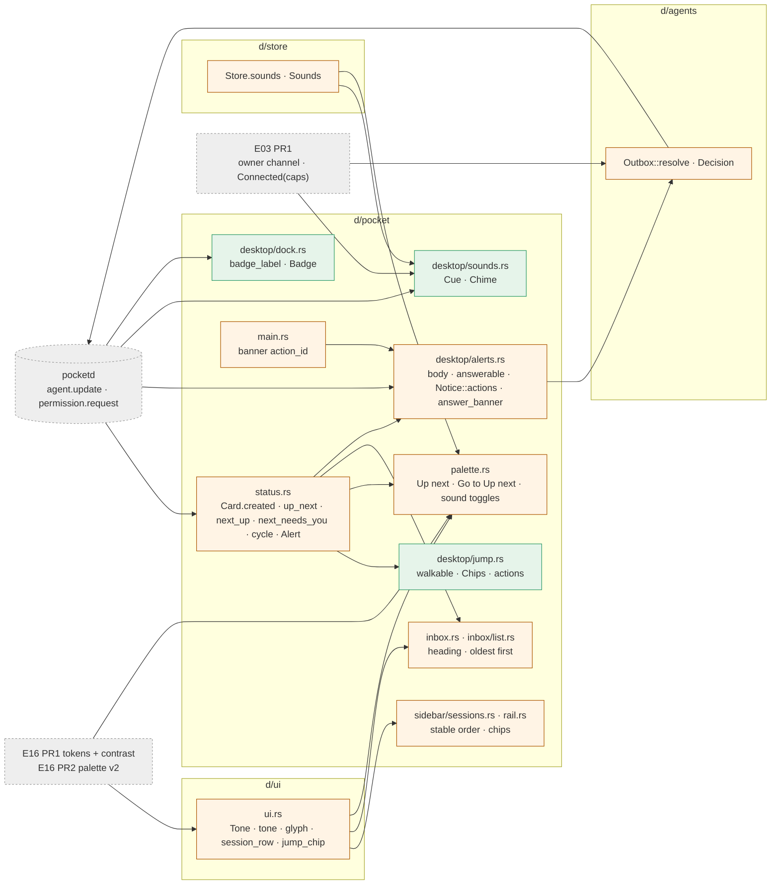

# E08 Desktop Attention Implementation Plan

> **For Claude:** REQUIRED SUB-SKILL: Use /implement to execute this plan task-by-task.

**Goal:** Show at a glance what needs the owner and let them hear it and answer it without switching apps. Each status gets one glyph and colour, and a Needs you row is filled. Lists keep a stable order. Up next and the ⌘J / ⌘⇧J / ⌘1–9 / ⌃Tab keys walk the sessions that want a look. The Dock shows a badge, status changes play sounds, and permission banners carry Allow and Deny and stop.

**Architecture:** Every decision is a pure function beside its view:
- `ui::tone` maps a status to its look;
- `status::{up_next, next_up, next_needs_you, cycle}` order and walk sessions;
- `jump::walkable` picks the list ⌘n counts;
- `Chime::heard` decides sounds, and `dock::badge_label` the badge;
- `alerts::{body, Alerts::answerable}` build banners and guard their answers.

The state structs `Chips`, `Chime` and `Badge` sit beside `Alerts` on `Desktop` (ADR 0003). `impl Desktop` only wires events to effects. `d/agents` gains `Outbox::resolve`, and `d/store` gains `Sounds`.

**Base:** main 5091a01. Paths: `d/` = `packages/desktop/crates/`, `pk/` = `packages/desktop/crates/pocket/src/`. Every line range below is at 5091a01, except `pk/palette.rs` from PR2 on: E16 PR2 rewrites it, so those tasks anchor by content. Design: `docs/designs/2026-09-30-desktop-attention.md`.

**Toolset** (repo root `/Users/mingo/Developer/self/anywhere`; the shell is fish, so quote globs):
- One crate: `cd packages/desktop && cargo test -p <crate> <filter>`. Crates: `ui`, `pocket`, `store`, `agents`. Filters are module paths or test names, e.g. `cargo test -p pocket status::`. Pass several filters after `--`: `cargo test -p pocket -- status:: palette::`.
- The avoid-list test: `cargo test -p pocket --test avoid_list`.
- Every PR boundary, from `packages/desktop`:
  - `cargo build --workspace`
  - `cargo clippy --workspace --all-targets`. Add no new warnings. The only baseline warnings are in `d/git/src/git.rs` (`:101`, `:602-604`) and the `pk/inbox.rs` tests (`field_reassign_with_default`).
  - `cargo test --workspace`
  - After E01 PR1: `scripts/check.sh` runs the same three.
- Mid-PR, a task may leave a `never used` warning for code that a later task in the same PR wires in. `pocket` is a bin crate. No warning survives a PR boundary.
- Screens, for view tasks. Capture before and after, then compare: `.ui-review/fixture/capture.sh <dir> <name>=<steps>…`. Steps are comma-separated names from `pk/capture.rs:13-38`: `session` (focuses the fixture's Needs you card), `rail`, `focus`, `inbox`, `palette`, `dark`, …

**Scratch pocketd** (05-roadmap §7). Never start, stop or restart the pocketd you are working in. Only PR4 and PR5's manual checks use pocketd, and they run against this one:
```
mkdir -p /tmp/e08-pocket/bin
echo '{"token":"e08","port":4599}' > /tmp/e08-pocket/config.json
cd packages/pocketd && env -u POCKETD_PTY POCKET_HOME=/tmp/e08-pocket POCKETD_SOCK=/tmp/e08-pocket/pocketd.sock go run ./cmd/pocketd serve
```
Point every other command at it with the prefix `env -u POCKETD_PTY POCKET_HOME=/tmp/e08-pocket POCKETD_SOCK=/tmp/e08-pocket/pocketd.sock` (called **SCRATCH** below). A fake claude that asks for permissions without a paid turn: `cd packages/pocketd && go build -o /tmp/e08-pocket/bin/claude ./e2e/fakeclaude`. It writes a transcript only with `CLAUDE_CONFIG_DIR` set, and pocketd needs that transcript to see an ask answered elsewhere, so the `run claude` commands below set `CLAUDE_CONFIG_DIR=/tmp/e08-pocket/claude` (as `e2e/harness_test.go:77` does). For fakeclaude (`e2e/fakeclaude/main.go:121-175`):
- `run <cmd>` asks the PermissionRequest hook and blocks until a client sends `permission.resolve`. The terminal then prints `hook: allow` or `hook: deny`. Before PR5 nothing in the desktop can answer it.
- `desk <cmd>` asks the hook, then answers it itself 500 ms later, as if at the desk. The terminal prints `desktop: allow`, then `hook released: ""` once pocketd clears the ask (`e2e/approval_test.go:26-36`).
- Any other line prints `echo: <line>` and ends the turn, which gives a Done.
- Stdin is read one line at a time: a line typed while a hook blocks waits for it.

## Rebase onto main b9e9bee

E16 PR1, E16 PR2 and E01 PR1 have not merged; main is 5 commits past 5091a01. Where this section and a task disagree, this section wins. Anchor by content; line numbers and test counts have drifted, so ignore both. The bar is: the three workspace commands pass with no clippy warning beyond HEAD's.

- **Tokens (Task 1.1 adds them to `theme.rs`).** `SUCCESS = Token::new(0x2b9a66ff, 0x30a46cff)`, `SUCCESS_TEXT = Token::new(0x18794eff, 0x3dd68cff)`, `SUCCESS_BG = Token::fixed(0x30a46c21)`, `FAILED_TEXT = Token::new(0xcd2b31ff, 0xff9592ff)`. Leave `WAITING`, `FAILED` and every other value alone, and add no `ON_SOLID`. Task 1.2 deletes `RUNNING*` as written.
- **No `theme::contrast`.** Drop `pill_glyphs_clear_3_to_1_on_their_own_fill` and its imports from Task 1.1. AA is E16's.
- **Palette stays on its current API** (`hit(q, s)`, `session_entries(q: &str, Vec<(String, Card)>)`, `action_entries(q, project)`). Tasks 2.3, 3.3, 4.5 and every palette step in PR 1: keep the behaviour and test names, but write the code against this API, not v2's. Do not port v2.
- **Already on main:** 719dd54 relabelled Working states "Working" in `ui.rs`. In Task 1.2 skip what is already done.
- **`Event::Connected(Vec<String>)` is already in.** Write `Event::Connected(_)` wherever the plan matches the unit variant.
- **No `scripts/check.sh` or `scripts/bundle-dev.sh`.** Banner actions and the bundled Dock badge can't be seen in a bundle here. Cover them with unit tests; check the badge from `cargo run`, and report whatever stays unseen.
- **Fixture:** `.ui-review/fixture/capture.sh` exists; use it for before/after screens.

**Read first:**
- `CLAUDE.md`, "Desktop code layout" and "Desktop performance". Logic goes in pure functions, tests sit beside it, and render costs only what is visible.
- `docs/adr/0003-desktop-code-layout.md`. It explains state structs per feature and a thin `impl Desktop`.
- The design's §3 (UX), §5 (contract), §7 (failure modes) and §10 (decisions). This plan puts them into code.
- `docs/plans/2026-09-30-look.md` PR1 and PR2 (E16). PR1 brings the tokens and `theme::contrast::ratio`; PR2 rewrites the palette.
- `pk/status.rs` and `pk/desktop/alerts.rs` (whole files). Most logic here extends them.
- `d/ui/src/ui.rs:207-463`: the pill, badge, indicator, session row and status label.

**Assumptions** (settled; don't re-open):
- **E16 PR1 has merged.** It brings:
  - the tokens `WAITING = Token::new(0xad5700ff, 0xffb224ff)`, `FAILED = Token::new(0xcd2b31ff, 0xe5484dff)`, `FAILED_TEXT = Token::new(0xcd2b31ff, 0xff9592ff)`, `SUCCESS = Token::new(0x2b9a66ff, 0x30a46cff)`, `SUCCESS_TEXT = Token::new(0x18794eff, 0x3dd68cff)` and `SUCCESS_BG = Token::fixed(0x30a46c21)`;
  - `theme::contrast::ratio(fg: u32, bg: u32) -> f32`, which composites alpha first, and `theme::contrast::over(top: u32, bottom: u32) -> u32`.
  - It keeps `RUNNING*` for this plan to delete. It has already moved the `session_row` `line`, the NotAttached pill and the NotAttached label to TEXT_2 (its `ui.rs:242, :431, :460`). It also adds lines to `ui.rs`, so re-anchor there.
- **E16 PR2 (palette v2) merges before PR2 here.** From PR2 on, every `palette.rs` snippet is written against v2 (look plan Tasks 2.1-2.4):
  - `query(raw) -> Query::{All, Actions}(words)` and `matches(words, fields)`; `hit` is gone.
  - `session_entries(words: &[String], cards: Vec<(String, Option<String>, Card)>)`: each card with its project name and branch; caps 5 (empty query) and 8 (typing).
  - `action_entries(words: &[String], project: &str)`.
  - `palette_sections` builds `groups` by matching `q`, and `Query::Actions` shows only Actions.
  - The test helper `card(id, title, status, at)` returns a `(String, Option<String>, Card)` triple, and `strings(&[..])` builds words.
  v2 is unmerged, so these snippets were type-checked only against stubs of v2's signatures (see Verification).
- **E16 PR2 and PR1 here may merge in either order** (both roadmap week 3). v2's `palette` draws `Lead::Running` with `RUNNING_TEXT`, which Task 1.2 deletes. Whichever lands second writes `ACCENT` there.
- **E03 PR1 turns `Event::Connected` into `Event::Connected(Vec<String>)`** and gives the desktop the owner channel that `permission.resolve` needs. Code below matches the unit variant `Event::Connected`. Where E03 PR1 has merged, write `Event::Connected(_)`.
- No protocol or pocketd change. `permission.resolve {requestId, decision}` already exists, and pocketd interrupts the turn on a deny (`pd/internal/daemon/daemon.go:148-150`).
- `Store::save` stays as is (design decision 20).
- CLAUDE.md: add no comments beyond the doc comments this plan gives.
- **Risk to flag in review:** a pill label on its own tint over `WINDOW_SOLID` (light) measures below 4.5:1: Needs you 4.20, Working 4.46, Failed 4.18. E16 PR1's `light_text_roles_clear_4_5_on_every_surface` checks text on the surfaces, as the design does, not on the tint. This plan adds only the glyph-on-its-own-fill check, which passes.

**§7.1 override rows this epic touches** (05-roadmap §7.1, verbatim):

| UX section | Spec says | Winning decision | Text to build |
|---|---|---|---|
| UXP §4.2 Up next tie-break | most recently updated first | D39 | Needs you > Failed > Done (not Seen), then oldest transition first |
| UXD §3.12 Inbox sort | sections sorted by (status, newest) | D39 | NEEDS YOU / FAILED / DONE, each oldest transition first |
| UXD §3.13, §6 notifications | Subtitle "{project} · {worktree}" | D30 | No subtitle. Body line 1: "{project} · {worktree}"; line 2: the ask, ≤240 chars. Actions on permission asks only: "Allow" · "Deny and stop" |
| UXD §2.9, §3.10 sound toggles | Settings › Notifications | D25 | Palette actions "Needs you sound: On/Off", "Done sound: On/Off", "Failed sound: On/Off". Persisted in `desktop.json`; default on |
| UXD §5, §6 ⌘J | "Next up" walks Up next | D2, D6, D24 | ⌘J, "Go to next Needs you": Needs you only, oldest transition first, wraps. ⌘⇧J and palette "Go to Up next": the top-ranked Up next item other than the current Session, recomputed per press |
| UXD §5 ⌘1–9 | nth row of the selected worktree, filter applied | D6, D40 | ⌘n = the nth Session in the visible sidebar list after filters, across expanded Worktrees. In Compact, the nth rail item |
| UXD §7 constraint 1 | tokens (Phase 1, incl. dark) before everything | D26 | E16 PR1 (light `Palette`) lands before E08 PR1 and every later desktop component. E01 and E04 PR4 predate it and use the existing constants. Dark waits for S1 |
| UXD §7 constraint 2 | Settings before sounds | D25 | Sounds ship with palette toggles (E08 PR4); Settings is S1 |

**Rebased on 5091a01** (how this plan differs from the design, which cites f8f7293):
- The chips live in a `Chips` state struct (`pk/desktop/jump.rs`), not in `chips`/`chip_timer` fields on `Desktop`. `Chips::new` returns a window-activation subscription that hides them.
- `walkable` is a pure function. `Desktop::visible_sessions` only gathers its inputs.
- ⌘n counts the Sessions column as it is at 5091a01: the selected worktree's sessions after the search filter. It does not span expanded worktrees. In Compact it counts the rail.
- The Dock badge lives in a `Badge` state struct that calls the FFI only on a change. `badge_label` takes `&[Summary]`.
- `Chime` takes the snapshot after a reconnect as a silent baseline, via `Event::Connected`.
- Zeron's `attention.wav` ships as `failed.wav`, because "attention" is on the avoid list.
- `Alerts::answerable(agent, pending)` replaces the design's `alerts.ask(agent)`. `Notice::actions()` builds the banner buttons.
- `body` drops the place line when the agent is outside every project, so the banner never starts with an empty line.
- `count_badge` keeps `WHITE` (E16 agrees), not `ON_SOLID`.
- Text and glyphs on every surface are E16 PR1's tests. The only contrast test here is the one E16 doesn't cover: pill glyphs on their own fill, over `WINDOW_SOLID`.
- There is no Ended kind to style: 8a10124 drops a session when its agent exits.
- The keymap test also covers `cmd-c` in the Terminal context (5091a01).
- `answer_banner` takes `&mut App`, because the notification callback has no `Window`.
- The SUCCESS values come from E16 PR1 (`Token::new(0x2b9a66ff, 0x30a46cff)`), not the design's `Token::fixed`.

---

## Architecture



Green boxes are new. Amber boxes are changed. Dashed boxes are other epics' work that this plan builds on.

pocketd's agent frames reach `Desktop::on_agents`. From there, `Alerts` decides the banners, `Chime` the sounds and `Badge` the Dock label, each in a plain value type. The sidebar, rail, palette, Inbox and keys read one order: `Desktop::cards`, newest session first. `status::up_next` ranks the sessions that want a look. A press on a banner action goes through `answer_banner` to `Outbox::resolve`, but only while the ask it showed is still pending.

## Why this approach

- **One `ui::tone` map from status to glyph and colour.** Rejected: per-site match arms, which drift today (tab, rail, pill and label disagree).
- **Working is an ACCENT spinner; `RUNNING*` is deleted.** Rejected: keeping green "Running" beside SUCCESS, two greens with different meanings.
- **Order by `created_at`; `updated_at` is the transition time.** Rejected: a desktop-side transition clock, which is lost on restart and duplicates pocketd.
- **Up next filters no Seen set.** pocketd already turns a seen Done into Idle. Rejected: a desktop Seen filter, a second source of truth.
- **One `visible_sessions` serves render, ⌘n and ⌃Tab.** Rejected: separate lists that could disagree with what is on screen.
- **`JumpTo(usize)` with `#[action(no_json)]`; `NextWaiting` becomes `NextNeedsYou`.** Rejected: nine unit actions, and keeping an avoid-list identifier.
- **Chips are a `Chips` state struct with a dropped-`Task` timer.** Rejected: fields straight on `Desktop` (ADR 0003).
- **Sounds are embedded WAVs, written once to `temp_dir()/pocket-sounds/` and played with `afplay` off the UI thread.** Rejected: rodio or CoreAudio (new dependencies), NSSound FFI (more objc surface), files beside the binary (`cargo run` has no bundle).
- **One cue per 250 ms window, highest priority wins; a Done older than 45 s stays silent.** Rejected: one sound per session, which is noisy when many finish at once.
- **Toggle titles show the current state ("Needs you sound: On").** Rejected: verb titles such as "Turn off …", which are not UXD §6 copy.
- **The Dock badge counts every Needs you, Seen included.** Rejected: excluding Seen, which makes the badge flicker as you look.
- **A banner answers only the ask it showed (`Alerts::answerable`).** Rejected: the request id in the tag, which breaks per-session replace and dismiss; resolving the oldest pending ask, which could approve one the user never saw.
- **Re-alert on a new ask id; never when an ask clears.** Rejected: debouncing status by 100 ms. Status arrives before the ask, so without re-alerting the banner would never get its actions.
- **An action press doesn't bring Pocket forward; a body click does.** Rejected: always activating, which defeats answering without switching windows.
- **Deny and stop is `decision: "deny"`.** pocketd already interrupts on a deny. Rejected: a new protocol field.
- **The avoid-list test scans string literals before `#[cfg(test)]` in `pk/src` and `d/ui/src`.** Rejected: the whole CONTEXT.md avoid list ("branch", "folder" and "repository" are valid git copy).
- **Capture mode plays no sounds and sets no badge.** Rejected: live effects in capture, which are nondeterministic and touch the user's Dock.

## Tasks at a glance

**PR 1 · D1 looks + copy.** Each status has one glyph and colour, Working is an accent spinner, a Needs you row is filled, and the copy passes the avoid list.

| # | Task | Main files | Risk |
|---|---|---|---|
| 1.1 | `ui::tone`: one map from status to look | `d/ui/src/ui.rs` | Medium: needs E16 PR1's tokens and `contrast` |
| 1.2 | Delete `RUNNING*`; every status mark uses `tone` | `d/theme/src/theme.rs`, 9 pocket files | Low |
| 1.3 | The Needs you session row | `d/ui/src/ui.rs` | Low |
| 1.4 | Copy fixes and the avoid-list test | `pk/tests/avoid_list.rs`, `sidebar/column.rs`, `inbox`, `palette.rs`, `modals/confirm.rs` | Low |
| 1.5 | CONTEXT.md: Failed | `CONTEXT.md` | Low |

**PR 2 · Order + Up next.** Lists stop jumping when a status changes; the palette and Inbox rank what wants a look, oldest first.

| # | Task | Main files | Risk |
|---|---|---|---|
| 2.1 | `Card.created`; lists keep one order | `pk/status.rs`, `desktop/project.rs`, `sidebar/{sessions,rail}.rs` | Low |
| 2.2 | `status::up_next` | `pk/status.rs` | Low |
| 2.3 | The palette's Up next group | `pk/palette.rs` | Medium: written against unmerged E16 PR2 |
| 2.4 | Inbox: NEEDS YOU / FAILED / DONE, oldest first | `pk/inbox.rs`, `inbox/list.rs` | Low |
| 2.5 | CONTEXT.md: Up next | `CONTEXT.md` | Low |

**PR 3 · Keyboard.** ⌘J, ⌘⇧J, ⌘1–9 with chips, and ⌃Tab / ⌃⇧Tab.

| # | Task | Main files | Risk |
|---|---|---|---|
| 3.1 | `next_up`, `next_needs_you`, `cycle` | `pk/status.rs` | Low |
| 3.2 | `walkable`: the list ⌘n counts | `pk/desktop/jump.rs` (new), `sidebar.rs`, `sidebar/sessions.rs` | Low |
| 3.3 | The actions, their bindings and the keymap test | `pk/actions.rs`, `desktop/jump.rs`, `desktop.rs`, `palette.rs`, `sidebar/sessions.rs` | Medium: global keys |
| 3.4 | ⌘n chips while ⌘ is held | `pk/desktop/jump.rs`, `desktop.rs`, `sidebar/sessions.rs`, `d/ui/src/ui.rs`, storybook | Low |

**PR 4 · Badge + sounds.** A Dock badge counts Needs you; status changes play a sound that the palette can mute.

| # | Task | Main files | Risk |
|---|---|---|---|
| 4.1 | `Store.sounds` | `d/store/src/store.rs` | Low |
| 4.2 | The Dock badge | `pk/desktop/dock.rs` (new), `Cargo.toml` ×2, `Cargo.lock` | Medium: objc2 FFI |
| 4.3 | `Cue` and `Chime`: which change plays what | `pk/desktop/sounds.rs` (new), 3 WAVs, `THIRD_PARTY.md` | Low |
| 4.4 | Wire the badge and sounds into `on_agents` | `pk/desktop.rs`, `desktop/alerts.rs`, `desktop/sounds.rs` | Medium: manual check |
| 4.5 | Palette sound toggles | `pk/palette.rs`, `desktop/sounds.rs` | Low |

**PR 5 · Banner actions.** A permission banner shows where the agent is and what it asks, with Allow and Deny and stop.

| # | Task | Main files | Risk |
|---|---|---|---|
| 5.1 | `Outbox::resolve` | `d/agents/src/agents.rs` | Low |
| 5.2 | `Alert`: a new ask re-alerts | `pk/status.rs`, `desktop/alerts.rs` | Low |
| 5.3 | Banner body, ask and actions | `pk/desktop/alerts.rs` | Medium: needs the bundle to see |
| 5.4 | Answer from the banner | `pk/desktop/alerts.rs`, `main.rs` | Medium: manual check |

---

## PR 1: D1 looks + copy

**Scope:** `ui::tone` becomes the one map from status to glyph, glyph colour, label colour and fill. Working turns into an ACCENT spinner labelled "Working"; Done becomes a SUCCESS check; Failed a FAILED cross. `RUNNING*` goes. A Needs you session row gets a WAITING_BG fill. The copy fixes are:
- the column title shows the worktree's name;
- "Mark all seen";
- "Go to next Needs you";
- "Its files stay on disk".

`tests/avoid_list.rs` keeps avoid-list words out of desktop copy. CONTEXT.md gains Failed.
**Depends on:** E16 PR1 (tokens, `theme::contrast`). Re-anchor line numbers after E16 PR1 merges: it adds tokens to `theme.rs` and lines to `ui.rs`.
**Done when:** the three workspace commands pass with no new clippy warnings. `pocket` has 175 tests (at 5091a01 plus E16 PR1), `ui` 3 and `avoid_list` 1. Compare the before and after captures:
- a filled Needs you row;
- a blue Working spinner;
- green Done checks;
- red Failed crosses;
- the worktree name as the column title.

Before Task 1.1, capture the before screens:
`.ui-review/fixture/capture.sh /tmp/e08-before sessions=session rail=session,rail inbox=inbox palette=palette dark=session,dark`

### Task 1.1: `ui::tone`, one map from status to look

**What & why:** Adds `Glyph`, `Tone`, `tone`, `glyph` and `word`, then rebuilds the pill, the status label, the row indicator and `alert_color` on them. Today these four disagree (FR 08-5, D1). Every later site calls `tone`, so it comes first.

**Files:**
- Modify: `packages/desktop/crates/ui/src/ui.rs`:
  - after `:216` (end of `diffstat`), the new items;
  - `:234-243`, the `status` match;
  - `:279-287`, `alert_color`;
  - `:309`, `repo_tile`;
  - `:373-379`, `indicator`;
  - `:453-463`, `status_label`;
  - `:468`, `git_color`;
  - `:657`, `meta_diff`.
- Test: `packages/desktop/crates/ui/src/ui.rs` (new `mod tests` after `:830`)

**Context:**
- `State` (`ui.rs`) is the view's status: NeedsYou, Working, Failed, Sent, Draft, Done(added, removed), Idle(added, removed), NotAttached. Only the first four and Done are an agent's alerting or busy status; the rest have no tone.
- D1:

  | Status | Glyph | Glyph colour | Label colour | Fill |
  |---|---|---|---|---|
  | Needs you | dot | WAITING | WAITING_TEXT | WAITING_BG |
  | Working | spinner | ACCENT | ACCENT | ACCENT_TINT |
  | Done | check | SUCCESS | SUCCESS_TEXT | SUCCESS_BG |
  | Failed | cross | FAILED | FAILED_TEXT | FAILED_BG |

- AA: E16 PR1's contrast tests already check every token `tone` uses on every surface. This test checks only what E16 doesn't: a pill's glyph on the pill's own fill, composited over `WINDOW_SOLID` with `theme::contrast::over`, in light via `Token::pick(false)`. Measured: Needs you 4.20, Working 4.46, Failed 4.18. Done draws no pill, so it is left out. Tests never flip the dark flag.
- Don't `use super::*` in these tests: `gpui_kit::*` brings gpui's `test` macro, which blows the recursion limit. Import names explicitly.

**Step 1: Write the failing test**

Append to `ui.rs`:

```rust

#[cfg(test)]
mod tests {
    use super::{Glyph, State, Tone, tone, word};
    use theme::contrast::{over, ratio};
    use theme::{ACCENT, ACCENT_TINT, WINDOW_SOLID};

    const STATUSES: [State; 4] = [State::NeedsYou, State::Working, State::Done(0, 0), State::Failed];

    #[test]
    fn every_alerting_state_has_its_own_glyph_and_colour() {
        let tones: Vec<Tone> = STATUSES.into_iter().filter_map(tone).collect();
        assert_eq!(tones.len(), 4);
        for (i, a) in tones.iter().enumerate() {
            for b in &tones[i + 1..] {
                assert_ne!(a.glyph, b.glyph);
                assert_ne!(a.mark, b.mark);
            }
        }
        assert!([State::Idle(0, 0), State::NotAttached, State::Sent, State::Draft].into_iter().all(|s| tone(s).is_none()));
    }

    #[test]
    fn working_reads_working_in_accent() {
        assert_eq!(tone(State::Working), Some(Tone { glyph: Glyph::Spinner, mark: ACCENT, text: ACCENT, bg: ACCENT_TINT }));
        assert_eq!(word(State::Working), "Working");
    }

    #[test]
    fn pill_glyphs_clear_3_to_1_on_their_own_fill() {
        let window = WINDOW_SOLID.pick(false);
        for state in [State::NeedsYou, State::Working, State::Failed] {
            let t = tone(state).unwrap();
            let mark = ratio(t.mark.pick(false), over(t.bg.pick(false), window));
            assert!(mark >= 3.0, "{} glyph is {mark:.2}:1 on its fill", word(state));
        }
    }
}
```

**Step 2: Run the test to verify it fails**

Run: `cd packages/desktop && cargo test -p ui`
Expected: FAIL with `error[E0432]: unresolved imports `super::Glyph`, `super::Tone`, `super::tone`, `super::word``

**Step 3: Write the implementation**

After `diffstat` (`:216`), add:

```rust

#[derive(Clone, Copy, Debug, PartialEq)]
pub enum Glyph {
    Dot,
    Spinner,
    Check,
    Cross,
}

/// How a status looks: its glyph, the glyph's colour, its label's colour and its fill.
#[derive(Clone, Copy, Debug, PartialEq)]
pub struct Tone {
    pub glyph: Glyph,
    pub mark: Token,
    pub text: Token,
    pub bg: Token,
}

/// The one map from a status to its look. States that are not an agent's status have none.
pub fn tone(state: State) -> Option<Tone> {
    let (glyph, mark, text, bg) = match state {
        State::NeedsYou => (Glyph::Dot, WAITING, WAITING_TEXT, WAITING_BG),
        State::Working => (Glyph::Spinner, ACCENT, ACCENT, ACCENT_TINT),
        State::Done(..) => (Glyph::Check, SUCCESS, SUCCESS_TEXT, SUCCESS_BG),
        State::Failed => (Glyph::Cross, FAILED, FAILED_TEXT, FAILED_BG),
        _ => return None,
    };
    Some(Tone { glyph, mark, text, bg })
}

pub fn glyph(id: impl Into<ElementId>, t: Tone) -> AnyElement {
    match t.glyph {
        Glyph::Dot => dot(7., t.mark).into_any_element(),
        Glyph::Spinner => spinner(id, 11., t.mark).into_any_element(),
        Glyph::Check => icon("check", 11., t.mark).into_any_element(),
        Glyph::Cross => icon("x-bold", 11., t.mark).into_any_element(),
    }
}

fn word(state: State) -> &'static str {
    match state {
        State::NeedsYou => "Needs you",
        State::Working => "Working",
        State::Failed => "Failed",
        State::Sent => "Sent",
        State::Draft => "Draft",
        State::Done(..) => "Done",
        State::Idle(..) => "Idle",
        State::NotAttached => "Not attached",
    }
}
```

In `status`, replace the `match state { … }` (`:234-243`) with:

```rust
    match (state, tone(state)) {
        (State::Done(added, removed), Some(t)) => div().flex().flex_none().items_center().gap(px(6.)).child(glyph(id, t)).child(diffstat(added, removed)),
        (_, Some(t)) => pill(t.bg, t.text).child(glyph(id, t)).child(word(state)),
        (State::Sent, _) => pill(FILL_3, TEXT_2).child(icon("check", 11., TEXT_2)).child("Sent"),
        (State::Draft, _) => pill(ACCENT_BG, ACCENT).child(dot(6., ACCENT)).child("Draft"),
        (State::Idle(added, removed), _) => diffstat(added, removed),
        _ => pill(FILL_3, TEXT_2).child("Not attached"),
    }
```

Replace the body of `alert_color` (`:281-286`) with:

```rust
    tone(state).filter(|t| t.glyph != Glyph::Spinner).map(|t| t.mark)
```

In `repo_tile` (`:309`), `RUNNING` becomes `ACCENT`:

```rust
        .when(state == Some(State::Working), |d| d.child(badge(div().bottom(px(-2.)), ACCENT)))
```

Replace `indicator` with its doc comment (`:373-379`):

```rust
/// A row's status mark: its status's glyph.
pub fn indicator(id: impl Into<ElementId>, state: Option<State>) -> Option<AnyElement> {
    tone(state?).map(|t| glyph(id, t))
}
```

Replace `status_label` with its doc comment (`:453-463`):

```rust
/// A card's status as coloured text: the pill's glyph and label without its background.
pub fn status_label(id: impl Into<ElementId>, state: State) -> Div {
    let label = |color: Token| div().flex().flex_none().items_center().gap(px(5.)).font_weight(FontWeight::MEDIUM).text_color(color);
    match (state, tone(state)) {
        (State::Done(added, removed), Some(t)) => label(t.text).child(glyph(id, t)).child(word(state)).child(diffstat(added, removed)),
        (_, Some(t)) => label(t.text).child(glyph(id, t)).child(word(state)),
        (State::NotAttached, _) => label(TEXT_2).child(word(state)),
        _ => status(id, state),
    }
}
```

In `git_color` (`:468`) and `meta_diff` (`:657`), `RUNNING_TEXT` becomes `SUCCESS_TEXT`:

```rust
        'A' => SUCCESS_TEXT,
```

```rust
        .child(div().text_color(SUCCESS_TEXT).child(format!("+{added}")))
```

**Step 4: Run the test to verify it passes**

Run: `cd packages/desktop && cargo test -p ui`
Expected: PASS, `test result: ok. 3 passed`

### Task 1.2: Delete `RUNNING*`; every status mark uses `tone`

**What & why:** Removes the green "Running" tokens so nothing can drift back to them. The compiler then lists every leftover site. The tab and Inbox marks move onto `ui::tone`, which also gives Done its check there.

**Files:**
- Modify:
  - `packages/desktop/crates/theme/src/theme.rs:93-95`: delete `RUNNING`, `RUNNING_TEXT`, `RUNNING_BG`.
  - `pk/explorer.rs:36`
  - `pk/explorer/preview/code.rs:27`, `:45`, `:52`
  - `pk/git_ui/diff/comment.rs:18`
  - `pk/modals/add_project.rs:273`
  - `pk/palette.rs:239`
  - `pk/sidebar/rail.rs:56`
  - `pk/terminal_view/tabs.rs:1-2`, `:33-39`, `:46`
  - `pk/inbox/list.rs:3`, `:81-85`, `:109`
- Test: the compiler, then `cargo test -p pocket`. `code.rs`'s `tints_changed_lines` pins the new SUCCESS_BG.

**Context:**
- SUCCESS\* (E16 PR1) holds the old RUNNING values. Added lines and "Sent" are successes, so they take SUCCESS. Things in motion take ACCENT: the rail and tab busy dots, and the palette spinner. `chrome::state(status, added, removed)` turns a `Status` into a `ui::State`, and `chrome::id` turns a `String` into an `ElementId`.
- If E16 PR2 has merged, `palette.rs:239` has moved: change v2's `Lead::Running => spinner(("palette-spin", i), 12., RUNNING_TEXT)` in `palette` (anchor by content). If E16 PR2 lands after this PR, it writes `ACCENT` there itself (see Assumptions).

**Step 1: Write the failing test**

Delete `theme.rs:93-95`:

```rust
pub const RUNNING: Token = Token::fixed(0x30a46cff);
pub const RUNNING_TEXT: Token = Token::new(0x18794eff, 0x3dd68cff);
pub const RUNNING_BG: Token = Token::fixed(0x30a46c21);
```

**Step 2: Run the test to verify it fails**

Run: `cd packages/desktop && cargo test -p pocket --no-run`
Expected: FAIL with errors like these:
- `error[E0425]: cannot find value `RUNNING` in this scope` at `explorer.rs:36`, `sidebar/rail.rs:56`, `terminal_view/tabs.rs:37` and `:46`.
- `cannot find value `RUNNING_TEXT`` at `git_ui/diff/comment.rs:18`, `modals/add_project.rs:273` and `palette.rs:239`.
- `cannot find value `RUNNING_BG`` at `explorer/preview/code.rs:27`.
- `error[E0432]: unresolved import `theme::RUNNING_BG`` at `code.rs:45`.

**Step 3: Write the implementation**

`explorer.rs:36`:

```rust
        Some('A') => (SUCCESS, "Added"),
```

`explorer/preview/code.rs:27`:

```rust
            let bg = HighlightStyle { background_color: Some(if modified { WAITING_BG } else { SUCCESS_BG }.into()), ..Default::default() };
```

`code.rs:45` and `:52` (tests):

```rust
    use theme::{SUCCESS_BG, WAITING_BG};
```

```rust
        assert_eq!(d[1].style.background_color, Some(SUCCESS_BG.into()));
```

`git_ui/diff/comment.rs:18`:

```rust
            .child(div().flex().items_center().gap(px(4.)).font_weight(FontWeight::SEMIBOLD).text_color(SUCCESS_TEXT).child(icon("check", 12., SUCCESS_TEXT)).child("Sent"));
```

`modals/add_project.rs:273`:

```rust
                (Some("check"), format!("Git repository · {branch} · {state} · {remotes}"), SUCCESS_TEXT)
```

`palette.rs:239`:

```rust
                    Lead::Running => spinner(("palette-spin", i), 12., ACCENT).into_any_element(),
```

`sidebar/rail.rs:56`:

```rust
                .when(c.status == Status::Working, |d| d.child(badge(div().bottom(px(3.)), ACCENT)))
```

`terminal_view/tabs.rs`. Add after `use crate::desktop::Desktop;` (`:1`):

```rust
use crate::desktop::chrome::{id, state};
```

Replace the agent tab's `let mark = match Status::of(a) { … };` (`:33-39`) with:

```rust
            let mark = Status::of(a).and_then(|s| ui::tone(state(s, 0, 0))).map(|t| ui::glyph(id(format!("tab-mark:{}", a.id)), t));
```

and the shell tab's busy arm (`:46`) with:

```rust
            _ if busy.is_some() => dot(6., ACCENT).into_any_element(),
```

`inbox/list.rs`. The chrome import (`:3`) becomes:

```rust
use crate::desktop::chrome::{column, drag_area, empty, state};
```

In `note_row`, replace `let (glyph, color) = match n.status { … };` (`:81-85`) with:

```rust
        let mark = ui::tone(state(n.status, 0, 0)).map(|t| ui::glyph(("note-mark", i), t));
```

and `.child(icon(glyph, 13., color)),` (`:109`) with:

```rust
                    .children(mark),
```

**Step 4: Run the test to verify it passes**

Run: `cd packages/desktop && cargo test -p pocket && grep -rn 'RUNNING' crates`
Expected: PASS. The `grep` prints nothing.

### Task 1.3: The Needs you session row

**What & why:** A session that needs you fills its whole row with WAITING_BG, so it reads from across the room (UXD §3.3). Hover and selection tint over that fill instead of replacing it. The branch icon moves to TEXT_2 to match the line.

**Files:**
- Modify: `packages/desktop/crates/ui/src/ui.rs:429-451` (`session_row`)
- Test: none (CLAUDE.md: no render tests). Captures check it.

**Context:**
- A plain `.bg()` for selection would hide the fill. So the row is `relative`, and an `absolute().inset_0()` overlay carries FILL_3 when selected, or FILL_1 on group hover.
- E16 PR1 already moved `line` to TEXT_2. If so, leave that line as it is.
- If E16 PR3 is in, `ui.rs` has `pub const SESSION_ROW: &str = "session-row";`, `.group(SESSION_ROW)` and the `group_hover(SESSION_ROW, …invisible())` around `when`. Use `SESSION_ROW` in place of `SESSION_GROUP`, and keep that `when` wrapper.

**Step 1: Write the failing test**

No unit test. The check is the `sessions` capture: its selected Needs you card.

**Step 2: Run the test to verify it fails**

Run: `.ui-review/fixture/capture.sh /tmp/e08-mid-1 sessions=session`
Expected: in `impl-sessions.png`, the selected Needs you card is plain FILL_3 grey with no amber fill.

**Step 3: Write the implementation**

Replace `session_row` (`:429-451`) with:

```rust
const SESSION_GROUP: &str = "session-row";

/// A session's card. Needs you fills the whole row; hover and selection tint over that fill.
pub fn session_row(id: impl Into<ElementId>, selected: bool, lead: impl IntoElement, when: String, title: String, branch: Option<String>, state: Option<State>) -> Stateful<Div> {
    let id = id.into();
    let line = || div().h(px(16.)).flex().items_center().gap(px(8.)).text_size(px(12.)).text_color(TEXT_2);
    div()
        .id(id.clone())
        .group(SESSION_GROUP)
        .relative()
        .px(px(10.))
        .py(px(10.))
        .flex()
        .flex_col()
        .gap(px(4.))
        .rounded(px(8.))
        .cursor_pointer()
        .when(state == Some(State::NeedsYou), |d| d.bg(WAITING_BG))
        .child(div().absolute().inset_0().rounded(px(8.)).map(|d| if selected { d.bg(FILL_3) } else { d.group_hover(SESSION_GROUP, |s| s.bg(FILL_1)) }))
        .child(line().child(div().flex_1().min_w_0().flex().child(lead)).child(when))
        .child(div().truncate().text_size(px(14.)).line_height(px(20.)).font_weight(FontWeight::SEMIBOLD).text_color(TEXT).child(title))
        .child(
            line()
                .child(div().flex_1().min_w_0().flex().items_center().gap(px(6.)).when_some(branch, |d, b| d.child(icon("branch", 12., TEXT_2)).child(div().truncate().child(b))))
                .children(state.map(|s| status_label(id, s))),
        )
}
```

**Step 4: Run the test to verify it passes**

Run: `cd packages/desktop && cargo build --workspace && cd ../.. && .ui-review/fixture/capture.sh /tmp/e08-after-1 sessions=session rail=session,rail inbox=inbox palette=palette dark=session,dark`
Expected: the build passes. Compared with `/tmp/e08-before`:
- the Needs you card is amber, with the grey selection over it;
- Working rows show a blue spinner and "Working";
- Done rows show a green check;
- the rail's Working dot is blue.

### Task 1.4: Copy fixes and the avoid-list test

**What & why:** Adds a test that fails when desktop copy uses a CONTEXT.md avoid-list word (FR 08-6). Then it fixes the four strings it catches:
- the column title "Workspace" becomes the worktree's name;
- "Mark all read" becomes "Mark all seen";
- "Jump to next waiting session" becomes "Go to next Needs you";
- "The repository stays on disk" becomes "Its files stay on disk". The test doesn't catch this one, but the design renames it.

**Files:**
- Create: `packages/desktop/crates/pocket/tests/avoid_list.rs`
- Modify:
  - `pk/sidebar/column.rs:1-3`, `:53-64` (`column_header`)
  - `pk/inbox/list.rs:34`
  - `pk/inbox.rs:58`, `:181`
  - `pk/palette.rs:125`, tests `:362-366`
  - `pk/modals/confirm.rs:27`, `:94-95`
- Test: `pocket --test avoid_list` · `desktop_copy_uses_no_avoid_list_words`; `pocket` · `removing_a_project_keeps_its_files`, `actions_match_on_their_titles`

**Context:**
- The test scans string literals up to `#[cfg(test)]` in `pk/src` and `d/ui/src`, skipping `//` lines.
- It matches whole words, case-insensitive. `-` and `_` join a word, so ids like `commit-busy` pass.
- The words are: workspace, waiting, attention, blocked, unread, acknowledged, finished, running, busy, and the phrase "mark all read".
- The one allowed string is "This session is not running.".
- `pocket` is a bin crate, so the test reads files and doesn't import the crate.
- `Desktop::cwd()` is the selected worktree's path.
- The test lives in `pk/tests/`, not beside the logic as CLAUDE.md asks. That is design decision 15: it reads every source file and belongs to no module, and a test module inside `src` was rejected.
- Step 2's three hits assume Tasks 1.1-1.3 ran: 1.1 removes `ui.rs:458`'s "Running".
- If E16 PR2 merged first, `palette.rs:125` and the test lines `:362-366` have moved; anchor by content (the `Pick::Next` entry in `action_entries`, and `actions_match_on_their_titles`).

**Step 1: Write the failing test**

Create `tests/avoid_list.rs`:

```rust
use std::path::{Path, PathBuf};

const AVOID: [&str; 10] = ["workspace", "waiting", "attention", "blocked", "unread", "acknowledged", "finished", "running", "busy", "mark all read"];
const ALLOWED: [&str; 1] = ["This session is not running."];

fn sources(dir: &Path, out: &mut Vec<PathBuf>) {
    for entry in std::fs::read_dir(dir).unwrap().flatten() {
        let path = entry.path();
        if path.is_dir() {
            sources(&path, out);
        } else if path.extension().is_some_and(|e| e == "rs") {
            out.push(path);
        }
    }
}

/// The string literals of `code` up to its test module, skipping `//` lines.
fn literals(code: &str) -> Vec<String> {
    let code = code.split("#[cfg(test)]").next().unwrap_or_default();
    let mut found = Vec::new();
    for line in code.lines().filter(|l| !l.trim_start().starts_with("//")) {
        let mut chars = line.chars();
        let mut current: Option<String> = None;
        while let Some(c) = chars.next() {
            match (&mut current, c) {
                (None, '"') => current = Some(String::new()),
                (Some(s), '"') => {
                    found.push(std::mem::take(s));
                    current = None;
                }
                (Some(s), '\\') => s.extend(chars.next()),
                (Some(s), c) => s.push(c),
                (None, _) => {}
            }
        }
    }
    found
}

/// Words split like copy reads, so ids such as "commit-busy" stay one word.
fn avoided(text: &str) -> Option<&'static str> {
    let lower = text.to_lowercase();
    let words: Vec<&str> = lower.split(|c: char| !(c.is_alphanumeric() || c == '-' || c == '_')).collect();
    AVOID.into_iter().find(|a| if a.contains(' ') { lower.contains(a) } else { words.contains(a) })
}

#[test]
fn desktop_copy_uses_no_avoid_list_words() {
    let crates = Path::new(env!("CARGO_MANIFEST_DIR")).parent().unwrap();
    let mut files = Vec::new();
    sources(&crates.join("pocket/src"), &mut files);
    sources(&crates.join("ui/src"), &mut files);
    files.sort();
    let mut hits = Vec::new();
    for file in files {
        for text in literals(&std::fs::read_to_string(&file).unwrap()) {
            if let Some(word) = avoided(&text).filter(|_| !ALLOWED.contains(&text.as_str())) {
                hits.push(format!("{}: \"{text}\" uses \"{word}\"", file.strip_prefix(crates).unwrap().display()));
            }
        }
    }
    assert!(hits.is_empty(), "avoid-list words in desktop copy:\n{}", hits.join("\n"));
}
```

In the tests, rename and re-word. `confirm.rs:94-95`:

```rust
    fn removing_a_project_keeps_its_files() {
        let keeps = "Its files stay on disk";
```

`palette.rs`, in `actions_match_on_their_titles` (`:362-366`):

```rust
        let want = [(Pick::New, "New session in app"), (Pick::Split, "Open selected in a split"), (Pick::Next, "Go to next Needs you")];
```

```rust
        assert_eq!(session, vec![Pick::New]);
```

`inbox.rs:181`:

```rust
    fn mark_all_seen_marks_every_agent_but_those_that_need_you() {
```

If E16 PR2 merged first, make the same two changes in its `actions_match_on_their_titles`: the title, and `[Pick::New]` for `strings(&["session"])`.

**Step 2: Run the test to verify it fails**

Run: `cd packages/desktop && cargo test -p pocket --test avoid_list`
Expected: FAIL with
```
avoid-list words in desktop copy:
pocket/src/inbox/list.rs: "Mark all read" uses "mark all read"
pocket/src/palette.rs: "Jump to next waiting session" uses "waiting"
pocket/src/sidebar/column.rs: "Workspace" uses "workspace"
```

**Step 3: Write the implementation**

`sidebar/column.rs`. Add after the chrome import (`:2`):

```rust
use crate::util::basename;
```

In `column_header`, add as its first line (before `let add`, `:53`):

```rust
        let title = self.cwd().map(|t| basename(&t)).or_else(|| self.project.as_deref().map(|p| self.repo_name(p))).unwrap_or_default();
```

and replace `.child(div().flex_1().text_size(px(16.)).font_weight(FontWeight::BOLD).child("Workspace"))` (`:61`) with:

```rust
            .child(div().flex_1().text_size(px(16.)).font_weight(FontWeight::BOLD).truncate().child(title))
```

`inbox/list.rs:34`:

```rust
                ui::button("mark-seen", Variant::Ghost, None, "Mark all seen").on_click(cx.listener(|this, _: &ClickEvent, _, cx| {
```

`inbox.rs:58`:

```rust
/// The agents "Mark all seen" marks seen: asks stay until answered.
```

`palette.rs:125`:

```rust
        Entry { pick: Pick::Next, lead: Lead::Waiting, title: "Go to next Needs you".into(), detail: String::new(), keys: Some("⌘ J") },
```

`modals/confirm.rs:27`:

```rust
        let facts = closes(terminals).into_iter().chain(["Its files stay on disk".to_string()]).collect();
```

**Step 4: Run the test to verify it passes**

Run: `cd packages/desktop && cargo test -p pocket --test avoid_list && cargo test -p pocket -- removing_a_project actions_match mark_all_seen`
Expected: PASS: `1 passed`, then `3 passed`

### Task 1.5: CONTEXT.md: Failed

**What & why:** Failed is now a status with its own look, so the glossary names it (design decision 18). The avoid-list test needs the terms settled.

**Files:**
- Modify: `CONTEXT.md:42` (Status), `:52-54` (Done; add Failed after it)
- Test: none (docs)

**Context:** The glossary defines each term, then lists `_Avoid_:` words.

**Step 1: Write the failing test**

None (docs only).

**Step 2: Run the test to verify it fails**

Run: `grep -c '^\*\*Failed\*\*' CONTEXT.md`
Expected: `0`

**Step 3: Write the implementation**

`CONTEXT.md:42`:

```markdown
Where an agent stands, from the user's view. One of Needs you, Failed, Done, Working, Idle, in that order of urgency. A session shows its agent's status; terminals without an agent have none.
```

Replace the Done entry (`:52-54`) with:

```markdown
**Done**:
A turn ended and nobody has seen it yet.
_Avoid_: finished, unread

**Failed**:
A Done turn that errored. It asks for a look before plain Done. A user interrupt is not a failure; the agent goes Idle.
```

**Step 4: Run the test to verify it passes**

Run: `grep -c '^\*\*Failed\*\*' CONTEXT.md && cd packages/desktop && cargo build --workspace && cargo clippy --workspace --all-targets && cargo test --workspace`
Expected: `1`, then PASS with no new clippy warnings

---

## PR 2: Order + Up next

**Scope:** The sidebar, rail and palette Sessions keep one order: newest session first, by `created_at`. A status change never moves a row (D39). `status::up_next` ranks the sessions that want a look: Needs you, then Failed, then Done, each oldest status change first. It feeds a new palette group, "Up next", and the Inbox's NEEDS YOU / FAILED / DONE sections. CONTEXT.md gains Up next.
**Depends on:** E16 PR2 (palette v2), PR 1. Every `palette.rs` step anchors by content: E16 PR2 rewrites the file.
**Done when:** the three workspace commands pass with no new clippy warnings, and `pocket` has 186 tests (175, plus E16 PR2's 9, plus 2). The `sessions` and `palette` captures show that:
- rows don't move when a status changes;
- the palette opens on an "Up next" group.

### Task 2.1: `Card.created`; lists keep one order

**What & why:**
- Adds the session's creation time to `Card`.
- Sorts the sidebar cards on it and drops the status sorts in the rail and in search.
- A row that jumps each time an agent changes status is the bug D39 names: users click the wrong session.

**Files:**
- Modify:
  - `pk/status.rs:56` (field), `:69` (`card`)
  - `pk/desktop/project.rs:43`
  - `pk/sidebar/rail.rs:9-14` (`live`)
  - `pk/sidebar/sessions.rs:4`, `:11-17` (`matching`)
- Test:
  - `pk/status.rs:146-150` (`a_card_is_its_agent_in_its_terminals_folder`)
  - `pk/sidebar/rail.rs:131-136`
  - `pk/sidebar/sessions.rs:80-84`
  - `pk/palette.rs`: v2's test helper `card`

**Context:**
- `Summary.created_at` (agents) is when pocketd first saw the session; `updated_at` moves on every status change.
- `Card.at` stays: it is the "2m" label and the Up next tie-break.
- `project.rs` `cards()` feeds the sidebar, the rail and the palette.

**Step 1: Write the failing test**

`status.rs`, in `a_card_is_its_agent_in_its_terminals_folder`:

```rust
        let a = Summary { title: "Fix".into(), cwd: "/elsewhere".into(), created_at: 2, updated_at: 5, ..agent("t1", "working") };
        let c = card(&a, "/w");
        assert_eq!((c.id.as_str(), c.title.as_str(), c.cwd.as_str(), c.created, c.at, c.status, c.kind), ("agent-t1", "Fix", "/w", 2, 5, Status::Working, Kind::Agent));
```

`rail.rs`, replace the test at `:131-136`:

```rust
    #[test]
    fn a_status_change_keeps_the_session_order() {
        let cards = vec![card("idle", "idle"), card("work", "working"), card("picked", "idle"), card("ask", "needsYou"), card("done", "done")];
        let ids: Vec<String> = live(cards, Some("picked")).into_iter().map(|c| c.id).collect();
        assert_eq!(ids, vec!["work", "picked", "ask", "done"]);
    }
```

`sessions.rs`, replace the test at `:80-84`:

```rust
    #[test]
    fn a_status_change_keeps_the_session_order() {
        let before = vec![card("a", "working"), card("b", "idle"), card("c", "working")];
        let after = vec![card("a", "done"), card("b", "needsYou"), card("c", "idle")];
        assert_eq!(titles(matching(before, "")), vec!["a", "b", "c"]);
        assert_eq!(titles(matching(after, "")), vec!["a", "b", "c"]);
    }
```

`palette.rs`, in v2's test helper `card`, the `let c = Card {…}` line gains `created: at`:

```rust
        let c = Card { id: id.into(), provider: "claude".into(), title: title.into(), cwd: String::new(), at, created: at, status, kind: Kind::Agent };
```

**Step 2: Run the test to verify it fails**

Run: `cd packages/desktop && cargo test -p pocket a_card_is_its_agent`
Expected: FAIL with `error[E0609]: no field `created` on type `Card`` and `error[E0560]: struct `Card` has no field named `created``

**Step 3: Write the implementation**

`status.rs`, in `Card` after `pub at: i64,` (`:56`):

```rust
    pub created: i64,
```

and in `card()` after `at: a.updated_at,` (`:69`):

```rust
        created: a.created_at,
```

`desktop/project.rs:43`:

```rust
        out.sort_by_key(|c| std::cmp::Reverse(c.created));
```

`sidebar/rail.rs:9-14`:

```rust
/// The rail's sessions: the busy ones and the selected one, in the order given.
fn live(cards: Vec<Card>, selected: Option<&str>) -> Vec<Card> {
    cards.into_iter().filter(|c| c.status != Status::Idle || selected == Some(c.id.as_str())).collect()
}
```

`sidebar/sessions.rs:4`:

```rust
use crate::status::{Card, Kind};
```

and `:11-17`:

```rust
/// The sessions whose title holds `query`, in the order given.
fn matching(cards: Vec<Card>, query: &str) -> Vec<Card> {
    let query = query.to_lowercase();
    cards.into_iter().filter(|c| c.title.to_lowercase().contains(&query)).collect()
}
```

**Step 4: Run the test to verify it passes**

Run: `cd packages/desktop && cargo test -p pocket -- a_card_is_its_agent a_status_change_keeps`
Expected: PASS, 3 tests

### Task 2.2: `status::up_next`

**What & why:** One ranking of the sessions that want a look, shared by the palette (2.3), the Inbox (2.4) and ⌘⇧J (PR 3). Needs you, then Failed, then Done; each oldest status change first (D39). Seen sessions drop out on their own, because pocketd turns a seen Done into Idle.

**Files:**
- Modify: `pk/status.rs`: add after `alerts` (`:116`).
- Test: `pk/status.rs` (append to `mod tests`, before `:213`)

**Context:**
- `Status` derives `Ord` from most to least urgent, so `alerting()` plus a sort on `(status, at)` gives the rank.
- `id` breaks ties, so equal times keep a stable order.
- The test helper `agent(terminal, status)` builds an attached `Summary` with the id `agent-{terminal}`.

**Step 1: Write the failing test**

Append inside `mod tests`:

```rust

    fn at(id: &str, status: &str, at: i64) -> Card {
        card(&Summary { id: id.into(), updated_at: at, ..agent(id, status) }, "/w")
    }

    #[test]
    fn up_next_ranks_needs_you_then_failed_then_done_oldest_first() {
        let failed = card(&Summary { id: "failed".into(), failed: true, updated_at: 9, ..agent("f", "done") }, "/w");
        let cards = [at("done-new", "done", 8), at("ask-new", "needsYou", 7), failed, at("busy", "working", 1), at("done-old", "done", 2), at("ask-old", "needsYou", 3), at("idle", "idle", 0)];
        let ids: Vec<&str> = up_next(&cards).into_iter().map(|c| c.id.as_str()).collect();
        assert_eq!(ids, vec!["ask-old", "ask-new", "failed", "done-old", "done-new"]);
    }
```

**Step 2: Run the test to verify it fails**

Run: `cd packages/desktop && cargo test -p pocket up_next_ranks`
Expected: FAIL with `error[E0425]: cannot find function `up_next` in this scope`

**Step 3: Write the implementation**

After `alerts`:

```rust

/// The sessions that want a look: Needs you, then Failed, then Done, each oldest transition first.
pub fn up_next(cards: &[Card]) -> Vec<&Card> {
    let mut out: Vec<&Card> = cards.iter().filter(|c| c.status.alerting()).collect();
    out.sort_by(|a, b| (a.status, a.at, &a.id).cmp(&(b.status, b.at, &b.id)));
    out
}
```

**Step 4: Run the test to verify it passes**

Run: `cd packages/desktop && cargo test -p pocket up_next_ranks`
Expected: PASS, 1 test

### Task 2.3: The palette's Up next group

**What & why:**
- The palette opens on "Up next": at most five matching sessions in `up_next` order (UXP §4.2, D39).
- Sessions below it list newest first, by `created`, and no longer sort by status.

**Files:**
- Modify: `pk/palette.rs` (v2; anchor by content): the `crate::status` import, `session_entries`, `palette_sections`.
- Test: `pk/palette.rs`: the test imports, `sessions_show_the_most_urgent_then_latest_matches`, `a_session_opens_its_agent_and_reads_its_project_branch_provider_and_status`.

**Context:**
- v2's `palette_sections` matches on `q`. `Query::Actions` shows only Actions, so it gets no Up next. `Query::All` builds `cards`, then the groups, and drops empty ones.
- Caps: Sessions 5 on an empty query and 8 while typing (v2); Up next 5.
- Up next and Sessions match the same way: every word in the title, project or branch (`session_hit`).
- `cards` is typed `Vec<_>` below: `up_next_entries` borrows it before `session_entries` takes it, so `collect` can't infer it from the later call.

**Step 1: Write the failing test**

Add `up_next_entries` to the test imports: `use super::{…, session_entries, tree_entries, up_next_entries};`

Replace `sessions_show_the_most_urgent_then_latest_matches` with:

```rust
    #[test]
    fn a_status_change_keeps_the_session_order() {
        let cards = |s: [Status; 3]| vec![card("a", "Fix CI", s[0], 1), card("b", "Fix login", s[1], 3), card("c", "Fix lint", s[2], 2)];
        let before = session_entries(&strings(&["fix"]), cards([Status::Working, Status::Idle, Status::Working]));
        let after = session_entries(&strings(&["fix"]), cards([Status::Done, Status::NeedsYou, Status::Failed]));
        assert_eq!(titles(&before), vec!["Fix login", "Fix lint", "Fix CI"]);
        assert_eq!(titles(&after), titles(&before));
    }

    #[test]
    fn up_next_lists_five_matching_sessions_that_want_a_look() {
        let cards = [
            card("a", "Fix CI", Status::Done, 1),
            card("b", "Fix login", Status::NeedsYou, 5),
            card("c", "Fix docs", Status::Working, 2),
            card("d", "Fix lint", Status::Failed, 4),
            card("e", "Fix build", Status::NeedsYou, 6),
            card("f", "Fix typo", Status::Done, 3),
            card("g", "Fix tests", Status::Done, 7),
            card("h", "Docs", Status::NeedsYou, 0),
        ];
        assert_eq!(titles(&up_next_entries(&strings(&["fix"]), &cards)), vec!["Fix login", "Fix build", "Fix lint", "Fix CI", "Fix typo"]);
        assert_eq!(titles(&up_next_entries(&strings(&["main"]), &cards)), vec!["Docs", "Fix login", "Fix build", "Fix lint", "Fix CI"]);
    }
```

In `a_session_opens_its_agent_and_reads_its_project_branch_provider_and_status`, give the cards distinct times, so the order is by `created`. Replace the `let got = session_entries(…)` line and the expected `vec![…]`:

```rust
        let got = session_entries(&[], vec![card("a1", "Fix CI", Status::NeedsYou, 3), card("a2", "Docs", Status::Working, 2), detached]);
```

```rust
            vec![
                (Pick::Session("a1".into()), Lead::Waiting, "app · main · Claude Code · Needs you".to_string()),
                (Pick::Session("a2".into()), Lead::Running, "app · main · Claude Code · Working".to_string()),
                (Pick::Session("a3".into()), Lead::Provider("claude".into()), "app · Claude Code · Done".to_string()),
            ]
```

**Step 2: Run the test to verify it fails**

Run: `cd packages/desktop && cargo test -p pocket palette::`
Expected: FAIL with `error[E0432]: unresolved import `super::up_next_entries``

**Step 3: Write the implementation**

The `crate::status` import becomes:

```rust
use crate::status::{self, Card, Status};
```

Replace v2's `session_entries` with its doc comment:

```rust
fn session_hit(words: &[String], (project, branch, c): &(String, Option<String>, Card)) -> bool {
    matches(words, &[&c.title, project, branch.as_deref().unwrap_or_default()])
}

fn session_entry(project: &str, branch: Option<&str>, c: Card) -> Entry {
    Entry {
        lead: match c.status {
            Status::NeedsYou => Lead::Waiting,
            Status::Working => Lead::Running,
            _ => Lead::Provider(c.provider.clone()),
        },
        detail: [Some(project), branch, Some(provider_name(&c.provider)), Some(c.status.label())].into_iter().flatten().collect::<Vec<_>>().join(" · "),
        title: c.title,
        keys: None,
        pick: Pick::Session(c.id),
    }
}

/// `cards` holds each card with its project's name and its worktree's branch; newest session first.
fn session_entries(words: &[String], cards: Vec<(String, Option<String>, Card)>) -> Vec<Entry> {
    let mut cards: Vec<_> = cards.into_iter().filter(|s| session_hit(words, s)).collect();
    cards.sort_by_key(|(_, _, c)| Reverse(c.created));
    cards.into_iter().take(if words.is_empty() { 5 } else { 8 }).map(|(project, branch, c)| session_entry(&project, branch.as_deref(), c)).collect()
}

/// The matching sessions in `status::up_next` order, at most five.
fn up_next_entries(words: &[String], cards: &[(String, Option<String>, Card)]) -> Vec<Entry> {
    let matched: Vec<&(String, Option<String>, Card)> = cards.iter().filter(|s| session_hit(words, s)).collect();
    let plain: Vec<Card> = matched.iter().map(|(_, _, c)| c.clone()).collect();
    status::up_next(&plain)
        .into_iter()
        .take(5)
        .filter_map(|c| matched.iter().find(|(_, _, m)| m.id == c.id))
        .map(|(project, branch, c)| session_entry(project, branch.as_deref(), c.clone()))
        .collect()
}
```

In `palette_sections`' `Query::All` arm, type the cards, `let cards: Vec<_> = scope`, and put Up next first in the returned groups:

```rust
                vec![
                    ("Up next", up_next_entries(words, &cards)),
                    ("Sessions", session_entries(words, cards)),
```

**Step 4: Run the test to verify it passes**

Run: `cd packages/desktop && cargo test -p pocket palette::`
Expected: PASS, 18 tests (v2's 17, one replaced, `up_next_lists_five_matching_sessions_that_want_a_look` added)

### Task 2.4: Inbox: NEEDS YOU / FAILED / DONE, oldest first

**What & why:** The Inbox shows three sections, each oldest first, the same rank as Up next (D39). Before, Failed hid under DONE and each section listed newest first.

**Files:**
- Modify:
  - `pk/inbox.rs:11` (drop `Reverse`), `:30` (doc), `:45` (sort); add `heading` after `notes` (`:47`).
  - `pk/inbox/list.rs:1`, `:4`, `:21`, `:64-70`
- Test: `pk/inbox.rs:119` (imports), `:147-153` (`lists_the_newest_first_within_a_section`)

**Context:**
- `Note.at` is the agent's `updated_at`: the time of its last status change.
- `Status::label()` gives "Needs you", "Failed" and "Done".
- `section(label, count)` in `list.rs` draws a section header.
- The test helper `agent(id, status, at)` builds a `Summary`.

**Step 1: Write the failing test**

Test imports (`:119`):

```rust
    use super::{Note, first_line, heading, notes, readable, reselect, select, step};
```

Replace `lists_the_newest_first_within_a_section` (`:147-153`):

```rust
    #[test]
    fn the_inbox_lists_needs_you_failed_done_oldest_first() {
        let mut agents = Agents::default();
        let failed = |id: &str, at| Summary { failed: true, ..agent(id, "done", at) };
        agents.list = vec![agent("new", "done", 5), agent("ask2", "needsYou", 7), failed("fail", 9), agent("old", "done", 1), agent("ask", "needsYou", 2)];
        let notes = notes(&agents);
        let got: Vec<&str> = notes.iter().map(|n| n.agent.as_str()).collect();
        assert_eq!(got, vec!["ask", "ask2", "fail", "old", "new"]);
        let headings: Vec<_> = (0..notes.len()).map(|i| heading(&notes, i)).collect();
        let want = [Some(("NEEDS YOU", 2)), None, Some(("FAILED", 1)), Some(("DONE", 2)), None];
        assert_eq!(headings, want.map(|h| h.map(|(l, n)| (l.to_string(), n))));
    }
```

**Step 2: Run the test to verify it fails**

Run: `cd packages/desktop && cargo test -p pocket the_inbox_lists`
Expected: FAIL with `error[E0432]: unresolved import `super::heading``

**Step 3: Write the implementation**

`inbox.rs`. Delete `use std::cmp::Reverse;` (`:11`). Change the doc on `notes` (`:30`):

```rust
/// Agents that need you, then the failed and done ones nobody has seen yet, each oldest transition first.
```

and its sort (`:45`):

```rust
    out.sort_by_key(|n| (n.status, n.at));
```

After `notes`:

```rust

/// The heading above note `i` when it opens its status's section: "NEEDS YOU", "FAILED" or "DONE", and the section's size.
pub fn heading(notes: &[Note], i: usize) -> Option<(String, usize)> {
    let status = notes.get(i)?.status;
    if i > 0 && notes[i - 1].status == status {
        return None;
    }
    Some((status.label().to_uppercase(), notes.iter().filter(|n| n.status == status).count()))
}
```

`inbox/list.rs:1`:

```rust
use super::{Note, heading, notes, readable, step};
```

Delete `use crate::status::Status;` (`:4`). Replace the `let asks = …` line (`:21`) with:

```rust
        let headings: Vec<_> = (0..total).map(|i| heading(&notes, i)).collect();
```

and the loop's head, up to and including the second `if`'s closing brace (`:64-70`), with:

```rust
        for (i, (n, head)) in notes.into_iter().zip(headings).enumerate() {
            if let Some((label, count)) = head {
                list = list.child(section(&label, count));
            }
```

**Step 4: Run the test to verify it passes**

Run: `cd packages/desktop && cargo test -p pocket inbox::`
Expected: PASS, including `the_inbox_lists_needs_you_failed_done_oldest_first`

### Task 2.5: CONTEXT.md: Up next

**What & why:** Up next is now a UI term with a fixed rank, so the glossary defines it once. The palette, Inbox and ⌘⇧J all use it.

**Files:**
- Modify: `CONTEXT.md`: add after the Seen entry (`:60-62`).
- Test: none (docs)

**Context:** Seen is the last entry in the Status section.

**Step 1: Write the failing test**

None (docs only).

**Step 2: Run the test to verify it fails**

Run: `grep -c '^\*\*Up next\*\*' CONTEXT.md`
Expected: `0`

**Step 3: Write the implementation**

After the Seen entry:

```markdown

**Up next**:
The sessions that want a look, in the order to handle them: Needs you, then Failed, then Done, each oldest status change first. Seen sessions drop out because pocketd turns a seen Done into Idle.
_Avoid_: next up, queue
```

**Step 4: Run the test to verify it passes**

Run: `grep -c '^\*\*Up next\*\*' CONTEXT.md && cd packages/desktop && cargo build --workspace && cargo clippy --workspace --all-targets && cargo test --workspace`
Expected: `1`, then PASS with no new clippy warnings; `pocket` 186 tests

---

## PR 3: Keyboard

**Scope:**
- ⌘J goes to the next Needs you, oldest first, wrapping.
- ⌘⇧J and the palette's "Go to Up next" go to the top of Up next other than the current session.
- ⌃Tab / ⌃⇧Tab step through the visible sessions.
- ⌘1–⌘9 open the nth visible session. Holding ⌘ alone for 280 ms shows "⌘n" chips on the first nine rows.
- A test fails if two bindings share a keystroke and context.

**Depends on:** PR 2
**Done when:**
- The three workspace commands pass with no new clippy warnings.
- `pocket` has 192 tests.
- In a dev build, with two Needs you sessions and one Done:
  - ⌘J alternates between the two asks;
  - ⌘⇧J lands on the oldest ask;
  - ⌘2 opens the second row;
  - holding ⌘ shows the chips, and they go when ⌘ is released.

### Task 3.1: `next_up`, `next_needs_you`, `cycle`

**What & why:** Adds the three choices behind the keys, as free functions over cards so tests can drive them:
- ⌘⇧J takes the top Up next item other than the current one, recomputed per press (D2, D24). Visiting a Done makes it Idle, so repeated presses walk the list.
- ⌘J walks only Needs you, oldest first, and wraps (D6).
- ⌃Tab steps a list both ways.

**Files:**
- Modify: `pk/status.rs`: add after `up_next` (Task 2.2).
- Test: `pk/status.rs`: append to `mod tests`.

**Context:**
- `up_next(cards)` ranks the cards and filters them.
- The `at(id, status, at)` test helper comes from Task 2.2.
- `current` is the selected session's id (`Desktop::session`).

**Step 1: Write the failing test**

Append inside `mod tests`:

```rust

    #[test]
    fn go_to_up_next_visits_three_done_sessions_in_turn() {
        let mut cards = vec![at("d1", "done", 1), at("d2", "done", 2), at("d3", "done", 3)];
        let mut current = None;
        let mut visited = Vec::new();
        while let Some(id) = next_up(&cards, current.as_deref()) {
            cards.iter_mut().filter(|c| c.id == id).for_each(|c| c.status = Status::Idle);
            visited.push(id.clone());
            current = Some(id);
        }
        assert_eq!(visited, vec!["d1", "d2", "d3"]);
    }

    #[test]
    fn next_needs_you_wraps_oldest_first() {
        let cards = [at("new", "needsYou", 9), at("done", "done", 1), at("old", "needsYou", 2)];
        assert_eq!(next_needs_you(&cards, None).as_deref(), Some("old"));
        assert_eq!(next_needs_you(&cards, Some("old")).as_deref(), Some("new"));
        assert_eq!(next_needs_you(&cards, Some("new")).as_deref(), Some("old"));
        assert_eq!(next_needs_you(&cards, Some("done")).as_deref(), Some("old"));
    }

    #[test]
    fn cycle_starts_at_either_end_with_none_selected() {
        let ids: Vec<String> = ["a", "b", "c"].map(String::from).to_vec();
        assert_eq!(cycle(&ids, None, true).as_deref(), Some("a"));
        assert_eq!(cycle(&ids, None, false).as_deref(), Some("c"));
        assert_eq!(cycle(&ids, Some("c"), true).as_deref(), Some("a"));
        assert_eq!(cycle(&ids, Some("a"), false).as_deref(), Some("c"));
        assert_eq!(cycle(&[], None, true), None);
    }
```

**Step 2: Run the test to verify it fails**

Run: `cd packages/desktop && cargo test -p pocket status::`
Expected: FAIL with `error[E0425]: cannot find function `next_up` in this scope` (and the same for `next_needs_you`, `cycle`)

**Step 3: Write the implementation**

After `up_next`:

```rust

/// The top of Up next other than `current`.
pub fn next_up(cards: &[Card], current: Option<&str>) -> Option<String> {
    up_next(cards).into_iter().find(|c| Some(c.id.as_str()) != current).map(|c| c.id.clone())
}

/// The Needs you session after `current`, oldest transition first, wrapping.
pub fn next_needs_you(cards: &[Card], current: Option<&str>) -> Option<String> {
    let ids: Vec<String> = up_next(cards).into_iter().filter(|c| c.status == Status::NeedsYou).map(|c| c.id.clone()).collect();
    cycle(&ids, current, true)
}

/// The id after `current` in `ids`, or before it when `forward` is false, wrapping; with none selected, the first or the last.
pub fn cycle(ids: &[String], current: Option<&str>, forward: bool) -> Option<String> {
    let n = ids.len();
    let i = match (ids.iter().position(|id| Some(id.as_str()) == current), forward) {
        (Some(i), true) => (i + 1) % n,
        (Some(i), false) => (i + n - 1) % n,
        (None, true) => 0,
        (None, false) => n.checked_sub(1)?,
    };
    ids.get(i).cloned()
}
```

**Step 4: Run the test to verify it passes**

Run: `cd packages/desktop && cargo test -p pocket -- go_to_up_next_visits next_needs_you_wraps cycle_starts`
Expected: PASS, 3 tests

### Task 3.2: `walkable`, the list ⌘n counts

**What & why:** ⌘n and ⌃Tab count the rows the user sees, after the worktree and search filters; in Compact they count the rail (D6, D40). One function builds that list, so the keys and the sidebar can't disagree.

**Files:**
- Create: `pk/desktop/jump.rs`
- Modify:
  - `pk/desktop.rs:1-3` (mods)
  - `pk/sidebar.rs:5`
  - `pk/sidebar/sessions.rs:12` (`matching`)
  - `pk/sidebar/rail.rs:10` (`live`)
- Test: `pk/desktop/jump.rs`

**Context:**
- `Layout` (`chrome.rs:22`) is Sidebars, Compact or Focus.
- `in_tree(cards, tree, tree_of)` (`sidebar.rs:29`) keeps the cards in the selected worktree.
- `matching(cards, query)` filters on the search.
- `live(cards, selected)` is the rail's list.
- The last two are private to their modules, so this task widens them to `pub(crate)`.
- Until Task 3.3 calls `walkable`, the build warns that it is unused.

**Step 1: Write the failing test**

Create `pk/desktop/jump.rs`:

```rust
#[cfg(test)]
mod tests {
    use super::walkable;
    use crate::desktop::chrome::Layout;
    use crate::status::{self, Card};
    use agents::Summary;

    fn card(id: &str, status: &str, cwd: &str) -> Card {
        status::card(&Summary { id: id.into(), title: format!("Fix {id}"), status: status.into(), attached: true, ..Default::default() }, cwd)
    }

    fn ids(layout: Layout, query: &str, selected: Option<&str>) -> Vec<String> {
        let cards = vec![card("a", "idle", "/app"), card("b", "working", "/app-wt"), card("c", "done", "/app"), card("d", "idle", "/app")];
        walkable(layout, cards, Some("/app"), |cwd| Some(cwd.to_string()), query, selected).into_iter().map(|c| c.id).collect()
    }

    #[test]
    fn cmd_n_counts_the_filtered_list_and_the_rail_in_compact() {
        assert_eq!(ids(Layout::Sidebars, "", None), vec!["a", "c", "d"]);
        assert_eq!(ids(Layout::Sidebars, "fix c", None), vec!["c"]);
        assert_eq!(ids(Layout::Focus, "", None), vec!["a", "c", "d"]);
        assert_eq!(ids(Layout::Compact, "fix c", Some("d")), vec!["b", "c", "d"]);
    }
}
```

In `desktop.rs`, after `pub(crate) mod chrome;` (`:2`):

```rust
pub(crate) mod jump;
```

**Step 2: Run the test to verify it fails**

Run: `cd packages/desktop && cargo test -p pocket cmd_n_counts`
Expected: FAIL with `error[E0432]: unresolved import `super::walkable``

**Step 3: Write the implementation**

At the top of `jump.rs`:

```rust
use crate::desktop::chrome::Layout;
use crate::sidebar::in_tree;
use crate::sidebar::rail::live;
use crate::sidebar::sessions::matching;
use crate::status::Card;

/// The sessions ⌘n and ⌃Tab walk, in the order shown: the rail's in Compact, else the Sessions column's.
pub(crate) fn walkable(layout: Layout, cards: Vec<Card>, tree: Option<&str>, tree_of: impl Fn(&str) -> Option<String>, query: &str, selected: Option<&str>) -> Vec<Card> {
    match layout {
        Layout::Compact => live(cards, selected),
        Layout::Sidebars | Layout::Focus => matching(in_tree(cards, tree, tree_of), query),
    }
}

```

`sidebar.rs:5`:

```rust
pub(crate) mod sessions;
```

`sidebar/sessions.rs:12`:

```rust
pub(crate) fn matching(cards: Vec<Card>, query: &str) -> Vec<Card> {
```

`sidebar/rail.rs:10`:

```rust
pub(crate) fn live(cards: Vec<Card>, selected: Option<&str>) -> Vec<Card> {
```

**Step 4: Run the test to verify it passes**

Run: `cd packages/desktop && cargo test -p pocket cmd_n_counts`
Expected: PASS, 1 test

### Task 3.3: The actions, their bindings and the keymap test

**What & why:**
- Binds ⌘J, ⌘⇧J, ⌃Tab, ⌃⇧Tab and ⌘1–⌘9 to handlers built on 3.1 and 3.2.
- Renames `NextWaiting`: "waiting" is on the avoid list.
- Adds "Go to Up next" to the palette.
- The Sessions column now draws `visible_sessions`, the same list the keys count.
- A test fails if two bindings share a keystroke and context. `keys::bindings()` (terminal) is already bound globally.

**Files:**
- Modify:
  - `pk/actions.rs` (whole file)
  - `pk/desktop/jump.rs`
  - `pk/desktop.rs:5` (import), `:16` (import), `:261-271` (`next_waiting`, delete), `:347` (`on_action`)
  - `pk/palette.rs` (v2; anchor by content): `Pick`, `action_entries`, `activate`
  - `pk/sidebar/sessions.rs:3`, `:35-41`
- Test: `pk/actions.rs` (new `mod tests`); `pk/palette.rs` `actions_match_on_their_titles`

**Context:**
- The `Desktop` root registers handlers with `.on_action(cx.listener(Self::x))`.
- `focus_agent(id)` selects a session and focuses its terminal.
- `Desktop::session` is the selected session; `overlay` is an open modal or palette. ⌘n does nothing while one is open, because the palette uses digits.
- `JumpTo(usize)` carries data, so it needs `#[derive(Action)]` instead of `actions!`. `no_json` skips the serde derive.
- E03 PR4 (wk3) is in: `action_entries` also takes `&Agents` and lists `Pick::PairPhone` after `Pick::Next`. Its `pair_phone_is_offered_only_to_the_owner` gains `Pick::UpNext` after each `Pick::Next`.
- The palette test's "session" query matches only "New session in app" once PR 1 renamed the action.

**Step 1: Write the failing test**

In `palette.rs` `actions_match_on_their_titles`:

```rust
        let want = [(Pick::New, "New session in app"), (Pick::Split, "Open selected in a split"), (Pick::Next, "Go to next Needs you"), (Pick::UpNext, "Go to Up next")];
```

Append to `actions.rs`:

```rust

#[cfg(test)]
mod tests {
    use super::bindings;
    use std::collections::HashSet;

    #[test]
    fn no_two_bindings_share_a_keystroke_and_context() {
        let mut seen = HashSet::new();
        for b in bindings().into_iter().chain(keys::bindings()) {
            let keys: Vec<String> = b.keystrokes().iter().map(|k| k.unparse()).collect();
            let context = b.predicate().map(|p| p.to_string());
            assert!(seen.insert((keys.clone(), context.clone())), "{keys:?} in {context:?} is bound twice");
        }
    }
}
```

**Step 2: Run the test to verify it fails**

Run: `cd packages/desktop && cargo test -p pocket -- actions_match no_two_bindings`
Expected: FAIL with `error[E0599]: no variant or associated item named `UpNext` found for enum `Pick``

**Step 3: Write the implementation**

`actions.rs`, above the tests:

```rust
use gpui_kit::*;

actions!(desktop, [OpenPalette, GoToFile, OpenSession, StartSession, NextNeedsYou, GoToUpNext, NextSession, PrevSession, ToggleRail, ToggleFocus, NewWorktree, ProjectSettings, NewTab, CopySelection]);

/// The nth session in the visible list, 1-based.
#[derive(Clone, PartialEq, Debug, Action)]
#[action(namespace = desktop, no_json)]
pub struct JumpTo(pub usize);

pub fn bindings() -> Vec<KeyBinding> {
    let mut out = vec![
        KeyBinding::new("cmd-k", OpenPalette, None),
        KeyBinding::new("cmd-p", GoToFile, None),
        KeyBinding::new("cmd-n", StartSession, None),
        KeyBinding::new("cmd-j", NextNeedsYou, None),
        KeyBinding::new("cmd-shift-j", GoToUpNext, None),
        KeyBinding::new("ctrl-tab", NextSession, None),
        KeyBinding::new("ctrl-shift-tab", PrevSession, None),
        KeyBinding::new("cmd-\\", ToggleRail, None),
        KeyBinding::new("cmd-.", ToggleFocus, None),
        KeyBinding::new("cmd-t", NewTab, None),
        KeyBinding::new("cmd-shift-n", NewWorktree, None),
        KeyBinding::new("cmd-,", ProjectSettings, None),
        KeyBinding::new("cmd-enter", OpenSession, None),
        KeyBinding::new("cmd-c", CopySelection, Some(keys::CONTEXT)),
    ];
    out.extend((1..=9).map(|n| KeyBinding::new(&format!("cmd-{n}"), JumpTo(n), None)));
    out
}
```

`jump.rs`. Replace the imports with:

```rust
use crate::actions::{GoToUpNext, JumpTo, NextNeedsYou, NextSession, PrevSession};
use crate::desktop::Desktop;
use crate::desktop::chrome::{Layout, Side};
use crate::sidebar::in_tree;
use crate::sidebar::rail::live;
use crate::sidebar::sessions::matching;
use crate::status::{self, Card};
use gpui_kit::*;
```

and add after `walkable`:

```rust

impl Desktop {
    pub(crate) fn visible_sessions(&self, cx: &App) -> Vec<Card> {
        let Some(project) = self.project.as_deref() else { return Vec::new() };
        let tree = self.cwd();
        let query = self.sidebar.search.read(cx).value();
        walkable(self.layout, self.cards(project), tree.as_deref(), |cwd| self.tree_of(cwd), &query, self.session.as_deref())
    }

    fn all_cards(&self) -> Vec<Card> {
        self.projects().iter().flat_map(|p| self.cards(p)).collect()
    }

    fn go_to(&mut self, id: Option<String>, window: &mut Window, cx: &mut Context<Self>) {
        let Some(id) = id else { return };
        self.overlay = None;
        self.side = Side::Sessions;
        self.focus_agent(&id, window, cx);
    }

    pub(crate) fn next_needs_you(&mut self, _: &NextNeedsYou, window: &mut Window, cx: &mut Context<Self>) {
        let next = status::next_needs_you(&self.all_cards(), self.session.as_deref());
        self.go_to(next, window, cx);
    }

    pub(crate) fn go_to_up_next(&mut self, _: &GoToUpNext, window: &mut Window, cx: &mut Context<Self>) {
        let next = status::next_up(&self.all_cards(), self.session.as_deref());
        self.go_to(next, window, cx);
    }

    pub(crate) fn jump_to(&mut self, a: &JumpTo, window: &mut Window, cx: &mut Context<Self>) {
        if self.overlay.is_some() {
            return;
        }
        let nth = self.visible_sessions(cx).into_iter().nth(a.0.saturating_sub(1)).map(|c| c.id);
        self.go_to(nth, window, cx);
    }

    fn step_session(&mut self, forward: bool, window: &mut Window, cx: &mut Context<Self>) {
        let ids: Vec<String> = self.visible_sessions(cx).into_iter().map(|c| c.id).collect();
        let next = status::cycle(&ids, self.session.as_deref(), forward);
        self.go_to(next, window, cx);
    }

    pub(crate) fn next_session(&mut self, _: &NextSession, window: &mut Window, cx: &mut Context<Self>) {
        self.step_session(true, window, cx);
    }

    pub(crate) fn prev_session(&mut self, _: &PrevSession, window: &mut Window, cx: &mut Context<Self>) {
        self.step_session(false, window, cx);
    }
}
```

`desktop.rs`:
- Delete `use crate::actions::NextWaiting;` (`:5`) and `use crate::status::Status;` (`:16`).
- Delete `next_waiting` and the blank line after it (`:261-271`).
- Replace `.on_action(cx.listener(Self::next_waiting))` (`:347`) with:

```rust
            .on_action(cx.listener(Self::next_needs_you))
            .on_action(cx.listener(Self::go_to_up_next))
            .on_action(cx.listener(Self::jump_to))
            .on_action(cx.listener(Self::next_session))
            .on_action(cx.listener(Self::prev_session))
```

`palette.rs` (v2 also has `Tree { … }` in `Pick`). After `Next,` in `Pick`:

```rust
    UpNext,
```

after the `Pick::Next` entry in `action_entries`:

```rust
        Entry { pick: Pick::UpNext, lead: Lead::Icon("forward"), title: "Go to Up next".into(), detail: String::new(), keys: Some("⌘ ⇧ J") },
```

and in `activate`, replace the `Pick::Next` arm:

```rust
            Pick::Next => self.next_needs_you(&crate::actions::NextNeedsYou, window, cx),
            Pick::UpNext => self.go_to_up_next(&crate::actions::GoToUpNext, window, cx),
```

`sidebar/sessions.rs`. Delete `use crate::sidebar::in_tree;` (`:3`). In `session_list`, replace `:35-41` (from `let Some(project)` to the `let cards: Vec<_>` line) with:

```rust
        if self.project.is_none() {
            return wrap.child(list.child(empty("Add a project with + to start.")));
        }
        let cards: Vec<_> = self.visible_sessions(cx).into_iter().enumerate().map(|(i, c)| self.card(i, c, cx)).collect();
```

**Step 4: Run the test to verify it passes**

Run: `cd packages/desktop && cargo test -p pocket -- actions_match no_two_bindings`
Expected: PASS, 2 tests

### Task 3.4: ⌘n chips while ⌘ is held

**What & why:** Holding ⌘ alone for 280 ms swaps each of the first nine rows' age for a "⌘n" chip, so ⌘1–⌘9 can be found (UXD §5). Any other modifier change, an open overlay or losing window focus hides them. The timer is a `Task`: dropping it cancels a pending show.

**Files:**
- Modify:
  - `pk/desktop/jump.rs`
  - `pk/desktop.rs`: imports; `:57` (field), `:73` (new), `:85` (subs), `:117` (init), the `on_action` block from 3.3
  - `pk/sidebar/sessions.rs`: `session_list`, `:45`, `:55`
  - `d/ui/src/ui.rs`: `session_row`'s `when` parameter; add `jump_chip` after `session_row`
  - `d/storybook/src/main.rs:147-150`
- Test: `pk/desktop/jump.rs`

**Context:**
- `ModifiersChangedEvent` fires on every modifier change on the focused window. `Modifiers::command()` is ⌘ alone.
- ADR 0003: `Chips` is the feature's state struct. Its `new` returns its own subscription (window activation), and `Desktop::new` only composes.
- `session_row` took `when: String`; it now takes any element so a chip can replace the age.

**Step 1: Write the failing test**

In `jump.rs` `mod tests`, change the first import and add one:

```rust
    use super::{arms_chips, walkable};
```

```rust
    use gpui_kit::Modifiers;
```

and append:

```rust

    #[test]
    fn chips_arm_on_cmd_alone_and_never_over_an_overlay() {
        let cmd_shift = Modifiers { shift: true, ..Modifiers::command() };
        assert!(arms_chips(&Modifiers::command(), false));
        assert!(!arms_chips(&Modifiers::command(), true));
        assert!(!arms_chips(&cmd_shift, false));
        assert!(!arms_chips(&Modifiers::default(), false));
    }
```

**Step 2: Run the test to verify it fails**

Run: `cd packages/desktop && cargo test -p pocket chips_arm`
Expected: FAIL with `error[E0432]: unresolved import `super::arms_chips``

**Step 3: Write the implementation**

`jump.rs`. After `use gpui_kit::*;`:

```rust
use std::time::Duration;

pub const CHIP_DELAY_MS: u64 = 280;

/// Whether ⌘ alone is down with nothing over the window, which starts the chip timer.
pub fn arms_chips(m: &Modifiers, overlay_open: bool) -> bool {
    *m == Modifiers::command() && !overlay_open
}
```

after `walkable`:

```rust

/// The ⌘1–⌘9 chips on session rows, shown once ⌘ has been held alone for `CHIP_DELAY_MS`.
#[derive(Default)]
pub struct Chips {
    pub(crate) shown: bool,
    timer: Option<Task<()>>,
}

impl Chips {
    pub fn new(window: &mut Window, cx: &mut Context<Desktop>) -> (Self, Vec<Subscription>) {
        let subs = vec![cx.observe_window_activation(window, |this, window, cx| {
            if !window.is_window_active() && this.chips.hide() {
                cx.notify();
            }
        })];
        (Self::default(), subs)
    }

    /// Returns whether the chips were showing.
    fn hide(&mut self) -> bool {
        self.timer = None;
        std::mem::take(&mut self.shown)
    }
}
```

and at the end of `impl Desktop`:

```rust

    pub(crate) fn on_modifiers(&mut self, ev: &ModifiersChangedEvent, _: &mut Window, cx: &mut Context<Self>) {
        if self.chips.hide() {
            cx.notify();
        }
        if !arms_chips(&ev.modifiers, self.overlay.is_some()) {
            return;
        }
        self.chips.timer = Some(cx.spawn(async move |this, cx| {
            cx.background_executor().timer(Duration::from_millis(CHIP_DELAY_MS)).await;
            this.update(cx, |d, cx| {
                d.chips.shown = true;
                cx.notify();
            })
            .ok();
        }));
    }
```

`desktop.rs`. After `use crate::desktop::chrome::{…};`:

```rust
use crate::desktop::jump::Chips;
```

- Field, after `pub(crate) sidebar: SidebarState,` (`:57`): `pub(crate) chips: Chips,`
- In `new`, after `let (sidebar, sidebar_subs) = …` (`:73`): `let (chips, chips_subs) = Chips::new(window, cx);`
- After `_subs.extend(sidebar_subs);` (`:85`): `_subs.extend(chips_subs);`
- After `sidebar,` in the struct literal (`:117`): `chips,`
- After `.on_action(cx.listener(Self::prev_session))`:

```rust
            .on_modifiers_changed(cx.listener(Self::on_modifiers))
```

`sidebar/sessions.rs`, in `session_list`, replace the `let cards: Vec<_>` line from 3.3:

```rust
        let chips = self.chips.shown && self.overlay.is_none();
        let cards: Vec<_> = self.visible_sessions(cx).into_iter().enumerate().map(|(i, c)| self.card(i, c, chips, cx)).collect();
```

`card`'s signature (`:45`):

```rust
    fn card(&self, i: usize, c: Card, chips: bool, cx: &mut Context<Self>) -> Stateful<Div> {
```

and its `ui::session_row(…)` line (`:55`). If E16 PR3 is in, keep its `open` check first (an empty time while the row menu is open), then this chip-or-age choice, and keep its `.relative()…` chain:

```rust
        let when = if chips && i < 9 { ui::jump_chip(i + 1).into_any_element() } else { ago(c.at, now_ms()).into_any_element() };
        ui::session_row(("card", i), selected, lead, when, c.title, branch, Some(pill))
```

`ui.rs`, in `session_row`'s signature: `when: String` becomes `when: impl IntoElement`:

```rust
pub fn session_row(id: impl Into<ElementId>, selected: bool, lead: impl IntoElement, when: impl IntoElement, title: String, branch: Option<String>, state: Option<State>) -> Stateful<Div> {
```

After `session_row`:

```rust

/// The "⌘n" chip a session row shows in place of its age while ⌘ is held.
pub fn jump_chip(n: usize) -> Div {
    div().h(px(16.)).px(px(4.)).flex().items_center().rounded(px(4.)).bg(FILL_4).font_family(MONO).text_size(px(10.)).font_weight(FontWeight::MEDIUM).text_color(TEXT_2).child(format!("⌘{n}"))
}
```

`storybook/src/main.rs:147-150`: the fourth argument drops `.into()` (`"2m".into()` → `"2m"`, and likewise `"now"`, `"3h"`, `"6m"`):

```rust
                    .child(ui::session_row("s1", true, ui::provider_label("codex", false), "2m", "Fix stale terminal reveal".into(), Some("fix/restore-handoff".into()), Some(State::NeedsYou)))
                    .child(ui::session_row("s2", false, ui::provider_label("claude", false), "now", "Split restore hook into two files".into(), Some("refactor/restore-hook".into()), Some(State::Working)))
                    .child(ui::session_row("s3", false, ui::provider_label("codex", false), "3h", "Upgrade to RN 0.81".into(), Some("chore/rn-081".into()), Some(State::Failed)))
                    .child(ui::session_row("s4", false, ui::provider_label("codex", true), "6m", "Migrate legacy hooks".into(), Some("chore/migrate-hooks".into()), Some(State::Idle(28, 11)))),
```

**Step 4: Run the test to verify it passes**

Run: `cd packages/desktop && cargo test -p pocket chips_arm && cargo build --workspace && cargo clippy --workspace --all-targets && cargo test --workspace`
Expected: PASS, 1 test; then the workspace passes with no new clippy warnings and `pocket` has 192 tests

---

## PR 4: Badge + sounds

**Scope:**
- The Dock icon shows how many sessions need you, seen or not, and clears at zero.
- A status change plays a sound: `request.wav` for Needs you, `done.wav` for Done, `failed.wav` for Failed.
- Silent cases:
  - the first snapshot and a reconnect;
  - seen sessions;
  - a Done older than 45 s;
  - a muted cue.
- At most one sound plays per 250 ms window, and the most urgent wins.
- Three palette actions toggle the sounds. They persist in `desktop.json` and default to on (D25).

**Depends on:** PR 3, E05 PR1. E05 PR1 owns `d/store` first (lane rule); re-anchor `store.rs` line numbers after it merges.
**Done when:**
- The three workspace commands pass with no new clippy warnings.
- `pocket` has 200 tests and `store` 4.
- The Task 4.4 manual check shows the badge and plays one sound per change.

### Task 4.1: `Store.sounds`

**What & why:** Keeps the three sound toggles in `desktop.json` (D25: palette toggles now, Settings later in S1). A missing key reads as on, so an existing `desktop.json` keeps working and sounds start on.

**Files:**
- Modify: `d/store/src/store.rs`: add after `RepoConfig` (`:15`); field after `collapsed` (`:25`).
- Test: `store.rs`: append to `mod tests` (before `:114`).

**Context:**
- `Store` derives `Default` with `#[serde(default)]`.
- `Store::load(home)` reads `home/desktop.json` and falls back to the default.
- A derived `Default` would make every sound off, so `Sounds` implements `Default` by hand.

**Step 1: Write the failing test**

Append inside `mod tests`:

```rust

    #[test]
    fn sounds_default_on_when_desktop_json_predates_them() {
        let dir = std::env::temp_dir().join(format!("pocket-sounds-{}", std::process::id()));
        std::fs::create_dir_all(&dir).unwrap();
        std::fs::write(dir.join("desktop.json"), r#"{"projects":["/w"]}"#).unwrap();
        assert_eq!(Store::load(&dir).sounds, Sounds { needs_you: true, done: true, failed: true });
        std::fs::write(dir.join("desktop.json"), r#"{"sounds":{"done":false}}"#).unwrap();
        assert_eq!(Store::load(&dir).sounds, Sounds { needs_you: true, done: false, failed: true });
        std::fs::remove_dir_all(&dir).unwrap();
    }
```

**Step 2: Run the test to verify it fails**

Run: `cd packages/desktop && cargo test -p store sounds_default`
Expected: FAIL with `error[E0609]: no field `sounds` on type `Store`` and `error[E0422]: cannot find struct, variant or union type `Sounds` in this scope`

**Step 3: Write the implementation**

After `RepoConfig`:

```rust

/// Which status changes play a sound; a key missing from `desktop.json` reads as on.
#[derive(Serialize, Deserialize, Debug, PartialEq, Clone, Copy)]
#[serde(default)]
pub struct Sounds {
    pub needs_you: bool,
    pub done: bool,
    pub failed: bool,
}

impl Default for Sounds {
    fn default() -> Self {
        Self { needs_you: true, done: true, failed: true }
    }
}
```

In `Store`, after `pub collapsed: BTreeSet<String>,`:

```rust
    pub sounds: Sounds,
```

**Step 4: Run the test to verify it passes**

Run: `cd packages/desktop && cargo test -p store`
Expected: PASS, 4 tests

### Task 4.2: The Dock badge

**What & why:** The Dock badge counts sessions that need you, seen or not, so the app shows asks from another Space (UXD §3.13). `Badge` keeps the last label, so the AppKit call runs only when the count changes, not on every agents event.

**Files:**
- Create: `pk/desktop/dock.rs`
- Modify:
  - `packages/desktop/Cargo.toml:47` (`objc2-app-kit`)
  - `d/pocket/Cargo.toml:35-36` (macOS dependencies)
  - `pk/desktop.rs` (mods)
  - `Cargo.lock` (updates on build)
- Test: `pk/desktop/dock.rs`

**Context:**
- `Status::of(a)` is `None` for an agent that isn't attached, so those don't count.
- `NSApplication::sharedApplication` needs a `MainThreadMarker`. `on_agents` runs on the main thread; anywhere else, `MainThreadMarker::new()` returns `None` and the call does nothing.
- objc2 0.6 and objc2-foundation 0.3 are already in `Cargo.lock` through gpui, so the build adds no new crates.
- `Badge` stays unused until Task 4.4.

**Step 1: Write the failing test**

Create `pk/desktop/dock.rs`:

```rust
#[cfg(test)]
mod tests {
    use super::badge_label;
    use agents::Summary;

    fn agent(id: &str, status: &str) -> Summary {
        Summary { id: id.into(), status: status.into(), attached: true, ..Default::default() }
    }

    #[test]
    fn the_badge_counts_needs_you_and_clears_at_zero() {
        let asking = [agent("a", "needsYou"), agent("b", "done"), agent("c", "needsYou"), Summary { attached: false, ..agent("d", "needsYou") }];
        assert_eq!(badge_label(&asking).as_deref(), Some("2"));
        assert_eq!(badge_label(&[agent("a", "working")]), None);
    }
}
```

In `desktop.rs`, after `pub(crate) mod chrome;`:

```rust
pub(crate) mod dock;
```

**Step 2: Run the test to verify it fails**

Run: `cd packages/desktop && cargo test -p pocket the_badge_counts`
Expected: FAIL with `error[E0432]: unresolved import `super::badge_label``

**Step 3: Write the implementation**

`packages/desktop/Cargo.toml:47`, replace the `objc2-app-kit` line:

```toml
objc2 = "0.6"
objc2-app-kit = { version = "0.3", default-features = false, features = ["std", "NSAccessibility", "NSApplication", "NSDockTile", "NSResponder", "NSWorkspace"] }
objc2-foundation = { version = "0.3", default-features = false, features = ["std", "NSString"] }
```

`d/pocket/Cargo.toml:35-36`, the macOS table becomes:

```toml
[target.'cfg(target_os = "macos")'.dependencies]
objc2.workspace = true
objc2-app-kit.workspace = true
objc2-foundation.workspace = true
```

At the top of `dock.rs`:

```rust
use crate::status::Status;
use agents::Summary;

/// The Dock badge: how many sessions need you, seen or not; none at zero.
pub fn badge_label(agents: &[Summary]) -> Option<String> {
    let n = agents.iter().filter(|a| Status::of(a) == Some(Status::NeedsYou)).count();
    (n > 0).then(|| n.to_string())
}

/// The label on the Dock icon, kept so the FFI call runs only on a change.
#[derive(Default)]
pub struct Badge(Option<String>);

impl Badge {
    pub fn show(&mut self, agents: &[Summary]) {
        let label = badge_label(agents);
        if label != self.0 {
            set_badge(label.as_deref());
            self.0 = label;
        }
    }
}

/// Sets the Dock badge; off the main thread it does nothing.
fn set_badge(label: Option<&str>) {
    #[cfg(target_os = "macos")]
    {
        use objc2::MainThreadMarker;
        use objc2_app_kit::NSApplication;
        use objc2_foundation::NSString;
        let Some(mtm) = MainThreadMarker::new() else { return };
        let label = label.map(NSString::from_str);
        NSApplication::sharedApplication(mtm).dockTile().setBadgeLabel(label.as_deref());
    }
    #[cfg(not(target_os = "macos"))]
    let _ = label;
}

```

**Step 4: Run the test to verify it passes**

Run: `cd packages/desktop && cargo test -p pocket the_badge_counts && git diff --stat Cargo.lock`
Expected: PASS, 1 test. `Cargo.lock` gains only `objc2` and `objc2-foundation` in `pocket`'s dependencies.

### Task 4.3: `Cue` and `Chime`: which change plays what

**What & why:** `Chime` decides which sound plays, as a plain value type that tests can drive with snapshots.
- It compares each agents snapshot with the last one.
- It picks the most urgent new cue and holds it for one 250 ms window, so a burst of changes plays once.
- The first snapshot, a reconnect, seen sessions, a Done older than 45 s and muted cues stay silent.

The WAVs come from Zeron (MIT). Zeron's `attention.wav` becomes `failed.wav`, because "attention" is on the avoid list.

**Files:**
- Create:
  - `pk/desktop/sounds.rs`
  - `d/pocket/assets/sounds/{request,done,failed}.wav`
  - `packages/desktop/THIRD_PARTY.md`
- Modify: `pk/desktop.rs` (mods)
- Test: `pk/desktop/sounds.rs`

**Context:**
- `Status` derives `Ord`, most urgent first. `Cue` puts Failed first on purpose: a failed turn is rarer and more urgent than an ask.
- `seen` is the ids in `alerts.viewing`, the agents whose panes are on screen in a focused window.
- `Summary.updated_at` is when the status last changed.
- Everything in `sounds.rs` but its tests stays unused until Task 4.4 wires it in. The palette's `Cue::ALL`, `name` and `flip` come with their caller in Task 4.5, so no item outlives the PR unused.

**Step 1: Write the failing test**

Create `pk/desktop/sounds.rs`:

```rust
#[cfg(test)]
mod tests {
    use super::{Chime, Cue, FRESH_MS};
    use agents::Summary;
    use store::Sounds;

    const NOW: i64 = 1_000_000;

    fn agent(id: &str, status: &str) -> Summary {
        Summary { id: id.into(), status: status.into(), attached: true, updated_at: NOW, ..Default::default() }
    }

    fn primed(agents: &[Summary]) -> Chime {
        let mut c = Chime::new();
        c.heard(agents, &[], Sounds::default(), NOW);
        c
    }

    #[test]
    fn the_first_snapshot_is_silent() {
        let mut c = Chime::new();
        assert!(!c.heard(&[agent("a", "needsYou")], &[], Sounds::default(), NOW));
        assert_eq!(c.flush(), None);
    }

    #[test]
    fn a_reconnect_is_silent() {
        let mut c = primed(&[agent("a", "working")]);
        c.rebase();
        assert!(!c.heard(&[agent("a", "needsYou")], &[], Sounds::default(), NOW));
        assert!(c.heard(&[agent("a", "done")], &[], Sounds::default(), NOW));
    }

    #[test]
    fn the_highest_cue_wins_a_window() {
        let mut c = primed(&[agent("a", "working"), agent("b", "working"), agent("f", "working")]);
        assert!(c.heard(&[agent("a", "done"), agent("b", "working"), agent("f", "working")], &[], Sounds::default(), NOW));
        let failed = Summary { failed: true, ..agent("f", "done") };
        assert!(!c.heard(&[agent("a", "done"), agent("b", "needsYou"), failed], &[], Sounds::default(), NOW));
        assert_eq!((c.flush(), c.flush()), (Some(Cue::Failed), None));
    }

    #[test]
    fn seen_sessions_stay_silent() {
        let mut c = primed(&[agent("a", "working")]);
        assert!(!c.heard(&[agent("a", "done")], &["a".into()], Sounds::default(), NOW));
    }

    #[test]
    fn a_stale_done_is_silent() {
        let mut c = primed(&[agent("a", "working")]);
        let stale = Summary { updated_at: NOW - FRESH_MS - 1, ..agent("a", "done") };
        assert!(!c.heard(&[stale], &[], Sounds::default(), NOW));
    }

    #[test]
    fn a_muted_cue_is_silent() {
        let mut c = primed(&[agent("a", "working"), agent("b", "working")]);
        let on = Sounds { needs_you: false, ..Sounds::default() };
        assert!(!c.heard(&[agent("a", "needsYou"), agent("b", "working")], &[], on, NOW));
        assert!(c.heard(&[agent("a", "needsYou"), agent("b", "done")], &[], on, NOW));
        assert_eq!(c.flush(), Some(Cue::Done));
    }
}
```

In `desktop.rs`, after `pub(crate) mod project;`:

```rust
pub(crate) mod sounds;
```

**Step 2: Run the test to verify it fails**

Run: `cd packages/desktop && cargo test -p pocket sounds::`
Expected: FAIL with `error[E0432]: unresolved imports `super::Chime`, `super::Cue`, `super::FRESH_MS``

**Step 3: Write the implementation**

Copy the sounds, from `packages/desktop`:

```
mkdir -p crates/pocket/assets/sounds
cp /Users/mingo/tmp/orchestrators/zeron/crates/ui/assets/sounds/request.wav crates/pocket/assets/sounds/request.wav
cp /Users/mingo/tmp/orchestrators/zeron/crates/ui/assets/sounds/done.wav crates/pocket/assets/sounds/done.wav
cp /Users/mingo/tmp/orchestrators/zeron/crates/ui/assets/sounds/attention.wav crates/pocket/assets/sounds/failed.wav
```

Create `packages/desktop/THIRD_PARTY.md`:

```markdown
# Third-party notices

## Zeron sounds

`crates/pocket/assets/sounds/request.wav`, `done.wav` and `failed.wav` come from Zeron (`crates/ui/assets/sounds/`; `failed.wav` is its `attention.wav`).

MIT License

Copyright (c) 2026 Wing

Permission is hereby granted, free of charge, to any person obtaining a copy
of this software and associated documentation files (the "Software"), to deal
in the Software without restriction, including without limitation the rights
to use, copy, modify, merge, publish, distribute, sublicense, and/or sell
copies of the Software, and to permit persons to whom the Software is
furnished to do so, subject to the following conditions:

The above copyright notice and this permission notice shall be included in all
copies or substantial portions of the Software.

THE SOFTWARE IS PROVIDED "AS IS", WITHOUT WARRANTY OF ANY KIND, EXPRESS OR
IMPLIED, INCLUDING BUT NOT LIMITED TO THE WARRANTIES OF MERCHANTABILITY,
FITNESS FOR A PARTICULAR PURPOSE AND NONINFRINGEMENT. IN NO EVENT SHALL THE
AUTHORS OR COPYRIGHT HOLDERS BE LIABLE FOR ANY CLAIM, DAMAGES OR OTHER
LIABILITY, WHETHER IN AN ACTION OF CONTRACT, TORT OR OTHERWISE, ARISING FROM,
OUT OF OR IN CONNECTION WITH THE SOFTWARE OR THE USE OR OTHER DEALINGS IN THE
SOFTWARE.
```

At the top of `sounds.rs`:

```rust
use crate::status::Status;
use agents::Summary;
use std::collections::HashMap;
use store::Sounds;

/// A sound, ordered by priority: when several land in one window, the first wins.
#[derive(Clone, Copy, PartialEq, Eq, PartialOrd, Ord, Debug)]
pub enum Cue {
    Failed,
    NeedsYou,
    Done,
}

pub const COALESCE_MS: u64 = 250;
/// Older Done turns are news the user already missed; they stay silent.
pub const FRESH_MS: i64 = 45_000;

impl Cue {
    fn of(status: Status) -> Option<Cue> {
        match status {
            Status::NeedsYou => Some(Cue::NeedsYou),
            Status::Done => Some(Cue::Done),
            Status::Failed => Some(Cue::Failed),
            Status::Working | Status::Idle => None,
        }
    }

    pub fn on(self, s: Sounds) -> bool {
        match self {
            Cue::NeedsYou => s.needs_you,
            Cue::Done => s.done,
            Cue::Failed => s.failed,
        }
    }

    fn wav(self) -> (&'static str, &'static [u8]) {
        match self {
            Cue::NeedsYou => ("request.wav", include_bytes!("../../assets/sounds/request.wav")),
            Cue::Done => ("done.wav", include_bytes!("../../assets/sounds/done.wav")),
            Cue::Failed => ("failed.wav", include_bytes!("../../assets/sounds/failed.wav")),
        }
    }
}

/// Turns status changes into at most one sound per `COALESCE_MS` window.
pub struct Chime {
    statuses: HashMap<String, Status>,
    primed: bool,
    pending: Option<Cue>,
}

impl Chime {
    pub fn new() -> Self {
        Self { statuses: HashMap::new(), primed: false, pending: None }
    }

    /// Makes the next snapshot a silent baseline, as after a reconnect.
    pub fn rebase(&mut self) {
        self.primed = false;
    }

    /// Takes a snapshot; returns true when it opened a window, which the caller closes with `flush` after `COALESCE_MS`.
    pub fn heard(&mut self, agents: &[Summary], seen: &[String], on: Sounds, now_ms: i64) -> bool {
        let now: HashMap<String, Status> = agents.iter().filter_map(|a| Some((a.id.clone(), Status::of(a)?))).collect();
        let before = &self.statuses;
        let cue = agents
            .iter()
            .filter(|a| self.primed && !seen.contains(&a.id))
            .filter_map(|a| {
                let s = now.get(&a.id)?;
                (before.get(&a.id)? != s).then_some((Cue::of(*s)?, a.updated_at))
            })
            .filter(|(cue, at)| cue.on(on) && (*cue != Cue::Done || now_ms - at <= FRESH_MS))
            .map(|(cue, _)| cue)
            .min();
        self.statuses = now;
        self.primed = true;
        let Some(cue) = cue else { return false };
        let opened = self.pending.is_none();
        self.pending = Some(self.pending.map_or(cue, |p| p.min(cue)));
        opened
    }

    pub fn flush(&mut self) -> Option<Cue> {
        self.pending.take()
    }
}

```

**Step 4: Run the test to verify it passes**

Run: `cd packages/desktop && cargo test -p pocket sounds::`
Expected: PASS, 6 tests

### Task 4.4: Wire the badge and sounds into `on_agents`

**What & why:** Every agents event updates the badge and feeds `Chime`. A snapshot that opens a window schedules a `flush` 250 ms later, and `afplay` plays the winner off the UI thread. `Event::Connected` rebases, so a reconnect's catch-up snapshot stays silent. Capture mode skips both, so screen captures don't touch the Dock or play sounds.

**Files:**
- Modify:
  - `pk/desktop.rs`: imports; fields after `alerts` (`:32`); init after `alerts: Alerts::new(),` (`:93`).
  - `pk/desktop/alerts.rs:63` (`on_agents`), `:76`
  - `pk/desktop/sounds.rs` (imports, `impl Desktop`, `play`)
- Test: none new. The decisions are tested in 4.2 and 4.3; this task is glue, and the check is manual.

**Context:**
- `on_agents` handles every `agents::Event`: `Connected`, the `Agents` list or a single change.
- `self.capturing` is true in capture mode.
- `afplay` ships with macOS. `include_bytes!` embeds the WAVs, and `play` writes each one to the temp dir once, because `afplay` needs a path.
- After E03 PR1 merges, `Event::Connected` carries data: use `Event::Connected(_)` in the `matches!`.

**Step 1: Write the failing test**

No unit test. The unused-code warnings from 4.2 and 4.3 are the signal.

**Step 2: Run the test to verify it fails**

Run: `cd packages/desktop && cargo clippy -p pocket`
Expected: dead-code warnings naming `badge_label`, `Badge`, `set_badge`, `Cue` (`of`, `on`, `wav`), `COALESCE_MS`, `FRESH_MS` and `Chime`

**Step 3: Write the implementation**

`desktop.rs`. After `use crate::desktop::chrome::{…};` and after `use crate::desktop::jump::Chips;`:

```rust
use crate::desktop::dock::Badge;
```

```rust
use crate::desktop::sounds::Chime;
```

After `pub(crate) alerts: Alerts,`:

```rust
    pub(crate) chime: Chime,
    pub(crate) badge: Badge,
```

After `alerts: Alerts::new(),`:

```rust
            chime: Chime::new(),
            badge: Badge::default(),
```

`alerts.rs`, as the first line of `on_agents`:

```rust
        let connected = matches!(ev, Event::Connected);
```

and after `self.sync_alerts(cx);`:

```rust
        if !self.capturing {
            self.badge.show(&self.agents.list);
            self.chime(connected, cx);
        }
```

`sounds.rs`. The imports become:

```rust
use crate::desktop::Desktop;
use crate::status::Status;
use crate::util::now_ms;
use agents::Summary;
use gpui_kit::*;
use std::collections::HashMap;
use std::time::Duration;
use store::Sounds;
```

After `impl Chime`:

```rust
impl Desktop {
    /// Hears the agents' latest statuses; after a reconnect, only takes them as the new baseline.
    pub(crate) fn chime(&mut self, connected: bool, cx: &mut Context<Self>) {
        if connected {
            self.chime.rebase();
            return;
        }
        let seen = self.alerts.viewing.clone().unwrap_or_default();
        if !self.chime.heard(&self.agents.list, &seen, self.store.sounds, now_ms()) {
            return;
        }
        cx.spawn(async move |this, cx| {
            cx.background_executor().timer(Duration::from_millis(COALESCE_MS)).await;
            this.update(cx, |d, cx| d.chime.flush().map(|cue| play(cue, cx))).ok();
        })
        .detach();
    }
}

/// Plays `cue` with `afplay`, writing its WAV to the temp dir the first time.
fn play(cue: Cue, cx: &App) {
    let (name, bytes) = cue.wav();
    cx.background_executor()
        .spawn(async move {
            let dir = std::env::temp_dir().join("pocket-sounds");
            let path = dir.join(name);
            if std::fs::metadata(&path).map(|m| m.len()).ok() != Some(bytes.len() as u64) {
                std::fs::create_dir_all(&dir).ok();
                std::fs::write(&path, bytes).ok();
            }
            std::process::Command::new("afplay").arg(&path).status().ok();
        })
        .detach();
}

```

**Step 4: Run the test to verify it passes**

Run: `cd packages/desktop && cargo clippy -p pocket --all-targets && cargo test -p pocket`
Expected: no new warnings; PASS, 199 tests

Manual check against the scratch pocketd. Terminal 1 runs the scratch `serve`. Then:

```
cd packages/desktop && env -u POCKETD_PTY POCKET_HOME=/tmp/e08-pocket POCKETD_SOCK=/tmp/e08-pocket/pocketd.sock cargo run -p pocket
```

Then, in terminal 2:

```
cd packages/pocketd && env PATH="/tmp/e08-pocket/bin:$PATH" CLAUDE_CONFIG_DIR=/tmp/e08-pocket/claude env -u POCKETD_PTY POCKET_HOME=/tmp/e08-pocket POCKETD_SOCK=/tmp/e08-pocket/pocketd.sock go run ./cmd/pocketd run claude
```

With the pane hidden, type `desk ls` at the fake claude. Nothing in the desktop can answer an ask before PR5, so the desk answers it. Expected:
- the Dock shows "1" for about half a second, and `request.wav` plays once;
- the terminal prints `desktop: allow`, then `hook released: ""`;
- the badge clears, and `done.wav` plays, unless the pane is on screen, which makes it seen.
- Type `hi` with the pane hidden: `done.wav` plays.
- Quit and relaunch the app: no sound on connect.

### Task 4.5: Palette sound toggles

**What & why:** Three palette actions ("Needs you sound: On", …) mute or unmute each cue and save it (D25). The title shows the current state, so the palette doubles as the settings view until Settings (S1) lands.

**Files:**
- Modify:
  - `pk/desktop/sounds.rs`: `impl Cue` gains `ALL`, `name` and `flip`.
  - `pk/palette.rs` (v2; anchor by content): imports; `Pick` (after 3.3's `UpNext`); `action_entries`; `palette_sections`; `activate`.
- Test: `pk/palette.rs`: test imports; `actions_match_on_their_titles`; new `a_sound_toggle_shows_its_state_and_flips_it`.

**Context:**
- `self.store.save()` writes `desktop.json`.
- `Cue::ALL` sets the order: Needs you, Done, Failed.
- `Pick` derives `Clone, Debug, PartialEq`, and so does `Cue`.
- v2's `action_entries(words, project)` filters with `matches(words, &[&e.title])`; `palette_sections` calls it once, before matching on `q`.
- E03 PR4 (wk3) added `agents: &Agents`, the `Pick::PairPhone` entry and the owner filter; the code below keeps them. Its `pair_phone_is_offered_only_to_the_owner` calls `action_entries(&[], "app", &a, Sounds::default())`, and each list in it ends with the three `Pick::Sound` picks.

**Step 1: Write the failing test**

Test imports, after `use super::{…};`:

```rust
    use crate::desktop::sounds::Cue;
    use crate::status::{Card, Kind, Status};
    use store::Sounds;
```

(replacing the existing `use crate::status::{Card, Kind, Status};`). Replace `actions_match_on_their_titles`, and add a test after it:

```rust
    #[test]
    fn actions_match_on_their_titles() {
        let all: Vec<_> = action_entries(&[], "app", &Agents::default(), Sounds::default()).into_iter().map(|e| (e.pick, e.title)).collect();
        let want = [
            (Pick::New, "New session in app"),
            (Pick::Split, "Open selected in a split"),
            (Pick::Next, "Go to next Needs you"),
            (Pick::UpNext, "Go to Up next"),
            (Pick::Sound(Cue::NeedsYou), "Needs you sound: On"),
            (Pick::Sound(Cue::Done), "Done sound: On"),
            (Pick::Sound(Cue::Failed), "Failed sound: On"),
        ];
        assert_eq!(all, want.map(|(p, t)| (p, t.to_string())));
        let session: Vec<_> = action_entries(&strings(&["session"]), "app", &Agents::default(), Sounds::default()).into_iter().map(|e| e.pick).collect();
        assert_eq!(session, vec![Pick::New]);
    }

    #[test]
    fn a_sound_toggle_shows_its_state_and_flips_it() {
        let mut sounds = Sounds::default();
        Cue::NeedsYou.flip(&mut sounds);
        let got: Vec<_> = action_entries(&strings(&["sound"]), "app", &Agents::default(), sounds).into_iter().map(|e| e.title).collect();
        assert_eq!(got, vec!["Needs you sound: Off", "Done sound: On", "Failed sound: On"]);
    }
```

**Step 2: Run the test to verify it fails**

Run: `cd packages/desktop && cargo test -p pocket -- actions_match a_sound_toggle`
Expected: FAIL with `error[E0061]: this function takes 3 arguments but 4 arguments were supplied`, `error[E0599]: no variant or associated item named `Sound` found for enum `Pick`` and `error[E0599]: no method named `flip` found for enum `Cue``

**Step 3: Write the implementation**

`sounds.rs`, in `impl Cue`: add `ALL` as its first item, and `name` and `flip` around `on`:

```rust
    pub const ALL: [Cue; 3] = [Cue::NeedsYou, Cue::Done, Cue::Failed];
```

```rust
    pub fn name(self) -> &'static str {
        match self {
            Cue::NeedsYou => "Needs you",
            Cue::Done => "Done",
            Cue::Failed => "Failed",
        }
    }
```

```rust
    pub fn flip(self, s: &mut Sounds) {
        let on = match self {
            Cue::NeedsYou => &mut s.needs_you,
            Cue::Done => &mut s.done,
            Cue::Failed => &mut s.failed,
        };
        *on = !*on;
    }
```

`palette.rs`. Imports: after `use crate::desktop::chrome::{…};`:

```rust
use crate::desktop::sounds::Cue;
```

and after the `std` imports:

```rust
use store::Sounds;
```

`Pick`, after `UpNext,`:

```rust
    Sound(Cue),
```

Replace `action_entries`:

```rust
fn action_entries(words: &[String], project: &str, agents: &Agents, sounds: Sounds) -> Vec<Entry> {
    let sound = |cue: Cue| Entry {
        pick: Pick::Sound(cue),
        lead: Lead::Icon("bell"),
        title: format!("{} sound: {}", cue.name(), if cue.on(sounds) { "On" } else { "Off" }),
        detail: String::new(),
        keys: None,
    };
    [
        Entry { pick: Pick::New, lead: Lead::Icon("sparkle"), title: format!("New session in {project}"), detail: String::new(), keys: Some("⌘ N") },
        Entry { pick: Pick::Split, lead: Lead::Icon("split-right"), title: "Open selected in a split".into(), detail: String::new(), keys: None },
        Entry { pick: Pick::Next, lead: Lead::Waiting, title: "Go to next Needs you".into(), detail: String::new(), keys: Some("⌘ J") },
        Entry { pick: Pick::UpNext, lead: Lead::Icon("forward"), title: "Go to Up next".into(), detail: String::new(), keys: Some("⌘ ⇧ J") },
        Entry { pick: Pick::PairPhone, lead: Lead::Icon("shield"), title: "Pair phone…".into(), detail: String::new(), keys: None },
    ]
    .into_iter()
    .chain(Cue::ALL.map(sound))
    .filter(|e| match e.pick {
        Pick::New | Pick::Split => !agents.observe_only(),
        Pick::PairPhone => agents.owner(),
        _ => true,
    })
    .filter(|e| matches(words, &[&e.title]))
    .collect()
}
```

In `palette_sections`:

```rust
        let actions = action_entries(words, &project, &self.agents, self.store.sounds);
```

In `activate`, after the `Pick::UpNext` arm:

```rust
            Pick::Sound(cue) => {
                cue.flip(&mut self.store.sounds);
                self.store.save();
            }
```

**Step 4: Run the test to verify it passes**

Run: `cd packages/desktop && cargo test -p pocket -- actions_match a_sound_toggle && cargo build --workspace && cargo clippy --workspace --all-targets && cargo test --workspace`
Expected: PASS, 2 tests; then the workspace passes with no new clippy warnings (none may remain from 4.2-4.4); `pocket` 200, `store` 4

---

## PR 5: Banner actions

**Scope:**
- A banner reads "{project} · {worktree}" on line 1 and, on line 2, the ask (≤ 240 characters), the reply's first paragraph or the status (D30).
- A permission ask gets "Allow" and "Deny and stop" buttons. They answer the exact ask the banner showed, never a newer one, through `permission.resolve`.
- A new ask from an agent that already needs you raises a new banner; an ask that clears does not.

**Depends on:** E03 PR1 (the owner channel `permission.resolve` needs, and `Event::Connected(_)`), E01 PR1 (`scripts/bundle-dev.sh`: banners need a bundle), PR 4. Re-anchor line numbers after E03 PR1 and E01 PR1 merge: E03 PR1 touches `agents.rs` and `alerts.rs`.
**Done when:**
- The three workspace commands pass with no new clippy warnings.
- `pocket` has 204 tests and `agents` 8.
- The Task 5.4 check works on a bundled dev build.

### Task 5.1: `Outbox::resolve`

**What & why:** Lets the desktop answer a permission ask. It sends pocketd's `permission.resolve`, the message the phone already uses. On a deny, pocketd interrupts the turn, so the agent goes Idle ("Deny and stop").

**Files:**
- Modify: `d/agents/src/agents.rs`: `Decision` after `token` (`:202`); `resolve` after `seen` (`:215`).
- Test: `agents.rs`: append to `mod tests` (before `:380`).

**Context:**
- `Outbox(Sender<String>)` queues JSON for the socket thread. `send` serializes the message.
- `mod tests` has `use super::*`, which includes `std::sync::mpsc::channel`.
- pocketd reads `{"type":"permission.resolve","requestId",…,"decision":"allow"|"deny"}`. E03 PR1 makes the desktop's connection an owner, which pocketd requires for this message.

**Step 1: Write the failing test**

Append inside `mod tests`:

```rust

    #[test]
    fn resolve_sends_permission_resolve_with_the_decision() {
        let (tx, rx) = channel();
        let out = Outbox(tx);
        out.resolve("q1", Decision::Allow);
        out.resolve("q2", Decision::Deny);
        let sent: Vec<Value> = rx.try_iter().map(|m| serde_json::from_str(&m).unwrap()).collect();
        assert_eq!(
            sent,
            vec![
                json!({"type": "permission.resolve", "id": "resolve", "requestId": "q1", "decision": "allow"}),
                json!({"type": "permission.resolve", "id": "resolve", "requestId": "q2", "decision": "deny"}),
            ]
        );
    }
```

**Step 2: Run the test to verify it fails**

Run: `cd packages/desktop && cargo test -p agents resolve_sends`
Expected: FAIL with `error[E0433]: failed to resolve: use of undeclared type `Decision`` and `error[E0599]: no method named `resolve` found for struct `Outbox``

**Step 3: Write the implementation**

After `token`:

```rust

/// A reply to a permission ask. pocketd interrupts the turn on a deny.
#[derive(Clone, Copy, PartialEq, Debug)]
pub enum Decision {
    Allow,
    Deny,
}
```

In `impl Outbox`, after `seen`:

```rust

    pub fn resolve(&self, request_id: &str, decision: Decision) {
        let decision = match decision {
            Decision::Allow => "allow",
            Decision::Deny => "deny",
        };
        self.send(json!({"type": "permission.resolve", "id": "resolve", "requestId": request_id, "decision": decision}));
    }
```

**Step 4: Run the test to verify it passes**

Run: `cd packages/desktop && cargo test -p agents`
Expected: PASS, 8 tests

### Task 5.2: `Alert`: a new ask re-alerts

**What & why:** An agent that stays Needs you but asks something new (the next permission) must raise a new banner. Otherwise the user answers from a banner that shows the old ask. `status::alerts` now compares status plus the pending ask id. A cleared ask is not news.

**Files:**
- Modify:
  - `pk/status.rs:111-116` (`alerts`)
  - `pk/desktop/alerts.rs:4`, `:12`, `:28`, `:38`
- Test: `pk/status.rs:192-194` (`statuses` helper); add the new test after it.

**Context:**
- `status::alerts(before, now, shown, viewing)` returns the ids to show and those to dismiss.
- `Alerts::sync` keeps `statuses` between calls.
- `ask` stays `None` until Task 5.3 fills it from `Agents::pending`, so this task keeps today's behaviour.

**Step 1: Write the failing test**

Replace the `statuses` helper in `status.rs` tests:

```rust
    fn statuses(list: &[(&str, Status)]) -> HashMap<String, Alert> {
        list.iter().map(|(id, s)| (id.to_string(), Alert { status: *s, ask: None })).collect()
    }

    #[test]
    fn a_new_ask_re_alerts_and_a_cleared_one_does_not() {
        let asking = |ask: Option<&str>| Alert { status: Status::NeedsYou, ask: ask.map(String::from) };
        let before = HashMap::from([("a".to_string(), asking(Some("q1"))), ("b".to_string(), asking(Some("q1"))), ("c".to_string(), asking(None))]);
        let now = HashMap::from([("a".to_string(), asking(Some("q2"))), ("b".to_string(), asking(None)), ("c".to_string(), asking(Some("q3")))]);
        let (mut show, _) = alerts(&before, &now, &HashSet::new(), &[]);
        show.sort();
        assert_eq!(show, vec!["a", "c"]);
    }
```

**Step 2: Run the test to verify it fails**

Run: `cd packages/desktop && cargo test -p pocket a_new_ask_re_alerts`
Expected: FAIL with `error[E0422]: cannot find struct, variant or union type `Alert` in this scope`

**Step 3: Write the implementation**

`status.rs`, replace `alerts` and its doc comment (`:111-116`):

```rust
/// An agent's status and the id of its oldest pending permission ask.
#[derive(Clone, Debug, PartialEq)]
pub struct Alert {
    pub status: Status,
    pub ask: Option<String>,
}

impl Alert {
    /// Whether going from `before` to this is news: a new status, or a new ask. An ask clearing is not.
    fn news(&self, before: &Alert) -> bool {
        self.status != before.status || self.ask.is_some() && self.ask != before.ask
    }
}

/// The agents to notify about and those whose notification should go, once alerts went from `before` to `now`.
pub fn alerts(before: &HashMap<String, Alert>, now: &HashMap<String, Alert>, shown: &HashSet<String>, viewing: &[String]) -> (Vec<String>, Vec<String>) {
    let show = now.iter().filter(|(id, a)| a.status.alerting() && before.get(*id).is_some_and(|b| a.news(b)) && !viewing.contains(id)).map(|(id, _)| id.clone()).collect();
    let dismiss = shown.iter().filter(|id| !now.get(*id).is_some_and(|a| a.status.alerting()) || viewing.contains(id)).cloned().collect();
    (show, dismiss)
}
```

`desktop/alerts.rs:4`:

```rust
use crate::status::{self, Alert, Status};
```

`:12`:

```rust
    pub(crate) statuses: HashMap<String, Alert>,
```

`:28`:

```rust
        let now: HashMap<String, Alert> = agents.iter().filter_map(|a| Some((a.id.clone(), Alert { status: Status::of(a)?, ask: None }))).collect();
```

`:38`:

```rust
            notices.push(Notice { body: now[&id].status.label(), id, title });
```

**Step 4: Run the test to verify it passes**

Run: `cd packages/desktop && cargo test -p pocket -- status:: alerts::`
Expected: PASS, including `a_new_ask_re_alerts_and_a_cleared_one_does_not` and the 6 existing `alerts::` tests

### Task 5.3: Banner body, ask and actions

**What & why:** Builds the banner that D30 settles:
- the title is the session;
- line 1 is "{project} · {worktree}";
- line 2 is the ask, the reply's first paragraph or the status, cut to 240 characters;
- "Allow" / "Deny and stop" show on a permission ask only.

`Alerts` remembers which ask each banner showed. `answerable` returns that ask only while it is still pending, so a click can never answer a newer ask that the user hasn't read.

**Files:**
- Modify: `pk/desktop/alerts.rs`:
  - imports `:4-5`;
  - `Alerts` `:10-14`;
  - `new` `:18`;
  - `sync` and its doc `:26-42`;
  - `Notice` `:57-60`;
  - `sync_alerts` `:80-88`.
- Test: `pk/desktop/alerts.rs`: `mod tests` (`:108-176`)

**Context:**
- `Agents` holds `list: Vec<Summary>` and `pending: Vec<Permission>`, the open asks, oldest first.
  - `Permission::ask()` reads "Wants to run ls" (or "Wants to use {tool}").
  - `Agents::last_text(id)` is the agent's last reply.
- `gpui_kit::SystemNotification` carries `actions: Vec<SystemNotificationAction { id, label }>`. macOS shows them as banner buttons. They need a bundled app (Task 5.4).
- `place` needs `&self` (projects, worktrees). `sync` is a plain method on `Alerts`, so `sync_alerts` moves `alerts` out of `self` for the call, which lets the closure borrow `self`. `sync` calls `place` only for the banners it shows, not for every agent on every event.
- Removing the old `body: &'static str` changes every `Notice` in the tests, so the test module is replaced whole. The `sync` and `asking` helpers keep each test to one line per step.

**Step 1: Write the failing test**

Replace `mod tests`:

```rust
#[cfg(test)]
mod tests {
    use super::{ALLOW, Alerts, DENY, Notice, body};
    use agents::{Agents, Permission, Summary};

    fn agent(id: &str, status: &str) -> Summary {
        Summary { id: id.into(), terminal_id: format!("t-{id}"), title: id.to_uppercase(), status: status.into(), attached: true, ..Default::default() }
    }

    fn sync(alerts: &mut Alerts, list: &[Summary], quiet: bool) -> (Vec<Notice>, Vec<String>) {
        asking(alerts, list, &[], quiet)
    }

    fn asking(alerts: &mut Alerts, list: &[Summary], asks: &[(&str, &str)], quiet: bool) -> (Vec<Notice>, Vec<String>) {
        let pending = asks.iter().map(|(agent, q)| Permission { request_id: q.to_string(), agent_id: agent.to_string(), tool_name: "Bash".into(), ..Default::default() }).collect();
        alerts.sync(&Agents { list: list.to_vec(), pending, ..Default::default() }, |a| format!("app · {}", a.id), quiet)
    }

    fn notice(id: &str, line: &str, ask: Option<&str>) -> Notice {
        Notice { id: id.into(), title: id.to_uppercase(), body: format!("app · {id}\n{line}"), ask: ask.map(String::from) }
    }

    #[test]
    fn an_agent_that_starts_waiting_notifies_once() {
        let mut alerts = Alerts::new();
        sync(&mut alerts, &[agent("a", "working")], false);
        let first = sync(&mut alerts, &[agent("a", "needsYou")], false);
        let again = sync(&mut alerts, &[agent("a", "needsYou")], false);
        assert_eq!((first.0, again.0), (vec![notice("a", "Needs you", None)], vec![]));
    }

    #[test]
    fn viewing_an_agents_pane_marks_it_seen_instead_of_notifying() {
        let mut alerts = Alerts::new();
        sync(&mut alerts, &[agent("a", "working"), agent("b", "working")], false);
        sync(&mut alerts, &[agent("a", "needsYou"), agent("b", "working")], false);
        let list = [agent("a", "needsYou"), agent("b", "done")];
        let viewed = alerts.view(&["t-a".into(), "t-b".into()], &list);
        let (show, dismiss) = sync(&mut alerts, &list, false);
        assert_eq!((viewed, show, dismiss), (Some(vec!["a".to_string(), "b".into()]), vec![], vec!["a".to_string()]));
    }

    #[test]
    fn an_agent_notifies_once_its_pane_leaves_the_view() {
        let mut alerts = Alerts::new();
        alerts.view(&["t-a".into()], &[agent("a", "working")]);
        sync(&mut alerts, &[agent("a", "working")], false);
        let viewed = alerts.view(&[], &[agent("a", "working")]);
        let (show, _) = sync(&mut alerts, &[agent("a", "done")], false);
        assert_eq!((viewed, show), (Some(vec![]), vec![notice("a", "Done", None)]));
    }

    #[test]
    fn an_unchanged_view_is_not_reported_again() {
        let mut alerts = Alerts::new();
        let panes = ["t-a".to_string(), "t-gone".into()];
        let first = alerts.view(&panes, &[agent("a", "working")]);
        let again = alerts.view(&panes, &[agent("a", "done")]);
        assert_eq!((first, again), (Some(vec!["a".to_string()]), None));
    }

    #[test]
    fn a_listed_agent_loses_a_notification_left_from_before_a_restart() {
        let mut alerts = Alerts::new();
        let list = [agent("a", "working"), agent("b", "done")];
        alerts.listed(&list);
        let (show, mut dismiss) = sync(&mut alerts, &list, false);
        dismiss.sort();
        assert_eq!((show, dismiss), (vec![], vec!["a".to_string()]));
    }

    #[test]
    fn a_quiet_sync_shows_nothing_and_does_not_show_it_later() {
        let mut alerts = Alerts::new();
        sync(&mut alerts, &[agent("a", "working")], true);
        let quiet = sync(&mut alerts, &[agent("a", "done")], true);
        let later = sync(&mut alerts, &[agent("a", "done")], false);
        assert_eq!((quiet, later), ((vec![], vec![]), (vec![], vec![])));
    }

    #[test]
    fn only_a_permission_ask_offers_allow_and_deny() {
        let mut alerts = Alerts::new();
        sync(&mut alerts, &[agent("a", "working"), agent("b", "working")], false);
        let (shown, _) = asking(&mut alerts, &[agent("a", "needsYou"), agent("b", "done")], &[("a", "q1")], false);
        let actions: Vec<Vec<(String, String)>> = shown.iter().map(|n| n.actions().into_iter().map(|x| (x.id.to_string(), x.label.to_string())).collect()).collect();
        let allow_deny = vec![(ALLOW.to_string(), "Allow".to_string()), (DENY.to_string(), "Deny and stop".to_string())];
        let mut got: Vec<_> = shown.iter().map(|n| n.id.as_str()).zip(actions).collect();
        got.sort();
        assert_eq!(got, vec![("a", allow_deny), ("b", vec![])]);
    }

    #[test]
    fn body_is_place_then_the_ask_cut_to_240() {
        let long = "é".repeat(300);
        assert_eq!(body("app · main", "Wants to run ls"), "app · main\nWants to run ls");
        assert_eq!(body("app · main", &long), format!("app · main\n{}…", "é".repeat(240)));
        assert_eq!(body("", "Done"), "Done");
    }

    #[test]
    fn a_banner_never_answers_a_newer_ask() {
        let mut alerts = Alerts::new();
        sync(&mut alerts, &[agent("a", "working")], false);
        let (shown, _) = asking(&mut alerts, &[agent("a", "needsYou")], &[("a", "q1")], false);
        assert_eq!(shown, vec![notice("a", "Wants to use Bash", Some("q1"))]);
        let q = |id: &str| Permission { request_id: id.into(), agent_id: "a".into(), ..Default::default() };
        assert_eq!(alerts.answerable("a", &[q("q1")]), Some("q1"));
        assert_eq!(alerts.answerable("a", &[q("q2")]), None);
        assert_eq!(alerts.answerable("b", &[q("q1")]), None);
    }
}
```

**Step 2: Run the test to verify it fails**

Run: `cd packages/desktop && cargo test -p pocket alerts::`
Expected: FAIL with `error[E0432]: unresolved imports `super::ALLOW`, `super::DENY`, `super::body``

**Step 3: Write the implementation**

Imports (`:4-5`):

```rust
use crate::status::{self, Alert, Status};
use crate::util::basename;
use agents::{Agents, Event, Permission, Summary};
```

Replace `Alerts` (`:10-14`):

```rust
pub const ALLOW: &str = "allow";
pub const DENY: &str = "deny";
const LINE_MAX: usize = 240;

pub struct Alerts {
    pub(crate) viewing: Option<Vec<String>>,
    pub(crate) statuses: HashMap<String, Alert>,
    pub(crate) alerted: HashSet<String>,
    /// The ask each shown banner offers to answer, by agent.
    asks: HashMap<String, String>,
}

/// "{place}\n{line}", the line cut to `LINE_MAX` characters.
pub fn body(place: &str, line: &str) -> String {
    let mut cut: String = line.chars().take(LINE_MAX).collect();
    if cut.len() < line.len() {
        cut.push('…');
    }
    if place.is_empty() { cut } else { format!("{place}\n{cut}") }
}

/// The banner's second line: the ask, the reply's first paragraph, or the status.
fn line(agents: &Agents, a: &Summary, status: Status) -> String {
    let text = match status {
        Status::NeedsYou => agents.pending.iter().find(|p| p.agent_id == a.id).map(Permission::ask),
        Status::Done => agents.last_text(&a.id).and_then(|t| t.split("\n\n").map(|p| p.split_whitespace().collect::<Vec<_>>().join(" ")).find(|p| !p.is_empty())),
        _ => None,
    };
    text.unwrap_or_else(|| status.label().to_string())
}
```

`new` (`:18`):

```rust
        Self { viewing: None, statuses: HashMap::new(), alerted: HashSet::new(), asks: HashMap::new() }
```

Replace `sync` and its doc comment (`:26-42`):

```rust
    /// Takes the agents' new statuses and asks; returns the notifications to show and the ones to dismiss. A `quiet` sync shows none.
    pub fn sync(&mut self, agents: &Agents, place: impl Fn(&Summary) -> String, quiet: bool) -> (Vec<Notice>, Vec<String>) {
        let ask = |id: &str| agents.pending.iter().find(|p| p.agent_id == id).map(|p| p.request_id.clone());
        let now: HashMap<String, Alert> = agents.list.iter().filter_map(|a| Some((a.id.clone(), Alert { status: Status::of(a)?, ask: ask(&a.id) }))).collect();
        let (show, dismiss) = status::alerts(&self.statuses, &now, &self.alerted, self.viewing.as_deref().unwrap_or_default());
        for id in &dismiss {
            self.alerted.remove(id);
            self.asks.remove(id);
        }
        let mut notices = Vec::new();
        for id in show.into_iter().filter(|_| !quiet) {
            let Some(a) = agents.get(&id) else { continue };
            let title = if a.title.is_empty() { theme::provider_name(&a.provider).to_string() } else { a.title.clone() };
            let Alert { status, ask } = now[&id].clone();
            self.alerted.insert(id.clone());
            match &ask {
                Some(q) => self.asks.insert(id.clone(), q.clone()),
                None => self.asks.remove(&id),
            };
            notices.push(Notice { body: body(&place(a), &line(agents, a, status)), id, title, ask });
        }
        self.statuses = now;
        (notices, dismiss)
    }

    /// The ask `agent`'s banner showed, while it is still pending; never a newer one.
    pub fn answerable(&self, agent: &str, pending: &[Permission]) -> Option<&str> {
        self.asks.get(agent).map(String::as_str).filter(|q| pending.iter().any(|p| p.request_id == *q))
    }
```

`Notice`'s fields (`:57-60`), keeping its `#[derive(Debug, PartialEq)]`:

```rust
pub struct Notice {
    pub id: String,
    pub title: String,
    pub body: String,
    pub ask: Option<String>,
}

impl Notice {
    /// Allow and Deny and stop, on a permission ask only.
    pub fn actions(&self) -> Vec<SystemNotificationAction> {
        let action = |id: &'static str, label: &'static str| SystemNotificationAction { id: id.into(), label: label.into() };
        if self.ask.is_some() { vec![action(ALLOW, "Allow"), action(DENY, "Deny and stop")] } else { Vec::new() }
    }
}
```

Replace `sync_alerts` (`:80-88`):

```rust
    /// "{project} · {worktree}" for the folder the agent's terminal started in; empty outside every project.
    fn place(&self, a: &Summary) -> String {
        let projects = self.projects();
        let Some(cwd) = self.terminals.sessions.get(&a.terminal_id).map(|s| s.info.cwd.as_str()) else { return String::new() };
        match (self.project_of(cwd, &projects), self.tree_of(cwd)) {
            (Some(project), Some(tree)) => format!("{} · {}", self.repo_name(project), basename(&tree)),
            _ => String::new(),
        }
    }

    fn sync_alerts(&mut self, cx: &mut App) {
        let mut alerts = std::mem::replace(&mut self.alerts, Alerts::new());
        let (show, dismiss) = alerts.sync(&self.agents, |a| self.place(a), self.capturing);
        self.alerts = alerts;
        for id in dismiss {
            cx.dismiss_system_notification(&id);
        }
        for n in show {
            let actions = n.actions();
            cx.show_system_notification(SystemNotification { tag: n.id.into(), title: n.title.into(), body: n.body.into(), actions });
        }
    }
```

**Step 4: Run the test to verify it passes**

Run: `cd packages/desktop && cargo test -p pocket alerts::`
Expected: PASS, 9 tests

### Task 5.4: Answer from the banner

**What & why:** A click on Allow or "Deny and stop" answers the banner's own ask and takes the banner down. The app doesn't open, so the user keeps working where they are (D30). A click on the banner body still opens the session.

**Files:**
- Modify:
  - `pk/desktop/alerts.rs`: imports; add `answer_banner` after `sync_alerts`.
  - `pk/main.rs:91-94`: the notification response.
- Test: none new. `a_banner_never_answers_a_newer_ask` (5.3) and `resolve_sends_permission_resolve_with_the_decision` (5.1) hold the logic; the rest is checked by hand.

**Context:**
- `SystemNotificationResponse { tag, action_id: Option<String> }`: `tag` is the agent id; `action_id` is `None` for a body click.
- `this` in `main.rs` is a `WeakEntity<Desktop>`. The action branch doesn't need the window.

**Step 1: Write the failing test**

No unit test. Until something calls `answerable`, it is dead code.

**Step 2: Run the test to verify it fails**

Run: `cd packages/desktop && cargo clippy -p pocket`
Expected: a warning that method `answerable` is never used

**Step 3: Write the implementation**

`alerts.rs` imports:

```rust
use agents::{Agents, Decision, Event, Permission, Summary};
```

After `sync_alerts`:

```rust

    /// Answers the ask `agent`'s banner showed, if it is still pending, and takes the banner down.
    pub(crate) fn answer_banner(&mut self, agent: &str, action: &str, cx: &mut App) {
        let decision = match action {
            ALLOW => Decision::Allow,
            DENY => Decision::Deny,
            _ => return,
        };
        if let Some(ask) = self.alerts.answerable(agent, &self.agents.pending) {
            self.outbox.resolve(ask, decision);
        }
        cx.dismiss_system_notification(agent);
    }
```

`main.rs`, replace `cx.on_system_notification_response(…);` (`:91-94`):

```rust
                cx.on_system_notification_response(move |r, cx| match r.action_id {
                    Some(action) => {
                        let _ = this.update(cx, |d, cx| d.answer_banner(&r.tag, &action, cx));
                    }
                    None => {
                        cx.activate(true);
                        let _ = handle.update(cx, |_, window, cx| this.update(cx, |d, cx| d.focus_agent(&r.tag, window, cx)));
                    }
                });
```

**Step 4: Run the test to verify it passes**

Run: `cd packages/desktop && cargo build --workspace && cargo clippy --workspace --all-targets && cargo test --workspace`
Expected: PASS with no new clippy warnings; `pocket` 204, `agents` 8

Acceptance, against the scratch pocketd (serve running):
1. From the repo root: `env -u POCKETD_PTY POCKET_HOME=/tmp/e08-pocket POCKETD_SOCK=/tmp/e08-pocket/pocketd.sock scripts/bundle-dev.sh`. It opens the signed app against the scratch pocketd; hide its window.
2. `cd packages/pocketd && env PATH="/tmp/e08-pocket/bin:$PATH" CLAUDE_CONFIG_DIR=/tmp/e08-pocket/claude env -u POCKETD_PTY POCKET_HOME=/tmp/e08-pocket POCKETD_SOCK=/tmp/e08-pocket/pocketd.sock go run ./cmd/pocketd run claude`, from a folder inside a project added to the app. Type `run ls`.
3. Expected: a banner titled with the session. Its body reads "{project} · {worktree}" then "Wants to run ls", with Allow and "Deny and stop". The Dock shows "1".
4. Click Allow. Expected: the terminal prints `hook: allow`, the banner goes, the app stays in the background, and the badge clears.
5. Type `run ls` again and click "Deny and stop". Expected: the terminal prints `hook: deny`, the turn ends and the session goes Idle. pocketd's own test pins this: `cd packages/pocketd && go test ./internal/daemon`.
6. Type `desk ls`. Expected: a banner shows, and goes when the desk answers the ask (`desktop: allow`, then `hook released: ""`). Then type `run pwd`. Expected: the new banner asks "Wants to run pwd". Click its Allow: the terminal prints `hook: allow`.

---

## Verification

**Static review:** 8 findings: 0 blocker, 2 major, 6 minor. All 8 applied; 0 rejected.
- Major: Task 2.3 was written against 5091a01's palette with a port note. Rewritten against E16 PR2 (v2): `session_hit`, `session_entry`, `up_next_entries` over `(project, branch, Card)`, Up next first in the `Query::All` arm, v2's tests updated. Test counts now include v2's +9 palette tests.
- Major: Task 4.5 used `hit(q, …)` and `&q`. Rewritten on `matches(words, …)` and v2's `palette_sections`; adds `a_sound_toggle_shows_its_state_and_flips_it`.
- Minor: Task 3.3's palette line anchors became content anchors.
- Minor: `Cue::ALL`, `name` and `flip` moved from 4.3 to 4.5, their only caller, so 4.4 ends with no dead code. 4.4 Step 2 lists every warning it clears.
- Minor: 4.4's manual check used `run`, which nothing can answer before PR5, and expected `ran: ls`. It now uses `desk` with `CLAUDE_CONFIG_DIR`, and fakeclaude's real output.
- Minor: `sync_alerts` computed `place` for every agent on every event. It now moves `alerts` out and passes `|a| self.place(a)`, so only shown banners pay.
- Minor: Task 1.4 now states why `avoid_list` sits in `tests/` (design decision 15) and that Step 2's hits assume 1.1-1.3.
- Minor: Task 1.1's contrast test duplicated E16 PR1's. It now checks only pill glyphs on their own fill.

**Dry-run:** No dry-run (every PR depends on unmerged work: E16 PR1/PR2, E03 PR1, E01 PR1, E05 PR1). Deviations: (none).
Instead, the new palette, sound-toggle and `sync_alerts` snippets were compiled and run with `rustc --edition 2024 --test` and `clippy-driver` in a single stub file, with v2's signatures stubbed: 6 tests passed, no warnings. It caught one bug, now fixed in Task 2.3: v2's untyped `let cards = ….collect()` fails to infer once `up_next_entries(words, &cards)` borrows it first.

**Remaining risks:**
- v2's signatures come from the unmerged look plan; if E16 PR2 changes them, PR2-PR4's palette steps need re-fitting.
- E16 PR2 and this PR1 both touch the palette spinner's `RUNNING_TEXT`; whichever lands second writes `ACCENT`.
- A pill label on its own tint measures 4.18-4.46:1 in light, under 4.5; owner review.
- Test counts assume only E16 PR1-2 on top of 5091a01; other merged work shifts them.
- E03 PR1 turns `Event::Connected` into `Event::Connected(_)`; 4.4 must match it.
- The manual checks need the scratch pocketd, fakeclaude and `CLAUDE_CONFIG_DIR`.
- The Dock badge FFI and banner actions are seen only in a bundled app (`scripts/bundle-dev.sh`).
