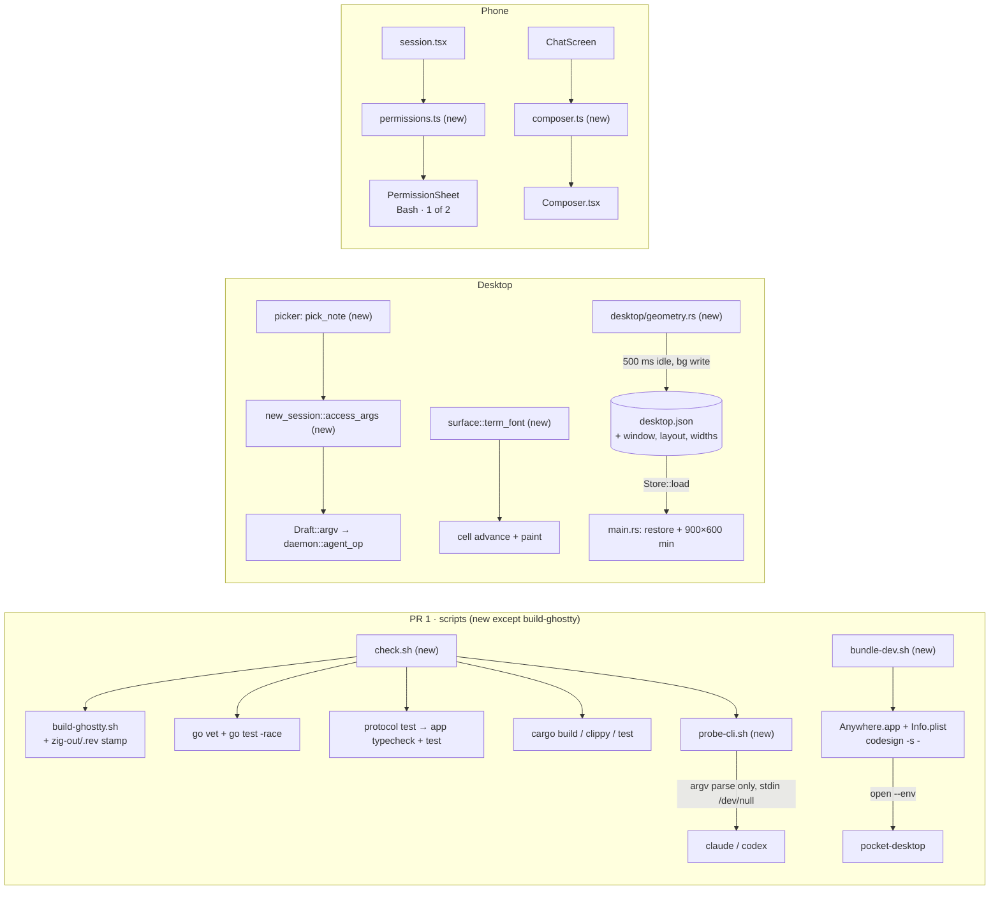

# E01 Fix-now Implementation Plan

> **For Claude:** REQUIRED SUB-SKILL: Use /implement to execute this plan task-by-task.

**Goal:** Fix five things that are broken or missing today. Agents start with both access flags, and codex never gets `--full-auto`. The Terminal draws no ligatures. The phone can send while an agent works and keeps every permission request. The desktop window reopens where it was. One script runs every check.

**Base:** main `5091a01`. Every `path:line` below is at that commit.

**Design:** `docs/designs/2026-09-30-fix-now.md`. Roadmap: `docs/orchestrators/product/05-roadmap.md` §3 E01.

**Toolset** (paths relative to the repo root `/Users/mingo/Developer/self/anywhere`):
- desktop, one test: `cd packages/desktop && cargo test -p <crate> <test_name>` (crates here: `pocket`, `store`)
- desktop, full (every desktop PR boundary): `cd packages/desktop && cargo build --workspace && cargo clippy --workspace --all-targets && cargo test --workspace`. Clippy must add no new warnings. Main already has nine: `git.rs:101` `double_ended_iterator_last`, three `field_reassign_with_default` in `pocket/src/inbox.rs:137-158`, and five `single_range_in_vec_init` in the git lib test at `git.rs:602-604`.
- pocketd: `cd packages/pocketd && go vet ./... && go test -race -count=1 ./...`
- protocol: `pnpm --filter @pocket/protocol test` (it also builds the `dist` the app's types need)
- phone: `pnpm --filter @pocket/app typecheck && pnpm --filter @pocket/app test`
- After PR 1 merges: `scripts/check.sh` runs all of the above in order.
- View check: `.ui-review/fixture/capture.sh <dir> <name>=<steps>…`, before and after, then compare.
- The shell is fish. Use `env VAR=value cmd`, not `VAR=value cmd`. Quote globs.

**Scratch pocketd** (05-roadmap §7). Never start, stop or restart the pocketd you are working in. Every manual check below runs against this one:
```
mkdir -p /tmp/pocket-scratch/bin
echo '{"token":"scratch","port":4599}' > /tmp/pocket-scratch/config.json
cd packages/pocketd && env -u POCKETD_PTY POCKET_HOME=/tmp/pocket-scratch POCKETD_SOCK=/tmp/pocket-scratch/pocketd.sock go run ./cmd/pocketd serve
```
Point every other command at it with the prefix `env -u POCKETD_PTY POCKET_HOME=/tmp/pocket-scratch POCKETD_SOCK=/tmp/pocket-scratch/pocketd.sock` (called **SCRATCH** below). A fake claude that asks for permissions without a paid turn: `cd packages/pocketd && go build -o /tmp/pocket-scratch/bin/claude ./e2e/fakeclaude`. Put `/tmp/pocket-scratch/bin` first on `PATH` when you want it.

**UX decisions this plan uses** (05-roadmap §7.1, verbatim):

| UX section | Spec says | Winning decision | Text to build |
|---|---|---|---|
| UXP §4.8 Codex hint | "Codex plan needs a chat session" | D14, D31 | "Codex can't plan first in a terminal session" |
| UXP §4.4 / UXD §3.7 composer | Queue (Claude) / Steer (Codex) | D37 + E01 PR4 step 0 | Working + text → "Queue" for a provider where step 0 shows that the text queues, else "Send". "Steer" waits for E10 |
| UXD §7 constraint 1 | tokens (Phase 1, incl. dark) before everything | D26 | E16 PR1 (light `Palette`) lands before E08 PR1 and every later desktop component. E01 and E04 PR4 predate it and use the existing constants. Dark waits for S1 |
| UXD §2.0 Palette struct | `Palette` + `LIGHT`/`DARK` statics + `p(cx)` | Owner's dark-theme plan | `theme::Token { light, dark }` consts, read as `theme::X` (`Into<Hsla>`); `Token::pick(dark)` in tests. No `Palette`, no `p(cx)` |
| UXD §7 constraint 1, D26 dark | Dark waits for S1 | Owner's dark-theme plan | Dark ships with the owner's plan and follows macOS appearance; no Appearance action. E16 PR1 lands on top of it |

**Rebased on 5091a01** (what changed from the design, which cites `f8f7293`):
- The dark theme has landed (`1e71e24`). New code uses `theme::X` tokens directly (`TEXT_4`, `FILL_2`). There is no `rgba(theme::X)` and no `u32` colour in any touched code.
- `surface.rs` moved with mouse selection (`5091a01`). The two `font(MONO)` lines are now `:24` and `:93`, not `:21` and `:59`.
- The old argv test is `new_session.rs:429-443`, not `:430-443`.
- The broker lives at `packages/pocketd/internal/broker/broker.go:44-52`, not `internal/daemon/broker.go`. Ids are still `perm-N`, restarting with each process.
- The installed codex is `0.159.2`; the probe results the design lists hold on it.
- `Composer` gets a second prop, `providerName`, for the Queue hint "Sends while Claude works". ChatScreen already has the display name (`ChatScreen.tsx:55,84`).
- `Geometry` keeps the latest window snapshot itself and copies it into `Store` only when it writes. That way capture mode never changes `store.window`.
- The codex Plan hint is built from `provider_name`, so the text reads "Codex can't plan first in a terminal session".
- `LSMinimumSystemVersion` is `11.0`. The workspace sets no macOS floor, and 11.0 is rustc's default for `aarch64-apple-darwin`.

**Read first:**
- `docs/designs/2026-09-30-fix-now.md` §5 (contract) and §10 (decisions). This plan builds exactly that.
- `CLAUDE.md` (repo root): the desktop layout rules. Logic goes in free functions or plain types; tests sit beside the logic and are named as sentences; there are no comments that restate code.
- `packages/desktop/crates/pocket/src/explorer/preview/header.rs:19-31`. This is the `cx.spawn` + `background_executor().timer` debounce that `save_soon` copies.
- `packages/app/test/status.test.mts`. This is the phone test style: `node:test`, and imports from `../src/x.ts`.

---

## Architecture



Five independent PRs; none changes the protocol, pocketd or any caps. PR 1 adds shell scripts only. PR 2 and PR 3 each change one desktop module. PR 4 moves two phone decisions into pure modules with tests: which button the composer shows, and which permission requests are open. PR 5 adds three keys to `desktop.json` and one new module that restores and saves the window.

## Why this approach

- Codex access is `-s <sandbox> -a on-request`, and claude always gets an explicit `--permission-mode` (D12, D31). Rejected: `-a untrusted`, which codex 0.159 refuses, and `--full-auto`, which codex 0.159.2 refuses outright. That makes today's codex Auto-edit spawn fail.
- Codex has no plan-first in a terminal session, so its Plan row is disabled and explains why (D31). Picking codex resets Plan to Ask, and `ready()` refuses the pair. Rejected: hiding the row, because then nothing says why it's missing.
- Ligatures are off unconditionally with `liga`, `calt` and `dlig` set to 0 (D32). Rejected: `disable_ligatures()`, which clears only `calt`, and a settings toggle.
- One font function is used for both measuring and painting. Rejected: paint only, because the cell width could then drift from what is painted.
- claude is probed with a made-up flag after the mode, plus a bogus mode that must fail. Rejected: `claude --permission-mode X --version`, which exits 0 for any X, and a real turn, which costs money.
- codex is probed with `--version` after the flags, because clap checks values first. Effort levels are printed, never gated, because codex doesn't check `-c` values.
- check.sh stops at the first failure and runs tests against a scratch pocketd home (D33). Rejected: running everything and reporting at the end, and trusting each test to isolate itself.
- The libghostty cache is a stamp file inside the ignored `zig-out`. A `third_party` symlinked to another checkout is only read, never rebuilt, because other checkouts link against its lib. Rejected: a shared cache under `~/Library/Caches`.
- bundle-dev builds release, because notifications and speed are judged in release. The bundle id is `dev.mingo.anywhere.desktop`, next to the phone's `dev.mingo.anywhere`.
- The composer keeps UXP's two-argument `composerAction`; the provider only picks the label. Both providers read "Send" until the owner records step 0 (D37).
- Permissions are a map of open requests plus the resolves waiting for an ack. A request leaves the sheet on ack or `permission.resolved`, not when tapped. The map resets on `hello.ok`, because pocketd resends every open request and ids restart with each pocketd process. Rejected: today's optimistic clear, which loses the page when a send fails.
- The header shows "Bash · 1 of 2", or just "Bash" when there is one request.
- Window geometry is the display uuid plus a rect relative to that display. Fullscreen and maximized save their restore bounds. The file is encoded on the UI thread and written on the background executor 500 ms after the last change, and written once more on quit. Rejected: a sync `save()` on every resize event.
- `Layout` moves into `store` with serde. Rejected: a string copy of it.
- Capture mode neither restores nor saves geometry.

## Tasks at a glance

**PR 1 · Scripts: check, probe-cli, bundle-dev.** New scripts only; no product code changes.

| Task | What | Main files | Risk |
|---|---|---|---|
| 1.1 | Skip the libghostty build when the stamp matches `REV` | `scripts/build-ghostty.sh` | Low |
| 1.2 | Probe claude/codex flags without a turn | `scripts/probe-cli.sh` (new) | Low: parses CLI error text; negative controls catch drift |
| 1.3 | One gate: every suite against a scratch pocketd | `scripts/check.sh` (new) | Low |
| 1.4 | Signed dev bundle so notifications fire | `scripts/bundle-dev.sh` (new) | Medium: needs a manual notification check |

**PR 2 · Spawn agents with both access axes; codex can't plan first.**

| Task | What | Main files | Risk |
|---|---|---|---|
| 2.1 | `access_args` table drives argv and `ready` | `pocket/src/modals/new_session.rs` | Low |
| 2.2 | Picking codex drops Plan | `new_session.rs`, `new_session/picker.rs` | Low |
| 2.3 | Codex Plan row is a disabled note with the hint | `new_session/picker.rs` | Low |

**PR 3 · Terminal ligatures off.**

| Task | What | Main files | Risk |
|---|---|---|---|
| 3.1 | `term_font()` with liga/calt/dlig off | `pocket/src/terminal_view/surface.rs` | Low |
| 3.2 | Measure and paint with `term_font()` | `surface.rs:24`, `:93` | Low |
| 3.3 | Look at `-> != --yolo ===` on a scratch pocketd | none | Low |

**PR 4 · Phone composer Send/Queue/Stop and a permissions map.**

| Task | What | Main files | Risk |
|---|---|---|---|
| 4.1 | Composer action and label rules | `app/src/composer.ts` (new), `test/composer.test.mts` (new) | Low |
| 4.2 | Composer uses them; blank Send is disabled | `components/Composer.tsx`, `screens/ChatScreen.tsx` | Low |
| 4.3 | Permissions map: add, sent, ack, resolved, failed | `app/src/permissions.ts` (new), `test/permissions.test.mts` (new) | Low |
| 4.4 | Session keeps every request; sheet header counts them | `session.tsx`, `App.tsx`, `PermissionSheet.tsx`, `ChatScreen.tsx` | Medium: reconnect and ack paths |
| 4.5 | Step 0 (owner, paid): does mid-turn text queue? Set `QUEUES` | `app/src/composer.ts` | Needs the owner |

**PR 5 · Remember window bounds, layout and widths; 900×600 minimum.**

| Task | What | Main files | Risk |
|---|---|---|---|
| 5.1 | `desktop.json` gains `window`, `layout`, `widths`; `Layout` moves to `store` | `store/src/store.rs`, `pocket/src/desktop/chrome.rs` | Low |
| 5.2 | `restore` / `snapshot` pure functions | `pocket/src/desktop/geometry.rs` (new) | Medium: display maths |
| 5.3 | Debounced background save; layout and widths seed from the store | `geometry.rs`, `desktop.rs`, `chrome.rs`, `capture.rs` | Medium |
| 5.4 | Open the window where it was, with a minimum size | `pocket/src/main.rs` | Low |

---

## PR 1: Scripts: check, probe-cli, bundle-dev

**Scope:** `scripts/build-ghostty.sh` gets a cache stamp; `scripts/probe-cli.sh`, `scripts/check.sh` and `scripts/bundle-dev.sh` are new. No `.github/workflows/ci.yml` (waits on owner Q3). No product code changes.
**Depends on:** nothing (no cross-epic PRs; 05-roadmap §4)
**Done when:** `scripts/check.sh` ends with `check: ok` on this branch. A second run prints `ghostty ok (cached 4ae9f1a)`, or `ghostty ok (shared 4ae9f1a)` where `third_party` is a symlink. `scripts/probe-cli.sh` exits 0. `scripts/bundle-dev.sh --no-open` makes an app that passes `codesign -v` and `plutil -lint`, and the notification smoke check shows a banner.

### Task 1.1: libghostty build cache

**What & why:** Today every build of libghostty runs `zig build`, even at the same commit. A stamp in `zig-out` lets check.sh skip it. This comes first because check.sh calls it.

**Files:**
- Modify: `scripts/build-ghostty.sh:1-11` (whole file)

**Context:** `REV` pins libghostty (`:4`). `zig-out/` sits inside `third_party/ghostty`, which is gitignored. In a real `third_party`, the first run after this change still builds once, because no stamp exists yet. In a worktree (05-roadmap §7), `third_party` is a symlink to the owner's checkout, whose `libghostty-vt.a` other agents link against. The script never checks out, builds or writes there: it accepts the lib when that checkout's `HEAD` is `REV`, and otherwise fails and names the checkout to build in. Never run `zig build` or `git checkout` through the symlink yourself.

**Step 1: Record today's state (read-only; builds nothing)**

Run: `git -C third_party/ghostty rev-parse --short HEAD; ls third_party/ghostty/zig-out/.rev`
Expected: `4ae9f1a`, then `ls: third_party/ghostty/zig-out/.rev: No such file or directory`.

**Step 2: Write the implementation**

Replace the whole file:
```sh
#!/bin/sh
# libghostty's C API has no stable version yet, so the commit is pinned.
set -eu
REV=4ae9f1a2de5484de3d6a13fe03676b8853b9c41c
ROOT="$(cd "$(dirname "$0")/.." && pwd)"
DIR="$ROOT/third_party/ghostty"
LIB="$DIR/zig-out/lib/libghostty-vt.a"
STAMP="$DIR/zig-out/.rev"
SHORT=$(echo "$REV" | cut -c1-7)
if [ -f "$LIB" ] && [ "$(cat "$STAMP" 2>/dev/null)" = "$REV" ]; then
  echo "ghostty ok (cached $SHORT)"
  exit 0
fi
# A linked third_party belongs to another checkout whose lib others link against: read it, never rebuild it.
if [ -L "$ROOT/third_party" ]; then
  if [ -f "$LIB" ] && [ "$(git -C "$DIR" rev-parse HEAD 2>/dev/null)" = "$REV" ]; then
    echo "ghostty ok (shared $SHORT)"
    exit 0
  fi
  echo "build-ghostty: $(readlink "$ROOT/third_party")/ghostty isn't built at $SHORT; run scripts/build-ghostty.sh in that checkout" >&2
  exit 1
fi
if [ ! -d "$DIR/.git" ]; then
  git clone https://github.com/ghostty-org/ghostty.git "$DIR"
fi
git -C "$DIR" checkout --quiet "$REV"
cd "$DIR"
zig build -Demit-lib-vt -Doptimize=ReleaseFast
echo "$REV" > "$STAMP"
```

**Step 3: Verify**

Run: `sh -n scripts/build-ghostty.sh && scripts/build-ghostty.sh && scripts/build-ghostty.sh; ls third_party/ghostty/zig-out/.rev`
Expected, where `third_party` is a symlink (every worktree): both runs print `ghostty ok (shared 4ae9f1a)` and nothing builds; `ls` still fails with `No such file or directory` (until the owner runs the script in their checkout, when both runs print `ghostty ok (cached 4ae9f1a)`).
Expected, in a real `third_party` (the owner's checkout): the first run builds (or finishes quickly from zig's cache) and writes `zig-out/.rev`; the second prints `ghostty ok (cached 4ae9f1a)` and exits 0.

### Task 1.2: probe-cli.sh

**What & why:** This notices when claude or codex rename a flag the desktop spawns them with, without starting a turn. check.sh runs it last, so it comes before check.sh.

**Files:**
- Create: `scripts/probe-cli.sh` (mode 755)

**Context:** These facts were verified on claude 2.1.285 and codex-cli 0.159.2.
- `claude -p --permission-mode <mode> --pocket-probe </dev/null` checks the mode first. A valid mode then fails with `error: unknown option '--pocket-probe'` (exit 1). A bad mode fails with `argument 'X' is invalid`. `default` is accepted even though the error text doesn't list it.
- `codex <flags> --version` exits 0 only when every flag parses, because clap validates before `--version` answers. `-a untrusted` and `--full-auto` exit 2.
- `codex debug models --bundled` prints the model list offline.
- Later epics (E06 PR2, E09 PR3) add lines that call `claude_mode`, `codex_ok` and `codex_bad`.

**Step 1: Write the failing check**

Run: `scripts/probe-cli.sh`
Expected: FAIL with `no such file or directory` (fish: `Unknown command`).

**Step 2: Write the implementation**

```sh
#!/bin/sh
# Checks that the flags the desktop spawns agents with still parse. Every probe stops at argument
# parsing with stdin closed, so none starts a turn. Exits 1 on any drift; a missing CLI is skipped.
set -eu
DRIFT=0

drift() {
  echo "probe: DRIFT $1: $2"
  DRIFT=1
}

# claude checks --permission-mode before it rejects the unknown sentinel, so reaching the sentinel
# means the mode parsed. `--version` can't probe: it exits 0 whatever the mode.
claude_parses() {
  err=$(claude -p --permission-mode "$1" --pocket-probe </dev/null 2>&1 >/dev/null) || true
  case $err in *"unknown option '--pocket-probe'"*) return 0 ;; esac
  printf '%s\n' "$err" | head -n 1
  return 1
}
claude_mode() { why=$(claude_parses "$1") || drift "claude --permission-mode $1" "$why"; }
claude_bad_mode() {
  if claude_parses "$1" >/dev/null; then drift "claude --permission-mode $1" "accepted; the probe can't see a bad mode"; fi
}

# clap validates every value before `--version` answers.
codex_parses() {
  err=$(codex "$@" --version </dev/null 2>&1 >/dev/null) && return 0
  printf '%s\n' "$err" | head -n 1
  return 1
}
codex_ok() { why=$(codex_parses "$@") || drift "codex $*" "$why"; }
codex_bad() {
  if codex_parses "$@" >/dev/null; then drift "codex $*" "accepted; the probe can't see a bad value"; fi
}

versions=""
if command -v claude >/dev/null 2>&1; then
  versions="claude $(claude --version </dev/null | cut -d' ' -f1)"
  claude_mode default
  claude_mode acceptEdits
  claude_mode plan
  claude_bad_mode pocket-bogus
else
  echo "probe: skip claude (not on PATH)"
fi
if command -v codex >/dev/null 2>&1; then
  versions="${versions:+$versions · }$(codex --version </dev/null)"
  codex_ok -s read-only -a on-request
  codex_ok -s workspace-write -a on-request
  codex_ok -c model_reasoning_effort=high
  codex_bad -a untrusted
  codex_bad --full-auto
  # -c values aren't validated at parse time, so the efforts are shown, never gated.
  efforts=$(codex debug models --bundled </dev/null 2>/dev/null | grep -o '"effort":"[a-z]*"' | cut -d'"' -f4 | awk '!seen[$0]++' | paste -sd ' ' -)
  echo "probe: codex efforts: ${efforts:-unknown}"
else
  echo "probe: skip codex (not on PATH)"
fi
[ -z "$versions" ] || echo "probe: $versions"
exit "$DRIFT"
```
Then `chmod +x scripts/probe-cli.sh`.

**Step 3: Verify it passes, and that it catches drift**

Run: `sh -n scripts/probe-cli.sh && scripts/probe-cli.sh; echo "exit=$status"` (fish; use `$?` in sh)
Expected:
```
probe: codex efforts: low medium high xhigh max ultra
probe: claude 2.1.285 · codex-cli 0.159.2
exit=0
```

Then use a stub codex that refuses `-a`:
```
set stub (mktemp -d)
printf '#!/bin/sh\nfor a; do [ "$a" = -a ] && { echo "error: unexpected argument -a found" >&2; exit 2; }; done\necho codex-cli 9.9.9\n' > $stub/codex; chmod +x $stub/codex
env PATH="$stub:$PATH" scripts/probe-cli.sh; echo "exit=$status"; rm -rf $stub
```
Expected: `probe: DRIFT codex -s read-only -a on-request: error: unexpected argument -a found`, the same for `workspace-write`, `probe: DRIFT codex --full-auto: accepted; the probe can't see a bad value`, `probe: codex efforts: unknown`, `probe: claude 2.1.285 · codex-cli 9.9.9`, then `exit=1`.

### Task 1.3: check.sh

**What & why:** This is one command for the whole PR gate (D33). It isolates pocketd, so a run from inside a Pocket Terminal never reaches the pocketd hosting it.

**Files:**
- Create: `scripts/check.sh` (mode 755)

**Context:** The steps come from 05-roadmap §7, in dependency order. The protocol test builds `dist`, which the app typecheck needs. Clippy runs without `-D warnings` because main already warns (see Toolset). `pnpm install --frozen-lockfile` fails on lockfile drift, and that is intended. `desktop()` and `pocketd_tests()` are subshell functions, so their `cd` doesn't leak.

**Step 1: Write the failing check**

Run: `scripts/check.sh`
Expected: FAIL with `no such file or directory`.

**Step 2: Write the implementation**

```sh
#!/bin/sh
# Every gate a PR passes, stopping at the first failure. Tests get a scratch pocketd home,
# so a run from inside a Pocket terminal never reaches the pocketd that hosts it.
set -eu
ROOT="$(cd "$(dirname "$0")/.." && pwd)"
POCKET_HOME="$(mktemp -d)"
POCKETD_SOCK="$POCKET_HOME/pocketd.sock"
export POCKET_HOME POCKETD_SOCK
unset POCKETD_PTY
trap 'rm -rf "$POCKET_HOME"' EXIT
cd "$ROOT"

step() {
  name=$1
  shift
  echo "check: $name"
  status=0
  "$@" || status=$?
  if [ "$status" -ne 0 ]; then
    echo "check: FAILED $name"
    exit "$status"
  fi
}

pocketd_tests() (cd packages/pocketd && go vet ./... && go test -race -count=1 ./...)
desktop() (cd packages/desktop && "$@")

step ghostty scripts/build-ghostty.sh
step install pnpm install --frozen-lockfile --prefer-offline
step pocketd pocketd_tests
step "protocol test" pnpm --filter @pocket/protocol test
step "app typecheck" pnpm --filter @pocket/app typecheck
step "app test" pnpm --filter @pocket/app test
step "desktop build" desktop cargo build --workspace
step "desktop clippy" desktop cargo clippy --workspace --all-targets
step "desktop test" desktop cargo test --workspace
step probe scripts/probe-cli.sh
echo "check: ok"
```
Then `chmod +x scripts/check.sh`.

**Step 3: Verify it passes**

Run: `sh -n scripts/check.sh && scripts/check.sh`
Expected: `check: <step>` lines in order, the second line is `ghostty ok (cached 4ae9f1a)` (`ghostty ok (shared 4ae9f1a)` where `third_party` is a symlink), and the last line is `check: ok`. Clippy prints the nine warnings from Toolset; check.sh doesn't gate on them.

**Step 4: Verify it stops at a failure**

Add `test("fails on purpose", () => { throw new Error("x"); });` to the end of `packages/app/test/status.test.mts`, then run `scripts/check.sh; echo "exit=$status"`.
Expected: `check: FAILED app test` and `exit=1`, with no `check: desktop build` line. Remove the test again and confirm `git diff packages/app/test` is empty.

### Task 1.4: bundle-dev.sh

**What & why:** gpui-pre-macos turns notifications off when the process has no bundle id (`system_notifications.rs:118-127`), so `cargo run` never shows a banner. This builds a signed `Anywhere.app` for dev. E08 PR5 depends on it.

**Files:**
- Create: `scripts/bundle-dev.sh` (mode 755)

**Context:** `open` gives the app launchd's environment, not the shell's, so a scratch `POCKETD_SOCK` / `POCKET_HOME` must be passed with `open --env`. The binary is `pocket-desktop` (`packages/desktop/crates/pocket/Cargo.toml`). If `CARGO_TARGET_DIR` is set, the build lands there, and the script follows it.

**Step 1: Write the failing check**

Run: `scripts/bundle-dev.sh --no-open`
Expected: FAIL with `no such file or directory`.

**Step 2: Write the implementation**

```sh
#!/bin/sh
# Builds a signed Anywhere.app and opens it: macOS drops notifications from a binary with no bundle id.
# The ad-hoc signature changes every build, so macOS may ask to allow notifications again.
# Usage: scripts/bundle-dev.sh [--no-open]
set -eu
ROOT="$(cd "$(dirname "$0")/.." && pwd)"
ID=dev.mingo.anywhere.desktop
OPEN=1
case "${1:-}" in
  --no-open) OPEN=0 ;;
  "") ;;
  *) echo "usage: scripts/bundle-dev.sh [--no-open]" >&2; exit 2 ;;
esac
TARGET="${CARGO_TARGET_DIR:-$ROOT/packages/desktop/target}"
(cd "$ROOT/packages/desktop" && cargo build --release -p pocket)
APP="$TARGET/release/Anywhere.app"
rm -rf "$APP"
mkdir -p "$APP/Contents/MacOS"
cp "$TARGET/release/pocket-desktop" "$APP/Contents/MacOS/pocket-desktop"
cat > "$APP/Contents/Info.plist" <<PLIST
<?xml version="1.0" encoding="UTF-8"?>
<!DOCTYPE plist PUBLIC "-//Apple//DTD PLIST 1.0//EN" "http://www.apple.com/DTDs/PropertyList-1.0.dtd">
<plist version="1.0">
<dict>
  <key>CFBundleIdentifier</key><string>$ID</string>
  <key>CFBundleName</key><string>Pocket</string>
  <key>CFBundleExecutable</key><string>pocket-desktop</string>
  <key>CFBundlePackageType</key><string>APPL</string>
  <key>CFBundleShortVersionString</key><string>0.0.0</string>
  <key>CFBundleVersion</key><string>1</string>
  <key>NSHighResolutionCapable</key><true/>
  <key>LSMinimumSystemVersion</key><string>11.0</string>
</dict>
</plist>
PLIST
codesign --force --sign - "$APP"
if [ "$OPEN" = 0 ]; then
  echo "bundle-dev: built $APP"
  exit 0
fi
osascript -e "if application id \"$ID\" is running then tell application id \"$ID\" to quit" >/dev/null 2>&1 || true
LOG="${TMPDIR:-/tmp/}pocket-dev.log"
# `open` hands the app launchd's environment, not this shell's, so a scratch pocketd is passed on.
set --
for name in POCKETD_SOCK POCKET_HOME; do
  eval "value=\${$name:-}"
  if [ -n "$value" ]; then set -- "$@" --env "$name=$value"; fi
done
open -n --stdout "$LOG" --stderr "$LOG" "$@" "$APP"
echo "bundle-dev: open $APP · log $LOG"
```
Then `chmod +x scripts/bundle-dev.sh`.

**Step 3: Verify the bundle**

Run (sh; in fish use `set T (…)`): `T="${CARGO_TARGET_DIR:-packages/desktop/target}"; sh -n scripts/bundle-dev.sh && scripts/bundle-dev.sh --no-open && codesign -v "$T/release/Anywhere.app" && plutil -lint "$T/release/Anywhere.app/Contents/Info.plist"`
Expected: `…/Anywhere.app: replacing existing signature` (the linker already ad-hoc signs arm64 binaries), `bundle-dev: built …/Anywhere.app`, no output from `codesign -v`, then `…/Info.plist: OK`.

**Step 4: Notification smoke check (manual, free)**

1. Start the scratch pocketd (header) and build the fake claude into `/tmp/pocket-scratch/bin`.
2. `SCRATCH scripts/bundle-dev.sh` opens the app against the scratch pocketd and prints the log path.
3. In Terminal.app: `cd packages/pocketd && env PATH="/tmp/pocket-scratch/bin:$PATH" SCRATCH go run ./cmd/pocketd run claude`. Type `run ls` and press Return.
4. Focus another app. Expected: a macOS banner for the permission request. Click Allow if macOS asks first.

---

## PR 2: Spawn agents with both access axes; codex can't plan first

**Scope:** The New session form passes access flags for both providers, and its codex Plan row is a disabled note. Labels stay "Ask" / "Auto-edit" / "Plan only". Access labels and the launch spec are E06 PR4.
**Depends on:** nothing
**Done when:** the desktop full line is green, and a codex session started from the form runs as `codex -s read-only -a on-request` (Ask) or `-s workspace-write -a on-request` (Auto-edit).

### Task 2.1: `access_args` drives argv and `ready`

**What & why:** One table decides the flags for each provider and access (design §5.2). It replaces the match that sends codex `--full-auto`, which codex 0.159.2 refuses, and that passes no flags for Ask.

**Files:**
- Modify: `packages/desktop/crates/pocket/src/modals/new_session.rs:72-93` (`argv`, `ready`, end of `impl Draft`)
- Modify: `packages/desktop/crates/pocket/src/modals/new_session.rs:408` (test imports)
- Modify: `packages/desktop/crates/pocket/src/modals/new_session.rs:429-443` (replaces `the_agent_runs_with_its_permission_flags_then_the_prompt`)
- Test: same file, `mod tests`

**Context:** `Draft` holds the form's choices; `provider` is `"claude"` or `"codex"` (`picker.rs:84`). `start_session` (`new_session.rs:265-314`) spawns `f.argv(prompt)` only when `ready` is true. `access_args` returns `None` for a pair a terminal session can't start, which today is only codex × Plan.

**Step 1: Write the failing tests**

Replace `:408` with:
```rust
    use super::{Draft, Perm, access_args, auto_name, default_first, name_problem, plans_first, slug};
```
Replace `:429-443` with:
```rust
    #[test]
    fn every_provider_and_access_spawns_with_both_axes() {
        let argv = |provider, perm| Draft { provider, perm, ..Draft::default() }.argv("  Fix CI  ").join(" ");
        let got = [("claude", Perm::Ask), ("claude", Perm::AutoEdit), ("claude", Perm::Plan), ("codex", Perm::Ask), ("codex", Perm::AutoEdit)].map(|(p, m)| argv(p, m));
        let want = [
            "claude --permission-mode default Fix CI",
            "claude --permission-mode acceptEdits Fix CI",
            "claude --permission-mode plan Fix CI",
            "codex -s read-only -a on-request Fix CI",
            "codex -s workspace-write -a on-request Fix CI",
        ];
        assert_eq!(got, want.map(String::from));
        assert_eq!(Draft::default().argv(" \n "), ["claude", "--permission-mode", "default"].map(String::from));
    }

    #[test]
    fn codex_cannot_plan_first_in_a_terminal_session() {
        assert_eq!((plans_first("claude"), plans_first("codex")), (true, false));
        assert!(access_args("codex", Perm::Plan).is_none());
        assert!(!Draft { provider: "codex", perm: Perm::Plan, ..Draft::default() }.ready("", true));
    }

    #[test]
    fn no_spawn_ever_passes_full_auto() {
        for provider in ["claude", "codex"] {
            for perm in [Perm::Ask, Perm::AutoEdit, Perm::Plan] {
                let argv = Draft { provider, perm, ..Draft::default() }.argv("go");
                assert!(!argv.iter().any(|a| a == "--full-auto"), "{provider} {perm:?}");
            }
        }
    }
```
The first test pins the design's argv table. The second shows codex × Plan can't start. The third guards against `--full-auto` coming back.

**Step 2: Run the tests to verify they fail**

Run: `cd packages/desktop && cargo test -p pocket modals::new_session`
Expected: FAIL with `error[E0432]: unresolved imports `super::access_args`, `super::plans_first``.

**Step 3: Write the implementation**

Replace `:72-93` (`argv`, `ready` and the closing `}` of `impl Draft`) with:
```rust
    fn argv(&self, prompt: &str) -> Vec<String> {
        let access = access_args(self.provider, self.perm).unwrap_or_default();
        let prompt = prompt.trim();
        std::iter::once(self.provider).chain(access.iter().copied()).chain((!prompt.is_empty()).then_some(prompt)).map(String::from).collect()
    }

    /// `in_tree`: a worktree is open to start the session in.
    fn ready(&self, name: &str, in_tree: bool) -> bool {
        let place = if self.worktree {
            self.repo.is_some() && !self.branches.is_empty() && name_problem(name, &self.taken).is_none()
        } else {
            in_tree
        };
        place && access_args(self.provider, self.perm).is_some()
    }
}

/// `None`: the provider can't start with this access in a terminal session.
fn access_args(provider: &str, perm: Perm) -> Option<&'static [&'static str]> {
    match (provider, perm) {
        ("claude", Perm::Ask) => Some(&["--permission-mode", "default"]),
        ("claude", Perm::AutoEdit) => Some(&["--permission-mode", "acceptEdits"]),
        ("claude", Perm::Plan) => Some(&["--permission-mode", "plan"]),
        ("codex", Perm::Ask) => Some(&["-s", "read-only", "-a", "on-request"]),
        ("codex", Perm::AutoEdit) => Some(&["-s", "workspace-write", "-a", "on-request"]),
        _ => None,
    }
}

fn plans_first(provider: &str) -> bool {
    access_args(provider, Perm::Plan).is_some()
}
```

**Step 4: Run the tests to verify they pass**

Run: `cd packages/desktop && cargo test -p pocket modals::new_session`
Expected: PASS (`test result: ok. 9 passed`). The two `ready` tests at `:411-427` still pass.

### Task 2.2: Picking codex drops Plan

**What & why:** With claude + Plan selected, switching to codex would leave the form on a pair that can't start. The switch resets access to Ask, and the chip suffix follows (`picker.rs:137-141`).

**Files:**
- Modify: `packages/desktop/crates/pocket/src/modals/new_session.rs` (add `pick_provider` inside `impl Draft`, after `ready` from Task 2.1)
- Modify: `packages/desktop/crates/pocket/src/modals/new_session/picker.rs:90` (provider click)
- Test: `new_session.rs` `mod tests`

**Context:** The provider row's click (`picker.rs:89-91`) sets the provider and closes the picker in one tuple assignment. The new method does both, and also fixes access.

**Step 1: Write the failing test**

Add to `mod tests`, after `codex_cannot_plan_first_in_a_terminal_session`:
```rust
    #[test]
    fn picking_codex_drops_plan_first() {
        let mut draft = Draft { perm: Perm::Plan, ..Draft::default() };
        draft.pick_provider("codex");
        assert_eq!((draft.provider, draft.perm), ("codex", Perm::Ask));
        let mut draft = Draft { perm: Perm::AutoEdit, ..Draft::default() };
        draft.pick_provider("codex");
        assert_eq!(draft.perm, Perm::AutoEdit);
    }
```
It shows that Plan falls back to Ask, while any access codex supports is kept.

**Step 2: Run the test to verify it fails**

Run: `cd packages/desktop && cargo test -p pocket picking_codex_drops_plan_first`
Expected: FAIL with `error[E0599]: no method named `pick_provider` found for struct `Draft``.

**Step 3: Write the implementation**

In `new_session.rs`, add after `ready` inside `impl Draft`:
```rust
    fn pick_provider(&mut self, provider: &'static str) {
        (self.provider, self.picker) = (provider, None);
        if access_args(provider, self.perm).is_none() {
            self.perm = Perm::Ask;
        }
    }
```
In `picker.rs`, replace `:90`:
```rust
                        (this.new_form.draft.provider, this.new_form.draft.picker) = (provider, None);
```
with:
```rust
                        this.new_form.draft.pick_provider(provider);
```

**Step 4: Run the tests to verify they pass**

Run: `cd packages/desktop && cargo test -p pocket modals::new_session`
Expected: PASS (`test result: ok. 10 passed`).

### Task 2.3: Codex Plan row is a disabled note

**What & why:** The menu shows why Plan is missing for codex instead of offering it (§7.1 hint, D31).

**Files:**
- Modify: `packages/desktop/crates/pocket/src/modals/new_session/picker.rs:2` (import)
- Modify: `packages/desktop/crates/pocket/src/modals/new_session/picker.rs:30-32` (add `pick_note` after `pick_head`)
- Modify: `packages/desktop/crates/pocket/src/modals/new_session/picker.rs:97-98` (Permissions loop)

**Context:** The menu is 260 wide (`:107`). `pick_row` rows are 34 tall with 8 horizontal padding (`:34-52`). The note uses the same padding, is not clickable, and uses `TEXT_4` (a `theme::Token`). There's no test: CLAUDE.md forbids render tests, and Tasks 2.1-2.2 test the rule behind the row.

**Step 1: Write the implementation**

Replace `:2`:
```rust
use crate::modals::new_session::{Perm, plans_first};
```
Insert after `:32` (end of `pick_head`):
```rust

fn pick_note(label: &str, hint: &str) -> Div {
    div()
        .px(px(8.))
        .py(px(8.))
        .flex()
        .flex_col()
        .gap(px(2.))
        .text_color(TEXT_4)
        .child(div().text_size(px(13.)).font_weight(FontWeight::MEDIUM).child(label.to_string()))
        .child(div().text_size(px(11.5)).child(hint.to_string()))
}
```
In the Permissions loop, insert right after `:97` (`for (perm, label) in …{`), before `rows.push(`:
```rust
            if perm == Perm::Plan && !plans_first(f.provider) {
                rows.push(pick_note(label, &format!("{} can't plan first in a terminal session", provider_name(f.provider))).into_any_element());
                continue;
            }
```

**Step 2: Build and run the PR gate**

Run: `cd packages/desktop && cargo build --workspace && cargo clippy --workspace --all-targets && cargo test --workspace`
Expected: PASS, with no clippy warnings beyond the nine in Toolset.

**Step 3: Manual check (scratch pocketd)**

1. `cd packages/desktop && SCRATCH cargo run -p pocket`. Add any git folder as a project.
2. Open New session and the agent menu. With Claude selected, the menu is unchanged.
3. Pick Codex. Expected: "Plan only" is grey and not clickable, with "Codex can't plan first in a terminal session" under it, wrapped.
4. Select Claude → Plan only, then Codex. Expected: the chip suffix drops "· plan only".
5. Start a codex session with Auto-edit and an empty prompt. Run `pgrep -fl -- '-s workspace-write -a on-request'`. Expected: one `<pid> codex -s workspace-write -a on-request` line. Close the session.

---

## PR 3: Terminal ligatures off

**Scope:** The Terminal measures and paints with Geist Mono with `liga`, `calt` and `dlig` off. There's no setting (D32). E07 PR1 builds on this file.
**Depends on:** nothing
**Done when:** the desktop full line is green, and `-> != --yolo ===` shows one character per cell.

### Task 3.1: `term_font()`

**What & why:** Geist Mono merges `--` and `->` into ligatures, which collapses two cells into one glyph run. This adds one font with every ligature feature turned off.

**Files:**
- Modify: `packages/desktop/crates/pocket/src/terminal_view/surface.rs:4` (imports)
- Modify: `packages/desktop/crates/pocket/src/terminal_view/surface.rs:12` (add `term_font` after `SMALL`)
- Modify: `packages/desktop/crates/pocket/src/terminal_view/surface.rs:127` and `:141-142` (tests)
- Test: same file, `mod tests`

**Context:** `gpui_kit::*` re-exports gpui's `Font`, `FontFeatures(pub Arc<Vec<(String, u32)>>)` and `font(family)`. `FontFeatures::disable_ligatures()` clears only `calt`, so it isn't enough. The tests module imports named items, not `gpui_kit::*`, because gpui's glob exports a `test` macro that shadows `#[test]`.

**Step 1: Write the failing test**

Replace `:127`:
```rust
    use super::{grid_point, term_font};
```
Insert before the final `}` at `:142`:
```rust

    #[test]
    fn terminal_font_turns_off_every_ligature_feature() {
        let font = term_font();
        let features = font.features.tag_value_list();
        for tag in ["liga", "calt", "dlig"] {
            assert!(features.contains(&(tag.to_string(), 0)), "{tag}");
        }
    }
```

**Step 2: Run the test to verify it fails**

Run: `cd packages/desktop && cargo test -p pocket terminal_font_turns_off_every_ligature_feature`
Expected: FAIL with `error[E0432]: unresolved import `super::term_font``.

**Step 3: Write the implementation**

After `:4` (`use gpui_kit::*;`) add:
```rust
use std::sync::Arc;
```
After `:12` (`pub const SMALL …`) add:
```rust

/// Geist Mono with ligatures off: a merged `--` would collapse two cells into one.
pub(crate) fn term_font() -> Font {
    let off = ["liga", "calt", "dlig"].map(|tag| (tag.to_string(), 0)).to_vec();
    Font { features: FontFeatures(Arc::new(off)), ..font(MONO) }
}
```

**Step 4: Run the test to verify it passes**

Run: `cd packages/desktop && cargo test -p pocket terminal_font_turns_off_every_ligature_feature`
Expected: PASS. Clippy flags `term_font` as unused until Task 3.2.

### Task 3.2: Measure and paint with it

**What & why:** The cell advance and the painted runs must resolve the same font. Otherwise columns drift from the glyphs (decision 15).

**Files:**
- Modify: `packages/desktop/crates/pocket/src/terminal_view/surface.rs:24` (cell advance)
- Modify: `packages/desktop/crates/pocket/src/terminal_view/surface.rs:75` and `:93` (`screen`: one base font, cloned per cell)

**Context:** Line numbers are at `5091a01`; Task 3.1 shifted them by 7, so match on the quoted text. `:24` measures the width of `m` to size the grid. `:93` starts each cell's `TextRun` font, then sets bold and italic. `screen` runs for every visible cell on every notify, so the font is built once per frame and cloned per cell (a clone bumps the `FontFeatures` `Arc`). Runs merge when fonts are equal (`:108-117`), and they still will, because every cell starts from the same base.

**Step 1: Write the implementation**

`:24` becomes:
```rust
            let cell = f32::from(ts.advance(ts.resolve_font(&term_font()), px(size), 'm').ok()?.width);
```
Before `:75` (`    let mut rows = Vec::new();`, first line of the `screen` body after `ink`/`paper`) add:
```rust
    let base = term_font();
```
`:93` (`            let mut fnt = font(MONO);`) becomes:
```rust
            let mut fnt = base.clone();
```

**Step 2: Run the PR gate**

Run: `cd packages/desktop && cargo build --workspace && cargo clippy --workspace --all-targets && cargo test --workspace`
Expected: PASS, no new clippy warnings. `grep -n 'font(MONO)' crates/pocket/src/terminal_view/surface.rs` prints only the `term_font` body.

### Task 3.3: Look at it

**What & why:** CoreText applies the features. Only a real render proves they took effect.

**Files:** none

**Step 1: Manual check (scratch pocketd)**

1. `cd packages/desktop && SCRATCH cargo run --release -p pocket`. Open a Terminal tab.
2. Run `echo '-> != --yolo ==='`.
3. Expected: every character sits in its own cell. `->` is a hyphen and a `>`, not an arrow, and `--yolo` shows two hyphens. Compare with main, which draws arrows and merged dashes.
4. Capture the session screen before and after: `.ui-review/fixture/capture.sh /tmp/e01-pr3-before session=session` on main, then `…/tmp/e01-pr3-after session=session` on this branch. Expected: no layout change other than glyph shapes.

---

## PR 4: Phone composer Send/Queue/Stop and a permissions map

**Scope:** The composer button follows UXP §4.4, so a follow-up can be sent while an agent works. Every open permission request is kept, and the sheet header shows "Bash · 1 of 2". The protocol and pocketd don't change. E17 (inline approvals) and E17 PR1 copy are out of scope. Both providers read "Send" until Task 4.5 records step 0.
**Depends on:** nothing. E17 PR1–PR5 edit `Composer.tsx`, `ChatScreen.tsx`, `session.tsx` and `App.tsx` too; if any merged first, apply this PR by content as the E17 plan's "Same files as other plans" says, in reverse: read `link.state`, reset the permissions map where E17 PR2 calls `setPermission(undefined)`, and keep E17's `offline` disable and `initialText`/`onChangeText` props.
**Done when:** the phone line is green. Two open requests show "Bash · 1 of 2", and answering one shows the next.

### Task 4.1: Composer rules

**What & why:** Today a tap while Working always stops the turn (`Composer.tsx:49-55`). The rules move into a pure module so they can be tested.

**Files:**
- Create: `packages/app/src/composer.ts`
- Test: `packages/app/test/composer.test.mts` (new)

**Context:** `composerAction` is UXP §4.4 verbatim. `QUEUES` is the step-0 record: it says whether text sent mid-turn waits for the next turn. It stays `false` for both providers until Task 4.5, so the label is "Send". The tests read `QUEUES` so they stay right after 4.5 changes it. The app's typecheck reads `@pocket/protocol`'s built `dist/*.d.ts`, which a fresh worktree lacks, so every typecheck in PR 4 runs after `pnpm --filter @pocket/protocol test`.

**Step 1: Write the failing test**

`packages/app/test/composer.test.mts`:
```ts
import { test } from "node:test";
import assert from "node:assert/strict";
import { QUEUES, composerAction, composerLabel, sendDisabled } from "../src/composer.ts";

test("an idle agent always gets send", () => {
  assert.equal(composerAction(false, "fix it"), "send");
  assert.equal(composerAction(false, "  "), "send");
});

test("a working agent with text gets queue and without text gets stop", () => {
  assert.equal(composerAction(true, "also add tests"), "queue");
  assert.equal(composerAction(true, "  "), "stop");
});

test("queue reads Queue only for a provider that step 0 showed queues", () => {
  for (const provider of ["claude", "codex", "gemini"]) {
    assert.equal(composerLabel("send", provider), "Send");
    assert.equal(composerLabel("queue", provider), QUEUES[provider] ? "Queue" : "Send");
    assert.equal(composerLabel("stop", provider), "Stop");
  }
});

test("send is disabled only for blank text on an idle agent", () => {
  assert.equal(sendDisabled(false, " \n"), true);
  assert.equal(sendDisabled(false, "go"), false);
  assert.equal(sendDisabled(true, ""), false);
});
```

**Step 2: Run the test to verify it fails**

Run: `pnpm --filter @pocket/app test`
Expected: FAIL with `ERR_MODULE_NOT_FOUND` for `src/composer.ts`.

**Step 3: Write the implementation**

`packages/app/src/composer.ts`:
```ts
export type ComposerAction = "send" | "queue" | "stop";

/** Step 0 record (E01 PR4): whether text sent mid-turn waits for the next turn. */
export const QUEUES: Readonly<Record<string, boolean>> = { claude: false, codex: false };

export function composerAction(working: boolean, text: string): ComposerAction {
  if (!working) return "send";
  return text.trim() ? "queue" : "stop";
}

export function composerLabel(action: ComposerAction, provider: string): "Send" | "Queue" | "Stop" {
  if (action === "stop") return "Stop";
  return action === "queue" && QUEUES[provider] ? "Queue" : "Send";
}

export function sendDisabled(working: boolean, text: string): boolean {
  return !working && !text.trim();
}
```

**Step 4: Run the test to verify it passes**

Run: `pnpm --filter @pocket/protocol test && pnpm --filter @pocket/app typecheck && pnpm --filter @pocket/app test`
Expected: PASS (`ℹ fail 0`).

### Task 4.2: Composer uses the rules

**What & why:** This wires the button to the rules. Send or Queue submits, Stop interrupts, and a blank idle Send is dimmed and disabled. Return never stops the turn.

**Files:**
- Modify: `packages/app/src/components/Composer.tsx:5` (import), `:7-13` (Props), `:15-16` (signature), `:49-55` (button), `:84-92` (styles)
- Modify: `packages/app/src/screens/ChatScreen.tsx:173-179` (Composer props)

**Context:** `ChatScreen` computes `busy = agent?.status === "working"` (`:90`) and the display name `provider` (`:84`). `submit` (`:18-23`) already ignores blank text, and `onSubmitEditing={submit}` (`:39`) stays as it is. The a11y hint copy is UXP §9: "Sends while {Provider} works".

**Step 1: Write the implementation**

`Composer.tsx`: after `:5` add:
```tsx
import { composerAction, composerLabel, sendDisabled } from "../composer";
```
Replace `:7-16` (Props through `useState`) with:
```tsx
type Props = {
  placeholder: string;
  working: boolean;
  /** Provider id, which picks the Queue label. */
  provider: string;
  providerName: string;
  paddingBottom: number;
  onSend: (text: string) => void;
  onInterrupt: () => void;
};

export function Composer({ placeholder, working, provider, providerName, paddingBottom, onSend, onInterrupt }: Props) {
  const [text, setText] = useState("");
  const action = composerAction(working, text);
  const label = composerLabel(action, provider);
  const disabled = sendDisabled(working, text);
```
Replace `:49-55` with:
```tsx
        <Pressable
          style={[styles.send, disabled && styles.disabled]}
          disabled={disabled}
          accessibilityLabel={label}
          accessibilityHint={label === "Queue" ? `Sends while ${providerName} works` : undefined}
          accessibilityState={{ disabled }}
          onPress={action === "stop" ? onInterrupt : submit}
        >
          {action === "stop" ? <Stop size={20} color={d.bg} /> : <ArrowUp size={20} color={d.bg} />}
        </Pressable>
```
After the `send` style (`:84-91`) add, before `});`:
```tsx
  disabled: { opacity: 0.4 },
```
`ChatScreen.tsx`: replace `:175` (`busy={busy}`) with:
```tsx
          working={busy}
          provider={agent?.provider ?? ""}
          providerName={provider}
```

**Step 2: Typecheck and test**

Run: `pnpm --filter @pocket/protocol test && pnpm --filter @pocket/app typecheck && pnpm --filter @pocket/app test`
Expected: PASS.

### Task 4.3: Permissions map

**What & why:** The phone keeps only one request (`session.tsx:43`). A second request overwrites the first (`:61-63`), and a tap clears the page before pocketd answers (`:116-119`). This is the pure state that fixes all three.

**Files:**
- Create: `packages/app/src/permissions.ts`
- Test: `packages/app/test/permissions.test.mts` (new)

**Context:**
- pocketd numbers requests `perm-N`, starting again at 1 each time it restarts (`packages/pocketd/internal/broker/broker.go:44-52`). The keys aren't integer-like, so object key order is arrival order.
- A resolve goes out with a client id `cN` (`client.ts:57-60`). pocketd answers `ack {id}`, or `error {id, message}`.
- `STALE` is the error text for a request someone else already answered (`packages/pocketd/internal/wsserver/wsserver.go:158`).
- When an agent ends, pocketd's DenyAll publishes `permission.resolved` for each of its requests (`broker.go:106-110`, called from `daemon/presence.go:109`). No extra rule is needed for it.

**Step 1: Write the failing test**

`packages/app/test/permissions.test.mts`:
```ts
import { test } from "node:test";
import assert from "node:assert/strict";
import type { PermissionRequest } from "@pocket/protocol";
import { STALE, acked, add, empty, failed, header, pending, resolved, sent } from "../src/permissions.ts";

const request = (requestId: string, agentId = "a1", toolName = "Bash") =>
  ({ requestId, agentId, toolName, detail: { kind: "shell", command: "ls" } }) as PermissionRequest;

const ids = (list: PermissionRequest[]) => list.map((r) => r.requestId);

const two = add(add(empty, request("perm-1")), request("perm-2", "a2", "Edit"));

test("a second request keeps the first", () => {
  assert.deepEqual(ids(pending(two)), ["perm-1", "perm-2"]);
});

test("resolving one keeps the rest", () => {
  assert.deepEqual(ids(pending(sent(two, "c7", "perm-1"))), ["perm-2"]);
});

test("an ack drops only its request", () => {
  const p = acked(sent(two, "c7", "perm-1"), "c7");
  assert.deepEqual(Object.keys(p.open), ["perm-2"]);
  assert.deepEqual(p.sending, {});
});

test("a stale error drops silently and another error keeps the page", () => {
  const answering = sent(two, "c7", "perm-1");
  assert.deepEqual(Object.keys(failed(answering, "c7", STALE).open), ["perm-2"]);
  assert.deepEqual(ids(pending(failed(answering, "c7", "socket closed"))), ["perm-1", "perm-2"]);
});

test("resolved from another client drops it", () => {
  assert.deepEqual(ids(pending(resolved(two, "perm-2"))), ["perm-1"]);
});

test("the header counts the open requests", () => {
  assert.equal(header(two), "Bash · 1 of 2");
  assert.equal(header(resolved(two, "perm-2")), "Bash");
  assert.equal(header(empty), undefined);
});

test("pending keeps arrival order and filters by agent", () => {
  const p = add(add(add(empty, request("perm-10")), request("perm-9")), request("perm-11", "a2"));
  assert.deepEqual(ids(pending(p)), ["perm-10", "perm-9", "perm-11"]);
  assert.deepEqual(ids(pending(p, "a2")), ["perm-11"]);
});
```

**Step 2: Run the test to verify it fails**

Run: `pnpm --filter @pocket/app test`
Expected: FAIL with `ERR_MODULE_NOT_FOUND` for `src/permissions.ts`.

**Step 3: Write the implementation**

`packages/app/src/permissions.ts`:
```ts
import type { PermissionRequest } from "@pocket/protocol";

/** pocketd's answer to a resolve for a request someone else already answered. */
export const STALE = "Permission request is no longer open";

export type Permissions = {
  /** By request id, in arrival order: "perm-N" keys aren't integer-like, so insertion order holds. */
  open: Readonly<Record<string, PermissionRequest>>;
  /** Client message id → request id, until pocketd acks the resolve. */
  sending: Readonly<Record<string, string>>;
};

export const empty: Permissions = { open: {}, sending: {} };

function without<T>(record: Readonly<Record<string, T>>, key: string): Record<string, T> {
  return Object.fromEntries(Object.entries(record).filter(([k]) => k !== key));
}

export function add(p: Permissions, r: PermissionRequest): Permissions {
  return { ...p, open: { ...p.open, [r.requestId]: r } };
}

export function sent(p: Permissions, msgId: string, requestId: string): Permissions {
  return { ...p, sending: { ...p.sending, [msgId]: requestId } };
}

export function acked(p: Permissions, msgId: string): Permissions {
  const requestId = p.sending[msgId];
  if (requestId === undefined) return p;
  return { open: without(p.open, requestId), sending: without(p.sending, msgId) };
}

export function resolved(p: Permissions, requestId: string): Permissions {
  return { ...p, open: without(p.open, requestId) };
}

/** A stale request is gone for good; any other failure puts the request back on the sheet. */
export function failed(p: Permissions, msgId: string, message: string): Permissions {
  const requestId = p.sending[msgId];
  if (requestId === undefined) return p;
  return { open: message === STALE ? without(p.open, requestId) : p.open, sending: without(p.sending, msgId) };
}

export function pending(p: Permissions, agentId?: string): PermissionRequest[] {
  const answering = new Set(Object.values(p.sending));
  return Object.values(p.open).filter((r) => !answering.has(r.requestId) && (agentId === undefined || r.agentId === agentId));
}

export function header(p: Permissions): string | undefined {
  const list = pending(p);
  const first = list[0];
  if (!first) return undefined;
  return list.length > 1 ? `${first.toolName} · 1 of ${list.length}` : first.toolName;
}
```

**Step 4: Run the test to verify it passes**

Run: `pnpm --filter @pocket/protocol test && pnpm --filter @pocket/app typecheck && pnpm --filter @pocket/app test`
Expected: PASS (`ℹ fail 0`).

### Task 4.4: Session, sheet and chat use the map

**What & why:** This swaps the single `permission` for the map, so requests queue up. A page leaves only on ack or `permission.resolved`, and a stale error drops the page without a banner.

**Files:**
- Modify: `packages/app/src/session.tsx:2-4` (imports), `:24` (Session type), `:43` (state), `:47-71` (onMessage), `:98` (value), `:101-107` (disconnect), `:116-119` (resolvePermission), `:122` (deps)
- Modify: `packages/app/src/App.tsx:13` (import), `:16`, `:29`
- Modify: `packages/app/src/components/PermissionSheet.tsx:7-10` (Props), `:40`, `:54`
- Modify: `packages/app/src/screens/ChatScreen.tsx:10` (import), `:80`, `:114`

**Context:** `client.ts:36-40` passes `hello.ok` to `onMessage`, and pocketd then resends every open request (`wsserver.go:135-139`). That makes `hello.ok` the reset point. `onMessage` has no deps (`:71`), so every update goes through `setPermissions((p) => …)`. ChatScreen has a local `pending` (`:111`), so it imports the function as `openFor`.

**Step 1: Write the implementation**

`session.tsx`:
- `:2` becomes `import type { AgentSummary, ServerMessage, TimelineItem } from "@pocket/protocol";`
- after `:4` add `import { STALE, acked, add, empty, failed, resolved, sent, type Permissions } from "./permissions";`
- `:24` becomes `  permissions: Permissions;`
- `:43` becomes `  const [permissions, setPermissions] = useState<Permissions>(empty);`
- after `:48` (`switch (msg.type) {`) add:
```tsx
      case "hello.ok":
        setPermissions(empty);
        break;
```
- replace `:61-69` (the `permission.request`, `permission.resolved` and `error` cases) with:
```tsx
      case "permission.request":
        setPermissions((p) => add(p, msg.request));
        break;
      case "permission.resolved":
        setPermissions((p) => resolved(p, msg.requestId));
        break;
      case "ack":
        setPermissions((p) => acked(p, msg.id));
        break;
      case "error": {
        const { id, message } = msg;
        if (id !== undefined) setPermissions((p) => failed(p, id, message));
        if (message !== STALE) setError(message);
        break;
      }
```
- `:98` becomes `      permissions,`
- in `disconnect`, after `setTimelines({});` (`:105`) add `        setPermissions(empty);`
- replace `:116-119` with:
```tsx
      resolvePermission: (requestId, decision, answer) => {
        const msgId = clientRef.current?.send({ type: "permission.resolve", requestId, decision, ...answer });
        if (msgId !== undefined) setPermissions((p) => sent(p, msgId, requestId));
      },
```
- `:122` becomes `    [state, agents, timelines, permissions, error, connect, loadTimeline, view],`

`App.tsx`:
- after `:13` add `import { header, pending } from "./permissions";`
- `:16` becomes `  const { state, agents, permissions, resolvePermission } = useSession();`
- `:29` becomes `      <PermissionSheet request={pending(permissions)[0]} header={header(permissions)} onResolve={resolvePermission} />`

`PermissionSheet.tsx`:
- in Props, after `request?: PermissionRequest;` (`:8`) add:
```tsx
  /** "Bash · 1 of 2"; the tool name when unset. */
  header?: string;
```
- `:40` becomes `export function PermissionSheet({ request, header, onResolve }: Props) {`
- `:54` becomes `            <Text style={styles.title}>{header ?? request.toolName}</Text>`

`ChatScreen.tsx`:
- after `:10` add `import { pending as openFor } from "../permissions";`
- in `:80` replace `permission,` with `permissions,`
- in `:114` replace `waiting: permission?.agentId === agentId,` with `waiting: openFor(permissions, agentId).length > 0,`

**Step 2: Typecheck and test**

Run: `pnpm --filter @pocket/protocol test && pnpm --filter @pocket/app typecheck && pnpm --filter @pocket/app test`
Expected: PASS. `grep -rnE 'setPermission\(|permission\?\.' packages/app/src` prints nothing.

**Step 3: Manual check (scratch pocketd, free)**

1. Start the scratch pocketd and build the fake claude (header).
2. In two Terminal.app windows: `cd packages/pocketd && env PATH="/tmp/pocket-scratch/bin:$PATH" SCRATCH go run ./cmd/pocketd run claude`. Type `run ls` in each.
3. Connect the phone app to this Mac's port 4599 with token `scratch`. Expected: the sheet reads `Bash · 1 of 2`. Tap Yes. Expected: the sheet shows the other request as `Bash`. Tap Yes. Expected: the sheet closes.
4. Open either chat once its agent is idle. With no text, Send is dimmed and does nothing. The fake claude is never Working for more than milliseconds (`run` puts it in Needs you, `agent.go:205-206`), so the Working states are checked in Task 4.5 Step 1.

### Task 4.5: Step 0: record whether mid-turn text queues (owner, paid)

**What & why:** D37 shows "Queue" only for a provider where a prompt sent mid-turn waits for the next turn. Only a real turn shows this, and real turns cost money, so the owner runs it (design §11 Q1). Until then, both providers stay "Send". That is right for a provider whose text queues or steers, since the text still goes out. A provider that loses it blocks the merge (Step 2).

**Files:**
- Modify: `packages/app/src/composer.ts` (the `QUEUES` line from Task 4.1)

**Context:** The phone's `agent.prompt` reaches the agent through `Terminal.Prompt`. The ops socket's `prompt` op takes the same path (`packages/pocketd/internal/ops/ops.go:152-153`), so `nc` can stand in for the phone.

**Step 1: Run the recipe (owner)**

1. Start the scratch pocketd and connect the phone app to port 4599 with token `scratch`. In Terminal.app: `cd packages/pocketd && SCRATCH go run ./cmd/pocketd run claude`, using the real claude. Give it a long task, such as "count to 200 slowly, one number per line".
2. On the phone, open its chat while it is Working. With the field empty, the button reads "Stop" (don't tap it). Type `say QUEUED`. Expected: the button reads "Send". Tap it. The phone's `agent.prompt` takes the same path as the ops `prompt` op; without a phone, send it with `printf '{"op":"prompt","id":"<id>","text":"say QUEUED"}\n' | nc -U -w1 /tmp/pocket-scratch/pocketd.sock`, taking `<id>` from `printf '{"op":"list"}\n' | nc -U -w1 /tmp/pocket-scratch/pocketd.sock`.
3. Note whether "say QUEUED" ran after the turn (queued), changed the running turn (steered), or vanished (lost).
4. Give it another long task. On the phone, with the field empty, tap "Stop". Expected: the turn stops and the agent leaves Working.
5. Repeat 1-4 with `run codex`. Paste both CLI versions and results into the PR description.

**Step 2: Set the record**

In `composer.ts`, set `QUEUES` to `true` for each provider whose result was "queued", for example `{ claude: true, codex: false }`. "Steered" keeps `false` ("Steer" waits for E10).

If any provider's result was "lost", stop: don't merge PR 4. Raise it with the owner, because "Send" would drop that provider's text (a follow-up could make Working + text read "Stop" for it). Don't leave its `false` without saying so.

**Step 3: Test**

Run: `pnpm --filter @pocket/protocol test && pnpm --filter @pocket/app typecheck && pnpm --filter @pocket/app test`
Expected: PASS. The label test reads `QUEUES`, so it covers the new values.

---

## PR 5: Remember window bounds, layout and widths; 900×600 minimum

**Scope:** `desktop.json` gains `window`, `layout` and `widths`. The window reopens where it was, with its layout and column widths, and can't shrink below 900×600. `Store::save()` stays sync for its current callers. Making the write atomic is E05 PR1.
**Depends on:** nothing
**Done when:** the desktop full line is green, and the manual check in Task 5.4 restores everything.

### Task 5.1: Store fields and `Layout` in `store`

**What & why:** This is the persisted shape (design §5.5). `Layout` moves into `store` so it serializes, and `chrome.rs` re-exports it so no caller changes. `encode` and `write` split `save`, so PR 5 can write off the UI thread.

**Files:**
- Modify: `packages/desktop/crates/store/src/store.rs:5-28` (new types before `Store`, three fields at `:25-27`), `:38-42` (`save`), `:69` (add `write` after `impl Store`)
- Modify: `packages/desktop/crates/store/src/store.rs:81-82` and `:87-88` (tests)
- Modify: `packages/desktop/crates/pocket/src/desktop/chrome.rs:21-26` (`Layout`)
- Test: `store.rs` `mod tests`

**Context:** `Store` is `#[serde(default)]` (`:19`), so older files without the new keys load with defaults. `desktop.json` sits next to pocketd's socket (`main.rs:32`). `x`/`y` are relative to the display's origin, and `display` is the display's uuid string.

**Step 1: Write the failing tests**

In `round_trips_through_desktop_json`, after `:81` (`s.repos.insert(…)`) add:
```rust
        s.window = Some(WindowGeometry { display: Some("D1".into()), x: 40., y: 60., width: 1200., height: 800. });
        s.layout = Layout::Compact;
        s.widths = ColumnWidths { projects: Some(260.), sessions: None };
```
After that test (`:86`) add:
```rust

    #[test]
    fn an_old_desktop_json_loads_with_default_geometry() {
        let dir = std::env::temp_dir().join(format!("pocket-store-old-{}", std::process::id()));
        std::fs::create_dir_all(&dir).unwrap();
        std::fs::write(dir.join("desktop.json"), r#"{"projects":["/w"]}"#).unwrap();
        let s = Store::load(&dir);
        assert_eq!((s.projects.len(), &s.window, s.layout, s.widths), (1, &None, Layout::Sidebars, ColumnWidths::default()));
        std::fs::remove_dir_all(&dir).unwrap();
    }
```

**Step 2: Run the tests to verify they fail**

Run: `cd packages/desktop && cargo test -p store`
Expected: FAIL with `error[E0422]: cannot find struct, variant or union type `WindowGeometry``.

**Step 3: Write the implementation**

`store.rs`: insert before `:17` (`/// What the desktop remembers…`):
```rust
#[derive(Serialize, Deserialize, Clone, Copy, Debug, PartialEq, Default)]
#[serde(rename_all = "lowercase")]
pub enum Layout {
    #[default]
    Sidebars,
    Compact,
    Focus,
}

/// The window's last windowed rect; `x`/`y` are relative to the origin of the display `display` names.
#[derive(Serialize, Deserialize, Clone, Debug, PartialEq)]
pub struct WindowGeometry {
    pub display: Option<String>,
    pub x: f32,
    pub y: f32,
    pub width: f32,
    pub height: f32,
}

/// Dragged sidebar widths; `None` keeps the design's width.
#[derive(Serialize, Deserialize, Clone, Copy, Debug, PartialEq, Default)]
pub struct ColumnWidths {
    pub projects: Option<f32>,
    pub sessions: Option<f32>,
}

```
In `Store`, after `pub collapsed: BTreeSet<String>,` (`:25`) add:
```rust
    pub window: Option<WindowGeometry>,
    pub layout: Layout,
    pub widths: ColumnWidths,
```
Replace `save` (`:38-42`) with:
```rust
    pub fn save(&self) {
        if let Some((path, raw)) = self.encode() {
            write(&path, &raw);
        }
    }

    /// The file and bytes `save` would write, for writing off the UI thread.
    pub fn encode(&self) -> Option<(PathBuf, Vec<u8>)> {
        serde_json::to_vec_pretty(self).ok().map(|raw| (self.path.clone(), raw))
    }
```
After the closing `}` of `impl Store` (`:68`) add:
```rust

pub fn write(path: &Path, raw: &[u8]) {
    let _ = std::fs::write(path, raw);
}
```
`chrome.rs`: replace `:21-26` (the `Layout` enum and its derive) with:
```rust
pub use store::Layout;
```

**Step 4: Run the tests to verify they pass**

Run: `cd packages/desktop && cargo test -p store && cargo build -p pocket`
Expected: PASS (`test result: ok. 4 passed`), and `pocket` builds unchanged.

### Task 5.2: `restore` and `snapshot`

**What & why:** These are the display maths, as plain functions with tests: where to open the window, and what to save for it. Tasks 5.3 and 5.4 call them.

**Files:**
- Create: `packages/desktop/crates/pocket/src/desktop/geometry.rs`
- Modify: `packages/desktop/crates/pocket/src/desktop.rs:1-3` (module list)
- Test: `geometry.rs` `mod tests`

**Context:**
- On macOS, gpui reports each display's `bounds()` with origin 0. Window bounds are relative to their display, and `WindowOptions.window_bounds` is placed relative to `display_id` (gpui-pre-macos `window.rs:909-930`, `:1028-1060`).
- `WindowBounds::get_bounds()` returns the restore bounds for `Fullscreen` and `Maximized`.
- A saved rect is kept only on the same display and only when it fits inside it once its size is clamped up to `MIN_WINDOW` and down to the display. Otherwise the default is centered on display 0, which Task 5.4 makes the primary display.
- Import named items in the tests module, not `gpui_kit::*`: the glob's `test` macro breaks `#[test]` ("recursion limit reached while expanding `#[test]`").
- Until Task 5.4, `rustc` warns that these functions are unused. The PR boundary has no such warning.

**Step 1: Write the failing tests**

Add `pub(crate) mod geometry;` after `pub(crate) mod chrome;` (`desktop.rs:2`). Create `geometry.rs` with only the tests:
```rust
#[cfg(test)]
mod tests {
    use super::{DEFAULT_WINDOW, MIN_WINDOW, restore, snapshot};
    use gpui_kit::{Bounds, Pixels, WindowBounds, point, px, size};
    use store::WindowGeometry;

    fn display(uuid: &str, width: f32, height: f32) -> (Option<String>, Bounds<Pixels>) {
        (Some(uuid.into()), Bounds::new(point(px(0.), px(0.)), size(px(width), px(height))))
    }

    fn saved(uuid: &str, x: f32, y: f32, width: f32, height: f32) -> WindowGeometry {
        WindowGeometry { display: Some(uuid.into()), x, y, width, height }
    }

    #[test]
    fn a_window_reopens_where_it_was_on_the_same_display() {
        let displays = [display("A", 1512., 982.), display("B", 2560., 1440.)];
        let (i, b) = restore(Some(&saved("B", 100., 50., 1200., 800.)), &displays);
        assert_eq!((i, b), (1, Bounds::new(point(px(100.), px(50.)), size(px(1200.), px(800.)))));
    }

    #[test]
    fn a_window_on_a_missing_display_opens_centered() {
        let displays = [display("A", 2560., 1440.)];
        let (i, b) = restore(Some(&saved("gone", 100., 50., 1200., 800.)), &displays);
        assert_eq!((i, b), (0, Bounds::new(point(px(560.), px(270.)), DEFAULT_WINDOW)));
        assert_eq!(restore(None, &displays), (0, b));
    }

    #[test]
    fn a_saved_size_below_the_minimum_grows_to_it() {
        let (_, b) = restore(Some(&saved("A", 10., 10., 400., 300.)), &[display("A", 2560., 1440.)]);
        assert_eq!(b, Bounds::new(point(px(10.), px(10.)), MIN_WINDOW));
    }

    #[test]
    fn an_off_screen_window_opens_centered() {
        let displays = [display("A", 1512., 982.)];
        let (_, b) = restore(Some(&saved("A", 1400., 900., 1000., 700.)), &displays);
        assert_eq!(b, Bounds::centered_at(point(px(756.), px(491.)), size(px(1440.), px(900.))));
    }

    #[test]
    fn fullscreen_saves_its_restore_bounds() {
        let restore_bounds = Bounds::new(point(px(30.), px(40.)), size(px(1000.), px(700.)));
        let got = snapshot(WindowBounds::Fullscreen(restore_bounds), Some("A".into()));
        assert_eq!(got, saved("A", 30., 40., 1000., 700.));
    }
}
```

**Step 2: Run the tests to verify they fail**

Run: `cd packages/desktop && cargo test -p pocket geometry`
Expected: FAIL with `error[E0432]: unresolved imports `super::DEFAULT_WINDOW`, `super::MIN_WINDOW`, `super::restore`, `super::snapshot``.

**Step 3: Write the implementation**

Put above the tests in `geometry.rs`:
```rust
use gpui_kit::*;
use store::WindowGeometry;

pub const MIN_WINDOW: Size<Pixels> = Size { width: px(900.), height: px(600.) };
pub const DEFAULT_WINDOW: Size<Pixels> = Size { width: px(1440.), height: px(900.) };

/// The saved bounds on their display, or the default size centered on the first display.
pub fn restore(saved: Option<&WindowGeometry>, displays: &[(Option<String>, Bounds<Pixels>)]) -> (usize, Bounds<Pixels>) {
    let fit = |want: Size<Pixels>, area: Size<Pixels>| size(want.width.max(MIN_WINDOW.width).min(area.width), want.height.max(MIN_WINDOW.height).min(area.height));
    if let Some(g) = saved
        && let Some(i) = displays.iter().position(|(uuid, _)| uuid.is_some() && *uuid == g.display)
    {
        let area = displays[i].1;
        let rect = Bounds::new(area.origin + point(px(g.x), px(g.y)), fit(size(px(g.width), px(g.height)), area.size));
        if rect.left() >= area.left() && rect.top() >= area.top() && rect.right() <= area.right() && rect.bottom() <= area.bottom() {
            return (i, rect);
        }
    }
    let area = displays.first().map_or(Bounds::new(point(px(0.), px(0.)), DEFAULT_WINDOW), |(_, b)| *b);
    (0, Bounds::centered_at(area.center(), fit(DEFAULT_WINDOW, area.size)))
}

/// What to persist for the window's bounds; fullscreen and maximized keep their restore bounds.
pub fn snapshot(bounds: WindowBounds, display: Option<String>) -> WindowGeometry {
    let b = bounds.get_bounds();
    WindowGeometry { display, x: b.origin.x.into(), y: b.origin.y.into(), width: b.size.width.into(), height: b.size.height.into() }
}

```

**Step 4: Run the tests to verify they pass**

Run: `cd packages/desktop && cargo test -p pocket geometry`
Expected: PASS (`test result: ok. 5 passed`).

### Task 5.3: Debounced save; layout and widths from the store

**What & why:** This saves the window, layout and widths 500 ms after they stop changing, and on quit. Encoding happens on the UI thread and the write on the background executor (CLAUDE.md: no file IO on the UI thread). `Desktop` starts from the saved layout and widths.

**Files:**
- Modify: `packages/desktop/crates/pocket/src/desktop/geometry.rs` (imports; `Geometry`, `save_soon`, `remember_chrome` before the tests)
- Modify: `packages/desktop/crates/pocket/src/desktop.rs:7` (import), `:66-67` (field), `:77-90` (construction), `:100-101` (seed), `:126-127` (field init)
- Modify: `packages/desktop/crates/pocket/src/desktop/chrome.rs:116-117` (`toggle_focus`), `:153-154` (`drag_edge`)
- Modify: `packages/desktop/crates/pocket/src/capture.rs:114` (reset widths)

**Context:**
- Every feature state is built by its own `new`, which returns its subscriptions; `Desktop::new` only composes (CLAUDE.md). `Geometry` follows that shape.
- Replacing `geometry.save` drops the older task, which cancels it. That is the debounce.
- `Geometry` keeps the latest snapshot itself and copies it into `store` only when it writes. Capture mode sets `capturing` after `Desktop::new` (`capture.rs:88`), which is before any timer fires, so `remember_chrome` sees it and capture never writes.
- `desktop.json` also has sync writers (`sidebar.rs`, `add_project.rs`, `new_session.rs`, `desktop/project.rs`). All of them serialize the whole `Store` from the UI thread. Last-write-wins is accepted (decision 24). E05 PR1 later makes `write` atomic and serialized, not ordered.
- Capture's `reset` must clear dragged widths, or a saved width would leak into screenshots.

**Step 1: Write the implementation**

`geometry.rs`: replace the two imports at the top with:
```rust
use crate::desktop::Desktop;
use gpui_kit::*;
use std::path::PathBuf;
use std::time::Duration;
use store::{ColumnWidths, WindowGeometry};
```
After `DEFAULT_WINDOW` add:
```rust
const SAVE_DELAY: Duration = Duration::from_millis(500);
```
After `snapshot`, before `#[cfg(test)]`, add:
```rust
/// The window's latest bounds and the pending `desktop.json` write.
pub struct Geometry {
    window: Option<WindowGeometry>,
    save: Option<Task<()>>,
}

impl Geometry {
    pub fn new(window: &mut Window, cx: &mut Context<Desktop>) -> (Self, Vec<Subscription>) {
        let subs = vec![
            cx.observe_window_bounds(window, |this, window, cx| {
                let display = window.display(cx).and_then(|d| d.uuid().ok()).map(|u| u.to_string());
                this.geometry.window = Some(snapshot(window.window_bounds(), display));
                this.save_soon(cx);
            }),
            cx.on_app_quit(|this, _| {
                if let Some((path, raw)) = this.remember_chrome() {
                    store::write(&path, &raw);
                }
                async {}
            }),
        ];
        (Self { window: None, save: None }, subs)
    }
}

impl Desktop {
    /// Writes `desktop.json` once the window, layout and widths have held still for `SAVE_DELAY`.
    pub(crate) fn save_soon(&mut self, cx: &mut Context<Self>) {
        self.geometry.save = Some(cx.spawn(async move |this, cx| {
            cx.background_executor().timer(SAVE_DELAY).await;
            let Ok(Some((path, raw))) = this.update(cx, |d, _| d.remember_chrome()) else { return };
            cx.background_executor().spawn(async move { store::write(&path, &raw) }).await;
        }));
    }

    /// Copies the window, layout and widths into the store and encodes it; capture mode keeps none of them.
    fn remember_chrome(&mut self) -> Option<(PathBuf, Vec<u8>)> {
        if self.capturing {
            return None;
        }
        if let Some(w) = &self.geometry.window {
            self.store.window = Some(w.clone());
        }
        self.store.layout = self.layout;
        self.store.widths = ColumnWidths { projects: self.widths[0], sessions: self.widths[1] };
        self.store.encode()
    }
}

```
`desktop.rs`:
- after `:7` add `use crate::desktop::geometry::Geometry;`
- after `pub(crate) capturing: bool,` (`:66`) add `    pub(crate) geometry: Geometry,`
- after `:78` (`let (repo_form, repo_subs) = …`) add `        let (geometry, geometry_subs) = Geometry::new(window, cx);`
- after `_subs.extend(repo_subs);` (`:89`) add:
```rust
        _subs.extend(geometry_subs);
        let (layout, widths) = (store.layout, [store.widths.projects, store.widths.sessions]);
```
- replace `:100-101` (`layout: Layout::Sidebars,` / `widths: [None; 2],`) with:
```rust
            layout,
            widths,
```
- after `capturing: false,` (`:126`) add `            geometry,`

`chrome.rs`: in `toggle_focus`, insert `        self.save_soon(cx);` before `cx.notify();` (`:117`). In `drag_edge`, insert `        self.save_soon(cx);` before `cx.notify();` (`:154`).

`capture.rs`: `:114` becomes:
```rust
    (d.layout, d.widths, d.panel, d.terminal.tab_menu) = (Layout::Sidebars, [None; 2], false, false);
```

**Step 2: Build and test**

Run: `cd packages/desktop && cargo build -p pocket && cargo test -p pocket`
Expected: PASS. `Layout` stays imported in `desktop.rs:7`; `render` still matches on it (`:312-317`).

### Task 5.4: Open where it was, with a minimum size

**What & why:** This reads the saved geometry at launch and enforces 900×600 (UXD §3.1). It comes last, so the saves from Task 5.3 are already in place when you check it by hand.

**Files:**
- Modify: `packages/desktop/crates/pocket/src/main.rs:16` (import), `:41-43` (bounds and `WindowOptions`)

**Context:** `cx.displays()` has no guaranteed order, so the primary display is sorted first to be the fallback, as `Bounds::centered(None, …)` did. Capture mode passes `None` for the saved rect and keeps its off-screen `hide` (`capture.rs:77-83`). `window_background` (`:49`) from the dark theme stays.

**Step 1: Write the implementation**

After `:15` (blank line after `mod util;`) add:
```rust
use crate::desktop::geometry::{self, MIN_WINDOW};
```
Replace `:41-43`:
```rust
        let bounds = Bounds::centered(None, size(px(1440.), px(900.)), cx);
        let mut opts = WindowOptions {
            window_bounds: Some(WindowBounds::Windowed(bounds)),
```
with:
```rust
        let primary = cx.primary_display().map(|d| d.id());
        let mut displays = cx.displays();
        displays.sort_by_key(|d| Some(d.id()) != primary);
        let rects: Vec<_> = displays.iter().map(|d| (d.uuid().ok().map(|u| u.to_string()), d.bounds())).collect();
        let saved = store.window.as_ref().filter(|_| capture.is_none());
        let (display, bounds) = geometry::restore(saved, &rects);
        let mut opts = WindowOptions {
            window_bounds: Some(WindowBounds::Windowed(bounds)),
            display_id: displays.get(display).map(|d| d.id()),
            window_min_size: Some(MIN_WINDOW),
```

**Step 2: Run the PR gate**

Run: `cd packages/desktop && cargo build --workspace && cargo clippy --workspace --all-targets && cargo test --workspace`
Expected: PASS, with no clippy warnings beyond the nine in Toolset, and no dead-code warning for `geometry`.

**Step 3: Manual check (scratch pocketd, release)**

1. `cd packages/desktop && SCRATCH cargo run --release -p pocket`.
2. Move and resize the window, press ⌘. once (Compact), drag the Projects column edge, then quit from the Dock (right-click the icon → Quit). The app has no ⌘Q binding. Ctrl-C or `kill` skips the quit-time write, so only changes older than 500 ms would be saved.
3. `cat /tmp/pocket-scratch/desktop.json`. Expected: `window` with your rect and a display uuid, `"layout": "compact"`, and `widths.projects` set.
4. Relaunch. Expected: same place, size, layout and column width. Dragging the window corner stops at 900×600.
5. Enter fullscreen, quit from the Dock, relaunch. Expected: a normal window at the pre-fullscreen rect.
6. `.ui-review/fixture/capture.sh /tmp/e01-pr5 session=session`, on main and on this branch. Expected: identical screenshots (capture ignores saved geometry).

---

## Verification

**Static review:** 10 findings (2 major, 8 minor); 10 applied, 0 rejected.
- Major: build-ghostty.sh no longer checks out, builds or writes through a symlinked `third_party`; it accepts the owner's lib when `HEAD` = `REV` (`shared`), else fails naming the checkout. Chosen over "fail unless the stamp matches" because no stamp exists in the owner's checkout yet, so every worktree's check.sh would fail until the owner acts. Task 1.1 Step 1 is now read-only.
- Major: the Working composer checks moved from Task 4.4 (fake claude is never Working long enough) into Task 4.5 Step 1's real turn: Send with text, Stop without.
- Minor: 4.5 "lost" blocks the merge; clippy baseline is nine warnings; `modals::new_session` filter (9, 10); `screen` builds the font once per frame; `pgrep -fl`; quit from the Dock (no ⌘Q binding; the 500 ms save already covers older changes); bundle path follows `CARGO_TARGET_DIR`; PR 4 typechecks build protocol first.

**Dry run of PR 1** (`/tmp/fix-now-probe`, 4 tasks, 14 steps; every script typed verbatim, no code fixes): all automatable steps passed (`check: ok`, probe exit 0, bundle passed `codesign -v` and `plutil -lint` with a stub binary). Done-when failed only on the manual notification banner. Deviations:
1. `third_party` symlink would have taken `git checkout` / `zig build` / `.rev` into the owner's checkout; the run used a shadow dir. Now: the script only reads a linked `third_party` (fix above). Re-checked in a worktree with the real symlink: two runs print `ghostty ok (shared 4ae9f1a)`, no `.rev` written; a link to an unbuilt dir exits 1 with the message.
2. Clippy has nine baseline warnings, not four. Now listed in Toolset.
3. Bundle verify hard-coded `packages/desktop/target`. Now uses `${CARGO_TARGET_DIR:-packages/desktop/target}`.
4. bundle-dev prints `…: replacing existing signature`. Now in Task 1.4 Step 3's Expected.
5. Task 1.4 Step 4 (banner) not run: the probe may not run the app or `--release`. Unchanged; it stays a manual step for the implementer.

Also re-checked: PR 3 with the `base.clone()` change compiles, `terminal_font_turns_off_every_ligature_feature` passes, and `cargo clippy -p pocket --all-targets` shows only the baseline warnings.

**Remaining risks:**
- Worktrees accept the owner's libghostty on `HEAD` alone; a failed or partial owner build at `REV` would pass as `shared`. The owner's first run of the new script writes the stamp and closes this.
- The banner (Task 1.4 Step 4) and every PR 4/PR 5 manual check are unverified until someone runs them.
- Step 0 (Task 4.5) needs paid turns by the owner; PR 4 can't merge before it.
- A shared `CARGO_TARGET_DIR` across worktrees can run another worktree's test binary (seen: `cargo test -p pocket terminal_font` first ran a stale binary with 0 matches). If a count looks wrong, `touch` the edited file and rerun.
- probe-cli.sh matches CLI error text (`unknown option '--pocket-probe'`); a reworded claude error reads as drift.
