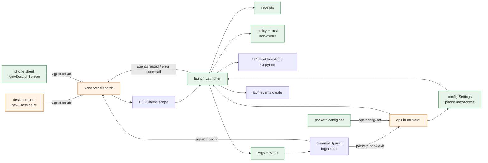

# LaunchSpec Create Implementation Plan

> **For Claude:** REQUIRED SUB-SKILL: Use /implement to execute this plan task-by-task.

**Goal:** Clients send intent, not argv. The desktop sheet and a new phone sheet both send `agent.create` with a LaunchSpec. pocketd alone makes the Worktree, runs setup and the agent in a login shell on the Mac, and replies `agent.creating`, then `agent.created` or a coded `error` with the screen tail. The phone can start Sessions up to an owner-set `phone.maxAccess`, never Full access, and only in folders Claude already trusts.

**Base:** main 5091a01. Every `Modify` line range below is at 5091a01. The dark theme has landed, so views use `theme::X` tokens directly.

Design: `docs/designs/2026-09-30-launchspec-create.md`. `pd` = `packages/pocketd`, `d` = `packages/desktop/crates`, `pk` = `packages/desktop/crates/pocket/src`, `app` = `packages/app`.

**Toolset** (paths relative to the repo root):
- pocketd, one package: `cd packages/pocketd && env -u POCKETD_SOCK go test -race -count=1 ./internal/<pkg>`
- pocketd, full (every PR boundary): `cd packages/pocketd && env -u POCKETD_SOCK go vet ./... && env -u POCKETD_SOCK go test -race -count=1 ./...`
- Goldens: `cd packages/pocketd && env -u POCKETD_SOCK go test ./internal/proto -update`, then the protocol test.
- Protocol (TS): `pnpm --filter @pocket/protocol test`. It decodes every Go golden with `onExcessProperty: "error"`.
- App (TS): `pnpm --filter @pocket/app typecheck && pnpm --filter @pocket/app test`.
- desktop, one crate: `cd packages/desktop && cargo test -p agents`, `cd packages/desktop && cargo test -p pocket -- <filter>`
- desktop, full (every PR that touches it): `cd packages/desktop && cargo build --workspace && cargo clippy --workspace --all-targets && cargo test --workspace`. No new warnings. Already there, leave them: `git/src/git.rs:101`, `:602-604` and `pocket/src/inbox.rs:138`, `:150`, `:158`.
- Screens: `env -u POCKETD_SOCK .ui-review/fixture/capture.sh <dir> <name>=<steps>` writes `<dir>/impl-<name>.png` against the fixture pocketd.
- The shell is fish: quote globs. `unset` is not fish; use `env -u POCKETD_SOCK <cmd>`.
- A modified file is shown as a unified diff, or as "In `x`, after `…` (line N), add:". Apply it by hand or save it and run `git apply`. Line numbers are at 5091a01; where an earlier epic changes the file first, the step says "Find the literal:" with a `grep -n` to re-anchor. Re-anchor line numbers after each listed epic PR merges.

**UX override (roadmap §7.1).** Build this text, not the spec's:

| UX section | Spec says | Winning decision | Text to build |
|---|---|---|---|
| UXP §4.8 access chips | Full access allowed from the phone, with a confirm | D18 | The phone offers Ask / Auto-accept edits / Auto, up to `phone.maxAccess` (default Ask), and never Full access. Hint under a locked chip: "On your Mac: ⌘K → Phone access level" |
| UXP §4.8 Codex hint | "Codex plan needs a chat session" | D14, D31 | "Codex can't plan first in a terminal session" |
| UXP §4.8 states | "Trust this folder on your Mac first" | FR 06-6 | On `folder_not_trusted`: "Trust this folder in Claude on your Mac first" |
| UXD §3.9 access rules | canvas chips, Phase 4 | E06 PR4 | The existing sheet, not the canvas, uses the §6 chips: "Ask" · "Auto-accept edits" · "Auto" · "Full access" (desktop only, amber) · "Plan first". Picks are remembered per Project |
| UXD §2.0 Palette struct | `Palette` + `LIGHT`/`DARK` statics + `p(cx)` | Owner's dark-theme plan | `theme::Token { light, dark }` consts, read as `theme::X` (`Into<Hsla>`); `Token::pick(dark)` in tests. No `Palette`, no `p(cx)` |

**Scratch pocketd rules (roadmap §7):**
- Every Pocket Terminal exports `POCKETD_SOCK`, and the desktop reads it first (`packages/desktop/crates/daemon/src/daemon.rs:43-51`).
- Tests and capture start a scratch pocketd (or the fixture) with their own `POCKET_HOME`, `POCKETD_SOCK` and port. The e2e harness already does (`packages/pocketd/e2e/harness_test.go`).
- Never start or restart the production pocketd from this plan. Run every command that starts pocketd or its tests with `env -u POCKETD_SOCK`.

**Read first:**
- `docs/designs/2026-09-30-launchspec-create.md` §5 (contract), §5.6 (folder trust), §7 (failure modes), §9 (PR slicing).
- `docs/plans/2026-09-30-reach-lockdown.md` (E02): `Error.Code`, `NewErrorCode`, `ServerCaps`, `Negotiate`, `atomicfile.Write`, pairing in e2e.
- `docs/plans/2026-09-30-no-self-approval.md` (E03): `peer.Principal`, `Needs`, `Check`, `errorReply`, ops `refused`, the red-team, the desktop owner socket and `Pick::PairPhone`.
- `docs/plans/2026-09-30-always-on.md` (E04): `Daemon.Spawn`, `Daemon.LoginEnv`, `events.Log`.
- `docs/plans/2026-09-30-registry-worktrees.md` (E05): `registry`, `worktree.Add`, `worktree.CopyInto`, `worktree.List`, `worktree.Code`, `terminal.Spec.Origin`, `project.list`.
- `docs/plans/2026-09-30-fix-now.md` (E01) PR2: `access_args`, `plans_first`, `Draft::pick_provider`, `pick_note`.
- `pd/internal/proto/messages.go:9-87`, `golden_test.go:26-138`: the client decoder and goldens.
- `pd/internal/wsserver/wsserver.go:116-205`, `pd/internal/ops/ops.go:15-164`: the two servers.
- `pk/modals/new_session.rs:16-314`, `pk/modals/new_session/picker.rs`, `pk/terminals.rs:10-132`: today's desktop create path.
- `docs/adr/0003-desktop-code-layout.md`: where desktop code goes.

**Assumptions** (settled; don't re-open):
- E01–E05 merge before the PRs that list them. Where this plan says "E0x's X", use the name that merged.
- The launch API keys receipts by `Who.Key`: `"owner"`, `"device:"+id` or `"pty:"+terminal`, from E03's `peer.Principal`.
- The owner's desktop is the owner principal on the unix socket (E03 PR1). A PTY descendant is not the owner and has `Observe` only, so E03's `Check` refuses its `agent.create` and `config.set` with `scope_denied` before any launch code runs.
- `Daemon.LoginEnv()` (E04) holds the owner's login-shell PATH, HOME, SHELL and CLAUDE_CONFIG_DIR. Provider lookup, trust and the wrapper's shell all read it.
- `worktree.Add` (E05) validates the Project and the name and returns `worktree.Code`-mapped errors. A git failure's error text is git's output.
- CLAUDE.md: no comments unless the WHY is hidden. Keep the doc comments this plan gives; add no others.

**Deviations from the design** (each keeps the design's behaviour unless it says otherwise):
- `launch.Who{Owner bool; Key string}` replaces the design's `Principal{Owner, Scopes, ID}`. Scopes are E03's `Check`, which runs before the launcher. `Create(w, requestID, spec, creating)` takes no ctx; the wait ends on created, exit or terminal close. `New(d, reg, set, ev)` also takes E04's events log.
- `config.Settings` with `NewSettings(home)` replaces `config.Store`: `config.go` already has `Config` and `Load`.
- `Check(w, s, maxAccess)` takes no worktree list. `Create` checks the Worktree against `worktree.List`, for every principal.
- Codex effort is not offered: `efforts` is empty and a codex `effort` is `invalid_spec`. The step-0 probe records whether `-c model_reasoning_effort` works, for a later epic.
- E02 owns the `error_coded` golden. This plan adds `error_detail` and `NewCodedError(id, code, message, detail)`.
- The design's `TestDecodeClientAcceptsGoldens` is the existing `TestClientGolden`, which decodes every client golden. The old create line at `golden_test.go:102` stays a reject; the new shape joins the accepts.
- Before PR3, a non-owner `agent.create` gets `access_not_allowed` "Update Pocket on your Mac.", so PR2 ships nothing a phone can use.
- `Event::Providers` on the desktop carries only `phone_max`: the desktop menu needs no provider list.
- The desktop adopts the new Terminal when the next `terminals` list shows it (`Terminals::arrived`), not in `on_agents`: `adopt` needs a `Window`, and `on_msg` has one. `main.rs` doesn't change.
- `LaunchPick` keeps provider and access only: the desktop sheet has no model or effort chip.
- The Plan first pill has no "Turn off Plan first" tooltip: no desktop code uses GPUI's `.tooltip`, which needs its own view entity, and the pill's `x` says the same.
- For codex, the Plan first row is E01's `pick_note` (label and hint in `TEXT_4`, not clickable), not the design's row at 0.5 opacity: the same dimmed look, and it reuses the helper E01 wrote for this row.
- The desktop sheet gets no states table (disconnected, no agents): today's sheet has none, and an `error` reply shows on the sheet.
- The phone's pure logic is `app/src/launch.ts` (tested with `node --test`); SecureStore lives in `app/src/launchPicks.ts`, so the test never imports expo.

---

## Architecture



Green is new, orange is changed. Grey boxes come from earlier epics. `internal/launch` is the only code that builds a Session's argv.

Each create runs on its own goroutine. It resolves the Project, checks policy, makes or picks the Worktree, and spawns a login shell that runs setup, then the agent. Then it waits for the first of:
- the Agent attached, or present for 10 s → `agent.created`;
- `pocketd hook exit` from the wrapper → `spawn_failed` with the last 20 screen lines;
- the Terminal closing → `spawn_failed`.

The desktop keeps its sheet. It stops building argv, copying files and running setup, and sends the same `agent.create` as the phone. It adopts the new Terminal as a tab when the Terminal shows up in the ops list.

## Why this approach

| Decision | Rejected |
|---|---|
| pocketd builds argv from a LaunchSpec (D5) | Clients send argv: the phone could run anything, and the codex mapping stays wrong in two places |
| A wrapper calls `pocketd hook exit` before the shell takes over | Terminal exit only: the screen is gone by then (`terminal.go:301-308`), and `exec $SHELL` hides the agent's exit |
| Receipts in memory, keyed by who + requestId, 10 min | Persisted receipts: a restart kills the Terminal anyway (S-5) |
| Read Claude's trust, never write it | Writing `~/.claude.json`: every running claude rewrites it without a lock |
| `phone.maxAccess` set through the running pocketd | The CLI writes the file: races the WS writer |
| Desktop adopts on the next ops list | Adopt in `on_agents`: needs a `Window`, so `main.rs`'s agent loop would change |

## Tasks at a glance

`pd` = `packages/pocketd`, `d` = `packages/desktop/crates`, `pk` = `packages/desktop/crates/pocket/src`, `app` = `packages/app`.

**PR 1: LaunchSpec protocol and coded errors.**

| Task | Description | Main files | Risk |
|---|---|---|---|
| 1.1 | Go types, strict `agent.create` / `agent.providers` / `config.set` decode, rejects | `pd/internal/proto/launch.go`, `messages.go`, `golden_test.go` | Med: strict decode |
| 1.2 | Server goldens and `Error.detail` | `golden_test.go`, `testdata/golden/server/*` | Low |
| 1.3 | TS schemas decode every new golden | `packages/protocol/src/launch.ts`, `messages.ts`, `index.ts` | Low |

**PR 2: internal/launch for the owner.**

| Task | Description | Main files | Risk |
|---|---|---|---|
| 2.1 | Probe the CLI flags this plan relies on | `scripts/probe-cli.sh` | Low |
| 2.2 | `Argv`, `Slug`, `Wrap`, `Tail` (pure) | `pd/internal/launch/argv.go`, `wrap.go`, `tail.go` | Med: shell quoting |
| 2.3 | Receipts and trust (pure + git) | `receipts.go`, `trust.go` | Med |
| 2.4 | `phone.maxAccess` settings | `pd/internal/config/settings.go` | Low |
| 2.5 | Launcher: create, providers, exits, events | `launch.go` | High: concurrency |
| 2.6 | Wire WS, ops, CLI and e2e | `wsserver/launch.go`, `ops.go`, `cmd/pocketd/*`, `e2e/*` | High |

**PR 3: Phone policy and launch.v1.**

| Task | Description | Main files | Risk |
|---|---|---|---|
| 3.1 | Phone policy table | `pd/internal/launch/policy.go` | Low |
| 3.2 | Advertise `launch.v1`; phones create within policy | `proto`, `wsserver`, `launch.go`, `e2e/launch_test.go` | Med |
| 3.3 | A phone's claude only in a trusted folder | `launch.go`, `e2e/launch_test.go` | Med |
| 3.4 | Red-team rows | `e2e/redteam/main.go`, `e2e/redteam_test.go` | Low |

**PR 4: Desktop New session on agent.create.**

| Task | Description | Main files | Risk |
|---|---|---|---|
| 4.1 | Launch frames and Outbox verbs | `d/agents/src/agents.rs` | Low |
| 4.2 | `LaunchPick` on `RepoConfig` | `d/store/src/store.rs` | Low |
| 4.3 | `Access`, Plan first, `spec()`, remembered picks | `pk/modals/new_session.rs` | Med |
| 4.4 | Access chip and Plan first | `pk/modals/new_session/picker.rs` | Low |
| 4.5 | The sheet sends `agent.create`; old paths go | `new_session.rs`, `terminals.rs`, `desktop/alerts.rs`, `d/daemon` | High: many files |
| 4.6 | Phone access level | `modals/phone_access.rs`, `modals.rs`, `palette.rs`, `capture.rs` | Low |

**PR 5: Phone New session sheet.**

| Task | Description | Main files | Risk |
|---|---|---|---|
| 5.1 | Pure launch logic | `app/src/launch.ts`, `app/test/launch.test.mts` | Low |
| 5.2 | Picks in SecureStore | `app/src/launchPicks.ts` | Low |
| 5.3 | Session: caps, projects, providers, create | `app/src/client.ts`, `session.tsx` | Med |
| 5.4 | The sheet and its entry | `app/src/screens/NewSessionScreen.tsx`, `AgentsScreen.tsx`, `App.tsx` | Med |

---

## PR 1: LaunchSpec protocol and coded errors

**Scope:** The wire shapes only: Go types and strict decoding for `agent.create`, `agent.providers` and `config.set`; the three new server frames; `Error.detail`; goldens on both sides. No handler, no cap. pocketd still answers these with `Unknown message type` (the dispatch default).

**Depends on:** E02 PR1 (`Error.Code`, `NewErrorCode`). Re-anchor line numbers after E02 PR1 merges.

**Done when:** `go test ./internal/proto` and `pnpm --filter @pocket/protocol test` pass, with the new client goldens accepted and the new rejects refused.

### Task 1.1: Decode the three new client messages

**What & why:** A client may now send a LaunchSpec. The decoder is strict, so junk never reaches the launcher: unknown or wrongly cased spec keys, `null` values, both or neither checkout, and prompts over 64 KiB are Malformed, as the TS schema says.

**Files:**
- Create: `pd/internal/proto/launch.go`
- Create: `pd/internal/proto/testdata/golden/client/{agent_create_worktree,agent_create_new,agent_providers,config_set}.json`
- Modify: `pd/internal/proto/messages.go:9-24` (ClientMessage), `:77-79` (after `permission.resolve`)
- Modify: `pd/internal/proto/golden_test.go:3-10` (imports), `:117` (rejects), `:132` (accepts)

**Context:** `DecodeClient` (`messages.go:30-87`) reads a `map[string]json.RawMessage` and checks each field by hand. `TestClientGolden` (`golden_test.go:85-96`) decodes every file in `testdata/golden/client`, so a new golden file is a new accept test. The old create shape at `golden_test.go:102` stays a reject.

**Step 1: Write the failing tests**

Create the four client goldens, one line each:

`agent_create_worktree.json`:
```json
{"type":"agent.create","id":"c1","requestId":"r1","spec":{"project":"/Users/me/pocket","checkout":{"worktree":"/Users/me/.worktrees/pocket/fix"},"provider":"claude","model":"opus","effort":"high","access":"edits","plan":false,"prompt":"fix the tests"}}
```
`agent_create_new.json`:
```json
{"type":"agent.create","id":"c2","requestId":"r2","spec":{"project":"/Users/me/pocket","checkout":{"new":{"name":"calm-otter","base":"main","copy":true,"setup":false}},"provider":"codex","access":"ask","plan":false}}
```
`agent_providers.json`:
```json
{"type":"agent.providers","id":"p1"}
```
`config_set.json`:
```json
{"type":"config.set","id":"s1","key":"phone.maxAccess","value":"auto"}
```

In `golden_test.go`, replace the imports at lines 3-10 with:
```diff
 import (
 	"bytes"
 	"encoding/json"
 	"flag"
 	"os"
 	"path/filepath"
+	"strings"
 	"testing"
 )
```

Before `` `null`, `` (line 117), add:
```go
		`{"type":"agent.create","id":"1","requestId":"r","spec":{"project":"/p","checkout":{"worktree":"/w","new":{"name":"n"}},"provider":"claude","access":"ask","plan":false}}`,
		`{"type":"agent.create","id":"1","requestId":"r","spec":{"project":"/p","checkout":{},"provider":"claude","access":"ask","plan":false}}`,
		`{"type":"agent.create","id":"1","requestId":"r","spec":{"project":"/p","checkout":{"worktree":"/w"},"provider":"claude","access":"ask","plan":false,"argv":["sh"]}}`,
		`{"type":"agent.create","id":"1","requestId":"r","spec":{"project":"/p","checkout":{"worktree":"/w"},"provider":"claude","access":"ask"}}`,
		`{"type":"agent.create","id":"1","requestId":"r","spec":{"project":"/p","checkout":{"worktree":"/w"},"provider":"gemini","access":"ask","plan":false}}`,
		`{"type":"agent.create","id":"1","requestId":"","spec":{"project":"/p","checkout":{"worktree":"/w"},"provider":"claude","access":"ask","plan":false}}`,
		`{"type":"agent.create","id":"1","requestId":"r","spec":{"project":"/p","checkout":{"worktree":"/w"},"provider":"claude","access":"ask","plan":false,"prompt":"` + strings.Repeat("x", MaxPrompt+1) + `"}}`,
		`{"type":"agent.create","id":"1","requestId":"r","spec":{"project":"/p","checkout":{"worktree":"/w"},"provider":"claude","access":"ask","plan":false,"ACCESS":"full"}}`,
		`{"type":"agent.create","id":"1","requestId":"r","spec":{"project":"/p","checkout":{"Worktree":"/w"},"provider":"claude","access":"ask","plan":false}}`,
		`{"type":"agent.create","id":"1","requestId":"r","spec":{"project":"/p","checkout":{"new":{"name":"n","Base":"main"}},"provider":"claude","access":"ask","plan":false}}`,
		`{"type":"agent.create","id":"1","requestId":"r","spec":{"project":"/p","checkout":{"worktree":"/w","new":null},"provider":"claude","access":"ask","plan":false,"model":null}}`,
		`{"type":"config.set","id":"1","key":"phone.maxAccess","value":"full"}`,
		`{"type":"config.set","id":"1","key":"theme","value":"ask"}`,
```

After `` `{"type":"agent.view","id":"1","agentIds":[]}`, `` (line 132), add:
```go
		`{"type":"agent.create","id":"1","requestId":"r","spec":{"project":"/p","checkout":{"worktree":"/w"},"provider":"claude","access":"full","plan":true,"prompt":"` + strings.Repeat("x", MaxPrompt) + `"}}`,
```

**Step 2: Run the tests to verify they fail**

Run: `cd packages/pocketd && env -u POCKETD_SOCK go test ./internal/proto`
Expected: FAIL with `undefined: MaxPrompt`.

**Step 3: Write the implementation**

Create `pd/internal/proto/launch.go`:
```go
package proto

import (
	"encoding/json"
	"slices"
)

const CapLaunch = "launch.v1"

const MaxPrompt = 64 << 10

var (
	Accesses      = []string{"ask", "edits", "auto", "full"}
	PhoneAccesses = []string{"ask", "edits", "auto"}
)

type LaunchSpec struct {
	Project  string   `json:"project"`
	Checkout Checkout `json:"checkout"`
	Provider string   `json:"provider"`
	Model    string   `json:"model,omitempty"`
	Effort   string   `json:"effort,omitempty"`
	Access   string   `json:"access"`
	Plan     bool     `json:"plan"`
	Prompt   string   `json:"prompt,omitempty"`
}

type Checkout struct {
	Worktree string       `json:"worktree,omitempty"`
	New      *NewWorktree `json:"new,omitempty"`
}

type NewWorktree struct {
	Name  string `json:"name"`
	Base  string `json:"base,omitempty"`
	Copy  *bool  `json:"copy,omitempty"`
	Setup *bool  `json:"setup,omitempty"`
}

type AgentCreating struct {
	Type       string `json:"type"`
	ID         string `json:"id"`
	RequestID  string `json:"requestId"`
	TerminalID string `json:"terminalId"`
	Cwd        string `json:"cwd"`
	Setup      bool   `json:"setup"`
}

func NewAgentCreating(id, requestID, terminalID, cwd string, setup bool) AgentCreating {
	return AgentCreating{"agent.creating", id, requestID, terminalID, cwd, setup}
}

type AgentCreated struct {
	Type       string `json:"type"`
	ID         string `json:"id"`
	RequestID  string `json:"requestId"`
	AgentID    string `json:"agentId"`
	TerminalID string `json:"terminalId"`
}

func NewAgentCreated(id, requestID, agentID, terminalID string) AgentCreated {
	return AgentCreated{"agent.created", id, requestID, agentID, terminalID}
}

type ProviderInfo struct {
	ID        string   `json:"id"`
	Available bool     `json:"available"`
	Efforts   []string `json:"efforts"`
	Plan      bool     `json:"plan"`
}

type AgentProviders struct {
	Type           string         `json:"type"`
	ID             string         `json:"id"`
	Providers      []ProviderInfo `json:"providers"`
	MaxAccess      string         `json:"maxAccess"`
	PhoneMaxAccess string         `json:"phoneMaxAccess"`
}

func NewAgentProviders(id string, p []ProviderInfo, maxAccess, phoneMaxAccess string) AgentProviders {
	return AgentProviders{"agent.providers", id, p, maxAccess, phoneMaxAccess}
}

// strictObject reads a JSON object whose keys are all in allowed, matched
// exactly, and whose values are never null. encoding/json alone matches keys
// case-insensitively and zero-fills nulls; the TS schema rejects both.
func strictObject(raw json.RawMessage, allowed ...string) (map[string]json.RawMessage, bool) {
	var fields map[string]json.RawMessage
	if json.Unmarshal(raw, &fields) != nil || fields == nil {
		return nil, false
	}
	for k, v := range fields {
		if !slices.Contains(allowed, k) || string(v) == "null" {
			return nil, false
		}
	}
	return fields, true
}

func decodeSpec(raw json.RawMessage, dst **LaunchSpec) bool {
	spec, ok := strictObject(raw, "project", "checkout", "provider", "model", "effort", "access", "plan", "prompt")
	if !ok {
		return false
	}
	for _, k := range []string{"project", "checkout", "provider", "access", "plan"} {
		if _, has := spec[k]; !has {
			return false
		}
	}
	checkout, ok := strictObject(spec["checkout"], "worktree", "new")
	if !ok {
		return false
	}
	if n, has := checkout["new"]; has {
		if _, ok := strictObject(n, "name", "base", "copy", "setup"); !ok {
			return false
		}
	}
	var s LaunchSpec
	if json.Unmarshal(raw, &s) != nil {
		return false
	}
	c := s.Checkout
	if (c.Worktree == "") == (c.New == nil) || c.New != nil && c.New.Name == "" {
		return false
	}
	if s.Provider != "claude" && s.Provider != "codex" || !slices.Contains(Accesses, s.Access) || len(s.Prompt) > MaxPrompt {
		return false
	}
	*dst = &s
	return true
}
```

In `messages.go`, replace line 23 (`AgentIDs        []string`) with:
```go
	AgentIDs        []string
	Spec            *LaunchSpec
	Key             string
	Value           string
```

After the `permission.resolve` case (lines 77-79), add:
```go
	case m.Type == "agent.create":
		ok = get("requestId", &m.RequestID) && m.RequestID != "" && len(m.RequestID) <= 64 && decodeSpec(fields["spec"], &m.Spec)
	case m.Type == "agent.providers":
	case m.Type == "config.set":
		ok = get("key", &m.Key) && m.Key == "phone.maxAccess" && get("value", &m.Value) && slices.Contains(PhoneAccesses, m.Value)
```

**Step 4: Run the tests to verify they pass**

Run: `cd packages/pocketd && env -u POCKETD_SOCK go test ./internal/proto`
Expected: PASS (`ok  	pocketd/internal/proto`).

### Task 1.2: Server frames and `Error.detail`

**What & why:** The replies get goldens, so the phone and the desktop decode exactly what pocketd sends. `detail` carries git stderr or the screen tail.

**Files:**
- Modify: `pd/internal/proto/messages.go:175-181` (Error)
- Modify: `pd/internal/proto/golden_test.go:57` (serverGolden)
- Create (by `-update`): `pd/internal/proto/testdata/golden/server/{agent_creating,agent_created,agent_providers,error_detail}.json`

**Context:** E02 PR1 adds `Code` and `NewErrorCode` to `Error`. Find the literal: `grep -n 'type Error struct' packages/pocketd/internal/proto/messages.go`. Keyed literals keep E02's callers compiling.

**Step 1: Write the failing tests**

After `"error":               NewError("p1", "Unknown agent: zz"),` (line 57), add:
```go
	"agent_creating":      NewAgentCreating("c1", "r1", "t1", "/w/fix", true),
	"agent_created":       NewAgentCreated("c1", "r1", "a1", "t1"),
	"agent_providers": NewAgentProviders("p1", []ProviderInfo{
		{ID: "claude", Available: true, Efforts: []string{"low", "medium", "high", "xhigh", "max"}, Plan: true},
		{ID: "codex", Available: false, Efforts: []string{}, Plan: false},
	}, "full", "ask"),
	"error_detail": NewCodedError("create-r1", "spawn_failed", "Setup exited 1", "npm ERR! missing script: setup"),
```

**Step 2: Run the tests to verify they fail**

Run: `cd packages/pocketd && env -u POCKETD_SOCK go test ./internal/proto`
Expected: FAIL with `undefined: NewCodedError`.

**Step 3: Write the implementation**

Replace `Error` and its constructors (E02 PR1's shape) with:
```go
type Error struct {
	Type    string `json:"type"`
	ID      string `json:"id,omitempty"`
	Message string `json:"message"`
	Code    string `json:"code,omitempty"`
	Detail  string `json:"detail,omitempty"`
}

func NewError(id, message string) Error { return Error{Type: "error", ID: id, Message: message} }

func NewErrorCode(id, code, message string) Error {
	return Error{Type: "error", ID: id, Message: message, Code: code}
}

func NewCodedError(id, code, message, detail string) Error {
	return Error{Type: "error", ID: id, Message: message, Code: code, Detail: detail}
}
```

Write the goldens: `cd packages/pocketd && env -u POCKETD_SOCK go test ./internal/proto -update`. `agent_creating.json` reads:
```json
{
  "type": "agent.creating",
  "id": "c1",
  "requestId": "r1",
  "terminalId": "t1",
  "cwd": "/w/fix",
  "setup": true
}
```

**Step 4: Run the tests to verify they pass**

Run: `cd packages/pocketd && env -u POCKETD_SOCK go test ./internal/proto && git status --short internal/proto/testdata`
Expected: PASS (`ok  	pocketd/internal/proto`); status lists only the eight new golden files.

### Task 1.3: TS schemas

**What & why:** `@pocket/protocol` must decode every Go golden with no excess properties, and phone code needs the LaunchSpec type.

**Files:**
- Create: `packages/protocol/src/launch.ts`
- Modify: `packages/protocol/src/messages.ts:2`, `:34` (ClientMessage end), `:60` (error)
- Modify: `packages/protocol/src/index.ts:3`, `packages/protocol/src/constants.ts` (end)

**Context:** `test/golden.test.mjs` runs one test per golden file, so Task 1.1's and 1.2's files are the failing tests. `error.code` stays an open `String` (E02 PR1), so codes added later still decode.

**Step 1: Write the failing tests**

None new: the eight goldens are the tests.

**Step 2: Run the tests to verify they fail**

Run: `pnpm --filter @pocket/protocol test`
Expected: FAIL on `client/agent_create_new.json`, `client/agent_create_worktree.json`, `client/agent_providers.json`, `client/config_set.json`, `server/agent_created.json`, `server/agent_creating.json`, `server/agent_providers.json`, `server/error_detail.json`.

**Step 3: Write the implementation**

Create `packages/protocol/src/launch.ts`:
```ts
import { Schema } from "effect";

export const Access = Schema.Literal("ask", "edits", "auto", "full");
export type Access = typeof Access.Type;

export const PhoneAccess = Schema.Literal("ask", "edits", "auto");
export type PhoneAccess = typeof PhoneAccess.Type;

export const NewWorktree = Schema.Struct({
  name: Schema.String,
  base: Schema.optional(Schema.String),
  copy: Schema.optional(Schema.Boolean),
  setup: Schema.optional(Schema.Boolean),
});

export const Checkout = Schema.Union(Schema.Struct({ worktree: Schema.String }), Schema.Struct({ new: NewWorktree }));

export const LaunchSpec = Schema.Struct({
  project: Schema.String,
  checkout: Checkout,
  provider: Schema.Literal("claude", "codex"),
  model: Schema.optional(Schema.String),
  effort: Schema.optional(Schema.String),
  access: Access,
  plan: Schema.Boolean,
  prompt: Schema.optional(Schema.String),
});
export type LaunchSpec = typeof LaunchSpec.Type;

export const ProviderInfo = Schema.Struct({
  id: Schema.String,
  available: Schema.Boolean,
  efforts: Schema.Array(Schema.String),
  plan: Schema.Boolean,
});
export type ProviderInfo = typeof ProviderInfo.Type;

export const ErrorCode = Schema.Literal(
  "unknown_project",
  "unknown_worktree",
  "invalid_name",
  "worktree_exists",
  "invalid_spec",
  "provider_unavailable",
  "access_not_allowed",
  "folder_not_trusted",
  "spawn_failed",
  "duplicate",
  "invalid_config",
);
export type ErrorCode = typeof ErrorCode.Type;
```

In `messages.ts`, replace line 2 with:
```ts
import { AgentSummary, Decision, PermissionRequest, TimelineItem } from "./timeline.js";
import { LaunchSpec, PhoneAccess, ProviderInfo } from "./launch.js";
```

Before the `);` that closes `ClientMessage` (line 34), add:
```ts
  Schema.Struct({ type: Schema.Literal("agent.create"), id: Schema.String, requestId: Schema.String, spec: LaunchSpec }),
  Schema.Struct({ type: Schema.Literal("agent.providers"), id: Schema.String }),
  Schema.Struct({
    type: Schema.Literal("config.set"),
    id: Schema.String,
    key: Schema.Literal("phone.maxAccess"),
    value: PhoneAccess,
  }),
```

Replace the `error` struct (line 60, as E02 PR1 left it) with:
```ts
  Schema.Struct({
    type: Schema.Literal("agent.creating"),
    id: Schema.String,
    requestId: Schema.String,
    terminalId: Schema.String,
    cwd: Schema.String,
    setup: Schema.Boolean,
  }),
  Schema.Struct({
    type: Schema.Literal("agent.created"),
    id: Schema.String,
    requestId: Schema.String,
    agentId: Schema.String,
    terminalId: Schema.String,
  }),
  Schema.Struct({
    type: Schema.Literal("agent.providers"),
    id: Schema.String,
    providers: Schema.Array(ProviderInfo),
    maxAccess: Schema.String,
    phoneMaxAccess: Schema.String,
  }),
  Schema.Struct({
    type: Schema.Literal("error"),
    id: Schema.optional(Schema.String),
    message: Schema.String,
    code: Schema.optional(Schema.String),
    detail: Schema.optional(Schema.String),
  }),
```

In `index.ts`, after `export * from "./messages.js";` (line 3), add:
```ts
export * from "./launch.js";
```

Append to `constants.ts` (the app imports caps from there, without Effect at runtime):
```ts
export const CAP_LAUNCH = "launch.v1";
```

**Step 4: Run the tests to verify they pass**

Run: `pnpm --filter @pocket/protocol typecheck && pnpm --filter @pocket/protocol test`
Expected: no typecheck output; `ℹ fail 0`.

---

## PR 2: internal/launch for the owner

**Scope:** `internal/launch` builds argv, wraps it in a login shell with setup, keeps receipts, reads Claude's trust and waits for the result. WS `agent.create`, `agent.providers` and `config.set`; ops `launch-exit` and `config-set`; CLI `pocketd config set` and `pocketd hook exit`; `create` events. Only the owner can create: any other principal gets `access_not_allowed` "Update Pocket on your Mac.". No cap is advertised.

**Depends on:** PR1; E01 PR1 (`scripts/probe-cli.sh`); E02 PR3 (`atomicfile`, `ws := &wsserver.Server{…}` in `serve.go`); E02 PR4 (ops `pair.begin`, `ops.Msg.Pair`, `h.Dial`, the `pair` message: `h.Paired`); E03 PR2, PR3 (`peer.Principal`, `Needs`, `Check`, `refused`, PTY principals on ops); E04 PR1 (`h.Pocketd`, `home` in `serve`), PR2 (`Daemon.LoginEnv`, harness `HOME`), PR3 (`events.Log`); E05 PR1 (`registry`, `worktree.List`), PR2 (`worktree.Add/CopyInto/Code`), PR3 (`terminal.Spec.Origin`). Re-anchor line numbers after E03 PR3, E04 PR3 and E05 PR3 merge.

This deviates from roadmap §4, which lists `E06 PR1, E05 PR2, E04 PR2, E03 PR2`. Added, each for the symbols named above: E01 PR1, E02 PR3, E02 PR4, E03 PR3, E04 PR1, E04 PR3, E05 PR1, E05 PR3. E02 PR3/PR4 and E05 PR1 are already implied (E03 PR2 → E03 PR1 → E02 PR4 → E02 PR3; E05 PR2 → E05 PR1). The schedule is unaffected: every added PR is in weeks 1–4 of §2, and PR2 is week 5. E02 PR5 (the phone app) is not needed: the e2e phone pairs over the wire.

**Done when:** the full pocketd suite passes, including `e2e/launch_test.go`: an owner create reaches `agent.created`, a bogus model fails in under 2 s with the fake claude's message in `detail`, a failing setup is `spawn_failed`, and a paired phone is refused.

### Task 2.1: Probe the flags this plan spawns with

**What & why:** PR2 is the first code to pass `--permission-mode auto`, `bypassPermissions`, `-n`, `--effort`, `--model` and codex `--approve-for-me` / `danger-full-access`. The probe catches a rename before a user does.

**Files:**
- Modify: `scripts/probe-cli.sh` (E01 PR1's file)

**Context:** E01's script defines `claude_mode`, `codex_ok` and `codex_bad`; each stops at argument parsing, so no probe starts a turn. claude checks options in order, so reaching the `--pocket-probe` sentinel means every flag before it parsed.

**Step 1: Write the failing check**

Run: `grep -c 'approve-for-me' scripts/probe-cli.sh`
Expected: `0`.

**Step 2: Write the implementation**

After `codex_bad() { … }`, add:
```sh
claude_flags() {
  err=$(claude -p "$@" --pocket-probe </dev/null 2>&1 >/dev/null) || true
  case $err in *"unknown option '--pocket-probe'"*) return 0 ;; esac
  drift "claude $*" "$(printf '%s\n' "$err" | head -n 1)"
}
```

After `claude_mode plan`, add:
```sh
  claude_mode auto
  claude_flags --permission-mode bypassPermissions --allow-dangerously-skip-permissions
  claude_flags -n calm-otter --model opus --effort high
  claude_flags --effort xhigh
  claude_flags --effort max
```

After `codex_ok -s workspace-write -a on-request`, add:
```sh
  codex_ok -s danger-full-access -a never
  codex_ok --approve-for-me
  codex_ok -m gpt-5
```

**Step 3: Verify it passes, and that it catches drift**

Run: `sh -n scripts/probe-cli.sh && scripts/probe-cli.sh`
Expected: exit 0, ending `probe: claude 2.1.285 · codex-cli 0.159.2` (your versions). Then run `claude -p --effort pocket-bogus --pocket-probe </dev/null 2>&1 | head -1`: it prints an `--effort` error, not the sentinel. That is what `claude_flags` reports as DRIFT.

### Task 2.2: Argv, Wrap and Tail

**What & why:** The F14 table in one pure function, so every provider/access/plan pair has one tested answer. `Wrap` makes the Terminal run setup, then the agent, and report either exit to pocketd before the shell takes over. `Tail` keeps the reply small.

**Files:**
- Create: `pd/internal/launch/argv.go`, `argv_test.go`, `wrap.go`, `wrap_test.go`, `tail.go`, `tail_test.go`

**Context:**
- Design §5.3 has the table and both wrapper scripts.
- `shellQuote` in `pd/internal/daemon/plugin.go:57-59` is the quoting rule. `launch` keeps its own copy so it doesn't import `daemon` for one helper.
- `Argv` puts the bare provider name in argv[0]; the Launcher swaps in the absolute path (Task 2.5).
- fish takes extra `-c` arguments as `$argv`. sh binds the first one to `$0`, so `Wrap` passes the shell there.

**Step 1: Write the failing tests**

`pd/internal/launch/argv_test.go`:
```go
package launch

import (
	"slices"
	"strings"
	"testing"

	"pocketd/internal/proto"
)

func spec(provider, access string, plan bool) proto.LaunchSpec {
	return proto.LaunchSpec{Project: "/p", Checkout: proto.Checkout{Worktree: "/w"}, Provider: provider, Access: access, Plan: plan}
}

func TestArgvMatchesTheF14TableForEveryProviderAccessAndPlan(t *testing.T) {
	for _, c := range []struct {
		provider, access string
		plan             bool
		want             string
	}{
		{"claude", "ask", false, "claude --permission-mode default"},
		{"claude", "edits", false, "claude --permission-mode acceptEdits"},
		{"claude", "auto", false, "claude --permission-mode auto"},
		{"claude", "full", false, "claude --permission-mode bypassPermissions --allow-dangerously-skip-permissions"},
		{"claude", "full", true, "claude --permission-mode plan"},
		{"codex", "ask", false, "codex -s read-only -a on-request"},
		{"codex", "edits", false, "codex -s workspace-write -a on-request"},
		{"codex", "auto", false, "codex --approve-for-me"},
		{"codex", "full", false, "codex -s danger-full-access -a never"},
	} {
		argv, f := Argv(spec(c.provider, c.access, c.plan), "")
		if f != nil || strings.Join(argv, " ") != c.want {
			t.Errorf("%s %s plan=%v: got %q %v, want %q", c.provider, c.access, c.plan, argv, f, c.want)
		}
	}
}

func TestCodexPlanIsNotAllowed(t *testing.T) {
	_, f := Argv(spec("codex", "ask", true), "")
	if f == nil || f.Code != "access_not_allowed" || f.Message != "Codex can't plan first in a terminal session" {
		t.Fatalf("got %+v", f)
	}
}

func TestPromptGoesLastAfterDoubleDash(t *testing.T) {
	s := spec("claude", "ask", false)
	s.Model, s.Effort, s.Prompt = "opus", "high", "-rf fix the flaky tests now please"
	argv, _ := Argv(s, "")
	want := []string{"claude", "--permission-mode", "default", "--model", "opus", "--effort", "high", "-n", "rf-fix-the-flaky", "--", "-rf fix the flaky tests now please"}
	if !slices.Equal(argv, want) {
		t.Fatalf("got %q", argv)
	}
}

func TestANewWorktreeNamesTheSession(t *testing.T) {
	s := spec("claude", "ask", false)
	s.Prompt = "fix it"
	argv, _ := Argv(s, "calm-otter")
	if !slices.Contains(argv, "calm-otter") || slices.Contains(argv, "fix-it") {
		t.Fatalf("got %q", argv)
	}
}

func TestABadModelOrEffortIsAnInvalidSpec(t *testing.T) {
	for _, s := range []proto.LaunchSpec{
		{Provider: "claude", Access: "ask", Model: "opus; rm -rf"},
		{Provider: "claude", Access: "ask", Effort: "extreme"},
		{Provider: "codex", Access: "ask", Effort: "high"},
	} {
		if _, f := Argv(s, ""); f == nil || f.Code != "invalid_spec" {
			t.Errorf("%+v: got %+v", s, f)
		}
	}
}
```

`pd/internal/launch/wrap_test.go`:
```go
package launch

import (
	"os"
	"os/exec"
	"path/filepath"
	"testing"
)

// stub stands in for pocketd: it appends its arguments to log.
func stub(t *testing.T) (exe, log string) {
	dir := t.TempDir()
	exe, log = filepath.Join(dir, "pocketd"), filepath.Join(dir, "log")
	if err := os.WriteFile(exe, []byte("#!/bin/sh\necho \"$@\" >> '"+log+"'\n"), 0o755); err != nil {
		t.Fatal(err)
	}
	return exe, log
}

func runWrapped(t *testing.T, shell, setup string, argv []string) string {
	exe, log := stub(t)
	cmd := exec.Command(shell, Wrap(shell, exe, setup, argv)...)
	cmd.Env = []string{"HOME=" + t.TempDir(), "PATH=/usr/bin:/bin"}
	cmd.Run()
	got, _ := os.ReadFile(log)
	return string(got)
}

func TestWrapRecordsTheExitBeforeTheShellTakesOver(t *testing.T) {
	shells := []string{"/bin/sh"}
	if fish, err := exec.LookPath("fish"); err == nil {
		shells = append(shells, fish)
	}
	for _, shell := range shells {
		if got := runWrapped(t, shell, "", []string{"/bin/sh", "-c", "exit 3"}); got != "hook exit agent 3\n" {
			t.Errorf("%s: got %q", shell, got)
		}
	}
}

func TestAFailedSetupStopsBeforeTheAgent(t *testing.T) {
	shells := []string{"/bin/sh"}
	if fish, err := exec.LookPath("fish"); err == nil {
		shells = append(shells, fish)
	}
	for _, shell := range shells {
		if got := runWrapped(t, shell, "echo setting up\nfalse", []string{"/bin/sh", "-c", "exit 3"}); got != "hook exit setup 1\n" {
			t.Errorf("%s: got %q", shell, got)
		}
	}
}

func TestAPassingSetupRunsTheAgent(t *testing.T) {
	if got := runWrapped(t, "/bin/sh", "true", []string{"/bin/sh", "-c", "exit 0"}); got != "hook exit agent 0\n" {
		t.Fatalf("got %q", got)
	}
}
```

`pd/internal/launch/tail_test.go`:
```go
package launch

import (
	"fmt"
	"strings"
	"testing"
	"unicode/utf8"
)

func TestTailKeepsTheLastTwentyLines(t *testing.T) {
	var b strings.Builder
	for n := 1; n <= 30; n++ {
		fmt.Fprintf(&b, "line %d   \n", n)
	}
	b.WriteString("\n\n   \n")
	got := strings.Split(Tail(b.String()), "\n")
	if len(got) != 20 || got[0] != "line 11" || got[19] != "line 30" {
		t.Fatalf("got %q", got)
	}
}

func TestTailIsAtMostFourKiBAndValidUTF8(t *testing.T) {
	got := Tail(strings.Repeat("é", 5000))
	if len(got) > 4096 || !utf8.ValidString(got) {
		t.Fatalf("len %d valid %v", len(got), utf8.ValidString(got))
	}
}
```

**Step 2: Run the tests to verify they fail**

Run: `cd packages/pocketd && env -u POCKETD_SOCK go test ./internal/launch`
Expected: FAIL with build errors such as `undefined: Argv`, `undefined: Wrap`, `undefined: Tail`.

**Step 3: Write the implementation**

`pd/internal/launch/argv.go`:
```go
package launch

import (
	"regexp"
	"slices"
	"strings"

	"pocketd/internal/proto"
)

var ClaudeEfforts = []string{"low", "medium", "high", "xhigh", "max"}

var model = regexp.MustCompile(`^[A-Za-z0-9._:\[\]-]{1,64}$`)

var claudeAccess = map[string][]string{
	"ask":   {"--permission-mode", "default"},
	"edits": {"--permission-mode", "acceptEdits"},
	"auto":  {"--permission-mode", "auto"},
	"full":  {"--permission-mode", "bypassPermissions", "--allow-dangerously-skip-permissions"},
}

var codexAccess = map[string][]string{
	"ask":   {"-s", "read-only", "-a", "on-request"},
	"edits": {"-s", "workspace-write", "-a", "on-request"},
	"auto":  {"--approve-for-me"},
	"full":  {"-s", "danger-full-access", "-a", "never"},
}

// Argv is a Session's command line (design §5.3). name is a new Worktree's
// name; without one, claude's session is named after the prompt.
func Argv(s proto.LaunchSpec, name string) ([]string, *Failure) {
	if s.Model != "" && !model.MatchString(s.Model) {
		return nil, fail("invalid_spec", "Model names use letters, digits and . _ : [ ] -")
	}
	argv := []string{s.Provider}
	switch s.Provider {
	case "claude":
		if s.Effort != "" && !slices.Contains(ClaudeEfforts, s.Effort) {
			return nil, fail("invalid_spec", "Claude's effort is low, medium, high, xhigh or max")
		}
		if s.Plan {
			argv = append(argv, "--permission-mode", "plan")
		} else {
			argv = append(argv, claudeAccess[s.Access]...)
		}
		if s.Model != "" {
			argv = append(argv, "--model", s.Model)
		}
		if s.Effort != "" {
			argv = append(argv, "--effort", s.Effort)
		}
		if name == "" {
			name = Slug(s.Prompt)
		}
		if name != "" {
			argv = append(argv, "-n", name)
		}
	case "codex":
		if s.Plan {
			return nil, fail("access_not_allowed", "Codex can't plan first in a terminal session")
		}
		if s.Effort != "" {
			return nil, fail("invalid_spec", "Codex takes no effort here")
		}
		argv = append(argv, codexAccess[s.Access]...)
		if s.Model != "" {
			argv = append(argv, "-m", s.Model)
		}
	}
	if s.Prompt != "" {
		argv = append(argv, "--", s.Prompt)
	}
	return argv, nil
}

// Slug is the first four words of prompt, lower-case, letters and digits only.
func Slug(prompt string) string {
	var words []string
	for _, w := range strings.Fields(strings.ToLower(prompt)) {
		w = strings.Map(func(r rune) rune {
			if r >= 'a' && r <= 'z' || r >= '0' && r <= '9' {
				return r
			}
			return -1
		}, w)
		if w != "" {
			words = append(words, w)
		}
		if len(words) == 4 {
			break
		}
	}
	return strings.Join(words, "-")
}
```

`pd/internal/launch/wrap.go`:
```go
package launch

import (
	"path/filepath"
	"strings"
)

// Wrap is the shell's argument list: setup, then argv, then a login shell.
// Either exit is reported through `pocketd hook exit` while the Terminal
// still shows its output; a Terminal's screen is gone once it closes.
func Wrap(shell, exe, setup string, argv []string) []string {
	hook := quote(exe) + " hook exit"
	if filepath.Base(shell) == "fish" {
		script := ""
		if setup != "" {
			script = "begin\n" + setup + "\nend; or begin; set s $status; " + hook + " setup $s; exit $s; end\n"
		}
		script += "command $argv; set s $status; " + hook + " agent $s; exec " + quote(shell) + " -l"
		return append([]string{"-l", "-c", script}, argv...)
	}
	script := ""
	if setup != "" {
		script = "{\n" + setup + "\n} || { s=$?; " + hook + " setup $s; exit $s; }\n"
	}
	script += `"$@"; s=$?; ` + hook + " agent $s; exec " + quote(shell) + " -l"
	return append([]string{"-l", "-c", script, shell}, argv...)
}

func quote(s string) string { return "'" + strings.ReplaceAll(s, "'", `'\''`) + "'" }
```

`pd/internal/launch/tail.go`:
```go
package launch

import (
	"strings"
	"unicode/utf8"
)

const (
	tailLines = 20
	tailBytes = 4 << 10
)

// Tail is the end of a screen for an error's detail: the last 20 lines with
// trailing blanks dropped, cut to 4 KiB on a rune boundary.
func Tail(screen string) string {
	lines := strings.Split(screen, "\n")
	for n, l := range lines {
		lines[n] = strings.TrimRight(l, " ")
	}
	for len(lines) > 0 && lines[len(lines)-1] == "" {
		lines = lines[:len(lines)-1]
	}
	lines = lines[max(0, len(lines)-tailLines):]
	s := strings.Join(lines, "\n")
	if len(s) > tailBytes {
		s = s[len(s)-tailBytes:]
		for len(s) > 0 && !utf8.RuneStart(s[0]) {
			s = s[1:]
		}
	}
	return s
}
```

`Failure` and `fail` are in `launch.go` (Task 2.5). Until then, create `pd/internal/launch/launch.go` with only:
```go
package launch

type Failure struct{ Code, Message, Detail string }

func fail(code, message string) *Failure { return &Failure{Code: code, Message: message} }
```

**Step 4: Run the tests to verify they pass**

Run: `cd packages/pocketd && env -u POCKETD_SOCK go test -race -count=1 ./internal/launch`
Expected: PASS (`ok  	pocketd/internal/launch`).

### Task 2.3: Receipts and trust

**What & why:** A phone that retries after a dropped connection must join the first create, not start a second Terminal. Trust mirrors claude 2.1.285 (design §5.6) so PR3 can refuse a phone before it makes a Worktree nobody can use.

**Files:**
- Create: `pd/internal/launch/receipts.go`, `receipts_test.go`, `trust.go`, `trust_test.go`

**Context:**
- A receipt is keyed by `Who.Key + "\x00" + requestId` and holds the spec's SHA-256. It lives until 10 min after its create finishes; a receipt still in flight never expires.
- In a linked Worktree, `git rev-parse --path-format=absolute --git-common-dir` prints the main checkout's `.git`. Its parent is the root claude looks up first.
- macOS temp dirs sit under a `/var` symlink, and git prints `/private/var`, so paths are resolved before they are compared.

**Step 1: Write the failing tests**

`pd/internal/launch/receipts_test.go`:
```go
package launch

import (
	"testing"
	"time"

	"pocketd/internal/proto"
)

func TestADuplicateReturnsTheFirstResult(t *testing.T) {
	r := newReceipts(time.Now)
	s := spec("claude", "ask", false)
	x, fresh := r.take("owner\x00r1", s)
	if !fresh {
		t.Fatal("first take is not fresh")
	}
	r.creating(x, Creating{Terminal: "t1"})
	r.finish(x, Result{AgentID: "a1", TerminalID: "t1"})
	y, fresh := r.take("owner\x00r1", s)
	if fresh || y != x {
		t.Fatal("a retry started a second create")
	}
	<-y.done
	if c, res := r.outcome(y); c.Terminal != "t1" || res.AgentID != "a1" {
		t.Fatalf("got %+v %+v", c, res)
	}
}

func TestADifferentSpecUnderTheSameRequestIsADuplicate(t *testing.T) {
	r := newReceipts(time.Now)
	r.take("owner\x00r1", spec("claude", "ask", false))
	if x, _ := r.take("owner\x00r1", spec("claude", "full", false)); x != nil {
		t.Fatal("a different spec joined the first create")
	}
	if _, fresh := r.take("device:d1\x00r1", spec("claude", "full", false)); !fresh {
		t.Fatal("another principal's request id collided")
	}
}

func TestAReceiptExpiresAfterTenMinutes(t *testing.T) {
	now := time.Unix(0, 0)
	r := newReceipts(func() time.Time { return now })
	s := proto.LaunchSpec{Provider: "claude"}
	x, _ := r.take("k", s)
	now = now.Add(time.Hour)
	if _, fresh := r.take("k", s); fresh {
		t.Fatal("an in-flight receipt expired")
	}
	r.finish(x, Result{})
	now = now.Add(10*time.Minute + time.Second)
	if _, fresh := r.take("k", s); !fresh {
		t.Fatal("a finished receipt outlived ten minutes")
	}
}
```

`pd/internal/launch/trust_test.go`:
```go
package launch

import (
	"os"
	"os/exec"
	"path/filepath"
	"testing"
)

const trusted = `{"projects":{"/a":{"hasTrustDialogAccepted":true},"/b":{"hasTrustDialogAccepted":false}}}`

func TestTrustWalkStopsAtTheGitToplevel(t *testing.T) {
	if Trusted([]byte(trusted), "/a/b/c", "", "/a/b") {
		t.Fatal("walked past the toplevel")
	}
	if !Trusted([]byte(trusted), "/a/b/c", "", "") {
		t.Fatal("outside git the walk goes up to /")
	}
	if !Trusted([]byte(trusted), "/x/y", "/a", "/x/y") {
		t.Fatal("the canonical root is checked first")
	}
}

func TestAnUntrustedFolderIsNotTrusted(t *testing.T) {
	for _, cwd := range []string{"/b", "/c"} {
		if Trusted([]byte(trusted), cwd, "", cwd) {
			t.Errorf("%s: trusted", cwd)
		}
	}
	if Trusted(nil, "/a", "", "") {
		t.Fatal("no config trusts everything")
	}
}

func git(t *testing.T, dir string, args ...string) {
	t.Helper()
	cmd := exec.Command("git", append([]string{"-C", dir, "-c", "user.name=t", "-c", "user.email=t@t", "-c", "commit.gpgsign=false"}, args...)...)
	if out, err := cmd.CombinedOutput(); err != nil {
		t.Fatalf("git %v: %s", args, out)
	}
}

func TestALinkedWorktreeOfATrustedRepoIsTrusted(t *testing.T) {
	root, _ := filepath.EvalSymlinks(t.TempDir())
	repo, wt, cfg := filepath.Join(root, "repo"), filepath.Join(root, "wt"), filepath.Join(root, "claude")
	os.MkdirAll(repo, 0o755)
	os.MkdirAll(cfg, 0o755)
	git(t, repo, "init", "-q", "-b", "main")
	git(t, repo, "commit", "-q", "--allow-empty", "-m", "init")
	git(t, repo, "worktree", "add", "-q", "-b", "fix", wt)
	env := []string{"CLAUDE_CONFIG_DIR=" + cfg}
	if trustedAt(env, wt) {
		t.Fatal("trusted with no config")
	}
	os.WriteFile(filepath.Join(cfg, ".claude.json"), []byte(`{"projects":{"`+repo+`":{"hasTrustDialogAccepted":true}}}`), 0o600)
	if !trustedAt(env, wt) {
		t.Fatal("a Worktree of a trusted repo is untrusted")
	}
}

func TestSandboxedIsTrusted(t *testing.T) {
	if !trustedAt([]string{"CLAUDE_CODE_SANDBOXED=1", "HOME=" + t.TempDir()}, t.TempDir()) {
		t.Fatal("sandboxed claude trusts every folder")
	}
}
```

**Step 2: Run the tests to verify they fail**

Run: `cd packages/pocketd && env -u POCKETD_SOCK go test ./internal/launch`
Expected: FAIL with `undefined: newReceipts`, `undefined: Creating`, `undefined: Result`, `undefined: Trusted`.

**Step 3: Write the implementation**

Add to `launch.go`:
```go
type Creating struct {
	Terminal, Cwd string
	Setup         bool
}

type Result struct {
	AgentID, TerminalID string
	Err                 *Failure
}
```

`pd/internal/launch/receipts.go`:
```go
package launch

import (
	"crypto/sha256"
	"encoding/json"
	"sync"
	"time"

	"pocketd/internal/proto"
)

const receiptTTL = 10 * time.Minute

type receipt struct {
	hash     [32]byte
	done     chan struct{}
	creating Creating
	result   Result
	at       time.Time
}

type receipts struct {
	mu  sync.Mutex
	now func() time.Time
	m   map[string]*receipt
}

func newReceipts(now func() time.Time) *receipts {
	return &receipts{now: now, m: map[string]*receipt{}}
}

// take returns key's receipt and whether the caller must run the create.
// A nil receipt means key already holds a different spec.
func (r *receipts) take(key string, s proto.LaunchSpec) (*receipt, bool) {
	raw, _ := json.Marshal(s)
	hash := sha256.Sum256(raw)
	r.mu.Lock()
	defer r.mu.Unlock()
	now := r.now()
	for k, x := range r.m {
		if !x.at.IsZero() && now.Sub(x.at) > receiptTTL {
			delete(r.m, k)
		}
	}
	if x, ok := r.m[key]; ok {
		if x.hash != hash {
			return nil, false
		}
		return x, false
	}
	x := &receipt{hash: hash, done: make(chan struct{})}
	r.m[key] = x
	return x, true
}

func (r *receipts) creating(x *receipt, c Creating) {
	r.mu.Lock()
	x.creating = c
	r.mu.Unlock()
}

func (r *receipts) finish(x *receipt, res Result) {
	r.mu.Lock()
	x.result, x.at = res, r.now()
	r.mu.Unlock()
	close(x.done)
}

func (r *receipts) outcome(x *receipt) (Creating, Result) {
	r.mu.Lock()
	defer r.mu.Unlock()
	return x.creating, x.result
}
```

`pd/internal/launch/trust.go`:
```go
package launch

import (
	"encoding/json"
	"os"
	"os/exec"
	"path/filepath"
	"strings"
)

// Trusted mirrors claude 2.1.285's folder trust: the canonical git root
// first, then every folder from cwd up to the git toplevel, or up to /
// outside git.
func Trusted(claudeJSON []byte, cwd, canonical, toplevel string) bool {
	var cfg struct {
		Projects map[string]struct {
			Accepted bool `json:"hasTrustDialogAccepted"`
		} `json:"projects"`
	}
	if json.Unmarshal(claudeJSON, &cfg) != nil {
		return false
	}
	if canonical != "" && cfg.Projects[canonical].Accepted {
		return true
	}
	for dir := filepath.Clean(cwd); ; dir = filepath.Dir(dir) {
		if cfg.Projects[dir].Accepted {
			return true
		}
		if dir == toplevel || dir == filepath.Dir(dir) {
			return false
		}
	}
}

// trustedAt reads claude's global config and cwd's git layout. It never
// writes: every running claude rewrites that file without a lock.
func trustedAt(env []string, cwd string) bool {
	if lookup(env, "CLAUDE_CODE_SANDBOXED") != "" {
		return true
	}
	dir := lookup(env, "CLAUDE_CONFIG_DIR")
	if dir == "" {
		dir = lookup(env, "HOME")
	}
	raw, _ := os.ReadFile(filepath.Join(dir, ".claude.json"))
	if real, err := filepath.EvalSymlinks(cwd); err == nil {
		cwd = real
	}
	canonical := ""
	if common := revParse(cwd, "--git-common-dir"); common != "" {
		canonical = filepath.Dir(common)
	}
	return Trusted(raw, cwd, canonical, revParse(cwd, "--show-toplevel"))
}

func revParse(cwd, flag string) string {
	out, err := exec.Command("git", "-C", cwd, "rev-parse", "--path-format=absolute", flag).Output()
	if err != nil {
		return ""
	}
	return strings.TrimSpace(string(out))
}

func lookup(env []string, key string) string {
	v := ""
	for _, kv := range env {
		if k, val, ok := strings.Cut(kv, "="); ok && k == key {
			v = val
		}
	}
	return v
}
```

**Step 4: Run the tests to verify they pass**

Run: `cd packages/pocketd && env -u POCKETD_SOCK go test -race -count=1 ./internal/launch`
Expected: PASS (`ok  	pocketd/internal/launch`).

### Task 2.4: `phone.maxAccess` settings

**What & why:** The owner's ceiling for phone creates lives in `config.json` next to the token and port, which `config.Load` still reads.

**Files:**
- Create: `pd/internal/config/settings.go`, `settings_test.go`

**Context:** `config.json` is `{"token","port"}` today (`pd/internal/config/config.go`). Settings keep every key they don't own, including other keys under `"phone"`. Writes go through E02 PR3's `atomicfile.Write` at 0600. The one mutex serializes pocketd's own writers (WS and ops); the CLI never writes the file (design decision 11).

**Step 1: Write the failing tests**

`pd/internal/config/settings_test.go`:
```go
package config

import (
	"encoding/json"
	"errors"
	"os"
	"path/filepath"
	"testing"
)

func TestSettingPhoneAccessKeepsOtherKeys(t *testing.T) {
	home := t.TempDir()
	path := filepath.Join(home, "config.json")
	os.WriteFile(path, []byte(`{"token":"t","port":4517,"phone":{"nickname":"x"}}`), 0o600)
	s := NewSettings(home)
	if got := s.PhoneMaxAccess(); got != "ask" {
		t.Fatalf("default: got %q", got)
	}
	if err := s.SetPhoneMaxAccess("auto"); err != nil {
		t.Fatal(err)
	}
	if got := s.PhoneMaxAccess(); got != "auto" {
		t.Fatalf("got %q", got)
	}
	raw, _ := os.ReadFile(path)
	var f struct {
		Token string
		Port  int
		Phone map[string]string
	}
	json.Unmarshal(raw, &f)
	if f.Token != "t" || f.Port != 4517 || f.Phone["nickname"] != "x" || f.Phone["maxAccess"] != "auto" {
		t.Fatalf("got %s", raw)
	}
	if fi, _ := os.Stat(path); fi.Mode().Perm() != 0o600 {
		t.Fatalf("mode %v", fi.Mode())
	}
}

func TestFullIsNeverAcceptedForThePhone(t *testing.T) {
	home := t.TempDir()
	s := NewSettings(home)
	for _, v := range []string{"full", "", "Auto"} {
		if err := s.SetPhoneMaxAccess(v); !errors.Is(err, ErrInvalid) {
			t.Errorf("%q: got %v", v, err)
		}
	}
	os.WriteFile(filepath.Join(home, "config.json"), []byte(`{"phone":{"maxAccess":"full"}}`), 0o600)
	if got := s.PhoneMaxAccess(); got != "ask" {
		t.Fatalf("a hand-edited full reads as %q", got)
	}
}
```

**Step 2: Run the tests to verify they fail**

Run: `cd packages/pocketd && env -u POCKETD_SOCK go test ./internal/config`
Expected: FAIL with `undefined: NewSettings`, `undefined: ErrInvalid`.

**Step 3: Write the implementation**

`pd/internal/config/settings.go`:
```go
package config

import (
	"encoding/json"
	"errors"
	"io/fs"
	"os"
	"path/filepath"
	"slices"
	"sync"

	"pocketd/internal/atomicfile"
	"pocketd/internal/proto"
)

var ErrInvalid = errors.New("phone.maxAccess is ask, edits or auto")

// Settings are the owner's choices in config.json.
type Settings struct {
	path string
	mu   sync.Mutex
}

func NewSettings(home string) *Settings {
	return &Settings{path: filepath.Join(home, "config.json")}
}

// PhoneMaxAccess is "ask" when unset or not a phone access.
func (s *Settings) PhoneMaxAccess() string {
	s.mu.Lock()
	defer s.mu.Unlock()
	var f struct {
		Phone struct {
			MaxAccess string `json:"maxAccess"`
		} `json:"phone"`
	}
	raw, _ := os.ReadFile(s.path)
	json.Unmarshal(raw, &f)
	if slices.Contains(proto.PhoneAccesses, f.Phone.MaxAccess) {
		return f.Phone.MaxAccess
	}
	return "ask"
}

func (s *Settings) SetPhoneMaxAccess(v string) error {
	if !slices.Contains(proto.PhoneAccesses, v) {
		return ErrInvalid
	}
	s.mu.Lock()
	defer s.mu.Unlock()
	top, phone := map[string]json.RawMessage{}, map[string]json.RawMessage{}
	raw, err := os.ReadFile(s.path)
	if err != nil && !errors.Is(err, fs.ErrNotExist) {
		return err
	}
	if len(raw) > 0 {
		if err := json.Unmarshal(raw, &top); err != nil {
			return err
		}
	}
	if p, ok := top["phone"]; ok {
		if err := json.Unmarshal(p, &phone); err != nil {
			return err
		}
	}
	phone["maxAccess"], _ = json.Marshal(v)
	top["phone"], _ = json.Marshal(phone)
	out, _ := json.MarshalIndent(top, "", "  ")
	return atomicfile.Write(s.path, append(out, '\n'), 0o600)
}
```

**Step 4: Run the tests to verify they pass**

Run: `cd packages/pocketd && env -u POCKETD_SOCK go test -race -count=1 ./internal/config`
Expected: PASS (`ok  	pocketd/internal/config`).

### Task 2.5: The Launcher

**What & why:** One place turns a LaunchSpec into a running Session and reports how it went. It joins retries through receipts, finds the provider on the login PATH, makes the Worktree and spawns the wrapped shell. Then it waits for the Agent to attach (or be present 10 s), a hook exit, or the Terminal to close, whichever comes first.

**Files:**
- Modify: `pd/internal/launch/launch.go` (Task 2.2's stub)
- Create: `pd/internal/launch/launch_test.go`

**Context:**
- `terminal.Manager.Spawn(Spec)` (`pd/internal/terminal/terminal.go:112`) takes the ID we pick, so `pending[id]` exists before the shell can call `hook exit`. The Launcher spawns directly, not through `Daemon.Spawn`, because it needs that ID first; it already has the absolute agent path, so E04's retry-on-not-found adds nothing.
- `Daemon.Env(env, id)` (`pd/internal/daemon/plugin.go:65`) adds `POCKETD_SOCK`, `POCKETD_PTY` and the plugin dir, as for every Terminal.
- `Terminal.Done()` (`:314`) closes when the shell exits; `Screen()` (`:301-308`) is empty after that, so `Exited` reads it at hook time.
- `d.Agents.List()` (`pd/internal/agent/agent.go:96`) carries `TerminalID` and `Attached`.
- `worktree.Create` copies the Repo's files, `worktree.Add` doesn't (E05 PR2). Both default an empty base to the Repo's base.
- A hook exit and the Terminal closing can both be ready at once. The `Done` branch drains `exits` first, so a setup failure is never reported as a bare terminal exit.

**Step 1: Write the failing tests**

`pd/internal/launch/launch_test.go`:
```go
package launch

import (
	"os"
	"path/filepath"
	"testing"

	"pocketd/internal/config"
	"pocketd/internal/daemon"
	"pocketd/internal/registry"
)

func launcher(t *testing.T, projects string) *Launcher {
	home := t.TempDir()
	path := filepath.Join(home, "desktop.json")
	os.WriteFile(path, []byte(`{"projects":`+projects+`,"repos":{}}`), 0o600)
	return New(&daemon.Daemon{}, registry.New(path), config.NewSettings(home), nil)
}

func onPath(t *testing.T, names ...string) {
	dir := t.TempDir()
	for _, n := range names {
		os.WriteFile(filepath.Join(dir, n), []byte("#!/bin/sh\n"), 0o755)
	}
	t.Setenv("PATH", dir+":/usr/bin:/bin")
}

func TestProvidersShowWhatIsInstalledAndTheCeiling(t *testing.T) {
	onPath(t, "claude")
	l := launcher(t, `[]`)
	list, max, phone := l.Providers(Who{Owner: true, Key: "owner"})
	if len(list) != 2 || !list[0].Available || list[1].Available || len(list[0].Efforts) != 5 || !list[0].Plan || list[1].Plan {
		t.Fatalf("got %+v", list)
	}
	if max != "full" || phone != "ask" {
		t.Fatalf("owner: max %q phone %q", max, phone)
	}
	if _, max, _ := l.Providers(Who{Key: "device:d1"}); max != "ask" {
		t.Fatalf("device: max %q", max)
	}
}

func TestOnlyTheOwnerCreatesBeforeLaunchV1(t *testing.T) {
	r := launcher(t, `[]`).Create(Who{Key: "device:d1"}, "r1", spec("claude", "ask", false), func(Creating) { t.Fatal("creating") })
	if r.Err == nil || r.Err.Code != "access_not_allowed" || r.Err.Message != "Update Pocket on your Mac." {
		t.Fatalf("got %+v", r.Err)
	}
}

func TestCreateRefusesAnUnknownProjectOrAMissingProvider(t *testing.T) {
	onPath(t)
	project := t.TempDir()
	l := launcher(t, `["`+project+`"]`)
	owner := Who{Owner: true, Key: "owner"}
	s := spec("claude", "ask", false)
	if r := l.Create(owner, "r1", s, nil); r.Err == nil || r.Err.Code != "unknown_project" {
		t.Fatalf("got %+v", r.Err)
	}
	s.Project = project
	if r := l.Create(owner, "r2", s, nil); r.Err == nil || r.Err.Code != "provider_unavailable" {
		t.Fatalf("got %+v", r.Err)
	}
	s.Provider = "codex"
	if r := l.Create(owner, "r2", s, nil); r.Err == nil || r.Err.Code != "duplicate" {
		t.Fatalf("got %+v", r.Err)
	}
}
```

**Step 2: Run the tests to verify they fail**

Run: `cd packages/pocketd && env -u POCKETD_SOCK go test ./internal/launch`
Expected: FAIL with `undefined: New`, `undefined: Launcher`, `undefined: Who`.

**Step 3: Write the implementation**

Replace `pd/internal/launch/launch.go` with:
```go
// Package launch starts Sessions from a LaunchSpec. It is the only code that
// builds an agent's command line.
package launch

import (
	"fmt"
	"slices"
	"sync"
	"time"

	"pocketd/internal/config"
	"pocketd/internal/daemon"
	"pocketd/internal/events"
	"pocketd/internal/proto"
	"pocketd/internal/registry"
	"pocketd/internal/terminal"
	"pocketd/internal/worktree"
)

const (
	poll       = 250 * time.Millisecond
	attachWait = 10 * time.Second
	probeTTL   = 30 * time.Second
)

// Who asked. Key separates one principal's request ids from another's.
type Who struct {
	Owner bool
	Key   string
}

type Failure struct{ Code, Message, Detail string }

func fail(code, message string) *Failure { return &Failure{Code: code, Message: message} }

type Creating struct {
	Terminal, Cwd string
	Setup         bool
}

type Result struct {
	AgentID, TerminalID string
	Err                 *Failure
}

type exit struct {
	phase  string
	status int
	tail   string
}

type found struct {
	path string
	at   time.Time
}

type Launcher struct {
	d        *daemon.Daemon
	reg      *registry.Registry
	set      *config.Settings
	ev       *events.Log
	receipts *receipts

	mu      sync.Mutex
	pending map[string]chan exit
	found   map[string]found
}

func New(d *daemon.Daemon, reg *registry.Registry, set *config.Settings, ev *events.Log) *Launcher {
	return &Launcher{d: d, reg: reg, set: set, ev: ev, receipts: newReceipts(time.Now), pending: map[string]chan exit{}, found: map[string]found{}}
}

// Create runs one agent.create. creating is called once the Terminal exists,
// before setup runs. A retry of the same request joins the first and gets its
// replies.
func (l *Launcher) Create(w Who, requestID string, s proto.LaunchSpec, creating func(Creating)) Result {
	x, fresh := l.receipts.take(w.Key+"\x00"+requestID, s)
	if x == nil {
		return Result{Err: fail("duplicate", "This request was already sent with a different spec")}
	}
	if !fresh {
		<-x.done
		c, r := l.receipts.outcome(x)
		if c.Terminal != "" {
			creating(c)
		}
		return r
	}
	r := l.create(w, s, func(c Creating) {
		l.receipts.creating(x, c)
		creating(c)
	})
	l.receipts.finish(x, r)
	ok, code, origin := r.Err == nil, "", "desktop"
	if !ok {
		code = r.Err.Code
	}
	if !w.Owner {
		origin = "phone"
	}
	l.ev.Emit(events.Event{Kind: "create", Origin: origin, Provider: s.Provider, OK: &ok, Code: code})
	return r
}

func (l *Launcher) create(w Who, s proto.LaunchSpec, creating func(Creating)) Result {
	if !w.Owner {
		return Result{Err: fail("access_not_allowed", "Update Pocket on your Mac.")}
	}
	f := l.reg.Load()
	if !slices.Contains(f.Projects, s.Project) {
		return Result{Err: fail("unknown_project", "This project isn't on your Mac anymore")}
	}
	env := l.d.LoginEnv()
	exe, ok := l.find(s.Provider, env)
	if !ok {
		return Result{Err: fail("provider_unavailable", s.Provider+" isn't installed on your Mac")}
	}
	name := ""
	if s.Checkout.New != nil {
		name = s.Checkout.New.Name
	}
	argv, fl := Argv(s, name)
	if fl != nil {
		return Result{Err: fl}
	}
	argv[0] = exe
	cwd, setup, fl := l.checkout(w, f, s, env)
	if fl != nil {
		return Result{Err: fl}
	}
	id := terminal.NewID()
	exits := make(chan exit, 1)
	l.mu.Lock()
	l.pending[id] = exits
	l.mu.Unlock()
	defer func() {
		l.mu.Lock()
		delete(l.pending, id)
		l.mu.Unlock()
	}()
	shell := lookup(env, "SHELL")
	if shell == "" {
		shell = "/bin/zsh"
	}
	origin := "desktop"
	if !w.Owner {
		origin = "phone"
	}
	t, err := l.d.Terminals.Spawn(terminal.Spec{ID: id, Cmd: shell, Args: Wrap(shell, l.d.Exe, setup, argv), Cwd: cwd,
		Env: l.d.Env(env, id), Cols: 100, Rows: 30, Origin: origin})
	if err != nil {
		return Result{Err: &Failure{Code: "spawn_failed", Message: "Couldn't start a terminal", Detail: err.Error()}}
	}
	creating(Creating{Terminal: id, Cwd: cwd, Setup: setup != ""})
	return l.wait(t, id, exits)
}

// checkout is the Session's folder and the setup to run there. A new
// Worktree copies and runs setup unless the owner turned them off.
func (l *Launcher) checkout(w Who, f registry.File, s proto.LaunchSpec, env []string) (string, string, *Failure) {
	if s.Checkout.Worktree != "" {
		trees, err := worktree.List(s.Project)
		if err != nil {
			return "", "", gitFailure(err)
		}
		if !slices.ContainsFunc(trees, func(t worktree.Worktree) bool { return t.Path == s.Checkout.Worktree }) {
			return "", "", fail("unknown_worktree", "This worktree isn't in the project anymore")
		}
		return s.Checkout.Worktree, "", nil
	}
	n := s.Checkout.New
	create := worktree.Add
	if on(n.Copy) {
		create = worktree.Create
	}
	c, err := create(f, s.Project, n.Name, n.Base)
	if err != nil {
		return "", "", gitFailure(err)
	}
	setup := ""
	if on(n.Setup) {
		setup = f.Repos[s.Project].Setup
	}
	return c.Path, setup, nil
}

func on(b *bool) bool { return b == nil || *b }

func gitFailure(err error) *Failure {
	if code := worktree.Code(err); code != "" {
		return fail(code, err.Error())
	}
	return &Failure{Code: "spawn_failed", Message: "git couldn't make the worktree", Detail: Tail(err.Error())}
}

func (l *Launcher) wait(t *terminal.Terminal, id string, exits chan exit) Result {
	tick := time.NewTicker(poll)
	defer tick.Stop()
	var present time.Time
	for {
		select {
		case e := <-exits:
			return exited(id, e)
		case <-t.Done():
			select {
			case e := <-exits:
				return exited(id, e)
			default:
			}
			msg := fmt.Sprintf("terminal exited %d", t.ExitCode())
			return Result{TerminalID: id, Err: &Failure{Code: "spawn_failed", Message: msg, Detail: msg}}
		case <-tick.C:
			a, ok := l.agentIn(id)
			switch {
			case !ok:
			case a.Attached:
				return Result{AgentID: a.ID, TerminalID: id}
			case present.IsZero():
				present = time.Now()
			case time.Since(present) >= attachWait:
				return Result{AgentID: a.ID, TerminalID: id}
			}
		}
	}
}

func exited(id string, e exit) Result {
	what := "The agent"
	if e.phase == "setup" {
		what = "Setup"
	}
	return Result{TerminalID: id, Err: &Failure{Code: "spawn_failed", Message: fmt.Sprintf("%s exited %d", what, e.status), Detail: e.tail}}
}

func (l *Launcher) agentIn(terminalID string) (proto.AgentSummary, bool) {
	for _, a := range l.d.Agents.List() {
		if a.TerminalID == terminalID {
			return a, true
		}
	}
	return proto.AgentSummary{}, false
}

// Exited records a wrapper's `pocketd hook exit`. It reads the screen now,
// while the Terminal still shows the failure. Exits of finished creates are
// ignored.
func (l *Launcher) Exited(terminalID, phase string, status int) {
	l.mu.Lock()
	ch, ok := l.pending[terminalID]
	l.mu.Unlock()
	if !ok {
		return
	}
	tail := ""
	if t := l.d.Terminals.Get(terminalID); t != nil {
		tail = Tail(t.Screen())
	}
	select {
	case ch <- exit{phase, status, tail}:
	default:
	}
}

// Providers lists the agents on the login PATH. maxAccess is w's ceiling.
func (l *Launcher) Providers(w Who) (list []proto.ProviderInfo, maxAccess, phoneMax string) {
	env := l.d.LoginEnv()
	_, claude := l.find("claude", env)
	_, codex := l.find("codex", env)
	phoneMax = l.set.PhoneMaxAccess()
	maxAccess = phoneMax
	if w.Owner {
		maxAccess = "full"
	}
	return []proto.ProviderInfo{
		{ID: "claude", Available: claude, Efforts: ClaudeEfforts, Plan: true},
		{ID: "codex", Available: codex, Efforts: []string{}, Plan: false},
	}, maxAccess, phoneMax
}

func (l *Launcher) SetPhoneMaxAccess(v string) error { return l.set.SetPhoneMaxAccess(v) }

func (l *Launcher) find(provider string, env []string) (string, bool) {
	l.mu.Lock()
	defer l.mu.Unlock()
	if f, ok := l.found[provider]; ok && time.Since(f.at) < probeTTL {
		return f.path, f.path != ""
	}
	path, err := terminal.LookPath(provider, env)
	if err != nil {
		path = ""
	}
	l.found[provider] = found{path, time.Now()}
	return path, path != ""
}
```

`checkout` takes `w` and `env` now so PR3 can add the trust check without changing its callers.

**Step 4: Run the tests to verify they pass**

Run: `cd packages/pocketd && env -u POCKETD_SOCK go vet ./internal/launch && env -u POCKETD_SOCK go test -race -count=1 ./internal/launch`
Expected: PASS (`ok  	pocketd/internal/launch`).

### Task 2.6: Wire WS, ops, the CLI and e2e

**What & why:** The Launcher becomes reachable: the owner's WS runs creates, the wrapper reports exits over ops, and `pocketd config set` changes the phone ceiling through the running pocketd. The e2e tests drive a real scratch pocketd with the fake claude.

**Files:**
- Create: `pd/internal/wsserver/launch.go`, `pd/cmd/pocketd/config.go`, `pd/e2e/launch_test.go`
- Modify: `pd/internal/wsserver/wsserver.go:29-40` (Server), `:169-172` (after `agent.seen`)
- Modify: `pd/internal/ops/ops.go:15-32` (Msg), `:79-83` (Server), `:129-135` (after `hook`)
- Modify: `pd/internal/peer/check.go` (E03's `Needs`)
- Modify: `pd/cmd/pocketd/main.go:10`, `:25`; `pd/cmd/pocketd/serve.go` (E04/E05's shape)
- Modify: `pd/e2e/harness_test.go:37-46`, `:59-87`; `pd/e2e/phone_test.go:20-56`; `pd/e2e/fakeclaude/main.go:13-26`, `:149-156`

**Context:**
- E03's `dispatch` runs `Check("ws:"+m.Type, …)` first, so these verbs need `Needs` rows or they are refused even for the owner. A PTY descendant has `Observe` only: its `agent.create` and `config.set` get `scope_denied` before the Launcher sees them.
- `agent.create` runs on its own goroutine: it can wait minutes for setup, and the connection keeps serving. `conn.send` (`wsserver.go:111-114`) is one `ws.Write`, which coder/websocket allows from many goroutines.
- `pocketd hook exit` runs inside the Terminal, so ops sees a PTY principal whose `Terminal` is the caller's own. `launch-exit` for any other Terminal is refused with E03's `not_own_terminal`.
- The login shell, not the harness env, decides the spawned agent's PATH (E04). `launchReady` writes rc files for zsh, bash and fish under the scratch `HOME`, so the wrapper finds the fake claude whatever the login shell is. `/tmp` is a symlink on macOS; the Project path is resolved so git, the registry and the trust file agree.

**Step 1: Write the failing tests**

In `pd/e2e/fakeclaude/main.go`, add `"slices"` to the imports (lines 13-26). Replace lines 149-156:
```diff
 func main() {
+	if i := slices.Index(os.Args, "--model"); i > 0 && i+1 < len(os.Args) && os.Args[i+1] == "bogus" {
+		fmt.Println("fake claude: unknown model bogus")
+		os.Exit(1)
+	}
 	s := start()
 	s.hook("SessionStart", map[string]any{"source": "startup", "model": "fake-model"})()
 	fmt.Println("fake claude ready")
 
 	sc := bufio.NewScanner(os.Stdin)
-	for n := 1; sc.Scan(); n++ {
+	first := prompt()
+	for n := 1; first != "" || sc.Scan(); n++ {
 		line := strings.TrimSpace(sc.Text())
+		if first != "" {
+			line, first = first, ""
+		}
```
and add after `main`:
```go
// prompt is the argument after --, as pocketd passes a Session's first prompt.
func prompt() string {
	if i := slices.Index(os.Args, "--"); i > 0 && i+1 < len(os.Args) {
		return os.Args[i+1]
	}
	return ""
}
```

In `pd/e2e/phone_test.go`, after `Decision  string `json:"decision"`` (line 54), add (skip `Code` if E02/E03 added it):
```go
	TerminalID     string `json:"terminalId"`
	Cwd            string `json:"cwd"`
	Setup          bool   `json:"setup"`
	Code           string `json:"code"`
	Detail         string `json:"detail"`
	MaxAccess      string `json:"maxAccess"`
	PhoneMaxAccess string `json:"phoneMaxAccess"`
```

In `pd/e2e/harness_test.go`, add `Repo string` to `Harness` (lines 37-46). Change `func Start(t *testing.T) *Harness {` (line 59) to `func Start(t *testing.T, opts ...func(*Harness)) *Harness {`, and before the serve loop (line 81) add:
```go
	for _, opt := range opts {
		opt(h)
	}
```
Add `"context"`, `"encoding/json"`, `"fmt"`, `"net"`, `"net/http"`, `"os/exec"`, `"slices"`, `"github.com/coder/websocket"` and `"pocketd/internal/registry"` to its imports where missing, and append:
```go
// launchReady gives pocketd's login shell the fake agents and a Project that
// Claude trusts, with setup as its Repo's setup. It drops
// CLAUDE_CODE_SANDBOXED, which a test run inside Claude Code inherits and
// which makes every folder trusted.
func launchReady(setup string) func(*Harness) {
	return func(h *Harness) {
		h.Env = slices.DeleteFunc(h.Env, func(kv string) bool { return strings.HasPrefix(kv, "CLAUDE_CODE_SANDBOXED=") })
		fake := filepath.Join(binDir, "fake")
		sh := fmt.Sprintf("export PATH='%s':$PATH\nexport CLAUDE_CONFIG_DIR='%s'\n", fake, h.ClaudeDir)
		fish := fmt.Sprintf("set -gx PATH '%s' $PATH\nset -gx CLAUDE_CONFIG_DIR '%s'\n", fake, h.ClaudeDir)
		os.MkdirAll(filepath.Join(h.Home, ".config", "fish"), 0o755)
		for name, body := range map[string]string{".zshenv": sh, ".bash_profile": sh, ".profile": sh, ".config/fish/config.fish": fish} {
			if err := os.WriteFile(filepath.Join(h.Home, name), []byte(body), 0o644); err != nil {
				h.t.Fatal(err)
			}
		}
		repo := filepath.Join(h.Home, "repo")
		os.MkdirAll(repo, 0o755)
		repo, _ = filepath.EvalSymlinks(repo)
		for _, args := range [][]string{{"init", "-q", "-b", "main"}, {"commit", "-q", "--allow-empty", "-m", "init"}} {
			cmd := exec.Command("git", append([]string{"-C", repo, "-c", "user.name=e2e", "-c", "user.email=e2e@x", "-c", "commit.gpgsign=false"}, args...)...)
			if out, err := cmd.CombinedOutput(); err != nil {
				h.t.Fatalf("git %v: %s", args, out)
			}
		}
		h.Repo = repo
		reg, _ := json.Marshal(registry.File{Projects: []string{repo}, Repos: map[string]registry.Repo{repo: {Worktrees: filepath.Join(h.Home, "wt"), Setup: setup}}})
		os.WriteFile(filepath.Join(h.Home, "desktop.json"), reg, 0o600)
		os.MkdirAll(h.ClaudeDir, 0o755)
		os.WriteFile(filepath.Join(h.ClaudeDir, ".claude.json"), []byte(`{"projects":{"`+repo+`":{"hasTrustDialogAccepted":true}}}`), 0o600)
	}
}

// Owner opens the desktop's channel: the unix socket, no token (E03).
func (h *Harness) Owner() *Phone {
	h.t.Helper()
	unix := &http.Client{Transport: &http.Transport{DialContext: func(ctx context.Context, _, _ string) (net.Conn, error) {
		return (&net.Dialer{}).DialContext(ctx, "unix", h.Sock)
	}}}
	ws, _, err := websocket.Dial(context.Background(), "ws://localhost/", &websocket.DialOptions{HTTPClient: unix})
	if err != nil {
		h.t.Fatal(err)
	}
	h.t.Cleanup(func() { ws.CloseNow() })
	p := &Phone{t: h.t, ws: ws}
	p.Send(map[string]any{"type": "hello", "id": "h", "clientId": "e2e-desktop", "protocolVersion": 3})
	p.WaitFor("hello.ok", func(m Message) bool { return m.Type == "hello.ok" })
	return p
}

// Paired pairs a new phone (E02) and says hello with caps. No caps is sent
// as [], since E02's hello refuses a null list.
func (h *Harness) Paired(caps ...string) *Phone {
	h.t.Helper()
	if caps == nil {
		caps = []string{}
	}
	owner := h.Ops()
	owner.Send(ops.Msg{Op: "pair.begin", Text: fmt.Sprintf("127.0.0.1:%d", h.Port)})
	begin, _ := owner.Recv()
	p := h.Dial()
	p.Send(map[string]any{"type": "pair", "id": "p", "code": begin.Pair.Code, "name": "iPhone", "platform": "ios", "protocol": map[string]any{"min": 3, "max": 3}})
	paired := p.WaitFor("pair.ok", func(m Message) bool { return m.Type == "pair.ok" })
	p = h.Dial()
	p.Send(map[string]any{"type": "hello", "id": "h", "token": paired.Token, "clientId": "e2e", "protocolVersion": 3, "caps": caps})
	p.WaitFor("hello.ok", func(m Message) bool { return m.Type == "hello.ok" })
	return p
}
```

Create `pd/e2e/launch_test.go`:
```go
package e2e

import (
	"strings"
	"testing"
	"time"
)

func create(p *Phone, requestID string, spec map[string]any) {
	p.Send(map[string]any{"type": "agent.create", "id": "c-" + requestID, "requestId": requestID, "spec": spec})
}

func inRepo(h *Harness, extra map[string]any) map[string]any {
	spec := map[string]any{"project": h.Repo, "checkout": map[string]any{"worktree": h.Repo}, "provider": "claude", "access": "ask", "plan": false}
	for k, v := range extra {
		spec[k] = v
	}
	return spec
}

func reply(p *Phone, types ...string) Message {
	return p.WaitFor(strings.Join(types, " or "), func(m Message) bool {
		for _, t := range types {
			if m.Type == t && strings.HasPrefix(m.ID, "c-") {
				return true
			}
		}
		return false
	})
}

func TestAnOwnerCreateInANewWorktreeRunsSetupThenTheAgent(t *testing.T) {
	h := Start(t, launchReady("echo setting up"))
	o := h.Owner()
	create(o, "r1", inRepo(h, map[string]any{"checkout": map[string]any{"new": map[string]any{"name": "calm-otter"}}, "prompt": "hello"}))
	c := reply(o, "agent.creating", "error")
	if c.Type != "agent.creating" || !c.Setup || !strings.HasSuffix(c.Cwd, "/wt/calm-otter") {
		t.Fatalf("got %s", c.Raw)
	}
	done := reply(o, "agent.created", "error")
	if done.Type != "agent.created" || done.TerminalID != c.TerminalID || done.AgentID == "" {
		t.Fatalf("got %s", done.Raw)
	}
	h.WaitScreen(c.TerminalID, "setting up")
	h.WaitScreen(c.TerminalID, "echo: hello")
}

func TestABogusModelFailsWithoutWaiting(t *testing.T) {
	h := Start(t, launchReady(""))
	o := h.Owner()
	start := time.Now()
	create(o, "r1", inRepo(h, map[string]any{"model": "bogus"}))
	reply(o, "agent.creating")
	e := reply(o, "agent.created", "error")
	if e.Type != "error" || e.Code != "spawn_failed" || e.Message != "The agent exited 1" || !strings.Contains(e.Detail, "fake claude: unknown model bogus") {
		t.Fatalf("got %s", e.Raw)
	}
	if took := time.Since(start); took > 2*time.Second {
		t.Fatalf("took %v", took)
	}
}

func TestASetupFailureIsSpawnFailed(t *testing.T) {
	h := Start(t, launchReady("echo npm ERR! missing script: setup; false"))
	o := h.Owner()
	create(o, "r1", inRepo(h, map[string]any{"checkout": map[string]any{"new": map[string]any{"name": "broken"}}}))
	e := reply(o, "agent.created", "error")
	if e.Code != "spawn_failed" || e.Message != "Setup exited 1" || !strings.Contains(e.Detail, "missing script") {
		t.Fatalf("got %s", e.Raw)
	}
}

func TestPhoneCreateIsRefusedWithoutTheCap(t *testing.T) {
	h := Start(t, launchReady(""))
	p := h.Paired()
	create(p, "r1", inRepo(h, nil))
	e := reply(p, "agent.creating", "error")
	if e.Code != "access_not_allowed" || e.Message != "Update Pocket on your Mac." {
		t.Fatalf("got %s", e.Raw)
	}
}

func TestPocketdConfigSetGoesThroughTheRunningPocketd(t *testing.T) {
	h := Start(t, launchReady(""))
	if out, code := h.Pocketd("config", "set", "phone.maxAccess", "auto"); code != 0 || out != "phone.maxAccess = auto\n" {
		t.Fatalf("exit %d: %q", code, out)
	}
	if out, code := h.Pocketd("config", "set", "phone.maxAccess", "full"); code != 1 || !strings.Contains(out, "pocketd: phone.maxAccess is ask, edits or auto") {
		t.Fatalf("exit %d: %q", code, out)
	}
	o := h.Owner()
	o.Send(map[string]any{"type": "agent.providers", "id": "c-p"})
	got := reply(o, "agent.providers")
	if got.MaxAccess != "full" || got.PhoneMaxAccess != "auto" {
		t.Fatalf("got %s", got.Raw)
	}
}
```

**Step 2: Run the tests to verify they fail**

Run: `cd packages/pocketd && env -u POCKETD_SOCK go test -count=1 -run 'Create|Bogus|Setup|ConfigSet' ./e2e`
Expected: FAIL. Every create times out `waiting for agent.creating or error`, and `config set` exits 2 with the usage line.

**Step 3: Write the implementation**

`pd/internal/wsserver/launch.go`:
```go
package wsserver

import (
	"errors"

	"pocketd/internal/config"
	"pocketd/internal/launch"
	"pocketd/internal/peer"
	"pocketd/internal/proto"
)

func launchWho(p peer.Principal) launch.Who {
	switch p.Kind {
	case peer.Owner:
		return launch.Who{Owner: true, Key: "owner"}
	case peer.Device:
		return launch.Who{Key: "device:" + p.Device}
	}
	return launch.Who{Key: "pty:" + p.Terminal}
}

func (c *conn) create(m proto.ClientMessage) {
	r := c.s.Launch.Create(launchWho(c.who), m.RequestID, *m.Spec, func(cr launch.Creating) {
		c.send(proto.NewAgentCreating(m.ID, m.RequestID, cr.Terminal, cr.Cwd, cr.Setup))
	})
	if r.Err != nil {
		c.send(proto.NewCodedError(m.ID, r.Err.Code, r.Err.Message, r.Err.Detail))
		return
	}
	c.send(proto.NewAgentCreated(m.ID, m.RequestID, r.AgentID, r.TerminalID))
}

func (c *conn) providers(m proto.ClientMessage) {
	list, maxAccess, phoneMax := c.s.Launch.Providers(launchWho(c.who))
	c.send(proto.NewAgentProviders(m.ID, list, maxAccess, phoneMax))
}

func (c *conn) configSet(m proto.ClientMessage) {
	err := c.s.Launch.SetPhoneMaxAccess(m.Value)
	switch {
	case errors.Is(err, config.ErrInvalid):
		c.send(proto.NewCodedError(m.ID, "invalid_config", err.Error(), ""))
	case err != nil:
		c.send(proto.NewError(m.ID, err.Error()))
	default:
		c.send(proto.NewAck(m.ID))
	}
}
```
If E03 named the device field differently (`p.DeviceID`), use that.

In `wsserver.go`, add `Launch *launch.Launcher` as the last field of `Server` (lines 29-40), import `"pocketd/internal/launch"`, and after the `agent.seen` case (lines 169-172) add:
```go
	case "agent.create":
		go c.create(m)
		return nil
	case "agent.providers":
		c.providers(m)
		return nil
	case "config.set":
		c.configSet(m)
		return nil
```

In `ops.go`, after `Error string `json:"error,omitempty"`` in `Msg` (line 31), add:
```go
	Key   string          `json:"key,omitempty"`
```
Add to `Server` (lines 79-83):
```go
	// LaunchExit gets `pocketd hook exit` from a create's wrapper.
	LaunchExit func(terminalID, phase string, status int)
	ConfigSet  func(key, value string) error
```
After the `hook` case (lines 129-135), add:
```go
		case "launch-exit":
			if who.Terminal != m.ID {
				c.Send(refused(m.ID, &peer.Refusal{Code: proto.CodeNotOwnTerminal, Message: "launch exits are accepted only from the Terminal itself"}))
				continue
			}
			if s.LaunchExit != nil {
				s.LaunchExit(m.ID, m.Text, m.Code)
			}
			c.Send(Msg{Ev: "ok"})
			continue
		case "config-set":
			if err := s.ConfigSet(m.Key, m.Text); err != nil {
				c.Send(Msg{Ev: "error", Error: err.Error()})
				continue
			}
			c.Send(Msg{Ev: "ok"})
			continue
```

In E03's `Needs` (find the literal: `grep -n 'var Needs' packages/pocketd/internal/peer/*.go`), after `"ws:pair.begin":         Own,` add:
```go
	"ws:agent.create":       Spawn,
	"ws:agent.providers":    Observe,
	"ws:config.set":         Own,
	"ops:launch-exit":       Observe,
	"ops:config-set":        Own,
```

`pd/cmd/pocketd/config.go`:
```go
package main

import (
	"errors"
	"fmt"
	"io"
	"os"
	"strconv"
	"time"

	"pocketd/internal/ops"
)

// hookExit reports a create wrapper's setup or agent exit. Like hook, it
// never fails: the wrapper goes on to the shell either way.
func hookExit(sock, phase, status string) error {
	pty := os.Getenv("POCKETD_PTY")
	code, err := strconv.Atoi(status)
	if pty == "" || err != nil {
		return nil
	}
	c, err := ops.Dial(sock)
	if err != nil {
		return nil
	}
	defer c.Close()
	if c.Send(ops.Msg{Op: "launch-exit", ID: pty, Text: phase, Code: code}) != nil {
		return nil
	}
	answered := make(chan struct{})
	go func() {
		c.Recv()
		close(answered)
	}()
	select {
	case <-answered:
	case <-time.After(2 * time.Second):
	}
	return nil
}

func configSet(sock, key, value string, out io.Writer) error {
	c, err := ops.Dial(sock)
	if err != nil {
		return fmt.Errorf("pocketd isn't running: %w", err)
	}
	defer c.Close()
	if err := c.Send(ops.Msg{Op: "config-set", Key: key, Text: value}); err != nil {
		return err
	}
	m, err := c.Recv()
	if err != nil {
		return err
	}
	if m.Ev != "ok" {
		return errors.New(m.Error)
	}
	fmt.Fprintf(out, "%s = %s\n", key, value)
	return nil
}
```

In `main.go`, append ` | config set phone.maxAccess <ask|edits|auto>` inside the `usage` string (line 10). Before `case os.Args[1] == "hook":` (line 25; find the literal: `grep -n 'case os.Args\[1\] == "hook"' packages/pocketd/cmd/pocketd/main.go`), add:
```go
	case os.Args[1] == "hook" && len(os.Args) == 5 && os.Args[2] == "exit":
		err = hookExit(sock, os.Args[3], os.Args[4])
	case os.Args[1] == "config" && len(os.Args) == 5 && os.Args[2] == "set":
		err = configSet(sock, os.Args[3], os.Args[4], os.Stdout)
```

In `serve.go`, import `"pocketd/internal/launch"`. Find the literal: `grep -n 'ws := &wsserver.Server{' packages/pocketd/cmd/pocketd/serve.go` (E02 PR3 made it a variable, which `reach.Listen` then serves). E05's `reg` and E04's `evs` and `home` are defined above it. On the line before it, add:
```go
	l := launch.New(d, reg, config.NewSettings(home), evs)
```
and add `Launch: l` as the last field of that `wsserver.Server{…}` literal. Don't assign `ws.Launch` after the literal: `reach.Listen` is already serving by then, and a connection reading the field races the write (`-race` fails).
In the `ops.Server{…}` literal (find the literal: `grep -n 'ops.Server{' packages/pocketd/cmd/pocketd/serve.go`), add the fields:
```go
		LaunchExit: l.Exited,
		ConfigSet: func(key, value string) error {
			if key != "phone.maxAccess" {
				return config.ErrInvalid
			}
			return l.SetPhoneMaxAccess(value)
		},
```

**Step 4: Run the tests to verify they pass**

Run: `cd packages/pocketd && env -u POCKETD_SOCK go vet ./... && env -u POCKETD_SOCK go test -race -count=1 ./...`
Expected: every package `ok`, including `ok  	pocketd/e2e`.

---

## PR 3: Phone policy and launch.v1

**Scope:** A paired phone that says `launch.v1` may create, within the owner's `phone.maxAccess`, never with Full access or the owner-only fields, and only claude in a folder Claude already trusts. pocketd advertises `launch.v1`. The red-team gains the new verbs from a PTY descendant.

**Depends on:** PR2; E02 PR4, PR5 (`ServerCaps`, `Negotiate` in hello, paired devices with `spawn`); E03 PR3, PR5 (PTY principals, the red-team stage). Re-anchor line numbers after E02 PR5 and E03 PR5 merge.

This deviates from roadmap §4, which lists `E06 PR2, E03 PR3`. Added: E03 PR5, whose red-team files Task 3.4 extends, and E02 PR5, which E03 PR5 needs. E02 PR4 is already implied through PR2. The schedule is unaffected: both are week 3, PR3 is week 5.

**Done when:** the full pocketd suite passes, including a phone create in a fresh Worktree of a trusted Project reaching `agent.created`, and the red-team expectations for `ws.create`, `ws.config.set`, `ops.config-set` and `ops.launch-exit`.

### Task 3.1: The phone policy

**What & why:** One pure function says what a non-owner may ask for, so the rules are a table, not scattered ifs.

**Files:**
- Create: `pd/internal/launch/policy.go`, `policy_test.go`

**Context:** Scopes are E03's `Check`, which ran before the Launcher, so a principal here already has `spawn`. Codex plan is `Argv`'s refusal, for every principal.

**Step 1: Write the failing tests**

`pd/internal/launch/policy_test.go`:
```go
package launch

import (
	"testing"

	"pocketd/internal/proto"
)

func TestPhonePolicyTable(t *testing.T) {
	owner, phone := Who{Owner: true, Key: "owner"}, Who{Key: "device:d1"}
	no := false
	newTree := func(n proto.NewWorktree) proto.LaunchSpec {
		s := spec("claude", "ask", false)
		s.Checkout = proto.Checkout{New: &n}
		return s
	}
	for _, c := range []struct {
		name      string
		w         Who
		s         proto.LaunchSpec
		maxAccess string
		want      string
	}{
		{"owner full", owner, spec("claude", "full", false), "ask", ""},
		{"owner base", owner, newTree(proto.NewWorktree{Name: "n", Base: "dev"}), "ask", ""},
		{"phone ask", phone, spec("claude", "ask", false), "ask", ""},
		{"phone edits under auto", phone, spec("codex", "edits", false), "auto", ""},
		{"phone auto under auto", phone, spec("claude", "auto", false), "auto", ""},
		{"phone plan", phone, spec("claude", "ask", true), "ask", ""},
		{"phone new worktree", phone, newTree(proto.NewWorktree{Name: "n"}), "ask", ""},
		{"phone edits above ask", phone, spec("claude", "edits", false), "ask", "On your Mac: ⌘K → Phone access level"},
		{"phone auto above edits", phone, spec("claude", "auto", false), "edits", "On your Mac: ⌘K → Phone access level"},
		{"phone full", phone, spec("claude", "full", false), "auto", "Full access starts only from your Mac"},
		{"phone base", phone, newTree(proto.NewWorktree{Name: "n", Base: "dev"}), "ask", "Only your Mac picks the base, copy or setup"},
		{"phone copy", phone, newTree(proto.NewWorktree{Name: "n", Copy: &no}), "ask", "Only your Mac picks the base, copy or setup"},
		{"phone setup", phone, newTree(proto.NewWorktree{Name: "n", Setup: &no}), "ask", "Only your Mac picks the base, copy or setup"},
	} {
		f := Check(c.w, c.s, c.maxAccess)
		switch {
		case c.want == "" && f != nil:
			t.Errorf("%s: refused %+v", c.name, f)
		case c.want != "" && (f == nil || f.Code != "access_not_allowed" || f.Message != c.want):
			t.Errorf("%s: got %+v, want %q", c.name, f, c.want)
		}
	}
}
```

**Step 2: Run the tests to verify they fail**

Run: `cd packages/pocketd && env -u POCKETD_SOCK go test ./internal/launch`
Expected: FAIL with `undefined: Check`.

**Step 3: Write the implementation**

`pd/internal/launch/policy.go`:
```go
package launch

import "pocketd/internal/proto"

var rank = map[string]int{"ask": 0, "edits": 1, "auto": 2, "full": 3}

// Check is what a non-owner may ask for; the owner may ask for anything
// Argv accepts. maxAccess is the owner's phone.maxAccess.
func Check(w Who, s proto.LaunchSpec, maxAccess string) *Failure {
	if w.Owner {
		return nil
	}
	if n := s.Checkout.New; n != nil && (n.Base != "" || n.Copy != nil || n.Setup != nil) {
		return fail("access_not_allowed", "Only your Mac picks the base, copy or setup")
	}
	if s.Access == "full" {
		return fail("access_not_allowed", "Full access starts only from your Mac")
	}
	if rank[s.Access] > rank[maxAccess] {
		return fail("access_not_allowed", "On your Mac: ⌘K → Phone access level")
	}
	return nil
}
```

**Step 4: Run the tests to verify they pass**

Run: `cd packages/pocketd && env -u POCKETD_SOCK go test -race -count=1 ./internal/launch`
Expected: PASS (`ok  	pocketd/internal/launch`).

### Task 3.2: Phones create within policy, behind `launch.v1`

**What & why:** A phone that doesn't know `agent.create` never gets a half-working feature: without `launch.v1` in its hello it keeps PR2's refusal. With it, the Launcher applies `Check` instead of refusing every non-owner.

**Files:**
- Modify: `pd/internal/proto/version.go` (E02's `ServerCaps`)
- Modify: `pd/internal/wsserver/wsserver.go:42-50` (conn), E02's hello; `pd/internal/wsserver/launch.go` (Task 2.6)
- Modify: `pd/internal/launch/launch.go` (Task 2.5 `create`), `launch_test.go`
- Modify: `pd/e2e/launch_test.go`

**Context:** E02's hello runs `version, caps, code := proto.Negotiate(m.Versions(), m.Caps, proto.ServerCaps)` and replies `proto.NewHelloOK(m.ID, c.s.Hostname, version, caps)`; `caps` is the intersection. The conn keeps no caps today (E05 adds none either). The owner's desktop sends no caps and needs none.

**Step 1: Write the failing tests**

In `pd/internal/launch/launch_test.go`, replace `TestOnlyTheOwnerCreatesBeforeLaunchV1` with:
```go
func TestThePhoneIsHeldToItsCeiling(t *testing.T) {
	project := t.TempDir()
	l := launcher(t, `["`+project+`"]`)
	s := spec("claude", "auto", false)
	s.Project = project
	r := l.Create(Who{Key: "device:d1"}, "r1", s, func(Creating) { t.Fatal("creating") })
	if r.Err == nil || r.Err.Code != "access_not_allowed" || r.Err.Message != "On your Mac: ⌘K → Phone access level" {
		t.Fatalf("got %+v", r.Err)
	}
}
```

Append to `pd/e2e/launch_test.go`:
```go
func TestOwnerSetsPhoneAccessAndThePhoneIsRefusedAbove(t *testing.T) {
	h := Start(t, launchReady(""))
	p := h.Paired("launch.v1")
	create(p, "r1", inRepo(h, map[string]any{"access": "auto"}))
	if e := reply(p, "agent.creating", "error"); e.Message != "On your Mac: ⌘K → Phone access level" {
		t.Fatalf("got %s", e.Raw)
	}
	create(p, "r2", inRepo(h, map[string]any{"access": "full"}))
	if e := reply(p, "agent.creating", "error"); e.Message != "Full access starts only from your Mac" {
		t.Fatalf("got %s", e.Raw)
	}
	if _, code := h.Pocketd("config", "set", "phone.maxAccess", "auto"); code != 0 {
		t.Fatalf("config set exit %d", code)
	}
	create(p, "r3", inRepo(h, map[string]any{"access": "auto", "prompt": "hi"}))
	if c := reply(p, "agent.creating", "error"); c.Type != "agent.creating" {
		t.Fatalf("got %s", c.Raw)
	}
	if done := reply(p, "agent.created", "error"); done.Type != "agent.created" {
		t.Fatalf("got %s", done.Raw)
	}
}
```

**Step 2: Run the tests to verify they fail**

Run: `cd packages/pocketd && env -u POCKETD_SOCK go test -count=1 -run 'Ceiling|PhoneAccess' ./internal/launch ./e2e`
Expected: FAIL: both get `Update Pocket on your Mac.`.

**Step 3: Write the implementation**

In E02's `ServerCaps` (find the literal: `grep -n 'var ServerCaps' packages/pocketd/internal/proto/*.go`), add `CapLaunch` as the last element.

In `wsserver.go`, add `caps []string` as the last field of `conn` (lines 42-50). After E02's `version, caps, code := proto.Negotiate(…)` line (find the literal: `grep -n 'proto.Negotiate(' packages/pocketd/internal/wsserver/wsserver.go`), add:
```go
	c.caps = caps
```

In `wsserver/launch.go`, add `"slices"` to the imports and replace the first line of `create` with:
```go
	w := launchWho(c.who)
	if !w.Owner && !slices.Contains(c.caps, proto.CapLaunch) {
		c.send(proto.NewCodedError(m.ID, "access_not_allowed", "Update Pocket on your Mac.", ""))
		return
	}
	r := c.s.Launch.Create(w, m.RequestID, *m.Spec, func(cr launch.Creating) {
```

In `launch.go` `create`, replace:
```go
	if !w.Owner {
		return Result{Err: fail("access_not_allowed", "Update Pocket on your Mac.")}
	}
```
with:
```go
	if fl := Check(w, s, l.set.PhoneMaxAccess()); fl != nil {
		return Result{Err: fl}
	}
```

**Step 4: Run the tests to verify they pass**

Run: `cd packages/pocketd && env -u POCKETD_SOCK go test -race -count=1 ./internal/launch ./internal/wsserver ./e2e`
Expected: PASS, three `ok` lines. `TestPhoneCreateIsRefusedWithoutTheCap` still passes: that phone sent no caps.

### Task 3.3: A phone's claude only in a trusted folder

**What & why:** Claude skips hooks and waits on a dialog in a folder it hasn't trusted; from a phone nobody sees that dialog. pocketd refuses first, before making a Worktree. The owner still proceeds, and the dialog shows on the Mac.

**Files:**
- Modify: `pd/internal/launch/launch.go` (`checkout`), `launch_test.go`
- Modify: `pd/e2e/launch_test.go`

**Context:** The check runs on the Worktree path for `checkout.worktree`, and on the Project root for `checkout.new` (a new Worktree inherits its repo's trust, design §5.6). Codex has no such dialog and is not checked.

**Step 1: Write the failing tests**

In `pd/internal/launch/launch_test.go`, add `"os/exec"`, `"strings"` and `"pocketd/internal/proto"` to the imports, then append (`git` is `trust_test.go`'s helper):
```go
func TestAnUntrustedClaudeFolderIsRefusedForThePhone(t *testing.T) {
	onPath(t, "claude")
	t.Setenv("CLAUDE_CONFIG_DIR", t.TempDir())
	t.Setenv("CLAUDE_CODE_SANDBOXED", "")
	project, _ := filepath.EvalSymlinks(t.TempDir())
	git(t, project, "init", "-q", "-b", "main")
	git(t, project, "commit", "-q", "--allow-empty", "-m", "init")
	l := launcher(t, `["`+project+`"]`)
	s := spec("claude", "ask", false)
	s.Project, s.Checkout.Worktree = project, project
	r := l.Create(Who{Key: "device:d1"}, "r1", s, func(Creating) { t.Fatal("creating") })
	if r.Err == nil || r.Err.Code != "folder_not_trusted" || r.Err.Message != "Trust this folder in Claude on your Mac first" {
		t.Fatalf("got %+v", r.Err)
	}
	s.Checkout = proto.Checkout{New: &proto.NewWorktree{Name: "calm-otter"}}
	if r := l.Create(Who{Key: "device:d1"}, "r2", s, nil); r.Err == nil || r.Err.Code != "folder_not_trusted" {
		t.Fatalf("got %+v", r.Err)
	}
	if out, _ := exec.Command("git", "-C", project, "worktree", "list", "--porcelain").Output(); strings.Count(string(out), "worktree ") != 1 {
		t.Fatalf("a Worktree was made before the refusal:\n%s", out)
	}
}
```
Add `"os/exec"`, `"strings"` and `"pocketd/internal/proto"` to `launch_test.go`'s imports.

Append to `pd/e2e/launch_test.go`:
```go
func TestAPhoneCreateInAFreshWorktreeOfATrustedProjectReachesWorking(t *testing.T) {
	h := Start(t, launchReady("echo setting up"))
	p := h.Paired("launch.v1")
	create(p, "r1", inRepo(h, map[string]any{"checkout": map[string]any{"new": map[string]any{"name": "from-phone"}}, "prompt": "hello"}))
	c := reply(p, "agent.creating", "error")
	if c.Type != "agent.creating" || !c.Setup {
		t.Fatalf("got %s", c.Raw)
	}
	done := reply(p, "agent.created", "error")
	if done.Type != "agent.created" {
		t.Fatalf("got %s", done.Raw)
	}
	p.Send(map[string]any{"type": "agent.view", "id": "v", "agentIds": []string{done.AgentID}})
	h.WaitScreen(c.TerminalID, "echo: hello")
}

func TestAPhoneCreateInAnUntrustedProjectIsRefused(t *testing.T) {
	h := Start(t, launchReady(""))
	os.Remove(filepath.Join(h.ClaudeDir, ".claude.json"))
	p := h.Paired("launch.v1")
	create(p, "r1", inRepo(h, nil))
	if e := reply(p, "agent.creating", "error"); e.Code != "folder_not_trusted" {
		t.Fatalf("got %s", e.Raw)
	}
}
```
Add `"os"` and `"path/filepath"` to `e2e/launch_test.go`'s imports.

**Step 2: Run the tests to verify they fail**

Run: `cd packages/pocketd && env -u POCKETD_SOCK go test -count=1 -run 'Untrusted|Trusted' ./internal/launch ./e2e`
Expected: FAIL: the unit test gets `spawn_failed` or `creating`; the e2e untrusted create reaches `agent.creating`.

**Step 3: Write the implementation**

In `launch.go` `checkout`, replace:
```go
		return s.Checkout.Worktree, "", nil
	}
	n := s.Checkout.New
```
with:
```go
		return s.Checkout.Worktree, "", trust(w, s, s.Checkout.Worktree, env)
	}
	if fl := trust(w, s, s.Project, env); fl != nil {
		return "", "", fl
	}
	n := s.Checkout.New
```
and add after `on`:
```go
// trust refuses a phone's claude where Claude would wait on its trust dialog:
// nobody at the Mac would see it.
func trust(w Who, s proto.LaunchSpec, dir string, env []string) *Failure {
	if w.Owner || s.Provider != "claude" || trustedAt(env, dir) {
		return nil
	}
	return fail("folder_not_trusted", "Trust this folder in Claude on your Mac first")
}
```

**Step 4: Run the tests to verify they pass**

Run: `cd packages/pocketd && env -u POCKETD_SOCK go test -race -count=1 ./internal/launch ./e2e`
Expected: PASS, two `ok` lines.

### Task 3.4: Red-team rows

**What & why:** S-9: a process inside a Pocket Terminal must not start Sessions, raise the phone ceiling, or fake another Terminal's exit.

**Files:**
- Modify: `pd/e2e/redteam/main.go`, `pd/e2e/redteam_test.go` (E03 PR5)

**Context:** The stage binary runs inside a Pocket Terminal, so pocketd sees a PTY principal (`Observe` only). `claudeTerm` is another Terminal's id; `opsOutcome` and `outcome` return the refusal code.

**Step 1: Write the failing tests**

In `redteam_test.go`, in the expectations map (find the literal: `grep -n '"hook.own":       "hook_forged"' packages/pocketd/e2e/redteam_test.go`), add after that line:
```go
		"ws.create":       "scope_denied",
		"ws.config.set":   "scope_denied",
		"ops.config-set":  "scope_denied",
		"ops.launch-exit": "not_own_terminal",
```

**Step 2: Run the tests to verify they fail**

Run: `cd packages/pocketd && env -u POCKETD_SOCK go test -count=1 -run RedTeam ./e2e`
Expected: FAIL: `ws.create: "", want "scope_denied"` and the same for the other three.

**Step 3: Write the implementation**

In `redteam/main.go`, after `{"hook.own", ops.Msg{Op: "hook", ID: own, Data: ask}},` add:
```go
		{"ops.config-set", ops.Msg{Op: "config-set", Key: "phone.maxAccess", Text: "auto"}},
		{"ops.launch-exit", ops.Msg{Op: "launch-exit", ID: claudeTerm, Text: "agent", Code: 1}},
```
After `{"ws.close", map[string]any{"type": "agent.close", "id": "4", "agentId": agentID}},` add:
```go
		{"ws.create", map[string]any{"type": "agent.create", "id": "5", "requestId": "r", "spec": map[string]any{
			"project": "/", "checkout": map[string]any{"worktree": "/"}, "provider": "claude", "access": "full", "plan": false}}},
		{"ws.config.set", map[string]any{"type": "config.set", "id": "6", "key": "phone.maxAccess", "value": "auto"}},
```

**Step 4: Run the tests to verify they pass**

Run: `cd packages/pocketd && env -u POCKETD_SOCK go vet ./... && env -u POCKETD_SOCK go test -race -count=1 ./...`
Expected: every package `ok`.


---

## PR 4: Desktop New session on agent.create

**Scope:** The desktop sheet sends `agent.create` with a LaunchSpec and stops building argv, creating Worktrees and copying files itself. An Access chip and a Plan first toggle replace the Permissions rows. Picks are remembered per Project in `desktop.json`, never Full access. The owner sets the phone's ceiling from ⌘K → "Phone access level…".

**Depends on:** PR2 (`agent.create`, `agent.providers`, `config.set` on the owner's WebSocket); E01 PR2 (`access_args`, `plans_first`, `pick_provider`, `pick_note`); E03 PR1, PR4 (the desktop on the owner socket, `Event::Connected(scopes)`, `owner()`, `Frame.id/code/message`, `Overlay::PairPhone`, `action_entries(.., &Agents)`). Re-anchor line numbers after E01 PR2 and E03 PR4 merge. E01 PR5 and E05 PR1 also edit `store.rs`, and E04 PR4 edits `terminals.rs` and `daemon.rs` (`:166-196` and the tests, so this PR's `daemon.rs:251-300` shift); re-anchor after those too if they land first.

This deviates from roadmap §4, which lists only `E06 PR2`. Added: E01 PR2 (the access and codex-plan code Task 4.3 and 4.4 replace), E03 PR1 (`Event::Connected(scopes)`, `owner()`), E03 PR4 (`Overlay::PairPhone` and the `action_entries(q, project, &Agents)` signature Task 4.6 extends). The schedule is unaffected: E01 PR2 is week 1, E03 PR1 week 2, E03 PR4 week 3; PR4 is week 6.

**Done when:** the desktop full line passes with no new warnings; a capture of the sheet shows the Access chip; and against a scratch pocketd, a New worktree session with setup opens as a tab marked "setting up", then runs the agent.

### Task 4.1: Launch frames and Outbox verbs

**What & why:** The sheet needs pocketd's create replies as events, and a way to send `agent.create`, `agent.providers` and `config.set`.

**Files:**
- Modify: `d/agents/src/agents.rs` (`Frame`, `Event`, `Agents`, `apply`, `Outbox`, `run`, `mod tests`)

**Context:**
- After E03 PR4, `Frame` has `id`, `code` and `message`, and `run` maps `"error" if f.id == PAIR` to `PairFailed`. A create's error carries id `create-<requestId>`, so `launch_event` takes errors with that prefix and leaves the rest to `run`'s match.
- pocketd keeps a receipt per requestId and replays it for a known one. The request id starts with the clock, so a restarted desktop never reuses one.
- `Created` needs no handling: the agent arrives in the usual `agent.update`.
- The tests reuse E03's `pocketd`, `accept` and `read` helpers.

**Step 1: Write the failing tests**

Append to `mod tests`:
```rust
    #[test]
    fn launch_replies_become_launch_events() {
        let ev = |raw: &str| launch_event(&serde_json::from_str::<Frame>(raw).unwrap());
        let creating = include_str!("../../../../pocketd/internal/proto/testdata/golden/server/agent_creating.json");
        let created = include_str!("../../../../pocketd/internal/proto/testdata/golden/server/agent_created.json");
        let providers = include_str!("../../../../pocketd/internal/proto/testdata/golden/server/agent_providers.json");
        let failed = include_str!("../../../../pocketd/internal/proto/testdata/golden/server/error_detail.json");
        assert!(matches!(ev(creating), Some(Event::Creating { request, terminal, cwd, setup: true }) if request == "r1" && terminal == "t1" && cwd == "/w/fix"));
        assert!(matches!(ev(created), Some(Event::Created { request, agent }) if request == "r1" && agent == "a1"));
        assert!(matches!(ev(providers), Some(Event::Providers { phone_max }) if phone_max == "ask"));
        assert!(matches!(ev(failed), Some(Event::CreateFailed { request, code, message, detail })
            if request == "r1" && code == "spawn_failed" && message == "Setup exited 1" && detail == "npm ERR! missing script: setup"));
        assert!(ev(r#"{"type":"error","id":"pair","message":"x"}"#).is_none());
    }

    #[test]
    fn create_sends_the_spec_under_a_fresh_request_id() {
        let (server, sock) = pocketd("create");
        let (out, _events) = connect(&sock);
        let mut ws = accept(&server);
        read(&mut ws);
        let spec = json!({"project": "/p", "checkout": {"worktree": "/p"}, "provider": "claude", "access": "ask", "plan": false});
        let (a, b) = (out.create(spec.clone()), out.create(spec.clone()));
        assert_ne!(a, b);
        assert_eq!(read(&mut ws), json!({"type": "agent.create", "id": format!("create-{a}"), "requestId": a, "spec": spec}));
        read(&mut ws);
        out.set_phone_access("auto");
        assert_eq!(read(&mut ws), json!({"type": "config.set", "id": "config", "key": "phone.maxAccess", "value": "auto"}));
        assert_eq!(read(&mut ws), json!({"type": "agent.providers", "id": "providers"}));
        std::fs::remove_file(&sock).unwrap();
    }
```

**Step 2: Run the tests to verify they fail**

Run: `cd packages/desktop && cargo test -p agents`
Expected: FAIL with build errors such as `cannot find function launch_event in this scope` and `no method named create found for struct Outbox`.

**Step 3: Write the implementation**

Add to the imports (line 8 at 5091a01):
```rust
use std::sync::atomic::{AtomicU64, Ordering};
use std::time::{SystemTime, UNIX_EPOCH};
```

Add to `Frame`, after its last field (find the literal: `grep -n '    name: String,' packages/desktop/crates/agents/src/agents.rs`):
```rust
    terminal_id: String,
    cwd: String,
    setup: bool,
    detail: String,
    phone_max_access: String,
```

Add to `Event`, after `PairFailed(String),`:
```rust
    /// pocketd made the Terminal for a create; `setup` runs before the agent.
    Creating { request: String, terminal: String, cwd: String, setup: bool },
    Created { request: String, agent: String },
    CreateFailed { request: String, code: String, message: String, detail: String },
    Providers { phone_max: String },
```

Add to `Agents`, after `pub scopes: Vec<String>,`:
```rust
    /// The most a paired phone may start a session with, from `agent.providers`.
    pub phone_max: String,
```

In `apply`, after `Event::PairCode { .. } | Event::Paired(_) | Event::PairFailed(_) => {}`, add:
```rust
            Event::Providers { phone_max } => self.phone_max = phone_max,
            Event::Creating { .. } | Event::Created { .. } | Event::CreateFailed { .. } => {}
```

After `const PAIR: &str = "pair";`, add:
```rust
const CREATE: &str = "create-";

static NEXT: AtomicU64 = AtomicU64::new(0);

fn launch_event(f: &Frame) -> Option<Event> {
    Some(match f.kind.as_str() {
        "agent.creating" => Event::Creating { request: f.request_id.clone(), terminal: f.terminal_id.clone(), cwd: f.cwd.clone(), setup: f.setup },
        "agent.created" => Event::Created { request: f.request_id.clone(), agent: f.agent_id.clone() },
        "agent.providers" => Event::Providers { phone_max: f.phone_max_access.clone() },
        "error" => Event::CreateFailed { request: f.id.strip_prefix(CREATE)?.to_string(), code: f.code.clone(), message: f.message.clone(), detail: f.detail.clone() },
        _ => return None,
    })
}
```

In `impl Outbox`, after `pair_begin`, add:
```rust
    /// Sends `agent.create` and returns its requestId. It starts with the clock because pocketd
    /// replays the receipt of a requestId it has seen, even from before a restart.
    pub fn create(&self, spec: Value) -> String {
        let nanos = SystemTime::now().duration_since(UNIX_EPOCH).map_or(0, |d| d.as_nanos());
        let request = format!("{nanos:x}-{}", NEXT.fetch_add(1, Ordering::Relaxed));
        self.send(json!({"type": "agent.create", "id": format!("{CREATE}{request}"), "requestId": request, "spec": spec}));
        request
    }

    pub fn providers(&self) {
        self.send(json!({"type": "agent.providers", "id": "providers"}));
    }

    pub fn set_phone_access(&self, access: &str) {
        self.send(json!({"type": "config.set", "id": "config", "key": "phone.maxAccess", "value": access}));
        self.providers();
    }
```

In `run`, after `let Ok(f) = serde_json::from_str::<Frame>(&raw) else { continue };`, add:
```rust
        if let Some(ev) = launch_event(&f) {
            tx.unbounded_send(ev).ok()?;
            continue;
        }
```

**Step 4: Run the tests to verify they pass**

Run: `cd packages/desktop && cargo test -p agents`
Expected: PASS, including `launch_replies_become_launch_events` and `create_sends_the_spec_under_a_fresh_request_id`; `0 failed`.

### Task 4.2: `LaunchPick` on `RepoConfig`

**What & why:** The sheet remembers each Project's provider and access in `desktop.json`, next to its other settings. Old files load with empty picks.

**Files:**
- Modify: `d/store/src/store.rs:5-15` (`RepoConfig`), `mod tests`
- Modify: `pk/modals/add_project.rs:210-217` (the settings form rebuilds `RepoConfig`)

**Context:** `RepoConfig` is `#[serde(default)]`, so a missing `launch` key is `LaunchPick::default()`. E05's registry decodes only the keys pocketd needs and ignores `launch`. The Project settings form writes a whole new `RepoConfig` on save; it must carry the picks over or editing a Project forgets them.

**Step 1: Write the failing test**

Append to `mod tests` in `store.rs`:
```rust
    #[test]
    fn an_old_desktop_json_loads_with_empty_launch_picks() {
        let old: Store = serde_json::from_str(r#"{"projects":["/w"],"repos":{"/w":{"name":"w","color":0,"base":"main","worktrees":"","setup":"make","copy":[".env"]}}}"#).unwrap();
        assert_eq!(old.repos["/w"].launch, LaunchPick::default());
        let picked = RepoConfig { launch: LaunchPick { provider: "codex".into(), access: "auto".into() }, ..Default::default() };
        assert!(serde_json::to_string(&picked).unwrap().contains(r#""launch":{"provider":"codex","access":"auto"}"#));
    }
```

**Step 2: Run the test to verify it fails**

Run: `cd packages/desktop && cargo test -p store`
Expected: FAIL with `cannot find struct, variant or union type LaunchPick in this scope`.

**Step 3: Write the implementation**

In `store.rs`, add `pub launch: LaunchPick,` after `pub copy: Vec<String>,` (line 14), and after `RepoConfig` (line 15) add:
```rust

/// The agent and access a Project's next session starts with. Full access is never stored.
#[derive(Serialize, Deserialize, Default, Debug, PartialEq, Clone)]
#[serde(default)]
pub struct LaunchPick {
    pub provider: String,
    pub access: String,
}
```

In `add_project.rs`, after `copy: f.draft.copy.clone(),` (line 216), add:
```rust
            launch: self.store.repos.get(&path).map(|r| r.launch.clone()).unwrap_or_default(),
```

**Step 4: Run the tests to verify they pass**

Run: `cd packages/desktop && cargo test -p store && cargo build -p pocket`
Expected: PASS (`0 failed`), and `pocket` builds.

### Task 4.3: `Access`, Plan first, `spec()` and remembered picks

**What & why:** The sheet's choices become a LaunchSpec, not argv. The logic sits on `Draft`, a plain value, so it is tested without GPUI.

**Files:**
- Modify: `pk/modals/new_session.rs` (imports, `Draft`, `impl Draft`, `mod tests`)

**Context:**
- After E01 PR2, `Draft` has `pick_provider`, and `ready` ends `place && access_args(self.provider, self.perm).is_some()`. `Perm`, `argv` and `access_args` stay until Task 4.5, so `Access` and the new methods warn as unused until then.
- A spec's `checkout` is the open Worktree for a session, or `new` with the name, base branch, Copy and Run setup toggles for a New worktree. `base`, `copy` and `setup` are owner-only fields; the desktop is the owner.
- `open` starts a draft from the Project's pick: a missing or unknown provider is claude, and a stored `full` (a hand-edited file) is Ask.
- `answer` takes pocketd's reply to the pending create. A reply to an older request returns false, so the caller shows it on the page instead.

**Step 1: Write the failing tests**

After E01 PR2, the test imports read `use super::{Draft, Perm, access_args, auto_name, default_first, name_problem, plans_first, slug};` (find the literal: `grep -n 'use super::{Draft' packages/desktop/crates/pocket/src/modals/new_session.rs`). Replace that line with:
```rust
    use super::{Access, Draft, Perm, access_args, auto_name, default_first, name_problem, plans_first, slug};
    use serde_json::json;
    use store::LaunchPick;
```
Append to `mod tests`:
```rust
    #[test]
    fn a_spec_carries_access_and_plan_not_argv() {
        let draft = Draft { access: Access::Edits, plan: true, ..Draft::default() };
        let want = json!({"project": "/p", "checkout": {"worktree": "/p/w"}, "provider": "claude", "access": "edits", "plan": true, "prompt": "Fix CI"});
        assert_eq!(draft.spec("/p", "/p/w", "", "  Fix CI  "), want);
        let new = Draft { worktree: true, branches: vec![("main".into(), None)], copy_env: true, ..Draft::default() };
        let want = json!({"project": "/p", "checkout": {"new": {"name": "fix-ci", "base": "main", "copy": true, "setup": false}}, "provider": "claude", "access": "ask", "plan": false});
        assert_eq!(new.spec("/p", "/p", "fix-ci", " \n "), want);
    }

    #[test]
    fn full_access_is_never_remembered() {
        let last = LaunchPick { provider: "claude".into(), access: "edits".into() };
        assert_eq!(Draft { access: Access::Full, ..Draft::default() }.pick(&last), last);
        let mut draft = Draft::default();
        draft.open(&LaunchPick { provider: "claude".into(), access: "full".into() });
        assert_eq!(draft.access, Access::Ask);
    }

    #[test]
    fn picks_are_remembered_per_project() {
        let pick = Draft { provider: "codex", access: Access::Auto, ..Draft::default() }.pick(&LaunchPick::default());
        assert_eq!(pick, LaunchPick { provider: "codex".into(), access: "auto".into() });
        let mut next = Draft { plan: true, ..Draft::default() };
        next.open(&pick);
        assert_eq!((next.provider, next.access, next.plan), ("codex", Access::Auto, false));
        next.open(&LaunchPick::default());
        assert_eq!((next.provider, next.access), ("claude", Access::Ask));
    }

    #[test]
    fn codex_cannot_plan_first() {
        let mut draft = Draft { plan: true, ..Draft::default() };
        draft.pick_provider("codex");
        assert_eq!((draft.provider, draft.plan), ("codex", false));
        let forced = Draft { provider: "codex", plan: true, ..Draft::default() };
        assert_eq!(forced.spec("/p", "/p", "", "")["plan"], false);
    }

    #[test]
    fn a_create_error_keeps_the_draft() {
        let mut draft = Draft { access: Access::Auto, pending: Some("r1".into()), ..Draft::default() };
        assert!(!draft.ready("", true));
        assert!(!draft.answer("r0", None));
        assert!(draft.answer("r1", Some(("Setup exited 1".into(), "npm ERR!".into()))));
        assert_eq!((draft.access, draft.pending.as_deref(), draft.ready("", true)), (Access::Auto, None, true));
        assert_eq!(draft.error, Some(("Setup exited 1".to_string(), "npm ERR!".to_string())));
    }
```

**Step 2: Run the tests to verify they fail**

Run: `cd packages/desktop && cargo test -p pocket modals::new_session`
Expected: FAIL with build errors such as `unresolved import super::Access` and `struct Draft has no field named access`.

**Step 3: Write the implementation**

Add to the imports (after `use picker::Picker;`, line 11):
```rust
use serde_json::{Value, json};
use store::LaunchPick;
```

After `Perm` (line 21), add:
```rust

#[derive(Clone, Copy, PartialEq, Debug)]
pub enum Access {
    Ask,
    Edits,
    Auto,
    Full,
}

impl Access {
    pub const ALL: [Access; 4] = [Access::Ask, Access::Edits, Access::Auto, Access::Full];

    pub fn wire(self) -> &'static str {
        match self {
            Access::Ask => "ask",
            Access::Edits => "edits",
            Access::Auto => "auto",
            Access::Full => "full",
        }
    }

    pub fn label(self) -> &'static str {
        match self {
            Access::Ask => "Ask",
            Access::Edits => "Auto-accept edits",
            Access::Auto => "Auto",
            Access::Full => "Full access",
        }
    }

    pub fn hint(self) -> &'static str {
        match self {
            Access::Ask => "Ask before commands and file changes.",
            Access::Edits => "Auto-approve edits, ask before other actions.",
            Access::Auto => "A reviewer model approves or denies actions.",
            Access::Full => "Run commands and edits without prompts.",
        }
    }

    fn from_wire(s: &str) -> Option<Self> {
        Self::ALL.into_iter().find(|a| a.wire() == s)
    }
}
```

In `Draft`, after `perm: Perm,` (line 41), add:
```rust
    access: Access,
    plan: bool,
    /// The requestId of the create awaiting pocketd's reply.
    pending: Option<String>,
    /// The last create's message and detail.
    error: Option<(String, String)>,
```
In `Default for Draft`, after `perm: Perm::Ask,` (line 57), add:
```rust
            access: Access::Ask,
            plan: false,
            pending: None,
            error: None,
```

In `ready`, change the last line to:
```rust
        place && access_args(self.provider, self.perm).is_some() && self.pending.is_none()
```
In `pick_provider`, after `(self.provider, self.picker) = (provider, None);`, add:
```rust
        self.plan &= plans_first(provider);
```

At the end of `impl Draft` (after `pick_provider`), add:
```rust

    fn spec(&self, project: &str, tree: &str, name: &str, prompt: &str) -> Value {
        let checkout = if self.worktree {
            json!({"new": {"name": name, "base": self.base_branch(), "copy": self.copy_env, "setup": self.run_setup}})
        } else {
            json!({"worktree": tree})
        };
        let plan = self.plan && plans_first(self.provider);
        let mut spec = json!({"project": project, "checkout": checkout, "provider": self.provider, "access": self.access.wire(), "plan": plan});
        let prompt = prompt.trim();
        if !prompt.is_empty() {
            spec["prompt"] = prompt.into();
        }
        spec
    }

    /// What to remember for the Project. Full access keeps the last pick, so it is chosen afresh each time.
    fn pick(&self, last: &LaunchPick) -> LaunchPick {
        let access = if self.access == Access::Full { last.access.clone() } else { self.access.wire().to_string() };
        LaunchPick { provider: self.provider.to_string(), access }
    }

    fn open(&mut self, last: &LaunchPick) {
        self.provider = if last.provider == "codex" { "codex" } else { "claude" };
        self.access = Access::from_wire(&last.access).filter(|a| *a != Access::Full).unwrap_or(Access::Ask);
        (self.plan, self.pending, self.error) = (false, None, None);
    }

    fn answer(&mut self, request: &str, error: Option<(String, String)>) -> bool {
        if self.pending.as_deref() != Some(request) {
            return false;
        }
        (self.pending, self.error) = (None, error);
        true
    }
```

**Step 4: Run the tests to verify they pass**

Run: `cd packages/desktop && cargo test -p pocket modals::new_session`
Expected: PASS, including the five new tests; `0 failed`. Dead-code warnings for the new `Access` methods, `spec`, `pick`, `open` and `answer` are expected until Tasks 4.4 and 4.5 use them.

### Task 4.4: Access chip and Plan first

**What & why:** The Agent menu's Permissions rows become an Access chip with its own menu (design §3.1): four two-line rows, Full access in amber, and a Plan first toggle. When Plan first is on, a pill shows next to the chip; clicking it turns Plan first off.

**Files:**
- Modify: `pk/modals/new_session/picker.rs` (imports, `Picker`, `agent_picker`, `agent_select`; add `access_row`, `access_picker`, `access_select`)
- Modify: `pk/modals/new_session.rs:1` (`mod picker`), `:342`, `:373` (composer row)

**Context:**
- After E01 PR2, `picker.rs` imports `{Perm, plans_first}`, has `pick_note` after `pick_head`, and the Permissions loop shows a codex note. The loop and the chip suffix go; `pick_note` moves to the Plan first row.
- The menu is 288 wide; rows are 8px padded, like `pick_row`. Full access uses `WAITING_TEXT`, a `theme::Token`.
- Two design deviations (see the list at the top): the pill has no "Turn off Plan first" tooltip, and the codex Plan first row is `pick_note` in `TEXT_4`, not a 0.5-opacity row.
- `mod picker` becomes `pub(crate)` so Task 4.6 can reuse `access_row`.
- No test: CLAUDE.md forbids render tests, and Task 4.3 tests the rules behind the rows.

**Step 1: Write the implementation**

In `new_session.rs`, replace `mod picker;` (line 1) with `pub(crate) mod picker;`. After `let agent = self.agent_select(cx);` (line 342), add `let access = self.access_select(cx);`, and after `.child(agent)` (line 373) add `.child(access)`.

In `picker.rs`, replace the import `use crate::modals::new_session::{Perm, plans_first};` with:
```rust
use crate::modals::new_session::{Access, plans_first};
```
Add `Access,` after `Branch,` in `Picker` (line 10).

In `agent_picker`, delete the Permissions header and loop: from `rows.push(pick_head("Permissions").into_any_element());` to the loop's closing `}`, just before `picker_menu("agent-menu", 260., rows, cx)`.

In `agent_select`, replace (lines 136-141):
```rust
        let mut model = self.model_hint(f.provider).unwrap_or_else(|| "Default model".into());
        match f.perm {
            Perm::Ask => {}
            Perm::AutoEdit => model.push_str(" · auto-edit"),
            Perm::Plan => model.push_str(" · plan only"),
        }
```
with:
```rust
        let model = self.model_hint(f.provider).unwrap_or_else(|| "Default model".into());
```

After `picker_menu` (line 68), add:
```rust

pub(crate) fn access_row(id: impl Into<ElementId>, selected: bool, label: &str, hint: &str, color: Token) -> Stateful<Div> {
    div()
        .id(id)
        .px(px(8.))
        .py(px(7.))
        .flex()
        .flex_none()
        .items_center()
        .gap(px(9.))
        .rounded(px(6.))
        .cursor_pointer()
        .when(selected, |d| d.bg(FILL_2))
        .when(!selected, |d| d.hover(|s| s.bg(FILL_2)))
        .child(
            div()
                .flex_1()
                .min_w_0()
                .flex()
                .flex_col()
                .gap(px(2.))
                .child(div().text_size(px(13.)).font_weight(FontWeight::MEDIUM).text_color(color).child(label.to_string()))
                .child(div().text_size(px(11.5)).text_color(TEXT_3).child(hint.to_string())),
        )
        .child(div().w(px(16.)).flex().flex_none().justify_end().when(selected, |d| d.child(icon("check", 14., TEXT))))
}

fn access_color(access: Access) -> Token {
    if access == Access::Full { WAITING_TEXT } else { TEXT }
}
```

In `impl Desktop`, after `branch_picker`, add:
```rust
    fn access_picker(&self, cx: &mut Context<Self>) -> Stateful<Div> {
        let f = &self.new_form.draft;
        let mut rows = Vec::new();
        for access in Access::ALL {
            rows.push(
                access_row(access.wire(), f.access == access, access.label(), access.hint(), access_color(access))
                    .on_click(cx.listener(move |this, _: &ClickEvent, _, cx| {
                        (this.new_form.draft.access, this.new_form.draft.picker) = (access, None);
                        cx.notify();
                    }))
                    .into_any_element(),
            );
        }
        rows.push(if plans_first(f.provider) {
            access_row("plan", f.plan, "Plan first", "Review a plan before building.", TEXT)
                .on_click(cx.listener(|this, _: &ClickEvent, _, cx| {
                    let f = &mut this.new_form.draft;
                    (f.plan, f.picker) = (!f.plan, None);
                    cx.notify();
                }))
                .into_any_element()
        } else {
            pick_note("Plan first", &format!("{} can't plan first in a terminal session", provider_name(f.provider))).into_any_element()
        });
        picker_menu("access-menu", 288., rows, cx)
    }
```
After `agent_select`, add:
```rust
    pub(super) fn access_select(&self, cx: &mut Context<Self>) -> Div {
        let f = &self.new_form.draft;
        let access = chip("form-access", f.picker == Some(Picker::Access))
            .child(div().font_weight(FontWeight::MEDIUM).text_color(access_color(f.access)).child(f.access.label()))
            .child(icon("chevron-down", 12., TEXT_4))
            .capture_any_mouse_down(cx.listener(|this, _: &MouseDownEvent, _, cx| {
                cx.stop_propagation();
                this.toggle_picker(Picker::Access, cx);
            }));
        let menu = (f.picker == Some(Picker::Access)).then(|| ui::dropdown(36., self.access_picker(cx)));
        let plan = f.plan.then(|| {
            chip("form-plan", false).child(div().font_weight(FontWeight::MEDIUM).child("Plan first")).child(icon("x", 12., TEXT_4)).on_click(cx.listener(|this, _: &ClickEvent, _, cx| {
                this.new_form.draft.plan = false;
                cx.notify();
            }))
        });
        div().flex().items_center().gap(px(4.)).child(div().relative().child(access).children(menu)).children(plan)
    }
```

**Step 2: Build and look at it**

Run: `cd packages/desktop && cargo build -p pocket && cargo test -p pocket modals::new_session`
Expected: builds; PASS. `cargo build` still warns that `Perm::AutoEdit`, `Access::from_wire`, `Draft.error`, `spec`, `pick`, `open` and `answer` are unused; Task 4.5 uses or removes them.

Run: `env -u POCKETD_SOCK .ui-review/fixture/capture.sh /tmp/e06-pr4 sheet=new-session,prompt`
Expected: `/tmp/e06-pr4/impl-sheet.png` shows `[● Claude Code … ⌄] [Ask ⌄]` left of Send, and no "· plan only" suffix. Compare with a capture of `main` taken the same way before this task: nothing else moved.

### Task 4.5: The sheet sends `agent.create`; old paths go

**What & why:** Send builds a LaunchSpec and sends `agent.create`. The sheet stays open, with the draft, until `agent.creating` or an `error`. On `agent.creating` it closes and the Terminal opens as a tab once pocketd lists it, marked "setting up" when setup runs. The desktop's argv, Worktree creation, file copy and `setup_op` go (design §5.5).

**Files:**
- Modify: `pk/modals/new_session.rs` (imports; `Perm`, `argv`, `access_args`, `copy_list` go; `ready`, `pick_provider`, `plans_first`, `reset_new_form`, `start_session`, `new_session_view`; add `on_launch`; `mod tests`)
- Modify: `pk/terminals.rs:10-14` (`Intent`), `:16-49` (`Terminals`, `new`, `listed`, `spawned`), `:59-66` (`close`), `:88-102` (`on_msg`), `mod tests`
- Modify: `pk/desktop/alerts.rs:63-66` (`on_agents`)
- Modify: `d/daemon/src/daemon.rs:98-122` (`agent_op`, `setup_op`, `agent_args`), `:251-256`, `:262`, `:281-300` (tests)

**Context:**
- `adopt` needs a `Window`; `on_agents` has none (`main.rs:67`), `on_msg` does. So `on_launch` records the Terminal in `Terminals::created`, asks for a `list`, and the `"terminals"` arm adopts what `arrived` returns. `main.rs` doesn't change.
- A `list` answered just before the spawn can arrive after `agent.creating`, so `listed` keeps the setup of a created Terminal it doesn't list yet.
- `agent.creating` goes only to the conn that sent the create, so every `Creating` is the desktop's own. Only the pending one closes the sheet. A late `error` (setup or agent exit) goes to the page's error line; the failed pane stays (`exited`).
- The sheet closes without `close_overlay`'s refocus (no `Window`); `adopt` focuses the new pane.
- After E04 PR4, `Terminals::new` lists fields one per line, and `listed` ends `self.setups.retain(|id, _| sessions.get(id).is_some());`. E04's tests may call `t.spawned("…")` too.
- E03 PR4 made `on_agents` return early into `on_pair` for pairing events, and call `self.pair.lost()` on `Connected`.
- With `setup_op` gone, `agent_args` always gets an empty setup; the parameter and its test go (they came in with `setup_op`).

**Step 1: Write the failing tests**

In `terminals.rs` `mod tests`, replace every `t.spawned("…")` with `t.spawned()`. Delete `a_spawned_setup_opens_as_a_tab_and_marks_its_worktree_as_setting_up` (lines 222-228). In `a_setup_ends_when_its_terminal_leaves_the_list`, `a_setup_ends_when_its_terminal_exits` and `a_closed_terminal_leaves_the_window_with_its_setup`, replace each pair of lines
```rust
        t.intents.push_back(Intent::Setup("/w".into()));
        ...
        t.spawned("a");
```
with `t.created("a".into(), "/w".into(), true);` (and `"b"`, `"/v"` for the second in the first test), so the first test reads:
```rust
    #[test]
    fn a_setup_ends_when_its_terminal_leaves_the_list() {
        let mut t = Terminals::new();
        t.created("a".into(), "/w".into(), true);
        t.created("b".into(), "/v".into(), true);
        t.listed(vec![info("a"), info("b")]);
        t.arrived();
        t.listed(vec![info("b")]);
        assert_eq!(t.setups, HashMap::from([("b".to_string(), "/v".to_string())]));
    }
```
Append:
```rust
    #[test]
    fn a_creating_reply_adopts_its_terminal_and_marks_setup() {
        let mut t = Terminals::new();
        t.created("a".into(), "/w/fix".into(), true);
        t.created("b".into(), "/w/v".into(), false);
        t.listed(vec![info("x")]);
        assert!(t.arrived().is_empty());
        assert_eq!(t.setups, HashMap::from([("a".to_string(), "/w/fix".to_string())]));
        t.listed(vec![info("x"), info("a")]);
        assert_eq!(t.arrived(), vec![("a".to_string(), "/w/fix".to_string())]);
        assert!(t.arrived().is_empty());
    }
```

In `new_session.rs` `mod tests`, delete E01's `every_provider_and_access_spawns_with_both_axes`, `codex_cannot_plan_first_in_a_terminal_session`, `no_spawn_ever_passes_full_auto` and `picking_codex_drops_plan_first`, and change the import to:
```rust
    use super::{Access, Draft, auto_name, default_first, name_problem, slug};
```

In `daemon.rs` `mod tests`, delete `setup_runs_first_and_a_failed_one_stops_the_agent` and the blank line after it (lines 281-300), and drop the `"", ` argument from the three `agent_args(…, "", &argv)` calls (lines 254, 255, 262).

**Step 2: Run the tests to verify they fail**

Run: `cd packages/desktop && cargo test -p pocket terminals`
Expected: FAIL with build errors such as `no method named created found for struct Terminals` and `this method takes 1 argument but 0 arguments were supplied` (for `spawned`).

**Step 3: Write the implementation**

`daemon.rs`, replace lines 98-122 (`agent_op` through `agent_args`) with:
```rust
/// Runs an agent inside the login shell, which takes over once the agent exits, so the user lands at their prompt.
pub fn agent_op(argv: &[String], cwd: &str) -> Value {
    spawn_op(login_shell(), agent_args(login_shell(), argv), cwd)
}

/// The agent's argv goes to the shell as arguments rather than inside the script, so no shell's quoting rules can garble a prompt.
fn agent_args(shell: &str, argv: &[String]) -> Vec<String> {
    let back = format!("exec '{shell}' -l");
    let mut args = vec!["-l".to_string(), "-c".to_string()];
    if Path::new(shell).file_name().is_some_and(|n| n == "fish") {
        args.push(format!("$argv; {back}"));
    } else {
        // `sh -c` binds the first argument after the script to $0.
        args.extend([format!("\"$@\"; {back}"), shell.to_string()]);
    }
    args.extend(argv.iter().cloned());
    args
}
```

`terminals.rs`:
- Delete `Setup(String),` from `Intent` (line 13).
- Add to `struct Terminals`, after `setups`:
```rust
    /// Terminals pocketd made for this window's creates, with their worktree, until pocketd lists them.
    pub(crate) created: HashMap<String, String>,
```
- Add `created: HashMap::new(),` to `new`, after `setups: HashMap::new(),`.
- In `listed`, replace `self.setups.retain(|id, _| sessions.get(id).is_some());` with:
```rust
        let created = &self.created;
        self.setups.retain(|id, _| sessions.get(id).is_some() || created.contains_key(id));
```
- Replace `spawned` (lines 39-49) with:
```rust
    /// Matches a spawned terminal to the oldest pending intent; returns the worktree to adopt it in and the split direction, if any.
    pub(crate) fn spawned(&mut self) -> Option<(String, Option<bool>)> {
        match self.intents.pop_front()? {
            Intent::Tab(tree) => Some((tree, None)),
            Intent::Split(tree, down) => Some((tree, Some(down))),
        }
    }

    pub(crate) fn created(&mut self, id: String, tree: String, setup: bool) {
        if setup {
            self.setups.insert(id.clone(), tree.clone());
        }
        self.created.insert(id, tree);
    }

    /// Created terminals pocketd now lists, each with its worktree, once.
    pub(crate) fn arrived(&mut self) -> Vec<(String, String)> {
        let sessions = &self.sessions;
        let listed: Vec<String> = self.created.keys().filter(|id| sessions.get(id).is_some()).cloned().collect();
        listed.into_iter().filter_map(|id| self.created.remove_entry(&id)).collect()
    }
```
- In `close`, after `self.setups.remove(id);`, add `self.created.remove(id);`.
- In `on_msg`'s `"terminals"` arm, after the `for id in self.terminals.listed(m.items) { … }` loop, add:
```rust
                for (id, tree) in self.terminals.arrived() {
                    self.adopt(id, tree, None, window, cx);
                }
```
- In the `"spawned"` arm, replace `self.terminals.spawned(&m.id)` with `self.terminals.spawned()`.

`alerts.rs`, in `on_agents`, after E03's pairing early return (`return self.on_pair(ev, cx);` and its `}`), add:
```rust
        if let Event::Creating { .. } | Event::CreateFailed { .. } = ev {
            return self.on_launch(ev, cx);
        }
```
and after `self.pair.lost();` add `self.outbox.providers();`.

`new_session.rs`:
- Imports: delete `use crate::terminals::Intent;` and `use std::path::Path;`; add `use agents::Event;`.
- Delete `Perm` (lines 16-21), the `perm` field and `perm: Perm::Ask,` in `Draft` and its `Default`, `argv`, `access_args`, and `copy_list` (lines 179-187).
- `ready`'s last line becomes `place && self.pending.is_none()`.
- `pick_provider` becomes:
```rust
    fn pick_provider(&mut self, provider: &'static str) {
        (self.provider, self.picker) = (provider, None);
        self.plan &= plans_first(provider);
    }
```
- `plans_first` becomes:
```rust
fn plans_first(provider: &str) -> bool {
    provider == "claude"
}
```
- In `reset_new_form`, add as its first line:
```rust
        let last = self.project.as_ref().and_then(|p| self.store.repos.get(p)).map(|r| r.launch.clone()).unwrap_or_default();
```
and replace `f.draft.perm = Perm::Ask;` with `f.draft.open(&last);`.
- Replace `start_session` (lines 265-314) with:
```rust
    fn start_session(&mut self, _: &mut Window, cx: &mut Context<Self>) {
        if !self.session_ready(cx) {
            return;
        }
        let name = self.new_name(cx);
        let prompt = self.new_form.prompt.read(cx).value().to_string();
        let tree = self.cwd().unwrap_or_default();
        let f = &self.new_form.draft;
        let Some(project) = f.repo.clone() else { return };
        let spec = f.spec(&project, &tree, &name, &prompt);
        let launch = &mut self.store.repos.entry(project).or_default().launch;
        *launch = f.pick(launch);
        self.store.save();
        let request = self.outbox.create(spec);
        (self.new_form.draft.pending, self.new_form.draft.error) = (Some(request), None);
        cx.notify();
    }

    /// pocketd's replies to a create. The Terminal opens once pocketd lists it (`Terminals::arrived`).
    pub(crate) fn on_launch(&mut self, ev: Event, cx: &mut Context<Self>) {
        match ev {
            Event::Creating { request, terminal, cwd, setup } => {
                self.terminals.created(terminal, cwd, setup);
                self.daemon.send(json!({"op": "list"}));
                let f = &mut self.new_form.draft;
                let new_tree = f.worktree.then(|| f.repo.clone()).flatten();
                if !f.answer(&request, None) {
                    return cx.notify();
                }
                if self.overlay == Some(Overlay::NewSession) {
                    self.overlay = None;
                }
                if let Some(p) = new_tree {
                    if self.store.collapsed.remove(&p) {
                        self.store.save();
                    }
                    self.refresh_git(cx);
                }
            }
            Event::CreateFailed { request, message, detail, .. } => {
                if !self.new_form.draft.answer(&request, Some((message.clone(), detail))) {
                    self.error = Some(message);
                }
            }
            _ => {}
        }
        cx.notify();
    }
```
- In `new_session_view`, before `let mono = …` (line 377), add:
```rust
        let error = f.error.clone().map(|(message, detail)| {
            div()
                .flex()
                .flex_col()
                .gap(px(4.))
                .px(px(12.))
                .py(px(10.))
                .rounded(px(10.))
                .bg(FAILED_BG)
                .text_size(px(13.))
                .text_color(FAILED)
                .child(message)
                .when(!detail.is_empty(), |d| d.child(div().font_family(MONO).text_size(px(12.)).text_color(TEXT_2).child(detail)))
        });
```
and in the last line, replace `.child(composer).child(footer)` with `.child(composer).children(error).child(footer)`. E16 PR1 (wk2) makes `FAILED_TEXT` the error-text token; use it for `message` in place of `FAILED`.

**Step 4: Run the tests to verify they pass**

Run: `cd packages/desktop && cargo test -p pocket terminals && cargo test -p pocket modals::new_session && cargo test -p daemon`
Expected: PASS, including `a_creating_reply_adopts_its_terminal_and_marks_setup` and the five Task 4.3 tests; `0 failed`.

Run: `cd packages/desktop && cargo clippy --workspace --all-targets`
Expected: no warnings beyond the Toolset list; the unused warnings from Tasks 4.3 and 4.4 are gone.

### Task 4.6: Phone access level

**What & why:** The phone's locked chip says "On your Mac: ⌘K → Phone access level", so the palette offers it to the owner. It opens three rows (Ask, Auto-accept edits, Auto) with a check on the current value, and a click sends `config.set`.

**Files:**
- Create: `pk/modals/phone_access.rs`
- Modify: `pk/desktop/chrome.rs:36-42` (`Overlay`), `pk/modals.rs:1-5`, `:13-23`, `:34-40`, `pk/palette.rs` (`Pick`, `action_entries`, `activate`, `mod tests`), `pk/capture.rs:33-37`

**Context:**
- `agents.phone_max` comes from `agent.providers`, asked on every `Connected` and after each `config.set` (Task 4.1). It is empty until the first reply, so no row is checked.
- After E03 PR4, `open` refuses `PairPhone` unless `agents.owner()`; `PhoneAccess` joins that check.
- E03's `pair_phone_is_offered_only_to_the_owner` lists the owner's picks; it gains `Pick::PhoneAccess`.

**Step 1: Write the failing tests**

In `palette.rs` `mod tests`, in `pair_phone_is_offered_only_to_the_owner`, add `Pick::PhoneAccess` after `Pick::PairPhone` in the owner's list. Append (after E16 PR2 and E08 PR4 the call is `action_entries(&strings(&["phone"]), "app", &a, Sounds::default())`):
```rust
    #[test]
    fn phone_access_is_offered_only_to_the_owner() {
        let picks = |scopes: &[&str]| {
            let mut a = Agents::default();
            a.apply(Event::Connected(scopes.iter().map(|s| s.to_string()).collect()));
            action_entries("phone", "app", &a).into_iter().map(|e| e.pick).collect::<Vec<_>>()
        };
        assert_eq!(picks(&["observe", "drive", "approve", "spawn", "owner"]), vec![Pick::PairPhone, Pick::PhoneAccess]);
        assert_eq!(picks(&["observe"]), vec![]);
    }
```

**Step 2: Run the tests to verify they fail**

Run: `cd packages/desktop && cargo test -p pocket palette`
Expected: FAIL with `no variant or associated item named PhoneAccess found for enum palette::Pick`.

**Step 3: Write the implementation**

`chrome.rs`, add `PhoneAccess,` after `PairPhone,` in `Overlay`.

`palette.rs`:
- Add `PhoneAccess,` after `PairPhone,` in `Pick`.
- In `action_entries`, after the `Pick::PairPhone` entry, add:
```rust
        Entry { pick: Pick::PhoneAccess, lead: Lead::Icon("shield"), title: "Phone access level…".into(), detail: String::new(), keys: None },
```
and change the filter arm `Pick::PairPhone => agents.owner(),` to `Pick::PairPhone | Pick::PhoneAccess => agents.owner(),`.
- In `activate`, after the `Pick::PairPhone` arm, add `Pick::PhoneAccess => self.open(Overlay::PhoneAccess, window, cx),`.

`modals.rs`:
- Add `mod phone_access;` after `pub(crate) mod new_session;`.
- In `open`, replace `o == Overlay::PairPhone && !self.agents.owner()` with `matches!(o, Overlay::PairPhone | Overlay::PhoneAccess) && !self.agents.owner()`, and `Overlay::More | Overlay::Confirm => {}` with `Overlay::More | Overlay::Confirm | Overlay::PhoneAccess => {}`.
- In `overlay_view`, after the `Overlay::PairPhone` arm, add:
```rust
            Overlay::PhoneAccess => (self.phone_access_view(cx), 0x2e, Some((200, 8.))),
```

Create `pk/modals/phone_access.rs`:
```rust
use crate::desktop::Desktop;
use crate::modals::new_session::Access;
use crate::modals::new_session::picker::access_row;
use gpui_kit::*;
use theme::*;

impl Desktop {
    pub(super) fn phone_access_view(&mut self, cx: &mut Context<Self>) -> Div {
        let rows = [Access::Ask, Access::Edits, Access::Auto].map(|a| {
            access_row(a.wire(), self.agents.phone_max == a.wire(), a.label(), a.hint(), TEXT)
                .on_click(cx.listener(move |this, _: &ClickEvent, window, cx| {
                    this.outbox.set_phone_access(a.wire());
                    this.close_overlay(window, cx);
                }))
                .into_any_element()
        });
        let close = ui::icon_button("phone-access-close", "x").on_click(cx.listener(|this, _: &ClickEvent, window, cx| this.close_overlay(window, cx)));
        ui::modal("Phone access level", 400., 160., close, rows)
    }
}
```

`capture.rs`: after the `("add-repo", …)` step, add the step below and raise the `STEPS` array length by one:
```rust
    ("phone-access", |d, window, cx| d.open(Overlay::PhoneAccess, window, cx)),
```

**Step 4: Run the tests to verify they pass, then the PR gate**

Run: `cd packages/desktop && cargo test -p pocket palette`
Expected: PASS, including `phone_access_is_offered_only_to_the_owner`; `0 failed`.

Run: `cd packages/desktop && cargo build --workspace && cargo clippy --workspace --all-targets && cargo test --workspace`
Expected: no new warnings; every crate `0 failed`.

Run: `env -u POCKETD_SOCK .ui-review/fixture/capture.sh /tmp/e06-pr4 phone=phone-access`
Expected: `/tmp/e06-pr4/impl-phone.png` shows "Phone access level" with three two-line rows and no check (the fixture sends no `agent.providers`).

**Step 5: Manual check (scratch pocketd)**

1. Start a scratch pocketd: `mkdir -p /tmp/pk6 && printf '{"token":"scratch","port":4599}' > /tmp/pk6/config.json && cd packages/pocketd && env -u POCKETD_SOCK -u POCKETD_PTY POCKET_HOME=/tmp/pk6 POCKETD_SOCK=/tmp/pk6/pocketd.sock go run ./cmd/pocketd serve`.
2. `cd packages/desktop && env -u POCKETD_PTY POCKET_HOME=/tmp/pk6 POCKETD_SOCK=/tmp/pk6/pocketd.sock cargo run -p pocket`. Add a scratch git repo as a Project, with setup `sleep 3; echo ready`.
3. ⌘K → New worktree. Pick Codex, then open the Access chip. Expected: four rows, "Full access" in amber, and "Plan first" greyed with "Codex can't plan first in a terminal session".
4. Pick Claude, Auto-accept edits, leave the prompt empty (no turn runs), keep Run setup on, and press Send. Expected: Send dims, the sheet closes within a second, a tab opens in the new Worktree, the sidebar marks it "setting up", `ready` prints, then claude starts. `ps -o args= -p $(pgrep -n claude)` shows `--permission-mode acceptEdits`.
5. Reopen the sheet in that Project. Expected: Claude Code and "Auto-accept edits" are preselected, and Plan first is off.
6. Set the setup to `exit 3` and send again. Expected: the page's error line shows pocketd's message and the pane stays open with the failed setup.
7. ⌘K → "Phone access level…" → Auto. Reopen it. Expected: Auto is checked, and `/tmp/pk6/config.json` holds `"phone": {"maxAccess": "auto"}` next to the token.
8. Stop the scratch pocketd; `rm -rf /tmp/pk6`.

---

## PR 5: Phone New session sheet

**Scope:** The Agents screen gets "New session". The sheet (design §3.2) picks a Project, a Worktree or a new one, the agent, access up to `phone.maxAccess` and Plan first, then sends `agent.create`. Picks are remembered per Project in SecureStore `pocket.launch`, never Plan first. On `agent.created` the Session opens.

**Depends on:** PR3 (`launch.v1`, the phone policy); E02 PR5 (`keychain`, the new `client.ts` hello and `Screen` in `App.tsx`); E05 PR1 (`project.list`, `CAP_REGISTRY`, the `Project` schema); E16 PR4 (`"summary.v2"` in `client.ts` caps). Re-anchor line numbers after E02 PR5, E05 PR1 and E16 PR4 merge.

This deviates from roadmap §4, which lists `E06 PR3, E02 PR5`. Added: E05 PR1, for the Project chip, already implied through PR2; and E16 PR4 (wk5), whose `client.ts` caps Task 5.3 extends. The schedule is unaffected.

**Done when:** `pnpm --filter @pocket/app typecheck && pnpm --filter @pocket/app test` pass, and on a device against a scratch pocketd a phone create reaches its Session.

### Task 5.1: Pure launch logic

**What & why:** Every rule the sheet follows is a pure function, so `node --test` covers it without React Native.

**Files:**
- Create: `app/src/launch.ts`
- Test: `app/test/launch.test.mts`

**Context:**
- `node --test` strips types, so `launch.ts` imports only types from `@pocket/protocol`. Its one value import is `@pocket/protocol/constants`, as E02's `connection.ts` does.
- The phone never sends `base`, `copy` or `setup` (PR3's `Check` refuses them); pocketd uses the Project's own.
- Names follow the desktop's `auto_name`: the prompt's first four words, else adjective-noun from a seed, with `-2`, `-3`… when a Worktree or branch has it. Case-insensitive, and a branch `a/b` owns `a`.
- `blocker` gives the design's no-send states: no `launch.v1`, no Projects, no agent installed.

**Step 1: Write the failing tests**

`app/test/launch.test.mts`:
```ts
import { test } from "node:test";
import assert from "node:assert/strict";
import type { Project, ProviderInfo } from "@pocket/protocol";
import { ACCESSES, LOCKED, blocker, canPlan, failure, locked, open, pickProvider, remember, spec, worktreeName, type Draft, type Picks } from "../src/launch.ts";

const project = (path: string): Project => ({ path, name: path.slice(1), worktrees: [{ name: path.slice(1), path, branch: "main", isMain: true }] });
const providers: ProviderInfo[] = [
  { id: "claude", available: true, efforts: [], plan: true },
  { id: "codex", available: true, efforts: [], plan: false },
];
const draft: Draft = { project: "/a", worktree: "/a/w", provider: "claude", access: "edits", plan: true };

test("builds a LaunchSpec from chip state", () => {
  assert.deepEqual(spec(draft, "fix-ci", "  Fix CI  "), {
    project: "/a",
    checkout: { worktree: "/a/w" },
    provider: "claude",
    access: "edits",
    plan: true,
    prompt: "Fix CI",
  });
});

test("never sends base from the phone", () => {
  assert.deepEqual(spec({ ...draft, worktree: undefined }, "fix-ci", "Fix CI").checkout, { new: { name: "fix-ci" } });
});

test("locks access above maxAccess", () => {
  assert.deepEqual(ACCESSES.filter((a) => locked(a, "ask")), ["edits", "auto"]);
  assert.deepEqual(ACCESSES.filter((a) => locked(a, "edits")), ["auto"]);
  assert.deepEqual(ACCESSES.filter((a) => locked(a, "auto")), []);
  assert.deepEqual(ACCESSES.filter((a) => locked(a, "")), ["edits", "auto"]);
  assert.equal(open(remember({ projects: {} }, { ...draft, access: "auto" }), [project("/a")], "edits")?.access, "ask");
});

test("disables plan for codex", () => {
  assert.equal(canPlan(providers, "codex"), false);
  assert.equal(pickProvider(draft, providers, "codex").plan, false);
  assert.equal(pickProvider(draft, providers, "claude").plan, true);
});

test("maps every error code to its copy", () => {
  assert.deepEqual(failure("invalid_name", "x"), { message: "Use letters, digits, - _ or .", name: true });
  assert.deepEqual(failure("worktree_exists", "x"), { message: "A worktree or branch with this name already exists", name: true });
  assert.deepEqual(failure("folder_not_trusted", "x"), { message: "Trust this folder in Claude on your Mac first" });
  assert.deepEqual(failure("access_not_allowed", "x"), { message: LOCKED, refetch: true });
  assert.deepEqual(failure("spawn_failed", "Setup exited 1", "npm ERR!"), { message: "Setup exited 1", detail: "npm ERR!" });
  assert.deepEqual(failure("unknown_project", "Unknown project"), { message: "Unknown project" });
  assert.deepEqual(blocker([], [], []), { title: "Update Pocket on your Mac." });
  assert.deepEqual(blocker(["launch.v1"], [], []), { title: "Add a project on your Mac first." });
  const none = [{ id: "claude", available: false, efforts: [], plan: true }];
  assert.deepEqual(blocker(["launch.v1"], [project("/a")], none), { title: "No agents available", body: "Install Claude Code or Codex, then reopen." });
  assert.equal(blocker(["launch.v1"], [project("/a")], providers), undefined);
});

test("slugs the first four words of the prompt", () => {
  assert.equal(worktreeName("Fix the flaky CI test on main", 0, []), "fix-the-flaky-ci");
  assert.equal(worktreeName("Fix the flaky CI", 0, ["fix-the-flaky-ci", "Fix-The-Flaky-CI-2/wip"]), "fix-the-flaky-ci-3");
  assert.equal(worktreeName("  ", 9, []), "calm-heron");
  assert.equal(worktreeName("", 9, ["calm-heron"]), "calm-maple");
});

test("remembers picks per project but not plan", () => {
  let picks: Picks = { projects: {} };
  picks = remember(picks, { project: "/a", worktree: "/a", provider: "codex", access: "auto", plan: false });
  picks = remember(picks, { project: "/b", worktree: "/b", provider: "claude", access: "edits", plan: true });
  const both = [project("/a"), project("/b")];
  assert.deepEqual(open(picks, both, "auto"), { project: "/b", worktree: "/b", provider: "claude", access: "edits", plan: false });
  assert.deepEqual(open({ ...picks, last: "/a" }, both, "auto"), { project: "/a", worktree: "/a", provider: "codex", access: "auto", plan: false });
  assert.deepEqual(open({ projects: {} }, both, "auto"), { project: "/a", worktree: "/a", provider: "claude", access: "ask", plan: false });
  assert.equal(open(picks, [], "auto"), undefined);
});
```

**Step 2: Run the tests to verify they fail**

Run: `pnpm --filter @pocket/app test`
Expected: FAIL: `launch.test.mts` can't load `../src/launch.ts` (`ERR_MODULE_NOT_FOUND`).

**Step 3: Write the implementation**

`app/src/launch.ts`:
```ts
import { CAP_LAUNCH } from "@pocket/protocol/constants";
import type { LaunchSpec, PhoneAccess, Project, ProviderInfo } from "@pocket/protocol";

export type Provider = LaunchSpec["provider"];
export type Pick = { provider: Provider; access: PhoneAccess };
/** The last Project, and each Project's agent and access. Plan first is never kept. */
export type Picks = { last?: string; projects: Record<string, Pick> };
/** The sheet's chips. `worktree` is a Worktree path, or undefined for a new Worktree. */
export type Draft = { project: string; worktree?: string; provider: Provider; access: PhoneAccess; plan: boolean };
export type Failure = { message: string; detail?: string; name?: boolean; refetch?: boolean };

export const ACCESSES: readonly PhoneAccess[] = ["ask", "edits", "auto"];
export const ACCESS_LABEL: Record<PhoneAccess, string> = { ask: "Ask", edits: "Auto-accept edits", auto: "Auto" };
export const LOCKED = "On your Mac: ⌘K → Phone access level";
export const NO_PLAN = "Codex can't plan first in a terminal session";

const ADJECTIVES = ["brave", "calm", "eager", "fuzzy", "keen", "lucky", "quiet", "swift"];
const NOUNS = ["otter", "heron", "maple", "comet", "falcon", "cedar", "koala", "lynx"];

export function spec(d: Draft, name: string, prompt: string): LaunchSpec {
  return {
    project: d.project,
    checkout: d.worktree === undefined ? { new: { name } } : { worktree: d.worktree },
    provider: d.provider,
    access: d.access,
    plan: d.plan,
    prompt: prompt.trim(),
  };
}

/** An unknown ceiling counts as "ask", pocketd's default. */
export function locked(access: PhoneAccess, maxAccess: string): boolean {
  return ACCESSES.indexOf(access) > Math.max(0, ACCESSES.indexOf(maxAccess as PhoneAccess));
}

export function canPlan(providers: readonly ProviderInfo[], provider: Provider): boolean {
  return providers.some((p) => p.id === provider && p.plan);
}

export function pickProvider(d: Draft, providers: readonly ProviderInfo[], provider: Provider): Draft {
  return { ...d, provider, plan: d.plan && canPlan(providers, provider) };
}

/** A fresh draft in the last Project, else the first, with that Project's picks. */
export function open(picks: Picks, projects: readonly Project[], maxAccess: string): Draft | undefined {
  const project = projects.find((p) => p.path === picks.last) ?? projects[0];
  if (!project) return undefined;
  const pick = picks.projects[project.path];
  const access = pick && !locked(pick.access, maxAccess) ? pick.access : "ask";
  return { project: project.path, worktree: project.worktrees[0]?.path, provider: pick?.provider ?? "claude", access, plan: false };
}

export function remember(picks: Picks, d: Draft): Picks {
  return { last: d.project, projects: { ...picks.projects, [d.project]: { provider: d.provider, access: d.access } } };
}

export function slug(prompt: string): string {
  return prompt.split(/[^A-Za-z0-9]+/).filter(Boolean).slice(0, 4).join("-").toLowerCase();
}

export function worktreeName(prompt: string, seed: number, taken: readonly string[]): string {
  const used = new Set(taken.map((t) => (t.split("/")[0] ?? t).toLowerCase()));
  const free = (name: string) => !used.has(name.toLowerCase());
  const unique = (base: string) => {
    let name = base;
    for (let n = 2; !free(name); n++) name = `${base}-${n}`;
    return name;
  };
  const s = slug(prompt);
  if (s) return unique(s);
  const count = ADJECTIVES.length * NOUNS.length;
  for (let i = 0; i < count; i++) {
    const n = (seed + i) % count;
    const name = `${ADJECTIVES[Math.floor(n / NOUNS.length)]}-${NOUNS[n % NOUNS.length]}`;
    if (free(name)) return name;
  }
  return unique("worktree");
}

/** What the sheet says for a create's `error`. `name` errors show under the new Worktree's name. */
export function failure(code: string | undefined, message: string, detail?: string): Failure {
  switch (code) {
    case "invalid_name":
      return { message: "Use letters, digits, - _ or .", name: true };
    case "worktree_exists":
      return { message: "A worktree or branch with this name already exists", name: true };
    case "folder_not_trusted":
      return { message: "Trust this folder in Claude on your Mac first" };
    case "access_not_allowed":
      return { message: LOCKED, refetch: true };
    default:
      return detail ? { message, detail } : { message };
  }
}

/** Why the sheet can't send at all, if it can't. */
export function blocker(
  caps: readonly string[],
  projects: readonly Project[] | undefined,
  providers: readonly ProviderInfo[] | undefined,
): { title: string; body?: string } | undefined {
  if (!caps.includes(CAP_LAUNCH)) return { title: "Update Pocket on your Mac." };
  if (projects?.length === 0) return { title: "Add a project on your Mac first." };
  if (providers && !providers.some((p) => p.available)) {
    return { title: "No agents available", body: "Install Claude Code or Codex, then reopen." };
  }
  return undefined;
}
```

**Step 4: Run the tests to verify they pass**

Run: `pnpm --filter @pocket/protocol build && pnpm --filter @pocket/app typecheck && pnpm --filter @pocket/app test`
Expected: typecheck exits 0; PASS, including the seven `launch.test.mts` tests; `ℹ fail 0`.

### Task 5.2: Picks in SecureStore

**What & why:** Picks survive app restarts in SecureStore key `pocket.launch` (design §6). This file is the only one that touches the store, so `launch.ts` stays testable.

**Files:**
- Create: `app/src/launchPicks.ts`

**Context:** E02's `keychain` is SecureStore with `WHEN_UNLOCKED_THIS_DEVICE_ONLY`. A missing or broken value reads as no picks. No test: it wraps expo, which `node --test` can't load; Task 5.1 tests what is stored.

**Step 1: Write the implementation**

`app/src/launchPicks.ts`:
```ts
import { keychain } from "./keychain";
import type { Picks } from "./launch";

const KEY = "pocket.launch";

export async function loadPicks(): Promise<Picks> {
  try {
    const saved = JSON.parse((await keychain.getItemAsync(KEY)) ?? "{}") as Partial<Picks>;
    return { ...saved, projects: saved.projects ?? {} };
  } catch {
    return { projects: {} };
  }
}

export function savePicks(picks: Picks): Promise<void> {
  return keychain.setItemAsync(KEY, JSON.stringify(picks));
}
```

**Step 2: Typecheck**

Run: `pnpm --filter @pocket/app typecheck`
Expected: exits 0 with no output.

### Task 5.3: Session: caps, projects, providers, create

**What & why:** The session asks for `launch.v1` and `registry.v1` in hello, keeps what `hello.ok`, `project.list` and `agent.providers` return, and tracks the phone's latest create. A create's `error` goes to the sheet, not the chat's error line.

**Files:**
- Modify: `app/src/client.ts` (E02's import and hello `caps`)
- Modify: `app/src/session.tsx` (imports, types, `Session`, state, `onMessage`, callbacks, the context value)

**Context:**
- After E02 PR5, `client.ts` imports `PROTOCOL_MAX, PROTOCOL_MIN` from `@pocket/protocol/constants` and says `caps: ["pair.v1"]`; E16 PR4 adds `"summary.v2"`. `hello.ok.caps` is the intersection with pocketd's, and optional in the schema.
- `client.send` returns the message id (`c<n>`). pocketd's `error` for a create carries that id, which is how `onMessage` tells it apart.
- The requestId is fresh per Send. pocketd replays the receipt for a requestId it knows.
- No test: this is wiring; Task 5.1 tests the logic, and Task 5.4's typecheck covers the types.

**Step 1: Write the implementation**

`client.ts`: replace `import { PROTOCOL_MAX, PROTOCOL_MIN } from "@pocket/protocol/constants";` with:
```ts
import { CAP_LAUNCH, CAP_REGISTRY, PROTOCOL_MAX, PROTOCOL_MIN } from "@pocket/protocol/constants";
```
and `caps: ["pair.v1", "summary.v2"],` (E16 PR4, which lands first) with:
```ts
        caps: ["pair.v1", "summary.v2", CAP_REGISTRY, CAP_LAUNCH],
```

`session.tsx`:
- Replace `import type { AgentSummary, PermissionRequest, ServerMessage, TimelineItem } from "@pocket/protocol";` with:
```ts
import type { AgentSummary, LaunchSpec, PermissionRequest, Project, ProviderInfo, ServerMessage, TimelineItem } from "@pocket/protocol";
```
- After `export type Ended = Exclude<Outcome, "retry">;`, add:
```ts
export type Providers = { list: readonly ProviderInfo[]; phoneMaxAccess: string };
/** The phone's latest create. `id` is its message id, which pocketd's `error` echoes. */
export type Launch = { requestId: string; id: string; agentId?: string; failure?: { code?: string; message: string; detail?: string } };
```
- In `type Session`, after `error?: string;`, add:
```ts
  caps: readonly string[];
  projects?: readonly Project[];
  providers?: Providers;
  launch?: Launch;
  openLaunch: () => void;
  create: (spec: LaunchSpec) => string | undefined;
```
- After `const [ended, setEnded] = useState<Ended>();`, add:
```ts
  const [caps, setCaps] = useState<readonly string[]>([]);
  const [projects, setProjects] = useState<readonly Project[]>();
  const [providers, setProviders] = useState<Providers>();
  const [launch, setLaunch] = useState<Launch>();
  const launchId = useRef<string | undefined>(undefined);
```
- In `onMessage`, replace the `error` case:
```ts
      case "error":
        setError(msg.message);
        break;
```
with:
```ts
      case "hello.ok":
        setCaps(msg.caps ?? []);
        break;
      case "project.list":
        setProjects(msg.projects);
        break;
      case "agent.providers":
        setProviders({ list: msg.providers, phoneMaxAccess: msg.phoneMaxAccess });
        break;
      case "agent.created":
        setLaunch((prev) => (prev?.requestId === msg.requestId ? { ...prev, agentId: msg.agentId } : prev));
        break;
      case "error":
        if (msg.id !== undefined && msg.id === launchId.current) {
          const failure = { code: msg.code, message: msg.message, detail: msg.detail };
          setLaunch((prev) => (prev ? { ...prev, failure } : prev));
          break;
        }
        setError(msg.message);
        break;
```
- After the `view` callback, add:
```ts
  const openLaunch = useCallback(() => {
    clientRef.current?.send({ type: "project.list" });
    clientRef.current?.send({ type: "agent.providers" });
  }, []);

  const create = useCallback((spec: LaunchSpec) => {
    const client = clientRef.current;
    if (!client) return undefined;
    const requestId = `${Date.now().toString(36)}-${Math.random().toString(36).slice(2, 10)}`;
    launchId.current = client.send({ type: "agent.create", requestId, spec });
    setLaunch({ requestId, id: launchId.current });
    return requestId;
  }, []);
```
- In the context value, after `error,` add `caps, projects, providers, launch, openLaunch, create,`, and add `caps, projects, providers, launch, openLaunch, create` to the `useMemo` dependency list after `error`.

**Step 2: Typecheck and test**

Run: `pnpm --filter @pocket/app typecheck && pnpm --filter @pocket/app test`
Expected: typecheck exits 0; `ℹ fail 0`.

### Task 5.4: The sheet and its entry

**What & why:** The sheet itself, opened from "New session" on the Agents screen. Cancel only closes it: a running create goes on, and its Session appears in the list.

**Files:**
- Create: `app/src/screens/NewSessionScreen.tsx`
- Modify: `app/src/screens/AgentsScreen.tsx:7-8` (props), `:13-18` (header), styles
- Modify: `app/src/App.tsx` (E02's `Screen` and `Root`)

**Context:**
- The sheet asks for Projects and providers only when pocketd has `launch.v1`, so an older pocketd gets no unknown verbs.
- Menus open inline under the chips, one at a time. Worktrees list main first, then by name, with "on {branch}", then "New worktree".
- A create's reply is the sheet's only when its requestId is the one this sheet sent (`mine`), so a reply from an earlier sheet never opens a Session.
- On `access_not_allowed` the sheet asks for providers again, so the Access menu locks what the owner just lowered.
- After E02 PR5, `Screen({ onOpen, onLink })` renders `<AgentsScreen onOpen={onOpen} />`, and `Root` renders `<Screen onOpen={setAgentId} onLink={setLink} />` in its `SafeAreaView`.
- If the phone-shell plan (E17) merged first, its header still ends in Disconnect; put the "New session" link beside it the same way.
- No render tests (CLAUDE.md). Check it on a device (Step 3).

**Step 1: Write the implementation**

`app/src/screens/NewSessionScreen.tsx`:
```tsx
import React, { useEffect, useState } from "react";
import { ActivityIndicator, Pressable, ScrollView, StyleSheet, Text, TextInput, View } from "react-native";
import { CAP_LAUNCH } from "@pocket/protocol/constants";
import type { Project } from "@pocket/protocol";
import { d, font } from "../design";
import { useSession } from "../session";
import { loadPicks, savePicks } from "../launchPicks";
import {
  ACCESSES,
  ACCESS_LABEL,
  LOCKED,
  NO_PLAN,
  blocker,
  canPlan,
  failure,
  locked,
  open,
  pickProvider,
  remember,
  spec,
  worktreeName,
  type Draft,
  type Picks,
  type Provider,
} from "../launch";

type Menu = "project" | "checkout" | "agent" | "access";

const PROVIDER_LABEL: Record<string, string> = { claude: "Claude", codex: "Codex" };

function taken(p: Project): string[] {
  return p.worktrees.flatMap((w) => [w.name, w.branch]).filter(Boolean);
}

function Chip({ label, on, dim, onPress }: { label: string; on?: boolean; dim?: boolean; onPress: () => void }) {
  return (
    <Pressable style={[styles.chip, on && styles.chipOn, dim && styles.dim]} onPress={onPress}>
      <Text style={styles.chipText}>{label}</Text>
    </Pressable>
  );
}

function Row({ label, hint, on, disabled, onPress }: { label: string; hint?: string; on: boolean; disabled?: boolean; onPress: () => void }) {
  return (
    <Pressable style={[styles.row, disabled && styles.dim]} disabled={disabled} onPress={onPress}>
      <View style={styles.rowText}>
        <Text style={styles.rowLabel}>{label}</Text>
        {hint ? <Text style={styles.hint}>{hint}</Text> : null}
      </View>
      {on ? <Text style={styles.check}>✓</Text> : null}
    </Pressable>
  );
}

export function NewSessionScreen({ onClose, onCreated }: { onClose: () => void; onCreated: (agentId: string) => void }) {
  const { caps, projects, providers, launch, openLaunch, create } = useSession();
  const [picks, setPicks] = useState<Picks>();
  const [draft, setDraft] = useState<Draft>();
  const [prompt, setPrompt] = useState("");
  const [menu, setMenu] = useState<Menu>();
  const [request, setRequest] = useState<string>();
  const [seed] = useState(() => Math.floor(Math.random() * 64));
  const supported = caps.includes(CAP_LAUNCH);

  useEffect(() => {
    if (supported) openLaunch();
    void loadPicks().then(setPicks);
  }, [supported, openLaunch]);

  useEffect(() => {
    if (!draft && picks && projects && providers) setDraft(open(picks, projects, providers.phoneMaxAccess));
  }, [draft, picks, projects, providers]);

  const mine = launch?.requestId === request ? launch : undefined;
  const fail = mine?.failure ? failure(mine.failure.code, mine.failure.message, mine.failure.detail) : undefined;
  const refetch = fail?.refetch === true;
  const agentId = mine?.agentId;

  useEffect(() => {
    if (refetch) openLaunch();
  }, [refetch, openLaunch]);

  useEffect(() => {
    if (agentId) onCreated(agentId);
  }, [agentId, onCreated]);

  const list = providers?.list ?? [];
  const maxAccess = providers?.phoneMaxAccess ?? "ask";
  const project = projects?.find((p) => p.path === draft?.project);
  const worktrees = [...(project?.worktrees ?? [])].sort((a, b) => Number(b.isMain) - Number(a.isMain) || a.name.localeCompare(b.name));
  const worktree = worktrees.find((w) => w.path === draft?.worktree);
  const name = worktreeName(prompt, seed, project ? taken(project) : []);
  const block = blocker(caps, projects, providers?.list);
  const pending = request !== undefined && !mine?.failure && !mine?.agentId;
  const ready = !!draft && !block && prompt.trim() !== "" && !pending && !locked(draft.access, maxAccess);
  const plannable = !!draft && canPlan(list, draft.provider);

  const set = (next: Draft) => {
    setDraft(next);
    setMenu(undefined);
  };
  const toggle = (m: Menu) => setMenu(menu === m ? undefined : m);
  const send = () => {
    if (!draft || !picks || !ready) return;
    const next = remember(picks, draft);
    setPicks(next);
    void savePicks(next);
    setRequest(create(spec(draft, name, prompt)));
  };

  const rows = (d: Draft) => {
    switch (menu) {
      case "project":
        return (projects ?? []).map((p) => (
          <Row
            key={p.path}
            label={p.name}
            on={p.path === d.project}
            onPress={() => set(open({ ...(picks ?? { projects: {} }), last: p.path }, projects ?? [], maxAccess) ?? d)}
          />
        ));
      case "checkout":
        return [
          ...worktrees.map((w) => (
            <Row key={w.path} label={w.name} hint={w.branch ? `on ${w.branch}` : undefined} on={w.path === d.worktree} onPress={() => set({ ...d, worktree: w.path })} />
          )),
          <Row key="new" label="New worktree" on={d.worktree === undefined} onPress={() => set({ ...d, worktree: undefined })} />,
        ];
      case "agent":
        return list.map((p) => (
          <Row
            key={p.id}
            label={PROVIDER_LABEL[p.id] ?? p.id}
            hint={p.available ? undefined : "Not installed"}
            on={p.id === d.provider}
            disabled={!p.available}
            onPress={() => set(pickProvider(d, list, p.id as Provider))}
          />
        ));
      case "access":
        return ACCESSES.map((a) => (
          <Row
            key={a}
            label={ACCESS_LABEL[a]}
            hint={locked(a, maxAccess) ? LOCKED : undefined}
            on={a === d.access}
            disabled={locked(a, maxAccess)}
            onPress={() => set({ ...d, access: a })}
          />
        ));
      default:
        return null;
    }
  };

  return (
    <View style={styles.root}>
      <View style={styles.header}>
        <Pressable onPress={onClose}>
          <Text style={styles.cancel}>Cancel</Text>
        </Pressable>
        <Text style={styles.heading}>New session</Text>
        <View style={styles.spacer} />
      </View>
      <ScrollView contentContainerStyle={styles.body} keyboardShouldPersistTaps="handled">
        <Text style={styles.ask}>What should we work on{project ? ` in ${project.name}` : ""}?</Text>
        <View style={styles.composer}>
          <TextInput
            style={styles.input}
            multiline
            value={prompt}
            onChangeText={setPrompt}
            placeholder="Describe what the agent should do…"
            placeholderTextColor={d.faint}
          />
          <View style={styles.chips}>
            {draft ? (
              <>
                <Chip label={project?.name ?? "Project"} on={menu === "project"} onPress={() => toggle("project")} />
                <Chip label={PROVIDER_LABEL[draft.provider] ?? draft.provider} on={menu === "agent"} onPress={() => toggle("agent")} />
                <Chip label={ACCESS_LABEL[draft.access]} on={menu === "access"} onPress={() => toggle("access")} />
                <Chip label="Plan first" on={draft.plan} dim={!plannable} onPress={() => plannable && setDraft({ ...draft, plan: !draft.plan })} />
              </>
            ) : null}
            <Pressable style={[styles.send, !ready && styles.dim]} disabled={!ready} onPress={send} accessibilityLabel="Start session">
              {pending ? <ActivityIndicator color={d.bg} /> : <Text style={styles.sendText}>↑</Text>}
            </Pressable>
          </View>
        </View>
        {draft ? (
          <View style={styles.checkout}>
            <Chip label={`⎇ ${worktree?.name ?? "New worktree"}`} on={menu === "checkout"} onPress={() => toggle("checkout")} />
            {worktree ? null : <Text style={styles.branch}>branch {name}</Text>}
            {fail?.name ? <Text style={styles.error}>{fail.message}</Text> : null}
          </View>
        ) : null}
        {draft && menu ? <View style={styles.menu}>{rows(draft)}</View> : null}
        {draft && !plannable ? <Text style={styles.hint}>{NO_PLAN}</Text> : null}
        {block ? (
          <View>
            <Text style={styles.error}>{block.title}</Text>
            {block.body ? <Text style={styles.hint}>{block.body}</Text> : null}
          </View>
        ) : null}
        {fail && !fail.name ? (
          <View>
            <Text style={styles.error}>{fail.message}</Text>
            {fail.detail ? <Text style={styles.detail}>{fail.detail}</Text> : null}
          </View>
        ) : null}
      </ScrollView>
    </View>
  );
}

const styles = StyleSheet.create({
  root: { flex: 1 },
  header: { flexDirection: "row", alignItems: "center", justifyContent: "space-between", paddingHorizontal: 16, paddingVertical: 12 },
  cancel: { color: d.muted, fontFamily: font.medium, fontSize: 15, width: 60 },
  heading: { color: d.text, fontFamily: font.semibold, fontSize: 16 },
  spacer: { width: 60 },
  body: { paddingHorizontal: 16, paddingBottom: 40, gap: 12 },
  ask: { color: d.text, fontFamily: font.semibold, fontSize: 20 },
  composer: { backgroundColor: d.card, borderColor: d.cardRule, borderWidth: 1, borderRadius: 16, padding: 12, gap: 10 },
  input: { color: d.text, fontFamily: font.regular, fontSize: 16, minHeight: 96, textAlignVertical: "top" },
  chips: { flexDirection: "row", flexWrap: "wrap", alignItems: "center", gap: 6 },
  chip: { backgroundColor: d.chip, borderRadius: 8, paddingHorizontal: 10, paddingVertical: 6 },
  chipOn: { backgroundColor: d.stroke },
  chipText: { color: d.body, fontFamily: font.medium, fontSize: 13 },
  dim: { opacity: 0.4 },
  send: { marginLeft: "auto", width: 32, height: 32, borderRadius: 16, backgroundColor: d.green, alignItems: "center", justifyContent: "center" },
  sendText: { color: d.bg, fontFamily: font.semibold, fontSize: 16 },
  checkout: { flexDirection: "row", alignItems: "center", gap: 8 },
  branch: { color: d.muted, fontFamily: font.mono, fontSize: 12 },
  menu: { backgroundColor: d.card, borderColor: d.cardRule, borderWidth: 1, borderRadius: 12, padding: 4 },
  row: { flexDirection: "row", alignItems: "center", paddingHorizontal: 10, paddingVertical: 9, borderRadius: 8 },
  rowText: { flex: 1, gap: 2 },
  rowLabel: { color: d.text, fontFamily: font.medium, fontSize: 14 },
  hint: { color: d.faint, fontFamily: font.regular, fontSize: 12 },
  check: { color: d.green, fontSize: 14 },
  error: { color: d.red, fontFamily: font.medium, fontSize: 13 },
  detail: { color: d.muted, fontFamily: font.mono, fontSize: 12, marginTop: 4 },
});
```

`AgentsScreen.tsx`, replace lines 7-8:
```tsx
export function AgentsScreen({ onOpen, onNew }: { onOpen: (agentId: string) => void; onNew: () => void }) {
  const { agents, disconnect } = useSession();
```
and replace the header's `Pressable` (lines 15-17) with:
```tsx
        <View style={styles.actions}>
          <Pressable onPress={onNew}>
            <Text style={styles.link}>New session</Text>
          </Pressable>
          <Pressable onPress={disconnect}>
            <Text style={styles.link}>Disconnect</Text>
          </Pressable>
        </View>
```
and after `link: { color: theme.accent, fontSize: 13 },` add:
```tsx
  actions: { flexDirection: "row", gap: 16 },
```

`App.tsx` (as E02 PR5 left it):
- Add `import { NewSessionScreen } from "./screens/NewSessionScreen";` after `import { ChatScreen } from "./screens/ChatScreen";`.
- `Screen`'s signature becomes:
```tsx
function Screen({ onOpen, onLink, onNew }: { onOpen: (agentId: string) => void; onLink: (link: PairLink) => void; onNew: () => void }) {
```
  and its `<AgentsScreen onOpen={onOpen} />` becomes `<AgentsScreen onOpen={onOpen} onNew={onNew} />`.
- In `Root`, after `const [link, setLink] = usePairLink();`, add:
```tsx
  const [creating, setCreating] = useState(false);
  const created = useCallback((id: string) => {
    setCreating(false);
    setAgentId(id);
  }, []);
```
  and replace `<Screen onOpen={setAgentId} onLink={setLink} />` with:
```tsx
            state === "online" && creating ? (
              <NewSessionScreen onClose={() => setCreating(false)} onCreated={created} />
            ) : (
              <Screen onOpen={setAgentId} onLink={setLink} onNew={() => setCreating(true)} />
            )
```
- Change the React import to `import React, { useCallback, useEffect, useState } from "react";`.

**Step 2: Typecheck and test**

Run: `pnpm --filter @pocket/app typecheck && pnpm --filter @pocket/app test`
Expected: typecheck exits 0; `ℹ fail 0`.

**Step 3: Check on a device (scratch pocketd)**

Pair the phone with a scratch pocketd as E02 PR5's manual checks do (its own `POCKET_HOME`, socket and port). Its `desktop.json` lists one git repo as a Project. Leave every prompt short: each Send runs a real agent turn.
1. Agents → "New session". Expected: the Project chip, "Claude", "Ask", "Plan first"; below, the main Worktree. "Auto-accept edits" and "Auto" are dimmed with "On your Mac: ⌘K → Phone access level".
2. Pick Codex. Expected: "Plan first" dims, and "Codex can't plan first in a terminal session" shows.
3. Pick New worktree, type "say hi", Send. Expected: a spinner, then the Session opens. On the Mac, `git -C <repo> worktree list` shows `say-hi`.
4. On the Mac, from `packages/pocketd`: `env -u POCKETD_SOCK POCKET_HOME=<scratch> POCKETD_SOCK=<scratch>/pocketd.sock go run ./cmd/pocketd config set phone.maxAccess auto`, then reopen the sheet. Expected: Auto is selectable.
5. Reopen the sheet in a Project Claude hasn't trusted. Send with Claude. Expected: "Trust this folder in Claude on your Mac first", and the draft stays.
6. Point the phone at a pocketd built from the commit before PR3 (no `launch.v1`). Expected: "Update Pocket on your Mac." and Send disabled.

---

## Verification

**Static review (this pass):** 1 blocker, 1 major, 5 minors; 7 applied, 0 rejected (one part of one minor declined, below).
- Blocker, Task 2.6 `Paired`: with no caps, `"caps": nil` marshalled to `null`, which E02's `optionalList` refuses, so hello.ok never came and `TestPhoneCreateIsRefusedWithoutTheCap` hung. `Paired` now sends `[]`.
- Major, "Depends on" of PR2, PR3, PR4, PR5: each now lists what it really uses (PR2 gains E02 PR4 for `h.Paired`, not E02 PR5, which is the phone app) and says how it differs from roadmap §4, with the schedule check. The paired-phone e2e test stays in PR2: E02 PR4 is already implied through E03 PR1.
- Minor, Task 2.6 `serve.go`: `launch.New` now runs before `ws := &wsserver.Server{…}`, with `Launch: l` in the literal, so no field is written while `reach.Listen` serves.
- Minor, Task 1.1: `decodeSpec` now checks exact keys and refuses `null` values at every level (`strictObject`), then `json.Unmarshal`s. Four new reject rows: `ACCESS`, `Worktree`, `Base`, and `new`/`model` as `null`. The case-insensitivity risk is gone from the list below.
- Minor, test repos: `trust_test.go`'s `git` helper (also used by Task 3.3) and `launchReady` pass `-c commit.gpgsign=false`.
- Minor, Task 3.3 e2e: `launchReady` drops `CLAUDE_CODE_SANDBOXED` from `h.Env`. Declined: also unsetting it in the rc files. The login shell inherits pocketd's env, which is `h.Env`, and the rc files are the harness's own under a scratch `HOME`, so nothing else sets it.
- Minor, Task 4.4: both changes are now listed under Deviations: no tooltip (GPUI's `.tooltip` needs a view entity, and no desktop code uses it), and the codex Plan first row is `pick_note` in `TEXT_4`, not 0.5 opacity.

Earlier pass: 5 minors, all applied (gofmt alignment, `ℹ fail 0`, Task 3.3 imports, Task 4.4 warnings, Task 4.5 blank lines).

**Dry-run:** none. Every PR depends on unmerged cross-epic work (E01–E05). Probe in a detached worktree at 5091a01: Task 1.1 alone (proto touches nothing from E02) with `go test ./internal/proto`. With the old `decodeSpec`, the four new reject rows fail (`got <nil>, want ErrMalformed`). With the new one, `go vet` is clean and `TestClientGolden`, `TestDecodeClientRejects` and `TestDecodeClientAcceptsWhatTheSchemaAccepts` pass (`ok  	pocketd/internal/proto`). No deviation from the plan's Expected outputs.

**Compile check (earlier pass):** done in a detached worktree at HEAD. Cross-epic code the plan needs was stubbed with minimal shims.
- Protocol: Task 1.3 on shims for E02 (hello caps, `PROTOCOL_MIN`/`MAX`) and E05 (`CAP_REGISTRY`, `project.list`, `Project`). Typecheck passes; `pnpm --filter @pocket/protocol test` gives `ℹ pass 38`, `ℹ fail 0`.
- pocketd: PR1, Task 2.1–2.5 and PR3's policy on shims for `internal/events`, `registry`, `worktree`, `atomicfile`, the login env and `terminal.Spec.Origin`. `go build ./... && go vet ./...` are clean. `go test -race ./internal/launch ./internal/config ./internal/proto` passes, with 22 launch tests. Running `-update` wrote exactly the 8 new goldens. Not compiled: `wsserver/launch.go`, `ops`, `cmd` and `e2e`, which need E02/E03 types (`conn.who`, `peer.Principal`, `Negotiate`).
- Desktop: PR4 on top of E01 PR2, with E03 shims in `agents`. Tasks 4.1–4.5 and Task 4.6 minus the palette entry, which needs E03 PR4's `PairPhone`/`owner`. `cargo test --workspace` fails nothing (pocket 179 passed). `cargo clippy --all-targets`, including `--features capture`, shows only the Toolset warnings. Not run: `create_sends_the_spec…`, which needs E03 test helpers.
- App: PR5 on a `keychain` shim, with session and App.tsx edits adapted to HEAD's shape. Typecheck passes, and `node --test` passes 13, including the 7 launch tests.

**Remaining risks:**
- Line numbers in files that E01–E05 touch are cited at 5091a01 or from those plans, not checked against merged code. Re-anchor as each PR's "Depends on" says.
- The e2e code (`Paired`, `Owner`, `launchReady`, `serve.go` wiring) was never compiled: it needs E02 PR3/PR4, E03, E04 and E05. `Paired`'s hello and `Owner`'s token-less hello follow those plans as written.
- The E17 phone-shell plan also edits `AgentsScreen`. Whichever lands second puts "New session" beside the other's Disconnect.
- A setup that runs `exit` itself ends the shell before the hook runs. The create still fails, as "terminal exited N", but without the screen tail.
- Receipts live in memory. A pocketd restart mid-create kills the Terminal (S-5) and drops the receipt, so that request gets no reply.
- Whatever the login shell's rc files print lands on the screen, so it can show up in a failure's detail.
- The desktop opens the new pane only after a `list` reply, one round trip after `agent.creating`.
- Closing the sheet on `agent.creating` doesn't refocus the root, because there is no `Window` there. Focus moves once the pane is adopted.
- Not checked: whether the phone's chat screen renders an agent id its list doesn't have yet. `agent.created` waits until pocketd lists the Agent, so the list is normally there first.
