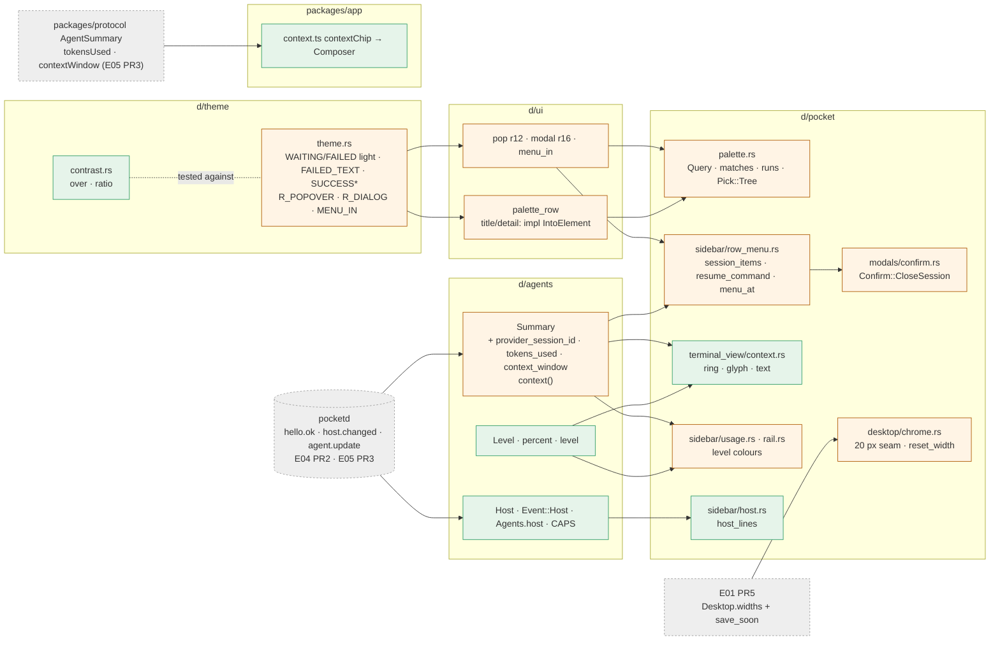

# Look (E16) Implementation Plan

> **For Claude:** REQUIRED SUB-SKILL: Use /implement to execute this plan task-by-task.

**Goal:** Give the desktop app AA-contrast status colours, one set of radii and a shared menu entrance. Add palette v2, a session menu, wider column seams, a context meter on desktop and phone, and a host line in the sidebar foot.

**Architecture:** The new colour values and radii live in `d/theme`, and a contrast test guards them. Parsing lives in `d/agents`: context usage, levels and host state. `d/pocket` keeps each feature's logic in pure functions beside its view, such as `palette::query`, `row_menu::session_items`, `context::glyph` and `host::host_lines`. The phone gets one pure `contextChip` and a label in the composer.

**Base:** main 5091a01. Paths: `d/` = `packages/desktop/crates/`, `pk/` = `packages/desktop/crates/pocket/src/`. Every line range below is at 5091a01. Design: `docs/designs/2026-09-30-look.md`.

**Toolset** (repo root `/Users/mingo/Developer/self/anywhere`; the shell is fish, so quote globs):
- One crate: `cd packages/desktop && cargo test -p <crate> <filter>`. Crates: `theme`, `ui`, `agents`, `store`, `pocket`. Filters are module paths, e.g. `cargo test -p pocket palette::`.
- Every PR boundary, from `packages/desktop`:
  - `cargo build --workspace`
  - `cargo clippy --workspace --all-targets`. Add no new warnings. The only baseline warnings are in `d/git/src/git.rs` and `pk/inbox.rs`.
  - `cargo test --workspace`
- Phone. Build protocol first, because its exports point at `dist`: `pnpm --filter @pocket/protocol build && pnpm --filter @pocket/app typecheck && pnpm --filter @pocket/app test`
- Screens, for view tasks, from the repo root. Capture before and after, then compare: `.ui-review/fixture/capture.sh <dir> <name>=<steps>…`. The script builds `cargo build --release -p pocket --features capture` and launches `target/release/pocket-desktop`. Steps are comma-separated names from `pk/capture.rs:13-38`: `session`, `worktree`, `rail`, `focus`, `explore`, `changes`, `comment`, `inbox`, `palette`, `new-session`, `prompt`, `add-repo`, `dark`.
- No task runs pocketd.

**Read first:**
- `CLAUDE.md`, "Desktop code layout" and "Desktop performance". Logic goes in pure functions, tests sit beside it, and render costs only what is visible.
- `docs/designs/2026-09-30-look.md` §3 (UX) and §10 (decisions). This plan puts them into code.
- `docs/plans/2026-09-30-dark-theme.md`. It explains `theme::Token { light, dark }`, `Token::new`/`Token::fixed` and `Token::pick(dark)`. Tests call `pick` and never flip the global `DARK` flag.
- `d/ui/src/ui.rs:32-40` (`pop`, `dropdown`) and `:714-727` (`modal`). All menus and sheets are built from these.
- `pk/sidebar/row_menu.rs` (whole file). It is the `⋯` menu pattern that the session menu extends.

**Assumptions** (settled; don't re-open):
- The owner's dark-theme plan has merged (1e71e24). All code here is already in Token form: colours are `theme::X`, and colour params take `Token`, not `u32`.
- **Decision 2 is PO-decided — owner review.** The light WAITING becomes `ad5700` and the light FAILED becomes `cd2b31`. Their dark values stay. This departs from the owner's "fixed in both schemes".
- **Widths are persisted by E01 PR5, not here.** E01 PR5's plan keeps `Desktop.widths` and saves them via `save_soon`. So PR3 adds only the 20 px seam and the double-click reset, which calls `save_soon`. Design decision 15 (`Store.widths` and a separate timer) is superseded; it would clash with E01's `ColumnWidths`.
- PR3–PR5 depend on unmerged epics and are written against those epics' contracts:
  - E03 PR1: the hello has no token and carries `"caps": ["pair.v1", "scopes.v1"]`. The read loop's `"hello.ok"` arm yields `Event::Connected(f.scopes)`. The socket test uses a `UnixListener` and asserts the whole hello.
  - E02 PR5: the phone's hello sends `caps: ["pair.v1"]` (E02 PR1 adds `caps` to the protocol only).
  - E05 PR3: `AgentSummary.tokensUsed` and `contextWindow?` under cap `summary.v2`.
  - E04 PR2: cap `host.v1`, `HelloOK.host?` and `host.changed { host: HostState { tailnet, keepingAwake } }`.
  - E01 PR5: `Desktop::save_soon(&mut self, cx)`. `drag_edge` already calls it.
- CLAUDE.md: add no comments beyond the doc comments this plan gives.

**§7.1 override rows this epic touches** (05-roadmap §7.1, verbatim):

| UX section | Spec says | Winning decision | Text to build |
|---|---|---|---|
| UXD §7 constraint 1 | tokens (Phase 1, incl. dark) before everything | D26 | E16 PR1 (light `Palette`) lands before E08 PR1 and every later desktop component. E01 and E04 PR4 predate it and use the existing constants. Dark waits for S1 |
| UXD §2.0 Palette struct | `Palette` + `LIGHT`/`DARK` statics + `p(cx)` | Owner's dark-theme plan | `theme::Token { light, dark }` consts, read as `theme::X` (`Into<Hsla>`); `Token::pick(dark)` in tests. No `Palette`, no `p(cx)` |
| UXD §2.0 WHITE split | ON_SOLID / ON_ACCENT / PAPER | Owner's dark-theme plan | ON_TEXT (text on TEXT fills), CUTOUT (badge rings), WHITE on coloured fills (count badge, Accent/Danger buttons), SURFACE on selected rows |
| UXD §2.1 light values | Zeron light palette | Owner's dark-theme plan + E16 PR1 | Today's light values, except E16's AA changes: WAITING ad5700, FAILED cd2b31, new SUCCESS 2b9a66, SUCCESS_TEXT 18794e, FAILED_TEXT cd2b31 |
| UXD §2.1 dark values | Zeron dark palette | Owner's dark-theme plan | The owner's MonoCode dark values. ACCENT 5b5bd6, agent colours and the status fills stay the same in both schemes; E16 tokens carry dark values (WAITING ffb224, FAILED e5484d, FAILED_TEXT ff9592, SUCCESS 30a46c, SUCCESS_TEXT 3dd68c) |
| UXD §2.1 chrome literals | FIELD / OVERLAY / DIALOG / SCRIM / PAPER / ACCENT_GLOW tokens | Owner's dark-theme plan | The owner's SIDE / GLASS / POPOVER / HIGHLIGHT / WELL / WINDOW_SOLID and inline `Token::new` literals; the Accent shadow 0x0a84ff59 and the 0x1111131a dims stay literal |
| UXD §2.2 count badge | label in ON_SOLID | Owner's dark-theme plan | WHITE stays. White on dark WAITING (1.8:1) and FAILED (3.91:1) is a listed exemption in E16's contrast test |
| UXD §7 constraint 1, D26 dark | Dark waits for S1 | Owner's dark-theme plan | Dark ships with the owner's plan and follows macOS appearance; no Appearance action. E16 PR1 lands on top of it |

**Rebased on 5091a01** (how this plan differs from the design, which cites f8f7293):
- Re-anchored lines:
  - error text at `pk/terminal_view.rs:120` (design `:62`);
  - `close_menus` at `pk/desktop.rs:255-259` (design `:247-251`);
  - the hello at `d/agents/src/agents.rs:245` (design `:248`);
  - the AA sites in `ui.rs` sit one line lower: `:242, :431, :460, :683, :693, :745, :815, :818`.
- `Confirm` lives in `pk/desktop/chrome.rs:45-49`. Its sheet is `pk/modals/confirm.rs`.
- `pk/modals/more.rs:10` has its own `.rounded(px(16.))` override. It goes, so More takes R_POPOVER.
- PR1 wraps 7 menus in `menu_in`: commit, changes, agent, branch, tab, diff target and the sidebar row menu. The design's 7 count the picker once and add the session menu; PR3's session menu reuses the row menu's wrap.
- `ui::menu_in` is generic (`E: Styled + IntoElement`), because most menus are `Stateful<Div>`.
- Storybook's `palette_row` calls pass `&str`. With `impl IntoElement` params, `.into()` can't infer its target.
- The context colours are `pk/terminal_view/context.rs::{glyph, text}`, not `ui::context_glyph`/`context_text`. `ui` has no `agents` dependency (`d/ui/Cargo.toml`: gpui-kit and theme only).
- `agents::percent` is public. The usage card shows "left" as `100 - percent`.
- The rail bars take the level colour only at Warn and Danger. At Low they keep the provider colour.
- `ui::context_bar` (`d/ui/src/ui.rs:666-669`) still has no callers. It is left in place.

---

## Architecture



Green boxes are new. Amber boxes are changed. Dashed boxes are other epics' work that this plan builds on.

The theme holds the colour values and radii, and a contrast test guards them. The agents crate turns pocketd's frames into plain data: context usage and level, the provider's session id, and host state. Each pocket feature reads that data through a pure function, which is tested beside it. Then a thin view draws it.

## Why this approach

- **Build on the owner's `Token`.** Rejected: a `Palette` struct with `p(cx)`, which would duplicate the owner's plan.
- **Change the light WAITING/FAILED values and keep the dark ones (PO-decided — owner review).** Rejected: keeping ffb224/e5484d with an exemption, which fails FR 16-1; a second amber for glyphs only.
- **Add SUCCESS\*, FAILED_TEXT; keep RUNNING until E08 PR1.** Rejected: renaming RUNNING here, since E08 PR1 owns the D1 swap.
- **Check dark mode against an explicit `DARK_EXEMPT` list.** Rejected: re-tuning dark ACCENT, which would override the owner.
- **Leave TEAL out of the AA test.** Rejected: nudging the owner's colour by 0.0004.
- **Change only the listed literal sites.** Rejected: sweeping every literal, which the owner's PR1 already did.
- **`pop()` defaults to R_POPOVER and the per-site radii go. The palette gets R_DIALOG.** Rejected: keeping the ad hoc radii.
- **One `menu_in` wrapper for all menus.** Rejected: rewriting the menus as a component.
- **E16 ships the D1 tokens; E08 PR1 owns the glyph shapes and call sites.** Rejected: an E16 `status_glyph`, which would duplicate E08's `tone`.
- **Highlights are byte ranges, skipped when lowercasing changes byte length.** Rejected: full Unicode case folding, which needs a new dependency.
- **The pointer moves the selection via `on_mouse_move`, and `palette_row` loses its hover background.** Rejected: tracking the last mouse position, which is more state for the same effect.
- **Right-click opens the menu at the pointer; `···` keeps its dropdown.** Rejected: always opening at the pointer, which would make `···` menus jump.
- **"Copy resume command" is hidden without a provider session id.** Rejected: showing it disabled, which reads as broken for fresh sessions.
- **The resume line starts with `cd '<cwd>' &&`.** Rejected: a bare `claude --resume <id>`, which would resume in the wrong folder.
- **Widths persist through E01 PR5's `save_soon`.** Rejected: a second widths store and timer in `Store` (design decision 15), which would clash with E01's `ColumnWidths`.
- **The seam handle renders via `deferred`.** Rejected: removing `overflow_hidden` from `column()`, which would let content spill.
- **Context percent is a whole number, `used * 100 / window`.** Rejected: floats, which make 74.99 an edge case.
- **The usage card and rail keep showing "left"; the ring shows "used".** Rejected: flipping the card's copy, since UXD §6 keeps "context left".
- **The context colours live in pocket, not ui.** Rejected: adding an `agents` dependency to `ui`, which the layering forbids.
- **The phone adds only `d.warning`.** Rejected: the full UXP §2 token set, which no FR owns.
- **The desktop hello sends `caps` from E16 PR4/PR5.** Rejected: E04 editing `d/agents`, which its design keeps out of scope.
- **The count badge keeps WHITE (owner wins).** Rejected: ON_SOLID.

## Tasks at a glance

**PR 1 · Tokens, AA, radii, MENU_IN.** Colour values pass AA in light, all popovers share one radius, and every menu fades in.

| # | Task | Main files | Risk |
|---|---|---|---|
| 1.1 | Contrast maths: `over` and `ratio` | `d/theme/src/contrast.rs` | Low |
| 1.2 | AA token values and the contrast tests | `d/theme/src/theme.rs` | Medium: the values are owner-review |
| 1.3 | Muted text becomes TEXT_2; errors use FAILED_TEXT | `d/ui/src/ui.rs`, `pk/desktop/chrome.rs`, `pk/terminal_view.rs` | Low |
| 1.4 | Radii and the `menu_in` entrance on 7 menus | `d/ui/src/ui.rs`, 9 pocket files | Low |

**PR 2 · Palette v2.** Every-word search with highlights, a `>` actions-only mode, worktrees, wrapping arrows and a pointer guard.

| # | Task | Main files | Risk |
|---|---|---|---|
| 2.1 | `Query`, `matches` and `runs` | `pk/palette.rs` | Low |
| 2.2 | Entries match on every word; the Worktrees group | `pk/palette.rs` | Medium: changes ranking and caps |
| 2.3 | Arrow keys wrap and keep the selection in view | `pk/palette.rs` | Low |
| 2.4 | Highlights, pointer guard, empty state, footer, R_DIALOG | `pk/palette.rs`, `d/ui/src/ui.rs`, storybook | Low |

**PR 3 · Menus and seams.** A session menu (also on right-click at the pointer), a close confirm, and 20 px seams that reset on double-click.

| # | Task | Main files | Risk |
|---|---|---|---|
| 3.1 | `Summary.provider_session_id` | `d/agents/src/agents.rs` | Low |
| 3.2 | `resume_command` and `session_items` | `pk/sidebar/row_menu.rs` | Low |
| 3.3 | The Close session confirm | `pk/modals/confirm.rs`, `pk/desktop/chrome.rs` | Low |
| 3.4 | The session menu, opened at the pointer | `pk/sidebar/row_menu.rs`, `sessions.rs`, `sidebar.rs`, `desktop.rs`, `d/ui/src/ui.rs` | Medium: menu layering |
| 3.5 | 20 px seams with double-click reset | `pk/desktop/chrome.rs` | Medium: must follow E01 PR5 |

**PR 4 · Context meter, desktop and phone.** The real context window drives a ring, the rail, the usage card and a phone chip at 75/90.

| # | Task | Main files | Risk |
|---|---|---|---|
| 4.1 | `tokens_used`, `context_window`, `Level` | `d/agents/src/agents.rs` | Low |
| 4.2 | Hello asks for `summary.v2` | `d/agents/src/agents.rs` | Medium: written against E03 PR1 |
| 4.3 | The 16 px context ring with its hover card | `pk/terminal_view/context.rs`, `pk/terminal_view.rs` | Medium: path drawing |
| 4.4 | Usage card and rail on levels; drop the fake 200k | `pk/sidebar/usage.rs`, `rail.rs`, `d/agents/src/agents.rs` | Low |
| 4.5 | Phone context chip | `packages/app/src/context.ts`, `Composer.tsx`, `ChatScreen.tsx`, `client.ts` | Medium: needs E05 PR3 types |

**PR 5 · Aside-foot host line.** Shows "Phone access needs Tailscale ↗" and "Keeping Mac awake" from pocketd's host state.

| # | Task | Main files | Risk |
|---|---|---|---|
| 5.1 | `Host`, `Event::Host`, `Agents.host` | `d/agents/src/agents.rs` | Low |
| 5.2 | Read host frames; hello asks for `host.v1` | `d/agents/src/agents.rs` | Medium: written against E03 PR1 |
| 5.3 | The host lines in the sidebar foot | `pk/sidebar/host.rs`, `pk/sidebar.rs` | Low |

---

## PR 1: Tokens, AA, radii, MENU_IN

**Scope:** New light values for WAITING and FAILED, plus the FAILED_TEXT and SUCCESS tokens and a contrast test. Muted text sites move to TEXT_2. `pop` gets radius 12, dialogs 16, and seven menus get the `menu_in` entrance. SUCCESS\* stays unused until E08 PR1. It does not change the status glyph shapes or call sites (E08 PR1).
**Depends on:** nothing
**Done when:** the three workspace commands pass with no new clippy warnings. The before/after captures show the new amber and red, TEXT_2 labels and r12 menus.

### Task 1.1: Contrast maths

**What & why:** Adds WCAG contrast maths to the theme crate. The token tests in 1.2 need it, so it comes first.

**Files:**
- Create: `packages/desktop/crates/theme/src/contrast.rs`
- Modify: `packages/desktop/crates/theme/src/theme.rs:7` (add the module after `MONO`)
- Test: `packages/desktop/crates/theme/src/contrast.rs` (`mod tests`)

**Context:** Colours are `u32` as `0xRRGGBBAA`. Many surfaces are translucent over the window, so a colour's alpha must be composited over an opaque background before its luminance is measured. Don't use `use super::*` in tests of crates that import `gpui_kit::*`: gpui's `test` macro comes along and blows the recursion limit. Import names explicitly.

**Step 1: Write the failing test**

Create `contrast.rs` with only this test module, and add the module line to `theme.rs` after `pub const MONO: &str = "Geist Mono";` (`:7`):

```rust

pub mod contrast;
```

```rust
#[cfg(test)]
mod tests {
    use super::{over, ratio};

    #[test]
    fn black_on_white_is_twenty_one_to_one() {
        assert!((ratio(0x000000ff, 0xffffffff) - 21.).abs() < 0.01);
    }

    #[test]
    fn ratio_composites_alpha_over_the_background() {
        assert_eq!(over(0x00000080, 0xffffffff), 0x7f7f7fff);
        assert!((ratio(0x00000080, 0xffffffff) - ratio(0x7f7f7fff, 0xffffffff)).abs() < 0.001);
        assert!((ratio(0x00000000, 0xffffffff) - 1.).abs() < 0.001);
    }
}
```

The first test pins the WCAG formula to its known maximum. The second proves that alpha is composited before measuring, and that a fully transparent colour has no contrast.

**Step 2: Run the test to verify it fails**

Run: `cd packages/desktop && cargo test -p theme contrast::`
Expected: FAIL with `error[E0432]: unresolved imports `super::over`, `super::ratio``

**Step 3: Write the implementation**

Put this above the test module in `contrast.rs`:

```rust
/// `top` (0xRRGGBBAA) painted over an opaque `bottom`, as an opaque colour.
pub fn over(top: u32, bottom: u32) -> u32 {
    let a = (top & 0xff) as f32 / 255.;
    let mix = |s: u32| (((top >> s) & 0xff) as f32 * a + ((bottom >> s) & 0xff) as f32 * (1. - a)).round() as u32;
    (mix(24) << 24) | (mix(16) << 16) | (mix(8) << 8) | 0xff
}

/// WCAG 2.x contrast ratio of `fg` over an opaque `bg`, with `fg`'s alpha composited first.
pub fn ratio(fg: u32, bg: u32) -> f32 {
    let (a, b) = (luminance(over(fg, bg)), luminance(bg));
    (a.max(b) + 0.05) / (a.min(b) + 0.05)
}

fn luminance(c: u32) -> f32 {
    let lin = |s: u32| {
        let v = ((c >> s) & 0xff) as f32 / 255.;
        if v <= 0.04045 { v / 12.92 } else { ((v + 0.055) / 1.055).powf(2.4) }
    };
    0.2126 * lin(24) + 0.7152 * lin(16) + 0.0722 * lin(8)
}

```

**Step 4: Run the test to verify it passes**

Run: `cd packages/desktop && cargo test -p theme contrast::`
Expected: PASS, 2 tests

### Task 1.2: AA token values and the contrast tests

**What & why:** Changes the light WAITING and FAILED values and adds FAILED_TEXT and SUCCESS\*. Tests then prove every text role and status glyph clears AA on every surface. This comes before the site fixes because those use FAILED_TEXT.

**Files:**
- Modify: `packages/desktop/crates/theme/src/theme.rs:90` (WAITING), `:96-97` (FAILED; add FAILED_TEXT and SUCCESS\*)
- Test: `packages/desktop/crates/theme/src/theme.rs:281-283` (test imports) and new tests before `:285`

**Context:**
- AA means 4.5:1 for text and 3:1 for glyphs.
- Surfaces such as SURFACE and POPOVER are translucent over WINDOW_SOLID, so the test composites them first.
- In dark mode, ACCENT and WHITE are one value in both schemes (the owner's choice), so some dark pairs stay below AA. `DARK_EXEMPT` lists exactly those. The test fails if a pair starts failing or stops failing.
- TEAL is left out: it is 4.4996, owner-owned, and not E16's colour.
- These values are PO-decided and go to owner review.

**Step 1: Write the failing tests**

Replace the test imports (`:281-283`) with:

```rust
    use super::contrast::{over, ratio};
    use super::{
        ACCENT, DIFF_ADD_TEXT, DIFF_DEL_TEXT, FAILED, FAILED_TEXT, FILL_1, FILL_2, FILL_3, FILL_4, HAIRLINE, MATERIAL, MODIFIED, PAGE, POPOVER, SEPARATOR, SEPARATOR_STRONG, SIDE, SUCCESS, SUCCESS_TEXT, SURFACE, SURFACE_SUNKEN, SYN_COMMENT, SYN_FN, SYN_KEYWORD,
        SYN_STRING, TEXT, TEXT_2, TEXT_3, TEXT_BODY, Token, WAITING, WAITING_TEXT, WHITE, WINDOW, WINDOW_SOLID, highlight_theme, material, material_icon,
    };
    use gpui_kit::component::input::HighlightStyleResolver;
    use gpui_kit::{Hsla, rgba};
```

Then add this after the imports, before `#[test] fn matches_material_icons_like_vscode`:

```rust
    const TEXT_ROLES: [(&str, Token); 10] = [
        ("TEXT", TEXT),
        ("TEXT_BODY", TEXT_BODY),
        ("TEXT_2", TEXT_2),
        ("WAITING_TEXT", WAITING_TEXT),
        ("SUCCESS_TEXT", SUCCESS_TEXT),
        ("FAILED_TEXT", FAILED_TEXT),
        ("ACCENT", ACCENT),
        ("DIFF_ADD_TEXT", DIFF_ADD_TEXT),
        ("DIFF_DEL_TEXT", DIFF_DEL_TEXT),
        ("MODIFIED", MODIFIED),
    ];
    const GLYPHS: [(&str, Token); 5] = [("WAITING", WAITING), ("SUCCESS", SUCCESS), ("FAILED", FAILED), ("ACCENT", ACCENT), ("TEXT_3", TEXT_3)];
    const FILLS: [(&str, Token); 3] = [("ACCENT", ACCENT), ("FAILED", FAILED), ("WAITING", WAITING)];
    /// ACCENT and WHITE are one value in both schemes (the owner's dark-theme plan), so these dark pairs stay below AA.
    const DARK_EXEMPT: [&str; 10] = [
        "text ACCENT on WINDOW",
        "text ACCENT on SURFACE",
        "text ACCENT on SURFACE_SUNKEN",
        "text ACCENT on PAGE",
        "text ACCENT on POPOVER",
        "text ACCENT on SIDE",
        "glyph ACCENT on SURFACE",
        "glyph ACCENT on POPOVER",
        "WHITE on FAILED",
        "WHITE on WAITING",
    ];

    fn surfaces(dark: bool) -> [(&'static str, u32); 6] {
        let window = WINDOW_SOLID.pick(dark);
        let on_window = |t: Token| over(t.pick(dark), window);
        [("WINDOW", window), ("SURFACE", on_window(SURFACE)), ("SURFACE_SUNKEN", on_window(SURFACE_SUNKEN)), ("PAGE", on_window(PAGE)), ("POPOVER", on_window(POPOVER)), ("SIDE", on_window(SIDE))]
    }

    fn below(dark: bool, roles: &[(&str, Token)], min: f32) -> Vec<String> {
        surfaces(dark).into_iter().flat_map(|(bg_name, bg)| roles.iter().filter(move |(_, t)| ratio(t.pick(dark), bg) < min).map(move |(name, _)| format!("{name} on {bg_name}"))).collect()
    }

    fn white_below(dark: bool) -> Vec<String> {
        FILLS.iter().filter(|(_, fill)| ratio(WHITE.pick(dark), fill.pick(dark)) < 4.5).map(|(name, _)| format!("WHITE on {name}")).collect()
    }

    #[test]
    fn light_text_roles_clear_4_5_on_every_surface() {
        assert_eq!(below(false, &TEXT_ROLES, 4.5), Vec::<String>::new());
    }

    #[test]
    fn light_status_glyphs_clear_3() {
        assert_eq!(below(false, &GLYPHS, 3.), Vec::<String>::new());
    }

    #[test]
    fn white_labels_clear_4_5_on_accent_failed_and_waiting_fills() {
        assert_eq!(white_below(false), Vec::<String>::new());
    }

    #[test]
    fn dark_pairs_clear_aa_except_the_listed_exemptions() {
        let text = below(true, &TEXT_ROLES, 4.5).into_iter().map(|s| format!("text {s}"));
        let glyphs = below(true, &GLYPHS, 3.).into_iter().map(|s| format!("glyph {s}"));
        let mut failing: Vec<String> = text.chain(glyphs).chain(white_below(true)).collect();
        failing.sort();
        let mut exempt = DARK_EXEMPT.map(String::from).to_vec();
        exempt.sort();
        assert_eq!(failing, exempt);
    }

```

- The light tests prove FR 16-1: text ≥ 4.5 and glyphs ≥ 3 on every surface, and white labels ≥ 4.5 on the fills.
- The dark test pins the known exemptions, so a regression or a silent fix both show up.

**Step 2: Run the tests to verify they fail**

Run: `cd packages/desktop && cargo test -p theme`
Expected: FAIL with `error[E0432]: unresolved imports` naming `FAILED_TEXT`, `SUCCESS`, `SUCCESS_TEXT`

**Step 3: Write the implementation**

Replace `:90` with:

```rust
pub const WAITING: Token = Token::new(0xad5700ff, 0xffb224ff);
```

Replace `:96-97` (`FAILED`, `FAILED_BG`) with:

```rust
pub const FAILED: Token = Token::new(0xcd2b31ff, 0xe5484dff);
pub const FAILED_TEXT: Token = Token::new(0xcd2b31ff, 0xff9592ff);
pub const FAILED_BG: Token = Token::fixed(0xe5484d1c);
pub const SUCCESS: Token = Token::new(0x2b9a66ff, 0x30a46cff);
pub const SUCCESS_TEXT: Token = Token::new(0x18794eff, 0x3dd68cff);
pub const SUCCESS_BG: Token = Token::fixed(0x30a46c21);
```

**Step 4: Run the tests to verify they pass**

Run: `cd packages/desktop && cargo test -p theme`
Expected: PASS, including the four new tests and the two `contrast::` tests

### Task 1.3: Muted text becomes TEXT_2; errors use FAILED_TEXT

**What & why:** TEXT_3 (3.07:1) and TEXT_4 (2.33:1) are used as text in places. Those sites move to TEXT_2, and the page-bar error moves to FAILED_TEXT. This is a view-only change, so it is checked with screens, not unit tests.

**Files:**
- Modify: `packages/desktop/crates/ui/src/ui.rs:242, :431, :460, :683, :693, :745, :815, :818`
- Modify: `packages/desktop/crates/pocket/src/desktop/chrome.rs:96`
- Modify: `packages/desktop/crates/pocket/src/terminal_view.rs:120`

**Context:** TEXT_3 stays correct for icons and glyphs (3:1 is enough there), so change only text. The palette's own TEXT_4 sites move in PR2. `pk/modals/new_session.rs:398` keeps its TEXT_4 footer hint; it is outside the design's list.

**Step 1: Capture the before screens**

Run: `.ui-review/fixture/capture.sh /tmp/look-before sessions=session palette=palette new=new-session changes=changes,session inbox=inbox`
Expected: five `impl-*.png` paths printed

**Step 2: Make the replacements**

`d/ui/src/ui.rs`:
- `:242` `State::NotAttached => pill(FILL_3, TEXT_3).child("Not attached"),` → `State::NotAttached => pill(FILL_3, TEXT_2).child("Not attached"),`
- `:431` in `session_row`, `.text_size(px(12.)).text_color(TEXT_3);` → `.text_size(px(12.)).text_color(TEXT_2);`
- `:460` `State::NotAttached => label(TEXT_3).child("Not attached"),` → `State::NotAttached => label(TEXT_2).child("Not attached"),`
- `:683` in `section_header`, `.text_color(TEXT_3)` → `.text_color(TEXT_2)`
- `:693` `div().text_size(px(12.)).font_weight(FontWeight::SEMIBOLD).text_color(TEXT_3).child(label.into())` → the same with `TEXT_2`
- `:745` in `palette_row`, `.text_size(px(12.5)).text_color(TEXT_4).child(detail))` → `.text_size(px(12.5)).text_color(TEXT_2).child(detail))`
- `:815` in `trigger_field`, `.text_color(TEXT_3)` → `.text_color(TEXT_2)`
- `:818` `.child(div().text_size(px(11.5)).text_color(TEXT_4).child(keys.to_string()))` → the same with `TEXT_2`

`pk/desktop/chrome.rs:96`:

```rust
    div().p(px(16.)).text_size(px(13.5)).text_color(TEXT_2).child(text.into())
```

`pk/terminal_view.rs:120`:

```rust
        let error = self.error.clone().map(|e| div().min_w_0().truncate().mr(px(6.)).text_size(px(12.5)).text_color(FAILED_TEXT).child(e));
```

**Step 3: Build and test**

Run: `cd packages/desktop && cargo build --workspace && cargo test -p ui -p pocket`
Expected: PASS

**Step 4: Capture the after screens and compare**

Run: `.ui-review/fixture/capture.sh /tmp/look-after sessions=session palette=palette new=new-session changes=changes,session inbox=inbox`
Expected: the same five screens. Section headers, session meta lines, field labels and the palette detail are darker grey, and nothing moves.

### Task 1.4: Radii and the `menu_in` entrance

**What & why:** Adds the radius and motion constants. `pop` defaults to r12, dialogs get r16, and seven menus share one 150 ms fade-and-drop. The per-site radius overrides go.

**Files:**
- Modify: `packages/desktop/crates/theme/src/theme.rs:7` (constants after `MONO`, before `pub mod contrast;`)
- Modify: `packages/desktop/crates/ui/src/ui.rs:32-34` (`pop`, then `menu_in`), `:716` (`modal`)
- Modify: `packages/desktop/crates/pocket/src/git_ui/changes/commit_box.rs:78, :94`
- Modify: `packages/desktop/crates/pocket/src/git_ui/changes/header.rs:47, :57`
- Modify: `packages/desktop/crates/pocket/src/git_ui/diff/target.rs:74-83`
- Modify: `packages/desktop/crates/pocket/src/modals/more.rs:10`
- Modify: `packages/desktop/crates/pocket/src/modals/new_session.rs:401`
- Modify: `packages/desktop/crates/pocket/src/modals/new_session/picker.rs:60, :151, :165`
- Modify: `packages/desktop/crates/pocket/src/sidebar/row_menu.rs:34-40`
- Modify: `packages/desktop/crates/pocket/src/terminal_view/tab_menu.rs:44`
- Modify: `packages/desktop/crates/pocket/src/terminal_view/tabs.rs:138`

**Context:**
- `with_animation` comes from gpui's `AnimationExt` (via `gpui_kit::*`). Its easing is `ease_out_quint()`.
- Under Reduce motion, gpui snaps animations to their end (gpui-pre 0.3.6 window.rs:2627).
- `menu_in` needs its own element id per menu. It wraps the menu *inside* `ui::dropdown`/`anchored`, so the dropdown's position is untouched.
- More keeps its own animation and only loses its radius override.

**Step 1: Write the implementation**

`theme.rs`, after `:7`:

```rust
pub const R_POPOVER: f32 = 12.;
pub const R_DIALOG: f32 = 16.;
pub const MENU_IN: std::time::Duration = std::time::Duration::from_millis(150);
```

`ui.rs`: replace `pop` (`:32-34`) and add `menu_in` after it:

```rust
pub fn pop<E: Styled>(e: E) -> E {
    e.bg(POPOVER).rounded(px(R_POPOVER)).shadow(vec![ring(SEPARATOR, 0.5), highlight(HIGHLIGHT), shadow(rgba(0x00000024), 18., 50.), shadow(rgba(0x0000000f), 2., 6.)])
}

/// A menu's entrance: it fades in while sliding 4 px down into place.
pub fn menu_in<E: Styled + IntoElement + 'static>(id: impl Into<ElementId>, menu: E) -> AnimationElement<E> {
    menu.with_animation(id, Animation::new(MENU_IN).with_easing(ease_out_quint()), |e, t| e.opacity(t).mt(px(-4. * (1. - t))))
}
```

`ui.rs:716`, in `modal`: after the `pop(div().w(px(width))…)` line, add

```rust
            .rounded(px(R_DIALOG))
```

Remove these per-site radius lines:
- `commit_box.rs:78` `.rounded(px(14.))`
- `header.rs:57` `.rounded(px(14.))`
- `picker.rs:60` `.rounded(px(10.))`
- `tab_menu.rs:44` `.rounded(px(10.))`
- `row_menu.rs:34` `.rounded(px(14.))` (the `aside-menu-in` block below leaves it out)
- `more.rs:10`: drop `.rounded(px(16.))` from the chain, giving
  ```rust
          let menu = ui::pop(div().absolute().right(px(22.)).top(px(58.)).w(px(230.)).p(px(6.)).flex().flex_col()).occlude();
  ```

Wrap menus:
- `commit_box.rs:94`:
  ```rust
              .when(menu_open, |d| d.child(ui::dropdown(34., ui::menu_in("commit-menu-in", menu))));
  ```
- `header.rs:47`:
  ```rust
              .child(div().relative().child(more).when(open, |d| d.child(ui::dropdown(30., ui::menu_in("changes-menu-in", self.changes_menu_view(repo, cx))))))
  ```
- `picker.rs:151` and `:165`:
  ```rust
          let agent_menu = (f.picker == Some(Picker::Agent)).then(|| ui::dropdown(36., ui::menu_in("agent-menu-in", self.agent_picker(cx))));
  ```
  ```rust
          let branch_menu = (f.picker == Some(Picker::Branch)).then(|| ui::dropdown(36., ui::menu_in("branch-menu-in", self.branch_picker(cx))));
  ```
- `tabs.rs:138`:
  ```rust
          let menu = self.terminal.tab_menu.then(|| ui::dropdown(29., ui::menu_in("tab-menu-in", self.tab_menu_view(cx))));
  ```
- `target.rs:74-83` (the `ui::pop(div().id("target-menu"))…` child of `anchored()`) becomes:
  ```rust
                      ui::menu_in(
                          "target-menu-in",
                          ui::pop(div().id("target-menu"))
                              .w(px(360.))
                              .p(px(6.))
                              .flex()
                              .flex_col()
                              .children(items)
                              .on_mouse_down_out(cx.listener(|this, _: &MouseDownEvent, _, cx| {
                                  this.diff.target_menu = false;
                                  cx.notify();
                              })),
                      ),
  ```
- `row_menu.rs:34-40` (the second argument of `ui::dropdown(26., …)`) becomes:
  ```rust
                      ui::menu_in(
                          "aside-menu-in",
                          ui::pop(div().id("aside-menu")).w(px(210.)).p(px(6.)).flex().flex_col()
                              .occlude()
                              .on_mouse_down_out(cx.listener(|this, _: &MouseDownEvent, _, cx| {
                                  this.row_menu = None;
                                  cx.notify();
                              }))
                              .children(self.row_menu_items(&menu, cx)),
                      ),
  ```

`new_session.rs:401`: add `.rounded(px(R_DIALOG))` after the sheet's `pop(…)`:

```rust
            ui::pop(div().w(px(640.)).pt(px(17.)).px(px(17.)).pb(px(15.)).flex().flex_col().gap(px(10.))).rounded(px(R_DIALOG)).occlude().child(header).children(name_field).child(composer).child(footer),
```

**Step 2: Build, lint and test**

Run: `cd packages/desktop && cargo build --workspace && cargo clippy --workspace --all-targets && cargo test --workspace`
Expected: PASS, with no new clippy warnings

**Step 3: Capture and compare**

Run: `.ui-review/fixture/capture.sh /tmp/look-after-1 sessions=session new=new-session add=add-repo dark=dark,session`
Expected:
- Popovers have r12 corners, and the New session sheet and Add project modal have r16.
- In light, the Needs-you amber is darker (ad5700). Dark is unchanged.

**Step 4: Commit boundary**

Run: `cd packages/desktop && cargo test -p theme`
Expected: PASS. PR 1 is ready.

---

## PR 2: Palette v2

**Scope:** The palette matches every typed word across a row's fields and highlights the matches in ACCENT. `>` limits it to actions. A Worktrees group appears, the arrows wrap and scroll the selection into view, and hovering moves the selection. There are new caps, an empty state and footer hints, and the card is r16. E08 PR2 adds Up next later; it is not here.
**Depends on:** E16 PR1 (`R_DIALOG`, TEXT_2 on `palette_row`)
**Done when:** the workspace commands pass, and `cargo test -p pocket palette::` runs the 17 palette tests green.

### Task 2.1: `Query`, `matches` and `runs`

**What & why:** Adds the pure pieces that every group uses: parse the input, test a match, and find highlight ranges. They come first so the entry changes in 2.2 can use them.

**Files:**
- Modify: `packages/desktop/crates/pocket/src/palette.rs:7` (import), before `:48` (new functions), `:294` (test imports), `:335` (new tests before the `strings` helper)

**Context:**
- A query is lowercase words. Every word must appear in at least one of the row's fields; the fields are a session's title, project and branch.
- `runs` returns byte ranges into the original text for `StyledText::with_highlights`. When lowercasing changes a character's byte length (e.g. `İ`), byte offsets would drift, so it returns no ranges. Matching still works.
- `query` and `runs` are unused outside tests until Task 2.4, so expect dead-code warnings until then.

**Step 1: Write the failing tests**

Replace the test imports (`:294`) with:

```rust
    use super::{Entry, Lead, Nav, Pick, Query, action_entries, file_entries, matches, nav, query, runs, session_entries};
```

Add these tests before `fn strings` (`:335`):

```rust
    #[test]
    fn every_word_must_match_some_field() {
        assert!(matches(&strings(&["fix", "main"]), &["Fix login", "app", "main"]));
        assert!(!matches(&strings(&["fix", "docs"]), &["Fix login", "app", "main"]));
        assert!(matches(&[], &["anything"]));
    }

    #[test]
    fn a_greater_than_prefix_keeps_only_actions() {
        assert_eq!(query("  Fix  Login "), Query::All(strings(&["fix", "login"])));
        assert_eq!(query(">new"), Query::Actions(strings(&["new"])));
        assert_eq!(query(">"), Query::Actions(vec![]));
    }

    #[test]
    fn runs_merge_overlapping_matches() {
        assert_eq!(runs("Fix build fix", &strings(&["fix", "ix b"])), vec![0..5, 10..13]);
        assert!(runs("abc", &strings(&["x"])).is_empty());
    }

    #[test]
    fn runs_are_empty_when_lowercasing_changes_length() {
        assert!(runs("İstanbul", &strings(&["stan"])).is_empty());
        assert!(matches(&strings(&["stan"]), &["İstanbul"]));
    }

```

**Step 2: Run the tests to verify they fail**

Run: `cd packages/desktop && cargo test -p pocket palette::`
Expected: FAIL with `error[E0432]: unresolved imports` naming `Query`, `matches`, `query`, `runs`

**Step 3: Write the implementation**

After `use std::cmp::Reverse;` (`:7`) add `use std::ops::Range;`. Before `fn hint` (`:48`) add:

```rust
/// The typed text as lowercase words; a leading `>` searches actions only.
#[derive(Debug, PartialEq)]
enum Query {
    All(Vec<String>),
    Actions(Vec<String>),
}

impl Query {
    fn words(&self) -> &[String] {
        match self {
            Query::All(w) | Query::Actions(w) => w,
        }
    }
}

fn query(raw: &str) -> Query {
    let raw = raw.trim_start();
    let words = |s: &str| s.split_whitespace().map(str::to_lowercase).collect();
    match raw.strip_prefix('>') {
        Some(rest) => Query::Actions(words(rest)),
        None => Query::All(words(raw)),
    }
}

/// Every word is part of at least one field, ignoring case.
fn matches(words: &[String], fields: &[&str]) -> bool {
    let fields: Vec<String> = fields.iter().map(|f| f.to_lowercase()).collect();
    words.iter().all(|w| fields.iter().any(|f| f.contains(w.as_str())))
}

/// The byte ranges of `text` the words match, merged. Empty when lowercasing would move byte offsets.
fn runs(text: &str, words: &[String]) -> Vec<Range<usize>> {
    let keeps_width = |c: char| {
        let lower: Vec<char> = c.to_lowercase().collect();
        lower.len() == 1 && lower[0].len_utf8() == c.len_utf8()
    };
    if !text.chars().all(keeps_width) {
        return Vec::new();
    }
    let lower = text.to_lowercase();
    let mut found: Vec<Range<usize>> = words.iter().flat_map(|w| lower.match_indices(w.as_str()).map(|(i, m)| i..i + m.len())).collect();
    found.sort_by_key(|r| r.start);
    let mut merged: Vec<Range<usize>> = Vec::new();
    for r in found {
        match merged.last_mut() {
            Some(last) if r.start <= last.end => last.end = last.end.max(r.end),
            _ => merged.push(r),
        }
    }
    merged
}

```

**Step 4: Run the tests to verify they pass**

Run: `cd packages/desktop && cargo test -p pocket palette::`
Expected: PASS

### Task 2.2: Entries match on every word; the Worktrees group

**What & why:** Each group now takes the parsed words. Sessions also match on project and branch, and their detail shows the branch. A Worktrees group opens a worktree in its project. The caps become Sessions 8, Worktrees 5, Files 8 while typing, and 5 sessions / 3 files when empty.

**Files:**
- Modify: `packages/desktop/crates/pocket/src/palette.rs:12-18` (`Pick`), `:38-46` (delete `status_word`), `:76-130` (delete `hit`; rewrite `session_entries`, `file_entries`, `action_entries`; add `tree_entries`), `:172-189` (`palette_sections`), `:201` (`activate`)
- Test: `packages/desktop/crates/pocket/src/palette.rs:292-387` (`mod tests`)

**Context:**
- `Card` (`pk/status.rs`) has `cwd`. The branch comes from `self.repos.get(&c.cwd)`, the same lookup the sidebar card uses (`pk/sidebar/sessions.rs:54`).
- `Status::label()` (`pk/status.rs:33`) gives "Needs you", "Working" and so on. It replaces the local `status_word`.
- `self.worktrees: HashMap<project path, Vec<git::Worktree>>` lists each project's worktrees, the main one first.
- `Desktop::select_tree(project, tree, cx)` (`pk/desktop.rs:182`) opens a worktree, with `None` meaning the main one.
- `Pick::Tree.project` is the index into `self.projects()`. `Pick` must stay `Clone + PartialEq`, so it stores the index, not an entity.
- At most 8 + 5 + 8 + 3 = 24 rows are built per frame.
- E03 PR4 (same week) may land first. Then keep its `agents: &Agents` third parameter, `Pick::PairPhone` entry, owner `.filter` and `activate` arm, and pass `&self.agents` in `palette_sections`. The new `mod tests` keeps its `use agents::{Agents, Event};` and `pair_phone_is_offered_only_to_the_owner`, calling `action_entries(&[], "app", &a)`; `actions_match_on_their_titles` passes `&Agents::default()`.

**Step 1: Write the failing tests**

Replace the whole `mod tests` (`:292-387`) with:

```rust
#[cfg(test)]
mod tests {
    use super::{Entry, Lead, Nav, Pick, Query, action_entries, file_entries, matches, nav, query, runs, session_entries, tree_entries};
    use crate::status::{Card, Kind, Status};

    fn card(id: &str, title: &str, status: Status, at: i64) -> (String, Option<String>, Card) {
        let c = Card { id: id.into(), provider: "claude".into(), title: title.into(), cwd: String::new(), at, status, kind: Kind::Agent };
        ("app".into(), Some("main".into()), c)
    }

    fn titles(entries: &[Entry]) -> Vec<&str> {
        entries.iter().map(|e| e.title.as_str()).collect()
    }

    fn strings(s: &[&str]) -> Vec<String> {
        s.iter().map(|s| s.to_string()).collect()
    }

    fn tree(path: &str, branch: &str, main: bool) -> git::Worktree {
        git::Worktree { path: path.into(), branch: branch.into(), main }
    }

    #[test]
    fn every_word_must_match_some_field() {
        assert!(matches(&strings(&["fix", "main"]), &["Fix login", "app", "main"]));
        assert!(!matches(&strings(&["fix", "docs"]), &["Fix login", "app", "main"]));
        assert!(matches(&[], &["anything"]));
    }

    #[test]
    fn a_greater_than_prefix_keeps_only_actions() {
        assert_eq!(query("  Fix  Login "), Query::All(strings(&["fix", "login"])));
        assert_eq!(query(">new"), Query::Actions(strings(&["new"])));
        assert_eq!(query(">"), Query::Actions(vec![]));
    }

    #[test]
    fn runs_merge_overlapping_matches() {
        assert_eq!(runs("Fix build fix", &strings(&["fix", "ix b"])), vec![0..5, 10..13]);
        assert!(runs("abc", &strings(&["x"])).is_empty());
    }

    #[test]
    fn runs_are_empty_when_lowercasing_changes_length() {
        assert!(runs("İstanbul", &strings(&["stan"])).is_empty());
        assert!(matches(&strings(&["stan"]), &["İstanbul"]));
    }

    #[test]
    fn empty_query_shows_five_sessions_and_three_files() {
        let cards = (0..7).map(|i| card(&format!("s{i}"), &format!("Task {i}"), Status::Idle, i)).collect();
        assert_eq!(session_entries(&[], cards).len(), 5);
        let changed = strings(&["a.rs", "b.rs", "c.rs", "d.rs"]);
        assert_eq!(file_entries(&[], "/w", &changed, &changed).len(), 3);
        assert!(tree_entries(&[], vec![(0, "app".into(), tree("/w/app", "main", true))]).is_empty());
    }

    #[test]
    fn groups_cap_at_8_5_8() {
        let q = strings(&["fix"]);
        let cards = (0..10).map(|i| card(&format!("s{i}"), &format!("Fix {i}"), Status::Idle, i)).collect();
        assert_eq!(session_entries(&q, cards).len(), 8);
        let trees = (0..7).map(|i| (0, "app".into(), tree(&format!("/w/fix-{i}"), &format!("fix-{i}"), false))).collect();
        assert_eq!(tree_entries(&q, trees).len(), 5);
        let files: Vec<String> = (0..10).map(|i| format!("src/fix_{i}.rs")).collect();
        assert_eq!(file_entries(&q, "/w", &[], &files).len(), 8);
    }

    #[test]
    fn sessions_show_the_most_urgent_then_latest_matches() {
        let cards = vec![
            card("a", "Fix login", Status::Idle, 9),
            card("b", "Fix CI", Status::NeedsYou, 1),
            card("c", "Docs", Status::NeedsYou, 5),
            card("d", "fix tests", Status::Working, 3),
            card("e", "Fix lint", Status::NeedsYou, 4),
            card("f", "Fix build", Status::Done, 2),
            card("g", "Fix typo", Status::Working, 8),
        ];
        let got = session_entries(&strings(&["fix"]), cards);
        assert_eq!(titles(&got), vec!["Fix lint", "Fix CI", "Fix build", "Fix typo", "fix tests", "Fix login"]);
    }

    #[test]
    fn a_session_opens_its_agent_and_reads_its_project_branch_provider_and_status() {
        let mut detached = card("a3", "Lint", Status::Done, 1);
        detached.1 = None;
        let got = session_entries(&[], vec![card("a1", "Fix CI", Status::NeedsYou, 1), card("a2", "Docs", Status::Working, 1), detached]);
        let got: Vec<_> = got.into_iter().map(|e| (e.pick, e.lead, e.detail)).collect();
        assert_eq!(
            got,
            vec![
                (Pick::Session("a1".into()), Lead::Waiting, "app · main · Claude Code · Needs you".to_string()),
                (Pick::Session("a3".into()), Lead::Provider("claude".into()), "app · Claude Code · Done".to_string()),
                (Pick::Session("a2".into()), Lead::Running, "app · main · Claude Code · Working".to_string()),
            ]
        );
    }

    #[test]
    fn sessions_match_on_project_and_branch_too() {
        let got = session_entries(&strings(&["app", "main"]), vec![card("a1", "Fix CI", Status::Idle, 1)]);
        assert_eq!(titles(&got), vec!["Fix CI"]);
    }

    #[test]
    fn a_worktree_opens_in_its_project_and_the_main_one_reads_as_the_project() {
        let trees = vec![(2, "app".into(), tree("/w/app", "main", true)), (2, "app".into(), tree("/w/app-login", "login", false))];
        let got: Vec<_> = tree_entries(&strings(&["app"]), trees).into_iter().map(|e| (e.pick, e.title, e.detail)).collect();
        assert_eq!(
            got,
            vec![
                (Pick::Tree { project: 2, tree: None }, "app".to_string(), "app · main".to_string()),
                (Pick::Tree { project: 2, tree: Some("/w/app-login".into()) }, "app-login".to_string(), "app · login".to_string()),
            ]
        );
    }

    #[test]
    fn without_a_query_files_are_the_first_three_changed_ones() {
        let changed = strings(&["README.md", "src/a.rs", "src/b.rs", "src/c.rs"]);
        let got: Vec<_> = file_entries(&[], "/w", &changed, &strings(&["x.rs"])).into_iter().map(|e| (e.pick, e.title, e.detail)).collect();
        assert_eq!(
            got,
            vec![
                (Pick::File("/w/README.md".into()), "README.md".to_string(), "modified".to_string()),
                (Pick::File("/w/src/a.rs".into()), "a.rs".to_string(), "src · modified".to_string()),
                (Pick::File("/w/src/b.rs".into()), "b.rs".to_string(), "src · modified".to_string()),
            ]
        );
    }

    #[test]
    fn a_query_searches_every_file_and_lists_changed_ones_first() {
        let files = strings(&["Main.rs", "src/app.rs", "src/main.rs", "docs/main.md", "notes.txt", "a/main.c", "b/main.h", "c/main.py"]);
        let got: Vec<_> = file_entries(&strings(&["main"]), "/w", &strings(&["src/main.rs", "notes.txt"]), &files).into_iter().map(|e| (e.title, e.detail)).collect();
        let want = [("main.rs", "src · modified"), ("Main.rs", ""), ("main.md", "docs"), ("main.c", "a"), ("main.h", "b"), ("main.py", "c")];
        assert_eq!(got, want.map(|(t, d)| (t.to_string(), d.to_string())));
    }

    #[test]
    fn actions_match_on_their_titles() {
        let all: Vec<_> = action_entries(&[], "app").into_iter().map(|e| (e.pick, e.title)).collect();
        let want = [(Pick::New, "New session in app"), (Pick::Split, "Open selected in a split"), (Pick::Next, "Jump to next waiting session")];
        assert_eq!(all, want.map(|(p, t)| (p, t.to_string())));
        let session: Vec<_> = action_entries(&strings(&["session"]), "app").into_iter().map(|e| e.pick).collect();
        assert_eq!(session, vec![Pick::New, Pick::Next]);
    }

    #[test]
    fn arrows_move_the_selection_and_stop_at_either_end() {
        let moves: Vec<_> = [("down", 0), ("down", 2), ("up", 1), ("up", 0)].into_iter().map(|(key, ix)| nav(key, ix, 3)).collect();
        assert_eq!(moves, vec![Some(Nav::To(1)), Some(Nav::To(2)), Some(Nav::To(0)), Some(Nav::To(0))]);
    }

    #[test]
    fn enter_opens_the_selection_even_after_the_list_shrank() {
        assert_eq!(nav("enter", 1, 3), Some(Nav::Open(1)));
        assert_eq!(nav("enter", 7, 3), Some(Nav::Open(2)));
    }

    #[test]
    fn tab_switches_scope_escape_closes_and_other_keys_reach_the_input() {
        let got: Vec<_> = ["tab", "escape", "a", "left"].into_iter().map(|key| nav(key, 1, 3)).collect();
        assert_eq!(got, vec![Some(Nav::Scope), Some(Nav::Close), None, None]);
    }
}
```

What the new tests prove:
- the empty-query and typed caps;
- the ranking (most urgent, then newest) with a larger cap;
- the branch in the detail, omitted when unknown;
- project and branch matching;
- a worktree opening in its project, with the main worktree reading as the project.

The last three tests are unchanged from 5091a01.

**Step 2: Run the tests to verify they fail**

Run: `cd packages/desktop && cargo test -p pocket palette::`
Expected: FAIL with `error[E0432]: unresolved import` `tree_entries`, plus type errors on `session_entries` / `file_entries` / `action_entries` arguments

**Step 3: Write the implementation**

In `Pick` (`:12-18`), after `Next,` add:

```rust
    /// `project` indexes `Desktop::projects`; `tree` is `None` for the project's main worktree.
    Tree { project: usize, tree: Option<String> },
```

Delete `status_word` (`:38-46`) and `hit` with its doc line (`:76-79`). Replace `session_entries` (`:81-100`) with `session_entries` and `tree_entries`:

```rust
/// `cards` holds each card with its project's name and its worktree's branch.
fn session_entries(words: &[String], cards: Vec<(String, Option<String>, Card)>) -> Vec<Entry> {
    let mut cards: Vec<_> = cards.into_iter().filter(|(project, branch, c)| matches(words, &[&c.title, project, branch.as_deref().unwrap_or_default()])).collect();
    cards.sort_by_key(|(_, _, c)| (c.status, Reverse(c.at)));
    cards
        .into_iter()
        .take(if words.is_empty() { 5 } else { 8 })
        .map(|(project, branch, c)| Entry {
            lead: match c.status {
                Status::NeedsYou => Lead::Waiting,
                Status::Working => Lead::Running,
                _ => Lead::Provider(c.provider.clone()),
            },
            detail: [Some(project.as_str()), branch.as_deref(), Some(provider_name(&c.provider)), Some(c.status.label())].into_iter().flatten().collect::<Vec<_>>().join(" · "),
            title: c.title,
            keys: None,
            pick: Pick::Session(c.id),
        })
        .collect()
}

/// `trees` holds each worktree with its project's index in `Desktop::projects` and name. Only a query lists worktrees.
fn tree_entries(words: &[String], trees: Vec<(usize, String, git::Worktree)>) -> Vec<Entry> {
    if words.is_empty() {
        return Vec::new();
    }
    trees
        .into_iter()
        .filter_map(|(project, name, w)| {
            let title = if w.main { name.clone() } else { basename(&w.path) };
            matches(words, &[&title, &name, &w.branch]).then(|| Entry {
                detail: format!("{name} · {}", w.branch),
                pick: Pick::Tree { project, tree: (!w.main).then_some(w.path) },
                lead: Lead::Icon("worktree"),
                title,
                keys: None,
            })
        })
        .take(5)
        .collect()
}
```

In `file_entries` (`:102-119`), change the signature and the first line, and the cap at `:108`:

```rust
fn file_entries(words: &[String], root: &str, changed: &[String], files: &[String]) -> Vec<Entry> {
    let mut paths: Vec<&String> = if words.is_empty() { changed.iter().take(3).collect() } else { files.iter().filter(|p| matches(words, &[p])).collect() };
```

```rust
        .take(8)
```

In `action_entries` (`:121-130`), change the signature to `fn action_entries(words: &[String], project: &str) -> Vec<Entry> {` and the filter to `.filter(|e| matches(words, &[&e.title]))`.

Replace `palette_sections` (`:172-189`) with:

```rust
    pub fn palette_sections(&self, cx: &App) -> Vec<(&'static str, Vec<Entry>)> {
        let q = query(&self.palette.filter.read(cx).value());
        let words = q.words();
        let project = self.project.as_deref().map(|p| self.repo_name(p)).unwrap_or_default();
        let actions = action_entries(words, &project);
        let groups = match q {
            Query::Actions(_) => vec![("Actions", actions)],
            Query::All(_) => {
                let all = self.projects();
                let scope = if self.palette.all { all.clone() } else { self.project.iter().cloned().collect() };
                let cards = scope
                    .iter()
                    .flat_map(|p| {
                        let name = self.repo_name(p);
                        self.cards(p).into_iter().map(move |c| (name.clone(), self.repos.get(&c.cwd).map(|r| r.branch.clone()), c))
                    })
                    .collect();
                let trees = scope
                    .iter()
                    .filter_map(|p| Some((all.iter().position(|a| a == p)?, self.repo_name(p), self.worktrees.get(p)?)))
                    .flat_map(|(i, name, trees)| trees.iter().map(move |w| (i, name.clone(), w.clone())))
                    .collect();
                let root = self.explore_root().unwrap_or_default();
                let changed: Vec<String> = self.repos.get(&root).map(|r| r.files.iter().map(|f| f.path.clone()).collect()).unwrap_or_default();
                vec![
                    ("Sessions", session_entries(words, cards)),
                    ("Worktrees", tree_entries(words, trees)),
                    ("Files", file_entries(words, &root, &changed, &self.palette.files)),
                    ("Actions", actions),
                ]
            }
        };
        groups.into_iter().filter(|(_, e)| !e.is_empty()).collect()
    }
```

In `activate`, after the `Pick::Next => …` arm (`:201`), add:

```rust
            Pick::Tree { project, tree } => {
                if let Some(p) = self.projects().get(project).cloned() {
                    self.select_tree(p, tree, cx);
                }
            }
```

**Step 4: Run the tests to verify they pass**

Run: `cd packages/desktop && cargo test -p pocket palette::`
Expected: PASS, 16 tests

### Task 2.3: Arrow keys wrap and keep the selection in view

**What & why:** ↓ on the last row goes to the first, and ↑ on the first goes to the last. The index is clamped first, so a list that shrank under the selection still wraps correctly. The results list is `max_h(460)` and already overflows with the empty query (11 rows and 3 labels), so an arrow key also scrolls the new selection into view.

**Files:**
- Modify: `packages/desktop/crates/pocket/src/palette.rs:64-74` (`nav`; add `row_child` after it), `:132-149` (`PaletteState.scroll`), `:154` (`open_palette`), `:206-213` (`on_palette_key`), `:231` (results body)
- Test: the `arrows_move_the_selection_and_stop_at_either_end` test from Task 2.2; a new `row_child` test

**Context:**
- `selected(ix, total)` (`:60-62` at 5091a01) clamps an index to the list. `nav` returns a `Nav` and never touches `Desktop`, so it is tested directly.
- The results body's direct children are the section labels and the rows, in order. `ScrollHandle::scroll_to_item(child)` scrolls the least needed to show that child (gpui-pre 0.3.6 div.rs:4316, :4337-4357). `row_child` maps a row index to its child index, so it is pure and tested.
- A tracked handle keeps its offset after the palette closes, which the element's own scroll state did not. `open_palette` resets it, so the palette still opens at the top.
- The pointer (Task 2.4) moves the selection without scrolling: the hovered row is already visible.
- Line numbers below are at 5091a01; Tasks 2.1 and 2.2 shift them, so find each spot by its quoted text.

**Step 1: Write the failing test**

Replace `arrows_move_the_selection_and_stop_at_either_end` with:

```rust
    #[test]
    fn arrow_keys_wrap() {
        let moves: Vec<_> = [("down", 0), ("down", 2), ("up", 1), ("up", 0)].into_iter().map(|(key, ix)| nav(key, ix, 3)).collect();
        assert_eq!(moves, vec![Some(Nav::To(1)), Some(Nav::To(0)), Some(Nav::To(0)), Some(Nav::To(2))]);
    }
```

**Step 2: Run the test to verify it fails**

Run: `cd packages/desktop && cargo test -p pocket palette::tests::arrow_keys_wrap`
Expected: FAIL: `left: [Some(To(1)), Some(To(2)), Some(To(0)), Some(To(0))]`

**Step 3: Write the implementation**

Replace the body of `nav` (`:64-74`) with:

```rust
fn nav(key: &str, ix: usize, total: usize) -> Option<Nav> {
    let (ix, last) = (selected(ix, total), total.saturating_sub(1));
    match key {
        "up" => Some(Nav::To(if ix == 0 { last } else { ix - 1 })),
        "down" => Some(Nav::To(if ix >= last { 0 } else { ix + 1 })),
        "tab" => Some(Nav::Scope),
        "escape" => Some(Nav::Close),
        "enter" => Some(Nav::Open(ix)),
        _ => None,
    }
}
```

**Step 4: Run the tests to verify they pass**

Run: `cd packages/desktop && cargo test -p pocket palette::`
Expected: PASS, 16 tests

**Step 5: Write the failing scroll test**

Add `row_child` to the test imports:

```rust
    use super::{Entry, Lead, Nav, Pick, Query, action_entries, file_entries, matches, nav, query, row_child, runs, session_entries, tree_entries};
```

Add after `arrow_keys_wrap`:

```rust
    #[test]
    fn a_row_scrolls_into_view_past_the_section_labels_above_it() {
        let got: Vec<_> = (0..5).map(|ix| row_child(&[2, 3], ix)).collect();
        assert_eq!(got, vec![0, 2, 4, 5, 6]);
    }
```

It proves each label before a row is counted, and that row 0 scrolls to the first label, so a wrap down to the top shows the list from its start.

**Step 6: Run the test to verify it fails**

Run: `cd packages/desktop && cargo test -p pocket palette::`
Expected: FAIL with `error[E0432]: unresolved import `super::row_child``

**Step 7: Write the implementation**

After `nav`'s closing brace add:

```rust

/// The results list's child to scroll to for row `ix`, given each section's row count. Section labels are children too; row 0 scrolls to the first label, so the list shows from its top.
fn row_child(lens: &[usize], ix: usize) -> usize {
    if ix == 0 {
        return 0;
    }
    let mut end = 0;
    let labels = lens.iter().take_while(|len| {
        end += *len;
        end <= ix
    });
    ix + labels.count() + 1
}
```

In `PaletteState` (`:132-137`), after `pub(crate) files: Vec<String>,` add:

```rust
    pub(crate) scroll: ScrollHandle,
```

and in `PaletteState::new` (`:148`):

```rust
        (Self { filter, ix: 0, all: true, files: Vec::new(), scroll: ScrollHandle::new() }, subs)
```

In `open_palette`, after `self.palette.ix = 0;` (`:154`) add:

```rust
        self.palette.scroll.set_offset(Point::default());
```

In `on_palette_key`, replace the first lines through the `Nav::Scope` arm (`:207-213`) with:

```rust
        let sections = self.palette_sections(cx);
        let lens: Vec<usize> = sections.iter().map(|(_, e)| e.len()).collect();
        let entries: Vec<Entry> = sections.into_iter().flat_map(|(_, e)| e).collect();
        match nav(ev.keystroke.key.as_str(), self.palette.ix, entries.len()) {
            Some(Nav::To(ix)) => {
                self.palette.ix = ix;
                self.palette.scroll.scroll_to_item(row_child(&lens, ix));
            }
            Some(Nav::Scope) => {
                self.palette.all = !self.palette.all;
                self.palette.ix = 0;
                self.palette.scroll.scroll_to_item(0);
            }
```

In `palette`, the results body (`:231`) tracks the handle:

```rust
        let mut body = div().id("palette-results").max_h(px(460.)).overflow_y_scroll().track_scroll(&self.palette.scroll).px(px(8.)).pb(px(8.)).flex().flex_col();
```

**Step 8: Run the tests to verify they pass**

Run: `cd packages/desktop && cargo test -p pocket palette::`
Expected: PASS, 17 tests

### Task 2.4: Highlights, pointer guard, empty state, footer and R_DIALOG

**What & why:** Draws the new palette. Matched runs are ACCENT, and hovering a row selects it. The empty state gets a hint, the footer gets "Navigate / Open / esc Close", and the card is r16. `palette_row` takes styled text and drops its own hover background, because the hover now moves the selection.

**Files:**
- Modify: `packages/desktop/crates/pocket/src/palette.rs:48-50` (`hint`; add `marked` before it), `:226-289` (`palette`)
- Modify: `packages/desktop/crates/ui/src/ui.rs:729` (signature), `:742` (drop the hover)
- Modify: `packages/desktop/crates/storybook/src/main.rs:198-199`

**Context:**
- `StyledText::new(text).with_highlights(Vec<(Range<usize>, HighlightStyle)>)` colours byte ranges.
- `on_mouse_move` fires only while the row is hovered (gpui-pre 0.3.6 div.rs:303-313). Guard on `ix != i`, so a still pointer doesn't notify every frame.
- The storybook passes `&str` because `.into()` can't infer a target for an `impl IntoElement` param.
- This is a view change, so check it with captures.

**Step 1: Capture the before screen**

Run: `.ui-review/fixture/capture.sh /tmp/look-before-2 palette=palette`
Expected: `impl-palette.png` printed

**Step 2: Write the implementation**

`ui.rs:729`:

```rust
pub fn palette_row(id: impl Into<ElementId>, selected: bool, lead: impl IntoElement, title: impl IntoElement, detail: impl IntoElement, keys: Option<&str>) -> Stateful<Div> {
```

Delete `ui.rs:742` `.when(!selected, |d| d.hover(|s| s.bg(FILL_2)))`.

`storybook/src/main.rs:198-199`:

```rust
                    .child(ui::palette_row("p1", true, ui::dot(7., WAITING), "Fix stale terminal reveal", "app-android · Codex · waiting", None))
                    .child(ui::palette_row("p2", false, icon("sparkle", 13., TEXT_2), "New session in app-android", "", Some("⌘ N")))
```

`palette.rs`: replace `hint` (`:48-50`) with `marked` and the new `hint`:

```rust
fn marked(text: String, words: &[String]) -> StyledText {
    let marks: Vec<(Range<usize>, HighlightStyle)> = runs(&text, words).into_iter().map(|r| (r, HighlightStyle { color: Some(ACCENT.into()), ..Default::default() })).collect();
    StyledText::new(text).with_highlights(marks)
}

fn hint(keys: &str, label: &str) -> Div {
    div().flex().items_center().gap(px(4.)).child(div().font_weight(FontWeight::MEDIUM).child(keys.to_string())).child(label.to_string())
}
```

Replace `palette` (`:226-289`) with:

```rust
    pub(crate) fn palette(&mut self, cx: &mut Context<Self>) -> Div {
        let sections = self.palette_sections(cx);
        let total: usize = sections.iter().map(|(_, e)| e.len()).sum();
        let selected = selected(self.palette.ix, total);
        let q = query(&self.palette.filter.read(cx).value());
        let words = q.words();
        let mut n = 0;
        let mut body = div().id("palette-results").max_h(px(460.)).overflow_y_scroll().track_scroll(&self.palette.scroll).px(px(8.)).pb(px(8.)).flex().flex_col();
        for (label, entries) in sections {
            body = body.child(div().pt(px(12.)).pb(px(6.)).px(px(12.)).text_size(px(11.5)).font_weight(FontWeight::SEMIBOLD).text_color(TEXT_2).child(label));
            for e in entries {
                let i = n;
                n += 1;
                let lead = match &e.lead {
                    Lead::Waiting => dot(8., WAITING).into_any_element(),
                    Lead::Running => spinner(("palette-spin", i), 12., RUNNING_TEXT).into_any_element(),
                    Lead::Provider(p) => dot(8., provider_color(p)).into_any_element(),
                    Lead::File => file_icon(&e.title, false, false, 16.).into_any_element(),
                    Lead::Icon(name) => icon(name, 13., TEXT_2).into_any_element(),
                };
                let keys = e.keys.or((i == selected).then_some("↵"));
                let pick = e.pick.clone();
                let (title, detail) = (marked(e.title, words), marked(e.detail, words));
                body = body.child(
                    ui::palette_row(("palette-row", i), i == selected, lead, title, detail, keys)
                        .on_mouse_move(cx.listener(move |this, _: &MouseMoveEvent, _, cx| {
                            if this.palette.ix != i {
                                this.palette.ix = i;
                                cx.notify();
                            }
                        }))
                        .on_click(cx.listener(move |this, _: &ClickEvent, window, cx| this.activate(pick.clone(), window, cx))),
                );
            }
        }
        if total == 0 {
            body = body.child(
                div()
                    .p(px(20.))
                    .flex()
                    .flex_col()
                    .gap(px(4.))
                    .text_color(TEXT_2)
                    .child(div().text_size(px(13.5)).font_weight(FontWeight::MEDIUM).child("No matches."))
                    .child(div().text_size(px(12.5)).child("Try a session title, project, worktree or branch.")),
            );
        }
        let input = div()
            .h(px(60.))
            .px(px(20.))
            .flex()
            .flex_none()
            .items_center()
            .gap(px(12.))
            .border_b(px(0.5))
            .border_color(SEPARATOR)
            .child(icon("search", 17., TEXT_3))
            .child(div().flex_1().text_size(px(17.)).child(Input::new(&self.palette.filter).appearance(false).p_0().text_size(px(17.))))
            .child(div().text_size(px(12.)).text_color(TEXT_2).child("esc"));
        let scope = if self.palette.all { "Tab to filter by project" } else { "Tab to search all projects" };
        let footer = div()
            .h(px(40.))
            .px(px(20.))
            .flex()
            .flex_none()
            .items_center()
            .gap(px(16.))
            .border_t(px(0.5))
            .border_color(SEPARATOR)
            .text_size(px(11.5))
            .text_color(TEXT_2)
            .child(hint("↑↓", "Navigate"))
            .child(hint("↵", "Open"))
            .child(div().ml_auto().child(scope))
            .child(hint("esc", "Close"));
        div().absolute().top(px(120.)).left_0().right_0().flex().justify_center().child(
            ui::pop(div().w(px(660.)).rounded(px(R_DIALOG)).overflow_hidden().flex().flex_col())
                .occlude()
                .capture_key_down(cx.listener(Self::on_palette_key))
                .child(input)
                .child(body)
                .child(footer),
        )
    }
```

**Step 3: Build, lint and test**

Run: `cd packages/desktop && cargo build --workspace && cargo clippy --workspace --all-targets && cargo test --workspace`
Expected: PASS, with no new clippy warnings (the dead-code warnings from Task 2.1 are gone)

**Step 4: Capture and compare**

Run: `.ui-review/fixture/capture.sh /tmp/look-after-2 palette=palette`
Expected: an r16 card, TEXT_2 group labels, and a footer reading "↑↓ Navigate  ↵ Open … Tab to filter by project  esc Close" (`palette.all` starts `true`).

---

## PR 3: Menus and seams

**Scope:**
- Session cards get a `···` menu with "Copy path", "Copy resume command" (only when the provider's session id is known) and "Close session…".
- Right-click opens any sidebar row menu at the pointer.
- Closing asks first, and the confirm names the running turn.
- Column seams get a 20 px hit area, a hover line and a double-click reset.
- Width persistence is E01 PR5's, not this PR's.

**Depends on:** E16 PR1 (`menu_in`), E01 PR5 (`save_soon`, widths saved), E03 PR1 and E05 PR1 (lane rule for `d/agents`, 05-roadmap:62). Re-anchor line numbers after E01 PR5, E03 PR1 and E05 PR1 merge.
**Done when:** the workspace commands pass. `cargo test -p agents` and `cargo test -p pocket -- row_menu:: confirm::` include the new tests.

### Task 3.1: `Summary.provider_session_id`

**What & why:** pocketd already sends `providerSessionId` (`pd/internal/proto/proto.go:181`), but the desktop drops it. The resume command needs it.

**Files:**
- Modify: `packages/desktop/crates/agents/src/agents.rs:24` (field after `compacting`)
- Test: `packages/desktop/crates/agents/src/agents.rs`, after `decodes_a_v3_summary` (`:355-359`)

**Context:** `Summary` is `#[serde(default, rename_all = "camelCase")]`, so a missing key becomes `None`. The agents tests use `use super::*` safely; that crate does not import `gpui_kit::*`.

**Step 1: Write the failing test**

```rust
    #[test]
    fn summary_reads_the_provider_session_id() {
        let a: Summary = serde_json::from_str(r#"{"id":"a","providerSessionId":"s-1"}"#).unwrap();
        assert_eq!(a.provider_session_id.as_deref(), Some("s-1"));
        let fresh: Summary = serde_json::from_str(r#"{"id":"a"}"#).unwrap();
        assert_eq!(fresh.provider_session_id, None);
    }
```

It proves the wire name maps, and that a fresh session with no id yet decodes as `None`.

**Step 2: Run the test to verify it fails**

Run: `cd packages/desktop && cargo test -p agents summary_reads_the_provider_session_id`
Expected: FAIL with `error[E0609]: no field `provider_session_id` on type `Summary``

**Step 3: Write the implementation**

After `pub compacting: bool,` (`:24`):

```rust
    pub provider_session_id: Option<String>,
```

**Step 4: Run the test to verify it passes**

Run: `cd packages/desktop && cargo test -p agents`
Expected: PASS

### Task 3.2: `resume_command` and `session_items`

**What & why:** These are pure functions that decide the menu's rows and build the shell line that resumes a session in its own CLI. Tested here, the view in 3.4 only draws them.

**Files:**
- Modify: `packages/desktop/crates/pocket/src/sidebar/row_menu.rs:1-7` (import `agents::Summary`), before `:8` (new items), end of file (tests)
- Test: `packages/desktop/crates/pocket/src/sidebar/row_menu.rs` (new `mod tests`)

**Context:**
- The syntax was checked locally: `claude --resume <id>` (claude 2.1.285) and `codex resume <id>` (codex 0.159.0). Other providers have no resume line, so the item is hidden.
- The line starts with `cd '<cwd>' &&` so a pasted command resumes in the right worktree. A `'` inside the path becomes `'\''`.
- These items are unused until Task 3.4, so expect dead-code warnings until then.

**Step 1: Write the failing tests**

Append to `row_menu.rs`:

```rust

#[cfg(test)]
mod tests {
    use super::{SessionItem, resume_command, session_items};
    use agents::Summary;

    #[test]
    fn resume_command_quotes_the_cwd() {
        assert_eq!(resume_command("claude", "s1", "/w/it's here").as_deref(), Some(r"cd '/w/it'\''s here' && claude --resume s1"));
    }

    #[test]
    fn codex_resumes_with_the_resume_verb() {
        assert_eq!(resume_command("codex", "s1", "/w").as_deref(), Some("cd '/w' && codex resume s1"));
        assert_eq!(resume_command("gemini", "s1", "/w"), None);
    }

    #[test]
    fn no_resume_item_without_a_provider_session_id() {
        let fresh = Summary { provider: "claude".into(), cwd: "/w".into(), ..Default::default() };
        assert_eq!(session_items(&fresh), [SessionItem::CopyPath, SessionItem::Close]);
        let resumable = Summary { provider_session_id: Some("s1".into()), ..fresh };
        assert_eq!(session_items(&resumable), [SessionItem::CopyPath, SessionItem::CopyResume("cd '/w' && claude --resume s1".into()), SessionItem::Close]);
    }
}
```

**Step 2: Run the tests to verify they fail**

Run: `cd packages/desktop && cargo test -p pocket row_menu::`
Expected: FAIL with `error[E0432]: unresolved imports` naming `SessionItem`, `resume_command`, `session_items`

**Step 3: Write the implementation**

After `use crate::desktop::chrome::{RowMenu, id};` (`:2`) add `use agents::Summary;`. Before `impl Desktop {` (`:8`) add:

```rust
#[derive(Debug, PartialEq)]
enum SessionItem {
    CopyPath,
    CopyResume(String),
    Close,
}

/// The shell line that reopens `session_id` in its provider's own CLI, or `None` for a provider without one.
fn resume_command(provider: &str, session_id: &str, cwd: &str) -> Option<String> {
    let cd = format!("cd '{}'", cwd.replace('\'', r"'\''"));
    match provider {
        "claude" => Some(format!("{cd} && claude --resume {session_id}")),
        "codex" => Some(format!("{cd} && codex resume {session_id}")),
        _ => None,
    }
}

fn session_items(s: &Summary) -> Vec<SessionItem> {
    let resume = s.provider_session_id.as_deref().and_then(|id| resume_command(&s.provider, id, &s.cwd));
    [Some(SessionItem::CopyPath), resume.map(SessionItem::CopyResume), Some(SessionItem::Close)].into_iter().flatten().collect()
}

```

**Step 4: Run the tests to verify they pass**

Run: `cd packages/desktop && cargo test -p pocket row_menu::`
Expected: PASS, 3 tests

### Task 3.3: The Close session confirm

**What & why:** Adds the confirm sheet's text and action for closing a session. It mentions the running turn only while the agent works. The menu in 3.4 opens it.

**Files:**
- Modify: `packages/desktop/crates/pocket/src/desktop/chrome.rs:48` (`Confirm::CloseSession`)
- Modify: `packages/desktop/crates/pocket/src/modals/confirm.rs:2` (import), before `:46` (`close_session`), after `:57` (view arm), after `:78` (action arm)
- Test: `packages/desktop/crates/pocket/src/modals/confirm.rs`, after the `text` helper (`:89-92`)

**Context:**
- `ConfirmText { title, action, facts, dirty }` is the sheet's plain data, already tested by value.
- `status::card(a, cwd)` gives a `Card` with the display title and `Status`.
- `Desktop::close_session(id, cx)` (`pk/terminals.rs:166`) already closes an agent's terminal.

**Step 1: Write the failing test**

```rust
    #[test]
    fn close_confirm_mentions_the_turn_only_while_working() {
        assert_eq!(ConfirmText::close_session("Fix login", false), text("Close Fix login?", "Close", &["Closes its terminal"], 0));
        assert_eq!(ConfirmText::close_session("Fix login", true), text("Close Fix login?", "Close", &["Closes its terminal", "Stops its current turn"], 0));
    }
```

**Step 2: Run the test to verify it fails**

Run: `cd packages/desktop && cargo test -p pocket confirm::`
Expected: FAIL with `error[E0599]: no function or associated item named `close_session` found for struct `ConfirmText``

**Step 3: Write the implementation**

`chrome.rs`, after `Discard(Vec<String>),` (`:48`):

```rust
    CloseSession(String),
```

`confirm.rs`, after `use crate::desktop::chrome::Confirm;` (`:2`):

```rust
use crate::status::{self, Status};
```

Before `fn warning` (`:46`):

```rust
    fn close_session(title: &str, working: bool) -> Self {
        let facts = std::iter::once("Closes its terminal".to_string()).chain(working.then(|| "Stops its current turn".to_string())).collect();
        Self { title: format!("Close {title}?"), action: "Close", facts, dirty: 0 }
    }

```
If E07 PR3 is in, `ConfirmText` has `danger`; end the literal with `dirty: 0, danger: true`.

In `confirm_view`, after the `Some(Confirm::Discard(paths)) => …` arm (`:57`):

```rust
            Some(Confirm::CloseSession(id)) => {
                let Some(a) = self.agents.get(id) else { return div() };
                let card = status::card(a, &a.cwd);
                ConfirmText::close_session(&card.title, card.status == Status::Working)
            }
```

In `confirmed`, after the `Some(Confirm::Discard(paths)) => self.discard(paths, cx),` arm (`:78`):

```rust
            Some(Confirm::CloseSession(id)) => self.close_session(&id, cx),
```

If E07 PR4 is in, `close_session` already asks through `ask_close`, so this arm would open a second sheet that `confirmed`'s `close_overlay` hides at once. Use E07 Task 4.4 Step 3's direct arm (`close_pane` on the agent's `terminal_id`) instead.

**Step 4: Run the tests to verify they pass**

Run: `cd packages/desktop && cargo test -p pocket confirm::`
Expected: PASS

### Task 3.4: The session menu, opened at the pointer

**What & why:**
- Session cards get a hover `···` button and a right-click menu, both built from `session_items`.
- A right-click on any sidebar row now opens its menu where the pointer is. The `···` button keeps its dropdown.
- The pointer position is kept in `SidebarState`, the sidebar's own state.

**Files:**
- Modify: `packages/desktop/crates/pocket/src/desktop/chrome.rs:55` (`RowMenu::Session`)
- Modify: `packages/desktop/crates/pocket/src/sidebar.rs:67-69, :75` (`SidebarState.menu_at`)
- Modify: `packages/desktop/crates/pocket/src/desktop.rs:255-259` (`close_menus` clears `menu_at`)
- Modify: `packages/desktop/crates/pocket/src/sidebar/row_menu.rs:2` (imports), `:9-15` (`open_row_menu`), `:20-43` (`row_menu_button`), after `:81` (the `Session` arm)
- Modify: `packages/desktop/crates/pocket/src/sidebar/sessions.rs:2, :7` (imports), `:54-56` (card)
- Modify: `packages/desktop/crates/ui/src/ui.rs:429` (`SESSION_ROW` before `session_row`), `:440`, `:444` (group; the time hides on hover)

**Context:**
- `deferred(anchored().position(at).snap_to_window_with_margin(px(8.)))` paints the menu above everything, at a window position, and keeps it 8 px inside the window.
- `.with_priority(1)` matches the diff target menu (`pk/git_ui/diff/target.rs:86`).
- The `···` button sits absolutely in the card's top-right, over the time. It is `invisible()` until the card (group `ui::SESSION_ROW`) is hovered or its menu is open. An invisible element is not painted, so it registers no mouse listeners (gpui-pre 0.3.6 div.rs:2529) and a click there still focuses the session. Its layout box stays, so nothing shifts when it shows.
- The time makes room for the button, like the project rows' mark (`d/ui/src/ui.rs:405`): `session_row` hides it while the row is hovered, and the card passes an empty time while its menu is open.
- `session_row`'s signature doesn't change. Storybook's rows also hide their time on hover; they have no `···`.
- This is a view change: no render tests. The item logic was tested in 3.2.

**Step 1: Capture the before screen**

Run: `.ui-review/fixture/capture.sh /tmp/look-before-3 sessions=session`
Expected: `impl-sessions.png` printed

**Step 2: Write the implementation**

`chrome.rs`, after `Tree { project: String, tree: String },` (`:55`):

```rust
    Session(String),
```

`sidebar.rs`: in `SidebarState` (`:67-69`), after `search`:

```rust
    /// Where a right-click opened the row menu; `None` drops it under its `···` button.
    pub(crate) menu_at: Option<Point<Pixels>>,
```

and at `:75` `(Self { search }, subs)` → `(Self { search, menu_at: None }, subs)`.

`desktop.rs`, in `close_menus`, after the tuple assignment (`:257`):

```rust
        self.sidebar.menu_at = None;
```

`row_menu.rs`: replace the chrome import (`:2`) with

```rust
use crate::desktop::chrome::{Confirm, Overlay, RowMenu, id};
```

Replace `open_row_menu` (`:9-15`) and add `ask_close_session` after it:

```rust
    /// Opens `menu` where the right-click landed.
    pub(super) fn open_row_menu(menu: RowMenu, cx: &mut Context<Self>) -> impl Fn(&MouseDownEvent, &mut Window, &mut App) + 'static {
        cx.listener(move |this, e: &MouseDownEvent, _, cx| {
            this.close_menus();
            this.row_menu = Some(menu.clone());
            this.sidebar.menu_at = Some(e.position);
            cx.notify();
        })
    }

    fn ask_close_session(&mut self, id: String, cx: &mut Context<Self>) {
        self.confirm = Some(Confirm::CloseSession(id));
        self.overlay = Some(Overlay::Confirm);
        cx.notify();
    }
```

In `row_menu_button`, after `this.row_menu = (this.row_menu.as_ref() != Some(&toggle)).then(|| toggle.clone());` (`:23`) add `this.sidebar.menu_at = None;`. Then replace the `div()…into_any_element()` block (`:28-43`, which E16 PR1 wrapped in `ui::menu_in`) with:

```rust
        let at = self.sidebar.menu_at;
        div()
            .relative()
            .child(button)
            .when(open, |d| {
                let menu = ui::menu_in(
                    "aside-menu-in",
                    ui::pop(div().id("aside-menu")).w(px(210.)).p(px(6.)).flex().flex_col()
                        .occlude()
                        .on_mouse_down_out(cx.listener(|this, _: &MouseDownEvent, _, cx| {
                            this.row_menu = None;
                            this.sidebar.menu_at = None;
                            cx.notify();
                        }))
                        .children(self.row_menu_items(&menu, cx)),
                );
                match at {
                    Some(at) => d.child(deferred(anchored().position(at).snap_to_window_with_margin(px(8.)).child(menu)).with_priority(1)),
                    None => d.child(ui::dropdown(26., menu)),
                }
            })
            .into_any_element()
```

In `row_menu_items`, after the `RowMenu::Tree { … } => vec![…],` arm (`:73-81`):

```rust
            RowMenu::Session(id) => {
                let Some(s) = self.agents.get(&id) else { return vec![] };
                let mut rows = vec![];
                for item in session_items(s) {
                    let row = match item {
                        SessionItem::CopyPath => {
                            let cwd = s.cwd.clone();
                            ui::menu_row("aside-menu-copy-path", "copy", "Copy path", None).on_click(cx.listener(move |this, _: &ClickEvent, _, cx| {
                                this.row_menu = None;
                                cx.write_to_clipboard(ClipboardItem::new_string(cwd.clone()));
                                cx.notify();
                            }))
                        }
                        SessionItem::CopyResume(line) => ui::menu_row("aside-menu-copy-resume", "terminal", "Copy resume command", None).on_click(cx.listener(
                            move |this, _: &ClickEvent, _, cx| {
                                this.row_menu = None;
                                cx.write_to_clipboard(ClipboardItem::new_string(line.clone()));
                                cx.notify();
                            },
                        )),
                        SessionItem::Close => {
                            rows.push(ui::menu_divider().into_any_element());
                            let id = id.clone();
                            ui::danger_row("aside-menu-close", "x", "Close session…").on_click(cx.listener(move |this, _: &ClickEvent, _, cx| {
                                this.row_menu = None;
                                this.ask_close_session(id.clone(), cx);
                            }))
                        }
                    };
                    rows.push(row.into_any_element());
                }
                rows
            }
```

`d/ui/src/ui.rs`: before `pub fn session_row` (`:429`) add

```rust
/// The group of a session row; its time hides while the row is hovered, making room for a caller's hover controls.
pub const SESSION_ROW: &str = "session-row";

```

In `session_row`, before `.rounded(px(8.))` (`:440`) add `.group(SESSION_ROW)`, and `:444` becomes

```rust
        .child(line().child(div().flex_1().min_w_0().flex().child(lead)).child(div().group_hover(SESSION_ROW, |s| s.invisible()).child(when)))
```

If E08 PR1 is in, `session_row` already has `const SESSION_GROUP: &str = "session-row";` and `.group(SESSION_GROUP)`. Rename that const to `pub const SESSION_ROW` with the doc line above, and use it in its overlay's `group_hover`; don't add a second const or `.group`.

`sessions.rs`: `:2` becomes `use crate::desktop::chrome::{RowMenu, empty, state};`, and after `:7` add `use gpui_kit::prelude::FluentBuilder as _;`. Replace `:55-56` (the `ui::session_row(…)` chain) with:

```rust
        let menu = RowMenu::Session(c.id.clone());
        let open = self.row_menu.as_ref() == Some(&menu);
        let when = if open { String::new() } else { ago(c.at, now_ms()) };
        let more = div()
            .absolute()
            .top(px(7.))
            .right(px(6.))
            .when(!open, |d| d.invisible().group_hover(ui::SESSION_ROW, |s| s.visible()))
            .child(self.row_menu_button(&c.id, menu.clone(), cx));
        ui::session_row(("card", i), selected, lead, when, c.title, branch, Some(pill))
            .relative()
            .child(more)
            .on_mouse_down(MouseButton::Right, Self::open_row_menu(menu, cx))
            .on_click(cx.listener(move |this, _: &ClickEvent, window, cx| this.focus_agent(&id, window, cx)))
```
If E08 PR3 is in, `card` takes its `chips` flag and `session_row`'s `when` is `impl IntoElement`. Keep its ⌘n chip: `let when = if open { String::new().into_any_element() } else if chips && i < 9 { ui::jump_chip(i + 1).into_any_element() } else { ago(c.at, now_ms()).into_any_element() };`.

**Step 3: Build, lint and test**

Run: `cd packages/desktop && cargo build --workspace && cargo clippy --workspace --all-targets && cargo test -p pocket -- row_menu:: confirm::`
Expected: PASS, with no new clippy warnings

**Step 4: Capture and compare**

Run: `.ui-review/fixture/capture.sh /tmp/look-after-3 sessions=session`
Expected: session cards look the same at rest. On hover the `···` takes the time's place, which a still capture doesn't show.

### Task 3.5: 20 px seams with double-click reset

**What & why:** The 5 px column handle becomes a 20 px hit area centred on the edge, with a 1 px SEPARATOR_STRONG line on hover. Double-click resets the width. Saving goes through E01 PR5's `save_soon`.

**Files:**
- Modify: `packages/desktop/crates/pocket/src/desktop/chrome.rs:28` (`SEAM` before `Column`), `:125-146` (`resizable`), after `drag_edge` (`:148-155`)

**Context:**
- `column()` clips its children (`overflow_hidden`), so a handle that sticks out 10 px past the edge would be cut off. `deferred(handle)` paints it outside the clip.
- `MouseDownEvent.click_count == 2` is a double-click (gpui-pre interactive.rs:159).
- After E01 PR5, `drag_edge` already calls `self.save_soon(cx)` and `self.widths` still lives on `Desktop`. Re-anchor after E01 PR5 merges.

**Step 1: Capture the before screen**

Run: `.ui-review/fixture/capture.sh /tmp/look-before-3b sessions=session`
Expected: `impl-sessions.png` printed

**Step 2: Write the implementation**

Before `/// A sidebar column whose right edge the user drags.` (`:28`):

```rust
/// The width of a column edge's drag handle, centred on the edge.
const SEAM: f32 = 20.;

```

Replace `resizable` with its doc line (`:125-146`):

```rust
    /// Lets the user drag `d`'s right edge to resize `col`, or double-click it to reset.
    pub fn resizable(&self, d: Div, col: Column, cx: &mut Context<Self>) -> Div {
        let line = div().absolute().top_0().bottom_0().left(px(SEAM / 2.)).w(px(1.)).group_hover("seam", |s| s.bg(SEPARATOR_STRONG));
        // Occludes so the press starts a resize, not the drag area's window move.
        let handle = div()
            .id(("resize-column", col as usize))
            .group("seam")
            .absolute()
            .top_0()
            .bottom_0()
            .right(px(-SEAM / 2.))
            .w(px(SEAM))
            .occlude()
            .cursor_col_resize()
            .child(line)
            .on_mouse_down(
                MouseButton::Left,
                cx.listener(move |this, e: &MouseDownEvent, _, cx| {
                    if e.click_count == 2 {
                        this.reset_width(col, cx);
                    }
                }),
            )
            .on_drag(col, |_, _, _, cx| {
                cx.stop_propagation();
                cx.new(|_| EmptyView)
            });
        // Deferred so the handle straddles the edge: `column()` clips its children.
        d.relative().child(deferred(handle)).on_drag_move(cx.listener(move |this, e: &DragMoveEvent<Column>, _, cx| {
            if *e.drag(cx) == col {
                this.drag_edge(col, f32::from(e.event.position.x - e.bounds.left()), cx);
            }
        }))
    }
```

After `drag_edge`:

```rust

    fn reset_width(&mut self, col: Column, cx: &mut Context<Self>) {
        self.widths[col as usize] = None;
        self.save_soon(cx);
        cx.notify();
    }
```

**Step 3: Build, lint and test**

Run: `cd packages/desktop && cargo build --workspace && cargo clippy --workspace --all-targets && cargo test --workspace`
Expected: PASS, with no new clippy warnings

**Step 4: Capture and compare**

Run: `.ui-review/fixture/capture.sh /tmp/look-after-3b sessions=session rail=rail`
Expected: at rest, the columns look the same as before. The hover line and the wider hit area show only under the pointer.

---

## PR 4: Context meter, desktop and phone

**Scope:**
- The fake 200k window goes. The desktop reads `tokensUsed` and `contextWindow` from pocketd.
- The desktop draws a 16 px ring in the session page bar. The rail bars and the usage card colour by level at 75/90.
- The phone shows "NN% context" by the composer.
- All of these hide until the window is known.
- Both clients ask for `summary.v2`.

**Depends on:** E16 PR1 (tokens), E05 PR3 (`summary.v2`, the TS `AgentSummary` fields), E03 PR1 (the desktop hello's shape and `caps`), E02 PR5 (hello `caps` on the phone, in `client.ts`). Re-anchor line numbers after E05 PR3, E03 PR1 and E02 PR5 merge. Also re-anchor `Composer.tsx` and `ChatScreen.tsx` after E01 PR4 and E17 PR1–PR5 (all earlier; E17 PR2 and PR4 change the Composer props), and `client.ts` after E17 PR2.
**Done when:** the workspace commands and the phone commands pass. `cargo test -p agents` and `pnpm --filter @pocket/app test` include the new tests.

### Task 4.1: `tokens_used`, `context_window` and `Level`

**What & why:** Adds the two new summary fields and the whole-percent level rule. Everything else in this PR reads them.

**Files:**
- Modify: `packages/desktop/crates/agents/src/agents.rs:24` (fields after `provider_session_id`, from Task 3.1), after `:27` (`impl Summary`, `Level`, `percent`, `level`)
- Test: `packages/desktop/crates/agents/src/agents.rs` `mod tests` (after `summary_reads_the_provider_session_id`)

**Context:**
- The thresholds compare against the whole percent, so 74.99% counts as 74 (Low).
- A window of 0 or `None` means "unknown": `context()` returns `None`, and nothing is drawn.
- Exclusive range patterns (`0..75 =>`) are stable in this toolchain.

**Step 1: Write the failing tests**

```rust
    #[test]
    fn level_is_low_at_74_warn_at_75_and_89_danger_at_90() {
        let at = |used| level(used, 200_000);
        assert_eq!([at(148_000), at(149_998), at(150_000), at(179_998), at(180_000), at(400_000)], [Level::Low, Level::Low, Level::Warn, Level::Warn, Level::Danger, Level::Danger]);
    }

    #[test]
    fn context_is_unknown_without_a_window() {
        let a = |window| Summary { tokens_used: 184_000, context_window: window, ..Default::default() };
        assert_eq!(a(None).context(), None);
        assert_eq!(a(Some(0)).context(), None);
        assert_eq!(a(Some(200_000)).context(), Some((184_000, 200_000)));
    }

    #[test]
    fn summary_reads_tokens_used_and_context_window() {
        let a: Summary = serde_json::from_str(r#"{"id":"a","tokensUsed":184000,"contextWindow":200000}"#).unwrap();
        assert_eq!((a.tokens_used, a.context_window), (184_000, Some(200_000)));
    }
```

- The first test pins the 74/75/89/90 edges and the clamp past 100%.
- The second shows that an unknown or zero window hides the meter.
- The third pins the wire names.

**Step 2: Run the tests to verify they fail**

Run: `cd packages/desktop && cargo test -p agents`
Expected: FAIL with `error[E0425]: cannot find function `level`` and `no field `tokens_used``

**Step 3: Write the implementation**

After `pub provider_session_id: Option<String>,`:

```rust
    pub tokens_used: u64,
    pub context_window: Option<u64>,
```

After the `Summary` struct:

```rust

impl Summary {
    /// Tokens used and the model's window, once pocketd reports a non-zero window.
    pub fn context(&self) -> Option<(u64, u64)> {
        self.context_window.filter(|&w| w > 0).map(|w| (self.tokens_used, w))
    }
}

#[derive(Clone, Copy, Debug, PartialEq)]
pub enum Level {
    Low,
    Warn,
    Danger,
}

/// The whole percent of a non-zero `window` that `used` fills, capped at 100.
pub fn percent(used: u64, window: u64) -> u64 {
    (used.saturating_mul(100) / window).min(100)
}

/// Judged on the whole percent, so 74.99% is still Low.
pub fn level(used: u64, window: u64) -> Level {
    match percent(used, window) {
        0..75 => Level::Low,
        75..90 => Level::Warn,
        _ => Level::Danger,
    }
}
```

**Step 4: Run the tests to verify they pass**

Run: `cd packages/desktop && cargo test -p agents`
Expected: PASS

### Task 4.2: The desktop hello asks for `summary.v2`

**What & why:** pocketd sends `tokensUsed`/`contextWindow` to every client once E05 PR3 is in; `summary.v2` in hello `caps` only announces them (E05 decision 13), so `hello.ok.caps` tells an old pocketd from a new one. A named `CAPS` constant keeps the list in one place; PR5 appends to it.

**Files:**
- Modify: `packages/desktop/crates/agents/src/agents.rs:239-245` (`CAPS` before `fn run`; the hello's `caps`)
- Test: `packages/desktop/crates/agents/src/agents.rs:373` (`sends_queued_messages_while_pocketd_is_quiet`, the hello read)

**Context:**
- Written against E03 PR1's contract. After E03 PR1 the hello carries no token and has `"caps": ["pair.v1", "scopes.v1"]`, and the test server is a `UnixListener`.
- `protocolVersion` stays 3.

**Step 1: Write the failing test**

In `sends_queued_messages_while_pocketd_is_quiet`, replace E03 PR1's whole-hello assertion (`assert_eq!(read(&mut ws), json!({"type": "hello", …}));`) with:

```rust
        let hello = read(&mut ws);
        assert_eq!(hello["type"], "hello");
        assert!(hello["caps"].as_array().unwrap().contains(&json!("summary.v2")));
```

**Step 2: Run the test to verify it fails**

Run: `cd packages/desktop && cargo test -p agents sends_queued_messages_while_pocketd_is_quiet`
Expected: FAIL with `assertion failed: hello["caps"].as_array().unwrap().contains(&json!("summary.v2"))`

**Step 3: Write the implementation**

Before `fn run` (5091a01 `:239`):

```rust
/// What this client understands beyond protocol 3.
const CAPS: [&str; 3] = ["pair.v1", "scopes.v1", "summary.v2"];

```

In the hello `json!` (5091a01 `:245`), set the caps from the constant, replacing E03's `["pair.v1", "scopes.v1"]` literal:

```rust
"caps": CAPS
```

**Step 4: Run the test to verify it passes**

Run: `cd packages/desktop && cargo test -p agents`
Expected: PASS

### Task 4.3: The context ring with its hover card

**What & why:**
- Adds a 16 px ring to the session page bar, left of the status cluster, filled to the share of the window used.
- A 350 ms hover card shows the exact counts.
- The level colours live here, beside the ring, and the sidebar (4.4) reuses them.

**Files:**
- Create: `packages/desktop/crates/pocket/src/terminal_view/context.rs`
- Modify: `packages/desktop/crates/pocket/src/terminal_view.rs:1` (`pub(crate) mod context;`), `:121` (status cluster)
- Test: `packages/desktop/crates/pocket/src/terminal_view/context.rs` (`mod tests`)

**Context:**
- `ui` can't hold these colours: it has no `agents` dependency.
- The ring is a `canvas` whose paint closure strokes paths with `PathBuilder::stroke(px(2.))`, `move_to` and `arc_to(radii, x_rotation, large_arc, sweep, to)`. They are painted with `window.paint_path(path, Hsla)`.
- An SVG-style arc can't end where it starts, so the track is two half arcs and a full fill stops at 0.999.
- `tooltip(|_, cx| cx.new(|_| View).into())` plus `tooltip_show_delay` gives the hover card (gpui-pre div.rs:735).
- `self.summary(terminal)` (`pk/desktop/project.rs:48`) finds the agent in the focused terminal.
- Tests cover only the pure parts, `glyph`, `text` and `thousands`. There are no render tests.

**Step 1: Write the failing tests**

Create `context.rs` with this test module and add `pub(crate) mod context;` before `pub(crate) mod pane;` in `terminal_view.rs:1`:

```rust
#[cfg(test)]
mod tests {
    use super::{glyph, text, thousands};
    use agents::Level;
    use theme::{FAILED, FAILED_TEXT, TEXT_2, TEXT_3, WAITING, WAITING_TEXT};

    #[test]
    fn thousands_groups_digits() {
        assert_eq!([thousands(0), thousands(999), thousands(1_000), thousands(184_000), thousands(1_000_000)], ["0", "999", "1,000", "184,000", "1,000,000"]);
    }

    #[test]
    fn context_colours_follow_the_level() {
        assert_eq!([Level::Low, Level::Warn, Level::Danger].map(glyph), [TEXT_3, WAITING, FAILED]);
        assert_eq!([Level::Low, Level::Warn, Level::Danger].map(text), [TEXT_2, WAITING_TEXT, FAILED_TEXT]);
    }
}
```

**Step 2: Run the tests to verify they fail**

Run: `cd packages/desktop && cargo test -p pocket terminal_view::context::`
Expected: FAIL with `error[E0432]: unresolved imports` naming `glyph`, `text`, `thousands`

**Step 3: Write the implementation**

Above the tests in `context.rs`:

```rust
use agents::{Level, level, percent};
use gpui_kit::*;
use std::f32::consts::{FRAC_PI_2, TAU};
use std::time::Duration;
use theme::*;

pub(crate) fn glyph(level: Level) -> Token {
    match level {
        Level::Low => TEXT_3,
        Level::Warn => WAITING,
        Level::Danger => FAILED,
    }
}

pub(crate) fn text(level: Level) -> Token {
    match level {
        Level::Low => TEXT_2,
        Level::Warn => WAITING_TEXT,
        Level::Danger => FAILED_TEXT,
    }
}

fn thousands(n: u64) -> String {
    let digits = n.to_string();
    let mut out = String::new();
    for (i, c) in digits.chars().enumerate() {
        if i > 0 && (digits.len() - i).is_multiple_of(3) {
            out.push(',');
        }
        out.push(c);
    }
    out
}

struct ContextCard {
    used: u64,
    window: u64,
}

impl Render for ContextCard {
    fn render(&mut self, _: &mut Window, _: &mut Context<Self>) -> impl IntoElement {
        ui::pop(div())
            .p(px(10.))
            .flex()
            .flex_col()
            .gap(px(2.))
            .text_size(px(12.))
            .text_color(TEXT_2)
            .child(div().font_weight(FontWeight::SEMIBOLD).text_color(TEXT).child("Context window"))
            .child(format!("{} / {} tokens", thousands(self.used), thousands(self.window)))
            .child(format!("{} tokens remaining", thousands(self.window.saturating_sub(self.used))))
    }
}

/// A 16 px ring filled to the share of the window used; hovering it shows the counts.
pub(crate) fn ring(used: u64, window: u64) -> Stateful<Div> {
    let share = percent(used, window) as f32 / 100.;
    let color = Hsla::from(glyph(level(used, window)));
    let arc = canvas(
        |_, _, _| {},
        move |bounds, _, win, _| {
            let r = px(6.);
            let c = bounds.center();
            let at = |t: f32| {
                let a = TAU * t - FRAC_PI_2;
                point(c.x + r * a.cos(), c.y + r * a.sin())
            };
            let mut track = PathBuilder::stroke(px(2.));
            track.move_to(at(0.));
            track.arc_to(point(r, r), px(0.), false, true, at(0.5));
            track.arc_to(point(r, r), px(0.), false, true, at(0.));
            if let Ok(p) = track.build() {
                win.paint_path(p, Hsla::from(SEPARATOR_STRONG));
            }
            if share > 0. {
                // An arc can't end where it starts, so a full ring stops just short.
                let mut fill = PathBuilder::stroke(px(2.));
                fill.move_to(at(0.));
                fill.arc_to(point(r, r), px(0.), share > 0.5, true, at(share.min(0.999)));
                if let Ok(p) = fill.build() {
                    win.paint_path(p, color);
                }
            }
        },
    )
    .size(px(16.));
    div()
        .id("context-ring")
        .flex_none()
        .size(px(16.))
        .child(arc)
        .tooltip(move |_, cx| cx.new(|_| ContextCard { used, window }).into())
        .tooltip_show_delay(Duration::from_millis(350))
}

```

In `terminal_view.rs`, replace the status line (`:121`) with:

```rust
        let ring = self.terminal.focused.as_deref().and_then(|t| self.summary(t)).and_then(|a| a.context()).map(|(used, window)| context::ring(used, window));
        let status = div().ml_auto().pl(px(8.)).min_w_0().flex().items_center().children(error).children(ring);
```

**Step 4: Run the tests to verify they pass**

Run: `cd packages/desktop && cargo test -p pocket terminal_view::context:: && cargo clippy -p pocket --all-targets`
Expected: PASS, with no new clippy warnings

### Task 4.4: Usage card and rail on levels; drop the fake 200k window

**What & why:**
- The sidebar usage card and the rail bars now read the reported window.
- The card colours "NN%" by level, and the rail bars switch to the level colour at 75/90.
- `CONTEXT_WINDOW` and `Agents::context_left` go, so no screen shows the fake 200k again.

**Files:**
- Modify: `packages/desktop/crates/pocket/src/sidebar/usage.rs:1-70` (whole file)
- Modify: `packages/desktop/crates/pocket/src/sidebar/rail.rs:1-7` (imports), `:87-89` (bars)
- Modify: `packages/desktop/crates/agents/src/agents.rs:56-57` (delete `CONTEXT_WINDOW`), `:159-162` (delete `context_left`), `:345-353` (delete its test)
- Test: `packages/desktop/crates/pocket/src/sidebar/usage.rs` (`mod tests`)

**Context:**
- The card keeps saying "context left", so it shows `100 - percent`. The ring shows "used".
- Each provider shows its newest session's context. A newest session with no window hides that provider, and the card hides when neither has one.
- At Low, the rail bar keeps the provider colour.

**Step 1: Write the failing tests**

Replace `usage.rs`'s `mod tests` (`:44-70`) with:

```rust
#[cfg(test)]
mod tests {
    use super::usage;
    use agents::{Agents, Level, Summary};

    fn session(agents: &mut Agents, id: &str, provider: &str, at: i64, used: u64) {
        agents.list.push(Summary { id: id.into(), provider: provider.into(), updated_at: at, tokens_used: used, context_window: Some(200_000), ..Default::default() });
    }

    #[test]
    fn usage_reads_the_context_left_in_each_providers_newest_session() {
        let mut agents = Agents::default();
        session(&mut agents, "codex", "codex", 1, 184_000);
        session(&mut agents, "old", "claude", 1, 20_000);
        session(&mut agents, "new", "claude", 2, 150_000);
        assert_eq!(usage(&agents), vec![("claude", 25, Level::Warn), ("codex", 8, Level::Danger)]);
    }

    #[test]
    fn usage_card_hides_without_a_window() {
        let mut agents = Agents::default();
        session(&mut agents, "old", "claude", 1, 20_000);
        agents.list.push(Summary { id: "new".into(), provider: "claude".into(), updated_at: 2, tokens_used: 20_000, ..Default::default() });
        assert_eq!(usage(&agents), vec![]);
    }
}
```

**Step 2: Run the tests to verify they fail**

Run: `cd packages/desktop && cargo test -p pocket sidebar::usage::`
Expected: FAIL with `error[E0308]: mismatched types` (`usage` still returns `(&str, u64)`)

**Step 3: Write the implementation**

Replace `usage.rs:1-43` (everything above the tests) with:

```rust
use crate::desktop::Desktop;
use crate::terminal_view::context;
use agents::{Agents, Level, level, percent};
use gpui_kit::*;
use theme::*;
use ui::{self, dot};

/// Context left in each provider's newest session, and how full it is.
fn usage(agents: &Agents) -> Vec<(&'static str, u64, Level)> {
    let latest = |p: &str| agents.list.iter().filter(|a| a.provider == p).max_by_key(|a| a.updated_at)?.context();
    ["claude", "codex"].into_iter().filter_map(|p| latest(p).map(|(used, window)| (p, 100 - percent(used, window), level(used, window)))).collect()
}

impl Desktop {
    pub(super) fn usage(&self) -> Vec<(&'static str, u64, Level)> {
        usage(&self.agents)
    }

    pub(super) fn usage_card(&self) -> Option<Div> {
        let parts: Vec<Div> = self
            .usage()
            .into_iter()
            .map(|(p, left, level)| div().flex().items_center().gap(px(6.)).child(dot(7., provider_color(p))).child(div().text_color(context::text(level)).child(format!("{left}%"))))
            .collect();
```

Keep the rest of `usage_card` from 5091a01 (`:23-40`), with one change at `:39`:

```rust
                .child(div().ml_auto().text_color(TEXT_2).child("context left"))
```

`rail.rs`: after `use crate::status::{Card, Status};` (`:3`) add

```rust
use crate::terminal_view::context;
use agents::Level;
```

and replace the bars (`:87-89`) with:

```rust
        let bars = self.usage().into_iter().map(|(p, left, level)| {
            let fill = if level == Level::Low { provider_color(p) } else { context::glyph(level) };
            div().w(px(24.)).h(px(3.)).flex().rounded(px(2.)).bg(SEPARATOR_STRONG).child(div().w(relative(left as f32 / 100.)).rounded(px(2.)).bg(fill))
        });
```

`agents.rs`: delete `CONTEXT_WINDOW` with its doc line (`:56-57`), `context_left` (`:159-162`) and the test `context_left_uses_the_latest_reported_usage` (`:345-353`).

**Step 4: Run the tests to verify they pass**

Run: `cd packages/desktop && cargo build --workspace && cargo clippy --workspace --all-targets && cargo test --workspace`
Expected: PASS, with no new clippy warnings (`Usage` stays; the timeline still uses it)

### Task 4.5: Phone context chip

**What & why:** The phone shows "NN% context" above the composer. It is muted below 75, warning from 75 and red from 90, and hidden until the window is known. The hello asks for `summary.v2`. The rule is one pure function, tested with node.

**Files:**
- Create: `packages/app/src/context.ts`
- Create: `packages/app/test/context.test.mts`
- Modify: `packages/app/src/design.ts:14` (`warning` after `red`)
- Modify: `packages/app/src/components/Composer.tsx:2` (import), `:7-13` (prop), `:15` (signature), `:27` (chip)
- Modify: `packages/app/src/screens/ChatScreen.tsx:10` (import), `:178` (prop)
- Modify: `packages/app/src/client.ts:33` (hello caps)

**Context:**
- `AgentSummary` in `@pocket/protocol` gains `tokensUsed?` and `contextWindow?` in E05 PR3. Until then, typecheck fails on those names.
- Tests import `../src/context.ts` directly (`node --test`, as in `test/*.test.mts`).
- Rounding matches the desktop: floor, so 74.99 stays muted.
- VoiceOver reads "{n} percent of context used".
- `client.ts:33` gets `caps` from E02 PR5 (`["pair.v1"]`); append `"summary.v2"`.

**Step 1: Write the failing tests**

`packages/app/test/context.test.mts`:

```ts
import { test } from "node:test";
import assert from "node:assert/strict";
import type { AgentSummary } from "@pocket/protocol";
import { contextChip } from "../src/context.ts";

const agent = (tokensUsed: number, contextWindow?: number) =>
  ({ id: "a", status: "working", attached: true, updatedAt: 0, tokensUsed, contextWindow }) as AgentSummary;

test("the chip turns warning at 75 and danger at 90", () => {
  const tones = [148_000, 150_000, 178_000, 180_000].map((used) => contextChip(agent(used, 200_000))?.tone);
  assert.deepEqual(tones, ["muted", "warning", "warning", "danger"]);
});

test("the percent rounds down, so 74.99 stays muted", () => {
  assert.deepEqual(contextChip(agent(149_980, 200_000)), { percent: 74, tone: "muted" });
});

test("the percent stops at 100 when usage passes the window", () => {
  assert.deepEqual(contextChip(agent(250_000, 200_000)), { percent: 100, tone: "danger" });
});

test("no chip until pocketd reports a window", () => {
  assert.equal(contextChip(agent(184_000)), undefined);
  assert.equal(contextChip(agent(184_000, 0)), undefined);
});
```

**Step 2: Run the tests to verify they fail**

Run: `pnpm --filter @pocket/protocol build && pnpm --filter @pocket/app test`
Expected: FAIL with `ERR_MODULE_NOT_FOUND` for `../src/context.ts`

**Step 3: Write the implementation**

`packages/app/src/context.ts`:

```ts
import type { AgentSummary } from "@pocket/protocol";

export type ContextTone = "muted" | "warning" | "danger";
export type ContextChip = { percent: number; tone: ContextTone };

/** The composer's "NN% context" chip, or undefined until pocketd reports the window. */
export const contextChip = (a: AgentSummary): ContextChip | undefined => {
  if (!a.contextWindow) return undefined;
  const percent = Math.min(100, Math.floor(((a.tokensUsed ?? 0) * 100) / a.contextWindow));
  return { percent, tone: percent >= 90 ? "danger" : percent >= 75 ? "warning" : "muted" };
};
```

`design.ts`, after `red: "#F07167",` (`:14`):

```ts
  warning: "#FACC15",
```

`Composer.tsx`:
- `:2` becomes `import { Pressable, StyleSheet, Text, TextInput, View } from "react-native";`, followed by `import type { ContextChip, ContextTone } from "../context";`
- In `Props`, after `onInterrupt: () => void;` add `  context?: ContextChip;`
- Replace the signature line (`:15`) with:
  ```ts
  const toneColor: Record<ContextTone, string> = { muted: d.muted, warning: d.warning, danger: d.red };

  export function Composer({ placeholder, busy, paddingBottom, onSend, onInterrupt, context }: Props) {
  ```
- Inside the footer `View`, before `<View style={styles.bar}>` (`:27`):
  ```tsx
      {context ? (
        <Text
          style={[styles.context, { color: toneColor[context.tone] }]}
          accessibilityLabel={`${context.percent} percent of context used`}
        >
          {context.percent}% context
        </Text>
      ) : null}
  ```
- In `styles`, after `bar: …`:
  ```ts
  context: { alignSelf: "flex-end", marginBottom: 6, marginRight: 4, fontSize: 12, fontFamily: font.medium },
  ```

`ChatScreen.tsx`: after `import { Composer } from "../components/Composer";` (`:10`) add `import { contextChip } from "../context";`. On `<Composer`, after `onInterrupt={() => interrupt(agentId)}` (`:178`), add:

```tsx
          context={agent && contextChip(agent)}
```

`client.ts` (5091a01 `:33`): in the hello, E02 PR5's `caps: ["pair.v1"]` becomes:

```ts
caps: ["pair.v1", "summary.v2"]
```

**Step 4: Run the tests to verify they pass**

Run: `pnpm --filter @pocket/protocol build && pnpm --filter @pocket/app typecheck && pnpm --filter @pocket/app test`
Expected: PASS, including the 4 context tests

---

## PR 5: Aside-foot host line

**Scope:** The sidebar foot shows "Phone access needs Tailscale ↗", linking to tailscale.com/download/mac, and "Keeping Mac awake" from pocketd's host state (E04 PR2). The Tailscale line comes first. Nothing shows until pocketd reports the state, and the state resets on reconnect. The desktop asks for `host.v1`.
**Depends on:** E04 PR2 (`host.v1`, `hello.ok.host`, `host.changed`), E03 PR1 (hello shape, `Event::Connected(Vec<String>)`), E05 PR1 (lane rule for `d/agents`), E16 PR4 (`CAPS`). Re-anchor line numbers after E04 PR2, E03 PR1, E05 PR1 and E16 PR4 merge.
**Done when:** the workspace commands pass. `cargo test -p agents` and `cargo test -p pocket sidebar::host::` include the new tests.

### Task 5.1: `Host`, `Event::Host` and `Agents.host`

**What & why:** Models pocketd's host state and turns `hello.ok`/`host.changed` frames into one event. The state is cleared on every reconnect, so a stale line never shows.

**Files:**
- Modify: `packages/desktop/crates/agents/src/agents.rs:103` (`Frame.host`), after `:104` (`Host`, `host_event`), `:112` (`Event::Host`), `:119` (`Agents.host`), `:151` (`apply`)
- Test: `packages/desktop/crates/agents/src/agents.rs` `mod tests`

**Context:**
- `Frame` is `#[serde(default)]`, so frames without `host` decode as `None`.
- After E03 PR1, `Event::Connected` carries the scopes. Add `self.host = None;` inside that arm, whatever it binds.
- Wire names are camelCase: `tailnet` and `keepingAwake`.

**Step 1: Write the failing tests**

```rust
    #[test]
    fn hello_ok_host_and_host_changed_become_host_events() {
        let mut a = Agents::default();
        let frame = |raw: &str| serde_json::from_str::<Frame>(raw).unwrap();
        a.apply(host_event(&frame(r#"{"type":"hello.ok","host":{"tailnet":false,"keepingAwake":true}}"#)).unwrap());
        assert_eq!(a.host, Some(Host { tailnet: false, keeping_awake: true }));
        a.apply(host_event(&frame(r#"{"type":"host.changed","host":{"tailnet":true,"keepingAwake":false}}"#)).unwrap());
        assert_eq!(a.host, Some(Host { tailnet: true, keeping_awake: false }));
        assert!(host_event(&frame(r#"{"type":"hello.ok"}"#)).is_none());
    }

    #[test]
    fn connecting_clears_the_host() {
        let mut a = Agents { host: Some(Host::default()), ..Default::default() };
        a.apply(Event::Connected(vec![]));
        assert_eq!(a.host, None);
    }
```

- The first test proves both frame kinds map to the same state, and that a `hello.ok` from an old pocketd leaves it unknown.
- The second proves reconnects forget the old state.

**Step 2: Run the tests to verify they fail**

Run: `cd packages/desktop && cargo test -p agents`
Expected: FAIL with `error[E0425]: cannot find function `host_event`` and `cannot find struct `Host``

**Step 3: Write the implementation**

In `Frame`, after `request_id: String,` (`:103`):

```rust
    host: Option<Host>,
```

After `Frame`'s closing brace (`:104`):

```rust

/// What pocketd reports about the Mac it runs on.
#[derive(Deserialize, Default, Clone, Debug, PartialEq)]
#[serde(default, rename_all = "camelCase")]
pub struct Host {
    pub tailnet: bool,
    pub keeping_awake: bool,
}

/// The host state a `hello.ok` or `host.changed` frame carries.
fn host_event(f: &Frame) -> Option<Event> {
    matches!(f.kind.as_str(), "hello.ok" | "host.changed").then(|| f.host.clone().map(Event::Host)).flatten()
}
```

In `Event`, after `Connected…,` (`:112`): `    Host(Host),`

In `Agents`, after `pub pending: Vec<Permission>,` (`:119`):

```rust
    /// `None` until pocketd reports it, and again after each reconnect.
    pub host: Option<Host>,
```

In `apply`, the `Connected` arm (`:151`) also clears the host, and a new arm stores it:

```rust
            Event::Connected(_) => {
                self.pending.clear();
                self.host = None;
            }
            Event::Host(h) => self.host = Some(h),
```

(If E03 PR1's arm already does more than `pending.clear()`, keep that and add `self.host = None;`.)

**Step 4: Run the tests to verify they pass**

Run: `cd packages/desktop && cargo test -p agents`
Expected: PASS

### Task 5.2: Read host frames; the hello asks for `host.v1`

**What & why:** The read loop forwards `host.changed`, and the connect step forwards the host from `hello.ok`. The hello asks for `host.v1`, so pocketd sends the state.

**Files:**
- Modify: `packages/desktop/crates/agents/src/agents.rs` `CAPS` (from Task 4.2), the `"hello.ok"` arm E03 PR1 adds to the loop's match (5091a01 `:261`), the read-loop fallback (`:278`)
- Test: `packages/desktop/crates/agents/src/agents.rs` `sends_queued_messages_while_pocketd_is_quiet` (the caps assertion from Task 4.2)

**Context:**
- E03 PR1 handles `hello.ok` in the loop's match: `"hello.ok" => Event::Connected(f.scopes)`.
- The loop's `match f.kind.as_str()` drops unknown kinds with `continue`. `host.changed` now falls through to `host_event`.

**Step 1: Write the failing test**

In the socket test, replace the Task 4.2 caps assertion with:

```rust
        let caps = hello["caps"].as_array().unwrap();
        assert!(caps.contains(&json!("summary.v2")) && caps.contains(&json!("host.v1")));
```

**Step 2: Run the test to verify it fails**

Run: `cd packages/desktop && cargo test -p agents sends_queued_messages_while_pocketd_is_quiet`
Expected: FAIL with `assertion failed: caps.contains(&json!("summary.v2")) && caps.contains(&json!("host.v1"))`

**Step 3: Write the implementation**

```rust
const CAPS: [&str; 4] = ["pair.v1", "scopes.v1", "summary.v2", "host.v1"];
```

Replace E03 PR1's arm `"hello.ok" => Event::Connected(f.scopes),` with:

```rust
            "hello.ok" => {
                if let Some(ev) = host_event(&f) {
                    tx.unbounded_send(ev).ok()?;
                }
                Event::Connected(f.scopes)
            }
```

Replace the loop's fallback arm `_ => continue,` (5091a01 `:278`) with:

```rust
            _ => match host_event(&f) {
                Some(ev) => ev,
                None => continue,
            },
```

**Step 4: Run the tests to verify they pass**

Run: `cd packages/desktop && cargo test -p agents`
Expected: PASS

### Task 5.3: The host lines in the sidebar foot

**What & why:** Draws the two lines above the sidebar foot. The Tailscale line opens the download page. The order rule is a pure function, tested beside the view.

**Files:**
- Create: `packages/desktop/crates/pocket/src/sidebar/host.rs`
- Modify: `packages/desktop/crates/pocket/src/sidebar.rs:1-2` (`mod host;`), `:147-148` (between `usage_card()` and `foot`)
- Test: `packages/desktop/crates/pocket/src/sidebar/host.rs` (`mod tests`)

**Context:**
- `cx.open_url(url)` opens the browser.
- Rows are 24 px high with 8 px side padding, 12 px TEXT_2 (UXD §3.2).
- Both lines can show, Tailscale first.
- The lines sit between the usage card and the Add project foot in the aside built at `pk/sidebar.rs:115-150`.

**Step 1: Write the failing tests**

Create `host.rs` with the test module, and add `mod host;` after `pub(crate) mod column;` in `sidebar.rs:1`:

```rust
#[cfg(test)]
mod tests {
    use super::{HostLine, host_lines};
    use agents::Host;

    #[test]
    fn tailscale_line_comes_before_keeping_awake() {
        let host = Host { tailnet: false, keeping_awake: true };
        assert_eq!(host_lines(Some(&host)), [HostLine::NeedsTailscale, HostLine::KeepingAwake]);
        assert_eq!(host_lines(Some(&Host { tailnet: true, keeping_awake: true })), [HostLine::KeepingAwake]);
    }

    #[test]
    fn no_host_no_lines() {
        assert_eq!(host_lines(None), []);
        assert_eq!(host_lines(Some(&Host { tailnet: true, keeping_awake: false })), []);
    }
}
```

**Step 2: Run the tests to verify they fail**

Run: `cd packages/desktop && cargo test -p pocket sidebar::host::`
Expected: FAIL with `error[E0432]: unresolved imports` naming `HostLine`, `host_lines`

**Step 3: Write the implementation**

Above the tests in `host.rs`:

```rust
use crate::desktop::Desktop;
use agents::Host;
use gpui_kit::*;
use theme::*;

const TAILSCALE: &str = "https://tailscale.com/download/mac";

#[derive(Debug, PartialEq)]
enum HostLine {
    NeedsTailscale,
    KeepingAwake,
}

fn host_lines(host: Option<&Host>) -> Vec<HostLine> {
    let Some(h) = host else { return vec![] };
    [(!h.tailnet).then_some(HostLine::NeedsTailscale), h.keeping_awake.then_some(HostLine::KeepingAwake)].into_iter().flatten().collect()
}

impl Desktop {
    pub(super) fn host_lines(&self, cx: &mut Context<Self>) -> Vec<AnyElement> {
        host_lines(self.agents.host.as_ref())
            .into_iter()
            .map(|line| {
                let row = div().h(px(24.)).px(px(8.)).flex().flex_none().items_center().text_size(px(12.)).text_color(TEXT_2);
                match line {
                    HostLine::NeedsTailscale => row
                        .id("host-tailscale")
                        .cursor_pointer()
                        .hover(|s| s.text_color(TEXT))
                        .child("Phone access needs Tailscale ↗")
                        .on_click(cx.listener(|_, _: &ClickEvent, _, cx| cx.open_url(TAILSCALE)))
                        .into_any_element(),
                    HostLine::KeepingAwake => row.child("Keeping Mac awake").into_any_element(),
                }
            })
            .collect()
    }
}

```

`sidebar.rs`, between `.children(self.usage_card())` (`:147`) and `.child(foot);` (`:148`):

```rust
            .children(self.host_lines(cx))
```

**Step 4: Run the tests to verify they pass**

Run: `cd packages/desktop && cargo build --workspace && cargo clippy --workspace --all-targets && cargo test --workspace`
Expected: PASS, with no new clippy warnings. The capture fixture has no pocketd host state, so the foot looks unchanged in `.ui-review/fixture/capture.sh /tmp/look-after-5 sessions=session`.

---

## Verification

**Static review:** 10 findings: 2 major, 8 minor. All 10 applied, none rejected.
- Major: PR3's two-filter test command is now `cargo test -p pocket -- row_menu:: confirm::` (Task 3.4 Step 3, PR3 Done when). Task 2.3 now keeps the arrow-key selection in view: a `ScrollHandle` on `PaletteState`, `row_child` (tested) and `scroll_to_item` on `Nav::To`/`Nav::Scope`; `open_palette` resets the offset so the palette still opens at the top.
- Minor: the `···` trigger is `invisible()` (not painted, so not clickable) until hover or open, and the time hides in its place (`ui::SESSION_ROW`); `on_mouse_down_out` clears `menu_at`; the default footer reads "Tab to filter by project"; anchors fixed (palette.rs :294/:335, sidebar.rs :67-69/:75, chrome.rs :28, Composer :27, `row_menu.rs:34` in the removed radii).

**Dry run (PR 1, in a detached worktree at 5091a01, plan code typed verbatim):** 4 tasks, 14 steps, all as expected; the three workspace commands pass with only the baseline clippy warnings (`git.rs:101`, `inbox.rs:138/150/158`). Deviations:
- Captures (Tasks 1.3, 1.4) were not run: `capture.sh` builds `--release` and launches the app, which the probe forbade. Step names were checked against `pk/capture.rs`, and `cargo build -p pocket --features capture` passes in debug. The Toolset now says the script runs from the repo root and what it builds.
- A shared `CARGO_TARGET_DIR` across worktrees served stale `daemon`/`theme` rlibs (E0599 `Daemon::connect`, E0425 `FAILED_TEXT`). Environment only: touching the sources fixed it. The plan runs in the repo's own target dir.
- The text said 8 menus and 10 pocket sites; the code wraps 7 menus in 9 files. The text now says 7 and 9.

The Task 2.3 scroll code and the Task 3.4 trigger/time code were compiled and clippy-checked on 5091a01 (only the baseline warnings); `row_child`'s test passes.

**Remaining risks:**
- No screen was captured or compared; the new amber/red, TEXT_2 labels, r12/r16 corners, palette scrolling and the hover `···` are unchecked visually.
- Decision 2 (light WAITING ad5700, FAILED cd2b31) awaits owner review.
- PR3–PR5 are written against unmerged epics (E01 PR5 `save_soon`, E03 PR1 hello, E05 PR1/PR3, E02 PR1, E04 PR2); re-anchor their lines when those merge.
- PR2–PR5 were not dry-run.
