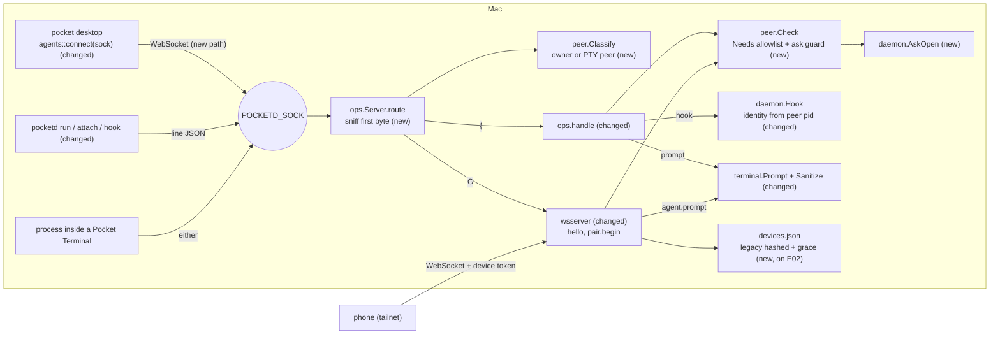

# No Self-Approval Implementation Plan

> **For Claude:** REQUIRED SUB-SKILL: Use /implement to execute this plan task-by-task.

**Goal:** A process running inside a Pocket Terminal can't approve its own permission asks, drive other Terminals, pair phones or spawn Terminals. pocketd decides who is the owner from the process on the other end of its socket, never from a token or env. The desktop talks to pocketd over that same socket and gets a "Pair phone…" dialog. Old phones keep the shared token for a 7-day grace, then lose it.

**Base:** main 5091a01 plus E02 PR1–4 (`docs/plans/2026-09-30-reach-lockdown.md`). E02 PR5 touches only `packages/app`, so no hunk here depends on it, but PR5 of this plan must ship after it (see PR5). Design: `docs/designs/2026-09-30-no-self-approval.md`.

**Toolset** (paths relative to the repo root):
- pocketd, one package: `cd packages/pocketd && env -u POCKETD_SOCK go test -race -count=1 ./internal/<pkg>`
- pocketd, full (every PR boundary): `cd packages/pocketd && env -u POCKETD_SOCK go vet ./... && env -u POCKETD_SOCK go test -race -count=1 ./...`
- Goldens: `cd packages/pocketd && env -u POCKETD_SOCK go test ./internal/proto -update`, then the protocol test.
- Protocol (TS): `pnpm --filter @pocket/protocol test`. It decodes every Go golden with `onExcessProperty: "error"`.
- desktop, one crate: `cd packages/desktop && cargo test -p agents`, `cd packages/desktop && cargo test -p pocket -- <filter>`
- desktop, full (every PR that touches it): `cd packages/desktop && cargo build --workspace && cargo clippy --workspace --all-targets && cargo test --workspace`. No new warnings. Already there, leave them: `git/src/git.rs:101`, `:602-604` and `pocket/src/inbox.rs:138`, `:150`, `:158`.
- Screens: `env -u POCKETD_SOCK .ui-review/fixture/capture.sh <dir> <name>=<steps>` writes `<dir>/impl-<name>.png` against the fixture pocketd. Without `env -u`, a run from a Pocket Terminal dials the live pocketd (`POCKETD_SOCK` wins over `POCKET_HOME`, `daemon.rs:46-49`).
- Red-team gate (PR5): `scripts/red-team.sh` from the repo root, by hand only (it runs `launchctl submit`).
- The shell is fish: quote globs. `unset` is not fish; use `env -u POCKETD_SOCK <cmd>`.
- A modified file is shown as a unified diff. Apply it by hand or save it and run `git apply`. Hunk line numbers count lines in the file as the earlier tasks left it; PR1's count from E02 PR4. Re-anchor line numbers after E02 PR4 merges. The **Files** lines cite the same numbers.

**UX override (roadmap §7.1).** Build this text, not the spec's:

| UX section | Spec says | Winning decision | Text to build |
|---|---|---|---|
| UXP §4.1 pair copy | "On your Mac, open Devices → Pair phone" | E03 PR4 (the Devices sheet is S5) | "On your Mac, press ⌘K → Pair phone" |

The phone's copy is E02 PR5's string. PR4's palette entry "Pair phone…" is what makes it true.

**Scratch pocketd rules (roadmap §7):**
- Every Pocket Terminal exports `POCKETD_SOCK`, and the desktop reads it first (`packages/desktop/crates/daemon/src/daemon.rs:43-51`).
- Tests and capture start a scratch pocketd (or the fixture) with their own `POCKET_HOME`, `POCKETD_SOCK` and port. The e2e harness already does (`packages/pocketd/e2e/harness_test.go`).
- Never start or restart the production pocketd from this plan. Run every command that starts pocketd or its tests with `env -u POCKETD_SOCK`.
- Never set `REDTEAM_RESIDUALS=1` in CI or an agent run: its `launchctl submit` probe starts a real launchd job.

**Read first:**
- `docs/designs/2026-09-30-no-self-approval.md` §5 (contract), §7 (failure modes), §9 (PR slicing). This plan builds that design.
- `docs/designs/2026-09-30-reach-lockdown.md` §5.1-5.4: the E02 contract this plan sits on (`devices`, `pairing`, `peer.PID`, `Error.Code`, `ops.Msg.ErrorCode`, `reach.Listener.PairHost`).
- `packages/pocketd/internal/ops/ops.go:79-164`: the ops socket server. `Serve` accepts, `handle` runs one line-JSON conn.
- `packages/pocketd/internal/wsserver/wsserver.go:116-205`: `hello` auth and `dispatch`, the phone protocol.
- `packages/pocketd/internal/daemon/daemon.go:90-120` and `claude.go:14-28`: `Hook` and `claudeAt`, how a hook finds its claude.
- `packages/pocketd/cmd/pocketd/hook.go:1-65`: the hook client that today sends a pid it computed itself.
- `packages/desktop/crates/agents/src/agents.rs:198-290`: the desktop's phone-protocol client (`token`, `connect`, `run`).
- `packages/pocketd/e2e/harness_test.go:19-35`, `:59-90`, `:157-213`: the e2e harness (scratch pocketd, fake claude, `StartClaude`, `Spawn`, `eventually`).
- `docs/adr/0003-desktop-code-layout.md`: where desktop code goes; one file per component.

**Assumptions** (settled; don't re-open):
- E03 adapts to E02's merged names, not the reverse. Where this plan says "E02's X", use what merged. The Go in package `devices` uses E02's unexported `mu`, `devices` and `save()`; rename to what merged.
- `peer.Scope` is an alias of E02's `devices.Scope`, so device scopes and principal scopes are one type.
- `Check(verb, asking, text)` takes the Terminal waiting on an ask as a string (`""` for none). PR2 passes `""` everywhere; PR3 swaps in the real lookup.
- `Needs` is an allowlist: a verb missing from it is refused, even for the owner.
- E03's `devices.Lookup` (hashed tokens only) replaces E02's, which also compared the plaintext legacy token. `devices.Open`'s `legacyToken` argument is passed `""`.
- Rust `expires_at` is `i64` Unix ms. `Event::PairFailed` carries the `error` message for the `pair` request id.
- Owner gating on the desktop: the palette omits owner actions, `open()` refuses them, `send_spawn` drops spawns, Terminal keys are dropped, and the blank-page and split buttons hide. Other `+` buttons stay visible but do nothing. Git actions stay (E03-17).
- The QR paints black on `WHITE` in both themes. A QR must stay dark on light to scan, so it doesn't follow the theme.
- `qrcode` 0.14 is MIT OR Apache-2.0; design §11 has no open owner question.
- CLAUDE.md: no comments unless the WHY is hidden. Keep the doc comments this plan gives; add no others.

**Deviations from the design** (each keeps the design's behaviour unless it says otherwise):
- `Classify` and `Manager.Roots` land in PR1, not PR3: PR1's router needs a principal with a Terminal ID. PR1 replaces E02 PR3's `peer.InTerminal` walk with that principal; PR2 drops E02's `pty_peer` check, since `Needs` covers the device verbs.
- WS `pair.begin`, `pair.offer` and `pair.done` land in PR2, with the goldens, not PR4. The TS `error.code` stays a plain string.
- `Device.GraceEndsAt` is Unix ms like every other `devices.json` time, not RFC 3339. Grace expiry calls a new `Store.EndGrace`, because E02's `Revoke` refuses `LegacyID`.
- The red-team is an e2e test (`packages/pocketd/e2e/redteam_test.go` plus a stage binary `e2e/redteam`), driven by `scripts/red-team.sh`, not `cmd/redteam`. The harness already builds pocketd and a fake claude and runs a scratch pocketd.
- The S-10 residual lines (reparenting, `nohup`, `launchctl`, TIOCSTI) go in the red-team's output and this plan's Remaining risks, not a PRD edit.
- `cmd/pocketd/hook_test.go` is deleted: its walk moves to `peer.Ancestors` and `daemon.NearestClaude`, and its tests move with it.
- `packages/desktop/crates/daemon` gets no `error_code` field: no desktop code reads it. The refusal message already reaches the page bar (`pocket/src/terminals.rs:103-106` → `terminal_view.rs:124`).
- The design's "a qr is encoded once per code" test becomes "qr runs cover exactly the dark modules": the QR is encoded once in `offered`, never in render, so the test checks what gets painted.
- `peer.Kind` starts at `None`, not `Owner`, and `Has` is false for `None`: a principal never set fails closed instead of reading as the owner.
- `.ui-review/fixture/fixture.ts` changes in PR1 and PR4. The desktop now dials the socket and waits for `hello.ok`, so without it `capture.sh` shows a desktop that never connects.

---

## Architecture



pocketd's unix socket now carries two protocols. The first byte picks one: `{` is the line-JSON ops protocol, `G` is a WebSocket upgrade. Before either runs, pocketd asks the kernel for the peer's pid and walks its parents. If a parent is the root of one of this pocketd's Terminals, the peer is a PTY peer and gets `observe` only. Otherwise it is the owner. Phones still connect over the tailnet and are known by their device token.

Every verb on both protocols then goes through one check. It is an allowlist of verbs, each needing a scope. For PTY peers, an open ask on the target Terminal is checked first, and prompts starting with `!` or `/` are refused. Hooks no longer trust a pid sent by the client: pocketd walks the peer's own parents to find the claude. Prompts are cleaned of control bytes before they are typed. New: `peer` scopes/`Check`/`Classify`, the sniffing router, `Sanitize`, `AskOpen`, the legacy grace, the desktop dialog and the red-team test. Changed: `ops`, `wsserver`, `daemon.Hook`, `config`, the hook CLI and the desktop's agent client.

## Why this approach

| Decision | Rejected |
|---|---|
| The desktop's WebSocket runs over the existing `POCKETD_SOCK`, split by its first byte (E03-1) | A second `ws.sock`: one more path to mirror in env, scratch setups and chmod. Moving agents into ops: rewrites `d/agents` and the phone schema twice |
| The owner is decided by the peer (`LOCAL_PEERPID` + parent walk), never by a token or env (E03-2) | A desktop-only token: any same-user reader takes it. `POCKETD_PTY` in env: `env -u` strips it |
| A PTY peer descends from a live Terminal root of *this* pocketd (E03-3) | "Has `POCKETD_PTY`": breaks the scratch dev loop (D20). Any pocketd's Terminals: a scratch desktop would be observe-only |
| PTY peers get `observe` plus hooks for their own Terminal; attach, screen and resize are owner-only (E03-4) | Read-only attach for PTY peers: R18 R9 says never read other Terminals |
| Hook identity comes from the peer pid on the server; the client-sent pid is dropped (E03-5) | Verifying the client's pid: forgeable. Signing hooks with a per-Terminal secret: the same agent can read it |
| For PTY peers the ask guard runs before scope and answers `ask_open` (E03-6) | Scope only: the red-team can't tell the rule from a missing scope, and later grants (E15) would reopen the hole |
| `Sanitize` lives in `Terminal.Prompt`; the `!`/`/` refusal sits in `Check`, for PTY peers only (E03-7) | Sanitizing at each caller misses the deny-feedback path. Refusing `/` for everyone breaks `/compact` |
| Unknown verbs are refused (E03-8) | Defaulting to `observe`: a new verb would ship open by accident |
| ops gets a new `errorCode` field (E03-9) | Reusing `code`: it is already the exit code |
| `hello.token` becomes optional: the socket ignores it, TCP needs it (`not_paired`) (E03-10) | A separate `hello.local` type: a second hello path and golden set |
| `pair.done` goes only to the conn that began pairing, so the dialog closes (E03-11) | Polling a devices verb; closing only on expiry (fails FR 03-7) |
| The desktop draws the QR itself from `url` with the `qrcode` crate (E03-12) | pocketd sending a module matrix: extends E02's contract and ties it to E02's Go QR library |
| The grace starts at the first `serve` of a PR5 build; expiry deletes the legacy device (E03-14) | A manual `pocketd devices grace` verb; checking only at hello (live sockets would outlive the grace) |
| TIOCSTI and reparenting are recorded residuals, not fixed (E03-15) | Spawning agents without a controlling tty breaks every TUI; the injected bytes never pass the master |
| The red-team is an e2e test against a scratch pocketd with the fake claude (E03-16, adapted) | A standalone `cmd/redteam` with its own harness: the e2e harness already builds, isolates and tears down a scratch pocketd. The owner's pocketd: a regression could resolve a real ask |
| Observe-only disables pocketd owner verbs only; git actions stay (E03-17) | Disabling the whole UI: git is local and not pocketd's to gate |

## Tasks at a glance

**PR 1: Owner channel.** The socket carries the desktop's WebSocket; pocketd tells the owner from a PTY peer; the config token moves into `devices.json`.

| Task | What | Main files | Risk |
|---|---|---|---|
| 1.1 | Principal, scopes, and who is a PTY peer | `pd/internal/peer/{scope,classify}.go`, `pd/internal/terminal/terminal.go` | Low |
| 1.2 | The shared token moves, hashed, into `devices.json` | `pd/internal/devices/legacy.go`, `pd/internal/config/config.go`, `pd/cmd/pocketd/serve.go` | Medium: rewrites the owner's config on first run |
| 1.3 | `hello` without a token; `hello.ok.scopes` | `pd/internal/proto/messages.go`, `protocol/src/messages.ts`, goldens | Low |
| 1.4 | One socket, two protocols | `pd/internal/ops/{sniff,ops,devices}.go` | Medium: every ops conn now goes through the router |
| 1.5 | WebSocket hello knows the owner | `pd/internal/wsserver/wsserver.go`, `pd/cmd/pocketd/serve.go` | Medium: every hello |
| 1.6 | The desktop dials the socket | `d/agents/src/agents.rs`, `pk/main.rs`, `pk/desktop/alerts.rs`, `.ui-review/fixture/fixture.ts` | Medium: needs a pocketd with PR1 |

**PR 2: Scope enforcement.** Every WebSocket and ops verb is checked; refusals carry a code; the owner can begin pairing over the WebSocket.

| Task | What | Main files | Risk |
|---|---|---|---|
| 2.1 | Refusal codes and the verb allowlist | `pd/internal/peer/check.go`, `pd/internal/proto/codes.go` | Low |
| 2.2 | WebSocket verbs are checked | `pd/internal/wsserver/wsserver.go` | Medium: a missing `Needs` row locks a verb |
| 2.3 | ops verbs are checked | `pd/internal/ops/{ops,devices,pair}.go` | Medium: same |
| 2.4 | `pair.begin`, `pair.offer` and `pair.done` on the wire | `pd/internal/proto/messages.go`, `protocol/src/messages.ts`, goldens | Low |
| 2.5 | `pair.begin` over the owner's WebSocket | `pd/internal/wsserver/{pair,wsserver}.go`, `pd/cmd/pocketd/serve.go` | Low |

**PR 3: PTY-peer rules.** Clean prompts, no typing into an open ask, hooks checked by pocketd.

| Task | What | Main files | Risk |
|---|---|---|---|
| 3.1 | Prompts are cleaned and capped | `pd/internal/terminal/sanitize.go`, `ops.go`, `wsserver.go` | Low |
| 3.2 | No input into a Terminal with an open ask | `pd/internal/daemon/claude.go`, `ops.go`, `wsserver.go` | Low |
| 3.3 | pocketd finds the hook's claude itself | `pd/internal/daemon/{daemon,claude}.go`, `pd/internal/peer/classify.go`, `pd/cmd/pocketd/hook.go` | Medium: a wrong walk drops real hooks |

**PR 4: Desktop owner UI.** The Pair phone dialog with a QR code, and an observe-only mode.

| Task | What | Main files | Risk |
|---|---|---|---|
| 4.1 | Pairing events from pocketd | `d/agents/src/agents.rs` | Low |
| 4.2 | Pair phone dialog | `pk/modals/pair_phone.rs`, `pk/modals.rs`, `pk/desktop.rs` | Low |
| 4.3 | "Pair phone…" in the palette | `pk/palette.rs` | Low |
| 4.4 | Observe-only desktop | `pk/desktop/chrome.rs`, `pk/terminal_view.rs`, `pk/terminals.rs`, `pk/git_ui/diff.rs` | Low |

**PR 5: Red-team gate and legacy grace.** Proves the rules from inside a Terminal; retires the shared token after 7 days.

| Task | What | Main files | Risk |
|---|---|---|---|
| 5.1 | Red-team e2e test and script | `pd/e2e/redteam_test.go`, `pd/e2e/redteam/main.go`, `scripts/red-team.sh` | Low |
| 5.2 | The legacy device's grace | `pd/internal/devices/grace.go` | Low |
| 5.3 | Grace timer and `pocketd devices` note | `pd/cmd/pocketd/serve.go`, `pd/cmd/pocketd/devices.go` | Medium: deletes the legacy device on time |

`pd` = `packages/pocketd`, `d` = `packages/desktop/crates`, `pk` = `packages/desktop/crates/pocket/src`.

---

## PR 1: Owner channel

**Scope:** pocketd's unix socket carries the desktop's WebSocket as well as line JSON, told apart by the first byte. pocketd works out who each socket peer is: a process inside one of its Terminals is a PTY peer, anyone else is the owner. hello over the socket needs no token, and `hello.ok` lists the conn's scopes under the new `scopes.v1` cap. The shared `config.json` token moves, hashed, into `devices.json` as the legacy device. The desktop dials the socket instead of TCP. Nothing is refused yet except E02's owner verbs, which now use the new principal.
**Depends on:** E02 PR4 (its `devices`, `pairing`, `peer.PID` and ops `pair.begin`). Re-anchor line numbers after E02 PR4 merges.
**Done when:** the pocketd full line is green, the protocol test shows `ℹ pass 36` and `ℹ fail 0`, and the desktop full line is green. A capture of the `session` screen matches one taken before this PR.

### Task 1.1: Principal, scopes, and who is a PTY peer

**What & why:** Every later check needs to know who is on the other end of a conn and what it may do. This task adds `peer.Principal` (owner, paired device or PTY peer, with its scopes) and `Classify`, which walks a pid's ancestors to the nearest Terminal root of this pocketd. It also adds `Manager.Roots` so `Classify` has those roots.

**Files:**
- Create: `packages/pocketd/internal/peer/scope.go`, `packages/pocketd/internal/peer/classify.go`
- Modify: `packages/pocketd/internal/terminal/terminal.go:177-182`
- Test: `packages/pocketd/internal/peer/scope_test.go` (create), `packages/pocketd/internal/peer/classify_test.go` (create), `packages/pocketd/internal/terminal/terminal_test.go:154-156`

**Context:**
- `Scope` is an alias of E02's `devices.Scope`, so a device's stored scopes and a principal's scopes are one type.
- `Classify` counts the pid itself, so a Terminal's root shell is a PTY peer of its own Terminal.
- Only this pocketd's roots count (`roots` comes from its own `Manager`). A scratch pocketd started inside a Pocket Terminal still has an owner, so the dev loop (D20) keeps working.
- A walk that breaks off (a process on the way exits) fails closed: a PTY peer of no Terminal.
- `With` and `From` carry the principal in a `context.Context`. Task 1.4 puts it there for the WebSocket conns.

**Step 1: Write the failing tests**

The tests prove the principal survives a context, a phone gets its device scopes, a principal of no kind has no scope, the nearest root wins, a process outside every Terminal is the owner, a dead pid gets observe only, and `Roots` maps pids to IDs.

Create `packages/pocketd/internal/peer/scope_test.go`:

```go
package peer

import (
	"context"
	"slices"
	"testing"

	"pocketd/internal/devices"
)

func TestAPrincipalRidesTheContext(t *testing.T) {
	if _, ok := From(context.Background()); ok {
		t.Fatal("a bare context has a principal")
	}
	p, ok := From(With(context.Background(), OwnerOf(7)))
	if !ok || p.Kind != Owner || p.Pid != 7 || !p.Has(Own) {
		t.Fatalf("%+v %v", p, ok)
	}
}

func TestAPairedPhoneHasItsDeviceScopes(t *testing.T) {
	p := FromDevice(devices.Device{ID: "d1", Scopes: devices.PhoneScopes})
	if p.Kind != Device || p.Device != "d1" || p.Has(Own) || !slices.Equal(p.Names(), []string{"observe", "drive", "approve", "spawn"}) {
		t.Fatalf("%+v", p)
	}
}

func TestAPrincipalOfNoKindHasNoScope(t *testing.T) {
	if p := (Principal{Scopes: OwnerScopes}); p.Kind != None || p.Has(Observe) {
		t.Fatalf("%+v", p)
	}
}
```

Create `packages/pocketd/internal/peer/classify_test.go`:

```go
package peer

import (
	"os"
	"os/exec"
	"testing"
)

func TestAChildOfATerminalRootIsThatTerminalsPtyPeer(t *testing.T) {
	p := Classify(os.Getpid(), map[int]string{os.Getppid(): "t1"})
	if p.Kind != PTY || p.Terminal != "t1" || p.Pid != os.Getpid() || p.Has(Drive) {
		t.Fatalf("%+v", p)
	}
}

func TestANearerTerminalRootWins(t *testing.T) {
	p := Classify(os.Getpid(), map[int]string{os.Getppid(): "outer", os.Getpid(): "inner"})
	if p.Terminal != "inner" {
		t.Fatalf("%+v", p)
	}
}

func TestAProcessOutsideEveryTerminalIsTheOwner(t *testing.T) {
	child := exec.Command("sleep", "5")
	if err := child.Start(); err != nil {
		t.Fatal(err)
	}
	t.Cleanup(func() { child.Process.Kill(); child.Wait() })
	p := Classify(os.Getpid(), map[int]string{child.Process.Pid: "t1"})
	if p.Kind != Owner || !p.Has(Own) {
		t.Fatalf("%+v", p)
	}
}

func TestADeadPidGetsObserveOnly(t *testing.T) {
	gone := exec.Command("true")
	if err := gone.Run(); err != nil {
		t.Fatal(err)
	}
	p := Classify(gone.Process.Pid, map[int]string{})
	if p.Kind != PTY || p.Terminal != "" || p.Has(Drive) {
		t.Fatalf("%+v", p)
	}
}
```

```diff
--- a/packages/pocketd/internal/terminal/terminal_test.go
+++ b/packages/pocketd/internal/terminal/terminal_test.go
@@ -154,3 +154,11 @@
 		t.Fatalf("All after exit = %v", all)
 	}
 }
+
+func TestRootsMapEachTerminalPidToItsID(t *testing.T) {
+	m := NewManager()
+	s := spawn(t, m, "sleep 5")
+	if got := m.Roots(); len(got) != 1 || got[s.Pid()] != s.Info().ID {
+		t.Fatalf("roots = %v", got)
+	}
+}
```

**Step 2: Run the tests to verify they fail**

Run: `cd packages/pocketd && env -u POCKETD_SOCK go test -race -count=1 ./internal/peer ./internal/terminal`
Expected: FAIL with build errors such as `undefined: Classify`, `undefined: PTY`, `undefined: None` and `m.Roots undefined (type *Manager has no field or method Roots)`.

**Step 3: Write the implementation**

Create `packages/pocketd/internal/peer/scope.go`:

```go
package peer

import (
	"context"
	"slices"

	"pocketd/internal/devices"
)

type Scope = devices.Scope

const (
	Observe Scope = "observe"
	Drive   Scope = "drive"
	Approve Scope = "approve"
	Spawn   Scope = "spawn"
	Own     Scope = "owner"
)

// Kind's zero value, None, has no scope, so a conn whose principal was never
// set fails closed.
type Kind uint8

const (
	None Kind = iota
	Owner
	Device
	PTY
)

var (
	OwnerScopes = []Scope{Observe, Drive, Approve, Spawn, Own}
	PTYScopes   = []Scope{Observe}
)

// Principal is who sits on the other end of a conn. Terminal is set for a
// PTY peer, Device for a paired phone.
type Principal struct {
	Kind     Kind
	Pid      int
	Terminal string
	Device   string
	Scopes   []Scope
}

func OwnerOf(pid int) Principal { return Principal{Kind: Owner, Pid: pid, Scopes: OwnerScopes} }

func FromDevice(d devices.Device) Principal {
	return Principal{Kind: Device, Device: d.ID, Scopes: d.Scopes}
}

func (p Principal) Has(s Scope) bool { return p.Kind != None && slices.Contains(p.Scopes, s) }

func (p Principal) Names() []string {
	names := make([]string, len(p.Scopes))
	for i, s := range p.Scopes {
		names[i] = string(s)
	}
	return names
}

type key struct{}

func With(ctx context.Context, p Principal) context.Context { return context.WithValue(ctx, key{}, p) }

func From(ctx context.Context) (Principal, bool) {
	p, ok := ctx.Value(key{}).(Principal)
	return p, ok
}
```

Create `packages/pocketd/internal/peer/classify.go`:

```go
package peer

import "pocketd/internal/proc"

// Classify makes pid a PTY peer of the nearest Terminal root among its
// ancestors (itself included), else the owner. roots maps a live Terminal's
// root pid to its ID, for this pocketd only, so a scratch pocketd started
// inside a Pocket Terminal still has an owner. A walk that breaks off, as when
// a process on the way exits, fails closed to a PTY peer of no Terminal.
func Classify(pid int, roots map[int]string) Principal {
	for p := pid; p > 1; {
		if id, ok := roots[p]; ok {
			return Principal{Kind: PTY, Pid: pid, Terminal: id, Scopes: PTYScopes}
		}
		next, err := proc.Parent(p)
		if err != nil || next == p {
			return Principal{Kind: PTY, Pid: pid, Scopes: PTYScopes}
		}
		p = next
	}
	return OwnerOf(pid)
}
```

```diff
--- a/packages/pocketd/internal/terminal/terminal.go
+++ b/packages/pocketd/internal/terminal/terminal.go
@@ -177,6 +177,17 @@
 	return slices.Collect(maps.Values(m.terminals))
 }
 
+// Roots maps each live Terminal's root pid to its ID.
+func (m *Manager) Roots() map[int]string {
+	m.mu.Lock()
+	defer m.mu.Unlock()
+	roots := make(map[int]string, len(m.terminals))
+	for id, s := range m.terminals {
+		roots[s.Pid()] = id
+	}
+	return roots
+}
+
 // replyToQuery runs under s.mu (inside vt.Write). A real terminal attached
 // through `pocketd run` answers queries itself; answering twice corrupts input.
 func (s *Terminal) replyToQuery(b []byte) {
```

**Step 4: Run the tests to verify they pass**

Run: `cd packages/pocketd && env -u POCKETD_SOCK go test -race -count=1 ./internal/peer ./internal/terminal`
Expected: PASS (`ok  	pocketd/internal/peer`, `ok  	pocketd/internal/terminal`)

### Task 1.2: The shared token moves, hashed, into `devices.json`

**What & why:** The shared `config.json` token is readable by any process of the same user, so it can't stay the key to pocketd. On first run this build moves it, hashed, into `devices.json` as the legacy device, and deletes it from `config.json`. Old phones keep working until PR5's grace ends. `Lookup` now only compares hashes.

**Files:**
- Create: `packages/pocketd/internal/devices/legacy.go`
- Modify: `packages/pocketd/internal/devices/devices.go:5-11`, `:31-37`, `:62-83`, `:90-96`, `:140-174`, `:180-189`, `:195-208`, `:214-222`, `packages/pocketd/internal/config/config.go:2-9`, `:30-44`, `:48-67`, `packages/pocketd/cmd/pocketd/serve.go:23-29`, `:44-53`
- Test: `packages/pocketd/internal/devices/devices_test.go:90-96`, `:134-151`, `packages/pocketd/internal/devices/legacy_test.go` (create), `packages/pocketd/internal/config/config_test.go:3-52`

**Context:**
- `config.Load` takes an `adopt` func. When the file still has a `token`, `Load` hands it to `adopt` and rewrites the file without it, keeping every other field (the TypeScript daemon left `profiles`).
- `serve` opens `devices.json` before loading the config, so it can pass `devs.EnsureLegacy` as `adopt`. `devices.Open`'s `legacyToken` argument is passed `""`.
- `EnsureLegacy` inserts the legacy device first in the list and is a no-op once it exists, so a second run doesn't duplicate it.
- A fresh install no longer gets a token at all: `create` writes only the port and `listen`.
- If `adopt` fails, `Load` fails and the token stays in `config.json`, so nothing is lost.

**Step 1: Write the failing tests**

The tests prove the legacy token is stored hashed, once, and listed first, and that a config with a token moves it into devices and forgets it, keeping the other fields.

```diff
--- a/packages/pocketd/internal/devices/devices_test.go
+++ b/packages/pocketd/internal/devices/devices_test.go
@@ -90,7 +90,7 @@
 
 func TestResolveTakesAUniquePrefix(t *testing.T) {
 	s, _ := open(t)
-	s.devices = []Device{{ID: "3fa9c1d2aa"}, {ID: "3fb0000000"}}
+	s.devices = append(s.devices, Device{ID: "3fa9c1d2aa"}, Device{ID: "3fb0000000"})
 	for prefix, want := range map[string]string{"3fa": "3fa9c1d2aa", "3fb0000000": "3fb0000000", "legacy": LegacyID} {
 		if got, err := s.Resolve(prefix); err != nil || got != want {
 			t.Errorf("%q: %q %v", prefix, got, err)
@@ -134,18 +134,18 @@
 	t0 := time.UnixMilli(1_000_000_000_000)
 	s.Seen(d.ID, "100.77.122.90", t0)
 	s.Seen(d.ID, "100.77.122.90", t0.Add(30*time.Second))
-	if got := saved(0); got != t0.UnixMilli() {
+	if got := saved(1); got != t0.UnixMilli() {
 		t.Fatalf("saved %d", got)
 	}
 	if got := s.List()[1].LastSeenAt; got != t0.Add(30*time.Second).UnixMilli() {
 		t.Fatalf("in memory %d", got)
 	}
 	s.Seen(e.ID, "100.77.122.91", t0.Add(40*time.Second))
-	if got := saved(1); got != t0.Add(40*time.Second).UnixMilli() {
+	if got := saved(2); got != t0.Add(40*time.Second).UnixMilli() {
 		t.Fatalf("second device saved %d", got)
 	}
 	s.Seen(d.ID, "100.77.122.90", t0.Add(61*time.Second))
-	if got := saved(0); got != t0.Add(61*time.Second).UnixMilli() {
+	if got := saved(1); got != t0.Add(61*time.Second).UnixMilli() {
 		t.Fatalf("saved %d", got)
 	}
 	s.Seen(LegacyID, "127.0.0.1", t0)
```

Create `packages/pocketd/internal/devices/legacy_test.go`:

```go
package devices

import (
	"os"
	"path/filepath"
	"strings"
	"testing"
)

func TestTheLegacyTokenIsStoredHashedOnceAndListedFirst(t *testing.T) {
	path := filepath.Join(t.TempDir(), "devices.json")
	s, err := Open(path, "")
	if err != nil {
		t.Fatal(err)
	}
	s.Add("iPhone", "ios", PhoneScopes)
	for range 2 {
		if err := s.EnsureLegacy("old-token"); err != nil {
			t.Fatal(err)
		}
	}
	raw, _ := os.ReadFile(path)
	if strings.Contains(string(raw), "old-token") || strings.Count(string(raw), `"id": "legacy"`) != 1 {
		t.Fatalf("devices.json = %s", raw)
	}
	again, _ := Open(path, "")
	d, ok := again.Lookup("old-token")
	if !ok || d.ID != LegacyID || !d.Legacy || len(d.Scopes) != len(LegacyScopes) {
		t.Fatalf("lookup = %+v %v", d, ok)
	}
	if list := again.List(); len(list) != 2 || list[0].ID != LegacyID {
		t.Fatalf("%+v", list)
	}
	if _, ok := again.Lookup(""); ok {
		t.Fatal("an empty token found a device")
	}
}
```

```diff
--- a/packages/pocketd/internal/config/config_test.go
+++ b/packages/pocketd/internal/config/config_test.go
@@ -3,50 +3,69 @@
 import (
 	"os"
 	"path/filepath"
+	"strings"
 	"testing"
 )
 
+func refuse(string) error {
+	panic("a config without a token has nothing to adopt")
+}
+
 func TestLoadCreatesPrivateConfigOnce(t *testing.T) {
 	t.Setenv("POCKET_HOME", t.TempDir())
-	first, err := Load()
-	if err != nil || first.Port != 4517 || len(first.Token) != 32 || first.Listen != "auto" {
+	first, err := Load(refuse)
+	if err != nil || first.Port != 4517 || first.Listen != "auto" {
 		t.Fatalf("%+v %v", first, err)
 	}
 	st, _ := os.Stat(filepath.Join(Home(), "config.json"))
 	if st.Mode().Perm() != 0o600 {
 		t.Fatalf("mode %v", st.Mode())
 	}
-	again, _ := Load()
+	again, _ := Load(refuse)
 	if again != first {
-		t.Fatal("token changed on second load")
+		t.Fatal("config changed on second load")
 	}
 }
 
-func TestLoadKeepsOldConfigWorking(t *testing.T) {
+func TestAConfigWithATokenMovesItIntoDevicesAndForgetsIt(t *testing.T) {
 	t.Setenv("POCKET_HOME", t.TempDir())
-	os.WriteFile(filepath.Join(Home(), "config.json"), []byte(`{"token":"t","port":1,"profiles":[]}`), 0o600)
-	c, err := Load()
-	if err != nil || c.Token != "t" || c.Port != 1 || c.Listen != "auto" {
-		t.Fatalf("%+v %v", c, err)
+	path := filepath.Join(Home(), "config.json")
+	os.WriteFile(path, []byte(`{"token":"t","port":1,"profiles":[]}`), 0o600)
+	var adopted []string
+	adopt := func(tok string) error { adopted = append(adopted, tok); return nil }
+	c, err := Load(adopt)
+	if err != nil || c.Port != 1 || c.Listen != "auto" || len(adopted) != 1 || adopted[0] != "t" {
+		t.Fatalf("%+v %v %v", c, err, adopted)
+	}
+	raw, _ := os.ReadFile(path)
+	if strings.Contains(string(raw), "token") || !strings.Contains(string(raw), "profiles") {
+		t.Fatalf("config.json = %s", raw)
+	}
+	if st, _ := os.Stat(path); st.Mode().Perm() != 0o600 {
+		t.Fatalf("mode %v", st.Mode())
+	}
+	if _, err := Load(adopt); err != nil || len(adopted) != 1 {
+		t.Fatalf("second load adopted again: %v %v", adopted, err)
 	}
 }
 
 func TestLoadRejectsBrokenConfig(t *testing.T) {
 	t.Setenv("POCKET_HOME", t.TempDir())
-	os.WriteFile(filepath.Join(Home(), "config.json"), []byte(`{"port":1}`), 0o600)
-	if _, err := Load(); err == nil {
+	os.WriteFile(filepath.Join(Home(), "config.json"), []byte(`{"token":"t"}`), 0o600)
+	if _, err := Load(refuse); err == nil {
 		t.Fatal("want error")
 	}
 }
 
 func TestLoadRejectsAnUnknownListenMode(t *testing.T) {
 	t.Setenv("POCKET_HOME", t.TempDir())
-	os.WriteFile(filepath.Join(Home(), "config.json"), []byte(`{"token":"t","port":1,"listen":"0.0.0.0"}`), 0o600)
-	if _, err := Load(); err == nil {
+	keep := func(string) error { return nil }
+	os.WriteFile(filepath.Join(Home(), "config.json"), []byte(`{"port":1,"listen":"0.0.0.0"}`), 0o600)
+	if _, err := Load(keep); err == nil {
 		t.Fatal("want error")
 	}
-	os.WriteFile(filepath.Join(Home(), "config.json"), []byte(`{"token":"t","port":1,"listen":"loopback"}`), 0o600)
-	if c, err := Load(); err != nil || c.Listen != "loopback" {
+	os.WriteFile(filepath.Join(Home(), "config.json"), []byte(`{"port":1,"listen":"loopback"}`), 0o600)
+	if c, err := Load(keep); err != nil || c.Listen != "loopback" {
 		t.Fatalf("%+v %v", c, err)
 	}
 }
```

**Step 2: Run the tests to verify they fail**

Run: `cd packages/pocketd && env -u POCKETD_SOCK go test -race -count=1 ./internal/devices ./internal/config`
Expected: FAIL with build errors such as `s.EnsureLegacy undefined (type *Store has no field or method EnsureLegacy)` and `too many arguments in call to Load`.

**Step 3: Write the implementation**

```diff
--- a/packages/pocketd/internal/devices/devices.go
+++ b/packages/pocketd/internal/devices/devices.go
@@ -5,7 +5,6 @@
 import (
 	"crypto/rand"
 	"crypto/sha256"
-	"crypto/subtle"
 	"encoding/base64"
 	"encoding/hex"
 	"encoding/json"
@@ -31,7 +30,6 @@
 
 const (
 	LegacyID    = "legacy"
-	tokenLen    = 43
 	maxName     = 64
 	defaultName = "iPhone"
 	saveSeenGap = time.Minute
@@ -62,22 +60,20 @@
 }
 
 type Store struct {
-	path   string
-	legacy string
+	path string
 
-	mu         sync.Mutex
-	devices    []Device
-	legacySeen Device
-	savedAt    map[string]time.Time
+	mu      sync.Mutex
+	devices []Device
+	savedAt map[string]time.Time
 }
 
-// Open reads path, or starts empty if it doesn't exist. legacyToken is the
-// shared config.json token; it logs in as a synthesized, never stored device.
+// Open reads path, or starts empty if it doesn't exist. A non-empty
+// legacyToken is stored, hashed, as the legacy device.
 func Open(path, legacyToken string) (*Store, error) {
-	s := &Store{path: path, legacy: legacyToken, savedAt: map[string]time.Time{}}
+	s := &Store{path: path, savedAt: map[string]time.Time{}}
 	raw, err := os.ReadFile(path)
 	if errors.Is(err, fs.ErrNotExist) {
-		return s, nil
+		return s, s.EnsureLegacy(legacyToken)
 	}
 	if err != nil {
 		return nil, err
@@ -90,7 +86,7 @@
 		return nil, fmt.Errorf("unknown version %d", f.Version)
 	}
 	s.devices = f.Devices
-	return s, nil
+	return s, s.EnsureLegacy(legacyToken)
 }
 
 func NewToken() string {
@@ -140,35 +136,21 @@
 }
 
 func (s *Store) Lookup(token string) (Device, bool) {
+	sum := hash(token)
 	s.mu.Lock()
 	defer s.mu.Unlock()
-	if len(token) == tokenLen {
-		sum := hash(token)
-		for _, d := range s.devices {
-			if d.TokenHash == sum {
-				d.TokenHash = ""
-				return d, true
-			}
+	for _, d := range s.devices {
+		if d.TokenHash == sum {
+			d.TokenHash = ""
+			return d, true
 		}
 	}
-	if s.legacy != "" && subtle.ConstantTimeCompare([]byte(token), []byte(s.legacy)) == 1 {
-		return s.legacyDevice(), true
-	}
 	return Device{}, false
 }
 
-func (s *Store) legacyDevice() Device {
-	d := s.legacySeen
-	d.ID, d.Name, d.Scopes, d.Legacy = LegacyID, "Shared token (legacy)", LegacyScopes, true
-	return d
-}
-
 func (s *Store) Has(id string) bool {
 	s.mu.Lock()
 	defer s.mu.Unlock()
-	if id == LegacyID {
-		return s.legacy != ""
-	}
 	return s.index(id) >= 0
 }
 
@@ -180,10 +162,6 @@
 func (s *Store) Seen(id, addr string, now time.Time) {
 	s.mu.Lock()
 	defer s.mu.Unlock()
-	if id == LegacyID {
-		s.legacySeen.LastSeenAt, s.legacySeen.LastAddr = now.UnixMilli(), addr
-		return
-	}
 	n := s.index(id)
 	if n < 0 {
 		return
@@ -195,14 +173,11 @@
 	}
 }
 
-// List returns the shared-token device first, then paired devices oldest first, without token hashes.
+// List returns paired devices oldest first, the legacy device first, without token hashes.
 func (s *Store) List() []Device {
 	s.mu.Lock()
 	defer s.mu.Unlock()
 	out := []Device{}
-	if s.legacy != "" {
-		out = append(out, s.legacyDevice())
-	}
 	for _, d := range s.devices {
 		d.TokenHash = ""
 		out = append(out, d)
@@ -214,9 +189,6 @@
 func (s *Store) Resolve(prefix string) (string, error) {
 	s.mu.Lock()
 	defer s.mu.Unlock()
-	if prefix == LegacyID && s.legacy != "" {
-		return LegacyID, nil
-	}
 	var found []string
 	for _, d := range s.devices {
 		if prefix != "" && strings.HasPrefix(d.ID, prefix) {
```

Create `packages/pocketd/internal/devices/legacy.go`:

```go
package devices

import (
	"slices"
	"time"
)

// EnsureLegacy stores the shared token of old phones as the legacy device,
// hashed like every other token, first in the list. A second call is a no-op.
func (s *Store) EnsureLegacy(token string) error {
	if token == "" {
		return nil
	}
	s.mu.Lock()
	defer s.mu.Unlock()
	if s.index(LegacyID) >= 0 {
		return nil
	}
	s.devices = slices.Insert(s.devices, 0, Device{
		ID: LegacyID, Name: "Shared token (legacy)", Scopes: LegacyScopes,
		TokenHash: hash(token), CreatedAt: time.Now().UnixMilli(), Legacy: true,
	})
	return s.save()
}
```

```diff
--- a/packages/pocketd/internal/config/config.go
+++ b/packages/pocketd/internal/config/config.go
@@ -2,8 +2,6 @@
 
 import (
 	"cmp"
-	"crypto/rand"
-	"encoding/base64"
 	"encoding/json"
 	"errors"
 	"fmt"
@@ -30,15 +28,15 @@
 }
 
 type Config struct {
-	Token string `json:"token"`
-	Port  int    `json:"port"`
+	Port int `json:"port"`
 	// Listen is "auto" (loopback and the tailnet) or "loopback".
 	Listen string `json:"listen,omitempty"`
 }
 
-// Load reads config.json, creating it with a fresh token on first run. Fields
-// left by the TypeScript daemon (profiles) are ignored.
-func Load() (Config, error) {
+// Load reads config.json, creating it on first run. A token left there by an
+// older pocketd goes to adopt, then leaves the file. Fields left by the
+// TypeScript daemon (profiles) are kept but ignored.
+func Load(adopt func(token string) error) (Config, error) {
 	path := filepath.Join(Home(), "config.json")
 	raw, err := os.ReadFile(path)
 	if errors.Is(err, fs.ErrNotExist) {
@@ -48,20 +46,29 @@
 		return Config{}, err
 	}
 	var c Config
-	if err := json.Unmarshal(raw, &c); err != nil || c.Token == "" || c.Port == 0 {
-		return Config{}, fmt.Errorf("invalid config %s: need token and port", path)
+	if err := json.Unmarshal(raw, &c); err != nil || c.Port == 0 {
+		return Config{}, fmt.Errorf("invalid config %s: need port", path)
 	}
 	c.Listen = cmp.Or(c.Listen, "auto")
 	if c.Listen != "auto" && c.Listen != "loopback" {
 		return Config{}, fmt.Errorf("invalid config %s: listen must be auto or loopback", path)
 	}
-	return c, nil
+	var fields map[string]json.RawMessage
+	json.Unmarshal(raw, &fields)
+	var token string
+	if json.Unmarshal(fields["token"], &token) != nil || token == "" {
+		return c, nil
+	}
+	if err := adopt(token); err != nil {
+		return Config{}, err
+	}
+	delete(fields, "token")
+	out, _ := json.MarshalIndent(fields, "", "  ")
+	return c, atomicfile.Write(path, append(out, '\n'), 0o600)
 }
 
 func create(path string) (Config, error) {
-	b := make([]byte, 24)
-	rand.Read(b)
-	c := Config{Token: base64.RawURLEncoding.EncodeToString(b), Port: 4517, Listen: "auto"}
+	c := Config{Port: 4517, Listen: "auto"}
 	raw, _ := json.MarshalIndent(c, "", "  ")
 	if err := os.MkdirAll(filepath.Dir(path), 0o700); err != nil {
 		return Config{}, err
```

```diff
--- a/packages/pocketd/cmd/pocketd/serve.go
+++ b/packages/pocketd/cmd/pocketd/serve.go
@@ -23,7 +23,11 @@
 )
 
 func serve(sock string) error {
-	cfg, err := config.Load()
+	devs, err := devices.Open(filepath.Join(config.Home(), "devices.json"), "")
+	if err != nil {
+		return fmt.Errorf("devices.json unreadable: %v. Move it away to reset pairing.", err)
+	}
+	cfg, err := config.Load(devs.EnsureLegacy)
 	if err != nil {
 		return err
 	}
@@ -44,10 +48,6 @@
 		return err
 	}
 	d.Terminals.OnInput = d.Input
-	devs, err := devices.Open(filepath.Join(config.Home(), "devices.json"), cfg.Token)
-	if err != nil {
-		return fmt.Errorf("devices.json unreadable: %v. Move it away to reset pairing.", err)
-	}
 	host, _ := os.Hostname()
 	pairs := pairing.New(time.Now)
 	ws := &wsserver.Server{Devices: devs, Pairing: pairs, Hostname: host, Agents: d.Agents, Broker: d.Broker, Hub: h}
```

**Step 4: Run the tests to verify they pass**

Run: `cd packages/pocketd && env -u POCKETD_SOCK go test -race -count=1 ./internal/devices ./internal/config`
Expected: PASS (`ok  	pocketd/internal/devices`, `ok  	pocketd/internal/config`)

### Task 1.3: `hello` without a token; `hello.ok.scopes`

**What & why:** The desktop's hello over the socket has no token to send, and the desktop needs to know if it is the owner. `hello.token` becomes optional on the wire, and `hello.ok` gains `scopes` under a new `scopes.v1` cap. Go and TS change together, pinned by goldens.

**Files:**
- Create: `packages/pocketd/internal/proto/testdata/golden/server/hello_ok_scopes.json` (written by `-update`)
- Modify: `packages/pocketd/internal/proto/messages.go:84-90`, `:119-129`, `packages/pocketd/internal/proto/version.go:7-14`, `packages/protocol/src/messages.ts:2-13`, `:55-60`
- Test: `packages/pocketd/internal/proto/golden_test.go:57-62`, `:142-147`, `packages/pocketd/internal/proto/testdata/golden/client/hello_no_token.json` (create)

**Context:**
- The token is optional in the schema only. Task 1.5 still answers a tokenless hello over TCP with `not_paired`.
- `scopes` is `omitempty` and sent only to a client that offers `scopes.v1`, so old phones see the same `hello.ok` as before.
- `ServerCaps` becomes `pair.v1` and `scopes.v1`.
- Server goldens are written by `-update`; the blocks below show what it writes.

**Step 1: Write the failing tests**

The tests prove a tokenless hello decodes and `hello.ok` with scopes encodes to the golden bytes.

```diff
--- a/packages/pocketd/internal/proto/golden_test.go
+++ b/packages/pocketd/internal/proto/golden_test.go
@@ -57,6 +57,11 @@
 	"error":               NewError("p1", "Unknown agent: zz"),
 	"error_coded":         NewErrorCode("h1", "client_too_old", "Update Pocket on this phone"),
 	"pair_ok":             NewPairOK("p1", "3fa9c1d2e5f60718293a4b5c6d7e8f90", "dG9rZW4tdG9rZW4tdG9rZW4tdG9rZW4tdG9rZW4tdG9"),
+	"hello_ok_scopes": func() HelloOK {
+		h := NewHelloOK("h1", "mac", 3, []string{"pair.v1", "scopes.v1"})
+		h.Scopes = []string{"observe", "drive", "approve", "spawn", "owner"}
+		return h
+	}(),
 }
 
 // TestServerGolden pins the exact JSON the phone decodes.
@@ -142,6 +147,7 @@
 		`{"type":"agent.view","id":"1","agentIds":[]}`,
 		`{"type":"hello","id":"1","token":"t","clientId":"c","protocolVersion":3,"caps":[],"protocol":{"min":3,"max":3.0}}`,
 		`{"type":"pair","id":"1","code":"c","name":"","platform":"android"}`,
+		`{"type":"hello","id":"1","clientId":"desktop","protocolVersion":3}`,
 	} {
 		if _, err := DecodeClient([]byte(raw)); err != nil {
 			t.Errorf("%s: %v", raw, err)
```

Create `packages/pocketd/internal/proto/testdata/golden/client/hello_no_token.json`:

```json
{"type":"hello","id":"h1","clientId":"desktop","protocolVersion":3,"caps":["pair.v1","scopes.v1"]}
```

**Step 2: Run the tests to verify they fail**

Run: `cd packages/pocketd && env -u POCKETD_SOCK go test -race -count=1 ./internal/proto`
Expected: FAIL with a build error: `h.Scopes undefined (type HelloOK has no field or method Scopes)`.

**Step 3: Write the implementation**

```diff
--- a/packages/pocketd/internal/proto/messages.go
+++ b/packages/pocketd/internal/proto/messages.go
@@ -84,7 +84,7 @@
 	switch {
 	case !ok:
 	case m.Type == "hello":
-		ok = get("token", &m.Token) && get("clientId", &m.ClientID) && get("protocolVersion", &m.ProtocolVersion) &&
+		ok = optionalString("token", &m.Token) && get("clientId", &m.ClientID) && get("protocolVersion", &m.ProtocolVersion) &&
 			optionalList("caps", &m.Caps) && optionalRange("protocol", &m.Protocol)
 	case m.Type == "pair":
 		ok = get("code", &m.Code) && get("name", &m.Name) && get("platform", &m.Platform) &&
@@ -119,11 +119,12 @@
 	ProtocolVersion int      `json:"protocolVersion"`
 	Caps            []string `json:"caps"`
 	Protocol        Range    `json:"protocol"`
+	Scopes          []string `json:"scopes,omitempty"`
 }
 
 // NewHelloOK answers with the negotiated version and caps (see Negotiate) and this server's range.
 func NewHelloOK(id, hostname string, version int, caps []string) HelloOK {
-	return HelloOK{"hello.ok", id, hostname, hostname, version, caps, Range{MinVersion, MaxVersion}}
+	return HelloOK{"hello.ok", id, hostname, hostname, version, caps, Range{MinVersion, MaxVersion}, nil}
 }
 
 type PairOK struct {
```

```diff
--- a/packages/pocketd/internal/proto/version.go
+++ b/packages/pocketd/internal/proto/version.go
@@ -7,8 +7,11 @@
 	Max int `json:"max"`
 }
 
+// CapScopes: hello.ok carries the scopes the peer was granted.
+const CapScopes = "scopes.v1"
+
 // ServerCaps are the optional features this pocketd speaks, named <area>.v<n>.
-var ServerCaps = []string{"pair.v1"}
+var ServerCaps = []string{"pair.v1", CapScopes}
 
 // Versions is the client's protocol range; a hello without one speaks only protocolVersion.
 func (m ClientMessage) Versions() Range {
```

If E04 PR2 merged first, keep its `CapHost` in `ServerCaps` and append `CapScopes`.

Create `packages/pocketd/internal/proto/testdata/golden/server/hello_ok_scopes.json` (or let `go test ./internal/proto -update` write it):

```json
{
  "type": "hello.ok",
  "id": "h1",
  "serverId": "mac",
  "hostname": "mac",
  "protocolVersion": 3,
  "caps": [
    "pair.v1",
    "scopes.v1"
  ],
  "protocol": {
    "min": 3,
    "max": 3
  },
  "scopes": [
    "observe",
    "drive",
    "approve",
    "spawn",
    "owner"
  ]
}
```

```diff
--- a/packages/protocol/src/messages.ts
+++ b/packages/protocol/src/messages.ts
@@ -2,12 +2,13 @@
 import { AgentSummary, Decision, PermissionRequest, TimelineItem } from "./timeline.js";
 
 export const Range = Schema.Struct({ min: Schema.Int, max: Schema.Int });
+export const Scope = Schema.Literal("observe", "drive", "approve", "spawn", "owner");
 
 export const ClientMessage = Schema.Union(
   Schema.Struct({
     type: Schema.Literal("hello"),
     id: Schema.String,
-    token: Schema.String,
+    token: Schema.optional(Schema.String),
     clientId: Schema.String,
     protocolVersion: Schema.Number,
     caps: Schema.optional(Schema.Array(Schema.String)),
@@ -55,6 +56,7 @@
     protocolVersion: Schema.Number,
     caps: Schema.optional(Schema.Array(Schema.String)),
     protocol: Schema.optional(Range),
+    scopes: Schema.optional(Schema.Array(Scope)),
   }),
   Schema.Struct({ type: Schema.Literal("pair.ok"), id: Schema.String, deviceId: Schema.String, token: Schema.String }),
   Schema.Struct({ type: Schema.Literal("agent.list"), id: Schema.optional(Schema.String), agents: Schema.Array(AgentSummary) }),
```

**Step 4: Run the tests to verify they pass**

Run:

```sh
cd packages/pocketd && env -u POCKETD_SOCK go test ./internal/proto -update
cd packages/pocketd && env -u POCKETD_SOCK go test -race -count=1 ./internal/proto
pnpm --filter @pocket/protocol test
```
Expected: PASS (`ok  	pocketd/internal/proto`), then the protocol test ends with `ℹ pass 36` and `ℹ fail 0`. Without the `messages.ts` change it fails on `client/hello_no_token.json` and `server/hello_ok_scopes.json`.

### Task 1.4: One socket, two protocols

**What & why:** The desktop's WebSocket must reach pocketd over the unix socket, where the kernel tells pocketd which process is calling. Over TCP it can't. `ops.Server` now peeks at each conn's first byte: `G` (an HTTP upgrade) goes to the WebSocket server, anything else to the line-JSON handler. Before either runs, it classifies the peer, and E02's device verbs use that principal instead of their own walk.

**Files:**
- Create: `packages/pocketd/internal/ops/sniff.go`
- Modify: `packages/pocketd/internal/ops/ops.go:2-16`, `:93-108`, `packages/pocketd/internal/ops/devices.go:4-10`, `:13-31`, `packages/pocketd/internal/peer/peer.go:1-20`
- Test: `packages/pocketd/internal/ops/sniff_test.go` (create), `packages/pocketd/internal/peer/peer_test.go:1-7`, `:33-53`

**Context:**
- `sniff` wraps the conn in a `bufio.Reader`, so the peeked byte is not lost.
- WebSocket conns go to an `http.Server` through `chanListener`; `ConnContext` puts the principal in each request's context with `peer.With`.
- A conn that sends nothing is closed after `PeekTimeout` (10 s by default), so an idle client can't hold a goroutine forever.
- `principal` fails closed: a conn it can't identify is a PTY peer of no Terminal.
- `peer.InTerminal` goes; `Classify` replaces it. E02 PR3's `fromTerminal` stays one more task, reading the principal; Task 2.3 removes it.

**Step 1: Write the failing tests**

The tests prove a WebSocket upgrade and line JSON work on the same socket, and a silent conn is closed after the peek deadline.

Create `packages/pocketd/internal/ops/sniff_test.go`:

```go
package ops

import (
	"context"
	"fmt"
	"net"
	"net/http"
	"os"
	"testing"
	"time"

	"github.com/coder/websocket"

	"pocketd/internal/peer"
	"pocketd/internal/terminal"
)

func dialWS(t *testing.T, sock string) *websocket.Conn {
	t.Helper()
	ctx, cancel := context.WithTimeout(context.Background(), 5*time.Second)
	defer cancel()
	unix := &http.Client{Transport: &http.Transport{DialContext: func(ctx context.Context, _, _ string) (net.Conn, error) {
		return (&net.Dialer{}).DialContext(ctx, "unix", sock)
	}}}
	ws, _, err := websocket.Dial(ctx, "ws://localhost/", &websocket.DialOptions{HTTPClient: unix})
	if err != nil {
		t.Fatal(err)
	}
	t.Cleanup(func() { ws.CloseNow() })
	return ws
}

func TestAWebsocketUpgradeAndLineJSONShareOneSocket(t *testing.T) {
	sock := serve(t, &Server{Terminals: terminal.NewManager(), WS: http.HandlerFunc(func(w http.ResponseWriter, r *http.Request) {
		who, ok := peer.From(r.Context())
		ws, err := websocket.Accept(w, r, nil)
		if err != nil {
			return
		}
		ws.Write(r.Context(), websocket.MessageText, fmt.Appendf(nil, "%v %v %d", ok, who.Kind == peer.Owner, who.Pid))
		ws.Close(websocket.StatusNormalClosure, "")
	})})
	ctx, cancel := context.WithTimeout(context.Background(), 5*time.Second)
	defer cancel()
	_, got, err := dialWS(t, sock).Read(ctx)
	if want := fmt.Sprintf("true true %d", os.Getpid()); err != nil || string(got) != want {
		t.Fatalf("%q %v, want %q", got, err, want)
	}
	c := dial(t, sock)
	c.Send(Msg{Op: "list"})
	recv(t, c, "terminals")
}

func TestASilentConnIsClosedAfterThePeekDeadline(t *testing.T) {
	c, err := net.Dial("unix", serve(t, &Server{Terminals: terminal.NewManager(), PeekTimeout: 50 * time.Millisecond}))
	if err != nil {
		t.Fatal(err)
	}
	defer c.Close()
	c.SetReadDeadline(time.Now().Add(5 * time.Second))
	if _, err := c.Read(make([]byte, 1)); err == nil || os.IsTimeout(err) {
		t.Fatalf("read = %v, want the conn closed", err)
	}
}
```

```diff
--- a/packages/pocketd/internal/peer/peer_test.go
+++ b/packages/pocketd/internal/peer/peer_test.go
@@ -1,7 +1,6 @@
 package peer
 
 import (
-	"errors"
 	"net"
 	"os"
 	"path/filepath"
@@ -33,21 +32,3 @@
 		t.Fatalf("%d %v", pid, err)
 	}
 }
-
-func TestInTerminalWalksUpTheProcessTree(t *testing.T) {
-	parents := map[int]int{30: 20, 20: 10, 10: 1, 40: 1, 50: 99}
-	parent := func(pid int) (int, error) {
-		if p, ok := parents[pid]; ok {
-			return p, nil
-		}
-		return 0, errors.New("no such process")
-	}
-	for pid, want := range map[int]bool{10: true, 30: true, 40: false, 50: false, 1: false} {
-		if got := InTerminal(pid, []int{10}, parent); got != want {
-			t.Errorf("%d: got %v", pid, got)
-		}
-	}
-	if InTerminal(7, []int{10}, func(int) (int, error) { return 7, nil }) {
-		t.Error("a process that is its own parent")
-	}
-}
```

**Step 2: Run the tests to verify they fail**

Run: `cd packages/pocketd && env -u POCKETD_SOCK go test -race -count=1 ./internal/ops ./internal/peer`
Expected: FAIL with build errors: `unknown field WS in struct literal of type Server` and `unknown field PeekTimeout in struct literal of type Server`.

**Step 3: Write the implementation**

Create `packages/pocketd/internal/ops/sniff.go`:

```go
package ops

import (
	"bufio"
	"net"
	"sync"
	"time"

	"pocketd/internal/peer"
)

const defaultPeekTimeout = 10 * time.Second

// sniffed is a socket conn whose first byte was peeked; reads go through r so
// that byte isn't lost.
type sniffed struct {
	net.Conn
	r   *bufio.Reader
	who peer.Principal
}

func (c *sniffed) Read(b []byte) (int, error) { return c.r.Read(b) }

// chanListener hands conns that open with an HTTP request to an http.Server.
type chanListener struct {
	conns chan net.Conn
	done  chan struct{}
	once  sync.Once
	addr  net.Addr
}

func newChanListener(addr net.Addr) *chanListener {
	return &chanListener{conns: make(chan net.Conn), done: make(chan struct{}), addr: addr}
}

func (l *chanListener) Accept() (net.Conn, error) {
	select {
	case c := <-l.conns:
		return c, nil
	case <-l.done:
		return nil, net.ErrClosed
	}
}

func (l *chanListener) Close() error {
	l.once.Do(func() { close(l.done) })
	return nil
}

func (l *chanListener) Addr() net.Addr { return l.addr }

func (l *chanListener) hand(c net.Conn) {
	select {
	case l.conns <- c:
	case <-l.done:
		c.Close()
	}
}

// sniff reads the first byte: '{' starts line JSON, 'G' a WebSocket upgrade.
func sniff(c net.Conn, who peer.Principal, timeout time.Duration) (*sniffed, byte, error) {
	r := bufio.NewReader(c)
	c.SetReadDeadline(time.Now().Add(timeout))
	first, err := r.Peek(1)
	c.SetReadDeadline(time.Time{})
	if err != nil {
		return nil, 0, err
	}
	return &sniffed{Conn: c, r: r, who: who}, first[0], nil
}
```

```diff
--- a/packages/pocketd/internal/ops/ops.go
+++ b/packages/pocketd/internal/ops/ops.go
@@ -2,15 +2,19 @@
 
 import (
 	"bufio"
+	"cmp"
 	"context"
 	"encoding/json"
 	"net"
+	"net/http"
 	"os"
 	"path/filepath"
 	"sync"
+	"time"
 
 	"pocketd/internal/devices"
 	"pocketd/internal/pairing"
+	"pocketd/internal/peer"
 	"pocketd/internal/terminal"
 )
 
@@ -93,16 +97,53 @@
 	// Host is the tailnet ip:port a phone pairs with; false when Tailscale is off.
 	Host    func() (string, bool)
 	MacName string
+	// WS serves the conns that open with an HTTP request: the owner's WebSocket.
+	WS http.Handler
+	// PeekTimeout closes a conn that sends nothing; zero means defaultPeekTimeout.
+	PeekTimeout time.Duration
 }
 
 func (s *Server) Serve(ln net.Listener) error {
+	ws := newChanListener(ln.Addr())
+	defer ws.Close()
+	if s.WS != nil {
+		hs := &http.Server{Handler: s.WS, ConnContext: func(ctx context.Context, c net.Conn) context.Context {
+			return peer.With(ctx, c.(*sniffed).who)
+		}}
+		go hs.Serve(ws)
+	}
 	for {
 		c, err := ln.Accept()
 		if err != nil {
 			return err
 		}
-		go s.handle(newConn(c))
+		go s.route(c, ws)
+	}
+}
+
+func (s *Server) route(c net.Conn, ws *chanListener) {
+	sc, first, err := sniff(c, s.principal(c), cmp.Or(s.PeekTimeout, defaultPeekTimeout))
+	switch {
+	case err != nil:
+		c.Close()
+	case first == 'G' && s.WS != nil:
+		ws.hand(sc)
+	default:
+		s.handle(newConn(sc))
+	}
+}
+
+// principal fails closed: a peer it can't identify is a PTY peer of no Terminal.
+func (s *Server) principal(c net.Conn) peer.Principal {
+	uc, ok := c.(*net.UnixConn)
+	if !ok {
+		return peer.Principal{Kind: peer.PTY, Scopes: peer.PTYScopes}
+	}
+	pid, err := peer.PID(uc)
+	if err != nil {
+		return peer.Principal{Kind: peer.PTY, Scopes: peer.PTYScopes}
 	}
+	return peer.Classify(pid, s.Terminals.Roots())
 }
 
 func (s *Server) spawn(m Msg) (*terminal.Terminal, error) {
```

```diff
--- a/packages/pocketd/internal/ops/devices.go
+++ b/packages/pocketd/internal/ops/devices.go
@@ -4,7 +4,6 @@
 	"net"
 
 	"pocketd/internal/peer"
-	"pocketd/internal/proc"
 )
 
 // refusedInTerminal answers an owner verb sent from inside one of our own
@@ -13,19 +12,8 @@
 
 // fromTerminal fails closed: a peer it can't identify counts as inside.
 func (s *Server) fromTerminal(c net.Conn) bool {
-	uc, ok := c.(*net.UnixConn)
-	if !ok {
-		return true
-	}
-	pid, err := peer.PID(uc)
-	if err != nil {
-		return true
-	}
-	var pids []int
-	for _, t := range s.Terminals.All() {
-		pids = append(pids, t.Pid())
-	}
-	return peer.InTerminal(pid, pids, proc.Parent)
+	sc, ok := c.(*sniffed)
+	return !ok || sc.who.Kind != peer.Owner
 }
 
 func (s *Server) deviceOp(c *Conn, m Msg) Msg {
```

```diff
--- a/packages/pocketd/internal/peer/peer.go
+++ b/packages/pocketd/internal/peer/peer.go
@@ -1,20 +1,2 @@
-// Package peer tells who is on the other end of the ops socket.
+// Package peer tells who is on the other end of pocketd's socket and what it may do.
 package peer
-
-import "slices"
-
-// InTerminal reports whether pid is one of terminals or descends from one.
-// A process reparented to launchd escapes this walk.
-func InTerminal(pid int, terminals []int, parent func(int) (int, error)) bool {
-	for pid > 1 {
-		if slices.Contains(terminals, pid) {
-			return true
-		}
-		next, err := parent(pid)
-		if err != nil || next == pid {
-			return false
-		}
-		pid = next
-	}
-	return false
-}
```

**Step 4: Run the tests to verify they pass**

Run: `cd packages/pocketd && env -u POCKETD_SOCK go test -race -count=1 ./internal/ops ./internal/peer`
Expected: PASS (`ok  	pocketd/internal/ops`, `ok  	pocketd/internal/peer`)

### Task 1.5: WebSocket hello knows the owner

**What & why:** A hello that arrives over the socket already has a principal in its context, so it needs no token. A hello over TCP still looks up its device token. Either way the conn remembers its principal, which PR2 checks every verb against, and `hello.ok` reports its scopes. Socket conns skip E02's per-address lockout and pre-hello cap, so a PTY peer can't use them to lock the owner out.

**Files:**
- Modify: `packages/pocketd/internal/wsserver/wsserver.go:8-13`, `:20-25`, `:71-89`, `:163-187`, `:191-197`, `:248-254`, `packages/pocketd/cmd/pocketd/serve.go:74-79`
- Test: `packages/pocketd/internal/wsserver/wsserver_test.go:19-24`, `:71-76`, `:483-485`

**Context:**
- `peer.From(c.ctx)` is true only for socket conns: Task 1.4 set it in `ConnContext`. TCP conns go through E02's `reach` and never have it.
- The TCP path is E02's code, indented one level; only `who = peer.FromDevice(d)` is new.
- `serve` passes the WebSocket server to `ops.Server` as `WS`.
- E02's lockout (`failures`, keyed by `remoteIP`) and pre-hello cap (`preauth`, 16) see every socket conn as the same zero address. Left on, a PTY peer could hold 16 pre-hello sockets (the desktop's hello gets 503) or send 3 bad `pair` codes (every socket hello gets 429). Socket conns skip both; the hello timeout still closes an idle one, and the pairing lockout still counts wrong codes.
- If E04 PR2 landed first, the hello sends `reply := proto.NewHelloOK(…)` after `hostMsgs := c.withHost(&reply)`. Set `reply.Scopes` there instead of introducing `ok`.

**Step 1: Write the failing tests**

The tests prove a socket hello needs no token and gets owner scopes, a TCP hello without a token is `not_paired`, scopes are sent only under their cap, and bad pair codes from a PTY peer don't lock the owner out.

```diff
--- a/packages/pocketd/internal/wsserver/wsserver_test.go
+++ b/packages/pocketd/internal/wsserver/wsserver_test.go
@@ -19,6 +19,7 @@
 	"pocketd/internal/devices"
 	"pocketd/internal/hub"
 	"pocketd/internal/pairing"
+	"pocketd/internal/peer"
 	"pocketd/internal/proto"
 	"pocketd/internal/timeline"
 )
@@ -71,6 +72,23 @@
 	return ws, resp, err
 }
 
+// local opens a socket the way ops hands one over: its context names who.
+func local(t *testing.T, who peer.Principal, opts ...func(*Server)) (*agent.Registry, *fakeDriver, *phone) {
+	var s *Server
+	reg, d, _ := setup(t, append(opts, func(srv *Server) { s = srv })...)
+	srv := httptest.NewServer(http.HandlerFunc(func(w http.ResponseWriter, r *http.Request) {
+		s.ServeHTTP(w, r.WithContext(peer.With(r.Context(), who)))
+	}))
+	t.Cleanup(srv.Close)
+	p := &phone{t: t, url: "ws" + strings.TrimPrefix(srv.URL, "http")}
+	ws, _, err := p.dial(nil)
+	if err != nil {
+		t.Fatal(err)
+	}
+	p.ws = ws
+	return reg, d, p
+}
+
 func (p *phone) send(raw string) {
 	p.t.Helper()
 	if err := p.ws.Write(context.Background(), websocket.MessageText, []byte(raw)); err != nil {
@@ -483,3 +501,73 @@
 		t.Fatalf("4th attempt: %v", err)
 	}
 }
+
+func TestHelloOverTheSocketNeedsNoToken(t *testing.T) {
+	_, _, p := local(t, peer.OwnerOf(1))
+	p.send(`{"type":"hello","id":"h","clientId":"desktop","protocolVersion":3,"caps":["scopes.v1"]}`)
+	m := p.recv()
+	if want := []any{"observe", "drive", "approve", "spawn", "owner"}; m["type"] != "hello.ok" || !reflect.DeepEqual(m["scopes"], want) {
+		t.Fatalf("%v", m)
+	}
+	if m := p.recv(); m["type"] != "agent.list" {
+		t.Fatalf("%v", m)
+	}
+}
+
+func TestHelloOverTcpWithoutATokenIsNotPaired(t *testing.T) {
+	_, _, p := setup(t)
+	p.send(`{"type":"hello","id":"h","clientId":"desktop","protocolVersion":3,"caps":["scopes.v1"]}`)
+	if m := p.recv(); m["code"] != "not_paired" {
+		t.Fatalf("%v", m)
+	}
+	if ce := p.closedWith(); ce.Code != 4401 {
+		t.Fatalf("%v", ce)
+	}
+}
+
+func TestScopesAreSentOnlyUnderTheirCap(t *testing.T) {
+	_, _, p := setup(t)
+	p.send(`{"type":"hello","id":"h","token":"tok","clientId":"c","protocolVersion":3}`)
+	if m := p.recv(); m["type"] != "hello.ok" || m["scopes"] != nil {
+		t.Fatalf("%v", m)
+	}
+	p.recv()
+	p.send(`{"type":"hello","id":"h","token":"tok","clientId":"c","protocolVersion":3,"caps":["scopes.v1"]}`)
+	if m := p.recv(); !reflect.DeepEqual(m["scopes"], []any{"observe", "drive", "approve"}) {
+		t.Fatalf("%v", m)
+	}
+}
+
+func TestBadPairCodesFromAPtyPeerDontLockTheOwnerOut(t *testing.T) {
+	var s *Server
+	setup(t, func(srv *Server) { s = srv })
+	srv := httptest.NewServer(http.HandlerFunc(func(w http.ResponseWriter, r *http.Request) {
+		who := peer.Principal{Kind: peer.PTY, Terminal: "t1", Scopes: peer.PTYScopes}
+		if r.URL.Path == "/owner" {
+			who = peer.OwnerOf(1)
+		}
+		s.ServeHTTP(w, r.WithContext(peer.With(r.Context(), who)))
+	}))
+	t.Cleanup(srv.Close)
+	url := "ws" + strings.TrimPrefix(srv.URL, "http")
+	pty := &phone{t: t, url: url}
+	ws, _, err := pty.dial(nil)
+	if err != nil {
+		t.Fatal(err)
+	}
+	pty.ws = ws
+	for range 3 {
+		pty.send(pairMsg("wrong"))
+		if m := pty.recv(); m["code"] != "pair_invalid" {
+			t.Fatalf("%v", m)
+		}
+	}
+	owner := &phone{t: t, url: url + "/owner"}
+	if owner.ws, _, err = owner.dial(nil); err != nil {
+		t.Fatalf("owner locked out: %v", err)
+	}
+	owner.send(`{"type":"hello","id":"h","clientId":"desktop","protocolVersion":3,"caps":["scopes.v1"]}`)
+	if m := owner.recv(); m["type"] != "hello.ok" || !reflect.DeepEqual(m["scopes"], []any{"observe", "drive", "approve", "spawn", "owner"}) {
+		t.Fatalf("%v", m)
+	}
+}
```

**Step 2: Run the tests to verify they fail**

Run: `cd packages/pocketd && env -u POCKETD_SOCK go test -race -count=1 ./internal/wsserver`
Expected: FAIL: `TestHelloOverTheSocketNeedsNoToken` (the reply is `not_paired`), `TestScopesAreSentOnlyUnderTheirCap` (no `scopes` in `hello.ok`) and `TestBadPairCodesFromAPtyPeerDontLockTheOwnerOut` (the third code answers `rate_limited`).

**Step 3: Write the implementation**

```diff
--- a/packages/pocketd/internal/wsserver/wsserver.go
+++ b/packages/pocketd/internal/wsserver/wsserver.go
@@ -8,6 +8,7 @@
 	"errors"
 	"net/http"
 	"net/netip"
+	"slices"
 	"strconv"
 	"sync"
 	"sync/atomic"
@@ -20,6 +21,7 @@
 	"pocketd/internal/devices"
 	"pocketd/internal/hub"
 	"pocketd/internal/pairing"
+	"pocketd/internal/peer"
 	"pocketd/internal/proto"
 )
 
@@ -71,19 +73,26 @@
 	authed bool
 	onAuth func()
 	device string
+	who    peer.Principal
 	stop   func()
 }
 
 func (s *Server) ServeHTTP(w http.ResponseWriter, r *http.Request) {
 	ip := remoteIP(r)
-	if s.failures.locked(ip, time.Now()) {
+	// Socket conns all have the zero address, so per-address limits would let
+	// one PTY peer lock the owner out. The hello timeout still bounds them.
+	_, local := peer.From(r.Context())
+	if !local && s.failures.locked(ip, time.Now()) {
 		http.Error(w, "Too many attempts", http.StatusTooManyRequests)
 		return
 	}
-	if s.preauth.Add(1) > maxPreauth {
-		s.preauth.Add(-1)
-		http.Error(w, "Busy", http.StatusServiceUnavailable)
-		return
+	authed := func() {}
+	if !local {
+		if s.preauth.Add(1) > maxPreauth {
+			s.preauth.Add(-1)
+			http.Error(w, "Busy", http.StatusServiceUnavailable)
+			return
+		}
+		authed = sync.OnceFunc(func() { s.preauth.Add(-1) })
 	}
-	authed := sync.OnceFunc(func() { s.preauth.Add(-1) })
 	defer authed()
@@ -163,25 +172,30 @@
 			c.tooOld(m.ID, code)
 			return
 		}
-		d, ok := c.s.Devices.Lookup(m.Token)
-		if !ok {
-			c.reject(proto.NewErrorCode(m.ID, "not_paired", "Not paired"), statusUnpaired, "not_paired")
-			return
-		}
-		if c.authed && d.ID != c.device {
-			c.reject(proto.NewErrorCode(m.ID, "not_paired", "Not paired"), statusUnpaired, "not_paired")
-			return
-		}
-		if !c.authed {
-			c.device = d.ID
-			c.s.remember(c)
-			// A revoke between Lookup and remember found nothing to close.
-			if !c.s.Devices.Has(d.ID) {
-				c.ws.Close(statusUnpaired, "revoked")
+		who, local := peer.From(c.ctx)
+		if !local {
+			d, ok := c.s.Devices.Lookup(m.Token)
+			if !ok {
+				c.reject(proto.NewErrorCode(m.ID, "not_paired", "Not paired"), statusUnpaired, "not_paired")
 				return
 			}
+			if c.authed && d.ID != c.device {
+				c.reject(proto.NewErrorCode(m.ID, "not_paired", "Not paired"), statusUnpaired, "not_paired")
+				return
+			}
+			if !c.authed {
+				c.device = d.ID
+				c.s.remember(c)
+				// A revoke between Lookup and remember found nothing to close.
+				if !c.s.Devices.Has(d.ID) {
+					c.ws.Close(statusUnpaired, "revoked")
+					return
+				}
+			}
+			c.s.Devices.Seen(d.ID, c.ip.String(), time.Now())
+			who = peer.FromDevice(d)
 		}
-		c.s.Devices.Seen(d.ID, c.ip.String(), time.Now())
+		c.who = who
 		// Subscribing before the snapshot means no update falls in the gap;
 		// the channel buffers them until hello.ok and agent.list are out.
 		var msgs <-chan []byte
@@ -191,7 +205,11 @@
 			c.onAuth()
 			c.ws.SetReadLimit(authedReadLimit)
 		}
-		c.send(proto.NewHelloOK(m.ID, c.s.Hostname, version, caps))
+		ok := proto.NewHelloOK(m.ID, c.s.Hostname, version, caps)
+		if slices.Contains(caps, proto.CapScopes) {
+			ok.Scopes = c.who.Names()
+		}
+		c.send(ok)
 		c.send(proto.NewAgentList("", c.s.Agents.List()))
 		for _, req := range c.s.Broker.Open() {
 			c.send(proto.NewPermissionRequest(req))
@@ -248,7 +266,7 @@
 // when status is 0. The third failure from one address in a minute closes as
 // rate_limited instead and locks the address out.
 func (c *conn) reject(msg proto.Error, status websocket.StatusCode, reason string) {
-	if c.s.failures.fail(c.ip, time.Now()) {
+	if _, local := peer.From(c.ctx); !local && c.s.failures.fail(c.ip, time.Now()) {
 		msg, status, reason = proto.NewErrorCode(msg.ID, "rate_limited", "Too many attempts"), websocket.StatusPolicyViolation, "rate_limited"
 	}
 	c.send(msg)
```

```diff
--- a/packages/pocketd/cmd/pocketd/serve.go
+++ b/packages/pocketd/cmd/pocketd/serve.go
@@ -74,5 +74,6 @@
 		Terminals: d.Terminals, Spawn: d.Spawn, Hook: d.Hook,
 		Devices: devs, Kick: ws.CloseDevice,
 		Pairing: pairs, Host: phones.PairHost, MacName: computerName(host),
+		WS: ws,
 	}).Serve(ln)
 }
```

**Step 4: Run the tests to verify they pass**

Run: `cd packages/pocketd && env -u POCKETD_SOCK go test -race -count=1 ./internal/wsserver`
Expected: PASS (`ok  	pocketd/internal/wsserver`)

### Task 1.6: The desktop dials the socket

**What & why:** The desktop stops reading the token from `config.json` and dials `POCKETD_SOCK` with a WebSocket instead of TCP. It waits for `hello.ok` to say it is connected, and keeps the scopes so PR4 can hide owner actions. The capture fixture's fake pocketd learns the same socket.

**Files:**
- Modify: `packages/desktop/crates/agents/src/agents.rs:3-9`, `:101-106`, `:109-115`, `:117-122`, `:148-157`, `:195-206`, `:219-232`, `:236-250`, `:259-264`, `packages/desktop/crates/pocket/src/main.rs:30-36`, `packages/desktop/crates/pocket/src/desktop/alerts.rs:61-67`, `.ui-review/fixture/fixture.ts:1-6`, `:113-118`, `:148-177`, `:180-185`
- Test: `packages/desktop/crates/agents/src/agents.rs:292-298`, `:338-344`, `:358-380`

**Context:**
- `connect` takes the socket path, which `main.rs` already has; `token()` goes.
- `Event::Connected` now fires on `hello.ok`, not on the TCP connect, and carries the scopes. `owner()` is true when they include `owner`. `observe_only()` is true when scopes arrived and exclude it; before `hello.ok`, or from a pocketd without scopes, nothing is disabled.
- The tests' fake pocketd listens on a unix socket under `/tmp`, since macOS temp dirs are too long for a socket path.
- `.ui-review/fixture/fixture.ts` serves line JSON and relays conns that start with `G` to its WebSocket port, and sends `hello.ok` with all five scopes. Without it, `capture.sh` shows a desktop that never connects.

**Step 1: Write the failing tests**

The tests prove the desktop sends its hello over the unix socket, keeps queued messages while pocketd is quiet, and `Connected` carries the scopes from `hello.ok`.

```diff
--- a/packages/desktop/crates/agents/src/agents.rs
+++ b/packages/desktop/crates/agents/src/agents.rs
@@ -292,7 +292,8 @@
 #[cfg(test)]
 mod tests {
     use super::*;
-    use std::net::TcpListener;
+    use std::os::unix::net::UnixListener;
+    use std::path::PathBuf;
 
     fn summary(provider: &str, model: Option<&str>) -> Summary {
         Summary { provider: provider.into(), model: model.map(Into::into), ..Default::default() }
@@ -338,7 +339,7 @@
         a.apply(Event::Resolved("r1".into()));
         assert!(a.pending.is_empty());
         a.apply(Event::Asked(Permission { request_id: "r2".into(), ..Default::default() }));
-        a.apply(Event::Connected);
+        a.apply(Event::Connected(vec![]));
         assert!(a.pending.is_empty());
     }
 
@@ -358,23 +359,52 @@
         assert_eq!((a.terminal_id.as_str(), a.status.as_str(), a.failed, a.attached, a.compacting), ("t1", "done", true, true, false));
     }
 
-    #[test]
-    fn sends_queued_messages_while_pocketd_is_quiet() {
-        let server = TcpListener::bind("127.0.0.1:0").unwrap();
-        let home = std::env::temp_dir().join(format!("pocket-agents-{}", std::process::id()));
-        std::fs::create_dir_all(&home).unwrap();
-        std::fs::write(home.join("config.json"), json!({"token": "t", "port": server.local_addr().unwrap().port()}).to_string()).unwrap();
-        let (out, _events) = connect(&home);
+    type Ws = tungstenite::WebSocket<UnixStream>;
+
+    fn pocketd(name: &str) -> (UnixListener, PathBuf) {
+        let sock = PathBuf::from("/tmp").join(format!("pa-{name}-{}.sock", std::process::id()));
+        let _ = std::fs::remove_file(&sock);
+        (UnixListener::bind(&sock).unwrap(), sock)
+    }
+
+    fn accept(server: &UnixListener) -> Ws {
         let (peer, _) = server.accept().unwrap();
         peer.set_read_timeout(Some(Duration::from_secs(5))).unwrap();
-        let mut ws = tungstenite::accept(peer).unwrap();
-        let read = |ws: &mut tungstenite::WebSocket<TcpStream>| serde_json::from_str::<Value>(ws.read().unwrap().to_text().unwrap()).unwrap();
+        tungstenite::accept(peer).unwrap()
+    }
+
+    fn read(ws: &mut Ws) -> Value {
+        serde_json::from_str(ws.read().unwrap().to_text().unwrap()).unwrap()
+    }
 
-        assert_eq!(read(&mut ws)["type"], "hello");
+    #[test]
+    fn sends_queued_messages_while_pocketd_is_quiet() {
+        let (server, sock) = pocketd("queue");
+        let (out, _events) = connect(&sock);
+        let mut ws = accept(&server);
+
+        assert_eq!(read(&mut ws), json!({"type": "hello", "id": "h", "clientId": "desktop", "protocolVersion": 3, "caps": ["pair.v1", "scopes.v1"]}));
         out.view(&["a1".into()]);
         assert_eq!(read(&mut ws), json!({"type": "agent.view", "id": "view", "agentIds": ["a1"]}));
         out.seen(&["a1".into()]);
         assert_eq!(read(&mut ws), json!({"type": "agent.seen", "id": "seen", "agentIds": ["a1"]}));
-        std::fs::remove_dir_all(&home).unwrap();
+        std::fs::remove_file(&sock).unwrap();
+    }
+
+    #[test]
+    fn connected_carries_the_scopes_from_hello_ok() {
+        let (server, sock) = pocketd("scopes");
+        let (_out, events) = connect(&sock);
+        let mut ws = accept(&server);
+        read(&mut ws);
+        let ok = include_str!("../../../../pocketd/internal/proto/testdata/golden/server/hello_ok_scopes.json");
+        ws.send(Message::text(ok)).unwrap();
+
+        let mut a = Agents::default();
+        a.apply(futures::executor::block_on(futures::StreamExt::into_future(events)).0.unwrap());
+        assert!(a.owner() && !a.observe_only());
+        a.apply(Event::Connected(vec!["observe".into()]));
+        assert!(a.observe_only());
+        std::fs::remove_file(&sock).unwrap();
     }
 }
```

**Step 2: Run the tests to verify they fail**

Run: `cd packages/desktop && cargo test -p agents`
Expected: FAIL with build errors such as `expected function, found Event` (for `Event::Connected(vec![])`) and `no method named owner found for struct Agents`.

**Step 3: Write the implementation**

```diff
--- a/packages/desktop/crates/agents/src/agents.rs
+++ b/packages/desktop/crates/agents/src/agents.rs
@@ -3,7 +3,7 @@
 use serde_json::{Value, json};
 use std::collections::HashMap;
 use std::io::ErrorKind;
-use std::net::TcpStream;
+use std::os::unix::net::UnixStream;
 use std::path::Path;
 use std::sync::mpsc::{Receiver, Sender, channel};
 use std::time::Duration;
@@ -101,6 +101,7 @@
     items: Vec<Item>,
     request: Option<Permission>,
     request_id: String,
+    scopes: Vec<String>,
 }
 
 pub enum Event {
@@ -109,7 +110,8 @@
     Items(String, Vec<Item>),
     Asked(Permission),
     Resolved(String),
-    Connected,
+    /// hello.ok arrived; carries the scopes pocketd granted this conn.
+    Connected(Vec<String>),
 }
 
 #[derive(Default)]
@@ -117,6 +119,7 @@
     pub list: Vec<Summary>,
     pub timelines: HashMap<String, Vec<Item>>,
     pub pending: Vec<Permission>,
+    pub scopes: Vec<String>,
 }
 
 impl Agents {
@@ -148,10 +151,23 @@
                 }
             }
             Event::Resolved(id) => self.pending.retain(|p| p.request_id != id),
-            Event::Connected => self.pending.clear(),
+            Event::Connected(scopes) => {
+                self.pending.clear();
+                self.scopes = scopes;
+            }
         }
     }
 
+    pub fn owner(&self) -> bool {
+        self.scopes.iter().any(|s| s == "owner")
+    }
+
+    /// Scopes arrived and exclude owner. Before hello.ok, or from a pocketd
+    /// that predates scopes, nothing is known, so nothing is disabled.
+    pub fn observe_only(&self) -> bool {
+        !self.scopes.is_empty() && !self.owner()
+    }
+
     pub fn last_result(&self, id: &str) -> Option<&Item> {
         self.timelines.get(id)?.iter().rev().find(|i| i.kind == "result")
     }
@@ -195,12 +211,6 @@
     if version.is_empty() { family } else { format!("{family} {}", version.join(".")) }
 }
 
-fn token(home: &Path) -> Option<(String, u16)> {
-    let raw = std::fs::read(home.join("config.json")).ok()?;
-    let v: Value = serde_json::from_slice(&raw).ok()?;
-    Some((v["token"].as_str()?.to_string(), v["port"].as_u64()? as u16))
-}
-
 /// Client messages for pocketd. They wait in a queue while it is unreachable.
 #[derive(Clone)]
 pub struct Outbox(Sender<String>);
@@ -219,14 +229,15 @@
     }
 }
 
-/// Follows pocketd's phone protocol on localhost: the agent list and every agent's timeline.
-pub fn connect(home: &Path) -> (Outbox, UnboundedReceiver<Event>) {
+/// Follows pocketd's phone protocol over its unix socket, where pocketd tells
+/// the owner from a process inside a Terminal: the agent list and every agent's timeline.
+pub fn connect(sock: &Path) -> (Outbox, UnboundedReceiver<Event>) {
     let (tx, rx) = unbounded();
     let (out, queue) = channel();
-    let home = home.to_path_buf();
+    let sock = sock.to_path_buf();
     std::thread::spawn(move || {
         loop {
-            let _ = run(&home, &tx, &queue);
+            let _ = run(&sock, &tx, &queue);
             if tx.is_closed() {
                 return;
             }
@@ -236,15 +247,13 @@
     (Outbox(out), rx)
 }
 
-fn run(home: &Path, tx: &UnboundedSender<Event>, queue: &Receiver<String>) -> Option<()> {
-    let (tok, port) = token(home)?;
-    let stream = TcpStream::connect(("127.0.0.1", port)).ok()?;
-    let (mut ws, _) = tungstenite::client(format!("ws://127.0.0.1:{port}"), stream).ok()?;
+fn run(sock: &Path, tx: &UnboundedSender<Event>, queue: &Receiver<String>) -> Option<()> {
+    let stream = UnixStream::connect(sock).ok()?;
+    let (mut ws, _) = tungstenite::client("ws://localhost/", stream).ok()?;
     // Reads time out so the loop gets to send the queue even while pocketd is quiet.
     ws.get_ref().set_read_timeout(Some(Duration::from_millis(100))).ok()?;
-    let hello = json!({"type": "hello", "id": "h", "token": tok, "clientId": "desktop", "protocolVersion": 3});
+    let hello = json!({"type": "hello", "id": "h", "clientId": "desktop", "protocolVersion": 3, "caps": ["pair.v1", "scopes.v1"]});
     ws.send(Message::text(hello.to_string())).ok()?;
-    tx.unbounded_send(Event::Connected).ok()?;
     let mut known: Vec<String> = Vec::new();
     loop {
         for m in queue.try_iter() {
@@ -259,6 +268,7 @@
         let Ok(f) = serde_json::from_str::<Frame>(&raw) else { continue };
         let mut fresh: Vec<String> = Vec::new();
         let ev = match f.kind.as_str() {
+            "hello.ok" => Event::Connected(f.scopes),
             "agent.list" => {
                 fresh.extend(f.agents.iter().map(|a| a.id.clone()));
                 Event::Agents(f.agents)
```

```diff
--- a/packages/desktop/crates/pocket/src/main.rs
+++ b/packages/desktop/crates/pocket/src/main.rs
@@ -30,7 +30,7 @@
         std::process::exit(1)
     });
     let home = path.parent().unwrap_or(&path).to_path_buf();
-    let (outbox, mut agent_rx) = agents::connect(&home);
+    let (outbox, mut agent_rx) = agents::connect(&path);
     let store = Store::load(&home);
     gpui_kit::application().with_assets(theme::Assets).run(move |cx| {
         gpui_kit::init(cx);
```
If E04 PR4 is in, `Daemon::spawn` has replaced the `exit(1)` context; change only the `agents::connect` line.

```diff
--- a/packages/desktop/crates/pocket/src/desktop/alerts.rs
+++ b/packages/desktop/crates/pocket/src/desktop/alerts.rs
@@ -61,7 +61,7 @@
 
 impl Desktop {
     pub(crate) fn on_agents(&mut self, ev: Event, cx: &mut Context<Self>) {
-        if let (Event::Connected, Some(ids)) = (&ev, &self.alerts.viewing) {
+        if let (Event::Connected(_), Some(ids)) = (&ev, &self.alerts.viewing) {
             self.outbox.view(ids);
         }
         if let Event::Agents(list) = &ev {
```

```diff
--- a/.ui-review/fixture/fixture.ts
+++ b/.ui-review/fixture/fixture.ts
@@ -1,6 +1,7 @@
 // Recreates a design scenario for `pocket-desktop --capture`: git repos under <dir>/home, and a fake
 // pocketd (unix socket + phone websocket) under <dir>/pocket. Usage: bun fixture.ts <scenario> <dir>
 import { mkdirSync, realpathSync, rmSync, writeFileSync } from "node:fs";
+import { createConnection, createServer, type Socket } from "node:net";
 import { dirname, join } from "node:path";
 
 type Agent = {
@@ -113,6 +114,7 @@
   ...children.map((c) => ({ id: c.id, cmd: c.argv[0], args: c.argv.slice(1), cwd: c.cwd })),
 ];
 
+const SCOPES = ["observe", "drive", "approve", "spawn", "owner"];
 const port = 45000 + Math.floor(Math.random() * 5000);
 write(join(pocket, "config.json"), JSON.stringify({ token: "fixture", port }));
 write(join(pocket, "desktop.json"), JSON.stringify({ projects: scenario.repos.map(repoPath), children: children.map((c) => [c.id, c.parent]), repos: {} }));
@@ -148,30 +150,30 @@
   return `${ESC}?25l` + [...Array(ROWS - body.length).fill(""), ...body].join("\r\n");
 };
 
-type Conn = { buf: string; out: string };
-const flush = (sock: { data: Conn; write(s: string): number }) => {
-  sock.data.out = sock.data.out.slice(sock.write(sock.data.out));
+const ops = (c: Socket, first: Buffer) => {
+  let buf = "";
+  const read = (raw: Buffer) => {
+    const lines = (buf + raw.toString()).split("\n");
+    buf = lines.pop()!;
+    for (const line of lines.filter(Boolean)) {
+      const op = JSON.parse(line);
+      const reply = (msg: object) => c.write(JSON.stringify(msg) + "\n");
+      if (op.op === "list") reply({ ev: "terminals", items: sessions });
+      if (op.op === "attach") reply({ ev: "snapshot", id: op.id, cols: 140, rows: ROWS, data: Buffer.from(screen(op.id)).toString("base64") });
+    }
+  };
+  read(first);
+  c.on("data", read);
 };
-Bun.listen<Conn>({
-  unix: join(pocket, "pocketd.sock"),
-  socket: {
-    open(sock) {
-      sock.data = { buf: "", out: "" };
-    },
-    drain: flush,
-    data(sock, raw) {
-      const lines = (sock.data.buf + raw.toString()).split("\n");
-      sock.data.buf = lines.pop()!;
-      for (const line of lines.filter(Boolean)) {
-        const op = JSON.parse(line);
-        const reply = (msg: object) => (sock.data.out += JSON.stringify(msg) + "\n");
-        if (op.op === "list") reply({ ev: "terminals", items: sessions });
-        if (op.op === "attach") reply({ ev: "snapshot", id: op.id, cols: 140, rows: ROWS, data: Buffer.from(screen(op.id)).toString("base64") });
-      }
-      flush(sock);
-    },
-  },
-});
+// pocketd serves the desktop's websocket and line JSON on one socket, told apart by the first byte.
+createServer((c) =>
+  c.once("data", (first: Buffer) => {
+    if (first[0] !== 0x47) return ops(c, first);
+    const ws = createConnection(port, "127.0.0.1");
+    ws.write(first);
+    c.pipe(ws).pipe(c);
+  }),
+).listen(join(pocket, "pocketd.sock"));
 
 Bun.serve({
   port,
@@ -180,6 +182,7 @@
     message(ws, raw) {
       const f = JSON.parse(raw.toString());
       if (f.type === "hello") {
+        ws.send(JSON.stringify({ type: "hello.ok", id: f.id, serverId: "fixture", hostname: "fixture", protocolVersion: 3, caps: ["pair.v1", "scopes.v1"], protocol: { min: 3, max: 3 }, scopes: SCOPES }));
         ws.send(JSON.stringify({ type: "agent.list", agents: summaries }));
         for (const a of scenario.agents.filter((a) => a.waiting)) {
           ws.send(JSON.stringify({ type: "permission.request", request: { requestId: `ask-${a.id}`, agentId: a.id, toolName: "Bash", detail: { kind: "shell", command: a.waiting } } }));
```

**Step 4: Run the tests to verify they pass**

Run: `cd packages/desktop && cargo test -p agents`
Expected: PASS (`test result: ok. 8 passed; 0 failed`)

Then the desktop full line, and a capture against the changed fixture:

```sh
(cd packages/desktop && cargo build --workspace && cargo clippy --workspace --all-targets && cargo test --workspace)
env -u POCKETD_SOCK .ui-review/fixture/capture.sh /tmp/e03-pr1 session=session
```

Expected: no new clippy warnings; `/tmp/e03-pr1/impl-session.png` shows the agents and the Terminal, like a capture taken before this PR.

---

## PR 2: Scope enforcement

**Scope:** Every WebSocket and ops verb goes through one allowlist check. A refusal carries a code (`scope_denied`, `ask_open`, `prompt_refused`) in `error.code` on the WebSocket and `errorCode` on ops. E02 PR3's `pty_peer` check on the device verbs goes; the allowlist covers them. The owner's desktop can begin pairing over its WebSocket and hears `pair.offer`, then `pair.done` or a coded error.
**Depends on:** PR1.
**Done when:** the pocketd full line is green and the protocol test shows `ℹ pass 40` and `ℹ fail 0`.

### Task 2.1: Refusal codes and the verb allowlist

**What & why:** One function decides every verb on both protocols, so a rule can't be added to one path and forgotten on the other. `Needs` maps each `surface:verb` to the scope it needs; a verb missing from it is refused, even for the owner. For a PTY peer, an open ask on the target and a prompt starting with `!` or `/` are refused first, with their own codes.

**Files:**
- Create: `packages/pocketd/internal/proto/codes.go`, `packages/pocketd/internal/peer/check.go`
- Test: `packages/pocketd/internal/peer/check_test.go` (create)

**Context:**
- `Check(verb, asking, text)` takes the Terminal waiting on an ask as a string, `""` for none. Callers pass `""` until Task 3.2 wires the real lookup.
- ops principals are only ever owner or PTY, so ops verbs that the design gives `spawn + owner` just need `owner`.
- `ops:hook` needs only observe here; Task 3.3 checks the Terminal and the claude inside `Hook`.
- The messages name the fix, as the design's error table says.

**Step 1: Write the failing tests**

The tests prove every verb and principal matches the design's matrix, an unknown verb is refused even for the owner, the ask guard comes before scope for a PTY peer, `!` and `/` prompts are refused, and a scope refusal names the fix.

Create `packages/pocketd/internal/peer/check_test.go`:

```go
package peer

import (
	"testing"

	"pocketd/internal/devices"
)

func code(r *Refusal) string {
	if r == nil {
		return ""
	}
	return r.Code
}

func TestEveryVerbAndPrincipalMatchesTheMatrix(t *testing.T) {
	owner := OwnerOf(1)
	phone := FromDevice(devices.Device{ID: "d1", Scopes: devices.PhoneScopes})
	legacy := FromDevice(devices.Device{ID: devices.LegacyID, Scopes: devices.LegacyScopes})
	pty := Principal{Kind: PTY, Pid: 2, Terminal: "t1", Scopes: PTYScopes}
	for verb, want := range map[string][4]string{
		"ws:agent.list":         {"", "", "", ""},
		"ws:agent.prompt":       {"", "", "", "scope_denied"},
		"ws:agent.close":        {"", "", "", "scope_denied"},
		"ws:permission.resolve": {"", "", "", "scope_denied"},
		"ws:pair.begin":         {"", "scope_denied", "scope_denied", "scope_denied"},
		"ops:list":              {"", "", "", ""},
		"ops:hook":              {"", "", "", ""},
		"ops:spawn":             {"", "scope_denied", "scope_denied", "scope_denied"},
		"ops:attach":            {"", "scope_denied", "scope_denied", "scope_denied"},
		"ops:screen":            {"", "scope_denied", "scope_denied", "scope_denied"},
		"ops:input":             {"", "scope_denied", "scope_denied", "scope_denied"},
		"ops:pair.begin":        {"", "scope_denied", "scope_denied", "scope_denied"},
	} {
		for i, p := range []Principal{owner, phone, legacy, pty} {
			if got := code(p.Check(verb, "", "")); got != want[i] {
				t.Errorf("%s by principal %d: %q, want %q", verb, i, got, want[i])
			}
		}
	}
}

func TestAnUnknownVerbIsRefusedEvenForTheOwner(t *testing.T) {
	if got := code(OwnerOf(1).Check("ops:bogus", "", "")); got != "scope_denied" {
		t.Fatalf("got %q", got)
	}
}

func TestAPtyPeerIsToldAboutTheOpenAskBeforeItsScope(t *testing.T) {
	pty := Principal{Kind: PTY, Terminal: "t1", Scopes: PTYScopes}
	for _, verb := range []string{"ops:input", "ops:prompt", "ws:agent.prompt", "ws:agent.close"} {
		if got := code(pty.Check(verb, "t2", "1")); got != "ask_open" {
			t.Errorf("%s: %q", verb, got)
		}
	}
	if got := code(pty.Check("ops:attach", "t2", "")); got != "scope_denied" {
		t.Errorf("attach: %q", got)
	}
	if got := code(OwnerOf(1).Check("ops:input", "t2", "1")); got != "" {
		t.Errorf("owner input: %q", got)
	}
}

func TestAPtyPromptStartingWithBangOrSlashIsRefused(t *testing.T) {
	pty := Principal{Kind: PTY, Terminal: "t1", Scopes: []Scope{Observe, Drive}}
	for text, want := range map[string]string{"!rm -rf ~": "prompt_refused", "/compact": "prompt_refused", "fix the test": ""} {
		if got := code(pty.Check("ws:agent.prompt", "", text)); got != want {
			t.Errorf("%q: %q, want %q", text, got, want)
		}
	}
	if got := code(OwnerOf(1).Check("ws:agent.prompt", "", "/compact")); got != "" {
		t.Errorf("owner /compact: %q", got)
	}
}

func TestAScopeRefusalNamesTheFix(t *testing.T) {
	r := Principal{Kind: PTY, Scopes: PTYScopes}.Check("ops:attach", "", "")
	if r.Message != "attach needs owner; run it outside Pocket Terminals, or against a scratch pocketd (POCKETD_SOCK)" {
		t.Fatalf("%q", r.Message)
	}
}
```

**Step 2: Run the tests to verify they fail**

Run: `cd packages/pocketd && env -u POCKETD_SOCK go test -race -count=1 ./internal/peer`
Expected: FAIL with build errors such as `undefined: Refusal` and `p.Check undefined (type Principal has no field or method Check)`.

**Step 3: Write the implementation**

Create `packages/pocketd/internal/proto/codes.go`:

```go
package proto

const (
	CodeScopeDenied   = "scope_denied"
	CodeAskOpen       = "ask_open"
	CodePromptRefused = "prompt_refused"
)
```

Create `packages/pocketd/internal/peer/check.go`:

```go
package peer

import (
	"fmt"
	"strings"

	"pocketd/internal/proto"
)

// Needs is the allowlist of verbs, keyed "surface:verb". A verb missing here
// is refused for everyone. ops principals are only ever owner or PTY, so ops
// verbs that need spawn need owner too.
var Needs = map[string]Scope{
	"ws:agent.list":         Observe,
	"ws:agent.timeline":     Observe,
	"ws:agent.view":         Observe,
	"ws:agent.seen":         Observe,
	"ws:agent.prompt":       Drive,
	"ws:agent.interrupt":    Drive,
	"ws:agent.compact":      Drive,
	"ws:agent.close":        Drive,
	"ws:permission.resolve": Approve,
	"ws:pair.begin":         Own,
	"ops:list":              Observe,
	"ops:hook":              Observe,
	"ops:spawn":             Own,
	"ops:attach":            Own,
	"ops:screen":            Own,
	"ops:resize":            Own,
	"ops:close":             Own,
	"ops:input":             Own,
	"ops:prompt":            Own,
	"ops:devices":           Own,
	"ops:devices.rename":    Own,
	"ops:devices.revoke":    Own,
	"ops:pair.begin":        Own,
}

var guarded = map[string]bool{
	"ws:agent.prompt": true, "ws:agent.interrupt": true, "ws:agent.compact": true, "ws:agent.close": true,
	"ops:input": true, "ops:prompt": true,
}

type Refusal struct{ Code, Message string }

func (r *Refusal) Error() string { return r.Message }

// Check refuses verb unless p may run it. asking names the target Terminal
// when it waits on an ask, else "". For a PTY peer the ask guard comes before
// scope, so a refused self-approval reads as ask_open, not a missing scope.
func (p Principal) Check(verb, asking, text string) *Refusal {
	_, bare, _ := strings.Cut(verb, ":")
	if p.Kind == PTY && asking != "" && guarded[verb] {
		return &Refusal{proto.CodeAskOpen, fmt.Sprintf("Terminal %s is waiting on an ask; answer it from the desktop or phone", asking)}
	}
	if p.Kind == PTY && (verb == "ws:agent.prompt" || verb == "ops:prompt") && (strings.HasPrefix(text, "!") || strings.HasPrefix(text, "/")) {
		return &Refusal{proto.CodePromptRefused, "agent prompts can't start with ! or /"}
	}
	need, ok := Needs[verb]
	if !ok {
		return &Refusal{proto.CodeScopeDenied, bare + " is not a known verb"}
	}
	if !p.Has(need) {
		return &Refusal{proto.CodeScopeDenied, fmt.Sprintf("%s needs %s; run it outside Pocket Terminals, or against a scratch pocketd (POCKETD_SOCK)", bare, need)}
	}
	return nil
}
```

**Step 4: Run the tests to verify they pass**

Run: `cd packages/pocketd && env -u POCKETD_SOCK go test -race -count=1 ./internal/peer`
Expected: PASS (`ok  	pocketd/internal/peer`)

### Task 2.2: WebSocket verbs are checked

**What & why:** Every WebSocket verb after hello now goes through `Check` with the conn's principal. A refusal goes out as a coded `error`, so the phone and desktop can tell a missing scope from a failure.

**Files:**
- Modify: `packages/pocketd/internal/wsserver/wsserver.go:228-237`, `:281-286`
- Test: `packages/pocketd/internal/wsserver/wsserver_test.go:571-573`

**Context:**
- `errorReply` turns a `*peer.Refusal` into `NewErrorCode`; any other error keeps E02's uncoded reply.
- The check sits at the top of `dispatch`, before the `switch`, so a new case can't skip it.
- `ws:pair.begin` is already in `Needs`; Task 2.5 adds its case.

**Step 1: Write the failing tests**

The tests prove a principal without approve can't resolve an ask, and a PTY peer can read agents but not drive them.

```diff
--- a/packages/pocketd/internal/wsserver/wsserver_test.go
+++ b/packages/pocketd/internal/wsserver/wsserver_test.go
@@ -571,3 +571,35 @@
 		t.Fatalf("%v", m)
 	}
 }
+
+func helloAs(p *phone) {
+	p.send(`{"type":"hello","id":"h","clientId":"c","protocolVersion":3}`)
+	p.recv()
+	p.recv()
+}
+
+func TestResolveWithoutApproveIsRefused(t *testing.T) {
+	_, _, p := local(t, peer.Principal{Kind: peer.Device, Scopes: []peer.Scope{peer.Observe, peer.Drive}})
+	helloAs(p)
+	p.send(`{"type":"permission.resolve","id":"r","requestId":"x","decision":"allow"}`)
+	if m := p.recv(); m["type"] != "error" || m["code"] != "scope_denied" ||
+		m["message"] != "permission.resolve needs approve; run it outside Pocket Terminals, or against a scratch pocketd (POCKETD_SOCK)" {
+		t.Fatalf("%v", m)
+	}
+}
+
+func TestAPtyPeerCanReadAgentsButNotDriveThem(t *testing.T) {
+	_, d, p := local(t, peer.Principal{Kind: peer.PTY, Terminal: "t1", Scopes: peer.PTYScopes})
+	helloAs(p)
+	p.send(`{"type":"agent.list","id":"l"}`)
+	if m := p.recv(); m["type"] != "agent.list" {
+		t.Fatalf("%v", m)
+	}
+	p.send(`{"type":"agent.prompt","id":"p","agentId":"a1","text":"1"}`)
+	if m := p.recv(); m["code"] != "scope_denied" {
+		t.Fatalf("%v", m)
+	}
+	if len(d.prompts) != 0 {
+		t.Fatalf("typed %v", d.prompts)
+	}
+}
```

**Step 2: Run the tests to verify they fail**

Run: `cd packages/pocketd && env -u POCKETD_SOCK go test -race -count=1 ./internal/wsserver`
Expected: FAIL: `TestResolveWithoutApproveIsRefused` (the reply is `Permission request is no longer open`, not `scope_denied`) and `TestAPtyPeerCanReadAgentsButNotDriveThem` (the prompt is acked).

**Step 3: Write the implementation**

```diff
--- a/packages/pocketd/internal/wsserver/wsserver.go
+++ b/packages/pocketd/internal/wsserver/wsserver.go
@@ -228,10 +228,17 @@
 		return
 	}
 	if err := c.dispatch(m); err != nil {
-		c.send(proto.NewError(m.ID, err.Error()))
+		c.send(errorReply(m.ID, err))
 	}
 }
 
+func errorReply(id string, err error) proto.Error {
+	if r, ok := errors.AsType[*peer.Refusal](err); ok {
+		return proto.NewErrorCode(id, r.Code, r.Message)
+	}
+	return proto.NewError(id, err.Error())
+}
+
 func (s *Server) remember(c *conn) {
 	s.mu.Lock()
 	defer s.mu.Unlock()
@@ -281,6 +288,9 @@
 }
 
 func (c *conn) dispatch(m proto.ClientMessage) error {
+	if r := c.who.Check("ws:"+m.Type, "", m.Text); r != nil {
+		return r
+	}
 	switch m.Type {
 	case "permission.resolve":
 		if !c.s.Broker.Resolve(m.RequestID, broker.Answer{Decision: m.Decision, Option: m.Option, Message: m.Message}) {
```

**Step 4: Run the tests to verify they pass**

Run: `cd packages/pocketd && env -u POCKETD_SOCK go test -race -count=1 ./internal/wsserver`
Expected: PASS (`ok  	pocketd/internal/wsserver`)

### Task 2.3: ops verbs are checked

**What & why:** Every line-JSON op now goes through `Check` too. A PTY peer can `list` and send hooks, nothing else. A refusal fills the new `errorCode` field; `code` stays the exit code. E02 PR3's `fromTerminal` check on the device verbs goes, because `Needs` covers them.

**Files:**
- Modify: `packages/pocketd/internal/ops/ops.go:5-10`, `:129-135`, `:146-151`, `:153-159`, `:168-173`, `:188-194`, `packages/pocketd/internal/ops/devices.go:1-25`, `packages/pocketd/internal/ops/pair.go:10-19`
- Test: `packages/pocketd/internal/ops/ops_test.go:151-157`, `packages/pocketd/internal/ops/devices_test.go:51-57`, `packages/pocketd/internal/ops/sniff_test.go:6-11`, `:15-20`, `:62-64`, `packages/pocketd/e2e/devices_test.go:20-24`

**Context:**
- `handle` takes the principal that `route` found.
- `refused` builds the error `Msg` and sets `ErrorCode` from a `*peer.Refusal`.
- E02's `pty_peer` code and its "Run it in Terminal.app" message become `scope_denied` with "devices needs owner; run it outside Pocket Terminals…". The e2e test that ran `pocketd devices` inside a Terminal now expects that text.
- `sniff_test.go`'s `TestMain` doubles as a PTY peer: spawned inside a Terminal with `OPS_PEER` set, it sends each op and prints the replies.

**Step 1: Write the failing tests**

The tests prove an unknown op is refused with `scope_denied`, a PTY peer can list but every other op is refused, and the device verbs refuse a process inside a Terminal with the new code.

```diff
--- a/packages/pocketd/internal/ops/ops_test.go
+++ b/packages/pocketd/internal/ops/ops_test.go
@@ -151,7 +151,7 @@
 	c.Send(Msg{Op: "spawn", Cmd: "sleep", Args: []string{"5"}})
 	id := recv(t, c, "spawned").ID
 	c.Send(Msg{Op: "bogus", ID: id})
-	if m := recv(t, c, "error"); m.Error != "unknown op bogus" || m.ID != id {
+	if m := recv(t, c, "error"); m.ErrorCode != "scope_denied" || m.Error != "bogus is not a known verb" || m.ID != id {
 		t.Fatalf("%+v", m)
 	}
 }
```

```diff
--- a/packages/pocketd/internal/ops/devices_test.go
+++ b/packages/pocketd/internal/ops/devices_test.go
@@ -51,7 +51,7 @@
 	for deadline := time.Now().Add(5 * time.Second); time.Now().Before(deadline); time.Sleep(50 * time.Millisecond) {
 		c.Send(Msg{Op: "screen", ID: id})
 		screen := recv(t, c, "screen").Text
-		if strings.Contains(screen, `"errorCode":"pty_peer"`) {
+		if strings.Contains(screen, `"errorCode":"scope_denied"`) {
 			return
 		}
 		if strings.Contains(screen, `"ev":"devices"`) {
```

```diff
--- a/packages/pocketd/internal/ops/sniff_test.go
+++ b/packages/pocketd/internal/ops/sniff_test.go
@@ -6,6 +6,7 @@
 	"net"
 	"net/http"
 	"os"
+	"strings"
 	"testing"
 	"time"
 
@@ -15,6 +16,25 @@
 	"pocketd/internal/terminal"
 )
 
+// TestMain doubles as a PTY peer: spawned inside a Terminal with OPS_PEER set,
+// the test binary sends each op in OPS_PEER_OPS and prints what came back.
+func TestMain(m *testing.M) {
+	if sock := os.Getenv("OPS_PEER"); sock != "" {
+		c, err := Dial(sock)
+		if err != nil {
+			fmt.Println("dial:", err)
+			return
+		}
+		for _, op := range strings.Split(os.Getenv("OPS_PEER_OPS"), ",") {
+			c.Send(Msg{Op: op, ID: os.Getenv("OPS_TARGET"), Cmd: "true"})
+			r, _ := c.Recv()
+			fmt.Printf("%s:%s:%s\n", op, r.Ev, r.ErrorCode)
+		}
+		return
+	}
+	os.Exit(m.Run())
+}
+
 func dialWS(t *testing.T, sock string) *websocket.Conn {
 	t.Helper()
 	ctx, cancel := context.WithTimeout(context.Background(), 5*time.Second)
@@ -62,3 +82,26 @@
 		t.Fatalf("read = %v, want the conn closed", err)
 	}
 }
+
+func TestAPtyPeerCanListButNothingElse(t *testing.T) {
+	sock := serve(t, &Server{Terminals: terminal.NewManager()})
+	c := dial(t, sock)
+	c.Send(Msg{Op: "spawn", Cmd: "sleep", Args: []string{"30"}})
+	other := recv(t, c, "spawned").ID
+	env := append(os.Environ(), "OPS_PEER="+sock, "OPS_TARGET="+other, "OPS_PEER_OPS=list,attach,screen,input,prompt,spawn,close")
+	c.Send(Msg{Op: "spawn", Cmd: "sh", Args: []string{"-c", os.Args[0] + "; sleep 30"}, Env: env, Cols: 80, Rows: 12})
+	id := recv(t, c, "spawned").ID
+	want := []string{"list:terminals:", "attach:error:scope_denied", "screen:error:scope_denied", "input:error:scope_denied", "prompt:error:scope_denied", "spawn:error:scope_denied", "close:error:scope_denied"}
+	var screen string
+	for deadline := time.Now().Add(10 * time.Second); time.Now().Before(deadline); time.Sleep(50 * time.Millisecond) {
+		c.Send(Msg{Op: "screen", ID: id})
+		if screen = recv(t, c, "screen").Text; strings.Contains(screen, want[len(want)-1]) {
+			break
+		}
+	}
+	for _, w := range want {
+		if !strings.Contains(screen, w) {
+			t.Errorf("missing %q in:\n%s", w, screen)
+		}
+	}
+}
```

```diff
--- a/packages/pocketd/e2e/devices_test.go
+++ b/packages/pocketd/e2e/devices_test.go
@@ -20,5 +20,5 @@
 func TestDevicesRefusesAPocketTerminal(t *testing.T) {
 	h := Start(t)
 	id := h.Spawn("sh", "-c", `"$0" devices; sleep 5`, filepath.Join(binDir, "pocketd"))
-	h.WaitScreen(id, "Refused from inside a Pocket terminal")
+	h.WaitScreen(id, "devices needs owner; run it outside Pocket Terminals")
 }
```

**Step 2: Run the tests to verify they fail**

Run: `cd packages/pocketd && env -u POCKETD_SOCK go test -race -count=1 ./internal/ops ./e2e`
Expected: FAIL: `TestUnknownOpIsAnError` (no `scope_denied`), `TestAPtyPeerCanListButNothingElse` (attach, screen, input, prompt, spawn and close all answer), `TestAProcessInsideATerminalCantManageDevices` (no reply) and, in e2e, `TestDevicesRefusesAPocketTerminal` (the old message).

**Step 3: Write the implementation**

```diff
--- a/packages/pocketd/internal/ops/ops.go
+++ b/packages/pocketd/internal/ops/ops.go
@@ -5,6 +5,7 @@
 	"cmp"
 	"context"
 	"encoding/json"
+	"errors"
 	"net"
 	"net/http"
 	"os"
@@ -129,7 +130,7 @@
 	case first == 'G' && s.WS != nil:
 		ws.hand(sc)
 	default:
-		s.handle(newConn(sc))
+		s.handle(newConn(sc), sc.who)
 	}
 }
 
@@ -146,6 +147,14 @@
 	return peer.Classify(pid, s.Terminals.Roots())
 }
 
+func refused(id string, err error) Msg {
+	m := Msg{Ev: "error", ID: id, Error: err.Error()}
+	if r, ok := errors.AsType[*peer.Refusal](err); ok {
+		m.ErrorCode = r.Code
+	}
+	return m
+}
+
 func (s *Server) spawn(m Msg) (*terminal.Terminal, error) {
 	if s.Spawn != nil {
 		return s.Spawn(m)
@@ -153,7 +162,7 @@
 	return s.Terminals.Spawn(terminal.Spec{Cmd: m.Cmd, Args: m.Args, Cwd: m.Cwd, Env: m.Env, Cols: m.Cols, Rows: m.Rows})
 }
 
-func (s *Server) handle(c *Conn) {
+func (s *Server) handle(c *Conn, who peer.Principal) {
 	ctx, cancel := context.WithCancel(context.Background())
 	var detaches []func()
 	defer func() {
@@ -168,6 +177,10 @@
 		if err != nil {
 			return
 		}
+		if r := who.Check("ops:"+m.Op, "", m.Text); r != nil {
+			c.Send(refused(m.ID, r))
+			continue
+		}
 		switch m.Op {
 		case "list":
 			c.Send(Msg{Ev: "terminals", Items: s.Terminals.List()})
@@ -188,7 +201,7 @@
 			go func() { c.Send(Msg{Ev: "hook", Data: s.Hook(ctx, m)}) }()
 			continue
 		case "devices", "devices.rename", "devices.revoke":
-			c.Send(s.deviceOp(c, m))
+			c.Send(s.deviceOp(m))
 			continue
 		case "pair.begin":
 			s.pairBegin(ctx, c, m)
```

```diff
--- a/packages/pocketd/internal/ops/devices.go
+++ b/packages/pocketd/internal/ops/devices.go
@@ -1,25 +1,6 @@
 package ops
 
-import (
-	"net"
-
-	"pocketd/internal/peer"
-)
-
-// refusedInTerminal answers an owner verb sent from inside one of our own
-// terminals, where an agent could run it.
-var refusedInTerminal = Msg{Ev: "error", Error: "Refused from inside a Pocket terminal. Run it in Terminal.app.", ErrorCode: "pty_peer"}
-
-// fromTerminal fails closed: a peer it can't identify counts as inside.
-func (s *Server) fromTerminal(c net.Conn) bool {
-	sc, ok := c.(*sniffed)
-	return !ok || sc.who.Kind != peer.Owner
-}
-
-func (s *Server) deviceOp(c *Conn, m Msg) Msg {
-	if s.fromTerminal(c.conn) {
-		return refusedInTerminal
-	}
+func (s *Server) deviceOp(m Msg) Msg {
 	if m.Op == "devices" {
 		return Msg{Ev: "devices", Devices: s.Devices.List()}
 	}
```

```diff
--- a/packages/pocketd/internal/ops/pair.go
+++ b/packages/pocketd/internal/ops/pair.go
@@ -10,10 +10,6 @@
 // pairBegin opens a code for this connection. It reports pair.ok or
 // pair.expired later; closing the connection voids the code.
 func (s *Server) pairBegin(ctx context.Context, c *Conn, m Msg) {
-	if s.fromTerminal(c.conn) {
-		c.Send(refusedInTerminal)
-		return
-	}
 	host, ok := m.Text, m.Text != ""
 	if !ok {
 		host, ok = s.Host()
```

**Step 4: Run the tests to verify they pass**

Run: `cd packages/pocketd && env -u POCKETD_SOCK go test -race -count=1 ./internal/ops ./e2e`
Expected: PASS (`ok  	pocketd/internal/ops`, `ok  	pocketd/e2e`)

### Task 2.4: `pair.begin`, `pair.offer` and `pair.done` on the wire

**What & why:** The desktop begins pairing over its WebSocket, so the phone protocol needs three frames: `pair.begin` from the client, `pair.offer` (link, code, expiry) and `pair.done` (the new device) from pocketd. `error.code` values from PR2 get a golden too.

**Files:**
- Create: `packages/pocketd/internal/proto/testdata/golden/server/error_scope_denied.json` (written by `-update`), `packages/pocketd/internal/proto/testdata/golden/server/pair_offer.json` (written by `-update`), `packages/pocketd/internal/proto/testdata/golden/server/pair_done.json` (written by `-update`)
- Modify: `packages/pocketd/internal/proto/messages.go:89-95`, `:138-143`, `packages/protocol/src/messages.ts:23-28`, `:59-64`
- Test: `packages/pocketd/internal/proto/golden_test.go:62-67`, `packages/pocketd/internal/proto/testdata/golden/client/pair_begin.json` (create)

**Context:**
- `pair.offer` carries the begin's `id`; `pair.done` has none, since only one pairing runs per conn.
- `expiresAt` is Unix ms like every other time on the wire.
- The TS `error.code` stays a plain string, so `scope_denied` needs no schema change.

**Step 1: Write the failing tests**

The tests prove `pair.begin` decodes and `pair.offer`, `pair.done` and a `scope_denied` error encode to the golden bytes.

```diff
--- a/packages/pocketd/internal/proto/golden_test.go
+++ b/packages/pocketd/internal/proto/golden_test.go
@@ -62,6 +62,9 @@
 		h.Scopes = []string{"observe", "drive", "approve", "spawn", "owner"}
 		return h
 	}(),
+	"pair_offer":         NewPairOffer("b1", "anywhere://pair?v=1&h=100.64.0.1:4517&c=abcdefghijklmnopqrstuv", "abcdefghijklmnopqrstuv", 1790000000000),
+	"pair_done":          NewPairDone("d1", "iPhone"),
+	"error_scope_denied": NewErrorCode("r1", CodeScopeDenied, "permission.resolve needs approve; run it outside Pocket Terminals, or against a scratch pocketd (POCKETD_SOCK)"),
 }
 
 // TestServerGolden pins the exact JSON the phone decodes.
```

Create `packages/pocketd/internal/proto/testdata/golden/client/pair_begin.json`:

```json
{"type":"pair.begin","id":"b1"}
```

**Step 2: Run the tests to verify they fail**

Run: `cd packages/pocketd && env -u POCKETD_SOCK go test -race -count=1 ./internal/proto`
Expected: FAIL with build errors: `undefined: NewPairOffer` and `undefined: NewPairDone`.

**Step 3: Write the implementation**

```diff
--- a/packages/pocketd/internal/proto/messages.go
+++ b/packages/pocketd/internal/proto/messages.go
@@ -89,7 +89,7 @@
 	case m.Type == "pair":
 		ok = get("code", &m.Code) && get("name", &m.Name) && get("platform", &m.Platform) &&
 			(m.Platform == "ios" || m.Platform == "android") && optionalRange("protocol", &m.Protocol)
-	case m.Type == "agent.list":
+	case m.Type == "agent.list", m.Type == "pair.begin":
 	case m.Type == "agent.prompt":
 		ok = get("agentId", &m.AgentID) && get("text", &m.Text)
 	case m.Type == "agent.interrupt", m.Type == "agent.compact", m.Type == "agent.close":
@@ -138,6 +138,28 @@
 	return PairOK{"pair.ok", id, deviceID, token}
 }
 
+// PairOffer answers the owner's pair.begin with the code a phone redeems.
+type PairOffer struct {
+	Type      string `json:"type"`
+	ID        string `json:"id"`
+	URL       string `json:"url"`
+	Code      string `json:"code"`
+	ExpiresAt int64  `json:"expiresAt"`
+}
+
+func NewPairOffer(id, url, code string, expiresAt int64) PairOffer {
+	return PairOffer{"pair.offer", id, url, code, expiresAt}
+}
+
+// PairDone tells the conn that began pairing which phone redeemed its code.
+type PairDone struct {
+	Type     string `json:"type"`
+	DeviceID string `json:"deviceId"`
+	Name     string `json:"name"`
+}
+
+func NewPairDone(deviceID, name string) PairDone { return PairDone{"pair.done", deviceID, name} }
+
 type AgentList struct {
 	Type   string         `json:"type"`
 	ID     string         `json:"id,omitempty"`
```

Create `packages/pocketd/internal/proto/testdata/golden/server/error_scope_denied.json` (or let `go test ./internal/proto -update` write it):

```json
{
  "type": "error",
  "id": "r1",
  "message": "permission.resolve needs approve; run it outside Pocket Terminals, or against a scratch pocketd (POCKETD_SOCK)",
  "code": "scope_denied"
}
```

Create `packages/pocketd/internal/proto/testdata/golden/server/pair_offer.json` (or let `go test ./internal/proto -update` write it):

```json
{
  "type": "pair.offer",
  "id": "b1",
  "url": "anywhere://pair?v=1\u0026h=100.64.0.1:4517\u0026c=abcdefghijklmnopqrstuv",
  "code": "abcdefghijklmnopqrstuv",
  "expiresAt": 1790000000000
}
```

Create `packages/pocketd/internal/proto/testdata/golden/server/pair_done.json` (or let `go test ./internal/proto -update` write it):

```json
{
  "type": "pair.done",
  "deviceId": "d1",
  "name": "iPhone"
}
```

```diff
--- a/packages/protocol/src/messages.ts
+++ b/packages/protocol/src/messages.ts
@@ -23,6 +23,7 @@
     protocol: Schema.optional(Range),
   }),
   Schema.Struct({ type: Schema.Literal("agent.list"), id: Schema.String }),
+  Schema.Struct({ type: Schema.Literal("pair.begin"), id: Schema.String }),
   Schema.Struct({ type: Schema.Literal("agent.prompt"), id: Schema.String, agentId: Schema.String, text: Schema.String }),
   Schema.Struct({ type: Schema.Literal("agent.interrupt"), id: Schema.String, agentId: Schema.String }),
   Schema.Struct({ type: Schema.Literal("agent.compact"), id: Schema.String, agentId: Schema.String }),
@@ -59,6 +60,14 @@
     scopes: Schema.optional(Schema.Array(Scope)),
   }),
   Schema.Struct({ type: Schema.Literal("pair.ok"), id: Schema.String, deviceId: Schema.String, token: Schema.String }),
+  Schema.Struct({
+    type: Schema.Literal("pair.offer"),
+    id: Schema.String,
+    url: Schema.String,
+    code: Schema.String,
+    expiresAt: Schema.Number,
+  }),
+  Schema.Struct({ type: Schema.Literal("pair.done"), deviceId: Schema.String, name: Schema.String }),
   Schema.Struct({ type: Schema.Literal("agent.list"), id: Schema.optional(Schema.String), agents: Schema.Array(AgentSummary) }),
   Schema.Struct({ type: Schema.Literal("agent.update"), agent: AgentSummary }),
   Schema.Struct({ type: Schema.Literal("agent.stream"), agentId: Schema.String, epoch: Schema.Number, item: TimelineItem }),
```

**Step 4: Run the tests to verify they pass**

Run:

```sh
cd packages/pocketd && env -u POCKETD_SOCK go test ./internal/proto -update
cd packages/pocketd && env -u POCKETD_SOCK go test -race -count=1 ./internal/proto
pnpm --filter @pocket/protocol test
```
Expected: PASS (`ok  	pocketd/internal/proto`), then the protocol test ends with `ℹ pass 40` and `ℹ fail 0`. Without the `messages.ts` change it fails on `client/pair_begin.json`, `server/pair_offer.json` and `server/pair_done.json`.

### Task 2.5: `pair.begin` over the owner's WebSocket

**What & why:** The desktop's "Pair phone" dialog needs a code without shelling out to `pocketd pair`. The WebSocket server gets E02's pairing host and Mac name, and answers `pair.begin` from the owner with `pair.offer`. When the phone redeems the code, `pair.done` goes to that conn only; an expired, locked or superseded code sends a coded error with the begin's id. A second `pair.begin` on the same conn voids its first code silently, so only the new offer follows.

**Files:**
- Modify: `packages/pocketd/internal/wsserver/pair.go:3-13`, `:36-38`, `packages/pocketd/internal/wsserver/wsserver.go:53-58`, `:74-79`, `:292-297`, `packages/pocketd/cmd/pocketd/serve.go:55-60`, `:73-79`
- Test: `packages/pocketd/internal/wsserver/pair_test.go:3-13`, `:111-113`

**Context:**
- Only the owner has `owner`, so `Check` already refuses a phone or PTY peer.
- No tailnet means `tailnet_off`, the same code E02's `pocketd pair` uses.
- Closing the conn cancels the code, as E02's ops `pair.begin` does.
- `pairing.Manager` signals nothing when a code runs out, so each offer's watcher has an expiry timer, like E02's ops `pairBegin`. Without it the desktop never hears `pair_expired`, and the watcher lingers until the conn closes.
- A second `pair.begin` on one conn (the dialog reopened, or New code) first `Cancel`s the conn's own code, which sends nothing, and waits for the old watcher to exit. `Begin` would otherwise end the old code with `pair_expired`, and the old watcher's error, carrying the same id `pair` as the new offer, could land after it and show "Code expired." over a fresh code. A result the old code already had (a redeem, or a `Begin` from `pocketd pair`) is sent before the new offer, never after.
- Only the conn's read loop calls `pairBegin`, so `c.offer` needs no lock.
- `serve` sets `ws.Host` and `ws.MacName` after `reach.Listen`, because `PairHost` comes from it. Only owner conns read them, and those arrive over the socket, which is served later.

**Step 1: Write the failing tests**

The tests prove `pair.done` reaches only the conn that began pairing, pairing without Tailscale is `tailnet_off`, a phone can't begin pairing, a superseded code tells the desktop, beginning again on one conn sends only the new offer, and a code that runs out tells the desktop.

```diff
--- a/packages/pocketd/internal/wsserver/pair_test.go
+++ b/packages/pocketd/internal/wsserver/pair_test.go
@@ -3,11 +3,13 @@
 import (
 	"path/filepath"
 	"testing"
+	"time"
 
 	"github.com/coder/websocket"
 
 	"pocketd/internal/devices"
 	"pocketd/internal/pairing"
+	"pocketd/internal/peer"
 )
 
 func pairMsg(code string) string {
@@ -111,3 +113,96 @@
 		t.Fatalf("%v", ce)
 	}
 }
+
+func TestPairDoneReachesOnlyTheConnThatBeganPairing(t *testing.T) {
+	var s *Server
+	_, _, began := local(t, peer.OwnerOf(1), func(srv *Server) {
+		srv.Host = func() (string, bool) { return "100.64.0.1:4517", true }
+		s = srv
+	})
+	ws, _, err := began.dial(nil)
+	if err != nil {
+		t.Fatal(err)
+	}
+	other := &phone{t: t, ws: ws, url: began.url}
+	helloAs(began)
+	helloAs(other)
+	began.send(`{"type":"pair.begin","id":"b"}`)
+	offer := began.recv()
+	if offer["type"] != "pair.offer" || offer["id"] != "b" {
+		t.Fatalf("%v", offer)
+	}
+	s.Pairing.Redeem(offer["code"].(string), func() (devices.Device, string, error) {
+		return s.Devices.Add("iPhone", "ios", devices.PhoneScopes)
+	})
+	if m := began.recv(); m["type"] != "pair.done" || m["name"] != "iPhone" {
+		t.Fatalf("%v", m)
+	}
+	other.send(`{"type":"agent.list","id":"l"}`)
+	if m := other.recv(); m["type"] != "agent.list" {
+		t.Fatalf("other conn got %v", m)
+	}
+}
+
+func TestPairingWithoutTailscaleIsTailnetOff(t *testing.T) {
+	_, _, p := local(t, peer.OwnerOf(1))
+	helloAs(p)
+	p.send(`{"type":"pair.begin","id":"b"}`)
+	if m := p.recv(); m["code"] != "tailnet_off" || m["id"] != "b" {
+		t.Fatalf("%v", m)
+	}
+}
+
+func TestAPhoneCantBeginPairing(t *testing.T) {
+	_, _, p := setup(t, func(srv *Server) { srv.Host = func() (string, bool) { return "100.64.0.1:4517", true } })
+	p.hello()
+	p.send(`{"type":"pair.begin","id":"b"}`)
+	if m := p.recv(); m["code"] != "scope_denied" {
+		t.Fatalf("%v", m)
+	}
+}
+
+func TestASupersededCodeTellsTheDesktop(t *testing.T) {
+	var s *Server
+	_, _, p := local(t, peer.OwnerOf(1), func(srv *Server) {
+		srv.Host = func() (string, bool) { return "100.64.0.1:4517", true }
+		s = srv
+	})
+	helloAs(p)
+	p.send(`{"type":"pair.begin","id":"b"}`)
+	p.recv()
+	s.Pairing.Begin("100.64.0.1:4517", "Mac")
+	if m := p.recv(); m["type"] != "error" || m["id"] != "b" || m["code"] != "pair_expired" || m["message"] != "Code expired." {
+		t.Fatalf("%v", m)
+	}
+}
+
+func TestBeginningAgainOnOneConnSendsOnlyTheNewOffer(t *testing.T) {
+	_, _, p := local(t, peer.OwnerOf(1), func(srv *Server) {
+		srv.Host = func() (string, bool) { return "100.64.0.1:4517", true }
+	})
+	helloAs(p)
+	p.send(`{"type":"pair.begin","id":"b1"}`)
+	first := p.recv()
+	p.send(`{"type":"pair.begin","id":"b2"}`)
+	if m := p.recv(); m["type"] != "pair.offer" || m["id"] != "b2" || m["code"] == first["code"] {
+		t.Fatalf("%v", m)
+	}
+	p.send(`{"type":"agent.list","id":"l"}`)
+	if m := p.recv(); m["type"] != "agent.list" {
+		t.Fatalf("after the new offer: %v", m)
+	}
+}
+
+func TestACodeThatRunsOutTellsTheDesktop(t *testing.T) {
+	_, _, p := local(t, peer.OwnerOf(1), func(srv *Server) {
+		srv.Host = func() (string, bool) { return "100.64.0.1:4517", true }
+		srv.Pairing = pairing.New(func() time.Time { return time.Now().Add(100*time.Millisecond - 5*time.Minute) })
+	})
+	helloAs(p)
+	p.send(`{"type":"pair.begin","id":"b"}`)
+	p.recv()
+	if m := p.recv(); m["type"] != "error" || m["id"] != "b" || m["code"] != "pair_expired" {
+		t.Fatalf("%v", m)
+	}
+}
```

**Step 2: Run the tests to verify they fail**

Run: `cd packages/pocketd && env -u POCKETD_SOCK go test -race -count=1 ./internal/wsserver`
Expected: FAIL with build errors such as `srv.Host undefined (type *Server has no field or method Host)`.

**Step 3: Write the implementation**

```diff
--- a/packages/pocketd/internal/wsserver/pair.go
+++ b/packages/pocketd/internal/wsserver/pair.go
@@ -3,11 +3,21 @@
 import (
+	"context"
+	"time"
+
 	"github.com/coder/websocket"
 
 	"pocketd/internal/devices"
 	"pocketd/internal/pairing"
+	"pocketd/internal/peer"
 	"pocketd/internal/proto"
 )
 
+var pairEnded = map[string]string{
+	"pair_expired": "Code expired.",
+	"pair_locked":  "Too many wrong codes. Try again in a minute.",
+	"pair_failed":  "Pairing failed.",
+}
+
 // pair trades a one-time code for a device token, then closes: the phone
 // reconnects and says hello with the token.
 func (c *conn) pair(m proto.ClientMessage) {
@@ -36,3 +46,71 @@
 	c.send(proto.NewPairOK(m.ID, d.ID, token))
 	c.ws.Close(websocket.StatusNormalClosure, "")
 }
+
+// openOffer is the code this conn's pairBegin opened. stop ends its watcher,
+// which closes gone on the way out.
+type openOffer struct {
+	code string
+	stop func()
+	gone chan struct{}
+}
+
+// pairBegin opens a code for the owner's desktop. pair.done, or an error with
+// the begin's id, follows on this conn; the code ends at its expiry or when the
+// conn closes. It first voids this conn's previous code, which Begin would end
+// with pair_expired, so nothing about the old code can follow the new offer.
+func (c *conn) pairBegin(id string) error {
+	c.endOffer()
+	host, ok := "", false
+	if c.s.Host != nil {
+		host, ok = c.s.Host()
+	}
+	if !ok {
+		return &peer.Refusal{Code: "tailnet_off", Message: "Tailscale isn't running. Phones can't reach this Mac."}
+	}
+	offer, done, err := c.s.Pairing.Begin(host, c.s.MacName)
+	if err != nil {
+		return &peer.Refusal{Code: pairing.Code(err), Message: err.Error()}
+	}
+	ctx, stop := context.WithCancel(c.ctx)
+	c.offer = &openOffer{code: offer.Code, stop: stop, gone: make(chan struct{})}
+	c.send(proto.NewPairOffer(id, offer.URL, offer.Code, offer.ExpiresAt))
+	go func(gone chan struct{}) {
+		defer close(gone)
+		expiry := time.NewTimer(time.Until(time.UnixMilli(offer.ExpiresAt)))
+		defer expiry.Stop()
+		select {
+		case r := <-done:
+			c.pairResult(id, r)
+		case <-expiry.C:
+			if c.s.Pairing.Cancel(offer.Code) {
+				c.pairResult(id, pairing.Result{Code: "pair_expired"})
+			} else {
+				c.pairResult(id, <-done)
+			}
+		case <-ctx.Done():
+			c.s.Pairing.Cancel(offer.Code)
+		}
+	}(c.offer.gone)
+	return nil
+}
+
+// endOffer voids this conn's open code, if any, and waits for its watcher.
+// Cancel sends nothing, so a code it voids ends without a word.
+func (c *conn) endOffer() {
+	if c.offer == nil {
+		return
+	}
+	c.s.Pairing.Cancel(c.offer.code)
+	c.offer.stop()
+	<-c.offer.gone
+	c.offer = nil
+}
+
+func (c *conn) pairResult(id string, r pairing.Result) {
+	if r.Code != "" {
+		c.send(proto.NewErrorCode(id, r.Code, pairEnded[r.Code]))
+		return
+	}
+	c.send(proto.NewPairDone(r.DeviceID, r.Name))
+}
```

```diff
--- a/packages/pocketd/internal/wsserver/wsserver.go
+++ b/packages/pocketd/internal/wsserver/wsserver.go
@@ -53,6 +53,9 @@
 	Hub      *hub.Hub
 	// HelloTimeout closes connections still unauthenticated after it; zero means defaultHelloTimeout.
 	HelloTimeout time.Duration
+	// Host is the tailnet ip:port a phone pairs with; false when Tailscale is off.
+	Host    func() (string, bool)
+	MacName string
 
 	pingInterval, pingTimeout time.Duration
 	conns                     atomic.Int64
@@ -74,6 +77,7 @@
 	onAuth func()
 	device string
 	who    peer.Principal
+	offer  *openOffer
 	stop   func()
 }
 
@@ -292,6 +296,8 @@
 		return r
 	}
 	switch m.Type {
+	case "pair.begin":
+		return c.pairBegin(m.ID)
 	case "permission.resolve":
 		if !c.s.Broker.Resolve(m.RequestID, broker.Answer{Decision: m.Decision, Option: m.Option, Message: m.Message}) {
 			return errors.New("Permission request is no longer open")
```

```diff
--- a/packages/pocketd/cmd/pocketd/serve.go
+++ b/packages/pocketd/cmd/pocketd/serve.go
@@ -55,6 +55,7 @@
 	if err != nil {
 		return err
 	}
+	ws.Host, ws.MacName = phones.PairHost, computerName(host)
 	go d.Watch(context.Background())
 
 	ln, err := ops.Listen(sock)
@@ -73,7 +74,7 @@
 	return (&ops.Server{
 		Terminals: d.Terminals, Spawn: d.Spawn, Hook: d.Hook,
 		Devices: devs, Kick: ws.CloseDevice,
-		Pairing: pairs, Host: phones.PairHost, MacName: computerName(host),
+		Pairing: pairs, Host: phones.PairHost, MacName: ws.MacName,
 		WS: ws,
 	}).Serve(ln)
 }
```

**Step 4: Run the tests to verify they pass**

Run: `cd packages/pocketd && env -u POCKETD_SOCK go test -race -count=1 ./internal/wsserver`
Expected: PASS (`ok  	pocketd/internal/wsserver`)

---

## PR 3: PTY-peer rules

**Scope:** Prompts are stripped of control bytes and capped at 64 KiB. A PTY peer can't type into, or prompt, a Terminal whose agent waits on an ask; it hears `ask_open`. Hooks no longer trust a pid from the client: pocketd walks the peer's own ancestry to find the claude, and refuses hooks for another Terminal (`not_own_terminal`) or from a non-claude (`hook_forged`).
**Depends on:** PR2.
**Done when:** the pocketd full line is green.

### Task 3.1: Prompts are cleaned and capped

**What & why:** A prompt is typed into a Terminal, so escape sequences or control bytes in it would act as keys. `Terminal.Prompt` now drops C0 controls (except newline and tab), ESC and DEL, and refuses text over 64 KiB with `prompt_too_large`. Every caller (ops, WebSocket, deny feedback) goes through `Prompt`, so none can skip it.

**Files:**
- Create: `packages/pocketd/internal/terminal/sanitize.go`
- Modify: `packages/pocketd/internal/terminal/terminal.go:287-292`, `packages/pocketd/internal/proto/codes.go:1-7`, `packages/pocketd/internal/ops/ops.go:16-21`, `:152-157`, `:223-229`, `packages/pocketd/internal/wsserver/wsserver.go:23-28`, `:240-245`
- Test: `packages/pocketd/internal/terminal/sanitize_test.go` (create), `packages/pocketd/internal/ops/ops_test.go:191-193`, `packages/pocketd/internal/wsserver/wsserver_test.go:21-26`, `:603-605`

**Context:**
- The cap applies after cleaning, as the design's error table says.
- The ops `prompt` op used to drop `Prompt`'s error; it now sends it as a coded error.

**Step 1: Write the failing tests**

The tests prove cleaning keeps newline and tab and drops the rest, a prompt over 64 KiB is refused on both protocols with its code, and only the cleaned text is typed.

Create `packages/pocketd/internal/terminal/sanitize_test.go`:

```go
package terminal

import (
	"errors"
	"strings"
	"testing"
)

func TestSanitizeStripsC0EscAndDelButKeepsNewlineAndTab(t *testing.T) {
	for in, want := range map[string]string{
		"plain":                      "plain",
		"two\nlines\tand tab":        "two\nlines\tand tab",
		"\x1b[201~y\r":               "[201~y",
		"a\x00b\x03c\x7fd":           "abcd",
		"héllo 世界":                   "héllo 世界",
		"\x1b]52;c;cGF3bmVk\x07done": "]52;c;cGF3bmVkdone",
	} {
		if got, err := Sanitize(in); err != nil || got != want {
			t.Errorf("%q: %q %v, want %q", in, got, err, want)
		}
	}
}

func TestAPromptOver64KiBIsRefused(t *testing.T) {
	if _, err := Sanitize(strings.Repeat("a", MaxPrompt)); err != nil {
		t.Fatalf("64 KiB exactly: %v", err)
	}
	if _, err := Sanitize(strings.Repeat("a", MaxPrompt+1)); !errors.Is(err, ErrPromptTooLarge) {
		t.Fatalf("got %v", err)
	}
}

func TestPromptTypesOnlyTheSanitizedText(t *testing.T) {
	s := spawn(t, NewManager(), `printf 'ready\n'; read x; echo "got:$x"; sleep 5`)
	waitScreen(t, s, "ready")
	if err := s.Prompt("a\x03b\x1b[Dc"); err != nil {
		t.Fatal(err)
	}
	waitScreen(t, s, "got:ab[Dc")
}
```

```diff
--- a/packages/pocketd/internal/ops/ops_test.go
+++ b/packages/pocketd/internal/ops/ops_test.go
@@ -191,3 +191,13 @@
 		t.Fatalf("%+v", m)
 	}
 }
+
+func TestAPromptOver64KiBIsRefusedWithItsCode(t *testing.T) {
+	c := start(t, &Server{Terminals: terminal.NewManager()})
+	c.Send(Msg{Op: "spawn", Cmd: "sleep", Args: []string{"5"}})
+	id := recv(t, c, "spawned").ID
+	c.Send(Msg{Op: "prompt", ID: id, Text: strings.Repeat("a", terminal.MaxPrompt+1)})
+	if m := recv(t, c, "error"); m.ErrorCode != "prompt_too_large" || m.ID != id {
+		t.Fatalf("%+v", m)
+	}
+}
```

```diff
--- a/packages/pocketd/internal/wsserver/wsserver_test.go
+++ b/packages/pocketd/internal/wsserver/wsserver_test.go
@@ -21,6 +21,7 @@
 	"pocketd/internal/pairing"
 	"pocketd/internal/peer"
 	"pocketd/internal/proto"
+	"pocketd/internal/terminal"
 	"pocketd/internal/timeline"
 )
 
@@ -603,3 +604,12 @@
 		t.Fatalf("typed %v", d.prompts)
 	}
 }
+
+func TestAnOversizedPromptIsRefusedWithItsCode(t *testing.T) {
+	if e := errorReply("p", terminal.ErrPromptTooLarge); e.Code != "prompt_too_large" || e.ID != "p" {
+		t.Fatalf("%+v", e)
+	}
+	if e := errorReply("p", errors.New("Unknown agent: zz")); e.Code != "" {
+		t.Fatalf("%+v", e)
+	}
+}
```

**Step 2: Run the tests to verify they fail**

Run: `cd packages/pocketd && env -u POCKETD_SOCK go test -race -count=1 ./internal/terminal ./internal/ops ./internal/wsserver`
Expected: FAIL with build errors such as `undefined: Sanitize`, `undefined: terminal.MaxPrompt` and `undefined: terminal.ErrPromptTooLarge`.

**Step 3: Write the implementation**

Create `packages/pocketd/internal/terminal/sanitize.go`:

```go
package terminal

import (
	"errors"
	"strings"
)

const MaxPrompt = 64 << 10

var ErrPromptTooLarge = errors.New("prompt exceeds 64 KiB")

// Sanitize drops the bytes that let a prompt act as keys rather than text:
// C0 controls except newline and tab, ESC (so no control sequences) and DEL.
func Sanitize(text string) (string, error) {
	clean := strings.Map(func(r rune) rune {
		if r == '\n' || r == '\t' || r >= 0x20 && r != 0x7f {
			return r
		}
		return -1
	}, text)
	if len(clean) > MaxPrompt {
		return "", ErrPromptTooLarge
	}
	return clean, nil
}
```

```diff
--- a/packages/pocketd/internal/terminal/terminal.go
+++ b/packages/pocketd/internal/terminal/terminal.go
@@ -287,6 +287,10 @@
 // Prompt types text, then Enter. TUIs treat a fast "text\r" burst as a paste
 // and keep the newline, so Enter goes out after a pause.
 func (s *Terminal) Prompt(text string) error {
+	text, err := Sanitize(text)
+	if err != nil {
+		return err
+	}
 	if err := s.Write([]byte(text)); err != nil {
 		return err
 	}
```

```diff
--- a/packages/pocketd/internal/proto/codes.go
+++ b/packages/pocketd/internal/proto/codes.go
@@ -1,7 +1,8 @@
 package proto
 
 const (
-	CodeScopeDenied   = "scope_denied"
-	CodeAskOpen       = "ask_open"
-	CodePromptRefused = "prompt_refused"
+	CodeScopeDenied    = "scope_denied"
+	CodeAskOpen        = "ask_open"
+	CodePromptRefused  = "prompt_refused"
+	CodePromptTooLarge = "prompt_too_large"
 )
```

```diff
--- a/packages/pocketd/internal/ops/ops.go
+++ b/packages/pocketd/internal/ops/ops.go
@@ -16,6 +16,7 @@
 	"pocketd/internal/devices"
 	"pocketd/internal/pairing"
 	"pocketd/internal/peer"
+	"pocketd/internal/proto"
 	"pocketd/internal/terminal"
 )
 
@@ -152,6 +153,9 @@
 	if r, ok := errors.AsType[*peer.Refusal](err); ok {
 		m.ErrorCode = r.Code
 	}
+	if errors.Is(err, terminal.ErrPromptTooLarge) {
+		m.ErrorCode = proto.CodePromptTooLarge
+	}
 	return m
 }
 
@@ -223,7 +227,9 @@
 		case "input":
 			t.Write(m.Data)
 		case "prompt":
-			t.Prompt(m.Text)
+			if err := t.Prompt(m.Text); err != nil {
+				c.Send(refused(m.ID, err))
+			}
 		case "resize":
 			t.Resize(m.Cols, m.Rows)
 		case "screen":
```

```diff
--- a/packages/pocketd/internal/wsserver/wsserver.go
+++ b/packages/pocketd/internal/wsserver/wsserver.go
@@ -23,6 +23,7 @@
 	"pocketd/internal/pairing"
 	"pocketd/internal/peer"
 	"pocketd/internal/proto"
+	"pocketd/internal/terminal"
 )
 
 const (
@@ -240,5 +241,8 @@
 	if r, ok := errors.AsType[*peer.Refusal](err); ok {
 		return proto.NewErrorCode(id, r.Code, r.Message)
 	}
+	if errors.Is(err, terminal.ErrPromptTooLarge) {
+		return proto.NewErrorCode(id, proto.CodePromptTooLarge, err.Error())
+	}
 	return proto.NewError(id, err.Error())
 }
```

**Step 4: Run the tests to verify they pass**

Run: `cd packages/pocketd && env -u POCKETD_SOCK go test -race -count=1 ./internal/terminal ./internal/ops ./internal/wsserver`
Expected: PASS (`ok  	pocketd/internal/terminal`, `ok  	pocketd/internal/ops`, `ok  	pocketd/internal/wsserver`)

### Task 3.2: No input into a Terminal with an open ask

**What & why:** An agent that can type into its own Terminal while a permission dialog shows could answer it. `Daemon.AskOpen` says whether the agent in a Terminal waits on the user, and both servers pass that Terminal to `Check`, which refuses a PTY peer's input, prompt and drive verbs with `ask_open`.

**Files:**
- Modify: `packages/pocketd/internal/daemon/claude.go:23-28`, `packages/pocketd/internal/ops/ops.go:103-108`, `:181-187`, `packages/pocketd/internal/wsserver/wsserver.go:57-62`, `:295-302`, `packages/pocketd/cmd/pocketd/serve.go:50-56`, `:75-81`
- Test: `packages/pocketd/internal/daemon/claude_test.go:9-14`, `:238-240`, `packages/pocketd/internal/ops/sniff_test.go:83-97`, `packages/pocketd/internal/wsserver/wsserver_test.go:605-610`

**Context:**
- An ask is open while a permission hook waits, or while the agent shows Needs you.
- ops names the Terminal directly (`m.ID`). The WebSocket names an agent, so `asking` looks up its Terminal, and only for PTY peers, so owner and phone verbs skip the lookup.
- `serve` passes `d.AskOpen` to both servers.

**Step 1: Write the failing tests**

The tests prove an ask is open while a permission hook waits, and a PTY peer trying to type or prompt into it hears `ask_open` on both protocols.

```diff
--- a/packages/pocketd/internal/daemon/claude_test.go
+++ b/packages/pocketd/internal/daemon/claude_test.go
@@ -9,6 +9,7 @@
 	"testing"
 	"time"
 
+	"pocketd/internal/broker"
 	"pocketd/internal/ops"
 	"pocketd/internal/proto"
 	"pocketd/internal/terminal"
@@ -238,3 +239,16 @@
 		t.Fatalf("a late SessionStart left %+v", silent.a.Summary())
 	}
 }
+
+func TestAnAskIsOpenWhileAPermissionHookWaits(t *testing.T) {
+	d := newDaemon(t)
+	term, pr := claudeIn(t, d)
+	id := term.Info().ID
+	if d.AskOpen(id) {
+		t.Fatal("idle agent has an open ask")
+	}
+	go hookFrom(d, pr, `{"hook_event_name":"PermissionRequest","tool_name":"Bash","tool_input":{"command":"ls"}}`)
+	eventually(t, "open ask", func() bool { return d.AskOpen(id) && len(d.Broker.Open()) == 1 })
+	d.Broker.Resolve(d.Broker.Open()[0].RequestID, broker.Answer{Decision: "allow"})
+	eventually(t, "ask closed", func() bool { return !d.AskOpen(id) })
+}
```

```diff
--- a/packages/pocketd/internal/ops/sniff_test.go
+++ b/packages/pocketd/internal/ops/sniff_test.go
@@ -83,15 +83,15 @@
 	}
 }
 
-func TestAPtyPeerCanListButNothingElse(t *testing.T) {
-	sock := serve(t, &Server{Terminals: terminal.NewManager()})
+func TestAPtyPeerCanListButNotAttachOrTypeIntoAnAsk(t *testing.T) {
+	sock := serve(t, &Server{Terminals: terminal.NewManager(), AskOpen: func(string) bool { return true }})
 	c := dial(t, sock)
 	c.Send(Msg{Op: "spawn", Cmd: "sleep", Args: []string{"30"}})
 	other := recv(t, c, "spawned").ID
 	env := append(os.Environ(), "OPS_PEER="+sock, "OPS_TARGET="+other, "OPS_PEER_OPS=list,attach,screen,input,prompt,spawn,close")
 	c.Send(Msg{Op: "spawn", Cmd: "sh", Args: []string{"-c", os.Args[0] + "; sleep 30"}, Env: env, Cols: 80, Rows: 12})
 	id := recv(t, c, "spawned").ID
-	want := []string{"list:terminals:", "attach:error:scope_denied", "screen:error:scope_denied", "input:error:scope_denied", "prompt:error:scope_denied", "spawn:error:scope_denied", "close:error:scope_denied"}
+	want := []string{"list:terminals:", "attach:error:scope_denied", "screen:error:scope_denied", "input:error:ask_open", "prompt:error:ask_open", "spawn:error:scope_denied", "close:error:scope_denied"}
 	var screen string
 	for deadline := time.Now().Add(10 * time.Second); time.Now().Before(deadline); time.Sleep(50 * time.Millisecond) {
 		c.Send(Msg{Op: "screen", ID: id})
```

```diff
--- a/packages/pocketd/internal/wsserver/wsserver_test.go
+++ b/packages/pocketd/internal/wsserver/wsserver_test.go
@@ -605,6 +605,23 @@
 	}
 }
 
+func TestAPtyPeerPromptingAnAgentWithAnOpenAskIsToldSo(t *testing.T) {
+	asked := make(chan string, 1)
+	reg, d, p := local(t, peer.Principal{Kind: peer.PTY, Terminal: "t2", Scopes: peer.PTYScopes}, func(s *Server) {
+		s.AskOpen = func(id string) bool { asked <- id; return true }
+	})
+	a, _ := reg.Get("a1")
+	a.SetTerminal("t1")
+	helloAs(p)
+	p.send(`{"type":"agent.prompt","id":"p","agentId":"a1","text":"1"}`)
+	if m := p.recv(); m["code"] != "ask_open" || m["message"] != "Terminal t1 is waiting on an ask; answer it from the desktop or phone" {
+		t.Fatalf("%v", m)
+	}
+	if id := <-asked; id != "t1" || len(d.prompts) != 0 {
+		t.Fatalf("typed %v, asked %q", d.prompts, id)
+	}
+}
+
 func TestAnOversizedPromptIsRefusedWithItsCode(t *testing.T) {
 	if e := errorReply("p", terminal.ErrPromptTooLarge); e.Code != "prompt_too_large" || e.ID != "p" {
 		t.Fatalf("%+v", e)
```

**Step 2: Run the tests to verify they fail**

Run: `cd packages/pocketd && env -u POCKETD_SOCK go test -race -count=1 ./internal/daemon ./internal/ops ./internal/wsserver`
Expected: FAIL with build errors such as `d.AskOpen undefined (type *Daemon has no field or method AskOpen)` and `unknown field AskOpen in struct literal of type Server`.

**Step 3: Write the implementation**

```diff
--- a/packages/pocketd/internal/daemon/claude.go
+++ b/packages/pocketd/internal/daemon/claude.go
@@ -23,6 +23,19 @@
 	return pr
 }
 
+// AskOpen reports whether the agent in terminal id waits on the user: a
+// permission hook is open, or it shows Needs you.
+func (d *Daemon) AskOpen(id string) bool {
+	pr := d.presentIn(id)
+	if pr == nil {
+		return false
+	}
+	pr.mu.Lock()
+	asking := len(pr.asks) > 0
+	pr.mu.Unlock()
+	return asking || pr.a.Summary().Status == "needsYou"
+}
+
 // Input clears a claude turn the user stops with Esc or Ctrl+C, as Claude
 // fires no hook for it, and notes a codex's Enter, which starts the turn its
 // thread is found by. Only a key written alone counts, so typed or pasted
```

```diff
--- a/packages/pocketd/internal/ops/ops.go
+++ b/packages/pocketd/internal/ops/ops.go
@@ -103,6 +103,15 @@
 	WS http.Handler
 	// PeekTimeout closes a conn that sends nothing; zero means defaultPeekTimeout.
 	PeekTimeout time.Duration
+	// AskOpen reports whether the agent in a Terminal waits on the user.
+	AskOpen func(terminalID string) bool
+}
+
+func (s *Server) asking(id string) string {
+	if s.AskOpen != nil && s.AskOpen(id) {
+		return id
+	}
+	return ""
 }
 
 func (s *Server) Serve(ln net.Listener) error {
@@ -181,7 +190,7 @@
 		if err != nil {
 			return
 		}
-		if r := who.Check("ops:"+m.Op, "", m.Text); r != nil {
+		if r := who.Check("ops:"+m.Op, s.asking(m.ID), m.Text); r != nil {
 			c.Send(refused(m.ID, r))
 			continue
 		}
```

```diff
--- a/packages/pocketd/internal/wsserver/wsserver.go
+++ b/packages/pocketd/internal/wsserver/wsserver.go
@@ -57,6 +57,8 @@
 	// Host is the tailnet ip:port a phone pairs with; false when Tailscale is off.
 	Host    func() (string, bool)
 	MacName string
+	// AskOpen reports whether the agent in a Terminal waits on the user.
+	AskOpen func(terminalID string) bool
 
 	pingInterval, pingTimeout time.Duration
 	conns                     atomic.Int64
@@ -295,8 +297,24 @@
 	c.ws.Close(statusVersionMismatch, code)
 }
 
+// asking names agentID's Terminal while it waits on an ask. Only a PTY
+// peer's verbs are guarded, so others skip the lookup.
+func (c *conn) asking(agentID string) string {
+	if c.who.Kind != peer.PTY || c.s.AskOpen == nil {
+		return ""
+	}
+	a, err := c.s.Agents.Get(agentID)
+	if err != nil {
+		return ""
+	}
+	if id := a.Summary().TerminalID; id != "" && c.s.AskOpen(id) {
+		return id
+	}
+	return ""
+}
+
 func (c *conn) dispatch(m proto.ClientMessage) error {
-	if r := c.who.Check("ws:"+m.Type, "", m.Text); r != nil {
+	if r := c.who.Check("ws:"+m.Type, c.asking(m.AgentID), m.Text); r != nil {
 		return r
 	}
 	switch m.Type {
```

```diff
--- a/packages/pocketd/cmd/pocketd/serve.go
+++ b/packages/pocketd/cmd/pocketd/serve.go
@@ -50,7 +50,7 @@
 	d.Terminals.OnInput = d.Input
 	host, _ := os.Hostname()
 	pairs := pairing.New(time.Now)
-	ws := &wsserver.Server{Devices: devs, Pairing: pairs, Hostname: host, Agents: d.Agents, Broker: d.Broker, Hub: h}
+	ws := &wsserver.Server{Devices: devs, Pairing: pairs, Hostname: host, Agents: d.Agents, Broker: d.Broker, Hub: h, AskOpen: d.AskOpen}
 	phones, err := reach.Listen(cfg.Port, cfg.Listen, ws)
 	if err != nil {
 		return err
@@ -75,6 +75,6 @@
 		Terminals: d.Terminals, Spawn: d.Spawn, Hook: d.Hook,
 		Devices: devs, Kick: ws.CloseDevice,
 		Pairing: pairs, Host: phones.PairHost, MacName: ws.MacName,
-		WS: ws,
+		WS: ws, AskOpen: d.AskOpen,
 	}).Serve(ln)
 }
```

**Step 4: Run the tests to verify they pass**

Run: `cd packages/pocketd && env -u POCKETD_SOCK go test -race -count=1 ./internal/daemon ./internal/ops ./internal/wsserver`
Expected: PASS (`ok  	pocketd/internal/daemon`, `ok  	pocketd/internal/ops`, `ok  	pocketd/internal/wsserver`)

### Task 3.3: pocketd finds the hook's claude itself

**What & why:** Today `pocketd hook` sends the claude pid it computed, and pocketd trusts it, so any process could send a hook as any claude. Now pocketd walks the socket peer's own ancestry to find the nearest claude, and the client's `Pid` is gone. A hook from another Terminal is `not_own_terminal`; one from outside every Terminal, or from a process with no claude of that Terminal above it, is `hook_forged`.

**Files:**
- Modify: `packages/pocketd/internal/peer/classify.go:2-7`, `packages/pocketd/internal/daemon/claude.go:6-11`, `:23-28`, `packages/pocketd/internal/daemon/daemon.go:11-16`, `:87-102`, `:108-114`, `:116-122`, `packages/pocketd/internal/proto/codes.go:5-8`, `packages/pocketd/internal/ops/ops.go:24-30`, `:91-97`, `:211-217`, `packages/pocketd/cmd/pocketd/hook.go:4-32`, `:35-65`
- Test: `packages/pocketd/internal/peer/classify_test.go:42-44`, `packages/pocketd/internal/daemon/claude_test.go:2-9`, `:11-16`, `:30-36`, `:63-69`, `:252-254`, `packages/pocketd/internal/ops/ops_test.go:10-15`, `:102-127`, `:201-203`
- Delete: `packages/pocketd/cmd/pocketd/hook_test.go`

**Context:**
- `Ancestors` starts at the pid itself: the hook's peer is `pocketd hook`, and a `claude -p` run by the Bash tool can be the nearest claude.
- `nearestClaude` and `ancestors` move from `cmd/pocketd` into `daemon.NearestClaude` and `peer.Ancestors`, and their test moves with them. Delete `cmd/pocketd/hook_test.go`.
- `Hook` returns an error now; ops sends it as a coded error. A hook that fails still lets Claude go on, because `pocketd hook` prints nothing.
- A process that reparents itself to launchd escapes the walk and becomes the owner. That is a recorded residual (E03-15); the red-team logs it.

**Step 1: Write the failing tests**

The tests prove the walk starts at the process itself, the nearest claude owns the hook, and a hook from another Terminal or without a claude in this one is refused with its code.

```diff
--- a/packages/pocketd/internal/peer/classify_test.go
+++ b/packages/pocketd/internal/peer/classify_test.go
@@ -42,3 +42,10 @@
 		t.Fatalf("%+v", p)
 	}
 }
+
+func TestAncestorsStartAtTheProcessItself(t *testing.T) {
+	chain, err := Ancestors(os.Getpid())
+	if err != nil || len(chain) < 2 || chain[0].Pid != os.Getpid() || chain[1].Pid != os.Getppid() {
+		t.Fatalf("%+v %v", chain, err)
+	}
+}
```

```diff
--- a/packages/pocketd/internal/daemon/claude_test.go
+++ b/packages/pocketd/internal/daemon/claude_test.go
@@ -2,8 +2,10 @@
 
 import (
 	"context"
+	"errors"
 	"fmt"
 	"os"
+	"os/exec"
 	"path/filepath"
 	"strings"
 	"testing"
@@ -11,6 +13,8 @@
 
 	"pocketd/internal/broker"
 	"pocketd/internal/ops"
+	"pocketd/internal/peer"
+	"pocketd/internal/proc"
 	"pocketd/internal/proto"
 	"pocketd/internal/terminal"
 )
@@ -30,7 +34,9 @@
 }
 
 func hookFrom(d *Daemon, pr *presence, payload string) []byte {
-	return d.Hook(context.Background(), ops.Msg{ID: pr.t.Info().ID, Pid: pr.pid, Data: []byte(payload)})
+	id := pr.t.Info().ID
+	out, _ := d.Hook(context.Background(), peer.Principal{Kind: peer.PTY, Pid: pr.pid, Terminal: id}, ops.Msg{ID: id, Data: []byte(payload)})
+	return out
 }
 
 func userLine(prompt string) string {
@@ -63,7 +69,8 @@
 	eventually(t, "claude", func() bool { return agentPid(term) != 0 })
 	pid := agentPid(term)
 	hook := func(pid int, payload string) {
-		d.Hook(context.Background(), ops.Msg{ID: term.Info().ID, Pid: pid, Data: []byte(payload)})
+		id := term.Info().ID
+		d.Hook(context.Background(), peer.Principal{Kind: peer.PTY, Pid: pid, Terminal: id}, ops.Msg{ID: id, Data: []byte(payload)})
 	}
 	hook(pid, sessionStart("s1", transcript(t, "fix the login bug")))
 	a, ok := agentIn(d, term)
@@ -252,3 +259,61 @@
 	d.Broker.Resolve(d.Broker.Open()[0].RequestID, broker.Answer{Decision: "allow"})
 	eventually(t, "ask closed", func() bool { return !d.AskOpen(id) })
 }
+
+func TestNearestClaudeOwnsTheHook(t *testing.T) {
+	for _, c := range []struct {
+		name  string
+		chain []proc.Proc
+		want  int
+	}{
+		{"claude's shell", []proc.Proc{{Pid: 30, Argv: []string{"sh", "-c", "pocketd hook"}}, {Pid: 20, Argv: []string{"claude"}}, {Pid: 10, Argv: []string{"-zsh"}}}, 20},
+		{"nested claude -p", []proc.Proc{{Pid: 50, Argv: []string{"claude", "-p", "hi"}}, {Pid: 40, Argv: []string{"bash"}}, {Pid: 20, Argv: []string{"claude"}}}, 50},
+		{"claude mcp is not claude", []proc.Proc{{Pid: 60, Argv: []string{"claude", "mcp", "serve"}}, {Pid: 20, Argv: []string{"/Users/me/.local/bin/claude"}}}, 20},
+		{"no claude", []proc.Proc{{Pid: 10, Argv: []string{"-zsh"}}}, 0},
+	} {
+		if got := NearestClaude(c.chain); got != c.want {
+			t.Errorf("%s: pid %d, want %d", c.name, got, c.want)
+		}
+	}
+}
+
+func hookCode(t *testing.T, d *Daemon, p peer.Principal, id string) string {
+	t.Helper()
+	_, err := d.Hook(context.Background(), p, ops.Msg{ID: id, Data: []byte(`{"hook_event_name":"PreToolUse"}`)})
+	r, ok := errors.AsType[*peer.Refusal](err)
+	if !ok {
+		t.Fatalf("hook accepted: %v", err)
+	}
+	return r.Code
+}
+
+func TestAHookFromAnotherTerminalIsRefusedAsNotOwnTerminal(t *testing.T) {
+	d := newDaemon(t)
+	term, pr := claudeIn(t, d)
+	p := peer.Principal{Kind: peer.PTY, Pid: pr.pid, Terminal: "elsewhere", Scopes: peer.PTYScopes}
+	if code := hookCode(t, d, p, term.Info().ID); code != "not_own_terminal" {
+		t.Fatalf("code %q", code)
+	}
+}
+
+func TestAHookWhoseNearestClaudeIsNotInThatTerminalIsRefusedAsHookForged(t *testing.T) {
+	d := newDaemon(t)
+	term, pr := claudeIn(t, d)
+	other := exec.Command(fakeAgent(t, "claude"))
+	if err := other.Start(); err != nil {
+		t.Fatal(err)
+	}
+	t.Cleanup(func() { other.Process.Kill(); other.Wait() })
+	id := term.Info().ID
+	for name, p := range map[string]peer.Principal{
+		"a claude outside the terminal": {Kind: peer.PTY, Pid: other.Process.Pid, Terminal: id},
+		"the owner":                     peer.OwnerOf(pr.pid),
+	} {
+		if code := hookCode(t, d, p, id); code != "hook_forged" {
+			t.Errorf("%s: code %q", name, code)
+		}
+	}
+	if s := pr.a.Summary().Status; s == "needsYou" {
+		t.Fatal("a refused hook changed the agent")
+	}
+}
```

```diff
--- a/packages/pocketd/internal/ops/ops_test.go
+++ b/packages/pocketd/internal/ops/ops_test.go
@@ -10,6 +10,7 @@
 	"testing"
 	"time"
 
+	"pocketd/internal/peer"
 	"pocketd/internal/terminal"
 )
 
@@ -102,26 +103,26 @@
 
 func TestHookBlocksUntilAnswered(t *testing.T) {
 	answer := make(chan []byte)
-	c := start(t, &Server{Terminals: terminal.NewManager(), Hook: func(_ context.Context, m Msg) []byte {
-		return fmt.Appendf(<-answer, "%s/%d/%s", m.ID, m.Pid, m.Data)
+	c := start(t, &Server{Terminals: terminal.NewManager(), Hook: func(_ context.Context, who peer.Principal, m Msg) ([]byte, error) {
+		return fmt.Appendf(<-answer, "%s/%d/%s", m.ID, who.Pid, m.Data), nil
 	}})
-	c.Send(Msg{Op: "hook", ID: "t1", Pid: 42, Data: []byte("x")})
+	c.Send(Msg{Op: "hook", ID: "t1", Data: []byte("x")})
 	c.Send(Msg{Op: "list"})
 	if m, _ := c.Recv(); m.Ev != "terminals" {
 		t.Fatalf("hook answered before its decision: %+v", m)
 	}
 	answer <- []byte("seen:")
-	if m := recv(t, c, "hook"); string(m.Data) != "seen:t1/42/x" {
+	if m := recv(t, c, "hook"); string(m.Data) != fmt.Sprintf("seen:t1/%d/x", os.Getpid()) {
 		t.Fatalf("data = %q", m.Data)
 	}
 }
 
 func TestHookIsCancelledWhenTheCallerLeaves(t *testing.T) {
 	cancelled := make(chan struct{})
-	c := start(t, &Server{Terminals: terminal.NewManager(), Hook: func(ctx context.Context, _ Msg) []byte {
+	c := start(t, &Server{Terminals: terminal.NewManager(), Hook: func(ctx context.Context, _ peer.Principal, _ Msg) ([]byte, error) {
 		<-ctx.Done()
 		close(cancelled)
-		return nil
+		return nil, nil
 	}})
 	c.Send(Msg{Op: "hook"})
 	c.Close()
@@ -201,3 +202,13 @@
 		t.Fatalf("%+v", m)
 	}
 }
+
+func TestARefusedHookRepliesWithItsCode(t *testing.T) {
+	c := start(t, &Server{Terminals: terminal.NewManager(), Hook: func(context.Context, peer.Principal, Msg) ([]byte, error) {
+		return nil, &peer.Refusal{Code: "hook_forged", Message: "forged"}
+	}})
+	c.Send(Msg{Op: "hook", ID: "t1"})
+	if m := recv(t, c, "error"); m.ErrorCode != "hook_forged" || m.ID != "t1" {
+		t.Fatalf("%+v", m)
+	}
+}
```

Delete `packages/pocketd/cmd/pocketd/hook_test.go`; its tests moved above:

```sh
git rm packages/pocketd/cmd/pocketd/hook_test.go
```

**Step 2: Run the tests to verify they fail**

Run: `cd packages/pocketd && env -u POCKETD_SOCK go test -race -count=1 ./internal/peer ./internal/daemon ./internal/ops ./cmd/pocketd`
Expected: FAIL with build errors such as `undefined: Ancestors`, `undefined: NearestClaude` and `too many arguments in call to d.Hook`.

**Step 3: Write the implementation**

```diff
--- a/packages/pocketd/internal/peer/classify.go
+++ b/packages/pocketd/internal/peer/classify.go
@@ -2,6 +2,24 @@
 
 import "pocketd/internal/proc"
 
+// Ancestors lists pid and its parents, nearest first, stopping before launchd.
+func Ancestors(pid int) ([]proc.Proc, error) {
+	var chain []proc.Proc
+	for pid > 1 {
+		p, err := proc.Read(pid)
+		if err != nil {
+			return chain, err
+		}
+		chain = append(chain, p)
+		next, err := proc.Parent(pid)
+		if err != nil || next == pid {
+			return chain, err
+		}
+		pid = next
+	}
+	return chain, nil
+}
+
 // Classify makes pid a PTY peer of the nearest Terminal root among its
 // ancestors (itself included), else the owner. roots maps a live Terminal's
 // root pid to its ID, for this pocketd only, so a scratch pocketd started
```

```diff
--- a/packages/pocketd/internal/daemon/claude.go
+++ b/packages/pocketd/internal/daemon/claude.go
@@ -6,6 +6,7 @@
 	"time"
 
 	"pocketd/internal/claude"
+	"pocketd/internal/proc"
 )
 
 // claudeAt is the claude agent that pid is in terminal id, or nil for any
@@ -23,6 +24,17 @@
 	return pr
 }
 
+// NearestClaude is the claude whose hook this is. A claude -p run by
+// Claude's Bash tool is nearer than the claude that ran it.
+func NearestClaude(chain []proc.Proc) int {
+	for _, p := range chain {
+		if Provider(p.Argv) == "claude" {
+			return p.Pid
+		}
+	}
+	return 0
+}
+
 // AskOpen reports whether the agent in terminal id waits on the user: a
 // permission hook is open, or it shows Needs you.
 func (d *Daemon) AskOpen(id string) bool {
```

```diff
--- a/packages/pocketd/internal/daemon/daemon.go
+++ b/packages/pocketd/internal/daemon/daemon.go
@@ -11,6 +11,7 @@
 	"pocketd/internal/agent"
 	"pocketd/internal/broker"
 	"pocketd/internal/ops"
+	"pocketd/internal/peer"
 	"pocketd/internal/proto"
 	"pocketd/internal/terminal"
 	"pocketd/internal/timeline"
@@ -87,16 +88,29 @@
 	Interrupt          bool              `json:"interrupt,omitempty"`
 }
 
-// Hook takes one hook call from the claude that m.Pid is in terminal m.ID.
-// Only a PermissionRequest gets a reply; nil lets Claude go on as if there were no hook.
-func (d *Daemon) Hook(ctx context.Context, m ops.Msg) []byte {
+var (
+	errHookForged     = &peer.Refusal{Code: proto.CodeHookForged, Message: "hook sender is not a claude in this Terminal"}
+	errNotOwnTerminal = &peer.Refusal{Code: proto.CodeNotOwnTerminal, Message: "hooks are accepted only for the caller's own Terminal"}
+)
+
+// Hook takes one hook call for terminal m.ID from p, which must be a PTY peer
+// of that terminal whose nearest claude is the agent there. Only a
+// PermissionRequest gets a reply; nil lets Claude go on as if there were no hook.
+func (d *Daemon) Hook(ctx context.Context, p peer.Principal, m ops.Msg) ([]byte, error) {
+	if p.Kind != peer.PTY {
+		return nil, errHookForged
+	}
+	if p.Terminal != m.ID {
+		return nil, errNotOwnTerminal
+	}
 	var in hookInput
 	if json.Unmarshal(m.Data, &in) != nil {
-		return nil
+		return nil, nil
 	}
-	pr := d.claudeAt(m.ID, m.Pid)
+	chain, _ := peer.Ancestors(p.Pid)
+	pr := d.claudeAt(m.ID, NearestClaude(chain))
 	if pr == nil {
-		return nil
+		return nil, errHookForged
 	}
 	switch in.Event {
 	case "SessionStart":
@@ -108,7 +122,7 @@
 	case "PreToolUse", "Notification":
 		pr.a.NeedsYou()
 	case "PermissionRequest":
-		return d.permission(ctx, pr, in)
+		return d.permission(ctx, pr, in), nil
 	case "Stop":
 		pr.a.TurnEnded(false)
 	case "StopFailure":
@@ -116,7 +130,7 @@
 	case "PreCompact":
 		pr.a.SetCompacting()
 	}
-	return nil
+	return nil, nil
 }
 
 // permission asks the phone until pr ends; nil lets Claude's dialog decide.
```

```diff
--- a/packages/pocketd/internal/proto/codes.go
+++ b/packages/pocketd/internal/proto/codes.go
@@ -5,4 +5,6 @@
 	CodeAskOpen        = "ask_open"
 	CodePromptRefused  = "prompt_refused"
 	CodePromptTooLarge = "prompt_too_large"
+	CodeNotOwnTerminal = "not_own_terminal"
+	CodeHookForged     = "hook_forged"
 )
```

```diff
--- a/packages/pocketd/internal/ops/ops.go
+++ b/packages/pocketd/internal/ops/ops.go
@@ -24,7 +24,6 @@
 	Op    string          `json:"op,omitempty"`
 	Ev    string          `json:"ev,omitempty"`
 	ID    string          `json:"id,omitempty"`
-	Pid   int             `json:"pid,omitempty"`
 	Cmd   string          `json:"cmd,omitempty"`
 	Args  []string        `json:"args,omitempty"`
 	Cwd   string          `json:"cwd,omitempty"`
@@ -91,7 +90,7 @@
 type Server struct {
 	Terminals *terminal.Manager
 	Spawn     func(Msg) (*terminal.Terminal, error)
-	Hook      func(ctx context.Context, m Msg) []byte
+	Hook      func(ctx context.Context, who peer.Principal, m Msg) ([]byte, error)
 	Devices   *devices.Store
 	// Kick closes a revoked device's live phone sockets.
 	Kick    func(id, reason string)
@@ -211,7 +210,14 @@
 				c.Send(Msg{Ev: "error", Error: "hooks unsupported"})
 				continue
 			}
-			go func() { c.Send(Msg{Ev: "hook", Data: s.Hook(ctx, m)}) }()
+			go func() {
+				data, err := s.Hook(ctx, who, m)
+				if err != nil {
+					c.Send(refused(m.ID, err))
+					return
+				}
+				c.Send(Msg{Ev: "hook", Data: data})
+			}()
 			continue
 		case "devices", "devices.rename", "devices.revoke":
 			c.Send(s.deviceOp(m))
```

```diff
--- a/packages/pocketd/cmd/pocketd/hook.go
+++ b/packages/pocketd/cmd/pocketd/hook.go
@@ -4,29 +4,24 @@
 	"io"
 	"os"
 
-	"pocketd/internal/daemon"
 	"pocketd/internal/ops"
-	"pocketd/internal/proc"
 )
 
 // hook runs for every Claude Code hook in pocketd's plugin. Printing nothing
-// lets Claude go on as if there were no hook, so every failure falls back to that.
+// lets Claude go on as if there were no hook, so every failure falls back to
+// that. pocketd finds the claude it came from by this process's ancestry.
 func hook(sock string) error {
 	payload, err := io.ReadAll(os.Stdin)
 	pty := os.Getenv("POCKETD_PTY")
 	if err != nil || pty == "" {
 		return nil
 	}
-	pid := nearestClaude(ancestors(os.Getpid()))
-	if pid == 0 {
-		return nil
-	}
 	c, err := ops.Dial(sock)
 	if err != nil {
 		return nil
 	}
 	defer c.Close()
-	if c.Send(ops.Msg{Op: "hook", ID: pty, Pid: pid, Data: payload}) != nil {
+	if c.Send(ops.Msg{Op: "hook", ID: pty, Data: payload}) != nil {
 		return nil
 	}
 	m, err := c.Recv()
@@ -35,31 +30,3 @@
 	}
 	return nil
 }
-
-// ancestors lists pid's parents, nearest first.
-func ancestors(pid int) []proc.Proc {
-	var chain []proc.Proc
-	for {
-		ppid, err := proc.Parent(pid)
-		if err != nil || ppid <= 1 {
-			return chain
-		}
-		p, err := proc.Read(ppid)
-		if err != nil {
-			return chain
-		}
-		chain = append(chain, p)
-		pid = ppid
-	}
-}
-
-// nearestClaude is the claude whose hook this is. A claude -p run by
-// Claude's Bash tool is nearer than the claude that ran it.
-func nearestClaude(chain []proc.Proc) int {
-	for _, p := range chain {
-		if daemon.Provider(p.Argv) == "claude" {
-			return p.Pid
-		}
-	}
-	return 0
-}
```

**Step 4: Run the tests to verify they pass**

Run: `cd packages/pocketd && env -u POCKETD_SOCK go test -race -count=1 ./internal/peer ./internal/daemon ./internal/ops ./cmd/pocketd`
Expected: PASS (`ok  	pocketd/internal/peer`, `ok  	pocketd/internal/daemon`, `ok  	pocketd/internal/ops`, `ok  	pocketd/cmd/pocketd`)

---

## PR 4: Desktop owner UI

**Scope:** The desktop learns the pairing frames, shows a "Pair phone" dialog with a QR code, a typed code and a countdown, and offers it as "Pair phone…" in the ⌘K palette to the owner only. A desktop that gets `observe` only shows a banner, hides the spawn buttons and ignores Terminal keys.
**Depends on:** PR1 (scopes on `Event::Connected`) and PR2 (`pair.begin` over the WebSocket). E01 PR5, E04 PR4 and E16 PR1 land first in lane C and change context lines in `desktop.rs`, `chrome.rs`, `terminal_view.rs` and `terminals.rs`: E01 PR5 adds `Desktop` fields, E04 PR4 rewrites `send_spawn`'s body and adds `link_page` before `blank_page`, E16 PR1 moves `empty` to TEXT_2 and the error line to FAILED_TEXT. Apply Tasks 4.2 and 4.4 by content and keep their lines; the `observe_only` return stays first in `send_spawn`.
**Done when:** the desktop full line is green with no new clippy warnings, and the captures in Task 4.2 and Task 4.4 look right next to the ones taken before.

### Task 4.1: Pairing events from pocketd

**What & why:** The dialog needs pocketd's pairing frames as events. `Outbox::pair_begin` sends `pair.begin` with id `pair`; `pair.offer` becomes `Event::PairCode`, `pair.done` becomes `Event::Paired`, and an error with id `pair` becomes `Event::PairFailed`.

**Files:**
- Modify: `packages/desktop/crates/agents/src/agents.rs:102-107`, `:112-117`, `:155-160`, `:211-216`, `:224-229`, `:285-290`
- Test: `packages/desktop/crates/agents/src/agents.rs:417-420`

**Context:**
- `expires_at` is `i64` Unix ms, as on the wire.
- `Agents::apply` ignores the pairing events; the dialog handles them (Task 4.2).

**Step 1: Write the failing tests**

The test proves each pairing frame becomes its event.

```diff
--- a/packages/desktop/crates/agents/src/agents.rs
+++ b/packages/desktop/crates/agents/src/agents.rs
@@ -417,4 +417,27 @@
         assert!(a.observe_only());
         std::fs::remove_file(&sock).unwrap();
     }
+
+    #[test]
+    fn pairing_frames_become_pair_events() {
+        let (server, sock) = pocketd("pair");
+        let (out, events) = connect(&sock);
+        let mut ws = accept(&server);
+        read(&mut ws);
+        out.pair_begin();
+        assert_eq!(read(&mut ws), json!({"type": "pair.begin", "id": "pair"}));
+        let offer = include_str!("../../../../pocketd/internal/proto/testdata/golden/server/pair_offer.json");
+        let done = include_str!("../../../../pocketd/internal/proto/testdata/golden/server/pair_done.json");
+        for raw in [offer, done] {
+            ws.send(Message::text(raw)).unwrap();
+        }
+        let off = json!({"type": "error", "id": "pair", "message": "Tailscale isn't running. Phones can't reach this Mac.", "code": "tailnet_off"});
+        ws.send(Message::text(off.to_string())).unwrap();
+
+        let got: Vec<Event> = futures::executor::block_on_stream(events).take(3).collect();
+        assert!(matches!(&got[0], Event::PairCode { code, expires_at: 1790000000000, .. } if code == "abcdefghijklmnopqrstuv"));
+        assert!(matches!(&got[1], Event::Paired(name) if name == "iPhone"));
+        assert!(matches!(&got[2], Event::PairFailed(m) if m == "Tailscale isn't running. Phones can't reach this Mac."));
+        std::fs::remove_file(&sock).unwrap();
+    }
 }
```

**Step 2: Run the tests to verify they fail**

Run: `cd packages/desktop && cargo test -p agents`
Expected: FAIL with build errors such as `no method named pair_begin found for struct Outbox` and `no variant named PairCode found for enum Event`.

**Step 3: Write the implementation**

```diff
--- a/packages/desktop/crates/agents/src/agents.rs
+++ b/packages/desktop/crates/agents/src/agents.rs
@@ -102,6 +102,12 @@
     request: Option<Permission>,
     request_id: String,
     scopes: Vec<String>,
+    id: String,
+    message: String,
+    url: String,
+    code: String,
+    expires_at: i64,
+    name: String,
 }
 
 pub enum Event {
@@ -112,6 +118,11 @@
     Resolved(String),
     /// hello.ok arrived; carries the scopes pocketd granted this conn.
     Connected(Vec<String>),
+    /// A pairing code from `Outbox::pair_begin`; `expires_at` is Unix ms.
+    PairCode { url: String, code: String, expires_at: i64 },
+    /// The phone redeemed the code; carries the device's name.
+    Paired(String),
+    PairFailed(String),
 }
 
 #[derive(Default)]
@@ -155,6 +166,7 @@
                 self.pending.clear();
                 self.scopes = scopes;
             }
+            Event::PairCode { .. } | Event::Paired(_) | Event::PairFailed(_) => {}
         }
     }
 
@@ -211,6 +223,8 @@
     if version.is_empty() { family } else { format!("{family} {}", version.join(".")) }
 }
 
+const PAIR: &str = "pair";
+
 /// Client messages for pocketd. They wait in a queue while it is unreachable.
 #[derive(Clone)]
 pub struct Outbox(Sender<String>);
@@ -224,6 +238,10 @@
         self.send(json!({"type": "agent.seen", "id": "seen", "agentIds": ids}));
     }
 
+    pub fn pair_begin(&self) {
+        self.send(json!({"type": "pair.begin", "id": PAIR}));
+    }
+
     fn send(&self, m: Value) {
         let _ = self.0.send(m.to_string());
     }
@@ -285,6 +303,9 @@
                 Event::Asked(r)
             }
             "permission.resolved" => Event::Resolved(f.request_id),
+            "pair.offer" => Event::PairCode { url: f.url, code: f.code, expires_at: f.expires_at },
+            "pair.done" => Event::Paired(f.name),
+            "error" if f.id == PAIR => Event::PairFailed(f.message),
             _ => continue,
         };
         tx.unbounded_send(ev).ok()?;
```

**Step 4: Run the tests to verify they pass**

Run: `cd packages/desktop && cargo test -p agents`
Expected: PASS (`test result: ok. 9 passed; 0 failed`)

### Task 4.2: Pair phone dialog

**What & why:** The owner pairs a phone from the desktop. The dialog asks pocketd for a code, then shows a QR code, the typed code and a countdown. It shows "Paired" and closes itself a moment later, or offers a new code when the old one expires or fails.

**Files:**
- Modify: `packages/desktop/Cargo.toml:44-49`, `packages/desktop/crates/pocket/Cargo.toml:23-28`, `packages/desktop/crates/pocket/src/modals/pair_phone.rs` (replace with the full file), `packages/desktop/crates/pocket/src/modals.rs:12-23`, `:38-43`, `packages/desktop/crates/pocket/src/desktop/chrome.rs:39-44`, `packages/desktop/crates/pocket/src/desktop.rs:10-15`, `:63-68`, `:123-128`, `packages/desktop/crates/pocket/src/desktop/alerts.rs:61-66`, `packages/desktop/crates/pocket/src/capture.rs:10-16`, `:34-39`, `.ui-review/fixture/fixture.ts:188-193`, `packages/desktop/Cargo.lock` (written by cargo; commit it)
- Test: `packages/desktop/crates/pocket/src/modals/pair_phone.rs` (create; the tests module only), `packages/desktop/crates/pocket/src/modals.rs:3-8`

**Context:**
- The QR is encoded once, when the offer arrives, into runs of dark modules; render paints one quad per run.
- The QR paints black on `WHITE` in both themes. A QR must stay dark on light to scan.
- A 1-second timer redraws the countdown and closes the dialog 1.5 s after pairing. It stops when the dialog closes.
- A reconnect (`Event::Connected`) means pocketd restarted and forgot the code, so the dialog shows it as expired. A finished pairing stays.
- `open` refuses the dialog unless the conn is the owner, and refuses New session when it is observe only (Task 4.4).
- Add a `pair-phone` capture step, and make the fixture answer `pair.begin` with a fixed `pair.offer`.
- `qrcode` is MIT OR Apache-2.0 (design §11). cargo adds it to `Cargo.lock` on the next build; commit that.

**Step 1: Write the failing tests**

The tests prove the countdown reads minutes and seconds, an expired code offers a new one, pairing closes the dialog a moment later, a restarted pocketd expires the code but not a pairing, and the QR runs cover exactly the dark modules.

Create `packages/desktop/crates/pocket/src/modals/pair_phone.rs`:

```rust
#[cfg(test)]
mod tests {
    use super::{CLOSE_AFTER, PairPhone, PairText, Qr, Stage, countdown};
    use std::time::{Duration, Instant};

    const URL: &str = "anywhere://pair?v=1&h=100.64.0.1:4517&c=abcdefghijklmnopqrstuv";

    fn offered(left: Duration, now: Instant) -> PairPhone {
        let mut p = PairPhone::default();
        p.offered(URL, "abcdefghijklmnopqrstuv".into(), left, now);
        p
    }

    #[test]
    fn the_countdown_reads_minutes_and_seconds() {
        let now = Instant::now();
        let p = offered(Duration::from_millis(299_900), now);
        assert_eq!(p.text(now), PairText::Code { code: "abcdefghijklmnopqrstuv".into(), left: "Expires in 4:59".into() });
        assert_eq!(countdown(Duration::from_secs(9)), "Expires in 0:09");
    }

    #[test]
    fn an_expired_code_offers_a_new_one() {
        let now = Instant::now();
        let p = offered(Duration::from_secs(5), now);
        assert_eq!(p.text(now + Duration::from_secs(5)), PairText::Expired);
    }

    #[test]
    fn paired_replaces_the_code_and_closes_a_moment_later() {
        let now = Instant::now();
        let mut p = offered(Duration::from_secs(300), now);
        p.stage = Stage::Paired(now);
        assert_eq!(p.text(now), PairText::Paired);
        assert!(!p.closes(now + Duration::from_millis(1400)));
        assert!(p.closes(now + CLOSE_AFTER));
    }

    #[test]
    fn a_restarted_pocketd_expires_the_code_but_not_a_pairing() {
        let now = Instant::now();
        let mut p = offered(Duration::from_secs(300), now);
        p.lost();
        assert_eq!(p.text(now), PairText::Expired);
        p.stage = Stage::Paired(now);
        p.lost();
        assert_eq!(p.text(now), PairText::Paired);
    }

    #[test]
    fn qr_runs_cover_exactly_the_dark_modules() {
        let qr = Qr::encode(URL).unwrap();
        let code = qrcode::QrCode::new(URL).unwrap();
        let mut painted = vec![false; qr.size * qr.size];
        for (y, x, len) in &qr.runs {
            for dx in 0..*len {
                painted[y * qr.size + x + dx] = true;
            }
        }
        let dark: Vec<bool> = code.to_colors().into_iter().map(|c| c == qrcode::Color::Dark).collect();
        assert_eq!(painted, dark);
    }
}
```

```diff
--- a/packages/desktop/crates/pocket/src/modals.rs
+++ b/packages/desktop/crates/pocket/src/modals.rs
@@ -3,6 +3,7 @@
 pub(crate) mod form;
 mod more;
 pub(crate) mod new_session;
+pub(crate) mod pair_phone;
 
 use crate::desktop::Desktop;
 use crate::desktop::chrome::Overlay;
```

**Step 2: Run the tests to verify they fail**

Run: `cd packages/desktop && cargo test -p pocket -- pair_phone`
Expected: FAIL with build errors: unresolved imports `super::CLOSE_AFTER`, `super::PairPhone`, `super::PairText`, `super::Qr`, `super::Stage`, `super::countdown`, and `cannot find module or crate qrcode`.

**Step 3: Write the implementation**

```diff
--- a/packages/desktop/Cargo.toml
+++ b/packages/desktop/Cargo.toml
@@ -44,6 +44,7 @@
 imara-diff = "0.2"
 libc = "0.2"
 merman = { version = "=0.8.0-alpha.6", default-features = false, features = ["svg", "layout-cytoscape"] }
+qrcode = { version = "0.14", default-features = false }
 objc2-app-kit = { version = "0.3", default-features = false, features = ["std", "NSAccessibility", "NSWorkspace"] }
 resvg = "0.46"
 serde = { version = "1", features = ["derive"] }
```

```diff
--- a/packages/desktop/crates/pocket/Cargo.toml
+++ b/packages/desktop/crates/pocket/Cargo.toml
@@ -23,6 +23,7 @@
 keys.workspace = true
 merman.workspace = true
 project.workspace = true
+qrcode.workspace = true
 resvg.workspace = true
 serde_json.workspace = true
 store.workspace = true
```

Replace `packages/desktop/crates/pocket/src/modals/pair_phone.rs` with:

```rust
use crate::desktop::Desktop;
use crate::desktop::chrome::Overlay;
use crate::util::now_ms;
use agents::Event;
use gpui_kit::*;
use std::time::{Duration, Instant};
use theme::*;
use ui::{self, Variant};

const QR_SIDE: f32 = 240.;
const CLOSE_AFTER: Duration = Duration::from_millis(1500);

/// Each horizontal run of dark modules as (row, first column, length): one quad per run.
#[derive(Clone, Debug, PartialEq)]
struct Qr {
    size: usize,
    runs: Vec<(usize, usize, usize)>,
}

impl Qr {
    fn encode(url: &str) -> Option<Self> {
        let code = qrcode::QrCode::new(url).ok()?;
        let size = code.width();
        let dark: Vec<bool> = code.to_colors().into_iter().map(|c| c == qrcode::Color::Dark).collect();
        let mut runs = Vec::new();
        for (y, row) in dark.chunks(size).enumerate() {
            let mut x = 0;
            while x < size {
                let start = x;
                while x < size && row[x] {
                    x += 1;
                }
                if x > start {
                    runs.push((y, start, x - start));
                }
                x += 1;
            }
        }
        Some(Self { size, runs })
    }
}

enum Stage {
    Waiting,
    Offered { code: String, expires: Instant, qr: Option<Qr> },
    Expired,
    Paired(Instant),
    Failed(String),
}

#[derive(Debug, PartialEq)]
enum PairText {
    Waiting,
    Code { code: String, left: String },
    Expired,
    Paired,
    Failed(String),
}

fn countdown(left: Duration) -> String {
    let s = left.as_secs();
    format!("Expires in {}:{:02}", s / 60, s % 60)
}

pub struct PairPhone {
    stage: Stage,
    ticking: Option<Task<()>>,
}

impl Default for PairPhone {
    fn default() -> Self {
        Self { stage: Stage::Waiting, ticking: None }
    }
}

impl PairPhone {
    fn offered(&mut self, url: &str, code: String, left: Duration, now: Instant) {
        self.stage = Stage::Offered { code, expires: now + left, qr: Qr::encode(url) };
    }

    /// pocketd restarted, so the code it issued, or the one on its way, is gone.
    pub(crate) fn lost(&mut self) {
        if matches!(self.stage, Stage::Waiting | Stage::Offered { .. }) {
            self.stage = Stage::Expired;
        }
    }

    fn text(&self, now: Instant) -> PairText {
        match &self.stage {
            Stage::Waiting => PairText::Waiting,
            Stage::Offered { expires, .. } if now >= *expires => PairText::Expired,
            Stage::Offered { code, expires, .. } => PairText::Code { code: code.clone(), left: countdown(*expires - now) },
            Stage::Expired => PairText::Expired,
            Stage::Paired(_) => PairText::Paired,
            Stage::Failed(m) => PairText::Failed(m.clone()),
        }
    }

    fn closes(&self, now: Instant) -> bool {
        matches!(self.stage, Stage::Paired(at) if now >= at + CLOSE_AFTER)
    }

    fn qr(&self) -> Option<&Qr> {
        match &self.stage {
            Stage::Offered { qr, .. } => qr.as_ref(),
            _ => None,
        }
    }
}

fn qr_view(qr: &Qr) -> impl IntoElement {
    let Qr { size, runs } = qr.clone();
    canvas(
        |_, _, _| {},
        move |bounds, _, window, _| {
            let m = f32::from(bounds.size.width) / size as f32;
            for (y, x, len) in &runs {
                let origin = bounds.origin + point(px(*x as f32 * m), px(*y as f32 * m));
                window.paint_quad(fill(Bounds::new(origin, gpui_kit::size(px(*len as f32 * m), px(m))), rgb(0x000000)));
            }
        },
    )
    .size(px(QR_SIDE))
}

impl Desktop {
    pub(crate) fn begin_pairing(&mut self, window: &mut Window, cx: &mut Context<Self>) {
        self.pair = PairPhone::default();
        self.outbox.pair_begin();
        self.pair.ticking = Some(cx.spawn_in(window, async move |this, cx| {
            loop {
                cx.background_executor().timer(Duration::from_secs(1)).await;
                let open = this.update_in(cx, |d, window, cx| {
                    if d.pair.closes(Instant::now()) {
                        d.close_overlay(window, cx);
                    }
                    cx.notify();
                    d.overlay == Some(Overlay::PairPhone)
                });
                if !matches!(open, Ok(true)) {
                    break;
                }
            }
        }));
    }

    pub(crate) fn on_pair(&mut self, ev: Event, cx: &mut Context<Self>) {
        if self.overlay != Some(Overlay::PairPhone) {
            return;
        }
        let now = Instant::now();
        match ev {
            Event::PairCode { url, code, expires_at } => {
                let left = Duration::from_millis((expires_at - now_ms()).max(0) as u64);
                self.pair.offered(&url, code, left, now);
            }
            Event::Paired(_) => self.pair.stage = Stage::Paired(now),
            Event::PairFailed(message) => self.pair.stage = Stage::Failed(message),
            _ => return,
        }
        cx.notify();
    }

    pub(super) fn pair_view(&mut self, cx: &mut Context<Self>) -> Div {
        let note = |text: String| div().text_size(px(13.5)).text_color(TEXT_2).child(text).into_any_element();
        let card = |inner: AnyElement| div().flex().justify_center().child(div().p(px(16.)).rounded(px(12.)).bg(WHITE).child(inner)).into_any_element();
        let blank = || div().size(px(QR_SIDE)).into_any_element();
        let new_code = || {
            ui::large(ui::button("pair-new", Variant::Secondary, None, "New code"))
                .on_click(cx.listener(|this, _: &ClickEvent, window, cx| this.begin_pairing(window, cx)))
                .into_any_element()
        };
        let body = match self.pair.text(Instant::now()) {
            PairText::Waiting => vec![note("Scan with the iPhone Camera".into()), card(blank())],
            PairText::Code { code, left } => vec![
                note("Scan with the iPhone Camera".into()),
                card(self.pair.qr().map_or_else(blank, |qr| qr_view(qr).into_any_element())),
                div()
                    .flex()
                    .items_baseline()
                    .gap(px(6.))
                    .text_size(px(13.5))
                    .text_color(TEXT_2)
                    .child("Or enter this code:")
                    .child(div().font_family(MONO).text_size(px(14.)).text_color(TEXT).child(code))
                    .into_any_element(),
                div().font_family(MONO).text_size(px(12.)).text_color(TEXT_3).child(left).into_any_element(),
            ],
            PairText::Expired => vec![note("Code expired".into()), div().child(new_code()).into_any_element()],
            PairText::Paired => vec![note("Paired".into())],
            PairText::Failed(message) => vec![note(message), div().child(new_code()).into_any_element()],
        };
        let close = ui::icon_button("pair-close", "x").on_click(cx.listener(|this, _: &ClickEvent, window, cx| this.close_overlay(window, cx)));
        ui::modal("Pair phone", 440., 160., close, body)
    }
}

#[cfg(test)]
mod tests {
    use super::{CLOSE_AFTER, PairPhone, PairText, Qr, Stage, countdown};
    use std::time::{Duration, Instant};

    const URL: &str = "anywhere://pair?v=1&h=100.64.0.1:4517&c=abcdefghijklmnopqrstuv";

    fn offered(left: Duration, now: Instant) -> PairPhone {
        let mut p = PairPhone::default();
        p.offered(URL, "abcdefghijklmnopqrstuv".into(), left, now);
        p
    }

    #[test]
    fn the_countdown_reads_minutes_and_seconds() {
        let now = Instant::now();
        let p = offered(Duration::from_millis(299_900), now);
        assert_eq!(p.text(now), PairText::Code { code: "abcdefghijklmnopqrstuv".into(), left: "Expires in 4:59".into() });
        assert_eq!(countdown(Duration::from_secs(9)), "Expires in 0:09");
    }

    #[test]
    fn an_expired_code_offers_a_new_one() {
        let now = Instant::now();
        let p = offered(Duration::from_secs(5), now);
        assert_eq!(p.text(now + Duration::from_secs(5)), PairText::Expired);
    }

    #[test]
    fn paired_replaces_the_code_and_closes_a_moment_later() {
        let now = Instant::now();
        let mut p = offered(Duration::from_secs(300), now);
        p.stage = Stage::Paired(now);
        assert_eq!(p.text(now), PairText::Paired);
        assert!(!p.closes(now + Duration::from_millis(1400)));
        assert!(p.closes(now + CLOSE_AFTER));
    }

    #[test]
    fn a_restarted_pocketd_expires_the_code_but_not_a_pairing() {
        let now = Instant::now();
        let mut p = offered(Duration::from_secs(300), now);
        p.lost();
        assert_eq!(p.text(now), PairText::Expired);
        p.stage = Stage::Paired(now);
        p.lost();
        assert_eq!(p.text(now), PairText::Paired);
    }

    #[test]
    fn qr_runs_cover_exactly_the_dark_modules() {
        let qr = Qr::encode(URL).unwrap();
        let code = qrcode::QrCode::new(URL).unwrap();
        let mut painted = vec![false; qr.size * qr.size];
        for (y, x, len) in &qr.runs {
            for dx in 0..*len {
                painted[y * qr.size + x + dx] = true;
            }
        }
        let dark: Vec<bool> = code.to_colors().into_iter().map(|c| c == qrcode::Color::Dark).collect();
        assert_eq!(painted, dark);
    }
}
```

```diff
--- a/packages/desktop/crates/pocket/src/modals.rs
+++ b/packages/desktop/crates/pocket/src/modals.rs
@@ -12,12 +12,16 @@
 
 impl Desktop {
     pub fn open(&mut self, o: Overlay, window: &mut Window, cx: &mut Context<Self>) {
+        if o == Overlay::NewSession && self.agents.observe_only() || o == Overlay::PairPhone && !self.agents.owner() {
+            return;
+        }
         self.close_menus();
         self.overlay = Some(o);
         match o {
             Overlay::Palette => self.open_palette(window, cx),
             Overlay::NewSession => self.reset_new_form(None, false, window, cx),
             Overlay::AddRepo => self.reset_repo_form(None, window, cx),
+            Overlay::PairPhone => self.begin_pairing(window, cx),
             Overlay::More | Overlay::Confirm => {}
         }
         cx.notify();
@@ -38,6 +42,7 @@
             Overlay::AddRepo => (self.repo_view(window, cx), 0x40, Some((200, 8.))),
             Overlay::More => (self.more_menu(cx), 0, Some((150, -4.))),
             Overlay::Confirm => (self.confirm_view(cx), 0x2e, Some((200, 8.))),
+            Overlay::PairPhone => (self.pair_view(cx), 0x2e, Some((200, 8.))),
         };
         let backdrop = ui::backdrop("backdrop", alpha).on_click(cx.listener(|this, _: &ClickEvent, window, cx| this.close_overlay(window, cx)));
         let layer = div().absolute().inset_0();
```

```diff
--- a/packages/desktop/crates/pocket/src/desktop/chrome.rs
+++ b/packages/desktop/crates/pocket/src/desktop/chrome.rs
@@ -39,6 +39,7 @@
     AddRepo,
     More,
     Confirm,
+    PairPhone,
 }
 
 #[derive(Clone)]
```

```diff
--- a/packages/desktop/crates/pocket/src/desktop.rs
+++ b/packages/desktop/crates/pocket/src/desktop.rs
@@ -10,6 +10,7 @@
 use crate::git_ui::changes::ChangesState;
 use crate::git_ui::diff::DiffState;
 use crate::inbox::InboxState;
+use crate::modals::pair_phone::PairPhone;
 use crate::modals::{add_project, new_session};
 use crate::palette::PaletteState;
 use crate::sidebar::SidebarState;
@@ -63,6 +64,7 @@
     pub(crate) preview: PreviewState,
     pub(crate) new_form: new_session::NewForm,
     pub(crate) repo_form: add_project::RepoForm,
+    pub(crate) pair: PairPhone,
     pub(crate) capturing: bool,
     pub(crate) _subs: Vec<Subscription>,
 }
@@ -123,6 +125,7 @@
             preview,
             new_form,
             repo_form,
+            pair: PairPhone::default(),
             capturing: false,
             _subs,
         }
```

```diff
--- a/packages/desktop/crates/pocket/src/desktop/alerts.rs
+++ b/packages/desktop/crates/pocket/src/desktop/alerts.rs
@@ -61,6 +61,12 @@
 
 impl Desktop {
     pub(crate) fn on_agents(&mut self, ev: Event, cx: &mut Context<Self>) {
+        if let Event::PairCode { .. } | Event::Paired(_) | Event::PairFailed(_) = ev {
+            return self.on_pair(ev, cx);
+        }
+        if let Event::Connected(_) = ev {
+            self.pair.lost();
+        }
         if let (Event::Connected(_), Some(ids)) = (&ev, &self.alerts.viewing) {
             self.outbox.view(ids);
         }
```

```diff
--- a/packages/desktop/crates/pocket/src/capture.rs
+++ b/packages/desktop/crates/pocket/src/capture.rs
@@ -10,7 +10,7 @@
 
 type Step = fn(&mut Desktop, &mut Window, &mut Context<Desktop>);
 
-const STEPS: [(&str, Step); 13] = [
+const STEPS: [(&str, Step); 14] = [
     ("session", |d, window, cx| {
         if let Some(card) = d.project.clone().and_then(|p| d.cards(&p).into_iter().min_by_key(|c| c.status != Status::NeedsYou)) {
             d.focus_agent(&card.id, window, cx);
@@ -34,5 +34,6 @@
     ("new-session", |d, window, cx| d.open(Overlay::NewSession, window, cx)),
     ("prompt", |d, window, cx| d.reset_new_form(Some("The RestoreView snapshot fails on CI about 1 in 5 runs. Find out why and fix it, then run the tests.".into()), false, window, cx)),
     ("add-repo", |d, window, cx| d.open(Overlay::AddRepo, window, cx)),
+    ("pair-phone", |d, window, cx| d.open(Overlay::PairPhone, window, cx)),
     ("dark", |d, window, cx| d.set_appearance(WindowAppearance::Dark, window, cx)),
 ];
```

```diff
--- a/.ui-review/fixture/fixture.ts
+++ b/.ui-review/fixture/fixture.ts
@@ -188,6 +188,10 @@
           ws.send(JSON.stringify({ type: "permission.request", request: { requestId: `ask-${a.id}`, agentId: a.id, toolName: "Bash", detail: { kind: "shell", command: a.waiting } } }));
         }
       }
+      if (f.type === "pair.begin") {
+        const code = "abcdefghijklmnopqrstuv";
+        ws.send(JSON.stringify({ type: "pair.offer", id: f.id, url: `anywhere://pair?v=1&h=100.64.0.1:4517&c=${code}`, code, expiresAt: Date.now() + 300_000 }));
+      }
       if (f.type === "agent.timeline") {
         const a = scenario.agents.find((a) => a.id === f.agentId);
         if (a) ws.send(JSON.stringify({ type: "agent.timeline", agentId: a.id, items: timeline(a) }));
```

**Step 4: Run the tests to verify they pass**

Run: `cd packages/desktop && cargo test -p pocket -- pair_phone`
Expected: PASS (`test result: ok. 5 passed; 0 failed`)

Then capture the dialog:

```sh
env -u POCKETD_SOCK .ui-review/fixture/capture.sh /tmp/e03-pr4 pair-phone=pair-phone
```

Expected: `/tmp/e03-pr4/impl-pair-phone.png` shows "Pair phone", the QR code, "Or enter this code: abcdefghijklmnopqrstuv" and "Expires in 4:5x" (the countdown floors, and the capture settles 1.5 s after the offer).

### Task 4.3: "Pair phone…" in the palette

**What & why:** The phone's copy tells the owner to press ⌘K → Pair phone, so the palette offers it. It shows only to the owner. An observe-only desktop also loses New session and split.

**Files:**
- Modify: `packages/desktop/crates/pocket/src/palette.rs:2-7`, `:15-20`, `:118-130`, `:184-190`, `:199-204`
- Test: `packages/desktop/crates/pocket/src/palette.rs:292-297`, `:360-372`

**Context:**
- `action_entries` takes `&Agents` to read `owner()` and `observe_only()`.
- The `shield` icon is already in the icon set.
- E16 PR2 (palette v2, same week) may land first. Then apply this by content to v2: `action_entries(words: &[String], project: &str, agents: &Agents)` with the owner `.filter` before v2's `matches` filter, `action_entries(words, &project, &self.agents)` in `palette_sections`, and test calls `action_entries(&[], "app", &a)` and `action_entries(…, "app", &Agents::default())`.

**Step 1: Write the failing tests**

The test proves Pair phone is offered only to the owner, and an observe-only desktop gets no spawn actions.

```diff
--- a/packages/desktop/crates/pocket/src/palette.rs
+++ b/packages/desktop/crates/pocket/src/palette.rs
@@ -292,6 +292,7 @@
 #[cfg(test)]
 mod tests {
     use super::{Entry, Lead, Nav, Pick, action_entries, file_entries, nav, session_entries};
+    use agents::{Agents, Event};
     use crate::status::{Card, Kind, Status};
 
     fn card(id: &str, title: &str, status: Status, at: i64) -> (String, Card) {
@@ -360,13 +361,26 @@
 
     #[test]
     fn actions_match_on_their_titles() {
-        let all: Vec<_> = action_entries("", "app").into_iter().map(|e| (e.pick, e.title)).collect();
+        let all: Vec<_> = action_entries("", "app", &Agents::default()).into_iter().map(|e| (e.pick, e.title)).collect();
         let want = [(Pick::New, "New session in app"), (Pick::Split, "Open selected in a split"), (Pick::Next, "Jump to next waiting session")];
         assert_eq!(all, want.map(|(p, t)| (p, t.to_string())));
-        let session: Vec<_> = action_entries("session", "app").into_iter().map(|e| e.pick).collect();
+        let session: Vec<_> = action_entries("session", "app", &Agents::default()).into_iter().map(|e| e.pick).collect();
         assert_eq!(session, vec![Pick::New, Pick::Next]);
     }
 
+    #[test]
+    fn pair_phone_is_offered_only_to_the_owner() {
+        let picks = |scopes: &[&str]| {
+            let mut a = Agents::default();
+            a.apply(Event::Connected(scopes.iter().map(|s| s.to_string()).collect()));
+            action_entries("", "app", &a).into_iter().map(|e| e.pick).collect::<Vec<_>>()
+        };
+        let owner = ["observe", "drive", "approve", "spawn", "owner"];
+        assert_eq!(picks(&owner), vec![Pick::New, Pick::Split, Pick::Next, Pick::PairPhone]);
+        assert_eq!(picks(&["observe"]), vec![Pick::Next]);
+        assert_eq!(picks(&[]), vec![Pick::New, Pick::Split, Pick::Next]);
+    }
+
     #[test]
     fn arrows_move_the_selection_and_stop_at_either_end() {
         let moves: Vec<_> = [("down", 0), ("down", 2), ("up", 1), ("up", 0)].into_iter().map(|(key, ix)| nav(key, ix, 3)).collect();
```

**Step 2: Run the tests to verify they fail**

Run: `cd packages/desktop && cargo test -p pocket -- palette`
Expected: FAIL with build errors: `this function takes 2 arguments but 3 arguments were supplied` and `no variant, associated function, or constant named PairPhone found for enum palette::Pick`.

**Step 3: Write the implementation**

```diff
--- a/packages/desktop/crates/pocket/src/palette.rs
+++ b/packages/desktop/crates/pocket/src/palette.rs
@@ -2,6 +2,7 @@
 use crate::desktop::chrome::{Overlay, Screen};
 use crate::status::{Card, Status};
 use crate::util::basename;
+use agents::Agents;
 use gpui_kit::component::input::{Input, InputEvent, InputState};
 use gpui_kit::*;
 use std::cmp::Reverse;
@@ -15,6 +16,7 @@
     New,
     Split,
     Next,
+    PairPhone,
 }
 
 #[derive(Clone, Debug, PartialEq)]
@@ -118,13 +120,19 @@
         .collect()
 }
 
-fn action_entries(q: &str, project: &str) -> Vec<Entry> {
+fn action_entries(q: &str, project: &str, agents: &Agents) -> Vec<Entry> {
     [
         Entry { pick: Pick::New, lead: Lead::Icon("sparkle"), title: format!("New session in {project}"), detail: String::new(), keys: Some("⌘ N") },
         Entry { pick: Pick::Split, lead: Lead::Icon("split-right"), title: "Open selected in a split".into(), detail: String::new(), keys: None },
         Entry { pick: Pick::Next, lead: Lead::Waiting, title: "Jump to next waiting session".into(), detail: String::new(), keys: Some("⌘ J") },
+        Entry { pick: Pick::PairPhone, lead: Lead::Icon("shield"), title: "Pair phone…".into(), detail: String::new(), keys: None },
     ]
     .into_iter()
+    .filter(|e| match e.pick {
+        Pick::New | Pick::Split => !agents.observe_only(),
+        Pick::PairPhone => agents.owner(),
+        _ => true,
+    })
     .filter(|e| hit(q, &e.title))
     .collect()
 }
@@ -184,7 +192,7 @@
         let changed: Vec<String> = self.repos.get(&root).map(|r| r.files.iter().map(|f| f.path.clone()).collect()).unwrap_or_default();
         let files = file_entries(&q, &root, &changed, &self.palette.files);
         let project = self.project.as_deref().map(|p| self.repo_name(p)).unwrap_or_default();
-        let actions = action_entries(&q, &project);
+        let actions = action_entries(&q, &project, &self.agents);
         [("Sessions", sessions), ("Files", files), ("Actions", actions)].into_iter().filter(|(_, e)| !e.is_empty()).collect()
     }
 
@@ -199,6 +207,7 @@
             Pick::New => self.open(Overlay::NewSession, window, cx),
             Pick::Split => self.new_shell(Some(false), cx),
             Pick::Next => self.next_waiting(&crate::actions::NextWaiting, window, cx),
+            Pick::PairPhone => self.open(Overlay::PairPhone, window, cx),
         }
         cx.notify();
     }
```

**Step 4: Run the tests to verify they pass**

Run: `cd packages/desktop && cargo test -p pocket -- palette`
Expected: PASS (`test result: ok. 9 passed; 0 failed`)

### Task 4.4: Observe-only desktop

**What & why:** A desktop started inside a Pocket Terminal (or against a pocketd it doesn't own) gets `observe` only. Rather than let every click fail, it says so in a banner, hides the spawn and split buttons, drops spawns and diff comments, and ignores Terminal keys and IME text. Git actions stay: they are local, not pocketd's to gate (E03-17).

**Files:**
- Modify: `packages/desktop/crates/pocket/src/desktop/chrome.rs:93-98`, `packages/desktop/crates/pocket/src/desktop.rs:285-291`, `:296-302`, `packages/desktop/crates/pocket/src/terminal_view.rs:5-11`, `:97-102`, `:119-133`, `:151-157`, `:176-180`, `packages/desktop/crates/pocket/src/terminals.rs:125-130`, `packages/desktop/crates/pocket/src/git_ui/diff.rs:550-555`, `.ui-review/fixture/fixture.ts:114-120`

**Context:**
- Views aren't unit-tested (CLAUDE.md: no render tests). The logic they read, `observe_only()`, is tested in Task 1.6; this task is checked by capture.
- The banner uses the waiting colours and reads "Observe only — pocketd is managed elsewhere".
- Other `+` buttons stay visible but do nothing, because `send_spawn` drops the spawn.
- Typed text reaches the Terminal two ways: `on_term_key` and, for IME and plain characters, `replace_text_in_range`. Both return early. `submit_comment` sends a `prompt`, so it returns early too.
- The fixture sends only `observe` when `FIXTURE_OBSERVE` is set.

**Step 1: Write the implementation**

```diff
--- a/packages/desktop/crates/pocket/src/desktop/chrome.rs
+++ b/packages/desktop/crates/pocket/src/desktop/chrome.rs
@@ -93,6 +93,19 @@
         .child(div().ml_auto().flex().flex_none().items_center().gap(px(8.)).child(right))
 }
 
+pub fn observe_banner() -> Div {
+    div()
+        .h(px(28.))
+        .px(px(24.))
+        .flex()
+        .flex_none()
+        .items_center()
+        .text_size(px(12.5))
+        .text_color(WAITING_TEXT)
+        .bg(WAITING_BG)
+        .child("Observe only — pocketd is managed elsewhere")
+}
+
 pub fn empty(text: impl Into<SharedString>) -> Div {
     div().p(px(16.)).text_size(px(13.5)).text_color(TEXT_3).child(text.into())
 }
```

```diff
--- a/packages/desktop/crates/pocket/src/desktop.rs
+++ b/packages/desktop/crates/pocket/src/desktop.rs
@@ -285,7 +285,8 @@
 
     fn blank_page(&self, cx: &mut Context<Self>) -> Div {
         let text = if self.project.is_none() { "Add a project to begin." } else { "Pick a session, or start a new one." };
-        div().flex_1().flex().flex_col().child(self.page_bar(vec!["Sessions".into()], Vec::new(), div(), cx)).child(
+        let observe = self.agents.observe_only();
+        div().flex_1().flex().flex_col().child(self.page_bar(vec!["Sessions".into()], Vec::new(), div(), cx)).when(observe, |d| d.child(chrome::observe_banner())).child(
             div()
                 .flex_1()
                 .flex()
@@ -296,7 +297,7 @@
                 .text_size(px(14.))
                 .text_color(TEXT_3)
                 .child(text)
-                .when(self.project.is_some(), |d| {
+                .when(self.project.is_some() && !observe, |d| {
                     d.child(
                         ui::button("blank-new", ui::Variant::Primary, Some("sparkle"), "New session")
                             .child(ui::button_kbd("⌘N"))
```

```diff
--- a/packages/desktop/crates/pocket/src/terminal_view.rs
+++ b/packages/desktop/crates/pocket/src/terminal_view.rs
@@ -5,7 +5,8 @@
 
 use crate::actions::{CopySelection, NewTab};
 use crate::desktop::Desktop;
-use crate::desktop::chrome::{Overlay, drag_area};
+use crate::desktop::chrome::{Overlay, drag_area, observe_banner};
+use gpui_kit::prelude::FluentBuilder as _;
 use gpui_kit::*;
 use std::ops::Range;
 use term::{Pos, Selection};
@@ -97,6 +98,9 @@
     }
 
     pub(crate) fn on_term_key(&mut self, ev: &KeyDownEvent, _: &mut Window, cx: &mut Context<Self>) {
+        if self.agents.observe_only() {
+            return;
+        }
         let Some(id) = self.terminal.focused.clone() else { return };
         let Some(s) = self.terminals.sessions.get(&id) else { return };
         let app_cursor = s.term.as_ref().is_some_and(|t| t.app_cursor());
@@ -119,15 +123,16 @@
         });
         let error = self.error.clone().map(|e| div().min_w_0().truncate().mr(px(6.)).text_size(px(12.5)).text_color(FAILED).child(e));
         let status = div().ml_auto().pl(px(8.)).min_w_0().flex().items_center().children(error);
+        let observe = self.agents.observe_only();
         let right = div()
             .flex()
             .flex_none()
             .items_center()
             .gap(px(8.))
-            .child(ui::icon_group([
+            .when(!observe, |d| d.child(ui::icon_group([
                 ui::group_button("split-right", "split-right").on_click(cx.listener(|this, _: &ClickEvent, _, cx| this.new_shell(Some(false), cx))),
                 ui::group_button("split-down", "split-down").on_click(cx.listener(|this, _: &ClickEvent, _, cx| this.new_shell(Some(true), cx))),
-            ]))
+            ])))
             .child(ui::icon_group([
                 ui::group_button("session-more", "more").on_click(cx.listener(|this, _: &ClickEvent, window, cx| this.open(Overlay::More, window, cx))),
             ]));
@@ -151,6 +156,6 @@
             Some(Tab::Doc(Doc::Diff(p))) if self.diff.file.as_ref() == Some(&p) => self.diff_view(cx),
             Some(Tab::Doc(_)) | None => div().flex_1(),
         };
-        div().flex_1().min_h_0().flex().flex_col().bg(SURFACE_SUNKEN).child(bar).child(body)
+        div().flex_1().min_h_0().flex().flex_col().bg(SURFACE_SUNKEN).child(bar).when(observe, |d| d.child(observe_banner())).child(body)
     }
 }
@@ -176,5 +181,8 @@
     fn replace_text_in_range(&mut self, _: Option<Range<usize>>, text: &str, _: &mut Window, _: &mut Context<Self>) {
         self.terminal.marked = None;
+        if self.agents.observe_only() {
+            return;
+        }
         if let Some(id) = &self.terminal.focused {
             self.daemon.input(id, text.as_bytes());
         }
```

```diff
--- a/packages/desktop/crates/pocket/src/terminals.rs
+++ b/packages/desktop/crates/pocket/src/terminals.rs
@@ -125,6 +125,9 @@
     }
 
     pub(crate) fn send_spawn(&mut self, op: serde_json::Value, intent: Intent, cx: &mut Context<Self>) {
+        if self.agents.observe_only() {
+            return;
+        }
         self.daemon.send(op);
         self.terminals.intents.push_back(intent);
         self.error = None;
```

```diff
--- a/packages/desktop/crates/pocket/src/git_ui/diff.rs
+++ b/packages/desktop/crates/pocket/src/git_ui/diff.rs
@@ -550,6 +550,9 @@
     pub fn submit_comment(&mut self, window: &mut Window, cx: &mut Context<Self>) {
+        if self.agents.observe_only() {
+            return;
+        }
         let text = self.diff.input.read(cx).value().trim().to_string();
         let (Some(target), Some(path), Some(lines)) = (self.comment_target(), self.diff.file.clone(), self.diff.pick.label(&self.diff.lines)) else { return };
         if text.is_empty() {
             return;
         }
```

```diff
--- a/.ui-review/fixture/fixture.ts
+++ b/.ui-review/fixture/fixture.ts
@@ -114,7 +114,7 @@
   ...children.map((c) => ({ id: c.id, cmd: c.argv[0], args: c.argv.slice(1), cwd: c.cwd })),
 ];
 
-const SCOPES = ["observe", "drive", "approve", "spawn", "owner"];
+const SCOPES = process.env.FIXTURE_OBSERVE ? ["observe"] : ["observe", "drive", "approve", "spawn", "owner"];
 const port = 45000 + Math.floor(Math.random() * 5000);
 write(join(pocket, "config.json"), JSON.stringify({ token: "fixture", port }));
 write(join(pocket, "desktop.json"), JSON.stringify({ projects: scenario.repos.map(repoPath), children: children.map((c) => [c.id, c.parent]), repos: {} }));
```

**Step 2: Build, test and capture**

Run:

```sh
(cd packages/desktop && cargo build --workspace && cargo clippy --workspace --all-targets && cargo test --workspace)
env -u POCKETD_SOCK FIXTURE_OBSERVE=1 .ui-review/fixture/capture.sh /tmp/e03-observe session=session
```

Expected: the build finishes; clippy shows only the warnings that were already there (`git/src/git.rs:101`, `:602-604`, `pocket/src/inbox.rs:138`, `:150`, `:158`); the `pocket` tests end `test result: ok. 181 passed; 0 failed`. `/tmp/e03-observe/impl-session.png` shows the banner "Observe only — pocketd is managed elsewhere" under the page bar, and no split buttons.

---

## PR 5: Red-team gate and legacy grace

**Scope:** An e2e test runs a stage binary inside a scratch pocketd's Terminal and proves, call by call, that it can't spawn, attach, type, approve, pair or forge a hook. `scripts/red-team.sh` runs it with the residual probes on. The legacy device gets a 7-day grace that starts at the first `serve` of this build; when it ends, pocketd forgets the device and closes its sockets. `pocketd devices` shows the end date.
**Depends on:** PR3, PR4 and E02 PR5 (the phone must be able to pair before the old token goes).
**Done when:** the pocketd full line is green, e2e included.

### Task 5.1: Red-team e2e test and script

**What & why:** The rules only count if a process inside a Terminal really can't get past them. An e2e test starts a scratch pocketd with a fake claude that has an open ask, then runs a stage binary inside another Terminal. The stage tries every owner verb on both protocols and forges hooks; the test checks each outcome's code, and that the ask is still open.

**Files:**
- Create: `packages/pocketd/e2e/redteam/main.go`, `scripts/red-team.sh`
- Test: `packages/pocketd/e2e/redteam_test.go` (create), `packages/pocketd/e2e/harness_test.go:21-27`

**Context:**
- The harness builds `./redteam` next to pocketd and the fake claude.
- The residual probes (`nohup`, `launchctl submit`, TIOCSTI) run only with `REDTEAM_RESIDUALS=1`, which `scripts/red-team.sh` sets. They log what they get and never fail. Don't set it in CI: `launchctl submit` starts a real launchd job.
- The stage writes one `<probe> <outcome>` line per call, so a failure names the probe.

**Step 1: Write the failing tests**

The test proves each probe from inside a Terminal is refused with its code, and the ask stays open until the phone answers it.

Create `packages/pocketd/e2e/redteam_test.go`:

```go
package e2e

import (
	"os"
	"path/filepath"
	"strings"
	"testing"
)

// TestRedTeamFromInsideATerminal is the E03 gate: a process inside a Pocket
// Terminal tries every way to act as the owner while a claude waits on an ask.
func TestRedTeamFromInsideATerminal(t *testing.T) {
	h, phone, term, agent := StartClaude(t)
	h.Prompt(term, "run ls")
	req := phone.WaitFor("permission.request", func(m Message) bool { return m.Type == "permission.request" })
	out := filepath.Join(h.Home, "redteam.out")
	h.Spawn(filepath.Join(binDir, "redteam"), "inside", out, term, agent, req.Request.RequestID)
	var raw []byte
	h.eventually("the red-team results", func() bool {
		var err error
		raw, err = os.ReadFile(out)
		return err == nil
	})
	got := map[string]string{}
	for _, line := range strings.Split(strings.TrimSpace(string(raw)), "\n") {
		probe, outcome, _ := strings.Cut(line, " ")
		got[probe] = outcome
	}
	for probe, want := range map[string]string{
		"ws.scopes":      "observe",
		"ws.resolve":     "scope_denied",
		"ws.pair.begin":  "scope_denied",
		"ws.prompt":      "ask_open",
		"ws.close":       "ask_open",
		"ops.spawn":      "scope_denied",
		"ops.attach":     "scope_denied",
		"ops.screen":     "scope_denied",
		"ops.input":      "ask_open",
		"ops.prompt":     "ask_open",
		"ops.devices":    "scope_denied",
		"ops.pair.begin": "scope_denied",
		"hook.other":     "not_own_terminal",
		"hook.own":       "hook_forged",
	} {
		if got[probe] != want {
			t.Errorf("%s: %q, want %q", probe, got[probe], want)
		}
	}
	for probe, outcome := range got {
		if name, ok := strings.CutPrefix(probe, "residual."); ok {
			t.Logf("residual: %s %s", name, outcome)
		}
	}
	if screen := h.Screen(term); strings.Contains(screen, "hook: ") || strings.Contains(screen, "desktop: ") {
		t.Fatalf("the ask was answered from inside:\n%s", screen)
	}
	phone.Send(map[string]any{"type": "permission.resolve", "id": "r1", "requestId": req.Request.RequestID, "decision": "deny"})
	h.WaitScreen(term, "hook: deny")
}
```

```diff
--- a/packages/pocketd/e2e/harness_test.go
+++ b/packages/pocketd/e2e/harness_test.go
@@ -21,7 +21,7 @@
 	if err != nil {
 		panic(err)
 	}
-	for _, b := range [][2]string{{"pocketd", "../cmd/pocketd"}, {"fake/claude", "./fakeclaude"}, {"fake/codex", "./fakecodex"}} {
+	for _, b := range [][2]string{{"pocketd", "../cmd/pocketd"}, {"fake/claude", "./fakeclaude"}, {"fake/codex", "./fakecodex"}, {"redteam", "./redteam"}} {
 		out, err := exec.Command("go", "build", "-o", filepath.Join(dir, b[0]), b[1]).CombinedOutput()
 		if err != nil {
 			fmt.Fprintf(os.Stderr, "build %s: %v\n%s", b[1], err, out)
```

**Step 2: Run the tests to verify they fail**

Run: `cd packages/pocketd && env -u POCKETD_SOCK go test -race -count=1 -run RedTeam ./e2e`
Expected: FAIL: `build ./redteam: exit status 1` (`directory not found`).

**Step 3: Write the implementation**

Create `packages/pocketd/e2e/redteam/main.go`:

```go
// Command redteam is the inside stage of the E03 red-team. The e2e test runs
// it in a scratch pocketd's Terminal, so every call it makes comes from a PTY
// peer. It writes one "<probe> <outcome>" line per call to its out file.
//
//	redteam inside <out> <claude terminal> <agent id> <request id>
//	redteam probe <sock> <out>   (residuals: reports the scopes a reparented process gets)
package main

import (
	"cmp"
	"context"
	"encoding/json"
	"fmt"
	"net"
	"net/http"
	"os"
	"os/exec"
	"path/filepath"
	"strings"
	"time"
	"unsafe"

	"github.com/coder/websocket"
	"golang.org/x/sys/unix"

	"pocketd/internal/ops"
)

func main() {
	switch {
	case len(os.Args) == 6 && os.Args[1] == "inside":
		inside(os.Args[2], os.Args[3], os.Args[4], os.Args[5])
	case len(os.Args) == 4 && os.Args[1] == "probe":
		os.WriteFile(os.Args[3], []byte(scopes(os.Args[2])), 0o600)
	default:
		fmt.Fprintln(os.Stderr, "usage: redteam inside <out> <terminal> <agent> <request> | probe <sock> <out>")
		os.Exit(2)
	}
}

func inside(out, claudeTerm, agentID, requestID string) {
	sock, own := os.Getenv("POCKETD_SOCK"), os.Getenv("POCKETD_PTY")
	var lines []string
	note := func(probe, outcome string) { lines = append(lines, probe+" "+outcome) }
	ask := []byte(`{"hook_event_name":"PermissionRequest","tool_name":"Bash","tool_input":{"command":"ls"}}`)
	for _, p := range []struct {
		name string
		m    ops.Msg
	}{
		{"ops.spawn", ops.Msg{Op: "spawn", Cmd: "true"}},
		{"ops.attach", ops.Msg{Op: "attach", ID: claudeTerm}},
		{"ops.screen", ops.Msg{Op: "screen", ID: claudeTerm}},
		{"ops.input", ops.Msg{Op: "input", ID: claudeTerm, Data: []byte("1\r")}},
		{"ops.prompt", ops.Msg{Op: "prompt", ID: claudeTerm, Text: "1"}},
		{"ops.devices", ops.Msg{Op: "devices"}},
		{"ops.pair.begin", ops.Msg{Op: "pair.begin"}},
		{"hook.other", ops.Msg{Op: "hook", ID: claudeTerm, Data: ask}},
		{"hook.own", ops.Msg{Op: "hook", ID: own, Data: ask}},
	} {
		note(p.name, opsOutcome(sock, p.m))
	}
	wsOutcomes(sock, agentID, requestID, note)
	if os.Getenv("REDTEAM_RESIDUALS") == "1" {
		residuals(sock, note)
	}
	// The test polls for out, so it must appear whole.
	if os.WriteFile(out+".tmp", []byte(strings.Join(lines, "\n")+"\n"), 0o600) == nil {
		os.Rename(out+".tmp", out)
	}
}

// opsOutcome is the error code pocketd answers m with, "ok" for any other
// reply, or "silent" when none comes: input and prompt reply only to refuse.
func opsOutcome(sock string, m ops.Msg) string {
	c, err := ops.Dial(sock)
	if err != nil {
		return "dial-failed"
	}
	defer c.Close()
	got := make(chan ops.Msg, 1)
	go func() {
		c.Send(m)
		r, _ := c.Recv()
		got <- r
	}()
	select {
	case r := <-got:
		if r.Ev == "error" {
			return cmp.Or(r.ErrorCode, "error")
		}
		return "ok"
	case <-time.After(2 * time.Second):
		return "silent"
	}
}

type frame struct {
	Type   string   `json:"type"`
	ID     string   `json:"id"`
	Code   string   `json:"code"`
	Scopes []string `json:"scopes"`
}

func dialSock(ctx context.Context, sock string) (*websocket.Conn, error) {
	unixClient := &http.Client{Transport: &http.Transport{DialContext: func(ctx context.Context, _, _ string) (net.Conn, error) {
		return (&net.Dialer{}).DialContext(ctx, "unix", sock)
	}}}
	ws, _, err := websocket.Dial(ctx, "ws://localhost/", &websocket.DialOptions{HTTPClient: unixClient})
	return ws, err
}

// call sends msg and reads until the frame that answers its id.
func call(ctx context.Context, ws *websocket.Conn, msg map[string]any) frame {
	raw, _ := json.Marshal(msg)
	if err := ws.Write(ctx, websocket.MessageText, raw); err != nil {
		return frame{Type: "error", Code: "write-failed"}
	}
	for {
		_, raw, err := ws.Read(ctx)
		if err != nil {
			return frame{Type: "error", Code: "read-failed"}
		}
		var f frame
		if json.Unmarshal(raw, &f) == nil && f.ID == msg["id"] {
			return f
		}
	}
}

func outcome(f frame) string {
	if f.Type == "error" {
		return cmp.Or(f.Code, "error")
	}
	return "ok"
}

func wsOutcomes(sock, agentID, requestID string, note func(string, string)) {
	ctx, cancel := context.WithTimeout(context.Background(), 10*time.Second)
	defer cancel()
	ws, err := dialSock(ctx, sock)
	if err != nil {
		note("ws.hello", "dial-failed")
		return
	}
	defer ws.CloseNow()
	hello := call(ctx, ws, map[string]any{"type": "hello", "id": "h", "clientId": "redteam", "protocolVersion": 3, "caps": []string{"scopes.v1"}})
	note("ws.scopes", strings.Join(hello.Scopes, ","))
	for _, p := range []struct {
		name string
		msg  map[string]any
	}{
		{"ws.resolve", map[string]any{"type": "permission.resolve", "id": "1", "requestId": requestID, "decision": "allow"}},
		{"ws.pair.begin", map[string]any{"type": "pair.begin", "id": "2"}},
		{"ws.prompt", map[string]any{"type": "agent.prompt", "id": "3", "agentId": agentID, "text": "1"}},
		{"ws.close", map[string]any{"type": "agent.close", "id": "4", "agentId": agentID}},
	} {
		note(p.name, outcome(call(ctx, ws, p.msg)))
	}
}

// scopes is what pocketd grants this process on its socket, comma-separated.
func scopes(sock string) string {
	for deadline := time.Now().Add(5 * time.Second); os.Getppid() != 1 && time.Now().Before(deadline); {
		time.Sleep(50 * time.Millisecond)
	}
	ctx, cancel := context.WithTimeout(context.Background(), 5*time.Second)
	defer cancel()
	ws, err := dialSock(ctx, sock)
	if err != nil {
		return "dial-failed"
	}
	defer ws.CloseNow()
	return strings.Join(call(ctx, ws, map[string]any{"type": "hello", "id": "h", "clientId": "redteam", "protocolVersion": 3, "caps": []string{"scopes.v1"}}).Scopes, ",")
}

// residuals records what S-10 leaves open; none of it fails the gate.
func residuals(sock string, note func(string, string)) {
	exe, _ := os.Executable()
	dir, err := os.MkdirTemp("", "redteam")
	if err != nil {
		note("residual.tmp", "failed")
		return
	}
	defer os.RemoveAll(dir)
	nohup := filepath.Join(dir, "nohup")
	exec.Command("sh", "-c", `nohup "$0" probe "$1" "$2" >/dev/null 2>&1 &`, exe, sock, nohup).Run()
	note("residual.nohup", waitFile(nohup))
	label := fmt.Sprintf("pocket.redteam.%d", os.Getpid())
	launched := filepath.Join(dir, "launchctl")
	if exec.Command("launchctl", "submit", "-l", label, "--", exe, "probe", sock, launched).Run() != nil {
		note("residual.launchctl", "submit-failed")
	} else {
		note("residual.launchctl", waitFile(launched))
		exec.Command("launchctl", "remove", label).Run()
	}
	note("residual.tiocsti", tiocsti())
}

func waitFile(path string) string {
	for deadline := time.Now().Add(3 * time.Second); time.Now().Before(deadline); time.Sleep(100 * time.Millisecond) {
		if b, err := os.ReadFile(path); err == nil && len(b) > 0 {
			return string(b)
		}
	}
	return "timeout"
}

// tiocsti pushes one byte into this process's own tty input queue, as an
// agent's tool subprocess could; pocketd never sees such bytes.
func tiocsti() string {
	tty, err := os.OpenFile("/dev/tty", os.O_RDWR, 0)
	if err != nil {
		return "no-tty"
	}
	defer tty.Close()
	c := byte('#')
	if _, _, errno := unix.Syscall(unix.SYS_IOCTL, tty.Fd(), unix.TIOCSTI, uintptr(unsafe.Pointer(&c))); errno != 0 {
		return "refused"
	}
	return "allowed"
}
```

Create `scripts/red-team.sh` and `chmod +x` it:

```sh
#!/bin/sh
# E03's release gate. Runs against a scratch pocketd, never the one in use.
# The residual probes (nohup, launchctl submit, TIOCSTI) are logged, not failed.
set -eu
cd "$(dirname "$0")/../packages/pocketd"
unset POCKETD_SOCK
REDTEAM_RESIDUALS=1 go test -count=1 -run '^TestRedTeamFromInsideATerminal$' -v ./e2e
```

**Step 4: Run the tests to verify they pass**

Run: `cd packages/pocketd && env -u POCKETD_SOCK go test -race -count=1 -run RedTeam ./e2e`
Expected: PASS (`ok  	pocketd/e2e`)

### Task 5.2: The legacy device's grace

**What & why:** Old phones keep the shared token for 7 days, then lose it. `StartGrace` sets the end once and saves it; `EndGrace` forgets the legacy device once that time has passed. `Lookup` refuses the old token once the end has passed, even before the device is forgotten.

**Files:**
- Create: `packages/pocketd/internal/devices/grace.go`
- Modify: `packages/pocketd/internal/devices/devices.go:52-57`, `:140-146`
- Test: `packages/pocketd/internal/devices/grace_test.go` (create)

**Context:**
- `GraceEndsAt` is Unix ms like every other `devices.json` time.
- `EndGrace` is new because E02's `Revoke` refuses `LegacyID`.
- A failed save rolls the change back, so memory and disk agree.

**Step 1: Write the failing tests**

The tests prove the grace starts once and lasts 7 days, the device is gone after it, the old token is refused once it is over, and a store without a legacy device has no grace.

Create `packages/pocketd/internal/devices/grace_test.go`:

```go
package devices

import (
	"path/filepath"
	"testing"
	"time"
)

func legacyStore(t *testing.T) (*Store, string) {
	t.Helper()
	path := filepath.Join(t.TempDir(), "devices.json")
	s, err := Open(path, "")
	if err != nil {
		t.Fatal(err)
	}
	if err := s.EnsureLegacy("old-token"); err != nil {
		t.Fatal(err)
	}
	return s, path
}

func TestTheGraceStartsOnceAndLastsSevenDays(t *testing.T) {
	s, path := legacyStore(t)
	first := time.Date(2026, 10, 1, 9, 0, 0, 0, time.UTC)
	end, err := s.StartGrace(first)
	if err != nil || !end.Equal(first.Add(7*24*time.Hour)) {
		t.Fatalf("%v %v", end, err)
	}
	again, _ := Open(path, "")
	if later, _ := again.StartGrace(first.Add(48 * time.Hour)); !later.Equal(end) {
		t.Fatalf("a restart moved the grace to %v", later)
	}
}

func TestTheLegacyDeviceIsGoneOnceItsGraceEnds(t *testing.T) {
	s, path := legacyStore(t)
	first := time.Date(2026, 10, 1, 9, 0, 0, 0, time.UTC)
	end, _ := s.StartGrace(first)
	if ended, _ := s.EndGrace(end.Add(-time.Minute)); ended {
		t.Fatal("ended early")
	}
	if ended, err := s.EndGrace(end); !ended || err != nil {
		t.Fatalf("%v %v", ended, err)
	}
	again, _ := Open(path, "")
	if _, ok := again.Lookup("old-token"); ok {
		t.Fatal("the old token still works")
	}
}

func TestTheOldTokenIsRefusedOnceTheGraceIsOverEvenBeforeItIsForgotten(t *testing.T) {
	s, _ := legacyStore(t)
	if _, err := s.StartGrace(time.Now().Add(-Grace)); err != nil {
		t.Fatal(err)
	}
	if _, ok := s.Lookup("old-token"); ok {
		t.Fatal("the old token works after its grace")
	}
}

func TestAStoreWithoutALegacyDeviceHasNoGrace(t *testing.T) {
	s, err := Open(filepath.Join(t.TempDir(), "devices.json"), "")
	if err != nil {
		t.Fatal(err)
	}
	if end, err := s.StartGrace(time.Now()); !end.IsZero() || err != nil {
		t.Fatalf("%v %v", end, err)
	}
}
```

**Step 2: Run the tests to verify they fail**

Run: `cd packages/pocketd && env -u POCKETD_SOCK go test -race -count=1 ./internal/devices`
Expected: FAIL with build errors such as `s.StartGrace undefined (type *Store has no field or method StartGrace)` and `undefined: Grace`.

**Step 3: Write the implementation**

```diff
--- a/packages/pocketd/internal/devices/devices.go
+++ b/packages/pocketd/internal/devices/devices.go
@@ -52,6 +52,8 @@
 	LastSeenAt int64  `json:"lastSeenAt"`
 	LastAddr   string `json:"lastAddr"`
 	Legacy     bool   `json:"legacy,omitempty"`
+	// GraceEndsAt is when the legacy device stops working; zero until set.
+	GraceEndsAt int64 `json:"graceEndsAt,omitempty"`
 }
 
 type file struct {
@@ -140,7 +142,7 @@
 	s.mu.Lock()
 	defer s.mu.Unlock()
 	for _, d := range s.devices {
-		if d.TokenHash == sum {
+		if d.TokenHash == sum && !d.graceOver(time.Now()) {
 			d.TokenHash = ""
 			return d, true
 		}
```

Create `packages/pocketd/internal/devices/grace.go`:

```go
package devices

import (
	"slices"
	"time"
)

// Grace is how long old phones keep the shared token after the first serve
// that retires it.
const Grace = 7 * 24 * time.Hour

func (d Device) graceOver(now time.Time) bool {
	return d.GraceEndsAt != 0 && now.UnixMilli() >= d.GraceEndsAt
}

// StartGrace starts the legacy device's grace, once, and returns when it
// ends: zero when there is no legacy device.
func (s *Store) StartGrace(now time.Time) (time.Time, error) {
	s.mu.Lock()
	defer s.mu.Unlock()
	n := s.index(LegacyID)
	if n < 0 {
		return time.Time{}, nil
	}
	if s.devices[n].GraceEndsAt == 0 {
		s.devices[n].GraceEndsAt = now.Add(Grace).UnixMilli()
		if err := s.save(); err != nil {
			s.devices[n].GraceEndsAt = 0
			return time.Time{}, err
		}
	}
	return time.UnixMilli(s.devices[n].GraceEndsAt), nil
}

// EndGrace forgets the legacy device once its grace is over at now.
func (s *Store) EndGrace(now time.Time) (bool, error) {
	s.mu.Lock()
	defer s.mu.Unlock()
	n := s.index(LegacyID)
	if n < 0 || !s.devices[n].graceOver(now) {
		return false, nil
	}
	before := s.devices
	s.devices = slices.Delete(slices.Clone(before), n, n+1)
	if err := s.save(); err != nil {
		s.devices = before
		return false, err
	}
	return true, nil
}
```

**Step 4: Run the tests to verify they pass**

Run: `cd packages/pocketd && env -u POCKETD_SOCK go test -race -count=1 ./internal/devices`
Expected: PASS (`ok  	pocketd/internal/devices`)

### Task 5.3: Grace timer and `pocketd devices` note

**What & why:** `serve` starts the grace on its first run and ends it on time: it forgets the legacy device and closes its sockets with 4401 `revoked`. `pocketd devices` shows the end date on the legacy row, so the owner knows when to pair the old phones.

**Files:**
- Modify: `packages/pocketd/cmd/pocketd/devices.go:65-75`, `packages/pocketd/cmd/pocketd/serve.go:51-56`, `:79-84`
- Test: `packages/pocketd/cmd/pocketd/devices_test.go:39-41`, `packages/pocketd/cmd/pocketd/serve_test.go` (create)

**Context:**
- `endGrace` reads the wall clock every minute rather than setting one long timer, because timers stall while the Mac sleeps.
- If the grace is already over at start, the device goes before `reach.Listen`, so no socket ever sees it.
- The grace starts at the first `serve` of this build. Ship it after E02 PR5, so phones can pair before the old token goes.

**Step 1: Write the failing tests**

The tests prove the legacy row shows when its grace ends, `serve` starts the grace and keeps the device until then, and after the end it forgets the device and closes its sockets.

```diff
--- a/packages/pocketd/cmd/pocketd/devices_test.go
+++ b/packages/pocketd/cmd/pocketd/devices_test.go
@@ -39,3 +39,19 @@
 		}
 	}
 }
+
+func TestTheLegacyRowShowsWhenItsGraceEnds(t *testing.T) {
+	end := time.Date(2026, 10, 8, 12, 0, 0, 0, time.Local).UnixMilli()
+	for _, c := range []struct {
+		d    devices.Device
+		want string
+	}{
+		{devices.Device{ID: devices.LegacyID, Legacy: true, GraceEndsAt: end}, " · grace ends 2026-10-08"},
+		{devices.Device{ID: devices.LegacyID, Legacy: true}, ""},
+		{devices.Device{ID: "d1", GraceEndsAt: end}, ""},
+	} {
+		if got := graceNote(c.d); got != c.want {
+			t.Errorf("%+v: %q, want %q", c.d, got, c.want)
+		}
+	}
+}
```

Create `packages/pocketd/cmd/pocketd/serve_test.go`:

```go
package main

import (
	"path/filepath"
	"testing"
	"time"

	"pocketd/internal/devices"
)

func legacyStore(t *testing.T) *devices.Store {
	t.Helper()
	s, err := devices.Open(filepath.Join(t.TempDir(), "devices.json"), "old-token")
	if err != nil {
		t.Fatal(err)
	}
	return s
}

func TestServeStartsTheGraceAndKeepsTheLegacyDeviceUntilItEnds(t *testing.T) {
	s := legacyStore(t)
	if err := endGrace(s, func(id, _ string) { t.Errorf("closed %s", id) }); err != nil {
		t.Fatal(err)
	}
	if list := s.List(); list[0].GraceEndsAt < time.Now().Add(devices.Grace-time.Minute).UnixMilli() {
		t.Fatalf("%+v", list[0])
	}
	if _, ok := s.Lookup("old-token"); !ok {
		t.Fatal("the old token stopped working in its grace")
	}
}

func TestServeAfterTheGraceForgetsTheLegacyDeviceAndClosesItsSockets(t *testing.T) {
	s := legacyStore(t)
	s.StartGrace(time.Now().Add(-devices.Grace))
	var closed []string
	if err := endGrace(s, func(id, reason string) { closed = append(closed, id+" "+reason) }); err != nil {
		t.Fatal(err)
	}
	if len(closed) != 1 || closed[0] != "legacy revoked" || s.Has(devices.LegacyID) {
		t.Fatalf("closed %v, has legacy %v", closed, s.Has(devices.LegacyID))
	}
}
```

**Step 2: Run the tests to verify they fail**

Run: `cd packages/pocketd && env -u POCKETD_SOCK go test -race -count=1 ./cmd/pocketd`
Expected: FAIL with build errors: `undefined: graceNote` and `undefined: endGrace`.

**Step 3: Write the implementation**

```diff
--- a/packages/pocketd/cmd/pocketd/devices.go
+++ b/packages/pocketd/cmd/pocketd/devices.go
@@ -65,11 +65,19 @@
 	tw := tabwriter.NewWriter(w, 0, 0, 2, ' ', 0)
 	fmt.Fprintln(tw, "ID\tNAME\tPLATFORM\tLAST SEEN")
 	for _, d := range list {
-		fmt.Fprintf(tw, "%s\t%s\t%s\t%s\n", d.ID[:min(8, len(d.ID))], d.Name, cmp.Or(d.Platform, "-"), ago(d.LastSeenAt, now))
+		fmt.Fprintf(tw, "%s\t%s\t%s\t%s\n", d.ID[:min(8, len(d.ID))], d.Name, cmp.Or(d.Platform, "-"), ago(d.LastSeenAt, now)+graceNote(d))
 	}
 	tw.Flush()
 }
 
+// graceNote ends the legacy row with the day its grace ends.
+func graceNote(d devices.Device) string {
+	if !d.Legacy || d.GraceEndsAt == 0 {
+		return ""
+	}
+	return " · grace ends " + time.UnixMilli(d.GraceEndsAt).Format(time.DateOnly)
+}
+
 func ago(ms int64, now time.Time) string {
 	if ms == 0 {
 		return "never"
```

```diff
--- a/packages/pocketd/cmd/pocketd/serve.go
+++ b/packages/pocketd/cmd/pocketd/serve.go
@@ -51,6 +51,9 @@
 	host, _ := os.Hostname()
 	pairs := pairing.New(time.Now)
 	ws := &wsserver.Server{Devices: devs, Pairing: pairs, Hostname: host, Agents: d.Agents, Broker: d.Broker, Hub: h, AskOpen: d.AskOpen}
+	if err := endGrace(devs, ws.CloseDevice); err != nil {
+		return err
+	}
 	phones, err := reach.Listen(cfg.Port, cfg.Listen, ws)
 	if err != nil {
 		return err
@@ -79,6 +82,34 @@
 	}).Serve(ln)
 }
 
+// endGrace starts the legacy device's grace and, once it is over, forgets the
+// device and closes its sockets. It reads the wall clock each minute because
+// timers stall while the Mac sleeps.
+func endGrace(store *devices.Store, closeDevice func(id, reason string)) error {
+	end, err := store.StartGrace(time.Now())
+	if err != nil || end.IsZero() {
+		return err
+	}
+	over := func() bool {
+		ended, _ := store.EndGrace(time.Now())
+		if ended {
+			closeDevice(devices.LegacyID, "revoked")
+		}
+		return ended
+	}
+	if over() {
+		return nil
+	}
+	go func() {
+		for range time.Tick(time.Minute) {
+			if over() {
+				return
+			}
+		}
+	}()
+	return nil
+}
+
 // computerName is the name the Mac shows in Finder and AirDrop, which the
 // phone shows when asking to pair.
 func computerName(fallback string) string {
```

**Step 4: Run the tests to verify they pass**

Run: `cd packages/pocketd && env -u POCKETD_SOCK go test -race -count=1 ./cmd/pocketd`
Expected: PASS (`ok  	pocketd/cmd/pocketd`)

---

## Verification

**Static review:** 0 blockers, 2 majors, 7 minors; all 9 applied, 0 rejected.
- Major, Task 2.5: a second `pair.begin` left the first offer's watcher running, and a code that ran out sent nothing. The conn now cancels its open code and waits for the old watcher before sending the new offer, and an expiry timer sends `pair_expired`. (`ws.Write` is concurrency-safe in coder/websocket; the real defect was ordering.)
- Major, Toolset and Tasks 1.6, 4.2, 4.4: `capture.sh` inherits `POCKETD_SOCK`, which wins over `POCKET_HOME` (`daemon.rs:46-49`), so captures could hit the owner's pocketd. Every capture now runs under `env -u POCKETD_SOCK`.
- Minor, Task 1.5: socket conns share the zero address, so three bad codes from a PTY peer locked the owner out. Socket conns now skip the per-address limiter and the pre-hello cap.
- Minor, Task 3.2: the test raced the ask; it now waits for `AskOpen` and one open ask.
- Minor, golden counts: `ℹ pass 36` after PR1, `ℹ pass 40` after PR2.
- Minor, Task 4.4: IME text (`replace_text_in_range`) and diff comments (`submit_comment`) bypassed observe-only; both return early.
- Minor, Task 1.1: a zero `Principal` read as the owner. `peer.Kind` now starts at `None`, which has no scope.
- Minor, Task 1.6: the test socket path could pass macOS's 104-byte limit; it now lives in `/tmp`.
- Minor, Task 4.2: the countdown text now reads "Expires in 4:5x".
- Also fixed: `cd packages/desktop` now runs in a subshell so the capture line after it runs from the repo root; ten hunk headers had wrong line counts or starts.

**Dry-run:** none, every PR depends on unmerged E02 work (PR1–4, and PR5 for PR 5). No deviations.

**Remaining risks:**
- Line numbers in files E02 PR1–4 touch are cited at 5091a01 plus the E02 plan, unverified against merged E02 code. Re-anchor after E02 PR4 merges.
- Socket conns have no pre-hello cap; the hello timeout and the sniff's peek timeout bound them.
- `pair.done` has no id. If the old code is redeemed just as a new `pair.begin` arrives, the desktop may show "Paired" for the old code before the new offer.
- Nothing was built, tested or captured for this revision.
- A process that reparents itself to launchd (`nohup`, `launchctl submit`) leaves every Terminal's tree and becomes the owner. Recorded residual (E03-15); `scripts/red-team.sh` logs what it gets.
- TIOCSTI on the agent's own tty could push keys into its own input. Recorded residual (E03-15); the red-team probe only logs what it gets.
- Downgrading pocketd after Task 1.2 ran loses the shared token: it is gone from `config.json` and the old build can't read the hashed copy. Old phones must pair again.
- `ws.Host` and `ws.MacName` are set after `reach.Listen` starts serving. Only owner conns read them, and those arrive over the socket, which is served later.
- The grace starts at the first `serve` of a PR5 build. If PR5 ships before E02 PR5 (phone pairing), old phones lose access with no way back in. Ship E02 PR5 first.
- Goldens change in PR1 and PR2. Run them one at a time with other golden PRs (roadmap §7).
