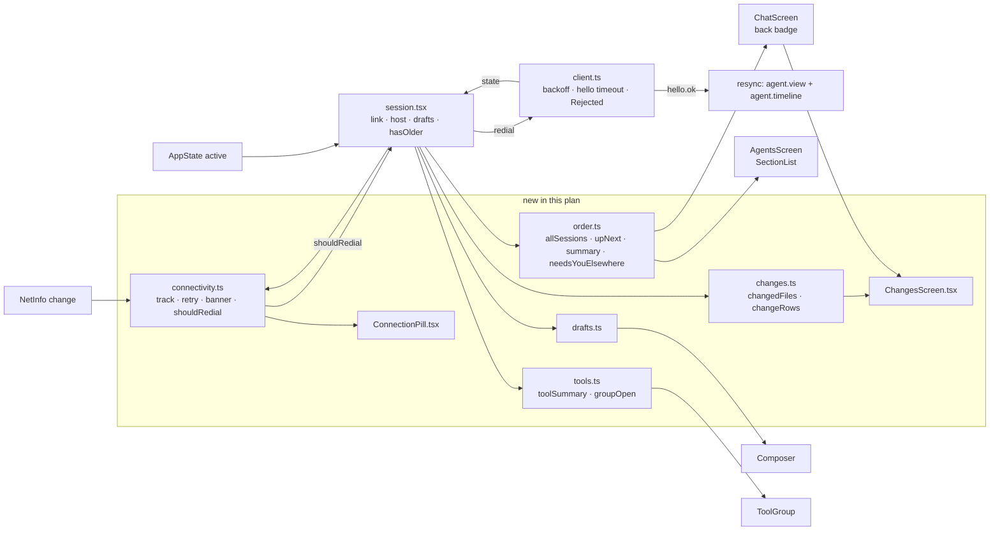

# Phone Shell Implementation Plan

> **For Claude:** REQUIRED SUB-SKILL: Use /implement to execute this plan task-by-task.

**Goal:** The phone uses the same order, colours and words as the desktop. It has no dead controls, it stays on screen through pocketd restarts, it keeps a draft per Session, it folds settled tool groups, and it gets a Changes screen (E17, FR 17-1 to 17-5).

**Base:** main 5091a01. Every `P path:L` is at 5091a01, paths relative to the repo root. A `Modify` line range is at 5091a01 while no earlier task has touched that file; after that it is in the tree the previous task left, marked "after Task X.Y". The diffs in each task are against the tree the previous task left, so apply tasks in order.

**Design:** `docs/designs/2026-09-30-phone-shell.md`. Decision numbers below (#1–#27) are its decisions log.

**Toolset** (run from the root of the checkout being implemented; the shell is fish):
- Once per checkout, before the first typecheck: `pnpm install` and `pnpm --filter @pocket/protocol build`. Without the protocol `dist`, typecheck fails with TS2307 on `@pocket/protocol`.
- One phone test file: `pnpm --filter @pocket/app exec node --test test/<name>.test.mts`
- Phone typecheck: `pnpm --filter @pocket/app typecheck`
- Phone gate (05-roadmap §7, every PR boundary): `pnpm --filter @pocket/app typecheck && pnpm --filter @pocket/app test`
- Tests are `node:test` files run by Node's type stripping. They import `../src/x.ts` and can't import `.tsx`. Each run prints a `MODULE_TYPELESS_PACKAGE_JSON` warning; it is there at 5091a01 too, so ignore it.
- At 5091a01 the phone suite has 6 tests. Counts in the Expected lines are cumulative across tasks.
- A native build is needed only for the manual checks: `cd packages/app && npx expo run:ios`.

**Rebased on 5091a01:** no design change. 8a10124 removed `liveAgents` from `app/agents.ts`, so the suite starts at 6 tests, not the design's 7. 5091a01 doesn't touch `packages/app`.

**Spec overrides (05-roadmap §7.1, verbatim):**

| UX section | Spec says | Winning decision | Text to build |
|---|---|---|---|
| UXP §4.2 Up next tie-break | most recently updated first | D39 | Needs you > Failed > Done (not Seen), then oldest transition first |
| UXP §4.2 summary | "1 needs you · 1 done · 2 working" | FR 17-3 | Urgency order, zero counts omitted: "1 needs you · 1 failed · 2 done · 3 working" |

**Scratch pocketd (manual steps only):**
- Only the manual checks run pocketd. No automated step starts one.
- Never start, stop or restart the owner's pocketd, and never run the owner's desktop app. Don't start paid agent turns.
- A scratch pocketd gets its own `POCKET_HOME`, `POCKETD_SOCK` and port. Clear the inherited socket first, because every Pocket Terminal exports the owner's `POCKETD_SOCK`:

```fish
set -e POCKETD_SOCK
set -x POCKET_HOME (mktemp -d)
set -x POCKETD_SOCK $POCKET_HOME/pocketd.sock
echo '{"token":"scratch-token","port":4599}' > $POCKET_HOME/config.json
cd packages/pocketd && go run ./cmd/pocketd serve
```

- Point the simulator at `127.0.0.1:4599` with token `scratch-token`. Stop it with ctrl-c, and `rm -r $POCKET_HOME` afterwards.

**Same files as other plans:**
- E01 PR4 (`docs/plans/2026-09-30-fix-now.md`) edits `Composer.tsx`, `ChatScreen.tsx`, `session.tsx` and `App.tsx` too. If it merges first:
  - its `state` reads become `link.state` (PR2 here);
  - its permissions map replaces `permission`, so PR2's `setPermission(undefined)` on `hello.ok` becomes that map's reset;
  - its Send/Queue/Stop button keeps PR2's `offline` disable and PR4's `initialText` / `onChangeText` props.
- E02 PR5 lands after PR2 and rebases on it: it swaps the `SecureStore` reads in `session.tsx`'s mount effect for `credentials.load`, and deletes `ConnectScreen.tsx`.

**Read first:**
- `CONTEXT.md`: **Session**, **Needs you**, **Done**, **Working**, **Seen** and each `_Avoid_:` line. PR1's test reads those lines at run time.
- `docs/designs/2026-09-30-phone-shell.md` §3 (copy), §5 (contract) and §10 (decisions).
- `P packages/app/src/session.tsx:40-123`: the one provider every screen reads through `useSession()`.
- `P packages/app/src/status.ts:9-25`: `look()` gives each Session its rank, tone and label. PR3 builds on it.
- `P packages/pocketd/internal/wsserver/wsserver.go:24-25,124-139`: the 10 s hello timeout; `error "Rejected"` then close on a bad token; `hello.ok`, then `agent.list`, then open permission requests.
- `P packages/app/test/status.test.mts`: the phone test style.
- CLAUDE.md: no comments unless the WHY can't be read from the code. Keep the doc comments this plan gives; add no others.

---

## Architecture



Every rule lives in a plain `.ts` module that the tests drive: the connection timers, the list order, drafts, tool summaries and the Changes rows. Screens only read those modules. `client.ts` owns the socket and now retries with backoff. It gives up on `"Rejected"` and times out a silent dial. `session.tsx` turns the socket's state into a `Link`, dials on launch, redials when the app or network comes back, and replays views after each `hello.ok`.

## Why this approach

- **Rules in plain modules, screens stay thin.** Tests can't import `.tsx` or render (repo rule), so each decision is a pure function over plain data.
- **PRs stack in order.** The design (§9) lets PR2 and PR3 start from main, and PR5 needs only PR1. Here each PR's diffs are written against the tree the previous PR left (`AgentsScreen`, `ChatScreen`, `session.tsx`, `copy.test.mts`), so every PR builds on the one before it. That is simpler than re-anchoring each diff.
- **No navigation library** (#1). Changes is a layer inside ChatScreen, so the timeline, `agent.view` and scroll survive. Rejected: react-navigation (native deps) and a Root route (drops the view).
- **Avoid-list test on the TS AST** (#3). It reads the terms from CONTEXT.md and has a per-file allowlist. Rejected: a regex over all literals (it flags code like `"running"`) and a hard-coded list (it drifts).
- **"Review changes" goes away in PR1 and comes back in PR5** (#4). Rejected: a flag (dead code for two weeks).
- **Connectivity copy and timing** (#6–#8). "Reconnecting…" shows at 4 s, the lid copy at 30 s, and the first-connect copy until 10 s. Backoff is 250 ms → 16 s. It resets after 30 s online or on a redial. The hello timeout is 10 s, the same as pocketd's. Rejected: 1 s → 30 s (up to 30 s dead after pocketd returns) and no dial timeout (a sleeping Mac hangs the dial).
- **NetInfo now** (#9). A network change forces a redial. Cost: one native rebuild (design owner question 1). Rejected: AppState only (misses Wi-Fi ↔ cellular in the foreground).
- **Resync = latest page for each viewed Session, plus `agent.view` resent** (#10). Rejected: a `sinceSeq` merge (misses in-place `tool_end`).
- **Offline disables Send and Stop and keeps the text** (#11). **"Rejected" stops retries** (#12). **Auto-connect with the saved keys** (#13).
- **Up next ties go by `updatedAt` ascending** (#15). pocketd moves `updatedAt` only on a status step (P packages/pocketd/internal/agent/agent.go:181-196). **All sessions by `createdAt` desc, then id** (#16).
- **D1 tones via the existing `Tone` names** (#17). Done → `ok` (green), Working → `accent`.
- **Drafts in an in-memory Map behind a stable object** (#20). Rejected: provider state (re-renders on every keystroke) and persistence (UXP §12 says in memory).
- **Tool grammar and fold** (#21, #22). R05 wording with no duration. A group is open while live or while a call runs, and a user toggle wins.
- **Changes: first-edit order, latest-edit totals, a virtualized `FlatList`, no paging cap** (#23–#25). The 1000+ file check is a 1500-file model test (#26).
- **`allowImportingTsExtensions`.** `order.ts` imports `look` from `./status.ts`. That is the first value import between two `src` modules that the tests load, and Node's type stripping needs the `.ts` suffix. Metro resolves the exact path first.
- **`backLabel` joins `order.ts`.** The badge's a11y text ("Back to sessions, 2 need you") is logic, so it sits beside `needsYouElsewhere` and gets tested there.
- **`retry` joins `connectivity.ts`** (not in design §5). A manual redial before the first `hello.ok` restarts the first-connect clock, so "Try again" shows the spinner again instead of leaving the unreachable copy up.
- **Copy the design's §3 list lacks.** The Changes layer's back button reads "Back to session" (it returns to the chat, not the list, so "Back to sessions" would be wrong). Its subtitle count is singular for one file ("1 file"), as the summary's "1 session" is.
- **The capsule sits inside the chat's measured header.** Showing it moves the timeline's top inset by the capsule's height, as the error banner below it does today. Accepted: it shows only after 4 s down, so it doesn't flicker, and a floating capsule would cover timeline rows instead.

## Tasks at a glance

| Task | What | Main files | Risk |
|---|---|---|---|
| **PR 1: Copy and dead controls** | UXP §9 words; no Attach / Dictate / terminal / diff pill | | |
| 1.1 | Avoid-list test; "Needs you" replaces "Waiting for approval" | `test/copy.test.mts`, `TimelineView.tsx` | Low |
| 1.2 | Remove "Open raw terminal", "Attach", "Dictate", "Review changes" | `ChatScreen.tsx`, `Composer.tsx`, `icons.tsx` | Low |
| 1.3 | "Sessions", "No sessions yet", "Back to sessions" | `AgentsScreen.tsx`, `ChatScreen.tsx` | Low |
| **PR 2: Graced connectivity** | No eject on a drop; backoff, hello timeout, redial, resync | | |
| 2.1 | Link model: grace, unreachable, backoff, redial rule | `connectivity.ts` | Low |
| 2.2 | Add NetInfo 12.0.1 | `package.json`, `pnpm-lock.yaml`, `ios/Podfile.lock` | Medium: native rebuild |
| 2.3 | Client: backoff, hello timeout, Rejected, redial | `client.ts` | Medium: socket timing |
| 2.4 | Session: auto-connect, link, AppState/NetInfo redial, resync | `session.tsx`, `App.tsx`, `ConnectScreen.tsx` | Medium |
| 2.5 | Reconnecting capsule, first-connect view, offline Send | `ConnectionPill.tsx`, `AgentsScreen.tsx`, `ChatScreen.tsx`, `Composer.tsx` | Low |
| **PR 3: Stable order** | D1 tones, Up next, summary, back badge | | |
| 3.1 | Done green, Working accent | `status.ts` | Low |
| 3.2 | Order model | `order.ts`, `tsconfig.json` | Low |
| 3.3 | Sections, glyphs, summary line, back badge | `AgentsScreen.tsx`, `ChatScreen.tsx` | Low |
| **PR 4: Drafts and tool groups** | Per-Session drafts; R05 summaries; settled groups fold | | |
| 4.1 | Drafts model | `drafts.ts` | Low |
| 4.2 | Drafts wired through the Composer | `session.tsx`, `Composer.tsx`, `ChatScreen.tsx` | Low |
| 4.3 | Tool summary and fold model | `tools.ts` | Low |
| 4.4 | ToolGroup uses them | `ToolGroup.tsx`, `TimelineView.tsx` | Low |
| **PR 5: Changes** | The diff pill opens a virtualized Changes layer | | |
| 5.1 | Changes model | `changes.ts` | Low |
| 5.2 | `hasOlder` and the Changes layer | `session.tsx`, `ChangesScreen.tsx` | Medium: 1000+ files |
| 5.3 | "Review changes" pill returns | `ChatScreen.tsx` | Low |

---

## PR 1: Copy and dead controls

**Scope:** The phone's words match CONTEXT.md and UXP §9. Controls that do nothing are gone. The diff pill goes too, until PR5 gives it a screen. There are no behaviour changes beyond that.
**Depends on:** nothing
**Done when:** the phone gate passes with 9 tests, and `copy.test.mts` guards the avoid list.

### Task 1.1: Avoid-list test

**What & why:** This adds a test that reads every phone string and fails on any word CONTEXT.md says to avoid. It comes first, so the rest of the plan can't bring those words back. The one hit today is "Waiting for approval".

**Files:**
- Create: `packages/app/test/copy.test.mts`
- Modify: `packages/app/src/components/TimelineView.tsx:83`

**Context:**
- `CONTEXT.md` ends some entries with a line like `_Avoid_: running, busy`. The test reads those lines at run time. "waiting" appears on two lines, so the terms are deduped.
- The parser is `typescript` (devDependency 6.0.3). It collects JSX text, string JSX attributes, and string or template literals that contain a space or start with a capital letter. Code literals like `"running"` (P packages/app/src/components/ToolGroup.tsx:45) are therefore skipped.
- Matching is whole-word and case-insensitive.
- The allowlist entry `read` in `components/ToolGroup.tsx` is Claude's Read tool, not the Seen state.
- `all` and the next tests build on `copy`. Tasks 1.2 and 1.3 append to this file.

**Step 1: Write the failing test**

`packages/app/test/copy.test.mts` (new):

```ts
import { test } from "node:test";
import assert from "node:assert/strict";
import { readFileSync, readdirSync } from "node:fs";
import { join, relative } from "node:path";
import ts from "typescript";

const src = new URL("../src/", import.meta.url).pathname;
const context = new URL("../../../CONTEXT.md", import.meta.url).pathname;

/** Words CONTEXT.md lists as "_Avoid_" that are right in a given file. */
const allowed = [
  { file: "components/ToolGroup.tsx", term: "read", reason: "Claude's Read tool, not Seen" },
];

function files(dir: string): string[] {
  return readdirSync(dir, { withFileTypes: true }).flatMap((entry) => {
    const path = join(dir, entry.name);
    if (entry.isDirectory()) return files(path);
    return /\.tsx?$/.test(entry.name) ? [path] : [];
  });
}

/** Text a user can read: JSX text and attributes, and literals that look like prose. */
function strings(path: string): string[] {
  const source = ts.createSourceFile(path, readFileSync(path, "utf8"), ts.ScriptTarget.Latest, true);
  const found: string[] = [];
  const prose = (text: string) => /\s/.test(text.trim()) || /^[A-Z]/.test(text);
  const visit = (node: ts.Node): void => {
    if (ts.isImportDeclaration(node) || ts.isExportDeclaration(node)) return;
    if (ts.isJsxText(node)) {
      if (node.text.trim()) found.push(node.text.trim());
    } else if (ts.isJsxAttribute(node) && node.initializer && ts.isStringLiteral(node.initializer)) {
      found.push(node.initializer.text);
      return;
    } else if (ts.isStringLiteral(node) || ts.isNoSubstitutionTemplateLiteral(node)) {
      if (prose(node.text)) found.push(node.text);
    } else if (ts.isTemplateExpression(node)) {
      const text = [node.head.text, ...node.templateSpans.map((span) => span.literal.text)].join("…");
      if (prose(text)) found.push(text);
    }
    ts.forEachChild(node, visit);
  };
  visit(source);
  return found;
}

function avoided(): string[] {
  return readFileSync(context, "utf8")
    .split("\n")
    .filter((line) => line.startsWith("_Avoid_:"))
    .flatMap((line) => line.slice("_Avoid_:".length).split(","))
    .map((term) => term.trim().toLowerCase())
    .filter((term, at, all) => term && all.indexOf(term) === at);
}

function uses(text: string, term: string): boolean {
  const escaped = term.replace(/[.*+?^${}()|[\]\\]/g, "\\$&");
  return new RegExp(`(?<![\\w$])${escaped}(?!\\w)`, "i").test(text);
}

const copy = files(src).map((path) => ({ file: relative(src, path), texts: strings(path) }));

test("phone copy uses no CONTEXT.md avoided word", () => {
  const terms = avoided();
  assert.ok(terms.includes("waiting") && terms.includes("running"), "CONTEXT.md avoid lines were not found");
  const hits = copy.flatMap(({ file, texts }) =>
    texts.flatMap((text) =>
      terms
        .filter((term) => uses(text, term))
        .filter((term) => !allowed.some((a) => a.file === file && a.term === term))
        .map((term) => `${file}: "${text}" uses "${term}"`),
    ),
  );
  assert.deepEqual(hits, []);
});
```

It proves that no phone string uses an avoided word, and that the terms were actually found.

**Step 2: Run the test to verify it fails**

Run: `pnpm --filter @pocket/app exec node --test test/copy.test.mts`
Expected: FAIL: `✖ phone copy uses no CONTEXT.md avoided word`, with `actual: [ 'components/TimelineView.tsx: "Waiting for approval" uses "waiting"' ]`.

**Step 3: Write the implementation**

`packages/app/src/components/TimelineView.tsx`:

```diff
diff --git a/packages/app/src/components/TimelineView.tsx b/packages/app/src/components/TimelineView.tsx
--- a/packages/app/src/components/TimelineView.tsx
+++ b/packages/app/src/components/TimelineView.tsx
@@ -80,7 +80,7 @@ function Working({ startedAt, model, waiting, compacting }: Pending) {
   }, [pulse]);
 
   const label = waiting
-    ? "Waiting for approval"
+    ? "Needs you"
     : compacting
       ? `Compacting context ${elapsed(ms)}`
       : [`Working ${elapsed(ms)}`, model?.replace(/^claude-/, "")].filter(Boolean).join(" · ");
```

**Step 4: Run the test to verify it passes**

Run: `pnpm --filter @pocket/app exec node --test test/copy.test.mts`
Expected: PASS. The summary ends with `ℹ tests 1`, `ℹ pass 1`, `ℹ fail 0`.

### Task 1.2: Remove dead controls

**What & why:** "Open raw terminal", "Attach" and "Dictate" do nothing (UXP §1 principle 7). The diff pill "Review changes" has nowhere to go until PR5 (#4). Removing them leaves the header with the back button and the title only.

**Files:**
- Modify: `packages/app/src/screens/ChatScreen.tsx:1-7` (imports), `:61-78` (`diffTotals`), `:87` (`diff`), `:146-159` (pill and terminal button), `:219-229` (styles `diff`, `added`, `removed`)
- Modify: `packages/app/src/components/Composer.tsx:4` (icons), `:28-33` (Attach), `:44-46` (Dictate), `:64-71` (`circle`), `:79-83` (`inputPill` padding, `iconButton`)
- Modify: `packages/app/src/icons.tsx:100-112` (`Plus`, `Mic`)
- Test: `packages/app/test/copy.test.mts`

**Context:**
- `diffTotals` goes now. PR5 brings the same rule back as `changes.ts` `totals`.
- `GitBranch` and `Terminal` stay in `icons.tsx`: ToolGroup uses `Terminal`, and PR5 uses `GitBranch` again. `Rect` stays imported, because `Stop` uses it.
- Without the Dictate button inside the pill, `inputPill` gets even padding.

**Step 1: Write the failing test**

`packages/app/test/copy.test.mts`:

```diff
diff --git a/packages/app/test/copy.test.mts b/packages/app/test/copy.test.mts
--- a/packages/app/test/copy.test.mts
+++ b/packages/app/test/copy.test.mts
@@ -73,3 +73,11 @@ test("phone copy uses no CONTEXT.md avoided word", () => {
   );
   assert.deepEqual(hits, []);
 });
+
+const all = copy.flatMap(({ texts }) => texts);
+
+test("dead controls are gone", () => {
+  for (const label of ["Open raw terminal", "Attach", "Dictate", "Review changes"]) {
+    assert.ok(!all.includes(label), `"${label}" is still in the app`);
+  }
+});
```

It proves that the dead controls' labels are gone from every screen.

**Step 2: Run the test to verify it fails**

Run: `pnpm --filter @pocket/app exec node --test test/copy.test.mts`
Expected: FAIL: `✖ dead controls are gone` with `AssertionError [ERR_ASSERTION]: "Open raw terminal" is still in the app`.

**Step 3: Write the implementation**

`packages/app/src/screens/ChatScreen.tsx`:

```diff
diff --git a/packages/app/src/screens/ChatScreen.tsx b/packages/app/src/screens/ChatScreen.tsx
--- a/packages/app/src/screens/ChatScreen.tsx
+++ b/packages/app/src/screens/ChatScreen.tsx
@@ -1,10 +1,9 @@
-import React, { useEffect, useMemo, useRef, useState } from "react";
+import React, { useEffect, useRef, useState } from "react";
 import { Animated, AppState, Keyboard, Platform, Pressable, StyleSheet, Text, View } from "react-native";
 import { useSafeAreaInsets } from "react-native-safe-area-context";
 import { d, font } from "../design";
-import type { TimelineItem } from "@pocket/protocol";
 import { useSession } from "../session";
-import { ChevronLeft, GitBranch, Terminal } from "../icons";
+import { ChevronLeft } from "../icons";
 import { Glass } from "../components/Glass";
 import { TimelineView, type Pending } from "../components/TimelineView";
 import { Composer } from "../components/Composer";
@@ -58,24 +57,6 @@ function basename(path: string): string {
   return path.split("/").filter(Boolean).pop() ?? path;
 }
 
-/** Latest edit per file, so re-touching one file does not count its lines twice. */
-function diffTotals(items: readonly TimelineItem[]): { added: number; removed: number } {
-  const byPath = new Map<string, { added: number; removed: number }>();
-  for (const item of items) {
-    if (item.kind !== "tool") continue;
-    const detail = item.call.detail;
-    if ((detail.kind !== "edit" && detail.kind !== "write") || !detail.diff) continue;
-    byPath.set(detail.path, { added: detail.diff.additions, removed: detail.diff.deletions });
-  }
-  let added = 0;
-  let removed = 0;
-  for (const entry of byPath.values()) {
-    added += entry.added;
-    removed += entry.removed;
-  }
-  return { added, removed };
-}
-
 export function ChatScreen({ agentId, onBack }: { agentId: string; onBack: () => void }) {
   const { agents, timelines, permission, error, clearError, loadTimeline, view, prompt, compact, interrupt } =
     useSession();
@@ -84,7 +65,6 @@ export function ChatScreen({ agentId, onBack }: { agentId: string; onBack: () =>
   const provider = providerLabel[agent?.provider ?? ""] ?? "Agent";
   const meta = [agent ? basename(agent.cwd) : null, agent?.model].filter(Boolean).join(" · ");
   const items = timelines[agentId] ?? [];
-  const diff = useMemo(() => diffTotals(items), [items]);
 
   const compacting = agent?.compacting === true;
   const busy = agent?.status === "working";
@@ -143,20 +123,6 @@ export function ChatScreen({ agentId, onBack }: { agentId: string; onBack: () =>
               {meta ? ` · ${meta}` : ""}
             </Text>
           </Glass>
-
-          <Pressable accessibilityLabel="Review changes">
-            <Glass style={styles.diff} interactive>
-              <GitBranch size={15} color={d.text} />
-              <Text style={styles.added}>+{diff.added}</Text>
-              <Text style={styles.removed}>−{diff.removed}</Text>
-            </Glass>
-          </Pressable>
-
-          <Pressable accessibilityLabel="Open raw terminal">
-            <Glass style={styles.circle} interactive>
-              <Terminal size={20} color={d.text} />
-            </Glass>
-          </Pressable>
         </View>
 
         {error ? (
@@ -216,15 +182,4 @@ const styles = StyleSheet.create({
   title: { color: d.text, fontSize: 15, fontFamily: font.semibold },
   subtitle: { color: d.muted, fontSize: 11, fontFamily: font.mono },
   provider: { color: d.teal },
-  diff: {
-    height: 44,
-    paddingHorizontal: 12,
-    borderRadius: 22,
-    overflow: "hidden",
-    flexDirection: "row",
-    alignItems: "center",
-    gap: 6,
-  },
-  added: { color: d.green, fontSize: 12, fontFamily: font.mono },
-  removed: { color: d.red, fontSize: 12, fontFamily: font.mono },
 });
```

`packages/app/src/components/Composer.tsx`:

```diff
diff --git a/packages/app/src/components/Composer.tsx b/packages/app/src/components/Composer.tsx
--- a/packages/app/src/components/Composer.tsx
+++ b/packages/app/src/components/Composer.tsx
@@ -1,7 +1,7 @@
 import React, { useState } from "react";
 import { Pressable, StyleSheet, TextInput, View } from "react-native";
 import { d, font } from "../design";
-import { ArrowUp, Mic, Plus, Stop } from "../icons";
+import { ArrowUp, Stop } from "../icons";
 import { Glass } from "./Glass";
 
 type Props = {
@@ -25,12 +25,6 @@ export function Composer({ placeholder, busy, paddingBottom, onSend, onInterrupt
   return (
     <View style={[styles.footer, { paddingBottom }]} pointerEvents="box-none">
       <View style={styles.bar}>
-        <Pressable accessibilityLabel="Attach">
-          <Glass style={styles.circle} interactive>
-            <Plus size={20} color={d.muted} />
-          </Glass>
-        </Pressable>
-
         <Glass style={styles.inputPill}>
           <TextInput
             style={styles.input}
@@ -41,9 +35,6 @@ export function Composer({ placeholder, busy, paddingBottom, onSend, onInterrupt
             placeholderTextColor={d.muted}
             returnKeyType="send"
           />
-          <Pressable style={styles.iconButton} accessibilityLabel="Dictate">
-            <Mic size={20} color={d.muted} />
-          </Pressable>
         </Glass>
 
         <Pressable
@@ -61,14 +52,6 @@ export function Composer({ placeholder, busy, paddingBottom, onSend, onInterrupt
 const styles = StyleSheet.create({
   footer: { paddingTop: 10, paddingHorizontal: 12 },
   bar: { flexDirection: "row", alignItems: "flex-end", gap: 8 },
-  circle: {
-    width: 44,
-    height: 44,
-    borderRadius: 22,
-    overflow: "hidden",
-    alignItems: "center",
-    justifyContent: "center",
-  },
   inputPill: {
     flex: 1,
     minHeight: 44,
@@ -76,11 +59,9 @@ const styles = StyleSheet.create({
     overflow: "hidden",
     flexDirection: "row",
     alignItems: "center",
-    paddingLeft: 16,
-    paddingRight: 4,
+    paddingHorizontal: 16,
   },
   input: { flex: 1, height: 44, color: d.text, fontSize: 15, fontFamily: font.regular },
-  iconButton: { width: 36, height: 36, alignItems: "center", justifyContent: "center" },
   send: {
     width: 44,
     height: 44,
```

`packages/app/src/icons.tsx`:

```diff
diff --git a/packages/app/src/icons.tsx b/packages/app/src/icons.tsx
--- a/packages/app/src/icons.tsx
+++ b/packages/app/src/icons.tsx
@@ -97,19 +97,6 @@ export const Cross = (p: IconProps) => (
   </Icon>
 );
 
-export const Plus = (p: IconProps) => (
-  <Icon {...p}>
-    <Path d="M12 5v14M5 12h14" />
-  </Icon>
-);
-
-export const Mic = (p: IconProps) => (
-  <Icon {...p}>
-    <Rect x="9" y="3" width="6" height="12" rx="3" />
-    <Path d="M5 11a7 7 0 0014 0M12 18v3" />
-  </Icon>
-);
-
 export const ArrowUp = (p: IconProps) => (
   <Icon {...p} strokeWidth={2.4}>
     <Path d="M12 19V5M5 12l7-7 7 7" />
```

**Step 4: Run the test to verify it passes**

Run: `pnpm --filter @pocket/app exec node --test test/copy.test.mts && pnpm --filter @pocket/app typecheck`
Expected: PASS. The summary ends with `ℹ tests 2`, `ℹ pass 2`, `ℹ fail 0`. `tsc --noEmit` prints no errors.

### Task 1.3: Sessions wording

**What & why:** CONTEXT.md calls them Sessions. The list title, the empty state and the back button's label change to that word.

**Files:**
- Modify: `packages/app/src/screens/AgentsScreen.tsx:14` (title), `:24` (empty), `:63` (style `empty`)
- Modify: `packages/app/src/screens/ChatScreen.tsx:111` (back a11y; after Task 1.2)
- Test: `packages/app/test/copy.test.mts`

**Context:**
- The empty state is two lines: "No sessions yet" / "Start one on your Mac." (design §3). It drops the old `pocketd run claude` hint.
- File names `AgentsScreen` / `ChatScreen` stay (#2).

**Step 1: Write the failing test**

`packages/app/test/copy.test.mts`:

```diff
diff --git a/packages/app/test/copy.test.mts b/packages/app/test/copy.test.mts
--- a/packages/app/test/copy.test.mts
+++ b/packages/app/test/copy.test.mts
@@ -81,3 +81,12 @@ test("dead controls are gone", () => {
     assert.ok(!all.includes(label), `"${label}" is still in the app`);
   }
 });
+
+test("the phone says sessions where it said agents", () => {
+  for (const label of ["Sessions", "Back to sessions", "No sessions yet", "Start one on your Mac."]) {
+    assert.ok(all.includes(label), `"${label}" is missing`);
+  }
+  for (const label of ["Agents", "Back to agents"]) {
+    assert.ok(!all.includes(label), `"${label}" is still in the app`);
+  }
+});
```

**Step 2: Run the test to verify it fails**

Run: `pnpm --filter @pocket/app exec node --test test/copy.test.mts`
Expected: FAIL: `✖ the phone says sessions where it said agents` with `AssertionError [ERR_ASSERTION]: "Sessions" is missing`.

**Step 3: Write the implementation**

`packages/app/src/screens/AgentsScreen.tsx`:

```diff
diff --git a/packages/app/src/screens/AgentsScreen.tsx b/packages/app/src/screens/AgentsScreen.tsx
--- a/packages/app/src/screens/AgentsScreen.tsx
+++ b/packages/app/src/screens/AgentsScreen.tsx
@@ -11,7 +11,7 @@ export function AgentsScreen({ onOpen }: { onOpen: (agentId: string) => void })
   return (
     <View style={styles.root}>
       <View style={styles.header}>
-        <Text style={styles.heading}>Agents</Text>
+        <Text style={styles.heading}>Sessions</Text>
         <Pressable onPress={disconnect}>
           <Text style={styles.link}>Disconnect</Text>
         </Pressable>
@@ -21,7 +21,12 @@ export function AgentsScreen({ onOpen }: { onOpen: (agentId: string) => void })
         data={rows}
         keyExtractor={(a) => a.id}
         contentContainerStyle={styles.list}
-        ListEmptyComponent={<Text style={styles.empty}>Start one on your Mac: pocketd run claude</Text>}
+        ListEmptyComponent={
+          <View style={styles.empty}>
+            <Text style={styles.emptyTitle}>No sessions yet</Text>
+            <Text style={styles.emptyText}>Start one on your Mac.</Text>
+          </View>
+        }
         renderItem={({ item }) => {
           const { tone, label } = look(item);
           return (
@@ -60,7 +65,9 @@ const styles = StyleSheet.create({
   heading: { color: theme.text, fontSize: 22, fontWeight: "700" },
   link: { color: theme.accent, fontSize: 13 },
   list: { paddingHorizontal: theme.gap, gap: 8 },
-  empty: { color: theme.muted, textAlign: "center", marginTop: 40 },
+  empty: { alignItems: "center", marginTop: 40, gap: 4 },
+  emptyTitle: { color: theme.text, fontSize: 15, fontWeight: "600" },
+  emptyText: { color: theme.muted },
   row: {
     flexDirection: "row",
     alignItems: "center",
```

`packages/app/src/screens/ChatScreen.tsx`:

```diff
diff --git a/packages/app/src/screens/ChatScreen.tsx b/packages/app/src/screens/ChatScreen.tsx
--- a/packages/app/src/screens/ChatScreen.tsx
+++ b/packages/app/src/screens/ChatScreen.tsx
@@ -108,7 +108,7 @@ export function ChatScreen({ agentId, onBack }: { agentId: string; onBack: () =>
         onLayout={(event) => setHeaderHeight(event.nativeEvent.layout.height)}
       >
         <View style={styles.headerRow} pointerEvents="box-none">
-          <Pressable accessibilityLabel="Back to agents" onPress={onBack}>
+          <Pressable accessibilityLabel="Back to sessions" onPress={onBack}>
             <Glass style={styles.circle} interactive>
               <ChevronLeft size={24} color={d.text} />
             </Glass>
```

**Step 4: Run the test to verify it passes**

Run: `pnpm --filter @pocket/app typecheck && pnpm --filter @pocket/app test`
Expected: `tsc --noEmit` prints no errors, then the suite ends with `ℹ tests 9`, `ℹ pass 9`, `ℹ fail 0`.

## PR 2: Graced connectivity

**Scope:** A dropped socket no longer ejects to ConnectScreen. The phone redials with backoff, on return to the foreground and on a network change. It shows "Reconnecting…" after 4 s and the lid copy after 30 s. It replays views after `hello.ok`, and stops on "Rejected". It auto-connects with the saved keys. The rest of UXP §5.1 stays S2 (outbox, "Reconnecting in {n}s").
**Depends on:** PR 1
**Done when:** the phone gate passes with 19 tests, and the manual scratch-pocketd check at the end of Task 2.5 passes.

### Task 2.1: Link model

**What & why:** Everything the connection shows is decided here as plain functions of time: when to show the capsule, what it says, how long to back off, and when a network change needs a redial. The client and the screens then only call them.

**Files:**
- Create: `packages/app/src/connectivity.ts`
- Modify: `packages/app/src/client.ts:5` (`ConnectionState` gains `"rejected"`)
- Test: `packages/app/test/connectivity.test.mts`

**Context:**
- `Link.since` is when the link last went down. Retries flip `connecting` ⇄ `offline`, and `track` keeps `since` through them, so the 4 s and 30 s clocks don't restart on each attempt.
- `everOnline` tells a first connect (spinner and "Connecting to {host}…" in the list's place) from a drop (the list stays, with the capsule over it).
- `{host}` is `hello.ok.hostname` once seen, else the saved `host:port` (#7).
- NetInfo's first report is the baseline, not a change.
- `retry` restarts the clock on a manual redial before the first `hello.ok`. Without it, "Try again" keeps showing the unreachable copy, because `since` is still the first dial's. After a drop the clock stays, so the capsule doesn't flip back to nothing.

**Step 1: Write the failing test**

`packages/app/test/connectivity.test.mts` (new):

```ts
import { test } from "node:test";
import assert from "node:assert/strict";
import {
  BACKOFF,
  banner,
  nextBackoff,
  shouldRedial,
  noLink,
  retry,
  track,
  type Link,
} from "../src/connectivity.ts";

const host = "mac.local";
const lid = "Can't reach mac.local. Is your Mac awake (lid open) and on Tailscale?";
const dropped: Link = { state: "offline", since: 1_000, everOnline: true };
const text = (link: Link, now: number) => banner(link, now, host)?.text ?? null;

test("a blip under four seconds shows nothing", () => {
  assert.equal(text(dropped, 1_000 + 3_999), null);
  assert.equal(text({ ...dropped, state: "connecting" }, 1_000 + 3_999), null);
});

test("a drop shows reconnecting from four seconds", () => {
  assert.equal(text(dropped, 1_000 + 4_000), "Reconnecting…");
  assert.equal(text({ ...dropped, state: "connecting" }, 1_000 + 29_999), "Reconnecting…");
});

test("a long drop names the lid and tailscale", () => {
  assert.deepEqual(banner(dropped, 1_000 + 30_000, host), { kind: "unreachable", text: lid });
});

test("a first connect shows connecting then unreachable after ten seconds", () => {
  const first: Link = { state: "connecting", since: 0, everOnline: false };
  assert.deepEqual(banner(first, 0, host), { kind: "connecting", text: "Connecting to mac.local…" });
  assert.deepEqual(banner(first, 9_999, host), { kind: "connecting", text: "Connecting to mac.local…" });
  assert.equal(text({ ...first, state: "offline" }, 10_000), lid);
});

test("a retry restarts only the first-connect clock", () => {
  const failed: Link = { state: "offline", since: 0, everOnline: false };
  assert.equal(banner(retry(failed, 20_000), 20_000, host)?.kind, "connecting");
  assert.deepEqual(retry(dropped, 20_000), dropped);
});

test("online, signed out and rejected show nothing", () => {
  assert.equal(text({ state: "online", since: 0, everOnline: true }, 60_000), null);
  assert.equal(text(noLink, 60_000), null);
  assert.equal(text({ state: "rejected", since: 0, everOnline: false }, 60_000), null);
});

test("retries keep the time the link went down", () => {
  let link = track(noLink, "connecting", 100);
  link = track(link, "online", 200);
  link = track(link, "offline", 300);
  link = track(link, "connecting", 900);
  link = track(link, "offline", 1_500);
  assert.deepEqual(link, { state: "offline", since: 300, everOnline: true });
  assert.deepEqual(track(link, "idle", 2_000), { state: "idle", since: 2_000, everOnline: false });
});

test("backoff doubles from 250 ms to a 16 s cap", () => {
  const steps = [BACKOFF.first];
  while (steps.length < 9) steps.push(nextBackoff(steps[steps.length - 1]!));
  assert.deepEqual(steps, [250, 500, 1_000, 2_000, 4_000, 8_000, 16_000, 16_000, 16_000]);
});

test("coming online or switching network redials", () => {
  assert.equal(shouldRedial({ isConnected: false, type: "none" }, { isConnected: true, type: "wifi" }), true);
  assert.equal(shouldRedial({ isConnected: true, type: "wifi" }, { isConnected: true, type: "cellular" }), true);
});

test("an unchanged network does not redial", () => {
  assert.equal(shouldRedial(undefined, { isConnected: true, type: "wifi" }), false);
  assert.equal(shouldRedial({ isConnected: true, type: "wifi" }, { isConnected: true, type: "wifi" }), false);
  assert.equal(shouldRedial({ isConnected: true, type: "wifi" }, { isConnected: false, type: "none" }), false);
});
```

**Step 2: Run the test to verify it fails**

Run: `pnpm --filter @pocket/app exec node --test test/connectivity.test.mts`
Expected: FAIL with `Error [ERR_MODULE_NOT_FOUND]: Cannot find module '…/packages/app/src/connectivity.ts' imported from …/packages/app/test/connectivity.test.mts`, then `ℹ fail 1`.

**Step 3: Write the implementation**

`packages/app/src/connectivity.ts` (new):

```ts
import type { ConnectionState } from "./client";

export const BACKOFF = { first: 250, cap: 16_000, stable: 30_000 } as const;
export const GRACE_MS = 4_000;
export const UNREACHABLE_MS = 30_000;
export const FIRST_CONNECT_MS = 10_000;
/** Matches pocketd's defaultHelloTimeout, after which it drops an unauthenticated socket anyway. */
export const HELLO_TIMEOUT_MS = 10_000;

export type Link = { state: ConnectionState; since: number; everOnline: boolean };

export type Banner =
  | { kind: "connecting"; text: string }
  | { kind: "reconnecting"; text: string }
  | { kind: "unreachable"; text: string };

export const noLink: Link = { state: "idle", since: 0, everOnline: false };

/** `since` is when the link last went down, so retries flipping connecting ⇄ offline don't restart the clock. */
export function track(link: Link, state: ConnectionState, now: number): Link {
  switch (state) {
    case "online":
      return { state, since: now, everOnline: true };
    case "idle":
      return { state, since: now, everOnline: false };
    case "rejected":
      return { ...link, state, since: now };
    case "connecting":
    case "offline":
      return link.state === "connecting" || link.state === "offline" ? { ...link, state } : { ...link, state, since: now };
  }
}

export function banner(link: Link, now: number, host: string): Banner | null {
  if (link.state !== "connecting" && link.state !== "offline") return null;
  const down = now - link.since;
  const unreachable: Banner = {
    kind: "unreachable",
    text: `Can't reach ${host}. Is your Mac awake (lid open) and on Tailscale?`,
  };
  if (!link.everOnline) return down >= FIRST_CONNECT_MS ? unreachable : { kind: "connecting", text: `Connecting to ${host}…` };
  if (down >= UNREACHABLE_MS) return unreachable;
  return down >= GRACE_MS ? { kind: "reconnecting", text: "Reconnecting…" } : null;
}

export function retry(link: Link, now: number): Link {
  return link.everOnline ? link : { ...link, since: now };
}

export function nextBackoff(ms: number): number {
  return Math.min(ms * 2, BACKOFF.cap);
}

export type Net = { isConnected: boolean | null; type: string };

/** The first report is the baseline; after it, coming online or switching interface means the socket may be dead. */
export function shouldRedial(prev: Net | undefined, next: Net): boolean {
  if (!prev || next.isConnected !== true) return false;
  return prev.isConnected !== true || prev.type !== next.type;
}
```

`packages/app/src/client.ts`:

```diff
diff --git a/packages/app/src/client.ts b/packages/app/src/client.ts
--- a/packages/app/src/client.ts
+++ b/packages/app/src/client.ts
@@ -2,7 +2,7 @@ import { PROTOCOL_VERSION } from "@pocket/protocol/constants";
 import type { ClientMessage, ServerMessage } from "@pocket/protocol";
 
 type Outbound = ClientMessage extends infer M ? (M extends { id: string } ? Omit<M, "id"> : never) : never;
-export type ConnectionState = "idle" | "connecting" | "online" | "offline";
+export type ConnectionState = "idle" | "connecting" | "online" | "offline" | "rejected";
 
 const MAX_BACKOFF = 30_000;
 
```

**Step 4: Run the test to verify it passes**

Run: `pnpm --filter @pocket/app exec node --test test/connectivity.test.mts && pnpm --filter @pocket/app typecheck`
Expected: PASS. The summary ends with `ℹ tests 10`, `ℹ pass 10`, `ℹ fail 0`. `tsc --noEmit` prints no errors.

### Task 2.2: Add NetInfo

**What & why:** The phone must redial when Wi-Fi and cellular swap while it is in the foreground (#9). AppState can't see that; NetInfo can. It is a native module, so this task changes the iOS build.

**Files:**
- Modify: `packages/app/package.json:17`
- Modify: `pnpm-lock.yaml:21,622,3027`
- Modify: `packages/app/ios/Podfile.lock`

**Context:**
- 12.0.1 is the version Expo 57 pins (`node_modules/expo/bundledNativeModules.json:11`). If it isn't in the local pnpm store yet, this step needs the network.
- After `pod install`, the phone needs a new dev build (`npx expo run:ios`, or `--device` for the owner's iPhone).
- `pod install` and the native build were not run while planning. The Step 2 output is what CocoaPods normally prints.

**Step 1: Add the package**

Run: `pnpm --filter @pocket/app add --save-exact @react-native-community/netinfo@12.0.1`
Expected: the command ends with `Done in …`. `git diff packages/app/package.json pnpm-lock.yaml` shows exactly this:

`packages/app/package.json`:

```diff
diff --git a/packages/app/package.json b/packages/app/package.json
--- a/packages/app/package.json
+++ b/packages/app/package.json
@@ -15,6 +15,7 @@
     "@expo-google-fonts/geist": "^0.4.2",
     "@expo-google-fonts/geist-mono": "^0.4.3",
     "@pocket/protocol": "workspace:*",
+    "@react-native-community/netinfo": "12.0.1",
     "@react-native-masked-view/masked-view": "0.3.2",
     "expo": "^57.0.24",
     "expo-blur": "~57.0.3",
```

`pnpm-lock.yaml`:

```diff
diff --git a/pnpm-lock.yaml b/pnpm-lock.yaml
--- a/pnpm-lock.yaml
+++ b/pnpm-lock.yaml
@@ -19,6 +19,9 @@ importers:
       '@pocket/protocol':
         specifier: workspace:*
         version: link:../protocol
+      '@react-native-community/netinfo':
+        specifier: 12.0.1
+        version: 12.0.1(react-native@0.86.3(@babel/core@7.29.7(supports-color@8.1.1))(@types/react@19.2.18)(react@19.2.3)(supports-color@8.1.1))(react@19.2.3)
       '@react-native-masked-view/masked-view':
         specifier: 0.3.2
         version: 0.3.2(react-native@0.86.3(@babel/core@7.29.7(supports-color@8.1.1))(@types/react@19.2.18)(react@19.2.3)(supports-color@8.1.1))(react@19.2.3)
@@ -620,6 +623,12 @@ packages:
   '@jridgewell/trace-mapping@0.3.31':
     resolution: {integrity: sha512-zzNR+SdQSDJzc8joaeP8QQoCQr8NuYx2dIIytl1QeBEZHJ9uW6hebsrYgbz8hJwUQao3TWCMtmfV8Nu1twOLAw==}
 
+  '@react-native-community/netinfo@12.0.1':
+    resolution: {integrity: sha512-P/3caXIvfYSJG8AWJVefukg+ZGRPs+M4Lp3pNJtgcTYoJxCjWrKQGNnCkj/Cz//zWa/avGed0i/wzm0T8vV2IQ==}
+    peerDependencies:
+      react: '*'
+      react-native: '>=0.59'
+
   '@react-native-masked-view/masked-view@0.3.2':
     resolution: {integrity: sha512-XwuQoW7/GEgWRMovOQtX3A4PrXhyaZm0lVUiY8qJDvdngjLms9Cpdck6SmGAUNqQwcj2EadHC1HwL0bEyoa/SQ==}
     peerDependencies:
@@ -3025,6 +3034,11 @@ snapshots:
       '@jridgewell/resolve-uri': 3.1.2
       '@jridgewell/sourcemap-codec': 1.6.0
 
+  '@react-native-community/netinfo@12.0.1(react-native@0.86.3(@babel/core@7.29.7(supports-color@8.1.1))(@types/react@19.2.18)(react@19.2.3)(supports-color@8.1.1))(react@19.2.3)':
+    dependencies:
+      react: 19.2.3
+      react-native: 0.86.3(@babel/core@7.29.7(supports-color@8.1.1))(@types/react@19.2.18)(react@19.2.3)(supports-color@8.1.1)
+
   '@react-native-masked-view/masked-view@0.3.2(react-native@0.86.3(@babel/core@7.29.7(supports-color@8.1.1))(@types/react@19.2.18)(react@19.2.3)(supports-color@8.1.1))(react@19.2.3)':
     dependencies:
       react: 19.2.3
```

**Step 2: Install the pod**

Run: `cd packages/app/ios && pod install`
Expected: `Installing react-native-netinfo (12.0.1)`, then `Pod installation complete!`. `git diff --stat packages/app/ios` shows only `Podfile.lock`, which gains `react-native-netinfo (12.0.1)` under PODS, DEPENDENCIES and SPEC CHECKSUMS.

**Step 3: Check nothing else moved**

Run: `pnpm --filter @pocket/app typecheck && pnpm --filter @pocket/app test`
Expected: `tsc --noEmit` prints no errors, then the suite ends with `ℹ tests 19`, `ℹ pass 19`, `ℹ fail 0`.

### Task 2.3: Client: backoff, hello timeout, Rejected, redial

**What & why:** The socket client now retries fast (250 ms → 16 s) and gives up on a dial that gets no `hello.ok` within 10 s. It stops for good on "Rejected" and can be told to redial at once. The rules come from Task 2.1. This task wires them to the WebSocket.

**Files:**
- Modify: `packages/app/src/client.ts` (whole file, 69 lines)

**Context:**
- pocketd answers a bad token or protocol version with `error "Rejected"`, then closes (P packages/pocketd/internal/wsserver/wsserver.go:124-125). The client flags it before `onclose`, so the close emits `"rejected"` and not a retry.
- React Native's `WebSocket.send` throws while connecting. The hello is sent in `onopen`, and `send()` writes only once online. A send while offline is dropped; the Composer disables Send then (Task 2.5).
- Whether `close()` on a connecting socket fires `onclose` is not guaranteed. So the hello timeout calls `lost()` itself, and `drop()` detaches the handlers before closing. The old socket then can't schedule a second retry.
- `redial()` resets the backoff. It ignores a second call within 1 s of a dial that is still connecting, because AppState and NetInfo often fire together.
- The backoff also resets when a link that lasted ≥ 30 s drops (#8).
- `closed` is final: `session.tsx` makes a new client for each `connect()`.
- There is no unit test for the class; it needs a live socket. Its rules are tested in 2.1, and the socket behaviour gets the manual check after 2.5.

**Step 1: Replace the file**

`packages/app/src/client.ts`:

```ts
import { PROTOCOL_VERSION } from "@pocket/protocol/constants";
import type { ClientMessage, ServerMessage } from "@pocket/protocol";
import { BACKOFF, HELLO_TIMEOUT_MS, nextBackoff } from "./connectivity";

type Outbound = ClientMessage extends infer M ? (M extends { id: string } ? Omit<M, "id"> : never) : never;
export type ConnectionState = "idle" | "connecting" | "online" | "offline" | "rejected";

/** AppState and NetInfo often fire together; a second redial this soon would kill the dial the first one started. */
const REDIAL_SETTLE_MS = 1_000;

export class PocketClient {
  private ws?: WebSocket;
  private seq = 0;
  private backoff: number = BACKOFF.first;
  private retry?: ReturnType<typeof setTimeout>;
  private helloTimer?: ReturnType<typeof setTimeout>;
  private dialedAt = 0;
  private onlineAt?: number;
  private closed = false;

  constructor(
    private readonly url: string,
    private readonly token: string,
    private readonly clientId: string,
    private readonly onMessage: (msg: ServerMessage) => void,
    private readonly onState: (state: ConnectionState) => void,
  ) {}

  connect(): void {
    if (this.closed) return;
    this.drop();
    this.dialedAt = Date.now();
    this.onState("connecting");

    const ws = new WebSocket(this.url);
    this.ws = ws;
    let rejected = false;
    this.helloTimer = setTimeout(() => this.lost(false), HELLO_TIMEOUT_MS);

    ws.onopen = () => {
      ws.send(
        JSON.stringify({
          type: "hello",
          id: this.nextId(),
          token: this.token,
          clientId: this.clientId,
          protocolVersion: PROTOCOL_VERSION,
        }),
      );
    };

    ws.onmessage = (event) => {
      const msg = JSON.parse(String(event.data)) as ServerMessage;
      if (msg.type === "hello.ok") {
        clearTimeout(this.helloTimer);
        this.onlineAt = Date.now();
        this.onState("online");
      } else if (msg.type === "error" && msg.message === "Rejected" && this.onlineAt === undefined) {
        rejected = true;
      }
      this.onMessage(msg);
    };

    ws.onerror = () => {};
    ws.onclose = () => this.lost(rejected);
  }

  redial(): void {
    if (this.closed) return;
    if (this.ws && this.onlineAt === undefined && Date.now() - this.dialedAt < REDIAL_SETTLE_MS) return;
    this.backoff = BACKOFF.first;
    this.connect();
  }

  send(msg: Outbound): string {
    const id = this.nextId();
    if (this.onlineAt !== undefined) this.ws?.send(JSON.stringify({ ...msg, id }));
    return id;
  }

  close(): void {
    this.closed = true;
    this.drop();
    this.onState("idle");
  }

  private nextId(): string {
    return `c${++this.seq}`;
  }

  private lost(rejected: boolean): void {
    const lasted = this.onlineAt === undefined ? 0 : Date.now() - this.onlineAt;
    this.drop();
    if (rejected) {
      this.closed = true;
      this.onState("rejected");
      return;
    }
    if (lasted >= BACKOFF.stable) this.backoff = BACKOFF.first;
    this.onState("offline");
    this.retry = setTimeout(() => this.connect(), this.backoff);
    this.backoff = nextBackoff(this.backoff);
  }

  /** Detaches the handlers before closing, so the old socket's close event schedules no retry. */
  private drop(): void {
    clearTimeout(this.retry);
    clearTimeout(this.helloTimer);
    const ws = this.ws;
    this.ws = undefined;
    this.onlineAt = undefined;
    if (!ws) return;
    ws.onopen = null;
    ws.onmessage = null;
    ws.onclose = null;
    ws.close();
  }
}
```

**Step 2: Run the gate**

Run: `pnpm --filter @pocket/app typecheck && pnpm --filter @pocket/app test`
Expected: `tsc --noEmit` prints no errors, then the suite ends with `ℹ tests 19`, `ℹ pass 19`, `ℹ fail 0`.

### Task 2.4: Session: auto-connect, link, redial, resync

**What & why:** The provider keeps a `Link` instead of a bare state, so a drop no longer looks like a sign-out. It dials on launch with the saved keys, redials on foreground and network changes, and after `hello.ok` re-sends the open Session's view and reloads its latest page. `App.tsx` stays on the Sessions list unless the user signed out or was rejected.

**Files:**
- Modify: `packages/app/src/session.tsx` (whole file, 132 lines)
- Modify: `packages/app/src/App.tsx:16-26` (`Root`)
- Modify: `packages/app/src/screens/ConnectScreen.tsx:2-11` (imports, keys), `:52-59` (button, status text)

**Context:**
- `HOST_KEY` / `TOKEN_KEY` move from ConnectScreen to `session.tsx`, which now reads them on mount. `restoring` is true until that read ends, and `Root` renders nothing meanwhile, so ConnectScreen doesn't flash.
- `viewing` remembers the last ids passed to `view()`, even when the send was dropped offline. On `hello.ok`, pocketd sends `agent.list` (P packages/pocketd/internal/wsserver/wsserver.go:135-139). The resync waits for that list, and skips ids that are gone.
- An agent missing after resync still returns to Sessions, as today (#14): `Root` closes a chat whose agent left the list.
- `hello.ok` clears `permission`, because pocketd re-sends the open requests right after.
- The redial effects run for the provider's whole life. `redial()` dials nothing before the first `connect()`.
- `redial()` passes the link through `retry` first, so "Try again" brings the "Connecting to {host}…" spinner back for another 10 s.
- `useBanner()` ticks once a second while the link is down, so the 4 s, 10 s and 30 s thresholds show on time.
- ConnectScreen: the spinner and "Disconnected — retrying" go, because a drop now stays on Sessions. The Rejected copy is from UXP §5.3.

**Step 1: Replace `session.tsx`**

`packages/app/src/session.tsx`:

```tsx
import React, { createContext, useCallback, useContext, useEffect, useMemo, useRef, useState } from "react";
import { AppState } from "react-native";
import NetInfo from "@react-native-community/netinfo";
import * as SecureStore from "expo-secure-store";
import type { AgentSummary, PermissionRequest, ServerMessage, TimelineItem } from "@pocket/protocol";
import { PocketClient, type ConnectionState } from "./client";
import { applyAgentUpdate } from "./agents";
import { banner, noLink, retry, shouldRedial, track, type Banner, type Link, type Net } from "./connectivity";

type Timelines = Record<string, readonly TimelineItem[]>;

export const HOST_KEY = "pocket.host";
export const TOKEN_KEY = "pocket.token";

function mergeItem(items: readonly TimelineItem[], item: TimelineItem): readonly TimelineItem[] {
  const at = items.findIndex((existing) => existing.id === item.id);
  if (at >= 0) {
    const next = items.slice();
    next[at] = item;
    return next;
  }
  return [...items, item];
}

export type PermissionAnswer = { option?: string; message?: string };

type Session = {
  restoring: boolean;
  link: Link;
  host?: string;
  agents: readonly AgentSummary[];
  timelines: Timelines;
  permission?: PermissionRequest;
  error?: string;
  connect: (host: string, token: string) => void;
  redial: () => void;
  disconnect: () => void;
  prompt: (agentId: string, text: string) => void;
  compact: (agentId: string) => void;
  interrupt: (agentId: string) => void;
  loadTimeline: (agentId: string) => void;
  view: (agentIds: readonly string[]) => void;
  resolvePermission: (requestId: string, decision: "allow" | "deny", answer?: PermissionAnswer) => void;
  clearError: () => void;
};

const SessionContext = createContext<Session | null>(null);

export function SessionProvider({ children }: { children: React.ReactNode }) {
  const [restoring, setRestoring] = useState(true);
  const [link, setLink] = useState<Link>(noLink);
  const [host, setHost] = useState<string>();
  const [agents, setAgents] = useState<readonly AgentSummary[]>([]);
  const [timelines, setTimelines] = useState<Timelines>({});
  const [permission, setPermission] = useState<PermissionRequest>();
  const [error, setError] = useState<string>();
  const clientRef = useRef<PocketClient>(null);
  const stateRef = useRef<ConnectionState>("idle");
  /** The last ids passed to view(), kept even when the send was dropped, so a reconnect can restore them. */
  const viewing = useRef<readonly string[]>([]);
  const resync = useRef(false);

  const onState = useCallback((state: ConnectionState) => {
    stateRef.current = state;
    setLink((prev) => track(prev, state, Date.now()));
  }, []);

  const onMessage = useCallback((msg: ServerMessage) => {
    switch (msg.type) {
      case "hello.ok":
        setHost(msg.hostname);
        setPermission(undefined);
        resync.current = true;
        break;
      case "agent.list": {
        setAgents(msg.agents);
        if (!resync.current) break;
        resync.current = false;
        const ids = viewing.current.filter((id) => msg.agents.some((a) => a.id === id));
        if (!ids.length) break;
        clientRef.current?.send({ type: "agent.view", agentIds: ids });
        for (const agentId of ids) clientRef.current?.send({ type: "agent.timeline", agentId });
        break;
      }
      case "agent.update":
        setAgents((prev) => applyAgentUpdate(prev, msg.agent));
        break;
      case "agent.stream":
        setTimelines((prev) => ({ ...prev, [msg.agentId]: mergeItem(prev[msg.agentId] ?? [], msg.item) }));
        break;
      case "agent.timeline":
        setTimelines((prev) => ({ ...prev, [msg.agentId]: msg.items }));
        break;
      case "permission.request":
        setPermission(msg.request);
        break;
      case "permission.resolved":
        setPermission((prev) => (prev?.requestId === msg.requestId ? undefined : prev));
        break;
      case "error":
        setError(msg.message);
        break;
    }
  }, []);

  const connect = useCallback(
    (host: string, token: string) => {
      clientRef.current?.close();
      setHost(host);
      setError(undefined);
      const client = new PocketClient(`ws://${host}`, token, "pocket-app", onMessage, onState);
      clientRef.current = client;
      client.connect();
    },
    [onMessage, onState],
  );

  const redial = useCallback(() => {
    setLink((prev) => retry(prev, Date.now()));
    clientRef.current?.redial();
  }, []);

  useEffect(() => {
    void (async () => {
      const host = await SecureStore.getItemAsync(HOST_KEY);
      const token = await SecureStore.getItemAsync(TOKEN_KEY);
      if (host && token) connect(host, token);
      setRestoring(false);
    })();
  }, [connect]);

  useEffect(() => {
    const change = AppState.addEventListener("change", (state) => {
      if (state === "active" && stateRef.current !== "online") redial();
    });
    return () => change.remove();
  }, [redial]);

  useEffect(() => {
    let prev: Net | undefined;
    return NetInfo.addEventListener((state) => {
      const next = { isConnected: state.isConnected, type: state.type };
      if (shouldRedial(prev, next)) redial();
      prev = next;
    });
  }, [redial]);

  const loadTimeline = useCallback(
    (agentId: string) => clientRef.current?.send({ type: "agent.timeline", agentId }),
    [],
  );

  const view = useCallback((agentIds: readonly string[]) => {
    viewing.current = agentIds;
    clientRef.current?.send({ type: "agent.view", agentIds });
  }, []);

  const value = useMemo<Session>(
    () => ({
      restoring,
      link,
      host,
      agents,
      timelines,
      permission,
      error,
      connect,
      redial,
      disconnect: () => {
        clientRef.current?.close();
        clientRef.current = null;
        setAgents([]);
        setTimelines({});
        setError(undefined);
      },
      prompt: (agentId, text) => {
        setError(undefined);
        clientRef.current?.send({ type: "agent.prompt", agentId, text });
      },
      compact: (agentId) => clientRef.current?.send({ type: "agent.compact", agentId }),
      interrupt: (agentId) => clientRef.current?.send({ type: "agent.interrupt", agentId }),
      loadTimeline,
      view,
      resolvePermission: (requestId, decision, answer) => {
        setPermission(undefined);
        clientRef.current?.send({ type: "permission.resolve", requestId, decision, ...answer });
      },
      clearError: () => setError(undefined),
    }),
    [restoring, link, host, agents, timelines, permission, error, connect, redial, loadTimeline, view],
  );

  return <SessionContext.Provider value={value}>{children}</SessionContext.Provider>;
}

export function useSession(): Session {
  const ctx = useContext(SessionContext);
  if (!ctx) throw new Error("useSession outside SessionProvider");
  return ctx;
}

/** Ticks once a second while the link is down, so the grace and unreachable thresholds show on time. */
export function useBanner(): Banner | null {
  const { link, host } = useSession();
  const [now, setNow] = useState(Date.now);

  useEffect(() => {
    setNow(Date.now());
    if (link.state === "online") return;
    const timer = setInterval(() => setNow(Date.now()), 1000);
    return () => clearInterval(timer);
  }, [link.state]);

  return banner(link, now, host ?? "");
}
```

**Step 2: Update `App.tsx` and `ConnectScreen.tsx`**

`packages/app/src/App.tsx`:

```diff
diff --git a/packages/app/src/App.tsx b/packages/app/src/App.tsx
--- a/packages/app/src/App.tsx
+++ b/packages/app/src/App.tsx
@@ -13,17 +13,20 @@ import { ChatScreen } from "./screens/ChatScreen";
 import { PermissionSheet } from "./components/PermissionSheet";
 
 function Root() {
-  const { state, agents, permission, resolvePermission } = useSession();
+  const { restoring, link, agents, permission, resolvePermission } = useSession();
   const [agentId, setAgentId] = useState<string>();
   const open = agents.some((a) => a.id === agentId) ? agentId : undefined;
+  const signedIn = link.state !== "idle" && link.state !== "rejected";
+
+  if (restoring) return null;
 
   return (
     <>
-      {state === "online" && open ? (
+      {signedIn && open ? (
         <ChatScreen agentId={open} onBack={() => setAgentId(undefined)} />
       ) : (
         <SafeAreaView style={styles.root} edges={["top", "bottom"]}>
-          {state === "online" ? <AgentsScreen onOpen={setAgentId} /> : <ConnectScreen />}
+          {signedIn ? <AgentsScreen onOpen={setAgentId} /> : <ConnectScreen />}
         </SafeAreaView>
       )}
       <PermissionSheet request={permission} onResolve={resolvePermission} />
```

`packages/app/src/screens/ConnectScreen.tsx`:

```diff
diff --git a/packages/app/src/screens/ConnectScreen.tsx b/packages/app/src/screens/ConnectScreen.tsx
--- a/packages/app/src/screens/ConnectScreen.tsx
+++ b/packages/app/src/screens/ConnectScreen.tsx
@@ -1,14 +1,11 @@
 import React, { useEffect, useState } from "react";
-import { ActivityIndicator, KeyboardAvoidingView, Platform, Pressable, StyleSheet, Text, TextInput, View } from "react-native";
+import { KeyboardAvoidingView, Platform, Pressable, StyleSheet, Text, TextInput, View } from "react-native";
 import * as SecureStore from "expo-secure-store";
 import { theme } from "../theme";
-import { useSession } from "../session";
-
-const HOST_KEY = "pocket.host";
-const TOKEN_KEY = "pocket.token";
+import { HOST_KEY, TOKEN_KEY, useSession } from "../session";
 
 export function ConnectScreen() {
-  const { state, connect } = useSession();
+  const { link, connect } = useSession();
   const [host, setHost] = useState("");
   const [token, setToken] = useState("");
 
@@ -49,14 +46,10 @@ export function ConnectScreen() {
         autoCorrect={false}
         secureTextEntry
       />
-      <Pressable style={styles.button} onPress={submit} disabled={state === "connecting"}>
-        {state === "connecting" ? (
-          <ActivityIndicator color={theme.bg} />
-        ) : (
-          <Text style={styles.buttonText}>Connect</Text>
-        )}
+      <Pressable style={styles.button} onPress={submit}>
+        <Text style={styles.buttonText}>Connect</Text>
       </Pressable>
-      {state === "offline" ? <Text style={styles.error}>Disconnected — retrying</Text> : null}
+      {link.state === "rejected" ? <Text style={styles.error}>Rejected — token or version mismatch</Text> : null}
     </KeyboardAvoidingView>
   );
 }
```

**Step 3: Run the gate**

Run: `pnpm --filter @pocket/app typecheck && pnpm --filter @pocket/app test`
Expected: `tsc --noEmit` prints no errors, then the suite ends with `ℹ tests 19`, `ℹ pass 19`, `ℹ fail 0`.

### Task 2.5: Capsule, first-connect view, offline Send

**What & why:** This makes the link visible. A glass capsule over the list and the chat reads "Reconnecting…" or the lid copy, and a tap redials. A first connect shows a centred spinner, then the lid copy with "Try again". Send and Stop are disabled while offline, and the text is kept (#11).

**Files:**
- Create: `packages/app/src/components/ConnectionPill.tsx`
- Modify: `packages/app/src/screens/AgentsScreen.tsx` (whole file, 87 lines after PR1)
- Modify: `packages/app/src/screens/ChatScreen.tsx:5-6` (imports), `:61-62` (session), `:127` (capsule), `:141` (Composer `offline`) (after Task 2.4)
- Modify: `packages/app/src/components/Composer.tsx:9-20` (props, submit), `:41` (button), `:72` (style) (after Task 1.2)

**Context:**
- The capsule hides for a `connecting` banner. That one only exists before the first `hello.ok`, and the first-connect view shows it instead.
- "Disconnect" stays on Sessions (#5), and it works during a first connect too.
- The capsule sits between the chat header row and the error banner (design §3 sketch).

**Step 1: Write the capsule**

`packages/app/src/components/ConnectionPill.tsx` (new):

```tsx
import React from "react";
import { Pressable, StyleSheet, Text } from "react-native";
import { d, font } from "../design";
import type { Banner } from "../connectivity";
import { Glass } from "./Glass";

export function ConnectionPill({ banner, onPress }: { banner: Banner | null; onPress: () => void }) {
  if (!banner || banner.kind === "connecting") return null;

  return (
    <Pressable style={styles.wrap} accessibilityLabel="Reconnect now" onPress={onPress}>
      <Glass style={styles.pill} interactive>
        <Text style={styles.text}>{banner.text}</Text>
      </Glass>
    </Pressable>
  );
}

const styles = StyleSheet.create({
  wrap: { alignSelf: "center", maxWidth: "90%", marginBottom: 10 },
  pill: {
    minHeight: 30,
    borderRadius: 15,
    overflow: "hidden",
    paddingHorizontal: 14,
    paddingVertical: 6,
    justifyContent: "center",
  },
  text: { color: d.text, fontSize: 12.5, fontFamily: font.medium, textAlign: "center" },
});
```

**Step 2: Wire it into the screens**

`packages/app/src/screens/AgentsScreen.tsx` (whole file):

```tsx
import React, { useMemo } from "react";
import { ActivityIndicator, FlatList, Pressable, StyleSheet, Text, View } from "react-native";
import type { Banner } from "../connectivity";
import { theme } from "../theme";
import { useBanner, useSession } from "../session";
import { byUrgency, look } from "../status";
import { ConnectionPill } from "../components/ConnectionPill";

function FirstConnect({ banner, onRetry }: { banner: Banner | null; onRetry: () => void }) {
  if (banner?.kind === "unreachable") {
    return (
      <View style={styles.centre}>
        <Text style={styles.centreText}>{banner.text}</Text>
        <Pressable style={styles.retry} onPress={onRetry}>
          <Text style={styles.link}>Try again</Text>
        </Pressable>
      </View>
    );
  }

  return (
    <View style={styles.centre}>
      <ActivityIndicator color={theme.muted} />
      <Text style={styles.centreText}>{banner?.text}</Text>
    </View>
  );
}

export function AgentsScreen({ onOpen }: { onOpen: (agentId: string) => void }) {
  const { link, agents, disconnect, redial } = useSession();
  const banner = useBanner();
  const rows = useMemo(() => [...agents].sort(byUrgency), [agents]);

  return (
    <View style={styles.root}>
      <View style={styles.header}>
        <Text style={styles.heading}>Sessions</Text>
        <Pressable onPress={disconnect}>
          <Text style={styles.link}>Disconnect</Text>
        </Pressable>
      </View>

      {link.everOnline ? (
        <>
          <ConnectionPill banner={banner} onPress={redial} />
          <FlatList
            data={rows}
            keyExtractor={(a) => a.id}
            contentContainerStyle={styles.list}
            ListEmptyComponent={
              <View style={styles.empty}>
                <Text style={styles.emptyTitle}>No sessions yet</Text>
                <Text style={styles.emptyText}>Start one on your Mac.</Text>
              </View>
            }
            renderItem={({ item }) => {
              const { tone, label } = look(item);
              return (
                <Pressable
                  style={[styles.row, !item.attached && styles.detached]}
                  disabled={!item.attached}
                  onPress={() => onOpen(item.id)}
                >
                  <View style={[styles.dot, { backgroundColor: theme[tone] }]} />
                  <View style={styles.rowText}>
                    <Text style={styles.title} numberOfLines={1}>
                      {item.title}
                    </Text>
                    <Text style={styles.cwd} numberOfLines={1}>
                      {item.attached ? `${item.provider} · ${item.cwd}` : "Not attached · open on your Mac"}
                    </Text>
                  </View>
                  {label ? <Text style={[styles.label, { color: theme[tone] }]}>{label}</Text> : null}
                </Pressable>
              );
            }}
          />
        </>
      ) : (
        <FirstConnect banner={banner} onRetry={redial} />
      )}
    </View>
  );
}

const styles = StyleSheet.create({
  root: { flex: 1 },
  header: {
    flexDirection: "row",
    justifyContent: "space-between",
    alignItems: "center",
    paddingHorizontal: theme.gap,
    paddingVertical: 12,
  },
  heading: { color: theme.text, fontSize: 22, fontWeight: "700" },
  link: { color: theme.accent, fontSize: 13 },
  list: { paddingHorizontal: theme.gap, gap: 8 },
  empty: { alignItems: "center", marginTop: 40, gap: 4 },
  emptyTitle: { color: theme.text, fontSize: 15, fontWeight: "600" },
  emptyText: { color: theme.muted },
  centre: { flex: 1, alignItems: "center", justifyContent: "center", gap: 12, paddingHorizontal: 32 },
  centreText: { color: theme.muted, textAlign: "center" },
  retry: { paddingVertical: 8, paddingHorizontal: 16 },
  row: {
    flexDirection: "row",
    alignItems: "center",
    gap: 12,
    backgroundColor: theme.surface,
    borderWidth: 1,
    borderColor: theme.border,
    borderRadius: theme.radius,
    padding: 14,
  },
  detached: { opacity: 0.5 },
  dot: { width: 8, height: 8, borderRadius: 4 },
  rowText: { flex: 1 },
  title: { color: theme.text, fontSize: 15 },
  cwd: { color: theme.muted, fontSize: 11, marginTop: 2 },
  label: { fontSize: 12, fontWeight: "600" },
});
```

`packages/app/src/screens/ChatScreen.tsx`:

```diff
diff --git a/packages/app/src/screens/ChatScreen.tsx b/packages/app/src/screens/ChatScreen.tsx
--- a/packages/app/src/screens/ChatScreen.tsx
+++ b/packages/app/src/screens/ChatScreen.tsx
@@ -2,8 +2,9 @@ import React, { useEffect, useRef, useState } from "react";
 import { Animated, AppState, Keyboard, Platform, Pressable, StyleSheet, Text, View } from "react-native";
 import { useSafeAreaInsets } from "react-native-safe-area-context";
 import { d, font } from "../design";
-import { useSession } from "../session";
+import { useBanner, useSession } from "../session";
 import { ChevronLeft } from "../icons";
+import { ConnectionPill } from "../components/ConnectionPill";
 import { Glass } from "../components/Glass";
 import { TimelineView, type Pending } from "../components/TimelineView";
 import { Composer } from "../components/Composer";
@@ -58,8 +59,21 @@ function basename(path: string): string {
 }
 
 export function ChatScreen({ agentId, onBack }: { agentId: string; onBack: () => void }) {
-  const { agents, timelines, permission, error, clearError, loadTimeline, view, prompt, compact, interrupt } =
-    useSession();
+  const {
+    link,
+    agents,
+    timelines,
+    permission,
+    error,
+    clearError,
+    loadTimeline,
+    view,
+    prompt,
+    compact,
+    interrupt,
+    redial,
+  } = useSession();
+  const banner = useBanner();
   const insets = useSafeAreaInsets();
   const agent = agents.find((a) => a.id === agentId);
   const provider = providerLabel[agent?.provider ?? ""] ?? "Agent";
@@ -125,6 +139,8 @@ export function ChatScreen({ agentId, onBack }: { agentId: string; onBack: () =>
           </Glass>
         </View>
 
+        <ConnectionPill banner={banner} onPress={redial} />
+
         {error ? (
           <Pressable style={styles.banner} accessibilityLabel="Dismiss error" onPress={clearError}>
             <Text style={styles.bannerText}>{error}</Text>
@@ -139,6 +155,7 @@ export function ChatScreen({ agentId, onBack }: { agentId: string; onBack: () =>
         <Composer
           placeholder={`Message ${provider}…`}
           busy={busy}
+          offline={link.state !== "online"}
           paddingBottom={keyboard.height ? 12 : Math.max(insets.bottom, 30)}
           onSend={(text) => (isCompact(text) ? compact(agentId) : prompt(agentId, text))}
           onInterrupt={() => interrupt(agentId)}
```

`packages/app/src/components/Composer.tsx`:

```diff
diff --git a/packages/app/src/components/Composer.tsx b/packages/app/src/components/Composer.tsx
--- a/packages/app/src/components/Composer.tsx
+++ b/packages/app/src/components/Composer.tsx
@@ -7,17 +7,18 @@ import { Glass } from "./Glass";
 type Props = {
   placeholder: string;
   busy: boolean;
+  offline: boolean;
   paddingBottom: number;
   onSend: (text: string) => void;
   onInterrupt: () => void;
 };
 
-export function Composer({ placeholder, busy, paddingBottom, onSend, onInterrupt }: Props) {
+export function Composer({ placeholder, busy, offline, paddingBottom, onSend, onInterrupt }: Props) {
   const [text, setText] = useState("");
 
   const submit = () => {
     const trimmed = text.trim();
-    if (!trimmed) return;
+    if (!trimmed || offline) return;
     onSend(trimmed);
     setText("");
   };
@@ -38,7 +39,8 @@ export function Composer({ placeholder, busy, paddingBottom, onSend, onInterrupt
         </Glass>
 
         <Pressable
-          style={styles.send}
+          style={[styles.send, offline && styles.disabled]}
+          disabled={offline}
           accessibilityLabel={busy ? "Stop" : "Send"}
           onPress={busy ? onInterrupt : submit}
         >
@@ -70,4 +72,5 @@ const styles = StyleSheet.create({
     alignItems: "center",
     justifyContent: "center",
   },
+  disabled: { opacity: 0.4 },
 });
```

**Step 3: Run the gate**

Run: `pnpm --filter @pocket/app typecheck && pnpm --filter @pocket/app test`
Expected: `tsc --noEmit` prints no errors, then the suite ends with `ℹ tests 19`, `ℹ pass 19`, `ℹ fail 0`.

**Step 4: Manual check against a scratch pocketd**

Start the scratch pocketd from the header, then `cd packages/app && npx expo run:ios`. Connect to `127.0.0.1:4599` with `scratch-token`.
1. Relaunch the app: it reconnects by itself, without ConnectScreen.
2. Stop the scratch pocketd (ctrl-c): Sessions stays on screen, and "Reconnecting…" shows after about 4 s. The lid copy shows after 30 s.
3. Start it again with the same `POCKET_HOME`: the capsule clears on the next retry, at most 16 s later. Tapping the capsule redials at once.
4. Stop it, background the app, start pocketd, foreground the app: it redials at once.
5. Disconnect, then connect with token `wrong`: "Rejected — token or version mismatch" shows and stays for 30 s+, and neither the spinner nor the Sessions list comes back. pocketd logs nothing for a bad hello (P packages/pocketd/internal/wsserver/wsserver.go:122-126), so judge on the phone.
6. Disconnect, then connect to `127.0.0.1:4598` (nothing listens): a spinner with "Connecting to 127.0.0.1:4598…", then after 10 s the lid copy with "Try again". Tap "Try again": the spinner comes back for another 10 s.

## PR 3: Stable order, Up next, D1 tones

**Scope:** The Sessions list stops re-sorting. "All sessions" is in creation order. An "Up next" section above it holds Needs you, Failed and Done, oldest transition first. A summary line counts them. Done turns green and Working turns accent (D1). The chat's back button shows how many other Sessions need you.
**Depends on:** PR 2
**Done when:** the phone gate passes with 27 tests.

### Task 3.1: D1 tones

**What & why:** D1 makes Done green and Working the accent, the same as the desktop. The phone has these backwards today.

**Files:**
- Modify: `packages/app/src/status.ts:15-17`
- Modify: `packages/app/test/status.test.mts:46-47`

**Context:** `Tone` names map to `theme` colours: `ok` is green, `accent` is the accent. The palette values don't change (#17).

**Step 1: Write the failing test**

`packages/app/test/status.test.mts`:

```diff
diff --git a/packages/app/test/status.test.mts b/packages/app/test/status.test.mts
--- a/packages/app/test/status.test.mts
+++ b/packages/app/test/status.test.mts
@@ -43,8 +43,8 @@ test("each status has its glossary label and theme tone", () => {
     [
       ["warn", "Needs you"],
       ["error", "Failed"],
-      ["accent", "Done"],
-      ["ok", "Working"],
+      ["ok", "Done"],
+      ["accent", "Working"],
       ["muted", undefined],
     ],
   );
```

**Step 2: Run the test to verify it fails**

Run: `pnpm --filter @pocket/app exec node --test test/status.test.mts`
Expected: FAIL: `✖ each status has its glossary label and theme tone`, with `+ 'accent'` / `- 'ok'` in the diff.

**Step 3: Write the implementation**

`packages/app/src/status.ts`:

```diff
diff --git a/packages/app/src/status.ts b/packages/app/src/status.ts
--- a/packages/app/src/status.ts
+++ b/packages/app/src/status.ts
@@ -12,9 +12,9 @@ export function look(agent: AgentSummary): Look {
     case "needsYou":
       return { rank: 0, tone: "warn", label: "Needs you" };
     case "done":
-      return agent.failed ? { rank: 1, tone: "error", label: "Failed" } : { rank: 2, tone: "accent", label: "Done" };
+      return agent.failed ? { rank: 1, tone: "error", label: "Failed" } : { rank: 2, tone: "ok", label: "Done" };
     case "working":
-      return { rank: 3, tone: "ok", label: "Working" };
+      return { rank: 3, tone: "accent", label: "Working" };
     default:
       return idle;
   }
```

**Step 4: Run the test to verify it passes**

Run: `pnpm --filter @pocket/app exec node --test test/status.test.mts`
Expected: PASS. The summary ends with `ℹ tests 4`, `ℹ pass 4`, `ℹ fail 0`.

### Task 3.2: Order model

**What & why:** This holds every list decision as pure functions: the stable order, the Up next section and its tie-break, the summary line, and the back badge's count and label. The screens in 3.3 only call these.

**Files:**
- Create: `packages/app/src/order.ts`
- Modify: `packages/app/src/status.ts:4-17` (`RANK`; after Task 3.1)
- Modify: `packages/app/tsconfig.json:5`
- Test: `packages/app/test/order.test.mts`

**Context:**
- `look()` already folds "not attached" into Idle. Everything counts through it, so an unattached Session is never Up next and never counted (#18).
- `RANK` names the ranks `look()` returns, so `order.ts` doesn't repeat magic numbers.
- Up next is Needs you > Failed > Done, then `updatedAt` ascending, then id (§7.1 row). Done means not Seen, because Seen turns a Session Idle.
- The summary uses urgency order and omits zero counts (§7.1 row). It falls back to "{n} sessions" / "1 session", and is `null` with no Sessions.
- `order.ts` imports `look` as a value from `./status.ts`. Node's type stripping needs the suffix, and `tsc` needs `allowImportingTsExtensions` to accept it. Without the flag: `error TS5097: An import path can only end with a '.ts' extension when 'allowImportingTsExtensions' is enabled.`

**Step 1: Write the failing test**

`packages/app/test/order.test.mts` (new):

```ts
import { test } from "node:test";
import assert from "node:assert/strict";
import type { AgentSummary } from "@pocket/protocol";
import { allSessions, backLabel, needsYouElsewhere, summary, upNext } from "../src/order.ts";

const agent = (id: string, status: AgentSummary["status"], more: Partial<AgentSummary> = {}) =>
  ({ id, status, attached: true, createdAt: 0, updatedAt: 0, ...more }) as AgentSummary;

const ids = (list: readonly AgentSummary[]) => list.map((a) => a.id);

test("all sessions stay in creation order when a status changes", () => {
  const before = [agent("old", "idle", { createdAt: 1 }), agent("new", "working", { createdAt: 2 })];
  const after = [agent("old", "needsYou", { createdAt: 1, updatedAt: 9 }), agent("new", "done", { createdAt: 2 })];
  assert.deepEqual(ids(allSessions(before)), ["new", "old"]);
  assert.deepEqual(ids(allSessions(after)), ["new", "old"]);
});

test("a new session goes first", () => {
  const list = [agent("a", "idle", { createdAt: 1 }), agent("b", "idle", { createdAt: 2 })];
  assert.deepEqual(ids(allSessions([...list, agent("c", "idle", { createdAt: 3 })])), ["c", "b", "a"]);
});

test("up next ranks needs you then failed then done", () => {
  const list = [
    agent("done", "done", { updatedAt: 1 }),
    agent("failed", "done", { failed: true, updatedAt: 2 }),
    agent("needs", "needsYou", { updatedAt: 3 }),
  ];
  assert.deepEqual(ids(upNext(list)), ["needs", "failed", "done"]);
});

test("up next breaks ties by oldest transition", () => {
  const list = [agent("late", "needsYou", { updatedAt: 20 }), agent("early", "needsYou", { updatedAt: 10 })];
  assert.deepEqual(ids(upNext(list)), ["early", "late"]);
});

test("working idle and not attached sessions are not up next", () => {
  const list = [agent("w", "working"), agent("i", "idle"), agent("x", "needsYou", { attached: false })];
  assert.deepEqual(upNext(list), []);
});

test("summary lists urgency order and omits zeros", () => {
  const list = [
    agent("w1", "working"),
    agent("d1", "done"),
    agent("n1", "needsYou"),
    agent("w2", "working"),
    agent("f1", "done", { failed: true }),
    agent("d2", "done"),
    agent("w3", "working"),
    agent("i1", "idle"),
  ];
  assert.equal(summary(list), "1 needs you · 1 failed · 2 done · 3 working");
  assert.equal(summary([agent("d", "done"), agent("w", "working")]), "1 done · 1 working");
});

test("summary says need you for more than one", () => {
  assert.equal(summary([agent("a", "needsYou"), agent("b", "needsYou")]), "2 need you");
});

test("summary falls back to a session count", () => {
  assert.equal(summary([agent("a", "idle")]), "1 session");
  assert.equal(summary([agent("a", "idle"), agent("b", "working", { attached: false })]), "2 sessions");
});

test("summary is empty with no sessions", () => {
  assert.equal(summary([]), null);
});

test("the back badge counts needs you in other sessions only", () => {
  const list = [agent("here", "needsYou"), agent("a", "needsYou"), agent("b", "needsYou"), agent("c", "done")];
  assert.equal(needsYouElsewhere(list, "here"), 2);
  assert.equal(needsYouElsewhere(list, "a"), 2);
  assert.equal(needsYouElsewhere([agent("here", "needsYou")], "here"), 0);
  assert.equal(backLabel(0), "Back to sessions");
  assert.equal(backLabel(1), "Back to sessions, 1 needs you");
  assert.equal(backLabel(2), "Back to sessions, 2 need you");
});
```

**Step 2: Run the test to verify it fails**

Run: `pnpm --filter @pocket/app exec node --test test/order.test.mts`
Expected: FAIL with `Error [ERR_MODULE_NOT_FOUND]: Cannot find module '…/packages/app/src/order.ts' imported from …/packages/app/test/order.test.mts`, then `ℹ fail 1`.

**Step 3: Write the implementation**

`packages/app/tsconfig.json`:

```diff
diff --git a/packages/app/tsconfig.json b/packages/app/tsconfig.json
--- a/packages/app/tsconfig.json
+++ b/packages/app/tsconfig.json
@@ -3,6 +3,7 @@
   "compilerOptions": {
     "strict": true,
     "noUncheckedIndexedAccess": true,
+    "allowImportingTsExtensions": true,
     "jsx": "react-jsx",
     "types": ["react"]
   },
```

`packages/app/src/status.ts`:

```diff
diff --git a/packages/app/src/status.ts b/packages/app/src/status.ts
--- a/packages/app/src/status.ts
+++ b/packages/app/src/status.ts
@@ -2,19 +2,23 @@ import type { AgentSummary } from "@pocket/protocol";
 
 export type Tone = "warn" | "error" | "accent" | "ok" | "muted";
 
+export const RANK = { needsYou: 0, failed: 1, done: 2, working: 3, idle: 4 } as const;
+
 type Look = { rank: number; tone: Tone; label?: string };
 
-const idle: Look = { rank: 4, tone: "muted" };
+const idle: Look = { rank: RANK.idle, tone: "muted" };
 
 export function look(agent: AgentSummary): Look {
   if (!agent.attached) return idle;
   switch (agent.status) {
     case "needsYou":
-      return { rank: 0, tone: "warn", label: "Needs you" };
+      return { rank: RANK.needsYou, tone: "warn", label: "Needs you" };
     case "done":
-      return agent.failed ? { rank: 1, tone: "error", label: "Failed" } : { rank: 2, tone: "ok", label: "Done" };
+      return agent.failed
+        ? { rank: RANK.failed, tone: "error", label: "Failed" }
+        : { rank: RANK.done, tone: "ok", label: "Done" };
     case "working":
-      return { rank: 3, tone: "accent", label: "Working" };
+      return { rank: RANK.working, tone: "accent", label: "Working" };
     default:
       return idle;
   }
```

`packages/app/src/order.ts` (new):

```ts
import type { AgentSummary } from "@pocket/protocol";
import { look, RANK } from "./status.ts";

export function allSessions(agents: readonly AgentSummary[]): AgentSummary[] {
  return [...agents].sort((a, b) => b.createdAt - a.createdAt || a.id.localeCompare(b.id));
}

/** D39: a status step is the only thing that moves `updatedAt`, so ascending means oldest transition first. */
export function upNext(agents: readonly AgentSummary[]): AgentSummary[] {
  return agents
    .filter((a) => look(a).rank <= RANK.done)
    .sort((a, b) => look(a).rank - look(b).rank || a.updatedAt - b.updatedAt || a.id.localeCompare(b.id));
}

function needYou(count: number): string {
  return `${count} ${count === 1 ? "needs" : "need"} you`;
}

export function summary(agents: readonly AgentSummary[]): string | null {
  if (!agents.length) return null;
  const count = (rank: number) => agents.filter((a) => look(a).rank === rank).length;
  const needs = count(RANK.needsYou);
  const failed = count(RANK.failed);
  const done = count(RANK.done);
  const working = count(RANK.working);
  const parts = [
    needs ? needYou(needs) : "",
    failed ? `${failed} failed` : "",
    done ? `${done} done` : "",
    working ? `${working} working` : "",
  ].filter(Boolean);
  if (parts.length) return parts.join(" · ");
  return agents.length === 1 ? "1 session" : `${agents.length} sessions`;
}

export function needsYouElsewhere(agents: readonly AgentSummary[], agentId: string): number {
  return agents.filter((a) => a.id !== agentId && look(a).rank === RANK.needsYou).length;
}

export function backLabel(needsYou: number): string {
  return needsYou ? `Back to sessions, ${needYou(needsYou)}` : "Back to sessions";
}
```

**Step 4: Run the test to verify it passes**

Run: `pnpm --filter @pocket/app exec node --test test/order.test.mts && pnpm --filter @pocket/app typecheck`
Expected: PASS. The summary ends with `ℹ tests 10`, `ℹ pass 10`, `ℹ fail 0`. `tsc --noEmit` prints no errors.

### Task 3.3: Sections, glyphs, summary, back badge

**What & why:** The list becomes a `SectionList` with "Up next" (only when it has rows) and "All sessions". A summary line sits under the title. Each row gets a status glyph. The chat's back button shows `‹ n` when other Sessions need you. `byUrgency` goes, since nothing sorts by urgency any more.

**Files:**
- Modify: `packages/app/src/screens/AgentsScreen.tsx:2-8` (imports, `Glyph`), `:32` (`rows`), `:41-48` (summary, list), `:64` (row glyph), `:115` (styles) (after Task 2.5)
- Modify: `packages/app/src/screens/ChatScreen.tsx:1-6` (imports), `:78` (`agent`), `:125-127` (back button), `:180` (styles) (after Task 2.5)
- Modify: `packages/app/src/status.ts:26-29` (`byUrgency`; after Task 3.2)
- Modify: `packages/app/test/status.test.mts:4-30` (`byUrgency` tests; after Task 3.1)

**Context:**
- A row can appear in both sections (UXP §12). `SectionList` prefixes each row's key with its section's `key` ("up:…" / "all:…"), so the ids stay unique.
- With no Sessions, `sections` is `[]`, so the empty state shows instead of a bare "All sessions" header.
- Glyphs (design §9): Needs you and Failed get a 7 pt dot; Done gets a `Check`; Working gets an `ActivityIndicator` in the accent; Idle gets an empty 12 pt slot, so titles line up.
- The badge counts attached Sessions in Needs you, other than this one. It is hidden at 0 (#19).
- The `byUrgency` tests' D39 versions are the `upNext` tests in 3.2.

**Step 1: Delete `byUrgency` and its tests**

`packages/app/src/status.ts`:

```diff
diff --git a/packages/app/src/status.ts b/packages/app/src/status.ts
--- a/packages/app/src/status.ts
+++ b/packages/app/src/status.ts
@@ -23,7 +23,3 @@ export function look(agent: AgentSummary): Look {
       return idle;
   }
 }
-
-export function byUrgency(a: AgentSummary, b: AgentSummary): number {
-  return look(a).rank - look(b).rank || b.updatedAt - a.updatedAt;
-}
```

`packages/app/test/status.test.mts`:

```diff
diff --git a/packages/app/test/status.test.mts b/packages/app/test/status.test.mts
--- a/packages/app/test/status.test.mts
+++ b/packages/app/test/status.test.mts
@@ -1,33 +1,14 @@
 import { test } from "node:test";
 import assert from "node:assert/strict";
 import type { AgentSummary } from "@pocket/protocol";
-import { byUrgency, look } from "../src/status.ts";
+import { look } from "../src/status.ts";
 
 const agent = (id: string, status: AgentSummary["status"], more: Partial<AgentSummary> = {}) =>
   ({ id, status, attached: true, updatedAt: 0, ...more }) as AgentSummary;
 
-const ids = (list: AgentSummary[]) => list.sort(byUrgency).map((a) => a.id);
-
-test("rows sort needs you, failed, done, working, idle", () => {
-  const list = [
-    agent("idle", "idle"),
-    agent("working", "working"),
-    agent("done", "done"),
-    agent("failed", "done", { failed: true }),
-    agent("needs", "needsYou"),
-  ];
-  assert.deepEqual(ids(list), ["needs", "failed", "done", "working", "idle"]);
-});
-
-test("rows with the same status sort by most recent update", () => {
-  const list = [agent("old", "working", { updatedAt: 1 }), agent("new", "working", { updatedAt: 2 })];
-  assert.deepEqual(ids(list), ["new", "old"]);
-});
-
-test("a not-attached agent sorts and looks idle whatever its status", () => {
+test("a not-attached agent looks idle whatever its status", () => {
   const detached = agent("detached", "needsYou", { attached: false, updatedAt: 1 });
   assert.deepEqual(look(detached), look(agent("idle", "idle")));
-  assert.deepEqual(ids([detached, agent("working", "working")]), ["working", "detached"]);
 });
 
 test("each status has its glossary label and theme tone", () => {
```

**Step 2: Run the typecheck to verify it fails**

Run: `pnpm --filter @pocket/app typecheck`
Expected: FAIL with `src/screens/AgentsScreen.tsx(6,10): error TS2305: Module '"../status"' has no exported member 'byUrgency'.`

**Step 3: Write the implementation**

`packages/app/src/screens/AgentsScreen.tsx`:

```diff
diff --git a/packages/app/src/screens/AgentsScreen.tsx b/packages/app/src/screens/AgentsScreen.tsx
--- a/packages/app/src/screens/AgentsScreen.tsx
+++ b/packages/app/src/screens/AgentsScreen.tsx
@@ -1,11 +1,22 @@
 import React, { useMemo } from "react";
-import { ActivityIndicator, FlatList, Pressable, StyleSheet, Text, View } from "react-native";
+import { ActivityIndicator, Pressable, SectionList, StyleSheet, Text, View } from "react-native";
+import type { AgentSummary } from "@pocket/protocol";
 import type { Banner } from "../connectivity";
 import { theme } from "../theme";
 import { useBanner, useSession } from "../session";
-import { byUrgency, look } from "../status";
+import { look, RANK } from "../status";
+import { allSessions, summary, upNext } from "../order";
+import { Check } from "../icons";
 import { ConnectionPill } from "../components/ConnectionPill";
 
+function Glyph({ agent }: { agent: AgentSummary }) {
+  const { rank, tone } = look(agent);
+  if (rank === RANK.done) return <Check size={12} color={theme[tone]} />;
+  if (rank === RANK.working) return <ActivityIndicator size="small" color={theme[tone]} style={styles.spinner} />;
+  if (rank === RANK.idle) return <View style={styles.glyph} />;
+  return <View style={[styles.dot, { backgroundColor: theme[tone] }]} />;
+}
+
 function FirstConnect({ banner, onRetry }: { banner: Banner | null; onRetry: () => void }) {
   if (banner?.kind === "unreachable") {
     return (
@@ -29,7 +40,13 @@ function FirstConnect({ banner, onRetry }: { banner: Banner | null; onRetry: ()
 export function AgentsScreen({ onOpen }: { onOpen: (agentId: string) => void }) {
   const { link, agents, disconnect, redial } = useSession();
   const banner = useBanner();
-  const rows = useMemo(() => [...agents].sort(byUrgency), [agents]);
+  const sections = useMemo(() => {
+    if (!agents.length) return [];
+    const up = upNext(agents);
+    const all = { key: "all", title: "All sessions", data: allSessions(agents) };
+    return up.length ? [{ key: "up", title: "Up next", data: up }, all] : [all];
+  }, [agents]);
+  const counts = useMemo(() => summary(agents), [agents]);
 
   return (
     <View style={styles.root}>
@@ -39,13 +56,16 @@ export function AgentsScreen({ onOpen }: { onOpen: (agentId: string) => void })
           <Text style={styles.link}>Disconnect</Text>
         </Pressable>
       </View>
+      {counts ? <Text style={styles.summary}>{counts}</Text> : null}
 
       {link.everOnline ? (
         <>
           <ConnectionPill banner={banner} onPress={redial} />
-          <FlatList
-            data={rows}
+          <SectionList
+            sections={sections}
             keyExtractor={(a) => a.id}
+            stickySectionHeadersEnabled={false}
+            renderSectionHeader={({ section }) => <Text style={styles.section}>{section.title}</Text>}
             contentContainerStyle={styles.list}
             ListEmptyComponent={
               <View style={styles.empty}>
@@ -61,7 +81,7 @@ export function AgentsScreen({ onOpen }: { onOpen: (agentId: string) => void })
                   disabled={!item.attached}
                   onPress={() => onOpen(item.id)}
                 >
-                  <View style={[styles.dot, { backgroundColor: theme[tone] }]} />
+                  <Glyph agent={item} />
                   <View style={styles.rowText}>
                     <Text style={styles.title} numberOfLines={1}>
                       {item.title}
@@ -112,7 +132,11 @@ const styles = StyleSheet.create({
     padding: 14,
   },
   detached: { opacity: 0.5 },
-  dot: { width: 8, height: 8, borderRadius: 4 },
+  summary: { color: theme.muted, fontSize: 13, paddingHorizontal: theme.gap, marginTop: -8, marginBottom: 8 },
+  section: { color: theme.muted, fontSize: 11, fontWeight: "600", textTransform: "uppercase", marginTop: 12 },
+  glyph: { width: 12 },
+  dot: { width: 7, height: 7, borderRadius: 3.5, marginHorizontal: 2.5 },
+  spinner: { width: 12, height: 12, transform: [{ scale: 0.6 }] },
   rowText: { flex: 1 },
   title: { color: theme.text, fontSize: 15 },
   cwd: { color: theme.muted, fontSize: 11, marginTop: 2 },
```

`packages/app/src/screens/ChatScreen.tsx`:

```diff
diff --git a/packages/app/src/screens/ChatScreen.tsx b/packages/app/src/screens/ChatScreen.tsx
--- a/packages/app/src/screens/ChatScreen.tsx
+++ b/packages/app/src/screens/ChatScreen.tsx
@@ -1,9 +1,10 @@
-import React, { useEffect, useRef, useState } from "react";
+import React, { useEffect, useMemo, useRef, useState } from "react";
 import { Animated, AppState, Keyboard, Platform, Pressable, StyleSheet, Text, View } from "react-native";
 import { useSafeAreaInsets } from "react-native-safe-area-context";
 import { d, font } from "../design";
 import { useBanner, useSession } from "../session";
 import { ChevronLeft } from "../icons";
+import { backLabel, needsYouElsewhere } from "../order";
 import { ConnectionPill } from "../components/ConnectionPill";
 import { Glass } from "../components/Glass";
 import { TimelineView, type Pending } from "../components/TimelineView";
@@ -76,6 +77,7 @@ export function ChatScreen({ agentId, onBack }: { agentId: string; onBack: () =>
   const banner = useBanner();
   const insets = useSafeAreaInsets();
   const agent = agents.find((a) => a.id === agentId);
+  const elsewhere = useMemo(() => needsYouElsewhere(agents, agentId), [agents, agentId]);
   const provider = providerLabel[agent?.provider ?? ""] ?? "Agent";
   const meta = [agent ? basename(agent.cwd) : null, agent?.model].filter(Boolean).join(" · ");
   const items = timelines[agentId] ?? [];
@@ -122,9 +124,10 @@ export function ChatScreen({ agentId, onBack }: { agentId: string; onBack: () =>
         onLayout={(event) => setHeaderHeight(event.nativeEvent.layout.height)}
       >
         <View style={styles.headerRow} pointerEvents="box-none">
-          <Pressable accessibilityLabel="Back to sessions" onPress={onBack}>
-            <Glass style={styles.circle} interactive>
+          <Pressable accessibilityLabel={backLabel(elsewhere)} onPress={onBack}>
+            <Glass style={[styles.circle, elsewhere > 0 && styles.badged]} interactive>
               <ChevronLeft size={24} color={d.text} />
+              {elsewhere > 0 ? <Text style={styles.badge}>{elsewhere}</Text> : null}
             </Glass>
           </Pressable>
 
@@ -178,6 +181,8 @@ const styles = StyleSheet.create({
     alignItems: "center",
     justifyContent: "center",
   },
+  badged: { width: undefined, minWidth: 44, flexDirection: "row", paddingLeft: 6, paddingRight: 14 },
+  badge: { color: d.text, fontSize: 15, fontFamily: font.semibold },
   titlePill: {
     flex: 1,
     height: 44,
```

**Step 4: Run the gate**

Run: `pnpm --filter @pocket/app typecheck && pnpm --filter @pocket/app test`
Expected: `tsc --noEmit` prints no errors, then the suite ends with `ℹ tests 27`, `ℹ pass 27`, `ℹ fail 0`.

Manual, optional: against the scratch pocketd with no agents, Sessions shows "No sessions yet" with no summary and no section header. Rows need live agents, so the section order is covered by `order.test.mts`.

## PR 4: Drafts and tool groups

**Scope:** Text typed in one Session's composer survives leaving and reopening it, per Session, in memory only. Tool groups read "Ran 2 commands · edited 1 file · 1 failed", stay open while live, and fold once settled, unless the user toggled them.
**Depends on:** PR 3
**Done when:** the phone gate passes with 38 tests.

### Task 4.1: Drafts model

**What & why:** A small keyed store that the provider owns and that never changes identity, so typing doesn't re-render every screen (#20).

**Files:**
- Create: `packages/app/src/drafts.ts`
- Test: `packages/app/test/drafts.test.mts`

**Context:** Setting `""` deletes the entry, so the Map never keeps empty drafts.

**Step 1: Write the failing test**

`packages/app/test/drafts.test.mts` (new):

```ts
import { test } from "node:test";
import assert from "node:assert/strict";
import { createDrafts } from "../src/drafts.ts";

test("a draft reads back what was set", () => {
  const drafts = createDrafts();
  drafts.set("a", "fix the login");
  assert.equal(drafts.get("a"), "fix the login");
});

test("drafts are kept per session", () => {
  const drafts = createDrafts();
  drafts.set("a", "first");
  drafts.set("b", "second");
  assert.deepEqual([drafts.get("a"), drafts.get("b")], ["first", "second"]);
});

test("sending clears only that draft", () => {
  const drafts = createDrafts();
  drafts.set("a", "first");
  drafts.set("b", "second");
  drafts.clear("a");
  assert.deepEqual([drafts.get("a"), drafts.get("b")], ["", "second"]);
});

test("an emptied draft reads empty", () => {
  const drafts = createDrafts();
  drafts.set("a", "typo");
  drafts.set("a", "");
  assert.equal(drafts.get("a"), "");
});
```

**Step 2: Run the test to verify it fails**

Run: `pnpm --filter @pocket/app exec node --test test/drafts.test.mts`
Expected: FAIL with `Error [ERR_MODULE_NOT_FOUND]: Cannot find module '…/packages/app/src/drafts.ts' imported from …/packages/app/test/drafts.test.mts`, then `ℹ fail 1`.

**Step 3: Write the implementation**

`packages/app/src/drafts.ts` (new):

```ts
export type Drafts = {
  get(agentId: string): string;
  set(agentId: string, text: string): void;
  clear(agentId: string): void;
};

export function createDrafts(): Drafts {
  const texts = new Map<string, string>();
  return {
    get: (agentId) => texts.get(agentId) ?? "",
    set: (agentId, text) => (text ? texts.set(agentId, text) : texts.delete(agentId)),
    clear: (agentId) => texts.delete(agentId),
  };
}
```

**Step 4: Run the test to verify it passes**

Run: `pnpm --filter @pocket/app exec node --test test/drafts.test.mts`
Expected: PASS. The summary ends with `ℹ tests 4`, `ℹ pass 4`, `ℹ fail 0`.

### Task 4.2: Wire drafts through the Composer

**What & why:** The Composer starts from the Session's draft and reports each change back. ChatScreen clears the draft on send. The provider drops a draft when its Session closes.

**Files:**
- Modify: `packages/app/src/session.tsx:8` (import), `:34` (type), `:56` (state), `:85` (`agent.update`), `:104` (deps), `:166` and `:190` (value) (after Task 2.4)
- Modify: `packages/app/src/components/Composer.tsx:10-17` (props, state), `:33` (`onChangeText`) (after Task 2.5)
- Modify: `packages/app/src/screens/ChatScreen.tsx:75` (session), `:158-163` (Composer) (after Task 3.3)

**Context:**
- `useState(createDrafts)` makes one store per provider that never changes identity. That keeps it out of the re-render path and stable in dependency arrays.
- `key={agentId}` remounts the Composer per Session, so `initialText` is read fresh.
- Since 8a10124, pocketd sends a closed `agent.update` and forgets the agent at once. That is the one place to drop its draft.
- The Composer clears its own text after `onSend`. `drafts.clear` keeps the store in step, since `setText("")` doesn't fire `onChangeText`.

**Step 1: Write the implementation**

`packages/app/src/session.tsx`:

```diff
diff --git a/packages/app/src/session.tsx b/packages/app/src/session.tsx
--- a/packages/app/src/session.tsx
+++ b/packages/app/src/session.tsx
@@ -6,6 +6,7 @@ import type { AgentSummary, PermissionRequest, ServerMessage, TimelineItem } fro
 import { PocketClient, type ConnectionState } from "./client";
 import { applyAgentUpdate } from "./agents";
 import { banner, noLink, retry, shouldRedial, track, type Banner, type Link, type Net } from "./connectivity";
+import { createDrafts, type Drafts } from "./drafts";
 
 type Timelines = Record<string, readonly TimelineItem[]>;
 
@@ -32,6 +33,7 @@ type Session = {
   timelines: Timelines;
   permission?: PermissionRequest;
   error?: string;
+  drafts: Drafts;
   connect: (host: string, token: string) => void;
   redial: () => void;
   disconnect: () => void;
@@ -54,6 +56,7 @@ export function SessionProvider({ children }: { children: React.ReactNode }) {
   const [timelines, setTimelines] = useState<Timelines>({});
   const [permission, setPermission] = useState<PermissionRequest>();
   const [error, setError] = useState<string>();
+  const [drafts] = useState(createDrafts);
   const clientRef = useRef<PocketClient>(null);
   const stateRef = useRef<ConnectionState>("idle");
   /** The last ids passed to view(), kept even when the send was dropped, so a reconnect can restore them. */
@@ -83,6 +86,7 @@ export function SessionProvider({ children }: { children: React.ReactNode }) {
         break;
       }
       case "agent.update":
+        if (msg.agent.status === "closed") drafts.clear(msg.agent.id);
         setAgents((prev) => applyAgentUpdate(prev, msg.agent));
         break;
       case "agent.stream":
@@ -101,7 +105,7 @@ export function SessionProvider({ children }: { children: React.ReactNode }) {
         setError(msg.message);
         break;
     }
-  }, []);
+  }, [drafts]);
 
   const connect = useCallback(
     (host: string, token: string) => {
@@ -164,6 +168,7 @@ export function SessionProvider({ children }: { children: React.ReactNode }) {
       timelines,
       permission,
       error,
+      drafts,
       connect,
       redial,
       disconnect: () => {
@@ -187,7 +192,7 @@ export function SessionProvider({ children }: { children: React.ReactNode }) {
       },
       clearError: () => setError(undefined),
     }),
-    [restoring, link, host, agents, timelines, permission, error, connect, redial, loadTimeline, view],
+    [restoring, link, host, agents, timelines, permission, error, drafts, connect, redial, loadTimeline, view],
   );
 
   return <SessionContext.Provider value={value}>{children}</SessionContext.Provider>;
```

`packages/app/src/components/Composer.tsx`:

```diff
diff --git a/packages/app/src/components/Composer.tsx b/packages/app/src/components/Composer.tsx
--- a/packages/app/src/components/Composer.tsx
+++ b/packages/app/src/components/Composer.tsx
@@ -8,13 +8,29 @@ type Props = {
   placeholder: string;
   busy: boolean;
   offline: boolean;
+  initialText: string;
   paddingBottom: number;
+  onChangeText: (text: string) => void;
   onSend: (text: string) => void;
   onInterrupt: () => void;
 };
 
-export function Composer({ placeholder, busy, offline, paddingBottom, onSend, onInterrupt }: Props) {
-  const [text, setText] = useState("");
+export function Composer({
+  placeholder,
+  busy,
+  offline,
+  initialText,
+  paddingBottom,
+  onChangeText,
+  onSend,
+  onInterrupt,
+}: Props) {
+  const [text, setText] = useState(initialText);
+
+  const change = (next: string) => {
+    setText(next);
+    onChangeText(next);
+  };
 
   const submit = () => {
     const trimmed = text.trim();
@@ -30,7 +46,7 @@ export function Composer({ placeholder, busy, offline, paddingBottom, onSend, on
           <TextInput
             style={styles.input}
             value={text}
-            onChangeText={setText}
+            onChangeText={change}
             onSubmitEditing={submit}
             placeholder={placeholder}
             placeholderTextColor={d.muted}
```

`packages/app/src/screens/ChatScreen.tsx`:

```diff
diff --git a/packages/app/src/screens/ChatScreen.tsx b/packages/app/src/screens/ChatScreen.tsx
--- a/packages/app/src/screens/ChatScreen.tsx
+++ b/packages/app/src/screens/ChatScreen.tsx
@@ -73,6 +73,7 @@ export function ChatScreen({ agentId, onBack }: { agentId: string; onBack: () =>
     compact,
     interrupt,
     redial,
+    drafts,
   } = useSession();
   const banner = useBanner();
   const insets = useSafeAreaInsets();
@@ -156,11 +157,18 @@ export function ChatScreen({ agentId, onBack }: { agentId: string; onBack: () =>
         onLayout={(event) => setDockHeight(event.nativeEvent.layout.height)}
       >
         <Composer
+          key={agentId}
           placeholder={`Message ${provider}…`}
           busy={busy}
           offline={link.state !== "online"}
+          initialText={drafts.get(agentId)}
+          onChangeText={(text) => drafts.set(agentId, text)}
           paddingBottom={keyboard.height ? 12 : Math.max(insets.bottom, 30)}
-          onSend={(text) => (isCompact(text) ? compact(agentId) : prompt(agentId, text))}
+          onSend={(text) => {
+            drafts.clear(agentId);
+            if (isCompact(text)) compact(agentId);
+            else prompt(agentId, text);
+          }}
           onInterrupt={() => interrupt(agentId)}
         />
       </Animated.View>
```

**Step 2: Run the gate**

Run: `pnpm --filter @pocket/app typecheck && pnpm --filter @pocket/app test`
Expected: `tsc --noEmit` prints no errors, then the suite ends with `ℹ tests 31`, `ℹ pass 31`, `ℹ fail 0`.

### Task 4.3: Tool summary and fold model

**What & why:** The group header says what the tools did, in R05 grammar, instead of "N actions · Ns". Whether a group is open is one rule that the tests pin down (#21, #22).

**Files:**
- Create: `packages/app/src/tools.ts`
- Modify: `packages/app/test/copy.test.mts` (allowlist, from Task 1.1)
- Test: `packages/app/test/tools.test.mts`

**Context:**
- Parts in order: `ran N command(s)` (shell), `edited N file(s)` (edit and write, deduped by path), `read N file(s)`, `searched N time(s)`, `started N task(s)`, `called N tool(s)` (other), `N failed`. Only the first letter is capitalized. There is no duration.
- `groupOpen` = the user's toggle if any, else open while live or while any call runs.
- `"read …"` is Claude's Read tool, so `tools.ts` joins ToolGroup on the avoid-list allowlist. Without that entry, `copy.test.mts` fails with `tools.ts: "read …" uses "read"`.

**Step 1: Write the failing test**

`packages/app/test/tools.test.mts` (new):

```ts
import { test } from "node:test";
import assert from "node:assert/strict";
import type { ToolCall, ToolDetail } from "@pocket/protocol";
import { groupOpen, toolSummary } from "../src/tools.ts";

let next = 0;
const call = (detail: ToolDetail, status: ToolCall["status"] = "ok"): ToolCall => ({
  toolUseId: `t${next++}`,
  name: detail.kind,
  detail,
  status,
});
const shell = (status?: ToolCall["status"]) => call({ kind: "shell", command: "pnpm test" }, status);
const edit = (path: string) => call({ kind: "edit", path });

test("a group summary counts commands edits and failures", () => {
  const calls = [shell(), shell("error"), edit("a.ts"), call({ kind: "write", path: "b.ts" })];
  assert.equal(toolSummary(calls), "Ran 2 commands · edited 2 files · 1 failed");
});

test("edits to one file count once", () => {
  const calls = [edit("a.ts"), edit("a.ts"), call({ kind: "write", path: "a.ts" })];
  assert.equal(toolSummary(calls), "Edited 1 file");
});

test("a single call reads singular", () => {
  assert.equal(toolSummary([shell()]), "Ran 1 command");
  assert.equal(toolSummary([call({ kind: "read", path: "a.ts" })]), "Read 1 file");
  assert.equal(toolSummary([call({ kind: "search", query: "todo" })]), "Searched 1 time");
  assert.equal(toolSummary([call({ kind: "task", description: "explore" })]), "Started 1 task");
  assert.equal(toolSummary([call({ kind: "other", name: "WebFetch", input: {} })]), "Called 1 tool");
});

test("the first word is capitalized", () => {
  const calls = [call({ kind: "search", query: "a" }), call({ kind: "search", query: "b" }), shell()];
  assert.equal(toolSummary(calls), "Ran 1 command · searched 2 times");
});

test("a live group is open", () => {
  assert.equal(groupOpen([shell()], true), true);
  assert.equal(groupOpen([shell("running")], false), true);
});

test("a settled group folds", () => {
  assert.equal(groupOpen([shell(), shell("error")], false), false);
});

test("a user toggle wins over the fold", () => {
  assert.equal(groupOpen([shell("running")], true, false), false);
  assert.equal(groupOpen([shell()], false, true), true);
});
```

**Step 2: Run the test to verify it fails**

Run: `pnpm --filter @pocket/app exec node --test test/tools.test.mts`
Expected: FAIL with `Error [ERR_MODULE_NOT_FOUND]: Cannot find module '…/packages/app/src/tools.ts' imported from …/packages/app/test/tools.test.mts`, then `ℹ fail 1`.

**Step 3: Write the implementation**

`packages/app/src/tools.ts` (new):

```ts
import type { ToolCall } from "@pocket/protocol";

function count(n: number, one: string, many: string): string {
  return `${n} ${n === 1 ? one : many}`;
}

export function toolSummary(calls: readonly ToolCall[]): string {
  const kinds = (kind: ToolCall["detail"]["kind"]) => calls.filter((c) => c.detail.kind === kind).length;
  const edited = new Set(
    calls.flatMap(({ detail }) => (detail.kind === "edit" || detail.kind === "write" ? [detail.path] : [])),
  ).size;
  const failed = calls.filter((c) => c.status === "error").length;
  const parts = [
    kinds("shell") && `ran ${count(kinds("shell"), "command", "commands")}`,
    edited && `edited ${count(edited, "file", "files")}`,
    kinds("read") && `read ${count(kinds("read"), "file", "files")}`,
    kinds("search") && `searched ${count(kinds("search"), "time", "times")}`,
    kinds("task") && `started ${count(kinds("task"), "task", "tasks")}`,
    kinds("other") && `called ${count(kinds("other"), "tool", "tools")}`,
    failed && `${failed} failed`,
  ].filter((part): part is string => !!part);
  const text = parts.join(" · ");
  return text.charAt(0).toUpperCase() + text.slice(1);
}

export function groupOpen(calls: readonly ToolCall[], live: boolean, override?: boolean): boolean {
  return override ?? (live || calls.some((c) => c.status === "running"));
}
```

`packages/app/test/copy.test.mts`:

```diff
diff --git a/packages/app/test/copy.test.mts b/packages/app/test/copy.test.mts
--- a/packages/app/test/copy.test.mts
+++ b/packages/app/test/copy.test.mts
@@ -10,6 +10,7 @@ const context = new URL("../../../CONTEXT.md", import.meta.url).pathname;
 /** Words CONTEXT.md lists as "_Avoid_" that are right in a given file. */
 const allowed = [
   { file: "components/ToolGroup.tsx", term: "read", reason: "Claude's Read tool, not Seen" },
+  { file: "tools.ts", term: "read", reason: "Claude's Read tool, not Seen" },
 ];
 
 function files(dir: string): string[] {
```

**Step 4: Run the tests to verify they pass**

Run: `pnpm --filter @pocket/app exec node --test test/tools.test.mts test/copy.test.mts`
Expected: PASS. The summary ends with `ℹ tests 10`, `ℹ pass 10`, `ℹ fail 0`.

### Task 4.4: ToolGroup uses the model

**What & why:** ToolGroup takes a `live` prop and shows `toolSummary`. It keeps only the user's override as state. TimelineView marks the last row live while the Session is Working.

**Files:**
- Modify: `packages/app/src/components/ToolGroup.tsx:16` (import), `:75-83` (`ToolGroup`)
- Modify: `packages/app/src/components/TimelineView.tsx:215` (`renderItem`)

**Context:** `pending` is set in ChatScreen exactly while the agent is Working (P packages/app/src/screens/ChatScreen.tsx:90,107-114), so TimelineView uses it as the live signal.

**Step 1: Write the implementation**

`packages/app/src/components/ToolGroup.tsx`:

```diff
diff --git a/packages/app/src/components/ToolGroup.tsx b/packages/app/src/components/ToolGroup.tsx
--- a/packages/app/src/components/ToolGroup.tsx
+++ b/packages/app/src/components/ToolGroup.tsx
@@ -14,6 +14,7 @@ import {
   Target,
   Terminal,
 } from "../icons";
+import { groupOpen, toolSummary } from "../tools";
 import { DiffStat, DiffView } from "./DiffView";
 
 type Glyph = (props: IconProps) => React.JSX.Element;
@@ -72,15 +73,14 @@ function Row({ call }: { call: ToolCall }) {
   );
 }
 
-export function ToolGroup({ calls }: { calls: readonly ToolCall[] }) {
-  const [open, setOpen] = useState(true);
-  const total = calls.reduce((sum, call) => sum + (call.durationMs ?? 0), 0);
-  const label = `${calls.length} action${calls.length === 1 ? "" : "s"}${total ? ` · ${Math.round(total / 1000)}s` : ""}`;
+export function ToolGroup({ calls, live }: { calls: readonly ToolCall[]; live: boolean }) {
+  const [override, setOverride] = useState<boolean>();
+  const open = groupOpen(calls, live, override);
 
   return (
     <View style={styles.card}>
-      <Pressable style={styles.header} onPress={() => setOpen((v) => !v)}>
-        <Text style={styles.headerText}>{label}</Text>
+      <Pressable style={styles.header} onPress={() => setOverride(!open)}>
+        <Text style={styles.headerText}>{toolSummary(calls)}</Text>
         {open ? <ChevronDown size={16} color={d.muted} /> : <ChevronRight size={16} color={d.muted} />}
       </Pressable>
       {open ? calls.map((call) => <Row key={call.toolUseId} call={call} />) : null}
```

`packages/app/src/components/TimelineView.tsx`:

```diff
diff --git a/packages/app/src/components/TimelineView.tsx b/packages/app/src/components/TimelineView.tsx
--- a/packages/app/src/components/TimelineView.tsx
+++ b/packages/app/src/components/TimelineView.tsx
@@ -212,7 +212,13 @@ export function TimelineView({ items, pending, insetTop, insetBottom }: Props) {
         ref={list}
         data={rows}
         keyExtractor={(row) => row.key}
-        renderItem={({ item }) => (item.kind === "group" ? <ToolGroup calls={item.calls} /> : <Item item={item.item} />)}
+        renderItem={({ item, index }) =>
+          item.kind === "group" ? (
+            <ToolGroup calls={item.calls} live={!!pending && index === rows.length - 1} />
+          ) : (
+            <Item item={item.item} />
+          )
+        }
         contentContainerStyle={[styles.content, { paddingTop: insetTop + 18, paddingBottom: insetBottom + 10 }]}
         ListFooterComponent={pending ? <Working {...pending} /> : null}
         showsVerticalScrollIndicator={false}
```

**Step 2: Run the gate**

Run: `pnpm --filter @pocket/app typecheck && pnpm --filter @pocket/app test`
Expected: `tsc --noEmit` prints no errors, then the suite ends with `ℹ tests 38`, `ℹ pass 38`, `ℹ fail 0`.

## PR 5: Changes

**Scope:** The diff pill "Review changes" comes back. It shows only when the loaded timeline has edits, and it opens a full-screen Changes layer: each changed file with its +/−, and when opened, each edit as a DiffView, oldest first. There is no protocol change and no paging cap (#25).
**Depends on:** PR 4
**Done when:** the phone gate passes with 46 tests.

### Task 5.1: Changes model

**What & why:** This builds the file list and the flat rows the virtualized list renders. The 1000+ file case is a model test, because the repo allows no render tests (#26).

**Files:**
- Create: `packages/app/src/changes.ts`
- Test: `packages/app/test/changes.test.mts`

**Context:**
- Files keep first-edit order, so rows don't move while the agent works (#23). A file's +/− is its latest edit. That matches the old pill's numbers (P packages/app/src/screens/ChatScreen.tsx:61-77).
- An edit or write without a `diff` isn't a change.
- Row keys: `"f:" + path` for a file, `"e:" + path + ":" + index` for an edit.

**Step 1: Write the failing test**

`packages/app/test/changes.test.mts` (new):

```ts
import { test } from "node:test";
import assert from "node:assert/strict";
import type { FileDiff, TimelineItem } from "@pocket/protocol";
import { changedFiles, changeRows, totals } from "../src/changes.ts";

const diff = (additions: number, deletions: number): FileDiff => ({ lines: [], additions, deletions });

let next = 0;
const edit = (path: string, change?: FileDiff, kind: "edit" | "write" = "edit") =>
  ({
    kind: "tool",
    id: `i${next++}`,
    call: { toolUseId: `t${next}`, name: kind, status: "ok", detail: { kind, path, diff: change } },
  }) as TimelineItem;

test("totals use the latest edit per file", () => {
  const files = changedFiles([edit("a.ts", diff(5, 1)), edit("a.ts", diff(7, 2)), edit("b.ts", diff(3, 0), "write")]);
  assert.deepEqual(totals(files), { added: 10, removed: 2 });
});

test("edits are listed oldest first", () => {
  const first = diff(1, 0);
  const second = diff(2, 0);
  const [file] = changedFiles([edit("a.ts", first), edit("a.ts", second)]);
  assert.deepEqual(file?.edits, [first, second]);
});

test("files keep first-edit order", () => {
  const files = changedFiles([edit("b.ts", diff(1, 0)), edit("a.ts", diff(1, 0)), edit("b.ts", diff(2, 0))]);
  assert.deepEqual(
    files.map((f) => f.path),
    ["b.ts", "a.ts"],
  );
});

test("an edit without a diff is not a change", () => {
  assert.deepEqual(changedFiles([edit("a.ts")]), []);
});

test("a closed file shows one row", () => {
  const files = changedFiles([edit("a.ts", diff(1, 0)), edit("a.ts", diff(2, 0))]);
  assert.deepEqual(
    changeRows(files, new Set()).map((r) => r.key),
    ["f:a.ts"],
  );
});

test("an open file shows a row per edit", () => {
  const files = changedFiles([edit("a.ts", diff(1, 0)), edit("a.ts", diff(2, 0)), edit("b.ts", diff(1, 0))]);
  const rows = changeRows(files, new Set(["a.ts"]));
  assert.deepEqual(
    rows.map((r) => r.key),
    ["f:a.ts", "e:a.ts:0", "e:a.ts:1", "f:b.ts"],
  );
  assert.deepEqual(
    rows.flatMap((r) => (r.kind === "edit" ? [`${r.index + 1} of ${r.count}`] : [])),
    ["1 of 2", "2 of 2"],
  );
});

test("fifteen hundred files build one uniquely keyed row each", () => {
  const items = Array.from({ length: 1500 }, (_, i) => edit(`src/file${i}.ts`, diff(1, 1)));
  const rows = changeRows(changedFiles(items), new Set());
  assert.equal(rows.length, 1500);
  assert.equal(new Set(rows.map((r) => r.key)).size, 1500);
});
```

**Step 2: Run the test to verify it fails**

Run: `pnpm --filter @pocket/app exec node --test test/changes.test.mts`
Expected: FAIL with `Error [ERR_MODULE_NOT_FOUND]: Cannot find module '…/packages/app/src/changes.ts' imported from …/packages/app/test/changes.test.mts`, then `ℹ fail 1`.

**Step 3: Write the implementation**

`packages/app/src/changes.ts` (new):

```ts
import type { FileDiff, TimelineItem } from "@pocket/protocol";

export type ChangedFile = { path: string; edits: readonly FileDiff[]; additions: number; deletions: number };

export type ChangeRow =
  | { kind: "file"; key: string; file: ChangedFile; open: boolean }
  | { kind: "edit"; key: string; path: string; index: number; count: number; diff: FileDiff };

/** Each file's +/- is its latest edit, so re-touching a file does not count its lines twice. */
export function changedFiles(items: readonly TimelineItem[]): ChangedFile[] {
  const edits = new Map<string, FileDiff[]>();
  for (const item of items) {
    if (item.kind !== "tool") continue;
    const { detail } = item.call;
    if ((detail.kind !== "edit" && detail.kind !== "write") || !detail.diff) continue;
    const list = edits.get(detail.path);
    if (list) list.push(detail.diff);
    else edits.set(detail.path, [detail.diff]);
  }
  return [...edits].map(([path, list]) => {
    const latest = list[list.length - 1]!;
    return { path, edits: list, additions: latest.additions, deletions: latest.deletions };
  });
}

export function totals(files: readonly ChangedFile[]): { added: number; removed: number } {
  return files.reduce(
    (sum, file) => ({ added: sum.added + file.additions, removed: sum.removed + file.deletions }),
    { added: 0, removed: 0 },
  );
}

export function changeRows(files: readonly ChangedFile[], open: ReadonlySet<string>): ChangeRow[] {
  return files.flatMap((file): ChangeRow[] => {
    const head: ChangeRow = { kind: "file", key: `f:${file.path}`, file, open: open.has(file.path) };
    if (!open.has(file.path)) return [head];
    const count = file.edits.length;
    return [
      head,
      ...file.edits.map((diff, index): ChangeRow => ({
        kind: "edit",
        key: `e:${file.path}:${index}`,
        path: file.path,
        index,
        count,
        diff,
      })),
    ];
  });
}
```

**Step 4: Run the test to verify it passes**

Run: `pnpm --filter @pocket/app exec node --test test/changes.test.mts`
Expected: PASS. The summary ends with `ℹ tests 7`, `ℹ pass 7`, `ℹ fail 0`.

### Task 5.2: `hasOlder` and the Changes layer

**What & why:** The provider remembers whether each timeline has older pages. That way the subtitle can say "Recent edits" rather than claim the whole Session (#24). `ChangesScreen` is the layer: a header with the totals, the subtitle, and a `FlatList` over `changeRows`.

**Files:**
- Modify: `packages/app/src/session.tsx:33` (type), `:56` (state), `:96` (`agent.timeline`), `:168` (value), `:178` (disconnect), `:195` (deps) (after Task 4.2)
- Create: `packages/app/src/screens/ChangesScreen.tsx`

**Context:**
- `agent.timeline` replies carry `hasOlder` (protocol `agent.timeline`: `{items, hasOlder, maxSeq, epoch}`).
- `FlatList<ChangeRow>` renders only what is on screen. `getItemLayout` is not used, because edit rows vary in height. The defaults `initialNumToRender` 10 and `windowSize` 21 stay.
- File rows toggle open with a 200 ms chevron turn.
- The layer's back button reads "Back to session". It returns to the chat, not the list.

**Step 1: Write the implementation**

`packages/app/src/session.tsx`:

```diff
diff --git a/packages/app/src/session.tsx b/packages/app/src/session.tsx
--- a/packages/app/src/session.tsx
+++ b/packages/app/src/session.tsx
@@ -31,6 +31,7 @@ type Session = {
   host?: string;
   agents: readonly AgentSummary[];
   timelines: Timelines;
+  hasOlder: Readonly<Record<string, boolean>>;
   permission?: PermissionRequest;
   error?: string;
   drafts: Drafts;
@@ -54,6 +55,7 @@ export function SessionProvider({ children }: { children: React.ReactNode }) {
   const [host, setHost] = useState<string>();
   const [agents, setAgents] = useState<readonly AgentSummary[]>([]);
   const [timelines, setTimelines] = useState<Timelines>({});
+  const [hasOlder, setHasOlder] = useState<Record<string, boolean>>({});
   const [permission, setPermission] = useState<PermissionRequest>();
   const [error, setError] = useState<string>();
   const [drafts] = useState(createDrafts);
@@ -94,6 +96,7 @@ export function SessionProvider({ children }: { children: React.ReactNode }) {
         break;
       case "agent.timeline":
         setTimelines((prev) => ({ ...prev, [msg.agentId]: msg.items }));
+        setHasOlder((prev) => ({ ...prev, [msg.agentId]: msg.hasOlder }));
         break;
       case "permission.request":
         setPermission(msg.request);
@@ -166,6 +169,7 @@ export function SessionProvider({ children }: { children: React.ReactNode }) {
       host,
       agents,
       timelines,
+      hasOlder,
       permission,
       error,
       drafts,
@@ -176,6 +180,7 @@ export function SessionProvider({ children }: { children: React.ReactNode }) {
         clientRef.current = null;
         setAgents([]);
         setTimelines({});
+        setHasOlder({});
         setError(undefined);
       },
       prompt: (agentId, text) => {
@@ -192,7 +197,7 @@ export function SessionProvider({ children }: { children: React.ReactNode }) {
       },
       clearError: () => setError(undefined),
     }),
-    [restoring, link, host, agents, timelines, permission, error, drafts, connect, redial, loadTimeline, view],
+    [restoring, link, host, agents, timelines, hasOlder, permission, error, drafts, connect, redial, loadTimeline, view],
   );
 
   return <SessionContext.Provider value={value}>{children}</SessionContext.Provider>;
```

`packages/app/src/screens/ChangesScreen.tsx` (new):

```tsx
import React, { useEffect, useMemo, useRef, useState } from "react";
import { Animated, FlatList, Pressable, StyleSheet, Text, View } from "react-native";
import { useSafeAreaInsets } from "react-native-safe-area-context";
import { d, font } from "../design";
import { useSession } from "../session";
import { changedFiles, changeRows, totals, type ChangeRow, type ChangedFile } from "../changes";
import { ChevronLeft, ChevronRight } from "../icons";
import { Glass } from "../components/Glass";
import { DiffView } from "../components/DiffView";

function FileRow({ file, open, onToggle }: { file: ChangedFile; open: boolean; onToggle: () => void }) {
  const turn = useRef(new Animated.Value(open ? 1 : 0)).current;

  useEffect(() => {
    Animated.timing(turn, { toValue: open ? 1 : 0, duration: 200, useNativeDriver: true }).start();
  }, [open, turn]);

  const rotate = turn.interpolate({ inputRange: [0, 1], outputRange: ["0deg", "90deg"] });

  return (
    <Pressable style={styles.file} onPress={onToggle}>
      <Animated.View style={{ transform: [{ rotate }] }}>
        <ChevronRight size={16} color={d.muted} />
      </Animated.View>
      <Text style={styles.path} numberOfLines={1}>
        {file.path}
      </Text>
      <Text style={styles.added}>+{file.additions}</Text>
      <Text style={styles.removed}>−{file.deletions}</Text>
    </Pressable>
  );
}

export function ChangesScreen({ agentId, onBack }: { agentId: string; onBack: () => void }) {
  const { timelines, hasOlder } = useSession();
  const insets = useSafeAreaInsets();
  const [open, setOpen] = useState<ReadonlySet<string>>(new Set());
  const files = useMemo(() => changedFiles(timelines[agentId] ?? []), [timelines, agentId]);
  const rows = useMemo(() => changeRows(files, open), [files, open]);
  const sum = totals(files);
  const count = `${files.length} ${files.length === 1 ? "file" : "files"}`;

  const toggle = (path: string) =>
    setOpen((prev) => {
      const next = new Set(prev);
      if (!next.delete(path)) next.add(path);
      return next;
    });

  const renderItem = ({ item }: { item: ChangeRow }) =>
    item.kind === "file" ? (
      <FileRow file={item.file} open={item.open} onToggle={() => toggle(item.file.path)} />
    ) : (
      <View style={styles.edit}>
        <Text style={styles.editLabel}>
          Edit {item.index + 1} of {item.count}
        </Text>
        <DiffView diff={item.diff} />
      </View>
    );

  return (
    <View style={[styles.root, { paddingTop: Math.max(insets.top + 8, 52) }]}>
      <View style={styles.header}>
        <Pressable accessibilityLabel="Back to session" onPress={onBack}>
          <Glass style={styles.circle} interactive>
            <ChevronLeft size={24} color={d.text} />
          </Glass>
        </Pressable>
        <Text style={styles.title}>Changes</Text>
        <Text style={styles.added}>+{sum.added}</Text>
        <Text style={styles.removed}>−{sum.removed}</Text>
      </View>
      <Text style={styles.subtitle}>
        {hasOlder[agentId] ? "Recent edits" : "Edits in this session"} · {count}
      </Text>
      <FlatList
        data={rows}
        keyExtractor={(row) => row.key}
        renderItem={renderItem}
        contentContainerStyle={{ paddingBottom: insets.bottom + 16 }}
      />
    </View>
  );
}

const styles = StyleSheet.create({
  root: { position: "absolute", top: 0, right: 0, bottom: 0, left: 0, backgroundColor: d.bg },
  header: { flexDirection: "row", alignItems: "center", gap: 8, paddingHorizontal: 12, paddingBottom: 6 },
  circle: {
    width: 44,
    height: 44,
    borderRadius: 22,
    overflow: "hidden",
    alignItems: "center",
    justifyContent: "center",
  },
  title: { flex: 1, color: d.text, fontSize: 17, fontFamily: font.semibold, textAlign: "center" },
  subtitle: { color: d.muted, fontSize: 12, fontFamily: font.regular, paddingHorizontal: 16, paddingBottom: 8 },
  file: {
    height: 44,
    flexDirection: "row",
    alignItems: "center",
    gap: 10,
    paddingHorizontal: 16,
    borderTopWidth: 1,
    borderTopColor: d.rule,
  },
  path: { flex: 1, color: d.text, fontSize: 13, fontFamily: font.mono },
  added: { color: d.green, fontSize: 12, fontFamily: font.mono },
  removed: { color: d.red, fontSize: 12, fontFamily: font.mono },
  edit: { paddingBottom: 8 },
  editLabel: { color: d.faint, fontSize: 11, fontFamily: font.mono, paddingHorizontal: 16, paddingVertical: 6 },
});
```

**Step 2: Run the gate**

Run: `pnpm --filter @pocket/app typecheck && pnpm --filter @pocket/app test`
Expected: `tsc --noEmit` prints no errors, then the suite ends with `ℹ tests 45`, `ℹ pass 45`, `ℹ fail 0`.

### Task 5.3: The pill returns

**What & why:** ChatScreen shows the "Review changes" pill when the loaded timeline has edits. A tap opens the Changes layer over the chat. The copy test flips from "gone" to "present".

**Files:**
- Modify: `packages/app/src/screens/ChatScreen.tsx:6-11` (imports), `:84` (`items`), `:143` (pill), `:174` (layer), `:214` (styles) (after Task 4.2)
- Test: `packages/app/test/copy.test.mts` (from Task 1.2)

**Context:**
- The layer is a child of ChatScreen, so the timeline stays mounted, and so do `agent.view` and the scroll position (#1).
- The pill dismisses the keyboard before opening the layer. It sits outside any ScrollView, so a tap wouldn't, and the keyboard would cover the bottom of the Changes list.

**Step 1: Write the failing test**

`packages/app/test/copy.test.mts`:

```diff
diff --git a/packages/app/test/copy.test.mts b/packages/app/test/copy.test.mts
--- a/packages/app/test/copy.test.mts
+++ b/packages/app/test/copy.test.mts
@@ -78,11 +78,15 @@ test("phone copy uses no CONTEXT.md avoided word", () => {
 const all = copy.flatMap(({ texts }) => texts);
 
 test("dead controls are gone", () => {
-  for (const label of ["Open raw terminal", "Attach", "Dictate", "Review changes"]) {
+  for (const label of ["Open raw terminal", "Attach", "Dictate"]) {
     assert.ok(!all.includes(label), `"${label}" is still in the app`);
   }
 });
 
+test("changes can be reviewed", () => {
+  assert.ok(all.includes("Review changes"));
+});
+
 test("the phone says sessions where it said agents", () => {
   for (const label of ["Sessions", "Back to sessions", "No sessions yet", "Start one on your Mac."]) {
     assert.ok(all.includes(label), `"${label}" is missing`);
```

**Step 2: Run the test to verify it fails**

Run: `pnpm --filter @pocket/app exec node --test test/copy.test.mts`
Expected: FAIL: `✖ changes can be reviewed` with `AssertionError [ERR_ASSERTION]: The expression evaluated to a falsy value`.

**Step 3: Write the implementation**

`packages/app/src/screens/ChatScreen.tsx`:

```diff
diff --git a/packages/app/src/screens/ChatScreen.tsx b/packages/app/src/screens/ChatScreen.tsx
--- a/packages/app/src/screens/ChatScreen.tsx
+++ b/packages/app/src/screens/ChatScreen.tsx
@@ -3,12 +3,14 @@ import { Animated, AppState, Keyboard, Platform, Pressable, StyleSheet, Text, Vi
 import { useSafeAreaInsets } from "react-native-safe-area-context";
 import { d, font } from "../design";
 import { useBanner, useSession } from "../session";
-import { ChevronLeft } from "../icons";
+import { ChevronLeft, GitBranch } from "../icons";
+import { changedFiles, totals } from "../changes";
 import { backLabel, needsYouElsewhere } from "../order";
 import { ConnectionPill } from "../components/ConnectionPill";
 import { Glass } from "../components/Glass";
 import { TimelineView, type Pending } from "../components/TimelineView";
 import { Composer } from "../components/Composer";
+import { ChangesScreen } from "./ChangesScreen";
 
 /** The composer floats over the list, so it has to ride the keyboard itself instead of relying on padding. */
 function useKeyboard() {
@@ -82,6 +84,9 @@ export function ChatScreen({ agentId, onBack }: { agentId: string; onBack: () =>
   const provider = providerLabel[agent?.provider ?? ""] ?? "Agent";
   const meta = [agent ? basename(agent.cwd) : null, agent?.model].filter(Boolean).join(" · ");
   const items = timelines[agentId] ?? [];
+  const files = useMemo(() => changedFiles(items), [items]);
+  const sum = useMemo(() => totals(files), [files]);
+  const [showChanges, setShowChanges] = useState(false);
 
   const compacting = agent?.compacting === true;
   const busy = agent?.status === "working";
@@ -141,6 +146,22 @@ export function ChatScreen({ agentId, onBack }: { agentId: string; onBack: () =>
               {meta ? ` · ${meta}` : ""}
             </Text>
           </Glass>
+
+          {files.length ? (
+            <Pressable
+              accessibilityLabel="Review changes"
+              onPress={() => {
+                Keyboard.dismiss();
+                setShowChanges(true);
+              }}
+            >
+              <Glass style={styles.diff} interactive>
+                <GitBranch size={15} color={d.text} />
+                <Text style={styles.added}>+{sum.added}</Text>
+                <Text style={styles.removed}>−{sum.removed}</Text>
+              </Glass>
+            </Pressable>
+          ) : null}
         </View>
 
         <ConnectionPill banner={banner} onPress={redial} />
@@ -172,6 +193,8 @@ export function ChatScreen({ agentId, onBack }: { agentId: string; onBack: () =>
           onInterrupt={() => interrupt(agentId)}
         />
       </Animated.View>
+
+      {showChanges ? <ChangesScreen agentId={agentId} onBack={() => setShowChanges(false)} /> : null}
     </View>
   );
 }
@@ -212,4 +235,15 @@ const styles = StyleSheet.create({
   title: { color: d.text, fontSize: 15, fontFamily: font.semibold },
   subtitle: { color: d.muted, fontSize: 11, fontFamily: font.mono },
   provider: { color: d.teal },
+  diff: {
+    height: 44,
+    paddingHorizontal: 12,
+    borderRadius: 22,
+    overflow: "hidden",
+    flexDirection: "row",
+    alignItems: "center",
+    gap: 6,
+  },
+  added: { color: d.green, fontSize: 12, fontFamily: font.mono },
+  removed: { color: d.red, fontSize: 12, fontFamily: font.mono },
 });
```

**Step 4: Run the gate**

Run: `pnpm --filter @pocket/app typecheck && pnpm --filter @pocket/app test`
Expected: `tsc --noEmit` prints no errors, then the suite ends with `ℹ tests 46`, `ℹ pass 46`, `ℹ fail 0`.

Manual, release only (design §8): the 1500-file model test stands in for a live 1000-file Session. A reviewer with a large real Session judges scrolling in `npx expo run:ios --configuration Release`, not in debug.

## Verification

**Static review:** 9 findings (0 blocker, 1 major, 8 minor). 9 applied, 0 rejected.
- Major, "Try again" gave no feedback: `connectivity.ts` gains `retry` (first-connect clock restarts on a manual redial, a dropped link's clock stays), pinned by `a retry restarts only the first-connect clock`; `session.tsx` `redial` applies it (Tasks 2.1, 2.4). Counts from Task 2.1 on are one higher.
- Minors: manual check 5 judged on the phone (pocketd logs nothing for a bad hello); `Modify` ranges re-anchored to the tree the previous task left, marked "after Task X.Y" (the old ones were consistently at 5091a01, which meant nothing for `session.tsx` after its rewrite); AgentsScreen "87 lines after PR1"; the pill calls `Keyboard.dismiss()`; "Back to session" and "1 file" recorded under Why this approach; drafts tests renamed to what they assert; the capsule's inset jump recorded as accepted; Toolset says "root of the checkout being implemented".

**Dry run:** PR 1, 3 tasks, 12 steps, done-when passed (9 tests, clean typecheck). No deviations. Its one observation, the hard-coded owner checkout in Toolset, is fixed above.

**Full probe after the fixes:** every block of PRs 1–5 written or `git apply`-ed in order on a 5091a01 worktree, with no offsets or fuzz. NetInfo's `pnpm add` produced exactly the Task 2.2 diff. Gates: PR1 9, PR2 19, PR3 27, PR4 38, PR5 46 tests, all passing, typecheck clean. The fixes also corrected hunk headers the `retry` change shifted (Tasks 4.2, 5.2 `session.tsx`; Task 5.3 pill hunk).

**Remaining risks:**
- `pod install`, the native rebuild and every manual check (Task 2.5 Step 4, the release scroll in Task 5.3) were not run. NetInfo needs a new dev build on the owner's iPhone (design owner question 1).
- `client.ts` has no unit test; its socket timing (hello timeout, detached handlers, 1 s redial settle) rests on the manual check.
- Design §5 doesn't list `retry`, `noLink`, `track` or `backLabel`, and design §8 still carries the old drafts test names. The plan is authoritative for both.
- E01 PR4 and E02 PR5 edit the same phone files; whichever merges second rebases as the header's "Same files as other plans" says.
