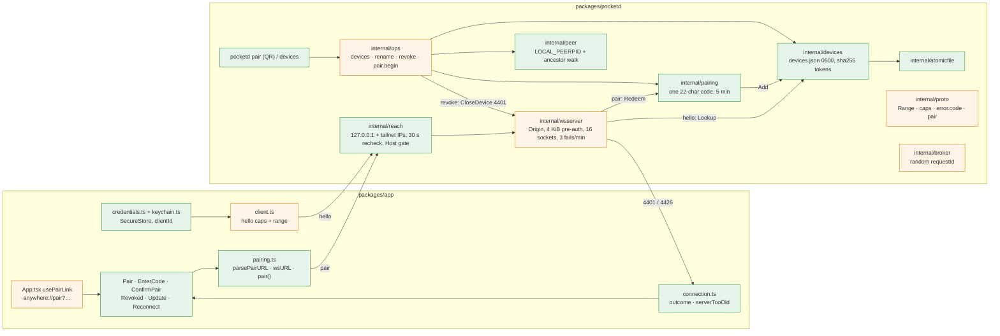

# Reach Lockdown Implementation Plan

> **For Claude:** REQUIRED SUB-SKILL: Use /implement to execute this plan task-by-task.

**Goal:** Only paired devices reach pocketd, and only over loopback or the tailnet. A phone that was removed, or that is out of date, says so.

**Base:** main 5091a01. Design: `docs/designs/2026-09-30-reach-lockdown.md` (written at f8f7293). No design decision changed on rebase. Its cites were re-checked at 5091a01 and moved where the code moved. For example, the desktop's hello is at `packages/desktop/crates/agents/src/agents.rs:245`, not `:248`. E02 changes no desktop file.

**Toolset** (paths relative to the repo root):
- pocketd, one package: `cd packages/pocketd && env -u POCKETD_SOCK go test -race -count=1 ./internal/<pkg>`
- pocketd, full (every PR boundary): `cd packages/pocketd && env -u POCKETD_SOCK go vet ./... && env -u POCKETD_SOCK go test -race -count=1 ./...`
- Goldens: `cd packages/pocketd && env -u POCKETD_SOCK go test ./internal/proto -update`, then the protocol test.
- Protocol (TS): `pnpm --filter @pocket/protocol test`. It runs `tsc -b && node --test test/`. That also builds `packages/protocol/dist`, which the app's tests import, and it decodes every Go golden with `onExcessProperty: "error"`.
- Phone: `pnpm --filter @pocket/app typecheck && pnpm --filter @pocket/app test`.
- `scripts/check.sh` runs all of the above once E01 PR1 lands. Until then, run the lines one by one.
- Every command that runs pocketd or its tests starts with `env -u POCKETD_SOCK`. A Pocket Terminal exports it, and a test must never reach the owner's pocketd.
- The shell is fish: quote globs.
- A modified file is shown as a unified diff. Apply it by hand or save it and run `git apply`. For PR 1 the hunk line numbers are 5091a01's. For later PRs they count lines in the file as the earlier PRs left it. The **Files** lines always cite 5091a01.

**UX override (roadmap §7.1).** Build this text, not the spec's:

| UX section | Spec says | Winning decision | Text to build |
|---|---|---|---|
| UXP §4.1 pair copy | "On your Mac, open Devices → Pair phone" | E03 PR4 (the Devices sheet is S5) | "On your Mac, press ⌘K → Pair phone" |

Until E03 PR4 ships, ⌘K → Pair phone doesn't exist. The owner runs `pocketd pair` instead.

**Scratch pocketd rules (roadmap §7):**
- Tests start a scratch pocketd with their own `POCKET_HOME`, `POCKETD_SOCK` and port. The e2e harness already does (`packages/pocketd/e2e/harness_test.go`).
- Never start or restart the production pocketd from this plan. Until E09 lands, a restart kills every PTY, the implementing agent's included. Leave restarts to the owner.
- Pocket Terminals export `POCKETD_SOCK`, so every pocketd command here runs under `env -u POCKETD_SOCK`.

**Other roadmap §7 rules:**
- Protocol. Wire changes land in `packages/protocol` and `packages/pocketd/internal/proto` together, with goldens, in lane P. PR 1 and PR 4 change goldens: run them one at a time with other golden PRs.
- Security. Every new WS or ops handler adds a scope-matrix row. The table (`| Surface | Verb | Needs | pty(T) |`) is created by E03 PR2; today it sits in `docs/designs/2026-09-30-no-self-approval.md` §5. Whichever of E02 and E03 PR2 lands second adds these rows:

| Surface | Verb | Needs | pty(T) |
|---|---|---|---|
| WS pre-auth | `pair` | anyone past the gate and rate limit; mints a phone device | n/a |
| WS pre-auth | `hello` | anyone past the gate and rate limit; resolves the device's scopes | n/a |
| ops | `devices`, `devices.rename`, `devices.revoke`, `pair.begin` | socket owner | refused |

**Read first:**
- `docs/designs/2026-09-30-reach-lockdown.md` §5 (contract), §6 (data), §7 (failure modes), §10 (decisions). This plan builds exactly that, with the deviations below.
- `packages/pocketd/internal/wsserver/wsserver.go:52-152`: the socket life cycle and the hello path. PR 1 to PR 4 all change it.
- `packages/pocketd/internal/proto/golden_test.go` and `packages/protocol/test/golden.test.mjs`: how a wire change is pinned on both sides.
- `packages/pocketd/internal/ops/ops.go:79-136`: the ops socket loop that gets the owner verbs.
- `packages/pocketd/e2e/harness_test.go` and `phone_test.go`: the scratch pocketd the e2e tests start.
- `packages/app/src/client.ts`, `session.tsx`, `App.tsx`: the phone's socket, state and screen switch.

**Assumptions** (settled; don't re-open):
- The protocol version stays 3. New clients send a range and caps; old ones (the desktop, M0 phones) send neither and still get in.
- Scopes are stored, not enforced. E03 PR2 enforces them.
- The legacy shared token in `config.json` keeps working as a device built in memory, named "Shared token (legacy)" (D17 step 1). It can't be renamed or removed.
- `rsc.io/qr` (BSD-3) is added in PR 4. If the owner says no (design §11), drop `qr.go`, `qr_test.go` and the go.mod lines. `pocketd pair` then prints only the host and code line.
- RN iOS's Origin header, `Linking` on a cold start and the SecureStore Keychain option can't be checked without a device. Task 5.4 lists them as manual checks before PR 5 merges.
- CLAUDE.md: no comments unless the WHY is hidden. Keep the doc comments this plan gives; add no others.

**Deviations from the design** (each keeps the design's behaviour unless it says otherwise):
- The Host check lives in `reach`'s gate, in front of the handler, not in wsserver. Only reach knows which addresses are bound.
- `wsserver.Server.Token` is removed. Every hello goes through `devices.Store.Lookup`, which also knows the legacy token.
- `Store.Rename` and `Store.Revoke` return `(Device, error)`, so the CLI can print the name.
- `pocketd serve` stops printing the token in PR 4, not PR 3: until pairing exists, it is the only way to get a phone in.
- `Range` is `Schema.Int` in TS and rejects fractions in Go, so `3.5` fails on both sides.
- No success haptic after pairing: `expo-haptics` isn't installed, and a native dependency isn't worth it here.
- Pairing errors are sentinel errors that carry the phone's copy; `pairing.Code(err)` gives the wire code. `Result.Code` has one more value, `pair_failed`, for a device that couldn't be saved.
- `pairing.Manager.Cancel` returns whether the code was still open, so an expiry that races a redeem reports the redeem.
- `ops.Server` gets `MacName` (from `scutil --get ComputerName`), which goes into the link's `n=`.
- `pair` checks the version only when the phone sends a `protocol` range.
- Closing the ops connection voids the code. That wiring isn't unit-tested; `Cancel` itself is.
- The CLI prints its own end lines ("Paired iPhone.", "Code expired. Run pocketd pair again.") from the ops event.
- Phone: `serverTooOld(helloOK): boolean` instead of a `versionOutcome` function. `clientId(kv, os)` takes the OS, so the tests don't need React Native. The SecureStore adapter sits in its own `keychain.ts`. A `pocket.keychain` key marks that old keys were moved to the new Keychain option. `savedHost`, `isCode` and `isHost` are extra exports for EnterCode.
- Phone: `pairFailure` maps an old server's "Malformed message" reply to `server_too_old`, since a server at 5091a01 doesn't know `pair`. `rate_limited` shows the `pair_locked` copy.
- Phone: the Pair screen has no QR glyph (the app has no icon set). A failed reach shows its line on ConfirmPair, where the Pair button is.
- Phone: a version mismatch while pairing (`server_too_old`, `client_too_old`, or an old Mac's "Malformed message") shows its line under the Pair button on ConfirmPair, not the Update screen the design names (§3). Update's "Try again" reconnects saved credentials, and a phone that is pairing has none; ConfirmPair's Pair button is the retry.
- Phone: a small `ReconnectScreen` shows the saved Mac after Disconnect. E17 PR2 lands first; see PR 5's rebase note.
- Phone: the client no longer sets "offline" after the user closes it. At 5091a01 `close()` set "idle" and the late `onclose` then set "offline".

---

## Architecture



Green is new, orange is changed. pocketd stops listening on every interface. `reach` binds 127.0.0.1 plus this Mac's Tailscale addresses, and checks for new ones every 30 s. Its gate refuses a Host header that isn't one of those. The socket then enforces the Origin rule, a 4 KiB frame limit and a 16-socket cap until hello, and locks out an address after 3 failures in a minute. Hello looks the token up in `devices.json`, which stores only token hashes. The legacy shared token still works. The owner lists, renames and removes devices with `pocketd devices`. Removing one closes its sockets with 4401. `pocketd pair` asks for a one-time code over the ops socket and prints it as a QR. The phone scans it, sends `pair` before hello, and gets its own token. Owner verbs are refused when the caller runs inside a Pocket Terminal. The phone keeps its token in the Keychain. It shows "This phone was removed." on 4401, and an update screen on 4426 or a too-old server.

## Why this approach

Each line is a decision from design §10, and what was rejected. All are marked "PO-decided — review" there.

1. The version stays 3; hello adds a `{min,max}` range and `caps`. Rejected: v4 (breaks M0 phones), an exact match (can't tell which side is older), no caps (E04 and E09 need feature gates).
2. `protocolVersion` stays required; new clients send their max. Rejected: making it optional (old goldens and the Go decoder reject that).
3. The server picks min(client max, server max); the phone checks it against its own min. Rejected: a server-only check (it can't know a newer phone's min).
4. The first cap is `pair.v1`; caps are named `<area>.v<n>`. Rejected: bare names (can't be versioned).
5. An optional `error.code`, plus close codes 4401 and 4426. Rejected: parsing message text (copy changes break clients), close codes only (pair errors happen on an open socket).
6. Bind 127.0.0.1 plus tailnet addresses from `net.Interfaces()`; 100.64/10 counts only on `utun*`. A `tailscale ip` address is kept only if binding it works. Rejected: the CLI as the source (it prints IPs while Tailscale is stopped), 100.64/10 on any interface (carrier-grade NAT hotspots), `::1` (the desktop uses 127.0.0.1).
7. Recheck every 30 s by polling. Rejected: a route-socket watch (more code).
8. `listen: auto|loopback` in config.json. Rejected: an env var or flag (config.json holds serve settings; the e2e harness writes it).
9. The Host allowlist accepts any `*.ts.net` name. Rejected: the exact MagicDNS name (needs the CLI), a PTR lookup (unverified).
10. Drop `InsecureSkipVerify` and use the library's same-host Origin rule. Rejected: refusing any Origin (RN Android sends one).
11. 4 KiB read limit until hello, then 1 MiB; at most 16 sockets before hello (503); 3 failures a minute per address (then 429). Rejected: one global limit (one bad client locks out everyone).
12. The 10 s hello deadline also covers `pair`. Rejected: a shorter one (slow phones on LTE).
13. Device tokens are 32 random bytes, base64url, stored as sha256. Rejected: bcrypt or argon2 (not needed for random tokens; slows every hello). Times are ms since the epoch.
14. `devices.json` and `config.json` are written with temp file + fsync + rename. Rejected: flock and in-place writes.
15. The legacy device is built in memory, never stored, and can't be renamed or removed. Rejected: writing it now (E03 PR1's job), allowing revoke (locks out the desktop).
16. A corrupt `devices.json` stops serve. Rejected: a silent reset or legacy-only mode (hides the fault).
17. Revoke deletes the entry and closes the device's sockets; a socket re-checks after it registers. Rejected: a tombstone list.
18. The peer check reads the caller's pid and walks up to this pocketd's terminals. Rejected: the audit token (no gain), refusing any pocketd descendant (breaks scratch pocketd tests).
19. Ops gets `ErrorCode`, `Pair` and `Devices`. `ErrorCode` avoids the existing `Code int`.
20. Pairing lives in memory: one open code of 22 chars, 5 minutes, single use; spent codes are remembered 10 minutes; 5 wrong codes lock pairing for 60 s. Rejected: stored codes (a restart should void them), several open codes.
21. `pair` runs on the socket before hello, then closes with 1000; the phone reconnects with hello. Rejected: upgrading the same socket (two auth paths in one conn).
22. Names are trimmed, stripped of control characters, cut to 64, empty → "iPhone". The link's `h=` is the first tailnet IPv4 and `n=` the Mac's ComputerName. Rejected: expo-device (a native dep for a generic string), the MagicDNS name (needs the CLI).
23. `pocketd pair` needs a TTY; the server's peer check is the real gate. Rejected: the TTY check alone (a Pocket Terminal is a TTY).
24. The terminal QR uses `rsc.io/qr` and our own half-block renderer in explicit black on white. Rejected: `qrencode` (not installed), `mdp/qrterminal` (pulls go-colorable), a PNG (needs a viewer).
25. The phone keeps App.tsx's state switch and uses React Native's `Linking`. Rejected: a navigator now (E17), expo-linking (a dep for what core has).
26. `ws://` only for loopback, tailnet ranges and `*.ts.net`; `wss://` otherwise. Rejected: always `ws://`.
27. clientId is `<os>-<base36 ms>-<8 base36 chars>`, made once and kept in SecureStore. Rejected: expo-crypto (a native dep).
28. The Update screen's "Try again" makes one attempt. Revoked wipes token, deviceId and macName and keeps host and clientId. Rejected: auto-retry (FR 02-7 says no loop), wiping everything (loses the install's identity).
29. EnterCode replaces the host + token form; saved legacy credentials keep connecting. Rejected: typing tokens (spreads the token D17 retires).
30. E04 PR2 reads `reach.Listener.Tailnet()`, so the utun rule lives in one place.
31. PR 4 depends on PR 1 and PR 2 as well as PR 3: `pair_*` codes need `error.code`, and `PairHost` needs `reach`.

## Tasks at a glance

**PR 1: hello caps + protocol range + coded errors.** Both sides agree on a version range and caps; a mismatch names the older side. No auth change.

| Task | Description | Main files | Risk |
|---|---|---|---|
| 1.1 | `Range`, `Negotiate`, caps and `error.code` in Go, with goldens | `internal/proto/version.go`, `messages.go` | Medium: goldens |
| 1.2 | Hello negotiates; a mismatch closes 4426 with a code | `internal/wsserver/wsserver.go` | Medium: every client's hello |
| 1.3 | The TS schema learns the range, caps and `code` | `packages/protocol/src/messages.ts` | Low |

**PR 2: bind loopback + tailnet, handshake hardening.** pocketd stops listening on every interface, and the socket refuses what a stranger could try before hello.

| Task | Description | Main files | Risk |
|---|---|---|---|
| 2.1 | `listen: auto|loopback` in config.json | `internal/config/config.go` | Low |
| 2.2 | `reach`: bind 127.0.0.1 + tailnet addresses, recheck, Host gate | `internal/reach/reach.go` | Medium: networking |
| 2.3 | Origin rule, pre-auth frame and socket caps, per-address lockout | `internal/wsserver/wsserver.go`, `limiter.go` | Medium: could lock out real phones |
| 2.4 | Permission request ids can't be guessed | `internal/broker/broker.go` | Low |
| 2.5 | serve binds through `reach`; the e2e harness stays on loopback | `cmd/pocketd/serve.go` | Medium: startup path |

**PR 3: devices.json, `pocketd devices`, peer check.** Each phone gets its own token; the owner can list, rename and remove devices from a terminal outside Pocket.

| Task | Description | Main files | Risk |
|---|---|---|---|
| 3.1 | Crash-safe file writes; config.json uses them | `internal/atomicfile/atomicfile.go` | Low |
| 3.2 | The device store: hashed tokens, legacy device, rename, revoke | `internal/devices/devices.go` | Medium: auth data |
| 3.3 | Who is on the other end of the ops socket | `internal/peer/peer.go` | Medium: darwin syscall |
| 3.4 | Hello authenticates devices; revoke closes their sockets 4401 | `internal/wsserver/wsserver.go` | High: the auth path |
| 3.5 | Ops verbs `devices`, `devices.rename`, `devices.revoke` | `internal/ops/devices.go` | Medium |
| 3.6 | `pocketd devices`; serve wires the verbs | `cmd/pocketd/devices.go` | Low |

**PR 4: pairing.** `pocketd pair` shows a QR; a phone trades its one-time code for a device token.

| Task | Description | Main files | Risk |
|---|---|---|---|
| 4.1 | One-time codes: expiry, single use, lockout | `internal/pairing/pairing.go` | Medium: brute-force limits |
| 4.2 | `pair` and `pair.ok` on the wire, with goldens | `internal/proto/messages.go`, `packages/protocol/src/messages.ts` | Medium: goldens |
| 4.3 | The socket answers `pair` before hello; cap `pair.v1` | `internal/wsserver/pair.go` | High: a pre-auth verb |
| 4.4 | Ops verb `pair.begin` | `internal/ops/pair.go` | Medium |
| 4.5 | `pocketd pair` with a terminal QR; serve wires pairing | `cmd/pocketd/pair.go`, `qr.go` | Low: new dep `rsc.io/qr` |

**PR 5: phone pairing and Revoked / Update screens.** The phone pairs from a Camera scan or a typed code, and says when it was removed or is out of date.

| Task | Description | Main files | Risk |
|---|---|---|---|
| 5.1 | Parse pair links, pick ws/wss, run the `pair` exchange | `app/src/pairing.ts` | Medium: copy and errors |
| 5.2 | What a closed socket means: retry, removed, or update | `app/src/connection.ts` | Low |
| 5.3 | Credentials in the Keychain, clientId made once | `app/src/credentials.ts`, `keychain.ts` | Medium: Keychain migration |
| 5.4 | Session, client and screens; ConnectScreen goes | `app/src/session.tsx`, `App.tsx`, `screens/*` | Medium: device-only checks |

---

## PR 1: hello caps + protocol range + coded errors

**Scope:** Go and TS learn a protocol range, caps and `error.code`. Hello picks a version, and a mismatch closes 4426 with `client_too_old` or `server_too_old`. `ServerCaps` stays empty until PR 4 turns on `pair.v1`. No auth, bind or phone change.
**Depends on:** nothing.
**Done when:** the pocketd full line and the protocol test are green. The desktop's exact hello (`packages/desktop/crates/agents/src/agents.rs:245`) still gets `hello.ok`.

### Task 1.1: Range, caps and coded errors in `internal/proto`

**What & why:** Adds the types every later PR uses: a client's `{min,max}` range, `caps`, `Negotiate`, and `error.code`. It comes first because the socket (Task 1.2) and TS (Task 1.3) build on it.

**Files:**
- Create: `packages/pocketd/internal/proto/version.go`, `packages/pocketd/internal/proto/testdata/golden/client/hello_caps.json`, `packages/pocketd/internal/proto/testdata/golden/server/error_coded.json` (written by `-update`)
- Modify: `packages/pocketd/internal/proto/proto.go:10-15` (constants), `packages/pocketd/internal/proto/messages.go:3-7` (imports), `:9-24` (`ClientMessage`), `:61-66` (hello decode), `:89-99` (`HelloOK`), `:175-181` (`Error`), `packages/pocketd/internal/proto/testdata/golden/server/hello_ok.json:6` (written by `-update`)
- Test: `packages/pocketd/internal/proto/version_test.go` (create), `packages/pocketd/internal/proto/golden_test.go:27`, `:57`, `:116`, `:132`

**Context:**
- `DecodeClient` (`messages.go:30-87`) checks each field by hand and returns `ErrMalformed` on anything off. The new fields are optional, but when present they must be exact: `caps` a list of strings, `protocol` an object with integer `min` and `max`.
- `protocolVersion` stays required and stays a float64, as today. `Versions()` turns a hello without a range into `{v, v}`, so the desktop's hello means `{3,3}`.
- `Negotiate` returns the version to use, the caps both sides have (sorted, never nil, so JSON says `[]`), and a code naming the older side.
- `hello.ok` now always carries `caps` and `protocol`. Old phones ignore extra fields (they cast `JSON.parse`, `packages/app/src/client.ts:37`), and the desktop's serde has no `deny_unknown_fields`.
- Server goldens are written by `go test -update` from `serverGolden` (`golden_test.go:26-58`). Client goldens are written by hand and must decode (`TestClientGolden`).
- `internal/wsserver` calls `NewHelloOK` with two arguments, so it won't build until Task 1.2. Run only the proto test here.

**Step 1: Write the failing tests**

`version_test.go` proves the older side is named, that only shared caps come back (never nil), and that a hello without a range means its `protocolVersion`.

Create `packages/pocketd/internal/proto/version_test.go`:

```go
package proto

import (
	"reflect"
	"testing"
)

func TestNegotiateNamesTheOlderSide(t *testing.T) {
	for _, c := range []struct {
		client  Range
		version int
		code    string
	}{
		{Range{3, 3}, 3, ""},
		{Range{2, 5}, 3, ""},
		{Range{1, 2}, 0, "client_too_old"},
		{Range{4, 6}, 0, "server_too_old"},
	} {
		version, _, code := Negotiate(c.client, nil, nil)
		if version != c.version || code != c.code {
			t.Errorf("%v: got %d %q, want %d %q", c.client, version, code, c.version, c.code)
		}
	}
}

func TestNegotiateKeepsOnlyCapsBothSidesHave(t *testing.T) {
	_, caps, _ := Negotiate(Range{3, 3}, []string{"x.v1", "pair.v1", "pair.v1"}, []string{"pair.v1", "host.v1"})
	if !reflect.DeepEqual(caps, []string{"pair.v1"}) {
		t.Fatalf("%v", caps)
	}
	if _, caps, _ = Negotiate(Range{3, 3}, nil, []string{"pair.v1"}); caps == nil || len(caps) != 0 {
		t.Fatalf("want empty non-nil caps, got %#v", caps)
	}
}

func TestAHelloWithoutARangeMeansItsVersion(t *testing.T) {
	m, err := DecodeClient([]byte(`{"type":"hello","id":"h","token":"t","clientId":"c","protocolVersion":2}`))
	if err != nil || m.Versions() != (Range{2, 2}) {
		t.Fatalf("%v %v", m.Versions(), err)
	}
	m, err = DecodeClient([]byte(`{"type":"hello","id":"h","token":"t","clientId":"c","protocolVersion":4,"protocol":{"min":3,"max":4}}`))
	if err != nil || m.Versions() != (Range{3, 4}) {
		t.Fatalf("%v %v", m.Versions(), err)
	}
}
```

The golden test pins the new `hello.ok` and coded error, rejects malformed caps and ranges, and accepts `max: 3.0`.

```diff
--- a/packages/pocketd/internal/proto/golden_test.go
+++ b/packages/pocketd/internal/proto/golden_test.go
@@ -24,7 +24,7 @@
 }
 
 var serverGolden = map[string]any{
-	"hello_ok":            NewHelloOK("h1", "mac"),
+	"hello_ok":            NewHelloOK("h1", "mac", 3, []string{"pair.v1"}),
 	"agent_list":          NewAgentList("l1", []AgentSummary{summary()}),
 	"agent_list_push":     NewAgentList("", nil),
 	"agent_update":        NewAgentUpdate(summary()),
@@ -55,6 +55,7 @@
 	"permission_resolved": NewPermissionResolved("r1", "allow"),
 	"ack":                 NewAck("p1"),
 	"error":               NewError("p1", "Unknown agent: zz"),
+	"error_coded":         NewErrorCode("h1", "client_too_old", "Update Pocket on this phone"),
 }
 
 // TestServerGolden pins the exact JSON the phone decodes.
@@ -114,6 +115,11 @@
 		`{"type":"agent.seen","id":"1","agentIds":"a1"}`,
 		`{"type":"agent.seen","id":"1","agentIds":[1]}`,
 		`{"type":"agent.seen","id":"1","agentIds":["a1",null]}`,
+		`{"type":"hello","id":"1","token":"t","clientId":"c","protocolVersion":3,"caps":"pair.v1"}`,
+		`{"type":"hello","id":"1","token":"t","clientId":"c","protocolVersion":3,"caps":[1]}`,
+		`{"type":"hello","id":"1","token":"t","clientId":"c","protocolVersion":3,"protocol":{"min":3}}`,
+		`{"type":"hello","id":"1","token":"t","clientId":"c","protocolVersion":3,"protocol":{"min":3,"max":3.5}}`,
+		`{"type":"hello","id":"1","token":"t","clientId":"c","protocolVersion":3,"protocol":null}`,
 		`null`,
 	} {
 		if _, err := DecodeClient([]byte(raw)); err != ErrMalformed {
@@ -130,6 +136,7 @@
 		`{"type":"agent.timeline","id":"1","agentId":"a","sinceSeq":1.5,"limit":2.5}`,
 		`{"type":"hello","id":"1","token":"","clientId":"","protocolVersion":2.0}`,
 		`{"type":"agent.view","id":"1","agentIds":[]}`,
+		`{"type":"hello","id":"1","token":"t","clientId":"c","protocolVersion":3,"caps":[],"protocol":{"min":3,"max":3.0}}`,
 	} {
 		if _, err := DecodeClient([]byte(raw)); err != nil {
 			t.Errorf("%s: %v", raw, err)
```

Create `packages/pocketd/internal/proto/testdata/golden/client/hello_caps.json`, the hello a new phone sends:

```json
{"type":"hello","id":"h1","token":"t","clientId":"phone","protocolVersion":3,"caps":["pair.v1"],"protocol":{"min":3,"max":3}}
```

**Step 2: Run the tests to verify they fail**

Run: `cd packages/pocketd && env -u POCKETD_SOCK go test -count=1 ./internal/proto`
Expected: FAIL with build errors such as `undefined: Range`, `undefined: Negotiate` and `undefined: NewErrorCode`.

**Step 3: Write the implementation**

```diff
--- a/packages/pocketd/internal/proto/proto.go
+++ b/packages/pocketd/internal/proto/proto.go
@@ -9,6 +9,8 @@
 
 const (
 	Version          = 3
+	MinVersion       = 3
+	MaxVersion       = 3
 	ToolOutputLimit  = 64 * 1024
 	DiffPreviewLines = 24
 	DiffLineChars    = 160
```

Create `packages/pocketd/internal/proto/version.go`:

```go
package proto

import "slices"

type Range struct {
	Min int `json:"min"`
	Max int `json:"max"`
}

// ServerCaps are the optional features this pocketd speaks, named <area>.v<n>.
var ServerCaps []string

// Versions is the client's protocol range; a hello without one speaks only protocolVersion.
func (m ClientMessage) Versions() Range {
	if m.Protocol != nil {
		return *m.Protocol
	}
	return Range{int(m.ProtocolVersion), int(m.ProtocolVersion)}
}

// Negotiate picks the highest version both sides speak and the caps both have.
// With no common version, code names the older side: "client_too_old" or "server_too_old".
func Negotiate(client Range, clientCaps, serverCaps []string) (version int, caps []string, code string) {
	switch {
	case client.Max < MinVersion:
		return 0, nil, "client_too_old"
	case client.Min > MaxVersion:
		return 0, nil, "server_too_old"
	}
	caps = []string{}
	for _, c := range clientCaps {
		if slices.Contains(serverCaps, c) && !slices.Contains(caps, c) {
			caps = append(caps, c)
		}
	}
	slices.Sort(caps)
	return min(client.Max, MaxVersion), caps, ""
}
```

```diff
--- a/packages/pocketd/internal/proto/messages.go
+++ b/packages/pocketd/internal/proto/messages.go
@@ -3,6 +3,7 @@
 import (
 	"encoding/json"
 	"errors"
+	"math"
 	"slices"
 )
 
@@ -21,6 +22,8 @@
 	Option          string
 	Message         string
 	AgentIDs        []string
+	Caps            []string
+	Protocol        *Range
 }
 
 var ErrMalformed = errors.New("Malformed message")
@@ -59,11 +62,27 @@
 		}
 		return true
 	}
+	optionalList := func(key string, dst *[]string) bool {
+		_, has := fields[key]
+		return !has || stringList(key, dst)
+	}
+	optionalRange := func(key string, dst **Range) bool {
+		if _, has := fields[key]; !has {
+			return true
+		}
+		var r struct{ Min, Max *float64 }
+		if !get(key, &r) || r.Min == nil || r.Max == nil || *r.Min != math.Trunc(*r.Min) || *r.Max != math.Trunc(*r.Max) {
+			return false
+		}
+		*dst = &Range{int(*r.Min), int(*r.Max)}
+		return true
+	}
 	ok := get("type", &m.Type) && get("id", &m.ID)
 	switch {
 	case !ok:
 	case m.Type == "hello":
-		ok = get("token", &m.Token) && get("clientId", &m.ClientID) && get("protocolVersion", &m.ProtocolVersion)
+		ok = get("token", &m.Token) && get("clientId", &m.ClientID) && get("protocolVersion", &m.ProtocolVersion) &&
+			optionalList("caps", &m.Caps) && optionalRange("protocol", &m.Protocol)
 	case m.Type == "agent.list":
 	case m.Type == "agent.prompt":
 		ok = get("agentId", &m.AgentID) && get("text", &m.Text)
@@ -87,15 +106,18 @@
 }
 
 type HelloOK struct {
-	Type            string `json:"type"`
-	ID              string `json:"id"`
-	ServerID        string `json:"serverId"`
-	Hostname        string `json:"hostname"`
-	ProtocolVersion int    `json:"protocolVersion"`
+	Type            string   `json:"type"`
+	ID              string   `json:"id"`
+	ServerID        string   `json:"serverId"`
+	Hostname        string   `json:"hostname"`
+	ProtocolVersion int      `json:"protocolVersion"`
+	Caps            []string `json:"caps"`
+	Protocol        Range    `json:"protocol"`
 }
 
-func NewHelloOK(id, hostname string) HelloOK {
-	return HelloOK{"hello.ok", id, hostname, hostname, Version}
+// NewHelloOK answers with the negotiated version and caps (see Negotiate) and this server's range.
+func NewHelloOK(id, hostname string, version int, caps []string) HelloOK {
+	return HelloOK{"hello.ok", id, hostname, hostname, version, caps, Range{MinVersion, MaxVersion}}
 }
 
 type AgentList struct {
@@ -176,6 +198,10 @@
 	Type    string `json:"type"`
 	ID      string `json:"id,omitempty"`
 	Message string `json:"message"`
+	Code    string `json:"code,omitempty"`
 }
 
-func NewError(id, message string) Error { return Error{"error", id, message} }
+func NewError(id, message string) Error { return Error{"error", id, message, ""} }
+
+// NewErrorCode is an error the client acts on by code, not by message.
+func NewErrorCode(id, code, message string) Error { return Error{"error", id, message, code} }
```

Regenerate the server goldens: `cd packages/pocketd && env -u POCKETD_SOCK go test ./internal/proto -update`. Check that exactly these two changed:

```diff
--- a/packages/pocketd/internal/proto/testdata/golden/server/hello_ok.json
+++ b/packages/pocketd/internal/proto/testdata/golden/server/hello_ok.json
@@ -3,5 +3,12 @@
   "id": "h1",
   "serverId": "mac",
   "hostname": "mac",
-  "protocolVersion": 3
+  "protocolVersion": 3,
+  "caps": [
+    "pair.v1"
+  ],
+  "protocol": {
+    "min": 3,
+    "max": 3
+  }
 }
```

```diff
--- a/packages/pocketd/internal/proto/testdata/golden/server/error_coded.json
+++ b/packages/pocketd/internal/proto/testdata/golden/server/error_coded.json
@@ -0,0 +1,6 @@
+{
+  "type": "error",
+  "id": "h1",
+  "message": "Update Pocket on this phone",
+  "code": "client_too_old"
+}
```

**Step 4: Run the tests to verify they pass**

Run: `cd packages/pocketd && env -u POCKETD_SOCK go test -count=1 ./internal/proto`
Expected: PASS (`ok  	pocketd/internal/proto`)

### Task 1.2: Hello negotiates; a mismatch closes 4426

**What & why:** The socket uses `Negotiate` before it checks the token. A phone that is too old or too new learns which side to update, with a code, and the socket closes 4426. The token check stays as it is; PR 3 replaces it.

**Files:**
- Modify: `packages/pocketd/internal/wsserver/wsserver.go:22-27` (constants; add `updateCopy` after them), `:122-127` (hello check), `:135` (`hello.ok`)
- Test: `packages/pocketd/internal/wsserver/wsserver_test.go:3-12` (imports), `:91-105` (`TestRejectsWrongTokenAndVersion` becomes three tests)

**Context:**
- At 5091a01 a wrong version gets "Rejected" and close 1008 (`wsserver.go:123-126`), the same as a wrong token. The phone can't tell them apart.
- The version check comes first so an outdated phone with a good token still hears "update", not "rejected".
- `closedWith` reads until the close frame and returns it. coder/websocket returns it as a `websocket.CloseError`, found with `errors.As`.
- `TestTheDesktopsHelloStillGetsIn` sends the desktop's exact hello from `packages/desktop/crates/agents/src/agents.rs:245`. It must get `caps: []` and `protocol: {min:3,max:3}`.

**Step 1: Write the failing tests**

`TestRejectsWrongToken` keeps the old wrong-token check. `TestAVersionMismatchNamesTheOlderSide` covers both sides: code, copy, id and close 4426. `TestTheDesktopsHelloStillGetsIn` pins the desktop's hello.

```diff
--- a/packages/pocketd/internal/wsserver/wsserver_test.go
+++ b/packages/pocketd/internal/wsserver/wsserver_test.go
@@ -3,6 +3,7 @@
 import (
 	"context"
 	"encoding/json"
+	"errors"
 	"net/http/httptest"
 	"reflect"
 	"strings"
@@ -88,22 +89,59 @@
 	return err != nil && ctx.Err() == nil
 }
 
-func TestRejectsWrongTokenAndVersion(t *testing.T) {
-	for _, hello := range []string{
-		`{"type":"hello","id":"h","token":"nope","clientId":"c","protocolVersion":3}`,
-		`{"type":"hello","id":"h","token":"tok","clientId":"c","protocolVersion":2}`,
+func (p *phone) closedWith() websocket.CloseError {
+	p.t.Helper()
+	ctx, cancel := context.WithTimeout(context.Background(), 5*time.Second)
+	defer cancel()
+	for {
+		_, _, err := p.ws.Read(ctx)
+		var ce websocket.CloseError
+		if errors.As(err, &ce) {
+			return ce
+		}
+		if err != nil {
+			p.t.Fatalf("closed without a close frame: %v", err)
+		}
+	}
+}
+
+func TestRejectsWrongToken(t *testing.T) {
+	_, _, p := setup(t)
+	p.send(`{"type":"hello","id":"h","token":"nope","clientId":"c","protocolVersion":3}`)
+	if m := p.recv(); m["type"] != "error" || m["message"] != "Rejected" {
+		t.Fatalf("%v", m)
+	}
+	if !p.closed() {
+		t.Fatal("rejected connection left open")
+	}
+}
+
+func TestAVersionMismatchNamesTheOlderSide(t *testing.T) {
+	for _, c := range []struct{ hello, code, message string }{
+		{`{"type":"hello","id":"h","token":"tok","clientId":"c","protocolVersion":2}`, "client_too_old", "Update Pocket on this phone"},
+		{`{"type":"hello","id":"h","token":"tok","clientId":"c","protocolVersion":4,"protocol":{"min":4,"max":5}}`, "server_too_old", "Update Pocket on your Mac"},
 	} {
 		_, _, p := setup(t)
-		p.send(hello)
-		if m := p.recv(); m["type"] != "error" || m["message"] != "Rejected" {
+		p.send(c.hello)
+		if m := p.recv(); m["type"] != "error" || m["code"] != c.code || m["message"] != c.message || m["id"] != "h" {
 			t.Fatalf("%v", m)
 		}
-		if !p.closed() {
-			t.Fatal("rejected connection left open")
+		if ce := p.closedWith(); ce.Code != 4426 || ce.Reason != c.code {
+			t.Fatalf("%v", ce)
 		}
 	}
 }
 
+func TestTheDesktopsHelloStillGetsIn(t *testing.T) {
+	_, _, p := setup(t)
+	p.send(`{"type":"hello","id":"h","token":"tok","clientId":"desktop","protocolVersion":3}`)
+	m := p.recv()
+	if m["type"] != "hello.ok" || m["protocolVersion"] != 3.0 || !reflect.DeepEqual(m["caps"], []any{}) ||
+		!reflect.DeepEqual(m["protocol"], map[string]any{"min": 3.0, "max": 3.0}) {
+		t.Fatalf("%v", m)
+	}
+}
+
 func TestSecondHelloResendsSnapshot(t *testing.T) {
 	_, _, p := setup(t)
 	p.hello()
```

**Step 2: Run the tests to verify they fail**

Run: `cd packages/pocketd && env -u POCKETD_SOCK go test -race -count=1 ./internal/wsserver`
Expected: FAIL with a build error: `not enough arguments in call to proto.NewHelloOK`.

**Step 3: Write the implementation**

```diff
--- a/packages/pocketd/internal/wsserver/wsserver.go
+++ b/packages/pocketd/internal/wsserver/wsserver.go
@@ -24,8 +24,15 @@
 	defaultHelloTimeout = 10 * time.Second
 	defaultPingInterval = 20 * time.Second
 	defaultPingTimeout  = 10 * time.Second
+
+	statusVersionMismatch websocket.StatusCode = 4426
 )
 
+var updateCopy = map[string]string{
+	"client_too_old": "Update Pocket on this phone",
+	"server_too_old": "Update Pocket on your Mac",
+}
+
 type Server struct {
 	Token    string
 	Hostname string
@@ -120,7 +127,13 @@
 		return
 	}
 	if m.Type == "hello" {
-		if m.Token != c.s.Token || m.ProtocolVersion != proto.Version {
+		version, caps, code := proto.Negotiate(m.Versions(), m.Caps, proto.ServerCaps)
+		if code != "" {
+			c.send(proto.NewErrorCode(m.ID, code, updateCopy[code]))
+			c.ws.Close(statusVersionMismatch, code)
+			return
+		}
+		if m.Token != c.s.Token {
 			c.send(proto.NewError(m.ID, "Rejected"))
 			c.ws.Close(websocket.StatusPolicyViolation, "rejected")
 			return
@@ -132,7 +145,7 @@
 			msgs, c.stop = c.s.Hub.Subscribe()
 			c.authed = true
 		}
-		c.send(proto.NewHelloOK(m.ID, c.s.Hostname))
+		c.send(proto.NewHelloOK(m.ID, c.s.Hostname, version, caps))
 		c.send(proto.NewAgentList("", c.s.Agents.List()))
 		for _, req := range c.s.Broker.Open() {
 			c.send(proto.NewPermissionRequest(req))
```

**Step 4: Run the tests to verify they pass**

Run: `cd packages/pocketd && env -u POCKETD_SOCK go vet ./... && env -u POCKETD_SOCK go test -race -count=1 ./...`
Expected: PASS (every package `ok`)

### Task 1.3: The TS schema learns the range, caps and `code`

**What & why:** The phone's schema must accept what Go now sends and let the phone send its range. The protocol test decodes every Go golden and fails on any field the schema doesn't know, so it is already failing after Task 1.1.

**Files:**
- Modify: `packages/protocol/src/constants.ts:1` (add `PROTOCOL_MIN`, `PROTOCOL_MAX`), `packages/protocol/src/messages.ts:1-3` (add `Range`), `:5-11` (hello), `:38-44` (`hello.ok`), `:60` (`error`)
- Test: `packages/protocol/test/golden.test.mjs` (unchanged; it reads the goldens from Task 1.1)

**Context:**
- `Range` uses `Schema.Int`, so `3.5` fails here as it does in Go.
- `caps` and `protocol` are optional on both hello and `hello.ok`: the desktop and M0 phones send neither, and an old server sends neither back.
- `PROTOCOL_VERSION` stays. The phone sends `PROTOCOL_MAX` as `protocolVersion` from PR 5 on.

**Step 1: Run the existing test against the new goldens**

No new test code: `golden.test.mjs` decodes `client/hello_caps.json`, `server/hello_ok.json` and `server/error_coded.json`.

**Step 2: Run the test to verify it fails**

Run: `pnpm --filter @pocket/protocol test`
Expected: FAIL on `client/hello_caps.json`, `server/hello_ok.json` and `server/error_coded.json` with `is unexpected`.

**Step 3: Write the implementation**

```diff
--- a/packages/protocol/src/constants.ts
+++ b/packages/protocol/src/constants.ts
@@ -1,4 +1,6 @@
 export const PROTOCOL_VERSION = 3;
+export const PROTOCOL_MIN = 3;
+export const PROTOCOL_MAX = 3;
 export const TOOL_OUTPUT_LIMIT = 64 * 1024;
 export const DIFF_PREVIEW_LINES = 24;
 export const DIFF_LINE_CHARS = 160;
```

```diff
--- a/packages/protocol/src/messages.ts
+++ b/packages/protocol/src/messages.ts
@@ -1,6 +1,8 @@
 import { Schema } from "effect";
 import { AgentSummary, Decision, PermissionRequest, TimelineItem } from "./timeline.js";
 
+export const Range = Schema.Struct({ min: Schema.Int, max: Schema.Int });
+
 export const ClientMessage = Schema.Union(
   Schema.Struct({
     type: Schema.Literal("hello"),
@@ -8,6 +10,8 @@
     token: Schema.String,
     clientId: Schema.String,
     protocolVersion: Schema.Number,
+    caps: Schema.optional(Schema.Array(Schema.String)),
+    protocol: Schema.optional(Range),
   }),
   Schema.Struct({ type: Schema.Literal("agent.list"), id: Schema.String }),
   Schema.Struct({ type: Schema.Literal("agent.prompt"), id: Schema.String, agentId: Schema.String, text: Schema.String }),
@@ -41,6 +45,8 @@
     serverId: Schema.String,
     hostname: Schema.String,
     protocolVersion: Schema.Number,
+    caps: Schema.optional(Schema.Array(Schema.String)),
+    protocol: Schema.optional(Range),
   }),
   Schema.Struct({ type: Schema.Literal("agent.list"), id: Schema.optional(Schema.String), agents: Schema.Array(AgentSummary) }),
   Schema.Struct({ type: Schema.Literal("agent.update"), agent: AgentSummary }),
@@ -57,7 +63,12 @@
   Schema.Struct({ type: Schema.Literal("permission.request"), request: PermissionRequest }),
   Schema.Struct({ type: Schema.Literal("permission.resolved"), requestId: Schema.String, decision: Decision }),
   Schema.Struct({ type: Schema.Literal("ack"), id: Schema.String }),
-  Schema.Struct({ type: Schema.Literal("error"), id: Schema.optional(Schema.String), message: Schema.String }),
+  Schema.Struct({
+    type: Schema.Literal("error"),
+    id: Schema.optional(Schema.String),
+    message: Schema.String,
+    code: Schema.optional(Schema.String),
+  }),
 );
 export type ServerMessage = typeof ServerMessage.Type;
 
```

**Step 4: Run the test to verify it passes**

Run: `pnpm --filter @pocket/protocol test`
Expected: PASS (`ℹ pass 32`, `ℹ fail 0`)

Then run `pnpm --filter @pocket/app typecheck`. Expected: exit 0, no errors.

---

## PR 2: bind loopback + tailnet, handshake hardening

**Scope:** pocketd listens on 127.0.0.1 and this Mac's Tailscale addresses only, rechecked every 30 s, and refuses foreign Host headers. Before hello, the socket enforces the Origin rule, a 4 KiB frame limit and a 16-socket cap, and locks an address out after 3 failures a minute. Permission request ids become random. `listen: loopback` turns the tailnet off. `reach.Listener.PairHost` ships inert; PR 4 uses it.
**Depends on:** E02 PR1 (the diffs below sit on its wsserver hello). Nothing in it needs PR 1's codes.
**Done when:** the pocketd full line is green. `pocketd serve` on a scratch home prints one `phone: ws://100.…:4517` line per tailnet address, or `Phone access needs Tailscale`.

### Task 2.1: `listen: auto|loopback` in config.json

**What & why:** A setting to keep pocketd off the tailnet. The e2e harness needs it (Task 2.5), so a test never binds the owner's Tailscale address.

**Files:**
- Modify: `packages/pocketd/internal/config/config.go:3-11` (imports), `:29-32` (`Config`), `:46-50` (`Load` checks), `:55` (`create`)
- Test: `packages/pocketd/internal/config/config_test.go:12`, `:29`, append after `:40`

**Context:**
- `Load` (`config.go:36-50`) keeps unknown fields and rejects a config without token or port. A missing `listen` means `auto`, so existing configs keep working. Anything else but `loopback` is an error, so a typo like `0.0.0.0` can't silently widen the bind.
- A new config is written with `"listen": "auto"` so the owner can see the setting.

**Step 1: Write the failing tests**

The first two tests now also expect `auto`. `TestLoadRejectsAnUnknownListenMode` proves a bad mode fails and `loopback` loads.

```diff
--- a/packages/pocketd/internal/config/config_test.go
+++ b/packages/pocketd/internal/config/config_test.go
@@ -9,7 +9,7 @@
 func TestLoadCreatesPrivateConfigOnce(t *testing.T) {
 	t.Setenv("POCKET_HOME", t.TempDir())
 	first, err := Load()
-	if err != nil || first.Port != 4517 || len(first.Token) != 32 {
+	if err != nil || first.Port != 4517 || len(first.Token) != 32 || first.Listen != "auto" {
 		t.Fatalf("%+v %v", first, err)
 	}
 	st, _ := os.Stat(filepath.Join(Home(), "config.json"))
@@ -26,7 +26,7 @@
 	t.Setenv("POCKET_HOME", t.TempDir())
 	os.WriteFile(filepath.Join(Home(), "config.json"), []byte(`{"token":"t","port":1,"profiles":[]}`), 0o600)
 	c, err := Load()
-	if err != nil || c.Token != "t" || c.Port != 1 {
+	if err != nil || c.Token != "t" || c.Port != 1 || c.Listen != "auto" {
 		t.Fatalf("%+v %v", c, err)
 	}
 }
@@ -38,3 +38,15 @@
 		t.Fatal("want error")
 	}
 }
+
+func TestLoadRejectsAnUnknownListenMode(t *testing.T) {
+	t.Setenv("POCKET_HOME", t.TempDir())
+	os.WriteFile(filepath.Join(Home(), "config.json"), []byte(`{"token":"t","port":1,"listen":"0.0.0.0"}`), 0o600)
+	if _, err := Load(); err == nil {
+		t.Fatal("want error")
+	}
+	os.WriteFile(filepath.Join(Home(), "config.json"), []byte(`{"token":"t","port":1,"listen":"loopback"}`), 0o600)
+	if c, err := Load(); err != nil || c.Listen != "loopback" {
+		t.Fatalf("%+v %v", c, err)
+	}
+}
```

**Step 2: Run the tests to verify they fail**

Run: `cd packages/pocketd && env -u POCKETD_SOCK go test -race -count=1 ./internal/config`
Expected: FAIL with a build error: `first.Listen undefined (type Config has no field or method Listen)`.

**Step 3: Write the implementation**

```diff
--- a/packages/pocketd/internal/config/config.go
+++ b/packages/pocketd/internal/config/config.go
@@ -1,6 +1,7 @@
 package config
 
 import (
+	"cmp"
 	"crypto/rand"
 	"encoding/base64"
 	"encoding/json"
@@ -29,6 +30,8 @@
 type Config struct {
 	Token string `json:"token"`
 	Port  int    `json:"port"`
+	// Listen is "auto" (loopback and the tailnet) or "loopback".
+	Listen string `json:"listen,omitempty"`
 }
 
 // Load reads config.json, creating it with a fresh token on first run. Fields
@@ -46,13 +49,17 @@
 	if err := json.Unmarshal(raw, &c); err != nil || c.Token == "" || c.Port == 0 {
 		return Config{}, fmt.Errorf("invalid config %s: need token and port", path)
 	}
+	c.Listen = cmp.Or(c.Listen, "auto")
+	if c.Listen != "auto" && c.Listen != "loopback" {
+		return Config{}, fmt.Errorf("invalid config %s: listen must be auto or loopback", path)
+	}
 	return c, nil
 }
 
 func create(path string) (Config, error) {
 	b := make([]byte, 24)
 	rand.Read(b)
-	c := Config{Token: base64.RawURLEncoding.EncodeToString(b), Port: 4517}
+	c := Config{Token: base64.RawURLEncoding.EncodeToString(b), Port: 4517, Listen: "auto"}
 	raw, _ := json.MarshalIndent(c, "", "  ")
 	if err := os.MkdirAll(filepath.Dir(path), 0o700); err != nil {
 		return Config{}, err
```

**Step 4: Run the tests to verify they pass**

Run: `cd packages/pocketd && env -u POCKETD_SOCK go test -race -count=1 ./internal/config`
Expected: PASS (`ok  	pocketd/internal/config`)

### Task 2.2: `internal/reach`: where pocketd listens

**What & why:** A new package that binds 127.0.0.1 and each Tailscale address, adds and drops tailnet listeners as Tailscale comes and goes, and refuses requests whose Host isn't one of them. It stands alone, so it lands before serve uses it.

**Files:**
- Create: `packages/pocketd/internal/reach/reach.go`
- Test: `packages/pocketd/internal/reach/reach_test.go`

**Context:**
- Tailscale addresses are 100.64.0.0/10 and fd7a:115c:a1e0::/48. The IPv4 range is also carrier-grade NAT, which phone hotspots use, so it counts only on a `utun*` interface.
- `tailscale ip` prints addresses even while Tailscale is stopped (design §12). The CLI is asked only when the interfaces show none, and its address is kept only if binding it works.
- `listen` takes the interface lister, the CLI and `net.Listen` as functions, so the tests fake all three. `Listen` passes the real ones.
- The gate answers 403 before the handler sees a request whose Host is not localhost, a loopback IP, a bound tailnet IP or a `*.ts.net` name. That stops DNS rebinding: a web page can't reach pocketd through a name it controls.
- `PairHost` gives the first tailnet IPv4 for the pairing link. Nothing calls it until PR 4.
- A loopback bind failure stays fatal, as today. A tailnet bind failure is logged and retried on the next check.

**Step 1: Write the failing tests**

The tests prove: only utun 100.x and fd7a addresses count; `Refresh` follows an address that appears, changes and goes; `loopback` mode never binds the tailnet; a CLI address counts only if it binds; `PairHost` picks the first tailnet IPv4; the gate lets local and tailnet hosts through and refuses the rest.

Create `packages/pocketd/internal/reach/reach_test.go`:

```go
package reach

import (
	"errors"
	"net"
	"net/http"
	"net/http/httptest"
	"net/netip"
	"reflect"
	"sync"
	"testing"
)

func addrs(ss ...string) []netip.Addr {
	var out []netip.Addr
	for _, s := range ss {
		out = append(out, netip.MustParseAddr(s))
	}
	return out
}

func TestTailnetAddrsComeOnlyFromTailscaleInterfaces(t *testing.T) {
	got := TailnetAddrs([]Iface{
		{"en0", addrs("192.168.1.5", "100.70.0.1", "fd7a:115c:a1e0::2")},
		{"utun4", addrs("100.77.122.82", "fe80::1", "0.0.0.0")},
		{"utun5", addrs("100.77.122.82")},
		{"lo0", addrs("127.0.0.1", "::1")},
	})
	if want := addrs("100.77.122.82", "fd7a:115c:a1e0::2"); !reflect.DeepEqual(got, want) {
		t.Fatalf("got %v, want %v", got, want)
	}
}

type fakeNet struct {
	mu     sync.Mutex
	ifaces []Iface
	cli    []netip.Addr
	refuse map[string]bool
	opened map[string]net.Listener
}

func (f *fakeNet) listen(_, addr string) (net.Listener, error) {
	f.mu.Lock()
	defer f.mu.Unlock()
	if f.refuse[addr] {
		return nil, errors.New("can't assign requested address")
	}
	ln, err := net.Listen("tcp", "127.0.0.1:0")
	f.opened[addr] = ln
	return ln, err
}

func start(t *testing.T, f *fakeNet, mode string) *Listener {
	t.Helper()
	f.opened = map[string]net.Listener{}
	l, err := listen(4517, mode, http.NotFoundHandler(), func() []Iface { return f.ifaces }, func() []netip.Addr { return f.cli }, f.listen)
	if err != nil {
		t.Fatal(err)
	}
	t.Cleanup(func() { l.Close() })
	return l
}

func addrStrings(l *Listener) []string {
	var out []string
	for _, a := range l.Addrs() {
		out = append(out, a.String())
	}
	return out
}

func TestRefreshFollowsTheTailnetAddress(t *testing.T) {
	f := &fakeNet{ifaces: []Iface{{"utun4", addrs("100.77.122.82")}}}
	l := start(t, f, "auto")
	if got := addrStrings(l); !reflect.DeepEqual(got, []string{"100.77.122.82:4517", "127.0.0.1:4517"}) || !l.Tailnet() {
		t.Fatalf("%v", got)
	}
	f.ifaces = []Iface{{"utun4", addrs("100.77.122.99")}}
	l.Refresh()
	if got := addrStrings(l); !reflect.DeepEqual(got, []string{"100.77.122.99:4517", "127.0.0.1:4517"}) {
		t.Fatalf("%v", got)
	}
	if c, err := net.Dial("tcp", f.opened["100.77.122.82:4517"].Addr().String()); err == nil {
		c.Close()
		t.Fatal("the old tailnet listener is still open")
	}
	f.ifaces = nil
	l.Refresh()
	if got := addrStrings(l); !reflect.DeepEqual(got, []string{"127.0.0.1:4517"}) || l.Tailnet() {
		t.Fatalf("%v", got)
	}
}

func TestLoopbackModeNeverBindsTheTailnet(t *testing.T) {
	f := &fakeNet{ifaces: []Iface{{"utun4", addrs("100.77.122.82")}}}
	l := start(t, f, "loopback")
	l.Refresh()
	if got := addrStrings(l); !reflect.DeepEqual(got, []string{"127.0.0.1:4517"}) {
		t.Fatalf("%v", got)
	}
}

func TestACLIAddressCountsOnlyIfItBinds(t *testing.T) {
	f := &fakeNet{cli: addrs("100.77.122.82"), refuse: map[string]bool{"100.77.122.82:4517": true}}
	if l := start(t, f, "auto"); l.Tailnet() {
		t.Fatal("bound a stale CLI address")
	}
	f = &fakeNet{cli: addrs("100.77.122.82", "192.168.1.5")}
	if got := addrStrings(start(t, f, "auto")); !reflect.DeepEqual(got, []string{"100.77.122.82:4517", "127.0.0.1:4517"}) {
		t.Fatalf("%v", got)
	}
}

func TestPairHostIsTheFirstTailnetIPv4(t *testing.T) {
	f := &fakeNet{ifaces: []Iface{{"utun4", addrs("fd7a:115c:a1e0::2", "100.77.122.82")}}}
	if host, ok := start(t, f, "auto").PairHost(); !ok || host != "100.77.122.82:4517" {
		t.Fatalf("%q %v", host, ok)
	}
	if _, ok := start(t, &fakeNet{}, "auto").PairHost(); ok {
		t.Fatal("pair host without a tailnet")
	}
}

func TestOnlyLocalAndTailnetHostsGetThrough(t *testing.T) {
	l := start(t, &fakeNet{ifaces: []Iface{{"utun4", addrs("100.77.122.82", "fd7a:115c:a1e0::2")}}}, "auto")
	for host, want := range map[string]bool{
		"127.0.0.1:4517":            true,
		"localhost:4517":            true,
		"[::1]:4517":                true,
		"100.77.122.82:4517":        true,
		"[fd7a:115c:a1e0::2]:4517":  true,
		"mac.tail1234.ts.net:4517":  true,
		"MAC.tail1234.ts.net.:4517": true,
		"100.77.122.83:4517":        false,
		"evil.example:4517":         false,
		"ts.net:4517":               false,
		"192.168.1.5:4517":          false,
		"":                          false,
	} {
		if got := l.AllowHost(host); got != want {
			t.Errorf("%q: got %v", host, got)
		}
		rec := httptest.NewRecorder()
		r := httptest.NewRequest("GET", "/", nil)
		r.Host = host
		l.gate().ServeHTTP(rec, r)
		if blocked := rec.Code == http.StatusForbidden; blocked == want {
			t.Errorf("%q: status %d", host, rec.Code)
		}
	}
}
```

**Step 2: Run the tests to verify they fail**

Run: `cd packages/pocketd && env -u POCKETD_SOCK go test -race -count=1 ./internal/reach`
Expected: FAIL with build errors such as `undefined: Iface` and `undefined: TailnetAddrs`.

**Step 3: Write the implementation**

Create `packages/pocketd/internal/reach/reach.go`:

```go
// Package reach decides where pocketd listens for phones: loopback always,
// plus this Mac's Tailscale addresses, rechecked as Tailscale comes and goes.
package reach

import (
	"fmt"
	"net"
	"net/http"
	"net/netip"
	"os"
	"os/exec"
	"slices"
	"strings"
	"sync"
	"time"
)

const recheck = 30 * time.Second

var (
	cgnat    = netip.MustParsePrefix("100.64.0.0/10")
	tailnet6 = netip.MustParsePrefix("fd7a:115c:a1e0::/48")
)

// IsTailnet reports whether ip on iface is a Tailscale address. 100.64.0.0/10
// counts only on utun interfaces: elsewhere it is carrier-grade NAT.
func IsTailnet(ip netip.Addr, iface string) bool {
	ip = ip.Unmap()
	return tailnet6.Contains(ip) || cgnat.Contains(ip) && strings.HasPrefix(iface, "utun")
}

type Iface struct {
	Name  string
	Addrs []netip.Addr
}

func TailnetAddrs(ifaces []Iface) []netip.Addr {
	var out []netip.Addr
	for _, f := range ifaces {
		for _, a := range f.Addrs {
			if a = a.Unmap(); IsTailnet(a, f.Name) && !slices.Contains(out, a) {
				out = append(out, a)
			}
		}
	}
	slices.SortFunc(out, netip.Addr.Compare)
	return out
}

func systemIfaces() []Iface {
	nics, err := net.Interfaces()
	if err != nil {
		return nil
	}
	var out []Iface
	for _, nic := range nics {
		if nic.Flags&net.FlagUp == 0 {
			continue
		}
		f := Iface{Name: nic.Name}
		addrs, _ := nic.Addrs()
		for _, a := range addrs {
			if n, ok := a.(*net.IPNet); ok {
				if ip, ok := netip.AddrFromSlice(n.IP); ok {
					f.Addrs = append(f.Addrs, ip.Unmap())
				}
			}
		}
		out = append(out, f)
	}
	return out
}

// cliAddrs asks the tailscale CLI. It prints addresses even while Tailscale is
// stopped, so callers keep one only if binding it succeeds.
func cliAddrs() []netip.Addr {
	out, err := exec.Command("tailscale", "ip").Output()
	if err != nil {
		return nil
	}
	var addrs []netip.Addr
	for _, f := range strings.Fields(string(out)) {
		if a, err := netip.ParseAddr(f); err == nil {
			addrs = append(addrs, a)
		}
	}
	return addrs
}

type Listener struct {
	port    int
	auto    bool
	handler http.Handler
	ifaces  func() []Iface
	cli     func() []netip.Addr
	listen  func(network, addr string) (net.Listener, error)
	done    chan struct{}

	mu       sync.Mutex
	loopback net.Listener
	tailnet  map[netip.Addr]net.Listener
	closed   bool
}

// Listen serves h on 127.0.0.1:port and, in mode "auto", on every tailnet
// address, rechecked every 30 s. Requests whose Host isn't one of those
// addresses, localhost or a *.ts.net name get 403 before h sees them.
func Listen(port int, mode string, h http.Handler) (*Listener, error) {
	return listen(port, mode, h, systemIfaces, cliAddrs, net.Listen)
}

func listen(port int, mode string, h http.Handler, ifaces func() []Iface, cli func() []netip.Addr, listen func(string, string) (net.Listener, error)) (*Listener, error) {
	l := &Listener{port: port, auto: mode == "auto", handler: h, ifaces: ifaces, cli: cli, listen: listen, done: make(chan struct{}), tailnet: map[netip.Addr]net.Listener{}}
	ln, err := listen("tcp", netip.AddrPortFrom(netip.AddrFrom4([4]byte{127, 0, 0, 1}), uint16(port)).String())
	if err != nil {
		return nil, err
	}
	l.loopback = ln
	go http.Serve(ln, l.gate())
	if l.auto {
		l.Refresh()
		go l.poll()
	}
	return l, nil
}

func (l *Listener) poll() {
	t := time.NewTicker(recheck)
	defer t.Stop()
	for {
		select {
		case <-l.done:
			return
		case <-t.C:
			l.Refresh()
		}
	}
}

func (l *Listener) gate() http.Handler {
	return http.HandlerFunc(func(w http.ResponseWriter, r *http.Request) {
		if !l.AllowHost(r.Host) {
			http.Error(w, "Forbidden", http.StatusForbidden)
			return
		}
		l.handler.ServeHTTP(w, r)
	})
}

// Refresh binds tailnet addresses that appeared and closes those that went.
// Connections already accepted on a closed address live until they drop.
func (l *Listener) Refresh() {
	if !l.auto {
		return
	}
	want := TailnetAddrs(l.ifaces())
	fromCLI := len(want) == 0
	if fromCLI {
		for _, a := range l.cli() {
			if a = a.Unmap(); cgnat.Contains(a) || tailnet6.Contains(a) {
				want = append(want, a)
			}
		}
	}
	l.mu.Lock()
	defer l.mu.Unlock()
	if l.closed {
		return
	}
	for a, ln := range l.tailnet {
		if !slices.Contains(want, a) {
			ln.Close()
			delete(l.tailnet, a)
		}
	}
	for _, a := range want {
		if l.tailnet[a] != nil {
			continue
		}
		ln, err := l.listen("tcp", netip.AddrPortFrom(a, uint16(l.port)).String())
		if err != nil {
			if !fromCLI {
				fmt.Fprintf(os.Stderr, "pocketd: listen %s: %v\n", a, err)
			}
			continue
		}
		l.tailnet[a] = ln
		go http.Serve(ln, l.gate())
	}
}

// Addrs lists every bound address, sorted, loopback included.
func (l *Listener) Addrs() []netip.AddrPort {
	l.mu.Lock()
	defer l.mu.Unlock()
	out := []netip.AddrPort{netip.AddrPortFrom(netip.AddrFrom4([4]byte{127, 0, 0, 1}), uint16(l.port))}
	for a := range l.tailnet {
		out = append(out, netip.AddrPortFrom(a, uint16(l.port)))
	}
	slices.SortFunc(out, netip.AddrPort.Compare)
	return out
}

func (l *Listener) Tailnet() bool {
	l.mu.Lock()
	defer l.mu.Unlock()
	return len(l.tailnet) > 0
}

// PairHost is the address a pairing link carries: the first tailnet IPv4.
func (l *Listener) PairHost() (string, bool) {
	for _, a := range l.Addrs() {
		if a.Addr().Is4() && !a.Addr().IsLoopback() {
			return a.String(), true
		}
	}
	return "", false
}

// AllowHost accepts a Host header naming loopback, localhost, a bound tailnet
// address or a *.ts.net name. Anything else is DNS rebinding or a stray proxy.
func (l *Listener) AllowHost(hostport string) bool {
	host, _, err := net.SplitHostPort(hostport)
	if err != nil {
		host = strings.Trim(hostport, "[]")
	}
	host = strings.TrimSuffix(strings.ToLower(host), ".")
	if host == "localhost" || strings.HasSuffix(host, ".ts.net") {
		return true
	}
	a, err := netip.ParseAddr(host)
	if err != nil {
		return false
	}
	if a = a.Unmap(); a.IsLoopback() {
		return true
	}
	l.mu.Lock()
	defer l.mu.Unlock()
	return l.tailnet[a] != nil
}

func (l *Listener) Close() error {
	l.mu.Lock()
	defer l.mu.Unlock()
	if l.closed {
		return nil
	}
	l.closed = true
	close(l.done)
	for _, ln := range l.tailnet {
		ln.Close()
	}
	return l.loopback.Close()
}
```

**Step 4: Run the tests to verify they pass**

Run: `cd packages/pocketd && env -u POCKETD_SOCK go test -race -count=1 ./internal/reach`
Expected: PASS (`ok  	pocketd/internal/reach`)

### Task 2.3: Harden the socket before hello

**What & why:** Everything a stranger past the bind can try before hello gets a limit: pages from other sites, big frames, many idle sockets, and guessing tokens. This is the socket half of FR 02-2; the bind half is Task 2.2.

**Files:**
- Create: `packages/pocketd/internal/wsserver/limiter.go`
- Modify: `packages/pocketd/internal/wsserver/wsserver.go:4-12` (imports), `:22-27` (constants), `:38-40` (`Server` fields), `:42-50` (`conn` fields), `:52-60` (`ServeHTTP`), `:123-125` (token check), `:131-134` (after auth), append `reject` after `:152`
- Test: `packages/pocketd/internal/wsserver/limiter_test.go` (create), `packages/pocketd/internal/wsserver/wsserver_test.go:3-12` (imports), `:28-31` (`phone`), `:33-52` (`setup`), `:142` (request id), append after `:318`

**Context:**
- `websocket.Accept(w, r, nil)` drops `InsecureSkipVerify` (`wsserver.go:53`). coder/websocket then allows no Origin, or an Origin whose host equals the request's Host, and answers 403 otherwise. Phones send no Origin, or one for the same host (RN Android).
- The read limit is 4 KiB until hello succeeds, then 1 MiB. coder/websocket closes with 1009 (`StatusMessageTooBig`) when a frame is over it. The limit can change mid-connection.
- At most 16 sockets may wait for hello at once; the 17th gets HTTP 503. `onAuth` frees the slot once, on the first good hello; the deferred call frees it if hello never comes.
- `limiter` counts failures per address in one-minute windows. The third failure answers `rate_limited` and closes 1008; after that the address gets HTTP 429 until the minute is up.
- The token compare becomes constant-time. PR 3 replaces it with a device lookup.
- The request-id assertion at `wsserver_test.go:142` stops hard-coding `perm-1`, because Task 2.4 makes ids random. It passes before and after that task.

**Step 1: Write the failing tests**

`TestALockoutEndsAfterAMinute` proves the limiter's count, its per-address scope and its end.

Create `packages/pocketd/internal/wsserver/limiter_test.go`:

```go
package wsserver

import (
	"net/netip"
	"testing"
	"time"
)

func TestALockoutEndsAfterAMinute(t *testing.T) {
	var l limiter
	ip, other := netip.MustParseAddr("100.77.122.82"), netip.MustParseAddr("100.77.122.83")
	now := time.Now()
	if l.fail(ip, now) || l.fail(ip, now.Add(time.Second)) || l.locked(ip, now) {
		t.Fatal("locked before the third failure")
	}
	if !l.fail(ip, now.Add(2*time.Second)) || !l.locked(ip, now.Add(59*time.Second)) {
		t.Fatal("not locked after the third failure")
	}
	if l.locked(other, now) {
		t.Fatal("one address locked out another")
	}
	if l.locked(ip, now.Add(time.Minute)) || l.fail(ip, now.Add(time.Minute)) {
		t.Fatal("lockout outlived its minute")
	}
}
```

The socket tests prove: a foreign Origin gets 403 and a same-host one gets in; a 5000-byte frame before hello closes 1009 but is fine after; the 17th waiting socket gets 503 until a hello frees a slot; three wrong tokens end in `rate_limited` and then 429.

```diff
--- a/packages/pocketd/internal/wsserver/wsserver_test.go
+++ b/packages/pocketd/internal/wsserver/wsserver_test.go
@@ -4,6 +4,7 @@
 	"context"
 	"encoding/json"
 	"errors"
+	"net/http"
 	"net/http/httptest"
 	"reflect"
 	"strings"
@@ -27,8 +28,9 @@
 func (d *fakeDriver) Close()                   {}
 
 type phone struct {
-	t  *testing.T
-	ws *websocket.Conn
+	t   *testing.T
+	ws  *websocket.Conn
+	url string
 }
 
 func setup(t *testing.T, opts ...func(*Server)) (*agent.Registry, *fakeDriver, *phone) {
@@ -42,16 +44,26 @@
 	}
 	srv := httptest.NewServer(s)
 	t.Cleanup(srv.Close)
-	ctx, cancel := context.WithTimeout(context.Background(), 5*time.Second)
-	t.Cleanup(cancel)
-	ws, _, err := websocket.Dial(ctx, "ws"+strings.TrimPrefix(srv.URL, "http"), nil)
+	p := &phone{t: t, url: "ws" + strings.TrimPrefix(srv.URL, "http")}
+	ws, _, err := p.dial(nil)
 	if err != nil {
 		t.Fatal(err)
 	}
-	t.Cleanup(func() { ws.CloseNow() })
-	return reg, d, &phone{t, ws}
+	p.ws = ws
+	return reg, d, p
 }
 
+// dial opens another socket to the same server.
+func (p *phone) dial(opts *websocket.DialOptions) (*websocket.Conn, *http.Response, error) {
+	ctx, cancel := context.WithTimeout(context.Background(), 5*time.Second)
+	defer cancel()
+	ws, resp, err := websocket.Dial(ctx, p.url, opts)
+	if err == nil {
+		p.t.Cleanup(func() { ws.CloseNow() })
+	}
+	return ws, resp, err
+}
+
 func (p *phone) send(raw string) {
 	p.t.Helper()
 	if err := p.ws.Write(context.Background(), websocket.MessageText, []byte(raw)); err != nil {
@@ -177,7 +189,7 @@
 	}
 	p.hello()
 	m := p.recv()
-	if req, _ := m["request"].(map[string]any); m["type"] != "permission.request" || req["requestId"] != "perm-1" {
+	if req, _ := m["request"].(map[string]any); m["type"] != "permission.request" || req["requestId"] != b.Open()[0].RequestID {
 		t.Fatalf("%v", m)
 	}
 }
@@ -352,5 +364,71 @@
 	a.TurnEnded(false)
 	if s := a.Summary().Status; s != "idle" {
 		t.Fatalf("answering phone lost its view: %s", s)
+	}
+}
+
+func TestOnlyPagesFromTheSameHostMayConnect(t *testing.T) {
+	_, _, p := setup(t)
+	host := strings.TrimPrefix(p.url, "ws://")
+	if _, resp, err := p.dial(&websocket.DialOptions{HTTPHeader: http.Header{"Origin": {"https://evil.example"}}}); err == nil || resp.StatusCode != http.StatusForbidden {
+		t.Fatalf("foreign origin: %v", err)
+	}
+	if _, _, err := p.dial(&websocket.DialOptions{HTTPHeader: http.Header{"Origin": {"http://" + host}}}); err != nil {
+		t.Fatalf("same-host origin: %v", err)
+	}
+}
+
+func TestABigFrameBeforeHelloClosesTheSocket(t *testing.T) {
+	_, _, p := setup(t)
+	p.send(`{"type":"hello","id":"` + strings.Repeat("x", 5000) + `"}`)
+	if ce := p.closedWith(); ce.Code != websocket.StatusMessageTooBig {
+		t.Fatalf("%v", ce)
+	}
+	_, _, p = setup(t)
+	p.hello()
+	p.send(`{"type":"agent.prompt","id":"p","agentId":"a1","text":"` + strings.Repeat("x", 5000) + `"}`)
+	if m := p.recv(); m["type"] != "ack" {
+		t.Fatalf("%v", m)
 	}
 }
+
+func TestSixteenSocketsMayWaitForHello(t *testing.T) {
+	_, _, p := setup(t)
+	for range 15 {
+		if _, _, err := p.dial(nil); err != nil {
+			t.Fatal(err)
+		}
+	}
+	if _, resp, err := p.dial(nil); err == nil || resp.StatusCode != http.StatusServiceUnavailable {
+		t.Fatalf("17th socket: %v", err)
+	}
+	p.hello()
+	if _, _, err := p.dial(nil); err != nil {
+		t.Fatalf("a hello frees a slot: %v", err)
+	}
+}
+
+func TestThreeWrongTokensLockTheAddressOut(t *testing.T) {
+	_, _, p := setup(t)
+	for n := range 3 {
+		p.send(`{"type":"hello","id":"h","token":"nope","clientId":"c","protocolVersion":3}`)
+		m := p.recv()
+		ce := p.closedWith()
+		if n < 2 && (m["message"] != "Rejected" || ce.Code != websocket.StatusPolicyViolation) {
+			t.Fatalf("%d: %v %v", n, m, ce)
+		}
+		if n == 2 && (m["code"] != "rate_limited" || m["message"] != "Too many attempts" || ce.Code != websocket.StatusPolicyViolation || ce.Reason != "rate_limited") {
+			t.Fatalf("%d: %v %v", n, m, ce)
+		}
+		if n < 2 {
+			ws, _, err := p.dial(nil)
+			if err != nil {
+				t.Fatal(err)
+			}
+			p.ws = ws
+		}
+	}
+	if _, resp, err := p.dial(nil); err == nil || resp.StatusCode != http.StatusTooManyRequests {
+		t.Fatalf("4th attempt: %v", err)
+	}
+}
```

**Step 2: Run the tests to verify they fail**

Run: `cd packages/pocketd && env -u POCKETD_SOCK go test -race -count=1 ./internal/wsserver`
Expected: FAIL with a build error: `undefined: limiter`.

**Step 3: Write the implementation**

Create `packages/pocketd/internal/wsserver/limiter.go`:

```go
package wsserver

import (
	"net/http"
	"net/netip"
	"sync"
	"time"
)

const (
	maxFailures   = 3
	failureWindow = time.Minute
)

// limiter counts failed auth attempts per address in fixed one-minute windows.
type limiter struct {
	mu    sync.Mutex
	fails map[netip.Addr]window
}

type window struct {
	start time.Time
	n     int
}

// fail records a failure and reports whether it locked the address out.
func (l *limiter) fail(ip netip.Addr, now time.Time) bool {
	l.mu.Lock()
	defer l.mu.Unlock()
	if l.fails == nil {
		l.fails = map[netip.Addr]window{}
	}
	for a, w := range l.fails {
		if now.Sub(w.start) >= failureWindow {
			delete(l.fails, a)
		}
	}
	w := l.fails[ip]
	if w.n == 0 {
		w.start = now
	}
	w.n++
	l.fails[ip] = w
	return w.n >= maxFailures
}

func (l *limiter) locked(ip netip.Addr, now time.Time) bool {
	l.mu.Lock()
	defer l.mu.Unlock()
	w, ok := l.fails[ip]
	return ok && w.n >= maxFailures && now.Sub(w.start) < failureWindow
}

func remoteIP(r *http.Request) netip.Addr {
	ap, _ := netip.ParseAddrPort(r.RemoteAddr)
	return ap.Addr().Unmap()
}
```

```diff
--- a/packages/pocketd/internal/wsserver/wsserver.go
+++ b/packages/pocketd/internal/wsserver/wsserver.go
@@ -4,10 +4,13 @@
 import (
 	"cmp"
 	"context"
+	"crypto/subtle"
 	"encoding/json"
 	"errors"
 	"net/http"
+	"net/netip"
 	"strconv"
+	"sync"
 	"sync/atomic"
 	"time"
 
@@ -26,6 +29,10 @@
 	defaultPingTimeout  = 10 * time.Second
 
 	statusVersionMismatch websocket.StatusCode = 4426
+
+	maxPreauth       = 16
+	preauthReadLimit = 4 << 10
+	authedReadLimit  = 1 << 20
 )
 
 var updateCopy = map[string]string{
@@ -44,27 +51,43 @@
 
 	pingInterval, pingTimeout time.Duration
 	conns                     atomic.Int64
+	preauth                   atomic.Int64
+	failures                  limiter
 }
 
 type conn struct {
 	s      *Server
 	key    string
 	ws     *websocket.Conn
+	ip     netip.Addr
 	ctx    context.Context
 	cancel func()
 	authed bool
+	onAuth func()
 	stop   func()
 }
 
 func (s *Server) ServeHTTP(w http.ResponseWriter, r *http.Request) {
-	ws, err := websocket.Accept(w, r, &websocket.AcceptOptions{InsecureSkipVerify: true})
+	ip := remoteIP(r)
+	if s.failures.locked(ip, time.Now()) {
+		http.Error(w, "Too many attempts", http.StatusTooManyRequests)
+		return
+	}
+	if s.preauth.Add(1) > maxPreauth {
+		s.preauth.Add(-1)
+		http.Error(w, "Busy", http.StatusServiceUnavailable)
+		return
+	}
+	authed := sync.OnceFunc(func() { s.preauth.Add(-1) })
+	defer authed()
+	ws, err := websocket.Accept(w, r, nil)
 	if err != nil {
 		return
 	}
-	ws.SetReadLimit(1 << 20)
+	ws.SetReadLimit(preauthReadLimit)
 	ctx, cancel := context.WithCancel(r.Context())
 	defer cancel()
-	c := &conn{s: s, key: strconv.FormatInt(s.conns.Add(1), 10), ws: ws, ctx: ctx, cancel: cancel}
+	c := &conn{s: s, key: strconv.FormatInt(s.conns.Add(1), 10), ws: ws, ip: ip, ctx: ctx, cancel: cancel, onAuth: authed}
 	defer s.Agents.DropView(c.key)
 	defer func() {
 		if c.stop != nil {
@@ -133,9 +156,8 @@
 			c.ws.Close(statusVersionMismatch, code)
 			return
 		}
-		if m.Token != c.s.Token {
-			c.send(proto.NewError(m.ID, "Rejected"))
-			c.ws.Close(websocket.StatusPolicyViolation, "rejected")
+		if subtle.ConstantTimeCompare([]byte(m.Token), []byte(c.s.Token)) != 1 {
+			c.reject(proto.NewError(m.ID, "Rejected"), websocket.StatusPolicyViolation, "rejected")
 			return
 		}
 		// Subscribing before the snapshot means no update falls in the gap;
@@ -144,6 +166,8 @@
 		if !c.authed {
 			msgs, c.stop = c.s.Hub.Subscribe()
 			c.authed = true
+			c.onAuth()
+			c.ws.SetReadLimit(authedReadLimit)
 		}
 		c.send(proto.NewHelloOK(m.ID, c.s.Hostname, version, caps))
 		c.send(proto.NewAgentList("", c.s.Agents.List()))
@@ -164,6 +188,16 @@
 	}
 }
 
+// reject answers a failed auth attempt and closes; the third failure from one
+// address in a minute closes as rate_limited instead and locks the address out.
+func (c *conn) reject(msg proto.Error, status websocket.StatusCode, reason string) {
+	if c.s.failures.fail(c.ip, time.Now()) {
+		msg, status, reason = proto.NewErrorCode(msg.ID, "rate_limited", "Too many attempts"), websocket.StatusPolicyViolation, "rate_limited"
+	}
+	c.send(msg)
+	c.ws.Close(status, reason)
+}
+
 func (c *conn) dispatch(m proto.ClientMessage) error {
 	switch m.Type {
 	case "permission.resolve":
```

**Step 4: Run the tests to verify they pass**

Run: `cd packages/pocketd && env -u POCKETD_SOCK go test -race -count=1 ./internal/wsserver`
Expected: PASS (`ok  	pocketd/internal/wsserver`)

### Task 2.4: Permission request ids can't be guessed

**What & why:** Ids were `perm-1`, `perm-2`…, so any client could answer a request it was never shown. They become 16 random bytes in hex.

**Files:**
- Modify: `packages/pocketd/internal/broker/broker.go:4-14` (imports), insert `newRequestID` after `:37`, `:47`
- Test: `packages/pocketd/internal/broker/broker_test.go:3-12` (imports), insert `newest` before `:115`, `:115-131` (`TestOpenInCreationOrder`), insert `TestRequestIDsCantBeGuessed` before `:133`, `:133-148` (`TestDismissTakesOldestOfIdenticalRequests`)

**Context:**
- `b.seq` stays: it still orders `Open()`. Only the id changes.
- The two tests that expected `perm-N` now learn each id as it appears, through `newest`.

**Step 1: Write the failing tests**

`TestRequestIDsCantBeGuessed` proves ids are 32 hex characters and differ. The other two keep their meaning with learned ids.

```diff
--- a/packages/pocketd/internal/broker/broker_test.go
+++ b/packages/pocketd/internal/broker/broker_test.go
@@ -4,6 +4,7 @@
 	"context"
 	"encoding/json"
 	"strconv"
+	"strings"
 	"testing"
 	"time"
 
@@ -112,15 +113,30 @@
 	<-other
 }
 
+// newest returns the request in open that isn't in seen, and records it.
+func newest(t *testing.T, open []proto.PermissionRequest, seen map[string]bool) string {
+	t.Helper()
+	for _, r := range open {
+		if !seen[r.RequestID] {
+			seen[r.RequestID] = true
+			return r.RequestID
+		}
+	}
+	t.Fatal("no new request")
+	return ""
+}
+
 func TestOpenInCreationOrder(t *testing.T) {
 	b := New(hub.New())
 	var answers []<-chan string
+	var ids []string
+	seen := map[string]bool{}
 	for n := range 20 {
 		answers = append(answers, ask(b, context.Background(), "a1", strconv.Itoa(n)))
-		waitOpen(t, b, n+1)
+		ids = append(ids, newest(t, waitOpen(t, b, n+1), seen))
 	}
 	for n, req := range b.Open() {
-		if req.RequestID != "perm-"+strconv.Itoa(n+1) {
+		if req.RequestID != ids[n] {
 			t.Fatalf("%d: %s", n, req.RequestID)
 		}
 	}
@@ -130,17 +146,35 @@
 	}
 }
 
+func TestRequestIDsCantBeGuessed(t *testing.T) {
+	b := New(hub.New())
+	first, second := ask(b, context.Background(), "a1", "k"), ask(b, context.Background(), "a1", "k")
+	open := waitOpen(t, b, 2)
+	for _, r := range open {
+		if len(r.RequestID) != 32 || strings.Trim(r.RequestID, "0123456789abcdef") != "" {
+			t.Fatalf("%q", r.RequestID)
+		}
+	}
+	if open[0].RequestID == open[1].RequestID {
+		t.Fatal("repeated id")
+	}
+	b.DenyAll("a1")
+	<-first
+	<-second
+}
+
 func TestDismissTakesOldestOfIdenticalRequests(t *testing.T) {
 	b := New(hub.New())
+	seen := map[string]bool{}
 	first := ask(b, context.Background(), "a1", "k")
-	waitOpen(t, b, 1)
+	newest(t, waitOpen(t, b, 1), seen)
 	second := ask(b, context.Background(), "a1", "k")
-	waitOpen(t, b, 2)
+	secondID := newest(t, waitOpen(t, b, 2), seen)
 	b.Dismiss("k", "allow")
 	if d := <-first; d != "" {
 		t.Fatalf("got %q", d)
 	}
-	if open := waitOpen(t, b, 1); open[0].RequestID != "perm-2" {
+	if open := waitOpen(t, b, 1); open[0].RequestID != secondID {
 		t.Fatal(open[0].RequestID)
 	}
 	b.DenyAll("a1")
```

**Step 2: Run the tests to verify they fail**

Run: `cd packages/pocketd && env -u POCKETD_SOCK go test -race -count=1 ./internal/broker`
Expected: FAIL: `TestRequestIDsCantBeGuessed` reports `"perm-1"`.

**Step 3: Write the implementation**

```diff
--- a/packages/pocketd/internal/broker/broker.go
+++ b/packages/pocketd/internal/broker/broker.go
@@ -3,9 +3,10 @@
 
 import (
 	"context"
+	"crypto/rand"
+	"encoding/hex"
 	"maps"
 	"slices"
-	"strconv"
 	"sync"
 	"time"
 
@@ -35,6 +36,13 @@
 	open map[string]*pending
 }
 
+// newRequestID is random so a phone can't answer a request it was never shown.
+func newRequestID() string {
+	b := make([]byte, 16)
+	rand.Read(b)
+	return hex.EncodeToString(b)
+}
+
 func New(h *hub.Hub) *Broker { return &Broker{hub: h, open: map[string]*pending{}} }
 
 // Ask shows req on every phone and returns its answer, whose Decision is
@@ -44,7 +52,7 @@
 func (b *Broker) Ask(ctx context.Context, req proto.PermissionRequest, key string) Answer {
 	b.mu.Lock()
 	b.seq++
-	req.RequestID = "perm-" + strconv.Itoa(b.seq)
+	req.RequestID = newRequestID()
 	p := &pending{seq: b.seq, req: req, key: key, answer: make(chan Answer, 1)}
 	b.open[p.req.RequestID] = p
 	// Publishing under the lock keeps a phone from seeing or resolving the
```

**Step 4: Run the tests to verify they pass**

Run: `cd packages/pocketd && env -u POCKETD_SOCK go test -race -count=1 ./internal/broker`
Expected: PASS (`ok  	pocketd/internal/broker`)

### Task 2.5: serve binds through `reach`

**What & why:** serve stops listening on `:4517` (every interface) and uses `reach.Listen`. It prints the phone addresses, or that Tailscale is needed. The e2e harness pins `listen: loopback` so tests never bind the owner's tailnet address.

**Files:**
- Modify: `packages/pocketd/cmd/pocketd/serve.go:3-21` (imports), `:46-50` (listen), `:58` (phone line), `:62-69` (drop `tailscaleIP`), `packages/pocketd/e2e/harness_test.go:93`
- Test: `packages/pocketd/e2e` (existing suite)

**Context:**
- `reach.Listen` serves the handler itself, so the `go http.Serve` line goes.
- The token line stays until PR 4. Until pairing exists, it is the only way to get a phone in.
- The e2e harness (`harness_test.go:90-112`) writes a scratch `config.json` and starts a scratch pocketd with its own home, socket and free port.

**Step 1: Pin the harness to loopback**

```diff
--- a/packages/pocketd/e2e/harness_test.go
+++ b/packages/pocketd/e2e/harness_test.go
@@ -90,7 +90,7 @@
 func (h *Harness) serve() bool {
 	log := &bytes.Buffer{}
 	h.Port, h.log = freePort(h.t), log
-	config := fmt.Sprintf(`{"token":%q,"port":%d}`, h.Token, h.Port)
+	config := fmt.Sprintf(`{"token":%q,"port":%d,"listen":"loopback"}`, h.Token, h.Port)
 	if err := os.WriteFile(filepath.Join(h.Home, "config.json"), []byte(config), 0o600); err != nil {
 		h.t.Fatal(err)
 	}
```

**Step 2: Run the e2e suite**

Run: `cd packages/pocketd && env -u POCKETD_SOCK go test -race -count=1 ./e2e`
Expected: PASS. The old serve ignores `listen`; this proves the harness still works before the switch.

**Step 3: Write the implementation**

```diff
--- a/packages/pocketd/cmd/pocketd/serve.go
+++ b/packages/pocketd/cmd/pocketd/serve.go
@@ -3,12 +3,7 @@
 import (
 	"context"
 	"fmt"
-	"net"
-	"net/http"
 	"os"
-	"os/exec"
-	"strconv"
-	"strings"
 
 	"pocketd/internal/agent"
 	"pocketd/internal/broker"
@@ -16,6 +11,7 @@
 	"pocketd/internal/daemon"
 	"pocketd/internal/hub"
 	"pocketd/internal/ops"
+	"pocketd/internal/reach"
 	"pocketd/internal/terminal"
 	"pocketd/internal/wsserver"
 )
@@ -43,11 +39,10 @@
 	}
 	d.Terminals.OnInput = d.Input
 	host, _ := os.Hostname()
-	phones, err := net.Listen("tcp", ":"+strconv.Itoa(cfg.Port))
+	phones, err := reach.Listen(cfg.Port, cfg.Listen, &wsserver.Server{Token: cfg.Token, Hostname: host, Agents: d.Agents, Broker: d.Broker, Hub: h})
 	if err != nil {
 		return err
 	}
-	go http.Serve(phones, &wsserver.Server{Token: cfg.Token, Hostname: host, Agents: d.Agents, Broker: d.Broker, Hub: h})
 	go d.Watch(context.Background())
 
 	ln, err := ops.Listen(sock)
@@ -55,15 +50,14 @@
 		return err
 	}
 	fmt.Println("pocketd listening on", sock)
-	fmt.Printf("phone: ws://%s:%d\n", tailscaleIP(), cfg.Port)
+	for _, a := range phones.Addrs() {
+		if !a.Addr().IsLoopback() {
+			fmt.Println("phone: ws://" + a.String())
+		}
+	}
+	if !phones.Tailnet() {
+		fmt.Println("Phone access needs Tailscale")
+	}
 	fmt.Println("token:", cfg.Token)
 	return (&ops.Server{Terminals: d.Terminals, Spawn: d.Spawn, Hook: d.Hook}).Serve(ln)
 }
-
-func tailscaleIP() string {
-	out, err := exec.Command("tailscale", "ip", "-4").Output()
-	if ip, _, _ := strings.Cut(strings.TrimSpace(string(out)), "\n"); err == nil && ip != "" {
-		return ip
-	}
-	return "localhost"
-}
```

**Step 4: Run the full suite**

Run: `cd packages/pocketd && env -u POCKETD_SOCK go vet ./... && env -u POCKETD_SOCK go test -race -count=1 ./...`
Expected: PASS (every package `ok`)

Live check on a scratch home (never the owner's pocketd). Run it with `bash`:

```bash
set -eu
cd packages/pocketd
go build -o /tmp/reach-pocketd ./cmd/pocketd
home=$(mktemp -d)
printf '{"token":"t","port":14517}\n' > "$home/config.json"
env -u POCKETD_SOCK POCKET_HOME="$home" POCKETD_SOCK="$home/s.sock" /tmp/reach-pocketd serve > "$home/out" 2>&1 &
pid=$!
sleep 2
cat "$home/out"
curl -s -o /dev/null -w '%{http_code}\n' -H 'Host: evil.example:14517' http://127.0.0.1:14517/
kill "$pid"
```

Expected: `pocketd listening on …/s.sock`, then one `phone: ws://100.x.y.z:14517` line (or `Phone access needs Tailscale`), then `token: t`, then `403`.

---

## PR 3: devices.json, `pocketd devices`, peer check

**Scope:** Each paired phone gets its own token, stored only as a hash in `devices.json`. The shared `config.json` token keeps working as a legacy device built in memory (D17 step 1). Hello answers an unknown token with `not_paired` and close 4401. The owner lists, renames and removes devices with `pocketd devices`; removing one closes its sockets 4401 `revoked`. The owner verbs refuse a caller inside a Pocket Terminal. Nothing adds a device yet: PR 4 does.
**Depends on:** E02 PR2 (the diffs sit on its hardened hello and its `reject`).
**Done when:** the pocketd full line is green. `pocketd devices` on a scratch home prints the legacy row, and fails from inside a Pocket Terminal.

### Task 3.1: Crash-safe file writes

**What & why:** A helper that writes a temp file, syncs it and renames it over the target, so a crash leaves the old file or the new one. `devices.json` needs it (Task 3.2). `config.json`'s first write moves to it too (design decision 14).

**Files:**
- Create: `packages/pocketd/internal/atomicfile/atomicfile.go`
- Modify: `packages/pocketd/internal/config/config.go:3-11` (imports), `:60` (`create` writes)
- Test: `packages/pocketd/internal/atomicfile/atomicfile_test.go`

**Context:**
- The temp file sits in the target's folder, so the rename stays on one file system and is atomic. It gets `perm` before any data is written.
- A failed write removes the temp file and leaves the target alone.
- `TestLoadCreatesPrivateConfigOnce` (`config_test.go:9-24`) already checks `config.json` is 0600; it keeps passing.

**Step 1: Write the failing tests**

The tests prove the file is replaced with the right mode and no temp file is left, and that a failed write keeps the old file.

Create `packages/pocketd/internal/atomicfile/atomicfile_test.go`:

```go
package atomicfile

import (
	"os"
	"path/filepath"
	"testing"
)

func TestWriteReplacesTheFileAndLeavesNothingElse(t *testing.T) {
	dir := t.TempDir()
	path := filepath.Join(dir, "devices.json")
	for _, data := range []string{"old", "new"} {
		if err := Write(path, []byte(data), 0o600); err != nil {
			t.Fatal(err)
		}
	}
	if got, _ := os.ReadFile(path); string(got) != "new" {
		t.Fatalf("%q", got)
	}
	if st, _ := os.Stat(path); st.Mode().Perm() != 0o600 {
		t.Fatalf("mode %v", st.Mode())
	}
	if entries, _ := os.ReadDir(dir); len(entries) != 1 {
		t.Fatalf("%v", entries)
	}
}

func TestAFailedWriteKeepsTheOldFile(t *testing.T) {
	dir := t.TempDir()
	path := filepath.Join(dir, "devices.json")
	Write(path, []byte("old"), 0o600)
	os.Chmod(dir, 0o500)
	t.Cleanup(func() { os.Chmod(dir, 0o700) })
	if err := Write(path, []byte("new"), 0o600); err == nil {
		t.Fatal("wrote into a read-only folder")
	}
	if got, _ := os.ReadFile(path); string(got) != "old" {
		t.Fatalf("%q", got)
	}
}
```

**Step 2: Run the tests to verify they fail**

Run: `cd packages/pocketd && env -u POCKETD_SOCK go test -race -count=1 ./internal/atomicfile`
Expected: FAIL with a build error: `undefined: Write`.

**Step 3: Write the implementation**

Create `packages/pocketd/internal/atomicfile/atomicfile.go`:

```go
// Package atomicfile writes files so a crash leaves the old or the new
// content, never a torn mix.
package atomicfile

import (
	"os"
	"path/filepath"
)

// Write puts data in a temp file beside path, syncs it and renames it over path.
func Write(path string, data []byte, perm os.FileMode) error {
	f, err := os.CreateTemp(filepath.Dir(path), "."+filepath.Base(path)+".*")
	if err != nil {
		return err
	}
	defer os.Remove(f.Name())
	err = f.Chmod(perm)
	if err == nil {
		_, err = f.Write(data)
	}
	if err == nil {
		err = f.Sync()
	}
	if cerr := f.Close(); err == nil {
		err = cerr
	}
	if err == nil {
		err = os.Rename(f.Name(), path)
	}
	return err
}
```

```diff
--- a/packages/pocketd/internal/config/config.go
+++ b/packages/pocketd/internal/config/config.go
@@ -10,6 +10,8 @@
 	"io/fs"
 	"os"
 	"path/filepath"
+
+	"pocketd/internal/atomicfile"
 )
 
 func Home() string {
@@ -64,5 +66,5 @@
 	if err := os.MkdirAll(filepath.Dir(path), 0o700); err != nil {
 		return Config{}, err
 	}
-	return c, os.WriteFile(path, append(raw, '\n'), 0o600)
+	return c, atomicfile.Write(path, append(raw, '\n'), 0o600)
 }
```

**Step 4: Run the tests to verify they pass**

Run: `cd packages/pocketd && env -u POCKETD_SOCK go test -race -count=1 ./internal/atomicfile ./internal/config`
Expected: PASS (both `ok`)

### Task 3.2: The device store

**What & why:** `internal/devices` keeps the paired devices in `devices.json` and answers "whose token is this?". The socket (Task 3.4) and the owner verbs (Task 3.5) both use it.

**Files:**
- Create: `packages/pocketd/internal/devices/devices.go`
- Test: `packages/pocketd/internal/devices/devices_test.go`

**Context:**
- The file is `{"version":1,"devices":[…]}`, mode 0600, written with `atomicfile.Write`. A missing file means no devices. A file that doesn't parse, or has another version, makes `Open` fail, and serve stops (design decision 16).
- A token is 32 random bytes in base64url, 43 characters. Only its sha256 is stored. `Lookup` hashes a 43-character token and looks for it. Anything else is compared, in constant time, with the legacy `config.json` token, which is 32 characters, so the two never overlap.
- The legacy device (`LegacyID` "legacy", named "Shared token (legacy)") is built on the fly and never written. Its last-seen time lives in memory. Rename and revoke refuse it with `ErrLegacy`.
- Every value handed out has `TokenHash` blanked.
- `Seen` records time and address on every hello, but rewrites the file at most once a minute per device.
- `Resolve` turns the short id the CLI shows (8 characters) into a full id, and refuses a prefix that matches two.
- Scopes are stored for E03 PR2. Phones get observe, drive, approve and spawn; the legacy device gets observe, drive and approve.

**Step 1: Write the failing tests**

The tests prove: the file holds a hash and never the token, at 0600; lookup finds paired devices and the legacy token and nothing else; a revoked token stops working; the legacy device can't be renamed or revoked; prefixes resolve only when unique; names are cleaned; last-seen is saved at most once a minute per device; a corrupt file refuses to open.

Create `packages/pocketd/internal/devices/devices_test.go`:

```go
package devices

import (
	"bytes"
	"errors"
	"os"
	"path/filepath"
	"strings"
	"testing"
	"time"
)

func open(t *testing.T) (*Store, string) {
	t.Helper()
	path := filepath.Join(t.TempDir(), "devices.json")
	s, err := Open(path, "legacy-token")
	if err != nil {
		t.Fatal(err)
	}
	return s, path
}

func TestATokenIsStoredOnlyAsItsHash(t *testing.T) {
	s, path := open(t)
	d, token, err := s.Add("iPhone", "ios", PhoneScopes)
	if err != nil || len(token) != 43 || d.TokenHash != "" {
		t.Fatalf("%+v %q %v", d, token, err)
	}
	raw, _ := os.ReadFile(path)
	if bytes.Contains(raw, []byte(token)) || !bytes.Contains(raw, []byte(hash(token))) {
		t.Fatalf("%s", raw)
	}
	if st, _ := os.Stat(path); st.Mode().Perm() != 0o600 {
		t.Fatalf("mode %v", st.Mode())
	}
	if entries, _ := os.ReadDir(filepath.Dir(path)); len(entries) != 1 {
		t.Fatalf("%v", entries)
	}
}

func TestLookupFindsPairedDevicesAndTheSharedToken(t *testing.T) {
	s, path := open(t)
	d, token, _ := s.Add("iPhone", "ios", PhoneScopes)
	again, err := Open(path, "legacy-token")
	if err != nil {
		t.Fatal(err)
	}
	if got, ok := again.Lookup(token); !ok || got.ID != d.ID || got.TokenHash != "" {
		t.Fatalf("%+v %v", got, ok)
	}
	if got, ok := again.Lookup("legacy-token"); !ok || got.ID != LegacyID || len(got.Scopes) != 3 {
		t.Fatalf("%+v %v", got, ok)
	}
	for _, bad := range []string{"", "nope", token[:42] + "x", "legacy-token "} {
		if _, ok := again.Lookup(bad); ok {
			t.Fatalf("%q got in", bad)
		}
	}
	if s, _ := Open(filepath.Join(t.TempDir(), "devices.json"), ""); s.Has(LegacyID) || len(s.List()) != 0 {
		t.Fatal("a legacy device without a legacy token")
	}
}

func TestRevokeForgetsTheToken(t *testing.T) {
	s, _ := open(t)
	d, token, _ := s.Add("iPhone", "ios", PhoneScopes)
	if got, err := s.Revoke(d.ID); err != nil || got.Name != "iPhone" {
		t.Fatalf("%+v %v", got, err)
	}
	if _, ok := s.Lookup(token); ok || s.Has(d.ID) {
		t.Fatal("revoked token still works")
	}
	if _, err := s.Revoke(d.ID); !errors.Is(err, ErrNotFound) {
		t.Fatal(err)
	}
}

func TestTheSharedTokenCantBeRenamedOrRevoked(t *testing.T) {
	s, _ := open(t)
	if _, err := s.Rename(LegacyID, "Mine"); !errors.Is(err, ErrLegacy) {
		t.Fatal(err)
	}
	if _, err := s.Revoke(LegacyID); !errors.Is(err, ErrLegacy) {
		t.Fatal(err)
	}
	if list := s.List(); len(list) != 1 || list[0].Name != "Shared token (legacy)" || !list[0].Legacy {
		t.Fatalf("%+v", list)
	}
}

func TestResolveTakesAUniquePrefix(t *testing.T) {
	s, _ := open(t)
	s.devices = []Device{{ID: "3fa9c1d2aa"}, {ID: "3fb0000000"}}
	for prefix, want := range map[string]string{"3fa": "3fa9c1d2aa", "3fb0000000": "3fb0000000", "legacy": LegacyID} {
		if got, err := s.Resolve(prefix); err != nil || got != want {
			t.Errorf("%q: %q %v", prefix, got, err)
		}
	}
	if _, err := s.Resolve("3f"); !errors.Is(err, ErrAmbiguous) {
		t.Error(err)
	}
	for _, prefix := range []string{"", "9"} {
		if _, err := s.Resolve(prefix); !errors.Is(err, ErrNotFound) {
			t.Errorf("%q: %v", prefix, err)
		}
	}
}

func TestNamesAreCleaned(t *testing.T) {
	s, _ := open(t)
	d, _, _ := s.Add("  Work\x1b[31m phone\n ", "ios", PhoneScopes)
	if d.Name != "Work[31m phone" {
		t.Fatalf("%q", d.Name)
	}
	if d, _, _ = s.Add(" \t", "ios", PhoneScopes); d.Name != "iPhone" {
		t.Fatalf("%q", d.Name)
	}
	if d, _ = s.Rename(d.ID, strings.Repeat("é", 70)); d.Name != strings.Repeat("é", 64) {
		t.Fatalf("%q", d.Name)
	}
	if _, err := s.Rename(d.ID, "\n"); err == nil {
		t.Fatal("renamed to nothing")
	}
}

func TestLastSeenIsSavedAtMostOncePerMinutePerDevice(t *testing.T) {
	s, path := open(t)
	d, _, _ := s.Add("iPhone", "ios", PhoneScopes)
	e, _, _ := s.Add("iPad", "ios", PhoneScopes)
	saved := func(i int) int64 {
		again, _ := Open(path, "")
		return again.List()[i].LastSeenAt
	}
	t0 := time.UnixMilli(1_000_000_000_000)
	s.Seen(d.ID, "100.77.122.90", t0)
	s.Seen(d.ID, "100.77.122.90", t0.Add(30*time.Second))
	if got := saved(0); got != t0.UnixMilli() {
		t.Fatalf("saved %d", got)
	}
	if got := s.List()[1].LastSeenAt; got != t0.Add(30*time.Second).UnixMilli() {
		t.Fatalf("in memory %d", got)
	}
	s.Seen(e.ID, "100.77.122.91", t0.Add(40*time.Second))
	if got := saved(1); got != t0.Add(40*time.Second).UnixMilli() {
		t.Fatalf("second device saved %d", got)
	}
	s.Seen(d.ID, "100.77.122.90", t0.Add(61*time.Second))
	if got := saved(0); got != t0.Add(61*time.Second).UnixMilli() {
		t.Fatalf("saved %d", got)
	}
	s.Seen(LegacyID, "127.0.0.1", t0)
	if got := s.List()[0]; got.LastSeenAt != t0.UnixMilli() || got.LastAddr != "127.0.0.1" {
		t.Fatalf("%+v", got)
	}
}

func TestACorruptFileRefusesToOpen(t *testing.T) {
	path := filepath.Join(t.TempDir(), "devices.json")
	for _, raw := range []string{"{", `{"version":2,"devices":[]}`} {
		os.WriteFile(path, []byte(raw), 0o600)
		if _, err := Open(path, "t"); err == nil {
			t.Fatalf("%s opened", raw)
		}
	}
}
```

**Step 2: Run the tests to verify they fail**

Run: `cd packages/pocketd && env -u POCKETD_SOCK go test -race -count=1 ./internal/devices`
Expected: FAIL with build errors such as `undefined: Open` and `undefined: PhoneScopes`.

**Step 3: Write the implementation**

Create `packages/pocketd/internal/devices/devices.go`:

```go
// Package devices keeps the phones paired with this Mac in devices.json. Only
// a hash of each device's token is stored.
package devices

import (
	"crypto/rand"
	"crypto/sha256"
	"crypto/subtle"
	"encoding/base64"
	"encoding/hex"
	"encoding/json"
	"errors"
	"fmt"
	"io/fs"
	"os"
	"slices"
	"strings"
	"sync"
	"time"
	"unicode"

	"pocketd/internal/atomicfile"
)

type Scope string

var (
	PhoneScopes  = []Scope{"observe", "drive", "approve", "spawn"}
	LegacyScopes = []Scope{"observe", "drive", "approve"}
)

const (
	LegacyID    = "legacy"
	tokenLen    = 43
	maxName     = 64
	defaultName = "iPhone"
	saveSeenGap = time.Minute
)

var (
	ErrNotFound  = errors.New("no such device")
	ErrAmbiguous = errors.New("more than one device matches; type more of the id")
	ErrLegacy    = errors.New("the shared token can't be renamed or removed")
)

type Device struct {
	ID        string  `json:"id"`
	Name      string  `json:"name"`
	Platform  string  `json:"platform"`
	Scopes    []Scope `json:"scopes"`
	TokenHash string  `json:"tokenHash,omitempty"`
	// Times are ms since the epoch.
	CreatedAt  int64  `json:"createdAt"`
	LastSeenAt int64  `json:"lastSeenAt"`
	LastAddr   string `json:"lastAddr"`
	Legacy     bool   `json:"legacy,omitempty"`
}

type file struct {
	Version int      `json:"version"`
	Devices []Device `json:"devices"`
}

type Store struct {
	path   string
	legacy string

	mu         sync.Mutex
	devices    []Device
	legacySeen Device
	savedAt    map[string]time.Time
}

// Open reads path, or starts empty if it doesn't exist. legacyToken is the
// shared config.json token; it logs in as a synthesized, never stored device.
func Open(path, legacyToken string) (*Store, error) {
	s := &Store{path: path, legacy: legacyToken, savedAt: map[string]time.Time{}}
	raw, err := os.ReadFile(path)
	if errors.Is(err, fs.ErrNotExist) {
		return s, nil
	}
	if err != nil {
		return nil, err
	}
	var f file
	if err := json.Unmarshal(raw, &f); err != nil {
		return nil, err
	}
	if f.Version != 1 {
		return nil, fmt.Errorf("unknown version %d", f.Version)
	}
	s.devices = f.Devices
	return s, nil
}

func NewToken() string {
	b := make([]byte, 32)
	rand.Read(b)
	return base64.RawURLEncoding.EncodeToString(b)
}

func hash(token string) string {
	sum := sha256.Sum256([]byte(token))
	return hex.EncodeToString(sum[:])
}

// CleanName drops control characters and surrounding space and keeps at most 64 characters.
func CleanName(name string) string {
	name = strings.TrimSpace(strings.Map(func(r rune) rune {
		if unicode.IsControl(r) {
			return -1
		}
		return r
	}, name))
	if r := []rune(name); len(r) > maxName {
		name = strings.TrimSpace(string(r[:maxName]))
	}
	return name
}

// Add pairs a device and returns its token. The token is never stored or shown again.
func (s *Store) Add(name, platform string, scopes []Scope) (Device, string, error) {
	id := make([]byte, 16)
	rand.Read(id)
	token := NewToken()
	name = CleanName(name)
	if name == "" {
		name = defaultName
	}
	d := Device{ID: hex.EncodeToString(id), Name: name, Platform: platform, Scopes: scopes, TokenHash: hash(token), CreatedAt: time.Now().UnixMilli()}
	s.mu.Lock()
	defer s.mu.Unlock()
	s.devices = append(s.devices, d)
	if err := s.save(); err != nil {
		s.devices = s.devices[:len(s.devices)-1]
		return Device{}, "", err
	}
	d.TokenHash = ""
	return d, token, nil
}

func (s *Store) Lookup(token string) (Device, bool) {
	s.mu.Lock()
	defer s.mu.Unlock()
	if len(token) == tokenLen {
		sum := hash(token)
		for _, d := range s.devices {
			if d.TokenHash == sum {
				d.TokenHash = ""
				return d, true
			}
		}
	}
	if s.legacy != "" && subtle.ConstantTimeCompare([]byte(token), []byte(s.legacy)) == 1 {
		return s.legacyDevice(), true
	}
	return Device{}, false
}

func (s *Store) legacyDevice() Device {
	d := s.legacySeen
	d.ID, d.Name, d.Scopes, d.Legacy = LegacyID, "Shared token (legacy)", LegacyScopes, true
	return d
}

func (s *Store) Has(id string) bool {
	s.mu.Lock()
	defer s.mu.Unlock()
	if id == LegacyID {
		return s.legacy != ""
	}
	return s.index(id) >= 0
}

func (s *Store) index(id string) int {
	return slices.IndexFunc(s.devices, func(d Device) bool { return d.ID == id })
}

// Seen records a connection. The file is rewritten at most once a minute per device.
func (s *Store) Seen(id, addr string, now time.Time) {
	s.mu.Lock()
	defer s.mu.Unlock()
	if id == LegacyID {
		s.legacySeen.LastSeenAt, s.legacySeen.LastAddr = now.UnixMilli(), addr
		return
	}
	n := s.index(id)
	if n < 0 {
		return
	}
	s.devices[n].LastSeenAt, s.devices[n].LastAddr = now.UnixMilli(), addr
	if now.Sub(s.savedAt[id]) >= saveSeenGap {
		s.savedAt[id] = now
		s.save()
	}
}

// List returns the shared-token device first, then paired devices oldest first, without token hashes.
func (s *Store) List() []Device {
	s.mu.Lock()
	defer s.mu.Unlock()
	out := []Device{}
	if s.legacy != "" {
		out = append(out, s.legacyDevice())
	}
	for _, d := range s.devices {
		d.TokenHash = ""
		out = append(out, d)
	}
	return out
}

// Resolve turns a unique id prefix, as typed in `pocketd devices`, into an id.
func (s *Store) Resolve(prefix string) (string, error) {
	s.mu.Lock()
	defer s.mu.Unlock()
	if prefix == LegacyID && s.legacy != "" {
		return LegacyID, nil
	}
	var found []string
	for _, d := range s.devices {
		if prefix != "" && strings.HasPrefix(d.ID, prefix) {
			found = append(found, d.ID)
		}
	}
	switch len(found) {
	case 0:
		return "", ErrNotFound
	case 1:
		return found[0], nil
	}
	return "", ErrAmbiguous
}

func (s *Store) Rename(id, name string) (Device, error) {
	if name = CleanName(name); name == "" {
		return Device{}, errors.New("the name is empty")
	}
	s.mu.Lock()
	defer s.mu.Unlock()
	n, err := s.find(id)
	if err != nil {
		return Device{}, err
	}
	old := s.devices[n].Name
	s.devices[n].Name = name
	if err := s.save(); err != nil {
		s.devices[n].Name = old
		return Device{}, err
	}
	d := s.devices[n]
	d.TokenHash = ""
	return d, nil
}

// Revoke unpairs a device. Its live sockets stay open until the caller closes them.
func (s *Store) Revoke(id string) (Device, error) {
	s.mu.Lock()
	defer s.mu.Unlock()
	n, err := s.find(id)
	if err != nil {
		return Device{}, err
	}
	before := s.devices
	s.devices = slices.Delete(slices.Clone(before), n, n+1)
	if err := s.save(); err != nil {
		s.devices = before
		return Device{}, err
	}
	d := before[n]
	d.TokenHash = ""
	return d, nil
}

func (s *Store) find(id string) (int, error) {
	if id == LegacyID {
		return 0, ErrLegacy
	}
	if n := s.index(id); n >= 0 {
		return n, nil
	}
	return 0, ErrNotFound
}

func (s *Store) save() error {
	raw, _ := json.MarshalIndent(file{1, s.devices}, "", "  ")
	return atomicfile.Write(s.path, append(raw, '\n'), 0o600)
}
```

**Step 4: Run the tests to verify they pass**

Run: `cd packages/pocketd && env -u POCKETD_SOCK go test -race -count=1 ./internal/devices`
Expected: PASS (`ok  	pocketd/internal/devices`)

### Task 3.3: Who is on the other end of the ops socket

**What & why:** `internal/peer` finds the pid of the process that connected to the ops socket and tells whether it runs inside one of pocketd's terminals. An agent in a Pocket Terminal must not pair or remove devices (FR 02-3).

**Files:**
- Create: `packages/pocketd/internal/peer/peer.go`, `packages/pocketd/internal/peer/peer_darwin.go`
- Test: `packages/pocketd/internal/peer/peer_test.go`

**Context:**
- On macOS, `getsockopt(SOL_LOCAL, LOCAL_PEERPID)` on a unix socket gives the peer's pid (`golang.org/x/sys/unix`, already in go.mod).
- `InTerminal` walks parent pids up from the peer until it meets a terminal's pid or reaches launchd (pid 1). It takes the parent lookup as a function, so the test uses a fake tree. pocketd passes `proc.Parent` (`packages/pocketd/internal/proc/proc_darwin.go:63`).
- A process that re-parents itself to launchd escapes the walk. That gap is E03 PR3's to close.
- The PID test makes its socket under `/tmp`, because macOS temp dirs are too long for a unix socket path.

**Step 1: Write the failing tests**

The tests prove `PID` names this test's own process over a real socket pair, and `InTerminal` finds a descendant and stops at pid 1.

Create `packages/pocketd/internal/peer/peer_test.go`:

```go
package peer

import (
	"errors"
	"net"
	"os"
	"path/filepath"
	"testing"
)

func TestPIDNamesTheProcessOnTheOtherEnd(t *testing.T) {
	dir, err := os.MkdirTemp("/tmp", "peer")
	if err != nil {
		t.Fatal(err)
	}
	t.Cleanup(func() { os.RemoveAll(dir) })
	ln, err := net.Listen("unix", filepath.Join(dir, "s.sock"))
	if err != nil {
		t.Fatal(err)
	}
	defer ln.Close()
	go func() {
		c, _ := net.Dial("unix", filepath.Join(dir, "s.sock"))
		defer c.Close()
		c.Read(make([]byte, 1))
	}()
	c, err := ln.Accept()
	if err != nil {
		t.Fatal(err)
	}
	defer c.Close()
	if pid, err := PID(c.(*net.UnixConn)); err != nil || pid != os.Getpid() {
		t.Fatalf("%d %v", pid, err)
	}
}

func TestInTerminalWalksUpTheProcessTree(t *testing.T) {
	parents := map[int]int{30: 20, 20: 10, 10: 1, 40: 1, 50: 99}
	parent := func(pid int) (int, error) {
		if p, ok := parents[pid]; ok {
			return p, nil
		}
		return 0, errors.New("no such process")
	}
	for pid, want := range map[int]bool{10: true, 30: true, 40: false, 50: false, 1: false} {
		if got := InTerminal(pid, []int{10}, parent); got != want {
			t.Errorf("%d: got %v", pid, got)
		}
	}
	if InTerminal(7, []int{10}, func(int) (int, error) { return 7, nil }) {
		t.Error("a process that is its own parent")
	}
}
```

**Step 2: Run the tests to verify they fail**

Run: `cd packages/pocketd && env -u POCKETD_SOCK go test -race -count=1 ./internal/peer`
Expected: FAIL with build errors: `undefined: PID` and `undefined: InTerminal`.

**Step 3: Write the implementation**

Create `packages/pocketd/internal/peer/peer.go`:

```go
// Package peer tells who is on the other end of the ops socket.
package peer

import "slices"

// InTerminal reports whether pid is one of terminals or descends from one.
// A process reparented to launchd escapes this walk.
func InTerminal(pid int, terminals []int, parent func(int) (int, error)) bool {
	for pid > 1 {
		if slices.Contains(terminals, pid) {
			return true
		}
		next, err := parent(pid)
		if err != nil || next == pid {
			return false
		}
		pid = next
	}
	return false
}
```

Create `packages/pocketd/internal/peer/peer_darwin.go`:

```go
package peer

import (
	"net"

	"golang.org/x/sys/unix"
)

// PID is the process id of the peer that connected c.
func PID(c *net.UnixConn) (int, error) {
	raw, err := c.SyscallConn()
	if err != nil {
		return 0, err
	}
	var pid int
	var perr error
	if err := raw.Control(func(fd uintptr) {
		pid, perr = unix.GetsockoptInt(int(fd), unix.SOL_LOCAL, unix.LOCAL_PEERPID)
	}); err != nil {
		return 0, err
	}
	return pid, perr
}
```

**Step 4: Run the tests to verify they pass**

Run: `cd packages/pocketd && env -u POCKETD_SOCK go test -race -count=1 ./internal/peer`
Expected: PASS (`ok  	pocketd/internal/peer`)

### Task 3.4: Hello authenticates devices; revoke closes their sockets

**What & why:** Hello looks the token up in the device store instead of comparing it with one shared token. An unknown token gets `not_paired` and close 4401. The server keeps each device's live sockets, so a revoke can close them with 4401 `revoked`. serve opens the store here, because `Server.Token` goes away.

**Files:**
- Modify: `packages/pocketd/internal/wsserver/wsserver.go:4-20` (imports), `:22-27` (constants), `:29-40` (`Server`: `Token` → `Devices`, add the registry), `:42-50` (`conn.device`), `:61` (`defer s.forget(c)`), `:122-133` (token check → lookup, register, re-check, `Seen`), append `remember`, `forget`, `CloseDevice`
- Modify: `packages/pocketd/cmd/pocketd/serve.go:3-21` (imports), `:44-50` (open the store; build the server)
- Test: `packages/pocketd/internal/wsserver/wsserver_test.go:3-20` (imports), `:38` (`setup` builds a store with legacy token "tok"), `:91-105` (`TestRejectsWrongToken` becomes `TestAnUnknownTokenIsNotPaired`; `TestAPairedPhoneGetsInUntilRevoked` follows it), and the lockout test from Task 2.3 (expects `not_paired` and 4401)

**Context:**
- `setup` opens a store in a temp dir with legacy token `"tok"`, so every existing test's hello (`token:"tok"`) still gets in as the legacy device.
- A revoke can race a hello: the socket may pass `Lookup` just before the revoke and register just after `CloseDevice` ran. So after `remember`, the socket checks `Devices.Has` again and closes itself if the device is gone (design decision 17).
- `CloseDevice` closes in goroutines: `websocket.Conn.Close` waits for the peer's close frame, and must not hold `s.mu` meanwhile.
- A failed lookup goes through `reject`, so it counts toward the 3-per-minute lockout.
- A socket stays bound to its first device. A later hello with another device's token is refused `not_paired` and closed, so revoking either device closes the socket it actually uses.
- `devices.Open` fails on a corrupt file, and serve stops with "devices.json unreadable: … Move it away to reset pairing."

**Step 1: Write the failing tests**

`TestAnUnknownTokenIsNotPaired` proves the code, copy and close 4401. `TestAPairedPhoneGetsInUntilRevoked` proves a paired token gets in and records last-seen, that a revoke closes the live socket 4401 `revoked`, and that the token is then refused. `TestASecondHelloCantSwitchDevices` proves a socket can't switch to another device's token.

```diff
--- a/packages/pocketd/internal/wsserver/wsserver_test.go
+++ b/packages/pocketd/internal/wsserver/wsserver_test.go
@@ -6,6 +6,7 @@
 	"errors"
 	"net/http"
 	"net/http/httptest"
+	"path/filepath"
 	"reflect"
 	"strings"
 	"testing"
@@ -15,6 +16,7 @@
 
 	"pocketd/internal/agent"
 	"pocketd/internal/broker"
+	"pocketd/internal/devices"
 	"pocketd/internal/hub"
 	"pocketd/internal/proto"
 	"pocketd/internal/timeline"
@@ -38,7 +40,11 @@
 	reg := agent.NewRegistry(h)
 	d := &fakeDriver{}
 	reg.Add("a1", "/w", "claude", d)
-	s := &Server{Token: "tok", Hostname: "mac", Agents: reg, Broker: broker.New(h), Hub: h}
+	devs, err := devices.Open(filepath.Join(t.TempDir(), "devices.json"), "tok")
+	if err != nil {
+		t.Fatal(err)
+	}
+	s := &Server{Devices: devs, Hostname: "mac", Agents: reg, Broker: broker.New(h), Hub: h}
 	for _, opt := range opts {
 		opt(s)
 	}
@@ -117,17 +123,61 @@
 	}
 }
 
-func TestRejectsWrongToken(t *testing.T) {
+func TestAnUnknownTokenIsNotPaired(t *testing.T) {
 	_, _, p := setup(t)
 	p.send(`{"type":"hello","id":"h","token":"nope","clientId":"c","protocolVersion":3}`)
-	if m := p.recv(); m["type"] != "error" || m["message"] != "Rejected" {
+	if m := p.recv(); m["type"] != "error" || m["code"] != "not_paired" || m["message"] != "Not paired" {
 		t.Fatalf("%v", m)
 	}
-	if !p.closed() {
-		t.Fatal("rejected connection left open")
+	if ce := p.closedWith(); ce.Code != 4401 || ce.Reason != "not_paired" {
+		t.Fatalf("%v", ce)
 	}
 }
 
+func TestAPairedPhoneGetsInUntilRevoked(t *testing.T) {
+	var s *Server
+	_, _, p := setup(t, func(srv *Server) { s = srv })
+	d, token, _ := s.Devices.Add("iPhone", "ios", devices.PhoneScopes)
+	p.send(`{"type":"hello","id":"h","token":"` + token + `","clientId":"c","protocolVersion":3}`)
+	if m := p.recv(); m["type"] != "hello.ok" {
+		t.Fatalf("%v", m)
+	}
+	if got := s.Devices.List()[1]; got.LastAddr != "127.0.0.1" || got.LastSeenAt == 0 {
+		t.Fatalf("%+v", got)
+	}
+	s.Devices.Revoke(d.ID)
+	s.CloseDevice(d.ID, "revoked")
+	if ce := p.closedWith(); ce.Code != 4401 || ce.Reason != "revoked" {
+		t.Fatalf("%v", ce)
+	}
+	ws, _, err := p.dial(nil)
+	if err != nil {
+		t.Fatal(err)
+	}
+	p.ws = ws
+	p.send(`{"type":"hello","id":"h","token":"` + token + `","clientId":"c","protocolVersion":3}`)
+	if m := p.recv(); m["code"] != "not_paired" {
+		t.Fatalf("%v", m)
+	}
+}
+
+func TestASecondHelloCantSwitchDevices(t *testing.T) {
+	var s *Server
+	_, _, p := setup(t, func(srv *Server) { s = srv })
+	p.hello()
+	_, token, _ := s.Devices.Add("iPhone", "ios", devices.PhoneScopes)
+	p.send(`{"type":"hello","id":"h","token":"` + token + `","clientId":"c","protocolVersion":3}`)
+	if m := p.recv(); m["code"] != "not_paired" {
+		t.Fatalf("%v", m)
+	}
+	if ce := p.closedWith(); ce.Code != 4401 || ce.Reason != "not_paired" {
+		t.Fatalf("%v", ce)
+	}
+	if got := s.Devices.List()[1]; got.LastSeenAt != 0 {
+		t.Fatalf("%+v", got)
+	}
+}
+
 func TestAVersionMismatchNamesTheOlderSide(t *testing.T) {
 	for _, c := range []struct{ hello, code, message string }{
 		{`{"type":"hello","id":"h","token":"tok","clientId":"c","protocolVersion":2}`, "client_too_old", "Update Pocket on this phone"},
@@ -414,7 +464,7 @@
 		p.send(`{"type":"hello","id":"h","token":"nope","clientId":"c","protocolVersion":3}`)
 		m := p.recv()
 		ce := p.closedWith()
-		if n < 2 && (m["message"] != "Rejected" || ce.Code != websocket.StatusPolicyViolation) {
+		if n < 2 && (m["code"] != "not_paired" || ce.Code != 4401) {
 			t.Fatalf("%d: %v %v", n, m, ce)
 		}
 		if n == 2 && (m["code"] != "rate_limited" || m["message"] != "Too many attempts" || ce.Code != websocket.StatusPolicyViolation || ce.Reason != "rate_limited") {
```

**Step 2: Run the tests to verify they fail**

Run: `cd packages/pocketd && env -u POCKETD_SOCK go test -race -count=1 ./internal/wsserver`
Expected: FAIL with build errors: `unknown field Devices in struct literal of type Server` and `s.Devices undefined`.

**Step 3: Write the implementation**

```diff
--- a/packages/pocketd/internal/wsserver/wsserver.go
+++ b/packages/pocketd/internal/wsserver/wsserver.go
@@ -4,7 +4,6 @@
 import (
 	"cmp"
 	"context"
-	"crypto/subtle"
 	"encoding/json"
 	"errors"
 	"net/http"
@@ -18,6 +17,7 @@
 
 	"pocketd/internal/agent"
 	"pocketd/internal/broker"
+	"pocketd/internal/devices"
 	"pocketd/internal/hub"
 	"pocketd/internal/proto"
 )
@@ -29,6 +29,7 @@
 	defaultPingTimeout  = 10 * time.Second
 
 	statusVersionMismatch websocket.StatusCode = 4426
+	statusUnpaired        websocket.StatusCode = 4401
 
 	maxPreauth       = 16
 	preauthReadLimit = 4 << 10
@@ -41,7 +42,7 @@
 }
 
 type Server struct {
-	Token    string
+	Devices  *devices.Store
 	Hostname string
 	Agents   *agent.Registry
 	Broker   *broker.Broker
@@ -53,6 +54,9 @@
 	conns                     atomic.Int64
 	preauth                   atomic.Int64
 	failures                  limiter
+
+	mu       sync.Mutex
+	byDevice map[string]map[*conn]bool
 }
 
 type conn struct {
@@ -64,6 +68,7 @@
 	cancel func()
 	authed bool
 	onAuth func()
+	device string
 	stop   func()
 }
 
@@ -89,6 +94,7 @@
 	defer cancel()
 	c := &conn{s: s, key: strconv.FormatInt(s.conns.Add(1), 10), ws: ws, ip: ip, ctx: ctx, cancel: cancel, onAuth: authed}
 	defer s.Agents.DropView(c.key)
+	defer s.forget(c)
 	defer func() {
 		if c.stop != nil {
 			c.stop()
@@ -156,10 +162,25 @@
 			c.ws.Close(statusVersionMismatch, code)
 			return
 		}
-		if subtle.ConstantTimeCompare([]byte(m.Token), []byte(c.s.Token)) != 1 {
-			c.reject(proto.NewError(m.ID, "Rejected"), websocket.StatusPolicyViolation, "rejected")
+		d, ok := c.s.Devices.Lookup(m.Token)
+		if !ok {
+			c.reject(proto.NewErrorCode(m.ID, "not_paired", "Not paired"), statusUnpaired, "not_paired")
 			return
 		}
+		if c.authed && d.ID != c.device {
+			c.reject(proto.NewErrorCode(m.ID, "not_paired", "Not paired"), statusUnpaired, "not_paired")
+			return
+		}
+		if !c.authed {
+			c.device = d.ID
+			c.s.remember(c)
+			// A revoke between Lookup and remember found nothing to close.
+			if !c.s.Devices.Has(d.ID) {
+				c.ws.Close(statusUnpaired, "revoked")
+				return
+			}
+		}
+		c.s.Devices.Seen(d.ID, c.ip.String(), time.Now())
 		// Subscribing before the snapshot means no update falls in the gap;
 		// the channel buffers them until hello.ok and agent.list are out.
 		var msgs <-chan []byte
@@ -188,6 +209,36 @@
 	}
 }
 
+func (s *Server) remember(c *conn) {
+	s.mu.Lock()
+	defer s.mu.Unlock()
+	if s.byDevice == nil {
+		s.byDevice = map[string]map[*conn]bool{}
+	}
+	if s.byDevice[c.device] == nil {
+		s.byDevice[c.device] = map[*conn]bool{}
+	}
+	s.byDevice[c.device][c] = true
+}
+
+func (s *Server) forget(c *conn) {
+	s.mu.Lock()
+	defer s.mu.Unlock()
+	delete(s.byDevice[c.device], c)
+	if len(s.byDevice[c.device]) == 0 {
+		delete(s.byDevice, c.device)
+	}
+}
+
+// CloseDevice closes every live socket of a device with 4401 and reason.
+func (s *Server) CloseDevice(id, reason string) {
+	s.mu.Lock()
+	defer s.mu.Unlock()
+	for c := range s.byDevice[id] {
+		go c.ws.Close(statusUnpaired, reason)
+	}
+}
+
 // reject answers a failed auth attempt and closes; the third failure from one
 // address in a minute closes as rate_limited instead and locks the address out.
 func (c *conn) reject(msg proto.Error, status websocket.StatusCode, reason string) {
```

In serve, open the store and hand it to the server:

```diff
--- a/packages/pocketd/cmd/pocketd/serve.go
+++ b/packages/pocketd/cmd/pocketd/serve.go
@@ -4,11 +4,13 @@
 	"context"
 	"fmt"
 	"os"
+	"path/filepath"
 
 	"pocketd/internal/agent"
 	"pocketd/internal/broker"
 	"pocketd/internal/config"
 	"pocketd/internal/daemon"
+	"pocketd/internal/devices"
 	"pocketd/internal/hub"
 	"pocketd/internal/ops"
 	"pocketd/internal/reach"
@@ -38,8 +40,13 @@
 		return err
 	}
 	d.Terminals.OnInput = d.Input
+	devs, err := devices.Open(filepath.Join(config.Home(), "devices.json"), cfg.Token)
+	if err != nil {
+		return fmt.Errorf("devices.json unreadable: %v. Move it away to reset pairing.", err)
+	}
 	host, _ := os.Hostname()
-	phones, err := reach.Listen(cfg.Port, cfg.Listen, &wsserver.Server{Token: cfg.Token, Hostname: host, Agents: d.Agents, Broker: d.Broker, Hub: h})
+	ws := &wsserver.Server{Devices: devs, Hostname: host, Agents: d.Agents, Broker: d.Broker, Hub: h}
+	phones, err := reach.Listen(cfg.Port, cfg.Listen, ws)
 	if err != nil {
 		return err
 	}
```

**Step 4: Run the tests to verify they pass**

Run: `cd packages/pocketd && env -u POCKETD_SOCK go vet ./... && env -u POCKETD_SOCK go test -race -count=1 ./internal/wsserver ./e2e`
Expected: PASS (both `ok`). The e2e phones use the config token, so they get in as the legacy device.

### Task 3.5: Owner verbs `devices`, `devices.rename`, `devices.revoke`

**What & why:** The ops socket learns to list, rename and remove devices. Removing one also closes its sockets through `Kick`. All three are refused from inside a Pocket Terminal.

**Files:**
- Create: `packages/pocketd/internal/ops/devices.go`
- Modify: `packages/pocketd/internal/ops/ops.go:3-13` (imports), `:15-32` (`Msg`: `ErrorCode`, `Devices`), `:79-83` (`Server`: `Devices`, `Kick`), insert the three verbs' case after `:135`
- Test: `packages/pocketd/internal/ops/devices_test.go`

**Context:**
- The ops socket is 0600 in a 0700 folder, so only the owner's processes reach it (`ops.go:67-77`). The peer check narrows that to processes outside Pocket Terminals.
- `fromTerminal` fails closed: a peer it can't identify counts as inside.
- `Msg.Code` is already an exit code, so the error code is `ErrorCode` (design decision 19). A refused call gets `errorCode: "pty_peer"`.
- `rename` and `revoke` take the id prefix the CLI shows and resolve it first. Their reply is `{ev:"ok", id, text: name}`.
- The tests use `start`, `serve`, `dial` and `recv` from `ops_test.go`. The PTY test spawns `sh` in a real terminal, which calls the socket with `nc -U`, and reads the terminal's screen.

**Step 1: Write the failing tests**

`TestTheOwnerListsRenamesAndRevokesDevices` proves listing (hash blank), rename and revoke by prefix, the `Kick` call, and the legacy refusal. `TestAProcessInsideATerminalCantManageDevices` proves a terminal's process gets `pty_peer`.

Create `packages/pocketd/internal/ops/devices_test.go`:

```go
package ops

import (
	"path/filepath"
	"strings"
	"testing"
	"time"

	"pocketd/internal/devices"
	"pocketd/internal/terminal"
)

func withDevices(t *testing.T) (*Server, *[]string) {
	t.Helper()
	store, err := devices.Open(filepath.Join(t.TempDir(), "devices.json"), "tok")
	if err != nil {
		t.Fatal(err)
	}
	var kicked []string
	return &Server{Terminals: terminal.NewManager(), Devices: store, Kick: func(id, reason string) { kicked = append(kicked, id+" "+reason) }}, &kicked
}

func TestTheOwnerListsRenamesAndRevokesDevices(t *testing.T) {
	srv, kicked := withDevices(t)
	d, _, _ := srv.Devices.Add("iPhone", "ios", devices.PhoneScopes)
	c := start(t, srv)
	c.Send(Msg{Op: "devices"})
	if m := recv(t, c, "devices"); len(m.Devices) != 2 || m.Devices[1].ID != d.ID || m.Devices[1].TokenHash != "" {
		t.Fatalf("%+v", m.Devices)
	}
	c.Send(Msg{Op: "devices.rename", ID: d.ID[:6], Text: "Work"})
	if m := recv(t, c, "ok"); m.ID != d.ID || m.Text != "Work" {
		t.Fatalf("%+v", m)
	}
	c.Send(Msg{Op: "devices.revoke", ID: d.ID[:6]})
	if m := recv(t, c, "ok"); m.Text != "Work" || len(*kicked) != 1 || (*kicked)[0] != d.ID+" revoked" {
		t.Fatalf("%+v %v", m, *kicked)
	}
	c.Send(Msg{Op: "devices.revoke", ID: "legacy"})
	if m := recv(t, c, "error"); m.Error != devices.ErrLegacy.Error() {
		t.Fatalf("%+v", m)
	}
}

func TestAProcessInsideATerminalCantManageDevices(t *testing.T) {
	srv, _ := withDevices(t)
	sock := serve(t, srv)
	c := dial(t, sock)
	c.Send(Msg{Op: "spawn", Cmd: "sh", Args: []string{"-c", `printf '{"op":"devices"}\n' | nc -U "$0"; sleep 5`, sock}, Cols: 200, Rows: 5})
	id := recv(t, c, "spawned").ID
	for deadline := time.Now().Add(5 * time.Second); time.Now().Before(deadline); time.Sleep(50 * time.Millisecond) {
		c.Send(Msg{Op: "screen", ID: id})
		screen := recv(t, c, "screen").Text
		if strings.Contains(screen, `"errorCode":"pty_peer"`) {
			return
		}
		if strings.Contains(screen, `"ev":"devices"`) {
			t.Fatalf("a terminal listed devices:\n%s", screen)
		}
	}
	t.Fatal("no reply")
}
```

**Step 2: Run the tests to verify they fail**

Run: `cd packages/pocketd && env -u POCKETD_SOCK go test -race -count=1 ./internal/ops`
Expected: FAIL with build errors: `unknown field Devices in struct literal` and `m.Devices undefined`.

**Step 3: Write the implementation**

Create `packages/pocketd/internal/ops/devices.go`:

```go
package ops

import (
	"net"

	"pocketd/internal/peer"
	"pocketd/internal/proc"
)

// errPTYPeer is the reply to an owner verb sent from inside one of our own
// terminals, where an agent could run it.
const errPTYPeer = "Refused from inside a Pocket terminal. Run it in Terminal.app."

// fromTerminal fails closed: a peer it can't identify counts as inside.
func (s *Server) fromTerminal(c net.Conn) bool {
	uc, ok := c.(*net.UnixConn)
	if !ok {
		return true
	}
	pid, err := peer.PID(uc)
	if err != nil {
		return true
	}
	var pids []int
	for _, t := range s.Terminals.All() {
		pids = append(pids, t.Pid())
	}
	return peer.InTerminal(pid, pids, proc.Parent)
}

func (s *Server) deviceOp(c *Conn, m Msg) Msg {
	if s.fromTerminal(c.conn) {
		return Msg{Ev: "error", Error: errPTYPeer, ErrorCode: "pty_peer"}
	}
	if m.Op == "devices" {
		return Msg{Ev: "devices", Devices: s.Devices.List()}
	}
	id, err := s.Devices.Resolve(m.ID)
	if err != nil {
		return Msg{Ev: "error", ID: m.ID, Error: err.Error()}
	}
	if m.Op == "devices.rename" {
		d, err := s.Devices.Rename(id, m.Text)
		if err != nil {
			return Msg{Ev: "error", ID: m.ID, Error: err.Error()}
		}
		return Msg{Ev: "ok", ID: id, Text: d.Name}
	}
	d, err := s.Devices.Revoke(id)
	if err != nil {
		return Msg{Ev: "error", ID: m.ID, Error: err.Error()}
	}
	s.Kick(id, "revoked")
	return Msg{Ev: "ok", ID: id, Text: d.Name}
}
```

```diff
--- a/packages/pocketd/internal/ops/ops.go
+++ b/packages/pocketd/internal/ops/ops.go
@@ -9,6 +9,7 @@
 	"path/filepath"
 	"sync"
 
+	"pocketd/internal/devices"
 	"pocketd/internal/terminal"
 )
 
@@ -29,6 +30,9 @@
 	Code  int             `json:"code,omitempty"`
 	Items []terminal.Info `json:"items,omitempty"`
 	Error string          `json:"error,omitempty"`
+	// ErrorCode is for callers that act on an error; Code is an exit code.
+	ErrorCode string           `json:"errorCode,omitempty"`
+	Devices   []devices.Device `json:"devices,omitempty"`
 }
 
 type Conn struct {
@@ -80,6 +84,9 @@
 	Terminals *terminal.Manager
 	Spawn     func(Msg) (*terminal.Terminal, error)
 	Hook      func(ctx context.Context, m Msg) []byte
+	Devices   *devices.Store
+	// Kick closes a revoked device's live phone sockets.
+	Kick func(id, reason string)
 }
 
 func (s *Server) Serve(ln net.Listener) error {
@@ -133,6 +140,9 @@
 			}
 			go func() { c.Send(Msg{Ev: "hook", Data: s.Hook(ctx, m)}) }()
 			continue
+		case "devices", "devices.rename", "devices.revoke":
+			c.Send(s.deviceOp(c, m))
+			continue
 		}
 		t := s.Terminals.Get(m.ID)
 		if t == nil {
```

**Step 4: Run the tests to verify they pass**

Run: `cd packages/pocketd && env -u POCKETD_SOCK go test -race -count=1 ./internal/ops`
Expected: PASS (`ok  	pocketd/internal/ops`)

### Task 3.6: `pocketd devices`

**What & why:** The owner's command for the three verbs. serve hands the store and `CloseDevice` to the ops server, which makes the verbs live.

**Files:**
- Create: `packages/pocketd/cmd/pocketd/devices.go`
- Modify: `packages/pocketd/cmd/pocketd/main.go:10` (usage), insert the `devices` case after `:28`, `packages/pocketd/cmd/pocketd/serve.go:60` (ops server gets `Devices` and `Kick`)
- Test: `packages/pocketd/cmd/pocketd/devices_test.go`, `packages/pocketd/e2e/devices_test.go`

**Context:**
- Output follows design §3: a table `ID NAME PLATFORM LAST SEEN` with 8-character ids; `--json` prints the list; `rename` prints "Renamed to Work."; `revoke` prints "Removed iPhone. It was disconnected."
- An error reply becomes the command's error, so it prints `pocketd: …` and exits 1 (`main.go:33-36`).
- The e2e tests build the real binary and run it against the harness's scratch pocketd (`h.Env` carries its `POCKETD_SOCK`). One runs it from the test process; one from a spawned terminal, which must be refused.

**Step 1: Write the failing tests**

The unit tests prove the table's short ids and ages, and how ages read. The e2e tests prove the owner sees the legacy row and a terminal is refused.

Create `packages/pocketd/cmd/pocketd/devices_test.go`:

```go
package main

import (
	"bytes"
	"testing"
	"time"

	"pocketd/internal/devices"
)

func TestTheDevicesTableShowsShortIDsAndAges(t *testing.T) {
	now := time.UnixMilli(1_000_000_000_000)
	var out bytes.Buffer
	printDevices(&out, []devices.Device{
		{ID: "legacy", Name: "Shared token (legacy)", LastSeenAt: now.Add(-2 * time.Minute).UnixMilli()},
		{ID: "3fa9c1d2e5f60718293a4b5c6d7e8f90", Name: "iPhone", Platform: "ios", LastSeenAt: now.UnixMilli()},
		{ID: "77aa00bb11cc22dd33ee44ff55006611", Name: "Pixel", Platform: "android"},
	}, now)
	want := "" +
		"ID        NAME                   PLATFORM  LAST SEEN\n" +
		"legacy    Shared token (legacy)  -         2 min ago\n" +
		"3fa9c1d2  iPhone                 ios       now\n" +
		"77aa00bb  Pixel                  android   never\n"
	if out.String() != want {
		t.Fatalf("got\n%s\nwant\n%s", out.String(), want)
	}
}

func TestLastSeenReadsAsAnAge(t *testing.T) {
	now := time.UnixMilli(1_000_000_000_000)
	for d, want := range map[time.Duration]string{
		30 * time.Second: "now",
		59 * time.Minute: "59 min ago",
		5 * time.Hour:    "5 h ago",
		49 * time.Hour:   "2 days ago",
	} {
		if got := ago(now.Add(-d).UnixMilli(), now); got != want {
			t.Errorf("%v: got %q, want %q", d, got, want)
		}
	}
}
```

Create `packages/pocketd/e2e/devices_test.go`:

```go
package e2e

import (
	"os/exec"
	"path/filepath"
	"strings"
	"testing"
)

func TestTheOwnerSeesTheSharedTokenInDevices(t *testing.T) {
	h := Start(t)
	cmd := exec.Command(filepath.Join(binDir, "pocketd"), "devices")
	cmd.Env = h.Env
	out, err := cmd.CombinedOutput()
	if err != nil || !strings.Contains(string(out), "Shared token (legacy)") {
		t.Fatalf("devices: %v\n%s", err, out)
	}
}

func TestDevicesRefusesAPocketTerminal(t *testing.T) {
	h := Start(t)
	id := h.Spawn("sh", "-c", `"$0" devices; sleep 5`, filepath.Join(binDir, "pocketd"))
	h.WaitScreen(id, "Refused from inside a Pocket terminal")
}
```

**Step 2: Run the tests to verify they fail**

Run: `cd packages/pocketd && env -u POCKETD_SOCK go test -race -count=1 ./cmd/pocketd`
Expected: FAIL with build errors: `undefined: printDevices` and `undefined: ago`.

**Step 3: Write the implementation**

Create `packages/pocketd/cmd/pocketd/devices.go`:

```go
package main

import (
	"cmp"
	"encoding/json"
	"errors"
	"fmt"
	"io"
	"text/tabwriter"
	"time"

	"pocketd/internal/devices"
	"pocketd/internal/ops"
)

func devicesCmd(sock string, args []string, w io.Writer) error {
	var req ops.Msg
	switch {
	case len(args) == 0, len(args) == 1 && args[0] == "--json":
		req = ops.Msg{Op: "devices"}
	case len(args) == 3 && args[0] == "rename":
		req = ops.Msg{Op: "devices.rename", ID: args[1], Text: args[2]}
	case len(args) == 2 && args[0] == "revoke":
		req = ops.Msg{Op: "devices.revoke", ID: args[1]}
	default:
		return errors.New(usage)
	}
	m, err := call(sock, req)
	if err != nil {
		return err
	}
	switch {
	case req.Op == "devices.rename":
		fmt.Fprintf(w, "Renamed to %s.\n", m.Text)
	case req.Op == "devices.revoke":
		fmt.Fprintf(w, "Removed %s. It was disconnected.\n", m.Text)
	case len(args) == 1:
		enc := json.NewEncoder(w)
		enc.SetIndent("", "  ")
		return enc.Encode(m.Devices)
	default:
		printDevices(w, m.Devices, time.Now())
	}
	return nil
}

// call sends one request and returns the reply; an error reply becomes the error.
func call(sock string, req ops.Msg) (ops.Msg, error) {
	c, err := ops.Dial(sock)
	if err != nil {
		return ops.Msg{}, err
	}
	defer c.Close()
	if err := c.Send(req); err != nil {
		return ops.Msg{}, err
	}
	m, err := c.Recv()
	if err == nil && m.Ev == "error" {
		err = errors.New(m.Error)
	}
	return m, err
}

func printDevices(w io.Writer, list []devices.Device, now time.Time) {
	tw := tabwriter.NewWriter(w, 0, 0, 2, ' ', 0)
	fmt.Fprintln(tw, "ID\tNAME\tPLATFORM\tLAST SEEN")
	for _, d := range list {
		fmt.Fprintf(tw, "%s\t%s\t%s\t%s\n", d.ID[:min(8, len(d.ID))], d.Name, cmp.Or(d.Platform, "-"), ago(d.LastSeenAt, now))
	}
	tw.Flush()
}

func ago(ms int64, now time.Time) string {
	if ms == 0 {
		return "never"
	}
	d := now.Sub(time.UnixMilli(ms))
	switch {
	case d < time.Minute:
		return "now"
	case d < time.Hour:
		return fmt.Sprintf("%d min ago", int(d.Minutes()))
	case d < 24*time.Hour:
		return fmt.Sprintf("%d h ago", int(d.Hours()))
	}
	return fmt.Sprintf("%d days ago", int(d.Hours()/24))
}
```

```diff
--- a/packages/pocketd/cmd/pocketd/main.go
+++ b/packages/pocketd/cmd/pocketd/main.go
@@ -7,7 +7,7 @@
 	"pocketd/internal/config"
 )
 
-const usage = "usage: pocketd serve | run <cmd> [args...] | attach <id> | hook"
+const usage = "usage: pocketd serve | run <cmd> [args...] | attach <id> | hook | devices [--json | rename <id> <name> | revoke <id>]"
 
 func main() {
 	if len(os.Args) < 2 {
@@ -26,6 +26,8 @@
 		err = hook(sock)
 	case os.Args[1] == "attach" && len(os.Args) == 3:
 		code, err = run(sock, os.Args[2], "", nil)
+	case os.Args[1] == "devices":
+		err = devicesCmd(sock, os.Args[2:], os.Stdout)
 	default:
 		fmt.Fprintln(os.Stderr, usage)
 		os.Exit(2)
```

```diff
--- a/packages/pocketd/cmd/pocketd/serve.go
+++ b/packages/pocketd/cmd/pocketd/serve.go
@@ -66,5 +66,5 @@
 		fmt.Println("Phone access needs Tailscale")
 	}
 	fmt.Println("token:", cfg.Token)
-	return (&ops.Server{Terminals: d.Terminals, Spawn: d.Spawn, Hook: d.Hook}).Serve(ln)
+	return (&ops.Server{Terminals: d.Terminals, Spawn: d.Spawn, Hook: d.Hook, Devices: devs, Kick: ws.CloseDevice}).Serve(ln)
 }
```

**Step 4: Run the full suite**

Run: `cd packages/pocketd && env -u POCKETD_SOCK go vet ./... && env -u POCKETD_SOCK go test -race -count=1 ./...`
Expected: PASS (every package `ok`)

---

## PR 4: pairing

**Scope:** `pocketd pair` asks the ops socket for a one-time code and shows it as a QR code and a line of text. A phone sends `pair` before hello, gets its own device token in `pair.ok`, and the socket closes 1000. The code lives 5 minutes, works once, and 5 wrong codes lock pairing for a minute. hello.ok offers the `pair.v1` cap. serve stops printing the shared token.
**Depends on:** E02 PR1 (`error.code`, `Negotiate`), E02 PR2 (`reach.Listener.PairHost`, `reject`), E02 PR3 (`devices.Store.Add`, the peer check).
**Done when:** the pocketd full line and the protocol test are green (`ℹ pass 34`). In the e2e suite a phone pairs, says hello with its new token and is closed 4401 when removed.

### Task 4.1: One-time codes

**What & why:** `internal/pairing` hands out one code at a time and trades it once for a device. It knows nothing of sockets, so the socket (Task 4.3) and the ops verb (Task 4.4) share it.

**Files:**
- Create: `packages/pocketd/internal/pairing/pairing.go`
- Test: `packages/pocketd/internal/pairing/pairing_test.go`

**Context:**
- A code is 16 random bytes in base64url: 22 characters. Only its sha256 is kept, and it is compared in constant time.
- `Begin(host, macName)` voids any open code and returns the offer plus a channel. That channel gets exactly one `Result` for every way the offer ends except `Cancel`: paired, locked out, or the device couldn't be saved.
- `Redeem(code, add)` calls `add` only for the open, unexpired code. A failed `add` still spends the code (`Result.Code` "pair_failed").
- A code that expired or was used is remembered for 10 minutes, so the phone hears "expired" or "already used" rather than "doesn't match".
- Five wrong codes against the open offer end it with `pair_locked` and refuse every code for a minute. Only a code sent while an offer is open counts, and `Begin` starts the count again, so old typos and stray `pair` messages can't add up to a lockout.
- The link is `anywhere://pair?v=1&h=<host>&c=<code>&n=<Mac name>`.
- The error texts are the phone's copy (design §5); `Code(err)` maps each one to its wire code.
- `now` is injected, so the tests move a fake clock.

**Step 1: Write the failing tests**

The tests prove: the link carries host, code and name, and the code is 22 characters; a code pairs once and the owner hears the device; a late code is expired, not invalid; spent codes are forgotten after 10 minutes; a new offer voids the old one; `Cancel` says whether the code was still open; five wrong codes lock pairing for a minute; wrong codes count only against the open offer; a failed save spends the code; every error has its wire code.

Create `packages/pocketd/internal/pairing/pairing_test.go`:

```go
package pairing

import (
	"errors"
	"net/url"
	"testing"
	"time"

	"pocketd/internal/devices"
)

type clock struct{ t time.Time }

func (c *clock) now() time.Time          { return c.t }
func (c *clock) advance(d time.Duration) { c.t = c.t.Add(d) }
func newManager() (*Manager, *clock) {
	c := &clock{time.UnixMilli(1_700_000_000_000)}
	return New(c.now), c
}
func phone() (devices.Device, string, error) {
	return devices.Device{ID: "d1", Name: "iPhone"}, "tok", nil
}

func TestAnOfferCarriesAOneTimeCodeInThePairLink(t *testing.T) {
	m, c := newManager()
	o, _, err := m.Begin("100.77.122.82:4517", "Mac mini")
	if err != nil {
		t.Fatal(err)
	}
	if len(o.Code) != 22 || o.ExpiresAt != c.t.Add(5*time.Minute).UnixMilli() {
		t.Fatalf("%+v", o)
	}
	u, err := url.Parse(o.URL)
	q := u.Query()
	if err != nil || u.Scheme != "anywhere" || u.Host != "pair" || q.Get("v") != "1" || q.Get("h") != "100.77.122.82:4517" || q.Get("c") != o.Code || q.Get("n") != "Mac mini" {
		t.Fatalf("%s", o.URL)
	}
}

func TestACodePairsOnceAndTellsTheOwner(t *testing.T) {
	m, _ := newManager()
	o, done, _ := m.Begin("h:1", "Mac")
	d, tok, err := m.Redeem(o.Code, phone)
	if err != nil || d.ID != "d1" || tok != "tok" {
		t.Fatalf("%+v %q %v", d, tok, err)
	}
	if r := <-done; r != (Result{DeviceID: "d1", Name: "iPhone"}) {
		t.Fatalf("%+v", r)
	}
	if _, _, err := m.Redeem(o.Code, phone); !errors.Is(err, ErrUsed) {
		t.Fatalf("second redeem: %v", err)
	}
}

func TestALateCodeIsExpiredNotInvalid(t *testing.T) {
	m, c := newManager()
	o, done, _ := m.Begin("h:1", "Mac")
	c.advance(5*time.Minute + time.Second)
	if _, _, err := m.Redeem(o.Code, phone); !errors.Is(err, ErrExpired) {
		t.Fatalf("got %v", err)
	}
	if r := <-done; r.Code != "pair_expired" {
		t.Fatalf("%+v", r)
	}
	if _, _, err := m.Redeem("AAAAAAAAAAAAAAAAAAAAAA", phone); !errors.Is(err, ErrInvalid) {
		t.Fatalf("got %v", err)
	}
}

func TestSpentCodesAreForgottenAfterTenMinutes(t *testing.T) {
	m, c := newManager()
	o, _, _ := m.Begin("h:1", "Mac")
	m.Redeem(o.Code, phone)
	c.advance(10*time.Minute + time.Second)
	if _, _, err := m.Redeem(o.Code, phone); !errors.Is(err, ErrInvalid) {
		t.Fatalf("got %v", err)
	}
}

func TestANewOfferVoidsTheOldOne(t *testing.T) {
	m, _ := newManager()
	old, oldDone, _ := m.Begin("h:1", "Mac")
	m.Begin("h:1", "Mac")
	if r := <-oldDone; r.Code != "pair_expired" {
		t.Fatalf("%+v", r)
	}
	if _, _, err := m.Redeem(old.Code, phone); !errors.Is(err, ErrExpired) {
		t.Fatalf("got %v", err)
	}
}

func TestCancelReportsWhetherTheCodeWasStillOpen(t *testing.T) {
	m, _ := newManager()
	o, _, _ := m.Begin("h:1", "Mac")
	if !m.Cancel(o.Code) || m.Cancel(o.Code) {
		t.Fatal("cancel should succeed once")
	}
	if _, _, err := m.Redeem(o.Code, phone); !errors.Is(err, ErrExpired) {
		t.Fatalf("got %v", err)
	}
}

func TestFiveWrongCodesLockPairingForAMinute(t *testing.T) {
	m, c := newManager()
	o, done, _ := m.Begin("h:1", "Mac")
	for range 4 {
		if _, _, err := m.Redeem("wrong", phone); !errors.Is(err, ErrInvalid) {
			t.Fatalf("got %v", err)
		}
	}
	if _, _, err := m.Redeem("wrong", phone); !errors.Is(err, ErrLocked) {
		t.Fatalf("5th: %v", err)
	}
	if r := <-done; r.Code != "pair_locked" {
		t.Fatalf("%+v", r)
	}
	if _, _, err := m.Begin("h:1", "Mac"); !errors.Is(err, ErrLocked) {
		t.Fatalf("begin while locked: %v", err)
	}
	if _, _, err := m.Redeem(o.Code, phone); !errors.Is(err, ErrLocked) {
		t.Fatalf("redeem while locked: %v", err)
	}
	c.advance(time.Minute)
	o, _, err := m.Begin("h:1", "Mac")
	if err != nil {
		t.Fatal(err)
	}
	if _, _, err := m.Redeem(o.Code, phone); err != nil {
		t.Fatalf("after the lock: %v", err)
	}
}

func TestWrongCodesCountOnlyAgainstTheOpenOffer(t *testing.T) {
	m, _ := newManager()
	o, _, _ := m.Begin("h:1", "Mac")
	for range 4 {
		m.Redeem("wrong", phone)
	}
	if _, _, err := m.Redeem(o.Code, phone); err != nil {
		t.Fatalf("right code: %v", err)
	}
	for range 4 {
		if _, _, err := m.Redeem("wrong", phone); !errors.Is(err, ErrInvalid) {
			t.Fatalf("no offer open: %v", err)
		}
	}
	o, _, err := m.Begin("h:1", "Mac")
	if err != nil {
		t.Fatal(err)
	}
	for range 4 {
		if _, _, err := m.Redeem("wrong", phone); !errors.Is(err, ErrInvalid) {
			t.Fatalf("new offer: %v", err)
		}
	}
	if _, _, err := m.Redeem(o.Code, phone); err != nil {
		t.Fatalf("right code: %v", err)
	}
}

func TestAFailedSaveSpendsTheCode(t *testing.T) {
	m, _ := newManager()
	o, done, _ := m.Begin("h:1", "Mac")
	full := errors.New("disk full")
	if _, _, err := m.Redeem(o.Code, func() (devices.Device, string, error) { return devices.Device{}, "", full }); err != full {
		t.Fatalf("got %v", err)
	}
	if r := <-done; r.Code != "pair_failed" {
		t.Fatalf("%+v", r)
	}
	if _, _, err := m.Redeem(o.Code, phone); !errors.Is(err, ErrUsed) {
		t.Fatalf("got %v", err)
	}
}

func TestErrorsCarryTheirWireCode(t *testing.T) {
	for err, want := range map[error]string{ErrExpired: "pair_expired", ErrUsed: "pair_used", ErrInvalid: "pair_invalid", ErrLocked: "pair_locked", errors.New("x"): ""} {
		if got := Code(err); got != want {
			t.Errorf("%v: got %q, want %q", err, got, want)
		}
	}
}
```

**Step 2: Run the tests to verify they fail**

Run: `cd packages/pocketd && env -u POCKETD_SOCK go test -race -count=1 ./internal/pairing`
Expected: FAIL with build errors such as `undefined: Manager` and `undefined: New`.

**Step 3: Write the implementation**

Create `packages/pocketd/internal/pairing/pairing.go`:

```go
// Package pairing hands out one-time codes that a phone trades for a device token.
package pairing

import (
	"crypto/rand"
	"crypto/sha256"
	"encoding/base64"
	"errors"
	"net/url"
	"sync"
	"time"

	"pocketd/internal/devices"
)

const (
	ttl       = 5 * time.Minute
	keepSpent = 10 * time.Minute
	maxFails  = 5
	lockFor   = time.Minute
)

var (
	ErrExpired = errors.New("Code expired. Make a new one on your Mac.")
	ErrUsed    = errors.New("This code was already used.")
	ErrInvalid = errors.New("This code doesn't match. Check it on your Mac.")
	ErrLocked  = errors.New("Too many tries. Make a new code on your Mac in a minute.")
)

var codes = map[error]string{ErrExpired: "pair_expired", ErrUsed: "pair_used", ErrInvalid: "pair_invalid", ErrLocked: "pair_locked"}

// Code is the wire code for a pairing error, or "" for any other error.
func Code(err error) string { return codes[err] }

// Offer is what the owner shows the phone. ExpiresAt is in ms.
type Offer struct {
	URL       string `json:"url"`
	Code      string `json:"code"`
	ExpiresAt int64  `json:"expiresAt"`
}

// Result ends an offer. Code is "" on success, else "pair_expired", "pair_locked" or "pair_failed".
type Result struct{ DeviceID, Name, Code string }

type offer struct {
	hash    [32]byte
	expires time.Time
	done    chan Result
}

type spent struct {
	err error
	at  time.Time
}

// Manager holds at most one open code. Every way an offer ends except Cancel
// sends exactly one Result on its channel.
type Manager struct {
	now func() time.Time

	mu          sync.Mutex
	open        *offer
	spent       map[[32]byte]spent
	fails       int
	lockedUntil time.Time
}

func New(now func() time.Time) *Manager {
	return &Manager{now: now, spent: map[[32]byte]spent{}}
}

// Begin opens a new code for host ("ip:port") and voids the previous one.
func (m *Manager) Begin(host, macName string) (Offer, <-chan Result, error) {
	m.mu.Lock()
	defer m.mu.Unlock()
	now := m.now()
	if now.Before(m.lockedUntil) {
		return Offer{}, nil, ErrLocked
	}
	m.end(ErrExpired, Result{Code: "pair_expired"}, now)
	m.fails = 0
	b := make([]byte, 16)
	rand.Read(b)
	code := base64.RawURLEncoding.EncodeToString(b)
	m.open = &offer{hash: sha256.Sum256([]byte(code)), expires: now.Add(ttl), done: make(chan Result, 1)}
	link := "anywhere://pair?v=1&h=" + url.QueryEscape(host) + "&c=" + code + "&n=" + url.QueryEscape(macName)
	return Offer{URL: link, Code: code, ExpiresAt: m.open.expires.UnixMilli()}, m.open.done, nil
}

// Cancel voids code and reports whether it was still open.
func (m *Manager) Cancel(code string) bool {
	m.mu.Lock()
	defer m.mu.Unlock()
	if m.open == nil || m.open.hash != sha256.Sum256([]byte(code)) {
		return false
	}
	m.spend(m.open.hash, ErrExpired, m.now())
	m.open = nil
	return true
}

// Redeem trades the open code for a new device made by add.
func (m *Manager) Redeem(code string, add func() (devices.Device, string, error)) (devices.Device, string, error) {
	m.mu.Lock()
	defer m.mu.Unlock()
	now := m.now()
	if now.Before(m.lockedUntil) {
		return devices.Device{}, "", ErrLocked
	}
	for h, s := range m.spent {
		if now.Sub(s.at) > keepSpent {
			delete(m.spent, h)
		}
	}
	h := sha256.Sum256([]byte(code))
	if m.open != nil && m.open.hash == h {
		if now.After(m.open.expires) {
			m.end(ErrExpired, Result{Code: "pair_expired"}, now)
			return devices.Device{}, "", ErrExpired
		}
		d, token, err := add()
		if err != nil {
			m.end(ErrUsed, Result{Code: "pair_failed"}, now)
			return devices.Device{}, "", err
		}
		m.end(ErrUsed, Result{DeviceID: d.ID, Name: d.Name}, now)
		return d, token, nil
	}
	if s, ok := m.spent[h]; ok {
		return devices.Device{}, "", s.err
	}
	if m.open == nil {
		return devices.Device{}, "", ErrInvalid
	}
	if m.fails++; m.fails < maxFails {
		return devices.Device{}, "", ErrInvalid
	}
	m.fails = 0
	m.lockedUntil = now.Add(lockFor)
	m.end(ErrExpired, Result{Code: "pair_locked"}, now)
	return devices.Device{}, "", ErrLocked
}

// end closes the open offer, if any: later tries with its code get err.
func (m *Manager) end(err error, r Result, now time.Time) {
	if m.open == nil {
		return
	}
	m.spend(m.open.hash, err, now)
	m.open.done <- r
	m.open = nil
}

func (m *Manager) spend(h [32]byte, err error, now time.Time) {
	m.spent[h] = spent{err, now}
}
```

**Step 4: Run the tests to verify they pass**

Run: `cd packages/pocketd && env -u POCKETD_SOCK go test -race -count=1 ./internal/pairing`
Expected: PASS (`ok  	pocketd/internal/pairing`)

### Task 4.2: `pair` and `pair.ok` on the wire

**What & why:** Go and TS learn the two new messages together, with goldens, as roadmap §7 asks for any wire change.

**Files:**
- Create: `packages/pocketd/internal/proto/testdata/golden/client/pair.json`, `packages/pocketd/internal/proto/testdata/golden/server/pair_ok.json` (written by `-update`)
- Modify: `packages/pocketd/internal/proto/messages.go:9-24` (`ClientMessage`: `Code`, `Name`, `Platform`), insert the `pair` decode after `:65`, insert `PairOK` after `:100`; `packages/protocol/src/messages.ts` insert `pair` after `:11`, `pair.ok` after `:44`
- Test: `packages/pocketd/internal/proto/golden_test.go:57`, `:116`, `:132`

**Context:**
- `pair` needs `code`, `name` and `platform`. `platform` must be `ios` or `android`. `protocol` is optional, as on hello. `name` may be empty; the store turns it into "iPhone".
- `pair.ok` is `{type, id, deviceId, token}`.
- The line numbers in the hunks count lines as PR 1 left `messages.go`, `golden_test.go` and `messages.ts`.

**Step 1: Write the failing tests**

The golden test pins `pair.ok`, rejects a `pair` without a code, with an unknown platform or without a name, and accepts an empty name.

```diff
--- a/packages/pocketd/internal/proto/golden_test.go
+++ b/packages/pocketd/internal/proto/golden_test.go
@@ -56,6 +56,7 @@
 	"ack":                 NewAck("p1"),
 	"error":               NewError("p1", "Unknown agent: zz"),
 	"error_coded":         NewErrorCode("h1", "client_too_old", "Update Pocket on this phone"),
+	"pair_ok":             NewPairOK("p1", "3fa9c1d2e5f60718293a4b5c6d7e8f90", "dG9rZW4tdG9rZW4tdG9rZW4tdG9rZW4tdG9rZW4tdG9"),
 }
 
 // TestServerGolden pins the exact JSON the phone decodes.
@@ -120,6 +121,9 @@
 		`{"type":"hello","id":"1","token":"t","clientId":"c","protocolVersion":3,"protocol":{"min":3}}`,
 		`{"type":"hello","id":"1","token":"t","clientId":"c","protocolVersion":3,"protocol":{"min":3,"max":3.5}}`,
 		`{"type":"hello","id":"1","token":"t","clientId":"c","protocolVersion":3,"protocol":null}`,
+		`{"type":"pair","id":"1","name":"iPhone","platform":"ios"}`,
+		`{"type":"pair","id":"1","code":"c","name":"iPhone","platform":"windows"}`,
+		`{"type":"pair","id":"1","code":"c","platform":"ios"}`,
 		`null`,
 	} {
 		if _, err := DecodeClient([]byte(raw)); err != ErrMalformed {
@@ -137,6 +141,7 @@
 		`{"type":"hello","id":"1","token":"","clientId":"","protocolVersion":2.0}`,
 		`{"type":"agent.view","id":"1","agentIds":[]}`,
 		`{"type":"hello","id":"1","token":"t","clientId":"c","protocolVersion":3,"caps":[],"protocol":{"min":3,"max":3.0}}`,
+		`{"type":"pair","id":"1","code":"c","name":"","platform":"android"}`,
 	} {
 		if _, err := DecodeClient([]byte(raw)); err != nil {
 			t.Errorf("%s: %v", raw, err)
```

Create `packages/pocketd/internal/proto/testdata/golden/client/pair.json`, the `pair` a phone sends:

```json
{"type":"pair","id":"p1","code":"q3xYq3xYq3xYq3xYq3xYq3","name":"iPhone","platform":"ios","protocol":{"min":3,"max":3}}
```

**Step 2: Run the tests to verify they fail**

Run: `cd packages/pocketd && env -u POCKETD_SOCK go test -count=1 ./internal/proto`
Expected: FAIL with a build error: `undefined: NewPairOK`.

**Step 3: Write the implementation**

```diff
--- a/packages/pocketd/internal/proto/messages.go
+++ b/packages/pocketd/internal/proto/messages.go
@@ -24,6 +24,9 @@
 	AgentIDs        []string
 	Caps            []string
 	Protocol        *Range
+	Code            string
+	Name            string
+	Platform        string
 }
 
 var ErrMalformed = errors.New("Malformed message")
@@ -83,6 +86,9 @@
 	case m.Type == "hello":
 		ok = get("token", &m.Token) && get("clientId", &m.ClientID) && get("protocolVersion", &m.ProtocolVersion) &&
 			optionalList("caps", &m.Caps) && optionalRange("protocol", &m.Protocol)
+	case m.Type == "pair":
+		ok = get("code", &m.Code) && get("name", &m.Name) && get("platform", &m.Platform) &&
+			(m.Platform == "ios" || m.Platform == "android") && optionalRange("protocol", &m.Protocol)
 	case m.Type == "agent.list":
 	case m.Type == "agent.prompt":
 		ok = get("agentId", &m.AgentID) && get("text", &m.Text)
@@ -120,6 +126,17 @@
 	return HelloOK{"hello.ok", id, hostname, hostname, version, caps, Range{MinVersion, MaxVersion}}
 }
 
+type PairOK struct {
+	Type     string `json:"type"`
+	ID       string `json:"id"`
+	DeviceID string `json:"deviceId"`
+	Token    string `json:"token"`
+}
+
+func NewPairOK(id, deviceID, token string) PairOK {
+	return PairOK{"pair.ok", id, deviceID, token}
+}
+
 type AgentList struct {
 	Type   string         `json:"type"`
 	ID     string         `json:"id,omitempty"`
```

Write the new server golden: `cd packages/pocketd && env -u POCKETD_SOCK go test ./internal/proto -update`. Only `packages/pocketd/internal/proto/testdata/golden/server/pair_ok.json` appears:

```json
{
  "type": "pair.ok",
  "id": "p1",
  "deviceId": "3fa9c1d2e5f60718293a4b5c6d7e8f90",
  "token": "dG9rZW4tdG9rZW4tdG9rZW4tdG9rZW4tdG9rZW4tdG9"
}
```

Then the TS schema:

```diff
--- a/packages/protocol/src/messages.ts
+++ b/packages/protocol/src/messages.ts
@@ -13,6 +13,14 @@
     caps: Schema.optional(Schema.Array(Schema.String)),
     protocol: Schema.optional(Range),
   }),
+  Schema.Struct({
+    type: Schema.Literal("pair"),
+    id: Schema.String,
+    code: Schema.String,
+    name: Schema.String,
+    platform: Schema.Literal("ios", "android"),
+    protocol: Schema.optional(Range),
+  }),
   Schema.Struct({ type: Schema.Literal("agent.list"), id: Schema.String }),
   Schema.Struct({ type: Schema.Literal("agent.prompt"), id: Schema.String, agentId: Schema.String, text: Schema.String }),
   Schema.Struct({ type: Schema.Literal("agent.interrupt"), id: Schema.String, agentId: Schema.String }),
@@ -48,6 +56,7 @@
     caps: Schema.optional(Schema.Array(Schema.String)),
     protocol: Schema.optional(Range),
   }),
+  Schema.Struct({ type: Schema.Literal("pair.ok"), id: Schema.String, deviceId: Schema.String, token: Schema.String }),
   Schema.Struct({ type: Schema.Literal("agent.list"), id: Schema.optional(Schema.String), agents: Schema.Array(AgentSummary) }),
   Schema.Struct({ type: Schema.Literal("agent.update"), agent: AgentSummary }),
   Schema.Struct({ type: Schema.Literal("agent.stream"), agentId: Schema.String, epoch: Schema.Number, item: TimelineItem }),
```

**Step 4: Run the tests to verify they pass**

Run: `cd packages/pocketd && env -u POCKETD_SOCK go test -count=1 ./internal/proto && cd ../.. && pnpm --filter @pocket/protocol test`
Expected: `ok  	pocketd/internal/proto`, then `ℹ pass 34`, `ℹ fail 0`.

### Task 4.3: The socket answers `pair` before hello

**What & why:** A phone with a code trades it for a token on a fresh socket, then reconnects with hello. The server offers `pair.v1` so a phone can tell a pocketd that pairs from one that doesn't.

**Files:**
- Create: `packages/pocketd/internal/wsserver/pair.go`
- Modify: `packages/pocketd/internal/wsserver/wsserver.go:4-20` (imports), `:29-40` (`Server.Pairing`), `:122-127` (version mismatch goes through `tooOld`), insert the `pair` branch after `:144` (before the `!c.authed` check), `reject` (added by PR 2; status 0 keeps the socket open), append `tooOld`; `packages/pocketd/internal/proto/version.go` (`ServerCaps`, added by PR 1)
- Test: `packages/pocketd/internal/wsserver/pair_test.go` (create), `packages/pocketd/internal/wsserver/wsserver_test.go:3-20` (imports), `:38` (`setup` gets a `pairing.Manager`)

**Context:**
- `pair` runs under the same guards as hello: the 4 KiB limit, the 16-socket cap, the 10 s deadline. After hello it is refused ("Already authenticated").
- A wrong code counts as a failure in the per-address limiter but leaves the socket open, so the phone can retry on it. The third failure in a minute still closes 1008 `rate_limited` (design decision 11).
- The version is checked only when the phone sends a range. A mismatch closes 4426, as on hello.
- A device that couldn't be saved gets "Pairing failed. Make a new code on your Mac." with no code. It is the Mac's fault, so it doesn't count toward the address's lockout; only `pair_invalid`, `pair_expired`, `pair_used` and `pair_locked` do.
- On success the socket sends `pair.ok` and closes 1000 (design decision 21).

**Step 1: Write the failing tests**

The tests prove: a code buys a 43-character token, the owner's channel hears the device, the socket closes 1000, and the token then says hello; a wrong code leaves the socket open for the right one; three bad codes lock the address out; a device the Mac couldn't save doesn't count toward that lockout; `pair` after hello is refused; an outdated phone can't pair.

Create `packages/pocketd/internal/wsserver/pair_test.go`:

```go
package wsserver

import (
	"path/filepath"
	"testing"

	"github.com/coder/websocket"

	"pocketd/internal/devices"
	"pocketd/internal/pairing"
)

func pairMsg(code string) string {
	return `{"type":"pair","id":"p","code":"` + code + `","name":"  Work phone ","platform":"ios","protocol":{"min":3,"max":3}}`
}

func TestAPairCodeBuysATokenThatSaysHello(t *testing.T) {
	var s *Server
	_, _, p := setup(t, func(srv *Server) { s = srv })
	offer, done, _ := s.Pairing.Begin("h:1", "Mac")
	p.send(pairMsg(offer.Code))
	m := p.recv()
	if m["type"] != "pair.ok" || m["id"] != "p" || len(m["token"].(string)) != 43 {
		t.Fatalf("%v", m)
	}
	if ce := p.closedWith(); ce.Code != websocket.StatusNormalClosure {
		t.Fatalf("%v", ce)
	}
	if r := <-done; r.DeviceID != m["deviceId"] || r.Name != "Work phone" {
		t.Fatalf("%+v", r)
	}
	if d := s.Devices.List()[1]; d.Name != "Work phone" || d.Platform != "ios" {
		t.Fatalf("%+v", d)
	}
	ws, _, err := p.dial(nil)
	if err != nil {
		t.Fatal(err)
	}
	p.ws = ws
	p.send(`{"type":"hello","id":"h","token":"` + m["token"].(string) + `","clientId":"c","protocolVersion":3}`)
	if m := p.recv(); m["type"] != "hello.ok" {
		t.Fatalf("%v", m)
	}
}

func TestAWrongCodeLeavesTheSocketOpenForTheRightOne(t *testing.T) {
	var s *Server
	_, _, p := setup(t, func(srv *Server) { s = srv })
	offer, _, _ := s.Pairing.Begin("h:1", "Mac")
	p.send(pairMsg("AAAAAAAAAAAAAAAAAAAAAA"))
	if m := p.recv(); m["type"] != "error" || m["code"] != "pair_invalid" || m["message"] != pairing.ErrInvalid.Error() {
		t.Fatalf("%v", m)
	}
	p.send(pairMsg(offer.Code))
	if m := p.recv(); m["type"] != "pair.ok" {
		t.Fatalf("%v", m)
	}
}

func TestThreeBadCodesLockTheAddressOut(t *testing.T) {
	var s *Server
	_, _, p := setup(t, func(srv *Server) { s = srv })
	s.Pairing.Begin("h:1", "Mac")
	for range 2 {
		p.send(pairMsg("wrong"))
		if m := p.recv(); m["code"] != "pair_invalid" {
			t.Fatalf("%v", m)
		}
	}
	p.send(pairMsg("wrong"))
	if m := p.recv(); m["code"] != "rate_limited" {
		t.Fatalf("%v", m)
	}
	if ce := p.closedWith(); ce.Code != websocket.StatusPolicyViolation {
		t.Fatalf("%v", ce)
	}
}

func TestAFailedSaveDoesntLockThePhoneOut(t *testing.T) {
	var s *Server
	_, _, p := setup(t, func(srv *Server) {
		srv.Devices, _ = devices.Open(filepath.Join(t.TempDir(), "missing", "devices.json"), "tok")
		s = srv
	})
	for range 3 {
		offer, _, _ := s.Pairing.Begin("h:1", "Mac")
		p.send(pairMsg(offer.Code))
		if m := p.recv(); m["type"] != "error" || m["code"] != nil || m["message"] != "Pairing failed. Make a new code on your Mac." {
			t.Fatalf("%v", m)
		}
	}
	p.hello()
}

func TestPairAfterHelloIsRefused(t *testing.T) {
	_, _, p := setup(t)
	p.hello()
	p.send(pairMsg("x"))
	if m := p.recv(); m["type"] != "error" || m["message"] != "Already authenticated" {
		t.Fatalf("%v", m)
	}
}

func TestAnOutdatedPhoneCantPair(t *testing.T) {
	_, _, p := setup(t)
	p.send(`{"type":"pair","id":"p","code":"c","name":"n","platform":"android","protocol":{"min":1,"max":2}}`)
	if m := p.recv(); m["code"] != "client_too_old" {
		t.Fatalf("%v", m)
	}
	if ce := p.closedWith(); ce.Code != 4426 || ce.Reason != "client_too_old" {
		t.Fatalf("%v", ce)
	}
}
```

```diff
--- a/packages/pocketd/internal/wsserver/wsserver_test.go
+++ b/packages/pocketd/internal/wsserver/wsserver_test.go
@@ -18,6 +18,7 @@
 	"pocketd/internal/broker"
 	"pocketd/internal/devices"
 	"pocketd/internal/hub"
+	"pocketd/internal/pairing"
 	"pocketd/internal/proto"
 	"pocketd/internal/timeline"
 )
@@ -44,7 +45,7 @@
 	if err != nil {
 		t.Fatal(err)
 	}
-	s := &Server{Devices: devs, Hostname: "mac", Agents: reg, Broker: broker.New(h), Hub: h}
+	s := &Server{Devices: devs, Pairing: pairing.New(time.Now), Hostname: "mac", Agents: reg, Broker: broker.New(h), Hub: h}
 	for _, opt := range opts {
 		opt(s)
 	}
```

**Step 2: Run the tests to verify they fail**

Run: `cd packages/pocketd && env -u POCKETD_SOCK go test -race -count=1 ./internal/wsserver`
Expected: FAIL with build errors: `s.Pairing undefined` and `unknown field Pairing in struct literal of type Server`.

**Step 3: Write the implementation**

Create `packages/pocketd/internal/wsserver/pair.go`:

```go
package wsserver

import (
	"github.com/coder/websocket"

	"pocketd/internal/devices"
	"pocketd/internal/pairing"
	"pocketd/internal/proto"
)

// pair trades a one-time code for a device token, then closes: the phone
// reconnects and says hello with the token.
func (c *conn) pair(m proto.ClientMessage) {
	if c.authed {
		c.send(proto.NewError(m.ID, "Already authenticated"))
		return
	}
	if m.Protocol != nil {
		if _, _, code := proto.Negotiate(*m.Protocol, nil, nil); code != "" {
			c.tooOld(m.ID, code)
			return
		}
	}
	d, token, err := c.s.Pairing.Redeem(m.Code, func() (devices.Device, string, error) {
		return c.s.Devices.Add(m.Name, m.Platform, devices.PhoneScopes)
	})
	if err != nil {
		code := pairing.Code(err)
		if code == "" {
			c.send(proto.NewError(m.ID, "Pairing failed. Make a new code on your Mac."))
			return
		}
		c.reject(proto.NewErrorCode(m.ID, code, err.Error()), 0, "")
		return
	}
	c.send(proto.NewPairOK(m.ID, d.ID, token))
	c.ws.Close(websocket.StatusNormalClosure, "")
}
```

```diff
--- a/packages/pocketd/internal/wsserver/wsserver.go
+++ b/packages/pocketd/internal/wsserver/wsserver.go
@@ -19,6 +19,7 @@
 	"pocketd/internal/broker"
 	"pocketd/internal/devices"
 	"pocketd/internal/hub"
+	"pocketd/internal/pairing"
 	"pocketd/internal/proto"
 )
 
@@ -43,6 +44,7 @@
 
 type Server struct {
 	Devices  *devices.Store
+	Pairing  *pairing.Manager
 	Hostname string
 	Agents   *agent.Registry
 	Broker   *broker.Broker
@@ -158,8 +160,7 @@
 	if m.Type == "hello" {
 		version, caps, code := proto.Negotiate(m.Versions(), m.Caps, proto.ServerCaps)
 		if code != "" {
-			c.send(proto.NewErrorCode(m.ID, code, updateCopy[code]))
-			c.ws.Close(statusVersionMismatch, code)
+			c.tooOld(m.ID, code)
 			return
 		}
 		d, ok := c.s.Devices.Lookup(m.Token)
@@ -200,6 +201,10 @@
 		}
 		return
 	}
+	if m.Type == "pair" {
+		c.pair(m)
+		return
+	}
 	if !c.authed {
 		c.send(proto.NewError(m.ID, "Not authenticated"))
 		return
@@ -239,16 +244,24 @@
 	}
 }
 
-// reject answers a failed auth attempt and closes; the third failure from one
-// address in a minute closes as rate_limited instead and locks the address out.
+// reject answers a failed auth attempt and closes with status, or stays open
+// when status is 0. The third failure from one address in a minute closes as
+// rate_limited instead and locks the address out.
 func (c *conn) reject(msg proto.Error, status websocket.StatusCode, reason string) {
 	if c.s.failures.fail(c.ip, time.Now()) {
 		msg, status, reason = proto.NewErrorCode(msg.ID, "rate_limited", "Too many attempts"), websocket.StatusPolicyViolation, "rate_limited"
 	}
 	c.send(msg)
-	c.ws.Close(status, reason)
+	if status != 0 {
+		c.ws.Close(status, reason)
+	}
 }
 
+func (c *conn) tooOld(id, code string) {
+	c.send(proto.NewErrorCode(id, code, updateCopy[code]))
+	c.ws.Close(statusVersionMismatch, code)
+}
+
 func (c *conn) dispatch(m proto.ClientMessage) error {
 	switch m.Type {
 	case "permission.resolve":
```

Offer the cap:

```diff
--- a/packages/pocketd/internal/proto/version.go
+++ b/packages/pocketd/internal/proto/version.go
@@ -8,7 +8,7 @@
 }
 
 // ServerCaps are the optional features this pocketd speaks, named <area>.v<n>.
-var ServerCaps []string
+var ServerCaps = []string{"pair.v1"}
 
 // Versions is the client's protocol range; a hello without one speaks only protocolVersion.
 func (m ClientMessage) Versions() Range {
```

**Step 4: Run the tests to verify they pass**

Run: `cd packages/pocketd && env -u POCKETD_SOCK go test -race -count=1 ./internal/wsserver ./internal/proto`
Expected: PASS (both `ok`)

### Task 4.4: Ops verb `pair.begin`

**What & why:** The owner's side of pairing. `pocketd pair` (Task 4.5) and, later, the desktop's Pair phone dialog (E03 PR4) open a code through it and hear how it ended.

**Files:**
- Create: `packages/pocketd/internal/ops/pair.go`
- Modify: `packages/pocketd/internal/ops/ops.go:3-13` (imports), `:15-32` (`Msg.Pair`), `:79-83` (`Server`: `Pairing`, `Host`, `MacName`), insert the `pair.begin` case after `:135`; `packages/pocketd/internal/ops/devices.go` (added by PR 3: the refusal becomes a shared `Msg`)
- Test: `packages/pocketd/internal/ops/pair_test.go`

**Context:**
- The reply is `{ev:"pair.begin", pair:{url, code, expiresAt}}`. Later the same connection gets `{ev:"pair.ok", id, text: name}` or `{ev:"pair.expired", errorCode}`.
- The host is `m.Text` when the caller gives one (`pocketd pair --host`, and the e2e test), else `Host()`, which serve wires to `reach.Listener.PairHost`. With neither, the reply is `tailnet_off`.
- Closing the ops connection cancels the code. An expiry that races a redeem reports the redeem, because `Cancel` returns false once the code is spent.
- `pair.begin` gets the same peer check as the device verbs.

**Step 1: Write the failing tests**

The tests prove `pair.begin` hands out a code whose link names the tailnet host and the Mac, then reports the phone that used it; an explicit host wins; and without the tailnet it refuses with `tailnet_off`.

Create `packages/pocketd/internal/ops/pair_test.go`:

```go
package ops

import (
	"strings"
	"testing"
	"time"

	"pocketd/internal/devices"
	"pocketd/internal/pairing"
)

func withPairing(t *testing.T, host string) *Server {
	t.Helper()
	srv, _ := withDevices(t)
	srv.Pairing = pairing.New(time.Now)
	srv.MacName = "Mac mini"
	srv.Host = func() (string, bool) { return host, host != "" }
	return srv
}

func TestPairBeginHandsOutACodeAndReportsThePhone(t *testing.T) {
	srv := withPairing(t, "100.77.122.82:4517")
	c := start(t, srv)
	c.Send(Msg{Op: "pair.begin"})
	offer := recv(t, c, "pair.begin").Pair
	if offer == nil || len(offer.Code) != 22 {
		t.Fatalf("%+v", offer)
	}
	d, _, err := srv.Pairing.Redeem(offer.Code, func() (devices.Device, string, error) {
		return srv.Devices.Add("iPhone", "ios", devices.PhoneScopes)
	})
	if err != nil {
		t.Fatal(err)
	}
	if m := recv(t, c, "pair.ok"); m.ID != d.ID || m.Text != "iPhone" {
		t.Fatalf("%+v", m)
	}
}

func TestAnExplicitHostWinsOverTheTailnet(t *testing.T) {
	c := start(t, withPairing(t, ""))
	c.Send(Msg{Op: "pair.begin", Text: "127.0.0.1:4517"})
	if offer := recv(t, c, "pair.begin").Pair; offer == nil || !strings.Contains(offer.URL, "h=127.0.0.1%3A4517") {
		t.Fatalf("%+v", offer)
	}
}

func TestPairBeginNeedsTheTailnet(t *testing.T) {
	c := start(t, withPairing(t, ""))
	c.Send(Msg{Op: "pair.begin"})
	if m := recv(t, c, "error"); m.ErrorCode != "tailnet_off" || m.Error != "Tailscale isn't running. Phones can't reach this Mac." {
		t.Fatalf("%+v", m)
	}
}
```

**Step 2: Run the tests to verify they fail**

Run: `cd packages/pocketd && env -u POCKETD_SOCK go test -race -count=1 ./internal/ops`
Expected: FAIL with build errors such as `srv.Pairing undefined` and `srv.Host undefined`.

**Step 3: Write the implementation**

Create `packages/pocketd/internal/ops/pair.go`:

```go
package ops

import (
	"context"
	"time"

	"pocketd/internal/pairing"
)

// pairBegin opens a code for this connection. It reports pair.ok or
// pair.expired later; closing the connection voids the code.
func (s *Server) pairBegin(ctx context.Context, c *Conn, m Msg) {
	if s.fromTerminal(c.conn) {
		c.Send(refusedInTerminal)
		return
	}
	host, ok := m.Text, m.Text != ""
	if !ok {
		host, ok = s.Host()
	}
	if !ok {
		c.Send(Msg{Ev: "error", Error: "Tailscale isn't running. Phones can't reach this Mac.", ErrorCode: "tailnet_off"})
		return
	}
	offer, done, err := s.Pairing.Begin(host, s.MacName)
	if err != nil {
		c.Send(Msg{Ev: "error", Error: err.Error(), ErrorCode: pairing.Code(err)})
		return
	}
	c.Send(Msg{Ev: "pair.begin", Pair: &offer})
	go func() {
		expiry := time.NewTimer(time.Until(time.UnixMilli(offer.ExpiresAt)))
		defer expiry.Stop()
		select {
		case r := <-done:
			c.Send(pairResult(r))
		case <-expiry.C:
			if s.Pairing.Cancel(offer.Code) {
				c.Send(Msg{Ev: "pair.expired", ErrorCode: "pair_expired"})
			} else {
				c.Send(pairResult(<-done))
			}
		case <-ctx.Done():
			s.Pairing.Cancel(offer.Code)
		}
	}()
}

func pairResult(r pairing.Result) Msg {
	if r.Code != "" {
		return Msg{Ev: "pair.expired", ErrorCode: r.Code}
	}
	return Msg{Ev: "pair.ok", ID: r.DeviceID, Text: r.Name}
}
```

```diff
--- a/packages/pocketd/internal/ops/ops.go
+++ b/packages/pocketd/internal/ops/ops.go
@@ -10,6 +10,7 @@
 	"sync"
 
 	"pocketd/internal/devices"
+	"pocketd/internal/pairing"
 	"pocketd/internal/terminal"
 )
 
@@ -33,6 +34,7 @@
 	// ErrorCode is for callers that act on an error; Code is an exit code.
 	ErrorCode string           `json:"errorCode,omitempty"`
 	Devices   []devices.Device `json:"devices,omitempty"`
+	Pair      *pairing.Offer   `json:"pair,omitempty"`
 }
 
 type Conn struct {
@@ -86,7 +88,11 @@
 	Hook      func(ctx context.Context, m Msg) []byte
 	Devices   *devices.Store
 	// Kick closes a revoked device's live phone sockets.
-	Kick func(id, reason string)
+	Kick    func(id, reason string)
+	Pairing *pairing.Manager
+	// Host is the tailnet ip:port a phone pairs with; false when Tailscale is off.
+	Host    func() (string, bool)
+	MacName string
 }
 
 func (s *Server) Serve(ln net.Listener) error {
@@ -143,6 +149,9 @@
 		case "devices", "devices.rename", "devices.revoke":
 			c.Send(s.deviceOp(c, m))
 			continue
+		case "pair.begin":
+			s.pairBegin(ctx, c, m)
+			continue
 		}
 		t := s.Terminals.Get(m.ID)
 		if t == nil {
```

```diff
--- a/packages/pocketd/internal/ops/devices.go
+++ b/packages/pocketd/internal/ops/devices.go
@@ -7,9 +7,9 @@
 	"pocketd/internal/proc"
 )
 
-// errPTYPeer is the reply to an owner verb sent from inside one of our own
+// refusedInTerminal answers an owner verb sent from inside one of our own
 // terminals, where an agent could run it.
-const errPTYPeer = "Refused from inside a Pocket terminal. Run it in Terminal.app."
+var refusedInTerminal = Msg{Ev: "error", Error: "Refused from inside a Pocket terminal. Run it in Terminal.app.", ErrorCode: "pty_peer"}
 
 // fromTerminal fails closed: a peer it can't identify counts as inside.
 func (s *Server) fromTerminal(c net.Conn) bool {
@@ -30,7 +30,7 @@
 
 func (s *Server) deviceOp(c *Conn, m Msg) Msg {
 	if s.fromTerminal(c.conn) {
-		return Msg{Ev: "error", Error: errPTYPeer, ErrorCode: "pty_peer"}
+		return refusedInTerminal
 	}
 	if m.Op == "devices" {
 		return Msg{Ev: "devices", Devices: s.Devices.List()}
```

**Step 4: Run the tests to verify they pass**

Run: `cd packages/pocketd && env -u POCKETD_SOCK go test -race -count=1 ./internal/ops`
Expected: PASS (`ok  	pocketd/internal/ops`)

### Task 4.5: `pocketd pair`

**What & why:** The owner's command: a QR code the iPhone Camera opens, the same link as text, and one line when it ends. serve wires pairing into both servers and stops printing the shared token.

**Files:**
- Create: `packages/pocketd/cmd/pocketd/pair.go`, `packages/pocketd/cmd/pocketd/qr.go`
- Modify: `packages/pocketd/cmd/pocketd/main.go` (imports after `:6`, usage `:10`, insert the `pair` case after `:28`), `packages/pocketd/cmd/pocketd/serve.go:3-21` (imports), `:45-50` (one `pairing.Manager` for the socket), `:59-60` (drop the token line; ops server gets `Pairing`, `Host`, `MacName`), append `computerName`; `packages/pocketd/go.mod:9`, `packages/pocketd/go.sum:8`
- Test: `packages/pocketd/cmd/pocketd/pair_test.go`, `packages/pocketd/cmd/pocketd/qr_test.go`, `packages/pocketd/e2e/pair_test.go` (create); `packages/pocketd/e2e/phone_test.go:54` (`Message` fields), `:59-70` (`Dial` split out of `Phone`)

**Context:**
- Output follows design §3: the QR code, then `Scan with the iPhone Camera app, or enter  <host>  <code>  Expires at 15:04.`, then one end line: "Paired iPhone.", "Code expired. Run pocketd pair again.", "Too many wrong codes. Run pocketd pair again in a minute." or "Pairing failed. Run pocketd pair again."
- Not a TTY: "Run pocketd pair in a terminal." and exit 2, before the socket is touched. A Pocket Terminal is a TTY, so the server's peer check is the real gate (design decision 23).
- The QR code uses `rsc.io/qr` at level M. Each character cell holds two modules (`▀`, `▄`, `█`), drawn in black on bright white with a 4-module quiet zone so it scans in a dark terminal. If the owner refuses the dependency, see Assumptions.
- `MacName` comes from `scutil --get ComputerName`, falling back to the host name.
- `Harness.Dial` opens a phone socket without hello; `Phone` keeps its behaviour on top of it.

**Step 1: Write the failing tests**

The unit tests prove a non-TTY exits 2 with the line, the offer line names host, code and expiry, every ending has its line and exit code, and the QR code has a quiet zone and square modules. The e2e tests prove a phone pairs, says hello with its token and is closed 4401 `revoked` when removed, and that `pocketd pair` outside a terminal exits 2.

Create `packages/pocketd/cmd/pocketd/pair_test.go`:

```go
package main

import (
	"bytes"
	"testing"
	"time"

	"pocketd/internal/ops"
	"pocketd/internal/pairing"
)

func TestPairNeedsATerminal(t *testing.T) {
	var out, errOut bytes.Buffer
	code, err := pairCmd("/nonexistent", nil, false, &out, &errOut)
	if code != 2 || err != nil || errOut.String() != "Run pocketd pair in a terminal.\n" {
		t.Fatalf("%d %v %q", code, err, errOut.String())
	}
}

func TestTheOfferLineNamesHostCodeAndExpiry(t *testing.T) {
	expires := time.Date(2026, 9, 30, 14, 5, 0, 0, time.Local)
	got := offerLine(pairing.Offer{URL: "anywhere://pair?v=1&h=100.77.122.82%3A4517&c=q3xY&n=Mac", Code: "q3xY", ExpiresAt: expires.UnixMilli()})
	if want := "Scan with the iPhone Camera app, or enter  100.77.122.82:4517  q3xY  Expires at 14:05.\n"; got != want {
		t.Fatalf("got %q, want %q", got, want)
	}
}

func TestEveryWayAPairingEndsHasALine(t *testing.T) {
	for _, c := range []struct {
		m    ops.Msg
		want string
		code int
	}{
		{ops.Msg{Ev: "pair.ok", ID: "d1", Text: "iPhone"}, "Paired iPhone.", 0},
		{ops.Msg{Ev: "pair.expired", ErrorCode: "pair_expired"}, "Code expired. Run pocketd pair again.", 1},
		{ops.Msg{Ev: "pair.expired", ErrorCode: "pair_locked"}, "Too many wrong codes. Run pocketd pair again in a minute.", 1},
		{ops.Msg{Ev: "pair.expired", ErrorCode: "pair_failed"}, "Pairing failed. Run pocketd pair again.", 1},
	} {
		if got, code := pairEnd(c.m); got != c.want || code != c.code {
			t.Errorf("%+v: got %q %d", c.m, got, code)
		}
	}
}
```

Create `packages/pocketd/cmd/pocketd/qr_test.go`:

```go
package main

import (
	"regexp"
	"strings"
	"testing"
	"unicode/utf8"
)

func TestTheQRCodeHasAQuietZoneAndSquareModules(t *testing.T) {
	art, err := qrText("anywhere://pair?v=1&h=100.77.122.82%3A4517&c=q3xYq3xYq3xYq3xYq3xYq3&n=Mac")
	if err != nil {
		t.Fatal(err)
	}
	rows := strings.Split(strings.TrimSuffix(regexp.MustCompile("\x1b\\[[0-9;]*m").ReplaceAllString(art, ""), "\n"), "\n")
	width := utf8.RuneCountInString(rows[0])
	if len(rows) != (width+1)/2 {
		t.Fatalf("%d rows for %d columns", len(rows), width)
	}
	for _, r := range rows {
		if utf8.RuneCountInString(r) != width {
			t.Fatalf("ragged row %q", r)
		}
	}
	if strings.TrimSpace(rows[0]+rows[1]) != "" {
		t.Fatalf("no quiet zone: %q", rows[:2])
	}
	// Finder pattern: modules (4,4) and (4,5) dark, (5,4) dark, (5,5) light.
	if got := []rune(rows[2])[4:6]; string(got) != "█▀" {
		t.Fatalf("finder corner %q", string(got))
	}
}
```

Create `packages/pocketd/e2e/pair_test.go`:

```go
package e2e

import (
	"context"
	"errors"
	"fmt"
	"os/exec"
	"path/filepath"
	"testing"
	"time"

	"github.com/coder/websocket"

	"pocketd/internal/ops"
)

func TestAPhonePairsSaysHelloAndIsRemoved(t *testing.T) {
	h := Start(t)
	owner := h.Ops()
	owner.Send(ops.Msg{Op: "pair.begin", Text: fmt.Sprintf("127.0.0.1:%d", h.Port)})
	begin, err := owner.Recv()
	if err != nil || begin.Ev != "pair.begin" {
		t.Fatalf("%+v %v", begin, err)
	}
	p := h.Dial()
	p.Send(map[string]any{"type": "pair", "id": "p", "code": begin.Pair.Code, "name": "iPhone", "platform": "ios", "protocol": map[string]int{"min": 3, "max": 3}})
	paired := p.WaitFor("pair.ok", func(m Message) bool { return m.Type == "pair.ok" })
	if m, err := owner.Recv(); err != nil || m.Ev != "pair.ok" || m.ID != paired.DeviceID || m.Text != "iPhone" {
		t.Fatalf("owner: %+v %v", m, err)
	}

	p = h.Dial()
	p.Send(map[string]any{"type": "hello", "id": "h", "token": paired.Token, "clientId": "e2e", "protocolVersion": 3})
	p.WaitFor("hello.ok", func(m Message) bool { return m.Type == "hello.ok" })

	owner.Send(ops.Msg{Op: "devices.revoke", ID: paired.DeviceID})
	if m, err := owner.Recv(); err != nil || m.Ev != "ok" {
		t.Fatalf("revoke: %+v %v", m, err)
	}
	ctx, cancel := context.WithTimeout(context.Background(), 5*time.Second)
	defer cancel()
	for {
		_, _, err := p.ws.Read(ctx)
		var ce websocket.CloseError
		if errors.As(err, &ce) && ce.Code == 4401 && ce.Reason == "revoked" {
			return
		}
		if err != nil {
			t.Fatalf("want close 4401 revoked, got %v", err)
		}
	}
}

func TestPairOutsideATerminalExitsTwo(t *testing.T) {
	h := Start(t)
	cmd := exec.Command(filepath.Join(binDir, "pocketd"), "pair")
	cmd.Env = h.Env
	out, err := cmd.CombinedOutput()
	var exit *exec.ExitError
	if !errors.As(err, &exit) || exit.ExitCode() != 2 || string(out) != "Run pocketd pair in a terminal.\n" {
		t.Fatalf("%v %q", err, out)
	}
}
```

```diff
--- a/packages/pocketd/e2e/phone_test.go
+++ b/packages/pocketd/e2e/phone_test.go
@@ -52,11 +52,22 @@
 	} `json:"request"`
 	RequestID string `json:"requestId"`
 	Decision  string `json:"decision"`
+	DeviceID  string `json:"deviceId"`
+	Token     string `json:"token"`
 	Raw       string `json:"-"`
 }
 
 func (h *Harness) Phone() *Phone {
 	h.t.Helper()
+	p := h.Dial()
+	p.Send(map[string]any{"type": "hello", "id": "hello", "token": h.Token, "clientId": "e2e", "protocolVersion": 3})
+	p.WaitFor("hello.ok", func(m Message) bool { return m.Type == "hello.ok" })
+	return p
+}
+
+// Dial opens a phone socket that hasn't said hello.
+func (h *Harness) Dial() *Phone {
+	h.t.Helper()
 	var ws *websocket.Conn
 	h.eventually("phone port", func() bool {
 		var err error
@@ -64,10 +75,7 @@
 		return err == nil
 	})
 	h.t.Cleanup(func() { ws.CloseNow() })
-	p := &Phone{t: h.t, ws: ws}
-	p.Send(map[string]any{"type": "hello", "id": "hello", "token": h.Token, "clientId": "e2e", "protocolVersion": 3})
-	p.WaitFor("hello.ok", func(m Message) bool { return m.Type == "hello.ok" })
-	return p
+	return &Phone{t: h.t, ws: ws}
 }
 
 func (p *Phone) Send(msg map[string]any) {
```

**Step 2: Run the tests to verify they fail**

Run: `cd packages/pocketd && env -u POCKETD_SOCK go test -race -count=1 ./cmd/pocketd`
Expected: FAIL with build errors such as `undefined: pairCmd` and `undefined: qrText`.

**Step 3: Write the implementation**

Add the QR dependency: `cd packages/pocketd && go get rsc.io/qr@v0.2.0`. go.mod and go.sum gain:

```diff
--- a/packages/pocketd/go.mod
+++ b/packages/pocketd/go.mod
@@ -7,4 +7,5 @@
 	github.com/creack/pty v1.1.24
 	golang.org/x/sys v0.48.0
 	golang.org/x/term v0.46.0
+	rsc.io/qr v0.2.0
 )
```

```diff
--- a/packages/pocketd/go.sum
+++ b/packages/pocketd/go.sum
@@ -6,3 +6,5 @@
 golang.org/x/sys v0.48.0/go.mod h1:hNLxWAXmnKAxqDtdwIYC4bM9oQPEecfsnNMuSxOs3og=
 golang.org/x/term v0.46.0 h1:3+OXuTbaKDgwk8jTi3aSLHRlmWqHEUDUtxnbFigO4YE=
 golang.org/x/term v0.46.0/go.mod h1:+K02xbkittuwc0Am4abfA3Fc+XRGXkvBXNO88NCXPoc=
+rsc.io/qr v0.2.0 h1:6vBLea5/NRMVTz8V66gipeLycZMl/+UlFmk8DvqQ6WY=
+rsc.io/qr v0.2.0/go.mod h1:IF+uZjkb9fqyeF/4tlBoynqmQxUoPfWEKh921coOuXs=
```

Create `packages/pocketd/cmd/pocketd/qr.go`:

```go
package main

import (
	"strings"

	"rsc.io/qr"
)

const quietZone = 4

// qrText draws text as a QR code, two modules per character cell, black on
// white so it scans in a dark terminal too.
func qrText(text string) (string, error) {
	code, err := qr.Encode(text, qr.M)
	if err != nil {
		return "", err
	}
	dark := func(x, y int) bool { return code.Black(x-quietZone, y-quietZone) }
	size := code.Size + 2*quietZone
	var b strings.Builder
	for y := 0; y < size; y += 2 {
		b.WriteString("\x1b[30;107m")
		for x := range size {
			switch top, bottom := dark(x, y), dark(x, y+1); {
			case top && bottom:
				b.WriteString("█")
			case top:
				b.WriteString("▀")
			case bottom:
				b.WriteString("▄")
			default:
				b.WriteString(" ")
			}
		}
		b.WriteString("\x1b[0m\n")
	}
	return b.String(), nil
}
```

Create `packages/pocketd/cmd/pocketd/pair.go`:

```go
package main

import (
	"errors"
	"fmt"
	"io"
	"net/url"
	"time"

	"pocketd/internal/ops"
	"pocketd/internal/pairing"
)

// pairCmd shows a pairing code and waits for a phone to use it. tty is
// whether stdin is a terminal; the server's peer check is the real gate.
func pairCmd(sock string, args []string, tty bool, w, errw io.Writer) (int, error) {
	if !tty {
		fmt.Fprintln(errw, "Run pocketd pair in a terminal.")
		return 2, nil
	}
	req := ops.Msg{Op: "pair.begin"}
	switch {
	case len(args) == 2 && args[0] == "--host":
		req.Text = args[1]
	case len(args) != 0:
		return 1, errors.New(usage)
	}
	c, err := ops.Dial(sock)
	if err != nil {
		return 1, err
	}
	defer c.Close()
	if err := c.Send(req); err != nil {
		return 1, err
	}
	m, err := c.Recv()
	if err != nil {
		return 1, err
	}
	if m.Ev == "error" {
		return 1, errors.New(m.Error)
	}
	art, err := qrText(m.Pair.URL)
	if err != nil {
		return 1, err
	}
	fmt.Fprint(w, art)
	fmt.Fprint(w, offerLine(*m.Pair))
	m, err = c.Recv()
	if err != nil {
		return 1, errors.New("pocketd stopped. Run pocketd pair again.")
	}
	line, code := pairEnd(m)
	fmt.Fprintln(w, line)
	return code, nil
}

func offerLine(o pairing.Offer) string {
	host := ""
	if u, err := url.Parse(o.URL); err == nil {
		host = u.Query().Get("h")
	}
	return fmt.Sprintf("Scan with the iPhone Camera app, or enter  %s  %s  Expires at %s.\n", host, o.Code, time.UnixMilli(o.ExpiresAt).Format("15:04"))
}

func pairEnd(m ops.Msg) (string, int) {
	switch {
	case m.Ev == "pair.ok":
		return "Paired " + m.Text + ".", 0
	case m.ErrorCode == "pair_locked":
		return "Too many wrong codes. Run pocketd pair again in a minute.", 1
	case m.ErrorCode == "pair_failed":
		return "Pairing failed. Run pocketd pair again.", 1
	}
	return "Code expired. Run pocketd pair again.", 1
}
```

```diff
--- a/packages/pocketd/cmd/pocketd/main.go
+++ b/packages/pocketd/cmd/pocketd/main.go
@@ -4,10 +4,12 @@
 	"fmt"
 	"os"
 
+	"golang.org/x/term"
+
 	"pocketd/internal/config"
 )
 
-const usage = "usage: pocketd serve | run <cmd> [args...] | attach <id> | hook | devices [--json | rename <id> <name> | revoke <id>]"
+const usage = "usage: pocketd serve | run <cmd> [args...] | attach <id> | hook | pair [--host h:p] | devices [--json | rename <id> <name> | revoke <id>]"
 
 func main() {
 	if len(os.Args) < 2 {
@@ -26,6 +28,8 @@
 		err = hook(sock)
 	case os.Args[1] == "attach" && len(os.Args) == 3:
 		code, err = run(sock, os.Args[2], "", nil)
+	case os.Args[1] == "pair":
+		code, err = pairCmd(sock, os.Args[2:], term.IsTerminal(int(os.Stdin.Fd())), os.Stdout, os.Stderr)
 	case os.Args[1] == "devices":
 		err = devicesCmd(sock, os.Args[2:], os.Stdout)
 	default:
```

```diff
--- a/packages/pocketd/cmd/pocketd/serve.go
+++ b/packages/pocketd/cmd/pocketd/serve.go
@@ -4,7 +4,10 @@
 	"context"
 	"fmt"
 	"os"
+	"os/exec"
 	"path/filepath"
+	"strings"
+	"time"
 
 	"pocketd/internal/agent"
 	"pocketd/internal/broker"
@@ -13,6 +16,7 @@
 	"pocketd/internal/devices"
 	"pocketd/internal/hub"
 	"pocketd/internal/ops"
+	"pocketd/internal/pairing"
 	"pocketd/internal/reach"
 	"pocketd/internal/terminal"
 	"pocketd/internal/wsserver"
@@ -45,7 +49,8 @@
 		return fmt.Errorf("devices.json unreadable: %v. Move it away to reset pairing.", err)
 	}
 	host, _ := os.Hostname()
-	ws := &wsserver.Server{Devices: devs, Hostname: host, Agents: d.Agents, Broker: d.Broker, Hub: h}
+	pairs := pairing.New(time.Now)
+	ws := &wsserver.Server{Devices: devs, Pairing: pairs, Hostname: host, Agents: d.Agents, Broker: d.Broker, Hub: h}
 	phones, err := reach.Listen(cfg.Port, cfg.Listen, ws)
 	if err != nil {
 		return err
@@ -65,6 +70,19 @@
 	if !phones.Tailnet() {
 		fmt.Println("Phone access needs Tailscale")
 	}
-	fmt.Println("token:", cfg.Token)
-	return (&ops.Server{Terminals: d.Terminals, Spawn: d.Spawn, Hook: d.Hook, Devices: devs, Kick: ws.CloseDevice}).Serve(ln)
+	return (&ops.Server{
+		Terminals: d.Terminals, Spawn: d.Spawn, Hook: d.Hook,
+		Devices: devs, Kick: ws.CloseDevice,
+		Pairing: pairs, Host: phones.PairHost, MacName: computerName(host),
+	}).Serve(ln)
 }
+
+// computerName is the name the Mac shows in Finder and AirDrop, which the
+// phone shows when asking to pair.
+func computerName(fallback string) string {
+	out, err := exec.Command("scutil", "--get", "ComputerName").Output()
+	if name := strings.TrimSpace(string(out)); err == nil && name != "" {
+		return name
+	}
+	return fallback
+}
```

**Step 4: Run the full suite**

Run: `cd packages/pocketd && env -u POCKETD_SOCK go vet ./... && env -u POCKETD_SOCK go test -race -count=1 ./... && cd ../.. && pnpm --filter @pocket/protocol test`
Expected: every pocketd package `ok`, then `ℹ pass 34`, `ℹ fail 0`.

---

## PR 5: phone pairing and Revoked / Update screens

**Scope:** The phone pairs from a Camera scan of `anywhere://pair?…` or a typed host and code, asks before pairing, and keeps its token, device id and Mac name in the Keychain. Its hello sends a range and `pair.v1`, with one clientId per install. A 4401 shows "This phone was removed." with "Pair again". A 4426, or a Mac below the phone's minimum, shows an update screen whose "Try again" makes one attempt. ConnectScreen (host + token) goes.
**Depends on:** E02 PR1 (`PROTOCOL_MIN`/`MAX`, `caps`, `error.code` in `@pocket/protocol`), E02 PR4 (`pair` and `pair.ok`), E17 PR2.
**Rebase on E17 PR2**, which lands first (roadmap §2 wk2) and rewrites `client.ts`, `session.tsx`, `App.tsx` and `ConnectScreen.tsx`. Task 5.4's anchors are at 5091a01; apply its intent there: E17's `link`/`restoring` replace `state` and the `creds === undefined` gate; `Screen` shows Agents while E17's `signedIn`, so a drop stays on Sessions; ReconnectScreen shows only when creds are saved and the link is `idle` (after Disconnect); E17's mount-effect `SecureStore` reads become `credentials.load`; E17's backoff and hello timeout stay in `client.ts`, beside `onEnd`/`lastErrorCode`; ConnectScreen goes with E17's Rejected copy, which RevokedScreen/UpdateScreen replace. E01 PR4 (wk1) lands first too and edits `session.tsx` (`Session`, the permissions map) and `App.tsx`; keep its changes.
**Dead copy until E03 PR4:** the Pair screen names ⌘K → Pair phone, which E03 PR4 builds (roadmap wave 3, same as this PR). Roadmap §4 doesn't order the two, so this PR doesn't wait. If it merges first, the owner makes the code with `pocketd pair` until E03 PR4 lands.
**Done when:** `pnpm --filter @pocket/app typecheck` is clean and `pnpm --filter @pocket/app test` passes 24. The manual checks in Task 5.4 pass on a device.

### Task 5.1: Pair links, ws or wss, and the `pair` exchange

**What & why:** Everything the pairing screens need that doesn't need React: reading a link, checking a typed code and host, choosing `ws://` or `wss://`, running `pair` on a socket, and the copy for each failure.

**Files:**
- Create: `packages/app/src/pairing.ts`
- Test: `packages/app/test/pairing.test.mts`

**Context:**
- The app's tests run under Node's type stripping (`node --test test/`): a module they import can't use TS-only syntax such as parameter properties, and imports it with a `.ts` path. `@pocket/protocol/constants` resolves to `packages/protocol/dist`, which the protocol test builds.
- React Native's `URL` has no working `searchParams`, so the query is parsed by hand.
- A link is refused unless `v=1`, `c` is 22 base64url characters and `h` is `host:port`. A link without `n` is named after its host.
- `ws://` only for localhost, 127.x, `[::1]`, 100.64/10, `fd7a:115c:a1e0::/48` and `*.ts.net`, where WireGuard already encrypts (design decision 26). 127.x and 100.64/10 match only a real dotted quad, so a name like `127.evil.example` gets `wss://`.
- A pocketd from before PR 4 answers `pair` with "Malformed message" and no code. `pairFailure` reads that as `server_too_old`.
- `pair` sends the phone's range, so an outdated phone hears `client_too_old` instead of pairing. A socket that never opens, or that stays silent for 10 s, fails as `unreachable`.

**Step 1: Write the failing tests**

The tests prove: a link gives host, code and name; a link from another version or with a bad code or host is refused; a typed code must be 22 characters and a host needs a port; loopback and tailnet use `ws`, others (names that only look like an IP included) `wss`; an old Mac's "Malformed message" reads as update; every failure reads as a next step.

Create `packages/app/test/pairing.test.mts`:

```ts
import { test } from "node:test";
import assert from "node:assert/strict";
import { isCode, isHost, pairErrorText, pairFailure, parsePairURL, wsURL } from "../src/pairing.ts";

const code = "q3xYq3xYq3xYq3xYq3xY_-";

test("a pair link gives the host, code and Mac name", () => {
  const url = `anywhere://pair?v=1&h=100.77.122.82%3A4517&c=${code}&n=Mingo%27s+MacBook+Pro`;
  assert.deepEqual(parsePairURL(url), { host: "100.77.122.82:4517", code, name: "Mingo's MacBook Pro" });
});

test("a pair link without a name is named after its host", () => {
  assert.equal(parsePairURL(`anywhere://pair?v=1&h=127.0.0.1:4517&c=${code}`)?.name, "127.0.0.1:4517");
});

test("pair links from another version or with a bad code or host are refused", () => {
  for (const url of [
    `anywhere://pair?v=2&h=127.0.0.1:4517&c=${code}`,
    `anywhere://pair?v=1&h=127.0.0.1:4517&c=short`,
    `anywhere://pair?v=1&h=127.0.0.1&c=${code}`,
    `anywhere://pair?v=1&h=127.0.0.1:99999&c=${code}`,
    `anywhere://pair?v=1&h=%E0%A4%A&c=${code}`,
    `https://example.com/pair?v=1&h=127.0.0.1:4517&c=${code}`,
  ]) {
    assert.equal(parsePairURL(url), null, url);
  }
});

test("a typed code must be the 22 characters from the Mac", () => {
  assert.ok(isCode(code));
  assert.ok(!isCode(code.slice(1)));
  assert.ok(!isCode(`${code.slice(1)}!`));
});

test("a Mac address needs a port", () => {
  assert.ok(isHost("mac-mini.tail1234.ts.net:4517"));
  assert.ok(isHost("[fd7a:115c:a1e0::1]:4517"));
  assert.ok(!isHost("mac-mini.tail1234.ts.net"));
  assert.ok(!isHost("ws://127.0.0.1:4517"));
});

test("loopback and tailnet hosts use plain ws, others wss", () => {
  assert.equal(wsURL("127.0.0.1:4517"), "ws://127.0.0.1:4517");
  assert.equal(wsURL("100.77.122.82:4517"), "ws://100.77.122.82:4517");
  assert.equal(wsURL("[fd7a:115c:a1e0::1]:4517"), "ws://[fd7a:115c:a1e0::1]:4517");
  assert.equal(wsURL("mac-mini.tail1234.ts.net:4517"), "ws://mac-mini.tail1234.ts.net:4517");
  assert.equal(wsURL("100.128.0.1:4517"), "wss://100.128.0.1:4517");
  assert.equal(wsURL("example.com:443"), "wss://example.com:443");
  assert.equal(wsURL("127.evil.example:1"), "wss://127.evil.example:1");
  assert.equal(wsURL("100.64.evil.example:1"), "wss://100.64.evil.example:1");
});

test("a Mac too old to know pair says Malformed message", () => {
  assert.equal(pairFailure({ message: "Malformed message" }), "server_too_old");
  assert.equal(pairFailure({ message: "This code doesn't match. Check it on your Mac.", code: "pair_invalid" }), "pair_invalid");
  assert.equal(pairFailure({ message: "Pairing failed. Make a new code on your Mac." }), "pair_failed");
});

test("every pairing failure reads as a next step", () => {
  assert.equal(pairErrorText("pair_expired", "h:1"), "Code expired. Make a new one on your Mac.");
  assert.equal(pairErrorText("pair_used", "h:1"), "This code was already used.");
  assert.equal(pairErrorText("pair_invalid", "h:1"), "This code doesn't match. Check it on your Mac.");
  assert.equal(pairErrorText("pair_locked", "h:1"), "Too many tries. Make a new code on your Mac in a minute.");
  assert.equal(pairErrorText("rate_limited", "h:1"), "Too many tries. Make a new code on your Mac in a minute.");
  assert.equal(pairErrorText("unreachable", "h:1"), "Can't reach h:1. Is Tailscale on?");
  assert.equal(pairErrorText("server_too_old", "h:1"), "Update Pocket on your Mac.");
  assert.equal(pairErrorText("client_too_old", "h:1"), "Update Pocket on this phone.");
  assert.equal(pairErrorText("pair_failed", "h:1"), "Pairing failed. Make a new code on your Mac.");
});
```

**Step 2: Run the tests to verify they fail**

Run: `pnpm --filter @pocket/app test`
Expected: FAIL: `pairing.test.mts` can't load `../src/pairing.ts` (`ERR_MODULE_NOT_FOUND`).

**Step 3: Write the implementation**

Create `packages/app/src/pairing.ts`:

```ts
import { PROTOCOL_MAX, PROTOCOL_MIN } from "@pocket/protocol/constants";

export type PairLink = { host: string; code: string; name: string };
export type PairRequest = { code: string; name: string; platform: "ios" | "android" };

const CODE = /^[A-Za-z0-9_-]{22}$/;
const HOST = /^(\[[0-9A-Fa-f:]+\]|[A-Za-z0-9.-]+):(\d{1,5})$/;
const PREFIX = "anywhere://pair?";
const PAIR_TIMEOUT = 10_000;

export function isCode(code: string): boolean {
  return CODE.test(code);
}

export function isHost(host: string): boolean {
  const port = HOST.exec(host)?.[2];
  return port !== undefined && Number(port) >= 1 && Number(port) <= 65535;
}

// Parsed by hand: React Native's URL has no working searchParams.
function query(search: string): Map<string, string> | null {
  const params = new Map<string, string>();
  try {
    for (const part of search.split("&")) {
      const at = part.indexOf("=");
      if (at > 0) params.set(part.slice(0, at), decodeURIComponent(part.slice(at + 1).replace(/\+/g, " ")));
    }
  } catch {
    return null;
  }
  return params;
}

export function parsePairURL(url: string): PairLink | null {
  if (!url.startsWith(PREFIX)) return null;
  const params = query(url.slice(PREFIX.length));
  const host = params?.get("h") ?? "";
  const code = params?.get("c") ?? "";
  if (params?.get("v") !== "1" || !isCode(code) || !isHost(host)) return null;
  return { host, code, name: params.get("n") || host };
}

function ipv4(hostname: string): number[] | null {
  const octets = hostname.split(".");
  return octets.length === 4 && octets.every((o) => /^\d{1,3}$/.test(o) && Number(o) <= 255) ? octets.map(Number) : null;
}

function onTailnet(hostname: string): boolean {
  const [a, b] = ipv4(hostname) ?? [];
  return (
    hostname === "localhost" ||
    a === 127 ||
    (a === 100 && b !== undefined && b >= 64 && b <= 127) ||
    hostname === "[::1]" ||
    hostname.toLowerCase().startsWith("[fd7a:115c:a1e0:") ||
    hostname.endsWith(".ts.net")
  );
}

/** wsURL uses plain ws where WireGuard already encrypts: loopback and the tailnet. */
export function wsURL(host: string): string {
  const hostname = host.slice(0, host.lastIndexOf(":"));
  return `${onTailnet(hostname) ? "ws" : "wss"}://${host}`;
}

/** pairFailure turns a pair error into its code; a Mac from before pairing answers "Malformed message". */
export function pairFailure(error: { code?: string; message: string }): string {
  if (error.code) return error.code;
  return error.message === "Malformed message" ? "server_too_old" : "pair_failed";
}

const PAIR_TEXT: Record<string, string> = {
  pair_expired: "Code expired. Make a new one on your Mac.",
  pair_used: "This code was already used.",
  pair_invalid: "This code doesn't match. Check it on your Mac.",
  pair_locked: "Too many tries. Make a new code on your Mac in a minute.",
  rate_limited: "Too many tries. Make a new code on your Mac in a minute.",
  server_too_old: "Update Pocket on your Mac.",
  client_too_old: "Update Pocket on this phone.",
};

export function pairErrorText(code: string, host: string): string {
  if (code === "unreachable") return `Can't reach ${host}. Is Tailscale on?`;
  return PAIR_TEXT[code] ?? "Pairing failed. Make a new code on your Mac.";
}

export class PairError extends Error {
  readonly code: string;
  constructor(code: string) {
    super(code);
    this.code = code;
  }
}

/** pair trades a one-time code for a device token; it rejects with a PairError. */
export function pair(host: string, req: PairRequest): Promise<{ deviceId: string; token: string }> {
  return new Promise((resolve, reject) => {
    const ws = new WebSocket(wsURL(host));
    let failure = "unreachable";
    const timer = setTimeout(() => ws.close(), PAIR_TIMEOUT);
    ws.onopen = () => {
      ws.send(JSON.stringify({ type: "pair", id: "p1", ...req, protocol: { min: PROTOCOL_MIN, max: PROTOCOL_MAX } }));
    };
    ws.onmessage = (event) => {
      const msg = JSON.parse(String(event.data)) as { type: string; deviceId: string; token: string; code?: string; message: string };
      if (msg.type === "pair.ok") {
        clearTimeout(timer);
        resolve({ deviceId: msg.deviceId, token: msg.token });
      } else if (msg.type === "error") {
        failure = pairFailure(msg);
        ws.close();
      }
    };
    ws.onclose = () => {
      clearTimeout(timer);
      reject(new PairError(failure));
    };
  });
}
```

**Step 4: Run the tests to verify they pass**

Run: `pnpm --filter @pocket/app test`
Expected: PASS (`ℹ pass 14`, `ℹ fail 0`)

### Task 5.2: What a closed socket means

**What & why:** The client must stop retrying when the phone was removed or is out of date, and say which. Two pure functions decide it, so the client (Task 5.4) stays thin.

**Files:**
- Create: `packages/app/src/connection.ts`
- Test: `packages/app/test/connection.test.mts`

**Context:**
- 4401, or an error coded `not_paired` or `revoked`, means removed. 4426 means update: the Mac when the code is `server_too_old`, else the phone. Anything else retries, as today.
- `serverTooOld` covers a Mac that says hello.ok but whose max is below the phone's min. A server from before PR 1 sends no `protocol`, so its `protocolVersion` counts as its max.

**Step 1: Write the failing tests**

The tests prove removed and unknown phones stop as revoked, a mismatch names the side to update, anything else retries, and a hello.ok below the phone's minimum means the Mac is too old.

Create `packages/app/test/connection.test.mts`:

```ts
import { test } from "node:test";
import assert from "node:assert/strict";
import { outcome, serverTooOld } from "../src/connection.ts";

test("a removed or unknown phone stops as revoked", () => {
  assert.equal(outcome(4401, "not_paired"), "revoked");
  assert.equal(outcome(4401, "revoked"), "revoked");
  assert.equal(outcome(1000, "not_paired"), "revoked");
});

test("a version mismatch names the side to update", () => {
  assert.equal(outcome(4426, "server_too_old"), "updateMac");
  assert.equal(outcome(4426, "client_too_old"), "updatePhone");
});

test("anything else retries", () => {
  assert.equal(outcome(1006), "retry");
  assert.equal(outcome(1008, "rate_limited"), "retry");
});

test("a hello.ok below the phone's minimum means the Mac is too old", () => {
  assert.ok(serverTooOld({ protocolVersion: 2 }));
  assert.ok(serverTooOld({ protocolVersion: 3, protocol: { min: 1, max: 2 } }));
  assert.ok(!serverTooOld({ protocolVersion: 3 }));
  assert.ok(!serverTooOld({ protocolVersion: 3, protocol: { min: 3, max: 4 } }));
});
```

**Step 2: Run the tests to verify they fail**

Run: `pnpm --filter @pocket/app test`
Expected: FAIL: `connection.test.mts` can't load `../src/connection.ts` (`ERR_MODULE_NOT_FOUND`).

**Step 3: Write the implementation**

Create `packages/app/src/connection.ts`:

```ts
import { PROTOCOL_MIN } from "@pocket/protocol/constants";

export type Outcome = "retry" | "revoked" | "updateMac" | "updatePhone";

/** outcome decides what a closed socket means: only "retry" reconnects. */
export function outcome(closeCode: number, errorCode?: string): Outcome {
  if (closeCode === 4401 || errorCode === "not_paired" || errorCode === "revoked") return "revoked";
  if (closeCode === 4426) return errorCode === "server_too_old" ? "updateMac" : "updatePhone";
  return "retry";
}

export function serverTooOld(ok: { protocolVersion: number; protocol?: { max: number } }): boolean {
  return (ok.protocol?.max ?? ok.protocolVersion) < PROTOCOL_MIN;
}
```

**Step 4: Run the tests to verify they pass**

Run: `pnpm --filter @pocket/app test`
Expected: PASS (`ℹ pass 18`, `ℹ fail 0`)

### Task 5.3: Credentials in the Keychain

**What & why:** The phone keeps its host, token, device id and Mac name in SecureStore with `WHEN_UNLOCKED_THIS_DEVICE_ONLY`, and makes its clientId once. At 5091a01 ConnectScreen saves host and token with the default accessibility (`ConnectScreen.tsx:7-8`, `:15-25`), the user taps Connect every launch, and every phone says `clientId: "pocket-app"`.

**Files:**
- Create: `packages/app/src/credentials.ts`, `packages/app/src/keychain.ts`
- Test: `packages/app/test/credentials.test.mts`

**Context:**
- `credentials.ts` takes a `KV` (the three SecureStore calls), so the tests pass a `Map`. `keychain.ts` is the SecureStore adapter; the tests never import it.
- iOS keeps an item's accessibility when it is updated. On first load, `pocket.host` and `pocket.token` are deleted and saved again so they get the new option, then `pocket.keychain` marks it done.
- Saving without a device id deletes the old one, so pairing with a new Mac never keeps a stale id.
- `wipe` forgets token, device id and Mac name but keeps the host (to prefill EnterCode) and the clientId (design decision 28).
- clientId is `<os>-<base36 ms>-<8 base36 chars>` (design decision 27). `clientId(kv, os)` takes the OS so the test needs no React Native.

**Step 1: Write the failing tests**

The tests prove: saved credentials load back; pairing again drops the old device id; without a token there is nothing to load; legacy host and token are saved again once and still load; the clientId is made once; wiping a removed phone keeps its host and clientId.

Create `packages/app/test/credentials.test.mts`:

```ts
import { test } from "node:test";
import assert from "node:assert/strict";
import { clientId, load, save, savedHost, wipe, type KV } from "../src/credentials.ts";

function store(seed: Record<string, string> = {}) {
  const items = new Map(Object.entries(seed));
  const writes: string[] = [];
  const kv: KV = {
    getItemAsync: async (key) => items.get(key) ?? null,
    setItemAsync: async (key, value) => {
      writes.push(`set ${key}`);
      items.set(key, value);
    },
    deleteItemAsync: async (key) => {
      writes.push(`delete ${key}`);
      items.delete(key);
    },
  };
  return { kv, writes };
}

test("saved credentials load back", async () => {
  const { kv } = store();
  await save(kv, { host: "100.77.122.82:4517", token: "t", deviceId: "3fa9", macName: "Mac mini" });
  assert.deepEqual(await load(kv), { host: "100.77.122.82:4517", token: "t", deviceId: "3fa9", macName: "Mac mini" });
});

test("pairing again drops the old device id", async () => {
  const { kv } = store();
  await save(kv, { host: "a:1", token: "t", deviceId: "3fa9", macName: "Mac mini" });
  await save(kv, { host: "b:1", token: "u" });
  assert.deepEqual(await load(kv), { host: "b:1", token: "u" });
});

test("without a token there is nothing to load", async () => {
  assert.equal(await load(store({ "pocket.host": "a:1" }).kv), null);
});

test("legacy host and token are saved again once, then still load", async () => {
  const { kv, writes } = store({ "pocket.host": "a:1", "pocket.token": "legacy" });
  assert.deepEqual(await load(kv), { host: "a:1", token: "legacy" });
  assert.deepEqual(writes, [
    "delete pocket.host",
    "set pocket.host",
    "delete pocket.token",
    "set pocket.token",
    "set pocket.keychain",
  ]);
  writes.length = 0;
  await load(kv);
  assert.deepEqual(writes, []);
});

test("the client id is made once and kept", async () => {
  const { kv } = store();
  const id = await clientId(kv, "ios");
  assert.match(id, /^ios-[0-9a-z]+-[0-9a-z]{8}$/);
  assert.equal(await clientId(kv, "ios"), id);
});

test("wiping a removed phone keeps its host and client id", async () => {
  const { kv } = store();
  await save(kv, { host: "a:1", token: "t", deviceId: "3fa9", macName: "Mac mini" });
  const id = await clientId(kv, "android");
  await wipe(kv);
  assert.equal(await load(kv), null);
  assert.equal(await savedHost(kv), "a:1");
  assert.equal(await clientId(kv, "android"), id);
});
```

**Step 2: Run the tests to verify they fail**

Run: `pnpm --filter @pocket/app test`
Expected: FAIL: `credentials.test.mts` can't load `../src/credentials.ts` (`ERR_MODULE_NOT_FOUND`).

**Step 3: Write the implementation**

Create `packages/app/src/credentials.ts`:

```ts
export type KV = {
  getItemAsync(key: string): Promise<string | null>;
  setItemAsync(key: string, value: string): Promise<void>;
  deleteItemAsync(key: string): Promise<void>;
};

export type Creds = { host: string; token: string; deviceId?: string; macName?: string };

const HOST = "pocket.host";
const TOKEN = "pocket.token";
const DEVICE_ID = "pocket.deviceId";
const MAC_NAME = "pocket.macName";
const CLIENT_ID = "pocket.clientId";
const MIGRATED = "pocket.keychain";

// iOS keeps an item's accessibility on update, so a key saved with the
// default must be deleted before it can be saved with the KV's option.
async function resave(kv: KV, key: string): Promise<void> {
  const value = await kv.getItemAsync(key);
  if (value === null) return;
  await kv.deleteItemAsync(key);
  await kv.setItemAsync(key, value);
}

async function put(kv: KV, key: string, value: string | undefined): Promise<void> {
  if (value === undefined) await kv.deleteItemAsync(key);
  else await kv.setItemAsync(key, value);
}

export async function load(kv: KV): Promise<Creds | null> {
  if ((await kv.getItemAsync(MIGRATED)) === null) {
    await resave(kv, HOST);
    await resave(kv, TOKEN);
    await kv.setItemAsync(MIGRATED, "1");
  }
  const host = await kv.getItemAsync(HOST);
  const token = await kv.getItemAsync(TOKEN);
  if (!host || !token) return null;
  const creds: Creds = { host, token };
  const deviceId = await kv.getItemAsync(DEVICE_ID);
  const macName = await kv.getItemAsync(MAC_NAME);
  if (deviceId) creds.deviceId = deviceId;
  if (macName) creds.macName = macName;
  return creds;
}

export async function save(kv: KV, c: Creds): Promise<void> {
  await kv.setItemAsync(HOST, c.host);
  await kv.setItemAsync(TOKEN, c.token);
  await put(kv, DEVICE_ID, c.deviceId);
  await put(kv, MAC_NAME, c.macName);
}

export function savedHost(kv: KV): Promise<string | null> {
  return kv.getItemAsync(HOST);
}

/** wipe forgets a removed phone's pairing; the host stays to prefill EnterCode. */
export async function wipe(kv: KV): Promise<void> {
  await kv.deleteItemAsync(TOKEN);
  await kv.deleteItemAsync(DEVICE_ID);
  await kv.deleteItemAsync(MAC_NAME);
}

/** clientId names this install; it is made once and outlives pairings. */
export async function clientId(kv: KV, os: string): Promise<string> {
  const saved = await kv.getItemAsync(CLIENT_ID);
  if (saved) return saved;
  const random = Math.random().toString(36).slice(2, 10).padEnd(8, "0");
  const id = `${os}-${Date.now().toString(36)}-${random}`;
  await kv.setItemAsync(CLIENT_ID, id);
  return id;
}
```

Create `packages/app/src/keychain.ts`:

```ts
import * as SecureStore from "expo-secure-store";
import type { KV } from "./credentials";

const options = { keychainAccessible: SecureStore.WHEN_UNLOCKED_THIS_DEVICE_ONLY };

export const keychain: KV = {
  getItemAsync: (key) => SecureStore.getItemAsync(key, options),
  setItemAsync: (key, value) => SecureStore.setItemAsync(key, value, options),
  deleteItemAsync: (key) => SecureStore.deleteItemAsync(key, options),
};
```

**Step 4: Run the tests to verify they pass**

Run: `pnpm --filter @pocket/app typecheck && pnpm --filter @pocket/app test`
Expected: typecheck exits 0 with no errors, then PASS (`ℹ pass 24`, `ℹ fail 0`).

### Task 5.4: Session, client and screens

**What & why:** Wires the pieces into the app. The client sends the new hello and reports how a connection ended. The session loads saved credentials, pairs and keeps what pairing returns. App.tsx takes pair links and picks the screen. ConnectScreen goes.

**Files:**
- Create: `packages/app/src/screens/PairScreen.tsx`, `EnterCodeScreen.tsx`, `ConfirmPairScreen.tsx`, `RevokedScreen.tsx`, `UpdateScreen.tsx`, `ReconnectScreen.tsx`, `pairStyles.ts` (all in `packages/app/src/screens/`)
- Modify: `packages/app/src/client.ts:1-2` (imports), after `:14` (`lastErrorCode`), after `:21` (`onEnd`), `:33` (hello), `:36-39` (`onmessage`), `:44-48` (`onclose`); `packages/app/src/session.tsx:1-4` (imports), `:19-26` (`Ended`, `Session`), after `:44` (`creds`, `ended`), `:73-82` (`connect` becomes `start`, `pairWith`, `retry`, plus loading saved credentials), `:100` and `:122` (the context value); `packages/app/src/App.tsx:1-2`, `:10-13` (imports), `:15-32` (`Root`; `usePairLink` and `Screen` before it)
- Delete: `packages/app/src/screens/ConnectScreen.tsx`
- Test: `pnpm --filter @pocket/app typecheck`; manual checks below (the repo has no render tests, CLAUDE.md)

**Context:**
- Screen order: a pair link wins (ConfirmPair). Then Revoked, then Update, then Agents when online, then Reconnect when credentials are saved, then EnterCode or Pair.
- Pair copy is UXP §9's string (`03-ux-spec-phone.md:840`, drawn at `:183-185`): "On your Mac, press ⌘K → Pair phone, then scan the code with the Camera app." Its first clause is the §7.1 row's text, verbatim; the Camera clause is the "R19 Camera wording" UXP §4.1 adds (`:197`). UXP already agrees with the row here, so the string stays whole.
- ConfirmPair shows the Mac's name and host, lets the owner rename the phone (default "iPhone"), warns "A paired phone can run commands on this Mac as you.", and shows a failure under the Pair button.
- On `revoked` the session wipes the Keychain and shows Revoked; "Pair again" goes back to Pair. Update's "Try again" makes one attempt and never loops (FR 02-7).
- The client no longer sets "offline" when the user closed it. At 5091a01 `close()` set "idle", then the late `onclose` set "offline".
- `start` closes the old client only after its `await`, right before it replaces `clientRef.current`. Two starts in one tick (a double tap on Connect or Try again, or the cold-start load racing `pairWith`) then leave one live client, not an orphan that keeps retrying.
- `Linking.getInitialURL` catches a cold start from the Camera; the `url` event catches a warm one. `app.json` already declares the `anywhere` scheme.

**Step 1: Write the screens**

Create `packages/app/src/screens/pairStyles.ts`:

```ts
import { StyleSheet } from "react-native";
import { font } from "../design";
import { theme } from "../theme";

export const pairStyles = StyleSheet.create({
  root: { flex: 1, justifyContent: "center", padding: 24, gap: 8 },
  heading: { color: theme.text, fontSize: 28, fontWeight: "700", marginBottom: 16 },
  body: { color: theme.muted, fontSize: 15, lineHeight: 21 },
  host: { color: theme.muted, fontFamily: font.mono, fontSize: 13 },
  label: { color: theme.muted, fontSize: 12, marginTop: 8 },
  input: {
    color: theme.text,
    backgroundColor: theme.surfaceAlt,
    borderWidth: 1,
    borderColor: theme.border,
    borderRadius: theme.radius,
    padding: 12,
    fontSize: 15,
  },
  button: {
    backgroundColor: theme.accent,
    borderRadius: theme.radius,
    paddingVertical: 14,
    alignItems: "center",
    marginTop: 24,
  },
  disabled: { opacity: 0.4 },
  buttonText: { color: theme.bg, fontWeight: "700", fontSize: 15 },
  link: { color: theme.accent, fontSize: 15, textAlign: "center", marginTop: 16 },
  error: { color: theme.error, fontSize: 13, textAlign: "center", marginTop: 12 },
});
```

Create `packages/app/src/screens/PairScreen.tsx`:

```tsx
import React from "react";
import { Pressable, Text, View } from "react-native";
import { pairStyles as s } from "./pairStyles";

export function PairScreen({ onEnterCode }: { onEnterCode: () => void }) {
  return (
    <View style={s.root}>
      <Text style={s.heading}>Pair with your Mac</Text>
      <Text style={s.body}>On your Mac, press ⌘K → Pair phone, then scan the code with the Camera app.</Text>
      <Pressable onPress={onEnterCode}>
        <Text style={s.link}>Enter code instead</Text>
      </Pressable>
    </View>
  );
}
```

Create `packages/app/src/screens/EnterCodeScreen.tsx`:

```tsx
import React, { useEffect, useState } from "react";
import { KeyboardAvoidingView, Platform, Pressable, Text, TextInput } from "react-native";
import { savedHost } from "../credentials";
import { keychain } from "../keychain";
import { isCode, isHost, type PairLink } from "../pairing";
import { theme } from "../theme";
import { pairStyles as s } from "./pairStyles";

export function EnterCodeScreen({ onContinue, onBack }: { onContinue: (link: PairLink) => void; onBack: () => void }) {
  const [host, setHost] = useState("");
  const [code, setCode] = useState("");
  const ready = isHost(host.trim()) && isCode(code.trim());

  useEffect(() => {
    void savedHost(keychain).then((saved) => setHost((typed) => typed || saved || ""));
  }, []);

  return (
    <KeyboardAvoidingView style={s.root} behavior={Platform.OS === "ios" ? "padding" : "height"}>
      <Text style={s.label}>Mac address</Text>
      <TextInput
        style={s.input}
        value={host}
        onChangeText={setHost}
        placeholder="mac-mini.tail1234.ts.net:4517"
        placeholderTextColor={theme.muted}
        autoCapitalize="none"
        autoCorrect={false}
      />
      <Text style={s.label}>Code</Text>
      <TextInput
        style={s.input}
        value={code}
        onChangeText={setCode}
        placeholder="22 characters from your Mac"
        placeholderTextColor={theme.muted}
        autoCapitalize="none"
        autoCorrect={false}
      />
      <Pressable
        style={[s.button, !ready && s.disabled]}
        disabled={!ready}
        onPress={() => onContinue({ host: host.trim(), code: code.trim(), name: host.trim() })}
      >
        <Text style={s.buttonText}>Continue</Text>
      </Pressable>
      <Pressable onPress={onBack}>
        <Text style={s.link}>Back</Text>
      </Pressable>
    </KeyboardAvoidingView>
  );
}
```

Create `packages/app/src/screens/ConfirmPairScreen.tsx`:

```tsx
import React, { useState } from "react";
import { ActivityIndicator, KeyboardAvoidingView, Platform, Pressable, Text, TextInput } from "react-native";
import { PairError, pairErrorText, type PairLink } from "../pairing";
import { useSession } from "../session";
import { theme } from "../theme";
import { pairStyles as s } from "./pairStyles";

export function ConfirmPairScreen({ link, onDone }: { link: PairLink; onDone: () => void }) {
  const { pairWith } = useSession();
  const [name, setName] = useState(Platform.OS === "ios" ? "iPhone" : "Android phone");
  const [busy, setBusy] = useState(false);
  const [error, setError] = useState<string>();

  const submit = async () => {
    setBusy(true);
    setError(undefined);
    try {
      await pairWith(link, name);
      onDone();
    } catch (e) {
      setError(pairErrorText(e instanceof PairError ? e.code : "pair_failed", link.host));
      setBusy(false);
    }
  };

  return (
    <KeyboardAvoidingView style={s.root} behavior={Platform.OS === "ios" ? "padding" : "height"}>
      <Text style={s.heading}>Pair with {link.name}?</Text>
      <Text style={s.host}>{link.host}</Text>
      <Text style={s.label}>Name on your Mac</Text>
      <TextInput style={s.input} value={name} onChangeText={setName} autoCorrect={false} />
      <Text style={s.body}>A paired phone can run commands on this Mac as you.</Text>
      <Pressable style={s.button} onPress={submit} disabled={busy}>
        {busy ? <ActivityIndicator color={theme.bg} /> : <Text style={s.buttonText}>Pair</Text>}
      </Pressable>
      <Pressable onPress={onDone} disabled={busy}>
        <Text style={s.link}>Cancel</Text>
      </Pressable>
      {error ? <Text style={s.error}>{error}</Text> : null}
    </KeyboardAvoidingView>
  );
}
```

Create `packages/app/src/screens/RevokedScreen.tsx`:

```tsx
import React from "react";
import { Pressable, Text, View } from "react-native";
import { pairStyles as s } from "./pairStyles";

export function RevokedScreen({ onPairAgain }: { onPairAgain: () => void }) {
  return (
    <View style={s.root}>
      <Text style={s.heading}>This phone was removed.</Text>
      <Pressable style={s.button} onPress={onPairAgain}>
        <Text style={s.buttonText}>Pair again</Text>
      </Pressable>
    </View>
  );
}
```

Create `packages/app/src/screens/UpdateScreen.tsx`:

```tsx
import React from "react";
import { Pressable, Text, View } from "react-native";
import { pairStyles as s } from "./pairStyles";

export function UpdateScreen({ side, onRetry }: { side: "updateMac" | "updatePhone"; onRetry: () => void }) {
  return (
    <View style={s.root}>
      <Text style={s.heading}>{side === "updateMac" ? "Update Pocket on your Mac." : "Update Pocket on this phone."}</Text>
      <Pressable style={s.button} onPress={onRetry}>
        <Text style={s.buttonText}>Try again</Text>
      </Pressable>
    </View>
  );
}
```

Create `packages/app/src/screens/ReconnectScreen.tsx`:

```tsx
import React from "react";
import { Pressable, Text, View } from "react-native";
import type { Creds } from "../credentials";
import { useSession } from "../session";
import { pairStyles as s } from "./pairStyles";

export function ReconnectScreen({ creds }: { creds: Creds }) {
  const { state, retry } = useSession();
  return (
    <View style={s.root}>
      <Text style={s.heading}>{creds.macName ?? creds.host}</Text>
      <Text style={s.host}>{creds.host}</Text>
      {state === "idle" ? (
        <Pressable style={s.button} onPress={retry}>
          <Text style={s.buttonText}>Connect</Text>
        </Pressable>
      ) : (
        <Text style={s.body}>{state === "offline" ? "Disconnected — retrying" : "Connecting…"}</Text>
      )}
    </View>
  );
}
```

**Step 2: Run the typecheck to verify it fails**

Run: `pnpm --filter @pocket/app typecheck`
Expected: FAIL: the screens use `pairWith`, `retry` and `creds`, which `Session` doesn't have yet (`Property 'pairWith' does not exist on type 'Session'`, and the same for `retry`).

**Step 3: Write the implementation**

```diff
--- a/packages/app/src/client.ts
+++ b/packages/app/src/client.ts
@@ -1,5 +1,6 @@
-import { PROTOCOL_VERSION } from "@pocket/protocol/constants";
+import { PROTOCOL_MAX, PROTOCOL_MIN } from "@pocket/protocol/constants";
 import type { ClientMessage, ServerMessage } from "@pocket/protocol";
+import { outcome, serverTooOld, type Outcome } from "./connection";
 
 type Outbound = ClientMessage extends infer M ? (M extends { id: string } ? Omit<M, "id"> : never) : never;
 export type ConnectionState = "idle" | "connecting" | "online" | "offline";
@@ -12,6 +13,7 @@
   private backoff = 1000;
   private retry?: ReturnType<typeof setTimeout>;
   private closedByUser = false;
+  private lastErrorCode?: string;
 
   constructor(
     private readonly url: string,
@@ -19,6 +21,7 @@
     private readonly clientId: string,
     private readonly onMessage: (msg: ServerMessage) => void,
     private readonly onState: (state: ConnectionState) => void,
+    private readonly onEnd: (outcome: Exclude<Outcome, "retry">) => void,
   ) {}
 
   connect(): void {
@@ -30,21 +33,38 @@
 
     ws.onopen = () => {
       this.backoff = 1000;
-      this.send({ type: "hello", token: this.token, clientId: this.clientId, protocolVersion: PROTOCOL_VERSION });
+      this.send({
+        type: "hello",
+        token: this.token,
+        clientId: this.clientId,
+        protocolVersion: PROTOCOL_MAX,
+        caps: ["pair.v1"],
+        protocol: { min: PROTOCOL_MIN, max: PROTOCOL_MAX },
+      });
     };
 
     ws.onmessage = (event) => {
       const msg = JSON.parse(String(event.data)) as ServerMessage;
+      if (msg.type === "error") this.lastErrorCode = msg.code;
+      if (msg.type === "hello.ok" && serverTooOld(msg)) {
+        this.close();
+        this.onEnd("updateMac");
+        return;
+      }
       if (msg.type === "hello.ok") this.onState("online");
       this.onMessage(msg);
     };
 
     ws.onerror = () => {};
 
-    ws.onclose = () => {
+    ws.onclose = (event) => {
       this.ws = undefined;
+      const next = outcome(event.code, this.lastErrorCode ?? (event.reason || undefined));
+      this.lastErrorCode = undefined;
+      if (this.closedByUser) return;
       this.onState("offline");
-      if (!this.closedByUser) this.scheduleRetry();
+      if (next === "retry") this.scheduleRetry();
+      else this.onEnd(next);
     };
   }
 
```

```diff
--- a/packages/app/src/session.tsx
+++ b/packages/app/src/session.tsx
@@ -1,7 +1,12 @@
-import React, { createContext, useCallback, useContext, useMemo, useRef, useState } from "react";
+import React, { createContext, useCallback, useContext, useEffect, useMemo, useRef, useState } from "react";
+import { Platform } from "react-native";
 import type { AgentSummary, PermissionRequest, ServerMessage, TimelineItem } from "@pocket/protocol";
 import { PocketClient, type ConnectionState } from "./client";
 import { applyAgentUpdate } from "./agents";
+import type { Outcome } from "./connection";
+import { clientId, load, save, wipe, type Creds } from "./credentials";
+import { keychain } from "./keychain";
+import { pair, wsURL, type PairLink } from "./pairing";
 
 type Timelines = Record<string, readonly TimelineItem[]>;
 
@@ -17,13 +22,19 @@
 
 export type PermissionAnswer = { option?: string; message?: string };
 
+export type Ended = Exclude<Outcome, "retry">;
+
 type Session = {
   state: ConnectionState;
+  creds?: Creds | null;
+  ended?: Ended;
   agents: readonly AgentSummary[];
   timelines: Timelines;
   permission?: PermissionRequest;
   error?: string;
-  connect: (host: string, token: string) => void;
+  pairWith: (link: PairLink, name: string) => Promise<void>;
+  retry: () => void;
+  pairAgain: () => void;
   disconnect: () => void;
   prompt: (agentId: string, text: string) => void;
   compact: (agentId: string) => void;
@@ -42,6 +53,8 @@
   const [timelines, setTimelines] = useState<Timelines>({});
   const [permission, setPermission] = useState<PermissionRequest>();
   const [error, setError] = useState<string>();
+  const [creds, setCreds] = useState<Creds | null>();
+  const [ended, setEnded] = useState<Ended>();
   const clientRef = useRef<PocketClient>(null);
 
   const onMessage = useCallback((msg: ServerMessage) => {
@@ -70,16 +83,49 @@
     }
   }, []);
 
-  const connect = useCallback(
-    (host: string, token: string) => {
+  const onEnd = useCallback((why: Ended) => {
+    setEnded(why);
+    if (why === "revoked") {
+      setCreds(null);
+      void wipe(keychain);
+    }
+  }, []);
+
+  const start = useCallback(
+    async (c: Creds) => {
-      clientRef.current?.close();
-      const client = new PocketClient(`ws://${host}`, token, "pocket-app", onMessage, setState);
+      const id = await clientId(keychain, Platform.OS);
+      clientRef.current?.close();
+      const client = new PocketClient(wsURL(c.host), c.token, id, onMessage, setState, onEnd);
       clientRef.current = client;
+      setEnded(undefined);
       client.connect();
     },
-    [onMessage],
+    [onMessage, onEnd],
   );
 
+  useEffect(() => {
+    void load(keychain).then((c) => {
+      setCreds(c);
+      if (c) void start(c);
+    });
+  }, [start]);
+
+  const pairWith = useCallback(
+    async (link: PairLink, name: string) => {
+      const platform = Platform.OS === "android" ? "android" : "ios";
+      const { deviceId, token } = await pair(link.host, { code: link.code, name, platform });
+      const c = { host: link.host, token, deviceId, macName: link.name };
+      await save(keychain, c);
+      setCreds(c);
+      await start(c);
+    },
+    [start],
+  );
+
+  const retry = useCallback(() => {
+    if (creds) void start(creds);
+  }, [creds, start]);
+
   const loadTimeline = useCallback(
     (agentId: string) => clientRef.current?.send({ type: "agent.timeline", agentId }),
     [],
@@ -97,7 +143,11 @@
       timelines,
       permission,
       error,
-      connect,
+      creds,
+      ended,
+      pairWith,
+      retry,
+      pairAgain: () => setEnded(undefined),
       disconnect: () => {
         clientRef.current?.close();
         clientRef.current = null;
@@ -119,7 +169,7 @@
       },
       clearError: () => setError(undefined),
     }),
-    [state, agents, timelines, permission, error, connect, loadTimeline, view],
+    [state, agents, timelines, permission, error, creds, ended, pairWith, retry, loadTimeline, view],
   );
 
   return <SessionContext.Provider value={value}>{children}</SessionContext.Provider>;
```

```diff
--- a/packages/app/src/App.tsx
+++ b/packages/app/src/App.tsx
@@ -1,5 +1,5 @@
-import React, { useState } from "react";
-import { StyleSheet, View } from "react-native";
+import React, { useEffect, useState } from "react";
+import { Linking, StyleSheet, View } from "react-native";
 import { StatusBar } from "expo-status-bar";
 import { useFonts } from "expo-font";
 import { Geist_400Regular, Geist_500Medium, Geist_600SemiBold } from "@expo-google-fonts/geist";
@@ -7,23 +7,61 @@
 import { SafeAreaProvider, SafeAreaView } from "react-native-safe-area-context";
 import { d } from "./design";
 import { SessionProvider, useSession } from "./session";
-import { ConnectScreen } from "./screens/ConnectScreen";
+import { parsePairURL, type PairLink } from "./pairing";
 import { AgentsScreen } from "./screens/AgentsScreen";
 import { ChatScreen } from "./screens/ChatScreen";
+import { ConfirmPairScreen } from "./screens/ConfirmPairScreen";
+import { EnterCodeScreen } from "./screens/EnterCodeScreen";
+import { PairScreen } from "./screens/PairScreen";
+import { ReconnectScreen } from "./screens/ReconnectScreen";
+import { RevokedScreen } from "./screens/RevokedScreen";
+import { UpdateScreen } from "./screens/UpdateScreen";
 import { PermissionSheet } from "./components/PermissionSheet";
 
+function usePairLink(): [PairLink | undefined, (link: PairLink | undefined) => void] {
+  const [link, setLink] = useState<PairLink>();
+  useEffect(() => {
+    const take = (url: string | null) => {
+      const parsed = url ? parsePairURL(url) : null;
+      if (parsed) setLink(parsed);
+    };
+    void Linking.getInitialURL().then(take);
+    const sub = Linking.addEventListener("url", (event) => take(event.url));
+    return () => sub.remove();
+  }, []);
+  return [link, setLink];
+}
+
+function Screen({ onOpen, onLink }: { onOpen: (agentId: string) => void; onLink: (link: PairLink) => void }) {
+  const { state, creds, ended, retry, pairAgain } = useSession();
+  const [typing, setTyping] = useState(false);
+
+  if (ended === "revoked") return <RevokedScreen onPairAgain={pairAgain} />;
+  if (ended) return <UpdateScreen side={ended} onRetry={retry} />;
+  if (state === "online") return <AgentsScreen onOpen={onOpen} />;
+  if (creds) return <ReconnectScreen creds={creds} />;
+  if (typing) return <EnterCodeScreen onContinue={onLink} onBack={() => setTyping(false)} />;
+  return <PairScreen onEnterCode={() => setTyping(true)} />;
+}
+
 function Root() {
-  const { state, agents, permission, resolvePermission } = useSession();
+  const { state, creds, agents, permission, resolvePermission } = useSession();
   const [agentId, setAgentId] = useState<string>();
+  const [link, setLink] = usePairLink();
   const open = agents.some((a) => a.id === agentId) ? agentId : undefined;
 
+  if (creds === undefined) return null;
   return (
     <>
-      {state === "online" && open ? (
+      {state === "online" && open && !link ? (
         <ChatScreen agentId={open} onBack={() => setAgentId(undefined)} />
       ) : (
         <SafeAreaView style={styles.root} edges={["top", "bottom"]}>
-          {state === "online" ? <AgentsScreen onOpen={setAgentId} /> : <ConnectScreen />}
+          {link ? (
+            <ConfirmPairScreen link={link} onDone={() => setLink(undefined)} />
+          ) : (
+            <Screen onOpen={setAgentId} onLink={setLink} />
+          )}
         </SafeAreaView>
       )}
       <PermissionSheet request={permission} onResolve={resolvePermission} />
```

Delete the host + token form: `git rm packages/app/src/screens/ConnectScreen.tsx`.

**Step 4: Run the checks**

Run: `pnpm --filter @pocket/app typecheck && pnpm --filter @pocket/app test`
Expected: typecheck exits 0 with no errors, then PASS (`ℹ pass 24`, `ℹ fail 0`).

Manual checks on a device before PR 5 merges, against a scratch pocketd (`pocketd pair --host <tailnet-ip>:<port>` on its socket, never the owner's):
- Cold start: with the app closed, scan the QR with the Camera app. ConfirmPair opens with the Mac's name.
- Warm start: with the app open on Pair, scan again. ConfirmPair opens.
- Pair; the app reaches Agents, and `pocketd devices` lists the phone. So iOS's Origin header passed the socket's same-host rule.
- Quit and reopen: the app connects without asking.
- `pocketd devices revoke <id>`: the app shows "This phone was removed." and "Pair again" goes to Pair.
- The Keychain option: in Xcode's debugger, `SecItemCopyMatching` on `pocket.token` returns `kSecAttrAccessibleWhenUnlockedThisDeviceOnly`.

## Verification

**Static review:** 10 findings, all minor. 10 applied, 2 of them in part:
- Applied: pairing counts wrong codes only against the open offer and `Begin` resets the count (4.1, new test); an unsaved device answers without counting toward the lockout (4.3, new test); a second hello can't switch a socket's device (3.4, new test); the lastSeen throttle is per device (3.2, test covers two devices); `start` closes the old client after its `await` (5.4); `wsURL` matches 127.x and 100.64/10 only on a real dotted quad (5.1, test asserts `127.evil.example` → `wss`); pairing-time version errors stay on ConfirmPair, recorded as a deviation (the missing haptic already was); Task 5.3's account of 5091a01 corrected; `client.ts` onclose cite is `:44-48`.
- Rejected in part: (1) no `fails = 0` on a successful redeem: after success no offer is open, so nothing counts until `Begin`, which resets. (7) the Pair copy stays one string: UXP §9 (`03-ux-spec-phone.md:840`) gives exactly this sentence, whose first clause is the §7.1 row verbatim, so splitting it would contradict UXP where it agrees with the row. The dead-until-E03-PR4 note was added to PR 5's scope. Roadmap §4 doesn't order the two PRs, so PR 5 doesn't wait.

**Dry-run (PR 1):** 3 tasks, 12 steps, done-when passed, no deviations. Every diff applied at 5091a01 with no offset or fuzz.

**Probe after the fixes** (detached worktree, since removed): every Create block and diff of PR 1–5 applied in order with `patch -p1`, every hunk exact, no offset. Then `go test ./internal/proto -update`, `go vet ./...` and `go test -race -count=1 ./...` all `ok`, e2e included. Protocol test: `ℹ pass 34`. App typecheck: exit 0. App tests: `ℹ pass 24`. Reverting each fix made its new test fail.

**Remaining risks:**
- RN iOS's Origin header, a cold-start `Linking` URL and the Keychain option are checked only by hand, in Task 5.4's list.
- The Pair screen names ⌘K → Pair phone, which doesn't exist until E03 PR4. Until then the owner uses `pocketd pair`.
- `rsc.io/qr` needs the owner's yes (design §11). Without it, drop `qr.go`, `qr_test.go` and the go.mod lines.
- Goldens change in PR 1 and PR 4. Run them one at a time with other golden PRs (roadmap §7).
- Closing the ops connection voids the code, but only `Cancel` is unit-tested, not that wiring.
