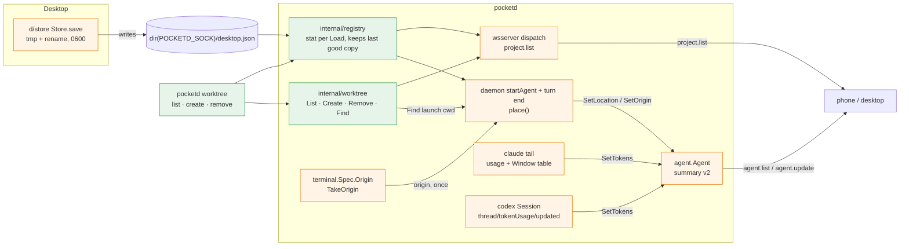

# Registry and Worktrees Implementation Plan

> **For Claude:** REQUIRED SUB-SKILL: Use /implement to execute this plan task-by-task.

**Goal:** pocketd learns the desktop's Projects. It lists them with their Worktrees over `project.list` (cap `registry.v1`), creates and removes Worktrees through `pocketd worktree`, and tells every client where each agent works and how full its context is (AgentSummary v2, cap `summary.v2`).

**Base:** main 5091a01. Design: `docs/designs/2026-09-30-registry-worktrees.md` (written at f8f7293; every anchor below was re-checked at 5091a01).

**Toolset** (paths relative to the repo root; `P path:L` cites a line at 5091a01):
- pocketd, one package: `cd packages/pocketd && env -u POCKETD_SOCK go test -race -count=1 ./internal/<pkg>`
- pocketd, full (every PR boundary): `cd packages/pocketd && env -u POCKETD_SOCK go vet ./... && env -u POCKETD_SOCK go test -race -count=1 ./...`
- Goldens: `cd packages/pocketd && env -u POCKETD_SOCK go test ./internal/proto -update`, then the protocol test.
- Protocol (TS): `pnpm --filter @pocket/protocol test` (runs `tsc -b && node --test test/`; it decodes every golden with `onExcessProperty: "error"`).
- Desktop: `cd packages/desktop && cargo test -p store`; at PR 1's end also `cargo build --workspace`, `cargo clippy --workspace --all-targets` (no new warnings) and `cargo test --workspace`.
- Every command that runs pocketd or its tests starts with `env -u POCKETD_SOCK`. A Pocket Terminal exports it, and a test must never reach the owner's pocketd.
- The shell is fish. Multi-line checks are written as bash scripts and run with `bash <file>`.

**UX override (roadmap §7.1).** E05 only ships the fields. Whoever renders a notification builds this text:

| UX section | Spec says | Winning decision | Text to build |
|---|---|---|---|
| UXD §3.13, §6 notifications | Subtitle "{project} · {worktree}" | D30 | No subtitle. Body line 1: "{project} · {worktree}"; line 2: the ask, ≤240 chars. Actions on permission asks only: "Allow" · "Deny and stop" |

**Scratch pocketd rules (roadmap §7):**
- Every Pocket Terminal exports `POCKETD_SOCK`, and the desktop reads it first (P d/daemon/src/daemon.rs:43-51). An agent that runs capture or e2e inside a Pocket Terminal would therefore hit the owner's pocketd, and after E03 that desktop is observe-only (D20).
- Tests and capture start a scratch pocketd with their own `POCKET_HOME`, `POCKETD_SOCK` and port, and point the desktop at it.
- Never restart the production pocketd from a plan. Until E09 lands, a restart kills every PTY, the implementing agent's included. Batch restarts and leave them to the owner.

**Other roadmap §7 rules:**
- Protocol. Changes land in packages/protocol and pd/internal/proto together, with goldens, behind a cap, in lane P only.
- Security. Every new WS / ops handler adds a scope-matrix row. E03+ PRs touching dispatch run the red-team script (NFR S-9). The script is `scripts/red-team.sh`; it arrives with E03 PR5.

**Read first:**
- `CONTEXT.md`: **Project**, **Worktree**, **Session**, **Terminal**, **Agent**. Use these words in names, docs and messages.
- `docs/designs/2026-09-30-registry-worktrees.md` §5 (contract), §6 (data and state), §7 (failure modes). This plan builds exactly that.
- `packages/desktop/crates/store/src/store.rs:1-68`: `desktop.json`, the file pocketd will read. The desktop stays its only writer (D15).
- `packages/desktop/crates/git/src/git.rs:141-146` (Worktree order) and `:173-177` (remove with `--force`); `packages/desktop/crates/pocket/src/modals/new_session.rs:103-141` (name rules) and `:180-187` (copy default); `packages/desktop/crates/pocket/src/modals/form.rs:5-8` (default base). pocketd copies these rules, so the phone and CLI act like the desktop.
- `packages/pocketd/internal/proto/golden_test.go` and `packages/protocol/test/golden.test.mjs`: how a wire change is pinned on both sides.
- `packages/pocketd/internal/daemon/presence.go:36-51` (`startAgent`) and `daemon.go:112-115` (turn end): where an agent is placed.

**Assumptions** (settled; don't re-open):
- E02 PR1 is on main before PR 1 starts. Its contract, used here: `type Range struct{Min, Max int}`; `func Negotiate(client Range, clientCaps, serverCaps []string) (version int, caps []string, code string)`; `var ServerCaps = []string{"pair.v1"}` in `packages/pocketd/internal/proto` (find it with `grep -n 'var ServerCaps' packages/pocketd/internal/proto/*.go`); `NewErrorCode`. Re-anchor line numbers after E02 PR1 merges. If its hello changed, `p.hello()` in `wsserver_test.go` already sends the new one.
- The live checks (Tasks 1.5 and 3.6) pair the way E02's e2e test does: ops `pair.begin`, WS `pair` → `pair.ok`, then hello with that device token, `protocol` and `caps`. That needs E02 PR4 (wk1-3 in the schedule). Until it is on main, skip them and say so in the PR body.
- E03 PR2 brings `internal/peer`: `var Needs map[string]Scope` keyed `"ws:agent.list"`, `"ops:spawn"`…, scopes `Observe`, `Drive`, `Approve`, `Spawn`, `Own`, unknown verbs refused. Its matrix test is a table over `Needs`. Re-anchor line numbers after E03 PR2 merges. PR 1 does not wait for it (see Task 1.5); PR 2 does.
- The scope-matrix table is the one headed `| Surface | Verb | Needs | pty(T) |`. Today it sits in `docs/designs/2026-09-30-no-self-approval.md` §5; use wherever E03 PR2 left it (`grep -rln 'Surface | Verb | Needs' docs packages`).
- v2 fields are always sent. The caps only tell clients they exist (design decision 13). No `PROTOCOL_VERSION` bump.
- E05 only ever emits `origin: "desktop"`. E06 sets `terminal.Spec.Origin` to `phone`; E15 adds `agent:<id>`.
- `invalid_name` joins the protocol's error-code enum in E06 PR1, not here. `main_worktree` never crosses the wire.
- The desktop keeps its own Worktree code (`d/git`, the copy step) until E06 PR4. Its overwrite bug stays until then.
- CLI limitation: without `--project`, the CLI finds the Project whose folder or worktrees folder is a prefix of the cwd. It doesn't resolve symlinks. So a Worktree outside that folder, or a cwd reached through `/tmp` when `/private/tmp/…` is registered, gets `Unknown project`. Pass `--project` there.
- PR 1 and PR 3 change goldens. Run them one at a time with other golden PRs.
- PR 1 is lane P's atomic exception: it touches `d/store` and pocketd together. Lane C stays out of `d/store` until it merges.
- Git in tests runs with `GIT_CONFIG_GLOBAL=/dev/null GIT_CONFIG_NOSYSTEM=1` and a fixed author, so the owner's git config can't change results. The packages whose code under test runs git (`internal/worktree`, `cmd/pocketd`) set them in `TestMain`; the daemon tests only run git through `gitIn`, which sets them per command. macOS temp dirs sit behind `/var` → `/private/var`, and git reports real paths, so tests `filepath.EvalSymlinks` their temp dirs.
- An agent outside every registered Project has no `project`, `worktree`, `branch` or `mainWorktree`. Clients show it by `basename(cwd)` (UXP §4.2 fallback), so D30's body line 1 is `basename(cwd)` alone. The desktop does the same with its transient Project (P packages/desktop/crates/project/src/project.rs adds the raw terminal cwd). Placing it in pocketd was not chosen: the fields mean "registered".
- pocketd is macOS-only already: `internal/proc` has only `proc_darwin.go`, so `GOOS=linux go vet ./...` fails at 5091a01. `born` (Task 1.4) reads darwin's `Birthtimespec` and adds no new platform limit.
- CLAUDE.md: no comments unless the WHY is hidden. Keep the doc comments this plan gives; add no others.

## Architecture



Green is new, orange is changed. The desktop saves `desktop.json` safely: it writes a temp file, then renames it, owner-only. pocketd reads that file on demand. It checks the file's time and size on each call and keeps the last good copy when the file is broken. `internal/worktree` runs `git` to list, create and remove Worktrees. The `project.list` verb and the `pocketd worktree` CLI both use it. The CLI runs inside its own process, with no socket verb. When an agent starts, and again after each turn, the daemon places it: it finds the Project and Worktree of the Terminal's launch folder by reading `.git` files. It also reads token use from claude's transcript and codex's notifications. All of it lands in `AgentSummary`.

## Why this approach

Each line is design §10's decision, and what was rejected. All are marked "PO-decided — review" there.

1. Claude's context window comes from a per-model table in pocketd. Claude only reports the window to its statusLine, so we can't read it. Rejected: injecting a statusLine (it edits claude's config and replaces the owner's), a fixed 200k (wrong for 1M models), `CLAUDE_CODE_MAX_CONTEXT_TOKENS` (only works with compaction off).
2. Codex's window is what codex reports in `thread/tokenUsage/updated`. Rejected: a codex model table (the value is already sent), `total.totalTokens` (it adds up every turn; it isn't how full the context is).
3. Claude's `tokensUsed` is input + cache-creation + cache-read of the latest main-chain answer. That is claude's own `total_input_tokens`. Rejected: the result line's usage (a per-turn sum), counting output tokens (claude's meter leaves them out).
4. pocketd reads `desktop.json` next to its socket, as the desktop does. Rejected: `POCKET_HOME` (it would read another file than the desktop writes once `POCKETD_SOCK` is set).
5. The file is checked on each read, with no watcher and no timer. Rejected: fsnotify (a new dependency and goroutine for a file that changes a few times a day), a poll timer (NFR P-7).
6. The desktop saves with rename but no fsync, on the UI thread as today. Rejected: fsync (milliseconds of UI-thread IO per save, only for a power loss mid-save), a background save (six call sites for no visible gain).
7. `worktree.List` ships in PR 1, because `project.list` needs Worktrees. Rejected: `project.list` without Worktrees until PR 2 (the phone would need a second cap).
8. `project.list` runs `git worktree list` on every call. Rejected: a cache (it must be cleared by every `git worktree add`, from anywhere), reading `.git/worktrees` files (git already parses them, prune state included).
9. A registered folder that is gone is left out of `project.list`. Rejected: listing it with no Worktrees (the phone would offer a Project it can't start in).
10. AgentSummary names the Project and Worktree and adds a `mainWorktree` flag. Every screen shows names, and "is this the main one" can't be told from a custom name. Rejected: paths (every client would need `project.list` to draw a row), a nested object (breaks `update()`'s `==` check), leaving `worktree` out for main (breaks "{project} · {worktree}").
11. The place comes from the Terminal's launch folder, read from files, and is refreshed after each turn. Rejected: the agent's live cwd (the Session would move when the agent `cd`s), running `git` in `startAgent` (a process per agent start).
12. `origin` uses the control-plane values and defaults to `desktop`. It rides on `terminal.Spec.Origin`, and only the Terminal's first agent takes it. Rejected: a new `terminal` value (not in the enum), giving it to every later agent in that Terminal (the owner typed those).
13. v2 fields are always sent; the cap only announces them. Rejected: a summary per connection by cap (breaks the hub's marshal-once fan-out).
14. The CLI runs in its own process, not over the ops socket. It works with pocketd down and gives agents in a Terminal no new verb. Rejected: an ops `worktree.*` verb (a new privileged surface, for callers that already have `git`).
15. The copy set is the repo's copy list, else the root `.env*` files, plus the lines of `.worktreeinclude`. Rejected: `.worktreeinclude` replacing the list (drops the owner's settings), copying folders (the desktop never did).
16. `remove` uses `--force`, like the desktop; its delete prompt already warns. Rejected: refusing a Worktree with changes (the CLI would differ from the desktop).
17. New codes `invalid_name` and `main_worktree`. Rejected: folding them into `spawn_failed` (the phone shows its inline name error only for a name code).
18. No `PROTOCOL_VERSION` bump. Rejected: bumping to 4 (old phones would be refused for fields they can ignore).

## Tasks at a glance

**PR 1: Registry: atomic desktop.json, pocketd reader, `project.list` (`registry.v1`).** The desktop saves safely; pocketd reads the file and answers `project.list`.

| Task | Description | Main files | Risk |
|---|---|---|---|
| 1.1 | The desktop saves `desktop.json` with one rename, owner-only | `d/store/src/store.rs` | Low: same content, safer write |
| 1.2 | pocketd reads `desktop.json` on demand and keeps the last good copy | `internal/registry/registry.go` | Low |
| 1.3 | `project.list` on the wire: Go types, goldens, TS schema, cap | `internal/proto/messages.go`, `packages/protocol/src/messages.ts` | Medium: goldens; waits on E02 PR1 |
| 1.4 | List a Project's Worktrees: main first, then oldest | `internal/worktree/list.go` | Low |
| 1.5 | Answer `project.list` over WS; scope row; red-team; live check | `internal/wsserver/wsserver.go`, `cmd/pocketd/serve.go` | Medium: new dispatch verb |

**PR 2: `internal/worktree` create/remove + `pocketd worktree` CLI.** Create and remove Worktrees like the desktop does, from a terminal. No wire change.

| Task | Description | Main files | Risk |
|---|---|---|---|
| 2.1 | Name rules, taken names, the Worktrees folder, error codes | `internal/worktree/create.go` | Low |
| 2.2 | Copy files into a new Worktree without overwriting or leaving the Project | `internal/worktree/copy.go` | Medium: file safety |
| 2.3 | Create and Remove | `internal/worktree/create.go` | Medium: runs git writes |
| 2.4 | `pocketd worktree list/create/remove`; scope-matrix row; scratch check | `cmd/pocketd/worktree.go`, `cmd/pocketd/main.go` | Low |

**PR 3: AgentSummary v2 (`summary.v2`).** Each agent reports its Project, Worktree, branch, context use and origin.

| Task | Description | Main files | Risk |
|---|---|---|---|
| 3.1 | v2 fields on the wire: Go, goldens, TS, cap | `internal/proto/proto.go`, `packages/protocol/src/timeline.ts` | Medium: goldens |
| 3.2 | The agent holds place, tokens and origin; a Terminal carries its origin | `internal/agent/agent.go`, `internal/terminal/terminal.go` | Low |
| 3.3 | Find a folder's checkout and Project from `.git` files | `internal/worktree/locate.go` | Medium: git file layout |
| 3.4 | Claude: tokens from the transcript, window from a model table | `internal/claude/window.go` | Low: the table ages |
| 3.5 | Codex: tokens and window from `thread/tokenUsage/updated` | `internal/codex/session.go` | Low |
| 3.6 | The daemon places agents at start and turn end, and passes tokens on; live check | `internal/daemon/presence.go`, `daemon.go` | Medium: hot path per turn |

---

## PR 1: Registry: atomic desktop.json, pocketd reader, `project.list` (`registry.v1`)

**Scope:** `Store::save` becomes a temp-file-and-rename, mode 0600. New `internal/registry` reads the file. New `internal/worktree` gets `List` and `Projects` only. `project.list` works over WS, advertised by `registry.v1`. No Worktree writes and no summary change here.
**Depends on:** E02 PR1 (caps and `Negotiate`). This deviates from roadmap §4, which lists `E05 PR1 | —`: the `registry.v1` cap test needs E02's `ServerCaps` and `Negotiate`. Also E01 PR5 (Task 1.1 replaces its `store::write`). The schedule is unaffected (E02 PR1 and E01 PR5 land wk1, E05 wk4). E03 PR2 is optional; see Task 1.5. The live check needs E02 PR4.
**Done when:** the pocketd full line, the protocol test and the desktop lines from Toolset are green, and the live check in Task 1.5 prints the scratch Project.

### Task 1.1: Atomic, owner-only `desktop.json`

**What & why:** The desktop writes `desktop.json` in place today, so a crash mid-write can cut it short, and the file is world-readable (0644). It now writes a temp file and renames it, mode 0600. This comes first because pocketd is about to read the file while the desktop writes it.

**Files:**
- Modify: `packages/desktop/crates/store/src/store.rs`: E01 PR5's free `write` (after `impl Store`, 5091a01 `:68`)
- Test: `packages/desktop/crates/store/src/store.rs` (`mod tests`, append after the last test)

**Context:** `Store::load` reads `home/desktop.json` (P packages/desktop/crates/store/src/store.rs:31-36). `home` is the folder of pocketd's socket. `save` ignores errors, as it does today. A rename within one folder replaces the file in one step, so a reader sees the old file or the new one, never half. `OpenOptions::mode` only applies when the file is created, so an old `.tmp` left at 0644 needs `set_permissions` too.

E01 PR5 lands first (roadmap §2 wk1). It splits `save` into `encode` plus a free `write`, which `save_soon` calls on the background executor while `save` still runs on the UI thread. So the atomic write goes into `write`, and both paths get it. A process-wide lock keeps the two from sharing `desktop.json.tmp` at once. Design decision 6's "on the UI thread" is superseded by E01's background write.

**Step 1: Write the failing tests**

Append inside `mod tests`, after the last test. The first proves a save is 0600 and leaves no temp file. The second proves a 0644 file and a stale 0644 temp file both end up 0600.

```rust
    fn mode(path: &Path) -> u32 {
        use std::os::unix::fs::PermissionsExt;
        std::fs::metadata(path).unwrap().permissions().mode() & 0o777
    }

    #[test]
    fn save_writes_desktop_json_owner_only_and_leaves_no_temp_file() {
        let dir = std::env::temp_dir().join(format!("pocket-store-private-{}", std::process::id()));
        let _ = std::fs::remove_dir_all(&dir);
        std::fs::create_dir_all(&dir).unwrap();
        let mut s = Store::load(&dir);
        s.projects.push("/w".into());
        s.save();
        assert_eq!(mode(&dir.join("desktop.json")), 0o600);
        assert!(!dir.join("desktop.json.tmp").exists());
        assert_eq!(Store::load(&dir).projects, ["/w"]);
        std::fs::remove_dir_all(&dir).unwrap();
    }

    #[test]
    fn save_makes_a_shared_desktop_json_and_a_stale_temp_file_owner_only() {
        use std::os::unix::fs::PermissionsExt;
        let dir = std::env::temp_dir().join(format!("pocket-store-shared-{}", std::process::id()));
        let _ = std::fs::remove_dir_all(&dir);
        std::fs::create_dir_all(&dir).unwrap();
        for name in ["desktop.json", "desktop.json.tmp"] {
            std::fs::write(dir.join(name), "{}").unwrap();
            std::fs::set_permissions(dir.join(name), std::fs::Permissions::from_mode(0o644)).unwrap();
        }
        Store::load(&dir).save();
        assert_eq!(mode(&dir.join("desktop.json")), 0o600);
        assert!(!dir.join("desktop.json.tmp").exists());
        std::fs::remove_dir_all(&dir).unwrap();
    }
```

**Step 2: Run the tests to verify they fail**

Run: `cd packages/desktop && cargo test -p store`
Expected: FAIL: both new tests panic with `assertion `left == right` failed` / `left: 420` / `right: 384` (0o644 against 0o600).

**Step 3: Write the implementation**

Replace E01 PR5's `write` (after `impl Store`) with:

```rust
/// Replaces `path` in one rename, owner-only, so pocketd never reads half a file.
pub fn write(path: &Path, raw: &[u8]) {
    static WRITING: std::sync::Mutex<()> = std::sync::Mutex::new(());
    let _held = WRITING.lock();
    let _ = write_private(path, raw);
}

fn write_private(path: &Path, raw: &[u8]) -> std::io::Result<()> {
    use std::io::Write;
    use std::os::unix::fs::{OpenOptionsExt, PermissionsExt};
    let tmp = path.with_extension("json.tmp");
    let mut f = std::fs::OpenOptions::new().write(true).create(true).truncate(true).mode(0o600).open(&tmp)?;
    f.set_permissions(std::fs::Permissions::from_mode(0o600))?;
    f.write_all(raw)?;
    std::fs::rename(&tmp, path)
}
```

**Step 4: Run the tests to verify they pass**

Run: `cd packages/desktop && cargo test -p store && cargo clippy -p store --all-targets`
Expected: PASS (`test result: ok. 6 passed`, E01 PR5's 4 plus these 2); clippy prints no warnings.

### Task 1.2: `internal/registry` reads `desktop.json`

**What & why:** pocketd gets a read-only view of the desktop's Projects. It re-reads only when the file's time or size changed, and keeps the last good copy if the file is broken. Everything later in this plan reads Projects through it.

**Files:**
- Create: `packages/pocketd/internal/registry/registry.go`
- Test: `packages/pocketd/internal/registry/registry_test.go`

**Context:** The desktop writes `desktop.json` next to the socket it talks to (P packages/desktop/crates/store/src/store.rs:17), and `config.Sock()` is pocketd's socket path, honouring `POCKETD_SOCK`. Only the keys pocketd needs are decoded; `color`, `collapsed` and future keys are ignored. A failed parse logs once per change and is retried on every `Load` until it parses, so a fix is picked up even when it has the same time and size. There is no watcher and no timer (NFR P-7).

**Step 1: Write the failing tests**

Each test proves one line of design §6: fields load and unknown keys are ignored; a new time reloads; a broken file keeps the last good copy until fixed; a missing file is empty; the path follows the socket; a Project's name is its repo name, else its folder.

```go
package registry

import (
	"os"
	"path/filepath"
	"reflect"
	"testing"
	"time"
)

func write(t *testing.T, path, body string, mtime time.Time) {
	t.Helper()
	if err := os.WriteFile(path, []byte(body), 0o600); err != nil {
		t.Fatal(err)
	}
	if err := os.Chtimes(path, mtime, mtime); err != nil {
		t.Fatal(err)
	}
}

func TestADesktopJSONLoadsAndItsUnknownKeysAreIgnored(t *testing.T) {
	path := filepath.Join(t.TempDir(), "desktop.json")
	write(t, path, `{"projects":["/w/pocket"],"repos":{"/w/pocket":{"name":"Pocket","color":1,"base":"dev","worktrees":"/wt","setup":"make","copy":[".env"]}},"collapsed":["/w/pocket"],"sounds":{"done":false}}`, time.Now())
	want := File{Projects: []string{"/w/pocket"}, Repos: map[string]Repo{"/w/pocket": {Name: "Pocket", Base: "dev", Worktrees: "/wt", Setup: "make", Copy: []string{".env"}}}}
	if got := New(path).Load(); !reflect.DeepEqual(got, want) {
		t.Fatalf("got %+v", got)
	}
}

func TestARewriteWithANewMtimeReloads(t *testing.T) {
	path := filepath.Join(t.TempDir(), "desktop.json")
	at := time.Now()
	write(t, path, `{"projects":["/a"]}`, at)
	r := New(path)
	r.Load()
	write(t, path, `{"projects":["/b"]}`, at.Add(time.Second))
	if got := r.Load().Projects; !reflect.DeepEqual(got, []string{"/b"}) {
		t.Fatalf("got %v", got)
	}
}

func TestABrokenFileKeepsTheLastGoodCopyUntilItIsFixed(t *testing.T) {
	path := filepath.Join(t.TempDir(), "desktop.json")
	at := time.Now()
	write(t, path, `{"projects":["/a"]}`, at)
	r := New(path)
	r.Load()
	write(t, path, `{"projects":["/b"]]`, at.Add(time.Second))
	if got := r.Load().Projects; !reflect.DeepEqual(got, []string{"/a"}) {
		t.Fatalf("broken: got %v", got)
	}
	write(t, path, `{"projects":["/c"]}`, at.Add(time.Second))
	if got := r.Load().Projects; !reflect.DeepEqual(got, []string{"/c"}) {
		t.Fatalf("fixed: got %v", got)
	}
}

func TestAMissingFileIsAnEmptyRegistry(t *testing.T) {
	if got := New(filepath.Join(t.TempDir(), "desktop.json")).Load(); got.Projects != nil || got.Repos != nil {
		t.Fatalf("got %+v", got)
	}
}

func TestTheFileSitsNextToTheSocket(t *testing.T) {
	t.Setenv("POCKETD_SOCK", "/tmp/scratch/pocketd.sock")
	if got := Path(); got != "/tmp/scratch/desktop.json" {
		t.Fatal(got)
	}
}

func TestAProjectIsNamedByItsRepoElseItsFolder(t *testing.T) {
	f := File{Repos: map[string]Repo{"/w/pocket": {Name: "Pocket"}}}
	if a, b := f.Name("/w/pocket"), f.Name("/w/other"); a != "Pocket" || b != "other" {
		t.Fatal(a, b)
	}
}
```

**Step 2: Run the tests to verify they fail**

Run: `cd packages/pocketd && env -u POCKETD_SOCK go test -count=1 ./internal/registry`
Expected: FAIL to build: `undefined: File`, `undefined: Repo`, `undefined: New`, `undefined: Path`.

**Step 3: Write the implementation**

```go
// Package registry reads the Projects the desktop keeps in desktop.json. The
// desktop is the file's only writer (D15).
package registry

import (
	"encoding/json"
	"log"
	"os"
	"path/filepath"
	"sync"

	"pocketd/internal/config"
)

type Repo struct {
	Name      string   `json:"name"`
	Base      string   `json:"base"`
	Worktrees string   `json:"worktrees"`
	Setup     string   `json:"setup"`
	Copy      []string `json:"copy"`
}

type File struct {
	Projects []string        `json:"projects"`
	Repos    map[string]Repo `json:"repos"`
}

// Path is where the desktop writes desktop.json: next to the socket it talks to.
func Path() string { return filepath.Join(filepath.Dir(config.Sock()), "desktop.json") }

// Name is how clients show project.
func (f File) Name(project string) string {
	if n := f.Repos[project].Name; n != "" {
		return n
	}
	return filepath.Base(project)
}

type stamp struct{ mtime, size int64 }

type Registry struct {
	path string

	mu     sync.Mutex
	seen   stamp
	good   File
	broken bool
}

func New(path string) *Registry { return &Registry{path: path} }

// Load stats the file and re-reads it when it changed or the last read failed
// to parse. A broken file keeps the last good copy.
func (r *Registry) Load() File {
	r.mu.Lock()
	defer r.mu.Unlock()
	fi, err := os.Stat(r.path)
	if err != nil {
		r.seen, r.good, r.broken = stamp{}, File{}, false
		return r.good
	}
	now := stamp{fi.ModTime().UnixNano(), fi.Size()}
	if now == r.seen && !r.broken {
		return r.good
	}
	var f File
	raw, err := os.ReadFile(r.path)
	if err == nil {
		err = json.Unmarshal(raw, &f)
	}
	if err != nil {
		if now != r.seen || !r.broken {
			log.Printf("registry: %s: %v", r.path, err)
		}
		r.seen, r.broken = now, true
		return r.good
	}
	r.seen, r.good, r.broken = now, f, false
	return f
}
```

**Step 4: Run the tests to verify they pass**

Run: `cd packages/pocketd && env -u POCKETD_SOCK go test -race -count=1 ./internal/registry`
Expected: PASS (`ok  	pocketd/internal/registry`).

### Task 1.3: `project.list` on the wire, cap `registry.v1`

**What & why:** Add the `project.list` request and reply to both protocol copies (Go and TS), pin them with goldens, and advertise cap `registry.v1`. It comes before the handler so the handler's test can use the types.

**Files:**
- Modify: `packages/pocketd/internal/proto/messages.go:67` (`DecodeClient` case), insert after `:112` (after `NewAgentList`)
- Modify: the `ServerCaps` literal from E02 PR1 (`grep -n 'var ServerCaps' packages/pocketd/internal/proto/*.go`)
- Modify: `packages/pocketd/internal/proto/golden_test.go`: insert after `:57` (`"error"` entry), insert before `:117` (`` `null` `` reject)
- Create: `packages/pocketd/internal/proto/testdata/golden/client/project_list.json`
- Create (generated): `packages/pocketd/internal/proto/testdata/golden/server/project_list.json`
- Create: `packages/pocketd/internal/proto/registry_caps_test.go`
- Modify: `packages/protocol/src/messages.ts`: insert after `:2`, before `:34` (end of `ClientMessage`), before `:61` (end of `ServerMessage`)
- Modify: `packages/protocol/src/constants.ts`, append after `:4`

**Context:** `project.list {id}` carries nothing else, like `agent.list`, so it joins that `DecodeClient` case (P packages/pocketd/internal/proto/messages.go:67); a missing `id` is still malformed. The reply has `projects` in registry order. Each Worktree has `name` (folder name), `path`, `branch` (`""` when detached) and `isMain`. `NewProjectList` turns nil into `[]` so clients never see `null`. The server goldens are written by `-update`; the TS test decodes every golden and fails on any field the schema lacks.

**Step 1: Write the failing tests**

In `golden_test.go`, add this entry to `serverGolden` after the `"error"` line (57). It pins the reply's exact JSON, with a main and a detached Worktree:

```go
	"project_list": NewProjectList("p1", []Project{{Path: "/Users/me/dev/pocket", Name: "pocket", Worktrees: []Worktree{
		{Name: "pocket", Path: "/Users/me/dev/pocket", Branch: "main", IsMain: true},
		{Name: "calm-otter", Path: "/Users/me/.worktrees/pocket/calm-otter", Branch: ""},
	}}}),
```

In `TestDecodeClientRejects`, add before `` `null`, `` (line 117). It proves `id` is required:

```go
		`{"type":"project.list"}`,
```

Create `packages/pocketd/internal/proto/testdata/golden/client/project_list.json` (the request clients send):

```json
{"type":"project.list","id":"p1"}
```

Create `packages/pocketd/internal/proto/registry_caps_test.go`. It proves a client asking for `registry.v1` gets it. If E02's own `Negotiate` tests use another version range, use theirs.

```go
package proto

import (
	"slices"
	"testing"
)

func TestTheServerOffersTheRegistryCap(t *testing.T) {
	_, caps, code := Negotiate(Range{Min: 3, Max: 3}, []string{CapRegistry}, ServerCaps)
	if code != "" || !slices.Equal(caps, []string{CapRegistry}) {
		t.Fatalf("caps %v, code %q", caps, code)
	}
}
```

**Step 2: Run the tests to verify they fail**

Run: `cd packages/pocketd && env -u POCKETD_SOCK go test -count=1 ./internal/proto`
Expected: FAIL to build: `undefined: NewProjectList`, `undefined: Project`, `undefined: Worktree`, `undefined: CapRegistry`.

Run: `pnpm --filter @pocket/protocol test`
Expected: FAIL: `client/project_list.json` (the other goldens pass).

**Step 3: Write the implementation**

In `messages.go`, change line 67 to:

```go
	case m.Type == "agent.list", m.Type == "project.list":
```

After `NewAgentList` (line 112), add:

```go
type Worktree struct {
	Name   string `json:"name"`
	Path   string `json:"path"`
	Branch string `json:"branch"`
	IsMain bool   `json:"isMain"`
}

type Project struct {
	Path      string     `json:"path"`
	Name      string     `json:"name"`
	Worktrees []Worktree `json:"worktrees"`
}

type ProjectList struct {
	Type     string    `json:"type"`
	ID       string    `json:"id,omitempty"`
	Projects []Project `json:"projects"`
}

func NewProjectList(id string, projects []Project) ProjectList {
	if projects == nil {
		projects = []Project{}
	}
	return ProjectList{"project.list", id, projects}
}

const CapRegistry = "registry.v1"
```

Add `CapRegistry` to E02's `ServerCaps` literal, after the caps already there. E03 PR1's `CapScopes` and E04 PR2's `CapHost` land first (roadmap §2) and stay. With E02 alone that is:

```go
var ServerCaps = []string{"pair.v1", CapRegistry}
```

Write the server golden:

Run: `cd packages/pocketd && env -u POCKETD_SOCK go test ./internal/proto -update`

`testdata/golden/server/project_list.json` must now read exactly:

```json
{
  "type": "project.list",
  "id": "p1",
  "projects": [
    {
      "path": "/Users/me/dev/pocket",
      "name": "pocket",
      "worktrees": [
        {
          "name": "pocket",
          "path": "/Users/me/dev/pocket",
          "branch": "main",
          "isMain": true
        },
        {
          "name": "calm-otter",
          "path": "/Users/me/.worktrees/pocket/calm-otter",
          "branch": "",
          "isMain": false
        }
      ]
    }
  ]
}
```

In `packages/protocol/src/messages.ts`, after the import on line 2, add:

```ts
export const ProjectListRequest = Schema.Struct({ type: Schema.Literal("project.list"), id: Schema.String });
export const Worktree = Schema.Struct({ name: Schema.String, path: Schema.String, branch: Schema.String, isMain: Schema.Boolean });
export type Worktree = typeof Worktree.Type;
export const Project = Schema.Struct({ path: Schema.String, name: Schema.String, worktrees: Schema.Array(Worktree) });
export type Project = typeof Project.Type;
export const ProjectList = Schema.Struct({
  type: Schema.Literal("project.list"),
  id: Schema.optional(Schema.String),
  projects: Schema.Array(Project),
});
```

Add `ProjectListRequest,` as the last member of the `ClientMessage` union (before its `);` on line 34), and `ProjectList,` as the last member of the `ServerMessage` union (before its `);` on line 61).

Append to `packages/protocol/src/constants.ts`:

```ts
export const CAP_REGISTRY = "registry.v1";
```

**Step 4: Run the tests to verify they pass**

Run: `cd packages/pocketd && env -u POCKETD_SOCK go test -race -count=1 ./internal/proto`
Expected: PASS (`ok  	pocketd/internal/proto`).

Run: `pnpm --filter @pocket/protocol test`
Expected: PASS: every golden decodes, `client/project_list.json` and `server/project_list.json` included; `# fail 0`.

### Task 1.4: List a Project's Worktrees

**What & why:** `worktree.List` gives a Project's checkouts in the desktop's order: main first, then the other folders oldest first. `worktree.Projects` turns the registry into the `project.list` reply. It sits in PR 1 because `project.list` needs Worktrees (decision 7).

**Files:**
- Create: `packages/pocketd/internal/worktree/list.go`
- Test: `packages/pocketd/internal/worktree/list_test.go`

**Context:** `git worktree list --porcelain` prints the main checkout first, then the rest by path. The desktop sorts the rest by folder creation time (P packages/desktop/crates/git/src/git.rs:141-146); `born` reads the same macOS birth time. A registered folder that isn't a repo is its own main Worktree with branch `""`. A folder that is gone is left out (decision 9). No caching (decision 8). The test helpers `git` and `repo`, and `TestMain`, are reused by every later `worktree` test.

**Step 1: Write the failing tests**

The first proves main comes first and the rest keep creation order (zeta before alpha, so it isn't by name), and a detached one has branch `""`. The second covers a plain folder. The third proves a gone folder is skipped and the repo's name is used.

```go
package worktree

import (
	"os"
	"os/exec"
	"path/filepath"
	"reflect"
	"strings"
	"testing"

	"pocketd/internal/proto"
	"pocketd/internal/registry"
)

// TestMain pins git's config for the git the code under test runs itself, so
// the owner's hooks, templates or signing can't change results.
func TestMain(m *testing.M) {
	for k, v := range map[string]string{"GIT_CONFIG_GLOBAL": "/dev/null", "GIT_CONFIG_NOSYSTEM": "1",
		"GIT_AUTHOR_NAME": "t", "GIT_AUTHOR_EMAIL": "t@t", "GIT_COMMITTER_NAME": "t", "GIT_COMMITTER_EMAIL": "t@t"} {
		os.Setenv(k, v)
	}
	os.Exit(m.Run())
}

func git(t *testing.T, dir string, args ...string) string {
	t.Helper()
	cmd := exec.Command("git", append([]string{"-C", dir}, args...)...)
	cmd.Env = append(os.Environ(), "GIT_CONFIG_GLOBAL=/dev/null", "GIT_CONFIG_NOSYSTEM=1",
		"GIT_AUTHOR_NAME=t", "GIT_AUTHOR_EMAIL=t@t", "GIT_COMMITTER_NAME=t", "GIT_COMMITTER_EMAIL=t@t")
	out, err := cmd.CombinedOutput()
	if err != nil {
		t.Fatalf("git %v: %v\n%s", args, err, out)
	}
	return strings.TrimSpace(string(out))
}

// repo is a fresh repo named pocket on branch main, at its real path: git
// reports worktrees by real path, and macOS temp dirs sit behind /var -> /private/var.
func repo(t *testing.T) string {
	t.Helper()
	root, err := filepath.EvalSymlinks(t.TempDir())
	if err != nil {
		t.Fatal(err)
	}
	dir := filepath.Join(root, "pocket")
	if err := os.Mkdir(dir, 0o755); err != nil {
		t.Fatal(err)
	}
	git(t, dir, "init", "-q", "-b", "main")
	git(t, dir, "commit", "-q", "--allow-empty", "-m", "init")
	return dir
}

func TestMainComesFirstThenTheOldestWorktree(t *testing.T) {
	p := repo(t)
	zeta, alpha, loose := filepath.Join(p, "..", "zeta"), filepath.Join(p, "..", "alpha"), filepath.Join(p, "..", "loose")
	git(t, p, "worktree", "add", "-q", "-b", "zeta", zeta)
	git(t, p, "worktree", "add", "-q", "-b", "alpha", alpha)
	git(t, p, "worktree", "add", "-q", "--detach", loose)
	got, err := List(p)
	want := []Worktree{
		{Name: "pocket", Path: p, Branch: "main", Main: true},
		{Name: "zeta", Path: filepath.Clean(zeta), Branch: "zeta"},
		{Name: "alpha", Path: filepath.Clean(alpha), Branch: "alpha"},
		{Name: "loose", Path: filepath.Clean(loose)},
	}
	if err != nil || !reflect.DeepEqual(got, want) {
		t.Fatalf("got %+v, %v", got, err)
	}
}

func TestAFolderThatIsNotARepoIsItsOwnMainWorktree(t *testing.T) {
	dir := t.TempDir()
	got, err := List(dir)
	if want := []Worktree{{Name: filepath.Base(dir), Path: dir, Main: true}}; err != nil || !reflect.DeepEqual(got, want) {
		t.Fatalf("got %+v, %v", got, err)
	}
}

func TestProjectsLeaveOutAFolderThatIsGone(t *testing.T) {
	p := repo(t)
	f := registry.File{Projects: []string{filepath.Join(p, "..", "gone"), p}, Repos: map[string]registry.Repo{p: {Name: "Pocket"}}}
	want := []proto.Project{{Path: p, Name: "Pocket", Worktrees: []proto.Worktree{{Name: "pocket", Path: p, Branch: "main", IsMain: true}}}}
	if got := Projects(f); !reflect.DeepEqual(got, want) {
		t.Fatalf("got %+v", got)
	}
}
```

**Step 2: Run the tests to verify they fail**

Run: `cd packages/pocketd && env -u POCKETD_SOCK go test -count=1 ./internal/worktree`
Expected: FAIL to build: `undefined: Worktree`, `undefined: List`, `undefined: Projects`.

**Step 3: Write the implementation**

```go
// Package worktree lists, creates and removes a Project's Worktrees.
package worktree

import (
	"cmp"
	"os"
	"os/exec"
	"path/filepath"
	"slices"
	"strings"
	"syscall"

	"pocketd/internal/proto"
	"pocketd/internal/registry"
)

type Worktree struct {
	Name, Path, Branch string
	Main               bool
}

// List is project's checkouts: the main one, then the rest oldest folder
// first, as the desktop shows them (P d/git/src/git.rs:141-146). A folder that
// isn't a repo is its own main Worktree.
func List(project string) ([]Worktree, error) {
	if _, err := os.Stat(project); err != nil {
		return nil, err
	}
	out, err := exec.Command("git", "-C", project, "worktree", "list", "--porcelain").Output()
	if err != nil {
		return []Worktree{{Name: filepath.Base(project), Path: project, Main: true}}, nil
	}
	ws := parse(string(out))
	if len(ws) > 1 {
		slices.SortStableFunc(ws[1:], func(a, b Worktree) int { return cmp.Compare(born(a.Path), born(b.Path)) })
	}
	return ws, nil
}

func parse(porcelain string) []Worktree {
	var ws []Worktree
	for _, block := range strings.Split(strings.TrimSpace(porcelain), "\n\n") {
		var w Worktree
		for _, l := range strings.Split(block, "\n") {
			if p, ok := strings.CutPrefix(l, "worktree "); ok {
				w.Path, w.Name = p, filepath.Base(p)
			} else if b, ok := strings.CutPrefix(l, "branch "); ok {
				w.Branch = strings.TrimPrefix(b, "refs/heads/")
			}
		}
		if w.Path != "" {
			ws = append(ws, w)
		}
	}
	if len(ws) > 0 {
		ws[0].Main = true
	}
	return ws
}

func born(path string) int64 {
	var st syscall.Stat_t
	if syscall.Stat(path, &st) != nil {
		return 0
	}
	return st.Birthtimespec.Nano()
}

// Projects is the registry as clients see it. A folder that is gone is left out.
func Projects(f registry.File) []proto.Project {
	var ps []proto.Project
	for _, p := range f.Projects {
		ws, err := List(p)
		if err != nil {
			continue
		}
		pp := proto.Project{Path: p, Name: f.Name(p), Worktrees: make([]proto.Worktree, len(ws))}
		for i, w := range ws {
			pp.Worktrees[i] = proto.Worktree{Name: w.Name, Path: w.Path, Branch: w.Branch, IsMain: w.Main}
		}
		ps = append(ps, pp)
	}
	return ps
}
```

**Step 4: Run the tests to verify they pass**

Run: `cd packages/pocketd && env -u POCKETD_SOCK go test -race -count=1 ./internal/worktree`
Expected: PASS (`ok  	pocketd/internal/worktree`).

### Task 1.5: Answer `project.list` over WS

**What & why:** The WS server answers `project.list` from the registry, and `serve` wires it up. This is the step that makes PR 1 visible to clients, so it also carries the security work (scope row, red-team) and a live check on a scratch pocketd.

**Files:**
- Modify: `packages/pocketd/internal/wsserver/wsserver.go`: insert after `:34` (`Hub` field), after `:164` (`agent.list` case)
- Modify: `packages/pocketd/cmd/pocketd/serve.go`: imports (`:13-20` at 5091a01), insert before `:32` (`h := hub.New()`), the `&wsserver.Server{…}` literal (`:50` at 5091a01; E02 PR2 moves it into `reach.Listen`)
- Modify (only if `packages/pocketd/internal/peer` exists on main): its `Needs` map, next to `"ws:agent.list"`
- Modify: the scope-matrix table (see Assumptions)
- Test: `packages/pocketd/internal/wsserver/wsserver_test.go` (append after `:318`)

**Context:** `dispatch` handles one verb per case (P packages/pocketd/internal/wsserver/wsserver.go:162-164). `Projects` is a func so the test can pass fixed data and `serve` can pass `worktree.Projects(reg.Load())`. The git calls run on the connection's goroutine, outside every lock (design §6). Scope is observe, like `agent.list` (D36). E03's `Needs` refuses unknown verbs, so once it's on main, `project.list` needs its row or it will be refused.

**Step 1: Write the failing tests**

Append to `wsserver_test.go`. The first proves a reply carries the registry's Projects and echoes `id`. The second proves an empty registry is `[]`, not `null`.

```go
func TestProjectListAnswersWithTheRegistry(t *testing.T) {
	projects := []proto.Project{{Path: "/w", Name: "w", Worktrees: []proto.Worktree{{Name: "w", Path: "/w", Branch: "main", IsMain: true}}}}
	_, _, p := setup(t, func(s *Server) { s.Projects = func() []proto.Project { return projects } })
	p.hello()
	p.send(`{"type":"project.list","id":"p"}`)
	m := p.recv()
	got, _ := json.Marshal(m["projects"])
	if m["type"] != "project.list" || m["id"] != "p" || string(got) != `[{"name":"w","path":"/w","worktrees":[{"branch":"main","isMain":true,"name":"w","path":"/w"}]}]` {
		t.Fatalf("%v", m)
	}
}

func TestAnEmptyRegistryListsNoProjects(t *testing.T) {
	_, _, p := setup(t, func(s *Server) { s.Projects = func() []proto.Project { return nil } })
	p.hello()
	p.send(`{"type":"project.list","id":"p"}`)
	if m := p.recv(); m["type"] != "project.list" || m["projects"] == nil || len(m["projects"].([]any)) != 0 {
		t.Fatalf("%v", m)
	}
}
```

**Step 2: Run the tests to verify they fail**

Run: `cd packages/pocketd && env -u POCKETD_SOCK go test -count=1 ./internal/wsserver`
Expected: FAIL to build: `s.Projects undefined (type *Server has no field or method Projects)`.

**Step 3: Write the implementation**

In `wsserver.go`, after `Hub      *hub.Hub` (line 34), add:

```go
	Projects func() []proto.Project
```

After the `agent.list` case (line 164), add:

```go
	case "project.list":
		c.send(proto.NewProjectList(m.ID, c.s.Projects()))
		return nil
```

In `serve.go`, edit only what PR 1 needs; E02 PR2 rewrote the listen lines, so don't restate them. Add these to the `pocketd/internal/…` import group, keeping it sorted (`proto` and `registry` after `ops`, `worktree` after `terminal`; skip any already there):

```go
	"pocketd/internal/proto"
	"pocketd/internal/registry"
	"pocketd/internal/worktree"
```

Before `h := hub.New()` (line 32 at 5091a01), add:

```go
	reg := registry.New(registry.Path())
```

Find the server literal: `grep -n 'wsserver.Server{' cmd/pocketd/serve.go`. Keep every field it has and add one, before its closing `}`:

```go
Projects: func() []proto.Project { return worktree.Projects(reg.Load()) },
```

For a one-line literal that is `…, Hub: h, Projects: func() []proto.Project { return worktree.Projects(reg.Load()) }}`; for a multi-line one, its own line (gofmt aligns it).

Scope. If `packages/pocketd/internal/peer` exists on main, add this row to `Needs`, next to `"ws:agent.list"` (gofmt aligns it):

```go
"ws:project.list": Observe,
```

If it doesn't exist yet, write in the PR body: "E03 PR2: add `ws:project.list` → observe to `Needs`."

Either way, add `project.list` to the observe row of the scope-matrix table, so it reads:

```
| ws | `agent.list`, `agent.timeline`, `agent.view`, `agent.seen`, `project.list` | observe | allowed |
```

**Step 4: Run the tests to verify they pass**

Run: `cd packages/pocketd && env -u POCKETD_SOCK go vet ./... && env -u POCKETD_SOCK go test -race -count=1 ./...`
Expected: PASS: every package `ok`, e2e included.

If `packages/pocketd/internal/peer` exists, its matrix test must pass as part of that run.

If `scripts/red-team.sh` exists (E03 PR5), run it. It starts its own scratch pocketd.
Run: `bash scripts/red-team.sh`
Expected: exits 0.

Run: `cd packages/desktop && cargo build --workspace && cargo clippy --workspace --all-targets && cargo test --workspace`
Expected: PASS, no new warnings.

**Step 5: Live check on a scratch pocketd**

The check pairs like E02's e2e test (E02 plan Task 4.2 `pair`, Task 4.4 `pair.begin`; E02 design §5.1): an ops `pair.begin` gives a code, a WS `pair` turns it into a device token, and a fresh WS says hello with it. That hello works before and after E03 (E03 design E03-10: TCP needs a token). It needs E02 PR4 on main. Check first:

Run (from the repo root): `grep -lq 'pair.begin' packages/pocketd/internal/ops/*.go; and echo ready`
Expected: `ready`. If nothing prints, skip this step and write in the PR body: "live check blocked: needs E02 PR4".

This starts a scratch pocketd with its own `POCKET_HOME`, `POCKETD_SOCK` and port 4599, and a scratch `desktop.json` whose Worktrees folder is scratch too. Never point it at the owner's. `claude` is a symlink to `/bin/sleep`, so no paid turn runs. `config.json` still carries a token, because `config.Load` requires one until E03 PR1, which migrates it; the check never uses it. Check that port 4599 is free: `lsof -iTCP:4599 -sTCP:LISTEN` prints nothing. Save this as `/private/tmp/pk-live.sh`:

```bash
#!/bin/bash
# Scratch pocketd: own POCKET_HOME, POCKETD_SOCK and port. Never the owner's.
set -eu
L=/private/tmp/pk-live
rm -rf "$L"
mkdir -p "$L/home"
cleanup() {
	if [ -n "${SERVE:-}" ]; then
		kill "$SERVE" 2>/dev/null || true
		wait "$SERVE" 2>/dev/null || true
	fi
	pkill -f "$L/claude 600" || true
}
trap cleanup EXIT
(cd packages/pocketd && go build -o "$L/pocketd" ./cmd/pocketd)
export GIT_CONFIG_GLOBAL=/dev/null GIT_CONFIG_NOSYSTEM=1 GIT_AUTHOR_NAME=t GIT_AUTHOR_EMAIL=t@t GIT_COMMITTER_NAME=t GIT_COMMITTER_EMAIL=t@t
git init -q -b main "$L/pocket"
git -C "$L/pocket" commit -q --allow-empty -m init
git -C "$L/pocket" worktree add -q -b calm-otter "$L/calm-otter"
TOKEN=$(head -c 32 /dev/urandom | base64 | tr '+/' '-_' | tr -d '=')
printf '{"token":"%s","port":4599,"listen":"loopback"}' "$TOKEN" > "$L/home/config.json"
printf '{"projects":["%s/pocket"],"repos":{"%s/pocket":{"name":"Pocket","worktrees":"%s/wt"}}}' "$L" "$L" "$L" > "$L/home/desktop.json"
ln -s /bin/sleep "$L/claude"
cat > "$L/check.mjs" <<'JS'
import net from "node:net";
const L = "/private/tmp/pk-live";
const fail = (why) => {
  console.error("FAIL", why);
  process.exit(1);
};
setTimeout(() => fail("timed out after 10s"), 10_000).unref();

function ops() {
  const c = net.connect(`${L}/home/pocketd.sock`);
  const waiting = [];
  let buf = "";
  c.on("error", (e) => fail(`ops: ${e.message}`));
  c.on("data", (d) => {
    buf += d;
    for (let i; (i = buf.indexOf("\n")) >= 0; buf = buf.slice(i + 1)) {
      const m = JSON.parse(buf.slice(0, i));
      if (m.ev === "error" || m.ev === "pair.expired") fail(`ops: ${JSON.stringify(m)}`);
      waiting.shift()?.(m);
    }
  });
  return { send: (m) => c.write(JSON.stringify(m) + "\n"), next: () => new Promise((r) => waiting.push(r)), end: () => c.end() };
}

function ws() {
  const s = new WebSocket("ws://127.0.0.1:4599");
  const waiting = [];
  s.onclose = (e) => e.code === 1000 || fail(`ws closed ${e.code} ${e.reason}`);
  s.onmessage = (e) => {
    const m = JSON.parse(e.data);
    if (m.type === "error") fail(`ws error ${m.code ?? "-"}: ${m.message}`);
    const i = waiting.findIndex((x) => x.ok(m));
    if (i >= 0) waiting.splice(i, 1)[0].resolve(m);
  };
  const opened = new Promise((r) => (s.onopen = r));
  return {
    opened,
    send: (m) => s.send(JSON.stringify(m)),
    until: (ok) => new Promise((resolve) => waiting.push({ ok, resolve })),
    close: () => s.close(1000),
  };
}

const spawner = ops();
spawner.send({ op: "spawn", cmd: `${L}/claude`, args: ["600"], cwd: `${L}/calm-otter`, env: ["PATH=/bin:/usr/bin"], cols: 80, rows: 24 });
await spawner.next();

const owner = ops();
owner.send({ op: "pair.begin", text: "127.0.0.1:4599" });
const { pair } = await owner.next();
const pairing = ws();
await pairing.opened;
pairing.send({ type: "pair", id: "pr", code: pair.code, name: "live", platform: "ios", protocol: { min: 3, max: 3 } });
const { token } = await pairing.until((m) => m.type === "pair.ok");
owner.end();

const phone = ws();
await phone.opened;
phone.send({ type: "hello", id: "h", token, clientId: "live", protocolVersion: 3, protocol: { min: 3, max: 3 }, caps: ["registry.v1", "summary.v2"] });
await phone.until((m) => m.type === "hello.ok");
let agents = [];
while (agents.length === 0) {
  phone.send({ type: "agent.list", id: "a" });
  ({ agents } = await phone.until((m) => m.type === "agent.list" && m.id === "a"));
  if (agents.length === 0) await new Promise((r) => setTimeout(r, 200));
}
phone.send({ type: "project.list", id: "p1" });
const { projects } = await phone.until((m) => m.type === "project.list" && m.id === "p1");
const a = agents[0];
console.log("agent", a.project, a.worktree, a.branch, a.mainWorktree ?? false, a.origin);
console.log("projects", JSON.stringify(projects));
phone.close();
spawner.end();
process.exit(0);
JS
env -u POCKETD_SOCK POCKET_HOME="$L/home" POCKETD_SOCK="$L/home/pocketd.sock" "$L/pocketd" serve > "$L/serve.log" 2>&1 &
SERVE=$!
for _ in $(seq 50); do [ -S "$L/home/pocketd.sock" ] && break; sleep 0.1; done
if [ ! -S "$L/home/pocketd.sock" ]; then
	echo "FAIL pocketd did not start" >&2
	cat "$L/serve.log" >&2
	exit 1
fi
if ! node "$L/check.mjs"; then
	tail -20 "$L/serve.log" >&2
	exit 1
fi
```

Run (from the repo root): `bash /private/tmp/pk-live.sh`
Expected (PR 1: the agent has no v2 fields yet), exit 0:

```
agent undefined undefined undefined false undefined
projects [{"path":"/private/tmp/pk-live/pocket","name":"Pocket","worktrees":[{"name":"pocket","path":"/private/tmp/pk-live/pocket","branch":"main","isMain":true},{"name":"calm-otter","path":"/private/tmp/pk-live/calm-otter","branch":"calm-otter","isMain":false}]}]
```

Any `FAIL …` line exits 1 and names the cause: an ops or WS `error` (with its `code`), a close other than 1000 (with code and reason), or the 10 s timeout. The last 20 lines of `serve.log` follow it.

Then: `rm -rf /private/tmp/pk-live` (the script's own scratch folder; keep the script for Task 3.6).

---

## PR 2: `internal/worktree` create/remove + `pocketd worktree` CLI

**Scope:** Name rules, taken names, the Worktrees folder, the copy set, `Create`, `Add`, `Remove`, and the `pocketd worktree` CLI. The CLI runs in-process: it reads the registry and calls `internal/worktree`, and works with pocketd down. No wire change and no socket verb; E06 PR2 calls `Create` over WS later.
**Depends on:** E05 PR1 (`registry`, `worktree.List`), E03 PR2 (the scope matrix it adds a row to).
**Done when:** the pocketd full line is green, and the scratch check in Task 2.4 creates, lists and removes a Worktree.

### Task 2.1: Names, taken names, the Worktrees folder and error codes

**What & why:** Port the desktop's name rules so the phone (E06) and the CLI refuse the same names the desktop does, and add the codes E06 sends to clients. Everything that creates a Worktree checks these first, so they come first.

**Files:**
- Create: `packages/pocketd/internal/worktree/create.go`
- Test: `packages/pocketd/internal/worktree/create_test.go`

**Context:** The desktop's rules are at P packages/desktop/crates/pocket/src/modals/new_session.rs:103-141. A name is taken if a local branch or a folder in the Worktrees folder has it, ignoring case (APFS ignores case). A branch `a/b` takes `a`, because git can't then make branch `a`. Taken is checked before validity, as the desktop does. The Worktrees folder is `Repo.Worktrees`, else `~/.worktrees/<project name>`. `Containing` finds the Project for a folder: the registered folder or its Worktrees folder that holds it, deepest first. The CLI uses it when no `--project` is given. Codes: `unknown_project`, `unknown_worktree`, `worktree_exists` (FR 06-1), and new `invalid_name` and `main_worktree` (design §5.5). Messages match the desktop's strings.

**Step 1: Write the failing tests**

`registered` builds a one-Project registry and is reused by later tests. The tests prove: the name rules and their codes; taken = branches + folders; where Worktrees go; and which Project holds a folder.

```go
package worktree

import (
	"os"
	"path/filepath"
	"slices"
	"testing"

	"pocketd/internal/registry"
)

func registered(p string, r registry.Repo) registry.File {
	return registry.File{Projects: []string{p}, Repos: map[string]registry.Repo{p: r}}
}

func TestANameMustBeFreeAndValidForGit(t *testing.T) {
	taken := []string{"main", "Foo", "fix/login"}
	if err := Validate("fix-login_2.0", taken); err != nil {
		t.Fatal(err)
	}
	for _, name := range []string{"main", "foo", "fix"} {
		if err := Validate(name, taken); Code(err) != "worktree_exists" {
			t.Errorf("%q: %v", name, err)
		}
	}
	for _, name := range []string{"", "fix login", "fix/login", "-x", ".x", "x.", "a..b", "x.lock", "tên", "HEAD"} {
		if err := Validate(name, taken); Code(err) != "invalid_name" {
			t.Errorf("%q: %v", name, err)
		}
	}
}

func TestTakenNamesAreBranchesAndFolders(t *testing.T) {
	p := repo(t)
	git(t, p, "branch", "feat/x")
	dir := t.TempDir()
	os.Mkdir(filepath.Join(dir, "old"), 0o755)
	taken, err := Taken(p, dir)
	if err != nil || !slices.Contains(taken, "main") || !slices.Contains(taken, "feat/x") || !slices.Contains(taken, "old") {
		t.Fatalf("taken = %v, %v", taken, err)
	}
}

func TestWorktreesGoWhereTheRepoSaysElseUnderHome(t *testing.T) {
	home := t.TempDir()
	t.Setenv("HOME", home)
	for _, c := range []struct {
		repo registry.Repo
		want string
	}{
		{registry.Repo{Worktrees: "/wt"}, "/wt"},
		{registry.Repo{Name: "Pocket"}, filepath.Join(home, ".worktrees", "Pocket")},
		{registry.Repo{}, filepath.Join(home, ".worktrees", "pocket")},
	} {
		if got := Dir(registered("/w/pocket", c.repo), "/w/pocket"); got != c.want {
			t.Errorf("%+v: got %s", c.repo, got)
		}
	}
}

func TestTheDeepestRegisteredFolderContainsADir(t *testing.T) {
	f := registry.File{Projects: []string{"/w", "/w/pocket"}, Repos: map[string]registry.Repo{"/w/pocket": {Worktrees: "/wt/pocket"}}}
	for dir, want := range map[string]string{"/w/pocket/src": "/w/pocket", "/w/other": "/w", "/wt/pocket/calm-otter": "/w/pocket"} {
		if got, ok := Containing(f, dir); !ok || got != want {
			t.Errorf("%s: got %q", dir, got)
		}
	}
	if _, ok := Containing(f, "/elsewhere"); ok {
		t.Error("/elsewhere is in a project")
	}
}
```

**Step 2: Run the tests to verify they fail**

Run: `cd packages/pocketd && env -u POCKETD_SOCK go test -count=1 ./internal/worktree`
Expected: FAIL to build: `undefined: Validate`, `undefined: Code`, `undefined: Taken`, `undefined: Dir`, `undefined: Containing`.

**Step 3: Write the implementation**

```go
package worktree

import (
	"errors"
	"os"
	"os/exec"
	"path/filepath"
	"strings"

	"pocketd/internal/registry"
)

type codedError struct{ code, message string }

func (e *codedError) Error() string { return e.message }

func coded(code, message string) error { return &codedError{code, message} }

var (
	ErrUnknownProject  = coded("unknown_project", "Unknown project")
	ErrUnknownWorktree = coded("unknown_worktree", "Not a worktree of this project")
	ErrExists          = coded("worktree_exists", "A worktree or branch with this name already exists")
	ErrInvalidName     = coded("invalid_name", "Use letters, digits, - _ or .")
	ErrMain            = coded("main_worktree", "The main worktree can't be removed")
)

// Code is err's wire code, or "" when it has none.
func Code(err error) string {
	var c *codedError
	if errors.As(err, &c) {
		return c.code
	}
	return ""
}

// Validate is the desktop's name rule (P pk/modals/new_session.rs:103-141).
// Taken is checked first, case-insensitively as APFS is; a branch a/b owns a.
func Validate(name string, taken []string) error {
	for _, t := range taken {
		if first, _, _ := strings.Cut(t, "/"); strings.EqualFold(first, name) {
			return ErrExists
		}
	}
	safe := func(r rune) bool {
		return 'a' <= r && r <= 'z' || 'A' <= r && r <= 'Z' || '0' <= r && r <= '9' || strings.ContainsRune("-_.", r)
	}
	if name == "" || name == "HEAD" || strings.ContainsFunc(name, func(r rune) bool { return !safe(r) }) ||
		strings.HasPrefix(name, "-") || strings.HasPrefix(name, ".") || strings.HasSuffix(name, ".") ||
		strings.HasSuffix(name, ".lock") || strings.Contains(name, "..") {
		return ErrInvalidName
	}
	return nil
}

// Taken is every name a new Worktree of project can't have: its branches and
// the folders already in dir.
func Taken(project, dir string) ([]string, error) {
	taken, err := branches(project)
	if err != nil {
		return nil, err
	}
	entries, _ := os.ReadDir(dir)
	for _, e := range entries {
		taken = append(taken, e.Name())
	}
	return taken, nil
}

// branches is project's local branches, most recently committed first.
func branches(project string) ([]string, error) {
	out, err := exec.Command("git", "-C", project, "for-each-ref", "--sort=-committerdate", "--format=%(refname:short)", "refs/heads").Output()
	return strings.Fields(string(out)), err
}

// Dir is the folder project's new Worktrees go in.
func Dir(f registry.File, project string) string {
	if d := f.Repos[project].Worktrees; d != "" {
		return d
	}
	home, _ := os.UserHomeDir()
	return filepath.Join(home, ".worktrees", f.Name(project))
}

// Containing is the registered Project whose folder or worktrees folder holds
// dir; the deepest wins.
func Containing(f registry.File, dir string) (string, bool) {
	best, depth := "", 0
	for _, p := range f.Projects {
		for _, root := range []string{p, Dir(f, p)} {
			if (dir == root || strings.HasPrefix(dir, root+"/")) && len(root) > depth {
				best, depth = p, len(root)
			}
		}
	}
	return best, depth > 0
}
```

**Step 4: Run the tests to verify they pass**

Run: `cd packages/pocketd && env -u POCKETD_SOCK go test -race -count=1 ./internal/worktree`
Expected: PASS (`ok  	pocketd/internal/worktree`).

### Task 2.2: The copy set

**What & why:** A new Worktree gets the Project's local files (like `.env`) copied in. Unlike the desktop's copy today, it never overwrites, and never follows a symlink or a path out of the Project (D35). It is separate from `Create` so `--no-copy` can skip it.

**Files:**
- Create: `packages/pocketd/internal/worktree/copy.go`
- Test: `packages/pocketd/internal/worktree/copy_test.go`

**Context:** The copy set is `Repo.Copy`, else the root `.env*` files (the desktop's default, P packages/desktop/crates/pocket/src/modals/new_session.rs:180-187), plus each non-blank, non-`#` line of `<project>/.worktreeinclude` (decision 15). Entries are cleaned and de-duplicated. Each must be relative, stay inside the Project, and be a regular file (checked with `Lstat`, so symlinks and folders are skipped). A symlinked folder on the way out is caught by `inside`, which resolves symlinks. On the Worktree side it is checked on the nearest folder that already exists, before `MkdirAll`, so a symlinked folder in the Worktree can't make it create folders outside. The target is opened with `O_EXCL`, so an existing file is kept. The file's mode is copied. A skip is returned as `"{rel}: {reason}"`, never as an error.

**Step 1: Write the failing tests**

The first proves which files are in the set, in which order. The second proves each skip reason, that an existing file is untouched, and that the mode is kept. The third proves a symlinked folder in the new Worktree gets nothing written through it, not even a folder.

```go
package worktree

import (
	"os"
	"path/filepath"
	"reflect"
	"testing"

	"pocketd/internal/registry"
)

func TestTheCopySetIsTheRepoListElseRootEnvFilesPlusWorktreeinclude(t *testing.T) {
	p := t.TempDir()
	for _, name := range []string{".env", ".env.local", "README.md"} {
		os.WriteFile(filepath.Join(p, name), nil, 0o600)
	}
	os.WriteFile(filepath.Join(p, ".worktreeinclude"), []byte("# local config\n\nconfig/local.json\n./.env\n"), 0o600)
	if got, want := copySet(registry.File{}, p), []string{".env", ".env.local", "config/local.json"}; !reflect.DeepEqual(got, want) {
		t.Errorf("default: %v", got)
	}
	f := registered(p, registry.Repo{Copy: []string{"secrets.json"}})
	if got, want := copySet(f, p), []string{"secrets.json", "config/local.json", ".env"}; !reflect.DeepEqual(got, want) {
		t.Errorf("listed: %v", got)
	}
}

func TestCopyNeverOverwritesAndTakesOnlyPlainFilesInsideTheProject(t *testing.T) {
	p, dst, outside := t.TempDir(), t.TempDir(), t.TempDir()
	os.WriteFile(filepath.Join(p, ".env"), []byte("A=1"), 0o600)
	os.WriteFile(filepath.Join(p, ".env.local"), []byte("B=2"), 0o644)
	os.Symlink(filepath.Join(p, ".env"), filepath.Join(p, ".env.link"))
	os.Mkdir(filepath.Join(p, ".env.d"), 0o755)
	os.MkdirAll(filepath.Join(p, "sub"), 0o755)
	os.WriteFile(filepath.Join(p, "sub", "deep.txt"), []byte("deep"), 0o644)
	os.WriteFile(filepath.Join(outside, "secret"), []byte("s"), 0o600)
	os.Symlink(outside, filepath.Join(p, "linked"))
	os.WriteFile(filepath.Join(p, ".worktreeinclude"), []byte("sub/deep.txt\n../x\n/etc/hosts\nlinked/secret\ngone.txt\n"), 0o600)
	os.WriteFile(filepath.Join(dst, ".env.local"), []byte("mine"), 0o600)

	copied, skipped := CopyInto(registry.File{}, p, dst)
	if want := []string{".env", "sub/deep.txt"}; !reflect.DeepEqual(copied, want) {
		t.Errorf("copied %v", copied)
	}
	want := []string{".env.d: not a regular file", ".env.link: not a regular file", ".env.local: exists",
		"../x: outside the project", "/etc/hosts: outside the project", "linked/secret: outside the project", "gone.txt: missing"}
	if !reflect.DeepEqual(skipped, want) {
		t.Errorf("skipped %q", skipped)
	}
	if raw, _ := os.ReadFile(filepath.Join(dst, ".env.local")); string(raw) != "mine" {
		t.Errorf(".env.local = %q", raw)
	}
	if fi, err := os.Stat(filepath.Join(dst, ".env")); err != nil || fi.Mode().Perm() != 0o600 {
		t.Errorf(".env: %v, %v", fi, err)
	}
}

func TestCopyWritesNothingThroughASymlinkedFolderInTheWorktree(t *testing.T) {
	p, dst, outside := t.TempDir(), t.TempDir(), t.TempDir()
	os.MkdirAll(filepath.Join(p, "sub", "deeper"), 0o755)
	os.WriteFile(filepath.Join(p, "sub", "deeper", "deep.txt"), []byte("deep"), 0o644)
	os.Symlink(outside, filepath.Join(dst, "sub"))
	copied, skipped := CopyInto(registered(p, registry.Repo{Copy: []string{"sub/deeper/deep.txt"}}), p, dst)
	entries, _ := os.ReadDir(outside)
	if len(copied) != 0 || !reflect.DeepEqual(skipped, []string{"sub/deeper/deep.txt: outside the project"}) || len(entries) != 0 {
		t.Fatalf("copied %v, skipped %q, outside holds %d", copied, skipped, len(entries))
	}
}
```

**Step 2: Run the tests to verify they fail**

Run: `cd packages/pocketd && env -u POCKETD_SOCK go test -count=1 ./internal/worktree`
Expected: FAIL to build: `undefined: copySet`, `undefined: CopyInto`.

**Step 3: Write the implementation**

```go
package worktree

import (
	"errors"
	"io"
	"io/fs"
	"os"
	"path/filepath"
	"slices"
	"strings"

	"pocketd/internal/registry"
)

// CopyInto copies project's copy set into the new Worktree at path. It never
// overwrites, and skips symlinks, folders and anything outside the project
// (D35). Skipped entries read "{rel}: {reason}".
func CopyInto(f registry.File, project, path string) (copied, skipped []string) {
	for _, rel := range copySet(f, project) {
		if reason := copyFile(project, path, rel); reason != "" {
			skipped = append(skipped, rel+": "+reason)
		} else {
			copied = append(copied, rel)
		}
	}
	return copied, skipped
}

// copySet is the repo's copy list, else its root .env* files, plus the lines
// of .worktreeinclude.
func copySet(f registry.File, project string) []string {
	set := slices.Clone(f.Repos[project].Copy)
	if len(set) == 0 {
		entries, _ := os.ReadDir(project)
		for _, e := range entries {
			if strings.HasPrefix(e.Name(), ".env") {
				set = append(set, e.Name())
			}
		}
	}
	if raw, err := os.ReadFile(filepath.Join(project, ".worktreeinclude")); err == nil {
		for _, l := range strings.Split(string(raw), "\n") {
			if l = strings.TrimSpace(l); l != "" && !strings.HasPrefix(l, "#") {
				set = append(set, l)
			}
		}
	}
	var out []string
	for _, rel := range set {
		if rel = filepath.Clean(rel); !slices.Contains(out, rel) {
			out = append(out, rel)
		}
	}
	return out
}

func copyFile(project, path, rel string) string {
	src, dst := filepath.Join(project, rel), filepath.Join(path, rel)
	if filepath.IsAbs(rel) || rel == ".." || strings.HasPrefix(rel, "../") {
		return "outside the project"
	}
	fi, err := os.Lstat(src)
	switch {
	case errors.Is(err, fs.ErrNotExist):
		return "missing"
	case err != nil:
		return err.Error()
	case !fi.Mode().IsRegular():
		return "not a regular file"
	case !inside(project, filepath.Dir(src)):
		return "outside the project"
	}
	if !inside(path, existing(filepath.Dir(dst))) {
		return "outside the project"
	}
	if err := os.MkdirAll(filepath.Dir(dst), 0o755); err != nil {
		return err.Error()
	}
	in, err := os.Open(src)
	if err != nil {
		return err.Error()
	}
	defer in.Close()
	out, err := os.OpenFile(dst, os.O_WRONLY|os.O_CREATE|os.O_EXCL, 0o600)
	if errors.Is(err, fs.ErrExist) {
		return "exists"
	}
	if err != nil {
		return err.Error()
	}
	_, err = io.Copy(out, in)
	if err == nil {
		err = out.Chmod(fi.Mode().Perm())
	}
	if cerr := out.Close(); err == nil {
		err = cerr
	}
	if err != nil {
		return err.Error()
	}
	return ""
}

// inside reports whether dir, symlinks resolved, is root or below it: a
// checked-in symlinked folder must not lead a copy out of either tree.
func inside(root, dir string) bool {
	r, err1 := filepath.EvalSymlinks(root)
	d, err2 := filepath.EvalSymlinks(dir)
	return err1 == nil && err2 == nil && (d == r || strings.HasPrefix(d, r+"/"))
}

func existing(dir string) string {
	for {
		if _, err := os.Lstat(dir); err == nil || dir == filepath.Dir(dir) {
			return dir
		}
		dir = filepath.Dir(dir)
	}
}
```

**Step 4: Run the tests to verify they pass**

Run: `cd packages/pocketd && env -u POCKETD_SOCK go test -race -count=1 ./internal/worktree`
Expected: PASS (`ok  	pocketd/internal/worktree`).

### Task 2.3: Create and Remove

**What & why:** `Create` makes a Worktree on a new branch of the same name, then copies the copy set in. `Add` is the same without the copy. `Remove` deletes a linked Worktree's folder and keeps its branch (D8). These are the calls E06 PR2 and the CLI make.

**Files:**
- Modify: `packages/pocketd/internal/worktree/create.go` (from Task 2.1): replace the import block, append at the end
- Test: `packages/pocketd/internal/worktree/create_test.go` (append)

**Context:** The base is the `base` argument, else the desktop's pick (P packages/desktop/crates/pocket/src/modals/form.rs:5-8): `Repo.Base` if that branch exists, then `main`, `master`, the current branch, the newest branch. The name is checked before git runs, so a refused name creates nothing. `Remove` uses `--force`, like the desktop (P packages/desktop/crates/git/src/git.rs:173-177; decision 16), so uncommitted changes are lost. The main Worktree is refused with `main_worktree`. A path that isn't one of the Project's Worktrees gets `unknown_worktree`. Paths are resolved to real paths first, because git reports real paths.

**Step 1: Write the failing tests**

Append to `create_test.go`. They prove: the repo's base and Worktrees folder are used; an explicit base and the home default work; a taken name stops before any folder is made; an unregistered Project is refused; and remove keeps the branch, deletes changes, and refuses the main Worktree and unknown paths.

```go
func TestCreateBranchesFromTheRepoBaseIntoItsWorktreesFolder(t *testing.T) {
	p := repo(t)
	git(t, p, "switch", "-q", "-c", "dev")
	git(t, p, "commit", "-q", "--allow-empty", "-m", "dev")
	git(t, p, "switch", "-q", "main")
	wt := filepath.Join(t.TempDir(), "wt")
	c, err := Create(registered(p, registry.Repo{Base: "dev", Worktrees: wt}), p, "fix-login", "")
	if err != nil || c.Path != filepath.Join(wt, "fix-login") || c.Branch != "fix-login" || c.Base != "dev" {
		t.Fatalf("%+v, %v", c, err)
	}
	if head, dev := git(t, c.Path, "rev-parse", "HEAD"), git(t, p, "rev-parse", "dev"); head != dev {
		t.Fatalf("HEAD %s, dev %s", head, dev)
	}
}

func TestCreateTakesAnExplicitBaseAndDefaultsUnderHome(t *testing.T) {
	t.Setenv("HOME", t.TempDir())
	p := repo(t)
	c, err := Create(registered(p, registry.Repo{}), p, "calm-otter", "main")
	if want := filepath.Join(os.Getenv("HOME"), ".worktrees", "pocket", "calm-otter"); err != nil || c.Path != want || c.Base != "main" {
		t.Fatalf("%+v, %v", c, err)
	}
}

func TestCreateRefusesATakenNameBeforeGitRuns(t *testing.T) {
	p := repo(t)
	wt := filepath.Join(t.TempDir(), "wt")
	if _, err := Create(registered(p, registry.Repo{Worktrees: wt}), p, "MAIN", ""); Code(err) != "worktree_exists" {
		t.Fatal(err)
	}
	if _, err := os.Stat(wt); !os.IsNotExist(err) {
		t.Fatalf("folder made: %v", err)
	}
}

func TestCreateRefusesAProjectThatIsNotRegistered(t *testing.T) {
	p := repo(t)
	if _, err := Create(registry.File{}, p, "x", ""); Code(err) != "unknown_project" {
		t.Fatal(err)
	}
}

func TestRemoveKeepsTheBranchAndRefusesTheMainWorktree(t *testing.T) {
	p := repo(t)
	f := registered(p, registry.Repo{Worktrees: filepath.Join(t.TempDir(), "wt")})
	c, err := Create(f, p, "calm-otter", "")
	if err != nil {
		t.Fatal(err)
	}
	os.WriteFile(filepath.Join(c.Path, "dirty.txt"), []byte("x"), 0o644)
	if err := Remove(f, p, c.Path); err != nil {
		t.Fatal(err)
	}
	if _, err := os.Stat(c.Path); !os.IsNotExist(err) {
		t.Fatalf("folder kept: %v", err)
	}
	if b := git(t, p, "branch", "--list", "calm-otter"); b != "calm-otter" {
		t.Fatalf("branch = %q", b)
	}
	if err := Remove(f, p, p); Code(err) != "main_worktree" {
		t.Fatal(err)
	}
	if err := Remove(f, p, "/nowhere"); Code(err) != "unknown_worktree" {
		t.Fatal(err)
	}
}
```

**Step 2: Run the tests to verify they fail**

Run: `cd packages/pocketd && env -u POCKETD_SOCK go test -count=1 ./internal/worktree`
Expected: FAIL to build: `undefined: Create`, `undefined: Remove`.

**Step 3: Write the implementation**

Replace the import block of `create.go` with:

```go
import (
	"errors"
	"fmt"
	"os"
	"os/exec"
	"path/filepath"
	"slices"
	"strings"

	"pocketd/internal/registry"
)
```

Append to `create.go`:

```go
type Created struct {
	Path, Branch, Base string
	Copied, Skipped    []string
}

// Create adds Worktree name on a new branch of the same name, then copies the
// copy set into it. Copy failures are Skipped, never fatal.
func Create(f registry.File, project, name, base string) (Created, error) {
	c, err := Add(f, project, name, base)
	if err != nil {
		return c, err
	}
	c.Copied, c.Skipped = CopyInto(f, project, c.Path)
	return c, nil
}

// Add is Create without the copy.
func Add(f registry.File, project, name, base string) (Created, error) {
	if !slices.Contains(f.Projects, project) {
		return Created{}, fmt.Errorf("%w: %s", ErrUnknownProject, project)
	}
	if fi, err := os.Stat(project); err != nil || !fi.IsDir() {
		return Created{}, fmt.Errorf("%w: %s", ErrUnknownProject, project)
	}
	dir := Dir(f, project)
	taken, err := Taken(project, dir)
	if err != nil {
		return Created{}, err
	}
	if err := Validate(name, taken); err != nil {
		return Created{}, err
	}
	if base == "" {
		base = defaultBase(project, f.Repos[project].Base)
	}
	path := filepath.Join(dir, name)
	if out, err := exec.Command("git", "-C", project, "worktree", "add", "-q", "-b", name, path, base).CombinedOutput(); err != nil {
		return Created{}, errors.New(strings.TrimSpace(string(out)))
	}
	return Created{Path: path, Branch: name, Base: base}, nil
}

// defaultBase is the desktop's pick (P pk/modals/form.rs:5-8): the repo's
// base, main, master, the current branch, else the newest branch.
func defaultBase(project, preferred string) string {
	all, _ := branches(project)
	current, _ := exec.Command("git", "-C", project, "branch", "--show-current").Output()
	for _, b := range []string{preferred, "main", "master", strings.TrimSpace(string(current))} {
		if b != "" && slices.Contains(all, b) {
			return b
		}
	}
	if len(all) > 0 {
		return all[0]
	}
	return "HEAD"
}

// Remove deletes a linked Worktree's folder, uncommitted changes included, as
// the desktop does; its branch stays (D8).
func Remove(f registry.File, project, path string) error {
	if !slices.Contains(f.Projects, project) {
		return fmt.Errorf("%w: %s", ErrUnknownProject, project)
	}
	ws, err := List(project)
	if err != nil {
		return fmt.Errorf("%w: %s", ErrUnknownProject, project)
	}
	abs, _ := filepath.Abs(path)
	if real, err := filepath.EvalSymlinks(abs); err == nil {
		abs = real
	}
	i := slices.IndexFunc(ws, func(w Worktree) bool { return w.Path == abs })
	switch {
	case i < 0:
		return fmt.Errorf("%w: %s", ErrUnknownWorktree, path)
	case ws[i].Main:
		return ErrMain
	}
	if out, err := exec.Command("git", "-C", project, "worktree", "remove", "--force", abs).CombinedOutput(); err != nil {
		return errors.New(strings.TrimSpace(string(out)))
	}
	return nil
}
```

**Step 4: Run the tests to verify they pass**

Run: `cd packages/pocketd && env -u POCKETD_SOCK go test -race -count=1 ./internal/worktree`
Expected: PASS (`ok  	pocketd/internal/worktree`).

### Task 2.4: `pocketd worktree` CLI

**What & why:** `pocketd worktree list|create|remove` lets the owner, or an agent in a Terminal, manage Worktrees the way the desktop does. It runs in its own process with no socket verb (decision 14), so it adds nothing an agent couldn't already do with `git`.

**Files:**
- Create: `packages/pocketd/cmd/pocketd/worktree.go`
- Modify: `packages/pocketd/cmd/pocketd/main.go:10` (`usage`), insert after `:16` (the `len(os.Args) < 2` block)
- Modify: the scope-matrix table (see Assumptions)
- Test: `packages/pocketd/cmd/pocketd/worktree_test.go`

**Context:** Design §5.6:

```
pocketd worktree list [--json] [<project>]
pocketd worktree create [--project <path>] [--base <branch>] [--no-copy] <name>
pocketd worktree remove <path>
```

Without a Project argument, the CLI uses the registered Project holding the cwd (`Containing`; see the limitation in Assumptions). `create` prints the new path on stdout and each skipped copy on stderr as `skipped {rel}: {reason}`. `list` prints one line per Worktree: Project name, Worktree name, path, then `(main)`, `on {branch}` or `detached`. `list --json` prints `[]proto.Project`. Errors print `pocketd worktree: {message}` and exit 1; usage errors exit 2. `worktreeMain` takes its writers so tests run it in-process. The registry is found through `POCKETD_SOCK`, so tests point it at a scratch folder. `main.go` sends `worktree` on before `config.Sock()` runs.

**Step 1: Write the failing tests**

`scratch` builds a registered repo in a temp folder and points `POCKETD_SOCK` there. The tests prove the create → list → remove round trip (with the copied `.env` and the cwd lookup), the JSON shape, and the exit codes and messages.

```go
package main

import (
	"bytes"
	"encoding/json"
	"os"
	"os/exec"
	"path/filepath"
	"strings"
	"testing"

	"pocketd/internal/registry"
)

// TestMain pins git's config for the git the code under test runs itself, so
// the owner's hooks, templates or signing can't change results.
func TestMain(m *testing.M) {
	for k, v := range map[string]string{"GIT_CONFIG_GLOBAL": "/dev/null", "GIT_CONFIG_NOSYSTEM": "1",
		"GIT_AUTHOR_NAME": "t", "GIT_AUTHOR_EMAIL": "t@t", "GIT_COMMITTER_NAME": "t", "GIT_COMMITTER_EMAIL": "t@t"} {
		os.Setenv(k, v)
	}
	os.Exit(m.Run())
}

// scratch registers a fresh repo named pocket in a desktop.json next to a
// scratch socket, and returns the repo.
func scratch(t *testing.T) string {
	dir, _ := filepath.EvalSymlinks(t.TempDir())
	p := filepath.Join(dir, "pocket")
	for _, args := range [][]string{{"init", "-q", "-b", "main", p}, {"-C", p, "commit", "-q", "--allow-empty", "-m", "init"}} {
		cmd := exec.Command("git", args...)
		cmd.Env = append(os.Environ(), "GIT_CONFIG_GLOBAL=/dev/null", "GIT_CONFIG_NOSYSTEM=1", "GIT_AUTHOR_NAME=t", "GIT_AUTHOR_EMAIL=t@t", "GIT_COMMITTER_NAME=t", "GIT_COMMITTER_EMAIL=t@t")
		if out, err := cmd.CombinedOutput(); err != nil {
			t.Fatalf("git %v: %v\n%s", args, err, out)
		}
	}
	f := registry.File{Projects: []string{p}, Repos: map[string]registry.Repo{p: {Worktrees: filepath.Join(dir, "wt")}}}
	raw, _ := json.Marshal(f)
	os.WriteFile(filepath.Join(dir, "desktop.json"), raw, 0o600)
	os.WriteFile(filepath.Join(p, ".env"), []byte("A=1"), 0o600)
	t.Setenv("POCKETD_SOCK", filepath.Join(dir, "pocketd.sock"))
	return p
}

func worktreeCLI(args ...string) (code int, stdout, stderr string) {
	var out, errs bytes.Buffer
	code = worktreeMain(args, &out, &errs)
	return code, out.String(), errs.String()
}

func TestWorktreeCreateListRemoveRoundTrip(t *testing.T) {
	p := scratch(t)
	wt := filepath.Join(filepath.Dir(p), "wt", "calm-otter")
	if code, out, errs := worktreeCLI("create", "--project", p, "calm-otter"); code != 0 || out != wt+"\n" || errs != "" {
		t.Fatalf("create: %d %q %q", code, out, errs)
	}
	if _, err := os.Stat(filepath.Join(wt, ".env")); err != nil {
		t.Fatal(err)
	}
	t.Chdir(wt)
	code, out, _ := worktreeCLI("list")
	if lines := strings.Split(strings.TrimSpace(out), "\n"); code != 0 || len(lines) != 2 ||
		strings.Join(strings.Fields(lines[0]), " ") != "pocket pocket "+p+" (main)" ||
		strings.Join(strings.Fields(lines[1]), " ") != "pocket calm-otter "+wt+" on calm-otter" {
		t.Fatalf("list: %d\n%s", code, out)
	}
	if code, _, errs := worktreeCLI("remove", wt); code != 0 {
		t.Fatalf("remove: %d %s", code, errs)
	}
	if _, err := os.Stat(wt); !os.IsNotExist(err) {
		t.Fatalf("folder kept: %v", err)
	}
}

func TestWorktreeListJSONIsTheProjectListShape(t *testing.T) {
	p := scratch(t)
	code, out, _ := worktreeCLI("list", "--json", p)
	var got []map[string]any
	if err := json.Unmarshal([]byte(out), &got); code != 0 || err != nil || len(got) != 1 || got[0]["name"] != "pocket" {
		t.Fatalf("%d %v\n%s", code, err, out)
	}
}

func TestWorktreeErrorsExitOneAndUsageExitsTwo(t *testing.T) {
	p := scratch(t)
	t.Chdir(t.TempDir())
	for _, c := range []struct {
		args []string
		code int
		errs string
	}{
		{[]string{"list"}, 1, "pocketd worktree: Unknown project: "},
		{[]string{"create", "--project", p, "MAIN"}, 1, "pocketd worktree: A worktree or branch with this name already exists\n"},
		{[]string{"remove", p}, 1, "pocketd worktree: The main worktree can't be removed\n"},
		{[]string{"create"}, 2, ""},
		{[]string{"prune"}, 2, "usage: pocketd worktree"},
	} {
		code, _, errs := worktreeCLI(c.args...)
		if code != c.code || !strings.HasPrefix(errs, c.errs) {
			t.Errorf("%v: %d %q", c.args, code, errs)
		}
	}
}
```

**Step 2: Run the tests to verify they fail**

Run: `cd packages/pocketd && env -u POCKETD_SOCK go test -count=1 ./cmd/pocketd`
Expected: FAIL to build: `undefined: worktreeMain`.

**Step 3: Write the implementation**

Create `packages/pocketd/cmd/pocketd/worktree.go`:

```go
package main

import (
	"encoding/json"
	"flag"
	"fmt"
	"io"
	"os"
	"path/filepath"
	"slices"
	"text/tabwriter"

	"pocketd/internal/proto"
	"pocketd/internal/registry"
	"pocketd/internal/worktree"
)

const worktreeUsage = "usage: pocketd worktree list [--json] [<project>] | create [--project <path>] [--base <branch>] [--no-copy] <name> | remove <path>"

func worktreeMain(args []string, stdout, stderr io.Writer) int {
	if len(args) == 0 {
		fmt.Fprintln(stderr, worktreeUsage)
		return 2
	}
	f := registry.New(registry.Path()).Load()
	flags := flag.NewFlagSet("pocketd worktree "+args[0], flag.ContinueOnError)
	flags.SetOutput(stderr)
	var err error
	switch args[0] {
	case "list":
		asJSON := flags.Bool("json", false, "print []proto.Project")
		if flags.Parse(args[1:]) != nil || flags.NArg() > 1 {
			return 2
		}
		err = list(f, flags.Arg(0), *asJSON, stdout)
	case "create":
		project := flags.String("project", "", "registered project path")
		base := flags.String("base", "", "branch to start from")
		noCopy := flags.Bool("no-copy", false, "skip the copy set")
		if flags.Parse(args[1:]) != nil || flags.NArg() != 1 {
			return 2
		}
		err = create(f, *project, *base, flags.Arg(0), *noCopy, stdout, stderr)
	case "remove":
		if flags.Parse(args[1:]) != nil || flags.NArg() != 1 {
			return 2
		}
		err = remove(f, flags.Arg(0))
	default:
		fmt.Fprintln(stderr, worktreeUsage)
		return 2
	}
	if err != nil {
		fmt.Fprintln(stderr, "pocketd worktree:", err)
		return 1
	}
	return 0
}

// projectFor is arg as a registered Project, or the one holding the cwd when
// arg is empty.
func projectFor(f registry.File, arg string) (string, error) {
	dir, _ := os.Getwd()
	if arg != "" {
		dir, _ = filepath.Abs(arg)
		if !slices.Contains(f.Projects, dir) {
			return "", fmt.Errorf("%w: %s", worktree.ErrUnknownProject, dir)
		}
	}
	p, ok := worktree.Containing(f, dir)
	if !ok {
		return "", fmt.Errorf("%w: %s", worktree.ErrUnknownProject, dir)
	}
	return p, nil
}

func list(f registry.File, arg string, asJSON bool, stdout io.Writer) error {
	p, err := projectFor(f, arg)
	if err != nil {
		return err
	}
	projects := worktree.Projects(registry.File{Projects: []string{p}, Repos: f.Repos})
	if asJSON {
		enc := json.NewEncoder(stdout)
		enc.SetIndent("", "  ")
		return enc.Encode(projects)
	}
	tw := tabwriter.NewWriter(stdout, 0, 4, 2, ' ', 0)
	for _, pr := range projects {
		for _, w := range pr.Worktrees {
			fmt.Fprintf(tw, "%s\t%s\t%s\t%s\n", pr.Name, w.Name, w.Path, checkout(w))
		}
	}
	return tw.Flush()
}

func checkout(w proto.Worktree) string {
	switch {
	case w.IsMain:
		return "(main)"
	case w.Branch == "":
		return "detached"
	}
	return "on " + w.Branch
}

func create(f registry.File, project, base, name string, noCopy bool, stdout, stderr io.Writer) error {
	p, err := projectFor(f, project)
	if err != nil {
		return err
	}
	var c worktree.Created
	if noCopy {
		c, err = worktree.Add(f, p, name, base)
	} else {
		c, err = worktree.Create(f, p, name, base)
	}
	if err != nil {
		return err
	}
	for _, s := range c.Skipped {
		fmt.Fprintln(stderr, "skipped", s)
	}
	fmt.Fprintln(stdout, c.Path)
	return nil
}

func remove(f registry.File, path string) error {
	abs, _ := filepath.Abs(path)
	p, ok := worktree.Containing(f, abs)
	if !ok {
		return fmt.Errorf("%w: %s", worktree.ErrUnknownProject, abs)
	}
	return worktree.Remove(f, p, abs)
}
```

In `main.go`, append ` | worktree list|create|remove` to the `usage` string (line 10), keeping what E02 PR3–PR4 and E04 PR1/PR3 added. At 5091a01 that gives:

```go
const usage = "usage: pocketd serve | run <cmd> [args...] | attach <id> | hook | worktree list|create|remove"
```

After the `if len(os.Args) < 2 { … }` block (line 16), add:

```go
	if os.Args[1] == "worktree" {
		os.Exit(worktreeMain(os.Args[2:], os.Stdout, os.Stderr))
	}
```

Add this row to the scope-matrix table, after its `ops` rows:

```
| cli | `pocketd worktree list`, `create`, `remove` | none: no socket verb; runs as the invoking user | n/a |
```

**Step 4: Run the tests to verify they pass**

Run: `cd packages/pocketd && env -u POCKETD_SOCK go vet ./... && env -u POCKETD_SOCK go test -race -count=1 ./...`
Expected: PASS: every package `ok`.

**Step 5: Scratch check**

No pocketd is started: the CLI runs in-process, and `POCKETD_SOCK` only picks the scratch `desktop.json`. Save this as `/private/tmp/pk-cli.sh`:

```bash
#!/bin/bash
# The CLI runs in-process: no pocketd is started. POCKETD_SOCK only picks the scratch desktop.json.
set -eu
L=/private/tmp/pk-cli
rm -rf "$L"
mkdir -p "$L/home"
(cd packages/pocketd && go build -o "$L/pocketd" ./cmd/pocketd)
export GIT_CONFIG_GLOBAL=/dev/null GIT_CONFIG_NOSYSTEM=1 GIT_AUTHOR_NAME=t GIT_AUTHOR_EMAIL=t@t GIT_COMMITTER_NAME=t GIT_COMMITTER_EMAIL=t@t
git init -q -b main "$L/pocket"
git -C "$L/pocket" commit -q --allow-empty -m init
printf 'A=1\n' > "$L/pocket/.env"
printf '{"projects":["%s/pocket"],"repos":{"%s/pocket":{"name":"Pocket","worktrees":"%s/wt"}}}' "$L" "$L" "$L" > "$L/home/desktop.json"
export POCKETD_SOCK="$L/home/pocketd.sock"
W="$L/pocketd worktree"
$W create --project "$L/pocket" tidy-heron
cd "$L/wt/tidy-heron"
$W list
cat .env
$W create --project "$L/pocket" tidy-heron || echo "exit $?"
$W remove "$L/wt/tidy-heron"
git -C "$L/pocket" branch --list tidy-heron
```

Run (from the repo root): `bash /private/tmp/pk-cli.sh`
Expected:

```
/private/tmp/pk-cli/wt/tidy-heron
Pocket  pocket      /private/tmp/pk-cli/pocket         (main)
Pocket  tidy-heron  /private/tmp/pk-cli/wt/tidy-heron  on tidy-heron
A=1
pocketd worktree: A worktree or branch with this name already exists
exit 1
  tidy-heron
```

Then: `rm -rf /private/tmp/pk-cli /private/tmp/pk-cli.sh`

---

## PR 3: AgentSummary v2 (`summary.v2`)

**Scope:** `AgentSummary` gains `project`, `worktree`, `mainWorktree`, `branch`, `tokensUsed`, `contextWindow` and `origin`, advertised by `summary.v2`. The daemon places each agent from its Terminal's launch folder at start and after each turn. Claude's tokens come from its transcript, its window from a model table; codex reports both. Nothing renders the new fields yet (E16 PR4, E08 and the phone do).
**Depends on:** E05 PR1 (`registry`, `internal/worktree`). Not PR 2.
**Done when:** the pocketd full line and the protocol test are green, and the live check prints the agent's place.

### Task 3.1: v2 fields on the wire, cap `summary.v2`

**What & why:** Add the seven fields to both protocol copies, regenerate the goldens and advertise `summary.v2`. The fields are always sent; old phones ignore them (decisions 13 and 18).

**Files:**
- Modify: `packages/pocketd/internal/proto/proto.go`, insert after `:183` (`UpdatedAt`)
- Modify: `packages/pocketd/internal/proto/golden_test.go:17` (`summary()`)
- Modify: `packages/pocketd/internal/proto/messages.go` (next to `CapRegistry` from Task 1.3) and E02's `ServerCaps` literal
- Modify: `packages/pocketd/internal/proto/registry_caps_test.go` (from Task 1.3, append)
- Modify (generated): `packages/pocketd/internal/proto/testdata/golden/server/agent_list.json`, `agent_update.json`, `agent_update_compacting.json`, `agent_update_failed.json`
- Modify: `packages/protocol/src/timeline.ts`, insert after `:98` (`updatedAt`)
- Modify: `packages/protocol/src/constants.ts` (append)

**Context:** `project`, `worktree` and `branch` are names, not paths (decision 10). They and `mainWorktree` are left out when the agent is in no registered Project. `tokensUsed` and `contextWindow` are left out when unknown; `origin` is always sent. The TS fields are optional, because an older pocketd doesn't send them.

**Step 1: Write the failing tests**

Replace line 17 of `golden_test.go` (the `return` in `summary()`) with the following. Every summary golden then pins the v2 fields:

```go
	return AgentSummary{ID: "a1", TerminalID: "t1", Title: "fix tests", Cwd: "/w", Provider: "claude", Status: "idle", Attached: true, Epoch: 1, MaxSeq: 3, ProviderSessionID: "s1", CreatedAt: 1, UpdatedAt: 2,
		Project: "pocket", Worktree: "pocket", MainWorktree: true, Branch: "main", TokensUsed: 48000, ContextWindow: 1000000, Origin: "desktop"}
```

Append to `registry_caps_test.go`:

```go
func TestTheServerOffersTheSummaryV2Cap(t *testing.T) {
	_, caps, code := Negotiate(Range{Min: 3, Max: 3}, []string{CapSummaryV2}, ServerCaps)
	if code != "" || !slices.Equal(caps, []string{CapSummaryV2}) {
		t.Fatalf("caps %v, code %q", caps, code)
	}
}
```

**Step 2: Run the tests to verify they fail**

Run: `cd packages/pocketd && env -u POCKETD_SOCK go test -count=1 ./internal/proto`
Expected: FAIL to build: `unknown field Project in struct literal of type AgentSummary` (and the other six fields), `undefined: CapSummaryV2`.

**Step 3: Write the implementation**

In `proto.go`, after `UpdatedAt` (line 183), add:

```go
	Project           string `json:"project,omitempty"`
	Worktree          string `json:"worktree,omitempty"`
	MainWorktree      bool   `json:"mainWorktree,omitempty"`
	Branch            string `json:"branch,omitempty"`
	TokensUsed        int64  `json:"tokensUsed,omitempty"`
	ContextWindow     int64  `json:"contextWindow,omitempty"`
	Origin            string `json:"origin"`
```

In `messages.go`, next to `CapRegistry`:

```go
const CapSummaryV2 = "summary.v2"
```

Add `CapSummaryV2` to `ServerCaps`, after `CapRegistry` (keep every cap already there). With E02 alone that is:

```go
var ServerCaps = []string{"pair.v1", CapRegistry, CapSummaryV2}
```

Run: `cd packages/pocketd && env -u POCKETD_SOCK go test ./internal/proto -update`

`git diff --stat packages/pocketd/internal/proto/testdata` must list exactly `agent_list.json`, `agent_update.json`, `agent_update_compacting.json` and `agent_update_failed.json`, each `9 ++++++++-`. `agent_update.json` now ends:

```json
    "updatedAt": 2,
    "project": "pocket",
    "worktree": "pocket",
    "mainWorktree": true,
    "branch": "main",
    "tokensUsed": 48000,
    "contextWindow": 1000000,
    "origin": "desktop"
  }
}
```

Run: `pnpm --filter @pocket/protocol test`
Expected: FAIL: `server/agent_list.json`, `server/agent_update.json`, `server/agent_update_compacting.json`, `server/agent_update_failed.json` (excess property `project`).

In `packages/protocol/src/timeline.ts`, after `updatedAt: Schema.Number,` (line 98), add:

```ts
  project: Schema.optional(Schema.String),
  worktree: Schema.optional(Schema.String),
  mainWorktree: Schema.optional(Schema.Boolean),
  branch: Schema.optional(Schema.String),
  tokensUsed: Schema.optional(Schema.Number),
  contextWindow: Schema.optional(Schema.Number),
  origin: Schema.optional(Schema.String),
```

Append to `packages/protocol/src/constants.ts`:

```ts
export const CAP_SUMMARY_V2 = "summary.v2";
```

**Step 4: Run the tests to verify they pass**

Run: `cd packages/pocketd && env -u POCKETD_SOCK go test -race -count=1 ./internal/proto`
Expected: PASS (`ok  	pocketd/internal/proto`).

Run: `pnpm --filter @pocket/protocol test`
Expected: PASS: `# fail 0`.

### Task 3.2: The agent holds place, tokens and origin; a Terminal carries its origin

**What & why:** `agent.Agent` stores the new fields and publishes them through `update()`, like every other field. `terminal.Spec` gains `Origin`, which only the Terminal's first agent takes (decision 12). The daemon wiring in Task 3.6 calls these setters.

**Files:**
- Modify: `packages/pocketd/internal/agent/agent.go`: insert after `:44` (`updatedAt` field), `:67` (`AddFunc` literal), insert after `:164` (in `summary`), after `:284` (in `SetConversation`), after `:297` (after `SetModel`)
- Modify: `packages/pocketd/internal/terminal/terminal.go`: insert after `:39` (`Spec.Rows`), after `:66` (`Terminal.input`), replace `:133-140` (the `Spawn` literal), insert before `:230` (`Pid`)
- Test: `packages/pocketd/internal/agent/agent_test.go` (append after `:289`), `packages/pocketd/internal/terminal/terminal_test.go` (append after `:156`)

**Context:** `update(false, f)` runs `f` under `a.mu` and publishes `agent.update` only if the summary changed (P packages/pocketd/internal/agent/agent.go:182; design §6 cites `:188`, a stale line). Every agent starts with `origin: "desktop"`, so no summary ever has an empty origin. A new conversation starts with an empty context, so `SetConversation` clears `tokensUsed` when the id changes; the window stays, since the model didn't change. `SetTokens` with window 0 keeps the known window: codex sends `null` for it sometimes. `TakeOrigin` hands out `Spec.Origin` once; a later agent in the same Terminal was typed by the owner.

**Step 1: Write the failing tests**

Append to `agent_test.go`. They prove the defaults, that the setters show in the summary (window 0 keeps the old one), and that a conversation switch empties the context but keeps the window.

```go
func TestAnAgentStartsFromTheDesktopInNoProject(t *testing.T) {
	s := NewRegistry(hub.New()).Add("a1", "/w", "claude", fakeDriver{}).Summary()
	if s.Origin != "desktop" || s.Project != "" || s.Worktree != "" || s.Branch != "" || s.MainWorktree || s.TokensUsed != 0 || s.ContextWindow != 0 {
		t.Fatalf("%+v", s)
	}
}

func TestLocationTokensAndOriginShowInTheSummary(t *testing.T) {
	a := NewRegistry(hub.New()).Add("a1", "/w", "claude", fakeDriver{})
	a.SetLocation("Pocket", "calm-otter", "calm-otter", false)
	a.SetTokens(1200, 200_000)
	a.SetTokens(1500, 0)
	a.SetOrigin("phone")
	s := a.Summary()
	if s.Project != "Pocket" || s.Worktree != "calm-otter" || s.Branch != "calm-otter" || s.MainWorktree ||
		s.TokensUsed != 1500 || s.ContextWindow != 200_000 || s.Origin != "phone" {
		t.Fatalf("%+v", s)
	}
}

func TestAConversationSwitchEmptiesTheContext(t *testing.T) {
	a := NewRegistry(hub.New()).Add("a1", "/w", "claude", fakeDriver{})
	a.SetConversation("c1")
	a.SetTokens(1500, 200_000)
	a.SetConversation("c1")
	if s := a.Summary(); s.TokensUsed != 1500 {
		t.Fatalf("same conversation: %+v", s)
	}
	a.SetConversation("c2")
	if s := a.Summary(); s.TokensUsed != 0 || s.ContextWindow != 200_000 {
		t.Fatalf("after switch: %+v", s)
	}
}
```

Append to `terminal_test.go`. It proves the origin is handed out once.

```go
func TestTheOriginIsTakenOnce(t *testing.T) {
	s, err := NewManager().Spawn(Spec{Cmd: "sleep", Args: []string{"5"}, Origin: "phone"})
	if err != nil {
		t.Fatal(err)
	}
	t.Cleanup(s.Close)
	if first, second := s.TakeOrigin(), s.TakeOrigin(); first != "phone" || second != "" {
		t.Fatalf("took %q then %q", first, second)
	}
}
```

**Step 2: Run the tests to verify they fail**

Run: `cd packages/pocketd && env -u POCKETD_SOCK go test -count=1 ./internal/agent ./internal/terminal`
Expected: FAIL to build: `a.SetLocation undefined`, `a.SetTokens undefined`, `a.SetOrigin undefined`; `unknown field Origin in struct literal of type Spec`, `s.TakeOrigin undefined`.

**Step 3: Write the implementation**

In `agent.go`, after `updatedAt       int64` (line 44), add:

```go
	project         string
	worktree        string
	branch          string
	mainWorktree    bool
	tokensUsed      int64
	contextWindow   int64
	origin          string
```

Replace the `a := &Agent{…}` line in `AddFunc` (line 67) with the line below. E04 PR2 (wk2) lands first and adds `reg: r,` after `hub: r.hub,`; keep it, or `update` dereferences a nil `reg`.

```go
	a := &Agent{id: id, cwd: cwd, provider: provider, hub: r.hub, Timeline: timeline.New(), phase: "idle", attached: true, origin: "desktop", createdAt: t, updatedAt: t}
```

In `summary`, after the `Epoch: …, UpdatedAt: a.updatedAt,` line (line 164), add:

```go
		Project: a.project, Worktree: a.worktree, MainWorktree: a.mainWorktree, Branch: a.branch,
		TokensUsed: a.tokensUsed, ContextWindow: a.contextWindow, Origin: a.origin,
```

In `SetConversation`, after `a.title = ""` (line 284), add:

```go
			a.tokensUsed = 0
```

After `SetModel` (line 297), add:

```go
// SetLocation places the agent in a registered Project; all "" when it is in none.
func (a *Agent) SetLocation(project, worktree, branch string, main bool) {
	a.update(false, func() { a.project, a.worktree, a.branch, a.mainWorktree = project, worktree, branch, main })
}

// SetTokens takes the context in use; a window of 0 keeps the one already known.
func (a *Agent) SetTokens(used, window int64) {
	a.update(false, func() {
		a.tokensUsed = used
		if window > 0 {
			a.contextWindow = window
		}
	})
}

func (a *Agent) SetOrigin(origin string) {
	a.update(false, func() { a.origin = origin })
}
```

In `terminal.go`, after `Rows int` in `Spec` (line 39), add:

```go
	// Origin is who asked for the Terminal; its first agent takes it.
	Origin string
```

After `input  func(id string, b []byte)` in `Terminal` (line 66), add:

```go
	origin string
```

Replace the `s := &Terminal{…}` literal in `Spawn` (lines 133-140) with (gofmt realigns every key):

```go
	s := &Terminal{
		info:   Info{ID: spec.ID, Cmd: spec.Cmd, Args: spec.Args, Cwd: spec.Cwd, Cols: spec.Cols, Rows: spec.Rows},
		pty:    f,
		cmd:    cmd,
		subs:   map[*subscriber]bool{},
		done:   make(chan struct{}),
		input:  m.OnInput,
		origin: spec.Origin,
	}
```

Before `func (s *Terminal) Pid() int` (line 230), add:

```go
// TakeOrigin is Spec.Origin once, then "": a later agent in the same Terminal
// was started by whoever typed it.
func (s *Terminal) TakeOrigin() string {
	s.mu.Lock()
	defer s.mu.Unlock()
	o := s.origin
	s.origin = ""
	return o
}
```

**Step 4: Run the tests to verify they pass**

Run: `cd packages/pocketd && env -u POCKETD_SOCK go test -race -count=1 ./internal/agent ./internal/terminal`
Expected: PASS: both `ok`.

### Task 3.3: Find a folder's checkout and Project

**What & why:** `Locate` finds the checkout holding a folder by reading `.git` files only, since it runs at every agent start and turn end (decision 11). `Find` matches it to a registered Project through the repo's shared `.git`. It works without PR 2.

**Files:**
- Create: `packages/pocketd/internal/worktree/locate.go`
- Test: `packages/pocketd/internal/worktree/locate_test.go`

**Context:** Walk up from the folder to the first `.git`. A `.git` folder is a main checkout, and it is its own common dir. A `.git` file reads `gitdir: X`; `X/commondir` points to the shared `.git`, relative to `X`. The branch is `<gitdir>/HEAD`'s `ref: refs/heads/…`, `""` when detached. Two checkouts belong to the same repo when their common dirs match, after resolving symlinks. A registered folder that isn't a repo matches by path prefix. The Worktree name is the checkout folder's name. A Terminal spawned without a cwd has `Info().Cwd == ""` (P packages/pocketd/internal/terminal/terminal.go:127); `Find` must not resolve that, or any relative path, against pocketd's own folder, so it has no place.

**Step 1: Write the failing tests**

The first proves main, a linked Worktree seen from a subfolder, a detached one and a non-repo. The second proves the names `Find` gives for a main checkout, a linked one and a plain registered folder, and that an outside folder, an empty cwd and a relative one have no place.

```go
package worktree

import (
	"os"
	"path/filepath"
	"testing"

	"pocketd/internal/registry"
)

func TestLocateFindsTheCheckoutAndItsSharedRepo(t *testing.T) {
	p := repo(t)
	linked := filepath.Join(filepath.Dir(p), "calm-otter")
	git(t, p, "worktree", "add", "-q", "-b", "calm-otter", linked)
	os.MkdirAll(filepath.Join(linked, "sub", "deep"), 0o755)
	git(t, p, "worktree", "add", "-q", "--detach", filepath.Join(filepath.Dir(p), "loose"))
	common := filepath.Join(p, ".git")
	for cwd, want := range map[string]Location{
		p:                                       {Root: p, Common: common, Branch: "main", Main: true},
		filepath.Join(linked, "sub", "deep"):    {Root: linked, Common: common, Branch: "calm-otter"},
		filepath.Join(filepath.Dir(p), "loose"): {Root: filepath.Join(filepath.Dir(p), "loose"), Common: common},
	} {
		if got, ok := Locate(cwd); !ok || got != want {
			t.Errorf("%s: %+v, want %+v", cwd, got, want)
		}
	}
	if got, ok := Locate(t.TempDir()); ok {
		t.Errorf("not a repo: %+v", got)
	}
}

func TestFindNamesTheProjectAndWorktreeAnAgentWorksIn(t *testing.T) {
	p := repo(t)
	linked := filepath.Join(filepath.Dir(p), "calm-otter")
	git(t, p, "worktree", "add", "-q", "-b", "calm-otter", linked)
	plain := t.TempDir()
	os.Mkdir(filepath.Join(plain, "src"), 0o755)
	f := registry.File{Projects: []string{plain, p}, Repos: map[string]registry.Repo{p: {Name: "Pocket"}}}
	for cwd, want := range map[string]Place{
		p:                           {Project: "Pocket", Worktree: "pocket", Branch: "main", Main: true},
		linked:                      {Project: "Pocket", Worktree: "calm-otter", Branch: "calm-otter"},
		filepath.Join(plain, "src"): {Project: filepath.Base(plain), Worktree: filepath.Base(plain), Main: true},
	} {
		if got, ok := Find(f, cwd); !ok || got != want {
			t.Errorf("%s: %+v, want %+v", cwd, got, want)
		}
	}
	for _, cwd := range []string{t.TempDir(), "", "pocket"} {
		if got, ok := Find(f, cwd); ok {
			t.Errorf("%q: %+v", cwd, got)
		}
	}
}
```

**Step 2: Run the tests to verify they fail**

Run: `cd packages/pocketd && env -u POCKETD_SOCK go test -count=1 ./internal/worktree`
Expected: FAIL to build: `undefined: Location`, `undefined: Locate`, `undefined: Place`, `undefined: Find`.

**Step 3: Write the implementation**

```go
package worktree

import (
	"os"
	"path/filepath"
	"strings"

	"pocketd/internal/registry"
)

// Location is the checkout a folder sits in. Common is the repo's shared .git,
// the same for every Worktree of one repo.
type Location struct {
	Root, Common, Branch string
	Main                 bool
}

// Locate finds the checkout holding cwd from files alone: it runs on every
// agent start and turn end, where a git process per call would add up.
func Locate(cwd string) (Location, bool) {
	for root := cwd; ; root = filepath.Dir(root) {
		dotgit := filepath.Join(root, ".git")
		if fi, err := os.Stat(dotgit); err == nil {
			if fi.IsDir() {
				return location(root, dotgit, dotgit, true)
			}
			raw, err := os.ReadFile(dotgit)
			gitdir, ok := strings.CutPrefix(strings.TrimSpace(string(raw)), "gitdir: ")
			if err != nil || !ok {
				return Location{}, false
			}
			if !filepath.IsAbs(gitdir) {
				gitdir = filepath.Join(root, gitdir)
			}
			common, err := os.ReadFile(filepath.Join(gitdir, "commondir"))
			if err != nil {
				return location(root, gitdir, gitdir, true)
			}
			c := strings.TrimSpace(string(common))
			if !filepath.IsAbs(c) {
				c = filepath.Join(gitdir, c)
			}
			return location(root, gitdir, c, false)
		}
		if root == filepath.Dir(root) {
			return Location{}, false
		}
	}
}

func location(root, gitdir, common string, main bool) (Location, bool) {
	if real, err := filepath.EvalSymlinks(common); err == nil {
		common = real
	}
	head, _ := os.ReadFile(filepath.Join(gitdir, "HEAD"))
	branch, _ := strings.CutPrefix(strings.TrimSpace(string(head)), "ref: refs/heads/")
	if branch == strings.TrimSpace(string(head)) {
		branch = ""
	}
	return Location{Root: root, Common: common, Branch: branch, Main: main}, true
}

// Place is where an agent works, as clients name it.
type Place struct {
	Project, Worktree, Branch string
	Main                      bool
}

// Find places cwd in a registered Project: the one sharing its repo, or, for
// a folder that isn't a repo, the one holding it.
func Find(f registry.File, cwd string) (Place, bool) {
	if !filepath.IsAbs(cwd) {
		return Place{}, false
	}
	at, inRepo := Locate(cwd)
	for _, p := range f.Projects {
		l, isRepo := Locate(p)
		switch {
		case isRepo && inRepo && l.Common == at.Common:
			return Place{Project: f.Name(p), Worktree: filepath.Base(at.Root), Branch: at.Branch, Main: at.Main}, true
		case !isRepo && (cwd == p || strings.HasPrefix(cwd, p+"/")):
			return Place{Project: f.Name(p), Worktree: filepath.Base(p), Main: true}, true
		}
	}
	return Place{}, false
}
```

**Step 4: Run the tests to verify they pass**

Run: `cd packages/pocketd && env -u POCKETD_SOCK go test -race -count=1 ./internal/worktree`
Expected: PASS (`ok  	pocketd/internal/worktree`).

### Task 3.4: Claude tokens and window

**What & why:** Claude's transcript has each answer's token use but never the window, so the window comes from a model table (decision 1). The tokens are input + cache-creation + cache-read of a main-chain answer (decision 3).

**Files:**
- Create: `packages/pocketd/internal/claude/window.go`
- Modify: `packages/pocketd/internal/claude/transcript.go:28-31` (`line.Message`)
- Test: `packages/pocketd/internal/claude/window_test.go`

**Context:** The table is claude 2.1.285's model catalog (design §6). Ids can carry a date (`claude-haiku-4-5-20251001`), so the longest known prefix wins. A `[1m]` suffix means 1,000,000. The transcript's id never has that suffix, but the SessionStart hook's does (`claude-sonnet-4-5[1m]`), so `ContextWindow` also takes the hook's id: a `[1m]` hook id whose base is a prefix of the transcript's id means 1M. A context already past the table's window can only be a 1M one. An unknown model is 0, and clients then hide the meter (D7). Sidechain lines (subagents) and `<synthetic>` lines are not the main context. `line` is the transcript line type already parsed by `Model` (P packages/pocketd/internal/claude/transcript.go:16-32).

**Step 1: Write the failing tests**

The first proves the table lookup, the `[1m]` suffix and unknown ids. The second proves the hook's `[1m]` and an overfull context win over the table. The third proves the sum, and that sidechain, `<synthetic>`, user lines and lines without usage give nothing (shown as -1).

```go
package claude

import "testing"

func TestWindowIsTheLongestKnownPrefixElseUnknown(t *testing.T) {
	for model, want := range map[string]int64{
		"claude-opus-5-5":           1_000_000,
		"claude-opus-5-5[1m]":       1_000_000,
		"claude-sonnet-4-5[1m]":     1_000_000,
		"claude-haiku-4-5-20251001": 200_000,
		"claude-sonnet-4-6":         200_000,
		"claude-opus-4-8":           1_000_000,
		"claude-3-5-sonnet":         0,
		"<synthetic>":               0,
		"":                          0,
	} {
		if got := Window(model); got != want {
			t.Errorf("%q: %d, want %d", model, got, want)
		}
	}
}

func TestTheHooksSuffixOrAnOverfullContextMeansTheLargeWindow(t *testing.T) {
	for _, c := range []struct {
		model, hook string
		used, want  int64
	}{
		{"claude-sonnet-4-5-20250929", "claude-sonnet-4-5[1m]", 1000, 1_000_000},
		{"claude-sonnet-4-5-20250929", "claude-sonnet-4-5", 1000, 200_000},
		{"claude-sonnet-4-5-20250929", "claude-opus-4-5[1m]", 1000, 200_000},
		{"claude-sonnet-4-5-20250929", "", 250_000, 1_000_000},
		{"claude-3-5-sonnet", "", 250_000, 0},
	} {
		if got := ContextWindow(c.model, c.hook, c.used); got != c.want {
			t.Errorf("%+v: %d", c, got)
		}
	}
}

func TestTokensSumTheInputOfAMainChainAnswer(t *testing.T) {
	const usage = `"usage":{"input_tokens":3,"cache_creation_input_tokens":200,"cache_read_input_tokens":40000,"output_tokens":900}`
	for raw, want := range map[string]int64{
		`{"type":"assistant","message":{"model":"claude-opus-5-5",` + usage + `}}`:                    40203,
		`{"type":"assistant","isSidechain":true,"message":{"model":"claude-opus-5-5",` + usage + `}}`: -1,
		`{"type":"assistant","message":{"model":"<synthetic>",` + usage + `}}`:                        -1,
		`{"type":"user","message":{` + usage + `}}`:                                                   -1,
		`{"type":"assistant","message":{"model":"claude-opus-5-5"}}`:                                  -1,
	} {
		got, ok := Tokens([]byte(raw))
		if !ok {
			got = -1
		}
		if got != want {
			t.Errorf("%s: %d, want %d", raw, got, want)
		}
	}
}
```

**Step 2: Run the tests to verify they fail**

Run: `cd packages/pocketd && env -u POCKETD_SOCK go test -count=1 ./internal/claude`
Expected: FAIL to build: `undefined: Window`, `undefined: ContextWindow`, `undefined: Tokens`.

**Step 3: Write the implementation**

Replace the `Message` struct in `transcript.go` (lines 28-31) with:

```go
	Message struct {
		Model   string          `json:"model"`
		Content json.RawMessage `json:"content"`
		Usage   *struct {
			InputTokens              int64 `json:"input_tokens"`
			CacheCreationInputTokens int64 `json:"cache_creation_input_tokens"`
			CacheReadInputTokens     int64 `json:"cache_read_input_tokens"`
		} `json:"usage"`
	} `json:"message"`
```

Create `window.go`:

```go
package claude

import (
	"encoding/json"
	"strings"
)

// windows is claude 2.1.285's model catalog: context window by id prefix.
var windows = map[string]int64{
	"claude-opus-5": 1_000_000, "claude-opus-5-5": 1_000_000, "claude-sonnet-5": 1_000_000, "claude-sonnet-5-5": 1_000_000,
	"claude-opus-4-7": 1_000_000, "claude-opus-4-8": 1_000_000, "claude-fable-5": 1_000_000, "claude-fable-5-1": 1_000_000,
	"claude-mythos-5": 1_000_000, "claude-mythos-5-1": 1_000_000,
	"claude-haiku-4-5": 200_000, "claude-opus-4-0": 200_000, "claude-opus-4-1": 200_000, "claude-opus-4-5": 200_000,
	"claude-opus-4-6": 200_000, "claude-sonnet-4-0": 200_000, "claude-sonnet-4-5": 200_000, "claude-sonnet-4-6": 200_000,
}

// Window is model's context window in tokens, 0 when unknown. The transcript
// never names the window, so it comes from the id: the longest known prefix,
// or a [1m] suffix.
func Window(model string) int64 {
	if strings.HasSuffix(model, "[1m]") {
		return 1_000_000
	}
	var best string
	for prefix := range windows {
		if strings.HasPrefix(model, prefix) && len(prefix) > len(best) {
			best = prefix
		}
	}
	return windows[best]
}

// ContextWindow is Window(model) plus what the transcript leaves out: its id
// drops the [1m] suffix that hook, the SessionStart hook's id, keeps.
func ContextWindow(model, hook string, used int64) int64 {
	w := Window(model)
	base, oneM := strings.CutSuffix(hook, "[1m]")
	if (oneM && strings.HasPrefix(model, base)) || (w > 0 && used > w) {
		return 1_000_000
	}
	return w
}

// Tokens is the context a main-chain assistant line was answered from.
func Tokens(raw []byte) (int64, bool) {
	var l line
	if json.Unmarshal(raw, &l) != nil || l.Type != "assistant" || l.IsSidechain || l.Message.Model == "<synthetic>" || l.Message.Usage == nil {
		return 0, false
	}
	u := l.Message.Usage
	return u.InputTokens + u.CacheCreationInputTokens + u.CacheReadInputTokens, true
}
```

**Step 4: Run the tests to verify they pass**

Run: `cd packages/pocketd && env -u POCKETD_SOCK go test -race -count=1 ./internal/claude`
Expected: PASS (`ok  	pocketd/internal/claude`).

### Task 3.5: Codex tokens and window

**What & why:** Codex sends `thread/tokenUsage/updated` with the last turn's total and the model's window (decision 2). The session passes both to its sink.

**Files:**
- Modify: `packages/pocketd/internal/codex/session.go:15-18` (`Sink`), `:140-147` (the `p` struct in `Notify`), insert before `:166` (`case "serverRequest/resolved"`)
- Test: `packages/pocketd/internal/codex/session_test.go`: insert after `:52` (after the test sink's `SetTitle`), append after `:241`

**Context:** The shape comes from codex 0.159.0 `generate-ts`: `{tokenUsage: {total, last: {totalTokens, …}, modelContextWindow: number | null}}`. `last.totalTokens` is how full the context is; `total` adds up every turn. JSON `null` decodes to 0, which `SetTokens` reads as "keep the known window". The daemon's codex sink embeds `*agent.Agent`, so it gets `SetTokens` from Task 3.2 with no change.

**Step 1: Write the failing tests**

Add `SetTokens` to the test sink, after its `SetTitle` (line 52):

```go
func (s *sink) SetTokens(used, window int64) {
	s.mu.Lock()
	defer s.mu.Unlock()
	s.events = append(s.events, fmt.Sprintf("tokens:%d:%d", used, window))
}
```

Append the test. It proves the reported numbers reach the sink, and that a `null` window arrives as 0.

```go
func TestTokenUsageReportsTheLastTurnAndTheWindow(t *testing.T) {
	srv, _, snk, _ := open(t, emptyThread)
	usage := `{"threadId":"th1","turnId":"t2","tokenUsage":{"total":{"totalTokens":9000,"inputTokens":8000,"cachedInputTokens":0,"cacheWriteInputTokens":0,"outputTokens":1000,"reasoningOutputTokens":0},"last":{"totalTokens":%d,"inputTokens":0,"cachedInputTokens":0,"cacheWriteInputTokens":0,"outputTokens":0,"reasoningOutputTokens":0},"modelContextWindow":%s}}`
	srv.Push("thread/tokenUsage/updated", nil, fmt.Sprintf(usage, 1200, "258400"))
	srv.Push("thread/tokenUsage/updated", nil, fmt.Sprintf(usage, 1500, "null"))
	snk.wait(t, "tokens:1200:258400", "tokens:1500:0")
}
```

**Step 2: Run the tests to verify they fail**

Run: `cd packages/pocketd && env -u POCKETD_SOCK go test -count=1 -run TestTokenUsageReportsTheLastTurnAndTheWindow ./internal/codex`
Expected: FAIL: `events:` (empty) / `want:` / `tokens:1200:258400` / `tokens:1500:0`.

**Step 3: Write the implementation**

Replace `Sink` (lines 15-18) with:

```go
type Sink interface {
	Apply(timeline.Event)
	SetTitle(string)
	SetTokens(used, window int64)
}
```

In `Notify`'s `p` struct, after `RequestID  json.RawMessage `json:"requestId"`` (line 146), add:

```go
		TokenUsage struct {
			Last struct {
				TotalTokens int64 `json:"totalTokens"`
			} `json:"last"`
			ModelContextWindow int64 `json:"modelContextWindow"`
		} `json:"tokenUsage"`
```

Before `case "serverRequest/resolved":` (line 166), add:

```go
		case "thread/tokenUsage/updated":
			s.sink.SetTokens(p.TokenUsage.Last.TotalTokens, p.TokenUsage.ModelContextWindow)
```

**Step 4: Run the tests to verify they pass**

Run: `cd packages/pocketd && env -u POCKETD_SOCK go test -race -count=1 ./internal/codex ./internal/daemon`
Expected: PASS: both `ok`.

### Task 3.6: The daemon places agents and passes tokens on

**What & why:** This wires it all together. `startAgent` gives the agent its Terminal's origin and places it. Every turn end places it again, since the branch can change under a running agent. Claude's tail passes token use on. Then a live check on a scratch pocketd.

**Files:**
- Modify: `packages/pocketd/internal/daemon/daemon.go`: import after `:14`, field after `:26` (`Plugin`), `:112-115` (`Stop` / `StopFailure`)
- Modify: `packages/pocketd/internal/daemon/presence.go`: import after `:13`, insert after `:43` (`SetTerminal`), insert before `:53` (`ClaudeAttachWait` comment)
- Modify: `packages/pocketd/internal/daemon/claude.go:73` (`d.tail` call in `sessionStart`), `:79` (`tail` signature), insert after `:89` (`var read int64`), `:96-98` (model lines in `tail`)
- Modify: `packages/pocketd/internal/daemon/codex.go:96-99` (`idle` / `systemError`)
- Modify: `packages/pocketd/internal/daemon/daemon_test.go:3-16` (imports), `:20` (`newDaemon`)
- Modify: `packages/pocketd/cmd/pocketd/serve.go`, insert after `:39` (`Sock: sock,`)
- Test: `packages/pocketd/internal/daemon/place_test.go`

**Context:** The place comes from the Terminal's launch folder (`t.Info().Cwd`), not the agent's cwd: a Session belongs to its Terminal's Worktree wherever the agent `cd`s (CONTEXT). `place` runs outside `a.mu`; it reads files only. `Registry.Load` stats `desktop.json` once per call. Claude's turn end is the `Stop` / `StopFailure` hook (P packages/pocketd/internal/daemon/daemon.go:112-115); codex's is thread status `idle` / `systemError` (P packages/pocketd/internal/daemon/codex.go:96-99). Tokens change on every claude answer, which adds one `agent.update` per assistant line while Working (design §7). A resumed transcript replays every old answer at once (`replay` is the file's size when the tail starts, P packages/pocketd/internal/daemon/claude.go:82-85), so the tail holds the latest usage and sets it only once `read` reaches `replay`. The SessionStart hook's model goes to `tail` as an argument: `sessionStart` holds `pr.mu` while `stopTail` waits for the tail goroutine, so the tail must not lock `pr.mu`. The tests reuse the package's existing test helpers (`newDaemon`, `fakeAgent`, `waitAgent`, `claudeIn`, `transcript`, `appendLine`, `eventually`) and add `gitIn`, `pocketProject` and `claudeAt`.

**Step 1: Write the failing tests**

In `daemon_test.go`, add `"path/filepath"` after `"fmt"` (line 6) and `"pocketd/internal/registry"` after `"pocketd/internal/hub"` (line 13). Replace the `d := &Daemon{…}` line in `newDaemon` (line 20) with:

```go
	d := &Daemon{Terminals: terminal.NewManager(), Agents: agent.NewRegistry(h), Broker: broker.New(h), Home: t.TempDir(), Exe: "/bin/true",
		Registry: registry.New(filepath.Join(t.TempDir(), "desktop.json"))}
```

Create `place_test.go`. The tests prove: an agent in a linked Worktree's subfolder is placed in its Project with origin `desktop`; an agent outside every Project has no place; a branch switch shows after the turn ends; a Terminal's origin reaches its agent; claude's usage reaches the summary with the table's window; a resumed transcript publishes only its last answer's usage; and a `[1m]` hook model keeps its window though the transcript drops the suffix.

```go
package daemon

import (
	"encoding/json"
	"fmt"
	"os"
	"os/exec"
	"path/filepath"
	"strings"
	"testing"

	"pocketd/internal/agent"
	"pocketd/internal/hub"
	"pocketd/internal/registry"
	"pocketd/internal/terminal"
)

func gitIn(t *testing.T, dir string, args ...string) {
	t.Helper()
	cmd := exec.Command("git", append([]string{"-C", dir}, args...)...)
	cmd.Env = append(os.Environ(), "GIT_CONFIG_GLOBAL=/dev/null", "GIT_CONFIG_NOSYSTEM=1", "GIT_AUTHOR_NAME=t", "GIT_AUTHOR_EMAIL=t@t", "GIT_COMMITTER_NAME=t", "GIT_COMMITTER_EMAIL=t@t")
	if out, err := cmd.CombinedOutput(); err != nil {
		t.Fatalf("git %v: %v\n%s", args, err, out)
	}
}

// pocketProject registers a repo named "Pocket" with d and returns its linked
// Worktree calm-otter, at its real path as git reports it.
func pocketProject(t *testing.T, d *Daemon) string {
	dir, _ := filepath.EvalSymlinks(t.TempDir())
	p, linked := filepath.Join(dir, "pocket"), filepath.Join(dir, "calm-otter")
	os.Mkdir(p, 0o755)
	gitIn(t, p, "init", "-q", "-b", "main")
	gitIn(t, p, "commit", "-q", "--allow-empty", "-m", "init")
	gitIn(t, p, "worktree", "add", "-q", "-b", "calm-otter", linked)
	os.Mkdir(filepath.Join(linked, "sub"), 0o755)
	raw, _ := json.Marshal(registry.File{Projects: []string{p}, Repos: map[string]registry.Repo{p: {Name: "Pocket"}}})
	path := filepath.Join(dir, "desktop.json")
	os.WriteFile(path, raw, 0o600)
	d.Registry = registry.New(path)
	return linked
}

func claudeAt(t *testing.T, d *Daemon, cwd, origin string) *terminal.Terminal {
	t.Helper()
	term, err := d.Terminals.Spawn(terminal.Spec{Cmd: fakeAgent(t, "claude"), Cwd: cwd, Env: []string{"PATH=/bin:/usr/bin"}, Origin: origin})
	if err != nil {
		t.Fatal(err)
	}
	t.Cleanup(term.Close)
	return term
}

func TestAnAgentInALinkedWorktreeIsPlacedInItsProject(t *testing.T) {
	d := newDaemon(t)
	linked := pocketProject(t, d)
	a := waitAgent(t, d, claudeAt(t, d, filepath.Join(linked, "sub"), ""))
	if a.Project != "Pocket" || a.Worktree != "calm-otter" || a.Branch != "calm-otter" || a.MainWorktree || a.Origin != "desktop" {
		t.Fatalf("%+v", a)
	}
}

func TestAnAgentOutsideEveryProjectHasNoPlace(t *testing.T) {
	d := newDaemon(t)
	pocketProject(t, d)
	a := waitAgent(t, d, claudeAt(t, d, t.TempDir(), ""))
	if a.Project != "" || a.Worktree != "" || a.Branch != "" || a.MainWorktree {
		t.Fatalf("%+v", a)
	}
}

func TestTheBranchIsReadAgainWhenATurnEnds(t *testing.T) {
	d := newDaemon(t)
	linked := pocketProject(t, d)
	term := claudeAt(t, d, linked, "")
	waitAgent(t, d, term)
	gitIn(t, linked, "checkout", "-q", "-b", "renamed")
	hookFrom(d, d.presentIn(term.Info().ID), `{"hook_event_name":"Stop"}`)
	if a, _ := agentIn(d, term); a.Branch != "renamed" {
		t.Fatalf("%+v", a)
	}
}

func TestTheTerminalsOriginGoesToItsFirstAgent(t *testing.T) {
	d := newDaemon(t)
	if a := waitAgent(t, d, claudeAt(t, d, t.TempDir(), "phone")); a.Origin != "phone" {
		t.Fatalf("%+v", a)
	}
}

func TestClaudeReportsTheContextItAnsweredFrom(t *testing.T) {
	d := newDaemon(t)
	_, pr := claudeIn(t, d)
	path := transcript(t, "hi")
	hookFrom(d, pr, sessionStart("s1", path))
	appendLine(t, path, `{"type":"assistant","message":{"model":"claude-opus-5-5","content":[],"usage":{"input_tokens":3,"cache_creation_input_tokens":200,"cache_read_input_tokens":40000,"output_tokens":900}}}`)
	eventually(t, "tokens", func() bool {
		s := pr.a.Summary()
		return s.TokensUsed == 40203 && s.ContextWindow == 1_000_000
	})
}

func TestAResumedTranscriptReportsOnlyItsLastContext(t *testing.T) {
	d := newDaemon(t)
	h := hub.New()
	d.Agents = agent.NewRegistry(h)
	_, pr := claudeIn(t, d)
	path := transcript(t, "hi")
	for _, used := range []int{1000, 2000, 3000} {
		appendLine(t, path, fmt.Sprintf(`{"type":"assistant","message":{"model":"claude-opus-5-5","content":[],"usage":{"input_tokens":%d}}}`, used))
	}
	msgs, stop := h.Subscribe()
	hookFrom(d, pr, sessionStart("s1", path))
	eventually(t, "tokens", func() bool { return pr.a.Summary().TokensUsed == 3000 })
	stop()
	var published []int64
	for raw := range msgs {
		var m struct {
			Type  string
			Agent struct{ TokensUsed int64 }
		}
		json.Unmarshal(raw, &m)
		if m.Type == "agent.update" && m.Agent.TokensUsed != 0 && (len(published) == 0 || published[len(published)-1] != m.Agent.TokensUsed) {
			published = append(published, m.Agent.TokensUsed)
		}
	}
	if fmt.Sprint(published) != "[3000]" {
		t.Fatalf("published %v", published)
	}
}

func TestA1MSessionKeepsItsWindowThoughTheTranscriptDropsTheSuffix(t *testing.T) {
	d := newDaemon(t)
	_, pr := claudeIn(t, d)
	path := transcript(t, "hi")
	hookFrom(d, pr, strings.Replace(sessionStart("s1", path), "claude-opus-5-5", "claude-sonnet-4-5[1m]", 1))
	appendLine(t, path, `{"type":"assistant","message":{"model":"claude-sonnet-4-5-20250929","content":[],"usage":{"input_tokens":5000}}}`)
	eventually(t, "1M window", func() bool {
		s := pr.a.Summary()
		return s.TokensUsed == 5000 && s.ContextWindow == 1_000_000
	})
}
```

**Step 2: Run the tests to verify they fail**

Run: `cd packages/pocketd && env -u POCKETD_SOCK go test -count=1 ./internal/daemon`
Expected: FAIL to build: `unknown field Registry in struct literal of type Daemon`, `d.Registry undefined (type *Daemon has no field or method Registry)`.

**Step 3: Write the implementation**

In `daemon.go`, add `"pocketd/internal/registry"` to the imports after `"pocketd/internal/proto"` (line 14). After `Plugin    string` (line 26), add:

```go
	Registry  *registry.Registry // the Projects an agent is placed in
```

Replace the `Stop` and `StopFailure` cases (lines 112-115) with:

```go
	case "Stop":
		pr.a.TurnEnded(false)
		d.place(pr)
	case "StopFailure":
		pr.a.TurnEnded(true)
		d.place(pr)
```

In `presence.go`, add `"pocketd/internal/worktree"` to the imports after `"pocketd/internal/terminal"` (line 13). After `pr.a.SetTerminal(info.ID)` (line 43), add:

```go
	if o := t.TakeOrigin(); o != "" {
		pr.a.SetOrigin(o)
	}
	d.place(pr)
```

Before the `// ClaudeAttachWait …` comment (line 53), add:

```go
// place names the Project and Worktree pr's Terminal was opened in. The
// branch can move under a running agent, so each turn end places it again.
func (d *Daemon) place(pr *presence) {
	p, _ := worktree.Find(d.Registry.Load(), pr.t.Info().Cwd)
	pr.a.SetLocation(p.Project, p.Worktree, p.Branch, p.Main)
}
```

In `claude.go`, pass the hook's model to the tail: replace `d.tail(pr, in.TranscriptPath)` (line 73) with `d.tail(pr, in.TranscriptPath, in.Model)`, and the `tail` signature (line 79) with:

```go
func (d *Daemon) tail(pr *presence, path, hookModel string) (stop func()) {
```

After `var read int64` (line 89), add:

```go
		used, window := int64(-1), int64(0)
```

Replace lines 96-98 with:

```go
			if model := claude.Model(line); model != "" {
				pr.a.SetModel(model)
				if u, ok := claude.Tokens(line); ok {
					used, window = u, claude.ContextWindow(model, hookModel, u)
				}
			}
			// A resumed transcript replays every old answer; only the last is the context now.
			if used >= 0 && read >= replay {
				pr.a.SetTokens(used, window)
				used = -1
			}
```

In `codex.go`, replace lines 96-99 with:

```go
	case typ == "idle":
		pr.a.TurnEnded(false)
		w.d.place(pr)
	case typ == "systemError":
		pr.a.TurnEnded(true)
		w.d.place(pr)
```

In `serve.go`, after `Sock:      sock,` (line 39), add:

```go
		Registry:  reg,
```

**Step 4: Run the tests to verify they pass**

Run: `cd packages/pocketd && env -u POCKETD_SOCK go vet ./... && env -u POCKETD_SOCK go test -race -count=1 ./...`
Expected: PASS: every package `ok`, e2e included.

Run: `pnpm --filter @pocket/protocol test`
Expected: PASS: `# fail 0`.

**Step 5: Live check on a scratch pocketd**

Rerun the script from Task 1.5, Step 5, after its `pair.begin` precondition check (recreate `/private/tmp/pk-live.sh` from there if it's gone).

Run (from the repo root): `bash /private/tmp/pk-live.sh`
Expected, exit 0:

```
agent Pocket calm-otter calm-otter false desktop
projects [{"path":"/private/tmp/pk-live/pocket","name":"Pocket","worktrees":[{"name":"pocket","path":"/private/tmp/pk-live/pocket","branch":"main","isMain":true},{"name":"calm-otter","path":"/private/tmp/pk-live/calm-otter","branch":"calm-otter","isMain":false}]}]
```

Then: `rm -rf /private/tmp/pk-live /private/tmp/pk-live.sh`

Codex tokens are only covered by the fixture test in Task 3.5; a live codex check needs a paid turn, so leave it to the owner (design §7).

## Verification

**Static review:** 0 blocker, 2 major, 10 minor. Applied 12, rejected 0.

| # | Severity | Finding | Fix |
|---|---|---|---|
| 1 | major | Task 1.5 restated `serve.go`'s imports and `http.Serve` line, which E02 PR2 rewrites | Additive edits: three imports, `reg`, one `Projects` field found by grep |
| 2 | major | Live check used the shared token hello, refused once E02 PR3/E03 PR1 land; it could also hang or pass silently | Pairs via ops `pair.begin` → WS `pair` → hello with the device token; fails loudly on `error`, a non-1000 close or 10 s; gated on E02 PR4 |
| 3 | minor | PR 1 depends on E02 PR1 while roadmap §4 says `—` | Marked as a deviation with its reason |
| 4 | minor | `internal/worktree` and `cmd/pocketd` run git from the code under test with the owner's config | `TestMain` pins the git env in both |
| 5 | minor | A resumed transcript published every old answer's tokens | The tail holds the latest usage until `read` reaches `replay`; daemon test |
| 6 | minor | 1M sessions showed 200k: the transcript drops `[1m]` | `ContextWindow(model, hook, used)`; hook model passed to `tail`; unit and daemon tests |
| 7 | minor | `copyFile` ran `MkdirAll` before the `inside` check, creating folders through a symlink in the Worktree | Check the nearest existing folder first; test |
| 8 | minor | `Find("")` resolved against pocketd's own folder | Non-absolute cwd has no place; test cases |
| 9 | minor | Agents outside every Project had no stated rendering | Assumption: `basename(cwd)`, as the desktop's transient Project |
| 10 | minor | `agent.go:188` is stale | `:182` in the plan; design §6 keeps `:188` (design edits are limited to a rebase line) |
| 11 | minor | `born` is darwin-only | Assumption: pocketd is already macOS-only |
| 12 | minor | `store.rs` tests could reuse a stale pid-named folder | `remove_dir_all` before `create_dir_all` |

**Dry run:** no full dry run; every PR depends on unmerged E02/E03 work. Partial probe on a detached 5091a01 worktree: every Go block not tied to E02 (Tasks 1.2, 1.3 types and decode, 1.4, 1.5 without the peer row, 2.1-2.4, 3.1 fields, 3.2-3.6) applied cleanly at the cited anchors. `gofmt -l` clean, `go vet ./...` clean, `go test -race ./...` green for every package including e2e, except `internal/proto`, whose goldens need `-update` (Task 3.1 Step 3). The new copy, replay and 1M tests fail on the old code and pass on the new. Not run: E02 cap tests, TS protocol test, `cargo` (store.rs), the live checks (E02 PR4 absent).

**Remaining risks:**
- E02 and E03 may land with a different contract (`ServerCaps`, `pair`, `peer.Needs`, the `serve` literal); re-anchor before each PR.
- The claude window table ages with each model release; an unknown model shows no meter.
- A 1M session whose hook model lacks `[1m]` shows 200k until it passes 200k.
- Codex tokens are covered only by the fixture test; no live codex check (paid turn).
- The live checks need E02 PR4 on main; until then only the unit and e2e tests cover the wire.
- An agent outside every Project has no place; clients fall back to `basename(cwd)`.
- `place` needs `Daemon.Registry` set; any other test or epic that builds a `Daemon` and starts agents must set it, or it panics.
