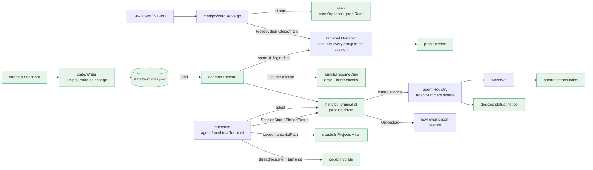

# Restore Implementation Plan (E09)

> **For Claude:** REQUIRED SUB-SKILL: Use /implement to execute this plan task-by-task.

**Goal:** A pocketd restart (SIGTERM, crash or Mac reboot) no longer loses work. Every Terminal comes back under its old id, in its launch dir. Each Agent resumes on its Conversation under its old id, with its Timeline rebuilt. The desktop and the phone say how each Agent came back: "Resumed", "Interrupted by restart", "Full access resumed as Ask" or "Couldn't resume".

**Toolset** (paths relative to the repo root `/Users/mingo/Developer/self/anywhere`):
- pocketd, everything (every PR boundary): `cd packages/pocketd && go vet ./... && env -u POCKETD_SOCK go test -race -count=1 ./...`
- pocketd, one test: `cd packages/pocketd && env -u POCKETD_SOCK go test -race -count=1 ./internal/<pkg> -run '<TestName>'` (e2e: `./e2e`)
- pocketd goldens: `cd packages/pocketd && go test ./internal/proto -update`. Review the diff of `testdata/` after every `-update`.
- protocol: `pnpm --filter @pocket/protocol test`
- phone: `pnpm --filter @pocket/app test` (and `pnpm --filter @pocket/app typecheck`)
- desktop, one test: `cd packages/desktop && cargo test -p agents <name>` or `cargo test -p pocket <name>`
- desktop, full (every PR boundary): `cd packages/desktop && cargo build --workspace && cargo clippy --workspace --all-targets && cargo test --workspace`. No new warnings.
- desktop re-adopt e2e (PR5, opt-in): `cd packages/desktop && env -u POCKETD_SOCK cargo test -p daemon --test restore -- --ignored`
- The shell is fish: quote globs and separators (`echo '----'`). Use `env -u NAME cmd`, not `unset`.

**Scratch pocketd rules** (from 05-roadmap §7; they bind every task):
- Tests and captures start a scratch pocketd with their own `POCKET_HOME`, `POCKETD_SOCK` and port. The e2e harness (`packages/pocketd/e2e/harness_test.go:60-133`) already does this; PR5's Rust test does the same under `/tmp`.
- Never start, stop or restart the production pocketd. Until this epic lands, a restart kills every PTY, the implementing agent's included.
- A Pocket Terminal exports `POCKETD_SOCK`. Strip it (`env -u POCKETD_SOCK`) from every command that runs pocketd or its tests.
- No test runs the real `claude` or `codex`, and no step spends a model turn. Resume paths run the test binary as a fake agent (`fakeAgent`, `internal/daemon/presence_test.go:37`). The e2e harness turns `restore.resumeAgents` off, because a restored Terminal runs in the login shell's env, where the real `claude` is on PATH.
- Never run the desktop app outside `.ui-review/fixture/capture.sh`. Manual acceptance (restart pocketd with live Agents, watch them come back) is the owner's.

**Read first:**
- `docs/designs/2026-09-30-restore.md`: the design. §3 is the UX and copy, §5 the contract, §7 the failure table, §10 the decisions.
- `docs/orchestrators/product/05-roadmap.md` §3 E09 and §4: PR scope and binding dependencies.
- `docs/plans/2026-09-30-always-on.md` (E04): PR1 rewrites `serve.go` (lock, log file, `signal.NotifyContext`), PR2 adds `d.LoginEnv()` and `shellenv.LoginShell()`, PR3 adds `events.Event`/`evs.Emit`, PR4 adds `Daemon::spawn` with `up`/`down`.
- `docs/designs/2026-09-30-launchspec-create.md` §5.3 (E06 PR2 contract: `launch.Failure`, `Wrap`, `Launcher`, `Launcher.Exited`, `config.Settings`, ops `config-set`, `scripts/probe-cli.sh`).
- `docs/designs/2026-09-30-reach-lockdown.md` §5 (E02 PR1: `proto.ServerCaps` in `version.go`, `proto.NewErrorCode`).
- `packages/pocketd/internal/daemon/presence.go` (the agent detected in a Terminal) and `internal/daemon/restore_test.go`'s helpers from `claude_test.go`, `codex_test.go`, `daemon_test.go`.

**Base:** main `5091a01`. Line numbers cite that commit. PR3 and PR5 are written against the E02, E04, E06 and E17 contracts; each says when to re-anchor.

**§7.1 override rows** (copied verbatim from 05-roadmap §7.1):

| UX section | Spec says | Winning decision | Text to build |
|---|---|---|---|
| UXD §7 constraint 1 | tokens (Phase 1, incl. dark) before everything | D26 | E16 PR1 (light `Palette`) lands before E08 PR1 and every later desktop component. E01 and E04 PR4 predate it and use the existing constants. Dark waits for S1 |
| UXD §2.0 Palette struct | `Palette` + `LIGHT`/`DARK` statics + `p(cx)` | Owner's dark-theme plan | `theme::Token { light, dark }` consts, read as `theme::X` (`Into<Hsla>`); `Token::pick(dark)` in tests. No `Palette`, no `p(cx)` |
| UXD §7 constraint 1, D26 dark | Dark waits for S1 | Owner's dark-theme plan | Dark ships with the owner's plan and follows macOS appearance; no Appearance action. E16 PR1 lands on top of it |

**Differences from the design** (the design stays as written; these are settled here):
- Rebased on 5091a01: the dark theme has landed. The notice line reads `theme::TEXT_2` (in scope through `use theme::*`, `pk/sidebar/sessions.rs:8`), not `rgba(TEXT_2)`. There is no rebase step.
- Rebased on 5091a01: 8a10124 drops an Agent the moment its process exits. A failed restore is the one exception: its Agent stays listed as "Couldn't resume" until its Terminal ends, or for 10 min when it has no Terminal. Otherwise the notice could never be seen.
- `Parse`, `Mode` and `Outcome` live in the new `internal/state`, not `internal/launch`: `launch` imports `daemon` (E06's `Launcher`), so `daemon` can't import `launch`. `Mode` is `Mode(l Launch, permissionMode string) Launch`.
- `Daemon` gets two closures instead of a `resume bool`: `Resume func(state.Terminal) (cmd string, args []string, reason string)` (nil means resume is off) and `OnRestore func(agentID string, ok bool, ms int64, outcome, reason string)`. serve fills them from the `Launcher` and the events log. `Daemon.Restore(f, shell)` takes the shell.
- `launch.Resume` returns `([]string, *Failure)`. "Access lowered" comes from `state.Outcome`, which reads `saved.Launch.Access == "full"`.
- `state.Terminal` has `Cols`/`Rows` as `int` (what `terminal.Info` holds) and no `Origin` field; E05/E06 add theirs.
- No `SetFallbackTitle`. `agent.Restored` carries `Fallback` (the launch dir's base name) and `Conversation`; the summary shows `cmp.Or(title, fallback)`.
- `claude.InProjects(path, env)` takes the claude's env, so it honours that claude's `CLAUDE_CONFIG_DIR`.
- Codex hydration: a `turns/list` page includes the turn its cursor names. `resume`'s copy of that turn wins; older copies are dropped.
- `agent_resuming` is sent with E02's `proto.NewErrorCode`. No TS cap constant.
- e2e lives in `packages/pocketd/e2e/restore_test.go` (the harness is there), not `cmd/pocketd/restore_e2e_test.go`. It covers resume off only; the resume paths are tested in `internal/daemon` with the fake agent (safety rule above). The fake claude needs no `--resume` change.
- The desktop e2e checks that Terminals re-attach by id across a restart, with resume off.
- Test renames and merges: `TestNoPresenceIn30s` → `TestNoPresenceInTimeFailsTheRestore` (`RestoreWait` var). `TestPromptToAResumingAgentIsRefused` folds into `TestARestoredClaudeAttachesOnItsConversation`. `TestShutdownFreezesBeforeKilling` → e2e `TestSigtermKeepsTheTerminalsInTheStateFile`. `TestAgentSummaryOmitsEmptyRestore` → the `agent_update_restore_cleared` golden. `TestTheFileHoldsNoTitleEnvArgvOrText` moves to `internal/daemon`, where the snapshot is built.
- PR2 starts plain Terminals with `$POCKETD_RESTORE_SHELL`, else `$SHELL`, else `/bin/zsh`, as `-l`. Once E04 PR2 has merged, `$SHELL` gives way to `shellenv.LoginShell()`. `POCKETD_RESTORE_SHELL` exists for tests: `LoginShell()` reads `getpwuid` and ignores `$SHELL`, so without it the e2e tests would run the owner's login shell and rc files.
- serve restores after both listeners are bound, and before the poller (`d.Watch`) and ops `Serve` start. A pocketd that can't bind spawns nothing, the poller finds every hint in place, and the first ops `list` still holds every Terminal.
- PR1 step 0 reads `codex app-server daemon --help` only. It starts no daemon and makes no model call.
- Dependencies: PR3 needs E02 PR1 (`ServerCaps`, `NewErrorCode`), E04 PR2 (`LoginEnv`, `LoginShell`) and E04 PR3 (`events`) as well as E06 PR2. Roadmap §4 lists E09 PR3 → E09 PR2, E06 PR2; E02 PR1, E04 PR2 and E04 PR3 are this plan's additions. The roadmap's weeks already order them this way (E04 wk 2–3, E02 PR1 wk 1, E09 PR3 wk 6).

**Assumptions** (settled; don't re-open):
- PRs merge in order PR1 → PR2 → PR3 → PR4. PR5 (lane C) follows PR3 and can run beside PR4.
- E04 PR1 merges (wk 3) before this PR1 (wk 5). Its `serve.go` already has `ctx, stop := signal.NotifyContext(…)`, `defer stop()` and the `ln.Close` goroutine; PR1 then adds only `reap()` and the `CloseAll` branch. Task 1.4 shows the diff against 5091a01; apply it by context.
- Where this plan shows a line another epic wrote (`proto.ServerCaps`, `launch.New`, `evs.Emit`, `d.LoginEnv()`), keep it exactly as merged.
- The owner's code wins over the design where they differ.
- CLAUDE.md: no comments unless the WHY can't be read from the code. Keep the doc comments this plan gives; add no others.

---

## Architecture



Green boxes are new; the rest exist and change a little.

On a stop signal, pocketd first freezes its state file, so Terminals that end during shutdown stay in it. Then it ends every Terminal's whole session: every process group, not only the shell's. SIGHUP and SIGTERM go first, SIGKILL after 2 s, all Terminals in parallel. Every Terminal process carries `POCKETD_PARENT=<pid>`. After a crash, the next pocketd ends the orphans whose marked parent is dead. It spares session leaders, such as codex's shared app-server and tmux.

While running, a writer polls a snapshot every second and rewrites `state/terminals.json` only when it changed. Each entry holds the Terminal's id, launch dir and size. When an Agent is on a Conversation, the entry also holds provider, Conversation id, transcript path, access, model and Agent id. It never holds a title, env, argv or conversation text.

At start, `Restore` recreates each Terminal under its old id. A Terminal that held an Agent runs the resume argv (`claude --resume <id> …` or `codex resume <id> …`) through E06's login-shell wrapper. The Agent is listed at once under its old id, with a driver that refuses prompts ("This session is still resuming"). When the poller finds the provider in that Terminal, it adopts the waiting Agent instead of making a new one. The restore settles when the provider reports the saved Conversation, or after 10 s. It fails if the agent exits, never shows up in 30 s, or can't be started. The outcome is one word on `AgentSummary.restore`, cleared by the Agent's next turn.

Timelines come back from the provider's own files. A resumed claude is tailed from the saved transcript path, only if it lies under that claude's `projects` dir. A resumed codex replays `thread/resume` and, for paginated threads, pages older turns through `thread/turns/list`.

## Why this approach

- **Kill the session, not the group.** Job-control jobs get their own groups, and `nohup` children ignore the pty's SIGHUP. Only a walk of every group with the shell's sid ends them all. `kern.proc.session` is ENOENT on darwin, so `proc.Session` asks `getsid` per process.
- **An env marker, and session leaders are spared.** Only processes that carry a dead pocketd's pid are touched. codex's app-server daemon and tmux call `setsid` and serve work outside Pocket.
- **Poll a snapshot, write on change.** A hook in every mutation would miss some; a 1 s poll costs one small JSON per second and no disk write when idle. The write is temp + fsync + rename, so a crash leaves the old or the new file.
- **Freeze before killing.** Otherwise the writer would record the Terminals disappearing during shutdown, and the restart would bring back nothing.
- **Recreate under the same ids.** The desktop and phone key everything by id; E04 PR4's reconnect re-attaches without new bookkeeping.
- **Same Agent id, adopted by the detector.** A new id would orphan the phone's open chat and the desktop's selection. A hint per Terminal lets the poller hand the waiting Agent to whatever it finds there, and a `pending` driver refuses prompts instead of typing into a shell.
- **Settle on the saved Conversation, or after 10 s.** An untrusted claude sends no hooks at all, and a codex may take a while to report status. 30 s without any agent fails the restore, matching the FR's "≤30 s".
- **Full access comes back as Ask** (D28). A restart must not silently re-arm an unattended bypass; the notice says so.
- **One outcome, cleared by the next turn.** Precedence failed > interrupted > access_lowered > resumed gives one notice, not a stack. It has to disappear once the owner has moved on.
- **Tail the saved transcript from zero, only under `projects`.** The file is what claude itself replays. The path check stops a tampered state file from making pocketd read any file.
- **Page codex history, capped at 50 pages.** A paginated thread's `resume` returns only the newest turns. The cap bounds a runaway cursor.
- **`Parse`/`Mode`/`Outcome` in `state`; closures on `Daemon`.** Both avoid a `daemon` → `launch` import cycle, and keep the daemon testable without E06.

## Tasks at a glance

**PR 1: Kill whole Terminal sessions and reap orphans** (lane P, wk 5; depends on nothing). A stop signal ends every process a Terminal started and exits 0; the next pocketd ends what a crashed one left.

| Task | What | Main files | Risk |
|---|---|---|---|
| 1.1 | `proc.Session`, `Orphans`, `Alive`, `Kill`, `Reap` and the `POCKETD_PARENT` marker | `internal/proc/reap.go`, `internal/proc/reap_darwin.go` | Medium: real processes, sysctl |
| 1.2 | `Terminal.Close` ends the whole session with a grace; `Manager.CloseAll` | `internal/terminal/terminal.go` | Medium: signals and timing |
| 1.3 | Every Terminal gets one `POCKETD_PARENT` | `internal/daemon/plugin.go` | Low |
| 1.4 | serve reaps at start and closes all Terminals on a signal; e2e | `cmd/pocketd/serve.go`, `e2e/harness_test.go`, `e2e/restore_test.go` | High: exit codes, orphans |

**PR 2: Persist Terminals and recreate them by id** (lane P, wk 6; depends on PR1). After a restart every Terminal is back under its id, as a login shell in its launch dir.

| Task | What | Main files | Risk |
|---|---|---|---|
| 2.1 | `state` file (load, atomic save, `.bad` on corruption) and the change-only writer | `internal/state/state.go`, `internal/state/writer.go` | Low |
| 2.2 | `state.Parse` and `state.Mode`: access, plan, model, effort from argv and hooks | `internal/state/launch.go` | Medium: flag tables |
| 2.3 | `Daemon.Snapshot`, `Daemon.Restore`, the saved launch on `presence` | `internal/daemon/restore.go`, `presence.go`, `daemon.go` | Medium |
| 2.4 | serve loads, restores and runs the writer; harness `Restart`; e2e | `cmd/pocketd/serve.go`, `e2e/` | Medium |

**PR 3: Resume Agents with an outcome** (lane P, wk 6; depends on PR2, E06 PR2, E02 PR1, E04 PR2, E04 PR3). Agents come back on their Conversations under their old ids, and each carries its outcome.

| Task | What | Main files | Risk |
|---|---|---|---|
| 3.1 | `AgentSummary.restore`, outcome consts, cap, goldens; TS schema | `internal/proto/proto.go`, `packages/protocol/src/timeline.ts` | Low |
| 3.2 | `Registry.Restore`, a settable driver, fallback title, `SetRestore` | `internal/agent/agent.go` | Medium: lock order |
| 3.3 | `state.Outcome` | `internal/state/outcome.go` | Low |
| 3.4 | Hints: expect, adopt, settle, fail, drop | `internal/daemon/restore.go`, `presence.go`, `daemon.go`, `codex.go` | High: races between poller, hooks and timers |
| 3.5 | `launch.Resume`, `ValidResume`, `ResumeCmd`; `restore.resumeAgents`; probe line | `internal/launch/resume.go`, `internal/config`, `internal/ops`, `scripts/probe-cli.sh` | High: argv safety |
| 3.6 | serve wiring, `agent_resuming`, `restore` event; e2e with resume off | `cmd/pocketd/serve.go`, `internal/wsserver/wsserver.go`, `internal/events`, `e2e/` | Medium |

**PR 4: Rebuild Timelines from provider files** (lane P, wk 6; depends on PR3). A resumed Agent's Timeline equals the one it had live.

| Task | What | Main files | Risk |
|---|---|---|---|
| 4.1 | Step 0: record codex fixtures; decode test | `internal/codex/testdata/` | Medium: needs a scratch app-server |
| 4.2 | Tail the saved claude transcript, only under `projects` | `internal/claude/projects.go`, `internal/daemon/presence.go` | Medium: path safety |
| 4.3 | Codex `thread/turns/list` hydration | `internal/codex/session.go` | Medium: ordering, duplicates |

**PR 5: Restore notices and re-adopt e2e** (lane C, wk 7; depends on PR3, E04 PR4, E17 PR2). The desktop and phone show each Agent's restore notice, and a Rust test proves Terminals re-attach by id.

| Task | What | Main files | Risk |
|---|---|---|---|
| 5.1 | `Summary.restore` in the desktop model | `crates/agents/src/agents.rs` | Low |
| 5.2 | `status::notice`, the banner order, a notice line on the card | `crates/pocket/src/status.rs`, `sidebar/sessions.rs` | Low |
| 5.3 | Phone `restoreNotice`, a row line and a timeline footer | `packages/app/src/status.ts`, `screens/`, `components/TimelineView.tsx` | Low |
| 5.4 | `crates/daemon/tests/restore.rs`: restart a scratch pocketd, list the same ids | `crates/daemon/tests/restore.rs` | Medium: builds pocketd |

---

## PR 1: Kill whole Terminal sessions and reap orphans

**Scope:** `internal/proc` learns to list a session's process groups and a dead pocketd's orphans. `Terminal.Close` ends the whole session with a 2 s grace. Every Terminal process carries `POCKETD_PARENT`. serve reaps at start, and on SIGTERM/SIGINT closes every Terminal in parallel and exits 0.
**Depends on:** nothing. Re-anchor line numbers in `cmd/pocketd/serve.go` after E04 PR1 merges.
**Done when:** the pocketd full line passes, and `TestSigtermKillsEveryTerminalAndExitsZero` proves a `nohup`'d grandchild dies and pocketd exits 0.

### Task 1.1: Session groups, orphans and the reap rule

**What & why:** `Close` today kills only the shell (`P internal/terminal/terminal.go:310-312`). A job-control job has its own process group and a `nohup` child ignores SIGHUP, so both outlive their Terminal. `Session` finds every group in the shell's session. After a crash no pocketd is left to kill anything, so the next one ends processes marked by a dead pocketd (`Orphans` + `Reap`).

**Files:**
- Create: `packages/pocketd/internal/proc/reap.go`, `packages/pocketd/internal/proc/reap_darwin.go`
- Modify: `packages/pocketd/internal/proc/proc_darwin.go:14` (a `Sid` field)
- Test: `packages/pocketd/internal/proc/reap_test.go`, `packages/pocketd/internal/proc/reap_darwin_test.go`

**Context:**
- `proc.Read(pid)` (`P internal/proc/proc_darwin.go`) returns argv and env via `kern.procargs2`; it fails for other users' processes, so a process without env is never reaped.
- `kern.proc.session` returns ENOENT on darwin and `Eproc.Sess` is zeroed, so `Session` walks `kern.proc.all` and asks `getsid` per process. Zombie is `P_stat == 5` (`SZOMB`).
- The package's tests already have `eventually` and `TestHelperProcess` (re-exec with `POCKET_TEST=1`).
- **Step 0 (once, before coding; design §9, narrowed):** in a scratch Terminal with `CODEX_HOME` set to a temp dir, run `codex app-server daemon --help`, `codex app-server daemon start --help` and `strings "$(readlink -f "$(command -v codex)")" | grep -i 'detached app-server'`. Pass: the help lists a managed daemon (`start`/`stop`; codex-cli 0.159.2 prints "Manage the local app-server daemon" and "Start the local app server daemon if it is not already running") and the binary holds `failed to spawn detached app-server process`. `--help` never says "session" or "setsid"; don't wait for it. If either check misses, stop and ask the owner: the "spare session leaders" rule depends on the daemon being detached. Start no daemon; make no model call.

**Step 1: Write the failing tests**

`reap_test.go`:
```go
package proc

import (
	"slices"
	"strconv"
	"testing"
)

func dead(int) bool { return false }

func marked(pid, sid, parent int) Proc {
	return Proc{Pid: pid, Sid: sid, Env: []string{"PATH=/bin", Marker + "=" + strconv.Itoa(parent)}}
}

func TestReapTakesOnlyOrphansOfADeadPocketd(t *testing.T) {
	ps := []Proc{marked(10, 5, 99), marked(11, 5, 42), {Pid: 12, Sid: 5, Env: []string{"PATH=/bin"}}}
	if got := Reap(42, dead, ps); !slices.Equal(got, []int{10}) {
		t.Fatalf("Reap = %v, want [10]", got)
	}
}

func TestReapSparesALiveMarkerParent(t *testing.T) {
	alive := func(pid int) bool { return pid == 99 }
	if got := Reap(42, alive, []Proc{marked(10, 5, 99)}); got != nil {
		t.Fatalf("Reap = %v, want none", got)
	}
}

func TestReapSparesSessionLeaders(t *testing.T) {
	if got := Reap(42, dead, []Proc{marked(10, 10, 99)}); got != nil {
		t.Fatalf("Reap = %v, want none", got)
	}
}

func TestReapSkipsUnreadableEnv(t *testing.T) {
	if got := Reap(42, dead, []Proc{{Pid: 10, Sid: 5, Argv: []string{"node"}}}); got != nil {
		t.Fatalf("Reap = %v, want none", got)
	}
}

func TestReapReadsTheLastMarker(t *testing.T) {
	p := Proc{Pid: 10, Sid: 5, Env: []string{Marker + "=99", Marker + "=42"}}
	if got := Reap(42, dead, []Proc{p}); got != nil {
		t.Fatalf("Reap = %v, want none", got)
	}
}
```

`reap_darwin_test.go` (real processes; the orphan is marked with `go test`'s live pid, because `./...` runs e2e in parallel and every scratch pocketd reaps orphans of dead markers):
```go
package proc

import (
	"os"
	"os/exec"
	"slices"
	"strconv"
	"strings"
	"syscall"
	"testing"
	"time"

	"github.com/creack/pty"
)

func TestSessionListsAJobInItsOwnGroup(t *testing.T) {
	cmd := exec.Command("sh", "-i")
	cmd.Env = []string{"PATH=/bin:/usr/bin", "PS1=$ "}
	f, err := pty.Start(cmd)
	if err != nil {
		t.Fatal(err)
	}
	sid := cmd.Process.Pid
	t.Cleanup(func() {
		pgids, _ := Session(sid)
		for _, pg := range pgids {
			syscall.Kill(-pg, syscall.SIGKILL)
		}
		cmd.Wait()
		f.Close()
	})
	go func() {
		buf := make([]byte, 1024)
		for {
			if _, err := f.Read(buf); err != nil {
				return
			}
		}
	}()
	f.WriteString("sleep 30 &\n")
	var pgids []int
	eventually(t, "two groups", func() bool {
		pgids, _ = Session(sid)
		return len(pgids) == 2
	})
	if !slices.Contains(pgids, sid) {
		t.Fatalf("Session(%d) = %v, want the shell's group and the job's", sid, pgids)
	}
}

func TestOrphansSeeAnAdoptedChildWithItsMarker(t *testing.T) {
	// The marked parent (go test) is alive, so the scratch pocketds that e2e
	// starts meanwhile spare the orphan; only this Reap is told it is dead.
	parent := os.Getppid()
	sh := exec.Command("sh", "-c", `"$0" -test.run='^TestHelperProcess$' >/dev/null 2>&1 & echo $!`, os.Args[0])
	sh.Env = []string{"PATH=/bin:/usr/bin", "POCKET_TEST=1", Marker + "=" + strconv.Itoa(parent)}
	out, err := sh.Output()
	if err != nil {
		t.Fatal(err)
	}
	pid, _ := strconv.Atoi(strings.TrimSpace(string(out)))
	t.Cleanup(func() { syscall.Kill(pid, syscall.SIGKILL) })

	var mine []Proc
	eventually(t, "the orphan with its marker", func() bool {
		ps, _ := Orphans(os.Getuid())
		mine = slices.DeleteFunc(ps, func(p Proc) bool { return p.Pid != pid })
		// Until it execs, the forked child reads back with sh's argv and no env.
		return len(mine) == 1 && markedBy(mine[0].Env) == parent
	})
	if got := Reap(os.Getpid(), dead, mine); !slices.Equal(got, []int{pid}) {
		t.Fatalf("Reap = %v, want [%d]", got, pid)
	}
	Kill([]int{pid}, time.Second)
	eventually(t, "the orphan gone", func() bool { return !Alive(pid) })
}
```

**Step 2: Run to verify they fail**

Run: `cd packages/pocketd && env -u POCKETD_SOCK go test -race -count=1 ./internal/proc`
Expected: build failure: `undefined: Marker`, `undefined: Reap`, `unknown field Sid`.

**Step 3: Write the implementation**

`proc_darwin.go:14`, after `Pid  int`:
```go
	Sid  int // set by Orphans only
```

`reap.go`:
```go
package proc

import (
	"strconv"
	"strings"
)

// Marker is the env var that names the pocketd a Terminal process came from.
const Marker = "POCKETD_PARENT"

// Reap picks the pids a dead pocketd left behind. A session leader is
// spared: codex's shared app-server and tmux call setsid and serve work
// outside Pocket.
func Reap(self int, alive func(int) bool, ps []Proc) []int {
	var pids []int
	for _, p := range ps {
		parent := markedBy(p.Env)
		if parent <= 0 || parent == self || p.Sid == p.Pid || alive(parent) {
			continue
		}
		pids = append(pids, p.Pid)
	}
	return pids
}

func markedBy(env []string) int {
	pid := 0
	for _, kv := range env {
		if v, ok := strings.CutPrefix(kv, Marker+"="); ok {
			pid, _ = strconv.Atoi(v)
		}
	}
	return pid
}
```

`reap_darwin.go`:
```go
package proc

import (
	"errors"
	"slices"
	"time"

	"golang.org/x/sys/unix"
)

// zombie is SZOMB from <sys/proc.h>; x/sys/unix has no name for it.
const zombie = 5

// Session lists the process groups of sid's live members. kern.proc.session
// is ENOENT on darwin and Eproc.Sess is zeroed, so it asks getsid per process.
func Session(sid int) ([]int, error) {
	kps, err := unix.SysctlKinfoProcSlice("kern.proc.all")
	if err != nil {
		return nil, err
	}
	uid := uint32(unix.Getuid())
	var pgids []int
	for _, kp := range kps {
		if kp.Proc.P_stat == zombie || kp.Eproc.Pcred.P_ruid != uid {
			continue
		}
		if s, err := unix.Getsid(int(kp.Proc.P_pid)); err != nil || s != sid {
			continue
		}
		if pg := int(kp.Eproc.Pgid); !slices.Contains(pgids, pg) {
			pgids = append(pgids, pg)
		}
	}
	return pgids, nil
}

// Orphans lists uid's live processes that launchd adopted, with their env where readable.
func Orphans(uid int) ([]Proc, error) {
	kps, err := unix.SysctlKinfoProcSlice("kern.proc.all")
	if err != nil {
		return nil, err
	}
	var ps []Proc
	for _, kp := range kps {
		if kp.Eproc.Ppid != 1 || kp.Proc.P_stat == zombie || kp.Eproc.Pcred.P_ruid != uint32(uid) {
			continue
		}
		p, err := Read(int(kp.Proc.P_pid))
		if err != nil {
			continue
		}
		if p.Sid, err = unix.Getsid(p.Pid); err != nil {
			continue
		}
		ps = append(ps, p)
	}
	return ps, nil
}

// Alive reports whether pid exists, even when another user owns it.
func Alive(pid int) bool {
	err := unix.Kill(pid, 0)
	return err == nil || errors.Is(err, unix.EPERM)
}

// Kill sends SIGTERM to each pid, waits up to grace for all to exit, then SIGKILLs the rest.
func Kill(pids []int, grace time.Duration) {
	for _, pid := range pids {
		unix.Kill(pid, unix.SIGTERM)
	}
	for deadline := time.Now().Add(grace); time.Now().Before(deadline) && slices.ContainsFunc(pids, Alive); {
		time.Sleep(50 * time.Millisecond)
	}
	for _, pid := range pids {
		if Alive(pid) {
			unix.Kill(pid, unix.SIGKILL)
		}
	}
}
```

**Step 4: Run to verify they pass**

Run: `cd packages/pocketd && env -u POCKETD_SOCK go test -race -count=1 ./internal/proc`
Expected: PASS.

### Task 1.2: Close ends the whole session

**What & why:** `Close` becomes a graceful end of every group in the session: SIGHUP+SIGTERM, then SIGKILL after `CloseGrace`. It runs in the background, because callers (ops `close`, the desktop) must not block for 2 s; `Done` still reports the end. `CloseAll` stops every Terminal in parallel for shutdown.

**Files:**
- Modify: `packages/pocketd/internal/terminal/terminal.go:13` (import `syscall`), `:310-312` (`Close`)
- Test: `packages/pocketd/internal/terminal/terminal_test.go:5-7` (imports), after `:156`

**Context:**
- `Terminal.Pid()` is the shell's pid, and the shell is its session's leader (`pty.Start` calls `setsid`).
- `s.done` closes when the shell's `Wait` returns (`P terminal.go`, the goroutine in `Spawn`); the Manager drops the Terminal then.
- `spawn(t, m, script)` and `waitScreen` are the test file's helpers. `Spec.ID` is kept by `Manager.Spawn` (`P terminal.go:112-115`); `TestSpawnKeepsTheGivenID` pins it, because PR2 recreates Terminals by id. It passes already.

**Step 1: Write the failing tests**

Imports gain `"strconv"` (after `"slices"`) and `"syscall"` (after `"sync"`). After `:156`:
```go
func pidIn(t *testing.T, path string) int {
	t.Helper()
	for deadline := time.Now().Add(5 * time.Second); time.Now().Before(deadline); time.Sleep(20 * time.Millisecond) {
		b, _ := os.ReadFile(path)
		if pid, err := strconv.Atoi(strings.TrimSpace(string(b))); err == nil {
			t.Cleanup(func() { syscall.Kill(pid, syscall.SIGKILL) })
			return pid
		}
	}
	t.Fatalf("no pid in %s", path)
	return 0
}

func waitGone(t *testing.T, pid int) {
	t.Helper()
	for deadline := time.Now().Add(5 * time.Second); time.Now().Before(deadline); time.Sleep(20 * time.Millisecond) {
		if syscall.Kill(pid, 0) != nil {
			return
		}
	}
	t.Fatalf("pid %d still alive", pid)
}

func TestCloseKillsAChildOfAChild(t *testing.T) {
	f := t.TempDir() + "/pid"
	s := spawn(t, NewManager(), `nohup sh -c 'sleep 30 & echo $! > `+f+`; wait' >/dev/null 2>&1 & wait`)
	pid := pidIn(t, f)
	s.Close()
	waitGone(t, pid)
}

func TestCloseKillsABackgroundJob(t *testing.T) {
	f := t.TempDir() + "/pid"
	s := spawn(t, NewManager(), `set -m; sleep 30 & echo $! > `+f+`; wait`)
	pid := pidIn(t, f)
	if pgid, _ := syscall.Getpgid(pid); pgid == s.Pid() {
		t.Fatal("the job shares the shell's group; the test needs its own")
	}
	s.Close()
	waitGone(t, pid)
}

func TestCloseEscalatesToSigkillAfterGrace(t *testing.T) {
	old := CloseGrace
	CloseGrace = 300 * time.Millisecond
	t.Cleanup(func() { CloseGrace = old })
	s := spawn(t, NewManager(), `trap '' TERM HUP; echo ready; while :; do sleep 1; done`)
	waitScreen(t, s, "ready")
	s.Close()
	select {
	case <-s.Done():
		t.Fatal("ended before the grace ran out")
	case <-time.After(100 * time.Millisecond):
	}
	select {
	case <-s.Done():
	case <-time.After(3 * time.Second):
		t.Fatal("still running after the grace")
	}
}

func TestCloseAllWaitsInParallel(t *testing.T) {
	m := NewManager()
	for range 3 {
		s := spawn(t, m, `trap '' TERM HUP; echo ready; while :; do sleep 1; done`)
		waitScreen(t, s, "ready")
	}
	start := time.Now()
	m.CloseAll(300 * time.Millisecond)
	if took := time.Since(start); took < 300*time.Millisecond || took > 900*time.Millisecond {
		t.Fatalf("CloseAll took %v, want one grace, not three", took)
	}
	if len(m.List()) != 0 {
		t.Fatalf("still listed: %v", m.List())
	}
}

func TestSpawnKeepsTheGivenID(t *testing.T) {
	m := NewManager()
	s, err := m.Spawn(Spec{ID: "t-1", Cmd: "sh", Args: []string{"-c", "sleep 5"}})
	if err != nil {
		t.Fatal(err)
	}
	t.Cleanup(s.Close)
	if s.Info().ID != "t-1" || m.Get("t-1") != s {
		t.Fatalf("id = %q", s.Info().ID)
	}
}
```

**Step 2: Run to verify they fail**

Run: `cd packages/pocketd && env -u POCKETD_SOCK go test -race -count=1 ./internal/terminal -run 'Close|SpawnKeeps'`
Expected: build failure: `undefined: CloseGrace`, `m.CloseAll undefined`.

**Step 3: Write the implementation**

Import `"syscall"` after `"sync"` (`:13`). Replace `:310-312`:
```go
// CloseGrace is how long Close waits after SIGTERM before SIGKILL.
var CloseGrace = 2 * time.Second

// Close ends the Terminal's whole session in the background; Done reports the end.
func (s *Terminal) Close() { go s.stop(CloseGrace) }

// stop signals every process group in the shell's session: job-control jobs
// get their own groups, and nohup'd children ignore the pty's SIGHUP.
// SIGHUP goes with SIGTERM because an interactive shell ignores SIGTERM.
func (s *Terminal) stop(grace time.Duration) {
	sid := s.Pid()
	signal := func(sigs ...syscall.Signal) {
		pgids, err := proc.Session(sid)
		if err != nil {
			pgids = []int{sid}
		}
		for _, pg := range pgids {
			for _, sig := range sigs {
				syscall.Kill(-pg, sig)
			}
		}
	}
	signal(syscall.SIGHUP, syscall.SIGTERM)
	for deadline := time.Now().Add(grace); time.Now().Before(deadline); time.Sleep(50 * time.Millisecond) {
		if pgids, err := proc.Session(sid); err == nil && len(pgids) == 0 {
			return
		}
	}
	signal(syscall.SIGKILL)
}

// CloseAll stops every Terminal at once. It returns when all have ended or grace+500ms has passed.
func (m *Manager) CloseAll(grace time.Duration) {
	var wg sync.WaitGroup
	for _, s := range m.All() {
		wg.Go(func() {
			s.stop(grace)
			<-s.done
		})
	}
	ended := make(chan struct{})
	go func() {
		wg.Wait()
		close(ended)
	}()
	select {
	case <-ended:
	case <-time.After(grace + 500*time.Millisecond):
	}
}
```

**Step 4: Run to verify they pass**

Run: `cd packages/pocketd && env -u POCKETD_SOCK go test -race -count=1 ./internal/terminal ./internal/daemon ./internal/ops`
Expected: PASS (the daemon and ops tests close Terminals too).

### Task 1.3: Every Terminal carries one POCKETD_PARENT

**What & why:** the reap rule needs every Terminal process to name the pocketd it came from. A Terminal inside a Terminal must carry only the inner pocketd's pid, so an inherited marker is dropped first.

**Files:**
- Modify: `packages/pocketd/internal/daemon/plugin.go:6-7` (imports), `:76` (the drop list), `:81` (the append)
- Test: `packages/pocketd/internal/daemon/plugin_test.go:8,12` (imports), `:80-85`, after `:98`

**Context:** `Daemon.Env` (`P internal/daemon/plugin.go:62-82`) already drops and re-adds `POCKETD_SOCK`/`POCKETD_PTY` the same way.

**Step 1: Write the failing tests**

Imports gain `"strconv"` and `"pocketd/internal/proc"`. In `TestEnvLoadsThePluginAndNamesTheTerminal`, add after `:80`:
```go
	parent := proc.Marker + "=" + strconv.Itoa(os.Getpid())
```
and append `parent` to both `want` slices (`:82`, `:85`). After `:98`:
```go
func TestTerminalEnvCarriesOnePocketdParent(t *testing.T) {
	d := &Daemon{Plugin: "/h/plugin", Sock: "/h/pocketd.sock"}
	var got []string
	for _, kv := range d.Env([]string{"PATH=/bin", proc.Marker + "=1"}, "t1") {
		if strings.HasPrefix(kv, proc.Marker+"=") {
			got = append(got, kv)
		}
	}
	if want := []string{proc.Marker + "=" + strconv.Itoa(os.Getpid())}; !slices.Equal(got, want) {
		t.Fatalf("markers = %q, want %q", got, want)
	}
}
```

**Step 2: Run to verify they fail**

Run: `cd packages/pocketd && env -u POCKETD_SOCK go test -race -count=1 ./internal/daemon -run 'TestEnv|PocketdParent'`
Expected: FAIL: the env has no `POCKETD_PARENT`.

**Step 3: Write the implementation**

Imports: `"strconv"` after `"path/filepath"`, then a blank line and `"pocketd/internal/proc"`. `:76`:
```go
		case "CLAUDECODE", "CLAUDE_CODE_CHILD_SESSION", "POCKETD_SOCK", "POCKETD_PTY", proc.Marker:
```
`:81`:
```go
	return append(out, "CLAUDE_CODE_PLUGIN_DIRS="+strings.Join(append(plugins, d.Plugin), ":"), "POCKETD_SOCK="+d.Sock, "POCKETD_PTY="+terminalID,
		proc.Marker+"="+strconv.Itoa(os.Getpid()))
```

**Step 4: Run to verify they pass**

Run: `cd packages/pocketd && env -u POCKETD_SOCK go test -race -count=1 ./internal/daemon`
Expected: PASS.

### Task 1.4: serve reaps at start and closes everything on a signal

**What & why:** today SIGTERM kills pocketd by the signal (Go's default; `ExitCode()` reports -1), and every Terminal is left to the pty's hangup. serve now reaps a dead pocketd's orphans before anything else, and on SIGTERM/SIGINT closes the ops listener, closes all Terminals in parallel and returns nil (exit 0).

**Files:**
- Modify: `packages/pocketd/cmd/pocketd/serve.go:3-21` (imports), after `:23`, after `:56`, `:60`
- Modify: `packages/pocketd/e2e/harness_test.go:45` (fields), `:107` (keep the cmd), after `:133` (`Stop`)
- Create: `packages/pocketd/e2e/restore_test.go`

**Context:**
- If E04 PR1 has merged (it should have, wk 3), `serve` already has `ctx, stop := signal.NotifyContext(context.Background(), syscall.SIGTERM, syscall.SIGINT)`, `defer stop()`, the `ln.Close` goroutine and `if ctx.Err() != nil { return nil }`. Keep them; add only `reap()` right after `defer stop()` and the `CloseAll` line inside the `ctx.Err()` branch. E04 PR1's Context line "pocketd does not end its Terminals on a signal" is superseded here.
- `ops.Server.Serve(ln)` returns when `ln` closes (`P internal/ops`).
- The harness keeps `cmd` and `exited` in `serve()` (`P e2e/harness_test.go:88-133`) but doesn't store them; `h.Spawn(cmd, args...)` returns the Terminal id; the Terminal's cwd is `h.Home`.

**Step 1: Write the failing test**

Harness: add fields after `log` (`:45`):
```go
	cmd       *exec.Cmd
	exited    chan struct{}
```
after the `go func(){ … close(exited) }()` block (`:107`):
```go
	h.cmd, h.exited = cmd, exited
```
after `serve()` (`:133`):
```go
// Stop sends sig to pocketd and returns its exit code.
func (h *Harness) Stop(sig os.Signal) int {
	h.t.Helper()
	h.cmd.Process.Signal(sig)
	select {
	case <-h.exited:
	case <-time.After(10 * time.Second):
		h.t.Fatal("pocketd did not exit")
	}
	return h.cmd.ProcessState.ExitCode()
}
```

`e2e/restore_test.go`:
```go
package e2e

import (
	"os"
	"path/filepath"
	"strconv"
	"strings"
	"syscall"
	"testing"
)

func TestSigtermKillsEveryTerminalAndExitsZero(t *testing.T) {
	h := Start(t)
	f := filepath.Join(h.Home, "pid")
	h.Spawn("sh", "-c", `nohup sh -c 'sleep 60 & echo $! > `+f+`; wait' >/dev/null 2>&1 & wait`)
	var pid int
	h.eventually("the grandchild's pid", func() bool {
		b, _ := os.ReadFile(f)
		pid, _ = strconv.Atoi(strings.TrimSpace(string(b)))
		return pid > 0
	})
	t.Cleanup(func() { syscall.Kill(pid, syscall.SIGKILL) })
	if code := h.Stop(syscall.SIGTERM); code != 0 {
		t.Fatalf("exit code %d, want 0", code)
	}
	h.eventually("the grandchild gone", func() bool { return syscall.Kill(pid, 0) != nil })
}
```

**Step 2: Run to verify it fails**

Run: `cd packages/pocketd && env -u POCKETD_SOCK go test -race -count=1 ./e2e -run TestSigtermKillsEveryTerminalAndExitsZero`
Expected: FAIL: `restore_test.go:24: exit code -1, want 0` (before E04 PR1) or `the grandchild gone` times out (after it).

**Step 3: Write the implementation**

Imports: add `"log"`, `"os/signal"`, `"syscall"` and `"pocketd/internal/proc"`. After `func serve(sock string) error {` (`:23`):
```go
	ctx, stop := signal.NotifyContext(context.Background(), syscall.SIGTERM, syscall.SIGINT)
	defer stop()
	reap()
```
After `ln, err := ops.Listen(sock)` and its check (`:56`):
```go
	go func() {
		<-ctx.Done()
		ln.Close()
	}()
```
`:60` becomes:
```go
	err = (&ops.Server{Terminals: d.Terminals, Spawn: d.Spawn, Hook: d.Hook}).Serve(ln)
	if ctx.Err() != nil {
		d.Terminals.CloseAll(terminal.CloseGrace)
		return nil
	}
	return err
}

// reap ends what a crashed pocketd left running (proc.Reap has the rule).
func reap() {
	ps, err := proc.Orphans(os.Getuid())
	if err != nil {
		log.Printf("reap: %v", err)
		return
	}
	if pids := proc.Reap(os.Getpid(), proc.Alive, ps); len(pids) > 0 {
		log.Printf("reap: ending %d processes of a dead pocketd", len(pids))
		go proc.Kill(pids, terminal.CloseGrace)
	}
}
```

**Step 4: Run to verify it passes**

Run: `cd packages/pocketd && go vet ./... && env -u POCKETD_SOCK go test -race -count=1 ./...`
Expected: PASS.

## PR 2: Persist Terminals and recreate them by id

**Scope:** a new `internal/state` package owns `$POCKET_HOME/state/terminals.json`: the types, atomic save, load, the change-only writer, and reading access/plan/model/effort from an agent's argv and hooks. The daemon builds the snapshot and recreates saved Terminals under their ids as login shells. serve wires it; the writer freezes before shutdown.
**Depends on:** PR1. Re-anchor line numbers in `cmd/pocketd/serve.go` after E04 PR1 and E04 PR2 merge.
**Done when:** the pocketd full line passes; `TestARestartBringsTerminalsBackByID` restarts a scratch pocketd and lists the same id in the same dir.

### Task 2.1: The state file and its writer

**What & why:** the file must survive a crash mid-write (temp + fsync + rename), stay private (0600 in a 0700 dir), and never be silently erased: a file it can't read is renamed to `.bad`. The writer polls a snapshot every second and writes only when the bytes change, so an idle pocketd never touches the disk. `Freeze` saves once more and stops writing, so Terminals that end during shutdown stay in the file.

**Files:**
- Create: `packages/pocketd/internal/state/state.go`, `packages/pocketd/internal/state/writer.go`
- Test: `packages/pocketd/internal/state/state_test.go`, `packages/pocketd/internal/state/writer_test.go`

**Context:** no other package writes under `$POCKET_HOME/state/` (E04 writes `logs/` and the lock; E05 writes `backup/`). Field names follow design §5.1, minus `origin` (E05/E06 add theirs) and with `cols`/`rows` as ints.

**Step 1: Write the failing tests**

`state_test.go`:
```go
package state

import (
	"os"
	"path/filepath"
	"reflect"
	"strings"
	"testing"
)

func sample() File {
	return File{Version: Version, Terminals: []Terminal{
		{TerminalID: "t1", LaunchDir: "/w", Cols: 100, Rows: 30},
		{TerminalID: "t2", LaunchDir: "/w", Cols: 80, Rows: 24, Provider: "claude", ConversationID: "c1",
			TranscriptPath: "/p/c1.jsonl", Launch: &Launch{Access: "edits", Model: "opus"}, AgentID: "a1", CreatedAt: 7, Status: "working"},
	}}
}

func TestSaveLoadRoundTrips(t *testing.T) {
	path := Path(t.TempDir())
	if err := Save(path, sample()); err != nil {
		t.Fatal(err)
	}
	got, err := Load(path)
	if err != nil || !reflect.DeepEqual(got, sample()) {
		t.Fatalf("Load = %+v, %v", got, err)
	}
}

func TestAMissingFileLoadsEmpty(t *testing.T) {
	got, err := Load(Path(t.TempDir()))
	if err != nil || got.Version != Version || len(got.Terminals) != 0 {
		t.Fatalf("Load = %+v, %v", got, err)
	}
}

func TestSaveIsAtomicAndPrivate(t *testing.T) {
	path := Path(t.TempDir())
	if err := Save(path, sample()); err != nil {
		t.Fatal(err)
	}
	if st, _ := os.Stat(filepath.Dir(path)); st.Mode().Perm() != 0o700 {
		t.Errorf("dir mode = %v", st.Mode().Perm())
	}
	if st, _ := os.Stat(path); st.Mode().Perm() != 0o600 {
		t.Errorf("file mode = %v", st.Mode().Perm())
	}
	if entries, _ := os.ReadDir(filepath.Dir(path)); len(entries) != 1 {
		t.Errorf("dir holds %d entries, want only the file", len(entries))
	}
}

func TestACorruptFileLoadsEmptyAndIsKept(t *testing.T) {
	for name, body := range map[string]string{"garbage": "{nope", "future": `{"version":2,"terminals":[]}`} {
		t.Run(name, func(t *testing.T) {
			path := Path(t.TempDir())
			os.MkdirAll(filepath.Dir(path), 0o700)
			os.WriteFile(path, []byte(body), 0o600)
			got, err := Load(path)
			if err == nil || len(got.Terminals) != 0 || got.Version != Version {
				t.Fatalf("Load = %+v, %v", got, err)
			}
			if kept, _ := os.ReadFile(path + ".bad"); string(kept) != body {
				t.Fatalf(".bad holds %q", kept)
			}
			if !strings.Contains(err.Error(), path) {
				t.Fatalf("err = %v", err)
			}
		})
	}
}
```

`writer_test.go`:
```go
package state

import (
	"context"
	"os"
	"strconv"
	"sync/atomic"
	"testing"
	"time"
)

func running(t *testing.T, path string, n *atomic.Int64) *Writer {
	t.Helper()
	old := WriteEvery
	WriteEvery = 10 * time.Millisecond
	t.Cleanup(func() { WriteEvery = old })
	w := NewWriter(path, func() File {
		return File{Version: Version, Terminals: []Terminal{{TerminalID: strconv.FormatInt(n.Load(), 10)}}}
	})
	ctx, cancel := context.WithCancel(context.Background())
	done := make(chan struct{})
	go func() {
		w.Run(ctx)
		close(done)
	}()
	t.Cleanup(func() {
		cancel()
		<-done
	})
	return w
}

func saved(path string) string {
	f, _ := Load(path)
	if len(f.Terminals) == 0 {
		return ""
	}
	return f.Terminals[0].TerminalID
}

func waitSaved(t *testing.T, path, want string) {
	t.Helper()
	for deadline := time.Now().Add(5 * time.Second); time.Now().Before(deadline); time.Sleep(10 * time.Millisecond) {
		if saved(path) == want {
			return
		}
	}
	t.Fatalf("the file never held %q", want)
}

func TestWriterSkipsUnchangedSnapshots(t *testing.T) {
	path := Path(t.TempDir())
	var n atomic.Int64
	running(t, path, &n)
	waitSaved(t, path, "0")
	before, _ := os.Stat(path)
	time.Sleep(100 * time.Millisecond)
	if after, _ := os.Stat(path); !os.SameFile(before, after) {
		t.Fatal("an unchanged snapshot was written again")
	}
	n.Store(1)
	waitSaved(t, path, "1")
}

func TestFreezeStopsLaterWrites(t *testing.T) {
	path := Path(t.TempDir())
	var n atomic.Int64
	w := running(t, path, &n)
	n.Store(1)
	if err := w.Freeze(); err != nil {
		t.Fatal(err)
	}
	n.Store(2)
	time.Sleep(100 * time.Millisecond)
	if got := saved(path); got != "1" {
		t.Fatalf("the file holds %q after Freeze, want 1", got)
	}
}
```

**Step 2: Run to verify they fail**

Run: `cd packages/pocketd && env -u POCKETD_SOCK go test -race -count=1 ./internal/state`
Expected: build failure starting `state_test.go:11:15: undefined: File`, then `undefined: Version`, `Terminal`, `Launch`, `Path`, `Save`, `Load` and `writer_test.go:12:59: undefined: Writer`, ending `too many errors`.

**Step 3: Write the implementation**

`state.go`:
```go
// Package state keeps what pocketd needs to bring its Terminals back after a
// restart. It never holds a title, env, argv or conversation text (S-5).
package state

import (
	"encoding/json"
	"errors"
	"fmt"
	"io/fs"
	"os"
	"path/filepath"
)

const Version = 1

type Launch struct {
	Access string `json:"access"` // ask | edits | auto | full
	Plan   bool   `json:"plan,omitempty"`
	Model  string `json:"model,omitempty"`
	Effort string `json:"effort,omitempty"`
}

type Terminal struct {
	TerminalID     string  `json:"terminalId"`
	LaunchDir      string  `json:"launchDir"`
	Cols           int     `json:"cols"`
	Rows           int     `json:"rows"`
	Provider       string  `json:"provider,omitempty"`
	ConversationID string  `json:"conversationId,omitempty"`
	TranscriptPath string  `json:"transcriptPath,omitempty"`
	Launch         *Launch `json:"launch,omitempty"`
	AgentID        string  `json:"agentId,omitempty"`
	CreatedAt      int64   `json:"createdAt,omitempty"`
	Status         string  `json:"status,omitempty"`
	Failed         bool    `json:"failed,omitempty"`
}

type File struct {
	Version   int        `json:"version"`
	Terminals []Terminal `json:"terminals"`
}

func Path(home string) string { return filepath.Join(home, "state", "terminals.json") }

// Load reads the file at path; a missing one is empty. A file it can't use is
// renamed to .bad, so the next save doesn't erase it, and Load reports why.
func Load(path string) (File, error) {
	raw, err := os.ReadFile(path)
	if errors.Is(err, fs.ErrNotExist) {
		return File{Version: Version}, nil
	}
	var f File
	if err == nil {
		err = json.Unmarshal(raw, &f)
	}
	if err == nil && f.Version != Version {
		err = fmt.Errorf("version %d, want %d", f.Version, Version)
	}
	if err != nil {
		os.Rename(path, path+".bad")
		return File{Version: Version}, fmt.Errorf("state %s: %w", path, err)
	}
	return f, nil
}

// Save replaces the file at path whole, so a crash leaves the old one or the new one.
func Save(path string, f File) error {
	raw, err := json.MarshalIndent(f, "", "  ")
	if err != nil {
		return err
	}
	return write(path, raw)
}

func write(path string, raw []byte) error {
	dir := filepath.Dir(path)
	if err := os.MkdirAll(dir, 0o700); err != nil {
		return err
	}
	tmp, err := os.CreateTemp(dir, ".terminals-*")
	if err != nil {
		return err
	}
	defer os.Remove(tmp.Name())
	_, err = tmp.Write(raw)
	if err == nil {
		err = tmp.Sync()
	}
	if cerr := tmp.Close(); err == nil {
		err = cerr
	}
	if err != nil {
		return err
	}
	return os.Rename(tmp.Name(), path)
}
```

`writer.go`:
```go
package state

import (
	"bytes"
	"context"
	"encoding/json"
	"log"
	"sync"
	"time"
)

var WriteEvery = time.Second

// Writer saves a snapshot whenever it changes.
type Writer struct {
	path string
	snap func() File

	mu     sync.Mutex
	last   []byte
	frozen bool
	failed bool
}

func NewWriter(path string, snap func() File) *Writer {
	return &Writer{path: path, snap: snap}
}

// Run saves every WriteEvery until ctx ends or Freeze.
func (w *Writer) Run(ctx context.Context) {
	tick := time.NewTicker(WriteEvery)
	defer tick.Stop()
	for {
		select {
		case <-ctx.Done():
			return
		case <-tick.C:
			w.mu.Lock()
			if !w.frozen {
				w.save()
			}
			w.mu.Unlock()
		}
	}
}

// Freeze saves once more and stops Run from writing, so Terminals that end
// while pocketd shuts down stay in the file.
func (w *Writer) Freeze() error {
	w.mu.Lock()
	defer w.mu.Unlock()
	w.frozen = true
	return w.save()
}

// save logs only the first of a run of failures; the next change retries.
func (w *Writer) save() error {
	raw, err := json.MarshalIndent(w.snap(), "", "  ")
	if err != nil || bytes.Equal(raw, w.last) {
		return err
	}
	if err := write(w.path, raw); err != nil {
		if !w.failed {
			log.Printf("state: %v", err)
		}
		w.failed = true
		return err
	}
	w.last, w.failed = raw, false
	return nil
}
```

**Step 4: Run to verify they pass**

Run: `cd packages/pocketd && env -u POCKETD_SOCK go test -race -count=1 ./internal/state`
Expected: PASS.

### Task 2.2: Read the launch back from argv and hooks

**What & why:** a resume must ask for the same access, plan, model and effort the agent was started with. pocketd sees only the agent's argv (`proc.Read`) and, for claude, the `permission_mode` on every hook. `Parse` is the inverse of E06's `launch.Argv`; `Mode` applies a hook's mode. Anything unreadable is `ask`, the safe side.

**Files:**
- Create: `packages/pocketd/internal/state/launch.go`
- Test: `packages/pocketd/internal/state/launch_test.go`

**Context:**
- E06's argv table (design §5.3 of launchspec-create): claude `--permission-mode default|acceptEdits|auto|bypassPermissions` (+ `--allow-dangerously-skip-permissions`), `--model`, `--effort`; codex `-s read-only|workspace-write|danger-full-access`, `-a on-request|never`, `--approve-for-me`, `-m`. `--dangerously-skip-permissions` and `--dangerously-bypass-approvals-and-sandbox` are the owner's own full-access flags.
- Everything after `--` is the prompt and is never read.

**Step 1: Write the failing tests**

```go
package state

import "testing"

func TestParseInvertsArgv(t *testing.T) {
	for _, c := range []struct {
		provider string
		argv     []string
		want     Launch
	}{
		{"claude", []string{"claude", "--permission-mode", "default"}, Launch{Access: "ask"}},
		{"claude", []string{"claude", "--permission-mode", "acceptEdits"}, Launch{Access: "edits"}},
		{"claude", []string{"claude", "--permission-mode", "auto"}, Launch{Access: "auto"}},
		{"claude", []string{"claude", "--permission-mode", "bypassPermissions", "--allow-dangerously-skip-permissions"}, Launch{Access: "full"}},
		{"claude", []string{"claude", "--dangerously-skip-permissions"}, Launch{Access: "full"}},
		{"claude", []string{"claude", "--permission-mode", "plan"}, Launch{Access: "ask", Plan: true}},
		{"claude", []string{"claude", "--permission-mode=acceptEdits", "--model", "opus", "--effort", "high", "--", "--model x"}, Launch{Access: "edits", Model: "opus", Effort: "high"}},
		{"codex", []string{"codex", "-s", "read-only", "-a", "on-request"}, Launch{Access: "ask"}},
		{"codex", []string{"codex", "-s", "workspace-write", "-a", "on-request"}, Launch{Access: "edits"}},
		{"codex", []string{"codex", "--approve-for-me"}, Launch{Access: "auto"}},
		{"codex", []string{"codex", "-s", "danger-full-access", "-a", "never"}, Launch{Access: "full"}},
		{"codex", []string{"codex", "--dangerously-bypass-approvals-and-sandbox"}, Launch{Access: "full"}},
		{"codex", []string{"codex", "--sandbox=workspace-write", "-m", "gpt-5.5", "--", "-s danger-full-access"}, Launch{Access: "edits", Model: "gpt-5.5"}},
	} {
		if got := Parse(c.provider, c.argv); got != c.want {
			t.Errorf("Parse(%q) = %+v, want %+v", c.argv, got, c.want)
		}
	}
}

func TestParseUnknownIsAsk(t *testing.T) {
	for _, argv := range [][]string{{"claude"}, {"claude", "--permission-mode", "dontAsk"}, {"codex", "-s", "sideways"}, {"codex", "--model"}} {
		if got := Parse(argv[0], argv); got.Access != "ask" || got.Plan {
			t.Errorf("Parse(%q) = %+v, want ask", argv, got)
		}
	}
}

func TestModeFollowsClaudePermissionModes(t *testing.T) {
	l := Launch{Access: "edits", Model: "opus"}
	if got := Mode(l, "plan"); got != (Launch{Access: "edits", Plan: true, Model: "opus"}) {
		t.Errorf("plan: %+v", got)
	}
	if got := Mode(Launch{Access: "ask", Plan: true}, "bypassPermissions"); got != (Launch{Access: "full"}) {
		t.Errorf("bypassPermissions: %+v", got)
	}
	if got := Mode(l, "dontAsk"); got != l {
		t.Errorf("unknown: %+v", got)
	}
}
```

**Step 2: Run to verify they fail**

Run: `cd packages/pocketd && env -u POCKETD_SOCK go test -race -count=1 ./internal/state -run 'Parse|Mode'`
Expected: build failure: `undefined: Parse`, `undefined: Mode`.

**Step 3: Write the implementation**

```go
package state

import "strings"

// Parse reads the access, plan, model and effort that a claude or codex
// argv asks for: the inverse of E06's launch.Argv. What it can't read is ask.
func Parse(provider string, argv []string) Launch {
	var mode, sandbox, model, effort string
	var bypass, approveForMe bool
	values := map[string]*string{"--model": &model}
	switches := map[string]*bool{}
	if provider == "claude" {
		values["--permission-mode"], values["--effort"] = &mode, &effort
		switches["--dangerously-skip-permissions"] = &bypass
	} else {
		values["-m"], values["-s"], values["--sandbox"] = &model, &sandbox, &sandbox
		switches["--approve-for-me"], switches["--dangerously-bypass-approvals-and-sandbox"] = &approveForMe, &bypass
	}
	for i := 1; i < len(argv) && argv[i] != "--"; i++ {
		name, value, inline := strings.Cut(argv[i], "=")
		if p := values[name]; p != nil {
			if !inline && i+1 < len(argv) {
				i++
				value = argv[i]
			}
			*p = value
		} else if p := switches[argv[i]]; p != nil {
			*p = true
		}
	}
	l := Launch{Access: "ask", Model: model, Effort: effort}
	switch {
	case bypass:
		l.Access = "full"
	case provider == "claude":
		l = Mode(l, mode)
	case approveForMe:
		l.Access = "auto"
	case sandbox == "danger-full-access":
		l.Access = "full"
	case sandbox == "workspace-write":
		l.Access = "edits"
	}
	return l
}

// Mode applies a claude permission_mode; one it doesn't know leaves l as it was.
func Mode(l Launch, permissionMode string) Launch {
	access, ok := map[string]string{"default": "ask", "acceptEdits": "edits", "auto": "auto", "bypassPermissions": "full"}[permissionMode]
	switch {
	case permissionMode == "plan":
		l.Plan = true
	case ok:
		l.Access, l.Plan = access, false
	}
	return l
}
```

**Step 4: Run to verify they pass**

Run: `cd packages/pocketd && env -u POCKETD_SOCK go test -race -count=1 ./internal/state`
Expected: PASS.

### Task 2.3: Snapshot and Restore in the daemon

**What & why:** the daemon knows each Terminal and the agent in it, so it builds the snapshot. A Terminal whose agent has a Conversation saves provider, Conversation id, transcript path, launch and the Agent's id, created time and status; nothing else. `Restore` recreates each saved Terminal under its id as a login shell in its launch dir, skipping one whose dir is gone. PR3 turns the Agent entries into resumes.

**Files:**
- Create: `packages/pocketd/internal/daemon/restore.go`
- Modify: `packages/pocketd/internal/daemon/daemon.go:34-41` (`Spawn` splits), after `:100` (hook mode)
- Modify: `packages/pocketd/internal/daemon/presence.go:11-13` (import), after `:33` (`launch`), `:38`, after `:87` (`setMode`, `save`)
- Test: `packages/pocketd/internal/daemon/restore_test.go`

**Context:**
- `presentIn(id)` (`P internal/daemon/claude.go:45`) returns the presence in a Terminal. `pr.transcript` is set by `sessionStart`. `Summary().ProviderSessionID` is the Conversation id.
- Test helpers: `newDaemon` (`P daemon_test.go:18`), `claudeIn`, `hookFrom`, `transcript`, `sessionStart` (`P claude_test.go:20-54`), `eventually`.
- `Daemon.Spawn` fills `Env` from `os.Environ()` plus `d.Env` (`P daemon.go:34-41`); `spawn(spec)` keeps that for a restored Terminal.

**Step 1: Write the failing tests**

`restore_test.go` (imports `encoding/json`, `path/filepath`, `slices`, `strings`, `testing`, `pocketd/internal/state`):
```go
func TestRestoreRecreatesTerminalsWithTheirIDs(t *testing.T) {
	d := newDaemon(t)
	dir := t.TempDir()
	d.Restore(state.File{Version: state.Version, Terminals: []state.Terminal{
		{TerminalID: "t-1", LaunchDir: dir, Cols: 90, Rows: 20},
		{TerminalID: "t-2", LaunchDir: filepath.Join(dir, "gone"), Cols: 80, Rows: 24},
	}}, "/bin/sh")
	term := d.Terminals.Get("t-1")
	if term == nil {
		t.Fatal("t-1 was not recreated")
	}
	t.Cleanup(term.Close)
	if info := term.Info(); info.Cmd != "/bin/sh" || !slices.Equal(info.Args, []string{"-l"}) || info.Cwd != dir || info.Cols != 90 || info.Rows != 20 {
		t.Fatalf("info = %+v", info)
	}
	if d.Terminals.Get("t-2") != nil {
		t.Fatal("t-2 came back though its launch dir is gone")
	}
	want := []state.Terminal{{TerminalID: "t-1", LaunchDir: dir, Cols: 90, Rows: 20}}
	if got := d.Snapshot().Terminals; !slices.Equal(got, want) {
		t.Fatalf("Snapshot = %+v", got)
	}
}

func TestTheFileHoldsNoTitleEnvArgvOrText(t *testing.T) {
	d := newDaemon(t)
	_, pr := claudeIn(t, d)
	path := transcript(t, "fix the login bug")
	hookFrom(d, pr, sessionStart("s1", path))
	eventually(t, "the title", func() bool { return pr.a.Summary().Title == "fix the login bug" })
	f := d.Snapshot()
	if len(f.Terminals) != 1 {
		t.Fatalf("Snapshot = %+v", f)
	}
	e := f.Terminals[0]
	if e.Provider != "claude" || e.ConversationID != "s1" || e.TranscriptPath != path || e.AgentID != pr.a.ID() || e.Launch == nil || e.Launch.Access != "ask" {
		t.Fatalf("entry = %+v", e)
	}
	raw, _ := json.Marshal(f)
	for _, secret := range []string{"login bug", "PATH=", pr.argv[0], "claude-opus"} {
		if strings.Contains(string(raw), secret) {
			t.Errorf("the file holds %q: %s", secret, raw)
		}
	}
}

func TestAPermissionModeHookUpdatesTheSavedAccess(t *testing.T) {
	d := newDaemon(t)
	_, pr := claudeIn(t, d)
	hookFrom(d, pr, sessionStart("s1", transcript(t, "hi")))
	hookFrom(d, pr, `{"hook_event_name":"UserPromptSubmit","session_id":"s1","permission_mode":"acceptEdits"}`)
	hookFrom(d, pr, `{"hook_event_name":"Stop","session_id":"s1","permission_mode":"plan"}`)
	if got := d.Snapshot().Terminals[0].Launch; *got != (state.Launch{Access: "edits", Plan: true}) {
		t.Fatalf("launch = %+v", got)
	}
}

func TestATerminalWithoutAConversationSavesNoAgent(t *testing.T) {
	d := newDaemon(t)
	claudeIn(t, d)
	if e := d.Snapshot().Terminals[0]; e.Provider != "" || e.AgentID != "" || e.Launch != nil {
		t.Fatalf("entry = %+v", e)
	}
}
```

**Step 2: Run to verify they fail**

Run: `cd packages/pocketd && env -u POCKETD_SOCK go test -race -count=1 ./internal/daemon -run 'Restore|FileHolds|PermissionMode|WithoutAConversation'`
Expected: build failure: `d.Restore undefined`, `d.Snapshot undefined`.

**Step 3: Write the implementation**

`daemon.go:34-41`:
```go
func (d *Daemon) Spawn(m ops.Msg) (*terminal.Terminal, error) {
	return d.spawn(terminal.Spec{ID: terminal.NewID(), Cmd: m.Cmd, Args: m.Args, Cwd: m.Cwd, Env: m.Env, Cols: m.Cols, Rows: m.Rows})
}

func (d *Daemon) spawn(spec terminal.Spec) (*terminal.Terminal, error) {
	if spec.Env == nil {
		spec.Env = os.Environ()
	}
	spec.Env = d.Env(spec.Env, spec.ID)
	return d.Terminals.Spawn(spec)
}
```
In `Hook`, after the `pr == nil` check (`:100`):
```go
	if in.PermissionMode != "" {
		pr.setMode(in.PermissionMode)
	}
```

`presence.go`: import `"pocketd/internal/state"` after `proc`. Field after `asks` (`:33`):
```go
	launch     state.Launch
```
`:38`:
```go
	pr := &presence{t: t, pid: p.Pid, provider: provider, argv: p.Argv, env: p.Env, ctx: ctx, cancel: cancel, asks: map[string]int{},
		launch: state.Parse(provider, p.Argv)}
```
After `working` (`:87`):
```go
func (pr *presence) setMode(permissionMode string) {
	pr.mu.Lock()
	defer pr.mu.Unlock()
	pr.launch = state.Mode(pr.launch, permissionMode)
}

// save puts pr's Conversation in e, once there is one to resume.
func (pr *presence) save(e *state.Terminal) {
	s := pr.a.Summary()
	if s.ProviderSessionID == "" {
		return
	}
	pr.mu.Lock()
	launch := pr.launch
	e.TranscriptPath = pr.transcript
	pr.mu.Unlock()
	e.Provider, e.ConversationID, e.Launch = pr.provider, s.ProviderSessionID, &launch
	e.AgentID, e.CreatedAt, e.Status, e.Failed = s.ID, s.CreatedAt, s.Status, s.Failed
}
```

`restore.go`:
```go
package daemon

import (
	"log"
	"os"
	"slices"
	"strings"

	"pocketd/internal/state"
	"pocketd/internal/terminal"
)

// Snapshot is what a restart needs to bring every Terminal back.
func (d *Daemon) Snapshot() state.File {
	f := state.File{Version: state.Version, Terminals: []state.Terminal{}}
	for _, info := range d.Terminals.List() {
		e := state.Terminal{TerminalID: info.ID, LaunchDir: info.Cwd, Cols: info.Cols, Rows: info.Rows}
		if pr := d.presentIn(info.ID); pr != nil {
			pr.save(&e)
		}
		f.Terminals = append(f.Terminals, e)
	}
	slices.SortFunc(f.Terminals, func(a, b state.Terminal) int { return strings.Compare(a.TerminalID, b.TerminalID) })
	return f
}

// Restore brings back the Terminals of the pocketd before this one, under
// their old ids, as login shells in their launch dirs. It runs before ops
// Serve, so the first list already holds them.
func (d *Daemon) Restore(f state.File, shell string) {
	for _, e := range f.Terminals {
		if st, err := os.Stat(e.LaunchDir); err != nil || !st.IsDir() {
			log.Printf("restore %s: launch_dir_missing", e.TerminalID)
			continue
		}
		spec := terminal.Spec{ID: e.TerminalID, Cmd: shell, Args: []string{"-l"}, Cwd: e.LaunchDir, Cols: e.Cols, Rows: e.Rows}
		if _, err := d.spawn(spec); err != nil {
			log.Printf("restore %s: %v", e.TerminalID, err)
		}
	}
}
```

**Step 4: Run to verify they pass**

Run: `cd packages/pocketd && env -u POCKETD_SOCK go test -race -count=1 ./internal/daemon`
Expected: PASS.

### Task 2.4: serve restores and writes; e2e restart

**What & why:** serve loads the file and restores once both listeners are bound, before the poller and ops `Serve` start (so a pocketd that can't bind spawns nothing, and the first `list` already holds every Terminal). It runs the writer and freezes it before `CloseAll`. The harness learns `Restart` so e2e can prove a real restart.

**Files:**
- Modify: `packages/pocketd/cmd/pocketd/serve.go` (imports `cmp`, `state`; move `:51` below `:56`; the `ctx.Err()` branch from Task 1.4)
- Modify: `packages/pocketd/e2e/harness_test.go:10` (import `syscall`), after `:78` (`POCKETD_RESTORE_SHELL`), `:80-86` (`up`, `Restart`)
- Test: `packages/pocketd/e2e/restore_test.go`

**Context:**
- `d.Home` is `config.Home()` (`P serve.go:37`).
- The shell: `$POCKETD_RESTORE_SHELL`, else `$SHELL`, else `/bin/zsh`. Once E04 PR2 has merged, use `cmp.Or(os.Getenv("POCKETD_RESTORE_SHELL"), shellenv.LoginShell())`: `LoginShell()` reads `getpwuid` and ignores `$SHELL`.
- The harness pins `POCKETD_RESTORE_SHELL=/bin/sh`, so restored Terminals never run the owner's login shell or its rc files.
- Order: `ops.Listen` binds at `:53`, but no ops request is read until `Serve(ln)` (`:60`), so a client that connects early waits for `Restore`. The phone listener (`:46-50`; E02's `reach.Listen` binds and serves in one call) may serve during `Restore`; phones get each restored Agent as an `agent.update`. `go d.Watch` (`:51`) moves after `Restore` so the poller never sees a restored Terminal before its hint (PR3). E04 PR1's lock already stops a second pocketd before any of this.
- `h.Ops()` returns an ops client; `ops.Msg{Op: "list"}` answers with `Items []terminal.Info`.

**Step 1: Write the failing tests**

Harness, add `"POCKETD_RESTORE_SHELL=/bin/sh",` to `h.Env` after the `PATH=` line (`:78`). Replace `:80-86` (the retry loop and `return h`):
```go
	h.up()
	return h
}

// up starts pocketd, again if another process takes the free port before pocketd listens on it.
func (h *Harness) up() {
	h.t.Helper()
	for try := 1; !h.serve(); try++ {
		if try == 5 || !strings.Contains(h.log.String(), "address already in use") {
			h.t.Fatal("pocketd exited")
		}
	}
}

// Restart stops pocketd with SIGTERM and starts it again on the same home.
func (h *Harness) Restart() {
	h.t.Helper()
	if code := h.Stop(syscall.SIGTERM); code != 0 {
		h.t.Fatalf("pocketd exited %d", code)
	}
	h.up()
}
```

`e2e/restore_test.go`, imports gain `pocketd/internal/ops` and `pocketd/internal/state`:
```go
func TestSigtermKeepsTheTerminalsInTheStateFile(t *testing.T) {
	h := Start(t)
	id := h.Spawn("sh", "-c", "sleep 60")
	h.Stop(syscall.SIGTERM)
	f, err := state.Load(state.Path(h.Home))
	if err != nil || len(f.Terminals) != 1 || f.Terminals[0].TerminalID != id || f.Terminals[0].LaunchDir != h.Home {
		t.Fatalf("state = %+v, %v", f, err)
	}
}

func TestARestartBringsTerminalsBackByID(t *testing.T) {
	h := Start(t)
	id := h.Spawn("sh", "-c", "sleep 60")
	h.Restart()
	c := h.Ops()
	c.Send(ops.Msg{Op: "list"})
	m, err := c.Recv()
	if err != nil || len(m.Items) != 1 || m.Items[0].ID != id || m.Items[0].Cwd != h.Home || m.Items[0].Cmd != "/bin/sh" {
		t.Fatalf("list = %+v, %v", m, err)
	}
}
```

**Step 2: Run to verify they fail**

Run: `cd packages/pocketd && env -u POCKETD_SOCK go test -race -count=1 ./e2e -run 'StateFile|BringsTerminalsBack'`
Expected: FAIL: `state = {Version:1 Terminals:[]}` and an empty `list`.

**Step 3: Write the implementation**

serve imports gain `"cmp"` and `"pocketd/internal/state"`. Delete `go d.Watch(context.Background())` (`:51`). After `ln, err := ops.Listen(sock)`, its check (`:53-56`) and Task 1.4's `ln.Close` goroutine:
```go
	statePath := state.Path(d.Home)
	saved, err := state.Load(statePath)
	if err != nil {
		log.Print(err)
	}
	d.Restore(saved, cmp.Or(os.Getenv("POCKETD_RESTORE_SHELL"), os.Getenv("SHELL"), "/bin/zsh"))
	go d.Watch(context.Background())
	writer := state.NewWriter(statePath, d.Snapshot)
	go writer.Run(ctx)
```
The shutdown branch becomes:
```go
	if ctx.Err() != nil {
		writer.Freeze()
		d.Terminals.CloseAll(terminal.CloseGrace)
		return nil
	}
```

**Step 4: Run to verify they pass**

Run: `cd packages/pocketd && go vet ./... && env -u POCKETD_SOCK go test -race -count=1 ./...`
Expected: PASS.

## PR 3: Resume Agents with an outcome

**Scope:** `AgentSummary.restore` and its protocol contract; `agent.Registry.Restore` with a swappable driver; `state.Outcome`; the daemon's per-Terminal hints (expect, adopt, settle, fail, drop); `launch.Resume` with herdr's argv rules; the `restore.resumeAgents` switch; serve wiring, `agent_resuming` errors and the `restore` event.
**Depends on:** PR2, E06 PR2 (`launch.Failure`, `Wrap`, `Launcher`, `Launcher.Exited`, `config.Settings`, ops `config-set`), E02 PR1 (`proto.ServerCaps`, `proto.NewErrorCode`), E04 PR2 (`d.LoginEnv()`, `shellenv.LoginShell()`), E04 PR3 (`events.Event`, `evs.Emit`). Re-anchor line numbers after E02 PR1, E04 PR2, E04 PR3 and E06 PR2 merge; `agent.go`, `presence.go` and `wsserver.go` are touched by all of them.
**Done when:** the pocketd full line and `pnpm --filter @pocket/protocol test` pass. With the fake agent, a restored claude and codex keep their Agent ids and report `resumed`/`interrupted`; an exit, a missing dir or a timeout reports `failed` with its reason.

### Task 3.1: The restore outcome in the protocol

**What & why:** clients show one notice per Agent, so the outcome is one string on the summary, omitted when empty (older clients see nothing new). `restore.v1` in `hello.ok.caps` tells a client the field can appear. A prompt to an Agent still resuming fails with code `agent_resuming`.

**Files:**
- Modify: `packages/pocketd/internal/proto/proto.go` after `:15` (consts), after `:177` (`Restore`)
- Modify: `packages/pocketd/internal/proto/version.go` (E02 PR1: `ServerCaps`)
- Modify: `packages/pocketd/internal/proto/golden_test.go` after `:34`
- Create (by `-update`): `testdata/golden/server/agent_list_restored.json`, `agent_update_restore_cleared.json`, `error_agent_resuming.json`
- Modify: `packages/protocol/src/timeline.ts:92` (`restore`), after `:100` (`RESTORE`)

**Context:**
- `with(f)` tweaks the golden `summary()` (`P golden_test.go:16-24`). E02 PR1 adds `NewErrorCode(id, code, msg)` and its own error goldens.
- `packages/protocol/test/golden.test.mjs` decodes every server golden with `onExcessProperty: "error"`, so the new goldens fail there until `AgentSummary` gains `restore`.
- The TS field is an open `String`, like `error.code`, so a newer outcome still decodes. No TS cap constant (design §5.2 asks for none).

**Step 1: Write the failing tests**

`golden_test.go`, after `agent_update_compacting` (`:34`):
```go
	"agent_update_restore_cleared": NewAgentUpdate(with(func(s *AgentSummary) { s.Status = "working" })),
	"agent_list_restored": NewAgentList("l1", []AgentSummary{
		with(func(s *AgentSummary) { s.ID, s.Restore = "a1", RestoreResumed }),
		with(func(s *AgentSummary) { s.ID, s.Restore = "a2", RestoreInterrupted }),
		with(func(s *AgentSummary) { s.ID, s.Restore = "a3", RestoreAccessLowered }),
		with(func(s *AgentSummary) { s.ID, s.Restore, s.Attached = "a4", RestoreFailed, false }),
	}),
	"error_agent_resuming": NewErrorCode("p1", CodeAgentResuming, "This session is still resuming"),
```

**Step 2: Run to verify they fail**

Run: `cd packages/pocketd && go test ./internal/proto`
Expected: build failure: `unknown field Restore`, `undefined: RestoreResumed`, `undefined: CodeAgentResuming`.

**Step 3: Write the implementation**

`proto.go`, after the first const block (`:15`):
```go
// AgentSummary.Restore says how an Agent came back after a pocketd restart.
const (
	RestoreResumed       = "resumed"
	RestoreInterrupted   = "interrupted"
	RestoreAccessLowered = "access_lowered"
	RestoreFailed        = "failed"
	CapRestore           = "restore.v1"
	CodeAgentResuming    = "agent_resuming"
)
```
`AgentSummary`, after `Attached` (`:177`):
```go
	Restore           string `json:"restore,omitempty"`
```
`version.go`: append `CapRestore` to `ServerCaps`, after every cap already there (E02's `"pair.v1"`, E03's `CapScopes`, E04's `CapHost`, E05's `CapRegistry`/`CapSummaryV2`, E06's `CapLaunch`); keep their order.

Generate the goldens: `cd packages/pocketd && go test ./internal/proto -update`. Review them: `agent_update_restore_cleared.json` has no `restore` key; in `agent_list_restored.json` each Agent has its outcome and `a4` has `"attached": false`; the hello goldens gain `"restore.v1"` in `caps`.

Run: `pnpm --filter @pocket/protocol test`
Expected: FAIL: `agent_list_restored.json` has an excess property `restore`.

`timeline.ts`, `AgentSummary`, after `attached` (`:92`):
```ts
  restore: Schema.optional(Schema.String),
```
after `export type AgentSummary` (`:100`):
```ts
export const RESTORE = ["resumed", "interrupted", "access_lowered", "failed"] as const;
export type RestoreOutcome = (typeof RESTORE)[number];
```

**Step 4: Run to verify they pass**

Run: `cd packages/pocketd && go test ./internal/proto && cd ../.. && pnpm --filter @pocket/protocol test`
Expected: PASS.

### Task 3.2: A restored Agent in the registry

**What & why:** a restored Agent must be listed at once under its old id and created time, before its provider is back, so the phone's open chat and the desktop's selection still point at it. Its driver changes when the provider is found, so the driver moves under the Agent's lock. The title falls back to the launch dir's name until the provider names the Conversation. The outcome shows until the next turn starts.

**Files:**
- Modify: `packages/pocketd/internal/agent/agent.go:5` (imports), `:25` (move `driver`), after `:33` (`fallback`), after `:40` (`restore`), after `:83` (`ErrResuming`, `Restored`, `Registry.Restore`), `:150` (`Driver`, `SetDriver`), `:162-163` (summary), `:202` (`Working`), after `:272` (`SetRestore`)
- Test: `packages/pocketd/internal/agent/agent_test.go` after `:289`

**Context:**
- `update(touch, f)` runs `f` under `a.mu` and publishes an `agent.update` when the summary changed (`P agent.go:180-199`). `Driver()` is called from wsserver goroutines while the poller may swap it, hence the lock.
- `unseenEnd` makes `status()` report `done` until seen; a saved `done` stays `done`.
- 8a10124 made `Registry.Remove` the only end of an Agent; nothing here changes it.

**Step 1: Write the failing tests**

After `:289`:
```go
func restored(r *Registry, x Restored) *Agent {
	return r.Restore(x, fakeDriver{})
}

func TestARestoredAgentKeepsItsIDAndCreatedAt(t *testing.T) {
	r := NewRegistry(hub.New())
	a := restored(r, Restored{ID: "a1", Cwd: "/w", Provider: "claude", Terminal: "t1", Conversation: "s1", CreatedAt: 7})
	s := a.Summary()
	if s.ID != "a1" || s.CreatedAt != 7 || s.TerminalID != "t1" || s.ProviderSessionID != "s1" || !s.Attached || s.Status != "idle" {
		t.Fatalf("summary = %+v", s)
	}
	if got, _ := r.Get("a1"); got != a {
		t.Fatal("the registry doesn't list it")
	}
}

func TestWorkingClearsTheRestoreOutcome(t *testing.T) {
	a := restored(NewRegistry(hub.New()), Restored{ID: "a1"})
	a.SetRestore(proto.RestoreInterrupted)
	if got := a.Summary().Restore; got != proto.RestoreInterrupted {
		t.Fatalf("restore = %q", got)
	}
	a.TurnEnded(false)
	a.NeedsYou()
	if got := a.Summary().Restore; got != proto.RestoreInterrupted {
		t.Fatalf("NeedsYou cleared it: %q", got)
	}
	a.Working()
	if got := a.Summary().Restore; got != "" {
		t.Fatalf("restore after Working = %q", got)
	}
}

func TestTheFallbackTitleYieldsToAProviderTitle(t *testing.T) {
	a := restored(NewRegistry(hub.New()), Restored{ID: "a1", Fallback: "pocket"})
	if got := a.Summary().Title; got != "pocket" {
		t.Fatalf("title = %q", got)
	}
	a.Record(timeline.Event{Kind: "user", Text: "fix the tests"})
	if got := a.Summary().Title; got != "fix the tests" {
		t.Fatalf("title after a prompt = %q", got)
	}
	a.SetTitle("Fix tests")
	if got := a.Summary().Title; got != "Fix tests" {
		t.Fatalf("title after the provider's = %q", got)
	}
}

func TestDoneSurvivesRestore(t *testing.T) {
	r := NewRegistry(hub.New())
	if s := restored(r, Restored{ID: "a1", Done: true, Failed: true}).Summary(); s.Status != "done" || !s.Failed {
		t.Fatalf("summary = %+v", s)
	}
	if s := restored(r, Restored{ID: "a2"}).Summary(); s.Status != "idle" || s.Failed {
		t.Fatalf("summary = %+v", s)
	}
}
```

**Step 2: Run to verify they fail**

Run: `cd packages/pocketd && env -u POCKETD_SOCK go test -race -count=1 ./internal/agent`
Expected: build failure: `undefined: Restored`, `r.Restore undefined`, `a.SetRestore undefined`.

**Step 3: Write the implementation**

Imports gain `"cmp"` and `"errors"`. In `Agent`, delete `driver       Driver` (`:25`) and add `driver          Driver` as the first field after `mu sync.Mutex`; add `fallback        string` after `title`, and `restore         string` after `attached`. After `Get` (`:83`):
```go
// ErrResuming refuses a prompt, interrupt or compact while a restored Agent's
// provider is still coming back.
var ErrResuming = errors.New("This session is still resuming")

// Restored is an Agent a pocketd restart brings back under its old id.
type Restored struct {
	ID, Cwd, Provider, Terminal, Conversation string
	Fallback                                  string // title until the provider names the Conversation
	CreatedAt                                 int64
	Done, Failed                              bool
}

func (r *Registry) Restore(x Restored, d Driver) *Agent {
	a := &Agent{id: x.ID, cwd: x.Cwd, provider: x.Provider, hub: r.hub, reg: r, Timeline: timeline.New(), driver: d, terminal: x.Terminal,
		conversation: x.Conversation, fallback: x.Fallback, phase: "idle", unseenEnd: x.Done, failed: x.Failed, attached: true,
		createdAt: x.CreatedAt, updatedAt: now()}
	r.mu.Lock()
	r.agents[x.ID] = a
	r.mu.Unlock()
	r.hub.Publish(proto.NewAgentUpdate(a.Summary()))
	return a
}
```
`:150`:
```go
func (a *Agent) Driver() Driver {
	a.mu.Lock()
	defer a.mu.Unlock()
	return a.driver
}

func (a *Agent) SetDriver(d Driver) {
	a.mu.Lock()
	defer a.mu.Unlock()
	a.driver = d
}
```
`:162-163`:
```go
		ID: a.id, TerminalID: a.terminal, Title: cmp.Or(a.title, a.fallback), Cwd: a.cwd, Provider: a.provider, Model: a.model,
		Status: status, Failed: status == "done" && a.failed, Attached: a.attached, Restore: a.restore, Compacting: a.compacting,
```
`:202`:
```go
	a.update(true, func() { a.phase, a.unseenEnd, a.failed, a.restore = "working", false, false, "" })
```
After `SetAttached` (`:272`):
```go
// SetRestore shows how the Agent came back from a restart, until its next turn.
func (a *Agent) SetRestore(outcome string) {
	a.update(false, func() { a.restore = outcome })
}
```
Every other `a.driver` read inside `agent.go` already holds `a.mu` or goes through `Driver()`; check with `grep -n 'a.driver' internal/agent/agent.go`.

**Step 4: Run to verify they pass**

Run: `cd packages/pocketd && env -u POCKETD_SOCK go test -race -count=1 ./internal/agent ./internal/wsserver ./internal/daemon`
Expected: PASS.

### Task 3.3: One outcome per restored Agent

**What & why:** the Agent shows one notice, not a stack. Precedence: failed, then interrupted (a turn was running and no longer is), then access lowered (full came back as ask, D28), then resumed.

**Files:**
- Create: `packages/pocketd/internal/state/outcome.go`
- Test: `packages/pocketd/internal/state/outcome_test.go`

**Context:** `saved.Status` is the summary status at the last snapshot (`working`, `needsYou`, `idle`, `done`). `status` is the Agent's status when the restore settles; a claude that resumes mid-turn and keeps working is not interrupted.

**Step 1: Write the failing tests**

```go
package state

import (
	"testing"

	"pocketd/internal/proto"
)

func TestOutcomePrecedence(t *testing.T) {
	full := &Launch{Access: "full"}
	for _, c := range []struct {
		saved  Terminal
		status string
		failed bool
		want   string
	}{
		{Terminal{Status: "working", Launch: full}, "idle", true, proto.RestoreFailed},
		{Terminal{Status: "working", Launch: full}, "idle", false, proto.RestoreInterrupted},
		{Terminal{Status: "idle", Launch: full}, "idle", false, proto.RestoreAccessLowered},
		{Terminal{Status: "idle", Launch: &Launch{Access: "edits"}}, "idle", false, proto.RestoreResumed},
		{Terminal{Status: "done"}, "done", false, proto.RestoreResumed},
	} {
		if got := Outcome(c.saved, c.status, c.failed); got != c.want {
			t.Errorf("Outcome(%+v, %q, %v) = %q, want %q", c.saved, c.status, c.failed, got, c.want)
		}
	}
}

func TestAWorkingAgentIsInterrupted(t *testing.T) {
	for _, saved := range []string{"working", "needsYou"} {
		if got := Outcome(Terminal{Status: saved}, "idle", false); got != proto.RestoreInterrupted {
			t.Errorf("saved %s: %q", saved, got)
		}
	}
}

func TestAStillRunningTurnIsNotInterrupted(t *testing.T) {
	if got := Outcome(Terminal{Status: "working"}, "working", false); got != proto.RestoreResumed {
		t.Fatalf("Outcome = %q", got)
	}
}
```

**Step 2: Run to verify they fail**

Run: `cd packages/pocketd && env -u POCKETD_SOCK go test -race -count=1 ./internal/state -run Outcome`
Expected: build failure: `undefined: Outcome`.

**Step 3: Write the implementation**

```go
package state

import "pocketd/internal/proto"

// Outcome is the one notice a restored Agent shows: failed, then interrupted
// (a turn that was running no longer is), then access_lowered (full resumes
// as ask), then resumed.
func Outcome(saved Terminal, status string, failed bool) string {
	running := func(s string) bool { return s == "working" || s == "needsYou" }
	switch {
	case failed:
		return proto.RestoreFailed
	case running(saved.Status) && !running(status):
		return proto.RestoreInterrupted
	case saved.Launch != nil && saved.Launch.Access == "full":
		return proto.RestoreAccessLowered
	}
	return proto.RestoreResumed
}
```

**Step 4: Run to verify they pass**

Run: `cd packages/pocketd && env -u POCKETD_SOCK go test -race -count=1 ./internal/state`
Expected: PASS.

### Task 3.4: Hints: the daemon waits for each saved Agent

**What & why:** `Restore` now runs the resume command in each Terminal that held an Agent and lists the Agent at once with a `pending` driver. When the poller finds the provider in that Terminal, it adopts the waiting Agent instead of making a new one. The restore settles when the provider reports the saved Conversation (claude `SessionStart`, codex `ThreadStatus`) or `RestoreSettle` after adoption; it fails when the agent exits, nothing shows up within `RestoreWait`, the launch dir is gone, or the resume can't start. A failed Agent stays listed as "Couldn't resume" until its Terminal ends (or `PlaceholderTTL` without one), an exception to 8a10124's drop-on-exit. A second restart before a hint settles saves the hint's entry again, so nothing is lost.

**Files:**
- Modify: `packages/pocketd/internal/daemon/restore.go` (replace PR2's file)
- Modify: `packages/pocketd/internal/daemon/daemon.go` after `:26` (`Resume`, `OnRestore`), after `:31` (`restoring`), after `:103` (`resumed`)
- Modify: `packages/pocketd/internal/daemon/codex.go` after `:100`
- Modify: `packages/pocketd/internal/daemon/presence.go` after PR2's `launch` (`hooked`), `:40-42` (`startAgent`), `:60-62` (codex attach), `:71` (the attach expiry), `:97-99` and `:110` (`endAgent`)
- Modify: `packages/pocketd/internal/daemon/claude.go:62` (`sessionStart` sets `hooked`)
- Test: `packages/pocketd/internal/daemon/restore_test.go`

**Context:**
- `fakeAgent(t, name)` (`P presence_test.go:37`) builds the test binary as a fake `claude`/`codex` that the poller detects; `d.poll()` runs one detection pass. `codexHome` / `active` (`P codex_test.go:22-42`) give a scratch app-server that answers `thread/resume` with a titled thread.
- `d.bind(pr, thread)` (`P codex.go:156`) subscribes a codex presence to a thread; calling it at adoption means a resumed codex binds without the owner pressing Enter.
- A restored Agent has its Conversation from the start, so the `ClaudeAttachWait` expiry (`P presence.go:64-75`) can no longer read "no SessionStart yet" from an empty `ProviderSessionID`. It reads `pr.hooked`, which `sessionStart` sets. For every other claude the two are the same, since `sessionStart` is the only place that sets a claude's Conversation (`P claude.go:61`). So an untrusted resumed claude ends not attached, and the banner shows the trust hint (design §7, "Folder untrusted").
- Lock order: `Daemon.mu`, then `presence.mu`, then `Agent.mu`. `finish` and `drop` call into the registry only after releasing `Daemon.mu`.
- `Resume == nil` means `restore.resumeAgents` is off: every Terminal comes back as a login shell and no Agent is listed.

**Step 1: Write the failing tests**

`restore_test.go` imports gain `reflect`, `syscall`, `time`, `pocketd/internal/agent`, `pocketd/internal/proto`, `pocketd/internal/terminal`. Append:
```go
type restoreReport struct {
	ok              bool
	outcome, reason string
}

// resuming makes d resume each saved Agent by running bin with args in its
// Terminal, and records what OnRestore hears.
func resuming(d *Daemon, bin string, args ...string) <-chan restoreReport {
	reports := make(chan restoreReport, 4)
	d.Resume = func(state.Terminal) (string, []string, string) { return bin, args, "" }
	d.OnRestore = func(_ string, ok bool, _ int64, outcome, reason string) {
		reports <- restoreReport{ok, outcome, reason}
	}
	return reports
}

func savedAgent(dir, provider string) state.File {
	return state.File{Version: state.Version, Terminals: []state.Terminal{{TerminalID: "t-1", LaunchDir: dir, Cols: 80, Rows: 24,
		Provider: provider, ConversationID: "c1", Launch: &state.Launch{Access: "ask"}, AgentID: "a-1", CreatedAt: 7, Status: "working"}}}
}

func report(t *testing.T, reports <-chan restoreReport) restoreReport {
	t.Helper()
	select {
	case r := <-reports:
		return r
	case <-time.After(5 * time.Second):
		t.Fatal("no restore report")
		return restoreReport{}
	}
}

func restoredIn(t *testing.T, d *Daemon) (*terminal.Terminal, *agent.Agent) {
	t.Helper()
	term := d.Terminals.Get("t-1")
	if term == nil {
		t.Fatal("t-1 was not recreated")
	}
	t.Cleanup(term.Close)
	a, err := d.Agents.Get("a-1")
	if err != nil {
		t.Fatal(err)
	}
	return term, a
}

// waitPresent waits for the agent the poller finds in term: the restored
// Agent is listed before its process is.
func waitPresent(t *testing.T, d *Daemon, term *terminal.Terminal) *presence {
	t.Helper()
	var pr *presence
	eventually(t, "the agent's process", func() bool {
		d.poll()
		pr = d.presentIn(term.Info().ID)
		return pr != nil
	})
	return pr
}

func TestARestoredClaudeAttachesOnItsConversation(t *testing.T) {
	d := newDaemon(t)
	reports := resuming(d, fakeAgent(t, "claude"), "--resume", "c1")
	d.Restore(savedAgent(t.TempDir(), "claude"), "/bin/sh")
	term, a := restoredIn(t, d)
	if s := a.Summary(); s.CreatedAt != 7 || s.TerminalID != "t-1" || s.ProviderSessionID != "c1" || s.Restore != "" {
		t.Fatalf("placeholder = %+v", s)
	}
	if err := a.Driver().Prompt("hi"); err != agent.ErrResuming {
		t.Fatalf("prompt before the claude is back: %v", err)
	}
	pr := waitPresent(t, d, term)
	if pr.a != a {
		t.Fatal("the claude got a new Agent")
	}
	hookFrom(d, pr, sessionStart("c1", transcript(t, "hi")))
	if r := report(t, reports); !r.ok || r.outcome != proto.RestoreInterrupted {
		t.Fatalf("report = %+v", r)
	}
	if s := a.Summary(); s.ID != "a-1" || !s.Attached || s.Restore != proto.RestoreInterrupted {
		t.Fatalf("summary = %+v", s)
	}
}

func TestAnUntrustedRestoredClaudeResumesUnattached(t *testing.T) {
	defer func(w, s time.Duration) { ClaudeAttachWait, RestoreSettle = w, s }(ClaudeAttachWait, RestoreSettle)
	ClaudeAttachWait, RestoreSettle = 100*time.Millisecond, 300*time.Millisecond
	d := newDaemon(t)
	reports := resuming(d, fakeAgent(t, "claude"), "--resume", "c1")
	saved := savedAgent(t.TempDir(), "claude")
	saved.Terminals[0].Status = "idle"
	d.Restore(saved, "/bin/sh")
	term, a := restoredIn(t, d)
	waitPresent(t, d, term)
	if r := report(t, reports); !r.ok || r.outcome != proto.RestoreResumed {
		t.Fatalf("report = %+v", r)
	}
	if s := a.Summary(); s.Attached || s.ProviderSessionID != "c1" || s.Restore != proto.RestoreResumed {
		t.Fatalf("summary = %+v", s)
	}
}

func TestARestoredCodexBindsWithoutEnter(t *testing.T) {
	d := newDaemon(t)
	home, srv := codexHome(t)
	t.Setenv("CODEX_HOME", home)
	reports := resuming(d, fakeAgent(t, "codex"), "resume", "c1")
	d.Restore(savedAgent(t.TempDir(), "codex"), "/bin/sh")
	term, a := restoredIn(t, d)
	waitPresent(t, d, term)
	if got := string(srv.Next("thread/resume").Params); got != `{"threadId":"c1"}` {
		t.Fatalf("resume %s", got)
	}
	srv.Broadcast("thread/status/changed", active("c1"))
	if r := report(t, reports); !r.ok || r.outcome != proto.RestoreResumed {
		t.Fatalf("report = %+v", r)
	}
	eventually(t, "the thread's history", func() bool { s := a.Summary(); return s.MaxSeq > 0 && s.Title == "Codex task" })
}

func TestAnExitBeforeAttachFailsTheRestore(t *testing.T) {
	d := newDaemon(t)
	reports := resuming(d, "/bin/sh", "-c", fakeAgent(t, "claude")+" --resume c1; exec sleep 30")
	d.Restore(savedAgent(t.TempDir(), "claude"), "/bin/sh")
	term, a := restoredIn(t, d)
	syscall.Kill(waitPresent(t, d, term).pid, syscall.SIGKILL)
	eventually(t, "the claude gone", func() bool { d.poll(); return d.presentIn("t-1") == nil })
	if r := report(t, reports); r.ok || r.outcome != proto.RestoreFailed || r.reason != "agent_exited" {
		t.Fatalf("report = %+v", r)
	}
	if s := a.Summary(); s.Attached || s.Restore != proto.RestoreFailed {
		t.Fatalf("summary = %+v", s)
	}
	if got, err := d.Agents.Get("a-1"); err != nil || got != a {
		t.Fatal("the placeholder is gone")
	}
}

func TestTheWrapperReportsAnExitBeforeDetection(t *testing.T) {
	d := newDaemon(t)
	reports := resuming(d, "/bin/sh", "-c", "sleep 30")
	d.Restore(savedAgent(t.TempDir(), "claude"), "/bin/sh")
	restoredIn(t, d)
	d.RestoreExited("t-1")
	if r := report(t, reports); r.ok || r.reason != "agent_exited" {
		t.Fatalf("report = %+v", r)
	}
}

func TestAMissingLaunchDirFailsTheRestore(t *testing.T) {
	d := newDaemon(t)
	reports := resuming(d, "/bin/sh")
	d.Restore(savedAgent(filepath.Join(t.TempDir(), "gone"), "claude"), "/bin/sh")
	if r := report(t, reports); r.ok || r.reason != "launch_dir_missing" {
		t.Fatalf("report = %+v", r)
	}
	a, err := d.Agents.Get("a-1")
	if err != nil {
		t.Fatal(err)
	}
	if s := a.Summary(); s.Attached || s.Restore != proto.RestoreFailed || s.TerminalID != "" {
		t.Fatalf("summary = %+v", s)
	}
	a.Driver().Close()
	if _, err := d.Agents.Get("a-1"); err == nil {
		t.Fatal("closing the placeholder left it listed")
	}
}

func TestNoPresenceInTimeFailsTheRestore(t *testing.T) {
	old := RestoreWait
	RestoreWait = 200 * time.Millisecond
	t.Cleanup(func() { RestoreWait = old })
	d := newDaemon(t)
	reports := resuming(d, "/bin/sh", "-c", "sleep 30")
	d.Restore(savedAgent(t.TempDir(), "claude"), "/bin/sh")
	restoredIn(t, d)
	if r := report(t, reports); r.ok || r.reason != "resume_timeout" {
		t.Fatalf("report = %+v", r)
	}
}

func TestResumeOffReturnsShellsOnly(t *testing.T) {
	d := newDaemon(t)
	d.Restore(savedAgent(t.TempDir(), "claude"), "/bin/sh")
	term := d.Terminals.Get("t-1")
	if term == nil {
		t.Fatal("t-1 was not recreated")
	}
	t.Cleanup(term.Close)
	if info := term.Info(); info.Cmd != "/bin/sh" {
		t.Fatalf("info = %+v", info)
	}
	if all := d.Agents.List(); len(all) != 0 {
		t.Fatalf("agents = %+v", all)
	}
	if e := d.Snapshot().Terminals[0]; e.AgentID != "" {
		t.Fatalf("entry = %+v", e)
	}
}

func TestAResumingAgentKeepsItsEntry(t *testing.T) {
	d := newDaemon(t)
	resuming(d, "/bin/sh", "-c", "sleep 30")
	saved := savedAgent(t.TempDir(), "claude")
	d.Restore(saved, "/bin/sh")
	restoredIn(t, d)
	if got := d.Snapshot().Terminals; !reflect.DeepEqual(got, saved.Terminals) {
		t.Fatalf("Snapshot = %+v", got)
	}
}
```

**Step 2: Run to verify they fail**

Run: `cd packages/pocketd && env -u POCKETD_SOCK go test -race -count=1 ./internal/daemon -run 'Restored|Exit|Missing|NoPresence|ResumeOff|Resuming'`
Expected: build failure: `d.Resume undefined`, `d.OnRestore undefined`, `d.RestoreExited undefined`, `undefined: RestoreWait`.

**Step 3: Write the implementation**

`daemon.go`: import `"pocketd/internal/state"`. After `Plugin` (`:26`):
```go
	// Resume gives the command that resumes saved's Agent in its Terminal, or
	// the reason it can't. Nil means restore.resumeAgents is off.
	Resume func(saved state.Terminal) (cmd string, args []string, reason string)
	// OnRestore hears how each saved Agent came back.
	OnRestore func(agentID string, ok bool, ms int64, outcome, reason string)
```
After `watch` (`:31`), a blank line and:
```go
	restoring map[string]*hint // by terminal id; under mu
```
In `Hook`, after `d.sessionStart(pr, in)` (`:103`):
```go
		d.resumed(pr, in.SessionID)
```

`codex.go`, at the end of `ThreadStatus` (after the switch, `:100`):
```go
	w.d.resumed(pr, id)
```

`presence.go`, `startAgent` `:40-42`:
```go
	driver := func(a *agent.Agent) agent.Driver { return termDriver{t: t, a: a, pid: p.Pid} }
	if h := d.adopt(pr); h != nil {
		pr.a = h.a
		pr.a.SetDriver(driver(pr.a))
	} else {
		pr.a = d.Agents.AddFunc(terminal.NewID(), info.Cwd, provider, driver)
	}
```
`presence.go`, after PR2's `launch` field:
```go
	hooked     bool // a SessionStart came; a restored Agent has its Conversation before that
```
In the `ClaudeAttachWait` expiry, `:71` becomes:
```go
			if !pr.hooked {
```
`claude.go`, `sessionStart`, after `pr.a.SetAttached(true)` (`:62`):
```go
	pr.hooked = true
```
`presence.go`, `attach`, the codex branch `:60-62`:
```go
	if pr.provider == "codex" {
		d.attachCodex(pr)
		if h := d.hintOf(pr); h != nil && pr.sock != "" {
			d.bind(pr, h.saved.ConversationID)
		}
		return
	}
```
`endAgent`: after `d.unwatch(pr.sock)` (`:98`):
```go
	h := d.restoring[id]
	if h != nil && h.pr == pr {
		h.pr = nil
	} else {
		h = nil
	}
```
`:110` becomes:
```go
	if h == nil {
		d.Agents.Remove(pr.a.ID())
		return
	}
	pr.a.SetDriver(d.waiting(h))
	d.finish(h, "agent_exited")
```

`restore.go`, whole file:
```go
package daemon

import (
	"cmp"
	"log"
	"os"
	"path/filepath"
	"slices"
	"strings"
	"time"

	"pocketd/internal/agent"
	"pocketd/internal/state"
	"pocketd/internal/terminal"
)

var (
	// RestoreWait is how long a resumed agent has to show up in its Terminal.
	RestoreWait = 30 * time.Second
	// RestoreSettle is how long an adopted agent has to reach its Conversation
	// before it counts as resumed anyway: an untrusted claude sends no hooks.
	RestoreSettle = 10 * time.Second
	// PlaceholderTTL is how long a failed Agent without a Terminal stays listed.
	PlaceholderTTL = 10 * time.Minute
)

// hint is a saved Agent waiting for its provider to come back in its Terminal.
// Its fields change under Daemon.mu.
type hint struct {
	a       *agent.Agent
	saved   state.Terminal
	started time.Time
	pr      *presence // the agent that adopted it
	over    bool      // settled or failed
	timer   *time.Timer
}

// pending drives an Agent whose provider hasn't come back.
type pending struct{ close func() }

func (pending) Prompt(string) error { return agent.ErrResuming }
func (pending) Interrupt() error    { return agent.ErrResuming }
func (pending) Compact() error      { return agent.ErrResuming }
func (p pending) Close()            { p.close() }

// Snapshot is what a restart needs to bring every Terminal back. An Agent
// still resuming keeps its saved entry, so a second restart doesn't lose it.
func (d *Daemon) Snapshot() state.File {
	f := state.File{Version: state.Version, Terminals: []state.Terminal{}}
	for _, info := range d.Terminals.List() {
		e := state.Terminal{TerminalID: info.ID, LaunchDir: info.Cwd, Cols: info.Cols, Rows: info.Rows}
		d.mu.Lock()
		h := d.restoring[info.ID]
		if h != nil && !h.over {
			e = h.saved
			e.Cols, e.Rows = info.Cols, info.Rows
		}
		d.mu.Unlock()
		if pr := d.presentIn(info.ID); pr != nil && e.AgentID == "" {
			pr.save(&e)
		}
		f.Terminals = append(f.Terminals, e)
	}
	slices.SortFunc(f.Terminals, func(a, b state.Terminal) int { return strings.Compare(a.TerminalID, b.TerminalID) })
	return f
}

// Restore brings back the Terminals of the pocketd before this one, under
// their old ids, in their launch dirs. A Terminal that held an Agent runs its
// resume argv and keeps the Agent's id; any other is a login shell. It runs
// before the poller and ops Serve start, so the poller finds every hint and
// the first list holds them all.
func (d *Daemon) Restore(f state.File, shell string) {
	for _, e := range f.Terminals {
		t, reason := d.reopen(e, shell)
		switch {
		case e.AgentID == "":
		case d.Resume == nil:
			d.report(e.AgentID, false, 0, "", "resume_off")
		default:
			d.expect(e, t, reason)
		}
	}
}

func (d *Daemon) reopen(e state.Terminal, shell string) (*terminal.Terminal, string) {
	if st, err := os.Stat(e.LaunchDir); err != nil || !st.IsDir() {
		log.Printf("restore %s: launch_dir_missing", e.TerminalID)
		return nil, "launch_dir_missing"
	}
	cmd, args, reason := shell, []string{"-l"}, ""
	if e.AgentID != "" && d.Resume != nil {
		if c, a, r := d.Resume(e); r == "" {
			cmd, args = c, a
		} else {
			reason = r
		}
	}
	t, err := d.spawn(terminal.Spec{ID: e.TerminalID, Cmd: cmd, Args: args, Cwd: e.LaunchDir, Cols: e.Cols, Rows: e.Rows})
	if err != nil {
		log.Printf("restore %s: %v", e.TerminalID, err)
		return nil, cmp.Or(reason, "resume_not_accepted")
	}
	return t, reason
}

// expect lists e's Agent under its old id until its provider shows up in t.
// Without t, or with a reason, it is a failed placeholder at once.
func (d *Daemon) expect(e state.Terminal, t *terminal.Terminal, reason string) {
	h := &hint{saved: e, started: time.Now()}
	x := agent.Restored{ID: e.AgentID, Cwd: e.LaunchDir, Provider: e.Provider, Conversation: e.ConversationID,
		Fallback: filepath.Base(e.LaunchDir), CreatedAt: e.CreatedAt, Done: e.Status == "done", Failed: e.Failed}
	if t != nil {
		x.Terminal = t.Info().ID
	}
	h.a = d.Agents.Restore(x, d.waiting(h))
	d.mu.Lock()
	if d.restoring == nil {
		d.restoring = map[string]*hint{}
	}
	d.restoring[e.TerminalID] = h
	if reason == "" {
		h.timer = time.AfterFunc(RestoreWait, func() { d.finish(h, "resume_timeout") })
	}
	d.mu.Unlock()
	if reason != "" {
		d.finish(h, reason)
	}
	if t == nil {
		time.AfterFunc(PlaceholderTTL, func() { d.drop(h) })
		return
	}
	go func() {
		<-t.Done()
		d.drop(h)
	}()
}

func (d *Daemon) waiting(h *hint) agent.Driver {
	return pending{close: func() { d.drop(h) }}
}

// adopt hands pr the hint waiting in its Terminal, if pr is the same provider
// and the hint is still resuming. Any other hint's placeholder closes.
func (d *Daemon) adopt(pr *presence) *hint {
	d.mu.Lock()
	h := d.restoring[pr.t.Info().ID]
	fits := h != nil && !h.over && h.pr == nil && h.saved.Provider == pr.provider
	if fits {
		h.pr = pr
		h.timer.Stop()
		h.timer = time.AfterFunc(RestoreSettle, func() { d.finish(h, "") })
	}
	d.mu.Unlock()
	if h != nil && !fits {
		d.drop(h)
		return nil
	}
	return h
}

// hintOf is the hint pr adopted, while it is still listed.
func (d *Daemon) hintOf(pr *presence) *hint {
	d.mu.Lock()
	defer d.mu.Unlock()
	if h := d.restoring[pr.t.Info().ID]; h != nil && h.pr == pr {
		return h
	}
	return nil
}

// resumed settles pr's hint once pr is on the Conversation it was saved with.
func (d *Daemon) resumed(pr *presence, conversation string) {
	if h := d.hintOf(pr); h != nil && conversation == h.saved.ConversationID {
		d.finish(h, "")
	}
}

// RestoreExited fails the restore in terminal id when its resumed agent exits
// before it settles; E06's wrapper reports the exit.
func (d *Daemon) RestoreExited(id string) {
	d.mu.Lock()
	h := d.restoring[id]
	d.mu.Unlock()
	if h != nil {
		d.finish(h, "agent_exited")
	}
}

// finish settles h, or fails it for reason. Only the first call counts, and
// a timeout loses to an adoption.
func (d *Daemon) finish(h *hint, reason string) {
	d.mu.Lock()
	if h.over || reason == "resume_timeout" && h.pr != nil {
		d.mu.Unlock()
		return
	}
	h.over = true
	if h.timer != nil {
		h.timer.Stop()
	}
	if reason == "" {
		delete(d.restoring, h.saved.TerminalID)
	}
	d.mu.Unlock()
	if reason != "" {
		h.a.SetAttached(false)
	}
	outcome := state.Outcome(h.saved, h.a.Summary().Status, reason != "")
	h.a.SetRestore(outcome)
	d.report(h.a.ID(), reason == "", time.Since(h.started).Milliseconds(), outcome, reason)
}

// drop closes h's placeholder, unless an agent settled it.
func (d *Daemon) drop(h *hint) {
	d.mu.Lock()
	listed := d.restoring[h.saved.TerminalID] == h
	if listed {
		delete(d.restoring, h.saved.TerminalID)
	}
	d.mu.Unlock()
	if listed {
		d.Agents.Remove(h.a.ID())
	}
}

func (d *Daemon) report(agentID string, ok bool, ms int64, outcome, reason string) {
	if reason != "" {
		log.Printf("restore %s: %s", agentID, reason)
	}
	if d.OnRestore != nil {
		d.OnRestore(agentID, ok, ms, outcome, reason)
	}
}
```

**Step 4: Run to verify they pass**

Run: `cd packages/pocketd && go vet ./... && env -u POCKETD_SOCK go test -race -count=3 ./internal/daemon`
Expected: PASS three times (`-count=3` shakes out timer races).

### Task 3.5: The resume argv, its checks and the switch

**What & why:** `Resume` builds `claude --resume <id> …` or `codex resume <id> …` from the saved launch. Full access comes back as ask (D28). The argv goes through herdr's rules before it runs: a strict id pattern, no quote or control characters, a bare command name, bounded size. `ResumeCmd` runs it through E06's login-shell wrapper, so the agent's exit is reported (`hook exit agent`) and the Terminal falls back to a login shell. `restore.resumeAgents` (default on) turns resuming off.

**Files:**
- Create: `packages/pocketd/internal/launch/resume.go`
- Test: `packages/pocketd/internal/launch/resume_test.go`
- Modify (E06 PR2 files): the `Launcher` file (`ResumeCmd`, `Exited`), `internal/config/settings.go`, `settings_test.go` (`ResumeAgents`, `SetResumeAgents`), `cmd/pocketd/serve.go` (the `ConfigSet` closure: key `restore.resumeAgents`)
- Modify: `scripts/probe-cli.sh` (codex block)

**Context:**
- `terminal.LookPath(cmd, env)` (`P internal/terminal/terminal.go:90`) resolves against the env's PATH. `d.LoginEnv()` (E04 PR2) is the login shell's env, which restored Terminals get.
- E06's codex effort flag (`-c model_reasoning_effort=`) is gated on a probe. A resume never carries `-c`: effort is dropped for codex, and the model stays.
- E06's `Wrap(shell, exe, setup, argv)` returns the args for `shell`; with `setup == ""` it emits no setup line.
- `config.Settings` (`NewSettings(home)`) is E06's; `ResumeAgents`/`SetResumeAgents` copy `PhoneMaxAccess`/`SetPhoneMaxAccess` (same read, same mutex, same `atomicfile.Write` at 0600, unknown keys kept). JSON: `{"restore":{"resumeAgents":false}}`.

**Step 1: Write the failing tests**

`resume_test.go`:
```go
package launch

import (
	"os"
	"path/filepath"
	"slices"
	"strings"
	"testing"

	"pocketd/internal/state"
)

func saved(provider string, l state.Launch) state.Terminal {
	return state.Terminal{Provider: provider, ConversationID: "c-1", Launch: &l}
}

func TestResumeArgvTable(t *testing.T) {
	for _, c := range []struct {
		t    state.Terminal
		want string
	}{
		{saved("claude", state.Launch{Access: "ask"}), "claude --resume c-1 --permission-mode default"},
		{saved("claude", state.Launch{Access: "edits"}), "claude --resume c-1 --permission-mode acceptEdits"},
		{saved("claude", state.Launch{Access: "auto"}), "claude --resume c-1 --permission-mode auto"},
		{saved("claude", state.Launch{Access: "edits", Plan: true, Model: "opus", Effort: "high"}), "claude --resume c-1 --permission-mode plan --model opus --effort high"},
		{saved("codex", state.Launch{Access: "ask"}), "codex resume c-1 -s read-only -a on-request"},
		{saved("codex", state.Launch{Access: "edits", Model: "gpt-5.5", Effort: "high"}), "codex resume c-1 -s workspace-write -a on-request -m gpt-5.5"},
		{saved("codex", state.Launch{Access: "auto"}), "codex resume c-1 --approve-for-me"},
		{state.Terminal{Provider: "claude", ConversationID: "c-1"}, "claude --resume c-1 --permission-mode default"},
	} {
		argv, f := Resume(c.t)
		if f != nil || strings.Join(argv, " ") != c.want {
			t.Errorf("Resume(%+v) = %q, %v; want %q", c.t, argv, f, c.want)
		}
	}
}

func TestFullResumesAsAsk(t *testing.T) {
	for provider, want := range map[string]string{"claude": "default", "codex": "read-only"} {
		argv, _ := Resume(saved(provider, state.Launch{Access: "full"}))
		if !slices.Contains(argv, want) || slices.Contains(argv, "--dangerously-skip-permissions") || slices.Contains(argv, "danger-full-access") {
			t.Errorf("%s full resumes as %q", provider, argv)
		}
	}
}

func TestCodexResumeNeverCarriesConfigFlags(t *testing.T) {
	argv, _ := Resume(saved("codex", state.Launch{Access: "edits", Model: "m", Effort: "high"}))
	if slices.Contains(argv, "-c") || slices.Contains(argv, "--config") {
		t.Fatalf("argv = %q", argv)
	}
}

func TestResumeRejectsHerdrBreaches(t *testing.T) {
	bad := []state.Terminal{
		{Provider: "claude", ConversationID: "c'1"},
		{Provider: "claude", ConversationID: ""},
		{Provider: "claude", ConversationID: strings.Repeat("a", 129)},
		{Provider: "gemini", ConversationID: "c-1"},
		saved("claude", state.Launch{Access: "ask", Model: "opus\n"}),
		saved("claude", state.Launch{Access: "ask", Model: "o'pus"}),
		saved("claude", state.Launch{Access: "ask", Model: strings.Repeat("m", 9000)}),
	}
	for _, s := range bad {
		if _, f := Resume(s); f == nil || f.Code != "invalid_resume_argv" {
			t.Errorf("Resume(%q) = %v", s.ConversationID, f)
		}
	}
	for _, argv := range [][]string{nil, {"/bin/claude"}, slices.Repeat([]string{"x"}, 65)} {
		if f := ValidResume(argv); f == nil || f.Code != "invalid_resume_argv" {
			t.Errorf("ValidResume(%d args) = %v", len(argv), f)
		}
	}
}

func TestParseReadsBackTheResumeArgv(t *testing.T) {
	for _, l := range []state.Launch{{Access: "ask"}, {Access: "edits", Model: "opus", Effort: "high"}, {Access: "auto"}, {Access: "ask", Plan: true}} {
		argv, _ := Resume(saved("claude", l))
		if got := state.Parse("claude", argv); got != l {
			t.Errorf("claude %+v reads back as %+v", l, got)
		}
	}
	for _, l := range []state.Launch{{Access: "ask"}, {Access: "edits", Model: "gpt-5.5"}, {Access: "auto"}} {
		argv, _ := Resume(saved("codex", l))
		if got := state.Parse("codex", argv); got != l {
			t.Errorf("codex %+v reads back as %+v", l, got)
		}
	}
}

func TestAMissingBinaryIsNotAccepted(t *testing.T) {
	dir := t.TempDir()
	if _, _, reason := resumeCmd(saved("claude", state.Launch{Access: "ask"}), "/bin/zsh", "/pd", []string{"PATH=" + dir}); reason != "resume_not_accepted" {
		t.Fatalf("reason = %q", reason)
	}
	os.WriteFile(filepath.Join(dir, "claude"), []byte("#!/bin/sh\n"), 0o755)
	cmd, args, reason := resumeCmd(saved("claude", state.Launch{Access: "ask"}), "/bin/zsh", "/pd", []string{"PATH=" + dir})
	if reason != "" || cmd != "/bin/zsh" || !slices.Contains(args, "--resume") {
		t.Fatalf("resumeCmd = %q %q %q", cmd, args, reason)
	}
}
```
In E06's `settings_test.go`, beside the `PhoneMaxAccess` tests (add `"strings"` to its imports):
```go
func TestResumeAgentsDefaultsOnAndPersists(t *testing.T) {
	home := t.TempDir()
	path := filepath.Join(home, "config.json")
	os.WriteFile(path, []byte(`{"token":"t","port":1}`), 0o600)
	s := NewSettings(home)
	if !s.ResumeAgents() {
		t.Fatal("resumeAgents is off by default")
	}
	if err := s.SetResumeAgents(false); err != nil {
		t.Fatal(err)
	}
	if raw, _ := os.ReadFile(path); !strings.Contains(string(raw), `"resumeAgents": false`) || !strings.Contains(string(raw), `"token"`) {
		t.Fatalf("config = %s", raw)
	}
}
```

**Step 2: Run to verify they fail**

Run: `cd packages/pocketd && env -u POCKETD_SOCK go test -race -count=1 ./internal/launch ./internal/config -run 'Resume|MissingBinary|ReadsBack'`
Expected: build failure: `undefined: Resume`, `undefined: resumeCmd`, `s.ResumeAgents undefined`.

**Step 3: Write the implementation**

`resume.go`:
```go
package launch

import (
	"regexp"
	"strings"
	"unicode"

	"pocketd/internal/state"
	"pocketd/internal/terminal"
)

var resumeID = regexp.MustCompile(`^[A-Za-z0-9._:-]{1,128}$`)

// Resume is the argv that brings t's Conversation back with the access it
// had. Full comes back as ask (D28); state.Outcome reports that.
func Resume(t state.Terminal) ([]string, *Failure) {
	l := state.Launch{Access: "ask"}
	if t.Launch != nil {
		l = *t.Launch
	}
	if !resumeID.MatchString(t.ConversationID) {
		return nil, invalidResume("conversation id")
	}
	var argv []string
	switch t.Provider {
	case "claude":
		mode := map[string]string{"edits": "acceptEdits", "auto": "auto"}[l.Access]
		if l.Plan {
			mode = "plan"
		}
		if mode == "" {
			mode = "default"
		}
		argv = []string{"claude", "--resume", t.ConversationID, "--permission-mode", mode}
		if l.Model != "" {
			argv = append(argv, "--model", l.Model)
		}
		if l.Effort != "" {
			argv = append(argv, "--effort", l.Effort)
		}
	case "codex":
		argv = []string{"codex", "resume", t.ConversationID}
		switch l.Access {
		case "edits":
			argv = append(argv, "-s", "workspace-write", "-a", "on-request")
		case "auto":
			argv = append(argv, "--approve-for-me")
		default:
			argv = append(argv, "-s", "read-only", "-a", "on-request")
		}
		if l.Model != "" {
			argv = append(argv, "-m", l.Model)
		}
	default:
		return nil, invalidResume("provider " + t.Provider)
	}
	return argv, ValidResume(argv)
}

// ValidResume applies herdr's rules to a resume argv.
func ValidResume(argv []string) *Failure {
	total := 0
	for _, a := range argv {
		total += len(a)
		if strings.ContainsRune(a, '\'') || strings.ContainsFunc(a, unicode.IsControl) {
			return invalidResume("quote or control character")
		}
	}
	switch {
	case len(argv) == 0 || argv[0] == "" || strings.Contains(argv[0], "/"):
		return invalidResume("command")
	case len(argv) > 64 || total > 8<<10:
		return invalidResume("too long")
	}
	return nil
}

func invalidResume(detail string) *Failure {
	return &Failure{Code: "invalid_resume_argv", Message: "Pocket can't resume this session", Detail: detail}
}

// resumeCmd is how Daemon.Resume runs saved's resume argv in a login shell,
// or the reason it can't.
func resumeCmd(saved state.Terminal, shell, exe string, env []string) (string, []string, string) {
	argv, f := Resume(saved)
	if f != nil {
		return "", nil, f.Code
	}
	if _, err := terminal.LookPath(argv[0], env); err != nil {
		return "", nil, "resume_not_accepted"
	}
	return shell, Wrap(shell, exe, "", argv), ""
}
```

In E06's `Launcher` file (`l.d` is the Launcher's `*daemon.Daemon`; use E06's field name):
```go
func (l *Launcher) ResumeCmd(saved state.Terminal) (string, []string, string) {
	return resumeCmd(saved, shellenv.LoginShell(), l.d.Exe, l.d.LoginEnv())
}
```
and first thing in `Launcher.Exited(terminalID, phase string, status int)`:
```go
	if phase == "agent" {
		l.d.RestoreExited(terminalID)
	}
```

`internal/config`: `ResumeAgents() bool` (true unless `restore.resumeAgents` is `false`) and `SetResumeAgents(bool) error`, written like `PhoneMaxAccess`/`SetPhoneMaxAccess`. In serve's `ConfigSet` closure (E06 Task 2.6; ops answers `{"ev":"error"}` on its error): accept key `restore.resumeAgents`, parse `value` with `strconv.ParseBool`, then `cfg.SetResumeAgents`. The value takes effect at the next pocketd start.

`scripts/probe-cli.sh`, in the codex block after `codex_bad --full-auto`:
```sh
  help=$(codex resume --help </dev/null 2>&1) || true
  for f in --sandbox --ask-for-approval; do
    case $help in *"$f"*) ;; *) drift "codex resume $f" "not in codex resume --help" ;; esac
  done
```

**Step 4: Run to verify they pass**

Run: `cd packages/pocketd && env -u POCKETD_SOCK go test -race -count=1 ./internal/launch ./internal/config ./internal/ops && cd ../.. && scripts/probe-cli.sh`
Expected: PASS; the probe exits 0 (it reads `--help` only; no turn).

### Task 3.6: Wire it: serve, agent_resuming, the restore event

**What & why:** serve gives the daemon the `Launcher`'s `ResumeCmd` when `restore.resumeAgents` is on, and reports every outcome to E04's events log (`restore {agent, ok, ms, outcome, reason}`). A phone prompt to a resuming Agent gets `error {code: "agent_resuming"}` instead of a generic error. The e2e harness turns resuming off (safety rule).

**Files:**
- Modify: `packages/pocketd/cmd/pocketd/serve.go` (around E06's `launch.New` and PR2's `d.Restore`)
- Modify: `packages/pocketd/internal/wsserver/wsserver.go:149-151`
- Test: `packages/pocketd/internal/wsserver/wsserver_test.go` after `:174`
- Modify: `packages/pocketd/internal/events/events.go` (`Outcome` field, kind list), `internal/events/events_test.go` (the restore rows), `internal/events/testdata/schema.jsonl` (by `-update`)
- Modify: `packages/pocketd/e2e/harness_test.go:93` (config)
- Test: `packages/pocketd/e2e/restore_test.go`

**Context:**
- E06 builds `l := launch.New(d, reg, config.NewSettings(home), evs)` in serve; hoist that to `cfg := config.NewSettings(home)` and pass `cfg`. `d.Restore` must run after it, and before `go d.Watch` and ops `Serve`; move the restore block (through `go d.Watch`) down to just after `launch.New` if E06 builds the Launcher later than PR2's restore line.
- The harness writes `config.json` in `serve()` (`P e2e/harness_test.go:93`). With E04 PR2, a restored Terminal gets the login env, whose PATH has the real `claude`; resuming stays off in every e2e test.
- The wsserver test `setup` registers Agent `a1` with a `fakeDriver` (`P wsserver_test.go:33-52`).

**Step 1: Write the failing tests**

`wsserver_test.go`, after `TestPromptAcksAndReachesDriver`:
```go
type resumingDriver struct{ fakeDriver }

func (*resumingDriver) Prompt(string) error { return agent.ErrResuming }

func TestAPromptToAResumingAgentSaysAgentResuming(t *testing.T) {
	reg, _, p := setup(t)
	p.hello()
	a, _ := reg.Get("a1")
	a.SetDriver(&resumingDriver{})
	p.send(`{"type":"agent.prompt","id":"p","agentId":"a1","text":"hi"}`)
	if m := p.recv(); m["type"] != "error" || m["code"] != proto.CodeAgentResuming || m["message"] != "This session is still resuming" || m["id"] != "p" {
		t.Fatalf("%v", m)
	}
}
```
`events_test.go`, the schema list: replace the `restore` row with:
```go
		{Kind: "restore", Agent: "a1", OK: yes(), MS: 1200, Outcome: "interrupted"},
		{Kind: "restore", Agent: "a2", OK: no(), MS: 30000, Outcome: "failed", Reason: "resume_timeout"},
```
Harness `:93`:
```go
	// resumeAgents is off: a resumed agent would run from the login shell's PATH, where the real claude is.
	config := fmt.Sprintf(`{"token":%q,"port":%d,"restore":{"resumeAgents":false}}`, h.Token, h.Port)
```
`e2e/restore_test.go`:
```go
func TestResumeOffBringsTheClaudeBackAsAShell(t *testing.T) {
	h, _, term, _ := StartClaude(t)
	h.Restart()
	phone := h.Phone()
	phone.Send(map[string]any{"type": "agent.list", "id": "l"})
	phone.WaitFor("an empty agent.list", func(m Message) bool { return m.Type == "agent.list" && m.ID == "l" && len(m.Agents) == 0 })
	c := h.Ops()
	c.Send(ops.Msg{Op: "list"})
	if m, err := c.Recv(); err != nil || len(m.Items) != 1 || m.Items[0].ID != term {
		t.Fatalf("list = %+v, %v", m, err)
	}
}
```

**Step 2: Run to verify they fail**

Run: `cd packages/pocketd && env -u POCKETD_SOCK go test -race -count=1 ./internal/wsserver ./internal/events ./e2e -run 'Resuming|Schema|ResumeOff'`
Expected: FAIL: the wsserver error has no `code`; `unknown field Outcome`. The e2e passes already if `d.Resume` is still nil; it pins resume-off before the wiring lands.

**Step 3: Write the implementation**

`events.go`: add after `MS`:
```go
	Outcome   string `json:"outcome,omitempty"`
```
and in the `Event` doc, `restore{agent,ok,ms}` becomes `restore{agent,ok,ms,outcome,reason}`. Regenerate: `go test ./internal/events -update`; review that only the two restore lines changed.

`wsserver.go:149-151`:
```go
	if err := c.dispatch(m); errors.Is(err, agent.ErrResuming) {
		c.send(proto.NewErrorCode(m.ID, proto.CodeAgentResuming, err.Error()))
	} else if err != nil {
		c.send(proto.NewError(m.ID, err.Error()))
	}
```

serve, after `l := launch.New(d, reg, cfg, evs)` and before `d.Restore(…)`:
```go
	if cfg.ResumeAgents() {
		d.Resume = l.ResumeCmd
	}
	d.OnRestore = func(id string, ok bool, ms int64, outcome, reason string) {
		evs.Emit(events.Event{Kind: "restore", Agent: id, OK: &ok, MS: ms, Outcome: outcome, Reason: reason})
	}
```
Replace PR2's `cmp.Or(os.Getenv("POCKETD_RESTORE_SHELL"), os.Getenv("SHELL"), "/bin/zsh")` with `cmp.Or(os.Getenv("POCKETD_RESTORE_SHELL"), shellenv.LoginShell())` if not done yet. Keep `POCKETD_RESTORE_SHELL`: the harness pins it, and `LoginShell()` ignores `$SHELL`.

**Step 4: Run to verify they pass**

Run: `cd packages/pocketd && go vet ./... && env -u POCKETD_SOCK go test -race -count=1 ./...`
Expected: PASS.

---

## PR 4: Rebuild Timelines from provider files

**Scope:** a resumed claude is tailed from its saved transcript, and only when that file lies under that claude's `projects` dir. A resumed codex pages the older turns of a paginated thread through `thread/turns/list`. The codex fixtures are recorded first.
**Depends on:** PR3. Re-anchor `presence.go` after PR3 (its `attach` codex branch moved).
**Done when:** the pocketd full line passes. A restored claude's and codex's Timelines equal the live ones for the same history (`TestTailFromZeroEqualsTheLiveTimeline`, `TestResumeReplayEqualsTheLiveTimeline`).

### Task 4.1: Record the codex fixtures (step 0)

**What & why:** `thread/resume` might return fewer turns than the thread has. The 0.159.2 schema says a paginated thread's resume carries `turnsBackwardsCursor`, and that the first `thread/turns/list` page includes the cursor's turn (`ThreadResumeResponse.turnsBackwardsCursor`, from `codex app-server generate-ts`). Record one real thread before building on that, and keep the recording as a decode test.

**Files:**
- Create: `packages/pocketd/internal/codex/fixture_test.go`
- Create (by the recorder): `packages/pocketd/internal/codex/testdata/thread_read.json`, `thread_resume.json`, `turns_list.json`

**Context:**
- `Dial(ctx, sock, h)` (`P internal/codex/rpc.go:46`) speaks WebSocket over a unix socket and runs `initialize`; `h` must be non-nil. `turn` (`P internal/codex/session.go:60-66`) is what the replay decodes.
- `codex app-server --listen unix://PATH` serves one scratch `CODEX_HOME`. It reads rollouts from disk and makes no model call. It never touches the owner's app-server (`~/.codex/app-server-control/`).
- The recorder scrubs every string except ids, types, statuses and cursors, so no conversation text or path is committed.
- **If the recording disagrees** (resume has fewer turns than read, and no cursor), stop and tell the owner. The design's fallback is to always page `thread/turns/list`, and it replaces Task 4.3's cursor check.

**Step 1: Write the failing test**

`fixture_test.go`:
```go
package codex

import (
	"context"
	"encoding/json"
	"os"
	"path/filepath"
	"testing"
)

type recorded struct {
	Thread struct {
		Turns []turn `json:"turns"`
	} `json:"thread"`
	TurnsBackwardsCursor *string `json:"turnsBackwardsCursor"`
	Data                 []turn  `json:"data"`
}

func fixture(t *testing.T, name string) recorded {
	t.Helper()
	raw, err := os.ReadFile(filepath.Join("testdata", name+".json"))
	if err != nil {
		t.Fatal(err)
	}
	var r recorded
	if err := json.Unmarshal(raw, &r); err != nil {
		t.Fatalf("%s: %v", name, err)
	}
	return r
}

func TestTheRecordedFixturesDecode(t *testing.T) {
	read, resume, page := fixture(t, "thread_read"), fixture(t, "thread_resume"), fixture(t, "turns_list")
	if len(read.Thread.Turns) == 0 || len(resume.Thread.Turns) == 0 || len(page.Data) == 0 {
		t.Fatal("a fixture holds no turns")
	}
	for _, tn := range append(read.Thread.Turns, page.Data...) {
		if tn.ID == "" {
			t.Fatalf("turn without an id: %+v", tn)
		}
	}
	if resume.TurnsBackwardsCursor == nil && len(resume.Thread.Turns) != len(read.Thread.Turns) {
		t.Fatalf("resume has %d turns, read %d, and no cursor", len(resume.Thread.Turns), len(read.Thread.Turns))
	}
}

type ignore struct{}

func (ignore) Notify(string, json.RawMessage)                   {}
func (ignore) Request(json.RawMessage, string, json.RawMessage) {}

var keep = map[string]bool{"id": true, "type": true, "status": true, "kind": true, "role": true,
	"nextCursor": true, "backwardsCursor": true, "turnsBackwardsCursor": true, "itemsBackwardsCursor": true}

// scrub blanks every string a conversation could hold, so a fixture keeps
// the shape of a thread, not its text or paths.
func scrub(v any) any {
	switch x := v.(type) {
	case map[string]any:
		for k, e := range x {
			if s, ok := e.(string); ok && s != "" && !keep[k] {
				x[k] = "x"
			} else {
				x[k] = scrub(e)
			}
		}
	case []any:
		for i := range x {
			x[i] = scrub(x[i])
		}
	}
	return v
}

// TestRecordFixtures rewrites testdata from a scratch app-server; Task 4.1 of
// docs/plans/2026-09-30-restore.md says how to run one.
func TestRecordFixtures(t *testing.T) {
	sock, thread := os.Getenv("CODEX_FIXTURE_SOCK"), os.Getenv("CODEX_FIXTURE_THREAD")
	if sock == "" || thread == "" {
		t.Skip("CODEX_FIXTURE_SOCK and CODEX_FIXTURE_THREAD are unset")
	}
	ctx := context.Background()
	c, err := Dial(ctx, sock, ignore{})
	if err != nil {
		t.Fatal(err)
	}
	defer c.Close()
	record := func(name, method string, params map[string]any) json.RawMessage {
		res, err := c.Call(ctx, method, params)
		if err != nil {
			t.Fatalf("%s: %v", method, err)
		}
		var v any
		json.Unmarshal(res, &v)
		out, _ := json.MarshalIndent(scrub(v), "", "  ")
		if err := os.WriteFile(filepath.Join("testdata", name+".json"), append(out, '\n'), 0o644); err != nil {
			t.Fatal(err)
		}
		return res
	}
	record("thread_read", "thread/read", map[string]any{"threadId": thread, "includeTurns": true})
	var r recorded
	json.Unmarshal(record("thread_resume", "thread/resume", map[string]any{"threadId": thread}), &r)
	params := map[string]any{"threadId": thread, "sortDirection": "desc", "itemsView": "full"}
	if r.TurnsBackwardsCursor != nil {
		params["cursor"] = *r.TurnsBackwardsCursor
	}
	record("turns_list", "thread/turns/list", params)
}
```

**Step 2: Run to verify it fails**

Run: `cd packages/pocketd && go test ./internal/codex -run TheRecordedFixtures`
Expected: FAIL: `open testdata/thread_read.json: no such file or directory`.

**Step 3: Record the fixtures**

In `/bin/sh` (not fish), from the repo root. Pick a finished rollout with several turns; the newest may still be running:
```sh
scratch=$(mktemp -d /tmp/e09-codex.XXXX)
ls -t ~/.codex/sessions/*/*/*/rollout-*.jsonl | head
rollout=<one of them>
mkdir -p "$scratch/sessions/2026/01/01" && cp "$rollout" "$scratch/sessions/2026/01/01/"
thread=$(basename "$rollout" .jsonl | grep -oE '[0-9a-f]{8}-[0-9a-f]{4}-[0-9a-f]{4}-[0-9a-f]{4}-[0-9a-f]{12}$')
CODEX_HOME="$scratch" codex app-server --listen "unix://$scratch/s.sock" & pid=$!
sleep 2
(cd packages/pocketd && env -u POCKETD_SOCK CODEX_FIXTURE_SOCK="$scratch/s.sock" CODEX_FIXTURE_THREAD="$thread" go test ./internal/codex -run TestRecordFixtures -count=1 -v)
kill $pid; rm -r "$scratch"
grep -c '"id"' packages/pocketd/internal/codex/testdata/*.json
grep -n "$HOME\|$USER" packages/pocketd/internal/codex/testdata/*.json
```
Expected: the test logs no skip; each file holds turns; the last grep prints nothing. If `thread/read` answers "not found", the app-server also needs the thread in its state DB: stop the app-server, copy `~/.codex/state_*.sqlite*` into `$scratch` as well, and record again.

**Step 4: Run to verify it passes**

Run: `cd packages/pocketd && go test ./internal/codex -run 'TheRecordedFixtures|RecordFixtures' -count=1 -v`
Expected: `TestTheRecordedFixturesDecode` PASS; `TestRecordFixtures` SKIP.

### Task 4.2: Tail the saved claude transcript, only under `projects`

**What & why:** `claude --resume` sends `SessionStart` only when the folder is trusted, and a resumed Agent's Timeline starts empty. The saved transcript path lets the adopted claude be tailed from byte 0 at once, the same way the live one was. The path comes from a file on disk, so it is tailed only when it lies under the `projects` dir of the claude that runs, per that claude's `CLAUDE_CONFIG_DIR`.

**Files:**
- Create: `packages/pocketd/internal/claude/projects.go`
- Test: `packages/pocketd/internal/claude/projects_test.go`
- Modify: `packages/pocketd/internal/daemon/presence.go:12` (import), `:64` (before `expired :=`, in `attach`)
- Test: `packages/pocketd/internal/daemon/restore_test.go`

**Context:**
- `d.tail(pr, path)` (`P internal/daemon/claude.go:79-110`) replays the whole file, then follows it. `sessionStart` (`P claude.go:53-76`) re-tails only when the path changes, so a later `SessionStart` for the same file doesn't replay it twice.
- `pr.env` is the claude's env (read from `procargs2`). A later `SetConversation` to the same id doesn't clear the Timeline.

**Step 1: Write the failing tests**

`projects_test.go`:
```go
package claude

import "testing"

func TestInProjectsAcceptsOnlyTranscriptsUnderProjects(t *testing.T) {
	env := []string{"CLAUDE_CONFIG_DIR=/c"}
	for path, want := range map[string]bool{
		"/c/projects/-w/s1.jsonl":      true,
		"/c/projects/../secrets.jsonl": false,
		"/c/projects/-w/s1.json":       false,
		"/elsewhere/s1.jsonl":          false,
		"projects/-w/s1.jsonl":         false,
		"/c/projects/-w/../../x.jsonl": false,
	} {
		if got := InProjects(path, env); got != want {
			t.Errorf("InProjects(%q) = %v, want %v", path, got, want)
		}
	}
}

func TestInProjectsDefaultsToTheHomeClaudeDir(t *testing.T) {
	t.Setenv("HOME", "/h")
	if !InProjects("/h/.claude/projects/-w/s1.jsonl", nil) || InProjects("/c/projects/-w/s1.jsonl", nil) {
		t.Fatal("wrong default projects dir")
	}
}
```
`restore_test.go`: imports gain `os`. Append:
```go
func projectTranscript(t *testing.T) string {
	cfg := t.TempDir()
	t.Setenv("CLAUDE_CONFIG_DIR", cfg)
	path := filepath.Join(cfg, "projects", "-w", "s1.jsonl")
	os.MkdirAll(filepath.Dir(path), 0o700)
	lines := userLine("fix the tests") + "\n" + `{"type":"assistant","message":{"content":[{"type":"text","text":"on it"}]}}` + "\n"
	os.WriteFile(path, []byte(lines), 0o600)
	return path
}

func kinds(a *agent.Agent) []string {
	items, _ := a.Timeline.Page(0, 100)
	var out []string
	for _, it := range items {
		out = append(out, it.Kind+":"+it.Text)
	}
	return out
}

func TestTailFromZeroEqualsTheLiveTimeline(t *testing.T) {
	path := projectTranscript(t)
	live := newDaemon(t)
	_, pr := claudeIn(t, live)
	hookFrom(live, pr, sessionStart("c1", path))
	eventually(t, "the live timeline", func() bool { return len(kinds(pr.a)) == 2 })

	d := newDaemon(t)
	resuming(d, fakeAgent(t, "claude"), "--resume", "c1")
	saved := savedAgent(t.TempDir(), "claude")
	saved.Terminals[0].TranscriptPath = path
	d.Restore(saved, "/bin/sh")
	term, a := restoredIn(t, d)
	waitPresent(t, d, term)
	eventually(t, "the restored timeline", func() bool { return slices.Equal(kinds(a), kinds(pr.a)) })
}

func TestAnOutsideTranscriptPathIsNotTailed(t *testing.T) {
	projectTranscript(t)
	d := newDaemon(t)
	resuming(d, fakeAgent(t, "claude"), "--resume", "c1")
	saved := savedAgent(t.TempDir(), "claude")
	saved.Terminals[0].TranscriptPath = transcript(t, "not yours")
	d.Restore(saved, "/bin/sh")
	term, _ := restoredIn(t, d)
	pr := waitPresent(t, d, term)
	pr.mu.Lock()
	defer pr.mu.Unlock()
	if pr.transcript != "" {
		t.Fatalf("tailing %s", pr.transcript)
	}
}
```
The fake claude inherits the test's `CLAUDE_CONFIG_DIR` (set by `projectTranscript` before the Terminal starts), so `pr.env` names the same projects dir.

**Step 2: Run to verify they fail**

Run: `cd packages/pocketd && env -u POCKETD_SOCK go test -race -count=1 ./internal/claude ./internal/daemon -run 'InProjects|TailFromZero|OutsideTranscript'`
Expected: build failure: `undefined: InProjects`. Once it exists, `TestTailFromZeroEqualsTheLiveTimeline` fails on its timeout (no tail at adoption).

**Step 3: Write the implementation**

`projects.go`:
```go
package claude

import (
	"os"
	"path/filepath"
	"strings"
)

// InProjects reports whether path is a transcript in the projects dir of the
// claude that runs with env, so a saved path can't make pocketd read any file.
func InProjects(path string, env []string) bool {
	dir := ""
	for _, kv := range env {
		if v, ok := strings.CutPrefix(kv, "CLAUDE_CONFIG_DIR="); ok {
			dir = v
		}
	}
	if dir == "" {
		home, err := os.UserHomeDir()
		if err != nil {
			return false
		}
		dir = filepath.Join(home, ".claude")
	}
	rel, err := filepath.Rel(filepath.Join(dir, "projects"), path)
	return err == nil && filepath.IsAbs(path) && strings.HasSuffix(path, ".jsonl") && rel != ".." && !strings.HasPrefix(rel, ".."+string(filepath.Separator))
}
```
`presence.go`: import `"pocketd/internal/claude"`. In `attach`, after the codex branch and before `expired := time.After(ClaudeAttachWait)`:
```go
	if h := d.hintOf(pr); h != nil && claude.InProjects(h.saved.TranscriptPath, pr.env) {
		pr.mu.Lock()
		if pr.transcript == "" {
			pr.transcript, pr.stopTail = h.saved.TranscriptPath, d.tail(pr, h.saved.TranscriptPath)
		}
		pr.mu.Unlock()
	}
```

**Step 4: Run to verify they pass**

Run: `cd packages/pocketd && env -u POCKETD_SOCK go test -race -count=1 ./internal/claude ./internal/daemon`
Expected: PASS.

### Task 4.3: Codex `thread/turns/list` hydration

**What & why:** for a paginated thread, `thread/resume` returns only the newest turns plus `turnsBackwardsCursor`. `hydrate` pages older turns (`sortDirection: "desc"`, `itemsView: "full"`) until `nextCursor` is null, reverses them, and puts them before resume's own turns. The first page repeats the cursor's turn; resume's copy wins. At 50 pages it logs and replays what it has.

**Files:**
- Modify: `packages/pocketd/internal/codex/session.go:5` (imports), after `:68` (`MaxTurnPages`, `resumed`), `:85` (Open), `:97-104` (`replay`)
- Test: `packages/pocketd/internal/codex/session_test.go` after `:241`

**Context:**
- `open(t, answer)` (`P session_test.go:75`) starts a `codextest.Server` that answers each method through `answer`, and returns the sink whose `wait` asserts the recorded events in order. `emptyThread` (`:117`) answers `thread/resume` with no turns.
- `replay` (`P session.go:97-126`) records each turn's items and a `result` per finished turn, under `s.mu`.

**Step 1: Write the failing tests**

After `:241`:
```go
func userTurn(id string) string {
	return `{"id":"` + id + `","status":"completed","items":[{"type":"userMessage","id":"u` + id + `","content":[{"type":"text","text":"` + id + `"}]}]}`
}

func TestAPaginatedThreadHydratesFromTurnsList(t *testing.T) {
	var mu sync.Mutex
	var asked []string
	_, _, snk, _ := open(t, func(method string, params json.RawMessage) (any, string) {
		switch method {
		case "thread/resume":
			return json.RawMessage(`{"thread":{"turns":[` + userTurn("t3") + `]},"turnsBackwardsCursor":"k3"}`), ""
		case "thread/turns/list":
			mu.Lock()
			asked = append(asked, string(params))
			mu.Unlock()
			if strings.Contains(string(params), `"k3"`) {
				return json.RawMessage(`{"data":[` + userTurn("t3") + `,` + userTurn("t2") + `],"nextCursor":"k1"}`), ""
			}
			return json.RawMessage(`{"data":[` + userTurn("t1") + `],"nextCursor":null}`), ""
		}
		return map[string]any{}, ""
	})
	snk.wait(t, "user:t1", "result:true:0:", "user:t2", "result:true:0:", "user:t3", "result:true:0:")
	want := `{"cursor":"k3","itemsView":"full","sortDirection":"desc","threadId":"th1"}`
	if len(asked) != 2 || asked[0] != want {
		t.Fatalf("turns/list params = %q", asked)
	}
}

func TestHydrationStopsAtMaxTurnPages(t *testing.T) {
	old := MaxTurnPages
	MaxTurnPages = 2
	t.Cleanup(func() { MaxTurnPages = old })
	pages := 0
	_, _, snk, _ := open(t, func(method string, _ json.RawMessage) (any, string) {
		switch method {
		case "thread/resume":
			return json.RawMessage(`{"thread":{"turns":[]},"turnsBackwardsCursor":"k"}`), ""
		case "thread/turns/list":
			pages++
			return json.RawMessage(`{"data":[` + userTurn(fmt.Sprint("p", pages)) + `],"nextCursor":"k"}`), ""
		}
		return map[string]any{}, ""
	})
	snk.wait(t, "user:p2", "result:true:0:", "user:p1", "result:true:0:")
}

func TestResumeReplayEqualsTheLiveTimeline(t *testing.T) {
	const (
		user  = `{"type":"userMessage","id":"u1","content":[{"type":"text","text":"run ls"}]}`
		cmd   = `{"type":"commandExecution","id":"c1","command":"ls","status":"completed","exitCode":0,"aggregatedOutput":"a.go\n"}`
		reply = `{"type":"agentMessage","id":"a1","text":"done"}`
		done  = `{"id":"t1","status":"completed","durationMs":5,"items":[` + user + `,` + cmd + `,` + reply + `]}`
	)
	srv, _, live, _ := open(t, emptyThread)
	srv.Push("turn/started", nil, `{"threadId":"th1","turn":{"id":"t1","items":[],"status":"inProgress"}}`)
	for _, it := range []string{user, cmd, reply} {
		srv.Push("item/started", nil, `{"threadId":"th1","turnId":"t1","item":`+it+`}`)
		srv.Push("item/completed", nil, `{"threadId":"th1","turnId":"t1","item":`+it+`}`)
	}
	srv.Push("turn/completed", nil, `{"threadId":"th1","turn":`+done+`}`)
	want := []string{"user:run ls", "tool_start:shell:shell:ls", "tool_end:c1:true:a.go\n", "assistant_text:done", "result:true:5:"}
	live.wait(t, want...)

	_, _, replayed, _ := open(t, func(method string, _ json.RawMessage) (any, string) {
		if method == "thread/resume" {
			return json.RawMessage(`{"thread":{"turns":[` + done + `]}}`), ""
		}
		return map[string]any{}, ""
	})
	replayed.wait(t, want...)
}
```
`TestResumeReplayEqualsTheLiveTimeline` passes before this task too; it pins that the replay and the live path agree.

**Step 2: Run to verify they fail**

Run: `cd packages/pocketd && go test -race -count=1 ./internal/codex -run 'Paginated|MaxTurnPages|ReplayEquals'`
Expected: build failure: `undefined: MaxTurnPages`. Without the variable, `TestAPaginatedThreadHydratesFromTurnsList` times out waiting for `user:t1`.

**Step 3: Write the implementation**

Imports gain `"log"` and `"slices"`. After `var ResumeRetry` (`:68`):
```go
// MaxTurnPages caps how many turns/list pages a resume reads before it
// replays what it has.
var MaxTurnPages = 50

type resumed struct {
	Thread struct {
		Name  *string `json:"name"`
		Turns []turn  `json:"turns"`
	} `json:"thread"`
	TurnsBackwardsCursor *string `json:"turnsBackwardsCursor"`
}
```
In `Open`, `s.replay(res)` (`:85`) becomes:
```go
			var r resumed
			json.Unmarshal(res, &r)
			s.hydrate(ctx, threadID, &r)
			s.replay(r)
```
Replace `replay`'s head (`:97-104`, the signature, the anonymous struct and its `json.Unmarshal`) with:
```go
// hydrate puts the turns a paginated resume left out before r's own, oldest
// first. A page includes the turn its cursor names; r's copy of it wins.
func (s *Session) hydrate(ctx context.Context, threadID string, r *resumed) {
	cursor := r.TurnsBackwardsCursor
	var older []turn
	for page := 0; cursor != nil; page++ {
		if page == MaxTurnPages {
			log.Printf("codex %s: history stops after %d pages", threadID, page)
			break
		}
		res, err := s.c.Call(ctx, "thread/turns/list", map[string]any{"threadId": threadID, "cursor": *cursor, "sortDirection": "desc", "itemsView": "full"})
		if err != nil {
			log.Printf("codex %s: turns/list: %v", threadID, err)
			break
		}
		var p struct {
			Data       []turn  `json:"data"`
			NextCursor *string `json:"nextCursor"`
		}
		json.Unmarshal(res, &p)
		older = append(older, p.Data...)
		cursor = p.NextCursor
	}
	slices.Reverse(older)
	for _, t := range r.Thread.Turns {
		older = slices.DeleteFunc(older, func(o turn) bool { return o.ID == t.ID })
	}
	r.Thread.Turns = append(older, r.Thread.Turns...)
}

func (s *Session) replay(r resumed) {
```
The rest of `replay` is unchanged: it already reads `r.Thread.Name` and `r.Thread.Turns`.

**Step 4: Run to verify they pass**

Run: `cd packages/pocketd && go vet ./... && env -u POCKETD_SOCK go test -race -count=1 ./...`
Expected: PASS.

## PR 5: Restore notices and re-adopt e2e

**Scope:** the desktop and the phone read `AgentSummary.restore` and show its notice: under the card's title in the sidebar, in the pane banner, under the row on the phone's Agents list, and as the footer of the phone's Timeline. The notice goes away when pocketd clears `restore` on the Agent's next turn (PR3). A Rust test restarts a scratch pocketd under the desktop's own client and checks that every Terminal comes back by id.
**Depends on:** PR3 (the `restore` field, its goldens and the TS schema), E04 PR4 (`Daemon::spawn` with `up`/`down`; `send` returns `bool`) and E17 PR2. E17 PR1–PR5 move the phone files of Task 5.3; E08 PR1–PR3 and E16 PR3 rewrite `session_row`, its call in `pk/sidebar/sessions.rs` and the storybook rows, and add `Card.created`. Re-anchor all of them by content. Task 5.2 then only inserts `notice: Option<&'static str>` after `title` in `session_row`'s signature (keeping E08's `when: impl IntoElement`) and `c.notice` after `c.title` in the call. Re-anchor `crates/daemon/src/daemon.rs` after E04 PR4.
**Done when:** the desktop full line and `pnpm --filter @pocket/app test` and `typecheck` pass. The before/after captures show the four notices and nothing else changed. `terminals_come_back_by_id_after_a_restart` passes.

### Task 5.1: `Summary.restore` in the desktop model

**What & why:** the desktop decodes `AgentSummary` into `agents::Summary` (`P crates/agents/src/agents.rs:12-30`). It has `#[serde(default)]`, so an older pocketd without `restore` still decodes, as `""`.

**Files:**
- Modify: `packages/desktop/crates/agents/src/agents.rs:23` (field), before `:361` (test)

**Context:**
- `decodes_a_v3_summary` (`:355-359`) reads a pocketd golden the same way. `agent_update_restore_cleared.json` comes from PR3 Task 3.1.

**Step 1: Write the failing tests**

Before `sends_queued_messages_while_pocketd_is_quiet` (`:361`):
```rust
    #[test]
    fn a_summary_without_restore_decodes() {
        let f: Frame = serde_json::from_str(include_str!("../../../../pocketd/internal/proto/testdata/golden/server/agent_update_restore_cleared.json")).unwrap();
        assert_eq!(f.agent.unwrap().restore, "");
        let a: Summary = serde_json::from_value(json!({"id": "a1", "restore": "interrupted"})).unwrap();
        assert_eq!(a.restore, "interrupted");
    }
```

**Step 2: Run to verify they fail**

Run: `cd packages/desktop && cargo test -p agents a_summary_without_restore_decodes`
Expected: build failure: `no field restore on type Summary`.

**Step 3: Write the implementation**

After `pub attached: bool,` (`:23`):
```rust
    pub restore: String,
```

**Step 4: Run to verify they pass**

Run: `cd packages/desktop && cargo test -p agents`
Expected: PASS.

### Task 5.2: The notice on the card and in the banner

**What & why:** design §3 puts the notice under the card's title and in the pane banner. A failed restore beats the trust hint, since the Agent isn't running. Otherwise the trust hint wins: a resumed claude in an untrusted folder still can't report status, and that matters more than "Resumed".

**Files:**
- Modify: `packages/desktop/crates/pocket/src/status.rs:58` (field), `:71`, `:92-102` (banner), before `:186` (tests)
- Modify: `packages/desktop/crates/pocket/src/palette.rs:298`
- Modify: `packages/desktop/crates/pocket/src/sidebar/sessions.rs:55`
- Modify: `packages/desktop/crates/ui/src/ui.rs:429-451` (`session_row` takes the notice), `packages/desktop/crates/storybook/src/main.rs:147-150`
- Modify: `.ui-review/fixture/fixture.ts:9`, after `:48`, `:101`; `.ui-review/fixture/capture.sh` before `:14`

**Context:**
- `banner` has one caller, the pane header (`P pk/terminal_view/pane.rs:87`).
- `ui::session_row` (`P crates/ui/src/ui.rs:429`) is a `flex_col` of three children: header, title, branch/status. The notice goes between the title and the branch line, so it is a `session_row` parameter; a `.children(…)` on the returned row would land after the branch line. `ui.rs` has `use theme::*` (`:1`), so `TEXT_2` is in scope. The eighth parameter needs `#[allow(clippy::too_many_arguments)]`, as `tree_row` has (`:474`).
- The `agent(id, status)` helper in `status.rs` tests builds an attached `Summary`.

**Step 1: Write the failing tests**

`status.rs`, before `views_the_agents_of_visible_panes` (`:186`):
```rust
    fn restored(outcome: &str) -> Summary {
        Summary { provider: "claude".into(), restore: outcome.into(), ..agent("t", "idle") }
    }

    #[test]
    fn each_restore_outcome_has_its_notice() {
        let got: Vec<_> = ["resumed", "interrupted", "access_lowered", "failed"].iter().map(|o| notice(&restored(o))).collect();
        assert_eq!(got, vec![Some("Resumed"), Some("Interrupted by restart"), Some("Full access resumed as Ask"), Some("Couldn't resume")]);
    }

    #[test]
    fn an_unknown_outcome_shows_nothing() {
        assert_eq!(notice(&restored("")), None);
        assert_eq!(notice(&restored("rewound")), None);
        assert_eq!(banner(&restored("rewound")), None);
    }

    #[test]
    fn a_failed_restore_banner_beats_the_trust_hint() {
        assert_eq!(banner(&Summary { attached: false, ..restored("failed") }), Some("Couldn't resume"));
    }

    #[test]
    fn an_untrusted_resumed_claude_still_shows_the_trust_hint() {
        let hint = Some("Claude skips hooks in folders it doesn't trust. Trust this folder in Claude to see status.");
        assert_eq!(banner(&Summary { attached: false, ..restored("resumed") }), hint);
        assert_eq!(banner(&restored("resumed")), Some("Resumed"));
    }

    #[test]
    fn a_card_carries_the_notice() {
        assert_eq!(card(&restored("interrupted"), "/p").notice, Some("Interrupted by restart"));
        assert_eq!(card(&agent("t", "idle"), "/p").notice, None);
    }
```
`banners_a_live_agent_that_is_not_attached` (`:179-184`) stays as it is and must still pass.

**Step 2: Run to verify they fail**

Run: `cd packages/desktop && cargo test -p pocket restore`
Expected: build failure: `cannot find function notice`, `no field notice on type Card`.

**Step 3: Write the implementation**

0. Before touching Rust, add the fixture and take the "before" captures. Add `restore?: string;` to `type Agent` (`fixture.ts:9`). After `SCENARIOS` (`:48`):
```ts
const RESTORED: Record<string, string> = { fix: "resumed", crash: "interrupted", haptics: "access_lowered", rn: "failed" };
SCENARIOS.restored = { ...SCENARIOS.sessions, agents: SCENARIOS.sessions.agents.map((a) => ({ ...a, restore: RESTORED[a.id] })) };
```
In `summaries` (`:101`), after `status: status(a),` add `restore: a.restore,`. `JSON.stringify` drops `undefined`, so the other scenarios send the same bytes. In `capture.sh`, before `*) scenario=sessions ;;` (`:14`):
```sh
    restore-*) scenario=restored ;;
```
Then:
`.ui-review/fixture/capture.sh /tmp/e09-before restore-list= restore-pane=session restore-dark=dark,session`
The old desktop ignores the unknown `restore` key, so these show today's UI on the new fixture.

1. `status.rs`: after `pub kind: Kind,` (`:58`) add `pub notice: Option<&'static str>,`. In `card()`, after `kind,` (`:71`) add `notice: notice(a),`.
2. Replace `banner` and its doc (`:92-102`) with:
```rust
/// How a pocketd restart brought the agent back, until its next turn.
pub fn notice(a: &Summary) -> Option<&'static str> {
    match a.restore.as_str() {
        "resumed" => Some("Resumed"),
        "interrupted" => Some("Interrupted by restart"),
        "access_lowered" => Some("Full access resumed as Ask"),
        "failed" => Some("Couldn't resume"),
        _ => None,
    }
}

/// A failed restore, else why Pocket can't see the status of a live agent that is not attached, else the restore notice.
pub fn banner(a: &Summary) -> Option<&'static str> {
    if a.restore == "failed" {
        return notice(a);
    }
    let hint = match a.provider.as_str() {
        _ if a.attached => None,
        "claude" => Some("Claude skips hooks in folders it doesn't trust. Trust this folder in Claude to see status."),
        "codex" => Some("This codex runs without the app-server, so Pocket can't see its status."),
        _ => None,
    };
    hint.or_else(|| notice(a))
}
```
3. `palette.rs:298`: the test `Card { … kind: Kind::Agent }` gains `, notice: None`.
4. `ui/src/ui.rs`: `session_row` (`:429`) becomes:
```rust
#[allow(clippy::too_many_arguments)]
pub fn session_row(id: impl Into<ElementId>, selected: bool, lead: impl IntoElement, when: String, title: String, notice: Option<&'static str>, branch: Option<String>, state: Option<State>) -> Stateful<Div> {
```
and after the title child (`:445`):
```rust
        .children(notice.map(|n| div().truncate().text_size(px(12.)).line_height(px(16.)).text_color(TEXT_2).child(n)))
```
`sidebar/sessions.rs:55`:
```rust
        ui::session_row(("card", i), selected, lead, ago(c.at, now_ms()), c.title, c.notice, branch, Some(pill))
```
`storybook/src/main.rs:147-150`: each `ui::session_row(…)` gains `None,` after its title argument.

**Step 4: Run to verify they pass**

Run: `cd packages/desktop && cargo build --workspace && cargo clippy --workspace --all-targets && cargo test --workspace`
Expected: PASS, no new warnings.
Then: `.ui-review/fixture/capture.sh /tmp/e09-after restore-list= restore-pane=session restore-dark=dark,session`
Compare with `/tmp/e09-before`. Expected: "Resumed" under "Fix stale terminal reveal" and in its pane banner; "Interrupted by restart", "Full access resumed as Ask" and "Couldn't resume" under their cards' titles, above the branch line; in dark, the line uses the dark `TEXT_2`. Nothing else moves except the rows the extra line pushes down.

### Task 5.3: The notice on the phone

**What & why:** the phone shows the same four notices: a line under the Agent's row, and a footer at the end of its Timeline, where the next turn will appear. `restoreNotice` is the only logic; the screens only place it (no render tests).

**Files:**
- Modify: `packages/app/src/status.ts` after `:25`
- Modify: `packages/app/test/status.test.mts:4`, after `:51`
- Modify: `packages/app/src/screens/AgentsScreen.tsx:5`, `:26`, after `:40`
- Modify: `packages/app/src/components/TimelineView.tsx:141-149`, `:176-183`, `:217`
- Modify: `packages/app/src/screens/ChatScreen.tsx` after `:10`, after `:86`, `:118-123`

**Context:**
- `agent(id, status, more)` in `status.test.mts` builds an `AgentSummary`; `restore` is typed by PR3 Task 3.1.
- A `Map`, not an object literal: `notices["toString"]` would return a function.
- `TimelineView`'s footer is `<Working>` while a turn runs (`:217`). A turn clears `restore`, so the two never compete; `Working` still goes first.

**Step 1: Write the failing tests**

`status.test.mts`: the import (`:4`) becomes `import { byUrgency, look, restoreNotice } from "../src/status.ts";`. At the end:
```ts
test("restoreNotice maps each outcome", () => {
  const notices = ["resumed", "interrupted", "access_lowered", "failed"].map((restore) =>
    restoreNotice(agent("a", "idle", { restore })),
  );
  assert.deepEqual(notices, ["Resumed", "Interrupted by restart", "Full access resumed as Ask", "Couldn't resume"]);
});

test("restoreNotice ignores unknown values", () => {
  assert.equal(restoreNotice(agent("a", "idle")), undefined);
  assert.equal(restoreNotice(agent("a", "idle", { restore: "rewound" })), undefined);
  assert.equal(restoreNotice(agent("a", "idle", { restore: "toString" })), undefined);
});
```

**Step 2: Run to verify they fail**

Run: `pnpm --filter @pocket/app test`
Expected: FAIL: `restoreNotice` is not exported.

**Step 3: Write the implementation**

1. `status.ts`, after `byUrgency` (`:25`):
```ts
const notices = new Map([
  ["resumed", "Resumed"],
  ["interrupted", "Interrupted by restart"],
  ["access_lowered", "Full access resumed as Ask"],
  ["failed", "Couldn't resume"],
]);

/** How a pocketd restart brought the agent back, until its next turn. */
export function restoreNotice(agent: AgentSummary): string | undefined {
  return notices.get(agent.restore ?? "");
}
```
2. `AgentsScreen.tsx`: the import (`:5`) becomes `import { byUrgency, look, restoreNotice } from "../status";`. In `renderItem`, after `const { tone, label } = look(item);` (`:26`) add `const notice = restoreNotice(item);`. After the cwd `<Text>` (`:38-40`):
```tsx
                {notice ? (
                  <Text style={styles.cwd} numberOfLines={1}>
                    {notice}
                  </Text>
                ) : null}
```
3. `TimelineView.tsx`: `Compacted` (`:141-149`) becomes a `Divider` it shares with the notice:
```tsx
function Divider({ text }: { text: string }) {
  return (
    <View style={styles.compactRow}>
      <View style={styles.rule} />
      <Text style={styles.compactText}>{text}</Text>
      <View style={styles.rule} />
    </View>
  );
}

function Compacted({ trigger }: Extract<TimelineItem, { kind: "compact" }>) {
  return <Divider text={trigger === "auto" ? "Auto-compacted" : "Context compacted"} />;
}
```
`Props` (`:176-181`) gains `notice?: string;` after `pending?: Pending;`. The signature (`:183`) destructures `notice` after `pending`. The footer (`:217`) becomes:
```tsx
        ListFooterComponent={pending ? <Working {...pending} /> : notice ? <Divider text={notice} /> : null}
```
4. `ChatScreen.tsx`: add `import { restoreNotice } from "../status";` after the `Composer` import (`:10`). After `const items = …` (`:86`) add `const notice = agent && restoreNotice(agent);`. Pass `notice={notice}` to `<TimelineView>` after `pending={pending}` (`:120`).

**Step 4: Run to verify they pass**

Run: `pnpm --filter @pocket/app test && pnpm --filter @pocket/app typecheck`
Expected: PASS.

### Task 5.4: Terminals re-attach by id across a restart

**What & why:** PR2 brings Terminals back under their old ids, and E04 PR4 makes the desktop's client reconnect. This test puts the two together with the desktop's real client: spawn two Terminals, SIGTERM pocketd, start it again, and check that `list` returns the same ids and each one attaches. Resume is off (safety rules), so no agent runs.

**Files:**
- Create: `packages/desktop/crates/daemon/tests/restore.rs`

**Context:**
- `Daemon::spawn(&Path) -> (Daemon, UnboundedReceiver<Msg>)` emits `Msg { ev: "up" | "down" }` and `send` returns `false` while pocketd is down (E04 PR4). `Terminals::reconnected` is unit-tested in E04; this test covers the pocketd side.
- The ops replies: `list` → `ev: "terminals"` with `items: Vec<Info>`; `spawn` → `"spawned"` with `id`; `attach` → `"snapshot"` (`P crates/daemon/src/daemon.rs`, `Msg`/`Info`).
- `futures` 0.3.34: `UnboundedReceiver::try_recv` returns `Ok`, `Err(TryRecvError::Empty)` or `Err(TryRecvError::Closed)`. `try_next` is deprecated.
- `futures`, `libc` and `serde_json` are already dependencies of the `daemon` crate. The test builds pocketd with `go build`, so `go` must be on `PATH`.
- pocketd restores plain Terminals with `$POCKETD_RESTORE_SHELL`, else the account's login shell (Task 2.4); the test pins `/bin/sh`.
- `#[ignore]` keeps `cargo test --workspace` from starting a pocketd. It runs only through the opt-in line in the Toolset.

**Step 1: Write the failing tests**

Create `packages/desktop/crates/daemon/tests/restore.rs`:
```rust
//! Restarts a scratch pocketd under the desktop's own client and checks that every Terminal comes back by id.

use daemon::{Daemon, Msg};
use futures::channel::mpsc::{TryRecvError, UnboundedReceiver};
use serde_json::json;
use std::path::{Path, PathBuf};
use std::process::{Child, Command, Stdio};
use std::time::{Duration, Instant};

struct Pocketd {
    bin: PathBuf,
    home: PathBuf,
    child: Option<Child>,
}

impl Pocketd {
    fn build(home: &Path) -> Self {
        let bin = home.join("pocketd");
        let src = Path::new(env!("CARGO_MANIFEST_DIR")).join("../../../pocketd");
        let built = Command::new("go").args(["build", "-o"]).arg(&bin).arg("./cmd/pocketd").current_dir(src).status().unwrap();
        assert!(built.success(), "go build failed");
        Self { bin, home: home.into(), child: None }
    }

    fn sock(&self) -> PathBuf {
        self.home.join("d.sock")
    }

    /// resumeAgents is off: a restored Terminal runs in the login env, where the real claude is.
    /// POCKETD_RESTORE_SHELL keeps the owner's login shell and rc files out of restored Terminals.
    fn start(&mut self) {
        let port = std::net::TcpListener::bind("127.0.0.1:0").unwrap().local_addr().unwrap().port();
        let config = json!({"token": "t", "port": port, "restore": {"resumeAgents": false}});
        std::fs::write(self.home.join("config.json"), config.to_string()).unwrap();
        let child = Command::new(&self.bin)
            .arg("serve")
            .env("POCKET_HOME", &self.home)
            .env("POCKETD_SOCK", self.sock())
            .env("POCKETD_RESTORE_SHELL", "/bin/sh")
            .stdout(Stdio::null())
            .stderr(Stdio::null())
            .spawn()
            .unwrap();
        self.child = Some(child);
    }

    fn stop(&mut self) {
        let mut child = self.child.take().unwrap();
        unsafe { libc::kill(child.id() as i32, libc::SIGTERM) };
        assert!(child.wait().unwrap().success(), "pocketd did not exit 0 on SIGTERM");
    }
}

impl Drop for Pocketd {
    fn drop(&mut self) {
        if let Some(child) = &mut self.child {
            let _ = child.kill();
            let _ = child.wait();
        }
        let _ = std::fs::remove_dir_all(&self.home);
    }
}

fn wait(rx: &mut UnboundedReceiver<Msg>, what: &str, ok: impl Fn(&Msg) -> bool) -> Msg {
    let deadline = Instant::now() + Duration::from_secs(30);
    while Instant::now() < deadline {
        match rx.try_recv() {
            Ok(m) if ok(&m) => return m,
            Ok(_) => {}
            Err(TryRecvError::Closed) => panic!("the client closed while waiting for {what}"),
            Err(TryRecvError::Empty) => std::thread::sleep(Duration::from_millis(20)),
        }
    }
    panic!("no {what} within 30 s");
}

#[test]
#[ignore = "builds and runs a scratch pocketd"]
fn terminals_come_back_by_id_after_a_restart() {
    let home = PathBuf::from(format!("/tmp/pk-restore-{}", std::process::id()));
    std::fs::create_dir_all(&home).unwrap();
    let mut pd = Pocketd::build(&home);
    pd.start();
    let (d, mut rx) = Daemon::spawn(&pd.sock());
    wait(&mut rx, "up", |m| m.ev == "up");
    let mut ids: Vec<String> = (0..2)
        .map(|_| {
            assert!(d.send(json!({"op": "spawn", "cmd": "/bin/sh", "args": ["-l"], "cwd": home, "cols": 80, "rows": 24})));
            wait(&mut rx, "spawned", |m| m.ev == "spawned").id
        })
        .collect();

    pd.stop();
    wait(&mut rx, "down", |m| m.ev == "down");
    pd.start();
    wait(&mut rx, "up", |m| m.ev == "up");

    assert!(d.send(json!({"op": "list"})));
    let mut listed: Vec<String> = wait(&mut rx, "terminals", |m| m.ev == "terminals").items.into_iter().map(|i| i.id).collect();
    listed.sort();
    ids.sort();
    assert_eq!(listed, ids);
    for id in &ids {
        assert!(d.send(json!({"op": "attach", "id": id})));
        wait(&mut rx, "a snapshot", |m| m.ev == "snapshot" && &m.id == id);
    }
}
```
**Step 2: Run to verify they fail**

This test checks work that has already merged (PR2, E04 PR4), so it passes on first run. To see it fail, run it once with `d.Restore(…)` in `serve.go` commented out (PR2 Task 2.4), then restore the line.
Run: `cd packages/desktop && env -u POCKETD_SOCK cargo test -p daemon --test restore -- --ignored`
Expected with `Restore` off: FAIL at `assert_eq!(listed, ids)`, `left: []`.

**Step 3: Write the implementation**

None. If it fails with `Restore` on, the bug is in pocketd (PR2) or the client (E04 PR4); pin it there with a unit test.

**Step 4: Run to verify they pass**

Run: `cd packages/desktop && env -u POCKETD_SOCK cargo test -p daemon --test restore -- --ignored && cargo clippy --workspace --all-targets`
Expected: PASS in about 3 s, no new warnings.

---

## Verification

**Static review:** 0 blockers, 2 majors, 5 minors. All 7 applied, none rejected.
- Major: an untrusted restored Claude (no SessionStart hook) expired to Attached after `ClaudeAttachWait`. Task 3.4 now gates the expiry on `pr.hooked`, and adds `TestAnUntrustedRestoredClaudeResumesUnattached`.
- Major: `serve` restored after `go d.Watch` and could race ops `Serve`. Tasks 2.4 and 3.6 now restore after both listeners bind, before `d.Watch` and ops `Serve`.
- Minors: the Restore shell ignored E04's `LoginShell` (now `POCKETD_RESTORE_SHELL`, else `$SHELL`, else zsh; after E04 PR2, `shellenv.LoginShell()`); the e2e harness and the Rust `Pocketd::start` pin `/bin/sh`; Task 5.2's notice had no slot in `ui::session_row` (it is now a parameter); Task 2.1's expected output was a guess (now probed); Task 2.4's line references were off.

**Dry run of PR1** (Kill whole Terminal sessions and reap orphans): 4 tasks, 17 steps, passed. Deviations, and how the plan handles each:
- Task 1.1 Step 0: `codex app-server daemon --help` never says session or setsid. The check now greps the binary for "failed to spawn detached app-server process"; if it misses, stop and ask the owner.
- Task 1.4: a SIGTERM before `signal.Notify` kills pocketd by the signal, so `ExitCode()` is -1, not 143. Step 2's expected output says `exit code -1, want 0`.
- Task 1.4: `reap()` lacked its closing brace. Added.
- Task 1.1: `TestOrphansSeeAnAdoptedChildWithItsMarker` flaked under `./...`: while the e2e packages load the machine, `Orphans` can read the forked child before it execs, with sh's argv and no env. It now waits for a read carrying the marker, and marks with go test's live pid so e2e's scratch pocketds spare the orphan. Passed `-count=300` alongside a loop of e2e runs.

**Probes run by this fix** (check worktree at `5091a01`):
- PR1 and PR2, and PR3 Tasks 3.1–3.4 (pocketd side): `go vet ./...` and `env -u POCKETD_SOCK go test -race -count=1 ./...` pass, e2e included.
- `TestAnUntrustedRestoredClaudeResumesUnattached` passes, and fails with the old expiry (`Attached: true`).
- The e2e `Cmd != "/bin/sh"` assertion fails without the harness pin (`Cmd: /bin/zsh`).
- Task 5.2's `session_row` and storybook changes pass `cargo clippy -p ui -p storybook --all-targets`.

**Probes run by the plan's author** (check worktree at `5091a01`, with PR1–PR5 code applied and a stub for E06's `Launcher`/`Failure`):
- pocketd: `go vet ./...` and `env -u POCKETD_SOCK go test -race -count=1 ./...` pass on PR1–PR4, e2e included (`TestSigtermKillsEveryTerminalAndExitsZero`, `TestARestartBringsTerminalsBackByID`, `TestResumeOffBringsTheClaudeBackAsAShell`, `TestSigtermKeepsTheTerminalsInTheStateFile`).
- `internal/codex/fixture_test.go` compiles and vets. Without the recorded files its decode test fails as Task 4.1 Step 2 says; the recorder skips without `CODEX_FIXTURE_SOCK`.
- `launch.Resume` and its tests pass against the E06 stub.
- desktop: `cargo test -p agents -p pocket` and `cargo clippy --workspace --all-targets` are clean with Tasks 5.1–5.2, before `session_row` gained `notice`.
- phone: the `status.test.mts` tests of Task 5.3 pass.
- Rust e2e: with E04 PR4's `Daemon::spawn` spliced into `daemon.rs`, `terminals_come_back_by_id_after_a_restart` passes against a scratch pocketd built from the PR2 code (2.7 s).
- Codex 0.159.2 schema (`codex app-server generate-ts`): `thread/turns/list` params and response, `turnsBackwardsCursor`, and `--listen unix://PATH`.

**Not probed; remaining risks:**
- E06 names (`config.Settings`/`NewSettings`, `Launcher.d`, serve's `ConfigSet` closure) follow the E06 plan, not compiled. Re-check them against E06 PR2 as merged.
- E02/E04 wiring was written against their plans, not compiled: serve's `Launcher`/config/events, `agent_resuming` via `NewErrorCode`, `ServerCaps`, the `error_agent_resuming` and events goldens, ops `config-set`.
- `codex resume --approve-for-me` (the resume argv for full-access codex) was not run: it would spend a model turn. `scripts/probe-cli.sh` checks it when the owner runs it.
- The codex fixture recording (Task 4.1) was not run. It needs codex auth, and `thread/read` may need the state DB (`state_*.sqlite*`) copied. If the recording disagrees with the schema, stop and tell the owner.
- No test covers `Launcher.Exited` forwarding a restored Agent's exit.
- The phone TSX (Task 5.3) and the TS schema (Task 3.1) were not typechecked. The fixture and capture changes (Task 5.2) were not run.
- `sessions.rs` passing `c.notice` (Task 5.2) was not compiled with Task 5.1.
- E02's `reach.Listen` binds and serves in one call, so phones can connect during Restore. They get the restored Terminals through `agent.update`; not tested.
- The Rust e2e needs E04 PR4 merged; until then it doesn't compile.
- The design's desktop e2e (FR 09-5) also asserts both Agents are Attached on the same Conversation. With resume off in tests, that is covered only in Go, with fake agents (`internal/daemon/restore_test.go`).
