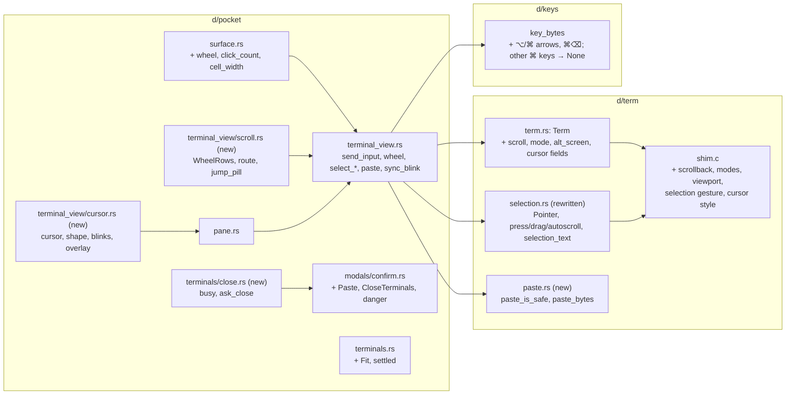

# E07 Terminal Surface Implementation Plan

> **For Claude:** REQUIRED SUB-SKILL: Use /implement to execute this plan task-by-task.

**Goal:** The Terminal works like a Mac terminal. It keeps 10 000 lines of history and scrolls them with the wheel, with a "Jump to bottom ↓" pill. It selects with 1, 2 or 3 clicks, Shift-click and drag-past-the-edge, and ⌘A selects everything. ⌘C copies and ⌘V pastes, asking first when a paste could run something. ⌥←/→, ⌘←/→ and ⌘⌫ edit the line. A window drag reflows the program once. Closing a working agent or a running command asks first. The cursor takes the shape the program asks for, blinks, and turns hollow when the pane is unfocused. IME composition shows at the cursor.

**Base:** main `5091a01`. Every `path:line` is at that commit unless it says "after PR N". Line height stays 22 (roadmap plan question, UXD §9 Q3).

**Design:** `docs/designs/2026-09-30-terminal-surface.md`. Roadmap: `docs/orchestrators/product/05-roadmap.md:330-355` (E07). FR 07-1…07-6. Decisions D9, D32.

**Toolset** (from `packages/desktop`):
- one test: `cargo test -p term <name>`, `cargo test -p keys <name>`, `cargo test -p pocket <filter>`
- full, at every PR boundary: `cargo build --workspace && cargo clippy --workspace --all-targets && cargo test --workspace`. Clippy must add no new warnings. Main already has nine: `git.rs:101` `double_ended_iterator_last`, five `single_range_in_vec_init` at `git.rs:602-604` (the `git` lib test target), and three `field_reassign_with_default` in `pocket/src/inbox.rs:137-158`.
- View check: `.ui-review/fixture/capture.sh <dir> <name>=<steps>…`, before and after, then compare.
- The shell is fish. Use `env VAR=value cmd`, not `VAR=value cmd`.
- `shim.c` changes rebuild through `crates/term/build.rs`. If a test still sees the old shim, `touch crates/term/src/shim.c`.

**Scratch pocketd** (05-roadmap §7). Never start, stop or restart the pocketd you are working in. Every manual check below runs against this one:
```
mkdir -p /tmp/pocket-scratch-e07
echo '{"token":"scratch","port":4607}' > /tmp/pocket-scratch-e07/config.json
cd packages/pocketd && env -u POCKETD_PTY -u POCKETD_SOCK POCKET_HOME=/tmp/pocket-scratch-e07 POCKETD_SOCK=/tmp/pocket-scratch-e07/pocketd.sock go run ./cmd/pocketd serve
```
Every other command gets the prefix `env -u POCKETD_PTY -u POCKETD_SOCK POCKET_HOME=/tmp/pocket-scratch-e07 POCKETD_SOCK=/tmp/pocket-scratch-e07/pocketd.sock`, called **SCRATCH** below. No check needs a paid agent turn. For a "working" agent, use the fake claude: `cd packages/pocketd && go build -o /tmp/pocket-scratch-e07/bin/claude ./e2e/fakeclaude`, and put `/tmp/pocket-scratch-e07/bin` first on `PATH`.

**UX decisions this plan uses** (05-roadmap §7.1, verbatim):

| UX section | Spec says | Winning decision | Text to build |
|---|---|---|---|
| UXD §2.0 Palette struct | `Palette` + `LIGHT`/`DARK` statics + `p(cx)` | Owner's dark-theme plan | `theme::Token { light, dark }` consts, read as `theme::X` (`Into<Hsla>`); `Token::pick(dark)` in tests. No `Palette`, no `p(cx)` |
| UXD §2.1 dark values | Zeron dark palette | Owner's dark-theme plan | The owner's MonoCode dark values. ACCENT 5b5bd6, agent colours and the status fills stay the same in both schemes; E16 tokens carry dark values (WAITING ffb224, FAILED e5484d, FAILED_TEXT ff9592, SUCCESS 30a46c, SUCCESS_TEXT 3dd68c) |
| UXD §2.1 chrome literals | FIELD / OVERLAY / DIALOG / SCRIM / PAPER / ACCENT_GLOW tokens | Owner's dark-theme plan | The owner's SIDE / GLASS / POPOVER / HIGHLIGHT / WELL / WINDOW_SOLID and inline `Token::new` literals; the Accent shadow 0x0a84ff59 and the 0x1111131a dims stay literal |

**Rebased on 5091a01** (how this plan differs from the design, which cites `f8f7293`). Each item is also logged in the design's Decisions log.
- **Mouse selection and ⌘C already shipped** (`5091a01`): `term::Selection`, `terminal_view::Drag`, the `CopySelection` action bound to `cmd-c` in `keys::CONTEXT`, and `theme::SELECTION`. PR 2 moves the selection itself into libghostty's gesture state machine. The owner's `Pos` records a screen position, so it can't follow scrolling or new output, can't autoscroll into history, and ⌘A can't reach history.
  - Kept: `CopySelection` and its binding, `SELECTION`, the `TerminalViewState.selection: Option<Drag>` field, and `Drag` following only the pane it started in.
  - The five owner tests in `term/src/selection.rs` keep their names and are re-pinned against `Term`. One pin changes: `copied_rows_drop_trailing_blanks_but_keep_inner_ones` now expects `"a b"`, not `"a b\n"`, because ghostty's `trim` drops trailing blank lines.
  - The owner tests that pin screen boundaries change, because the pointer now names a cell, not a boundary (ghostty rounds to the nearest boundary itself, from the pixel `x`):
    - pocket's `a_drag_selects_in_the_pane_it_started_in_until_released` becomes `a_drag_follows_only_the_pane_it_started_in`. `Drag` no longer holds a selection or a release flag.
    - `surface.rs`'s `a_point_takes_the_nearest_boundary_on_the_row_it_is_in_counting_up_from_the_bottom` is deleted with `grid_point`.
    - `surface.rs`'s `a_point_off_the_grid_keeps_to_its_edge` moves to `term/src/selection.rs` as `Pointer::at`'s test. Its expectations go from bottom-up boundaries (row 4, col 0) / (row 0, col 10) to top-down cells (col 0, row 0) / (col 9, row 4).
- **Clicks are counted by GPUI's `click_count`.** Ghostty's press repeat is forced on (`TIME_NS` 0, unlimited interval and distance), so ghostty still drags word by word and line by line. No NSEvent, no `doubleClickInterval`, no Cargo.toml change.
- **No 2 px arm.** Ghostty's gesture decides when a drag begins. `a_click_without_a_drag_selects_nothing` pins it.
- **Selection is painted with the owner's `SELECTION`** as the cell background. No `TERM_SELECTION`, no blend, no half alpha. `TERM_CURSOR` is the only new token.
- **`SelectAll` and `Paste` are pocket actions** in `pocket/src/actions.rs`, next to `CopySelection`. They aren't `keys` actions.
- **Selection code stays in `terminal_view.rs`.** No `select.rs` or `clipboard.rs`.
- **No Ended status.** `8a10124` drops a session when its agent exits, so there's nothing left to confirm.
- **The scrollback test accepts 9 000–10 000 lines.** libghostty prunes a whole page at a time. The design said ≥ 10 000.
- **More → Close session closes its own menu before `close_session`**, so it doesn't close the confirm that `close_session` may open. Tab × already goes through `close_tab`, so `tabs.rs` doesn't change.
- **⌘C copies the focused pane's selection.** Other panes keep theirs until they get input.
- The dark theme has landed (`1e71e24`). New colours are `theme::Token`s used directly (`TERM_CURSOR`, `SELECTION`).
- `surface.rs` line numbers from PR 1 on are after E01 PR3, which always merges first (PR 1 depends on it).

**Read first:**
- `docs/designs/2026-09-30-terminal-surface.md`: Contract and Decisions log.
- `CLAUDE.md` (repo root): the desktop layout rules. Logic goes in free functions or plain types. Tests sit beside the logic and are named as sentences. No comments that restate code.
- `docs/plans/2026-09-30-fix-now.md` PR 3. That's where `surface::term_font()` comes from; PR 5 uses it.
- `packages/desktop/crates/term/src/shim.c` and `third_party/ghostty/zig-out/include/ghostty/vt/{terminal,selection,render,paste}.h` at the pin `4ae9f1a2`.
- `packages/desktop/crates/pocket/src/explorer/preview/header.rs:19-31`: the `cx.spawn` + `background_executor().timer` pattern that autoscroll, fit and blink copy.

**Assumptions:**
- E01 PR3 merges before E07 PR1. PR 1 depends on it, and PR 2, 3 and 5 depend on PR 1. PR 4 depends on nothing.
- The pinned libghostty exports the selection gesture API, `selection_format_alloc`, `terminal_select_all`, `ROW_DATA_SELECTION`, `paste_is_safe`/`paste_encode`, `OPT_SCROLLBACK_MAX_LINES`, `OPT_DEFAULT_CURSOR_BLINK` and `DATA_VIEWPORT_ACTIVE`. All were compiled against in `/tmp/terminal-surface-check`.
- The scroll-viewport tags are `TOP` 0, `BOTTOM` 1, `DELTA` 2 (`terminal.h:226-232`).
- An agent is "Working" when `Status::of` returns `Status::Working`. `Status::of` returns `None` for a summary that isn't attached, and that terminal then counts as a shell.

---

## Architecture



`d/term` gets everything that needs libghostty: history, modes, the selection gesture, paste encoding and cursor style. All of it is tested against a real `Term`. `d/pocket` gets small new modules (`scroll`, `cursor`, `terminals/close`) that hold the decisions as free functions or plain types, and `impl Desktop` only wires them to GPUI events. Every byte typed, composed, pasted or wheeled as arrow keys goes through one `send_input`, which clears the selection, snaps the view to the bottom and resets the blink.

## Why this approach

- **History lives in the desktop VT: 10 000 lines, no byte cap.** Rejected: a lane P change so that pocketd keeps history too (E07 is lane C).
- **The wheel builds up whole rows per gesture and per pane.** In a full-screen app with mode 1007 it becomes arrow keys; Shift always scrolls history. Rejected: always scrolling the viewport, which breaks scrolling in `less` and `vim`.
- **One `send_input` snaps to the bottom on any input.** Rejected: snapping at each call site.
- **Selection moves into libghostty's gesture state machine.** Rejected: extending the owner's `Pos` selection, which can't follow scrolling or output. Also rejected: GPUI `select_word`/`select_line` alone, which can't drag word by word.
- **GPUI counts clicks; ghostty is told every press repeats.** Rejected: reading NSEvent's `doubleClickInterval` through objc, a new dependency for the same result.
- **Autoscroll runs a 24 ms task at 1, 2 or 3 rows per tick.** Rejected: scrolling on mouse moves, which stops when the mouse holds still past the edge.
- **Paste asks only when the pane doesn't bracket pastes and `paste_is_safe` is false.** Rejected: always asking for multi-line pastes (Terminal.app doesn't).
- **⌥←/→ send `ESC b`/`ESC f`, ⌘←/→ send `^A`/`^E`, ⌘⌫ sends `^U`, and no other ⌘ key reaches the PTY.** Rejected: xterm modifier sequences, which zsh and bash don't bind by default.
- **The first fit goes out at once; later fits wait until the size has held for 80 ms.** Rejected: waiting on every fit, which draws a new shell's prompt at the wrong width.
- **Closing asks only for a Working agent or a shell running a command.** Rejected: asking for Needs you too (FR 07-6 says Working).
- **The cursor is drawn over the text in translucent `TERM_CURSOR`.** Rejected: inverting the cell, which UXD replaces with a translucent block.
- **One 530 ms blink timer runs only while the focused cursor blinks, the window is active and Reduce Motion is off.** Every tick redraws the whole window, so it never runs otherwise. Rejected: a timer that always runs.
- **IME text is drawn at the caret, and `bounds_for_range` returns the caret cell** so the candidate window opens there.

## Tasks at a glance

**PR 1 · Scrollback, wheel and "Jump to bottom".** FR 07-1. 10k lines, `scroll_viewport`, wheel accumulation, snap to bottom, the pill.

| Task | What | Main files | Risk |
|---|---|---|---|
| 1.1 | 10 000 lines of history; scroll the viewport; report `at_bottom` | `term/src/shim.c`, `term/src/term.rs` | Low |
| 1.2 | DEC private modes and the alternate screen | `shim.c`, `term.rs` | Low |
| 1.3 | Wheel rows, routing and arrow bytes | `pocket/src/terminal_view/scroll.rs` (new) | Low |
| 1.4 | Wire the wheel; one `send_input` snaps to the bottom | `terminal_view.rs`, `surface.rs`, `terminals/sessions.rs` | Medium: wheel sign on hardware |
| 1.5 | "Jump to bottom ↓" pill | `scroll.rs`, `pane.rs` | Low |

**PR 2 · Selection lives in libghostty; ⌘A.** FR 07-2. 1/2/3 clicks, Shift-extend, autoscroll, ⌘C plain text, ⌘A.

| Task | What | Main files | Risk |
|---|---|---|---|
| 2.1 | `Term` selects through ghostty's gesture; owner tests re-pinned | `term/src/selection.rs`, `shim.c`, `term.rs` | Medium: FFI structs |
| 2.2 | Pocket drives it: click count, Shift, autoscroll, copy | `terminal_view.rs`, `surface.rs`, `pane.rs` | Medium |
| 2.3 | ⌘A; input clears the selection | `actions.rs`, `terminal_view.rs`, `pane.rs` | Low |

**PR 3 · ⌘V with an unsafe-paste confirm.** FR 07-3.

| Task | What | Main files | Risk |
|---|---|---|---|
| 3.1 | `paste_is_safe`, `paste_bytes` | `term/src/paste.rs` (new), `term.rs` | Low |
| 3.2 | Confirm text for pastes; Primary vs Danger button | `pocket/src/modals/confirm.rs` | Low |
| 3.3 | `Paste` action, handler and confirm | `actions.rs`, `chrome.rs`, `confirm.rs`, `terminal_view.rs`, `pane.rs` | Low |

**PR 4 · Mac keys, fit debounce, close-while-busy confirm.** FR 07-4, 07-6. Depends on nothing.

| Task | What | Main files | Risk |
|---|---|---|---|
| 4.1 | ⌥←/→, ⌘←/→, ⌘⌫; other ⌘ keys never reach the PTY | `keys/src/keys.rs` | Low |
| 4.2 | First fit at once, later fits after 80 ms | `pocket/src/terminals.rs`, `surface.rs` | Low |
| 4.3 | `busy()` and the close confirm text | `terminals/close.rs` (new), `confirm.rs` | Low |
| 4.4 | Ask before closing: pane ×, tab ×, More → Close session | `close.rs`, `chrome.rs`, `confirm.rs`, `terminals.rs`, `pane.rs`, `modals/more.rs` | Medium: three entry points |

**PR 5 · Cursor shape, blink, hollow; IME preedit.** FR 07-5.

| Task | What | Main files | Risk |
|---|---|---|---|
| 5.1 | Cursor style and blink from DECSCUSR | `shim.c`, `term.rs` | Low |
| 5.2 | Cursor decisions: shown, shape, blinks | `pocket/src/terminal_view/cursor.rs` (new) | Low |
| 5.3 | Draw the caret and IME text; no more inversion | `cursor.rs`, `surface.rs`, `terminal_view.rs`, `pane.rs`, `theme.rs` | Medium: IME placement |
| 5.4 | Blink timer | `terminal_view.rs`, `pane.rs`, `desktop.rs` | Low |

---

## PR 1: Scrollback, wheel and "Jump to bottom"

**Scope:** Each Terminal pane keeps 10 000 lines of history. The wheel and trackpad scroll it one whole row at a time. In full-screen apps that ask for it (mode 1007), the wheel sends arrow keys instead, and Shift-wheel always scrolls history. Any input snaps back to the bottom. While scrolled up, a "Jump to bottom ↓" pill shows.
**Depends on:** E01 PR3 (`surface.rs`). `surface.rs` anchors here are after E01 PR3: it adds `use std::sync::Arc;` after `:4`, `term_font` (6 lines) after `:12`, and `let base = term_font();` in `screen`, so 5091a01's `:13-74` are 7 higher and `:75` on are 8 higher. E16 PR1 (wk2) and E03 PR4 (wk3) edit `terminal_view.rs` first; apply Task 1.4 by content. E03 PR4 returns early from `on_term_key` and `replace_text_in_range` when `self.agents.observe_only()`. Keep both, and put the same return first in `send_input`, which also carries wheel arrows and PR 3's pastes; it stays first when PR 2 and PR 5 change `send_input`.
**Done when:** the full line is green, and the manual check in Task 1.5 passes.

### Task 1.1: History and viewport scroll in `Term`

**What & why:** `pt_new` sets no options (P `crates/term/src/shim.c:32-43`), so libghostty keeps its small default history, and nothing can move the viewport. This sets a 10 000-line limit with no byte cap, adds viewport scrolling, and reports whether the viewport is at the bottom.

**Files:**
- Modify: `packages/desktop/crates/term/src/shim.c:17-21` (`PFrame`), `:32-35` (`pt_new`), after `:50` (new functions), after `:68` (`pt_frame`)
- Modify: `packages/desktop/crates/term/src/term.rs:21-31` (`Frame`), after `:39` (consts), `:41-48` (extern), `:57` (`new`), after `:72` (methods)
- Test: `term.rs` `mod tests`, after `:129`

**Context:** `ghostty_terminal_scroll_viewport` takes a tag (`TOP` 0, `BOTTOM` 1, `DELTA` 2) and a delta that is negative for up (`terminal.h:219-273`). `DATA_VIEWPORT_ACTIVE` is true while the viewport shows the active screen, which means at the bottom (`terminal.h:2016`). Scrollback is pruned a page at a time, so past the cap the history holds a few hundred fewer lines than the cap.

**Step 1: Write the failing tests**

Insert after `term.rs:129` (the end of `reports_application_cursor_mode`):
```rust

    fn row(t: &mut Term, y: usize) -> String {
        let (f, cells) = t.frame();
        cells[y * f.cols as usize..][..f.cols as usize].iter().map(Cell::ch).collect::<String>().trim_end().to_string()
    }

    fn lines(t: &mut Term, range: std::ops::Range<usize>) {
        for i in range {
            t.write(format!("{i}\r\n").as_bytes());
        }
    }

    #[test]
    fn keeps_ten_thousand_lines_of_scrollback() {
        let mut t = Term::new(80, 5);
        lines(&mut t, 0..30_000);
        assert!((9_000..=SCROLLBACK).contains(&t.scrollback_rows()), "{}", t.scrollback_rows());
    }

    #[test]
    fn scrolling_up_leaves_the_bottom_and_back_returns_to_it() {
        let mut t = Term::new(20, 5);
        lines(&mut t, 0..50);
        assert_eq!((t.frame().0.at_bottom, row(&mut t, 0).as_str()), (1, "46"));
        t.scroll(Scroll::Delta(-3));
        assert_eq!((t.frame().0.at_bottom, row(&mut t, 0).as_str()), (0, "43"));
        t.scroll(Scroll::Bottom);
        assert_eq!((t.frame().0.at_bottom, row(&mut t, 0).as_str()), (1, "46"));
    }

    #[test]
    fn output_while_scrolled_up_keeps_the_viewport() {
        let mut t = Term::new(20, 5);
        lines(&mut t, 0..50);
        t.scroll(Scroll::Delta(-10));
        lines(&mut t, 50..60);
        assert_eq!((t.frame().0.at_bottom, row(&mut t, 0).as_str()), (0, "36"));
    }
```

**Step 2: Run the tests to verify they fail**

Run: `cd packages/desktop && cargo test -p term scroll`
Expected: FAIL to compile: `cannot find value SCROLLBACK`, `use of undeclared type Scroll`, `no method named scrollback_rows`, `no field at_bottom`.

**Step 3: Write the implementation**

`shim.c`. In `PFrame`, after `:20` (`uint8_t fg[3], bg[3];`):
```c
  uint8_t at_bottom;
```
Replace `:32-35` (the `pt_new` signature through `ghostty_terminal_new`):
```c
PTerm* pt_new(uint16_t cols, uint16_t rows, size_t scrollback) {
  PTerm* p = calloc(1, sizeof(PTerm));
  if (!p) return NULL;
  if (ghostty_terminal_new(NULL, &p->term, cols, rows) != GHOSTTY_SUCCESS ||
      ghostty_terminal_set(p->term, GHOSTTY_TERMINAL_OPT_SCROLLBACK_MAX_LINES, &scrollback) != GHOSTTY_SUCCESS ||
      ghostty_terminal_set(p->term, GHOSTTY_TERMINAL_OPT_SCROLLBACK_MAX_BYTES, NULL) != GHOSTTY_SUCCESS ||
```
After `:50` (the end of `pt_app_cursor`):
```c

void pt_scroll(PTerm* p, int tag, intptr_t delta) {
  GhosttyTerminalScrollViewport s = {.tag = (GhosttyTerminalScrollViewportTag)tag, .value = {.delta = delta}};
  ghostty_terminal_scroll_viewport(p->term, s);
}

size_t pt_scrollback_rows(PTerm* p) {
  size_t n = 0;
  ghostty_terminal_get(p->term, GHOSTTY_TERMINAL_DATA_SCROLLBACK_ROWS, &n);
  return n;
}
```
In `pt_frame`, after `:68` (`f->cursor_y = cur.viewport_y;`):
```c
  bool at_bottom = true;
  ghostty_terminal_get(p->term, GHOSTTY_TERMINAL_DATA_VIEWPORT_ACTIVE, &at_bottom);
  f->at_bottom = at_bottom;
```

`term.rs`. In `Frame`, after `:30` (`pub bg: [u8; 3],`):
```rust
    /// 0 while the user has scrolled up into history.
    pub at_bottom: u8,
```
After `:39` (`WIDE_SPACER_TAIL`):
```rust

/// Most lines of history kept above the screen. libghostty prunes a whole page at a time, so past the cap it keeps a few hundred fewer.
pub const SCROLLBACK: usize = 10_000;

#[derive(Clone, Copy, Debug, PartialEq)]
pub enum Scroll {
    Bottom,
    /// Rows; negative moves toward older output.
    Delta(isize),
}
```
In the extern block, `:42` becomes the first line below, and the other two go after `:44` (`pt_app_cursor`):
```rust
    fn pt_new(cols: u16, rows: u16, scrollback: usize) -> *mut c_void;
```
```rust
    fn pt_scroll(p: *mut c_void, tag: i32, delta: isize);
    fn pt_scrollback_rows(p: *mut c_void) -> usize;
```
`:57` becomes:
```rust
        let ptr = unsafe { pt_new(cols, rows, SCROLLBACK) };
```
After `:72` (the end of `app_cursor`):
```rust

    pub fn scroll(&mut self, s: Scroll) {
        let (tag, delta) = match s {
            Scroll::Bottom => (1, 0),
            Scroll::Delta(d) => (2, d),
        };
        unsafe { pt_scroll(self.ptr, tag, delta) }
    }

    pub fn scrollback_rows(&self) -> usize {
        unsafe { pt_scrollback_rows(self.ptr) }
    }
```

**Step 4: Run the tests to verify they pass**

Run: `cd packages/desktop && cargo test -p term`
Expected: PASS, including the three new tests.

### Task 1.2: DEC private modes and the alternate screen

**What & why:** The wheel must know whether a full-screen app is showing (the alternate screen) and whether it wants the wheel as arrow keys (mode 1007). PR 3 also reads bracketed paste (mode 2004). One `mode(dec)` replaces the single-purpose `pt_app_cursor`.

**Files:**
- Modify: `packages/desktop/crates/term/src/shim.c:47-50` (`pt_app_cursor`)
- Modify: `packages/desktop/crates/term/src/term.rs:44` (extern), `:70-72` (`app_cursor`)
- Test: `term.rs` `mod tests`, after the Task 1.1 tests

**Context:** `ghostty_mode_new(value, ansi)` builds a mode key; `false` means a DEC private mode (`modes.h:81,91`). `DATA_ACTIVE_SCREEN` reports primary or alternate (`terminal.h:1761`). Mode 1007 is on by default in libghostty.

**Step 1: Write the failing test**

Insert after `output_while_scrolled_up_keeps_the_viewport`:
```rust

    #[test]
    fn reports_the_alternate_screen_and_its_scroll_mode() {
        let mut t = Term::new(10, 2);
        assert!(!t.alt_screen() && t.mode(1007));
        t.write(b"\x1b[?1049h\x1b[?1007l");
        assert!(t.alt_screen() && !t.mode(1007));
    }
```

**Step 2: Run the test to verify it fails**

Run: `cd packages/desktop && cargo test -p term reports_the_alternate_screen_and_its_scroll_mode`
Expected: FAIL to compile: `no method named alt_screen`, `no method named mode`.

**Step 3: Write the implementation**

`shim.c:47-50` (`pt_app_cursor`) becomes:
```c
uint8_t pt_mode(PTerm* p, uint16_t dec) {
  GhosttyTerminalModeConfig m = {.mode = ghostty_mode_new(dec, false)};
  return ghostty_terminal_get(p->term, GHOSTTY_TERMINAL_DATA_MODE, &m) == GHOSTTY_SUCCESS && m.value;
}

uint8_t pt_alt_screen(PTerm* p) {
  GhosttyTerminalScreen s = GHOSTTY_TERMINAL_SCREEN_PRIMARY;
  ghostty_terminal_get(p->term, GHOSTTY_TERMINAL_DATA_ACTIVE_SCREEN, &s);
  return s == GHOSTTY_TERMINAL_SCREEN_ALTERNATE;
}
```
`term.rs:44` (`fn pt_app_cursor…`) becomes:
```rust
    fn pt_mode(p: *mut c_void, dec: u16) -> u8;
    fn pt_alt_screen(p: *mut c_void) -> u8;
```
`term.rs:70-72` (`app_cursor`) becomes:
```rust
    pub fn app_cursor(&self) -> bool {
        self.mode(1)
    }

    /// Whether DEC private mode `dec` (`CSI ? dec h`) is set.
    pub fn mode(&self, dec: u16) -> bool {
        unsafe { pt_mode(self.ptr, dec) == 1 }
    }

    pub fn alt_screen(&self) -> bool {
        unsafe { pt_alt_screen(self.ptr) == 1 }
    }
```

**Step 4: Run the tests to verify they pass**

Run: `cd packages/desktop && cargo test -p term`
Expected: PASS, including `reports_application_cursor_mode`, which now goes through `mode(1)`.

### Task 1.3: Wheel rows, routing and arrow bytes

**What & why:** Trackpads send pixel deltas that are usually smaller than a row. Carrying the fraction over within one gesture on one pane makes a slow swipe scroll, and makes a new gesture start clean. Routing decides between history and arrow keys. These are free functions, so they can be tested without GPUI.

**Files:**
- Create: `packages/desktop/crates/pocket/src/terminal_view/scroll.rs`
- Modify: `packages/desktop/crates/pocket/src/terminal_view.rs:1` (add the module)
- Test: `scroll.rs` `mod tests`

**Context:** GPUI's `ScrollWheelEvent` has `delta: ScrollDelta` (`Lines` or `Pixels`), `modifiers` and `touch_phase` (`gpui-pre-0.3.6/src/interactive.rs:522-554`). A positive `y` means the content moves down, which reveals older output. The test module imports named items, not `gpui_kit::*`, because gpui's glob exports a `test` macro that shadows `#[test]`.

**Step 1: Write the failing tests**

After `terminal_view.rs:1` (`pub(crate) mod pane;`) add:
```rust
pub(crate) mod scroll;
```
Create `scroll.rs` with only the tests:
```rust
#[cfg(test)]
mod tests {
    use super::{Wheel, WheelRows, arrows, route};
    use gpui_kit::{ScrollDelta, TouchPhase, point, px};

    fn pixels(y: f32) -> ScrollDelta {
        ScrollDelta::Pixels(point(px(0.), px(y)))
    }

    #[test]
    fn pixel_deltas_accumulate_into_whole_rows() {
        let mut w = WheelRows::default();
        assert_eq!(w.rows("a", pixels(15.), TouchPhase::Started, 20.), 0);
        assert_eq!(w.rows("a", pixels(15.), TouchPhase::Moved, 20.), 1);
        assert_eq!(w.rows("a", pixels(-30.), TouchPhase::Moved, 20.), -1);
        assert_eq!(w.rows("a", ScrollDelta::Lines(point(0., 3.)), TouchPhase::Moved, 20.), 3);
    }

    #[test]
    fn a_new_gesture_or_pane_drops_the_remainder() {
        let mut w = WheelRows::default();
        w.rows("a", pixels(15.), TouchPhase::Started, 20.);
        assert_eq!(w.rows("a", pixels(15.), TouchPhase::Started, 20.), 0);
        assert_eq!(w.rows("b", pixels(15.), TouchPhase::Moved, 20.), 0);
    }

    #[test]
    fn shift_always_scrolls_the_viewport() {
        assert_eq!(route(3, true, true, true), Wheel::Viewport(-3));
        assert_eq!(route(-2, false, false, true), Wheel::Viewport(2));
    }

    #[test]
    fn alt_screen_with_alternate_scroll_sends_arrows() {
        assert_eq!(route(3, false, true, true), Wheel::Arrows { up: true, n: 3 });
        assert_eq!(route(-1, false, true, true), Wheel::Arrows { up: false, n: 1 });
        assert_eq!(route(2, false, true, false), Wheel::Viewport(-2));
        assert_eq!(arrows(true, 2, false), b"\x1b[A\x1b[A");
        assert_eq!(arrows(false, 1, true), b"\x1bOB");
    }
}
```

**Step 2: Run the tests to verify they fail**

Run: `cd packages/desktop && cargo test -p pocket scroll::tests`
Expected: FAIL to compile: `unresolved imports super::Wheel, super::WheelRows, super::arrows, super::route`.

**Step 3: Write the implementation**

Insert at the top of `scroll.rs`:
```rust
use gpui_kit::*;

/// Turns wheel and trackpad deltas into whole rows, carrying the fraction over within one gesture on one pane.
#[derive(Default)]
pub struct WheelRows {
    pane: String,
    rest: f32,
}

impl WheelRows {
    /// Rows to move; positive is toward older output.
    pub fn rows(&mut self, pane: &str, delta: ScrollDelta, phase: TouchPhase, line: f32) -> isize {
        if self.pane != pane || phase == TouchPhase::Started {
            self.pane = pane.to_string();
            self.rest = 0.;
        }
        let y = match delta {
            ScrollDelta::Lines(l) => l.y,
            ScrollDelta::Pixels(p) => f32::from(p.y) / line,
        };
        let total = self.rest + y;
        self.rest = total.fract();
        total.trunc() as isize
    }
}

#[derive(Debug, PartialEq)]
pub enum Wheel {
    Viewport(isize),
    Arrows { up: bool, n: usize },
}

/// Full-screen apps that ask for it (mode 1007) get the wheel as arrow keys; Shift always scrolls the history.
pub fn route(rows: isize, shift: bool, alt_screen: bool, alt_scroll: bool) -> Wheel {
    if alt_screen && alt_scroll && !shift {
        Wheel::Arrows { up: rows > 0, n: rows.unsigned_abs() }
    } else {
        Wheel::Viewport(-rows)
    }
}

pub fn arrows(up: bool, n: usize, app_cursor: bool) -> Vec<u8> {
    let key = [if app_cursor { b'O' } else { b'[' }, if up { b'A' } else { b'B' }];
    [&[0x1b][..], &key].concat().repeat(n)
}

```

**Step 4: Run the tests to verify they pass**

Run: `cd packages/desktop && cargo test -p pocket scroll::tests`
Expected: PASS (4 tests). Rustc warns that `route` and `arrows` are unused until Task 1.4.

### Task 1.4: Wire the wheel; one `send_input`

**What & why:** The surface's canvas already registers the mouse handlers for selection. This adds the wheel handler there. A single `send_input` carries every typed, composed or pasted byte, and the arrow keys the wheel sends to full-screen apps, so any input snaps the view back to the prompt, and PR 2 and PR 5 hook into the same place.

**Files:**
- Modify: `packages/desktop/crates/pocket/src/terminals/sessions.rs`, after `:66` (`get_mut`)
- Modify: `packages/desktop/crates/pocket/src/terminal_view.rs:9-11` (imports), `:23` and `:28` (state), after `:92` (new methods), `:104` (`on_term_key`), `:176-181` (`replace_text_in_range`)
- Modify: `packages/desktop/crates/pocket/src/terminal_view/surface.rs` after E01 PR3: `:44-45` (clones), after `:60` (wheel handler)

**Context:** P `pocket/src/terminal_view/surface.rs:36-53` registers `MouseDown`/`Move`/`Up` handlers in the paint closure; the hitbox check keeps a wheel over one pane from scrolling another. `daemon.input` (P `terminal_view.rs:104`, `:179`) is the only way bytes reach pocketd today.

**Step 1: `Sessions::term`**

After `sessions.rs:66`:
```rust

    pub fn term(&mut self, id: &str) -> Option<&mut Term> {
        self.get_mut(id).and_then(|s| s.term.as_mut())
    }
```

**Step 2: The Desktop methods**

`terminal_view.rs`: after `:9` (`use gpui_kit::*;`) add `use scroll::{Wheel, WheelRows};`. `:11` becomes `use term::{Pos, Scroll, Selection};`.
After `:23` (`pub(crate) selection: Option<Drag>,`):
```rust
    pub(crate) wheel: WheelRows,
```
`:28` becomes:
```rust
        Self { focus: cx.focus_handle(), focused: None, marked: None, tab_scroll: ScrollHandle::new(), tab_revealed: None, tab_menu: false, selection: None, wheel: WheelRows::default() }
```
After `:92` (the end of `copy_selection`):
```rust

    pub(crate) fn wheel(&mut self, pane: &str, e: &ScrollWheelEvent, line: f32, cx: &mut Context<Self>) {
        let rows = self.terminal.wheel.rows(pane, e.delta, e.touch_phase, line);
        let Some(t) = self.terminals.sessions.term(pane).filter(|_| rows != 0) else { return };
        match scroll::route(rows, e.modifiers.shift, t.alt_screen(), t.mode(1007)) {
            Wheel::Viewport(d) => t.scroll(Scroll::Delta(d)),
            Wheel::Arrows { up, n } => {
                let bytes = scroll::arrows(up, n, t.app_cursor());
                self.send_input(pane, &bytes, cx);
            }
        }
        cx.notify();
    }

    pub(crate) fn scroll_to_bottom(&mut self, pane: &str, cx: &mut Context<Self>) {
        if let Some(t) = self.terminals.sessions.term(pane) {
            t.scroll(Scroll::Bottom);
            cx.notify();
        }
    }

    /// The one way input reaches a pane, so the view always returns to the prompt.
    pub(crate) fn send_input(&mut self, pane: &str, bytes: &[u8], cx: &mut Context<Self>) {
        self.scroll_to_bottom(pane, cx);
        self.daemon.input(pane, bytes);
    }
```
`:104` becomes:
```rust
            self.send_input(&id, &bytes, cx);
```
`:176-181` becomes:
```rust
    fn replace_text_in_range(&mut self, _: Option<Range<usize>>, text: &str, _: &mut Window, cx: &mut Context<Self>) {
        self.terminal.marked = None;
        if let Some(id) = self.terminal.focused.clone() {
            self.send_input(&id, text.as_bytes(), cx);
        }
    }
```

**Step 3: The wheel handler**

`surface.rs:44-45` (after E01 PR3) become:
```rust
            let (down, moved, up, wheel) = (view.clone(), view.clone(), view.clone(), view);
            let (down_pane, moved_pane, wheel_pane) = (pane.clone(), pane.clone(), pane);
            let wheel_hitbox = hitbox.clone();
```
After `:60` (the end of the `MouseUpEvent` handler):
```rust
            window.on_mouse_event(move |e: &ScrollWheelEvent, phase, window, cx| {
                if phase == DispatchPhase::Bubble && wheel_hitbox.is_hovered(window) {
                    wheel.update(cx, |d, cx| d.wheel(&wheel_pane, e, line, cx));
                }
            });
```

**Step 4: Run the gate**

Run: `cd packages/desktop && cargo build --workspace && cargo clippy --workspace --all-targets && cargo test --workspace`
Expected: PASS, no new clippy warnings.

### Task 1.5: "Jump to bottom ↓" pill

**What & why:** While scrolled up, nothing shows that newer output is below. The pill sits over the pane's bottom-right corner, and clicking it returns to the bottom (UXD §3.5).

**Files:**
- Modify: `packages/desktop/crates/pocket/src/terminal_view/scroll.rs` (imports, `jump_pill`)
- Modify: `packages/desktop/crates/pocket/src/terminal_view/pane.rs:3` (imports), `:91-97` (body), `:123-124` (screen)

**Context:** `ui::button(id, Variant::Glass, None, label)` is the glass chrome button; `occlude()` keeps the click from reaching the surface's mouse handlers underneath. `Frame.at_bottom` comes from Task 1.1.

**Step 1: `jump_pill`**

`scroll.rs`: replace `use gpui_kit::*;` with:
```rust
use crate::desktop::Desktop;
use crate::desktop::chrome::id;
use gpui_kit::*;
use theme::SANS;
use ui::Variant;
```
After `arrows`:
```rust

pub fn jump_pill(pane: &str, cx: &mut Context<Desktop>) -> Div {
    let pane = pane.to_string();
    let button = ui::button(id(format!("jump-{pane}")), Variant::Glass, None, "Jump to bottom ↓")
        .h(px(28.))
        .rounded(px(14.))
        .text_size(px(12.))
        .font_family(SANS)
        .on_click(cx.listener(move |this, _: &ClickEvent, _, cx| this.scroll_to_bottom(&pane, cx)));
    div().absolute().right(px(12.)).bottom(px(12.)).occlude().child(button)
}
```

**Step 2: Show it while scrolled up**

`pane.rs`: after `:3` (`use crate::status;`) add `use crate::terminal_view::scroll;`.
`:91-97` become:
```rust
        let (body, grid, scrolled) = match self.terminals.sessions.get_mut(id).and_then(|s| s.term.as_mut()) {
            Some(t) => {
                let (f, cells) = t.frame();
                (surface::screen(&f, cells, m, shown), Some((f.cols, f.rows)), f.at_bottom == 0)
            }
            None => (div().text_color(TEXT_3).child(if known { "Connecting…" } else { "This session is not running." }), None, false),
        };
```
`:124` (`.child(body);`) becomes:
```rust
            .child(body)
            .children(scrolled.then(|| scroll::jump_pill(id, cx)));
```

**Step 3: Run the gate**

Run: `cd packages/desktop && cargo build --workspace && cargo clippy --workspace --all-targets && cargo test --workspace`
Expected: PASS, no new clippy warnings.

**Step 4: Manual check (scratch pocketd)**

1. `cd packages/desktop && SCRATCH cargo run --release -p pocket`. Open a Terminal tab.
2. Run `seq 1 20000`. Scroll up with the trackpad. Expected: the text moves with your fingers (older lines appear from above), and the pill shows.
3. Keep scrolling to the top. Expected: the first line is between `10001` and `11001` (history is capped at 9 000–10 000 lines).
4. Click the pill. Expected: back at `20000`, and the pill is gone. Scroll up again and type `x`. Expected: the view snaps to the prompt.
5. Run `less /etc/services` and scroll. Expected: `less` scrolls. Shift-scroll moves the viewport instead. Quit with `q`.
6. Capture before and after: `.ui-review/fixture/capture.sh /tmp/e07-pr1-before session=session` on main, then `/tmp/e07-pr1-after` on this branch. Expected: no layout change.

---

## PR 2: Selection lives in libghostty; ⌘A

**Scope:** The selection moves from the owner's screen-position `Selection` into libghostty's gesture state machine, so it sticks to its text through scrolling and new output. A double click selects a word and a triple click a line, and dragging after either extends by words or lines. Shift-click moves the far end. Dragging past the top or bottom scrolls, faster the further the mouse is past the edge. ⌘C copies plain text (unchanged binding) and ⌘A selects the history too. Any input clears the selection.
**Depends on:** E07 PR1. `surface.rs` anchors are after E01 PR3 and PR 1.
**Done when:** the full line is green, the five owner tests in `term/src/selection.rs` pass under their old names (the renamed, deleted and moved ones are listed under "Rebased on 5091a01"), and the manual check in Task 2.3 passes.

### Task 2.1: `Term` selects through ghostty's gesture

**What & why:** libghostty tracks a selection as grid references that move with the text, and its gesture state machine already does click counting, word and line granularity, and autoscroll (`selection.h:418-928`). `Term` drives it through the shim and reads each cell's selected state back in `pt_frame`. The owner's five tests here keep their names and assertions, except that a copy no longer ends in `"\n"`. `a_point_off_the_grid_keeps_to_its_edge` moves in from `surface.rs` and now expects cells counted from the top, not boundaries counted from the bottom.

**Files:**
- Modify: `packages/desktop/crates/term/src/selection.rs:1-43` (replaced), `:45-94` (tests replaced)
- Modify: `packages/desktop/crates/term/src/term.rs:3` (re-export), `:18` (`Cell`)
- Modify: `packages/desktop/crates/term/src/shim.c` after PR 1: `:1-2` (includes), `:14` (`PCell`), `:24-29` (`PTerm`), `:33-46` (`pt_new`), before `pt_resize` (`:72`), the row loop (`:95-99`), `pt_free` (`:135-141`)
- Test: `selection.rs` `mod tests`

**Context:**
- The gesture needs the pointer as both a grid reference and a surface position, plus geometry (columns, cell width, screen height). `Pointer` carries all of it, `#[repr(C)]`, to match `PPointer`.
- `Pointer::at` takes pixels from the grid's top-left. `col` and `row` are kept inside the grid, while `x` and `y` may fall outside it, and that is how the gesture detects autoscroll.
- The shim sets the press event's time to 0, its repeat interval to `UINT64_MAX` and its repeat distance to infinity. Every press is then a repeat, so the click count comes from GPUI: a single click resets the gesture, and a double or triple click presses again without resetting.
- `selection_format_alloc` with `PLAIN`, `unwrap` and `trim` gives plain text with soft wraps joined and trailing blanks dropped.
- `ROW_DATA_SELECTION` gives each row's selected `start_x..=end_x`.

**Step 1: Write the failing tests**

Replace `selection.rs:45-94` (the whole `mod tests`) with:
```rust
#[cfg(test)]
mod tests {
    use super::*;

    const CELL: f32 = 10.;
    const LINE: f32 = 20.;

    fn term(rows: &[&str]) -> Term {
        let mut t = Term::new(20, rows.len() as u16);
        t.write(rows.join("\r\n").as_bytes());
        t
    }

    fn at(row: u16, col: u16) -> Pointer {
        Pointer::at(col as f32 * CELL, row as f32 * LINE + 1., CELL, LINE, 20, 3)
    }

    fn drag(t: &mut Term, from: (u16, u16), to: (u16, u16)) -> Option<String> {
        t.press(at(from.0, from.1), 1);
        t.drag(at(to.0, to.1));
        t.release();
        t.selection_text()
    }

    fn selected(t: &mut Term) -> Vec<usize> {
        t.frame().1.iter().enumerate().filter(|(_, c)| c.selected == 1).map(|(i, _)| i).collect()
    }

    #[test]
    fn a_click_without_a_drag_selects_nothing() {
        let mut t = term(&["abcd"]);
        assert_eq!(drag(&mut t, (0, 2), (0, 2)), None);
        assert!(selected(&mut t).is_empty());
    }

    #[test]
    fn covers_cells_between_the_two_boundaries_whichever_way_it_was_dragged() {
        let mut t = term(&["abcd", "efgh"]);
        assert_eq!(drag(&mut t, (0, 1), (0, 3)).as_deref(), Some("bc"));
        assert_eq!(drag(&mut t, (0, 3), (0, 1)).as_deref(), Some("bc"));
        assert_eq!(drag(&mut t, (1, 2), (0, 2)).as_deref(), Some("cd\nef"));
    }

    #[test]
    fn a_drag_across_rows_takes_whole_middle_rows() {
        let mut t = term(&["abcd", "efgh", "ijkl"]);
        assert_eq!(drag(&mut t, (0, 3), (2, 1)).as_deref(), Some("d\nefgh\ni"));
        assert_eq!(selected(&mut t), (3..=40).collect::<Vec<_>>());
    }

    #[test]
    fn copied_rows_drop_trailing_blanks_but_keep_inner_ones() {
        let mut t = term(&["a b", ""]);
        assert_eq!(drag(&mut t, (0, 0), (1, 4)).as_deref(), Some("a b"));
    }

    #[test]
    fn a_wide_character_is_copied_once() {
        let mut t = term(&["a世b"]);
        assert_eq!(drag(&mut t, (0, 0), (0, 4)).as_deref(), Some("a世b"));
    }

    #[test]
    fn a_double_click_takes_the_word_and_a_triple_click_the_line() {
        let mut t = Term::new(20, 2);
        t.write(b"hello world");
        t.press(at(0, 7), 1);
        t.press(at(0, 7), 2);
        assert_eq!(t.selection_text().as_deref(), Some("world"));
        t.press(at(0, 7), 3);
        assert_eq!(t.selection_text().as_deref(), Some("hello world"));
    }

    #[test]
    fn a_new_click_clears_the_selection() {
        let mut t = term(&["abcd"]);
        drag(&mut t, (0, 0), (0, 3));
        t.press(at(0, 1), 1);
        assert_eq!(t.selection_text(), None);
    }

    #[test]
    fn shift_click_moves_the_far_end() {
        let mut t = term(&["abcd", "efgh"]);
        assert!(!t.extend(at(1, 1)));
        drag(&mut t, (0, 1), (0, 3));
        assert!(t.extend(at(1, 1)));
        assert_eq!(t.selection_text().as_deref(), Some("bcd\nef"));
    }

    #[test]
    fn the_selection_stays_on_its_text_through_output_and_scrolling() {
        let mut t = Term::new(10, 3);
        t.write(b"one\r\ntwo\r\nthree");
        t.press(at(1, 0), 1);
        t.drag(at(1, 3));
        t.release();
        t.write(b"\r\nfour\r\nfive");
        assert_eq!(t.selection_text().as_deref(), Some("two"));
        t.scroll(crate::Scroll::Delta(-2));
        assert_eq!(selected(&mut t), vec![10, 11, 12]);
    }

    #[test]
    fn dragging_past_the_top_scrolls_into_history_and_keeps_selecting() {
        let mut t = Term::new(10, 3);
        t.write(b"1\r\n2\r\n3\r\n4\r\n5");
        t.press(at(2, 1), 1);
        let above = Pointer { y: -5., ..at(0, 0) };
        assert_eq!(t.drag(above), Autoscroll::Up);
        assert_eq!(t.autoscroll(above), Autoscroll::Up);
        t.autoscroll(above);
        t.release();
        assert_eq!(t.frame().0.at_bottom, 0);
        assert_eq!(t.selection_text().as_deref(), Some("1\n2\n3\n4\n5"));
    }

    #[test]
    fn select_all_takes_the_history_too() {
        let mut t = Term::new(10, 2);
        t.write(b"1\r\n2\r\n3\r\n4");
        t.select_all();
        assert_eq!(t.selection_text().as_deref(), Some("1\n2\n3\n4"));
        t.select_none();
        assert_eq!(t.selection_text(), None);
    }

    #[test]
    fn a_point_off_the_grid_keeps_to_its_edge() {
        let cell = |x, y| {
            let p = Pointer::at(x, y, 8., 20., 10, 5);
            (p.col, p.row)
        };
        assert_eq!(cell(-5., -3.), (0, 0));
        assert_eq!(cell(500., 500.), (9, 4));
    }
}
```

**Step 2: Run the tests to verify they fail**

Run: `cd packages/desktop && cargo test -p term selection`
Expected: FAIL to compile: `cannot find type Pointer`, `no method named press`, `no field selected on type Cell`.

**Step 3: Write the implementation**

Replace `selection.rs:1-43` (everything above the tests) with:
```rust
use crate::Term;
use std::ffi::c_void;

/// Where the mouse is over the grid: the cell under it, kept inside the grid, and its offset in pixels from the grid's top-left, which may fall outside it while dragging.
#[repr(C)]
#[derive(Clone, Copy, Debug, Default, PartialEq)]
pub struct Pointer {
    pub col: u16,
    pub row: u16,
    pub x: f64,
    pub y: f64,
    pub cell_width: u32,
    pub height: u32,
}

impl Pointer {
    pub fn at(x: f32, y: f32, cell: f32, line: f32, cols: u16, rows: u16) -> Self {
        let col = (x / cell).floor().clamp(0., cols.saturating_sub(1) as f32) as u16;
        let row = (y / line).floor().clamp(0., rows.saturating_sub(1) as f32) as u16;
        Self { col, row, x: x as f64, y: y as f64, cell_width: cell.round().max(1.) as u32, height: (rows as f32 * line).round() as u32 }
    }
}

/// Which way a drag held past the grid's edge wants the viewport to move.
#[derive(Clone, Copy, Debug, PartialEq, Eq)]
pub enum Autoscroll {
    None,
    Up,
    Down,
}

impl Autoscroll {
    fn from(v: u8) -> Self {
        match v {
            1 => Self::Up,
            2 => Self::Down,
            _ => Self::None,
        }
    }
}

unsafe extern "C" {
    fn pt_press(p: *mut c_void, at: *const Pointer, clicks: u8);
    fn pt_drag(p: *mut c_void, at: *const Pointer) -> u8;
    fn pt_tick(p: *mut c_void, at: *const Pointer) -> u8;
    fn pt_release(p: *mut c_void);
    fn pt_extend(p: *mut c_void, at: *const Pointer) -> u8;
    fn pt_select_all(p: *mut c_void);
    fn pt_select_none(p: *mut c_void);
    fn pt_selection_text(p: *mut c_void, len: *mut usize) -> *mut u8;
    fn pt_text_free(buf: *mut u8, len: usize);
}

/// Selection lives in libghostty, pinned to the text rather than the screen, so it survives scrolling and new output.
impl Term {
    /// Starts a selection; a double click takes the word, a triple click the line.
    pub fn press(&mut self, at: Pointer, clicks: usize) {
        unsafe { pt_press(self.ptr, &at, clicks.min(3) as u8) }
    }

    pub fn drag(&mut self, at: Pointer) -> Autoscroll {
        Autoscroll::from(unsafe { pt_drag(self.ptr, &at) })
    }

    /// Scrolls one row toward the edge the drag is held past and extends the selection there.
    pub fn autoscroll(&mut self, at: Pointer) -> Autoscroll {
        Autoscroll::from(unsafe { pt_tick(self.ptr, &at) })
    }

    pub fn release(&mut self) {
        unsafe { pt_release(self.ptr) }
    }

    /// Moves the selection's far end to `at`, and says whether there was one to move.
    pub fn extend(&mut self, at: Pointer) -> bool {
        unsafe { pt_extend(self.ptr, &at) == 1 }
    }

    pub fn select_all(&mut self) {
        unsafe { pt_select_all(self.ptr) }
    }

    pub fn select_none(&mut self) {
        unsafe { pt_select_none(self.ptr) }
    }

    /// The selection as plain text, soft wraps joined and trailing blanks trimmed.
    pub fn selection_text(&self) -> Option<String> {
        let mut len = 0;
        let buf = unsafe { pt_selection_text(self.ptr, &mut len) };
        if buf.is_null() {
            return None;
        }
        let text = String::from_utf8_lossy(unsafe { std::slice::from_raw_parts(buf, len) }).into_owned();
        unsafe { pt_text_free(buf, len) };
        Some(text)
    }
}
```

`term.rs:3` becomes `pub use selection::{Autoscroll, Pointer};`. In `Cell`, after `:18` (`pub wide: u8,`):
```rust
    pub selected: u8,
```

`shim.c` (after PR 1). After `#include <ghostty/vt.h>` (`:1`):
```c
#include <math.h>
```
In `PCell`, after `uint8_t wide;`:
```c
  uint8_t selected;
```
In `PTerm`, after `GhosttyRenderStateRowCells cells;`, then a new struct after `} PTerm;`:
```c
  GhosttySelectionGesture gesture;
  GhosttySelectionGestureEvent press, drag, tick, release;
```
```c

typedef struct {
  uint16_t col, row;
  double x, y;
  uint32_t cell_width, height;
} PPointer;
```
In `pt_new`, replace the `ghostty_render_state_row_cells_new(…) != GHOSTTY_SUCCESS) {` line through `return p;` with:
```c
      ghostty_render_state_row_cells_new(NULL, &p->cells) != GHOSTTY_SUCCESS ||
      ghostty_selection_gesture_new(NULL, &p->gesture) != GHOSTTY_SUCCESS ||
      ghostty_selection_gesture_event_new(NULL, &p->press, GHOSTTY_SELECTION_GESTURE_EVENT_TYPE_PRESS) != GHOSTTY_SUCCESS ||
      ghostty_selection_gesture_event_new(NULL, &p->drag, GHOSTTY_SELECTION_GESTURE_EVENT_TYPE_DRAG) != GHOSTTY_SUCCESS ||
      ghostty_selection_gesture_event_new(NULL, &p->tick, GHOSTTY_SELECTION_GESTURE_EVENT_TYPE_AUTOSCROLL_TICK) != GHOSTTY_SUCCESS ||
      ghostty_selection_gesture_event_new(NULL, &p->release, GHOSTTY_SELECTION_GESTURE_EVENT_TYPE_RELEASE) != GHOSTTY_SUCCESS) {
    pt_free(p);
    return NULL;
  }
  // GPUI already counted the clicks, so every press we pass on as a repeat does repeat.
  uint64_t time = 0, interval = UINT64_MAX;
  double distance = INFINITY;
  ghostty_selection_gesture_event_set(p->press, GHOSTTY_SELECTION_GESTURE_EVENT_OPT_TIME_NS, &time);
  ghostty_selection_gesture_event_set(p->press, GHOSTTY_SELECTION_GESTURE_EVENT_OPT_REPEAT_INTERVAL_NS, &interval);
  ghostty_selection_gesture_event_set(p->press, GHOSTTY_SELECTION_GESTURE_EVENT_OPT_REPEAT_DISTANCE, &distance);
  return p;
```
Before `void pt_resize` (`:72`):
```c
static bool ref_at(PTerm* p, const PPointer* at, GhosttyGridRef* ref) {
  *ref = GHOSTTY_INIT_SIZED(GhosttyGridRef);
  GhosttyPoint pt = {.tag = GHOSTTY_POINT_TAG_VIEWPORT, .value = {.coordinate = {.x = at->col, .y = at->row}}};
  return ghostty_terminal_grid_ref(p->term, pt, ref) == GHOSTTY_SUCCESS;
}

static void place(PTerm* p, GhosttySelectionGestureEvent ev, const PPointer* at) {
  uint16_t cols = 1;
  ghostty_terminal_get(p->term, GHOSTTY_TERMINAL_DATA_COLS, &cols);
  GhosttySurfacePosition pos = {.x = at->x, .y = at->y};
  GhosttySelectionGestureGeometry g = {.columns = cols, .cell_width = at->cell_width, .padding_left = 0, .screen_height = at->height};
  ghostty_selection_gesture_event_set(ev, GHOSTTY_SELECTION_GESTURE_EVENT_OPT_POSITION, &pos);
  ghostty_selection_gesture_event_set(ev, GHOSTTY_SELECTION_GESTURE_EVENT_OPT_GEOMETRY, &g);
}

static void select_from(PTerm* p, GhosttySelectionGestureEvent ev, bool clear_on_none) {
  GhosttySelection s = GHOSTTY_INIT_SIZED(GhosttySelection);
  if (ghostty_selection_gesture_event(p->gesture, p->term, ev, &s) == GHOSTTY_SUCCESS)
    ghostty_terminal_set(p->term, GHOSTTY_TERMINAL_OPT_SELECTION, &s);
  else if (clear_on_none)
    ghostty_terminal_set(p->term, GHOSTTY_TERMINAL_OPT_SELECTION, NULL);
}

static uint8_t autoscroll(PTerm* p) {
  GhosttySelectionGestureAutoscroll a = GHOSTTY_SELECTION_GESTURE_AUTOSCROLL_NONE;
  ghostty_selection_gesture_get(p->gesture, p->term, GHOSTTY_SELECTION_GESTURE_DATA_AUTOSCROLL, &a);
  return (uint8_t)a;
}

void pt_press(PTerm* p, const PPointer* at, uint8_t clicks) {
  if (clicks <= 1) ghostty_selection_gesture_reset(p->gesture, p->term);
  GhosttyGridRef ref;
  if (!ref_at(p, at, &ref)) return;
  GhosttySurfacePosition pos = {.x = at->x, .y = at->y};
  ghostty_selection_gesture_event_set(p->press, GHOSTTY_SELECTION_GESTURE_EVENT_OPT_REF, &ref);
  ghostty_selection_gesture_event_set(p->press, GHOSTTY_SELECTION_GESTURE_EVENT_OPT_POSITION, &pos);
  select_from(p, p->press, true);
}

uint8_t pt_drag(PTerm* p, const PPointer* at) {
  GhosttyGridRef ref;
  if (!ref_at(p, at, &ref)) return 0;
  ghostty_selection_gesture_event_set(p->drag, GHOSTTY_SELECTION_GESTURE_EVENT_OPT_REF, &ref);
  place(p, p->drag, at);
  select_from(p, p->drag, true);
  return autoscroll(p);
}

uint8_t pt_tick(PTerm* p, const PPointer* at) {
  GhosttyPointCoordinate vp = {.x = at->col, .y = at->row};
  ghostty_selection_gesture_event_set(p->tick, GHOSTTY_SELECTION_GESTURE_EVENT_OPT_VIEWPORT, &vp);
  place(p, p->tick, at);
  select_from(p, p->tick, false);
  return autoscroll(p);
}

void pt_release(PTerm* p) { ghostty_selection_gesture_event(p->gesture, p->term, p->release, NULL); }

uint8_t pt_extend(PTerm* p, const PPointer* at) {
  GhosttySelection s = GHOSTTY_INIT_SIZED(GhosttySelection);
  GhosttyGridRef ref;
  if (ghostty_terminal_get(p->term, GHOSTTY_TERMINAL_DATA_SELECTION, &s) != GHOSTTY_SUCCESS || !ref_at(p, at, &ref)) return 0;
  s.end = ref;
  ghostty_terminal_set(p->term, GHOSTTY_TERMINAL_OPT_SELECTION, &s);
  return 1;
}

void pt_select_all(PTerm* p) {
  GhosttySelection s = GHOSTTY_INIT_SIZED(GhosttySelection);
  if (ghostty_terminal_select_all(p->term, &s) == GHOSTTY_SUCCESS) ghostty_terminal_set(p->term, GHOSTTY_TERMINAL_OPT_SELECTION, &s);
}

void pt_select_none(PTerm* p) { ghostty_terminal_set(p->term, GHOSTTY_TERMINAL_OPT_SELECTION, NULL); }

uint8_t* pt_selection_text(PTerm* p, size_t* len) {
  GhosttyTerminalSelectionFormatOptions o = GHOSTTY_INIT_SIZED(GhosttyTerminalSelectionFormatOptions);
  o.emit = GHOSTTY_FORMATTER_FORMAT_PLAIN;
  o.unwrap = true;
  o.trim = true;
  uint8_t* buf = NULL;
  *len = 0;
  if (ghostty_terminal_selection_format_alloc(p->term, NULL, o, &buf, len) != GHOSTTY_SUCCESS) return NULL;
  return buf;
}

void pt_text_free(uint8_t* buf, size_t len) { ghostty_free(NULL, buf, len); }

```
In `pt_frame`'s row loop, replace the line `while (ghostty_render_state_row_cells_next(p->cells) && n < cap) {` and the two lines after it (`PCell* c = …`, `*c = (PCell){0};`) with:
```c
    GhosttyRenderStateRowSelection sel = GHOSTTY_INIT_SIZED(GhosttyRenderStateRowSelection);
    bool any = ghostty_render_state_row_get(p->rows, GHOSTTY_RENDER_STATE_ROW_DATA_SELECTION, &sel) == GHOSTTY_SUCCESS;
    for (uint16_t x = 0; ghostty_render_state_row_cells_next(p->cells) && n < cap; x++) {
      PCell* c = &out[n++];
      *c = (PCell){0};
      c->selected = any && x >= sel.start_x && x <= sel.end_x;
```
At the top of `pt_free`, before `if (p->cells) …`:
```c
  ghostty_selection_gesture_event_free(p->release);
  ghostty_selection_gesture_event_free(p->tick);
  ghostty_selection_gesture_event_free(p->drag);
  ghostty_selection_gesture_event_free(p->press);
  if (p->gesture) ghostty_selection_gesture_free(p->gesture, p->term);
```

**Step 4: Run the tests to verify they pass**

Run: `cd packages/desktop && cargo test -p term`
Expected: PASS (12 selection tests plus the rest). `pocket` doesn't build until Task 2.2, because `Pos` and `Selection` are gone, so run `-p term` only.

### Task 2.2: Pocket drives the ghostty selection

**What & why:** The surface now passes a `Pointer`, the click count and Shift to `select_start`. `Drag` keeps only what the autoscroll task needs: the pane, the latest pointer, the line height, and whether Shift started it. The selection itself is read back from each cell's `selected`, so `screen` no longer takes one.

**Files:**
- Modify: `packages/desktop/crates/pocket/src/terminal_view.rs` after PR 1: `:13` (imports), `:25-26` (state), `:31` (`new`), `:35-63` (`Drag`), `:72-95` (select and copy), `:232-254` (tests)
- Modify: `packages/desktop/crates/pocket/src/terminal_view/surface.rs` after E01 PR3 and PR 1: `:2` (import), `:43` (`at`), `:49` (`select_start` call), `:73-79` (`grid_point`), `:85` (`screen`), `:102` (selection check), `:139-165` (tests)
- Modify: `packages/desktop/crates/pocket/src/terminal_view/pane.rs` after PR 1: `:91-95`
- Test: `terminal_view.rs` `mod tests`

**Context:**
- GPUI's `MouseDownEvent.click_count` is 1, 2 or 3 within the system double-click interval (`interactive.rs:159`).
- The grid is drawn bottom-aligned, so its top is `bounds.bottom() - rows * line`.
- Autoscroll runs as a `cx.spawn` loop every 24 ms. Each tick moves `tick_rows` rows (1, 2 or 3, by how far the mouse is past the edge), and the loop ends when the gesture reports `Autoscroll::None` or the drag is released.
- `surface.rs`'s tests module holds `use super::{grid_point, term_font};`, `use term::Pos;`, the two `grid_point` tests and E01 PR3's `terminal_font_turns_off_every_ligature_feature`. Keep only the last one. The off-grid test lives on as `Pointer::at`'s in Task 2.1, pinned to cells instead of boundaries; the nearest-boundary test goes, since ghostty does that rounding.
- `a_drag_selects_in_the_pane_it_started_in_until_released` becomes `a_drag_follows_only_the_pane_it_started_in`: `Drag` has no selection or release left to pin.

**Step 1: Write the failing tests**

Replace `terminal_view.rs` `:232-254` (after PR 1, the whole `mod tests`) with:
```rust
#[cfg(test)]
mod tests {
    use super::{Drag, tick_rows};
    use term::Pointer;

    fn at(row: u16, col: u16) -> Pointer {
        Pointer::at(col as f32 * 8., row as f32 * 20. + 1., 8., 20., 10, 5)
    }

    #[test]
    fn a_drag_follows_only_the_pane_it_started_in() {
        let mut d = Drag { pane: "a".into(), at: at(0, 1), line: 20., extend: false };
        assert!(d.follow("a", at(0, 4)));
        assert!(!d.follow("a", at(0, 4)));
        assert!(!d.follow("b", at(1, 0)));
        assert_eq!(d.at, at(0, 4));
    }

    #[test]
    fn autoscroll_speeds_up_with_distance_past_the_edge() {
        let past = |y: f64| tick_rows(&Pointer { y, ..at(0, 0) }, 20.);
        assert_eq!((past(0.5), past(-15.), past(-35.), past(-500.)), (1, 1, 2, 3));
        assert_eq!((past(100. + 10.), past(100. + 45.)), (1, 3));
    }
}
```

**Step 2: Run the tests to verify they fail**

Run: `cd packages/desktop && cargo test -p pocket terminal_view::tests`
Expected: FAIL to compile: `unresolved import term::Pos` / `term::Selection`, `cannot find function tick_rows`, `no method named follow`.

**Step 3: Write the implementation**

`terminal_view.rs` (after PR 1). `:13` becomes:
```rust
use std::time::Duration;
use term::{Autoscroll, Pointer, Scroll};
```
After `:26` (`pub(crate) wheel: WheelRows,`):
```rust
    pub(crate) autoscroll: Option<Task<()>>,
```
`:31` becomes:
```rust
        Self { focus: cx.focus_handle(), focused: None, marked: None, tab_scroll: ScrollHandle::new(), tab_revealed: None, tab_menu: false, selection: None, wheel: WheelRows::default(), autoscroll: None }
```
`:35-63` (the `Drag` doc, struct and impl) become:
```rust
/// A mouse selection in one pane while its button is down; the selection itself lives in the pane's `Term`.
pub struct Drag {
    pub pane: String,
    at: Pointer,
    line: f32,
    /// Shift-clicked onto an existing selection, so moves drag its far end.
    extend: bool,
}

impl Drag {
    /// Records where the mouse went, and says whether it moved the drag begun in `pane`.
    pub fn follow(&mut self, pane: &str, at: Pointer) -> bool {
        let moved = self.pane == pane && self.at != at;
        if moved {
            self.at = at;
        }
        moved
    }
}

/// Rows per autoscroll tick: one, two or three as the mouse gets further past the edge.
pub fn tick_rows(at: &Pointer, line: f32) -> usize {
    let past = if at.y < 0. { -at.y } else { at.y - at.height as f64 };
    (past / line as f64).ceil().clamp(1., 3.) as usize
}
```
`:72-95` (`select_start` through `copy_selection`) become:
```rust
    pub(crate) fn select_start(&mut self, pane: &str, at: Pointer, clicks: usize, shift: bool, line: f32, cx: &mut Context<Self>) {
        let Some(t) = self.terminals.sessions.term(pane) else { return };
        let extend = shift && t.extend(at);
        if !extend {
            t.press(at, clicks);
        }
        self.terminal.selection = Some(Drag { pane: pane.to_string(), at, line, extend });
        cx.notify();
    }

    pub(crate) fn select_extend(&mut self, pane: &str, at: Pointer, cx: &mut Context<Self>) {
        let Some(d) = self.terminal.selection.as_mut() else { return };
        if !d.follow(pane, at) {
            return;
        }
        let extend = d.extend;
        let Some(t) = self.terminals.sessions.term(pane) else { return };
        let edge = if extend {
            t.extend(at);
            Autoscroll::None
        } else {
            t.drag(at)
        };
        if edge != Autoscroll::None && self.terminal.autoscroll.is_none() {
            self.terminal.autoscroll = Some(cx.spawn(async move |this, cx| {
                loop {
                    cx.background_executor().timer(Duration::from_millis(24)).await;
                    if !this.update(cx, |d, cx| d.autoscroll_tick(cx)).unwrap_or(false) {
                        break;
                    }
                }
            }));
        }
        cx.notify();
    }

    /// Moves one tick toward the edge the drag is held past; false once the drag is back inside the grid or over.
    fn autoscroll_tick(&mut self, cx: &mut Context<Self>) -> bool {
        let going = match &self.terminal.selection {
            Some(d) => {
                let (at, n) = (d.at, tick_rows(&d.at, d.line));
                self.terminals.sessions.term(&d.pane).is_some_and(|t| (0..n).all(|_| t.autoscroll(at) != Autoscroll::None))
            }
            None => false,
        };
        if !going {
            self.terminal.autoscroll = None;
        }
        cx.notify();
        going
    }

    pub(crate) fn select_release(&mut self) {
        self.terminal.autoscroll = None;
        if let Some(d) = self.terminal.selection.take()
            && let Some(t) = self.terminals.sessions.term(&d.pane)
        {
            t.release();
        }
    }

    pub(crate) fn copy_selection(&mut self, _: &CopySelection, _: &mut Window, cx: &mut Context<Self>) {
        let Some(id) = &self.terminal.focused else { return };
        let Some(text) = self.terminals.sessions.get(id).and_then(|s| s.term.as_ref()).and_then(|t| t.selection_text()) else { return };
        cx.write_to_clipboard(ClipboardItem::new_string(text));
    }
```

`surface.rs` (after E01 PR3 and PR 1). `:2` becomes:
```rust
use term::{Cell, Frame, Pointer, WIDE_SPACER_TAIL};
```
`:43` becomes:
```rust
            let top = bounds.bottom() - px(rows as f32 * line);
            let at = move |p: Point<Pixels>| Pointer::at(f32::from(p.x - bounds.origin.x), f32::from(p.y - top), cell, line, cols, rows);
```
`:49` becomes:
```rust
                    down.update(cx, |d, cx| d.select_start(&down_pane, at(e.position), e.click_count, e.modifiers.shift, line, cx));
```
Delete `:73-79` (`grid_point` with its doc comment and the blank line after it). `:85` becomes:
```rust
pub fn screen(f: &Frame, cells: &[Cell], m: &Metrics) -> Div {
```
`:102` becomes:
```rust
            if c.selected == 1 {
```
In `mod tests` (`:139-165`), delete the two `grid_point` tests and `use term::Pos;`, and make the import `use super::term_font;`.

`pane.rs` (after PR 1). Delete `:91` (`let shown = …`). In the body match, `surface::screen(&f, cells, m, shown)` becomes `surface::screen(&f, cells, m)`.

**Step 4: Run the tests to verify they pass**

Run: `cd packages/desktop && cargo test -p pocket terminal_view::tests && cargo build --workspace && cargo clippy --workspace --all-targets`
Expected: PASS (2 tests), and no new clippy warnings.

### Task 2.3: ⌘A; input clears the selection

**What & why:** ⌘A selects the focused pane's whole history (FR 07-2). Any input clears the selection, so a stale highlight never sits over what is being typed (design decision). `select_all_takes_the_history_too` in Task 2.1 pins both `Term` calls.

**Files:**
- Modify: `packages/desktop/crates/pocket/src/actions.rs:3` (actions), after `:17` (binding)
- Modify: `packages/desktop/crates/pocket/src/terminal_view.rs` after Task 2.2: `:7` (import), after `copy_selection` (`select_all`), `send_input`
- Modify: `packages/desktop/crates/pocket/src/terminal_view/pane.rs` after PR 1: after `:79`

**Context:** `CopySelection` is a pocket action bound in `keys::CONTEXT` (P `pocket/src/actions.rs:17`) and handled on the pane container (P `pane.rs:78`). `SelectAll` follows the same pattern.

**Step 1: The action**

`actions.rs:3` becomes:
```rust
actions!(desktop, [OpenPalette, GoToFile, OpenSession, StartSession, NextWaiting, ToggleRail, ToggleFocus, NewWorktree, ProjectSettings, NewTab, CopySelection, SelectAll]);
```
After `:17`:
```rust
        KeyBinding::new("cmd-a", SelectAll, Some(keys::CONTEXT)),
```

**Step 2: The handler, and clearing on input**

`terminal_view.rs:7` becomes `use crate::actions::{CopySelection, NewTab, SelectAll};`. After `copy_selection`:
```rust

    pub(crate) fn select_all(&mut self, _: &SelectAll, _: &mut Window, cx: &mut Context<Self>) {
        let Some(id) = self.terminal.focused.clone() else { return };
        if let Some(t) = self.terminals.sessions.term(&id) {
            t.select_all();
            cx.notify();
        }
    }
```
`send_input` becomes:
```rust
    pub(crate) fn send_input(&mut self, pane: &str, bytes: &[u8], cx: &mut Context<Self>) {
        if let Some(t) = self.terminals.sessions.term(pane) {
            t.select_none();
        }
        self.scroll_to_bottom(pane, cx);
        self.daemon.input(pane, bytes);
    }
```
`pane.rs`, after `:79` (`.on_action(cx.listener(Self::copy_selection))`):
```rust
            .on_action(cx.listener(Self::select_all))
```

**Step 3: Run the gate**

Run: `cd packages/desktop && cargo build --workspace && cargo clippy --workspace --all-targets && cargo test --workspace`
Expected: PASS, no new clippy warnings.

**Step 4: Manual check (scratch pocketd)**

1. `cd packages/desktop && SCRATCH cargo run --release -p pocket`. Open a Terminal tab and run `echo hello world; seq 1 200`.
2. Double-click `world`, then ⌘C, then paste into another app. Expected: `world`. Triple-click the line. Expected: the whole line is highlighted. Double-click and drag. Expected: the selection grows a word at a time.
3. Drag from a line and hold the mouse above the pane. Expected: the view scrolls up, faster the further away the mouse is, and the selection keeps growing. Release, then scroll with the wheel. Expected: the highlight stays on its text.
4. Shift-click lower down. Expected: the far end moves there.
5. Press ⌘C with the selection showing. Expected: nothing reaches the shell (no `^C`).
6. ⌘A after `seq 1 20000`, then ⌘C. Expected: the whole history is highlighted, and copying takes under about 100 ms. Type `x`. Expected: the highlight clears and the view snaps to the prompt.

---

## PR 3: ⌘V with an unsafe-paste confirm

**Scope:** ⌘V pastes the clipboard through libghostty's `paste_encode`: control bytes are blanked, and the text is bracketed when the program asked for it (mode 2004). Otherwise newlines become returns. An unbracketed paste that could run something asks first: "Paste {n} lines into {title}?", with a Primary "Paste" button.
**Depends on:** E07 PR2.
**Done when:** the full line is green, and the manual check in Task 3.3 passes.

### Task 3.1: `paste_is_safe`, `paste_bytes`

**What & why:** libghostty already implements the paste rules (`paste.h:187-241`). Wrapping them in `term` keeps the unsafe FFI in one crate, and the tests pin what a paste sends.

**Files:**
- Create: `packages/desktop/crates/term/src/paste.rs`
- Modify: `packages/desktop/crates/term/src/term.rs:1-3` after PR 2 (module and re-export)
- Test: `paste.rs` `mod tests`; `term.rs` `mod tests`, after `reports_the_alternate_screen_and_its_scroll_mode` (`:207` after PR 2, `:208` once Step 1 adds `mod paste;`)

**Context:** `ghostty_paste_encode` edits `data` in place and writes to `buf`. It adds at most the two 6-byte bracket markers, so a buffer of `len + 12` bytes is always big enough.

**Step 1: Write the failing tests**

`term.rs`: before `mod selection;` add `mod paste;`. After `reports_the_alternate_screen_and_its_scroll_mode`:
```rust

    #[test]
    fn reports_bracketed_paste_mode() {
        let mut t = Term::new(10, 2);
        assert!(!t.mode(2004));
        t.write(b"\x1b[?2004h");
        assert!(t.mode(2004));
    }
```
Create `paste.rs` with only the tests:
```rust
#[cfg(test)]
mod tests {
    use super::*;

    #[test]
    fn bracketed_paste_is_wrapped() {
        assert_eq!(paste_bytes("ls\n", true), b"\x1b[200~ls\n\x1b[201~");
    }

    #[test]
    fn unbracketed_newlines_become_returns() {
        assert_eq!(paste_bytes("a\nb", false), b"a\rb");
    }

    #[test]
    fn control_bytes_are_stripped_from_pastes() {
        assert_eq!(paste_bytes("a\x1b[201~b", true), b"\x1b[200~a [201~b\x1b[201~");
    }

    #[test]
    fn a_multi_line_paste_is_not_safe() {
        assert!(paste_is_safe("ls -la"));
        assert!(!paste_is_safe("ls\nrm -rf ~"));
        assert!(!paste_is_safe("a\x1b[201~b"));
    }
}
```

**Step 2: Run the tests to verify they fail**

Run: `cd packages/desktop && cargo test -p term paste`
Expected: FAIL to compile: `cannot find function paste_bytes`, `cannot find function paste_is_safe`.

**Step 3: Write the implementation**

Insert at the top of `paste.rs`:
```rust
use std::ffi::c_char;

unsafe extern "C" {
    fn ghostty_paste_is_safe(data: *const c_char, len: usize) -> bool;
    fn ghostty_paste_encode(data: *mut c_char, len: usize, bracketed: bool, buf: *mut c_char, buf_len: usize, out_written: *mut usize) -> i32;
}

/// Whether `text` can't run anything by itself: no newline, and no marker that ends a bracketed paste.
pub fn paste_is_safe(text: &str) -> bool {
    unsafe { ghostty_paste_is_safe(text.as_ptr().cast(), text.len()) }
}

/// What a paste sends: control bytes blanked, then either wrapped in bracketed-paste markers or with newlines as returns.
pub fn paste_bytes(text: &str, bracketed: bool) -> Vec<u8> {
    let mut data = text.as_bytes().to_vec();
    // The two 6-byte bracket markers are all encoding ever adds.
    let mut out = vec![0u8; data.len() + 12];
    let mut n = 0;
    let r = unsafe { ghostty_paste_encode(data.as_mut_ptr().cast(), data.len(), bracketed, out.as_mut_ptr().cast(), out.len(), &mut n) };
    assert_eq!(r, 0, "libghostty-vt: paste_encode needed {n} bytes");
    out.truncate(n);
    out
}

```
`term.rs`: before `pub use selection::{Autoscroll, Pointer};` add:
```rust
pub use paste::{paste_bytes, paste_is_safe};
```

**Step 4: Run the tests to verify they pass**

Run: `cd packages/desktop && cargo test -p term`
Expected: PASS, including the 4 paste tests and `reports_bracketed_paste_mode`.

### Task 3.2: Confirm text for pastes

**What & why:** The paste confirm reuses the Confirm sheet. Pasting isn't destructive, so its button is Primary, and every existing confirm stays Danger (design decision). A line count names what's about to run.

**Files:**
- Modify: `packages/desktop/crates/pocket/src/modals/confirm.rs:17-23` (struct), `:28`, `:33`, `:43` (constructors), after `:44` (`paste`), `:68` (button), `:90` (test helper). Lines are at 5091a01; if PR 4 has merged, match on the quoted text.
- Test: `confirm.rs` `mod tests`, before the final `}` at `:123`

**Context:** `ConfirmText` is the plain-data half of the sheet (P `pocket/src/modals/confirm.rs:17-50`). `str::lines` counts `"ls\n"` as one line. An unsafe single line is one that carries `ESC[201~` or ends in a newline, so the title says "1 line", not "1 lines".

**Step 1: Write the failing test**

`:90` (the `text` helper body) becomes:
```rust
        ConfirmText { title: title.into(), action, facts: facts.iter().map(|f| f.to_string()).collect(), dirty, danger: true }
```
Before the final `}` of `mod tests`:
```rust

    #[test]
    fn paste_confirm_counts_lines() {
        let paste = |t: &str| ConfirmText::paste(t, "zsh");
        assert_eq!(paste("ls\nrm -rf ~\n").title, "Paste 2 lines into zsh?");
        assert_eq!(paste("a\x1b[201~b").title, "Paste 1 line into zsh?");
        assert_eq!(paste("ls\n"), ConfirmText { title: "Paste 1 line into zsh?".into(), action: "Paste", facts: vec![], dirty: 0, danger: false });
    }
```

**Step 2: Run the test to verify it fails**

Run: `cd packages/desktop && cargo test -p pocket paste_confirm_counts_lines`
Expected: FAIL to compile: `struct ConfirmText has no field named danger`, `no function or associated item named paste`.

**Step 3: Write the implementation**

After `:22` (`dirty: usize,`):
```rust
    danger: bool,
```
In `:28`, `:33` and `:43`, add `danger: true` as the last field of each `Self { … }`. If PR 4 has merged, add `danger: true` to `ConfirmText::close_terminals` too; if E16 PR3 has, to its `ConfirmText::close_session` too. For example `:28` becomes:
```rust
        Self { title: format!("Remove {name}?"), action: "Remove", facts, dirty: 0, danger: true }
```
After `:44` (the end of `discard`):
```rust

    fn paste(text: &str, title: &str) -> Self {
        let lines = match text.lines().count() {
            0 | 1 => "1 line".to_string(),
            n => format!("{n} lines"),
        };
        Self { title: format!("Paste {lines} into {title}?"), action: "Paste", facts: Vec::new(), dirty: 0, danger: false }
    }
```
`:68` becomes:
```rust
        let variant = if text.danger { Variant::Danger } else { Variant::Primary };
        let submit = ui::large(ui::button("confirm-go", variant, None, text.action)).on_click(cx.listener(|this, _: &ClickEvent, window, cx| this.confirmed(window, cx)));
```

**Step 4: Run the tests to verify they pass**

Run: `cd packages/desktop && cargo test -p pocket modals::confirm`
Expected: PASS. Rustc warns that `paste` is unused until Task 3.3.

### Task 3.3: The `Paste` action

**What & why:** ⌘V reads the clipboard and either pastes at once or opens the confirm. `paste_into` reads bracketed mode again when it runs, because the program may have changed it while the confirm was open.

**Files:**
- Modify: `packages/desktop/crates/pocket/src/actions.rs` after PR 2: `:3`, after `:18`
- Modify: `packages/desktop/crates/pocket/src/desktop/chrome.rs:48` (`Confirm`)
- Modify: `packages/desktop/crates/pocket/src/modals/confirm.rs` after Task 3.2: the `confirm_view` and `confirmed` matches
- Modify: `packages/desktop/crates/pocket/src/terminal_view.rs` after PR 2: `:7`, `:9` (imports), after `select_all` (`:137-143`)
- Modify: `packages/desktop/crates/pocket/src/terminal_view/pane.rs` after PR 2: after `:80`

**Context:** `self.pane_label(id)` gives the pane's display title (P `pane.rs:56`). `Overlay::Confirm` shows `confirm_view` (P `confirm.rs:53`). Both the direct and the confirmed paste go through `send_input`, so they clear the selection and snap to the bottom.

**Step 1: The action and the confirm variant**

`actions.rs:3` gets `, Paste` after `SelectAll`, and after `:18` (`cmd-a`):
```rust
        KeyBinding::new("cmd-v", Paste, Some(keys::CONTEXT)),
```
`chrome.rs`, after `:48` (`Discard(Vec<String>),`):
```rust
    Paste { pane: String, text: String },
```
`confirm.rs`, in `confirm_view`'s match, before `None => return div(),`:
```rust
            Some(Confirm::Paste { pane, text }) => ConfirmText::paste(text, &self.pane_label(pane)),
```
In `confirmed`'s match, before `None => {}`:
```rust
            Some(Confirm::Paste { pane, text }) => self.paste_into(&pane, &text, cx),
```

**Step 2: The handlers**

`terminal_view.rs:7` becomes `use crate::actions::{CopySelection, NewTab, Paste, SelectAll};`, and `:9` becomes `use crate::desktop::chrome::{Confirm, Overlay, drag_area};`. After `select_all`:
```rust

    /// Pastes at once when the pane brackets pastes or the text can't run anything; otherwise asks first.
    pub(crate) fn paste(&mut self, _: &Paste, _: &mut Window, cx: &mut Context<Self>) {
        let Some(pane) = self.terminal.focused.clone() else { return };
        let Some(text) = cx.read_from_clipboard().and_then(|c| c.text()).filter(|t| !t.is_empty()) else { return };
        let Some(t) = self.terminals.sessions.term(&pane) else { return };
        if t.mode(2004) || term::paste_is_safe(&text) {
            self.paste_into(&pane, &text, cx);
        } else {
            self.confirm = Some(Confirm::Paste { pane, text });
            self.overlay = Some(Overlay::Confirm);
            cx.notify();
        }
    }

    /// Re-reads bracketed mode, since the program may have changed it while the confirm was open.
    pub(crate) fn paste_into(&mut self, pane: &str, text: &str, cx: &mut Context<Self>) {
        let Some(bracketed) = self.terminals.sessions.term(pane).map(|t| t.mode(2004)) else { return };
        self.send_input(pane, &term::paste_bytes(text, bracketed), cx);
    }
```
`pane.rs`, after `:80` (`.on_action(cx.listener(Self::select_all))`):
```rust
            .on_action(cx.listener(Self::paste))
```

**Step 3: Run the gate**

Run: `cd packages/desktop && cargo build --workspace && cargo clippy --workspace --all-targets && cargo test --workspace`
Expected: PASS, no new clippy warnings.

**Step 4: Manual check (scratch pocketd)**

1. `cd packages/desktop && SCRATCH cargo run --release -p pocket`. Open a Terminal tab (zsh brackets pastes).
2. Copy `echo one` + newline + `echo two` from another app and press ⌘V. Expected: both lines appear at the prompt without running, and there's no confirm.
3. Run `cat`, then ⌘V the same text. Expected: "Paste 2 lines into …?" with a Primary "Paste" button. Cancel, and nothing is sent. Confirm, and `cat` echoes both lines. Stop it with ctrl-c.
4. ⌘V a single word. Expected: it's pasted at once.

---

## PR 4: Mac keys, fit debounce, close-while-busy confirm

**Scope:** ⌥←/→ move by word, ⌘←/→ go to the start or end of the line, ⌘⌫ deletes to the start of the line, and no other ⌘ key reaches the PTY. A pane's first size goes to pocketd at once, and later sizes wait until the size has held for 80 ms. Closing a pane, a tab or a session asks first when an agent in it is Working or its shell is running a command.
**Depends on:** nothing. Anchors are at 5091a01. PR 3 and PR 4 both add a `Confirm` variant and arms in `chrome.rs` and `confirm.rs`, and whichever lands second keeps both. If PR 3 is already in, add `danger: true` to `close_terminals`. E16 PR3 also adds `Confirm::CloseSession` there; see Task 4.4 Step 3. E04 PR4 (wk1) and E06 PR4 (wk6) land first and change `terminals.rs`: `Intent`, the `Terminals` fields, `new`, `listed`, `close`, `on_msg` and `send_spawn`. Apply Tasks 4.2 and 4.4's `terminals.rs` steps by content and keep their fields.
**Done when:** the full line is green, `an_agent_is_busy_only_while_working` passes, and the manual check in Task 4.4 passes.

### Task 4.1: Mac editing keys

**What & why:** zsh and bash bind `ESC b`/`ESC f` to word moves, and `^A`/`^E`/`^U` to line start, line end and kill-line. Other ⌘ keys are app shortcuts. Returning `None` for them means ⌘V, ⌘A and ⌘K never type into the shell.

**Files:**
- Modify: `packages/desktop/crates/keys/src/keys.rs`, after `:13`
- Test: `keys.rs` `mod tests`, after `:115`

**Context:** `key_bytes` is the one keystroke-to-bytes table (P `crates/keys/src/keys.rs:10-48`). Today ⌥← falls through to `cursor("D")` with an `ESC` prefix, ⌘← sends a plain `ESC [ D`, and ⌘⌫ sends `DEL`.

**Step 1: Write the failing tests**

After `:115` (the end of the test that ends with `bytes("shift")`):
```rust

    #[test]
    fn option_arrows_move_by_word() {
        assert_eq!(bytes("alt-left"), Some(b"\x1bb".to_vec()));
        assert_eq!(bytes("alt-right"), Some(b"\x1bf".to_vec()));
    }

    #[test]
    fn command_arrows_go_to_line_start_and_end() {
        assert_eq!(bytes("cmd-left"), Some(vec![0x01]));
        assert_eq!(bytes("cmd-right"), Some(vec![0x05]));
    }

    #[test]
    fn command_backspace_kills_the_line() {
        assert_eq!(bytes("cmd-backspace"), Some(vec![0x15]));
    }

    #[test]
    fn command_keys_never_reach_the_pty() {
        for key in ["cmd-v", "cmd-a", "cmd-k", "cmd-up", "cmd-enter", "cmd-shift-t"] {
            assert_eq!(bytes(key), None, "{key}");
        }
    }
```

**Step 2: Run the tests to verify they fail**

Run: `cd packages/desktop && cargo test -p keys`
Expected: FAIL. `option_arrows_move_by_word` gets `Some([27, 27, 91, 68])`, `command_arrows_…` gets `Some([27, 91, 68])`, `command_backspace_…` gets `Some([127])`, and `command_keys_never_reach_the_pty` fails on `cmd-up`.

**Step 3: Write the implementation**

After `:13` (`let seq = match k.key.as_str() {`):
```rust
        "left" if m.alt => return Some(b"\x1bb".to_vec()),
        "right" if m.alt => return Some(b"\x1bf".to_vec()),
        "left" if m.platform => return Some(vec![0x01]),
        "right" if m.platform => return Some(vec![0x05]),
        "backspace" if m.platform => return Some(vec![0x15]),
        _ if m.platform => return None,
```

**Step 4: Run the tests to verify they pass**

Run: `cd packages/desktop && cargo test -p keys`
Expected: PASS.

### Task 4.2: Fit debounce

**What & why:** Every frame of a window drag sends a resize today (P `pocket/src/terminals.rs:181-189`), and each one makes the program redraw. The first size goes out at once, so a new shell starts at the right width. Later sizes wait until the size has held for 80 ms, and only the last one is sent.

**Files:**
- Modify: `packages/desktop/crates/pocket/src/terminals.rs:8` (imports), after `:14` (`Fit`), `:20-23` (fields), `:27` (`new`), after `:63` (`close`), after `:75` (`fit`, `settled`), `:181-189` (`Desktop::fit`), `:194` (test import)
- Modify: `packages/desktop/crates/pocket/src/terminal_view/surface.rs:27`
- Test: `terminals.rs` `mod tests`, before the final `}` at `:328`

**Context:** `Terminals::resize` records a size and says whether pocketd must apply it (P `terminals.rs:68-75`). The decision goes in `Terminals`, which is plain data. `Desktop::fit` only owns the timer. Each new `Fit::Later` replaces the task, which cancels the old timer, so the timer runs 80 ms after the last change.

**Step 1: Write the failing tests**

`:194` becomes `use super::{Fit, Intent, Terminals};`. Before the final `}`:
```rust

    #[test]
    fn a_first_size_goes_at_once_and_later_ones_wait_to_settle() {
        let mut t = Terminals::new();
        t.listed(vec![info("a")]);
        assert_eq!(t.fit("a", 80, 24), Fit::Now);
        assert_eq!(t.fit("a", 80, 24), Fit::Same);
        assert_eq!((t.fit("a", 90, 24), t.fit("a", 100, 24), t.fit("a", 100, 24)), (Fit::Later, Fit::Later, Fit::Same));
        assert_eq!(t.settled(), vec![("a".to_string(), 100, 24)]);
        assert_eq!(t.settled(), vec![]);
    }

    #[test]
    fn a_resize_that_returns_to_the_sent_size_sends_nothing() {
        let mut t = Terminals::new();
        t.listed(vec![info("a")]);
        t.fit("a", 80, 24);
        t.fit("a", 90, 24);
        assert_eq!(t.fit("a", 80, 24), Fit::Later);
        assert_eq!(t.settled(), vec![]);
    }

    #[test]
    fn a_closed_terminal_drops_its_pending_size() {
        let mut t = Terminals::new();
        t.listed(vec![info("a")]);
        t.fit("a", 80, 24);
        t.fit("a", 90, 24);
        t.close("a");
        assert_eq!(t.settled(), vec![]);
    }
```

**Step 2: Run the tests to verify they fail**

Run: `cd packages/desktop && cargo test -p pocket terminals::tests`
Expected: FAIL to compile: `unresolved import super::Fit`, `no method named fit`, `no method named settled`.

**Step 3: Write the implementation**

After `:8`:
```rust
use std::time::Duration;
```
After `:14` (the end of `Intent`):
```rust

/// What a pane's measured size asks of pocketd.
#[derive(Debug, PartialEq)]
pub(crate) enum Fit {
    Now,
    /// The pane is being resized; send the size once it settles.
    Later,
    Same,
}
```
After `:20` (`sized`):
```rust
    pending: HashMap<String, (u16, u16)>,
    settle: Option<Task<()>>,
```
`:27` becomes:
```rust
        Self { sessions: Sessions::default(), intents: VecDeque::new(), closed: HashSet::new(), sized: HashMap::new(), pending: HashMap::new(), settle: None, setups: HashMap::new() }
```
After `:63` (`self.sized.remove(id);`):
```rust
        self.pending.remove(id);
```
After `:75` (the end of `resize`):
```rust

    /// A pane's first size goes out at once so it starts at the right width; later ones wait, so a window drag reflows the program once.
    pub(crate) fn fit(&mut self, id: &str, cols: u16, rows: u16) -> Fit {
        let size = (cols, rows);
        if self.pending.get(id).or(self.sized.get(id)) == Some(&size) {
            return Fit::Same;
        }
        if !self.sized.contains_key(id) {
            return if self.resize(id, cols, rows) { Fit::Now } else { Fit::Same };
        }
        self.pending.insert(id.to_string(), size);
        Fit::Later
    }

    /// Takes the sizes that settled and returns the ones pocketd must apply.
    pub(crate) fn settled(&mut self) -> Vec<(String, u16, u16)> {
        let pending = std::mem::take(&mut self.pending);
        pending.into_iter().filter(|(id, (cols, rows))| self.resize(id, *cols, *rows)).map(|(id, (cols, rows))| (id, cols, rows)).collect()
    }
```
`:181-189` become:
```rust
    pub fn fit(&mut self, id: &str, cols: u16, rows: u16, cx: &mut Context<Self>) {
        // Sessions are shared with the user's own window; a capture must not reflow them.
        if self.capturing {
            return;
        }
        match self.terminals.fit(id, cols, rows) {
            Fit::Now => self.daemon.send(json!({"op": "resize", "id": id, "cols": cols, "rows": rows})),
            Fit::Later => {
                self.terminals.settle = Some(cx.spawn(async move |this, cx| {
                    cx.background_executor().timer(Duration::from_millis(80)).await;
                    this.update(cx, |d, _| {
                        for (id, cols, rows) in d.terminals.settled() {
                            d.daemon.send(json!({"op": "resize", "id": id, "cols": cols, "rows": rows}));
                        }
                    })
                    .ok();
                }));
            }
            Fit::Same => {}
        }
    }
```
`surface.rs:27` becomes:
```rust
            fit_view.update(cx, |d, cx| d.fit(&id, cols, rows, cx));
```

**Step 4: Run the tests to verify they pass**

Run: `cd packages/desktop && cargo test -p pocket terminals::tests`
Expected: PASS, including the existing `resize` tests. 

### Task 4.3: `busy()` and the close confirm text

**What & why:** A terminal is busy when its agent is Working, or, for any other terminal, when a command runs in its foreground. That decision is a free function over plain data, so a test covers Status = Working (roadmap). The confirm names the work and the worktree (UXD §6 Close confirm).

**Files:**
- Create: `packages/desktop/crates/pocket/src/terminals/close.rs`
- Modify: `packages/desktop/crates/pocket/src/terminals.rs:1` (module)
- Modify: `packages/desktop/crates/pocket/src/modals/confirm.rs:2` (import), after `:44` (`close_terminals`), `:87` (test import)
- Test: `close.rs` `mod tests`; `confirm.rs` `mod tests`, before the final `}` at `:123`

**Context:**
- `Status::of(summary)` maps an attached agent's status string to `Status` (NeedsYou, Failed, Done, Working, Idle). For an agent that isn't attached it returns `None`, and that terminal then counts as a shell.
- `Session::busy()` returns the foreground command while one runs (P `pocket/src/terminals/sessions.rs:16-18`).
- `closes(n)` gives "Closes {n} terminals" (P `confirm.rs:9-15`). It's shown only when a close takes more than one terminal.

**Step 1: Write the failing tests**

Before `terminals.rs:1` add `pub(crate) mod close;`. Create `close.rs` with only the tests:
```rust
#[cfg(test)]
mod tests {
    use super::{Busy, busy};
    use crate::terminals::sessions::Session;
    use agents::Summary;
    use daemon::Info;

    fn agent(status: &str, attached: bool) -> Summary {
        Summary { title: "Fix login".into(), provider: "claude".into(), status: status.into(), attached, ..Default::default() }
    }

    fn shell(foreground: &str) -> Session {
        Session { info: Info { foreground: foreground.into(), ..Default::default() }, term: None, exit: None }
    }

    #[test]
    fn an_agent_is_busy_only_while_working() {
        let s = shell("claude");
        assert_eq!(busy(Some(&agent("working", true)), Some(&s)), Some(Busy::Agent { title: "Fix login".into() }));
        assert_eq!(busy(Some(&agent("idle", true)), Some(&s)), None);
        assert_eq!(busy(Some(&agent("needsYou", true)), Some(&s)), None);
    }

    #[test]
    fn a_shell_is_busy_while_a_command_runs() {
        assert_eq!(busy(None, Some(&shell("npm test"))), Some(Busy::Shell { command: "npm test".into() }));
        assert_eq!(busy(None, Some(&shell(""))), None);
        assert_eq!(busy(Some(&agent("working", false)), Some(&shell("claude"))), Some(Busy::Shell { command: "claude".into() }));
    }

    #[test]
    fn an_untitled_agent_goes_by_its_provider() {
        let a = agent("working", true);
        let untitled = Summary { title: String::new(), ..a };
        assert_eq!(busy(Some(&untitled), None), Some(Busy::Agent { title: "claude".into() }));
    }
}
```
`confirm.rs:87` becomes `use super::{Busy, ConfirmText, FileStat};`. Before the final `}` of its tests:
```rust

    #[test]
    fn close_confirm_names_the_worktree() {
        let agent = Busy::Agent { title: "Fix login".into() };
        let got = ConfirmText::close_terminals(&agent, "feat-x", 1);
        assert_eq!(got, text("\"Fix login\" is still working in feat-x. Close this terminal anyway?", "Close terminal", &[], 0));
        let shell = Busy::Shell { command: "npm test".into() };
        let got = ConfirmText::close_terminals(&shell, "app", 3);
        assert_eq!(got, text("\"npm test\" is still running in app. Close this terminal anyway?", "Close terminal", &["Closes 3 terminals"], 0));
    }
```

**Step 2: Run the tests to verify they fail**

Run: `cd packages/desktop && cargo test -p pocket close`
Expected: FAIL to compile: `unresolved imports super::Busy, super::busy`, `no function or associated item named close_terminals`.

**Step 3: Write the implementation**

Insert at the top of `close.rs`:
```rust
use crate::status::Status;
use crate::terminals::sessions::Session;
use agents::Summary;

/// What would be cut off by closing a terminal.
#[derive(Clone, Debug, PartialEq)]
pub enum Busy {
    Agent { title: String },
    Shell { command: String },
}

/// An agent is busy only while Working; any other terminal is busy while a command runs in its foreground.
pub fn busy(summary: Option<&Summary>, session: Option<&Session>) -> Option<Busy> {
    match summary.and_then(|a| Some((a, Status::of(a)?))) {
        Some((a, status)) => (status == Status::Working).then(|| Busy::Agent { title: if a.title.is_empty() { a.provider.clone() } else { a.title.clone() } }),
        None => session.and_then(Session::busy).map(|command| Busy::Shell { command: command.to_string() }),
    }
}

```
`confirm.rs`: after `:2` add `use crate::terminals::close::Busy;`. After `:44` (the end of `discard`):
```rust

    fn close_terminals(busy: &Busy, worktree: &str, n: usize) -> Self {
        let title = match busy {
            Busy::Agent { title } => format!("\"{title}\" is still working in {worktree}. Close this terminal anyway?"),
            Busy::Shell { command } => format!("\"{command}\" is still running in {worktree}. Close this terminal anyway?"),
        };
        Self { title, action: "Close terminal", facts: closes(n).filter(|_| n > 1).into_iter().collect(), dirty: 0 }
    }
```

**Step 4: Run the tests to verify they pass**

Run: `cd packages/desktop && cargo test -p pocket close`
Expected: PASS: the 4 new tests (3 in `terminals::close`, `close_confirm_names_the_worktree`) plus existing names containing "close" (13 in all at 5091a01).

### Task 4.4: Ask before closing

**What & why:** A pane ×, a tab × and More → Close session all close terminals. Each one asks `ask_close` first. When a terminal is busy it opens one confirm for all of them, named after the first busy one. When none is busy the caller closes as before.

**Files:**
- Modify: `packages/desktop/crates/pocket/src/terminals/close.rs` (imports, `ask_close`)
- Modify: `packages/desktop/crates/pocket/src/desktop/chrome.rs:3` (import), `:48` (`Confirm`)
- Modify: `packages/desktop/crates/pocket/src/modals/confirm.rs` after Task 4.3: the `confirm_view` and `confirmed` matches
- Modify: `packages/desktop/crates/pocket/src/terminals.rs` after Task 4.2: imports (`use workspace::Tab;`), `close_session`, `close_tab` (`:165-179` at 5091a01)
- Modify: `packages/desktop/crates/pocket/src/terminal_view/pane.rs:115`
- Modify: `packages/desktop/crates/pocket/src/modals/more.rs:22-27`

**Context:**
- `Desktop::tree_of(cwd)` finds a terminal's worktree (P `pocket/src/desktop/project.rs:29`).
- `close_pane` ends one terminal and removes it from every workspace (P `terminals.rs:154-163`).
- `close_tab` reads the tab's panes before the workspace forgets them.
- More → Close session used to close its menu after `close_session`, and that would now also close the confirm it just opened. So the menu closes first.

**Step 1: `ask_close`**

`close.rs`: replace its imports with:
```rust
use crate::desktop::Desktop;
use crate::desktop::chrome::{Confirm, Overlay};
use crate::status::Status;
use crate::terminals::sessions::Session;
use crate::util::basename;
use agents::Summary;
use gpui_kit::*;
```
After `busy`:
```rust

impl Desktop {
    /// Asks before closing terminals when one of them is busy; returns whether it asked, so the caller closes them itself otherwise.
    pub(crate) fn ask_close(&mut self, ids: Vec<String>, cx: &mut Context<Self>) -> bool {
        let Some((id, busy)) = ids.iter().find_map(|id| Some((id, busy(self.summary(id), self.terminals.sessions.get(id))?))) else { return false };
        let worktree = self.terminals.sessions.get(id).and_then(|s| self.tree_of(&s.info.cwd)).map(|t| basename(&t)).unwrap_or_default();
        self.confirm = Some(Confirm::CloseTerminals { ids, busy, worktree });
        self.overlay = Some(Overlay::Confirm);
        cx.notify();
        true
    }
}
```

**Step 2: The confirm variant and its arms**

`chrome.rs`: after `:3` add `use crate::terminals::close::Busy;`. After `:48` (`Discard(Vec<String>),`):
```rust
    CloseTerminals { ids: Vec<String>, busy: Busy, worktree: String },
```
`confirm.rs`, in `confirm_view`'s match, before `None => return div(),`:
```rust
            Some(Confirm::CloseTerminals { ids, busy, worktree }) => ConfirmText::close_terminals(busy, worktree, ids.len()),
```
In `confirmed`'s match, before `None => {}`:
```rust
            Some(Confirm::CloseTerminals { ids, .. }) => ids.iter().for_each(|id| self.close_pane(id, cx)),
```

**Step 3: The three entry points**

`terminals.rs`, after `use std::time::Duration;`:
```rust
use workspace::Tab;
```
In `close_session`, `self.close_pane(&term, cx);` (`:169` at 5091a01) becomes:
```rust
        if !self.ask_close(vec![term.clone()], cx) {
            self.close_pane(&term, cx);
        }
```
In `close_tab`, after `let Some(tree) = self.cwd() else { return };` (`:173` at 5091a01):
```rust
        let ids = match self.workspace(&tree).tabs.get(i) {
            Some(Tab::Term(rows)) => rows.concat(),
            _ => Vec::new(),
        };
        if self.ask_close(ids, cx) {
            return;
        }
```
`pane.rs:115` (`this.close_pane(&close_id, cx);`) becomes:
```rust
                    if !this.ask_close(vec![close_id.clone()], cx) {
                        this.close_pane(&close_id, cx);
                    }
```
`more.rs:22-27` become:
```rust
                .child(menu_row("more-close", "x", "Close session", None).on_click(cx.listener(|this, _: &ClickEvent, window, cx| {
                    this.close_overlay(window, cx);
                    if let Some(id) = this.session.take() {
                        this.close_session(&id, cx);
                    }
                })));
```
If E16 PR3 is in, its `confirmed` arm `Some(Confirm::CloseSession(id)) => self.close_session(&id, cx),` has already asked. Through `ask_close` it would open a second sheet that `confirmed`'s `close_overlay` hides at once, so a Working session never closes. Make that arm close directly:
```rust
            Some(Confirm::CloseSession(id)) => {
                if let Some(term) = self.agents.get(&id).map(|a| a.terminal_id.clone()) {
                    self.close_pane(&term, cx);
                }
            }
```

**Step 4: Run the gate, then check by hand**

Run: `cd packages/desktop && cargo build --workspace && cargo clippy --workspace --all-targets && cargo test --workspace`
Expected: PASS, no new clippy warnings.

Manual check (scratch pocketd, fake claude on `PATH`):
1. `cd packages/desktop && env PATH=/tmp/pocket-scratch-e07/bin:$PATH SCRATCH cargo run --release -p pocket`.
2. In a Terminal tab run `sleep 100`, then click the pane's ×. Expected: `"sleep 100" is still running in <worktree>. Close this terminal anyway?` with a Danger "Close terminal" button. Cancel, and the pane stays. Confirm, and it closes.
3. Close an idle shell. Expected: it closes without asking.
4. Split a tab, run `sleep 100` in one pane, then click the tab's ×. Expected: one confirm with "Closes 2 terminals".
5. Start a fake-claude session and send `run sleep 30`; approve it, and while the card shows Working use More → Close session. Expected: `"<title>" is still working in <worktree>. …`. While it's Needs you or Idle, it closes at once.
6. Resize the window by dragging. Expected: the shell's prompt redraws once when you stop, not on every frame.
7. At a zsh prompt with `echo one two three` typed, ⌥← moves back a word, ⌘← goes to the start, ⌘→ to the end, and ⌘⌫ clears the line.

---

## PR 5: Cursor shape, blink, hollow; IME preedit

**Scope:** The cursor takes the shape the program asks for with DECSCUSR (block, bar or underline) and is drawn in translucent `TERM_CURSOR` over the text. By default it's a blinking block. It blinks at 530 ms only in the focused pane of an active window, and never under Reduce Motion. Unfocused panes show a steady hollow block. IME composition is drawn at the cursor, underlined, and the candidate window opens there.
**Depends on:** E07 PR2 (and E01 PR3's `surface::term_font`). Anchors are after PR 4 in plan order. If PR 5 lands before PR 4, match the content shown instead.
**Done when:** the full line is green, and the manual check in Task 5.4 passes.

### Task 5.1: Cursor style and blink from the terminal

**What & why:** libghostty tracks DECSCUSR in the render state's cursor (`render.h:300-350`), but the shim never reads it. The frame now carries the style and whether it blinks, and the default is set to blink.

**Files:**
- Modify: `packages/desktop/crates/term/src/shim.c` after PR 4: `PFrame` (after `uint8_t at_bottom;`, `:23`), `pt_new` (after `double distance = INFINITY;`), `pt_frame` (after `f->cursor_y = cur.viewport_y;`)
- Modify: `packages/desktop/crates/term/src/term.rs` after PR 4: `Frame` (after `pub at_bottom: u8,`, `:35`), after `WIDE_SPACER_TAIL` (`:44`)
- Test: `term.rs` `mod tests`, after `use super::*;` (`:130`)

**Context:** `cur.visual_style` is `GhosttyRenderStateCursorVisualStyle`: `BAR` 0, `BLOCK` 1, `UNDERLINE` 2 (and `BLOCK_HOLLOW` 3, which is never set from DECSCUSR). `OPT_DEFAULT_CURSOR_BLINK` makes `CSI 0 q` and the initial state blink (`terminal.h:1445`).

**Step 1: Write the failing test**

After `use super::*;` in `term.rs`'s tests:
```rust

    #[test]
    fn the_cursor_starts_as_a_blinking_block_and_follows_decscusr() {
        let mut t = Term::new(10, 2);
        let cursor = |t: &mut Term| {
            let (f, _) = t.frame();
            (f.cursor_style, f.cursor_blink)
        };
        assert_eq!(cursor(&mut t), (CURSOR_BLOCK, 1));
        t.write(b"\x1b[6 q");
        assert_eq!(cursor(&mut t), (CURSOR_BAR, 0));
        t.write(b"\x1b[3 q");
        assert_eq!(cursor(&mut t), (CURSOR_UNDERLINE, 1));
        t.write(b"\x1b[0 q");
        assert_eq!(cursor(&mut t), (CURSOR_BLOCK, 1));
    }
```

**Step 2: Run the test to verify it fails**

Run: `cd packages/desktop && cargo test -p term the_cursor_starts_as_a_blinking_block_and_follows_decscusr`
Expected: FAIL to compile: `cannot find value CURSOR_BLOCK`, `no field cursor_style`.

**Step 3: Write the implementation**

`shim.c`, in `PFrame` after `uint8_t at_bottom;`:
```c
  uint8_t cursor_style, cursor_blink;
```
In `pt_new`, after `double distance = INFINITY;`:
```c
  bool blink = true;
  ghostty_terminal_set(p->term, GHOSTTY_TERMINAL_OPT_DEFAULT_CURSOR_BLINK, &blink);
```
In `pt_frame`, after `f->cursor_y = cur.viewport_y;`:
```c
  f->cursor_style = cur.visual_style;
  f->cursor_blink = cur.blinking;
```
`term.rs`, in `Frame` after `pub at_bottom: u8,`:
```rust
    /// One of `CURSOR_BAR`, `CURSOR_BLOCK`, `CURSOR_UNDERLINE`, as the program last set it with DECSCUSR.
    pub cursor_style: u8,
    pub cursor_blink: u8,
```
After `pub const WIDE_SPACER_TAIL: u8 = 2;`:
```rust

pub const CURSOR_BAR: u8 = 0;
pub const CURSOR_BLOCK: u8 = 1;
pub const CURSOR_UNDERLINE: u8 = 2;
```

**Step 4: Run the tests to verify they pass**

Run: `cd packages/desktop && cargo test -p term`
Expected: PASS.

### Task 5.2: Cursor decisions

**What & why:** Whether the caret shows, its rectangle and whether it blinks are pure decisions over the frame, focus and the environment. They live in `cursor.rs` as free functions, so they're testable without a window.

**Files:**
- Create: `packages/desktop/crates/pocket/src/terminal_view/cursor.rs`
- Modify: `packages/desktop/crates/pocket/src/terminal_view.rs:1` (module)
- Test: `cursor.rs` `mod tests`

**Context:** UXD §5: the block is a translucent fill, the bar and underline are 2 px, and an unfocused pane shows a hollow block whatever the program asked for. The hollow block never blinks.

**Step 1: Write the failing tests**

Before `terminal_view.rs:1` add `pub(crate) mod cursor;`. Create `cursor.rs` with only the tests:
```rust
#[cfg(test)]
mod tests {
    use super::{Cursor, blinks, cursor, shape};
    use term::{CURSOR_BAR, CURSOR_BLOCK, CURSOR_UNDERLINE, Frame};

    fn frame(style: u8, blink: u8) -> Frame {
        Frame { cursor_x: 3, cursor_y: 1, cursor_visible: 1, cursor_style: style, cursor_blink: blink, ..Default::default() }
    }

    #[test]
    fn a_focused_blinking_cursor_hides_in_its_off_phase() {
        let f = frame(CURSOR_BLOCK, 1);
        assert_eq!(cursor(&f, true, true), Some(Cursor { x: 3, y: 1, style: CURSOR_BLOCK, hollow: false }));
        assert_eq!(cursor(&f, true, false), None);
        assert!(cursor(&frame(CURSOR_BLOCK, 0), true, false).is_some());
    }

    #[test]
    fn an_unfocused_cursor_is_a_steady_hollow_block() {
        let c = cursor(&frame(CURSOR_BAR, 1), false, false).unwrap();
        assert!(c.hollow);
        assert_eq!(shape(&c, 8., 20.), (0., 0., 8., 20.));
    }

    #[test]
    fn a_hidden_cursor_draws_nothing() {
        let f = Frame { cursor_visible: 0, ..frame(CURSOR_BLOCK, 0) };
        assert_eq!(cursor(&f, true, true), None);
    }

    #[test]
    fn the_caret_takes_the_shape_the_program_asked_for() {
        let caret = |style| shape(&Cursor { x: 0, y: 0, style, hollow: false }, 8., 20.);
        assert_eq!(caret(CURSOR_BLOCK), (0., 0., 8., 20.));
        assert_eq!(caret(CURSOR_BAR), (0., 0., 2., 20.));
        assert_eq!(caret(CURSOR_UNDERLINE), (0., 18., 8., 2.));
    }

    #[test]
    fn the_cursor_blinks_only_in_an_active_window_with_motion_allowed() {
        assert!(blinks(true, false, true));
        assert!(!blinks(false, false, true));
        assert!(!blinks(true, true, true));
        assert!(!blinks(true, false, false));
    }
}
```

**Step 2: Run the tests to verify they fail**

Run: `cd packages/desktop && cargo test -p pocket cursor::tests`
Expected: FAIL to compile: `unresolved imports super::Cursor, super::blinks, super::cursor, super::shape`.

**Step 3: Write the implementation**

Insert at the top of `cursor.rs`:
```rust
use term::{CURSOR_BAR, CURSOR_UNDERLINE, Frame};

/// The caret a pane draws this frame, in cells.
#[derive(Clone, Copy, Debug, PartialEq)]
pub struct Cursor {
    pub x: u16,
    pub y: u16,
    pub style: u8,
    pub hollow: bool,
}

/// None while the program hides the cursor, or while a focused blinking cursor is in its off phase.
pub fn cursor(f: &Frame, focused: bool, blink_on: bool) -> Option<Cursor> {
    let shown = f.cursor_visible == 1 && (!focused || f.cursor_blink == 0 || blink_on);
    shown.then_some(Cursor { x: f.cursor_x, y: f.cursor_y, style: f.cursor_style, hollow: !focused })
}

/// The caret's rectangle within its cell, as (x, y, width, height).
pub fn shape(c: &Cursor, cell: f32, line: f32) -> (f32, f32, f32, f32) {
    match c.style {
        _ if c.hollow => (0., 0., cell, line),
        CURSOR_BAR => (0., 0., 2., line),
        CURSOR_UNDERLINE => (0., line - 2., cell, 2.),
        _ => (0., 0., cell, line),
    }
}

pub fn blinks(frame_blink: bool, reduce_motion: bool, window_active: bool) -> bool {
    frame_blink && !reduce_motion && window_active
}

```

**Step 4: Run the tests to verify they pass**

Run: `cd packages/desktop && cargo test -p pocket cursor::tests`
Expected: PASS (5 tests). Rustc warns that `cursor`, `shape` and `blinks` are unused until Tasks 5.3 and 5.4.

### Task 5.3: Draw the caret and IME text

**What & why:** The caret becomes its own layer over the text, so a bar or underline doesn't recolour the whole cell, and `screen` stops inverting the cursor cell. The IME's uncommitted text (`marked`) becomes the string itself, so it can be drawn at the caret. The focused pane records its caret cell in `caret`, and `bounds_for_range` returns it so the candidate window opens next to the cursor.

**Files:**
- Modify: `packages/desktop/crates/pocket/src/terminal_view/cursor.rs` (imports, `overlay`)
- Modify: `packages/desktop/crates/theme/src/theme.rs`, after `:82` (`SELECTION`)
- Modify: `packages/desktop/crates/pocket/src/terminal_view/surface.rs` after PR 4 and E01 PR3: after `term_font` (`cell_width`), the prepaint's two measuring lines (`:30-31`), the `screen` loops (`:84`, `:87`) and the inversion (`:93`)
- Modify: `packages/desktop/crates/pocket/src/terminal_view.rs` after PR 3: `:21` (`marked`), after `:28` (`caret`, `blink_on`), `:33` (`new`), `:268-270`, `:283-292`, `:294-296` (IME)
- Modify: `packages/desktop/crates/pocket/src/terminal_view/pane.rs` after PR 4: `:4` (import), `:93-99` (body), `:129` (screen)

**Context:**
- The grid is bottom-aligned, so a cursor on row `y` of `rows` has its top at `bounds.bottom() - (rows - y) * line`.
- `outline(bounds, color, BorderStyle::Solid)` draws a 1 px border, and `fill` takes an `Hsla`.
- `marked_text_range` must be in UTF-16 units.
- `blink_on` stays `true` until Task 5.4 adds the timer, so this task draws a steady caret.
- While composing, `blink_on || marked.is_some()` keeps the caret showing.

**Step 1: `cell_width` and the overlay**

`surface.rs`, after `term_font` (E01 PR3):
```rust

/// The advance of one terminal cell at `size`.
pub fn cell_width(window: &Window, size: f32) -> Option<f32> {
    let ts = window.text_system();
    Some(f32::from(ts.advance(ts.resolve_font(&term_font()), px(size), 'm').ok()?.width))
}
```
The prepaint's two lines (`let ts = window.text_system();` and `let cell = f32::from(ts.advance(ts.resolve_font(&term_font()), …` after E01 PR3) become:
```rust
            let cell = cell_width(window, size)?;
```
In `screen`, `for (y, row) in cells.chunks(f.cols.max(1) as usize).enumerate() {` becomes `for row in cells.chunks(f.cols.max(1) as usize) {`, and `for (x, c) in row.iter().enumerate() {` becomes `for c in row {`. The inversion condition becomes:
```rust
            if c.inverse == 1 {
```
`theme.rs`, after `:82`:
```rust
/// Translucent so the character under a block cursor stays readable.
pub const TERM_CURSOR: Token = Token::new(0x3030358c, 0xebebeb66);
```
`cursor.rs`: replace the `use term::…` line with:
```rust
use crate::desktop::Desktop;
use crate::terminal_view::surface::{self, Metrics, term_font};
use gpui_kit::*;
use term::{CURSOR_BAR, CURSOR_UNDERLINE, Frame};
use theme::{ON_TEXT, TERM_CURSOR, TEXT};
```
After `blinks`:
```rust

/// Draws the caret, or the IME's uncommitted text in its place, over a grid of `rows` bottom-aligned rows.
/// The focused pane also records the caret's cell so the IME can place its candidate window there.
pub fn overlay(view: Option<Entity<Desktop>>, c: Cursor, rows: u16, preedit: Option<String>, m: &Metrics) -> impl IntoElement {
    let (font_size, line) = (m.size, m.line);
    canvas(
        move |_, window, _| surface::cell_width(window, font_size),
        move |bounds, cell, window, cx| {
            let Some(cell) = cell else { return };
            let origin = point(bounds.origin.x + px(c.x as f32 * cell), bounds.bottom() - px(rows.saturating_sub(c.y) as f32 * line));
            if let Some(view) = view {
                view.update(cx, |d, _| d.terminal.caret = Some(Bounds::new(origin, size(px(cell), px(line)))));
            }
            if let Some(text) = preedit {
                let run = TextRun {
                    len: text.len(),
                    font: term_font(),
                    color: TEXT.into(),
                    background_color: Some(ON_TEXT.into()),
                    underline: Some(UnderlineStyle { thickness: px(1.), color: None, wavy: false }),
                    strikethrough: None,
                };
                let shaped = window.text_system().shape_line(text.into(), px(font_size), &[run], None);
                shaped.paint(origin, px(line), TextAlign::Left, None, window, cx).ok();
                return;
            }
            let (x, y, w, h) = shape(&c, cell, line);
            let caret = Bounds::new(point(origin.x + px(x), origin.y + px(y)), size(px(w), px(h)));
            if c.hollow {
                window.paint_quad(outline(caret, TERM_CURSOR, BorderStyle::Solid));
            } else {
                window.paint_quad(fill(caret, Hsla::from(TERM_CURSOR)));
            }
        },
    )
    .absolute()
    .size_full()
}
```

**Step 2: State and IME**

`terminal_view.rs` (after PR 3). `:21` becomes:
```rust
    /// The IME's uncommitted text, drawn at the cursor until it commits.
    pub(crate) marked: Option<String>,
```
After `:28` (`pub(crate) autoscroll: Option<Task<()>>,`):
```rust
    pub(crate) blink_on: bool,
    /// The focused pane's cursor cell on screen, where the IME puts its candidate window.
    pub(crate) caret: Option<Bounds<Pixels>>,
```
`:33` becomes:
```rust
        Self { focus: cx.focus_handle(), focused: None, marked: None, tab_scroll: ScrollHandle::new(), tab_revealed: None, tab_menu: false, selection: None, wheel: WheelRows::default(), autoscroll: None, blink_on: true, caret: None }
```
`:269` becomes:
```rust
        self.terminal.marked.as_ref().map(|text| 0..text.encode_utf16().count())
```
In `replace_and_mark_text_in_range` (`:283-292`), `_: &mut Context<Self>,` becomes `cx: &mut Context<Self>,`, and the body becomes:
```rust
        self.terminal.marked = (!text.is_empty()).then(|| text.to_string());
        cx.notify();
```
`bounds_for_range`'s body (`:295`) becomes:
```rust
        self.terminal.caret
```

**Step 3: Draw it in the pane**

`pane.rs` (after PR 4). `:4` becomes `use crate::terminal_view::{cursor, scroll};`. `:93-99` become:
```rust
        let blink_on = self.terminal.blink_on || self.terminal.marked.is_some();
        let (body, grid, scrolled, caret) = match self.terminals.sessions.get_mut(id).and_then(|s| s.term.as_mut()) {
            Some(t) => {
                let (f, cells) = t.frame();
                let caret = cursor::cursor(&f, focused, blink_on).map(|c| (c, f.rows));
                (surface::screen(&f, cells, m), Some((f.cols, f.rows)), f.at_bottom == 0, caret)
            }
            None => (div().text_color(TEXT_3).child(if known { "Connecting…" } else { "This session is not running." }), None, false, None),
        };
        let caret = caret.map(|(c, rows)| {
            let preedit = self.terminal.marked.clone().filter(|_| focused);
            cursor::overlay(focused.then(|| cx.entity()), c, rows, preedit, m)
        });
```
In `screen`, before `.children(scrolled.then(|| scroll::jump_pill(id, cx)));` (`:129`):
```rust
            .children(caret)
```

**Step 4: Run the gate**

Run: `cd packages/desktop && cargo build --workspace && cargo clippy --workspace --all-targets && cargo test --workspace`
Expected: PASS. The only new warning is `blinks` being unused, until Task 5.4. `grep -n 'cursor_x as usize' crates/pocket/src/terminal_view/surface.rs` prints nothing.

### Task 5.4: Blink

**What & why:** The focused cursor blinks at 530 ms when the program asks for a blinking cursor, the window is active, and Reduce Motion is off. Each tick redraws the whole window, so one timer runs only while those conditions hold. Input resets the phase, so the caret shows while typing.

**Files:**
- Modify: `packages/desktop/crates/pocket/src/terminal_view.rs` after Task 5.3: state (`blink`, `cursor_blinks`), `new`, before `send_input` (`sync_blink`), `send_input`
- Modify: `packages/desktop/crates/pocket/src/terminal_view/pane.rs` after Task 5.3: the body match's `Some(t)` arm
- Modify: `packages/desktop/crates/pocket/src/desktop.rs:309`

**Context:**
- `render` calls `sync_view` every frame (P `pocket/src/desktop.rs:308-310`). `sync_blink` runs there too.
- `sync_blink` reads what the focused pane recorded while drawing the previous frame (`cursor_blinks`), and starts or drops the timer only when that changes.
- The pane records it from the frame, not from the drawn caret. `cursor::cursor` is `None` in the off phase, so a caret-based flag would read false every other tick, drop the timer, and leave the cursor on until an unrelated redraw.
- `cx.reduce_motion()` and `window.is_window_active()` are GPUI's.
- Dropping the `Task` cancels the timer.

**Step 1: State**

After `pub(crate) autoscroll: Option<Task<()>>,`:
```rust
    blink: Option<Task<()>>,
```
After `pub(crate) blink_on: bool,`:
```rust
    /// Set by the focused pane as it draws, so the next frame knows whether its cursor should blink.
    pub(crate) cursor_blinks: bool,
```
`new` becomes:
```rust
        Self { focus: cx.focus_handle(), focused: None, marked: None, tab_scroll: ScrollHandle::new(), tab_revealed: None, tab_menu: false, selection: None, wheel: WheelRows::default(), autoscroll: None, blink: None, blink_on: true, cursor_blinks: false, caret: None }
```

**Step 2: The timer**

Before `send_input`'s doc comment:
```rust
    /// Keeps one blink timer running while the focused pane's cursor should blink.
    pub(crate) fn sync_blink(&mut self, window: &Window, cx: &mut Context<Self>) {
        let on = cursor::blinks(std::mem::take(&mut self.terminal.cursor_blinks), cx.reduce_motion(), window.is_window_active());
        if on == self.terminal.blink.is_some() {
            return;
        }
        self.terminal.blink_on = true;
        self.terminal.blink = on.then(|| {
            cx.spawn(async move |this, cx| {
                loop {
                    cx.background_executor().timer(Duration::from_millis(530)).await;
                    let toggled = this.update(cx, |d, cx| {
                        d.terminal.blink_on = !d.terminal.blink_on;
                        cx.notify();
                    });
                    if toggled.is_err() {
                        break;
                    }
                }
            })
        });
    }

```
At the start of `send_input`'s body:
```rust
        self.terminal.blink_on = true;
        self.terminal.blink = None;
```
`desktop.rs`, after `:309` (`self.sync_view(window, cx);`):
```rust
        self.sync_blink(window, cx);
```

**Step 3: The pane reports whether it blinks**

`pane.rs`, in the body match's `Some(t)` arm, after `let (f, cells) = t.frame();`:
```rust
                if focused {
                    self.terminal.cursor_blinks = f.cursor_visible == 1 && f.cursor_blink == 1;
                }
```

**Step 4: Run the gate, then check by hand**

Run: `cd packages/desktop && cargo build --workspace && cargo clippy --workspace --all-targets && cargo test --workspace`
Expected: PASS, no new clippy warnings.

Manual check (scratch pocketd):
1. `cd packages/desktop && SCRATCH cargo run --release -p pocket`. Open a Terminal tab. Expected: a translucent block that blinks. It stays on while you type.
2. `printf '\e[6 q'`. Expected: a steady 2 px bar. `printf '\e[3 q'`: a blinking underline. `printf '\e[0 q'`: a blinking block again.
3. Split the pane. Expected: the unfocused pane shows a steady hollow block. Switch to another app. Expected: the blink stops.
4. System Settings → Accessibility → Display → Reduce motion on. Expected: a steady block. Turn it off again.
5. Switch to a Japanese or Vietnamese (Telex) input source and type. Expected: the composing text is drawn underlined at the cursor, the candidate window opens next to it, and committing sends the text.
6. Run `vim`. Expected: the cursor sits on the right cell and redraws correctly; `:q`.
7. Capture before and after: `.ui-review/fixture/capture.sh /tmp/e07-pr5-before session=session` on main, then `/tmp/e07-pr5-after`. Expected: only the cursor looks different.

---

## Verification

**Static review:** 7 findings, 1 major and 6 minor. All 7 applied. One part of a minor rejected.
- Major, applied: Task 5.4 records `cursor_blinks` from the frame (`cursor_visible && cursor_blink`) in the `Some(t)` arm, not from the drawn caret. The caret is `None` in the off phase, so the old flag dropped the timer every other tick. The `caret` tuple stays `(c, f.rows)`.
- Minor, applied: the owner tests' rename, deletion and moved expectations are listed (header, Task 2.1, Task 2.2 Context, PR 2 Done when; one line in the design's log).
- Minor, applied: PR 1 and PR 2 cite `surface.rs` after E01 PR3. The "add 7" notes are gone. Real anchors from an E01 PR3 + PR 1 tree: `at` `:43`, `select_start` `:49`, `grid_point` with its doc and blank line `:73-79`, `screen` `:85`, selection check `:102`, tests `:139-165`. The review said `:73-78`, `:101` and `:138-163`. PR 1's clones are `:44-45` and the wheel handler goes after `:60`.
- Minor, applied in part: `terminal_view.rs` state is now `:25-26`, and Step 3 inserts after `:26`. Rejected: the `term.rs` `:209`. `reports_the_alternate_screen_and_its_scroll_mode` is at `:206` after PR 1 and `:207` after PR 2 (Cell gains `selected`). The anchor now adds "`:208` once Step 1 adds `mod paste;`".
- Minor, applied: Task 3.2 adds `danger: true` to `close_terminals` if PR 4 has merged, and matches on the quoted text then. PR 4's note drops "and to the text helper".
- Minor, applied: the clippy baseline is nine warnings. `cargo clippy --workspace --all-targets` on E01 PR3 + PR 1 printed exactly these.
- Minor, applied: the wheel's `Arrows` arm calls `send_input`, so wheeled arrows clear the selection and reset the blink like typed keys.
- Found while re-anchoring: Task 5.3's `surface.rs` loops and inversion are `:84`, `:87` and `:93`, not `:83`, `:86` and `:92`.

**Dry run, PR 4** (4 tasks, 16 steps, at 5091a01): the plan's code went in verbatim and every anchor matched. The build and clippy were clean, and `test --workspace` was green (pocket 182, keys 11). The manual check in Task 4.4 was not run, because running the desktop app is out of scope for a dry run.
- Task 4.3 Step 4: the `close` filter runs 13 tests, not 4, and rustc gives no unused warning. The Expected line now says so.
- Toolset: the baseline also has 5× `single_range_in_vec_init` at `git.rs:602-604`. Now listed.

**Re-check of the fixes:** E01 PR3's `surface.rs` edits and all of PR 1, with the `Arrows` fix, were applied to a scratch worktree at 5091a01. Results: `cargo build --workspace` OK; clippy shows the baseline only; `cargo test --workspace` green (term 14, pocket 180, including `scroll::tests` 4). The Task 5.4 fix assigns `self.terminal.cursor_blinks` while `cells` borrows `self.terminals`. A proxy of that assignment in the same arm compiled with `cargo check -p pocket`. PR 2, 3 and 5 were not compiled here.

**Remaining risks:**
- The manual checks in PRs 1-5 have not been run: wheel sign on hardware, autoscroll feel, IME candidate placement, blink cadence, and the three close entry points.
- Only PR 4 was dry-run end to end, and PR 1 compiled. PR 2's FFI structs (`PPointer`, gesture events) and PR 5 were never compiled against the pinned libghostty in this pass.
- PR 3 and PR 4 both edit `Confirm`, `confirm_view`/`confirmed` and `ConfirmText`. Whichever lands second merges by hand.
- `format_alloc` time for ⌘A over 10 000 lines is unmeasured (Task 2.3 manual step 6).
