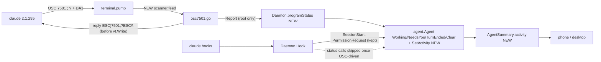

# OSC 7501 Agent Status Implementation Plan

> **For Claude:** REQUIRED SUB-SKILL: Use /implement to execute this plan task-by-task.

**Goal:** Take a Claude agent's status from its OSC 7501 reports, with hooks kept for binding and phone permission asks.

**Toolset:** one test: `cd packages/pocketd && go test -race -count=1 ./internal/terminal -run TestName`. Package: `go vet ./... && go test -race -count=1 ./...` from `packages/pocketd`. Protocol: `pnpm --filter @pocket/protocol test`. Desktop: from `packages/desktop`, `cargo build --workspace && cargo clippy --workspace --all-targets && cargo test --workspace`. Full gate: `scripts/check.sh`.

**Read first:**
- `packages/pocketd/internal/terminal/terminal.go:157,271-314`: `vt.New(..., s.replyToQuery)` and the `pump` loop you will hook into.
- `packages/pocketd/internal/daemon/daemon.go:159-203`: `Hook`, the status calls to gate.
- `packages/pocketd/internal/daemon/claude.go:60-77` (`Input`, the Esc heuristic) and `presence.go:87-119` (`attach`, the 5s untrusted timer).
- `packages/pocketd/internal/agent/agent.go:282-310`: the status machine (`Working`, `NeedsYou`, `TurnEnded`, `Clear`).
- Spec: https://www.superlogical.com/rex/docs/build/program-status (draft rev 0.3).
- Evidence: `/tmp/osc7501-spike/run{1..5}.jsonl`, the real bytes Claude 2.1.295 sent (outside the repo; may be gone).

---

## Architecture



`terminal` scans each PTY chunk for OSC 7501, answers the support query, and hands root reports to the daemon. The daemon maps a report onto the existing `Agent` calls (`Working`, `NeedsYou`, `TurnEnded`, `Clear`). The first report from a claude makes that claude OSC-driven, so its hook status calls and the Esc heuristic are skipped. A claude that never reports behaves as today.

## Why this approach

- **OSC drives status, hooks bind and broker.** Hooks can't answer the phone's permission ask, and `SessionStart` carries the session id and transcript. Rejected: both drive status (they can disagree, and the Esc heuristic and trust banner never go). Rejected: OSC only (Claude older than 2.1.295 would lose status).
- **A claude becomes OSC-driven on its first report**, not by version sniffing. Old Claude never reports, so it keeps the hook path.
- **Scan in `terminal`, before `vt.Write`.** The 7501 reply must reach the PTY before libghostty's DA1 reply, or Claude marks the protocol unsupported. The pinned ghostty (`4ae9f1a`) may not parse 7501, so we don't depend on it.
- **Keep the banner**, now only for a claude with neither a hook nor a report after 5s. Whether OSC works in untrusted folders is unverified.
- **Carry `msg` as `activity`** on the summary (wire only; no UI yet). No new cap: the field is additive and optional.

## Tasks at a glance

| PR | Task | What | Main files | Risk |
|---|---|---|---|---|
| 1: Scan and answer OSC 7501 (inert) | 1.1 | Stateful scanner and parser | `terminal/osc7501.go` | Medium: chunk splits |
| | 1.2 | Reply to the query, deliver reports | `terminal/terminal.go` | Medium: reply order, locking |
| 2: Claude status from reports | 2.1 | `programStatus` mapping | `daemon/claude.go`, `presence.go` | Medium |
| | 2.2 | Gate hook status calls | `daemon/daemon.go` | Low |
| | 2.3 | Gate Esc heuristic; attached on first report | `daemon/claude.go`, `presence.go` | Low |
| | 2.4 | Replay a report that beat the poller | `terminal.go`, `presence.go` | Low |
| 3: `activity` on the wire | 3.1 | Agent field and Go proto | `agent/agent.go`, `proto/proto.go` | Low |
| | 3.2 | TS schema and Rust `Summary` | `protocol/src/timeline.ts`, `agents/src/agents.rs` | Low |
| | 3.3 | Glossary | `CONTEXT.md` | Low |

---

## PR 1: Scan and answer OSC 7501

**Scope:** parser, query reply and report delivery. Inert: nothing consumes reports yet, but it does answer the query, so Claude starts reporting.
**Depends on:** nothing.
**Done when:** `go test -race ./internal/terminal` is green, including the new tests.

### Task 1.1: Scanner

**What & why:** one place that turns raw PTY bytes into reports, including sequences split across reads.

**Files:**
- Create: `packages/pocketd/internal/terminal/osc7501.go`
- Test: `packages/pocketd/internal/terminal/osc7501_test.go`

**Context:** body is `key=value` pairs joined by `:`. `msg` is base64 (padding optional) and must decode to text with no control characters. The terminator is BEL or `ESC \`. A report with an unknown `state` is ignored. Records with an `id` belong to sub-programs; we only act on the root record. Limit: 4096 bytes per sequence. Real bytes from the spike: `state=blocked:app=claude-code:kind=permission:msg=YXBwcm92ZSBCYXNo...`.

**Step 1: Write the failing test**
```go
package terminal

import "testing"

func TestScannerReadsTheRootReportsInAChunk(t *testing.T) {
	var s scanner
	got, query := s.feed([]byte("x\x1b]7501;state=working:app=claude-code\x1b\\y\x1b]7501;state=blocked:kind=permission:msg=aGk=\x07"))
	want := []Report{{State: "working", App: "claude-code"}, {State: "blocked", Kind: "permission", Msg: "hi"}}
	if query || len(got) != 2 || got[0] != want[0] || got[1] != want[1] {
		t.Fatalf("got %+v query=%v", got, query)
	}
}

func TestScannerJoinsASequenceSplitAcrossReads(t *testing.T) {
	var s scanner
	for _, part := range []string{"\x1b]75", "01;state=do", "ne:app=x\x1b", "\\"} {
		got, _ := s.feed([]byte(part))
		if part == "\\" && (len(got) != 1 || got[0].State != "done") {
			t.Fatalf("got %+v", got)
		}
	}
}

func TestScannerSeesTheSupportQuery(t *testing.T) {
	var s scanner
	if got, query := s.feed([]byte("\x1b]7501;?\x1b\\\x1b[c")); !query || len(got) != 0 {
		t.Fatalf("got %+v query=%v", got, query)
	}
}

func TestScannerDropsWhatTheSpecRejects(t *testing.T) {
	var s scanner
	for _, bad := range []string{
		"state=nap",               // unknown state
		"app=x",                   // no state
		"state=done:msg=!!!",      // bad base64
		"state=done:msg=Z29vZAo=", // decodes to "good\n": control character
		"state=working:id=sub/1",  // not the root record
	} {
		if got, _ := s.feed([]byte("\x1b]7501;" + bad + "\x07")); len(got) != 0 {
			t.Errorf("%q gave %+v", bad, got)
		}
	}
}

func TestScannerRecoversAfterATruncatedSequence(t *testing.T) {
	var s scanner
	got, _ := s.feed([]byte("\x1b]7501;state=wo\x1b]7501;state=idle\x07"))
	if len(got) != 1 || got[0].State != "idle" {
		t.Fatalf("got %+v", got)
	}
}
```

**Step 2:** Run `cd packages/pocketd && go test ./internal/terminal -run TestScanner`
Expected: FAIL with `undefined: scanner`.

**Step 3: Implementation** (`osc7501.go`)
```go
package terminal

import (
	"bytes"
	"encoding/base64"
	"strings"
	"unicode"
)

// Report is one root record of the Program Status Protocol (OSC 7501).
type Report struct {
	State string // idle, working, blocked, done, error or clear
	Kind  string // permission, question or auth, with blocked
	App   string
	Msg   string
}

var oscStart = []byte("\x1b]7501;")

const maxSequence = 4096

var states = map[string]bool{"idle": true, "working": true, "blocked": true, "done": true, "error": true, "clear": true}

// scanner finds OSC 7501 sequences in a byte stream that may split them anywhere.
type scanner struct{ partial []byte }

// feed returns the root reports in b, and whether b held the support query.
func (s *scanner) feed(b []byte) (reports []Report, query bool) {
	data := append(s.partial, b...)
	s.partial = nil
	for {
		i := bytes.Index(data, oscStart)
		if i < 0 {
			s.partial = splitPrefix(data)
			return
		}
		rest := data[i+len(oscStart):]
		end, size := terminator(rest)
		switch {
		case end == incomplete:
			if len(rest) <= maxSequence {
				s.partial = append(append([]byte(nil), oscStart...), rest...)
			}
			return
		case end == malformed:
			data = rest[len(rest)-size:]
		default:
			body := rest[:end]
			data = rest[end+size:]
			if string(body) == "?" {
				query = true
			} else if r, ok := parse(body); ok {
				reports = append(reports, r)
			}
		}
	}
}

const (
	incomplete = -1
	malformed  = -2
)

// terminator finds BEL or ESC \ . A lone ESC aborts the sequence: malformed,
// and size is how much of b is left, starting at that ESC.
func terminator(b []byte) (end, size int) {
	for i, c := range b {
		switch {
		case c == 0x07:
			return i, 1
		case c == 0x1b && i+1 == len(b):
			return incomplete, 0
		case c == 0x1b && b[i+1] == '\\':
			return i, 2
		case c == 0x1b:
			return malformed, len(b) - i
		}
	}
	return incomplete, 0
}

// splitPrefix keeps the tail of data that could be the start of oscStart.
func splitPrefix(data []byte) []byte {
	for n := min(len(oscStart)-1, len(data)); n > 0; n-- {
		if bytes.HasPrefix(oscStart, data[len(data)-n:]) {
			return append([]byte(nil), data[len(data)-n:]...)
		}
	}
	return nil
}

func parse(body []byte) (Report, bool) {
	var r Report
	var id string
	for _, pair := range strings.Split(string(body), ":") {
		k, v, ok := strings.Cut(pair, "=")
		if !ok {
			continue
		}
		switch k {
		case "state":
			r.State = v
		case "kind":
			r.Kind = v
		case "app":
			r.App = v
		case "id":
			id = v
		case "msg":
			raw, err := base64.RawStdEncoding.DecodeString(strings.TrimRight(v, "="))
			if err != nil || len(raw) > 2048 || strings.ContainsFunc(string(raw), unicode.IsControl) {
				return Report{}, false
			}
			r.Msg = string(raw)
		}
	}
	return r, states[r.State] && id == ""
}
```
Note on the malformed case: `data = rest[len(rest)-size:]` resumes the scan at the aborting ESC.

**Step 4:** Run the same command.
Expected: PASS.

### Task 1.2: Answer the query, deliver reports

**What & why:** wire the scanner into `pump`. The reply is written before `vt.Write`, so it precedes libghostty's DA1 reply. Reports are delivered after `s.mu` is released, because the daemon calls back into terminals.

**Files:**
- Modify: `packages/pocketd/internal/terminal/terminal.go` (`Terminal` struct ~63, `Manager` ~79, `Spawn` ~148, `Adopt` ~193, `pump` ~282)
- Test: `packages/pocketd/internal/terminal/terminal_test.go`

**Context:** `replyToQuery` already refuses to write while a `pocketd run` tty is attached (the real terminal answers). The 7501 reply follows that rule; the real terminal then decides, and a terminal that ignores 7501 just leaves Claude on hooks. `Manager.OnInput` is the precedent for a callback copied into each Terminal.

**Step 1: Write the failing tests** (read the helpers at the top of `terminal_test.go` for output collection, and reuse them)
```go
func TestAnswersTheSupportQueryOnThePty(t *testing.T) {
	m := NewManager()
	term, err := m.Spawn(Spec{Cmd: "sh", Args: []string{"-c", `stty raw -echo; printf '\033]7501;?\033\\'; head -c 10`}, Env: []string{"PATH=/bin:/usr/bin"}})
	if err != nil {
		t.Fatal(err)
	}
	t.Cleanup(term.Close)
	// head echoes the reply back as output after the query sh printed itself.
	out := collectUntil(t, term, strings.Count, "\x1b]7501;?\x1b\\", 2)
	_ = out
}

func TestDeliversRootReportsInOrder(t *testing.T) {
	m := NewManager()
	got := make(chan Report, 4)
	m.OnReport = func(id string, r Report) { got <- r }
	term, err := m.Spawn(Spec{Cmd: "sh", Args: []string{"-c", `printf '\033]7501;state=working\033\\\033]7501;state=done\033\\'; sleep 1`}, Env: []string{"PATH=/bin:/usr/bin"}})
	if err != nil {
		t.Fatal(err)
	}
	t.Cleanup(term.Close)
	for _, want := range []string{"working", "done"} {
		select {
		case r := <-got:
			if r.State != want {
				t.Fatalf("got %q, want %q", r.State, want)
			}
		case <-time.After(3 * time.Second):
			t.Fatalf("no %q report", want)
		}
	}
}
```
`collectUntil` stands for whatever output-collecting helper `terminal_test.go` already has; the first test asserts the query string shows up twice in the output (once printed, once echoed back from the reply). Adapt it to the real helper and keep the assertion.

**Step 2:** Run `go test ./internal/terminal -run 'TestAnswers|TestDelivers'`
Expected: FAIL with `m.OnReport undefined`.

**Step 3: Implementation**
```go
// Terminal gains:
	osc    scanner
	report func(id string, r Report) // set from Manager.OnReport
// Manager gains, beside OnInput:
	OnReport func(id string, r Report) // each root OSC 7501 report, in order, outside the terminal's lock

// In Spawn and Adopt, where `input: m.OnInput` is set:
	report: m.OnReport,

// pump, replacing the `if n > 0` block:
		if n > 0 {
			chunk := append([]byte(nil), buf[:n]...)
			s.mu.Lock()
			reports, query := s.osc.feed(chunk)
			if query {
				s.replyToQuery([]byte("\x1b]7501;?\x1b\\"))
			}
			s.vt.Write(chunk)
			s.broadcast(Event{Kind: "output", Data: chunk})
			s.mu.Unlock()
			if s.report != nil {
				for _, r := range reports {
					s.report(s.info.ID, r)
				}
			}
		}
```
`s.info.ID` never changes, so reading it after unlock is safe. Keep the existing `pump` code for anything not shown (read errors, exit); only the `n > 0` block changes.

**Step 4:** Run the same command.
Expected: PASS. Then `go vet ./... && go test -race -count=1 ./...`
Expected: PASS.

---

## PR 2: Claude status from reports

**Scope:** the daemon turns reports into status and stops the hook status path for a reporting claude. Codex is untouched.
**Depends on:** PR 1.
**Done when:** `go test -race ./internal/daemon` is green; a claude that never reports passes all existing tests unchanged.

### Task 2.1: `programStatus`

**What & why:** the one mapping from report to status. It lives on the daemon because it needs the presence.

**Files:**
- Modify: `packages/pocketd/internal/daemon/claude.go` (add `programStatus`), `presence.go` (add `reported bool` beside `hooked`)
- Modify: where the Daemon is wired to the Manager (grep `Terminals.OnInput = d.Input`, in `cmd/pocketd`), to add `d.Terminals.OnReport = d.programStatus` next to it, and the same line in every test helper that sets `OnInput` (e.g. `newDaemon`)
- Test: `packages/pocketd/internal/daemon/claude_test.go`

**Context:** mapping (from the spike): `working`→`Working`; `blocked`→`NeedsYou`; `done`→`TurnEnded(false)`; `error`→`TurnEnded(true)`; `idle` and `clear`→`Clear` (Esc gives `idle`, so an interrupt is not Done). `working` goes through `pr.working("")`, so an open phone ask keeps Needs you. Reuse the `claudeIn`, `agentIn` and `newDaemon` helpers; `d.presentIn(id)` returns the presence in a terminal.

**Step 1: Write the failing tests**
```go
func report(d *Daemon, pr *presence, state string) {
	d.programStatus(pr.t.Info().ID, terminal.Report{State: state, App: "claude-code"})
}

func statusOf(d *Daemon, term *terminal.Terminal) string { a, _ := agentIn(d, term); return a.Status }

func TestReportsDriveTheClaudeStatus(t *testing.T) {
	d := newDaemon(t)
	term, pr := claudeIn(t, d)
	for _, c := range []struct{ state, want string }{{"working", "working"}, {"blocked", "needsYou"}, {"working", "working"}, {"done", "done"}, {"working", "working"}, {"idle", "idle"}} {
		report(d, pr, c.state)
		if got := statusOf(d, term); got != c.want {
			t.Fatalf("after %s: %s, want %s", c.state, got, c.want)
		}
	}
}

func TestAnErrorReportEndsFailed(t *testing.T) {
	d := newDaemon(t)
	term, pr := claudeIn(t, d)
	report(d, pr, "working")
	report(d, pr, "error")
	if a, _ := agentIn(d, term); a.Status != "done" || !a.Failed {
		t.Fatalf("agent = %+v", a)
	}
}

func TestAWorkingReportDoesNotHideAnOpenPhoneAsk(t *testing.T) {
	d := newDaemon(t)
	term, pr := claudeIn(t, d)
	pr.mu.Lock()
	pr.asks["k"] = 1
	pr.mu.Unlock()
	pr.a.NeedsYou()
	report(d, pr, "working")
	if got := statusOf(d, term); got != "needsYou" {
		t.Fatalf("status = %s", got)
	}
}

func TestAReportInAnyOtherProcessIsIgnored(t *testing.T) {
	d := newDaemon(t)
	term := shell(t, d)
	d.programStatus(term.Info().ID, terminal.Report{State: "working"})
	if _, ok := agentIn(d, term); ok {
		t.Fatal("a shell got an agent")
	}
}
```
If `report` or `statusOf` collide with an existing name in the package, rename them.

**Step 2:** Run `go test ./internal/daemon -run 'TestReports|TestAnError|TestAWorking|TestAReport'`
Expected: FAIL with `d.programStatus undefined`.

**Step 3: Implementation** (`claude.go`)
```go
// programStatus takes one OSC 7501 report from terminal id. The first one
// makes the claude there report-driven: its status no longer comes from hooks.
func (d *Daemon) programStatus(id string, r terminal.Report) {
	pr := d.presentIn(id)
	if pr == nil || pr.provider != "claude" {
		return
	}
	pr.mu.Lock()
	pr.reported = true
	pr.mu.Unlock()
	pr.a.SetAttached(true)
	switch r.State {
	case "working":
		pr.working("")
	case "blocked":
		pr.a.NeedsYou()
	case "done":
		d.turnEnded(pr, false)
	case "error":
		d.turnEnded(pr, true)
	case "idle", "clear":
		pr.a.Clear()
	}
}
```
Add `reported bool // an OSC 7501 report came: status is theirs, not the hooks'` to `presence`, and import `pocketd/internal/terminal` in `claude.go` if it is not already.

**Step 4:** Run the same command.
Expected: PASS.

### Task 2.2: Stop hook status calls for a reporting claude

**What & why:** hooks keep binding and brokering; their status calls would race with the reports.

**Files:**
- Modify: `packages/pocketd/internal/daemon/daemon.go:183-201`
- Test: `claude_test.go`

**Context:** keep `SessionStart`, `PermissionRequest` (its `NeedsYou`/`Working`/`Clear` calls inside `d.permission` stay: the phone ask is not a report) and `PreCompact`. Skip `UserPromptSubmit`, `PostToolUse*`, `PermissionDenied`, `PreToolUse`, `Notification`, `Stop` and `StopFailure`.

**Step 1: Write the failing test**
```go
func TestHooksStopDrivingStatusOnceTheClaudeReports(t *testing.T) {
	d := newDaemon(t)
	term, pr := claudeIn(t, d)
	hookFrom(d, pr, `{"hook_event_name":"UserPromptSubmit"}`)
	if got := statusOf(d, term); got != "working" {
		t.Fatalf("before a report: %s", got)
	}
	report(d, pr, "idle")
	hookFrom(d, pr, `{"hook_event_name":"UserPromptSubmit"}`)
	hookFrom(d, pr, `{"hook_event_name":"Stop"}`)
	if got := statusOf(d, term); got != "idle" {
		t.Fatalf("after a report: %s (a Stop hook must not make it Done)", got)
	}
}
```

**Step 2:** Run `go test ./internal/daemon -run TestHooksStopDriving`
Expected: FAIL with status `done`.

**Step 3: Implementation**: in `Hook`, replace the `switch in.Event` block and its trailing `return nil, nil`:
```go
	pr.mu.Lock()
	reported := pr.reported
	pr.mu.Unlock()
	switch in.Event {
	case "SessionStart":
		d.sessionStart(pr, in)
		d.resumed(pr, in.SessionID)
	case "PermissionRequest":
		return d.permission(ctx, pr, in), nil
	case "PreCompact":
		pr.a.SetCompacting()
	}
	if reported {
		return nil, nil
	}
	switch in.Event {
	case "UserPromptSubmit":
		pr.working("")
	case "PostToolUse", "PostToolUseFailure", "PermissionDenied":
		pr.working(permissionKey(pr.a.ID(), in.ToolName, in.ToolInput))
	case "PreToolUse", "Notification":
		pr.a.NeedsYou()
	case "Stop":
		d.turnEnded(pr, false)
	case "StopFailure":
		d.turnEnded(pr, true)
	}
	return nil, nil
```

**Step 4:** Run `go test -race ./internal/daemon`
Expected: PASS, including every existing hook test.

### Task 2.3: Esc heuristic and the trust timer

**What & why:** an interrupt now arrives as `idle`, so the Esc clear is redundant for a reporting claude. A first report also counts as attached, so the banner shows only for a claude with no hook and no report.

**Files:**
- Modify: `packages/pocketd/internal/daemon/claude.go:49-66` (`Input`), `presence.go:108-118` (`attach`)
- Test: `claude_test.go`

**Step 1: Write the failing tests**
```go
func TestEscDoesNotClearAReportingClaude(t *testing.T) {
	d := newDaemon(t)
	term, pr := claudeIn(t, d)
	report(d, pr, "working")
	d.Input(term.Info().ID, []byte("\x1b"))
	if got := statusOf(d, term); got != "working" {
		t.Fatalf("status = %s; the idle report clears it, not the key", got)
	}
}

func TestAReportKeepsAClaudeAttachedWithoutAHook(t *testing.T) {
	old := ClaudeAttachWait
	ClaudeAttachWait = 50 * time.Millisecond
	defer func() { ClaudeAttachWait = old }()
	d := newDaemon(t)
	term, pr := claudeIn(t, d)
	report(d, pr, "idle")
	time.Sleep(200 * time.Millisecond)
	if a, _ := agentIn(d, term); !a.Attached {
		t.Fatal("a reporting claude was marked not attached")
	}
}
```
If `claudeIn` starts `attach` before `ClaudeAttachWait` is changed, start the claude after setting it, following how existing tests exercise the 5s timer (grep `ClaudeAttachWait` in `*_test.go`).

**Step 2:** Run `go test ./internal/daemon -run 'TestEscDoesNot|TestAReportKeeps'`
Expected: FAIL on both.

**Step 3: Implementation**
```go
// Input: the claude case becomes
		if pr := d.presentIn(id); pr != nil && pr.provider == "claude" && !pr.isReported() {
			pr.a.Clear()
		}
// presence.go
func (pr *presence) isReported() bool {
	pr.mu.Lock()
	defer pr.mu.Unlock()
	return pr.reported
}
// attach, in the timer: `if !pr.hooked && !pr.reported {`
```

**Step 4:** Run `go test -race ./internal/daemon`
Expected: PASS.

### Task 2.4: A report that beat the poller

**What & why:** Claude sends `idle` about 0.7s after launch, before the poller finds it, and a quick `working` could land too. Remember the latest report per terminal and replay it when the agent starts.

**Files:**
- Modify: `terminal.go` (field `last *Report`, method `Program()`; set in `pump` under `s.mu`, cleared on `clear`), `presence.go` (`startAgent`, after `d.present[info.ID] = pr`)
- Test: `terminal_test.go`, `claude_test.go`

**Step 1: Write the failing tests**
```go
// terminal_test.go
func TestRemembersTheLatestReport(t *testing.T) { /* spawn printf working then done, wait for OnReport twice, Program() == done; then a `clear` report empties it */ }

// claude_test.go
func TestAClaudeStartsInTheStateItAlreadyReported(t *testing.T) { /* fakeAgent that prints state=working before the poller finds it; agent status is working once present */ }
```
Write both with the same `printf` pattern as Task 1.2. The second needs the fake claude from `fakeAgent` to print the sequence on start; extend that helper's script if it has no hook for output.

**Step 2:** Run `go test ./internal/terminal -run TestRemembers` and `go test ./internal/daemon -run TestAClaudeStarts`
Expected: FAIL (`Program undefined`; status stays idle).

**Step 3: Implementation**
```go
// terminal.go, in pump under s.mu, with the scan:
	for _, r := range reports {
		if r.State == "clear" {
			s.last = nil
		} else {
			s.last = &r
		}
	}
// accessor:
// Program is the latest OSC 7501 report, nil before one or after a clear.
func (s *Terminal) Program() *Report {
	s.mu.Lock()
	defer s.mu.Unlock()
	return s.last
}
// presence.go, end of startAgent, after the present map is set:
	if r := t.Program(); r != nil && provider == "claude" {
		d.programStatus(info.ID, *r)
	}
```
`go.mod` is `go 1.27.1`, so `&r` in the loop is a fresh variable per iteration.

**Step 4:** Run `go vet ./... && go test -race -count=1 ./...`
Expected: PASS.

---

## PR 3: `activity` on the wire

**Scope:** Claude's `msg` reaches every client as `activity`. No UI shows it yet.
**Depends on:** PR 2.
**Done when:** `go test -race ./...`, `pnpm --filter @pocket/protocol test` and `cargo test --workspace` are green.

### Task 3.1: Agent field and Go proto

**What & why:** carry the decoded `msg` from the report to the summary.

**Files:**
- Modify: `packages/pocketd/internal/agent/agent.go` (struct ~line 59, `summary()` ~line 224, add `SetActivity`), `packages/pocketd/internal/proto/proto.go:204`, `packages/pocketd/internal/daemon/claude.go` (`programStatus`)
- Test: `agent/agent_test.go`, `daemon/claude_test.go`

**Step 1: Write the failing tests**
```go
// agent_test.go (copy the setup of the nearest existing test for the registry and hub)
func TestActivityShowsOnTheSummaryAndClearsWithAnEmptyOne(t *testing.T) { /* SetActivity("Removing file"); Summary().Activity == it; SetActivity(""); == "" */ }

// claude_test.go
func TestEachReportReplacesTheActivity(t *testing.T) {
	d := newDaemon(t)
	term, pr := claudeIn(t, d)
	d.programStatus(pr.t.Info().ID, terminal.Report{State: "working", Msg: "Removing marker file"})
	if a, _ := agentIn(d, term); a.Activity != "Removing marker file" {
		t.Fatalf("activity = %q", a.Activity)
	}
	report(d, pr, "done")
	if a, _ := agentIn(d, term); a.Activity != "" {
		t.Fatalf("activity = %q, want cleared: a report replaces its record", a.Activity)
	}
}
```

**Step 2:** Run `go test ./internal/agent ./internal/daemon -run 'TestActivity|TestEachReport'`
Expected: FAIL with `SetActivity`/`Activity` undefined.

**Step 3: Implementation**
```go
// agent.go: field `activity string // the provider's live line; each report replaces it`
func (a *Agent) SetActivity(text string) { a.update(false, func() { a.activity = text }) }
// summary(): add Activity: a.activity,
// proto.go: Activity string `json:"activity,omitempty"`
// programStatus, before the switch: pr.a.SetActivity(r.Msg)
```
`summary()` is compared with `==` in `update`, so `activity` must stay a comparable type (a string is).

**Step 4:** Run `go test -race ./internal/agent ./internal/daemon ./internal/proto`
Expected: PASS.

### Task 3.2: TS schema and Rust `Summary`

**What & why:** keep the three wire definitions in step so no client rejects or drops the field.

**Files:**
- Modify: `packages/protocol/src/timeline.ts:108` (add `activity: Schema.optional(Schema.String),` after `origin`), `packages/desktop/crates/agents/src/agents.rs:18` (`Summary`: `#[serde(default)] pub activity: String,`, matching how neighbouring fields declare serde defaults)
- Test: `packages/protocol/test/golden.test.mjs`, and a decode test in `agents.rs`'s `mod tests`

**Step 1:** Read `golden.test.mjs` and add `activity` to the summary case next to `contextWindow`/`origin`, asserting it round-trips and that its absence still decodes. In Rust, add `an_agent_summary_without_activity_reads_it_as_empty` (decode a JSON summary with no `activity`; assert `""`).

**Step 2:** Run `pnpm --filter @pocket/protocol test` and `cd packages/desktop && cargo test -p agents`
Expected: FAIL (field unknown / not in the schema).

**Step 3:** Make the two edits above.

**Step 4:** Run those two, then `cd packages/desktop && cargo build --workspace && cargo clippy --workspace --all-targets`
Expected: PASS, no new clippy warnings. No desktop view reads `activity` yet, and no view change means no capture is needed.

### Task 3.3: Glossary

**What & why:** `CONTEXT.md` defines "attached" by hooks only; it now has a second source.

**Files:** Modify `CONTEXT.md` (the *attached* entry at line 32 and the Status entries).

Add one sentence under "attached": "A claude is also attached when it reports through OSC 7501 (Program Status Protocol)". Add a **Program status** entry: "What an agent says about itself on its terminal: idle, working, blocked, done, error. Claude 2.1.295 and later send it once pocketd answers its query; it drives that claude's status instead of the hooks." No test. Run `scripts/check.sh` once at the end of PR 3 as the final gate.

---

## Open items the plan doesn't close

- **Untrusted folders and `/compact`:** not verified in the spikes. Compaction keeps its hook handling (`PreCompact`/`Compacted`); revisit once a spike shows what Claude reports during `/compact`.
- **After a pocketd hot-swap**, a running claude is hook-driven until its next report. Task 2.4 replays only reports the new image has seen.
- **Spec drift (rev 0.3):** the scanner ignores unknown keys and states, so a newer Claude should degrade to hooks.
